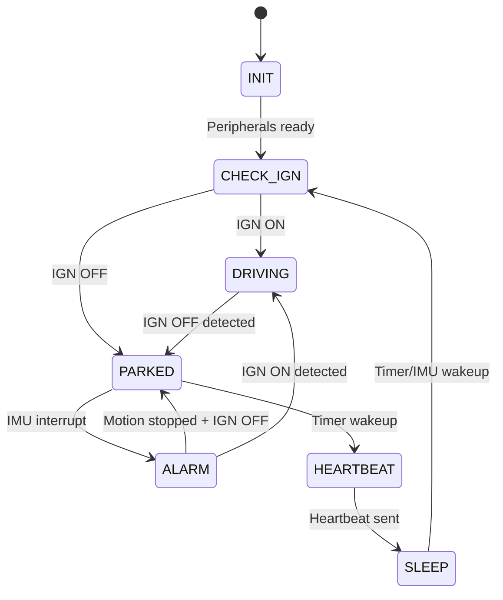

# Kế Hoạch Phát Triển Firmware — IoT Vehicle Tracker

> **Platform:** ESP-IDF v5.4.x | **MCU:** ESP32-S3 | **Ngôn ngữ:** C
> **Tham chiếu:** [esp32-obd2-meter](file:///E:/1.%20Phenikaa%20University/AML/0.%20Project/12.%20DATN/IoT_Vehicle_Tracking_System/example/esp32-obd2-meter) — đã deep read toàn bộ ([walkthrough](file:///C:/Users/anmh1/.gemini/antigravity/brain/183be6b3-1c3d-4971-bab7-3fc446f37b95/walkthrough.md))
> **Backend:** `Tracking_MqttBridge` (TypeScript) + `Tracking_Backend` (DDD) + EMQX broker

---

## 1. Tổng Quan

Firmware điều khiển thiết bị tracker lắp trên xe:

| Chức năng | Phần cứng | Giao tiếp |
|-----------|-----------|-----------|
| Đọc OBD2 (IGN, RPM, tốc độ, nhiên liệu, nhiệt độ) | vgate iCar Pro | BLE (NimBLE) |
| Định vị GPS + kết nối 4G | SIMCom A7600CE-T | UART AT commands |
| Phát hiện rung/chuyển động | LIS3DH IMU | I2C |
| Quản lý nguồn | Power MUX, IP2312, LVD | GPIO + ADC |
| Gửi telemetry | EMQX broker | MQTT over PPP |

**State machine:** `INIT → CHECK_IGN → DRIVING / PARKED / ALARM / HEARTBEAT → SLEEP`

---

## 2. Kiến Trúc Firmware

```
┌─────────────────────────────────────────────────┐
│  Layer 4 — Communication                        │
│  mqtt_client · data_formatter · command_handler  │
├─────────────────────────────────────────────────┤
│  Layer 3 — Application                          │
│  state_machine · alert_engine · data_aggregator  │
├─────────────────────────────────────────────────┤
│  Layer 2 — Power Management                     │
│  power_mgr · sleep_manager                       │
├─────────────────────────────────────────────────┤
│  Layer 1 — Hardware Abstraction (Drivers)       │
│  ble_obd · modem_at · imu_lis3dh · adc · gpio   │
└─────────────────────────────────────────────────┘
```

---

## 3. Cấu Trúc Project

```
firmware/
├── CMakeLists.txt
├── sdkconfig.defaults
├── partitions.csv              # OTA-ready (factory + ota_0 + ota_1)
│
├── main/
│   ├── CMakeLists.txt
│   ├── Kconfig.projbuild
│   ├── main.c
│   │
│   ├── inc/
│   │   ├── app_config.h        # config_t struct + NVS
│   │   ├── app_state.h         # State machine enums
│   │   ├── pin_map.h           # GPIO definitions
│   │   ├── util.h              # ESP_NULL_CHECK, ARRAY_SIZE
│   │   │
│   │   ├── ble_init.h          # BLE stack init
│   │   ├── ble_mgr.h           # BLE manager (NimBLE wrapper)
│   │   ├── ble_obd.h           # BLE OBD2 protocol
│   │   ├── ble_util.h          # BLE address helper
│   │   ├── obd.h               # PID config types
│   │   │
│   │   ├── modem_at.h          # AT command engine
│   │   ├── modem_lte.h         # 4G/LTE control
│   │   ├── modem_gnss.h        # GNSS control
│   │   │
│   │   ├── imu_lis3dh.h        # IMU driver
│   │   ├── power_mgr.h         # Power management
│   │   ├── adc_reader.h        # ADC (U_batt)
│   │   │
│   │   ├── mqtt_client.h       # MQTT publish/subscribe
│   │   ├── data_formatter.h    # JSON payload builder
│   │   ├── command_handler.h   # Server command processor
│   │   └── nvs_config.h        # NVS config
│   │
│   └── src/                    # Tương ứng với mỗi header
│       ├── ble_init.c          # ← Copy từ reference (84 LOC)
│       ├── ble_mgr.c           # ← Adapt từ reference (648 LOC)
│       ├── ble_obd.c           # ← Adapt từ reference (289 LOC)
│       ├── ble_util.c          # ← Copy từ reference (25 LOC)
│       ├── modem_at.c          # Viết mới
│       ├── modem_lte.c         # Viết mới
│       ├── modem_gnss.c        # Viết mới
│       ├── imu_lis3dh.c        # Viết mới
│       ├── power_mgr.c         # Viết mới
│       ├── adc_reader.c        # Viết mới
│       ├── mqtt_client.c       # Viết mới (ESP-IDF component)
│       ├── data_formatter.c    # Viết mới
│       ├── command_handler.c   # Viết mới
│       ├── state_machine.c     # Viết mới
│       ├── nvs_config.c        # ← Adapt từ reference (100 LOC)
│       └── util.c              # Viết mới
│
└── components/                 # 3rd-party (nếu cần)
```

---

## 4. GPIO Pin Map

| GPIO | Tên | Hướng | Mô tả |
|------|-----|-------|--------|
| 2 | `IGN_IN` | Input | IGN GPIO fallback |
| 4 | `U_BATT_ADC` | Input | ADC đo ắc quy |
| 5 | `CHARGER_EN` | Output | Enable sạc IP2312 |
| 16 | `MODEM_TX` | Output | UART TX → modem |
| 17 | `MODEM_RX` | Input | UART RX ← modem |
| 18 | `POWER_MUX_SEL` | Output | Chọn nguồn |
| 19 | `LVD_STATUS` | Input | LVD output |
| 21 | `LIS3DH_INT` | Input | IMU interrupt (wakeup) |
| 22 | `LIS3DH_SDA` | I/O | I2C data |
| 23 | `LIS3DH_SCL` | I/O | I2C clock |
| 25 | `MODEM_PWRKEY` | Output | Modem power key |

---

## 5. Giai Đoạn Phát Triển

### Phase 0 — Project Skeleton (Tuần 1)

**Deliverables:**

| # | Task | Output |
|---|------|--------|
| 0.1 | Cài ESP-IDF v5.4.x | Toolchain ready |
| 0.2 | Khởi tạo project | CMakeLists.txt + sdkconfig.defaults + partitions.csv |
| 0.3 | Blink test | Flash + monitor OK trên board |
| 0.4 | `pin_map.h` | GPIO mapping theo bảng trên |
| 0.5 | `app_config.h` + `nvs_config.c` | Config struct + NVS read/write |
| 0.6 | `util.h` + `util.c` | Macros: `ESP_RETURN_ON_NULL`, `ARRAY_SIZE` |

**sdkconfig.defaults:**

```ini
# BLE (NimBLE only, central role)
CONFIG_BT_ENABLED=y
CONFIG_BT_NIMBLE_ENABLED=y
CONFIG_BT_NIMBLE_MAX_CONNECTIONS=1
CONFIG_BT_NIMBLE_ROLE_CENTRAL=y
CONFIG_BT_NIMBLE_ROLE_PERIPHERAL=n
CONFIG_BT_NIMBLE_ROLE_BROADCASTER=n
CONFIG_BT_NIMBLE_ROLE_OBSERVER=y

# UART (console trên UART0, modem trên UART1)
CONFIG_ESP_CONSOLE_UART_NUM=0

# Power Management
CONFIG_PM_ENABLE=y
CONFIG_FREERTOS_USE_TICKLESS_IDLE=y

# Partition (OTA-ready)
CONFIG_PARTITION_TABLE_CUSTOM=y
CONFIG_PARTITION_TABLE_CUSTOM_FILENAME="partitions.csv"
```

**Config struct (NVS):**

```c
typedef struct {
    char     device_id[32];
    char     auth_token[64];
    char     mqtt_host[64];
    uint16_t mqtt_port;             // default: 1883
    char     mqtt_username[32];
    char     mqtt_password[64];
    uint16_t heartbeat_interval_s;  // default: 900
    uint16_t tracking_interval_s;   // default: 10
    char     obd2_ble_address[18];  // "AA:BB:CC:DD:EE:FF"
    float    lvd_threshold_v;       // default: 12.0
    float    lvd_hysteresis_v;      // default: 12.2
} config_t;
```

---

### Phase 1 — Hardware Drivers (Tuần 2–3)

#### 1.1 ADC Reader

| Item | Chi tiết |
|------|----------|
| Driver | ESP-IDF ADC oneshot |
| Pin | GPIO4 (`U_BATT_ADC`) qua voltage divider |
| Calibration | efuse hoặc manual |
| API | `float adc_read_battery_voltage(void)` |

#### 1.2 IMU LIS3DH

| Item | Chi tiết |
|------|----------|
| Bus | I2C (GPIO22=SDA, GPIO23=SCL) |
| Interrupt | INT1 → GPIO21 (motion wakeup) |
| Deep sleep | EXT0 wakeup source |
| API | `imu_init()`, `imu_configure_motion_interrupt()`, `imu_motion_detected()`, `imu_read_accel()` |

#### 1.3 Power Manager

| Item | Chi tiết |
|------|----------|
| Power MUX | GPIO18: chọn ắc quy (0) / pin backup (1) |
| Charger | GPIO5: enable IP2312 |
| LVD | GPIO19: đọc trạng thái low-voltage |
| Modem power | GPIO25: PWRKEY toggle |
| Logic | IGN ON + U>12V → ắc quy + charger; U<12V → backup + alert |
| Hysteresis | 12.0V ↔ 12.2V |

---

### Phase 2 — BLE OBD2 (Tuần 3–5)

> Adapt từ [esp32-obd2-meter](file:///E:/1.%20Phenikaa%20University/AML/0.%20Project/12.%20DATN/IoT_Vehicle_Tracking_System/example/esp32-obd2-meter). Chi tiết phân tích source: [walkthrough.md](file:///C:/Users/anmh1/.gemini/antigravity/brain/183be6b3-1c3d-4971-bab7-3fc446f37b95/walkthrough.md)

#### 2.1 Deliverables

| # | File | Nguồn | Thay đổi chính |
|---|------|-------|----------------|
| 2.1 | `ble_init.c/h` | Copy (84 LOC) | Thêm `ble_deinit()` cho deep sleep |
| 2.2 | `ble_util.c/h` | Copy (25 LOC) | Nguyên bản |
| 2.3 | `ble_mgr.c/h` | Adapt (648 LOC) | +MAC filter, +disconnect API, +reconnect limit, bỏ `abort()` |
| 2.4 | `ble_obd.c/h` | Adapt (289 LOC) | **+ELM327 AT init**, +disconnect API, +MAC filter |
| 2.5 | PID config | Từ `main.c` (313 LOC) | Tách thành module riêng, bỏ UI code |

#### 2.2 GATT Service Target

```
vgate iCar Pro:
  Service UUID: 0x18f0
  ├── TX: 0x2af1 (write)   — gửi lệnh
  └── RX: 0x2af0 (notify)  — nhận response
```

#### 2.3 Thay đổi so với reference (7 items)

| # | Vấn đề trong reference | Giải pháp cho tracker |
|---|------------------------|----------------------|
| 1 | **Không có ELM327 init** | Thêm `ble_obd_elm327_init()`: ATZ → ATE0 → ATL0 → ATS0 → ATSP0 |
| 2 | **Filter chấp nhận mọi device** | Filter theo NVS MAC hoặc device name "vgate" |
| 3 | **Không có disconnect API** | `ble_obd_disconnect()` → `ble_gap_terminate()` + free resources |
| 4 | **`abort()` khi NULL** | Thay bằng `ESP_RETURN_ON_ERROR` + log, không crash |
| 5 | **Static singleton** | Giữ nguyên (NimBLE limitation) |
| 6 | **Không cleanup BLE stack** | `nimble_port_stop()` + `nimble_port_deinit()` trước deep sleep |
| 7 | **Simulator có sẵn** | Dùng `sim/adv_gatt.py` cho testing không cần adapter thật |

#### 2.4 Connection Strategy

```
Wake up → Đọc MAC từ NVS/RTC
  ├── Có MAC → direct connect (1–3s)
  │            └── Fail? → full scan fallback
  ├── Không MAC → scan UUID 0x18f0 (3–10s)
  │                └── Found → lưu MAC → connect
  ├── Connected → ELM327 init → PID polling (200ms cycle)
  └── 3x fail → fallback đo U_batt cho IGN
```

**OBD2 PIDs cho tracker:**

| PID | Name | Conversion | Mục đích |
|-----|------|------------|----------|
| 0x0C | RPM | (A×256+B)/4 | Detect IGN (RPM>0) |
| 0x0D | Speed | A km/h | Telemetry |
| 0x05 | Coolant Temp | A-40 °C | Telemetry |
| 0x2F | Fuel Level | A×100/255 % | Telemetry |
| 0x04 | Engine Load | A×100/255 % | Telemetry |

---

### Phase 3 — Modem SIMCom A7600CE-T (Tuần 4–6)

#### 3.1 AT Command Engine (`modem_at.c`)

| Item | Chi tiết |
|------|----------|
| UART | GPIO16=TX, GPIO17=RX, 115200 baud |
| Pattern | Send command → wait response → parse (OK/ERROR/URC) |
| Serialize | xQueue để tránh concurrent access |
| API | `modem_at_send()`, `modem_at_send_expect()` |

#### 3.2 LTE Control (`modem_lte.c`)

| State | AT Sequence |
|-------|-------------|
| Init | AT → CPIN? → CREG? → CSQ |
| Connect | CNMP=38 → CGDCONT → CGACT=1 |
| Disconnect | CGACT=0 |
| Sleep | CSCLK=1 hoặc CFUN=0 |
| Power | GPIO25 PWRKEY toggle (1s pulse) |

API: `modem_lte_init()`, `connect()`, `disconnect()`, `sleep()`, `wakeup()`, `get_rssi()`

#### 3.3 GNSS Control (`modem_gnss.c`)

| Item | Chi tiết |
|------|----------|
| Power on | `AT+CGNSPWR=1` |
| Read | `AT+CGNSINF` → parse lat, lon, speed, course, satellites |
| Power off | `AT+CGNSPWR=0` |
| Fix timeout | 60s → fallback (gửi data không GPS) |

API: `modem_gnss_power_on()`, `power_off()`, `get_location()`, `has_fix()`

---

### Phase 4 — MQTT & Communication (Tuần 5–7)

> [!IMPORTANT]
> Firmware **PHẢI** publish đúng format mà `Tracking_MqttBridge` expect. Source of truth: `payload.types.ts` + `payload.validator.ts`

#### 4.1 MQTT Client

| Item | Chi tiết |
|------|----------|
| Library | ESP-IDF `esp_mqtt_client` |
| Transport | PPP over UART (dùng `esp_modem` component) |
| Broker | EMQX, TCP port 1883 (dev) / TLS 8883 (prod) |
| Auth | Username/password |
| Session | `clean_session=0` (persistent) |

#### 4.2 Topics & QoS

| Topic | Direction | QoS | Khi nào |
|-------|-----------|-----|---------|
| `v1/{device_id}/rawdata` | → Server | 0 | Mỗi 5–30s (DRIVING), 15–30min (HEARTBEAT) |
| `v1/{device_id}/status` | → Server | 1 | Khi chuyển DRIVING↔PARKED |
| `v1/{device_id}/events` | → Server | 1 | Lỗi, cảnh báo |
| `v1/{device_id}/firmware` | → Server | 1 | OTA progress (Phase sau) |
| `v1/{device_id}/commands` | ← Server | 1 | Remote commands |

#### 4.3 Payload Formats

**RawData** (phải có `auth_token`, bridge validate qua DB):

```json
{
  "device_id": "TRACKER_001",
  "auth_token": "device-secret-token",
  "timestamp": 1704067200000,
  "uptime": 3600,
  "data": {
    "vibration": 120,
    "battery_top": 12.5,
    "battery_bot": 3.8,
    "latitude": 21.028511,
    "longitude": 105.804817,
    "speed": 60.0,
    "course": 180.0,
    "satellites": 8,
    "ignition": true,
    "error_code": 0
  }
}
```

**Status:** `{ "device_id", "status": "running"|"stopped", "timestamp" }`

**Event:** `{ "device_id", "event_type": "error"|"warning"|"info", "code", "message", "timestamp" }`

**Validation rules (bridge reject nếu sai):**
- `device_id`, `auth_token`: string, min 1 char
- `latitude`: -90 → 90, `longitude`: -180 → 180
- `speed` ≥ 0, `course`: 0 → 360, `satellites` ≥ 0

#### 4.4 Field Mapping

| Field | Nguồn | Ghi chú |
|-------|-------|---------|
| `device_id` | NVS config | |
| `auth_token` | NVS config | Bridge validate qua DB |
| `timestamp` | GNSS time hoặc boot time | Unix ms |
| `uptime` | `esp_timer_get_time()` | ms từ boot |
| `vibration` | IMU LIS3DH | Tổng hợp gia tốc (bridge threshold = 500) |
| `battery_top` | ADC GPIO4 | Ắc quy xe (V) |
| `battery_bot` | ADC/GPIO | Pin backup (V) |
| `latitude/longitude` | GNSS `AT+CGNSINF` | |
| `speed` | GNSS (ưu tiên) hoặc OBD2 0x0D | km/h |
| `course` | GNSS | 0–360° |
| `satellites` | GNSS | |
| `ignition` | OBD2 RPM>0 (ưu tiên) hoặc U_batt>13V | boolean |
| `error_code` | App logic | 0 = OK |

#### 4.5 Command Handler

- Subscribe: `v1/{device_id}/commands`
- Commands: `update_config`, `request_location`, `enable_tracking`
- Offline buffer: lưu message vào NVS khi mất kết nối

---

### Phase 5 — State Machine & Integration (Tuần 6–8)

#### 5.1 State Machine



#### 5.2 RTC Memory (persist qua deep sleep)

```c
typedef struct {
    app_state_t last_state;
    uint32_t    boot_count;
    uint32_t    last_heartbeat_ts;
    uint8_t     ble_mac[6];         // vgate MAC cache
    bool        ign_last_known;
    float       last_battery_v;
} rtc_context_t;

RTC_DATA_ATTR static rtc_context_t rtc_ctx;
```

#### 5.3 Main Loop

```
app_main()
├── nvs_init() + config_load()
├── gpio_init() + adc_init()
├── Đọc rtc_ctx
│
├── Wake reason:
│   ├── POWERON/RESET → INIT
│   ├── TIMER → HEARTBEAT
│   └── EXT0 (IMU) → ALARM
│
└── State Machine:
    ├── INIT → init peripherals → CHECK_IGN
    │
    ├── CHECK_IGN
    │   ├── BLE OBD2 connect → đọc IGN
    │   ├── Fallback: U_batt > 13V = IGN ON
    │   └── → DRIVING hoặc PARKED
    │
    ├── DRIVING
    │   ├── BLE active + OBD2 polling
    │   ├── Modem LTE + GNSS ON
    │   ├── MQTT publish telemetry (5–30s)
    │   ├── Charger ON
    │   └── IGN OFF → publish "stopped" → PARKED
    │
    ├── PARKED
    │   ├── BLE disconnect + cleanup
    │   ├── Modem sleep, GNSS off
    │   ├── Charger OFF
    │   ├── IMU interrupt + timer wakeup config
    │   └── → SLEEP
    │
    ├── ALARM
    │   ├── Modem LTE + GNSS ON
    │   ├── Publish event (QoS 1)
    │   ├── Track liên tục
    │   └── Motion stop → PARKED
    │
    ├── HEARTBEAT
    │   ├── Modem ON, GNSS fix
    │   ├── Publish heartbeat
    │   ├── Modem OFF
    │   └── → SLEEP
    │
    └── SLEEP
        ├── Lưu rtc_ctx
        ├── BLE deinit (nimble_port_stop/deinit)
        ├── Wakeup: EXT0 (IMU GPIO21) + Timer (900s)
        └── esp_deep_sleep_start()
```

---

### Phase 6 — Testing & Optimization (Tuần 8–10)

#### 6.1 Test Plan

| Test | Scope | Tools |
|------|-------|-------|
| **BLE OBD2** | Scan → connect → ELM327 init → đọc RPM/Speed | vgate thật + `sim/adv_gatt.py` |
| **Modem LTE** | Init → connect 4G → IP OK | SIM card |
| **Modem GNSS** | Power on → fix → đọc lat/lon | |
| **MQTT** | Connect EMQX → publish → bridge xử lý OK | Check VictoriaMetrics |
| **Data format** | JSON output khớp Zod schema | So sánh với `payload.validator.ts` |
| **State machine** | DRIVING→PARKED→SLEEP→HEARTBEAT→SLEEP | Full cycle |
| **Power** | Deep sleep < 5mA, driving 250–400mA | Multimeter |

#### 6.2 Optimization Targets

| Metric | Target |
|--------|--------|
| BLE reconnect | < 3s (MAC cache) |
| GNSS TTFF | < 15s (warm start) |
| MQTT reconnect | < 5s (persistent session) |
| Deep sleep current | < 5 mA |
| Driving current | 250–400 mA |

---

## 6. Dependencies

| Component | Source | Mục đích |
|-----------|--------|----------|
| `bt` (NimBLE) | ESP-IDF | BLE client |
| `esp_modem` | ESP-IDF component | PPP over UART |
| `mqtt` | ESP-IDF | MQTT client |
| `nvs_flash` | ESP-IDF | Config storage |
| `cJSON` | ESP-IDF | JSON formatting |
| `driver` | ESP-IDF | GPIO, UART, I2C, ADC |
| `esp_adc` | ESP-IDF | ADC oneshot + calibration |

---

## 7. Rủi Ro & Giải Pháp

| Rủi ro | Xác suất | Giải pháp |
|--------|----------|-----------|
| vgate iCar Pro không tương thích | Trung bình | Test sớm Phase 2; fallback U_batt |
| A7600 AT không ổn định | Thấp | Retry + modem hard reset |
| GNSS cold start chậm (60s) | Cao | Chấp nhận gửi data không GPS nếu timeout |
| Deep sleep current quá cao | Trung bình | Audit GPIO state + tắt đúng peripherals |
| NVS wear | Thấp | RTC memory cho data tạm; giới hạn write freq |
| Stack overflow | Trung bình | Monitor `uxTaskGetStackHighWaterMark()` |

---

## 8. Timeline

```
Tuần 1      ████ Phase 0: Skeleton + Toolchain
Tuần 2–3    ████████ Phase 1: Drivers (ADC, IMU, Power)
Tuần 3–5    ████████████ Phase 2: BLE OBD2
Tuần 4–6    ████████████ Phase 3: Modem (LTE + GNSS)
Tuần 5–7    ████████████ Phase 4: MQTT + Data Format
Tuần 6–8    ████████████ Phase 5: State Machine
Tuần 8–10   ████████████ Phase 6: Testing + Optimization
```

> Phase 2–4 có thể song song (BLE + modem là độc lập).

---

## 9. Quyết Định Thiết Kế (Đã Xác Định)

| Quyết định | Lựa chọn | Lý do |
|------------|----------|-------|
| **MQTT transport** | PPP (qua `esp_modem`) | Standard TCP stack, linh hoạt, hỗ trợ TLS |
| **TLS** | Port 1883 (dev), 8883 (prod) | Bridge hỗ trợ `MQTT_USE_TLS=true` |
| **Offline buffer** | NVS (Phase 1), nâng cấp nếu cần | Đơn giản, đủ cho ~4KB/entry |
| **OTA partition** | Thiết kế sẵn, implement sau | `factory + ota_0 + ota_1` |
| **Error handling** | Return error code, KHÔNG abort | Production-safe |
| **BLE singleton** | Giữ static `BLE_MGR_CTX` | NimBLE GAP callback limitation |

---

## 10. Câu Hỏi Mở

> [!WARNING]
> Cần trả lời trước Phase 3–4.

1. **Vibration value & unit?**
   - Bridge threshold: `VIBRATION_ALERT_THRESHOLD = 500`
   - IMU output: raw mg? tổng hợp? custom scale?
   - **→ Cần thống nhất đơn vị**

2. **battery_top / battery_bot naming?**
   - `battery_top` = ắc quy xe (12V)
   - `battery_bot` = pin backup (3.7V)
   - **→ Confirm với backend**

3. **Provisioning method?**
   - Hiện tại: UART console nhập config
   - Tương lai: BLE provisioning? Web config?
   - **→ UART đủ cho DATN, mở rộng sau**
