# Tài Liệu Đọc Hiểu Firmware IoT Vehicle Tracking

**Scope:** `iot-vehicle-tracking-system-firmware/`  
**Audience:** người mới đọc firmware ESP-IDF/C lần đầu  
**Mục tiêu:** hiểu code theo flow thực tế, không học thuộc file rời rạc  
**Last updated:** 2026-05-05

## Mục Đích
Tài liệu này dùng để mở song song với source code và lần theo firmware như một người đang đọc codebase thật:

1. Xác định câu hỏi đang cần trả lời.
2. Đi từ entrypoint tới owner của flow.
3. Vẽ call graph nhỏ trước khi đọc chi tiết.
4. Đọc theo block chức năng, không đọc từng dòng cô lập.
5. Ghi lại input, output, state bị đổi, side effect, log để kiểm chứng.

Không có phần nào dưới đây nhằm giải thích chung chung “firmware là gì”. Tất cả đều bám vào source hiện tại trong `components/*`.

## Bản Đồ Đọc Nhanh
Nếu mới vào repo, đọc theo đúng thứ tự này:

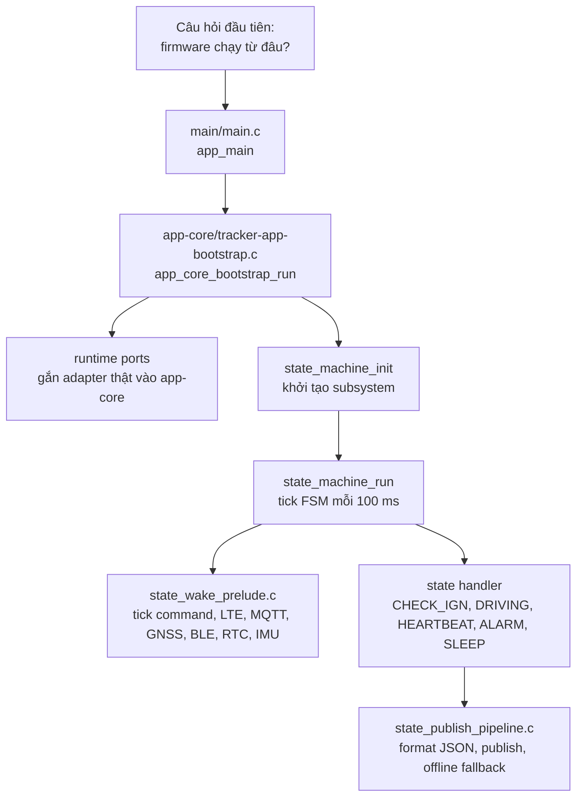

Đọc file theo thứ tự:

1. `main/main.c`
2. `components/app-core/src/tracker-app-bootstrap.c`
3. `components/shared-kernel/include/fsm_types.h`
4. `components/app-core/src/state_machine_core.c`
5. `components/app-core/src/state_wake_prelude.c`
6. `components/app-core/src/state_publish_pipeline.c`
7. `components/domain-connectivity/src/command_handler.c`
8. `components/app-core/src/state_ota_runtime.c`
9. `components/domain-storage/src/offline_queue.c`
10. `components/adapter-mqtt-sim7600-at/src/*.c`

## Nếu Muốn Đọc Theo Module Phần Cứng
Sau khi hiểu 9 flow tổng ở dưới, chuyển sang các page deep-dive này:

1. [07-hardware-module-reading-map.md](./07-hardware-module-reading-map.md)
2. [08-sim7600-lte-gnss-mqtt-at-walkthrough.md](./08-sim7600-lte-gnss-mqtt-at-walkthrough.md)
3. [09-ble-obd-elm327-walkthrough.md](./09-ble-obd-elm327-walkthrough.md)
4. [10-rtc-ds3231m-walkthrough.md](./10-rtc-ds3231m-walkthrough.md)
5. [11-imu-lis3dsh-motion-walkthrough.md](./11-imu-lis3dsh-motion-walkthrough.md)
6. [12-adc-power-and-sd-storage-walkthrough.md](./12-adc-power-and-sd-storage-walkthrough.md)
7. [13-sleep-wake-hardware-orchestration-walkthrough.md](./13-sleep-wake-hardware-orchestration-walkthrough.md)

## Cách Đọc Một Flow Trong Codebase Này
Mỗi flow nên được đọc bằng mẫu sau:

```text
Câu hỏi -> Entry function -> Owner state -> Helper/adapter -> Side effect -> Log/checkpoint
```

Khi mở một function, tự trả lời 6 câu:

1. Function này được ai gọi?
2. Nó đọc state/config nào?
3. Nó đổi state/global/context nào?
4. Nó gọi adapter phần cứng/protocol nào?
5. Nếu lỗi thì retry, fallback, return hay restart?
6. Log nào chứng minh đoạn này đã chạy trên board thật?

## Code Walkthrough Theo Flow Thực Tế
Phần này thay cho kiểu liệt kê dòng code khô cứng. Mỗi chặng có sơ đồ, mục tiêu đọc, code excerpt ngắn, state cần nhìn và checkpoint debug.

### Flow 1: Boot Vào Loop Chính
**Câu hỏi cần trả lời:** sau khi ESP32-S3 boot xong, firmware chuyển quyền điều khiển cho ai?

**Mở code:**
- `main/main.c`
- `components/app-core/src/tracker-app-bootstrap.c`
- `components/shared-kernel/include/fsm_types.h`
- `components/app-core/src/state_machine_core.c`

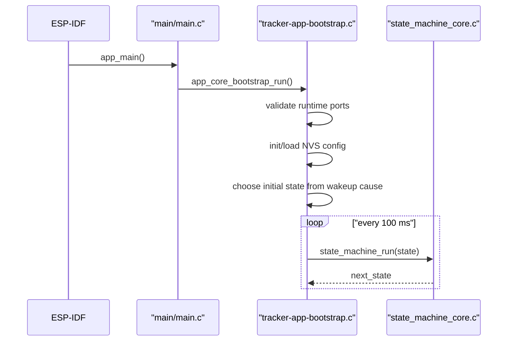

**Đoạn code neo để đọc:**

```c
void app_main(void) {
    app_core_bootstrap_run();
}
```

Đừng dừng ở `main.c`. File này chỉ là cửa vào. Việc thật nằm ở `app_core_bootstrap_run()`.

**Đọc theo block trong `tracker-app-bootstrap.c`:**
- Validate port registry trước để thiếu adapter thì fail sớm.
- Init NVS và load config; nếu load fail thì dùng default.
- Đọc wakeup cause để chọn initial state.
- Vào loop vô hạn, retry `state_machine_init()` nếu chưa ready.
- Khi ready thì gọi `state_machine_run(state)` đều đặn.

**State cần nhìn khi debug:**
- `state`
- `state_machine_ready`
- `g_rtc_context.boot_count`
- wakeup cause từ ESP-IDF
- config sau khi load NVS

**Checkpoint thực tế:**
- Nếu firmware không vào FSM, tìm log init fail/retry trong bootstrap.
- Nếu boot dậy sai state, kiểm tra wakeup cause và nhánh chọn initial state.
- Nếu config không đúng, đọc NVS load path trước khi đọc FSM.

### Flow 2: Runtime Port Wiring, Tức Dependency Injection Kiểu C
**Câu hỏi cần trả lời:** vì sao `app-core` gọi được modem, MQTT, BLE, NVS, RTC mà không include trực tiếp logic của từng adapter?

**Mở code:**
- `components/app-core/src/tracker-app-bootstrap.c`
- `components/platform-hal-esp-idf/include/tracker_runtime_ports.h`
- các adapter tương ứng trong `components/adapter-*`

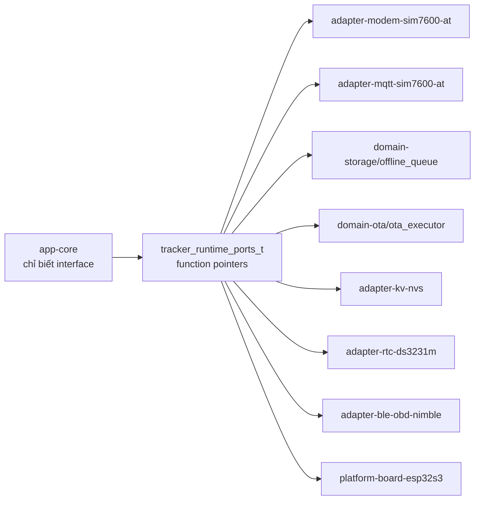

**Cách đọc:**
- Bắt đầu từ các biến `s_modem_transport_port`, `s_mqtt_transport_port`, `s_storage_queue_port`, `s_ota_download_port`.
- Mỗi biến là một bảng function pointer.
- `s_runtime_ports` gom các bảng này lại.
- `tracker_runtime_ports_validate()` kiểm tra dependency bắt buộc.

**Ý nghĩa kiến trúc:**
`app-core` không cần biết MQTT dùng SIM7600 AT hay ESP-MQTT native. Nó chỉ gọi `publish`, `connect`, `subscribe`, `set_callback`. Bootstrap quyết định implementation thật.

**Checkpoint thực tế:**
- Muốn thay MQTT implementation: bắt đầu từ `s_mqtt_transport_port`, không sửa FSM trước.
- Muốn mock adapter khi test: thay function pointer ở port registry.
- Nếu crash sớm ở bootstrap, xem validate port nào thiếu.

### Flow 3: FSM Là Switchboard, Handler Mới Là Nơi Có Nghiệp Vụ
**Câu hỏi cần trả lời:** firmware quyết định driving, parked, heartbeat, alarm, sleep ở đâu?

**Mở code:**
- `components/shared-kernel/include/fsm_types.h`
- `components/app-core/src/state_machine_core.c`

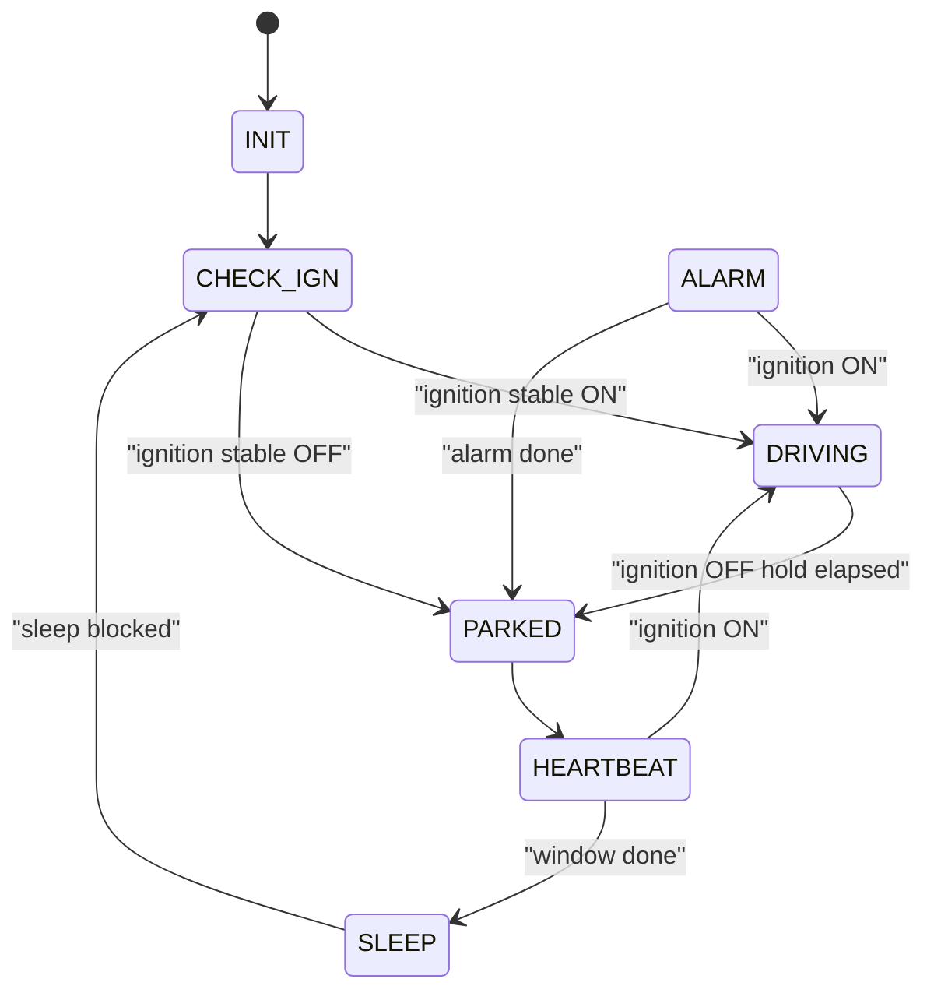

**Code skeleton cần nhận ra:**

```c
switch (current_state) {
    case APP_STATE_INIT:
    case APP_STATE_CHECK_IGN:
    case APP_STATE_DRIVING:
    case APP_STATE_PARKED:
    case APP_STATE_ALARM:
    case APP_STATE_HEARTBEAT:
    case APP_STATE_SLEEP:
}
```

**Cách đọc đúng:**
- Đừng đọc toàn bộ `state_machine_core.c` từ trên xuống dưới.
- Đọc enum state trước để có vocabulary.
- Vào `state_machine_run()` để thấy state nào gọi handler nào.
- Chỉ sau đó mới đọc handler cụ thể.

**Mốc đọc theo mục đích:**
- Không hiểu vì sao vào driving/parked: đọc `state_machine_handle_check_ign_state()`.
- Không hiểu rawdata publish lúc nào: đọc `state_machine_handle_driving_state()`.
- Không hiểu xe tắt máy nhưng chưa parked: đọc `state_machine_handle_driving_ignition_boundary()`.
- Không hiểu heartbeat rồi sleep: đọc `state_machine_handle_heartbeat_state()`.
- Không hiểu sleep bị chặn: đọc `state_machine_handle_sleep_state()`.

**Checkpoint thực tế:**
- Log transition state là nguồn kiểm chứng tốt nhất.
- Nếu state không đổi, xem handler return state nào.
- Nếu handler có vẻ đúng nhưng data sai, quay lại `state_machine_run_wake_prelude()` vì telemetry được refresh ở đó.

### Flow 4: Wake Prelude Là Đoạn “Trước Khi Làm Việc Chính”
**Câu hỏi cần trả lời:** vì sao state nào cũng phải tick LTE/MQTT/GNSS/BLE/command?

**Mở code:**
- `components/app-core/src/state_wake_prelude.c`
- `components/app-core/src/state_ota_runtime.c`
- `components/domain-storage/src/offline_queue.c`

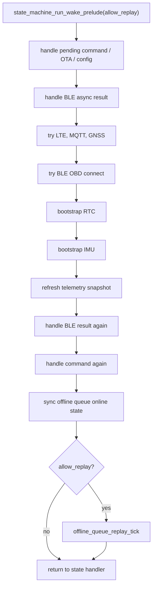

**Tư duy đọc:**
Prelude là nơi gom các việc cần chạy thường xuyên nhưng không thuộc riêng một state. Nó giúp state handler như `DRIVING` không bị nhồi quá nhiều logic modem, BLE, RTC, command.

**Điều cần để ý:**
- `allow_replay=true` thường ở state có nhiều thời gian hơn như driving/alarm.
- `allow_replay=false` giúp heartbeat/check ignition không bị offline replay chiếm window ngắn.
- Network không block đến xong; nó tick từng bước và retry.

**Checkpoint thực tế:**
- Command đã tới nhưng chưa effect: kiểm tra prelude có chạy không.
- MQTT chưa subscribe command: kiểm tra LTE ready, MQTT connected, command subscribe flag.
- OBD vừa connect nhưng telemetry chưa có OBD: xem đoạn refresh lần hai sau BLE result.

### Flow 5: Telemetry Publish, Từ State Handler Đến MQTT Hoặc Offline Queue
**Câu hỏi cần trả lời:** một bản rawdata đi từ sensor snapshot lên cloud qua những lớp nào?

**Mở code:**
- `components/app-core/src/state_machine_core.c`
- `components/app-core/src/state_publish_pipeline.c`
- `components/contracts-device-cloud/src/data_formatter.c`
- `components/adapter-mqtt-sim7600-at/src/mqtt_client.c`
- `components/domain-storage/src/offline_queue.c`

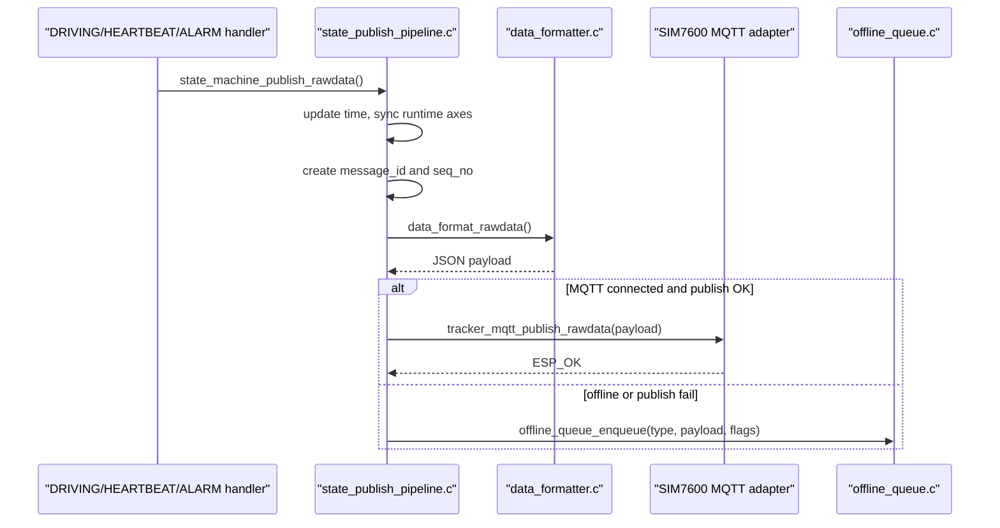

**Đọc theo chặng:**
1. Trong `state_machine_handle_driving_state()`, xem điều kiện publish rawdata.
2. Vào `state_machine_publish_rawdata()`.
3. Vào helper chung `state_publish_via_pipeline()`.
4. Tại đây payload mới được format, có `message_id`, `seq_no`, timestamp.
5. Nếu MQTT OK thì gọi sender.
6. Nếu MQTT fail thì payload được enqueue.

**Biến cần nhìn:**
- `s_last_raw_publish_ms`
- tracking interval config
- `message_id`
- `seq_no`
- `s_time_trusted`
- `s_telemetry`
- MQTT connected flag

**Đoạn đặc biệt trong formatter:**
OBD signal không được serialize nếu kênh OBD disconnected, ELM chưa ready, hoặc sample quá cũ. Vì vậy cloud thiếu RPM/speed không nhất thiết là lỗi formatter; có thể là guard bảo vệ dữ liệu stale.

**Checkpoint thực tế:**
- Có rawdata nhưng thiếu GNSS: kiểm tra `fix_valid`, latitude/longitude khác 0.
- Có rawdata nhưng thiếu OBD: kiểm tra BLE connected, ELM ready, sample age.
- MQTT fail mà không mất payload: kiểm tra offline queue enqueue log.

### Flow 6: Command Từ Cloud Xuống Device
**Câu hỏi cần trả lời:** cloud gửi command thì device xử lý ngay trong callback hay để FSM xử lý?

**Mở code:**
- `components/adapter-mqtt-sim7600-at/src/mqtt_urc_parser.c`
- `components/adapter-mqtt-sim7600-at/src/mqtt_client.c`
- `components/domain-connectivity/src/command_handler.c`
- `components/app-core/src/state_ota_runtime.c`
- `components/app-core/src/state_wake_prelude.c`

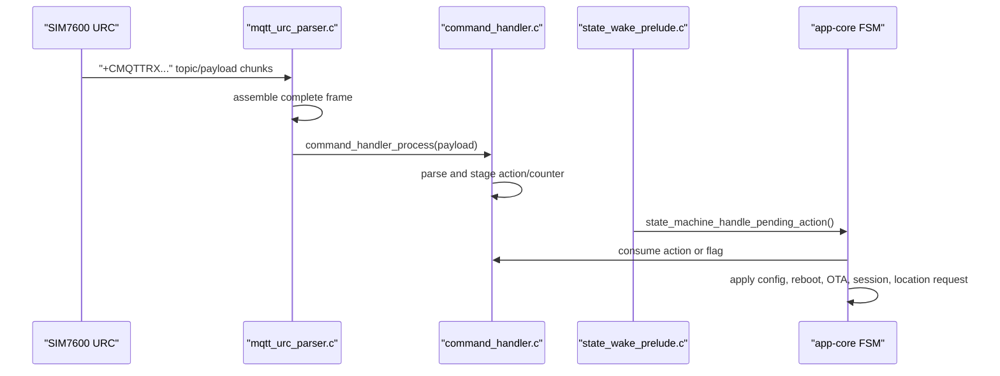

**Mental model:**
MQTT callback không làm việc nặng. Nó parse JSON và stage action. FSM consume action trong wake prelude. Đây là thiết kế tốt cho firmware vì callback/URC path không bị block bởi NVS write, OTA download hoặc reboot.

**Ví dụ đọc flow `request_location`:**
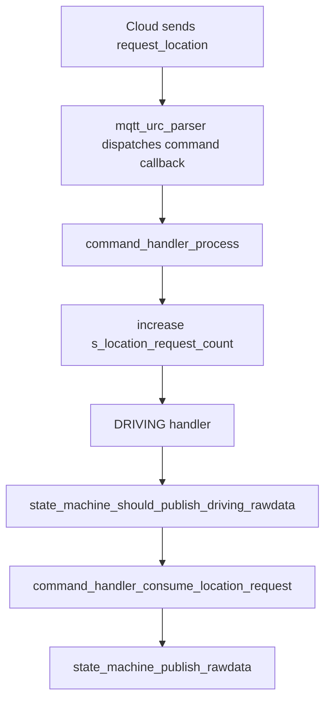

**Ví dụ đọc flow `update_config`:**
- `command_handler_process()` parse config delta.
- Action `COMMAND_ACTION_APPLY_CONFIG` được enqueue.
- Prelude gọi `state_machine_handle_pending_action()`.
- FSM gọi `command_handler_apply_pending_config()`.
- Config được validate, save NVS, rồi swap vào runtime config.

**Checkpoint thực tế:**
- Command tới modem nhưng firmware không chạy: xem `mqtt rx command topic_class=commands`.
- JSON invalid: xem log `Invalid command JSON`.
- Action không chạy: xem prelude có gọi pending action không.
- Config không đổi: xem `app_config_is_valid()` và NVS save result.

### Flow 7: OTA Là Flow Hai Pha, Trước Reboot Và Sau Reboot
**Câu hỏi cần trả lời:** OTA không chỉ là download firmware; confirm sau reboot nằm ở đâu?

**Mở code:**
- `components/domain-connectivity/src/command_handler.c`
- `components/app-core/src/state_ota_runtime.c`
- `components/domain-ota/src/util_ota_update.c`
- `components/adapter-kv-nvs/src/nvs_config.c`

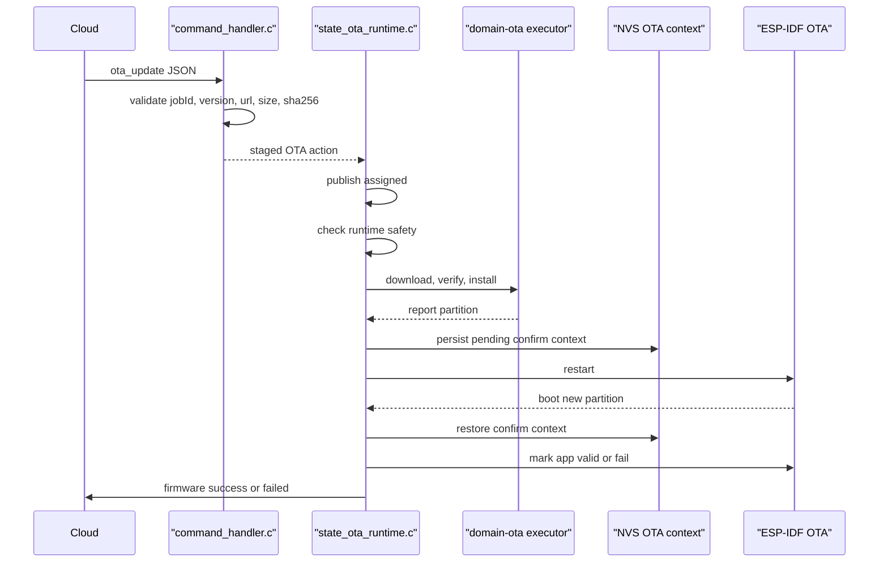

**Đọc theo hai nửa:**

**Trước reboot**
- Command handler validate OTA payload.
- Runtime publish `assigned`.
- `state_machine_ota_start_is_safe()` kiểm tra MQTT/battery/runtime window.
- `util_ota_apply_update()` download, verify, install.
- Runtime lưu OTA context vào RTC/NVS.
- Device restart.

**Sau reboot**
- Bootstrap/FSM restore OTA context.
- Runtime publish `confirming`.
- ESP-IDF mark app valid.
- Runtime clear pending context.
- Runtime publish `success` hoặc `failed`.

**Biến cần nhìn:**
- `g_rtc_context.ota_pending_confirm`
- `g_rtc_context.ota_job_id`
- `g_rtc_context.ota_target_version`
- `g_rtc_context.ota_confirm_deadline_ms`
- `s_ota_in_progress`
- `s_current_version`

**Checkpoint thực tế:**
- OTA command bị reject: đọc validator trong `command_parse_ota_update()`.
- OTA assigned rồi failed ngay: đọc safety check.
- OTA install xong nhưng cloud không thấy success: đọc confirm path sau reboot.
- Reset giữa OTA: kiểm tra persisted OTA context trong NVS.

### Flow 8: Offline Queue Và Replay
**Câu hỏi cần trả lời:** MQTT fail thì payload có bị mất không?

**Mở code:**
- `components/app-core/src/state_publish_pipeline.c`
- `components/domain-storage/src/offline_queue.c`
- `components/adapter-storage-sdmmc-fatfs/src/sd_log_store.c`
- `components/adapter-mqtt-sim7600-at/src/mqtt_client.c`

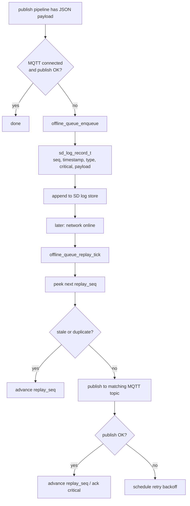

**Cách đọc:**
- `state_publish_via_pipeline()` quyết định live publish hay enqueue.
- `offline_queue_enqueue()` tạo record và append SD.
- `offline_queue_replay_tick()` mỗi tick chỉ publish tối đa một record.
- Record critical là `status`, `event`, `firmware`; rawdata không critical.
- Có filter bỏ stale OBD rawdata và firmware success cũ để tránh làm bẩn cloud.

**Checkpoint thực tế:**
- Publish fail nhưng không thấy queue: kiểm tra SD log enable/mount.
- Replay spam modem: kiểm tra throttle `OFFLINE_QUEUE_REPLAY_MIN_PUBLISH_INTERVAL_MS`.
- Firmware history bị duplicate: đọc stale firmware filter.
- OBD data cũ xuất hiện lại: đọc stale OBD rawdata filter.

### Flow 9: MQTT Adapter Đi Qua SIM7600 AT
**Câu hỏi cần trả lời:** publish MQTT thật sự gửi lệnh gì xuống modem?

**Mở code:**
- `components/adapter-mqtt-sim7600-at/src/mqtt_topics.c`
- `components/adapter-mqtt-sim7600-at/src/mqtt_client.c`
- `components/adapter-mqtt-sim7600-at/src/mqtt_publish.c`
- `components/adapter-mqtt-sim7600-at/src/mqtt_urc_parser.c`

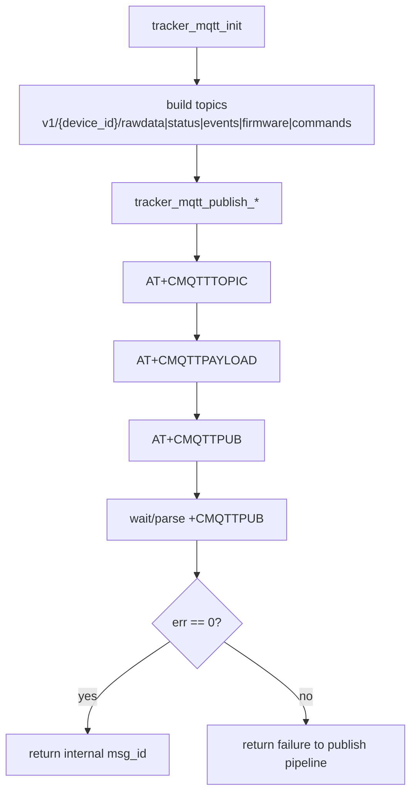

**Điểm cần nhớ:**
- Rawdata dùng QoS0.
- Status, event, firmware dùng QoS1.
- Commands subscribe topic `v1/{device_id}/commands`.
- Incoming command được SIM7600 báo qua `+CMQTTRX...` URC, parser gom đủ topic/payload rồi mới gọi callback.

**Checkpoint thực tế:**
- Không publish được: xem fail stage là `topic`, `payload`, `pub`, hay `result`.
- Không nhận command: xem đã subscribe commands chưa, topic có đúng device id không.
- MQTT mất kết nối: xem URC `+CMQTTCONNLOST`, `+CMQTTPING`, `+CMQTTNONET`.

## Cách Tự Đọc Một Function Mới
Ví dụ bạn cần đọc `state_machine_handle_driving_state()`:

1. Đọc comment đầu function để biết intent.
2. Liệt kê các call bên trong theo thứ tự.
3. Đánh dấu call nào chỉ update state nội bộ, call nào chạm adapter/phần cứng.
4. Tìm biến global/context bị đọc và bị ghi.
5. Vẽ flow 5-7 node.
6. Chỉ sau đó mới đọc từng if/return.

Với `state_machine_handle_driving_state()`, flow thật là:

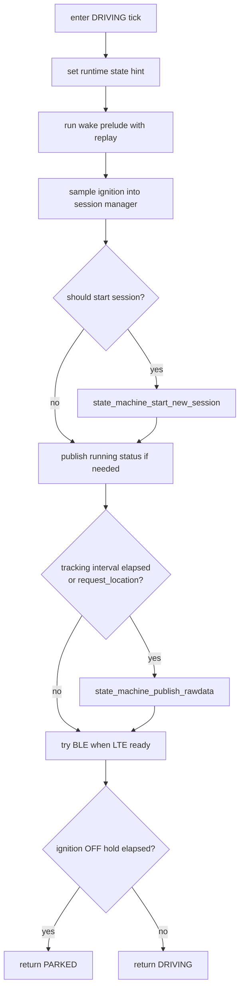

Nếu đọc theo flow này, từng dòng trong function tự có chỗ đứng. Nếu đọc từ dòng đầu đến dòng cuối không có bản đồ, rất dễ nhầm prelude là logic driving chính.

## Component Map
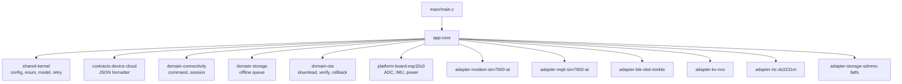

## Điểm Dễ Hiểu Nhầm
1. `main/main.c` không chứa runtime logic; nó chỉ chuyển quyền sang bootstrap.
2. Bootstrap không phải business logic; nó dựng dependency, config, initial state, loop.
3. FSM switch chỉ điều phối; nghiệp vụ nằm trong handler và helper.
4. Wake prelude không phải state riêng; nó là đoạn tick chung trước state logic.
5. Command handler không trực tiếp OTA/config/reboot trong callback; nó stage action.
6. Formatter không publish MQTT; nó chỉ tạo JSON.
7. MQTT path hiện đi qua SIM7600 AT, không phải ESP-MQTT native.
8. Offline queue là fallback local, không phải bảo đảm broker-level tuyệt đối.
9. OBD value cũ có thể bị loại có chủ đích để tránh dữ liệu sai.
10. OTA phải đọc cả trước reboot và sau reboot mới hiểu đủ.

## Checklist Khi Đọc Một Flow
- Entry function là gì?
- Call graph 5-10 node là gì?
- State/config nào là input?
- Context/global nào bị ghi?
- Có adapter phần cứng/protocol nào được gọi?
- Có retry/backoff không?
- Có branch online/offline không?
- Có fallback queue/NVS/RTC/SD không?
- Log nào xác nhận flow đã chạy?
- Trên board thật cần đo gì để kết luận?

## Glossary Ngắn
- `FSM`: finite-state machine, bộ điều phối trạng thái runtime.
- `NVS`: non-volatile storage của ESP-IDF, dùng lưu config/context nhỏ.
- `RTC_DATA_ATTR`: vùng nhớ giữ qua deep sleep.
- `GNSS`: định vị vệ tinh qua modem SIM7600.
- `LTE`: kết nối cellular data.
- `MQTT`: giao thức publish/subscribe giữa device và cloud.
- `OTA`: cập nhật firmware qua mạng.
- `OBD`: đọc dữ liệu xe qua OBD2.
- `ELM327`: command protocol thường dùng trong OBD adapter.
- `offline queue`: hàng đợi local để lưu payload khi chưa gửi được cloud.
- `runtime port`: bảng function pointer để app-core gọi adapter qua boundary rõ.

## Tài Liệu Repo Liên Quan
- [02-runtime-fsm-and-execution-model.md](./02-runtime-fsm-and-execution-model.md)
- [03-connectivity-payloads-and-ota.md](./03-connectivity-payloads-and-ota.md)
- [04-persistence-replay-and-diagnostics.md](./04-persistence-replay-and-diagnostics.md)
- [05-hardware-boundary-and-field-validation.md](./05-hardware-boundary-and-field-validation.md)
- [06-file-by-file-reading-map.md](./06-file-by-file-reading-map.md)
- [07-hardware-module-reading-map.md](./07-hardware-module-reading-map.md)
- [08-sim7600-lte-gnss-mqtt-at-walkthrough.md](./08-sim7600-lte-gnss-mqtt-at-walkthrough.md)
- [09-ble-obd-elm327-walkthrough.md](./09-ble-obd-elm327-walkthrough.md)
- [10-rtc-ds3231m-walkthrough.md](./10-rtc-ds3231m-walkthrough.md)
- [11-imu-lis3dsh-motion-walkthrough.md](./11-imu-lis3dsh-motion-walkthrough.md)
- [12-adc-power-and-sd-storage-walkthrough.md](./12-adc-power-and-sd-storage-walkthrough.md)

## Việc Nên Làm Tiếp
1. Tách từng flow ở trên thành page riêng nếu cần đọc sâu: Boot/FSM, Publish, Command, OTA, Offline Queue, MQTT AT.
2. Bổ sung log serial thật dưới mỗi checkpoint.
3. Render Mermaid thành SVG/PNG để chèn vào báo cáo hoặc slide.
4. Refresh các reference cũ còn dùng đường dẫn `main/src` để khớp layout `components/*`.

## Câu Hỏi Còn Mở
1. Có cần chia Notion thành nhiều page nhỏ theo flow để dễ học từng buổi không.
2. Có cần thêm serial log thật của board để nối code với hành vi runtime không.
