# Source Map And Build Boundary

**Last updated:** 2026-04-13  
**Status:** source-backed

## 1. Phạm vi
Tài liệu này chốt 3 câu hỏi:
- Firmware build từ file nào.
- Module nào là lớp điều phối, lớp domain, lớp utility.
- Cấu hình runtime nào đang là mặc định thật.

## 2. Entry points và build files
| File | Vai trò |
|---|---|
| [`main/main.c`](../../../iot-vehicle-tracking-system-firmware/main/main.c) | boot entrypoint, nạp config, chọn trạng thái khởi đầu, loop FSM |
| [`main/CMakeLists.txt`](../../../iot-vehicle-tracking-system-firmware/main/CMakeLists.txt) | danh sách module thực sự được link vào firmware |
| [`main/Kconfig.projbuild`](../../../iot-vehicle-tracking-system-firmware/main/Kconfig.projbuild) | build-time knobs cho project version, APN, command subscribe, SD logging |
| [`sdkconfig.defaults`](../../../iot-vehicle-tracking-system-firmware/sdkconfig.defaults) | baseline build defaults cho BLE, PM, partition table, SD replay |
| [`partitions.csv`](../../../iot-vehicle-tracking-system-firmware/partitions.csv) | layout NVS + factory + 2 OTA slots |

## 3. Layering hiện tại
| Lớp | File chính | Vai trò |
|---|---|---|
| Boot | `main/main.c` | nạp config, set override, vào FSM |
| Orchestrator | `main/src/state_machine.c` | trung tâm điều phối mọi subsystem |
| Connectivity | `modem_at.c`, `modem_lte.c`, `modem_gnss.c`, `mqtt_client.c`, `command_handler.c` | mạng di động, GNSS, MQTT, cloud command |
| Vehicle IO | `ble_init.c`, `ble_mgr.c`, `ble_obd.c`, `imu_lis3dsh.c`, `adc_reader.c`, `power_mgr.c` | BLE OBD, IMU, ADC, power path |
| Persistence | `nvs_config.c`, `rtc_ds3231m.c`, `sd_log_store.c`, `offline_queue.c`, `session_mgr.c` | config, timekeeping, storage, replay, session |
| Shared infra | `data_formatter.c`, `retry_manager.c`, `telemetry_counters.c`, `util.c` | payload, retry, counters, OTA/helper |

## 4. Module inventory thực sự đang build
Danh sách lấy từ [`main/CMakeLists.txt`](../../../iot-vehicle-tracking-system-firmware/main/CMakeLists.txt):

```text
main.c
ble_init.c, ble_mgr.c, ble_obd.c, ble_util.c
adc_reader.c, imu_lis3dsh.c, power_mgr.c
modem_at.c, modem_lte.c, modem_gnss.c
rtc_ds3231m.c
mqtt_client.c, data_formatter.c, command_handler.c
state_machine.c
nvs_config.c, util.c
sd_log_store.c, offline_queue.c, session_mgr.c
telemetry_counters.c, retry_manager.c
```

Điểm cần lưu ý: đây là bằng chứng rõ nhất cho việc `rtc_ds3231m`, `offline_queue`, `session_mgr`, `retry_manager`, `telemetry_counters` là một phần runtime hiện tại, không còn là ghi chú tương lai.

## 5. Runtime config mặc định
Nguồn: [`main/src/nvs_config.c`](../../../iot-vehicle-tracking-system-firmware/main/src/nvs_config.c), [`main/inc/app_config.h`](../../../iot-vehicle-tracking-system-firmware/main/inc/app_config.h)

| Field | Default |
|---|---|
| `device_id` | `TRACKER_001` nếu chưa có NVS |
| `mqtt_host` | `mqtt.thingdock.dev` |
| `mqtt_port` | `1883` |
| `tracking_interval_s` | `1` |
| `heartbeat_interval_s` | `120` |
| `alarm_interval_s` | `3` |
| `ignition_off_hold_ms` | `3000` |
| `alarm_timeout_s` | `300` |
| `ota_min_battery_mv` | `3850` |
| `ignition_adc_threshold_mv` | `13000` |
| `sleep_enabled` | `true` |
| `imu_wakeup_enabled` | `false` |
| `apn` | `internet` |

## 6. Nhưng runtime hiện tại còn có override ở `main.c`
Nguồn: [`main/main.c`](../../../iot-vehicle-tracking-system-firmware/main/main.c)

Current source đang bật một số macro bring-up:
- tắt sleep để board không deep sleep khi bench.
- bật IMU wake để ép verify đường IMU.
- override MQTT host/user/password cho field validation.
- tắt subscribe command để chỉ validate publish path.

Nghĩa là:
- NVS default vẫn tồn tại.
- Nhưng behavior chạy thật của binary hiện tại chịu ảnh hưởng trực tiếp từ `main.c`.

Đây là chi tiết cực quan trọng khi đọc log, test OTA, hoặc so khớp với tài liệu cũ.

## 7. Partition table
Nguồn: [`partitions.csv`](../../../iot-vehicle-tracking-system-firmware/partitions.csv)

| Partition | Type | Purpose |
|---|---|---|
| `nvs` | data/nvs | config blob và metadata runtime |
| `otadata` | data/ota | ESP-IDF OTA slot bookkeeping |
| `phy_init` | data/phy | RF init data |
| `factory` | app/factory | image fallback |
| `ota_0` | app/ota_0 | slot OTA thứ 1 |
| `ota_1` | app/ota_1 | slot OTA thứ 2 |

Hệ quả:
- OTA flow có 2 slot đủ để update + rollback.
- `util_ota_trigger_manual_rollback()` có thể chọn `ota_1`, `factory`, hoặc `ota_0` tùy tình huống.

## 8. Baseline build features từ `sdkconfig.defaults`
| Nhóm | Setting nổi bật |
|---|---|
| BLE | NimBLE central + observer, max 1 connection |
| PM | tickless idle + power management |
| Partition | custom partition table bật |
| SD logging | SD log, replay, diag đều bật |
| Session policy | debounce `1500 ms`, drain `3000 ms` |

## 9. Kiến trúc tổng thể


## 10. Kết luận ngắn
- `state_machine.c` là trung tâm thật.
- `main.c` vẫn có quyền thay đổi policy runtime qua compile-time override.
- Firmware không còn là “LTE + MQTT + IMU” đơn giản; nó đã có cả timekeeping, replay, queue, counters, retry policies.

## Unresolved questions
1. Có nên tách field-validation overrides khỏi `main.c` sang Kconfig/profile riêng để docs và runtime bớt lệch nhau.
