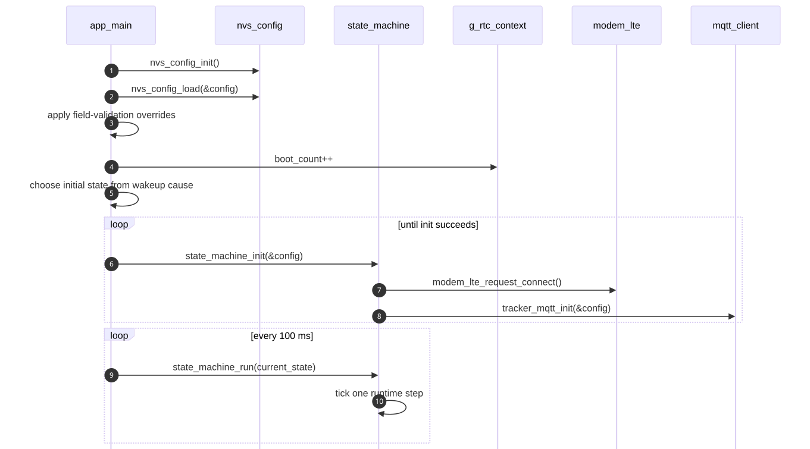

# Runtime FSM And Execution Model

**Last updated:** 2026-04-13  
**Status:** source-backed

## 1. Một dòng mô tả
Firmware hiện tại là một vòng lặp `app_main() -> state_machine_init() -> state_machine_run()` theo kiểu non-blocking, dùng retry/backoff và thời gian hệ thống để tiến từng bước.

## 2. Boot path
Nguồn: [`main/main.c`](../../../iot-vehicle-tracking-system-firmware/main/main.c)

Trình tự:
1. Set log level.
2. `nvs_config_init()` rồi `nvs_config_load(&config)`.
3. Apply field-validation overrides nếu macro đang bật.
4. So sánh running partition và boot partition.
5. Cập nhật `g_rtc_context.boot_count`.
6. Chọn initial state theo wakeup cause:
   - timer wake -> `APP_STATE_HEARTBEAT`
   - ext0 + IMU wake enabled -> `APP_STATE_ALARM`
   - còn lại -> `APP_STATE_INIT`
7. Lặp vô hạn:
   - retry `state_machine_init()` cho đến khi thành công
   - sau đó gọi `state_machine_run(state)` mỗi 100 ms

## 3. Boot sequence trực quan

## 4. Các state chính
Nguồn: [`main/inc/app_state.h`](../../../iot-vehicle-tracking-system-firmware/main/inc/app_state.h), [`main/src/state_machine.c`](../../../iot-vehicle-tracking-system-firmware/main/src/state_machine.c)

| State | Vai trò |
|---|---|
| `APP_STATE_INIT` | khởi tạo state đầu chu kỳ sau khi modules ready |
| `APP_STATE_CHECK_IGN` | chạy startup checks, bootstrap network/RTC/IMU, suy ra ignition |
| `APP_STATE_DRIVING` | online mode, poll GNSS + OBD, publish rawdata, xử lý command |
| `APP_STATE_PARKED` | trạng thái trung gian trước sleep |
| `APP_STATE_ALARM` | wake do motion, phát event và rawdata theo cadence alarm |
| `APP_STATE_HEARTBEAT` | wake do timer, publish rawdata + status một lần rồi ngủ |
| `APP_STATE_SLEEP` | đánh giá gate rồi enter deep sleep hoặc reject sleep |

## 5. Hành vi từng state
### `INIT`
- set `g_rtc_context.last_state = APP_STATE_INIT`
- đồng bộ online status của offline queue
- chuyển ngay sang `CHECK_IGN`

### `CHECK_IGN`
- gọi `state_machine_try_connect_network()`
- gọi `state_machine_bootstrap_rtc()`
- gọi `state_machine_bootstrap_imu()`
- nếu LTE đã initialized thì mới thử BLE OBD
- refresh telemetry
- dùng ignition sample để rẽ sang `DRIVING` hoặc `PARKED`

### `DRIVING`
- giữ network/BLE sống
- poll GNSS + OBD
- replay offline queue nếu online
- start session nếu ignition vừa ổn định thành ON
- publish rawdata theo `tracking_interval_s`
- xử lý `request_location`, `reboot`, `ota_update`, `ota_rollback`
- nếu ignition OFF đủ lâu theo `ignition_off_hold_ms` thì sang `PARKED`

### `PARKED`
- publish `status=stopped`
- chuyển sang `SLEEP`

### `ALARM`
- publish event `motion_detected`
- publish rawdata theo `alarm_interval_s`
- nếu ignition ON -> `DRIVING`
- nếu hết motion hoặc quá `alarm_timeout_s` -> `PARKED`

### `HEARTBEAT`
- timer wake path
- connect network
- refresh telemetry
- publish `rawdata`
- publish `status=heartbeat`
- xử lý OTA command nếu có
- quay về `SLEEP`

### `SLEEP`
- sleep chỉ được phép nếu:
  - `sleep_enabled == true`
  - không có OTA đang chạy
  - không có `ota_pending_confirm`
  - ignition đang OFF
- nếu reject thì log reason và quay lại `CHECK_IGN`
- nếu accept:
  - snapshot `g_rtc_context`
  - disconnect BLE
  - power off GNSS
  - disconnect LTE
  - set DTR/PWRKEY safe state
  - arm ext0 IMU wake nếu khả dụng
  - arm timer wake theo `heartbeat_interval_s`
  - `esp_deep_sleep_start()`

## 6. Sơ đồ FSM

## 7. Execution model: non-blocking retry thay vì sleep cứng
Firmware dùng nhiều `retry_state_t`:
- `s_init_retry`
- `s_ble_retry`
- `s_network_retry`
- `s_rtc_bootstrap_retry`
- `s_rtc_read_retry`
- `s_imu_bootstrap_retry`

Pattern chung:
1. kiểm tra `retry_state_can_run()`
2. thử action
3. nếu fail thì `retry_state_schedule()`
4. log `attempt` + `next_delay_ms`

Ý nghĩa:
- loop chính không bị block quá lâu.
- có thể duy trì nhiều subsystem “đang recover” cùng lúc.
- log có tính điều tra tốt hơn vì lý do fail được giữ riêng theo subsystem.

## 8. RTC context giữ gì qua deep sleep
Nguồn: [`main/inc/app_state.h`](../../../iot-vehicle-tracking-system-firmware/main/inc/app_state.h)

`RTC_DATA_ATTR rtc_context_t g_rtc_context` giữ:
- `last_state`
- `boot_count`
- `last_heartbeat_ts`
- `ble_mac`
- `ign_last_known`
- `last_battery_v`
- toàn bộ OTA confirm context:
  - `ota_pending_confirm`
  - `ota_confirm_timeout_sec`
  - `ota_job_id`
  - `ota_target_version`
  - `ota_previous_version`
  - `ota_partition`

Đây là lý do OTA confirm sau reboot không phụ thuộc NVS hay cloud resend.

## 9. Điểm kỹ thuật đáng chú ý
- `state_machine_try_confirm_running_firmware()` tự gọi `esp_ota_mark_app_valid_cancel_rollback()` nếu cờ confirm còn pending.
- `state_machine_bootstrap_rtc()` có fallback time từ GNSS hoặc hardcoded `2025-01-01T00:00:00Z`.
- `state_machine_bootstrap_imu()` cấu hình interrupt motion ngay sau khi init thành công.
- `state_machine_update_user_led()` chạy mỗi loop và tạo heartbeat LED định kỳ.

## 10. Kết luận ngắn
- FSM là “trái tim” của firmware.
- Mọi thay đổi về LTE/GNSS/BLE/OTA/sleep đều nên đọc từ `state_machine.c` trước.
- Nếu sửa một module mà quên kiểm tra state transition, rất dễ gây bug hồi quy.

## Unresolved questions
1. Có cần tách phần bring-up path và production path thành 2 profile rõ hơn để FSM đỡ phụ thuộc macro trong `main.c`.
