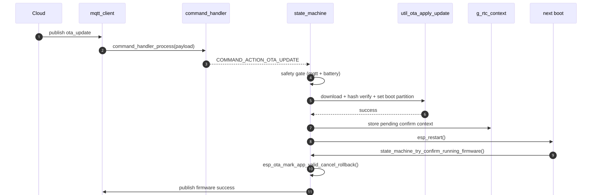

# Connectivity Payloads And OTA

**Last updated:** 2026-04-13  
**Status:** source-backed + vendor-backed

## 1. Mục tiêu
Tài liệu này gom 5 luồng có liên hệ chặt:
- LTE attach và PDP
- GNSS polling/recovery
- BLE OBD
- MQTT publish/subscribe
- command -> OTA/rollback

## 2. LTE modem là một FSM riêng
Nguồn: [`main/src/modem_lte.c`](../../../iot-vehicle-tracking-system-firmware/main/src/modem_lte.c)

State sequence chính:

```text
IDLE
 -> POWER_ON_PULSE
 -> WAIT_BOOT
 -> WAIT_RDY
 -> AT_SYNC
 -> ATE0
 -> CPIN_CHECK
 -> SET_NET_MODE
 -> SET_PDP
 -> CEREG_WAIT
 -> PDP_ACTIVATE
 -> PDP_IP_CHECK
 -> CONNECTED
```

Nếu fail:
- có thể đi qua `RECOVER_RESET`
- hoặc vào `BACKOFF`

Điểm kỹ thuật:
- dùng `AT+CNMP=2` cho auto network mode.
- cấu hình PDP bằng `AT+CGDCONT=1,"IP","<apn>"`.
- check attach bằng `AT+CEREG?`.
- check IP bằng `AT+CGPADDR=1`.
- có log snapshot `CPIN`, `CEREG`, `CSQ`, `COPS` khi timeout attach.

## 3. GNSS không chỉ query đơn giản
Nguồn: [`main/src/modem_gnss.c`](../../../iot-vehicle-tracking-system-firmware/main/src/modem_gnss.c)

Logic hiện tại:
- primary path: `AT+CGNSINF`
- fallback path: `AT+CGPSINFO`
- khi `CGNSINF` fail streak đủ lớn:
  - backoff primary path
  - tạm chuyển mode fallback
- khi transport/parse fail liên tục:
  - self-heal bằng power cycle GNSS
- khi no-fix streak quá lâu:
  - chạy no-fix recovery riêng

Observability có tách riêng:
- transport fail
- parse fail
- no-fix streak
- fix-success streak

Điểm tốt:
- recovery đã được bounded bằng cooldown, tránh thrash modem.

## 4. BLE OBD là session layer, không phải BLE wrapper thô
Nguồn: [`main/src/ble_obd.c`](../../../iot-vehicle-tracking-system-firmware/main/src/ble_obd.c)

Profile hiện dùng:
- service UUID: `0x18f0`
- TX characteristic: `0x2af1`
- RX characteristic: `0x2af0`

Flow:
1. scan theo service UUID
2. nếu có preferred MAC thì filter theo MAC
3. connect + discover
4. init ELM327:
   - `ATZ`
   - `ATE0`
   - `ATL0`
   - `ATS0`
   - `ATSP0`
5. polling PID:
   - `0x0C` RPM
   - `0x0D` speed
   - `0x05` coolant
   - `0x2F` fuel level
   - `0x04` engine load

BLE OBD còn có rolling counters:
- tổng request
- valid response
- invalid response
- timeout
- RX overflow

## 5. MQTT ở đây là AT MQTT qua SIM7600
Nguồn: [`main/src/mqtt_client.c`](../../../iot-vehicle-tracking-system-firmware/main/src/mqtt_client.c)

Đây là điểm dễ bị hiểu nhầm nhất.

Current implementation:
- không dùng `esp-mqtt`.
- dùng `AT+CMQTTSTART`, `AT+CMQTTACCQ`, `AT+CMQTTCONNECT`, `AT+CMQTTPUB`, `AT+CMQTTSUB`.
- MQTT RX được parse qua URC handler của modem transport.

Topic mapping:

| Topic | Hướng |
|---|---|
| `v1/{device_id}/rawdata` | device -> cloud |
| `v1/{device_id}/status` | device -> cloud |
| `v1/{device_id}/events` | device -> cloud |
| `v1/{device_id}/firmware` | device -> cloud |
| `v1/{device_id}/commands` | cloud -> device |

TLS behavior:
- nếu host là `mqtt.thingdock.dev` hoặc port là `8883`, client bật TLS mode.
- có fallback giữa địa chỉ `tcp://host` và `tcp://host:8883` cho host implicit TLS.

## 6. Data payload shape
Nguồn: [`main/src/data_formatter.c`](../../../iot-vehicle-tracking-system-firmware/main/src/data_formatter.c)

### `rawdata`
- root:
  - `device_id`
  - `auth_token` (tùy path)
  - `timestamp`
  - `timestamp_trusted`
  - `uptime`
- nested `data`:
  - imu_accel_delta_mps2
  - vehicle_battery
  - device_battery
  - latitude/longitude
  - speed/course
  - satellites
  - ignition
  - error_code
- nested `metadata`:
  - `schema_version`
  - `message_id`
  - `sent_at`
  - `seq_no`
  - `boot_id`

### `status`
- `device_id`, `status`, `timestamp`, `timestamp_trusted`, optional `session_id`, `metadata`

### `event`
- `device_id`, `event_type`, `code`, `message`, `timestamp`, `timestamp_trusted`, `metadata`

### `firmware`
- `jobId`, `status`, `progress`, `targetVersion`, `currentVersion`, optional `partition`, optional `error`

## 7. Connectivity + telemetry flow


## 8. Command contract
Nguồn: [`main/src/command_handler.c`](../../../iot-vehicle-tracking-system-firmware/main/src/command_handler.c)

Supported commands:
- `update_config`
- `request_location`
- `enable_tracking`
- `reboot`
- `ota_update`
- `manual_rollback`
- `ota_rollback`

`update_config` chỉ cho phép update whitelist:
- `tracking_interval_s`
- `heartbeat_interval_s`
- `alarm_interval_s`
- `ignition_off_hold_ms`
- `alarm_timeout_s`
- `sleep_enabled`
- `imu_wakeup_enabled`
- `ota_min_battery_mv`
- `ignition_adc_threshold_mv`

`ota_update` yêu cầu:
- `jobId`
- `version`
- `url`
- `size`
- `sha256`

Ràng buộc:
- URL phải là `https://`
- `sha256` phải là hex 64 ký tự
- `confirmTimeoutSec` có clamp

## 9. OTA flow hiện tại
Nguồn: [`main/src/state_machine.c`](../../../iot-vehicle-tracking-system-firmware/main/src/state_machine.c), [`main/src/util.c`](../../../iot-vehicle-tracking-system-firmware/main/src/util.c)

Trình tự:
1. cloud gửi `ota_update`
2. `command_handler_process()` parse payload
3. FSM consume action
4. `state_machine_ota_start_is_safe()` check:
   - MQTT connected
   - `device_battery` available
   - `device_battery >= ota_min_battery_mv`
5. `util_ota_apply_update()`:
   - mở HTTPS stream
   - chọn OTA partition
   - ghi OTA image
   - hash SHA-256 verify
   - set boot partition
6. reboot
7. boot mới publish `confirming`
8. `esp_ota_mark_app_valid_cancel_rollback()`
9. publish `success`

Rollback:
- manual rollback chọn partition fallback theo chiến lược:
  - nếu đang `ota_0` thì thử `ota_1`
  - nếu không thì `factory`
  - cuối cùng `ota_0`

## 10. Sơ đồ command và OTA


## 11. Điểm cần đọc thật kỹ
### 11.1 ACK semantics của MQTT publish
Trong [`tracker_mqtt_publish_with_msg_id()`](../../../iot-vehicle-tracking-system-firmware/main/src/mqtt_client.c):
- callback `s_puback_callback(msg_id)` được gọi ngay sau khi AT publish thành công.
- điều này nghĩa là current runtime đang coi “AT publish accepted” gần giống “publish ACK hoàn tất”.

Đây là chi tiết rất quan trọng cho offline replay và QoS1 semantics.

### 11.2 Runtime hiện dùng metadata cho mỗi message
FSM tạo:
- `message_id`
- `boot_id`
- `seq_no`

Điều này giúp trace message theo boot/session dễ hơn rất nhiều so với payload cũ.

### 11.3 Field-validation mode ảnh hưởng network behavior
Do `main.c` đang override MQTT và disable command subscribe, cloud command path có thể không phản ánh production design nếu build trực tiếp từ source hiện tại.

## Unresolved questions
1. Có cần đổi `puback_callback` sang ACK thật từ modem/broker thay vì local success callback.
2. Có giữ fallback `CGPSINFO` lâu dài hay chỉ dùng như recovery mode.
3. Có tách field-validation MQTT profile ra khỏi source chính hay không.
