# Persistence Replay And Diagnostics

**Last updated:** 2026-04-13  
**Status:** source-backed

## 1. Mục tiêu
Trang này mô tả phần “ít thấy nhưng quyết định độ bền runtime”:
- NVS config
- RTC
- session lifecycle
- SD logging
- offline replay
- retry primitives
- telemetry counters

## 2. NVS config là nguồn runtime policy
Nguồn: [`main/src/nvs_config.c`](../../../iot-vehicle-tracking-system-firmware/main/src/nvs_config.c)

NVS behavior:
- blob storage nguyên struct `config_t`
- nếu namespace chưa có -> ghi defaults
- nếu blob size là legacy `config_v1_t` -> migrate
- nếu data invalid -> reset về defaults và ghi lại
- có migration cho host legacy `localhost -> mqtt.thingdock.dev`

Ý nghĩa:
- config runtime không chỉ là “load nếu có”.
- source hiện tại có self-heal logic và migration logic đủ rõ.

## 3. RTC DS3231M đã là runtime thật
Nguồn: [`main/src/rtc_ds3231m.c`](../../../iot-vehicle-tracking-system-firmware/main/src/rtc_ds3231m.c)

Điểm chắc chắn từ code:
- dùng `I2C_NUM_0`
- SDA/SCL chia sẻ cùng pin với IMU:
  - `GPIO_NUM_2`
  - `GPIO_NUM_1`
- địa chỉ I2C: `0x68`
- check validity qua bit `OSF`
- cho phép:
  - `rtc_ds3231m_init()`
  - `rtc_ds3231m_get_time_ms()`
  - `rtc_ds3231m_set_time_ms()`
  - `rtc_ds3231m_get_health()`

FSM dùng RTC cho:
- bootstrap trusted time nếu RTC đã valid
- fallback set time từ GNSS hoặc mốc cố định
- đồng bộ `timestamp_trusted`

Điều này làm nhiều note cũ kiểu “RTC chưa có driver” trở thành stale.

## 4. Session manager
Nguồn: [`main/src/session_mgr.c`](../../../iot-vehicle-tracking-system-firmware/main/src/session_mgr.c)

Session manager hiện làm 3 việc:
- debounce ignition ON/OFF theo `CONFIG_TRACKER_IGNITION_DEBOUNCE_MS`
- phát hiện moment nên bắt đầu session
- cấp `session_id` tăng dần

Điểm lưu ý:
- `session_mgr_should_start()` được dùng rõ trong FSM.
- stop session thực tế hiện vẫn được drive một phần từ logic `ignition_off_hold_ms` ở `state_machine.c`.

## 5. SD log store
Nguồn: [`main/src/sd_log_store.c`](../../../iot-vehicle-tracking-system-firmware/main/src/sd_log_store.c)

Thiết kế:
- mount point: `/sdcard/tracker`
- meta file:
  - `/sdcard/tracker/meta/queue.dat`
- data file:
  - `/sdcard/tracker/logs/queue.log`
- append-only record format theo dòng text
- metadata snapshot ghi kiểu temp -> backup -> promote
- có recovery nếu:
  - còn `.tmp`
  - còn `.bak`
- có degraded mode nếu I/O lỗi
- có GC khi vượt hard quota

Record chứa:
- `seq`
- `ts_ms`
- `session_id`
- `type`
- `critical`
- `gps_fix`
- `net_up`
- `time_trusted`
- `payload`

## 6. Offline queue
Nguồn: [`main/src/offline_queue.c`](../../../iot-vehicle-tracking-system-firmware/main/src/offline_queue.c)

Mục đích:
- enqueue mọi payload quan trọng vào SD log nếu feature bật
- replay khi online
- giữ replay pointer riêng

Record types:
- `OFFLINE_RECORD_RAWDATA`
- `OFFLINE_RECORD_STATUS`
- `OFFLINE_RECORD_EVENT`
- `OFFLINE_RECORD_FIRMWARE`

Policy:
- `status`, `event`, `firmware` là critical
- `rawdata` là loss-tolerant hơn
- nếu storage đầy đến soft quota thì throttle rawdata

## 7. Replay flow

Flow thực tế:
1. enqueue payload xuống SD
2. khi online + MQTT connected:
   - đọc `replay_seq`
   - `peek_next()`
   - publish record
3. nếu critical:
   - giữ `pending_msg_id`
   - đợi ack callback
4. nếu non-critical:
   - advance replay ngay
5. nếu timeout/fail:
   - schedule retry exponential

## 8. Nhưng cần hiểu đúng ACK path
Current code path:
- `offline_queue_handle_publish_ack()` chỉ nhận `msg_id`
- `mqtt_client.c` phát `puback_callback` ngay khi publish thành công ở tầng AT command

Nghĩa là:
- replay hiện tại có “completion signal”.
- nhưng signal này gần hơn với “modem chấp nhận publish request” hơn là “broker PUBACK thật”.

Tài liệu này coi đây là **current behavior**, không gọi đó là ACK end-to-end.

## 9. Retry manager
Nguồn: [`main/src/retry_manager.c`](../../../iot-vehicle-tracking-system-firmware/main/src/retry_manager.c)

Capabilities:
- fixed retry
- exponential retry
- max attempts
- jitter
- next allowed time

Subsystem dùng retry manager:
- state machine init
- BLE reconnect
- LTE/MQTT reconnect
- RTC bootstrap/read
- IMU bootstrap
- offline replay
- SD remount

## 10. Telemetry counters
Nguồn: [`main/src/telemetry_counters.c`](../../../iot-vehicle-tracking-system-firmware/main/src/telemetry_counters.c)

Counters hiện có:
- `sd_write_ok`
- `sd_write_fail`
- `sd_fsync_fail`
- `replay_success`
- `replay_retry`
- `replay_drop`
- `quota_hit`
- `mqtt_connected`
- `mqtt_disconnected`

Đây là counters nhẹ, local, đủ để log health mà chưa cần metrics backend.

## 11. Chẩn đoán quan trọng
### Nếu mất dữ liệu
Đọc theo thứ tự:
1. `offline_queue_depth()`
2. `sd_log_store_get_meta()`
3. `sd_log_store_get_stats()`
4. log `replay_publish` / `replay_ack_timeout`
5. log MQTT disconnect

### Nếu timestamp xấu
Đọc theo thứ tự:
1. RTC health
2. GNSS fix validity
3. `timestamp_trusted`
4. fallback timestamp logic trong FSM

### Nếu session kỳ lạ
Đọc:
1. ignition sample path trong FSM
2. debounce config
3. `session_mgr_should_start()`
4. `ignition_off_hold_ms`

## 12. Kết luận ngắn
- Firmware đã có một persistence layer thật sự, không còn chỉ là publish trực tiếp.
- RTC và offline queue là 2 nâng cấp lớn nhất so với bộ docs cũ.
- Mọi kết luận về “message đã được ack thật chưa” cần đọc sát `mqtt_client.c`.

## Unresolved questions
1. Có nâng ACK semantics lên broker-confirmed hay chấp nhận local completion.
2. Có cần expose telemetry counters ra payload/diagnostic topic riêng hay chưa.
