# Hardware Boundary And Field Validation

**Last updated:** 2026-04-13  
**Status:** source-backed + field validation pending

## 1. Mục tiêu
Trang này không cố “khẳng định board thật ra sao”.  
Nó tách rõ:
- cái gì source đã map,
- cái gì source để `GPIO_NUM_NC`,
- cái gì cần bench test mới chốt.

## 2. Pin map hiện tại trong firmware
Nguồn: [`main/inc/pin_map.h`](../../../iot-vehicle-tracking-system-firmware/main/inc/pin_map.h)

### ADC / nguồn
| Signal | GPIO | Ghi chú |
|---|---|---|
| `PIN_U_SUPPLY_ADC` | `3` | đo đường nguồn chính |
| `PIN_U_BATT_ADC` | `4` | đo pin/battery |

### Modem
| Signal | GPIO | Trạng thái |
|---|---|---|
| `PIN_MODEM_TX` | `17` | source-backed |
| `PIN_MODEM_RX` | `18` | source-backed |
| `PIN_MODEM_PWRKEY` | `34` | source-backed |
| `PIN_MODEM_RESET` | `35` | source-backed |
| `PIN_MODEM_DTR` | `GPIO_NUM_NC` | field validation pending / chưa map |
| `PIN_MODEM_STATUS` | `GPIO_NUM_NC` | field validation pending / chưa map |
| `PIN_MODEM_NETLIGHT` | `GPIO_NUM_NC` | field validation pending / chưa map |

### IMU + RTC shared I2C
| Signal | GPIO | Ghi chú |
|---|---|---|
| `PIN_LIS3DSH_SDA` | `2` | source-backed |
| `PIN_LIS3DSH_SCL` | `1` | source-backed |
| `PIN_DS3231_SDA` | `2` | cùng bus với IMU |
| `PIN_DS3231_SCL` | `1` | cùng bus với IMU |
| `PIN_LIS3DSH_INT1` | `41` | active INT |
| `PIN_LIS3DSH_INT2` | `42` | spare/secondary |

### SDMMC
| Signal | GPIO |
|---|---|
| `D2` | `7` |
| `D3` | `8` |
| `CMD` | `9` |
| `CLK` | `10` |
| `D0` | `11` |
| `D1` | `12` |
| `CD` | `13` |
| `WP` | `GPIO_NUM_NC` |

### Khác
| Signal | GPIO |
|---|---|
| `PIN_USER_LED` | `15` |

## 3. Boundary phần mềm <-> phần cứng

## 4. Những gì source chứng minh được
### Chắc chắn
- Firmware có control PWRKEY và RESET cho modem.
- Firmware có path IMU interrupt wake qua `ext0`.
- Firmware có bus I2C chung cho IMU và RTC.
- Firmware có đường SDMMC riêng đủ 4-bit + card detect.

### Chưa thể chốt chỉ từ source
- DTR/STATUS/NETLIGHT có nối trên board thật hay không.
- polarity thật của IMU interrupt trên board assembled.
- chất lượng tín hiệu SDMMC 4-bit trên board thật.
- timing/pulse width tối ưu của modem RESET/PWRKEY trên phần cứng thật.

## 5. Board-level assumptions quan trọng
### 5.1 IMU part
Runtime hiện dùng `imu_lis3dsh.c` và WHO_AM_I của LIS3DSH.  
Nếu board thực tế lại gắn part khác thì:
- init sẽ fail,
- interrupt config sai,
- vibration score sai,
- wake behavior sai.

### 5.2 RTC bus
Source cho thấy DS3231M dùng chung I2C với IMU.  
Điều đó kéo theo:
- phải chú ý pull-up tổng,
- phải chú ý bus contention,
- nếu một thiết bị treo bus thì ảnh hưởng cả IMU lẫn RTC.

### 5.3 Modem side-band pins
Code hiện đã có API:
- `modem_reset_pulse()`
- `modem_set_dtr()`
- `modem_read_status()`
- `modem_read_netlight()`

Nhưng 3 signal cuối chưa map GPIO thật.  
Vì vậy:
- design software đã mở đường,
- nhưng proof hardware chưa hoàn tất.

## 6. Validation checklist thực địa
### A. Modem bring-up
- đo PWRKEY pulse width trên board
- đo RESET pulse behavior
- xác nhận RDY log có tương ứng với boot thật
- capture `CPIN`, `CEREG`, `CSQ`, `CGPADDR`

### B. IMU wake
- xác nhận polarity của `PIN_LIS3DSH_INT`
- test false wake khi xe rung nhẹ
- test missed wake khi có rung mạnh
- log `APP_STATE_ALARM` entry rate

### C. RTC
- scan I2C bus để xác nhận `0x68`
- xác nhận power-loss retention
- xác nhận read/write time hợp lệ
- xác nhận có ảnh hưởng gì lên IMU bus không

### D. SDMMC
- test mount 4-bit rồi fallback 1-bit
- tháo/lắp thẻ khi runtime
- test file recovery với `.tmp` / `.bak`
- test quota GC

## 7. Rủi ro lớn nhất ở boundary
1. Source map đúng nhưng wiring thật khác.
2. Source map chưa cập nhật hết board rev mới.
3. Bench validation overrides làm hành vi runtime che mất lỗi sleep/command path.
4. Dùng chung I2C cho IMU và RTC nhưng chưa có test stress bus.

## 8. Kết luận ngắn
- Firmware side đã khá rõ boundary.
- Điểm mù chính không còn ở “code thiếu”, mà ở “board-level proof chưa chốt”.
- Khi sửa pin map hoặc wake logic, phải coi đây là change high-risk.

## Unresolved questions
1. DTR/STATUS/NETLIGHT có cần map GPIO thật ở board rev hiện tại hay không.
2. Shared I2C bus IMU + RTC đã được verify đủ margin trên phần cứng thật hay chưa.
3. Field-validation build có nên tắt sleep lâu dài hay chỉ dùng bench.
