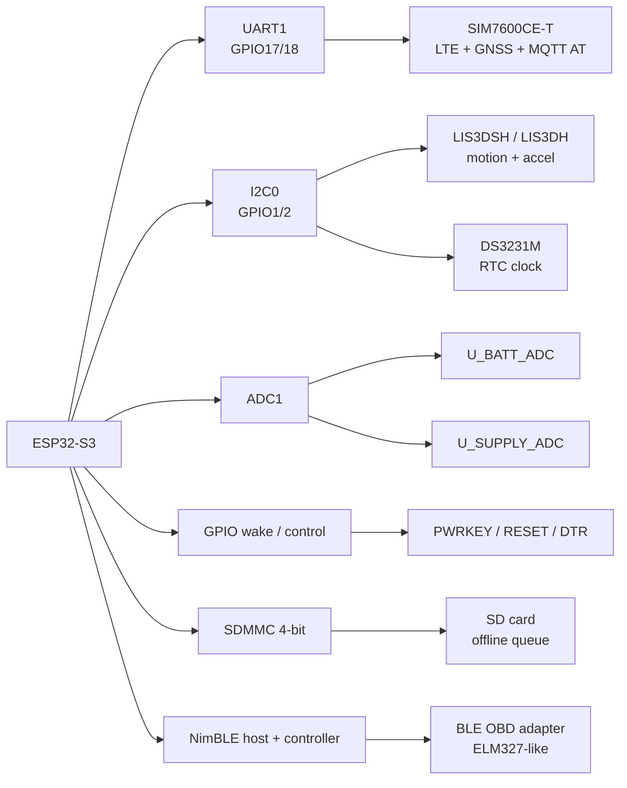
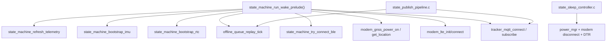

# Bản Đồ Đọc Module Phần Cứng

**Scope:** `iot-vehicle-tracking-system-firmware/components/*`  
**Mục tiêu:** cho người đọc thấy toàn bộ phần cứng đang đi vào firmware bằng bus nào, file nào, state nào, và được gọi từ đâu trong runtime.  
**Last updated:** 2026-05-05

## Cách Dùng Trang Này
Trang này không thay cho các page deep-dive. Nó là bản đồ điều hướng:

1. Xác định module phần cứng muốn hiểu.
2. Xem bus, pin, file driver, file app-core gọi driver đó.
3. Mở page deep-dive tương ứng để đọc call stack, flow, code, log, checkpoint.

## Toàn Cảnh Bus Và Module

## Pin Map Thật Trong Source
Nguồn gốc: `components/platform-board-esp32s3/include/pin_map.h`

| Khối | Pin / bus | Ý nghĩa trong runtime |
|---|---|---|
| `PIN_MODEM_TX` / `PIN_MODEM_RX` | `GPIO17` / `GPIO18` | UART AT tới SIM7600 |
| `PIN_MODEM_PWRKEY` | `GPIO34` | xung bật/tắt modem |
| `PIN_MODEM_RESET` | `GPIO35` | reset cứng modem |
| `PIN_MODEM_DTR` | `GPIO_NUM_NC` | chưa nối DTR thật trong board map hiện tại |
| `PIN_MODEM_STATUS` / `PIN_MODEM_NETLIGHT` | `GPIO_NUM_NC` | source có support đọc, nhưng board map hiện tại chưa nối |
| `PIN_LIS3DSH_SDA` / `PIN_LIS3DSH_SCL` | `GPIO2` / `GPIO1` | bus I2C dùng chung cho IMU |
| `PIN_DS3231_SDA` / `PIN_DS3231_SCL` | `GPIO2` / `GPIO1` | bus I2C dùng chung cho RTC |
| `PIN_LIS3DSH_INT` | `GPIO41` | chân motion interrupt dùng cho wake |
| `PIN_U_SUPPLY_ADC` | `GPIO3` | đo nguồn ngoài / điện áp xe |
| `PIN_U_BATT_ADC` | `GPIO4` | đo nguồn thiết bị |
| `PIN_SDMMC_*` | `GPIO7..13` | giao tiếp thẻ SD để lưu offline queue |

## Không Phải Pin Nào Cũng Đã Thành Một "Module Runtime" Hoàn Chỉnh
Đây là chỗ người mới rất hay đọc nhầm. `pin_map.h` khai báo **toàn bộ wiring mà source biết**, nhưng không phải pin nào cũng đã có một flow nghiệp vụ đầy đủ đi kèm.

| Tín hiệu | Trạng thái trong source hiện tại | Cần mở file nào để xác nhận |
|---|---|---|
| `PIN_USER_LED` | mới khai báo pin, chưa có driver/page flow riêng trong pack này | `components/platform-board-esp32s3/include/pin_map.h` |
| `PIN_LIS3DSH_INT1` / `PIN_LIS3DSH_INT2` | cả hai đều được khai báo, nhưng runtime wake đang dùng alias `PIN_LIS3DSH_INT -> INT1` | `pin_map.h`, `imu_lis3dsh.c`, `state_sleep_controller.c` |
| `PIN_MODEM_STATUS` | có helper `modem_read_status()`, nhưng board map hiện là `GPIO_NUM_NC` | `power_mgr.c`, `pin_map.h` |
| `PIN_MODEM_NETLIGHT` | có helper `modem_read_netlight()`, nhưng board map hiện là `GPIO_NUM_NC` | `power_mgr.c`, `pin_map.h` |
| `PIN_MODEM_DTR` | sleep/wake modem path có support, nhưng board map hiện là `GPIO_NUM_NC` | `power_mgr.c`, `state_sleep_controller.c` |
| `PIN_SDMMC_CD` | đang được dùng thật; `sd_log_store_card_present()` assume active-low (`level == 0`) | `sd_log_store.c`, `pin_map.h` |
| `PIN_SDMMC_WP` | chưa nối (`GPIO_NUM_NC`) nên write-protect không phải nhánh logic runtime hiện tại | `pin_map.h`, `sd_log_store.c` |

## Module -> File -> Nơi Được Gọi
| Module | Driver chính | File app-core chạm tới | Mở từ đâu trước | Câu hỏi đọc code |
|---|---|---|---|---|
| SIM7600 power | `platform-board-esp32s3/src/power_mgr.c` | `adapter-modem-sim7600-at/src/modem_lte_fsm.c`, `state_sleep_controller.c` | `modem_lte_handle_power_on_pulse()` hoặc `state_machine_shutdown_for_sleep()` | modem được bật/tắt/reset thế nào |
| LTE FSM | `adapter-modem-sim7600-at/src/modem_lte.c`, `modem_lte_fsm.c`, `modem_lte_steps.c` | `state_wake_prelude.c` | `state_machine_try_connect_network()` | tại sao có mạng hoặc chưa có mạng |
| GNSS | `adapter-modem-sim7600-at/src/modem_gnss.c` | `state_wake_prelude.c` | `state_machine_try_start_gnss_nonblocking()` | fix GNSS được lấy và recover ra sao |
| MQTT AT | `adapter-mqtt-sim7600-at/src/*.c` | `state_publish_pipeline.c`, `command_handler.c`, `state_wake_prelude.c` | `state_machine_publish_rawdata()` hoặc `tracker_mqtt_publish_with_msg_id_internal()` | rawdata/commands đi qua modem thế nào |
| BLE stack | `adapter-ble-obd-nimble/src/ble_init.c`, `ble_mgr.c` | `state_obd_runtime.c` | `state_machine_try_connect_ble()` | BLE central scan/connect/discover ra sao |
| OBD + ELM327 | `adapter-ble-obd-nimble/src/ble_obd.c` | `state_obd_runtime.c`, `state_wake_prelude.c` | `state_machine_ble_connect_task()` | PID và DTC được hỏi/parse thế nào |
| RTC | `adapter-rtc-ds3231m/src/rtc_ds3231m.c` | `state_wake_prelude.c` | `state_machine_bootstrap_rtc()` | trusted time fallback tới từ đâu |
| IMU | `platform-board-esp32s3/src/imu_lis3dsh.c` | `state_wake_prelude.c`, `state_sleep_controller.c`, `state_publish_pipeline.c` | `state_machine_bootstrap_imu()` hoặc `state_machine_enter_light_sleep()` | wake motion và vibration metric được tạo ra sao |
| ADC | `platform-board-esp32s3/src/adc_reader.c` | `state_wake_prelude.c`, ignition fallback logic | `state_machine_refresh_telemetry()` | điện áp xe/thiết bị được đọc thế nào |
| SD log store | `adapter-storage-sdmmc-fatfs/src/sd_log_store.c` | `offline_queue.c` | `offline_queue_enqueue()` hoặc `offline_queue_replay_tick()` | payload offline được ghi và replay ra sao |

## Hotspots Trong App-Core

## Thứ Tự Đọc Theo Kinh Nghiệm
### Nếu muốn hiểu đường dữ liệu cloud
1. [08-sim7600-lte-gnss-mqtt-at-walkthrough.md](./08-sim7600-lte-gnss-mqtt-at-walkthrough.md)
2. [12-adc-power-and-sd-storage-walkthrough.md](./12-adc-power-and-sd-storage-walkthrough.md)
3. [00-beginner-start-here.md](./00-beginner-start-here.md) phần Flow 5, 6, 8, 9

### Nếu muốn hiểu OBD và BLE
1. [09-ble-obd-elm327-walkthrough.md](./09-ble-obd-elm327-walkthrough.md)
2. `components/app-core/src/state_obd_runtime.c`
3. `components/app-core/src/state_wake_prelude.c`

### Nếu muốn hiểu sleep, wake, rung, thời gian
1. [10-rtc-ds3231m-walkthrough.md](./10-rtc-ds3231m-walkthrough.md)
2. [11-imu-lis3dsh-motion-walkthrough.md](./11-imu-lis3dsh-motion-walkthrough.md)
3. [12-adc-power-and-sd-storage-walkthrough.md](./12-adc-power-and-sd-storage-walkthrough.md)
4. `components/app-core/src/state_sleep_controller.c`

## Những Hiểu Nhầm Rất Dễ Gặp
1. I2C không tách riêng cho RTC và IMU; cả hai chia cùng `I2C_NUM_0`, nên code phải reuse bus handle.
2. IMU trong source không assume duy nhất LIS3DSH; driver probe cả họ LIS3DH legacy và LIS3DSH.
3. `PIN_MODEM_DTR`, `PIN_MODEM_STATUS`, `PIN_MODEM_NETLIGHT` hiện là `GPIO_NUM_NC`; source có logic nhưng board map chưa nối.
4. BLE OBD không chạy trực tiếp trong main loop; connect được đẩy sang worker task rồi trả kết quả qua queue.
5. Offline queue không chỉ là RAM queue; nó đi tới SD, có metadata rotation để sống qua reset.
6. `PIN_SDMMC_CD` đang có ảnh hưởng runtime thật; source assume card detect active-low, không phải "chỉ để khai báo".

## Trang Deep-Dive Liên Quan
- [08-sim7600-lte-gnss-mqtt-at-walkthrough.md](./08-sim7600-lte-gnss-mqtt-at-walkthrough.md)
- [09-ble-obd-elm327-walkthrough.md](./09-ble-obd-elm327-walkthrough.md)
- [10-rtc-ds3231m-walkthrough.md](./10-rtc-ds3231m-walkthrough.md)
- [11-imu-lis3dsh-motion-walkthrough.md](./11-imu-lis3dsh-motion-walkthrough.md)
- [12-adc-power-and-sd-storage-walkthrough.md](./12-adc-power-and-sd-storage-walkthrough.md)
- [13-sleep-wake-hardware-orchestration-walkthrough.md](./13-sleep-wake-hardware-orchestration-walkthrough.md)

## Unresolved Questions
1. Board revision hiện tại có thật sự bỏ trống DTR/STATUS/NETLIGHT hay chỉ chưa cập nhật `pin_map.h`.
2. Cần log thực tế trên board để chốt các timing phần cứng đang đúng với wiring hiện tại.
