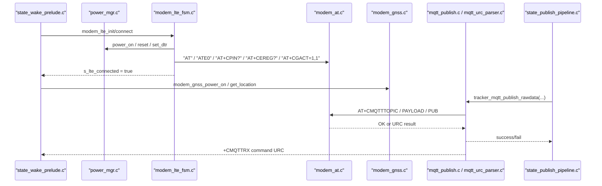
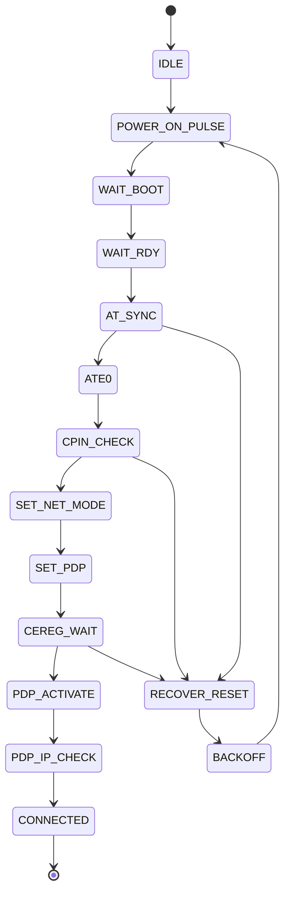
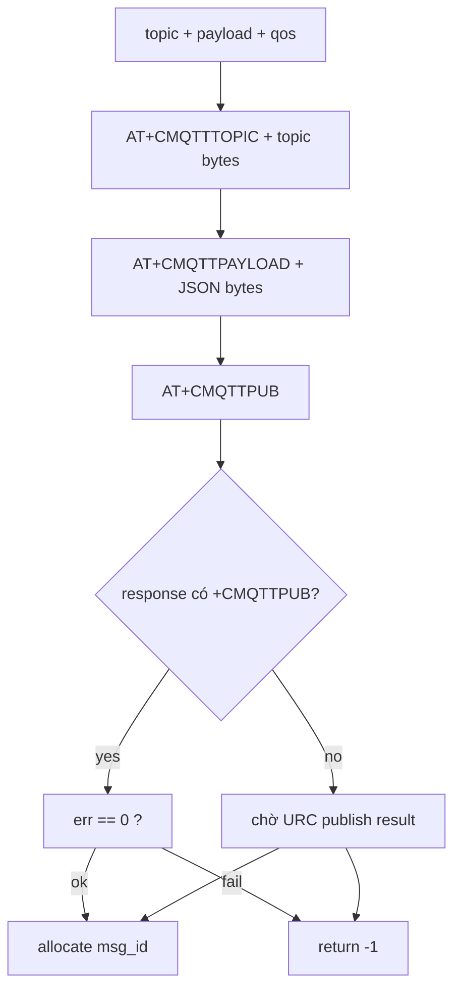

# SIM7600, LTE, GNSS, MQTT AT

**Scope:** modem SIM7600CE-T và toàn bộ đường dữ liệu từ UART AT tới MQTT publish/command receive  
**Files chính:** `power_mgr.c`, `modem_at.c`, `modem_lte*.c`, `modem_gnss.c`, `mqtt_*.c`  
**Mục tiêu:** hiểu từ xung PWRKEY, state LTE, query GNSS, đến `AT+CMQTT*` publish/subscribe  
**Last updated:** 2026-05-05

## 1. Câu Hỏi Mà Trang Này Trả Lời
1. Firmware bật SIM7600 như thế nào.
2. Vì sao kết nối LTE không phải một lệnh duy nhất mà là cả một FSM.
3. GNSS dùng lệnh AT nào, fallback nào, self-heal ra sao.
4. MQTT đi qua `AT+CMQTTTOPIC`, `AT+CMQTTPAYLOAD`, `AT+CMQTTPUB` như thế nào.
5. Incoming command từ cloud được parser ra sao rồi mới vào FSM.

## 2. File Cần Mở Song Song
- `components/platform-board-esp32s3/src/power_mgr.c`
- `components/adapter-modem-sim7600-at/src/modem_at.c`
- `components/adapter-modem-sim7600-at/src/modem_lte.c`
- `components/adapter-modem-sim7600-at/src/modem_lte_fsm.c`
- `components/adapter-modem-sim7600-at/src/modem_lte_steps.c`
- `components/adapter-modem-sim7600-at/src/modem_gnss.c`
- `components/adapter-mqtt-sim7600-at/src/mqtt_client.c`
- `components/adapter-mqtt-sim7600-at/src/mqtt_publish.c`
- `components/adapter-mqtt-sim7600-at/src/mqtt_topics.c`
- `components/adapter-mqtt-sim7600-at/src/mqtt_urc_parser.c`
- `components/app-core/src/state_wake_prelude.c`
- `components/app-core/src/state_publish_pipeline.c`

## 3. Khái Niệm Nền Trước Khi Đọc Code
| Khái niệm | Nghĩa trong codebase này |
|---|---|
| `PWRKEY` | chân bật/tắt SIM7600 bằng xung giữ mức |
| `RESET` | reset cứng modem nếu recovery nặng |
| `DTR` | handshake sleep/wake cho modem; source có support nhưng `pin_map.h` đang `GPIO_NUM_NC` |
| `AT sync` | bước chứng minh UART + modem đang hiểu câu lệnh `AT` |
| `CPIN` | trạng thái SIM sẵn sàng hay chưa |
| `CEREG` | trạng thái đăng ký mạng LTE |
| `PDP` | context dữ liệu di động; code set APN rồi activate |
| `URC` | thông báo bất đồng bộ modem đẩy ra, ví dụ `RDY`, `+CMQTTRX`, `+CMQTTPUB` |
| `CGNSINF` / `CGPSINFO` | hai đường query GNSS; code ưu tiên `CGNSINF`, fallback `CGPSINFO` |
| `CMQTT*` | họ lệnh MQTT của SIM7600 |

## 4. Bức Tranh Tổng


## 5. Tầng 1: Power Control Và Wiring
Nguồn: `power_mgr.c`

### 5.1. Điều đáng chú ý đầu tiên
Driver này không chỉ bật tắt chân GPIO. Nó encode luôn giả định mạch:

- PWRKEY đang qua stage đảo mức.
- RESET cũng qua stage transistor.
- DTR có thể có hoặc không có thật trên board.

Code neo:

```c
#define MODEM_PWRKEY_ON_PULSE_MS 500
#define MODEM_PWRKEY_OFF_PULSE_MS 3000
#define MODEM_PWRKEY_INVERTED_STAGE_DEFAULT 1
#define MODEM_DTR_INVERTED_STAGE 1
```

Đây là lý do không được đọc `gpio_set_level()` theo nghĩa đen. Phải đọc qua hàm bọc:

```c
static void modem_pwrkey_drive(bool asserted) { ... }
static void modem_reset_drive(bool asserted) { ... }
static void modem_dtr_drive(bool high) { ... }
```

### 5.2. Chuỗi bật/tắt modem
Code neo:

```c
esp_err_t modem_power_on(void) {
    return modem_power_key_pulse(MODEM_PWRKEY_ON_PULSE_MS);
}

esp_err_t modem_power_off(void) {
    return modem_power_key_pulse(MODEM_PWRKEY_OFF_PULSE_MS);
}
```

Đọc đúng ý nghĩa:

1. `power_mgr_init()` cấu hình GPIO output/input theo `pin_map.h`.
2. `modem_power_on()` phát xung PWRKEY 500 ms.
3. `modem_power_off()` phát xung PWRKEY 3000 ms.
4. `modem_reset_pulse()` dùng cho recover path.
5. `modem_set_dtr(true/false)` điều khiển sleep hint cho modem nếu board có nối.

### 5.3. Điều phải nhớ khi debug board
- `PIN_MODEM_DTR`, `PIN_MODEM_STATUS`, `PIN_MODEM_NETLIGHT` đang là `GPIO_NUM_NC`.
- Vì thế source có nhánh xử lý `ESP_ERR_NOT_SUPPORTED`; đây là expected path, không phải bug.

## 6. Tầng 2: AT Transport Chung
Nguồn: `modem_at.c`

### 6.1. `modem_at_send()` là primitive chính
Code neo:

```c
esp_err_t modem_at_send(const char *cmd, char *response, size_t resp_len, uint32_t timeout_ms) {
    if (xSemaphoreTake(s_at_lock, pdMS_TO_TICKS(timeout_ms)) != pdTRUE) {
        return ESP_ERR_TIMEOUT;
    }
    modem_at_drain_uart_events();
    modem_at_drain_pending_input(MODEM_RX_BUFFER_SIZE);
    uart_write_bytes(MODEM_UART_NUM, cmd, strlen(cmd));
    esp_err_t err = modem_at_collect_response_until(response, resp_len, timeout_ms, false);
    ...
}
```

Ý nghĩa thực chiến:

1. Có mutex toàn cục `s_at_lock`, nên cùng lúc chỉ một luồng được gửi AT.
2. Trước khi gửi, driver dọn event UART cũ và input pending để tránh response cũ trộn vào response mới.
3. `modem_at_collect_response_until(...)` là chỗ chờ `OK` / `ERROR` / timeout.

### 6.2. Prompt-data path cho MQTT
MQTT không chỉ là `modem_at_send()`. Nó cần giai đoạn `prepare_cmd -> prompt -> data -> final response`.

Code neo:

```c
esp_err_t modem_at_send_prompt_data(const char *prepare_cmd,
                                    const uint8_t *data,
                                    size_t data_len,
                                    char *response,
                                    size_t resp_len,
                                    uint32_t timeout_ms)
```

Flow:

1. Gửi `AT+CMQTTTOPIC=...` hoặc `AT+CMQTTPAYLOAD=...`
2. Chờ prompt `>`
3. Gửi raw topic/payload
4. Chờ phản hồi cuối

Nếu đọc modem path mà bỏ qua hàm này, sẽ không hiểu vì sao MQTT code nhìn như “gửi command rồi chèn data vào giữa”.

## 7. Tầng 3: LTE FSM Không Blocking
Nguồn: `modem_lte.c` + `modem_lte_fsm.c`

### 7.1. Tại sao có FSM
Firmware không muốn block vài chục giây trong một hàm “connect LTE”. Nó dùng state machine và được tick từ wake prelude.

State list thật trong source:

```text
IDLE
POWER_ON_PULSE
WAIT_BOOT
WAIT_RDY
AT_SYNC
ATE0
CPIN_CHECK
SET_NET_MODE
SET_PDP
CEREG_WAIT
PDP_ACTIVATE
PDP_IP_CHECK
CONNECTED
RECOVER_RESET
BACKOFF
```

### 7.2. State machine theo đúng code


### 7.3. Từng state làm gì
| State | Lệnh / hành động | Ý nghĩa |
|---|---|---|
| `POWER_ON_PULSE` | `modem_power_on()` | phát xung PWRKEY |
| `WAIT_BOOT` | `modem_at_init()`, register URC `RDY` | chuẩn bị UART, chờ modem boot |
| `WAIT_RDY` | poll URC | mở gate khi thấy `RDY` hoặc timeout sang AT sync |
| `AT_SYNC` | `AT` | chứng minh modem trả `OK` |
| `ATE0` | `ATE0` | tắt echo |
| `CPIN_CHECK` | `AT+CPIN?` | chờ SIM ready |
| `SET_NET_MODE` | `AT+CNMP=2` | chọn network mode |
| `SET_PDP` | `AT+CGDCONT=1,"IP","<apn>"` | set APN |
| `CEREG_WAIT` | `AT+CEREG?` | chờ đăng ký mạng |
| `PDP_ACTIVATE` | `AT+CGACT=1,1` | bật PDP |
| `PDP_IP_CHECK` | `AT+CGPADDR=1` | xác nhận đã có IP |

### 7.4. Code neo cực quan trọng
```c
static esp_err_t modem_lte_handle_at_sync(uint64_t now_ms) {
    esp_err_t err = modem_at_send("AT\r", response, sizeof(response), ...);
    bool at_ready = err == ESP_OK && strstr(response, "OK") != NULL;
    ...
}
```

```c
static esp_err_t modem_lte_handle_cpin_check(uint64_t now_ms) {
    esp_err_t err = modem_at_send("AT+CPIN?\r", response, sizeof(response), ...);
    bool cpin_ready = (err == ESP_OK) && (strstr(response, "+CPIN: READY") != NULL);
    ...
}
```

```c
static esp_err_t modem_lte_handle_set_pdp(uint64_t now_ms) {
    snprintf(pdp_cmd, sizeof(pdp_cmd), "AT+CGDCONT=1,\"IP\",\"%s\"\r", s_active_apn);
    ...
}
```

### 7.5. Fast-path ít ai để ý
`modem_lte_try_resume_alive_modem()` thử gửi `AT` trước khi đụng PWRKEY/RESET. Nếu modem còn sống thì FSM nhảy thẳng sang `ATE0`.

Điều này giải thích log:

```text
startup fast-path: modem alive, skip PWRKEY/RESET pulse
```

### 7.6. Recover và backoff
Nếu `AT sync`, `CPIN`, hoặc `CEREG` fail quá ngưỡng, code không spam mãi. Nó vào reset hoặc backoff theo `retry_state_t`.

Đọc LTE path mà không đọc `retry_state_can_run()` sẽ dễ hiểu nhầm rằng firmware “đang đứng im”.

## 8. Tầng 4: GNSS Trên Cùng Modem
Nguồn: `modem_gnss.c`

### 8.1. GNSS không chỉ có một lệnh
Code cố gắng tương thích nhiều firmware behavior của modem:

1. Hỏi trạng thái `AT+CGNSPWR?`
2. Fallback hỏi `AT+CGPS?`
3. Bật bằng `AT+CGNSPWR=1`
4. Fallback bật bằng `AT+CGPS=1`
5. Query fix bằng `AT+CGNSINF`
6. Fallback query bằng `AT+CGPSINFO`

### 8.2. Power-on flow
Code neo:

```c
resume_err = modem_at_send("AT+CGNSPWR?\r", ...)
resume_err = modem_at_send("AT+CGPS?\r", ...)
err = modem_at_send("AT+CGNSPWR=1\r", ...)
err = modem_at_send("AT+CGPS=1\r", ...)
```

Đây không phải duplication vô nghĩa. Nó là compatibility ladder.

### 8.3. Query flow
Code neo:

```c
last_err = modem_at_send("AT+CGNSINF\r", response, ..., MODEM_GNSS_QUERY_TIMEOUT_MS);
```

Fallback:

```c
err = modem_at_send("AT+CGPSINFO\r", response, ..., MODEM_GNSS_QUERY_TIMEOUT_MS);
```

### 8.4. Self-heal và no-fix recovery
GNSS path có hai kiểu recovery:

- query fail liên tiếp -> repower GNSS
- không có fix quá lâu -> power-cycle theo cooldown khác

Đây là lý do bạn có thể thấy log:

```text
GNSS self-heal repower executed
GNSS no-fix recover stage=power-off done; power-on due in ...
```

### 8.5. Quan hệ với wake prelude
`state_machine_run_wake_prelude()` gọi:

1. `state_machine_try_start_gnss_nonblocking()`
2. `state_machine_refresh_telemetry(read_gnss=true, ...)`
3. GNSS chỉ bị poll khi `modem_lte_is_initialized()` và `modem_gnss_is_query_ready()` đều đúng

Nghĩa là GNSS không phải root cause độc lập. Nếu LTE chưa lên, GNSS path cũng chưa được hỏi.

## 9. Tầng 5: MQTT AT Qua SIM7600
Nguồn: `mqtt_client.c`, `mqtt_topics.c`, `mqtt_publish.c`, `mqtt_urc_parser.c`

### 9.1. Topic được build như thế nào
Code neo:

```c
snprintf(s_topic_rawdata, sizeof(s_topic_rawdata), "v1/%s/rawdata", s_cfg.device_id);
snprintf(s_topic_commands, sizeof(s_topic_commands), "v1/%s/commands", s_cfg.device_id);
```

QoS theo wrapper:

- `rawdata` -> QoS 0
- `status` -> QoS 1
- `events` -> QoS 1
- `firmware` -> QoS 1
- `commands` subscribe -> QoS 1

### 9.2. Publish theo từng stage
Code neo:

```c
snprintf(cmd, sizeof(cmd), "AT+CMQTTTOPIC=%d,%u\r", MQTT_CLIENT_INDEX, topic_len);
tracker_mqtt_input_data(cmd, topic, "+CMQTTTOPIC:", true)

snprintf(cmd, sizeof(cmd), "AT+CMQTTPAYLOAD=%d,%u\r", MQTT_CLIENT_INDEX, payload_len);
tracker_mqtt_input_data(cmd, payload, "+CMQTTPAYLOAD:", true)

snprintf(cmd, sizeof(cmd), "AT+CMQTTPUB=%d,%d,%u,0,0\r", MQTT_CLIENT_INDEX, qos, MQTT_DEFAULT_PUBLISH_TIMEOUT_S);
tracker_mqtt_send_cmd(...)
```

### 9.3. Đọc đúng nghĩa của `tracker_mqtt_publish_with_msg_id_internal()`


### 9.4. Subscribe command topic
Code neo:

```c
snprintf(cmd, sizeof(cmd), "AT+CMQTTSUB=%d,%u,1\r", MQTT_CLIENT_INDEX, topic_len);
tracker_mqtt_input_data(cmd, s_topic_commands, "+CMQTTSUB:", true)
```

Nếu mất kết nối đúng lúc subscribe, code có nhánh:

```text
CMQTTSUB deferred because MQTT disconnected
```

### 9.5. URC parser là nơi giữ trạng thái bất đồng bộ
`mqtt_urc_parser.c` làm các việc:

1. parse integer list trong các line `+CMQTT...`
2. đánh dấu disconnected khi gặp error code network
3. ghép các chunk RX của `+CMQTTRX`
4. chờ publish result nếu response trực tiếp không chứa đủ `+CMQTTPUB`

Mental model đúng:

- `mqtt_publish.c` xử lý publish chủ động
- `mqtt_urc_parser.c` xử lý event bất đồng bộ
- `command_handler.c` parse JSON command sau khi URC parser giao payload hoàn chỉnh

## 10. Từ App-Core Gọi Xuống Như Thế Nào
### 10.1. Wake prelude
`state_machine_run_wake_prelude()` là nơi:

1. tick LTE connect
2. tick MQTT connect
3. tick GNSS
4. xử lý command
5. replay offline queue khi online

### 10.2. Publish pipeline
`state_publish_via_pipeline()` không tự format AT command. Nó chỉ:

1. build JSON payload
2. gọi `tracker_mqtt_publish_*`
3. nếu fail thì enqueue sang offline queue

### 10.3. Cloud command receive
URC parser nhận topic `commands`, ghép payload, rồi callback sang command handler. Command không chạy nặng trong callback; nó được stage và FSM consume sau.

## 11. Checklist Đọc Theo Đúng Trật Tự
1. Mở `power_mgr.c` để hiểu phần cứng control line.
2. Mở `modem_at.c` để hiểu primitive UART AT và prompt-data.
3. Mở `modem_lte_fsm.c` để hiểu state LTE.
4. Mở `modem_gnss.c` để hiểu GNSS ladder + self-heal.
5. Mở `mqtt_publish.c` và `mqtt_urc_parser.c` để hiểu publish/receive.
6. Quay lại `state_wake_prelude.c` để xem app-core tick những driver này khi nào.

## 12. Log Và Checkpoint Nên Nhìn
| Log keyword | Nghĩa |
|---|---|
| `fsm transition from=... to=...` | LTE FSM đang đổi state |
| `RDY gate open` | modem đã qua gate boot marker |
| `AT sync ready` | UART + modem đang hiểu lệnh AT |
| `CPIN wait` | SIM chưa ready hoặc chưa cắm |
| `CEREG n=... stat=...` | trạng thái đăng ký mạng |
| `pdp profile configured` | APN đã set |
| `lte connected pdp_active=1` | LTE data path đã lên |
| `GNSS power-on accepted` | engine GNSS đã bật |
| `GNSS query attempt` / `GNSS fallback query attempt` | đang hỏi fix |
| `publish failed stage=topic|payload|pub|result` | MQTT fail ở đúng stage nào |
| `mqtt subscribed topic_class=commands` | command topic đã subscribe |

## 13. Nguồn Nền Để Đối Chiếu
- ESP-IDF UART / sleep / driver behavior: <https://docs.espressif.com/projects/esp-idf/en/stable/esp32/>
- SIM7600 MQTT AT manual: <https://simcom.ee/documents/SIM7500E/SIM7500_SIM7600%20Series_MQTT_ATC_V1.01.pdf>

## Unresolved Questions
1. `AT+CNMP=2` đang được dùng như net mode cố định; cần chốt có đúng với yêu cầu operator/field hay không.
2. Cần capture serial log thật của nhánh `+CMQTTRX` để map đầy đủ path publish result và command result trên board hiện tại.
