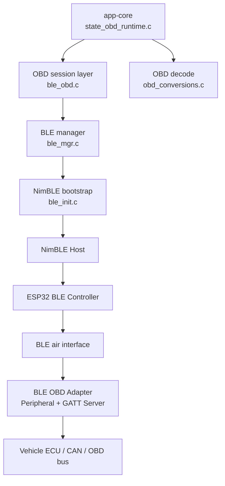
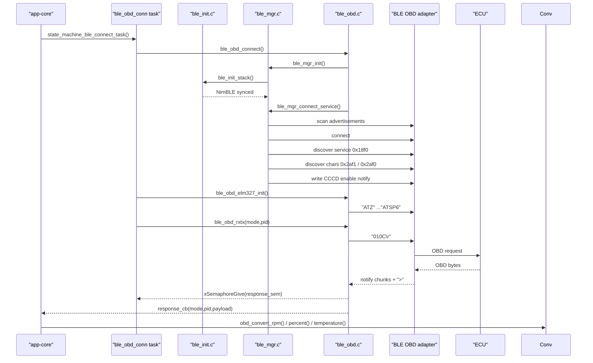
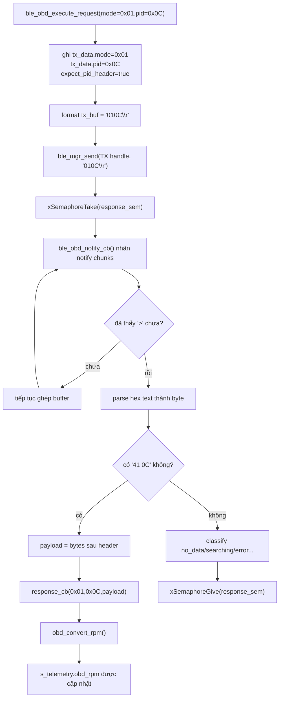
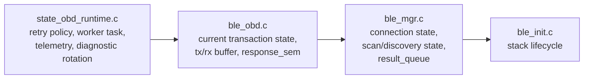

# BLE OBD, NimBLE, ELM327: Code Walkthrough Sát Cách Đọc Code Thực Tế

**Scope:** từ lúc app-core quyết định thử nối BLE OBD cho tới lúc byte OBD được biến thành RPM, speed, nhiệt độ, readiness, DTC  
**Đọc cùng file:** `state_obd_runtime.c`, `ble_init.c`, `ble_mgr.c`, `ble_obd.c`, `obd_conversions.c`, `obd.h`  
**Last updated:** 2026-05-05

## 1. Trang này dùng để làm gì
Trang này không cố "giải thích BLE chung chung". Nó dùng để giúp người chưa biết BLE vẫn có thể ngồi vào codebase này và đọc được đường đi thật của firmware:

1. app-core quyết định khi nào mới thử BLE
2. NimBLE stack được dựng ra sao
3. scan ra thiết bị nào thì connect
4. connect xong discover service và characteristic kiểu gì
5. vì sao phải subscribe notification
6. vì sao `response_sem` tồn tại
7. một request `"010C\r"` đi qua những hàm nào trước khi thành `RPM`

Nếu đọc xong trang này, mục tiêu không phải là "thuộc vài UUID", mà là:

- biết nên mở file nào trước
- biết callback nào là xương sống
- biết branch thành công và branch lỗi ở đâu
- nhìn log là đoán được đang chết ở tầng BLE hay tầng ELM327/ECU

## 2. Cách đọc đúng phần BLE trong repo này
Sai lầm dễ gặp nhất là mở `ble_obd.c` trước, thấy `"ATZ\r"` hay `"010C\r"` rồi tưởng BLE ở đây giống hệt một cổng UART không dây.

Thực tế, phần này có **2 lớp giao tiếp chồng lên nhau**:

1. **BLE/GATT**: ESP32 nói chuyện với adapter BLE OBD.
2. **ELM327/OBD**: adapter nói chuyện với ECU của xe.

Nói cách khác:

- ESP32 **không nói chuyện thẳng với ECU qua BLE**
- ESP32 nói với **adapter BLE**
- adapter nhận text command kiểu ELM327
- adapter tự chuyển tiếp xuống bus OBD/CAN của xe

Vì vậy phải đọc theo thứ tự sau:

1. `state_obd_runtime.c`: ai là chủ flow ở app-core
2. `ble_init.c`: BLE stack được dựng và hạ ra sao
3. `ble_mgr.c`: scan/connect/discover/notify ở tầng GAP + GATT
4. `ble_obd.c`: contract riêng của adapter OBD này
5. `obd_conversions.c`: byte ECU được đổi thành giá trị vật lý như thế nào

## 3. Nếu bạn chưa biết gì về BLE, cần nắm 8 khái niệm này trước

### 3.1. BLE không phải "UART radio"
BLE không phải kiểu "mở socket rồi ném byte qua lại vô nghĩa". BLE có model dữ liệu riêng:

- **advertising**: thiết bị phát thông tin ngắn để người khác nhìn thấy
- **connection**: hai bên bắt tay để vào phiên giao tiếp
- **GATT service**: nhóm chức năng
- **characteristic**: ô dữ liệu hoặc endpoint trong service
- **descriptor**: metadata/điều khiển đi kèm characteristic
- **write**: client ghi dữ liệu vào characteristic
- **notify**: server đẩy dữ liệu bất đồng bộ về client

Ở firmware này, ứng dụng phía trên GATT nhìn hơi giống "gửi text, nhận text", nhưng **đó là giao thức ứng dụng của adapter**, không phải bản chất BLE.

### 3.2. Central và Peripheral là ai trong repo này
Đây là map vai trò quan trọng nhất:

| Khái niệm BLE | Trong firmware này là ai |
|---|---|
| Central | ESP32-S3 |
| Peripheral | BLE OBD adapter |
| GATT Client | ESP32-S3 |
| GATT Server | BLE OBD adapter |
| Advertiser | BLE OBD adapter |
| Scanner / Initiator | ESP32-S3 |

Nếu không chốt đúng vai trò này thì rất dễ đọc ngược logic callback trong `ble_mgr.c`.

### 3.3. GAP là gì trong code này
**GAP** lo các việc "tìm thấy nhau và nối vào":

- scan advertisement
- chọn candidate
- connect
- disconnect
- báo event MTU/link/discovery complete

Trong repo này, GAP nằm chủ yếu ở `ble_mgr.c`, đặc biệt là `ble_mgr_gap_event_cb()`.

### 3.4. GATT là gì trong code này
**GATT** lo phần "sau khi đã connect thì nói chuyện trên service/characteristic nào":

- discover service
- discover characteristic
- write vào characteristic TX
- subscribe notification ở characteristic RX

Trong repo này, GATT nằm chủ yếu ở:

- `ble_mgr_gatt_svc_discovered_cb()`
- `ble_mgr_gatt_chr_discovered_cb()`
- `ble_mgr_send()`

### 3.5. ATT là gì và vì sao cần biết
**ATT** là giao thức nền dưới GATT. Bạn không cần thuộc spec để đọc repo này, chỉ cần biết:

- GATT service/characteristic cuối cùng vẫn được truy cập qua các handle ATT
- vì vậy `ble_mgr.c` phải lưu `chr->val_handle`
- notification cũng trả về `attr_handle`

Đây là lý do code so `attr_handle` với RX handle trước khi gọi parser.

### 3.6. Service, characteristic, descriptor trong repo này là gì
Adapter BLE OBD mà repo này đang hỗ trợ có contract như sau:

| Thành phần | UUID | Dùng để làm gì |
|---|---|---|
| Service | `0x18f0` | service OBD của adapter |
| TX characteristic | `0x2af1` | ESP32 ghi lệnh text vào đây |
| RX characteristic | `0x2af0` | adapter notify text response ra đây |

Chú ý: tên TX/RX ở đây là **theo góc nhìn firmware**:

- TX = firmware transmit tới adapter
- RX = firmware receive từ adapter

### 3.7. Notification là gì, vì sao lại cần CCCD
BLE notification là kiểu server chủ động đẩy dữ liệu về client mà không cần client poll liên tục.

Để bật notification, client phải ghi vào một descriptor gọi là **CCCD**. Trong repo này, bước đó xảy ra ở `ble_mgr_gatt_chr_discovered_cb()`:

- tìm đúng characteristic RX
- lấy `chr->val_handle`
- ghi `0x0001` vào CCCD để bật notify

Điểm rất đáng chú ý: code đang giả định CCCD nằm ở `val_handle + 1`. Đây là assumption hợp lý cho profile adapter này, nhưng vẫn là assumption cần nhớ khi debug adapter khác.

### 3.8. Vì sao `response_sem` tồn tại
BLE notification là **bất đồng bộ**. Khi `ble_mgr_send()` ghi `"010C\r"` vào TX characteristic:

- hàm write không tự trả luôn RPM
- adapter có thể trả response thành nhiều chunk notify
- parser phải đợi đến khi thấy prompt `>`

Cho nên `ble_obd_execute_request()` cần một semaphore để:

1. gửi request
2. ngủ chờ transaction hoàn tất
3. được `ble_obd_notify_cb()` đánh thức khi parser xác định xong response

Nếu bỏ semaphore này, code tầng trên sẽ không biết khi nào response thực sự xong.

## 4. Hình tổng quan: phần BLE này thật ra có những tầng nào



Đọc sơ đồ này theo 2 hướng:

- **đi xuống**: khi app muốn hỏi dữ liệu xe
- **đi lên**: khi byte response từ ECU quay về và bị decode thành telemetry

## 5. Hình tổng quan: end-to-end flow trong repo này



## 6. Phần app-core: ai là owner của flow BLE OBD

### 6.1. `state_machine_try_connect_ble()` là cửa vào đúng
Muốn hiểu "BLE bắt đầu lúc nào", hãy bắt đầu từ `state_machine_try_connect_ble()` trong `state_obd_runtime.c`.

Hàm này không làm connect ngay. Nó chỉ quyết định **có nên thử connect lúc này hay chưa**.

Những gate quan trọng:

- đang OTA thì không đụng BLE
- đã có `s_ble_ctx` và còn connected thì không connect lại
- nếu có worker task đang chạy thì không tạo thêm
- phải tôn trọng retry policy theo trạng thái ignition
- có thể bị policy field-validation chặn auto-discover nếu chưa set preferred MAC

Mental model:

- app-core là người ra quyết định
- app-core không trực tiếp đi scan BLE
- app-core spawn worker rồi loop chính tiếp tục chạy

### 6.2. Vì sao phải dùng worker task riêng
`state_machine_ble_connect_task()` tồn tại vì connect BLE không hề "nhanh và chắc":

1. scan có thể mất vài giây
2. connect có thể fail rồi phải scan tiếp
3. service discovery và characteristic discovery đều async
4. ELM327 init còn gửi 6 lệnh liên tiếp
5. prime PID và prime DTC còn mất thêm thời gian

Nếu để main FSM tự làm hết, vòng state machine sẽ bị chặn.

### 6.3. Worker task làm gì, theo đúng thứ tự code
`state_machine_ble_connect_task()` làm 4 bước chính:

1. áp preferred MAC nếu config có và parse được
2. gọi `ble_obd_connect(...)`
3. nếu connect xong thì gọi `ble_obd_elm327_init(...)`
4. nếu ELM327 init xong thì prime sample và prime diagnostic

Branch thành công:

- `result.code = TRACKER_BLE_CONNECT_RESULT_OK`
- `result.ctx = ctx`
- `result.prime_sample_ready = state_machine_prime_obd_after_connect(ctx)`

Branch lỗi:

- connect fail: không có `ctx`
- ELM327 init fail: disconnect rồi trả mã lỗi riêng

### 6.4. Vì sao còn phải prime PID sau khi connect
`state_machine_prime_obd_after_connect()` không phải polling runtime lâu dài. Nó chỉ cố chứng minh:

- link BLE đã sống
- adapter đã hiểu ELM327 commands
- ECU đã trả sample OBD mới

Danh sách PID prime:

- `0x00`: supported PIDs
- `0x0D`: speed
- `0x0C`: RPM
- `0x05`: coolant temp

Code không đòi mọi PID đều thành công. Nó chỉ cần **ít nhất một sample mới** để biết đường dữ liệu đã chạy thật.

### 6.5. Prime DTC và readiness nằm ở đâu
Ngay sau prime sample, worker còn chạy:

- `Mode 01 PID 01`: readiness / monitor status
- stored DTC
- pending DTC
- permanent DTC

Điều này giúp sau khi BLE lên xong, telemetry có ngay snapshot OBD chẩn đoán cơ bản chứ không phải chờ rất lâu.

## 7. `ble_init.c`: NimBLE stack được dựng như thế nào

### 7.1. Đừng tưởng BLE chạy trong call stack của app-core
Trong `ble_init.c`, `ble_task()` gọi:

```c
nimble_port_run();
```

Đây là host loop của NimBLE. Nó chạy trong một FreeRTOS task riêng tên `nimble_host`.

Ý nghĩa:

- BLE event không chạy trong context của app-core
- callback GAP/GATT là do NimBLE host task đẩy lên
- app-core và BLE stack phối hợp qua queue, mutex, semaphore

### 7.2. `ble_init_stack()` làm gì
Thứ tự thật trong code:

1. guard idempotent: nếu stack đã start thì trả `ESP_OK`
2. gọi `nimble_port_init()`
3. gắn callback vào `ble_hs_cfg`
4. gọi `ble_store_config_init()`
5. tạo `s_ble_stop_sem`
6. `xTaskCreatePinnedToCore(...)` để spawn `nimble_host`

Hai callback quan trọng được cắm vào đây:

- `reset_cb`: stack reset vì lý do gì
- `sync_cb`: host stack đã sync, có thể bắt đầu dùng

### 7.3. Vì sao `sync_cb` lại quan trọng
`ble_mgr_init()` không trả ngay sau `ble_init_stack()`. Nó còn chờ `sync_cb` đẩy tín hiệu thành công vào queue.

Nghĩa là:

- "đã tạo task BLE" chưa đủ
- "stack đã sync xong" mới là lúc manager coi BLE sẵn sàng

### 7.4. `ble_stack_deinit()` dọn những gì
Khi cần hạ BLE:

1. `nimble_port_stop()`
2. chờ `ble_task()` thoát và give `s_ble_stop_sem`
3. `nimble_port_deinit()`

Điểm này rất quan trọng khi repo đi vào sleep / shutdown path. Không có chuyện giữ nguyên BLE session sống mãi qua mọi trạng thái nguồn.

## 8. `ble_mgr.c`: nơi GAP và GATT được biến thành API dùng được

## 8.1. Hãy nhìn `ble_mgr_ctx` như "bộ não phiên BLE"
`ble_mgr_ctx` giữ các state then chốt:

| Field | Vai trò |
|---|---|
| `conn_handle` | handle connection ATT/GATT hiện tại |
| `is_connected` | đã hoàn tất connect + discovery thành công chưa |
| `is_connecting` | đang ở giữa scan/connect/discovery không |
| `disc_cfg` | profile cần discover |
| `pending_connect` | candidate vừa chọn từ scan, chờ connect |
| `scan_diag` | thống kê advertisement đã thấy / parse fail / match |
| `svc_disc_ctx` | state discovery service/characteristic |
| `result_queue` | mailbox 1 slot cho kết quả async |
| `lock_mtx` | khóa các public API |

Đọc được struct này là đọc được ý đồ thiết kế:

- manager muốn API tầng trên trông gần synchronous hơn
- nhưng bên trong vẫn phải đi qua callback async của NimBLE

## 8.2. Queue 1 slot ở đây dùng để làm gì
`result_queue` là cầu nối giữa:

- callback async như `sync_cb`, `connect`, `discovery complete`
- caller synchronous như `ble_mgr_init()` và `ble_mgr_connect_service()`

Hình dung:

1. caller gọi hàm
2. hàm khởi động operation async
3. caller chờ queue
4. callback nào hoàn tất operation thì post status vào queue

Đây là pattern chủ đạo của `ble_mgr.c`.

## 8.3. `ble_mgr_init()` không chỉ init struct
`ble_mgr_init()` làm các bước sau:

1. reset context stale nếu cần
2. tạo mutex
3. tạo queue 1 slot
4. gọi `ble_init_stack(&s_ble_init_cfg)`
5. chờ `ble_mgr_gap_stack_sync_cb()` post `BLE_MGR_E_OK`

Nếu chờ sync quá timeout:

- deinit stack
- xóa queue
- xóa mutex
- trả `NULL`

Nghĩa là branch lỗi ở đây vẫn rollback khá sạch.

## 8.4. `ble_mgr_connect_service()` là public entry quan trọng nhất
Đây là hàm mà `ble_obd_connect()` dùng để nói với manager:

"hãy scan, connect và discover đúng profile service/characteristic này cho tao".

Các bước nó làm:

1. lock mutex
2. clear state cũ
3. clear handle characteristic cũ
4. reset `pending_connect`, `scan_diag`, `svc_disc_ctx`
5. start scan bằng `ble_gap_disc(...)`
6. chờ `result_queue`

Nếu chờ quá timeout:

- cancel scan
- cancel connect
- reset cờ `pending_connect`
- trả `BLE_MGR_E_TIMEOUT`

### 8.4.1. Scan ở đây là scan kiểu gì
`s_disc_params` đang set:

- `passive = 0`
- `filter_duplicates = 1`

Tức là code đang dùng **active discovery path**, có lọc duplicate. Điều quan trọng với người đọc code không phải thuộc từng con số interval/window, mà là biết:

- scan không vô hạn
- khi một vòng scan hoàn tất mà chưa có candidate, manager tự start vòng mới

## 8.5. `BLE_GAP_EVENT_DISC`: nơi scan result được chọn hay bỏ
Trong `ble_mgr_gap_event_cb()`, case `BLE_GAP_EVENT_DISC` làm nhiều việc hơn vẻ ngoài:

1. nếu đang connecting hoặc đã connected thì bỏ qua
2. tăng counter `adv_seen`
3. parse advertisement bằng `ble_hs_adv_parse_fields(...)`
4. check advertisement có chứa target service UUID không
5. nếu profile có custom filter thì gọi filter đó
6. nếu candidate được chọn:
   - lưu address vào `pending_connect`
   - set `is_connecting = true`
   - cancel scan
   - gọi `ble_mgr_start_pending_connect(...)`

Đây là nơi **GAP scan** gặp **logic domain OBD**.

## 8.6. Device filter của OBD nằm ở `ble_obd.c`, nhưng được gọi từ manager
`ble_mgr.c` không biết adapter OBD trông ra sao. Nó chỉ biết:

- target service UUID nào
- profile có callback filter hay không

Với OBD profile, callback đó là `ble_obd_device_filter_cb()`. Hàm này quyết định:

### Trường hợp 1: có preferred MAC
Nếu user đã cấu hình MAC adapter:

- chỉ đúng MAC đó mới được chấp nhận
- mọi candidate khác bị bỏ ngay

### Trường hợp 2: không có preferred MAC
Code chấp nhận candidate theo thứ tự ưu tiên:

1. advertisement match service UUID `0x18f0`
2. hoặc tên nhìn giống adapter OBD

Heuristic tên đang có:

- `vgate`
- `icar`
- `icar pro`
- `obd`
- `elm`
- `vlink`
- `viecar`
- `kw9`

Đây là lý do vì sao firmware vẫn có thể tìm ra adapter ngay cả khi advertisement không expose service UUID đẹp.

## 8.7. `BLE_GAP_EVENT_DISC_COMPLETE`: vì sao scan lại tự chạy tiếp
Khi hết một vòng discovery mà chưa connect:

- nếu chưa `is_connecting`
- và chưa `is_connected`

thì manager lại gọi `ble_gap_disc(...)` để mở vòng scan mới.

Đọc chỗ này giúp hiểu vì sao BLE connect ở app-core nhìn như một request dài: thực ra bên trong manager có nhiều vòng scan nhỏ nối tiếp nhau.

## 8.8. `BLE_GAP_EVENT_CONNECT`: connect xong chưa có nghĩa là dùng được
Khi connect BLE thành công, code chưa báo thành công ngay. `ble_mgr_gap_connected_cb()` còn phải:

1. lưu `conn_handle`
2. reset state discovery
3. gọi `ble_gattc_disc_all_svcs(...)`

Điểm này cực quan trọng cho người mới:

- BLE connect thành công chỉ nghĩa là "đã có link layer connection"
- muốn dùng đúng service OBD thì còn phải **discover GATT**

## 8.9. `ble_mgr_gatt_svc_discovered_cb()`: service match ở đâu
Callback này duyệt các service mà server expose.

Nếu UUID service trùng `disc_cfg->svc_def->service_uuid`:

- set `chr_disc_started = true`
- gọi `ble_gattc_disc_all_chrs(...)` trong phạm vi handle của service đó

Tức là:

- manager discover tất cả service
- nhưng chỉ drill-down vào đúng service OBD đang cần

## 8.10. `ble_mgr_gatt_chr_discovered_cb()`: handle characteristic được lấy ở đây
Khi characteristic callback chạy:

1. convert UUID của characteristic thành string
2. so với danh sách char mà profile yêu cầu
3. nếu match thì lưu `chr->val_handle`

Từ thời điểm này:

- TX handle sẽ dùng cho `ble_mgr_send()`
- RX handle sẽ dùng để route notification vào parser

Nếu characteristic có `notify_cb`, code còn làm thêm một việc rất quan trọng:

- ghi `0x0001` vào CCCD để bật notification

Điểm tinh tế:

- write này là một GATT write riêng
- nó không phải gửi lệnh OBD
- nó chỉ bật đường cho adapter được phép push notify

## 8.11. Khi nào manager mới báo "connect thành công thật sự"
`ble_mgr_gatt_svc_chr_disc_completed_check()` là nơi chốt.

Nó chỉ post `BLE_MGR_E_OK` nếu:

1. discovery callback đã đi tới trạng thái hoàn tất
2. tất cả characteristic required đều có handle khác 0

Điều này rất hay khi debug:

- connect BLE có thể thành công
- service discovery có thể thành công
- nhưng vẫn fail overall nếu thiếu TX hoặc RX characteristic

## 8.12. `BLE_GAP_EVENT_NOTIFY_RX`: notification được route thế nào
Khi có notify:

1. `ble_mgr_gap_notification_cb()` nhận `attr_handle`
2. duyệt danh sách char đã discover
3. nếu `handle == attr_handle` và char đó có `notify_cb`
4. gọi callback của profile

Với OBD profile, callback đó chính là `ble_obd_notify_cb()`.

Đây là cây cầu từ tầng BLE manager sang tầng parser OBD.

## 8.13. `ble_mgr_send()`: gửi request thật sự đi bằng gì
`ble_mgr_send()` kiểm tra:

1. `mgr_ctx` có hợp lệ không
2. có lock được mutex không
3. `is_connected` có đang true không

Sau đó gọi:

```c
ble_gattc_write_flat(mgr_ctx->conn_handle, chr_handle, data, len, NULL, NULL);
```

Tức là TX OBD command ở đây thực chất là **GATT write vào characteristic TX**.

## 8.14. `ble_mgr_disconnect()`: disconnect không phải fire-and-forget
Hàm này:

1. gọi `ble_gap_terminate(...)`
2. poll một đoạn thời gian ngắn
3. chờ `conn_handle`, `is_connected`, `is_connecting` về trạng thái rỗng

Mục đích là tránh upper layer tưởng đã disconnect xong trong khi event disconnect chưa chạy.

## 9. `ble_obd.c`: tầng session riêng của adapter OBD này

## 9.1. Hãy nhìn `ble_obd_ctx` như state của một "phiên terminal OBD"
`ble_obd_ctx` có 4 cụm state chính:

### A. BLE session handle
- `mgr_ctx`
- `response_cb`
- `usr_ctx`

### B. Đồng bộ transaction
- `api_mutex`
- `response_sem`

### C. Metadata của request hiện tại
- `tx_data.mode`
- `tx_data.pid`
- `expect_pid_header`
- `expect_obd_response`
- `got_valid_payload`

### D. Bộ đệm response đang ghép
- `rx_data.buf`
- `rx_data.len`
- `rx_data.has_error`

Nếu phải chọn một struct duy nhất để hiểu design của phần OBD này, hãy chọn struct này.

## 9.2. `ble_obd_connect()`: dựng OBD session bằng cách ghép manager + parser
`ble_obd_connect()` làm các bước:

1. gọi `ble_mgr_init(1000)`
2. `calloc` một `ble_obd_ctx`
3. tạo `api_mutex`
4. tạo `response_sem`
5. gắn `ble_obd_notify_cb` vào RX characteristic definition
6. gọi `ble_mgr_connect_service(...)`

Điểm quan trọng:

- `ble_obd.c` không tự scan BLE
- nó reuse manager
- nhưng nó áp profile OBD của riêng mình vào manager

## 9.3. OBD profile được đóng gói sẵn trong `s_obd_disc_cfg`
Static profile này chỉ ra cho manager:

- service UUID nào cần
- các characteristic nào bắt buộc
- callback filter nào dùng khi scan
- callback disconnected policy nào dùng khi link rớt

Nhờ đó `ble_mgr.c` là generic-ish, còn `ble_obd.c` là adapter-specific.

## 9.4. Vì sao disconnected callback trả `false`
`ble_obd_disconnected_cb()` trả `false`, nghĩa là:

- manager không tự auto-reconnect ở tầng thấp
- quyền quyết định reconnect nằm ở app-core retry policy

Đây là lựa chọn kiến trúc tốt, vì reconnect của firmware còn phụ thuộc ignition, OTA, sleep, backoff.

## 10. Parser response: trái tim thật sự nằm ở `ble_obd_notify_cb()`

## 10.1. Đây là callback quan trọng nhất của toàn bộ BLE OBD flow
Mọi điều thú vị nhất đều hội tụ ở đây:

- response bị chunk thì ghép lại
- text có `SEARCHING...` hay `NO DATA` thì phân loại
- hex response hợp lệ thì extract payload
- transaction hoàn tất thì release semaphore

Nếu bạn chỉ định đọc kỹ một hàm trong phần BLE, hãy đọc kỹ hàm này.

## 10.2. Bước 1: guard đúng RX handle
Callback nhận `attr_handle`. Nó chỉ xử lý nếu:

- `ble_obd_rx_handle()` khác 0
- `attr_handle` đúng bằng RX handle

Điều này tránh parse nhầm notification từ handle khác.

## 10.3. Bước 2: append chunk vào buffer
Adapter có thể trả response qua nhiều notify nhỏ. Code:

1. tính `free_space`
2. append vào `rx_data.buf`
3. tăng `rx_data.len`
4. nếu tràn thì tăng counter `rx_overflow`

Đây là chỗ trả lời câu hỏi:

"Tại sao response của một lệnh không được parse ngay ở từng notify?"

Vì một notify chưa chắc đã chứa full response.

## 10.4. Bước 3: chờ prompt `>`
ELM327-style adapter thường kết thúc transaction bằng prompt `>`.

Code kiểm:

- chunk hiện tại có `>` không
- hoặc toàn buffer đã có `>` chưa

Nếu chưa thấy prompt:

- callback return ngay
- transaction vẫn đang mở

Prompt là dấu hiệu cực quan trọng: nó nói rằng adapter đã trả xong đợt hiện tại.

## 10.5. Bước 4: parse text hex thành byte
Khi có prompt, `ble_obd_parse_hex_response()` chạy.

Hàm này:

1. copy response sang `parse_buf`
2. thay `>` bằng khoảng trắng
3. tách token bằng delimiter như space, CR, LF, comma, colon
4. với token nào có độ dài chẵn và gồm hex digit
5. bẻ thành từng cặp 2 ký tự hex
6. `strtol(..., 16)` thành byte

Điều này cho phép parser sống được với khá nhiều kiểu format text của adapter:

- `41 0C 1A F8`
- `410C1AF8`
- text trộn newline / space / dấu câu

## 10.6. Bước 5: validate response có đúng request hiện tại không
Đây là chỗ quan trọng nhất về mặt tư duy:

code không tin mọi byte hex vừa parse ra.

Nó chỉ coi là OBD response hợp lệ nếu tìm thấy:

1. một byte bằng `mode + 0x40`
2. nếu request có PID thì byte kế tiếp phải đúng PID

Ví dụ:

- request: `01 0C`
- response hợp lệ phải có header `41 0C`

Trong code:

```text
request mode = 0x01
expected response mode = 0x41
expected pid = 0x0C
```

Nghĩa là parser không chỉ hỏi "có hex hay không", mà hỏi:

"hex này có đúng là câu trả lời cho request hiện tại không?"

## 10.7. Bước 6: phân loại trạng thái ECU nếu response không hợp lệ
Nếu không thấy payload OBD hợp lệ, code không kết luận vội là BLE hỏng.

Nó còn classify `last_response_state`:

- `live`
- `stopped`
- `no_data`
- `searching`
- `error`
- `unknown`

Classification này dựa trên text response:

- chứa `stopped`
- chứa `no data`
- chứa `searching`
- chứa `error`
- chứa `unable to connect`
- hoặc xuất hiện `?`

Điểm này rất thực chiến:

- BLE vẫn có thể hoàn toàn sống
- adapter vẫn notify bình thường
- nhưng ECU chưa trả data hữu ích

## 10.8. Bước 7: callback lên app-core nếu có payload hợp lệ
Nếu valid:

1. `got_valid_payload = true`
2. tăng `notify_valid`
3. gọi `response_cb(mode, pid, payload, payload_len, usr_ctx)`

Lưu ý:

- `payload` lúc này đã bỏ header mode/pid
- app-core không cần tự bóc `41 0C`
- app-core chỉ nhận phần payload đúng nghĩa

## 10.9. Bước 8: reset buffer và release semaphore
Dù valid hay invalid, khi đã thấy prompt và kết thúc transaction:

1. `ble_obd_response_reset(ctx)`
2. `xSemaphoreGive(ctx->response_sem)`

Đây là lý do request path ở `ble_obd_execute_request()` có thể chờ một cách "gần synchronous".

## 11. Hình transaction: từ `"010C\r"` tới `RPM`



## 12. `ble_obd_send_raw()` và `ble_obd_execute_request()` khác nhau ở đâu

### 12.1. `ble_obd_send_raw()`
Dùng cho lệnh kiểu adapter control:

- `ATZ`
- `ATE0`
- `ATL0`
- `ATS0`
- `ATH0`
- `ATSP6`

Điểm chính:

- `expect_obd_response = false`
- không đòi response mode/pid
- chỉ chờ transaction khép lại bằng prompt

### 12.2. `ble_obd_execute_request()`
Dùng cho request OBD thật:

- mode 01 + PID
- hoặc mode chẩn đoán không có PID như mode 03

Điểm chính:

- set metadata request trước khi gửi
- bắt parser phải validate đúng response header
- chỉ thành công nếu `got_valid_payload == true`

## 13. ELM327 init: từng lệnh đang chuẩn bị điều gì cho parser

## 13.1. Chuỗi init thật trong code
`ble_obd_elm327_init()` gửi lần lượt:

1. `ATZ\r`
2. `ATE0\r`
3. `ATL0\r`
4. `ATS0\r`
5. `ATH0\r`
6. `ATSP6\r`

## 13.2. Ý nghĩa từng lệnh theo đúng ngữ cảnh code này

### `ATZ`
Reset adapter về trạng thái sạch.

Vì sao cần:

- tránh inherit state lạ từ phiên cũ
- đảm bảo prompt và format response về baseline dễ đoán hơn

### `ATE0`
Tắt echo.

Nếu echo còn bật, khi gửi `"010C\r"` bạn có thể bị trả cả `"010C"` lẫn response thực. Parser sẽ khó phân biệt đâu là request, đâu là response.

### `ATL0`
Tắt linefeed.

Mục tiêu là làm text response gọn hơn, ít nhiễu định dạng hơn.

### `ATS0`
Tắt khoảng trắng.

Parser hiện tại vẫn sống được với response có khoảng trắng, nhưng tắt spaces giúp output ổn định hơn.

### `ATH0`
Tắt header CAN.

Mục tiêu:

- output ngắn hơn
- parser phía trên không phải lọc thêm phần CAN header

### `ATSP6`
Ép protocol về profile đang kỳ vọng.

Ở đây firmware chọn một protocol cụ thể thay vì auto-everything. Điều này giảm độ bất định nếu target fleet tương đối đồng nhất, nhưng cũng là nơi cần cẩn thận nếu triển khai ra dải xe rộng hơn.

## 13.3. Vì sao init này không chỉ là "test adapter"
Chuỗi init này đang làm một việc lớn hơn:

"biến text stream của adapter thành format đủ ổn định để parser code hiện tại sống được".

Nói thẳng: parser ở `ble_obd_notify_cb()` đang dựa khá nhiều vào assumption rằng:

- echo đã tắt
- line format đủ sạch
- prompt `>` xuất hiện chuẩn

## 14. App-core decode payload thành telemetry như thế nào

## 14.1. `state_machine_obd_response_cb()` là biên giữa transport và business
Khi `ble_obd_notify_cb()` đã validate xong payload, callback đi lên `state_machine_obd_response_cb()`.

Đây là boundary rất quan trọng:

- `ble_obd.c` chỉ lo vận chuyển, transaction, parser
- `state_obd_runtime.c` mới lo nghĩa business của payload

## 14.2. Các nhánh decode chính

### Readiness
Nếu:

- `mode == OBD_MODE_CURRENT_DATA`
- `pid == OBD_PID_MONITOR_STATUS`

thì gọi `state_machine_decode_readiness_payload(...)`.

### Stored / pending / permanent DTC
Nếu mode là:

- stored DTC
- pending DTC
- permanent DTC

thì gọi `state_machine_decode_dtc_payload(...)`.

### Scalar live data
Nếu PID là:

- `0x0C`: RPM -> `obd_convert_rpm()`
- `0x0D`: speed -> lấy `data[0]`
- `0x05`: coolant temp -> `obd_convert_temperature()`
- `0x2F`: fuel level -> `obd_convert_percent()`
- `0x04`: engine load -> `obd_convert_percent()`

Khi update thành công, code update `s_last_obd_sample_ms`.

## 14.3. Ví dụ thật: RPM được tính ra sao
Giả sử adapter trả text:

```text
41 0C 1A F8 >
```

Parser trong `ble_obd_notify_cb()` sẽ:

1. tìm `41 0C`
2. bóc payload còn lại là `1A F8`
3. gọi `response_cb(mode=0x01, pid=0x0C, data=[0x1A, 0xF8])`

Sau đó `state_machine_obd_response_cb()` gọi:

```text
obd_convert_rpm(data=[0x1A, 0xF8])
```

Và `obd_conversions.c` tính:

```text
RPM = ((0x1A << 8) | 0xF8) / 4
    = (0x1AF8) / 4
    = 6904 / 4
    = 1726 rpm
```

Đây là ví dụ quan trọng vì nó nối được toàn bộ chuỗi:

- BLE notify
- parser
- callback
- conversion
- telemetry field

## 15. Hình stack logic: ai giữ state gì



Nhìn hình này sẽ dễ debug hơn:

- lỗi retry/backoff: nhìn app-core
- lỗi request/response, parser, prompt: nhìn `ble_obd.c`
- lỗi scan/connect/discovery: nhìn `ble_mgr.c`
- lỗi stack start/stop: nhìn `ble_init.c`

## 16. Đọc log theo đúng câu hỏi

## 16.1. Nếu nghi BLE stack chưa lên
Tìm log kiểu:

- `BLE init stage=...`
- `Creating NimBLE host task ...`
- `NimBLE host synced`

Nếu chưa thấy sync, đừng nhảy sang nghi parser OBD.

## 16.2. Nếu nghi scan không ra adapter
Tìm:

- `BLE adv #...`
- `BLE candidate discovered service-match ...`
- `BLE candidate discovered name-match ...`
- `BLE connect mode: auto-discover ...`

Nếu scan thấy nhiều advertisement nhưng không có candidate, hãy nhìn:

- preferred MAC có đang sai không
- advertisement có service UUID `0x18f0` không
- tên adapter có match heuristic không

## 16.3. Nếu nghi connect BLE fail
Tìm:

- `Starting BLE connect addr=...`
- `BLE connection failed: ...`
- `Failed to restart discovery after connect failure`

Đây là vùng của `ble_mgr.c`, chưa cần đổ lỗi cho ELM327.

## 16.4. Nếu nghi connect xong nhưng không discover ra TX/RX
Tìm:

- `Service discovery start failed`
- `Characteristic discovery start failed`
- `Failed to subscribe to notifications`

Đây là tầng GATT discovery/subscription.

## 16.5. Nếu nghi BLE sống nhưng ECU không trả data usable
Tìm:

- `ELM327 init failed at step ...`
- `obd invalid_response count=... state=no_data|searching|error`
- `OBD prime finished without fresh PID sample ...`

Đây là nơi transport có thể vẫn ổn nhưng response business không usable.

## 16.6. Nếu nghi decode business sai
Tìm:

- `state_machine_obd_response_cb()`
- `obd_convert_rpm()`
- `obd_convert_temperature()`
- `obd_convert_percent()`

Lúc này phải tách bạch:

- parser đã bóc payload đúng chưa
- hay conversion business đang hiểu sai payload

## 17. Bản đồ câu hỏi -> mở file nào

| Câu hỏi | Mở từ đâu |
|---|---|
| Vì sao main loop không bị block khi BLE scan lâu | `state_machine_try_connect_ble()` -> `state_machine_ble_connect_task()` |
| Vì sao scan thấy adapter mà vẫn không connect | `ble_mgr_gap_event_cb()` -> `ble_mgr_start_pending_connect()` |
| Vì sao connect BLE thành công nhưng vẫn không dùng được OBD | `ble_mgr_gatt_svc_discovered_cb()` -> `ble_mgr_gatt_chr_discovered_cb()` |
| Vì sao gửi `"010C\r"` mà không có RPM | `ble_obd_execute_request()` -> `ble_obd_notify_cb()` |
| Vì sao có response nhưng bị coi là invalid | `ble_obd_parse_hex_response()` + header validation trong `ble_obd_notify_cb()` |
| Vì sao có payload đúng mà telemetry vẫn chưa update | `state_machine_obd_response_cb()` + `obd_conversions.c` |

## 18. 3 lỗi nhận thức rất hay gặp khi mới đọc phần này

### Lỗi 1: "Connect BLE thành công là đủ"
Không đúng. Còn phải:

- discover đúng service
- discover đúng characteristic
- subscribe notify thành công

### Lỗi 2: "Có notify là parser sẽ hiểu"
Không đúng. Notify có thể:

- chưa đủ chunk
- chỉ là text `SEARCHING...`
- là `NO DATA`
- là echo / format lạ

### Lỗi 3: "BLE OBD là một vấn đề duy nhất"
Không đúng. Ít nhất phải tách 4 tầng:

1. stack lifecycle
2. scan/connect/discovery
3. request/response parser
4. business decode payload

## 19. Nguồn nền để đối chiếu
- [ESP-IDF BLE Introduction](https://docs.espressif.com/projects/esp-idf/en/stable/esp32h2/api-guides/ble/get-started/ble-introduction.html)
- [ESP-IDF BLE Connection Guide](https://docs.espressif.com/projects/esp-idf/en/latest/esp32/api-guides/ble/get-started/ble-connection.html)
- [ESP-IDF NimBLE Overview](https://docs.espressif.com/projects/esp-idf/en/stable/esp32/api-reference/bluetooth/nimble/index.html)
- [ELM327 Datasheet](https://www.elmelectronics.com/wp-content/uploads/2016/07/ELM327DS.pdf)
- [Silicon Labs Bluetooth LE Fundamentals](https://docs.silabs.com/bluetooth/latest/bluetooth-le-fundamentals/)

## 20. Unresolved Questions
1. `ATSP6` có phải protocol tối ưu cho toàn bộ dải xe mục tiêu hay cần fallback/auto-detect cho field deployment rộng hơn.
2. Assumption `CCCD = val_handle + 1` có đúng bền vững với mọi adapter BLE OBD cùng họ hay chỉ đúng với profile hiện tại.
3. Có cần lưu thêm raw response sample ngoài thực địa để phân biệt rõ hơn giữa `searching`, `no_data`, `error`, và các format text khác của adapter.
