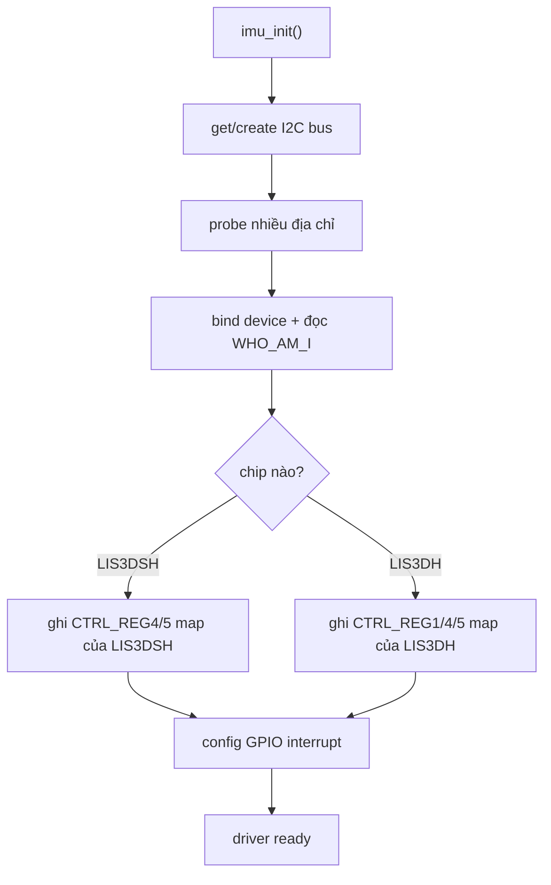

# IMU LIS3DSH, Motion Wake, Acceleration Delta

**Scope:** driver IMU, motion interrupt, sample acceleration, tạo metric rung `imu_accel_delta_mps2` cho telemetry  
**Files chính:** `imu_lis3dsh.c`, `state_wake_prelude.c`, `state_sleep_controller.c`, `state_publish_pipeline.c`, `pin_map.h`  
**Last updated:** 2026-05-05

## 1. Module Này Không Chỉ “Đọc Gia Tốc”
Driver IMU trong repo làm đồng thời 4 việc:

1. detect xem board đang gắn LIS3DSH hay biến thể LIS3DH legacy
2. bootstrap I2C và cấu hình interrupt
3. cung cấp cờ motion wake qua chân INT
4. tạo metric cloud-friendly là peak acceleration delta theo cửa sổ publish

## 2. Bus Và Pin
- I2C: `GPIO2` / `GPIO1`
- INT1: `GPIO41`
- INT2: `GPIO42`

INT dùng cho wake decision. Metric rung gửi cloud lại đi qua đường sample read, không đi trực tiếp từ chân interrupt.

## 3. Khái Niệm Nền
| Khái niệm | Ý nghĩa trong code |
|---|---|
| `WHO_AM_I` | byte định danh chip để driver nhận đúng biến thể |
| `LIS3DSH` vs `LIS3DH legacy` | cùng họ cảm biến nhưng map register khác nhau |
| `motion interrupt` | tín hiệu phần cứng dùng cho wake |
| `accel delta window peak` | metric rung lớn nhất trong cửa sổ hiện tại |
| `deadzone` | bỏ qua rung rất nhỏ để tránh false positive |

## 4. Init Và Probe
Code neo:

```c
static const imu_probe_target_t s_probe_targets[] = {
    {0x18, 0x33, LIS3DH_LEGACY},
    {0x19, 0x33, LIS3DH_LEGACY},
    {0x1D, 0x3F, LIS3DSH},
    {0x1E, 0x3F, LIS3DSH},
};
```

Điều này cực quan trọng: source hiện tại không assume board chỉ có LIS3DSH.

### Flow init theo code


### Vì sao đoạn register write phải đọc kỹ
Code neo:

```c
if (imu_is_lis3dsh()) {
    imu_write_reg(LIS3DSH_CTRL_REG4, 0x6F);
    imu_write_reg(LIS3DSH_CTRL_REG5, 0x00);
} else {
    imu_write_reg(LIS3DH_LEGACY_CTRL_REG1, 0x27);
    imu_write_reg(LIS3DH_LEGACY_CTRL_REG4, 0x88);
    imu_write_reg(LIS3DH_LEGACY_CTRL_REG5, 0x00);
}
```

Comment trong source nói rất rõ: từng có bug do ghi nhầm register map làm output pin đứng yên và vibration luôn bằng 0.

## 5. Motion Interrupt Path
Code neo:

```c
esp_err_t imu_configure_motion_interrupt(uint8_t threshold_mg, uint8_t duration_ms)
```

### Những gì hàm này làm
1. clamp threshold mg thành unit của chip
2. clamp duration ms theo ODR
3. bật high-pass / route interrupt
4. ghi `INT1_CFG`, `INT1_THS`, `INT1_DURATION`

Code neo:

```c
imu_write_reg(IMU_INT1_CFG_REG, 0x2A);
imu_write_reg(IMU_INT1_THS_REG, threshold);
imu_write_reg(IMU_INT1_DURATION_REG, duration);
```

### Cách firmware dùng interrupt
- `imu_motion_detected()` chỉ đọc mức logic của chân `PIN_LIS3DSH_INT`
- `imu_clear_motion_interrupt()` đọc `INT1_SRC` để clear latch

Nghĩa là:

- wake decision dựa vào interrupt line
- cloud telemetry rung dựa vào sample delta

Hai thứ này liên quan nhau nhưng không đồng nhất.

## 6. Metric Rung Gửi Cloud
Code neo:

```c
float imu_get_peak_accel_delta_mps2(void)
```

### Flow thực sự
1. đọc raw accel XYZ
2. convert sang mg
3. nếu chưa có sample trước thì chỉ cache
4. lấy delta giữa sample mới và sample trước
5. tính norm `sqrt(dx^2 + dy^2 + dz^2)`
6. áp deadzone
7. convert sang `m/s^2`
8. giữ peak lớn nhất trong cửa sổ hiện tại

Code neo:

```c
float delta_mg = sqrtf((dx_mg * dx_mg) + (dy_mg * dy_mg) + (dz_mg * dz_mg));
if (delta_mg <= IMU_ACCEL_DELTA_DEADZONE_MG) {
    return s_accel_delta_window_peak_mps2;
}
```

### Tại sao dùng delta thay vì magnitude tuyệt đối
Source comment nói đúng vấn đề thực địa:

- trọng lực tĩnh
- sensor offset
- góc gắn thiết bị

nếu dùng magnitude tuyệt đối thì xe đứng yên vẫn có “rung” lớn.

### Reset cửa sổ
Sau khi rawdata publish thành công, publish pipeline gọi:

```c
imu_reset_accel_delta_window();
```

Nghĩa là cloud luôn nhận peak rung của cửa sổ vừa rồi, không phải peak tích lũy vô hạn.

## 7. Backoff Khi Đọc IMU Fail
Code neo:

```c
if (s_read_fail_streak >= IMU_READ_FAIL_BACKOFF_THRESHOLD) {
    s_read_backoff_until_ms = now_ms + IMU_READ_FAIL_BACKOFF_MS;
}
```

Mental model:

- I2C fail liên tiếp -> không spam bus mỗi tick
- driver tạm im một khoảng -> rồi mới đọc lại

Điều này giải thích vì sao đôi lúc metric rung giữ nguyên vài giây sau một loạt lỗi I2C.

## 8. Quan Hệ Với Sleep/Wake
`state_sleep_controller.c` có logic:

1. nếu IMU wake pin không phải RTC-capable cho deep sleep ext0 -> dùng light sleep GPIO wake
2. trước light sleep phải clear interrupt latched
3. nếu interrupt vẫn đang asserted thì bỏ qua sleep và vào nhánh alarm

Đây là ý nghĩa của log:

```text
IMU wake pin gpio=... is not RTC-capable; parked motion wake will use light sleep GPIO wake
IMU interrupt still asserted before light sleep; skip sleep and enter alarm
```

## 9. Quan Hệ Với Wake Prelude
Trong `state_wake_prelude.c`:

1. `state_machine_bootstrap_imu()` init IMU + cấu hình motion interrupt
2. `state_machine_refresh_telemetry()` lấy `imu_get_peak_accel_delta_mps2()`

Điều này có nghĩa:

- IMU vừa là wake source
- vừa là telemetry source
- nhưng thông qua hai API khác nhau

## 10. Cách Đọc Theo Từng Câu Hỏi
### Nếu muốn biết vì sao không wake theo motion
1. `imu_configure_motion_interrupt()`
2. `state_machine_should_use_light_sleep_motion_wake()`
3. `state_machine_enter_light_sleep()`

### Nếu muốn biết vì sao cloud rung luôn bằng 0
1. `imu_init()` có detect đúng chip không
2. `imu_read_accel()` có fail không
3. deadzone có đang nuốt hết delta không
4. publish path có reset window sau mỗi rawdata không

## 11. Nguồn Nền Để Đối Chiếu
- ESP-IDF I2C: <https://docs.espressif.com/projects/esp-idf/en/stable/esp32/api-reference/peripherals/i2c.html>
- ESP-IDF Sleep modes: <https://docs.espressif.com/projects/esp-idf/en/stable/esp32/api-reference/system/sleep_modes.html>

## Unresolved Questions
1. Cần xác nhận trên board hiện trường đang gắn LIS3DSH hay biến thể legacy, dù source đã probe được cả hai.
2. Threshold `120 mg`, duration `200 ms` trong bootstrap cần field tuning thêm hay chưa.
