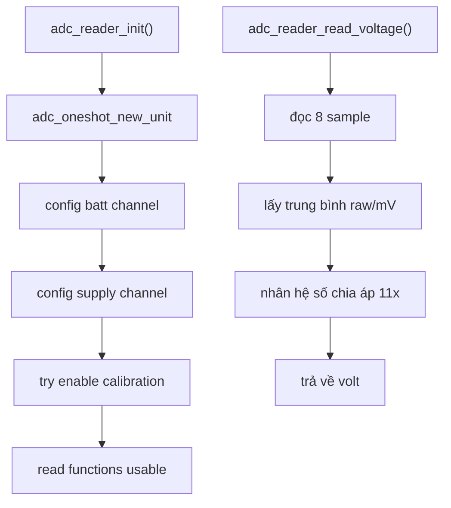
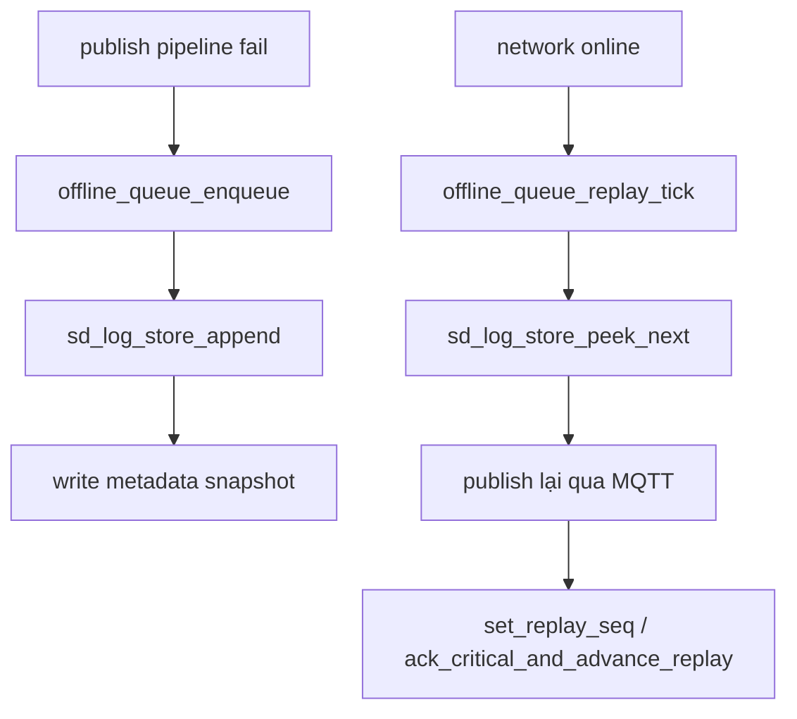

# ADC, Power, SD Storage

**Scope:** đo điện áp, điều khiển nguồn modem, lưu payload xuống SD khi offline  
**Files chính:** `adc_reader.c`, `power_mgr.c`, `sd_log_store.c`, `offline_queue.c`, `pin_map.h`  
**Last updated:** 2026-05-05

## 1. Vì Sao Gộp Ba Module Này Chung Một Trang
Ba module này đều là board-facing:

- `adc_reader.c` đọc điện áp vật lý
- `power_mgr.c` chạm control line phần cứng
- `sd_log_store.c` chạm card SD thật

Chúng khác nhau về chức năng, nhưng đều là “boundary với board”, nơi lỗi wiring hoặc tín hiệu xấu sẽ nhìn giống bug firmware.

## 2. ADC Reader

### 2.1. Mô hình đọc
Code neo:

```c
#define ADC_SAMPLES 8
#define ADC_SUPPLY_DIVIDER_RATIO 11.0f
#define ADC_BATT_DIVIDER_RATIO 11.0f
```

Driver đang đọc qua:

- ADC1 one-shot
- attenuation `12 dB`
- 8 sample mỗi lần đọc
- nếu có calibration curve fitting thì dùng mV chuẩn hóa

### 2.2. Vì sao có hai điện áp
Theo naming trong source:

- `adc_read_device_battery_voltage()` -> nhánh `U_BATT_ADC`
- `adc_read_vehicle_battery_voltage()` -> nhánh `U_SUPPLY_ADC`

Tài liệu cũ rất dễ làm người đọc nhầm. Cần bám đúng comment trong `adc_reader.c`.

### 2.3. Flow đọc


### 2.4. Chỗ cần đọc kỹ
Code neo:

```c
float mv_avg = calibration_enabled
    ? (mv_total / sample_count)
    : ((raw_total / sample_count) * 3300.0f / 4095.0f);

return (mv_avg / 1000.0f) * divider_ratio;
```

Nghĩa là giá trị cloud thấy đã được scale ngược qua mạch chia áp, không phải điện áp tại chân ADC.

## 3. Power Manager

### 3.1. Đây là boundary giữa logic và mạch thật
`power_mgr.c` giữ mọi assumption về:

- đảo mức
- timing xung
- chân nào có thật / không có thật

Phần này đã được deep-dive ở [08-sim7600-lte-gnss-mqtt-at-walkthrough.md](./08-sim7600-lte-gnss-mqtt-at-walkthrough.md). Ở đây chỉ nhắc lại vai trò hệ thống:

1. LTE FSM gọi `modem_power_on/off/reset`
2. sleep controller gọi `modem_set_dtr`
3. diagnostics có thể đọc `STATUS` / `NETLIGHT`

### 3.2. Nếu board lỗi nhưng source “đúng”
Triệu chứng thường gặp:

- PWRKEY pulse log có nhưng modem không boot
- RESET pulse log có nhưng modem không recover
- DTR path luôn `NOT_SUPPORTED`

Khi đó cần nghi mạch / pin map trước khi nghi business logic.

## 4. SD Log Store

### 4.1. Vai trò
`sd_log_store.c` không phải queue business. Nó là storage engine bên dưới `offline_queue.c`.

`offline_queue.c` quyết định:

- record type nào critical
- khi nào enqueue
- khi nào replay

`sd_log_store.c` lo:

- mount card
- recover file/meta
- append line
- update metadata
- peek record tiếp theo
- gc khi vượt quota

### 4.2. Mount flow
Code neo:

```c
esp_err_t sd_log_store_mount(void) {
    sdmmc_host_t host = SDMMC_HOST_DEFAULT();
    host.max_freq_khz = SDMMC_FREQ_PROBING;
    ...
    err = esp_vfs_fat_sdmmc_mount(...);
    if (err != ESP_OK && slot.width > 1) {
        slot.width = 1;
        err = esp_vfs_fat_sdmmc_mount(...);
    }
}
```

Điểm rất hay:

- mount 4-bit trước
- fail thì fallback 1-bit

Đây là cơ chế giảm sensitivity với wiring prototype / tín hiệu SD xấu.

### 4.3. Metadata rotation chống mất dữ liệu
Source dùng cho **metadata**:

- `queue.dat`
- `queue.tmp`
- `queue.bak`

Tức là ghi theo kiểu temp -> backup -> live, để reset giữa chừng không làm metadata hỏng im lặng.

### 4.4. Data file append-only
Source dùng cho **data file**:

- `queue.log`
- `queue.tmp`
- `queue.bak`

`queue.log` mới là nơi append record payload tuần tự. Còn `queue.dat` là snapshot metadata.

Code neo:

```c
fprintf(fp, "%u|%llu|%u|%u|%u|%u|%u|%u|%s\n", ...)
```

Mỗi record gồm:

- `seq`
- `timestamp`
- `session_id`
- `type`
- `critical`
- `gps_fix`
- `net_up`
- `time_trusted`
- `payload`

Ý nghĩa:

- log data là append-only
- thứ tự logic đi theo `seq`, không theo rewrite file

### 4.5. Card-detect đang có assumption phần cứng thật
Code neo:

```c
static bool sd_log_store_card_present(void) {
    if (!s_ctx.cd_configured || PIN_SDMMC_CD == GPIO_NUM_NC) {
        return true;
    }
    int level = gpio_get_level(PIN_SDMMC_CD);
    return level == 0;
}
```

Điều này có nghĩa:

1. nếu board có `PIN_SDMMC_CD`, source assume **active-low**
2. nếu không có card-detect pin thì runtime mặc định "coi như card luôn hiện diện"
3. lỗi mount vì `ESP_ERR_NOT_FOUND` có thể đến từ card-detect path, không chỉ từ FAT/SD bus

### 4.6. Tại sao metadata update sau data write
Code comment nói thẳng:

```text
prefer replay duplicates over silent data loss after a reset
```

Nghĩa là:

- ghi line xuống disk trước
- fsync xong mới update `write_seq/replay_seq`
- nếu reset xen giữa, có thể replay duplicate
- nhưng không mất payload im lặng

Đây là lựa chọn rất hợp lý cho firmware telemetry.

### 4.7. Peek cache cho replay
`sd_log_store_peek_next()` cache offset sau record vừa parse:

```c
s_ctx.peek_cache_valid = true;
s_ctx.peek_cache_min_seq = rec.seq + 1;
s_ctx.peek_cache_offset = next_offset;
```

Mục tiêu: replay tuần tự không phải rescan từ đầu file mỗi tick.

## 5. Quan Hệ Với Offline Queue


Nhìn đúng vai trò:

- `offline_queue.c` là policy
- `sd_log_store.c` là persistence layer

## 6. Chỗ App-Core Gọi Các Module Này
### ADC
- `state_machine_refresh_telemetry()` đọc hai điện áp rồi đưa vào `s_telemetry`
- ignition fallback hoặc safety check dùng các điện áp này

### Power
- `modem_lte_fsm.c` dùng trong connect/recover
- `state_sleep_controller.c` dùng trong pre-sleep shutdown

### SD
- `offline_queue_init()` mount/init store
- `offline_queue_enqueue()` append record
- `offline_queue_replay_tick()` peek và ack/replay

## 7. Checklist Debug
| Triệu chứng | Cần nhìn |
|---|---|
| voltage đọc luôn 0 | `adc_reader_init()` đã chạy chưa, ADC channel map có đúng không |
| điện áp lệch nhẹ nhưng ổn định | calibration / divider ratio / gain trong `runtime_config.h` |
| modem control log có nhưng không có phản ứng | wiring PWRKEY/RESET hoặc stage đảo mức |
| offline queue có depth nhưng không replay | `sd_log_store_is_mounted()` và link online/offline |
| payload bị duplicate sau reboot | đây có thể là behavior được chấp nhận của chiến lược write-before-meta |
| SD mount fail 4-bit nhưng 1-bit lên | nghi signal integrity hơn là logic queue |
| `ESP_ERR_NOT_FOUND` khi mount | kiểm tra `sd_log_store_card_present()` vì source assume card-detect active-low |

## 8. Nguồn Nền Để Đối Chiếu
- ESP-IDF ADC docs: <https://docs.espressif.com/projects/esp-idf/en/stable/esp32/api-reference/peripherals/adc/index.html>
- ESP-IDF SDMMC / FAT mount docs: <https://docs.espressif.com/projects/esp-idf/en/stable/esp32/api-reference/peripherals/>

## Unresolved Questions
1. Hai comment naming `device battery` và `vehicle battery` cần đối chiếu lại với schematic cuối cùng để tránh đọc nhầm nhánh chia áp.
2. Source hiện assume `PIN_SDMMC_CD` active-low; cần field log thực tế để chốt assumption này có khớp board cuối cùng hay không.
