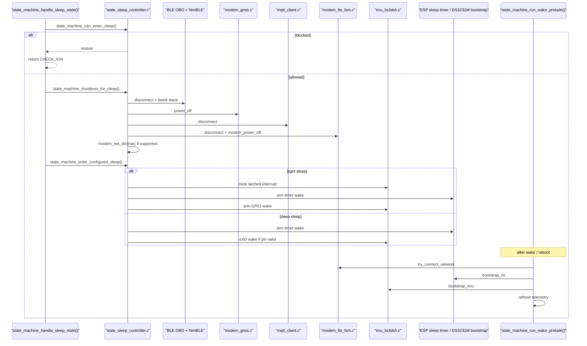
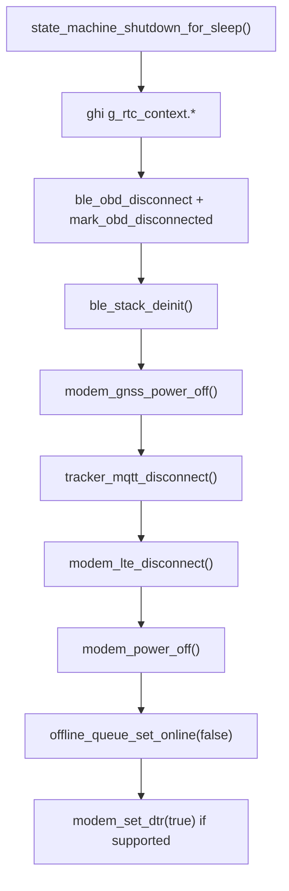
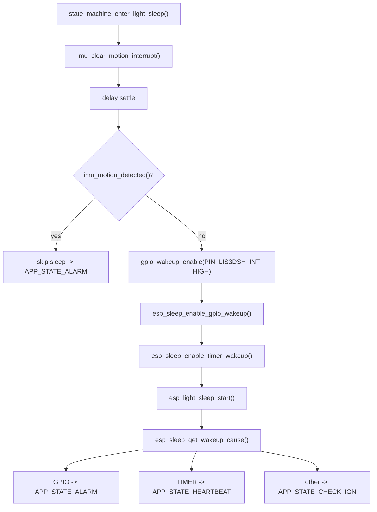

# Sleep/Wake Hardware Orchestration

**Scope:** đường orchestration khi firmware quyết định ngủ, tắt từng subsystem phần cứng, arm wake source, rồi khởi động lại sau wake  
**Files chính:** `state_machine_core.c`, `state_sleep_controller.c`, `state_wake_prelude.c`, `imu_lis3dsh.c`, `rtc_ds3231m.c`, `power_mgr.c`  
**Last updated:** 2026-05-05

## 1. Câu Hỏi Trang Này Trả Lời
1. Ai quyết định firmware được phép ngủ hay chưa.
2. Sleep bị chặn bởi chính xác những cờ nào trong source.
3. Vì sao có lúc dùng deep sleep, có lúc dùng light sleep.
4. IMU, RTC timer, LTE, BLE, MQTT, GNSS bị kéo vào sleep/wake flow như thế nào.
5. Sau khi thức dậy, module nào được bootstrap lại trước, module nào phải đợi.

## 2. File Cần Mở Song Song
- `components/app-core/src/state_machine_core.c`
- `components/app-core/src/state_sleep_controller.c`
- `components/app-core/src/state_wake_prelude.c`
- `components/platform-board-esp32s3/src/imu_lis3dsh.c`
- `components/adapter-rtc-ds3231m/src/rtc_ds3231m.c`
- `components/platform-board-esp32s3/src/power_mgr.c`
- `components/adapter-modem-sim7600-at/src/modem_lte_fsm.c`

## 3. Mental Model Trước Khi Đọc
Trang này không phải "sleep modes của ESP32" theo nghĩa lý thuyết. Nó là flow runtime thật của repo này:

```text
APP_STATE_SLEEP
-> check blockers
-> shutdown subsystem
-> chọn deep/light/fake sleep
-> arm wake source
-> sleep
-> wake
-> quay lại CHECK_IGN / HEARTBEAT / ALARM
-> wake prelude bootstrap phần cứng lại từng bước
```

Muốn đọc đúng, phải tách thành 3 lớp:

1. **Decision layer**  
   `state_machine_handle_sleep_state()` + `state_machine_can_enter_sleep()`
2. **Hardware shutdown / wake layer**  
   `state_machine_shutdown_for_sleep()`, `state_machine_enter_light_sleep()`, `state_machine_prepare_deep_sleep_wakeup()`
3. **Re-bootstrap layer**  
   `state_machine_run_wake_prelude()`

## 4. Bức Tranh Tổng


## 5. Tầng 1: Ai Cho Phép Ngủ
Nguồn: `state_machine_handle_sleep_state()` trong `state_machine_core.c`

### 5.1. Entry thật của sleep path
`APP_STATE_SLEEP` không tự ngủ ngay. Nó vào `state_machine_handle_sleep_state()` trước.

Code neo:

```c
if (!state_machine_can_enter_sleep(&reason)) {
    ESP_LOGW(TAG, "Sleep blocked reason=%s ...", reason);
    return APP_STATE_CHECK_IGN;
}
```

Đọc đúng nghĩa:

1. state handler hỏi controller: "được ngủ chưa?"
2. nếu chưa được, firmware **không cố ngủ một phần**
3. nó log reason rồi trả về `CHECK_IGN`

### 5.2. Blocker matrix trong source thật
Nguồn: `state_machine_can_enter_sleep()`

| Blocker | Cờ trong source | Ý nghĩa đọc code |
|---|---|---|
| `field_validation_keep_awake` | build flag | build thực địa có thể ép không ngủ |
| `sleep_policy_disabled` | `!s_config.sleep_enabled` | config runtime tắt sleep |
| `ota_in_progress` | `s_ota_in_progress` | đang OTA thì không được ngủ |
| `ota_pending_confirm` | `g_rtc_context.ota_pending_confirm` | vừa reboot OTA xong, chưa confirm app |
| `ignition_on` | `s_telemetry.ignition` | xe còn coi là đang bật máy |
| `ble_connect_inflight` | `s_ble_connect_inflight` | worker BLE connect còn đang chạy |

Điểm rất quan trọng: sleep decision hiện **không chỉ nhìn ignition**. Nó còn nhìn OTA và async BLE state.

## 6. Tầng 2: Shutdown Trước Khi Ngủ
Nguồn: `state_machine_shutdown_for_sleep()`

### 6.1. Vì sao phải đọc hàm này theo thứ tự lệnh
Đây là đoạn nối nhiều module phần cứng nhất trong cả runtime. Nếu chỉ đọc từng dòng rời rạc sẽ không thấy hệ thống đang "tháo dần" từng subsystem.

Code path thực:



### 6.2. Từng bước đang làm gì
1. **Ghi context sang `g_rtc_context`**  
   lưu `last_state`, `ign_last_known`, `last_battery_v`, `last_heartbeat_ts`

2. **Cắt OBD/BLE session trước**  
   nếu `s_ble_ctx != NULL` thì `ble_obd_disconnect()` rồi `ble_stack_deinit()`

3. **Tắt GNSS trước LTE power-off**  
   `modem_gnss_power_off()` chạy khi `s_gnss_started`

4. **Ngắt MQTT rồi mới hạ LTE**  
   `tracker_mqtt_disconnect()` trước `modem_lte_disconnect()`

5. **Phát PWRKEY power-off cho modem thật**  
   `modem_power_off()` dùng pulse 3000 ms ở `power_mgr.c`

6. **Đánh dấu offline queue đang offline**  
   `offline_queue_set_online(false)` để replay/publish logic không coi mình còn online

7. **Hint modem sang sleep level bằng DTR nếu có**  
   `modem_set_dtr(true)`; với board map hiện tại nhiều khả năng trả `ESP_ERR_NOT_SUPPORTED`

### 6.3. Chỗ người mới hay hiểu nhầm
- `modem_lte_disconnect()` chưa phải là bước cuối cùng; còn `modem_power_off()`
- GNSS không tồn tại độc lập với modem rail; shutdown path vẫn tắt GNSS trước để state runtime sạch
- DTR không phải điều kiện bắt buộc; source chấp nhận board không có DTR

## 7. Tầng 3: Chọn Deep Sleep Hay Light Sleep
Nguồn: `state_machine_resolve_sleep_mode()` và `state_machine_should_use_light_sleep_motion_wake()`

### 7.1. Logic chọn mode
Code neo:

```c
return state_machine_should_use_light_sleep_motion_wake()
    ? TRACKER_SLEEP_MODE_LIGHT
    : TRACKER_SLEEP_MODE_DEEP;
```

### 7.2. Tại sao IMU kéo hệ thống sang light sleep
Code neo:

```c
if (!state_machine_imu_runtime_enabled() || !s_imu_available) {
    return false;
}

if (esp_sleep_is_valid_wakeup_gpio(PIN_LIS3DSH_INT)) {
    return true;
}

ESP_LOGW(TAG, "IMU wake pin gpio=%d is not RTC-capable; parked motion wake will use light sleep GPIO wake", ...);
return true;
```

Nghĩa là:

- chỉ cần IMU runtime bật và IMU available
- nếu pin IMU có thể dùng deep-sleep wake thì tốt
- **nếu không**, firmware vẫn muốn giữ motion wake, nên chọn **light sleep**

Đây là một quyết định kiến trúc rất thực chiến: hy sinh dòng ngủ thấp nhất để giữ wake theo rung khi pin IMU không phải RTC-capable.

## 8. Tầng 4: Deep Sleep Path
Nguồn: `state_machine_prepare_deep_sleep_wakeup()`

### 8.1. Wake source nào được arm
1. timer wake luôn được arm bằng `parked_wake_interval_s`
2. ext0 IMU wake chỉ được arm nếu `state_machine_can_arm_imu_deep_sleep_wakeup()`

Code neo:

```c
if (state_machine_can_arm_imu_deep_sleep_wakeup()) {
    esp_sleep_enable_ext0_wakeup(PIN_LIS3DSH_INT, 1);
}

esp_sleep_enable_timer_wakeup((uint64_t)wake_interval_s * 1000000ULL);
```

### 8.2. Điều phải nhớ khi đọc deep-sleep flow
- deep sleep **không quay về cùng call stack**
- sau `esp_deep_sleep_start()` là boot lại từ đầu
- vì vậy mọi khôi phục sau deep sleep đều phải đi qua bootstrap + wake prelude

## 9. Tầng 5: Light Sleep Path Với IMU
Nguồn: `state_machine_enter_light_sleep()`

### 9.1. Đây là flow quan trọng nhất nếu muốn hiểu motion wake


### 9.2. Tại sao clear interrupt trước khi ngủ
Code neo:

```c
esp_err_t clear_int_err = imu_clear_motion_interrupt();
vTaskDelay(pdMS_TO_TICKS(TRACKER_LIGHT_SLEEP_IMU_CLEAR_SETTLE_MS));

if (imu_motion_detected()) {
    ESP_LOGW(TAG, "IMU interrupt still asserted before light sleep; skip sleep and enter alarm");
    return APP_STATE_ALARM;
}
```

Đây là đoạn cực đáng học:

- firmware không tin rằng clear xong là pin đã hạ ngay
- nó chờ settle
- nếu pin còn asserted thì **không ngủ nữa**
- thay vào đó coi như có motion thật và nhảy sang `ALARM`

Nói cách khác: logic này chống trường hợp "vừa ngủ đã dậy ngay" do latch interrupt chưa xuống.

### 9.3. Wake cause map
| Wake cause | Next state | Ý nghĩa runtime |
|---|---|---|
| `ESP_SLEEP_WAKEUP_GPIO` | `APP_STATE_ALARM` | IMU/motion đánh thức |
| `ESP_SLEEP_WAKEUP_TIMER` | `APP_STATE_HEARTBEAT` | thức định kỳ để làm heartbeat |
| khác | `APP_STATE_CHECK_IGN` | fallback an toàn |

## 10. Tầng 6: Sau Khi Thức Dậy, Phần Cứng Lên Lại Theo Thứ Tự Nào
Nguồn: `state_machine_run_wake_prelude()`

Code neo:

```c
state_machine_handle_pending_action();
state_machine_try_connect_network();
state_machine_try_connect_ble();
state_machine_bootstrap_rtc();
state_machine_bootstrap_imu();
state_machine_refresh_telemetry(true, true);
```

### 10.1. Thứ tự bootstrap có chủ ý
1. xử lý action pending trước
2. thử kéo LTE/MQTT/GNSS lên trước
3. thử BLE OBD
4. bootstrap RTC
5. bootstrap IMU
6. cuối cùng mới refresh snapshot telemetry

### 10.2. Ý nghĩa khi đọc bug sau wake
- wake xong mà chưa có MQTT: nhìn `state_machine_try_connect_network()`
- wake xong mà IMU metric = 0: nhìn `state_machine_bootstrap_imu()` và lần `state_machine_refresh_telemetry()`
- wake xong mà timestamp chưa trusted: nhìn `state_machine_bootstrap_rtc()`

## 11. Interaction Map Theo Module
| Module | Trước sleep | Trong sleep config | Sau wake |
|---|---|---|---|
| IMU | clear latch nếu light sleep | GPIO wake hoặc ext0 wake | bootstrap lại, đọc delta metric |
| RTC timer | chưa đụng ở shutdown | arm timer wake | ảnh hưởng next state heartbeat |
| BLE OBD | disconnect + deinit stack | không giữ connection qua sleep | try connect lại trong prelude |
| GNSS | power_off | không query trong sleep | start lại sau LTE init |
| MQTT | disconnect | không giữ session | connect + subscribe lại |
| LTE/modem | disconnect + power_off + DTR sleep hint | ngủ hoàn toàn | LTE FSM kéo lên lại từ đầu hoặc fast-path |
| SD/offline queue | set offline | không replay | set online lại khi MQTT connected |

## 12. Trình Tự Đọc Code Theo Tình Huống
### Nếu muốn biết "vì sao sleep bị chặn"
1. `state_machine_handle_sleep_state()`
2. `state_machine_can_enter_sleep()`
3. log `Sleep blocked reason=...`

### Nếu muốn biết "vì sao motion wake không chạy"
1. `state_machine_should_use_light_sleep_motion_wake()`
2. `state_machine_enter_light_sleep()`
3. `imu_configure_motion_interrupt()`
4. `imu_motion_detected()`

### Nếu muốn biết "vì sao wake xong lên chậm"
1. `state_machine_run_wake_prelude()`
2. `state_machine_try_connect_network()`
3. `modem_lte_tick()`
4. `tracker_mqtt_connect()`

### Nếu muốn biết "vì sao vừa ngủ đã bật dậy"
1. `imu_clear_motion_interrupt()`
2. settle delay
3. nhánh `imu_motion_detected()`
4. wake cause log của light sleep

## 13. Log Và Checkpoint Nên Tìm
| Log keyword | File đáng mở | Ý nghĩa |
|---|---|---|
| `Sleep blocked reason=` | `state_machine_core.c` | sleep gate reject |
| `IMU wake pin gpio=... is not RTC-capable` | `state_sleep_controller.c` | runtime chọn light sleep để giữ motion wake |
| `IMU interrupt still asserted before light sleep` | `state_sleep_controller.c` | abort sleep vì pin còn latch |
| `Entering light sleep` | `state_sleep_controller.c` | đã arm timer + gpio wake |
| `Light sleep wakeup cause=` | `state_sleep_controller.c` | map wake source về next state |
| `RTC bootstrap OK` hoặc `retry step=rtc_bootstrap` | `state_wake_prelude.c` | trusted time bootstrap |
| `IMU initialized chip=` | `imu_lis3dsh.c` | probe IMU thành công sau wake/boot |
| `lte connected pdp_active=1` | `modem_lte_fsm.c` | modem path lên lại xong |

## 14. Nguồn Nền Để Đối Chiếu
- ESP-IDF Sleep modes: <https://docs.espressif.com/projects/esp-idf/en/stable/esp32/api-reference/system/sleep_modes.html>
- ESP-IDF I2C bus-device model: <https://docs.espressif.com/projects/esp-idf/en/stable/esp32/api-reference/peripherals/i2c.html>

## Unresolved Questions
1. Cần log board thật để xác nhận light-sleep wake bằng IMU hiện ổn định thế nào trong điều kiện rung thực địa.
2. Nếu board revision sau nối `PIN_MODEM_DTR`, cần đọc lại sleep current và wake latency vì controller hiện đã có sẵn nhánh DTR sleep hint.
