# Firmware Source Code Reference Pack

**Last updated:** 2026-04-13  
**Scope:** `iot-vehicle-tracking-system-firmware/`  
**Primary source of truth:** firmware source code đang build thực tế, không phải ghi chú cũ.

## Mục tiêu
- Giúp dev mới hiểu nhanh firmware đang chạy như thế nào.
- Giúp dev bảo trì tìm đúng file, đúng boundary, đúng flow.
- Giúp làm thesis/report/demo có sẵn sơ đồ và hình export.
- Giảm drift giữa source runtime mới và các note cũ.

## Điều quan trọng nhất
1. Firmware hiện tại là một **state machine không-blocking**; hầu hết subsystem được tick dần, không init một phát rồi chờ.
2. MQTT hiện đi qua **SIM7600 AT MQTT** trong [`main/src/mqtt_client.c`](../../../iot-vehicle-tracking-system-firmware/main/src/mqtt_client.c), không phải ESP-MQTT client thuần.
3. Runtime hiện đã có **RTC DS3231M**, **offline queue**, **SD replay**, **session manager**, **retry manager**, **telemetry counters**.
4. Một số tài liệu cũ trong `documents/programming-knowledge/` vẫn hữu ích cho deep dive, nhưng không còn phản ánh đầy đủ runtime mới.
5. `main/main.c` đang có **field-validation overrides** cho sleep/IMU/MQTT/command subscribe. Đây là hành vi runtime thật của source hiện tại, không phải ghi chú lý thuyết.

## Lộ trình đọc nhanh
### Nếu chỉ có 15 phút
1. [01-source-map-and-build-boundary.md](./01-source-map-and-build-boundary.md)
2. [02-runtime-fsm-and-execution-model.md](./02-runtime-fsm-and-execution-model.md)
3. [03-connectivity-payloads-and-ota.md](./03-connectivity-payloads-and-ota.md)

### Nếu cần sửa code runtime
1. [02-runtime-fsm-and-execution-model.md](./02-runtime-fsm-and-execution-model.md)
2. [04-persistence-replay-and-diagnostics.md](./04-persistence-replay-and-diagnostics.md)
3. [06-file-by-file-reading-map.md](./06-file-by-file-reading-map.md)

### Nếu cần rà hardware, pin, wake, modem
1. [05-hardware-boundary-and-field-validation.md](./05-hardware-boundary-and-field-validation.md)
2. `resources/docs/hardware-datasheets/`
3. `iot-vehicle-tracking-system-firmware/documents/hardware-specs/`

## Bộ tài liệu
- [01-source-map-and-build-boundary.md](./01-source-map-and-build-boundary.md): build map, config, partition, layering.
- [02-runtime-fsm-and-execution-model.md](./02-runtime-fsm-and-execution-model.md): `app_main()`, FSM, wake/sleep, retry model.
- [03-connectivity-payloads-and-ota.md](./03-connectivity-payloads-and-ota.md): LTE, GNSS, BLE OBD, MQTT, command, OTA.
- [04-persistence-replay-and-diagnostics.md](./04-persistence-replay-and-diagnostics.md): NVS, RTC, SD log store, offline replay, counters.
- [05-hardware-boundary-and-field-validation.md](./05-hardware-boundary-and-field-validation.md): pin map, external modules, what is proven vs pending.
- [06-file-by-file-reading-map.md](./06-file-by-file-reading-map.md): file-by-file navigation for `main/inc` + `main/src`.

## Bộ sơ đồ và ảnh
- [assets/figures/firmware-source-overview.svg](./assets/figures/firmware-source-overview.svg)
- [assets/figures/firmware-startup-sequence.svg](./assets/figures/firmware-startup-sequence.svg)
- [assets/figures/firmware-runtime-state-machine.svg](./assets/figures/firmware-runtime-state-machine.svg)
- [assets/figures/firmware-connectivity-and-telemetry-flow.svg](./assets/figures/firmware-connectivity-and-telemetry-flow.svg)
- [assets/figures/firmware-command-and-ota-sequence.svg](./assets/figures/firmware-command-and-ota-sequence.svg)
- [assets/figures/firmware-offline-queue-and-replay-flow.svg](./assets/figures/firmware-offline-queue-and-replay-flow.svg)
- [assets/figures/firmware-hardware-software-boundary.svg](./assets/figures/firmware-hardware-software-boundary.svg)




## Legend
| Nhãn | Ý nghĩa |
|---|---|
| `Source-backed` | Có thể chỉ thẳng vào code đang build |
| `Vendor-backed` | Có datasheet/manual nội bộ trong repo |
| `Inference` | Suy ra từ code + naming + flow, chưa phải chứng cứ phần cứng |
| `Field validation pending` | Phải đo trên board thật / log thật mới chốt |

## Quan hệ với docs cũ
- Pack này ưu tiên **runtime hiện tại** trong `iot-vehicle-tracking-system-firmware/main/`.
- Bộ cũ `iot-vehicle-tracking-system-firmware/documents/programming-knowledge/` vẫn hữu ích cho:
  - hướng dẫn nền tảng ESP-IDF,
  - background modem/IMU,
  - note validation trước đây.
- Nhưng cần đọc cẩn thận vì hiện có drift ở ít nhất 4 vùng:
  - RTC không còn là draft-only, source đã có [`main/src/rtc_ds3231m.c`](../../../iot-vehicle-tracking-system-firmware/main/src/rtc_ds3231m.c).
  - runtime đã có `offline_queue`, `sd_log_store`, `session_mgr`, `retry_manager`, `telemetry_counters`.
  - MQTT transport hiện là `AT+CMQTT*`.
  - IMU runtime hiện là `imu_lis3dsh.c`, không phải naming cũ LIS3DH.

## Tái tạo hình
- Mermaid source: [`assets/uml/`](./assets/uml/)
- Script render: [`assets/render-firmware-source-figures.mjs`](./assets/render-firmware-source-figures.mjs)
- Lệnh:

```bash
node resources/docs/firmware-source-code-reference/assets/render-firmware-source-figures.mjs
```

## Unresolved questions
1. Có giữ lại các field-validation override trong `main/main.c` cho build thường xuyên hay chỉ cho bring-up.
2. `PIN_MODEM_DTR`, `PIN_MODEM_STATUS`, `PIN_MODEM_NETLIGHT` hiện chưa map GPIO thật; cần quyết định có phải board chưa nối hay firmware chưa cập nhật.
3. ACK path của offline replay hiện là callback cục bộ sau publish thành công; cần chốt có chấp nhận như broker-level ACK hay không.
