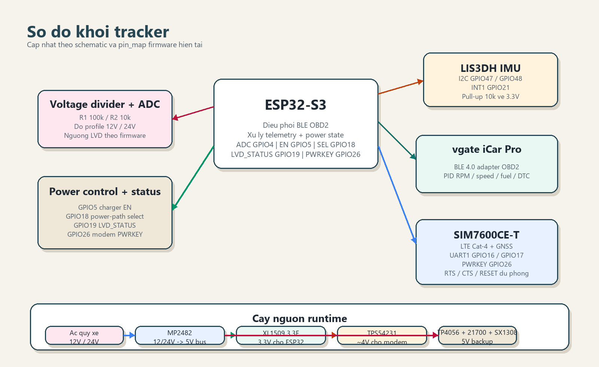
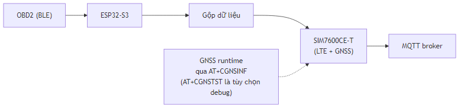
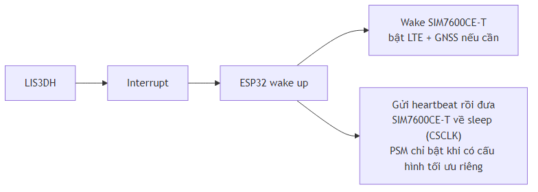

## III.2 Sơ Đồ Khối Hệ Thống

### Tổng Quan

Sơ đồ khối này phản ánh **kiến trúc phần cứng mục tiêu** hiện tại của tracker, xoay quanh một mô-đun duy nhất: **SIMCom SIM7600CE-T** đảm nhiệm LTE + GNSS tích hợp, kết nối trực tiếp với **ESP32-S3**. Ở runtime hiện tại, các tín hiệu bắt buộc đã được chốt ở mức firmware là UART (`GPIO16/17`) và PWRKEY (`GPIO26`); các net RESET/CTS/RTS/RI/EN vẫn được giữ trong sơ đồ phần cứng để tham chiếu thiết kế.

> **Lưu ý:** Module SIM7600CE-T chạy ở chế độ mạng `Auto mode` (`AT+CNMP=2`) và APN mặc định là `internet`. Tài liệu chỉ mô tả runtime cho SIM7600CE-T; A7670C + NEO-M8N chỉ còn được đề cập trong phần lịch sử baseline.

### Sơ Đồ Khối Chi Tiết

### Profile Nguồn 12V/24V

- **Profile 12V**: `Switch_OFF=12.0V`, `Switch_ON=12.2V`, `IGN_ON>=13.0V`, `IGN_OFF<=12.0V`
- **Profile 24V**: `Switch_OFF=24.0V`, `Switch_ON=24.4V`, `IGN_ON>=26.0V`, `IGN_OFF<=24.0V`

ESP32 đọc U_batt qua ADC (divider `100k/10k`) để chọn profile và điều khiển power routing diode OR.

### Luồng Dữ Liệu

#### 1. Khi Lái Xe (IGN ON)

#### 2. Khi Đỗ Xe (IGN OFF)

#### 3. Quản Lý Nguồn

### Ý Nghĩa Kiến Trúc Một Module

- SIM7600CE-T xử lý cả **cellular** và **GNSS** nên không cần UART GNSS phụ
- Có thể đặt module vào **Auto mode** để mạng tự chuyển giữa LTE/UMTS/GSM
- APN mặc định `internet`, nếu cần điều chỉnh chỉ thay đổi `AT+CGDCONT`
- Firmware tập trung vào một driver duy nhất, giảm độ phức tạp pin/GPIO
- Theo firmware source-of-truth hiện tại: UART modem dùng `GPIO16/17`, PWRKEY dùng `GPIO26`, LVD status đọc tại `GPIO19`, ADC U_batt tại `GPIO4`

### Kết Nối Vật Lý

Chi tiết pin/GPIO mô tả trong:

- [`../03-firmware/part-03-modem-simcom.md`](../03-firmware/part-03-modem-simcom.md)
- [`../03-firmware/part-04-power-management-gpio.md`](../03-firmware/part-04-power-management-gpio.md)

### Lịch Sử Baseline

Các tài liệu cũ mô tả **A7670C + NEO-M8N** để minh họa kiến trúc trước đây. Trong báo cáo hiện tại, những tên tuổi đó chỉ tồn tại ở phần lịch sử và không có nhánh runtime riêng.
