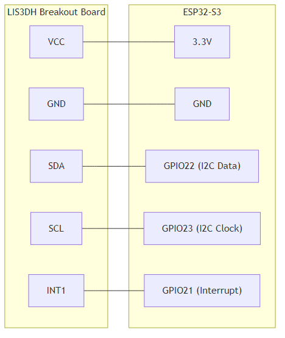

## III.1.1 Cảm Biến IMU: LIS3DH

### Tổng Quan

**LIS3DH** là cảm biến gia tốc 3 trục (3-axis accelerometer) low-power, được sử dụng để phát hiện chuyển động của xe khi đỗ.

### Đặc Tính Kỹ Thuật

| Thông Số                 | Giá Trị                                 |
| ------------------------ | --------------------------------------- |
| **Loại**                 | 3-axis Digital Accelerometer            |
| **Điện áp hoạt động**    | 1.8–3.6 V                               |
| **Giao tiếp**            | I2C (400 kHz) hoặc SPI (10 MHz)         |
| **Phạm vi đo**           | ±2g, ±4g, ±8g, ±16g (có thể điều chỉnh) |
| **Độ phân giải**         | 16-bit                                  |
| **Tiêu thụ (Active)**    | ~10–50 μA                               |
| **Tiêu thụ (Low-power)** | ~2–5 μA                                 |
| **Wake-up interrupt**    | ✅ Có (có thể cấu hình ngưỡng)          |
| **Package**              | LGA-16 (3×3×1 mm)                       |
| **Giá**                  | ~20,000–50,000 VNĐ (breakout board)     |

### Lý Do Chọn LIS3DH

#### 1. Motion Detection Tích Hợp

- **Wake-up interrupt**: LIS3DH có thể tự phát hiện chuyển động và gửi interrupt đến ESP32
- **Ngưỡng điều chỉnh**: Có thể cấu hình ngưỡng gia tốc (0.1–0.2 g) để tránh báo giả
- **Không cần ESP32 canh liên tục**: ESP32 có thể deep sleep, chỉ wake up khi có interrupt

#### 2. Tiết Kiệm Năng Lượng

- **Low-power mode**: Tiêu thụ chỉ 2–5 μA ở chế độ low-power
- **Wake-up interrupt**: Không cần ESP32 chạy liên tục để đọc IMU
- **Phù hợp battery-powered**: Rất phù hợp cho hệ thống tracker chạy bằng pin

#### 3. Phổ Biến và Dễ Sử Dụng

- **Nhiều thư viện**: Arduino, ESP-IDF đều có thư viện sẵn
- **Breakout board**: Dễ mua breakout board trên Shopee/Lazada
- **Tài liệu đầy đủ**: Datasheet và ví dụ code phong phú

### Chức Năng Trong Hệ Thống

#### 1. Phát Hiện Chuyển Động Khi Đỗ Xe

- **Rung xe**: Phát hiện khi xe bị rung (ví dụ: cố gắng mở cửa)
- **Kéo xe**: Phát hiện khi xe bị kéo (gia tốc liên tục)
- **Cẩu xe**: Phát hiện khi xe bị cẩu (gia tốc đột ngột)

#### 2. Wake-up ESP32 từ Deep Sleep

- **Interrupt pin**: Kết nối chân INT của LIS3DH với GPIO ESP32
- **Tự động wake-up**: Khi phát hiện chuyển động, LIS3DH gửi interrupt → ESP32 wake up
- **Không cần ESP32 chạy liên tục**: Tiết kiệm năng lượng đáng kể

### Kết Nối với ESP32-S3

#### Sơ Đồ Kết Nối



#### Cấu Hình I2C

- **I2C Address**: 0x18 (nếu SDO = LOW) hoặc 0x19 (nếu SDO = HIGH)
- **I2C Speed**: 400 kHz (Fast Mode)
- **Pull-up resistors**: 4.7 kΩ (thường có sẵn trên breakout board)

### Cấu Hình Motion Detection

#### 1. Cấu Hình Ngưỡng Gia Tốc

```c
// Cấu hình ngưỡng: 0.2g (tránh báo giả do rung nhẹ)
// 0.2g = 0.2 × 9.8 m/s² = 1.96 m/s²
// Với full scale ±2g: threshold = 0.2g / 2g × 32768 = 3277 (LSB)
```

#### 2. Cấu Hình Interrupt

- **Interrupt source**: Motion detection trên cả 3 trục (X, Y, Z)
- **Interrupt mode**: Latch (giữ trạng thái cho đến khi đọc)
- **Interrupt duration**: 1 sample (phát hiện ngay lập tức)

### Code Ví Dụ (ESP-IDF)

```c
#include "driver/i2c_master.h"
#include "lis3dh.h"

// Khởi tạo LIS3DH
void init_lis3dh() {
    // Cấu hình I2C
    i2c_master_bus_config_t i2c_bus_config = {
        .i2c_port = I2C_NUM_0,
        .sda_io_num = GPIO_NUM_22,
        .scl_io_num = GPIO_NUM_23,
        .clk_source = I2C_CLK_SRC_DEFAULT,
        .glitch_ignore_cnt = 7,
        .flags = {
            .enable_internal_pullup = true,
        },
    };

    // Cấu hình LIS3DH
    lis3dh_config_t config = {
        .full_scale = LIS3DH_FS_2G,      // ±2g
        .data_rate = LIS3DH_ODR_1Hz,     // 1 Hz (low-power)
        .high_resolution = false,         // Low-power mode
    };

    // Cấu hình motion detection
    lis3dh_int_config_t int_config = {
        .threshold = 3277,                // 0.2g
        .duration = 1,                    // 1 sample
        .axes = LIS3DH_INT_AXES_XYZ,      // Cả 3 trục
    };

    lis3dh_init(&config);
    lis3dh_setup_motion_detection(&int_config);
}

// Xử lý interrupt
void IRAM_ATTR lis3dh_interrupt_handler(void* arg) {
    // Wake up ESP32 từ deep sleep
    esp_sleep_wakeup_cause_t cause = esp_sleep_get_wakeup_cause();
    if (cause == ESP_SLEEP_WAKEUP_EXT0) {
        // Motion detected!
        // Gửi cảnh báo
    }
}
```

### Tối Ưu Hóa

#### 1. Giảm Tiêu Thụ Năng Lượng

- **Low-power mode**: Sử dụng chế độ low-power (ODR = 1 Hz)
- **Motion detection only**: Chỉ bật motion detection, không đọc dữ liệu liên tục
- **Interrupt mode**: Chỉ wake up ESP32 khi có chuyển động

#### 2. Tránh Báo Giả

- **Ngưỡng hợp lý**: 0.2g (đủ để phát hiện chuyển động thật, tránh rung nhẹ)
- **Duration filter**: Yêu cầu chuyển động kéo dài ít nhất 1 sample
- **Debounce**: Có thể thêm debounce trong firmware nếu cần

### Nơi Mua Hàng

#### Trên Shopee/Lazada VN:

- Tìm: "LIS3DH breakout", "LIS3DH module", "accelerometer 3 axis"
- Giá: ~20,000–50,000 VNĐ
- Lưu ý: Chọn breakout board có pull-up resistors và capacitor sẵn

#### Cửa Hàng Linh Kiện:

- Chipdientu.com.vn
- DKE.vn
- Linhkienfpt.vn

### Tài Liệu Tham Khảo

- **Datasheet**: STMicroelectronics LIS3DH
- **Application Note**: AN3308 - LIS3DH: Motion detection
- **Arduino Library**: Adafruit LIS3DH
- **ESP-IDF Example**: esp-idf/examples/peripherals/i2c

### Kết Luận

LIS3DH là lựa chọn phù hợp cho hệ thống tracker vì:

- ✅ Motion detection tích hợp (không cần ESP32 canh liên tục)
- ✅ Tiêu thụ năng lượng cực thấp (2–5 μA)
- ✅ Dễ sử dụng (nhiều thư viện, breakout board)
- ✅ Phù hợp với yêu cầu phát hiện chuyển động khi đỗ xe
