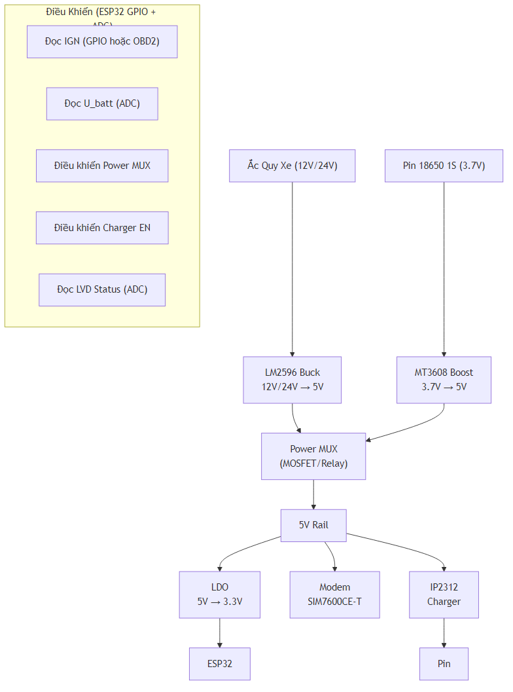

## III.1.7-10 Quản Lý Nguồn và Power Path Management

### Tổng Quan

Hệ thống quản lý nguồn bao gồm:

1. **Low Voltage Disconnect (LVD)**: Bảo vệ ắc quy khỏi rút cạn
2. **Power Path Management**: Chuyển đổi giữa ắc quy và pin backup
3. **Buck Converter**: 12V/24V → 5V (từ ắc quy)
4. **Boost Converter**: 3.7V → 5V (từ pin)
5. **Charger**: Sạc pin 18650 1S (IP2312)

### Nguyên Lý Hoạt Động

#### Logic Chuyển Nguồn

Hệ thống triển khai **2 profile nguồn độc lập** để vận hành thực tế trên xe 12V và 24V:

- **Profile 12V**: `Switch_OFF=12.0V`, `Switch_ON=12.2V`, `IGN_ON>=13.0V`, `IGN_OFF<=12.0V`
- **Profile 24V**: `Switch_OFF=24.0V`, `Switch_ON=24.4V`, `IGN_ON>=26.0V`, `IGN_OFF<=24.0V`

| Profile | Trạng Thái          | IGN | U_batt điều kiện | Nguồn Tracker | Sạc Pin  | Cảnh Báo |
| ------- | ------------------- | --- | ---------------- | ------------- | -------- | -------- |
| 12V     | Xe chạy bình thường | ON  | >= 13.0 V        | Ắc quy        | ✅ Có    | -        |
| 12V     | Xe đỗ bình thường   | OFF | > 12.0 V         | Ắc quy        | ❌ Không | -        |
| 12V     | Ắc quy yếu          | OFF | <= 12.0 V        | Pin 18650 1S     | ❌ Không | ✅ Có    |
| 12V     | Ắc quy phục hồi     | OFF | >= 12.2 V        | Ắc quy        | ❌ Không | ✅ Có    |
| 24V     | Xe chạy bình thường | ON  | >= 26.0 V        | Ắc quy        | ✅ Có    | -        |
| 24V     | Xe đỗ bình thường   | OFF | > 24.0 V         | Ắc quy        | ❌ Không | -        |
| 24V     | Ắc quy yếu          | OFF | <= 24.0 V        | Pin 18650 1S     | ❌ Không | ✅ Có    |
| 24V     | Ắc quy phục hồi     | OFF | >= 24.4 V        | Ắc quy        | ❌ Không | ✅ Có    |

#### Hysteresis

- **Profile 12V**: OFF ở `12.0V` → ON lại ở `12.2V`
- **Profile 24V**: OFF ở `24.0V` → ON lại ở `24.4V`
- **Mục đích**: Tránh dao động khi điện áp gần ngưỡng

### Lý Do Thiết Kế

#### 1. Bảo Vệ Ắc Quy

- Không rút cạn ắc quy quá mức → đảm bảo khả năng đề nổ
- Tự động chuyển sang pin khi ắc quy yếu

#### 2. Tự Động Hóa

- Tự động chuyển nguồn → không cần can thiệp từ người dùng
- Logic điều khiển trong firmware ESP32

#### 3. Cảnh Báo Kịp Thời

- Gửi cảnh báo khi chuyển nguồn
- Người dùng biết trạng thái nguồn

### Kiến Trúc Tổng Thể

### Các Thành Phần

Xem chi tiết trong các file:

- [`02-buck-converter.md`](./02-buck-converter.md) - Buck 12V/24V→5V
- [`03-boost-converter.md`](./03-boost-converter.md) - Boost 3.7V→5V
- [`04-power-path-management.md`](./04-power-path-management.md) - Power MUX
- [`05-low-voltage-disconnect.md`](./05-low-voltage-disconnect.md) - LVD
- [`06-charger-ip2312.md`](./06-charger-ip2312.md) - Charger

### Logic Điều Khiển

Xem chi tiết trong file firmware: [`part-04-power-management-gpio.md`](../../03-firmware/part-04-power-management-gpio.md)

### Kết Luận

Hệ thống quản lý nguồn đảm bảo:

- ✅ Bảo vệ ắc quy khỏi rút cạn
- ✅ Tự động chuyển nguồn khi cần
- ✅ Sạc pin khi xe chạy
- ✅ Cảnh báo kịp thời
