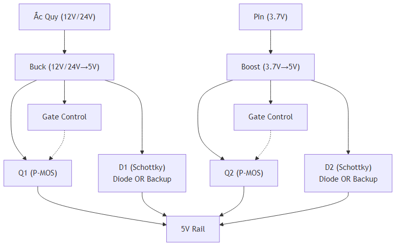

## III.1.10 Power Path Management

### Tổng Quan

**Power Path Management** chuyển đổi tự động giữa ắc quy (12V hoặc 24V) và pin backup (3.7V) để đảm bảo hệ thống luôn có nguồn.

### Yêu Cầu

- Chuyển đổi tự động giữa ắc quy (12V hoặc 24V) và pin backup (3.7V)
- Điều khiển sạc pin theo trạng thái IGN
- Chạy theo profile nguồn độc lập 12V/24V để quyết định chuyển nguồn
- Hysteresis theo profile:
  - 12V: `Switch_OFF=12.0V` → `Switch_ON=12.2V`
  - 24V: `Switch_OFF=24.0V` → `Switch_ON=24.4V`

### Giải Pháp: Diode OR + EN MP2482

#### Sơ Đồ Kết Nối

### Thành Phần

#### 1. Diode OR (D1, D2)

- **Loại**: 2 x Schottky (ví dụ 1N5822 hoặc tương đương) để OR đầu ra MP2482 và SX1308
- **Mục đích**: Hợp nhất 5V bus, tự động chuyển nguồn mà không cần MOSFET/relay
- **Giá**: ~2,000–5,000 VNĐ/cặp

#### 2. EN MP2482 (GPIO18)

- **Chức năng**: GPIO18 bật/tắt chân EN của MP2482 để ưu tiên nguồn xe
- **Tương tác**: Khi GPIO18 LOW (chế độ bình thường), MP2482 cung cấp 5V; khi HIGH, MP2482 tắt, SX1308 qua diode OR cấp 5V từ pin backup
- **Thiết kế**: Pull-down/logic tương ứng trong `power_mgr.c`

### Nguyên Lý Hoạt Động

#### 1. Ưu Tiên Ắc Quy

- **Mặc định**: GPIO18 kéo EN MP2482 về mức bật → MP2482 cấp 5V bus
- **Khi ắc quy yếu**: firmware tắt EN MP2482 → SX1308 + diode OR cấp 5V từ pin backup
- **Khi ắc quy phục hồi**: firmware bật lại EN MP2482 → quay về nguồn ắc quy

#### 2. Diode OR Backup

- Hai diode Schottky tự động chọn nguồn 5V khả dụng cao hơn giữa MP2482 và SX1308
- Không cần relay/MOSFET power mux chuyên dụng, giảm điểm lỗi cơ khí
- Tổn hao có thật (diode drop), nhưng đơn giản và dễ kiểm chứng trong đồ án

#### 3. Điều Khiển từ ESP32

- ESP32 đọc U_batt (GPIO4 ADC) và LVD_STATUS (GPIO19)
- GPIO18 điều khiển EN MP2482 theo profile 12V/24V
- GPIO5 điều khiển TP4056 để chỉ sạc khi điều kiện nguồn cho phép

### Logic Điều Khiển

- Nếu `U_batt <= Switch_OFF` của profile đang chạy → chuyển sang pin backup
- Nếu đang backup và `U_batt >= Switch_ON` → chuyển lại ắc quy
- Charger chỉ bật khi `IGN=ON` và `U_batt >= IGN_ON` của profile

Bộ ngưỡng mặc định:

- **12V**: `Switch_OFF=12.0V`, `Switch_ON=12.2V`, `IGN_ON>=13.0V`, `IGN_OFF<=12.0V`
- **24V**: `Switch_OFF=24.0V`, `Switch_ON=24.4V`, `IGN_ON>=26.0V`, `IGN_OFF<=24.0V`

Xem chi tiết trong file firmware: [`part-04-power-management-gpio.md`](../../03-firmware/part-04-power-management-gpio.md)

### So Sánh với Giải Pháp Khác

#### Option 1: Diode OR + EN MP2482 (Hiện tại)

**Ưu điểm:**

- ✅ Mạch đơn giản, không cần gate driver chuyên dụng
- ✅ Dễ mua linh kiện Schottky ở VN
- ✅ Tương thích trực tiếp với logic firmware hiện có (GPIO18 + LM393)
- ✅ Dễ kiểm chứng bằng đo điện áp trên bus 5V

**Nhược điểm:**

- ⚠️ Có sụt áp trên diode OR
- ⚠️ Cần chọn diode đủ dòng để tránh quá nhiệt
#### Option 2: Power Path Management IC (TPS2115A)

**Ưu điểm:**

- ✅ Tự động chuyển nguồn (không cần firmware)
- ✅ Tổn hao thấp (~100mV)
- ✅ Bảo vệ reverse current tốt

**Nhược điểm:**

- ⚠️ Giá cao (~50,000–80,000 VNĐ)
- ⚠️ Dòng tối đa 1.5A (có thể cần 2 IC song song)
- ⚠️ Khó mua ở VN

**Kết luận:** Diode OR + EN MP2482 phù hợp hơn cho baseline runtime hiện tại.

#### Option 3: Relay Module (Legacy)

**Ưu điểm:**

- ✅ Dễ thử nghiệm nhanh ở mức prototype

**Nhược điểm:**

- ⚠️ Tiêu thụ dòng khi ON (~70 mA)
- ⚠️ Có tiếng kêu (click)
- ⚠️ Tuổi thọ hạn chế (số lần chuyển)
- ⚠️ Không phù hợp baseline runtime hiện tại

**Kết luận:** Chỉ giữ để tham chiếu lịch sử, không dùng trong kiến trúc active.

### Khuyến Nghị cho Đồ Án

#### Giải Pháp Đề Xuất: Diode OR + EN MP2482

**Lý do:**

- Diode OR đơn giản, không cần MOSFET/relay gate driver
- GPIO18 chỉ điều khiển EN MP2482, diodes tự phân luồng giữa MP2482 và SX1308
- CPU bảo vệ ắc quy bằng comparator LM393 + firmware `power_is_low_voltage()` cắt EN 12/24V

**Sơ đồ:**

**Điều khiển:**

- GPIO18 LOW → EN MP2482 bật → dùng nguồn xe
- GPIO18 HIGH → EN MP2482 tắt → diode OR cho phép SX1308 (pin backup) cung cấp 5V

### Nơi Mua Hàng

#### Trên Shopee/Lazada VN:

- Tìm: "schottky diode 1N5822", "diode OR power", "MP2482 module"
- Giá: ~2,000–15,000 VNĐ tùy module/linh kiện

### Tài Liệu Tham Khảo

- **MP2482**: MP2482 Datasheet
- **Diode OR**: 1N5822 (hoặc diode Schottky tương đương) Datasheet
- **Power Path IC**: TPS2115A Datasheet (chỉ tham chiếu so sánh)

### Kết Luận

**Khuyến nghị cho đồ án:**

- ✅ Dùng **Diode OR + EN MP2482** cho baseline hiện tại
- ⚠️ TPS2115A chỉ là phương án thay thế khi cần IC power mux chuyên dụng

**Lưu ý:** Relay/MOSFET chỉ còn trong phần so sánh lịch sử, không phải kiến trúc runtime active.
