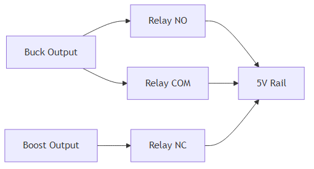

## III.1.10 Power Path Management

### Tổng Quan

**Power Path Management** chuyển đổi tự động giữa ắc quy (12V hoặc 24V) và pin backup (3.7V) để đảm bảo hệ thống luôn có nguồn.

### Yêu Cầu

- Chuyển đổi tự động giữa ắc quy (12V hoặc 24V) và pin backup (3.7V)
- Điều khiển sạc pin theo trạng thái IGN
- Chạy theo profile nguồn độc lập 12V/24V để quyết định chuyển nguồn
- Hysteresis theo profile:
  - 12V: `Switch_OFF=12.0V` → `Switch_ON=12.2V`
  - 24V: `Switch_OFF=24.0V` → `Switch_ON=24.4V`

### Giải Pháp: MOSFET + Diode OR

#### Sơ Đồ Kết Nối

### Thành Phần

#### 1. MOSFET (Q1, Q2)

- **Loại**: IRF9540N (P-MOSFET)
- **Vds**: -100V
- **Id**: -19A
- **Rds(on)**: ~0.2Ω
- **Giá**: ~5,000–10,000 VNĐ/cái

#### 2. Diode OR (D1, D2)

- **Loại**: 1N5822 (Schottky Diode, 3A, 40V)
- **Mục đích**: Backup nếu MOSFET lỗi
- **Giá**: ~2,000–5,000 VNĐ/cái

#### 3. Gate Driver (Q3, Q4)

- **Loại**: 2N7002 (N-MOSFET) hoặc transistor
- **Mục đích**: Điều khiển gate P-MOS từ ESP32 GPIO
- **Giá**: ~1,500 VNĐ/cái

### Nguyên Lý Hoạt Động

#### 1. Ưu Tiên Ắc Quy

- **Mặc định**: Q1 ON, Q2 OFF → dùng ắc quy
- **Khi ắc quy yếu**: Q1 OFF, Q2 ON → chuyển sang pin
- **Khi ắc quy phục hồi**: Q1 ON, Q2 OFF → chuyển lại ắc quy

#### 2. Diode OR Backup

- Nếu MOSFET lỗi, diode OR vẫn cung cấp nguồn
- Tổn hao cao hơn (diode drop ~0.4V) nhưng an toàn hơn

#### 3. Điều Khiển từ ESP32

- GPIO điều khiển gate Q1, Q2
- Logic trong firmware ESP32
- Đọc U_batt qua ADC để quyết định

### Logic Điều Khiển

- Nếu `U_batt <= Switch_OFF` của profile đang chạy → chuyển sang pin backup
- Nếu đang backup và `U_batt >= Switch_ON` → chuyển lại ắc quy
- Charger chỉ bật khi `IGN=ON` và `U_batt >= IGN_ON` của profile

Bộ ngưỡng mặc định:

- **12V**: `Switch_OFF=12.0V`, `Switch_ON=12.2V`, `IGN_ON>=13.0V`, `IGN_OFF<=12.0V`
- **24V**: `Switch_OFF=24.0V`, `Switch_ON=24.4V`, `IGN_ON>=26.0V`, `IGN_OFF<=24.0V`

Xem chi tiết trong file firmware: [`part-04-power-management-gpio.md`](../../03-firmware/part-04-power-management-gpio.md)

### So Sánh với Giải Pháp Khác

#### Option 1: MOSFET (Hiện tại)

**Ưu điểm:**

- ✅ Dễ mua ở VN
- ✅ Giá rẻ (~10,000–15,000 VNĐ)
- ✅ Đơn giản, dễ hiểu
- ✅ Linh hoạt (điều khiển bằng firmware)

**Nhược điểm:**

- ⚠️ Cần firmware điều khiển
- ⚠️ Tổn hao (Rds(on) ~0.2Ω)
- ⚠️ Cần gate driver

#### Option 2: Power Path Management IC (TPS2115A)

**Ưu điểm:**

- ✅ Tự động chuyển nguồn (không cần firmware)
- ✅ Tổn hao thấp (~100mV)
- ✅ Bảo vệ reverse current tốt

**Nhược điểm:**

- ⚠️ Giá cao (~50,000–80,000 VNĐ)
- ⚠️ Dòng tối đa 1.5A (có thể cần 2 IC song song)
- ⚠️ Khó mua ở VN

**Kết luận:** MOSFET phù hợp hơn cho đồ án (giá rẻ, dễ mua).

#### Option 3: Relay Module

**Ưu điểm:**

- ✅ Đơn giản, dễ sử dụng
- ✅ Module sẵn có (~5,000 VNĐ)
- ✅ Không cần gate driver

**Nhược điểm:**

- ⚠️ Tiêu thụ dòng khi ON (~70 mA)
- ⚠️ Có tiếng kêu (click)
- ⚠️ Tuổi thọ hạn chế (số lần chuyển)

**Kết luận:** Có thể dùng relay cho đồ án (đơn giản hơn MOSFET).

### Khuyến Nghị cho Đồ Án

#### Giải Pháp Đề Xuất: Relay Module

**Lý do:**

- Đơn giản hơn MOSFET (không cần gate driver)
- Module sẵn có, dễ mua
- Giá rẻ (~5,000 VNĐ)
- Đủ cho yêu cầu đồ án

**Sơ đồ:**

**Điều khiển:**

- GPIO HIGH → Relay ON → dùng ắc quy
- GPIO LOW → Relay OFF → dùng pin

### Nơi Mua Hàng

#### Trên Shopee/Lazada VN:

- Tìm: "relay 5V module", "relay 1 channel", "MOSFET module"
- Giá: ~5,000–15,000 VNĐ

### Tài Liệu Tham Khảo

- **MOSFET**: IRF9540N Datasheet
- **Power Path IC**: TPS2115A Datasheet
- **Relay**: Relay Module Datasheet

### Kết Luận

**Khuyến nghị cho đồ án:**

- ✅ Dùng **Relay Module** (đơn giản, dễ mua)
- ⚠️ Hoặc **MOSFET** nếu muốn chuyên nghiệp hơn

**Lưu ý:** Cả hai đều phù hợp, chọn dựa trên độ phức tạp muốn chấp nhận.
