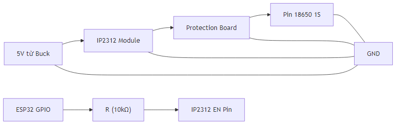

## III.1.9 Mạch Sạc và Bảo Vệ Pin 18650 1S: TP4056

> **Lưu ý:** Tên file chứa `ip2312` là legacy filename để giữ liên kết cũ. Nội dung runtime hiện tại dùng **TP4056**.

### Tổng Quan

**TP4056** là IC sạc Li-ion 1S phổ thông, được sử dụng để sạc pin 18650 1S theo profile IGN trong hệ thống hiện tại.

### Đặc Tính Kỹ Thuật

| Thông Số        | Giá Trị                                                         |
| --------------- | --------------------------------------------------------------- |
| **IC**          | TP4056 (Top Power / các bản tương thích phổ biến)              |
| **Dòng sạc**    | Thiết lập bởi điện trở PROG (thực tế module cần chọn theo tải) |
| **Điện áp vào** | 4.5–5.5 V (USB Type-C hoặc 5V từ buck)                         |
| **Điện áp ra**  | 4.2 V (Li-ion standard)                                        |
| **Hiệu suất**   | Phụ thuộc chênh áp và dòng sạc (mạch sạc tuyến tính)           |
| **Package**     | SOP-8 (IC), module thương mại có layout tích hợp               |
| **Tính năng**   | CC/CV, tự ngắt khi đầy, bảo vệ nhiệt nội                        |

### Lý Do Chọn TP4056

#### 1. Dễ tích hợp cho pin 1S

- Chuẩn sạc CC/CV 4.2V cho cell Li-ion 1S
- Dễ ghép với bus 5V từ MP2482 và điều khiển qua `CHARGER_EN`

#### 2. Phổ Biến ở Việt Nam

- Dễ mua trên Shopee, Lazada
- Module TP4056 sẵn có (ready-made board) nên không cần thiết kế PCB riêng
- Giá hợp lý (~20,000–40,000 VNĐ)

#### 3. Module Sẵn Có

- Không cần thiết kế PCB riêng
- Tiết kiệm thời gian thử nghiệm
- Dễ test và debug

#### 4. Type-C (hoặc micro-USB)

- Dễ dùng, phù hợp với board ESP32-S3 có USB-C
- Có thể sạc bằng cổng USB Type-C hoặc micro-USB tùy module

#### 5. Tính Năng Bảo Vệ (TP4056)

- Điều khiển sạc theo chu trình CC/CV
- Bảo vệ nhiệt nội bộ (thermal regulation)
- Tự giảm dòng khi chip nóng
- Tự kết thúc sạc khi pin đạt ngưỡng

### Chức Năng

#### 1. Sạc Pin 18650 1S

- Dòng sạc: theo cấu hình PROG của module TP4056 (chọn mức phù hợp cell 18650 1S)
- Điện áp sạc: 4.2 V (Li-ion standard)
- Thời gian sạc đầy: phụ thuộc cấu hình dòng sạc thực tế và trạng thái pin

#### 2. Tự Ngắt Khi Đầy

- Khi pin đạt 4.2V → tự động ngắt sạc
- Bảo vệ pin khỏi quá sạc

#### 3. Bảo Vệ

- **Quá nhiệt**: Tự giảm dòng khi nhiệt độ chip tăng
- **Kết thúc sạc**: Tự chuyển trạng thái khi pin đầy
- **Bảo vệ hệ thống**: Kết hợp protection board 1S để bảo vệ quá xả/quá dòng

### Kết Nối

#### Sơ Đồ Kết Nối



#### Điều Khiển từ ESP32

- **GPIO HIGH**: Charger enabled (sạc pin)
- **GPIO LOW**: Charger disabled (không sạc)

### Điều Kiện Sạc

- **IGN ON** + **U_batt >= IGN_ON theo profile** → Enable charger
- **IGN OFF** → Disable charger (bảo vệ ắc quy)
- **U_batt <= Switch_OFF theo profile** → Disable charger (bảo vệ ắc quy)

Ngưỡng mặc định:

- **Profile 12V**: `IGN_ON>=13.0V`, `Switch_OFF=12.0V`
- **Profile 24V**: `IGN_ON>=26.0V`, `Switch_OFF=24.0V`

### Mạch Bảo Vệ Pin (Protection Board)

#### Chức Năng Bảo Vệ

1. **Bảo vệ quá dòng xả**

   - Over-discharge protection: < 2.5V
   - Tự động ngắt khi pin yếu

2. **Bảo vệ quá áp**

   - Over-voltage protection: > 4.25V
   - Tự động ngắt khi quá sạc

3. **Bảo vệ ngắn mạch**

   - Short circuit protection
   - Tự động ngắt khi ngắn mạch

4. **Dòng xả tối đa**
   - 3A (phù hợp với pin 18650 1S)
   - Đủ cho tracker + modem

#### Lựa Chọn Protection Board

**Option 1: BMS 1S 3A Module (Khuyến nghị)**

- Module sẵn có, dễ mua
- Giá: ~10,000–20,000 VNĐ
- Tích hợp sẵn protection
- Khuyến nghị cho đồ án

**Option 2: DW01 + MOSFET**

- IC bảo vệ phổ biến
- Cần thiết kế PCB riêng
- Phù hợp nếu thiết kế PCB custom

**Option 3: Tích Hợp Sẵn**

- Một số module sạc có tích hợp protection
- Kiểm tra trước khi mua

### Tính Toán Thời Gian Sạc

#### Thời Gian Sạc Lý Thuyết

```
Thời gian ≈ Dung lượng / Dòng sạc cấu hình (PROG)
```

Ví dụ nếu cấu hình dòng 1A cho cell 5000mAh:

```
Thời gian lý thuyết ≈ 5000 / 1000 = 5 giờ
```

#### Thời Gian Sạc Thực Tế

- **Dòng sạc giảm dần** khi vào pha CV
- **Nhiệt độ module** làm thay đổi dòng hiệu dụng
- **Ước tính thực tế**: luôn cao hơn thời gian lý thuyết

### Nơi Mua Hàng

#### Trên Shopee/Lazada VN:

- Tìm: "TP4056 charger module", "sạc pin 1S Type-C", "Li-ion charger TP4056"
- Giá: ~20,000–40,000 VNĐ (module)
- Lưu ý: Chọn module có protection board tích hợp

#### Cửa Hàng Linh Kiện:

- Chipdientu.com.vn
- DKE.vn
- Linhkienfpt.vn

### Tài Liệu Tham Khảo

- **Datasheet**: TP4056 Datasheet (Top Power / bản tương thích dùng trong module)
- **Application Note**: TP4056 Design Guide
- **Protection IC**: DW01 Datasheet

### Kết Luận

TP4056 là lựa chọn phù hợp vì:

- ✅ Chuẩn sạc CC/CV cho pin 1S
- ✅ Phổ biến ở VN → dễ mua
- ✅ Module sẵn có → tiết kiệm thời gian
- ✅ Có bảo vệ nhiệt nội để vận hành ổn định
- ✅ Phù hợp với yêu cầu đồ án

**Lưu ý quan trọng:**

- Luôn sử dụng protection board cho pin
- Chỉ sạc khi IGN ON và U_batt đạt ngưỡng `IGN_ON` của profile (12V: `>=13.0V`, 24V: `>=26.0V`)
- Nếu U_batt giảm xuống `<= Switch_OFF` (12V: `12.0V`, 24V: `24.0V`) thì tắt sạc để bảo vệ ắc quy
- Monitor trạng thái sạc và gửi cảnh báo khi cần
