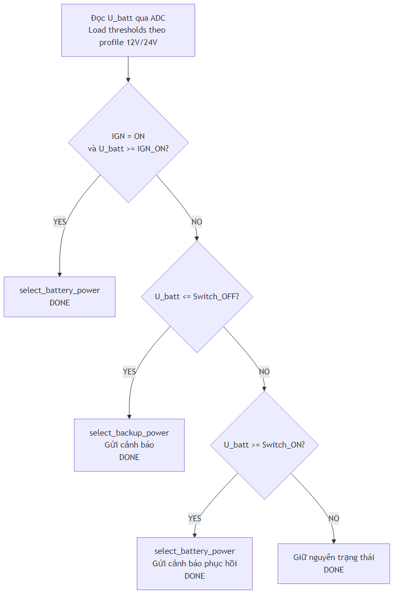

## PHẦN V: THIẾT KẾ PHẦN MỀM (FIRMWARE) - POWER MANAGEMENT VÀ GPIO

### V.6 Power Path Management Control

#### V.6.1 Điều Khiển EN MP2482 + Diode OR

**GPIO Mapping:**

- **GPIO18**: POWER_MUX_SEL (điều khiển EN MP2482)
  - LOW (0): Bật MP2482, ưu tiên nguồn ắc quy lên bus 5V
  - HIGH (1): Tắt MP2482, bus 5V do SX1308 (pin backup) cấp qua diode OR

**Logic Điều Khiển:**

```c
// Bật nguồn xe qua MP2482
void select_battery_power() {
    gpio_set_level(POWER_MUX_SEL, 0);  // EN MP2482 = ON
}

// Tắt MP2482 để chuyển sang pin backup qua diode OR
void select_backup_power() {
    gpio_set_level(POWER_MUX_SEL, 1);  // EN MP2482 = OFF
}
```

**Flowchart:**



**Bộ ngưỡng mặc định theo profile:**

- **12V**: `Switch_OFF=12.0V`, `Switch_ON=12.2V`, `IGN_ON>=13.0V`, `IGN_OFF<=12.0V`
- **24V**: `Switch_OFF=24.0V`, `Switch_ON=24.4V`, `IGN_ON>=26.0V`, `IGN_OFF<=24.0V`

#### V.6.2 Điều Khiển Charger (TP4056)

**GPIO Mapping:**

- **GPIO5**: CHARGER_EN (enable TP4056 charger module)
  - HIGH (1): Charger enabled (sạc pin 1S)
  - LOW (0): Charger disabled (không sạc)

**Logic Điều Khiển:**

```c
// Bật sạc pin
void enable_charger() {
    gpio_set_level(CHARGER_EN, 1);
}

// Tắt sạc pin
void disable_charger() {
    gpio_set_level(CHARGER_EN, 0);
}
```

**Điều Kiện Sạc:**

- **IGN ON** + **U_batt >= IGN_ON (theo profile)** → Enable charger
- **IGN OFF** → Disable charger (bảo vệ ắc quy)
- **U_batt <= Switch_OFF (theo profile)** → Disable charger (bảo vệ ắc quy)

Mặc định:

- **Profile 12V**: bật sạc khi `U_batt >= 13.0V`
- **Profile 24V**: bật sạc khi `U_batt >= 26.0V`

#### V.6.3 Đọc Trạng Thái LVD

**GPIO Mapping:**

- **GPIO19**: LVD_STATUS (đọc từ comparator LM393)
  - HIGH (1): firmware xem là trạng thái low-voltage (`power_is_low_voltage()` trả `true`)
  - LOW (0): firmware xem là không low-voltage

**Đọc Trạng Thái:**

```c
bool read_lvd_status() {
    return gpio_get_level(LVD_STATUS) == 1;  // HIGH = low-voltage theo firmware hiện tại
}
```

**Sử Dụng:**

- **Backup cho ADC**: Nếu ADC lỗi, có thể dùng LVD status
- **Fast check**: Đọc nhanh trạng thái nguồn
- **Hysteresis**: Comparator tự xử lý theo profile (12V: 12.0V → 12.2V, 24V: 24.0V → 24.4V)

### V.6.4 Đo U_batt bằng ADC cho cả 12V/24V

**Mạch chia áp thống nhất:**

- `R1 = 100kΩ` (từ U_batt xuống nút ADC)
- `R2 = 10kΩ` (từ nút ADC xuống GND)
- Tỷ lệ: `R2/(R1+R2) = 10k/110k = 0.0909`

**Công thức firmware:**

```c
float v_adc = (adc_raw / 4095.0f) * 3.3f;
float u_batt = v_adc * 11.0f;
```

**Ví dụ chuyển đổi:**

- `U_batt=12.0V` → `V_adc≈1.091V` → `ADC≈1354`
- `U_batt=24.0V` → `V_adc≈2.182V` → `ADC≈2708`
- `U_batt=26.0V` → `V_adc≈2.364V` (vẫn trong dải ADC 3.3V)

### V.7 GPIO Mapping và Configuration

**GPIO Định Nghĩa:**

| GPIO | Chức Năng        | Hướng  | Mô Tả                           |
| ---- | ---------------- | ------ | ------------------------------- |
| 2    | IGN_IN           | Input  | Đọc IGN status (GPIO hoặc OBD2) |
| 4    | U_BATT_ADC       | Input  | Đọc điện áp ắc quy (ADC)        |
| 5    | CHARGER_EN       | Output | Điều khiển TP4056 charger       |
| 18   | POWER_MUX_SEL    | Output | Điều khiển EN MP2482            |
| 19   | LVD_STATUS       | Input  | Đọc trạng thái LVD              |
| 21   | LIS3DH_INT       | Input  | Interrupt từ IMU                |
| 22   | LIS3DH_SDA (I2C) | I/O    | I2C data                        |
| 23   | LIS3DH_SCL (I2C) | I/O    | I2C clock                       |
| 16   | MODEM_UART_TX    | Output | UART TX đến modem               |
| 17   | MODEM_UART_RX    | Input  | UART RX từ modem                |
| 25   | MODEM_PWRKEY     | Output | Điều khiển power modem          |

**Lưu Ý:**

- Khả năng input/output và pull-up/pull-down phụ thuộc từng GPIO cụ thể theo datasheet ESP32-S3.
- ADC sử dụng cấu hình runtime hiện tại tại `GPIO4` (`PIN_U_BATT_ADC`).
- Deep Sleep Wake-up: tham chiếu theo cấu hình wakeup thực tế trong firmware và giới hạn của ESP32-S3 datasheet.

