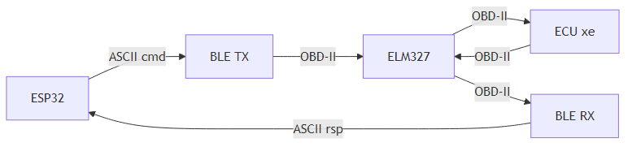

# 04. Giao thức OBD2 qua BLE

## 4.1. Tổng quan giao thức truyền nhận

Giao tiếp OBD2 qua BLE sử dụng **text-based protocol** (giao thức dạng văn bản ASCII). Lệnh được gửi dưới dạng chuỗi ký tự hex, phản hồi cũng là chuỗi hex có khoảng trắng phân tách.



### Quy ước ký tự đặc biệt

| Ký tự | Mã ASCII | Ý nghĩa |
|-------|----------|---------|
| `\r` | 0x0D (CR) | Kết thúc lệnh gửi đi (BẮT BUỘC) |
| `\n` | 0x0A (LF) | Xuống dòng trong phản hồi (tùy cấu hình) |
| `>` | 0x3E | Prompt — adapter sẵn sàng nhận lệnh tiếp |
| `?` | 0x3F | Lỗi — lệnh không hợp lệ hoặc không có dữ liệu |
| ` ` (space) | 0x20 | Phân tách byte trong phản hồi (tùy cấu hình) |

---

## 4.2. Định dạng lệnh OBD-II

### Cấu trúc lệnh

```
Format: "[Mode][PID]\r"

Trong đó:
  - Mode: 2 ký tự hex (01-0A)
  - PID:  2 ký tự hex (00-FF)
  - \r:   Carriage Return (bắt buộc, mã ASCII 0x0D)
```

### Ví dụ lệnh

| Lệnh | Mode | PID | Mô tả |
|-------|------|-----|-------|
| `"010C\r"` | 01 | 0C | Đọc tốc độ động cơ (RPM) |
| `"010D\r"` | 01 | 0D | Đọc tốc độ xe (km/h) |
| `"0105\r"` | 01 | 05 | Đọc nhiệt độ nước làm mát |
| `"0104\r"` | 01 | 04 | Đọc tải động cơ (%) |
| `"012F\r"` | 01 | 2F | Đọc mức nhiên liệu (%) |
| `"0100\r"` | 01 | 00 | Kiểm tra PID nào được hỗ trợ (01-20) |
| `"03\r"` | 03 | — | Đọc mã lỗi chẩn đoán (DTC) |
| `"04\r"` | 04 | — | Xóa mã lỗi chẩn đoán |

### Code gửi lệnh

```c
// Format lệnh và gửi qua BLE
int ble_obd_rxtx(ble_obd_ctx_t *obd, uint8_t mode, uint8_t pid,
                 uint32_t timeout_ms)
{
    // Format: "010C\r" (6 bytes cho mode 01, PID 0C)
    snprintf(obd->tx_data.buf, sizeof(obd->tx_data.buf),
             "%02X%02X\r", mode, pid);

    // Gửi qua BLE Write vào TX Characteristic
    ble_mgr_send(obd->mgr_ctx,
                 obd_tx_char->handle,
                 obd->tx_data.buf,
                 strlen(obd->tx_data.buf));

    // Chờ phản hồi (blocking semaphore)
    if (xSemaphoreTake(obd->api.response_sem,
                       pdMS_TO_TICKS(timeout_ms)) != pdTRUE) {
        return -1;  // Timeout
    }
    return 0;
}
```

---

## 4.3. Định dạng phản hồi OBD-II

### Cấu trúc phản hồi

```
Format: "[ResponseMode] [PID] [DataByte1] [DataByte2] ...\r\n"

Trong đó:
  - ResponseMode = RequestMode + 0x40
    (Ví dụ: gửi Mode 01 → nhận Mode 41)
  - PID: echo lại PID đã yêu cầu
  - DataBytes: 1-4 byte dữ liệu (tùy PID)
  - Kết thúc: "\r\n" rồi ">\r" (prompt)
```

### Ví dụ phản hồi

```
Yêu cầu:  "010C\r"          (Đọc RPM)
Phản hồi: "41 0C 1F 40\r\n" (Dữ liệu RPM)
           ">\r"             (Prompt — sẵn sàng)
```

Phân tích phản hồi `"41 0C 1F 40"`:

| Byte | Giá trị | Ý nghĩa |
|------|---------|---------|
| `41` | 0x41 | Mode = 0x41 (= 0x01 + 0x40) ← xác nhận |
| `0C` | 0x0C | PID = 0x0C (RPM) ← echo |
| `1F` | 0x1F = 31 | Byte A |
| `40` | 0x40 = 64 | Byte B |

```
RPM = (A × 256 + B) / 4
    = (31 × 256 + 64) / 4
    = (7936 + 64) / 4
    = 8000 / 4
    = 2000 vòng/phút
```

### Các loại phản hồi đặc biệt

| Phản hồi | Ý nghĩa | Hành động |
|----------|---------|-----------|
| `"41 0C 1F 40\r\n>\r"` | Phản hồi bình thường | Parse dữ liệu |
| `"?\r\n>\r"` | Lệnh không hợp lệ hoặc PID không hỗ trợ | Bỏ qua PID này |
| `"NO DATA\r\n>\r"` | Xe không phản hồi (ECU không trả lời) | Thử lại hoặc skip |
| `"UNABLE TO CONNECT\r\n>\r"` | Không kết nối được với ECU xe | Kiểm tra cổng OBD2 |
| `"BUS INIT: ...ERROR\r\n>\r"` | Lỗi khởi tạo bus OBD-II | Thử lại `ATSP0` |

### Code xử lý phản hồi

```c
static void ble_obd_notify_cb(const uint8_t *data, size_t len,
                               uint16_t attr_handle, void *usr_ctx)
{
    ble_obd_ctx_t *obd = (ble_obd_ctx_t *)usr_ctx;

    // Sao chép data vào buffer tạm (data gốc từ BLE stack, không nên giữ lâu)
    char copy[256];
    memcpy(copy, data, len);
    copy[len] = '\0';

    // 1. Kiểm tra Prompt ">\r" → adapter sẵn sàng
    if (strncmp(copy, ">\r", 2) == 0) {
        xSemaphoreGive(obd->api.response_sem);  // Giải phóng semaphore
        return;
    }

    // 2. Kiểm tra lỗi "?\r"
    if (strncmp(copy, "?\r", 2) == 0) {
        obd->response_cb(-1, NULL, 0, obd->usr_ctx);  // Báo lỗi
        return;
    }

    // 3. Parse dữ liệu OBD2
    ble_obd_process_obd_data(obd, copy, len);
}

static void ble_obd_process_obd_data(ble_obd_ctx_t *obd,
                                      char *data, size_t len)
{
    // Parse "41 0C 1F 40" thành mảng byte
    char *saveptr;
    char *tok = strtok_r(data, " \r", &saveptr);
    uint8_t values[BLE_OBD_MAX_DATA_LEN];
    int count = 0;

    while (tok && count < BLE_OBD_MAX_DATA_LEN) {
        long val = strtol(tok, NULL, 16);   // Hex string → số
        values[count++] = (uint8_t)val;
        tok = strtok_r(NULL, " \r", &saveptr);
    }

    // Validate: response mode phải = request mode + 0x40
    if (count >= 2 &&
        values[0] == (obd->tx_data.mode + 0x40) &&
        values[1] == obd->tx_data.pid) {

        // Gọi callback với data bytes (bỏ qua mode + pid)
        obd->response_cb(obd->tx_data.pid,
                         values + 2,     // Chỉ lấy data bytes
                         count - 2,      // Số data bytes
                         obd->usr_ctx);
    }
}
```

---

## 4.4. Bảng PID OBD-II và công thức chuyển đổi

### Các PID quan trọng cho Vehicle Tracking

| PID | Tên | Bytes | Công thức | Đơn vị | Phạm vi |
|-----|-----|-------|-----------|--------|---------|
| `0x0C` | Tốc độ động cơ | 2 | (A×256 + B) / 4 | RPM | 0 – 16383.75 |
| `0x0D` | Tốc độ xe | 1 | A | km/h | 0 – 255 |
| `0x04` | Tải động cơ | 1 | (A×100) / 255 | % | 0 – 100 |
| `0x05` | Nhiệt độ nước làm mát | 1 | A - 40 | °C | -40 – 215 |
| `0x0F` | Nhiệt độ khí nạp | 1 | A - 40 | °C | -40 – 215 |
| `0x11` | Vị trí bướm ga | 1 | (A×100) / 255 | % | 0 – 100 |
| `0x2F` | Mức nhiên liệu | 1 | (A×100) / 255 | % | 0 – 100 |
| `0x42` | Điện áp ECU | 2 | (A×256 + B) / 1000 | V | 0 – 65.535 |
| `0x46` | Nhiệt độ không khí | 1 | A - 40 | °C | -40 – 215 |
| `0x5C` | Nhiệt độ dầu động cơ | 1 | A - 40 | °C | -40 – 215 |
| `0x5E` | Tốc độ tiêu thụ nhiên liệu | 2 | (A×256 + B) / 20 | L/h | 0 – 3276.75 |

### Code chuyển đổi giá trị

```c
// Định nghĩa PID với hàm chuyển đổi
typedef struct {
    uint8_t     pid;            // Mã PID
    uint8_t     data_len;       // Số byte dữ liệu
    const char *name;           // Tên hiển thị
    const char *unit;           // Đơn vị
    int (*conversion)(int32_t *value, uint8_t const *data, size_t len);
} obd_pid_cfg_t;

// Bảng cấu hình PID
static const obd_pid_cfg_t g_obd_pids[] = {
    {0x0C, 2, "RPM",    "/min", obd_conv_rpm},
    {0x0D, 1, "SPEED",  "km/h", NULL},              // Không cần chuyển đổi
    {0x04, 1, "ENGINE", "%",    obd_conv_percent},
    {0x05, 1, "TEMP",   "°C",   obd_conv_temperature},
    {0x2F, 1, "FUEL",   "%",    obd_conv_percent},
};

// RPM: (A × 256 + B) / 4
static int obd_conv_rpm(int32_t *value, uint8_t const *data, size_t len)
{
    if (len < 2) return -1;
    *value = ((data[0] << 8) | data[1]) / 4;
    return 0;
}

// Phần trăm: (A × 100) / 255
static int obd_conv_percent(int32_t *value, uint8_t const *data, size_t len)
{
    if (len < 1) return -1;
    *value = (data[0] * 100) / 255;
    return 0;
}

// Nhiệt độ: A - 40
static int obd_conv_temperature(int32_t *value, uint8_t const *data, size_t len)
{
    if (len < 1) return -1;
    *value = data[0] - 40;
    return 0;
}

// Điện áp: (A × 256 + B) / 1000
static int obd_conv_voltage(int32_t *value, uint8_t const *data, size_t len)
{
    if (len < 2) return -1;
    *value = ((data[0] << 8) | data[1]) / 1000;
    return 0;
}
```

### Kiểm tra PID được hỗ trợ

Không phải xe nào cũng hỗ trợ tất cả PID. Trước khi đọc, cần kiểm tra:

```
Lệnh:    "0100\r"
Phản hồi: "41 00 BE 1F A8 13\r\n"

Phân tích 4 byte dữ liệu (32 bit):
  BE 1F A8 13 = 1011 1110 0001 1111 1010 1000 0001 0011

  Bit 1  (PID 01): 1 → Hỗ trợ ✓  (Monitor status)
  Bit 2  (PID 02): 0 → Không ✗
  Bit 3  (PID 03): 1 → Hỗ trợ ✓  (Fuel system status)
  ...
  Bit 12 (PID 0C): 1 → Hỗ trợ ✓  (Engine RPM)
  Bit 13 (PID 0D): 1 → Hỗ trợ ✓  (Vehicle speed)
  ...
```

> **Khuyến nghị:** Khi khởi động, gửi `0100\r` để kiểm tra PID 01-20, `0120\r` cho PID 21-40, `0140\r` cho PID 41-60. Chỉ polling những PID được hỗ trợ.

---

## 4.5. AT Commands (Lệnh cấu hình ELM327)

### Giới thiệu

Ngoài lệnh OBD-II, Vgate iCar Pro (chip ELM327) hỗ trợ các lệnh AT (Attention) để cấu hình adapter. Lệnh AT bắt đầu bằng tiền tố `AT`.

### Các lệnh AT quan trọng

| Lệnh | Mô tả | Ứng dụng |
|-------|-------|----------|
| `"ATZ\r"` | Reset adapter về trạng thái mặc định | Khởi tạo sau khi kết nối BLE |
| `"ATE0\r"` | Tắt echo (không gửi lại lệnh) | Giảm dữ liệu truyền qua BLE |
| `"ATL0\r"` | Tắt linefeed (không thêm \n) | Đơn giản hóa parsing |
| `"ATS0\r"` | Tắt khoảng trắng giữa các byte | Phản hồi ngắn gọn hơn |
| `"ATH0\r"` | Tắt header (không hiện address) | Đơn giản hóa phản hồi |
| `"ATSP0\r"` | Tự động chọn giao thức OBD-II | Tương thích mọi loại xe |
| `"ATST64\r"` | Đặt timeout 100ms (0x64 = 100) | Phản hồi nhanh hơn |
| `"ATI\r"` | Hiện thông tin phiên bản adapter | Debug, kiểm tra firmware |
| `"ATRV\r"` | Đọc điện áp pin xe | Giám sát tình trạng ắc-quy |

### Trình tự khởi tạo khuyến nghị

Sau khi kết nối BLE thành công và bật Notify, nên gửi chuỗi lệnh AT để cấu hình adapter:

```c
// Trình tự khởi tạo ELM327 (gửi tuần tự, chờ ">\r" sau mỗi lệnh)
const char *init_commands[] = {
    "ATZ\r",     // 1. Reset adapter
    "ATE0\r",    // 2. Tắt echo
    "ATL0\r",    // 3. Tắt linefeed
    "ATS0\r",    // 4. Tắt space giữa byte
    "ATH0\r",    // 5. Tắt header
    "ATSP0\r",   // 6. Auto-detect protocol
};
```

**Giải thích lý do từng lệnh:**

1. **ATZ**: Reset adapter đảm bảo trạng thái sạch, xóa mọi cấu hình cũ
2. **ATE0**: Tắt echo — mặc định ELM327 gửi lại lệnh trước phản hồi (ví dụ `010C\r\n41 0C...`). Tắt echo giảm dữ liệu BLE truyền
3. **ATL0**: Tắt linefeed — phản hồi chỉ có `\r` thay vì `\r\n`, tiết kiệm 1 byte mỗi dòng
4. **ATS0**: Tắt space — phản hồi `"410C1F40"` thay vì `"41 0C 1F 40"`, ngắn gọn hơn (nhưng khó đọc hơn khi debug)
5. **ATH0**: Tắt header CAN — không hiện address byte, chỉ lấy data
6. **ATSP0**: Tự động nhận diện giao thức CAN/KWP/J1850 của xe

> **Lưu ý:** Sau `ATZ`, adapter mất khoảng 1-2 giây để reset. Nên chờ response `"ELM327 v2.3\r\n>\r"` trước khi gửi lệnh tiếp.

### So sánh phản hồi có/không có AT cấu hình

| Cấu hình | Phản hồi cho `010C\r` |
|----------|----------------------|
| Mặc định (echo ON, space ON, header ON) | `010C\r\n7E8 06 41 0C 1F 40 00 00\r\n>\r` |
| Sau khi cấu hình (echo OFF, space OFF, header OFF) | `410C1F40\r>\r` |

Phản hồi sau cấu hình ngắn hơn **~60%**, giảm đáng kể lượng data truyền qua BLE.

---

## 4.6. Vòng lặp đọc dữ liệu (Polling Loop)

### Chiến lược polling

Trong hệ thống Vehicle Tracking, ESP32 đọc dữ liệu OBD2 liên tục theo vòng lặp:

```c
void obd_periodic_task(void *arg)
{
    ble_obd_ctx_t *obd = (ble_obd_ctx_t *)arg;
    TickType_t last_wake = xTaskGetTickCount();
    const uint32_t period_ms = 200;  // 5 Hz polling rate

    while (true) {
        vTaskDelayUntil(&last_wake, pdMS_TO_TICKS(period_ms));

        // Kiểm tra kết nối
        if (!ble_obd_is_connected(obd)) {
            continue;  // Bỏ qua nếu mất kết nối
        }

        // Đọc tuần tự nhiều PID, chờ 50ms giữa mỗi lệnh
        ble_obd_rxtx(obd, 0x01, 0x0C, 200);  // RPM
        vTaskDelay(pdMS_TO_TICKS(50));

        ble_obd_rxtx(obd, 0x01, 0x0D, 200);  // Speed
        vTaskDelay(pdMS_TO_TICKS(50));

        ble_obd_rxtx(obd, 0x01, 0x05, 200);  // Coolant Temp
        vTaskDelay(pdMS_TO_TICKS(50));

        ble_obd_rxtx(obd, 0x01, 0x2F, 200);  // Fuel Level
    }
}
```

### Phân tích timing

```
Timeline 1 chu kỳ polling (200ms):
├── RPM    ──────── 50-80ms ──┤
├── delay  ──────── 50ms ─────┤
├── Speed  ──────── 50-80ms ──┤
├── delay  ──────── 50ms ─────┤
├── Temp   ──────── ...       │
└── Tổng: ~400-500ms cho 4 PID │
```

> **Lưu ý thực tế:** Với 4 PID, mỗi PID cần ~50-100ms xử lý, tổng mỗi chu kỳ mất ~400-500ms. Tốc độ thực tế đạt khoảng **2 Hz** (2 lần/giây cho đầy đủ dữ liệu), không phải 5 Hz như period setting. Đây là giới hạn của giao thức OBD-II qua ELM327, không phải giới hạn BLE.

---

## Tài liệu tham khảo

1. SAE International, "SAE J1979 - E/E Diagnostic Test Modes", 2014
2. Wikipedia, "OBD-II PIDs", en.wikipedia.org/wiki/OBD-II_PIDs
3. ELM Electronics, "ELM327 OBD to RS232 Interpreter", Datasheet v2.3, 2017
4. Project esp32-obd2-meter, `main/src/ble_obd.c`, `main/main.c`
