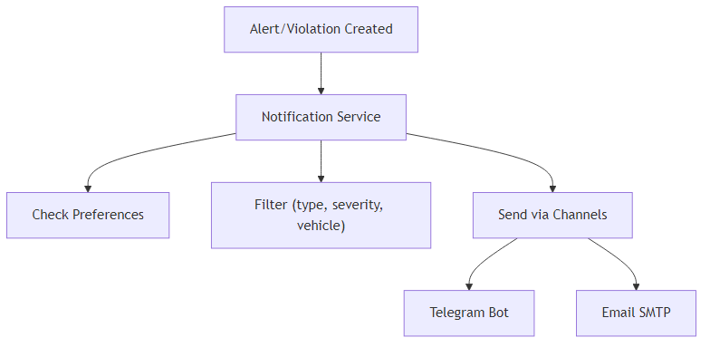

## PHẦN XII.1: TỔNG QUAN

### XII.1 Tổng Quan

Hệ thống hỗ trợ gửi thông báo và cảnh báo qua **2 kênh chính**:

1. **Telegram Bot**: Thông báo real-time, nhanh chóng
2. **Email**: Thông báo chi tiết, có thể lưu trữ

**Use Cases:**

- ✅ Cảnh báo khi xe di chuyển bất thường
- ✅ Cảnh báo vi phạm tốc độ
- ✅ Cảnh báo pin thấp
- ✅ Thông báo device offline
- ✅ Thông báo maintenance sắp đến hạn
- ✅ [Phase 2] Thông báo booking mới, pickup/return
- ✅ [Phase 2] Thông báo thanh toán

**Kiến Trúc:**

---

