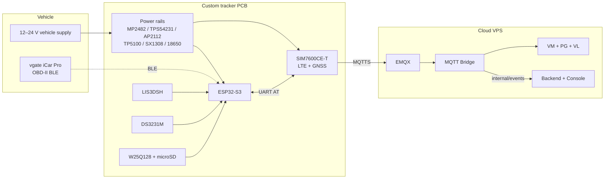
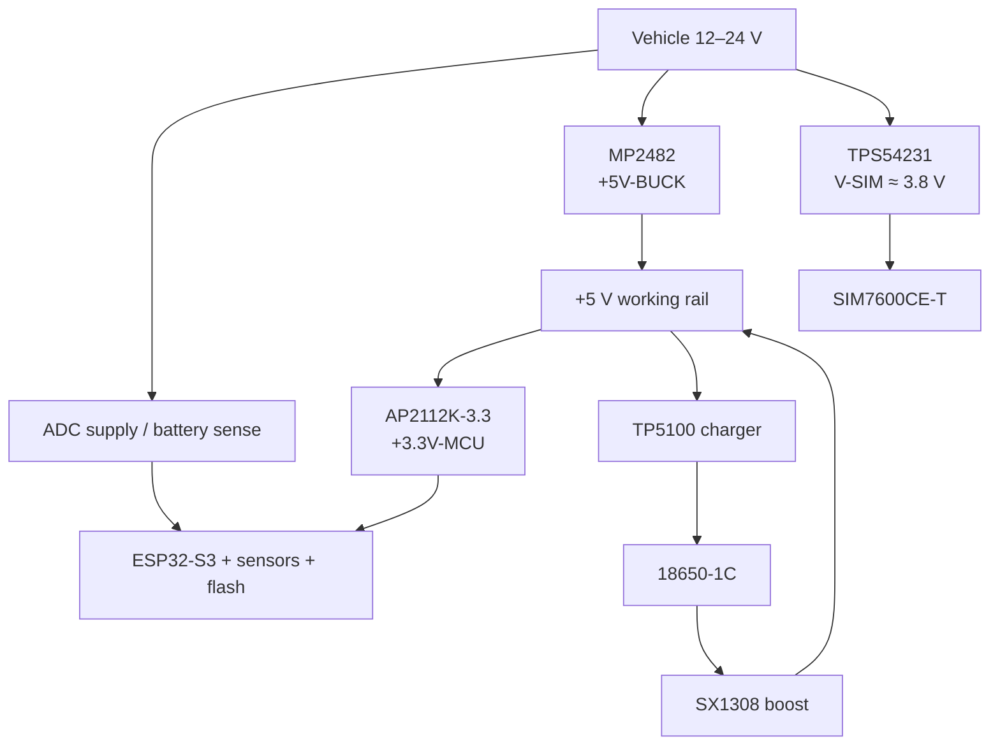
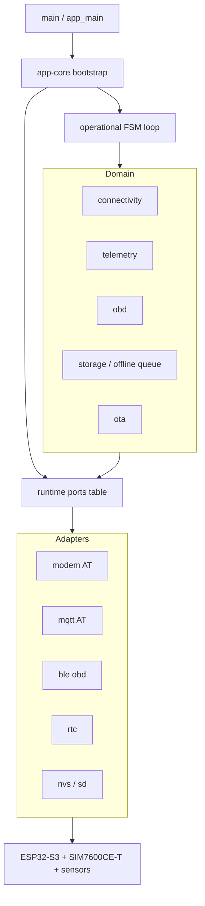
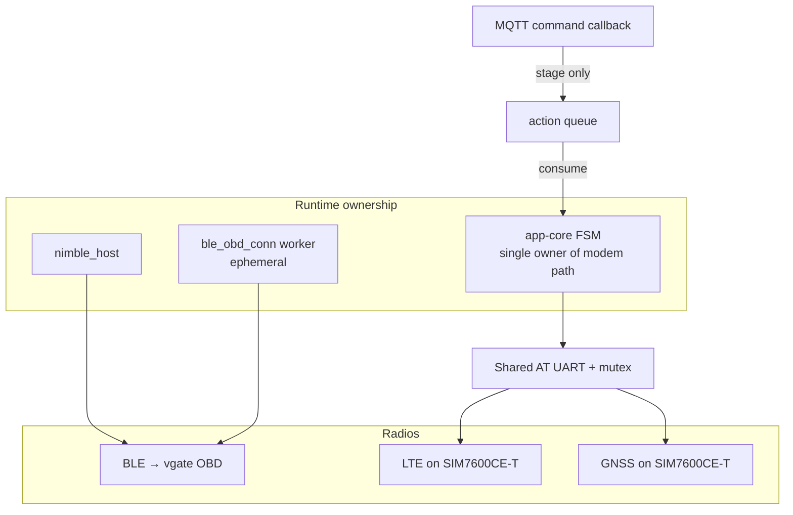
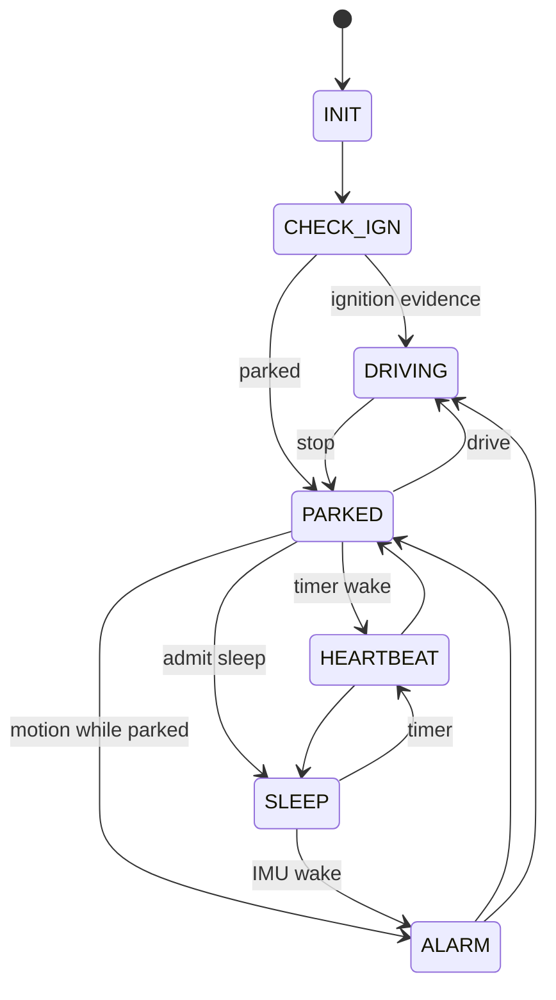
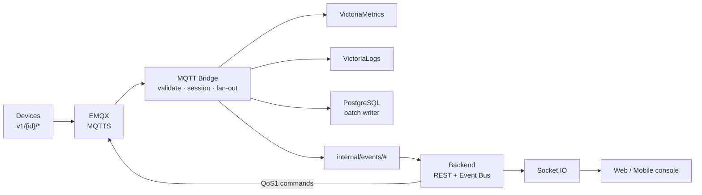
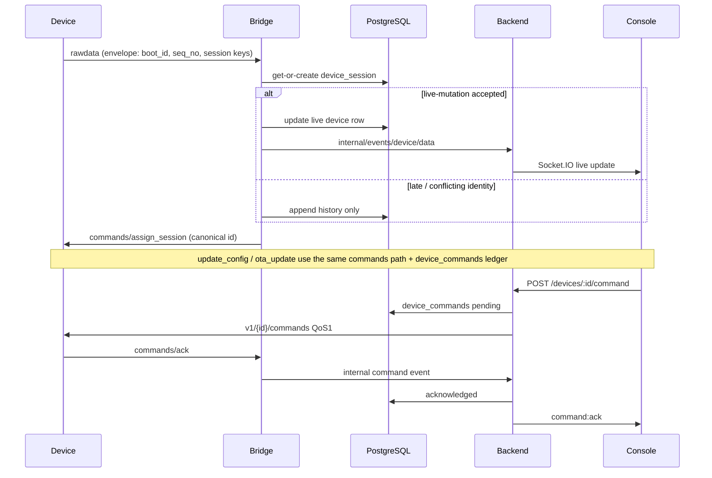

# A Modular Low-Cost Telematics Platform for Self-Drive Rental Fleets: Duty-Cycled Edge Sensing, Timeline Continuity over Intermittent Cellular Links, and Cloud Fleet Operations

**Placeholder — Authors:** A. N. Author, B. N. Author
**Placeholder — Affiliation:** University / Lab
**Target venue:** Sensors / IEEE Access (TBD)

---

## Abstract

Self-drive vehicle rental separates the asset owner from the vehicle for most of the rental period, yet the owner keeps full responsibility for the asset. Fleet operators therefore need continuous knowledge of vehicle position, ignition-related state, unauthorized motion while parked, and basic powertrain health — delivered over consumer cellular networks, without draining the starter battery during multi-day parking, and at a bill-of-materials cost low enough to equip every car in a small fleet. This paper presents a complete telematics platform co-designed around those constraints. A custom ESP32-S3 tracker pairs an LTE/GNSS modem (SIMCom SIM7600CE-T) with Bluetooth Low Energy (BLE) OBD-II access through a vgate iCar Pro adapter; duty-cycled firmware coordinates the three radio paths under a seven-state operational finite-state machine (FSM) that serializes a single shared AT bus. In the cloud, an EMQX broker feeds an MQTT Bridge that authenticates payloads, reconstructs device sessions, fans out to hybrid storage, and fences the live operator view against late or conflicting data, while a separate Backend serves REST and realtime interfaces to a fleet console. When publishing fails, identity-stamped payloads are buffered on microSD and later replayed byte-identically, so vehicle timelines remain continuous across outages and reboots; firmware updates travel over the same cellular link. The platform is validated with a hardware-in-the-loop (HIL) ECU rig, MQTT fleet simulators, and two passenger cars. **[Quantitative highlights — insert one sentence from Campaigns VI-A…VI-I once archived raw artifacts are available.]**

**Index Terms**—Embedded systems, Internet of Things, MQTT, OBD-II, offline buffering, vehicle telematics, duty cycling, over-the-air update.

---

## I. Introduction

Self-drive vehicle rental separates the economic owner of a car from its driver for most of the rental period. The operator hands over the key yet retains responsibility for the asset: they must know where each vehicle is, whether its powertrain appears to be running, whether a parked vehicle is being moved without authorization, and whether basic OBD-II health indicators warrant attention. In this setting, telematics is not a convenience feature; it is the operator's only view into the vehicle.

Four constraints shape the design space. First, consumer LTE coverage is intermittent: tunnels, underground parking, and peri-urban handoffs interrupt connectivity for seconds to tens of minutes, so a tracker that reports only while online produces broken vehicle timelines. Second, rental cars park for days on the starter battery, so the tracker must duty-cycle aggressively while remaining able to detect and report motion. Third, installation must be non-invasive and portable across heterogeneous car models, which rules out tapping the CAN harness and favors the standardized OBD-II port. Fourth, the device must be cheap enough to be fitted to every vehicle in a small fleet, which caps the bill of materials and pushes the cloud onto modest infrastructure. These constraints interact: keeping the modem registered improves availability but taxes the parked battery, and buffering data locally preserves history but must not corrupt the operator's live view when the buffer is replayed.

Existing systems satisfy these constraints only partially. Commercial regional trackers cover the online case at attractive prices but publish proprietary message contracts, and their behavior across outages — whether data is lost, replayed, or silently reordered — is opaque to the operator. Academic full-stack platforms demonstrate the sensing–MQTT–cloud chain [1], [2], yet typically under-specify what happens during multi-minute outages, how recovered data coexists with a live dashboard, how firmware is updated in the field over the same cellular link, and how a parked energy policy is enforced on a modem that also serves GNSS.

This paper presents a modular, low-cost telematics platform that addresses these constraints as one co-designed system rather than as isolated features. On the vehicle, a custom ESP32-S3 board pairs a SIMCom SIM7600CE-T LTE/GNSS modem with BLE OBD-II access through a vgate iCar Pro adapter; firmware coordinates the three radio paths under a seven-state operational FSM that owns a single shared AT bus and enforces the duty-cycle energy policy. In the cloud, an EMQX broker feeds an MQTT Bridge that authenticates and validates every payload, reconstructs device sessions, fans out to hybrid storage, and fences the live operator view against late or conflicting data; a separate Backend serves REST and realtime interfaces to a fleet operator console. A device–cloud session protocol with identity-stamped envelopes and microSD store-and-forward keeps vehicle timelines continuous across outages and reboots, and over-the-air (OTA) firmware updates travel over the same cellular AT channel. The platform is validated per subsystem with a hardware-in-the-loop ECU rig, MQTT fleet simulators, and two field vehicles, at a bill-of-materials target below USD 100 per device.

The remainder of this paper is organized as follows. Section II reviews related work. Section III describes the hardware, the deployment environment, and the evaluation methods. Section IV presents the system architecture. Section V summarizes the implementation of each subsystem. Section VI reports the test campaigns and results (with measurement placeholders pending archived artifacts). Section VII concludes.

---

## II. Related Work

### A. In-Vehicle Telematics and Fleet Platforms

Rocha et al. [1] describe a modular in-vehicle C-ITS architecture that collects CAN/OBD and smartphone sensor data and connects vehicles through ITS-G5, cellular links, and an MQTT cloud. Their practice of naming every module and message class and evaluating each subsystem separately informs the structure of this paper. Farahpoor et al. [2] present a comprehensive IoT-driven fleet-management system for industrial vehicles that integrates embedded hardware, cloud software, and flexible networking; their focus is dispatching and health monitoring for heavy fleets rather than energy-constrained parked operation. Borecki et al. [3] monitor parked cars with a wheel-mounted wireless accelerometer, addressing unauthorized-motion detection in isolation but not a full ingest-and-operations chain. Commercial regional trackers, finally, deliver location and coarse ignition sensing at low cost, but rarely expose open contracts or co-design offline continuity with a private cloud.

### B. OBD Acquisition and IoT–MQTT Cloud Stacks

A second body of work acquires and analyzes OBD-II data. Rimpas et al. [4] monitor vehicle operation and consumption through OBD-II PIDs; Yen et al. [5] combine a universal OBD-II dongle with deep learning for eco-driving analysis; Kumar and Jain [6] classify driving behavior from OBD logs with machine learning. These pipelines run post hoc, on data already collected, and therefore sit outside the live ingest path that a rental fleet requires.

On the transport and cloud side, comparative studies quantify MQTT's power advantage over HTTP for periodic telemetry [7] and characterize MQTT and CoAP under security constraints [8]; managed IoT platforms from the major cloud vendors can host similar pipelines, at recurring costs that a deterministic single-VPS deployment avoids [9]. Field systems built on the same ESP32-plus-SIM7600 hardware class demonstrate cellular reporting with SD-card backup during logistics monitoring [10], confirming that local persistence under intermittent LTE is practical. Stream-processing surveys [11], [12] treat the general ingestion problem at datacenter scale; container-based edge deployments add automated failure recovery [13]; and LPWAN architectures trade bandwidth for power where cellular coverage is unavailable [14].

### C. Gap

Prior systems are strong either as sensing nodes or as cloud platforms. Few low-cost designs jointly provide (i) parked duty cycling on a shared LTE/GNSS modem, (ii) byte-identical offline replay co-designed with a live-view fence on the dashboard, (iii) firmware OTA over the same cellular channel, and (iv) a fleet operator console — in one open, verifiable architecture. That combined gap, rather than any single mechanism, motivates this work.

---

## III. Materials and Methods

### A. Hardware and Deployment Environment

The tracker is a custom PCB. Component names follow the project hardware-specs netlist together with the physical board confirmation (modem = SIM7600CE-T). Table I lists the main components.

**TABLE I**
Main tracker components (custom PCB)

| Ref | Part                         | Role                                                   |
| --- | ---------------------------- | ------------------------------------------------------ |
| U6  | ESP32-S3                     | Application MCU                                        |
| U9  | SIM7600CE-T + MicroSIM       | LTE Cat-4 + GNSS (shared AT UART)                      |
| U10 | LIS3DSH                      | 3-axis IMU / motion wake                               |
| U7  | DS3231M                      | External RTC                                           |
| U8  | W25Q128                      | SPI flash                                              |
| —   | microSD, USB-C, buttons, LED | Offline buffer / debug / HMI                           |
| U1  | MP2482                       | Buck → 5 V working rail                                |
| U5  | TPS54231                     | Buck → modem rail V-SIM ≈ 3.8 V                        |
| U4  | AP2112K-3.3                  | LDO → 3.3 V logic                                      |
| U3  | TP5100                       | 1S backup charge                                       |
| U2  | SX1308                       | Boost 5 V from backup cell when vehicle supply is lost |
| B1  | 18650-1C                     | Li-ion backup cell                                     |

The power path is deliberately multi-rail (Fig. 3). The vehicle's 12–24 V supply feeds two independent bucks — the MP2482 for the 5 V working rail and the TPS54231 for the modem's dedicated V-SIM rail (≈3.8 V) — so that LTE transmit bursts do not disturb the logic supply. A TP5100 charger maintains an 18650 backup cell; if the vehicle supply is cut, an SX1308 boost sustains the 5 V rail from that cell. Supply and battery voltages are monitored through ESP32-S3 ADC channels; no dedicated low-voltage-detect comparator is present on the board.

OBD-II is read non-invasively through a **vgate iCar Pro** BLE adapter (ELM327-class command set), so no wiring beyond the standard OBD-II port is required. The field vehicles are a Toyota Vios (2020) and a Honda City (2021), both ISO 15765-4 (CAN). The cloud runs as Docker Compose services on a single VPS: EMQX, the MQTT Bridge, the Backend, PostgreSQL, VictoriaMetrics, VictoriaLogs, Grafana, and the web frontend. The bill-of-materials target is under USD 100 per device.

> **Fig. 1 — PLACEHOLDER (photo).** Tracker PCB installed in a vehicle with the vgate iCar Pro on the OBD-II port.
> _Replace with: `figures/fig01-tracker-in-vehicle.jpg`_



**Fig. 2.** System context: vehicle, tracker, and cloud (Mermaid).



**Fig. 3.** Multi-rail power path (Mermaid). Supply monitoring uses ADC channels; no LVD comparator is present on the board.

### B. Evaluation Methods

The platform spans firmware, radio links, a broker, storage services, and a user interface; no single benchmark can exercise all of them meaningfully. Evaluation therefore follows a per-subsystem approach in the style of Rocha et al. [1], with four complementary instruments:

1. **HIL with ground truth.** An Arduino + MCP2515 ECU simulator emits ISO 15765-4 traffic on CAN at 500 kbit/s with a repeatable ≈220 s drive cycle (powertrain model, DTC hooks). Because the stimulus is scripted, every firmware state transition can be checked against known ECU ignition/RPM ground truth rather than against operator recollection.
2. **MQTT fleet simulation.** A scenario runner publishes _N_ virtual devices against a production-like broker, with configurable topic mix, delay, reordering, and mid-trip reboots. This exercises the cloud hot path and the session protocol at fleet scale without requiring _N_ physical cars; run summaries are archived as JSON/NDJSON.
3. **Hardware bench.** A series ammeter/logger records current across FSM modes; forced concurrent GNSS + MQTT + OBD (+ optional OTA) traffic probes AT-bus contention; controlled radio-off intervals of 1–60 min produce offline recovery curves.
4. **Field drives.** Two cars on consumer LTE provide end-to-end evidence: OBD connect/PID timing, outdoor GNSS accuracy, device-to-dashboard latency, the geofence-to-UI path, and automatic trip open/close on the console.

**Measurement rule.** Every campaign records its sample size _N_, instruments, and pass/fail criteria. Numbers that exist only as estimates — including summary figures inherited from the preceding thesis without raw logs — are not admitted into the Results tables.

---

## IV. System Architecture

### A. Firmware Architecture

The edge software is organized as a layered ESP-IDF component tree centered on a cooperative operational FSM. `main` is a thin entry point that calls `app_core_bootstrap_run()`. Bootstrap wires concrete adapters into a runtime port table (`tracker_runtime_ports_t`: modem, MQTT, offline queue, OTA, config store, RTC, OBD reader, and board power control) and validates all ports at boot — a missing adapter causes an immediate abort. Domain modules are intended to consume those ports rather than open UART or BLE directly, though the port discipline is not fully enforced at the CMake level. The FSM loop then owns the vehicle life-cycle: modem bring-up, MQTT session, GNSS/OBD sampling, publish or enqueue, sleep admission, and OTA apply. Table below maps the component tree.

| Layer       | Components                                                                                                                                              | Role                                                                                 |
| ----------- | ------------------------------------------------------------------------------------------------------------------------------------------------------- | ------------------------------------------------------------------------------------ |
| Entry / app | `main`, `app-core`                                                                                                                                      | Bootstrap, operational FSM, LED/wake prelude, runtime context                        |
| Domain      | `domain-connectivity`, `domain-telemetry`, `domain-obd`, `domain-storage`, `domain-ota`                                                                 | Policy: connect/publish, envelope build, OBD parse, offline queue, OTA orchestration |
| Adapters    | `adapter-modem-sim7600-at`, `adapter-mqtt-sim7600-at`, `adapter-ble-obd-nimble`, `adapter-rtc-ds3231m`, `adapter-kv-nvs`, `adapter-storage-sdmmc-fatfs` | AT/BLE/RTC/NVS/SD drivers behind ports                                               |
| Platform    | `platform-board-esp32s3`, `platform-hal-esp-idf`                                                                                                        | Board GPIOs/power, HAL + port typedefs                                               |
| Shared      | `shared-kernel`, `contracts-device-cloud`                                                                                                               | Errors/utils; topic/envelope types shared with the cloud                             |



**Fig. 4.** Firmware layered architecture (Mermaid). Domain code depends on ports; adapters bind radios and storage.

#### 1) One MCU, Three Radios, One AT Bus

The central concurrency hazard of the edge node is that one ESP32-S3 coordinates three radio paths — BLE (NimBLE → vgate iCar Pro OBD), plus LTE and GNSS, which live together on the SIM7600CE-T — while LTE, GNSS, and HTTPS OTA all share a single modem UART. Two rules keep this safe. At the transport level, every AT transaction takes a mutex, so no two commands interleave on the wire. At the policy level, the FSM is the single owner of the modem path and serializes callers, so a duty-cycle transition can never tear down the modem in the middle of an OTA download. The only auxiliary FreeRTOS tasks of note are the NimBLE host and a short-lived BLE-connect worker. Downlink follows a single-writer discipline as well: MQTT command callbacks only _stage_ immutable actions onto a queue, and the FSM _consumes_ them at defined points in its loop, so a burst of cloud commands cannot race the policy state it is about to change.



**Fig. 5.** Edge ownership and shared AT bus (Mermaid).

### B. Duty-Cycle Energy Architecture

Seven operational states map directly onto vehicle life-cycle phases: `INIT`, `CHECK_IGN`, `DRIVING`, `PARKED`, `ALARM`, `HEARTBEAT`, and `SLEEP`. After deep sleep, wake causes (timer, IMU EXT/GPIO) are remapped into `HEARTBEAT` or `ALARM`, so the FSM resumes with the reason for waking already classified. Two sleep depths serve different phases: light sleep retains RAM and is preferred when motion wake or a warm modem path is required; deep sleep minimizes quiescent draw and retains only an RTC-backed context.

Pre-sleep teardown is ordered: BLE disconnects first, and then one of two modem policies applies. The default tears down MQTT/LTE/GNSS and powers the modem off for minimum parked draw. The alternative — the parked *warm-modem* policy — deliberately keeps the modem supplied (no PWRKEY power-down) so that the next wake skips LTE cold attach and GNSS cold start; this trades standing current for reconnect latency, and Campaign VI-A quantifies both sides of the trade. On the present board revision the modem DTR pin is not wired, so "warm parked" means *keep the modem supply*, not a DTR low-power handshake.



**Fig. 6.** Operational FSM (Mermaid).

### C. Named Message Contract and Trusted Time

Device and cloud communicate through five named message classes (Table II), mirroring Rocha's practice of giving every message type a name and a QoS budget. Periodic telemetry tolerates loss and rides QoS 0; everything that changes state — sessions, alarms, OTA progress, commands — uses QoS 1.

**TABLE II**
MQTT message classes (`v1/{device_id}/…`)

| Class    | Topic suffix | QoS | Direction      | Role                                               |
| -------- | ------------ | --- | -------------- | -------------------------------------------------- |
| RawData  | `rawdata`    | 0   | device → cloud | Periodic telemetry                                 |
| Status   | `status`     | 1   | device → cloud | Session / connectivity state                       |
| Events   | `events`     | 1   | device → cloud | Alarms (e.g., parked motion)                       |
| Firmware | `firmware`   | 1   | device → cloud | OTA progress                                       |
| Commands | `commands`   | 1   | cloud → device | `update_config`, `assign_session`, `ota_update`, … |

Every message carries a common envelope: `message_id`, `seq_no`, `boot_id`, session identity, and `timestamp_trusted`. The last field addresses a problem specific to duty-cycled offline devices: a record written to the SD queue during an outage may be replayed hours later, after a reboot, from a device whose clock was never synchronized. Time trust is therefore a chain: validated GNSS wall time is preferred (and written back to the DS3231M), the RTC is the fallback, and if neither is available the device stamps uptime with `timestamp_trusted=false`. The flag travels with both live and offline records, so recovered samples remain honestly interpretable on the timeline.

### D. Cloud: Hot Path versus Control Plane

The cloud is split into a device-facing hot path and a user-facing control plane, connected only by internal event topics (Fig. 7). The Bridge subscribes to the device topics, authenticates payload tokens, resolves sessions, decides live-mutation eligibility, writes metrics and logs, batches relational updates, and republishes internal events. The Backend does **not** subscribe to `v1/+/*`; it consumes only `internal/events/#`, updates operator-facing state, and fans out to Socket.IO rooms. This split means a slow dashboard query or a burst of REST traffic can never back-pressure device ingest — and conversely, a device storm degrades dashboards gracefully rather than corrupting them.



**Fig. 7.** Cloud hot path (left) and control plane (right) (Mermaid).

Storage is hybrid because the data is: VictoriaMetrics holds numeric time series, PostgreSQL holds relational and JSONB history (including batched live device rows), and VictoriaLogs holds structured ingest trails for operations. Trip waypoint reads prefer PostgreSQL and fall back to VictoriaMetrics, so a gap in one store does not blank a trip replay.

### E. Session Protocol and Unified Downlink

A rental-fleet timeline is only useful if it stays coherent across reboots and outages, and reboots are exactly when device-side identity is weakest: `boot_id` changes, sequence numbers restart, and buffered records from before the reboot arrive after records from after it. The session protocol makes the cloud the authority on identity while letting the device keep publishing without waiting for it (Fig. 8). The device stamps every envelope with its local identity (`boot_id`, `seq_no`, local session key); the Bridge resolves or creates the canonical `device_session` and answers with `assign_session`. A **live-mutation fence** then separates two consumers of the same data: fresh, identity-consistent messages update the operator's live view, while late or conflicting messages — typically offline replay — are appended to history only. The operator's map never jumps backward because a buffer drained.

The fence rejects stale envelopes using a four-reason taxonomy evaluated in order: (1) `stale_timestamp` — the incoming timestamp falls more than 15 s behind the established watermark, indicating offline replay lag; (2) `stale_seq` — within the same boot, the sequence number regresses, indicating duplicate or reordered delivery; (3) `stale_boot_identity` — the boot identity changed and the timestamp is not ahead of the watermark, indicating a cross-reboot echo from an earlier session; (4) `stale_session_identity` — the local session key changed while the boot identity matches but the timestamp is not ahead, indicating a mid-session identity split. A 15 s reorder tolerance accommodates out-of-order delivery over MQTT QoS 0 without opening a window large enough to admit a full offline replay batch.

Downlink is unified on the same path. Every command — `update_config`, `assign_session`, `ota_update` — flows through a durable `device_commands` ledger (pending → sent → acknowledged), is published at QoS 1, and is acknowledged by the device on `commands/ack`. The ledger gives operators an audit trail and gives the platform one retry surface instead of three.



**Fig. 8.** Session identity, live-mutation fence, and durable command ledger (Mermaid).

Store-and-forward completes the continuity story: on publish failure the exact envelope — same identity, same bytes — is queued on microSD and replayed after reconnect. Because replayed records carry their original identity, the fence can safely route them into history without touching the live view.

---

## V. Implementation

### A. BLE OBD

The NimBLE stack speaks GATT to the vgate iCar Pro using the ELM327 command set. On the bench, connection establishment typically completes in ≈4 s and a single PID round-trip takes on the order of 60–75 ms; Campaign VI-H re-measures both with archived logs and sample sizes. Reconnect policy belongs to the FSM, with separate driving and parked profiles, so the BLE manager never thrashes reconnect attempts on its own while the vehicle is parked.

### B. Modem, GNSS, and Bounded Recovery

MQTT over AT uses a three-phase topic/payload/publish transaction with explicit modem acknowledgements. LTE attach is managed by a nested FSM that walks power-on → RDY → AT sync → PDP/CEREG → connected, and recovery from a stuck modem follows a bounded escalation ladder: a warm skip of PWRKEY when AT already answers, then a soft AT re-sync, then a hardware reset with cooldown and an attempt cap, then exponential backoff. The ladder guarantees that a misbehaving modem costs bounded time and energy per cycle instead of an unbounded retry storm. GNSS has its own no-fix power-cycle policy with cooldown, decoupled from LTE recovery. The modem is supplied from the dedicated TPS54231 V-SIM rail (≈3.8 V).

### C. Offline Queue

A microSD FIFO stores failed publishes and drains after reconnect at a pace that does not starve live traffic, so a returning device contributes both its backlog and its present position. Queue sanitization and watermark constants are implementation details and are not claimed as contributions.

### D. Bridge and Storage Fan-Out

The Bridge validates envelopes and the per-device `auth_token`, writes VictoriaMetrics and VictoriaLogs asynchronously, batches PostgreSQL live updates (size/time flush with a simple circuit breaker), and republishes internal events for the Backend. Ingest-time alert evaluation (diagnostics, geofence) runs in the same pass; it is operationally useful but secondary to the architectural split of Section IV-D.

### E. Cellular OTA

An `ota_update` command triggers an HTTPS download over the modem's AT HTTP stack, SHA-256 verification, a write to the inactive OTA slot, reboot, and a timed confirmation (`esp_ota_mark_app_valid_cancel_rollback`) that uses trusted time when available. Job context survives the reboot via RTC/NVS state, and progress is published on the firmware topic, so the operator watches the update advance through the same console that issued it. The partition table defines dual OTA banks plus a factory slot, so a failed update rolls back rather than bricking a deployed vehicle.

### F. Fleet Operator Console and Trips

The web console provides a live map with status-colored markers, a per-device workspace (health, route replay, sessions, command history, remote `update_config`), geofence editing with policies and violation lists, an in-app notification center, KPI/statistics views, and asynchronous Excel exports. Trips open and close automatically from ignition-related internal events, so the operator sees rental activity without manual bookkeeping; waypoint replay uses the hybrid read path (PostgreSQL first, VictoriaMetrics fallback). The mobile app is a WebView shell of the same console.

> **Fig. 9 — PLACEHOLDER (screenshot).** Operator console: live map and trip replay.
> _Replace with: `figures/fig09-console-live-map.png`_

### G. Security and Operations (brief)

The baseline follows standard IoT practice [15]: MQTTS transport, broker password authentication, deny-by-default authorization with per-device topic ACLs (ops-provisioned), and application-layer `auth_token` checks on every payload. Cloud services deploy through path-filtered CI/CD to a UAT VPS; device configuration is hybrid — compile-time Kconfig defaults overlaid by runtime NVS values delivered via `update_config`.

---

## VI. Tests and Results

Unless noted otherwise, quantitative cells below are **placeholders** awaiting archived raw logs (CSV/NDJSON/`run-summary.json`). Summary numbers inherited from the preceding thesis are not copied into these tables without artifacts (Section III-B, measurement rule).

### A. Duty-Cycle Power (Campaign VI-A)

**Setup:** DC series ammeter/logger; force FSM transitions; _n_ ≥ 30 windows per mode; compare the parked warm-modem policy against deep sleep on parked current, wake→first-MQTT time, and GNSS TTFF.

**TABLE III — PLACEHOLDER**
Current by operational mode

| Mode                              | I_avg (mA) | I_peak (mA) | I_p95 (mA) | Notes                                |
| --------------------------------- | ---------: | ----------: | ---------: | ------------------------------------ |
| DRIVING (LTE TX bursts)           |    `[TBD]` |     `[TBD]` |    `[TBD]` |                                      |
| Idle connected                    |    `[TBD]` |     `[TBD]` |    `[TBD]` |                                      |
| HEARTBEAT / parked light          |    `[TBD]` |     `[TBD]` |    `[TBD]` |                                      |
| SLEEP deep                        |    `[TBD]` |     `[TBD]` |    `[TBD]` |                                      |
| ALARM wake                        |    `[TBD]` |     `[TBD]` |    `[TBD]` |                                      |
| Parked warm modem (delta vs deep) |    `[TBD]` |           — |          — | + wake→MQTT`[TBD]` s; TTFF `[TBD]` s |

> **Fig. 10 — PLACEHOLDER (plot).** Current versus time across one drive→park→heartbeat→deep-sleep→alarm cycle.
> _Replace with: `figures/fig10-current-vs-time.png`_

### B. AT-Bus Contention (Campaign VI-B)

**Setup:** Measure MQTT publish latency and GNSS time-to-fix in isolation, then under concurrent OBD polling + MQTT + GNSS (+ optional OTA HTTPS on the same UART).

**TABLE IV — PLACEHOLDER**
Shared AT bus contention

| Condition         | MQTT pub latency avg / p95 | GNSS TTFF |
| ----------------- | -------------------------- | --------- |
| MQTT only         | `[TBD]`                    | —         |
| GNSS only         | —                          | `[TBD]`   |
| MQTT + GNSS + OBD | `[TBD]`                    | `[TBD]`   |
| + OTA HTTPS       | `[TBD]`                    | `[TBD]`   |

### C. Offline Recovery Curves (Campaign VI-C)

**Setup:** Controlled LTE loss for 1 / 5 / 15 / 30 / 60 min during active publishing at a known rate; compare against a no-queue baseline where available.

**TABLE V — PLACEHOLDER**
Offline recovery versus outage duration

| Outage (min) | Records expected | Recovered (%) | Drain time (s) | Dashboard gap (s) | Live view corrupted? |
| -----------: | ---------------: | ------------: | -------------: | ----------------: | -------------------- |
|            1 |          `[TBD]` |       `[TBD]` |        `[TBD]` |           `[TBD]` | `[TBD]`              |
|            5 |          `[TBD]` |       `[TBD]` |        `[TBD]` |           `[TBD]` | `[TBD]`              |
|           15 |          `[TBD]` |       `[TBD]` |        `[TBD]` |           `[TBD]` | `[TBD]`              |
|           30 |          `[TBD]` |       `[TBD]` |        `[TBD]` |           `[TBD]` | `[TBD]`              |
|           60 |          `[TBD]` |       `[TBD]` |        `[TBD]` |           `[TBD]` | `[TBD]`              |

> **Fig. 11 — PLACEHOLDER (plot).** Recovery rate and drain time versus outage length.
> _Replace with: `figures/fig11-offline-recovery-curves.png`_

### D. Session Integrity and Command Ledger (Campaign VI-D)

**Setup:** Fault injection — mid-trip reboot, delayed/reordered uplinks, `boot_id` change, `assign_session` while offline. Measure live-mutation accept/reject counts by reason, session continuity, and command→ack latency from the `device_commands` ledger.

**TABLE VI — PLACEHOLDER**
Live-mutation and command ACK

| Metric                                     | Value             |
| ------------------------------------------ | ----------------- |
| Live accepts / rejects (by reason)         | `[TBD]`           |
| Orphan sessions                            | `[TBD]`           |
| History append without live mutate (count) | `[TBD]`           |
| Cmd→ack latency avg / p95                  | `[TBD]` / `[TBD]` |

### E. Trusted Time (Campaign VI-E)

**TABLE VII — PLACEHOLDER**
Time trust after sleep / offline

| Condition               | Share`timestamp_trusted=true` | Max\|RTC − GNSS\| |
| ----------------------- | ----------------------------: | ----------------: |
| Continuous GNSS         |                     `[TBD]` % |         `[TBD]` s |
| After deep sleep*N* min |                     `[TBD]` % |         `[TBD]` s |
| Offline replay batch    |                     `[TBD]` % |                 — |

### F. HIL FSM Reliability (Campaign VI-F)

**Setup:** Repeat the ≈220 s ECU cycle; log firmware state against ECU ground truth; target ≥1000 primary transitions with archived logs.

**TABLE VIII — PLACEHOLDER**
FSM transition reliability on HIL

| Transition       |  Success / Trials |      Rate |
| ---------------- | ----------------: | --------: |
| PARKED ↔ DRIVING | `[TBD]` / `[TBD]` | `[TBD]` % |
| PARKED → ALARM   | `[TBD]` / `[TBD]` | `[TBD]` % |
| ALARM → PARKED   | `[TBD]` / `[TBD]` | `[TBD]` % |
| Other exercised  | `[TBD]` / `[TBD]` | `[TBD]` % |

### G. Cellular OTA (Campaign VI-G)

**TABLE IX — PLACEHOLDER**
OTA outcomes over LTE

| Scenario               | Attempts | Success |    Fail | Rollback | Median download time |
| ---------------------- | -------: | ------: | ------: | -------: | -------------------: |
| Nominal update         |  `[TBD]` | `[TBD]` | `[TBD]` |  `[TBD]` |            `[TBD]` s |
| Mid-download interrupt |  `[TBD]` | `[TBD]` | `[TBD]` |  `[TBD]` |                    — |
| Confirm timeout        |  `[TBD]` |       — |       — |  `[TBD]` |                    — |

### H. Field Sensing and End-to-End Path (Campaign VI-H)

**TABLE X — PLACEHOLDER**
Field / bench sensing and latency

| Metric                              | Result                                   |
| ----------------------------------- | ---------------------------------------- |
| BLE OBD connect time (n=`[TBD]`)    | avg`[TBD]` s (min/max `[TBD]` / `[TBD]`) |
| PID response (n=`[TBD]` per PID)    | `[TBD]`–`[TBD]` ms                       |
| GNSS TTFF cold / warm / hot         | `[TBD]` / `[TBD]` / `[TBD]` s            |
| Outdoor position error vs reference | mean`[TBD]` m; CEP95 `[TBD]` m           |
| MQTT latency stable 4G QoS0 / QoS1  | `[TBD]` / `[TBD]` ms                     |
| Device → dashboard E2E avg / p95    | `[TBD]` / `[TBD]` ms                     |
| Geofence EXIT → UI                  | avg`[TBD]` s (n=`[TBD]`)                 |

### I. Fleet Load via MQTT Simulator (Campaign VI-I)

**Setup:** The backend fleet simulator (`simulator.service.ts`) publishes _N_ virtual devices (50 / 100 / 200) at a 5 s publish interval against a production-like broker. Per-device identity is swapped onto real device auth tokens so the full production MQTT and authentication path is exercised; run summaries are archived as JSON/NDJSON.

**TABLE XI — PLACEHOLDER**
Concurrent device load

| Devices | Period | Delivery / ingest ratio | Bridge p95 latency | Bridge CPU / RAM |
| ------: | -----: | ----------------------: | -----------------: | ---------------- |
|      50 |    5 s |                 `[TBD]` |         `[TBD]` ms | `[TBD]`          |
|     100 |    5 s |                 `[TBD]` |         `[TBD]` ms | `[TBD]`          |
|     200 |    5 s |                 `[TBD]` |         `[TBD]` ms | `[TBD]`          |

### J. Operator Console Checklist (Campaign VI-J)

**TABLE XII — PLACEHOLDER**
Console functional checks

| Check                                     | Pass?   | Evidence                    |
| ----------------------------------------- | ------- | --------------------------- |
| Auto trip open on ignition-on event       | `[TBD]` | screenshot/log              |
| Auto trip close on ignition-off           | `[TBD]` | screenshot/log              |
| Waypoint replay matches path              | `[TBD]` | Fig. 9                      |
| Notification center receives alert        | `[TBD]` | screenshot                  |
| Remote`update_config` reflected on device | `[TBD]` | command ledger + device log |

---

## VII. Conclusions

This work has clear limits. Field validation covers two passenger-car models; OBD access goes through a BLE dongle rather than raw manufacturer CAN; and the cloud runs on a single VPS without high availability. The quantitative claims of Section VI are deliberately gated on archived measurement artifacts rather than restated from earlier summary figures.

Within those bounds, the platform demonstrates a complete low-cost telematics chain for self-drive rental operations: custom multi-rail hardware, duty-cycled multi-radio firmware disciplined around one shared AT bus, timeline continuity under intermittent LTE through identity-stamped store-and-forward and a live-mutation fence, firmware OTA over the same cellular link, and a fleet operator console — validated per subsystem with HIL, simulators, and field vehicles at a bill-of-materials target below USD 100 per device. The architectural boundaries are the durable contribution: because the Backend consumes only internal events, new data sources enter by adding Bridge handlers, without redesigning the hot path.

Future work extends along both axes. On the platform side: multi-instance high availability, a cross-store reconciliation job, and broader vehicle coverage. On the data side: completing the long-horizon recovery archives of Campaigns VI-A…VI-I, and predictive maintenance on the accumulated OBD history.

---

## Appendix A

Message Envelope (JSON Sketch)

```json
{
  "message_id": "uuid",
  "seq_no": 0,
  "boot_id": 0,
  "local_session_key": "…",
  "canonical_session_id": "…",
  "timestamp": "ISO-8601",
  "timestamp_trusted": true,
  "device_id": "…",
  "payload": {}
}
```

Topic classes follow Table II (`rawdata`, `status`, `events`, `firmware`, `commands` / `commands/ack`). Full field schemas are maintained in the device–cloud contracts package of the accompanying open repository (**placeholder URL**).

---

## Acknowledgment

**Placeholder.**

---

## References

[1] D. Rocha, G. Teixeira, E. Vieira, and J. Almeida, "A modular in-vehicle C-ITS architecture for sensor data collection, vehicular communications and cloud connectivity," _Sensors_, vol. 23, no. 3, Art. no. 1724, 2023, doi: 10.3390/s23031724.

[2] M. Farahpoor, O. Esparza, and M. Soriano, "Comprehensive IoT-driven fleet management system for industrial vehicles," _IEEE Access_, vol. 12, pp. 193429–193444, 2024, doi: 10.1109/ACCESS.2023.3343920.

[3] M. Borecki, A. Rychlik, and A. Olejnik, "Application of wireless accelerometer mounted on wheel rim for parked car monitoring," _Sensors_, vol. 20, no. 21, 2020, doi: 10.3390/s20216088.

[4] D. Rimpas, A. Papadakis, and M. Samarakou, "OBD-II sensor diagnostics for monitoring vehicle operation and consumption," _Energy Reports_, vol. 6, 2020, doi: 10.1016/j.egyr.2019.10.018.

[5] M.-H. Yen, S.-L. Tian, and Y.-T. Lin, "Combining a universal OBD-II module with deep learning to develop an eco-driving analysis system," _Applied Sciences_, vol. 11, no. 10, 2021, doi: 10.3390/app11104481.

[6] R. Kumar and A. Jain, "Driving behavior analysis and classification by vehicle OBD data using machine learning," _Journal of Supercomputing_, vol. 79, 2023, doi: 10.1007/s11227-023-05364-3.

[7] H. Jara Ochoa, R. Peña, and Y. Ledo Mezquita, "Comparative analysis of power consumption between MQTT and HTTP protocols in an IoT platform designed and implemented for remote real-time monitoring," _Sensors_, vol. 23, no. 10, 2023, doi: 10.3390/s23104896.

[8] V. Seoane, C. Garcia-Rubio, and F. Almenares, "Performance evaluation of CoAP and MQTT with security support for IoT environments," _Computer Networks_, vol. 197, 2021, doi: 10.1016/j.comnet.2021.108338.

[9] P. Pierleoni, R. Concetti, and A. Belli, "Amazon, Google and Microsoft solutions for IoT: Architectures and a performance comparison," _IEEE Access_, vol. 7, 2019, doi: 10.1109/access.2019.2961511.

[10] H. Arshad and T. Zayed, "A multi-sensing IoT system for MiC module monitoring during logistics and operation phases," _Sensors_, vol. 24, no. 15, Art. no. 4900, 2024, doi: 10.3390/s24154900.

[11] H. Isah, T. Abughofa, and S. Mahfuz, "A survey of distributed data stream processing frameworks," _IEEE Access_, vol. 7, pp. 15494–15517, 2019, doi: 10.1109/access.2019.2946884.

[12] M. Fragkoulis, P. Carbone, and V. Kalavri, "A survey on the evolution of stream processing systems," _The VLDB Journal_, vol. 32, 2023, doi: 10.1007/s00778-023-00819-8.

[13] K. Olorunnife, K. Lee, and J. Kua, "Automatic failure recovery for container-based IoT edge applications," _Electronics_, vol. 10, no. 23, 2021, doi: 10.3390/electronics10233047.

[14] M. P. Manuel, M. Faied, and M. Krishnan, "A novel LoRa LPWAN-based communication architecture for search & rescue missions," _IEEE Access_, vol. 10, 2022, doi: 10.1109/access.2022.3178437.

[15] V. Hassija, V. Chamola, and V. Saxena, "A survey on IoT security: Application areas, security threats, and solution architectures," _IEEE Access_, vol. 7, 2019, doi: 10.1109/access.2019.2924045.

> **Bibliography note:** All entries carry DOIs; [2] and [10] were re-verified against IEEE Xplore / MDPI on 2026-07-26. Re-check volume/page fields for [4], [6], [8], [12] during camera-ready, and consider adding a rental-telematics survey if one exists for the target venue.

---

## Figure and Table Checklist (for authors)

| ID                | Status            | Path / action                                 |
| ----------------- | ----------------- | --------------------------------------------- |
| Fig. 1 photo      | PLACEHOLDER       | `figures/fig01-tracker-in-vehicle.jpg`        |
| Fig. 2–8 Mermaid  | Embedded above    | Export SVG/PNG for journal if required        |
| Fig. 9 screenshot | PLACEHOLDER       | `figures/fig09-console-live-map.png`          |
| Fig. 10–11 plots  | PLACEHOLDER       | From campaigns VI-A / VI-C                    |
| Tables III–XII    | PLACEHOLDER cells | Fill only from archived measurement artifacts |

**Companion files:** outline [`paper-outline-timeline-integrity.md`](./paper-outline-timeline-integrity.md); honesty checklist [`honesty-fix-notes.md`](./honesty-fix-notes.md).
