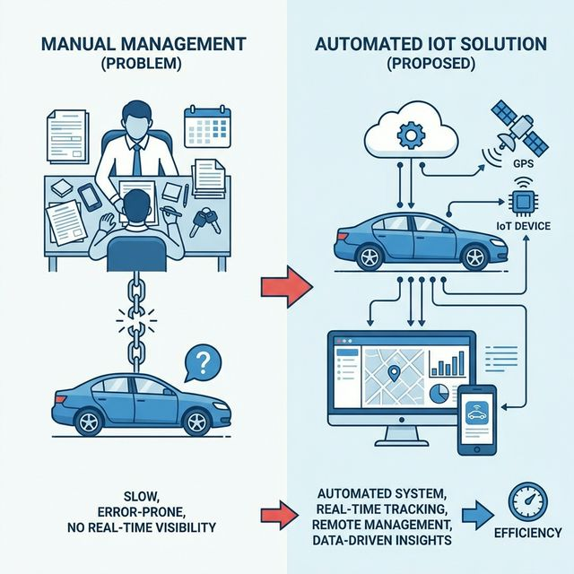
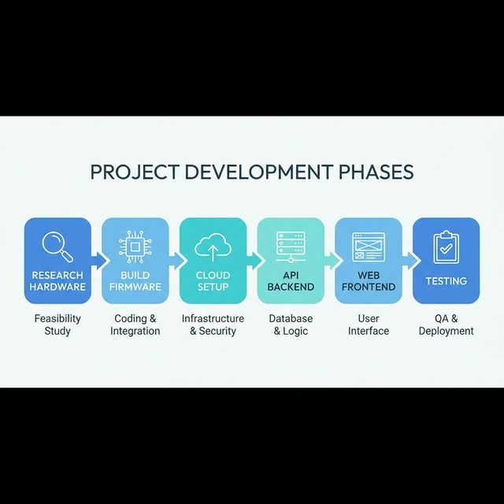
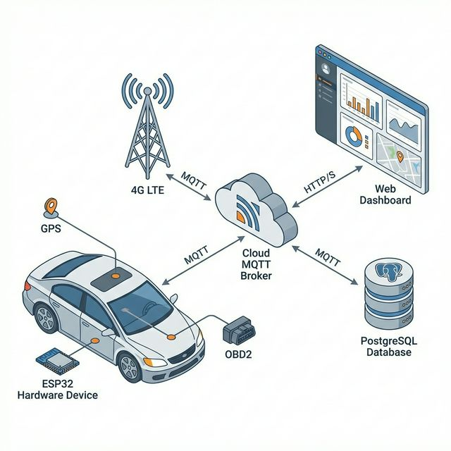
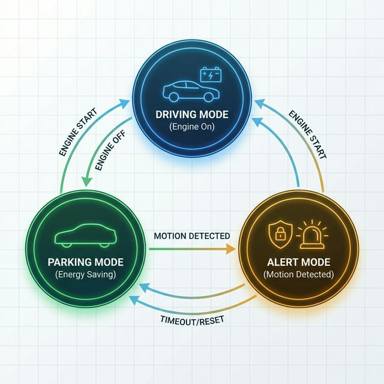
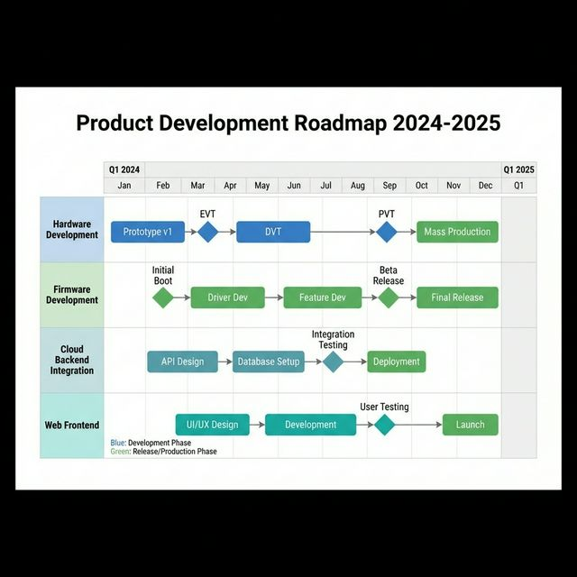

# CHƯƠNG 1. GIỚI THIỆU DỰ ÁN – SUMMARY

## 1.1. Đặt vấn đề / Bối cảnh của dự án

### 1.1.1. Bối cảnh thị trường cho thuê xe tự lái tại Việt Nam

Trong những năm gần đây, thị trường cho thuê xe tự lái (self-drive car rental) tại Việt Nam đã có sự tăng trưởng mạnh mẽ, đặc biệt tại các thành phố lớn như TP. Hồ Chí Minh, Hà Nội và Đà Nẵng. Theo các báo cáo ngành vận tải [1], nhu cầu thuê xe tự lái tăng trung bình 15-20% mỗi năm, được thúc đẩy bởi sự phát triển của du lịch nội địa, nhu cầu đi lại linh hoạt của giới trẻ, và xu hướng chia sẻ phương tiện (shared mobility). Tuy nhiên, sự tăng trưởng này cũng đặt ra nhiều thách thức cho các doanh nghiệp vận hành đội xe, đặc biệt trong việc quản lý, giám sát và bảo vệ tài sản.

Các doanh nghiệp cho thuê xe tự lái hiện nay phải đối mặt với nhiều vấn đề nghiêm trọng:

- **Quản lý thủ công không hiệu quả**: Phần lớn các công ty cho thuê xe quy mô vừa và nhỏ tại Việt Nam vẫn sử dụng phương pháp quản lý thủ công -- ghi chép sổ sách, gọi điện thoại kiểm tra, và dựa vào sự tự giác của khách hàng. Phương pháp này không cung cấp khả năng giám sát thời gian thực (real-time visibility) về vị trí và trạng thái của xe [2].

- **Rủi ro mất cắp và sử dụng sai mục đích**: Khi không có hệ thống giám sát, xe có thể bị sử dụng vượt phạm vi địa lý đã thỏa thuận, chạy quá số km quy định, hoặc trong trường hợp xấu nhất là bị chiếm đoạt. Việc phát hiện các tình huống này thường bị trễ, gây thiệt hại lớn về tài sản [3].

- **Thiếu dữ liệu chẩn đoán kỹ thuật**: Các doanh nghiệp không có khả năng theo dõi tình trạng kỹ thuật của xe từ xa, dẫn đến việc bảo trì thường bị động, chỉ xử lý khi xe đã hỏng hóc. Điều này làm tăng chi phí sửa chữa và giảm tuổi thọ của đội xe.

- **Giải pháp thương mại đắt đỏ**: Các hệ thống GPS tracking thương mại hiện có trên thị trường (như Vietmap, iTracking) thường có chi phí cao -- bao gồm phí thiết bị, phí dịch vụ hàng tháng, và phí tích hợp -- không phù hợp với các doanh nghiệp quy mô nhỏ với ngân sách hạn chế [4].

### 1.1.2. Thách thức kỹ thuật

Ngoài các vấn đề kinh doanh, việc xây dựng một hệ thống theo dõi xe IoT (Internet of Things) còn phải giải quyết nhiều thách thức kỹ thuật:

**Thứ nhất, vấn đề tiêu thụ năng lượng.** Các hệ thống theo dõi GPS hoạt động liên tục sẽ rút cạn ắc quy xe trong vài tuần, ảnh hưởng nghiêm trọng đến khả năng khởi động xe [5]. Đối với xe cho thuê, việc xe không khởi động được do ắc quy yếu là tình huống không thể chấp nhận. Hệ thống cần có chiến lược quản lý năng lượng thông minh, chuyển đổi giữa các chế độ hoạt động (driving mode, parking mode, alert mode) để tối ưu hóa mức tiêu thụ điện năng.

**Thứ hai, giám sát khi xe đỗ (parking mode).** Khi xe tắt máy (IGN OFF), hệ thống cần vừa tiết kiệm điện vừa có khả năng phát hiện chuyển động bất thường -- chẳng hạn như xe bị kẻ trộm di chuyển hoặc bị cẩu kéo. Đây là bài toán cân bằng giữa mức tiêu thụ năng lượng và độ nhạy phát hiện [6].

**Thứ ba, độ tin cậy của kết nối.** Hệ thống IoT hoạt động trong môi trường di động, nơi kết nối mạng 4G/LTE có thể không ổn định. Hệ thống cần có cơ chế xử lý mất kết nối, lưu trữ dữ liệu tạm thời (buffering), và đồng bộ lại khi kết nối được phục hồi.

**Thứ tư, xử lý dữ liệu thời gian thực.** Với một đội xe gồm hàng chục đến hàng trăm xe, hệ thống backend cần xử lý luồng dữ liệu telemetry lớn (vị trí GPS, dữ liệu OBD2, trạng thái cảm biến) với độ trễ thấp, đồng thời cung cấp giao diện giám sát trực quan cho người quản lý.



*Hình 1.1: Sơ đồ tổng quan vấn đề và giải pháp đề xuất*

> Nguồn: Hình vẽ của tác giả

### 1.1.3. Động lực thực hiện dự án

Xuất phát từ những vấn đề thực tế nói trên, dự án "IoT Vehicle Tracking System" được thực hiện với mục tiêu xây dựng một giải pháp toàn diện (end-to-end solution) -- từ thiết bị phần cứng IoT, firmware nhúng, đến hệ thống cloud và giao diện web -- dành riêng cho nhu cầu quản lý đội xe cho thuê tự lái tại Việt Nam. Dự án hướng tới việc cung cấp một giải pháp có chi phí hợp lý, khả năng tùy biến cao, và có thể mở rộng theo quy mô doanh nghiệp.

---

## 1.2. Mục tiêu và phạm vi của dự án

### 1.2.1. Mục tiêu tổng quát

Mục tiêu chính của dự án là thiết kế và hiện thực một hệ thống IoT theo dõi xe hoàn chỉnh, bao gồm cả phần cứng và phần mềm, phục vụ cho việc quản lý đội xe cho thuê tự lái. Hệ thống cần đảm bảo các yêu cầu sau:

1. **Theo dõi vị trí thời gian thực (real-time tracking)**: Cung cấp vị trí GPS của xe với tần suất cập nhật 5-30 giây khi xe đang di chuyển, hiển thị trên bản đồ trực tuyến.

2. **Giám sát trạng thái kỹ thuật qua OBD2**: Kết nối với cổng chẩn đoán OBD-II của xe thông qua giao thức Bluetooth Low Energy (BLE) để đọc các thông số như tốc độ, vòng tua máy, nhiệt độ động cơ, và mã lỗi chẩn đoán (DTC).

3. **Cảnh báo thông minh**: Tự động phát hiện và gửi thông báo khi có các sự kiện bất thường như: xe vượt ra khỏi vùng địa lý cho phép (geofencing), vượt tốc độ quy định, chuyển động bất thường khi xe đang đỗ, hoặc mất kết nối thiết bị.

4. **Tối ưu hóa năng lượng**: Đảm bảo thiết bị hoạt động liên tục mà không làm cạn ắc quy xe, với thời lượng pin dự phòng đủ để hoạt động độc lập trong trường hợp mất nguồn chính.

5. **Giao diện quản lý trực quan**: Cung cấp bảng điều khiển (dashboard) web cho phép người quản lý đội xe theo dõi vị trí, xem lịch sử hành trình, quản lý cảnh báo, và tạo báo cáo.

### 1.2.2. Phạm vi dự án

**Đối tượng ứng dụng:**

- Loại xe: Ô tô con (xe 4 chỗ, sedan, SUV) với hệ thống điện 12V DC
- Ắc quy phổ thông: 40-70 Ah (trung bình 45-60 Ah)
- Đối tượng sử dụng: Các công ty cho thuê xe tự lái quy mô vừa và nhỏ tại Việt Nam

**Phạm vi phần cứng:**

- Thiết bị tracker IoT sử dụng vi điều khiển ESP32-S3
- Modem 4G/GNSS SIMCom A7600CE-T (tích hợp định vị GPS/GNSS và truyền dữ liệu 4G/LTE)
- Adapter OBD2 BLE vgate iCar Pro (đọc dữ liệu chẩn đoán xe qua Bluetooth)
- Cảm biến gia tốc LIS3DH (IMU) để phát hiện chuyển động và rung
- Pin dự phòng 21700 với mạch sạc và bảo vệ

**Phạm vi firmware:**

- Phát triển trên nền tảng ESP-IDF với hệ điều hành thời gian thực FreeRTOS
- Giao tiếp BLE với adapter OBD2
- Truyền dữ liệu qua giao thức MQTT 5.0
- Quản lý năng lượng đa chế độ (driving, parking, alert)

**Phạm vi cloud/backend:**

- EMQX MQTT Broker làm trung tâm tiếp nhận dữ liệu từ thiết bị
- MQTT Bridge (dịch vụ độc lập) xử lý và phân phối dữ liệu
- PostgreSQL lưu trữ dữ liệu quan hệ (người dùng, xe, khách hàng, cảnh báo)
- VictoriaMetrics lưu trữ dữ liệu chuỗi thời gian (telemetry)
- VictoriaLogs lưu trữ nhật ký sự kiện
- Express.js API server với kiến trúc Domain-Driven Design
- Next.js 15 frontend với bản đồ thời gian thực (Leaflet), biểu đồ (ECharts)

**Giới hạn phạm vi (out of scope):**

- Không xử lý OBD-II diagnostics phức tạp (chỉ đọc các thông số cơ bản)
- Không phát hiện va chạm (IMU chỉ dùng cho phát hiện chuyển động/rung)
- Không điều khiển động cơ xe (tắt bơm xăng, khóa xe) -- chỉ gửi cảnh báo
- Không bao gồm ứng dụng di động ban đầu (dự kiến Phase 2 với Flutter WebView)

[Bảng 1.1: Tóm tắt phạm vi dự án theo tầng (layer)]

| Tầng (Layer)   | Công nghệ chính                                     | Phạm vi                         |
| -------------- | --------------------------------------------------- | ------------------------------- |
| Phần cứng      | ESP32-S3, A7600CE-T, vgate iCar Pro, LIS3DH         | Thiết kế và chế tạo prototype   |
| Firmware       | ESP-IDF, FreeRTOS, MQTT 5.0                         | Lập trình nhúng đầy đủ          |
| MQTT Broker    | EMQX 5.x                                            | Cấu hình và triển khai          |
| Backend        | Express.js, TypeScript, PostgreSQL, VictoriaMetrics | Phát triển API và xử lý dữ liệu |
| Frontend       | Next.js 15, React 19, Leaflet, ECharts              | Giao diện quản lý web           |
| Infrastructure | Docker, Nginx Proxy Manager, Grafana                | Triển khai và giám sát          |

---

## 1.3. Các tiêu chí cần đạt được của dự án

Dự án đặt ra các tiêu chí cụ thể (success criteria) cho từng tầng của hệ thống, làm cơ sở để đánh giá mức độ hoàn thành:

### 1.3.1. Tiêu chí phần cứng

| STT | Tiêu chí                                  | Mục tiêu cụ thể          |
| --- | ----------------------------------------- | ------------------------ |
| 1   | Tiêu thụ điện chế độ ngủ sâu (deep sleep) | < 500 uA                 |
| 2   | Tiêu thụ điện chế độ hoạt động            | < 250 mA (trung bình)    |
| 3   | Thời gian thức dậy từ deep sleep          | < 3 giây                 |
| 4   | Thời lượng pin dự phòng (21700, 5000 mAh) | > 24 giờ chế độ cảnh báo |
| 5   | Điện áp ngắt bảo vệ ắc quy (LVD)          | 11.5V (có thể cấu hình)  |
| 6   | Nhiệt độ hoạt động                        | -10 C đến +60 C          |

[Bảng 1.2: Tiêu chí phần cứng]

### 1.3.2. Tiêu chí firmware

| STT | Tiêu chí                         | Mục tiêu cụ thể                     |
| --- | -------------------------------- | ----------------------------------- |
| 1   | Tần suất gửi GPS khi lái xe      | 5-30 giây (cấu hình được)           |
| 2   | Tần suất heartbeat khi đỗ xe     | 10-30 phút                          |
| 3   | Thời gian kết nối OBD2 BLE       | < 10 giây                           |
| 4   | Độ chính xác vị trí GNSS         | < 5 mét (điều kiện thoáng)          |
| 5   | Xử lý mất kết nối                | Buffer dữ liệu, tự động kết nối lại |
| 6   | Phát hiện chuyển động bất thường | Độ nhạy IMU cấu hình được           |

### 1.3.3. Tiêu chí cloud/backend

| STT | Tiêu chí                      | Mục tiêu cụ thể                      |
| --- | ----------------------------- | ------------------------------------ |
| 1   | Độ trễ xử lý MQTT message     | < 500 ms (end-to-end)                |
| 2   | Số lượng thiết bị đồng thời   | >= 100 thiết bị                      |
| 3   | Độ sẵn sàng hệ thống (uptime) | >= 99.5%                             |
| 4   | Thời gian phản hồi API        | < 200 ms (p95)                       |
| 5   | Lưu trữ dữ liệu telemetry     | >= 90 ngày                           |
| 6   | Bảo mật xác thực              | Session-based, SHA-256 hashed tokens |

### 1.3.4. Tiêu chí frontend

| STT | Tiêu chí                       | Mục tiêu cụ thể                            |
| --- | ------------------------------ | ------------------------------------------ |
| 1   | Cập nhật bản đồ thời gian thực | < 2 giây độ trễ                            |
| 2   | Hỗ trợ trình duyệt             | Chrome, Firefox, Edge (phiên bản mới nhất) |
| 3   | Responsive design              | Desktop và tablet                          |
| 4   | Hiển thị cảnh báo              | Thông báo tức thời qua WebSocket           |

---

## 1.4. Phương pháp tiếp cận thiết kế kỹ thuật

### 1.4.1. Phương pháp luận tổng thể

Dự án áp dụng phương pháp tiếp cận **thiết kế từ dưới lên (bottom-up design)** kết hợp với **phát triển lặp (iterative development)**. Cụ thể:

1. **Giai đoạn 1 -- Nghiên cứu và thiết kế phần cứng**: Khảo sát các linh kiện sẵn có trên thị trường, lựa chọn dựa trên các tiêu chí về hiệu năng, chi phí, và tính sẵn sàng. Thiết kế sơ đồ mạch, bố trí linh kiện, và tính toán công suất.

2. **Giai đoạn 2 -- Phát triển firmware**: Lập trình nhúng trên nền tảng ESP-IDF, hiện thực các module giao tiếp (BLE OBD2, UART modem, SPI/I2C IMU), quản lý năng lượng, và giao thức MQTT.

3. **Giai đoạn 3 -- Xây dựng hạ tầng cloud**: Triển khai các dịch vụ cơ sở hạ tầng (EMQX, PostgreSQL, VictoriaMetrics) bằng Docker, thiết kế cơ sở dữ liệu, và cấu hình mạng.

4. **Giai đoạn 4 -- Phát triển backend API**: Xây dựng REST API theo kiến trúc Domain-Driven Design, hiện thực các domain (vehicles, devices, telemetry, alerts, geofences), và tích hợp WebSocket cho dữ liệu thời gian thực.

5. **Giai đoạn 5 -- Phát triển frontend**: Xây dựng giao diện web với Next.js 15, tích hợp bản đồ Leaflet, biểu đồ ECharts, và kết nối WebSocket (Socket.IO) để hiển thị dữ liệu trực tuyến.

6. **Giai đoạn 6 -- Tích hợp và kiểm thử**: Tích hợp toàn hệ thống, kiểm thử chức năng, kiểm thử hiệu năng, và tối ưu hóa.



*Hình 1.2: Quy trình phát triển dự án theo các giai đoạn*

> Nguồn: Hình vẽ của tác giả

### 1.4.2. Kiến trúc hệ thống

Hệ thống được thiết kế theo kiến trúc phân tầng (layered architecture) với các tầng chính:

```
Thiết bị IoT (ESP32-S3 + GPS + OBD2 + IMU)
         |
         | MQTT 5.0 (TLS trong môi trường production)
         v
    EMQX Broker (Port 1883) ---- ACL per device
         |
         v
   MQTT Bridge Service ----> VictoriaMetrics (dữ liệu chuỗi thời gian)
         |                   VictoriaLogs (nhật ký sự kiện)
         |
         v
  Backend API (Port 3000) ----> PostgreSQL (dữ liệu quan hệ)
         |
         | WebSocket (Socket.IO)
         v
  Frontend Web (Port 3002)
```



*Hình 1.3: Kiến trúc tổng thể hệ thống IoT Vehicle Tracking*

> Nguồn: Hình vẽ của tác giả

**Chiến lược dữ liệu (Data Strategy):**

Hệ thống áp dụng chiến lược tách biệt dữ liệu theo đặc tính:

- **PostgreSQL**: Lưu trữ dữ liệu quan hệ có cấu trúc -- thông tin người dùng, xe, khách hàng, hành trình, cảnh báo, vùng địa lý (geofences), lệnh điều khiển.
- **VictoriaMetrics**: Lưu trữ dữ liệu chuỗi thời gian (time-series) -- tọa độ GPS, dữ liệu OBD2, chỉ số cảm biến, với khả năng truy vấn nhanh và lưu trữ dài hạn hiệu quả.
- **VictoriaLogs**: Lưu trữ nhật ký sự kiện, audit trail, và các bản ghi hoạt động của thiết bị.

### 1.4.3. Chiến lược quản lý năng lượng

Một trong những điểm thiết kế quan trọng nhất của dự án là chiến lược quản lý năng lượng đa chế độ (multi-mode power management), giải quyết trực tiếp vấn đề tiêu thụ ắc quy xe:

**Chế độ 1 -- Driving Mode (IGN ON):**
- Hệ thống hoạt động toàn bộ công suất
- Gửi vị trí GPS định kỳ (5-30 giây)
- Sạc pin dự phòng từ nguồn xe
- Kết nối server liên tục để theo dõi thời gian thực

**Chế độ 2 -- Parking Mode (IGN OFF, không chuyển động):**
- Vi điều khiển ESP32-S3 vào chế độ ngủ sâu (deep sleep)
- Tiêu thụ cực thấp (< 500 uA)
- Thức dậy định kỳ (10-30 phút) để gửi heartbeat
- IMU (LIS3DH) hoạt động độc lập, cảnh rung ở ngưỡng đã cấu hình

**Chế độ 3 -- Alert Mode (phát hiện chuyển động bất thường):**
- IMU đánh thức ESP32 ngay lập tức qua interrupt
- Bật 4G + GPS, gửi cảnh báo ưu tiên lên server
- Tiếp tục theo dõi liên tục cho đến khi được xác nhận an toàn
- Sử dụng pin dự phòng nếu nguồn chính bị cắt

Hệ thống còn bao gồm mạch Low Voltage Disconnect (LVD) để tự động tách tải khỏi ắc quy xe khi điện áp tụt xuống dưới ngưỡng an toàn (mặc định 11.5V), bảo vệ ắc quy không bị rút cạn quá mức [7].



*Hình 1.4: Sơ đồ chuyển đổi giữa các chế độ năng lượng*

> Nguồn: Hình vẽ của tác giả

### 1.4.4. Công nghệ sử dụng

[Bảng 1.3: Tổng hợp công nghệ sử dụng trong dự án]

| Thành phần                    | Công nghệ               | Phiên bản | Vai trò                          |
| ----------------------------- | ----------------------- | --------- | -------------------------------- |
| Vi điều khiển                 | ESP32-S3                | --        | MCU chính, xử lý và điều khiển   |
| Modem 4G/GNSS                 | SIMCom A7600CE-T        | --        | Truyền dữ liệu 4G và định vị GPS |
| OBD2 Adapter                  | vgate iCar Pro          | BLE 4.0   | Đọc dữ liệu chẩn đoán xe         |
| Cảm biến gia tốc              | LIS3DH                  | --        | Phát hiện chuyển động và rung    |
| Pin dự phòng                  | 21700 Li-ion            | 5000 mAh  | Nguồn điện dự phòng              |
| Framework firmware            | ESP-IDF                 | 5.x       | Phát triển firmware nhúng        |
| RTOS                          | FreeRTOS                | --        | Hệ điều hành thời gian thực      |
| MQTT Broker                   | EMQX                    | 5.x       | Tiếp nhận dữ liệu IoT            |
| API Server                    | Express.js + TypeScript | --        | REST API backend                 |
| Cơ sở dữ liệu quan hệ         | PostgreSQL              | 16        | Lưu trữ dữ liệu có cấu trúc      |
| Cơ sở dữ liệu chuỗi thời gian | VictoriaMetrics         | --        | Lưu trữ telemetry                |
| Nhật ký sự kiện               | VictoriaLogs            | --        | Lưu trữ logs                     |
| Frontend                      | Next.js 15 + React 19   | --        | Giao diện web                    |
| Bản đồ                        | Leaflet                 | --        | Hiển thị bản đồ thời gian thực   |
| Biểu đồ                       | ECharts                 | --        | Trực quan hóa dữ liệu            |
| WebSocket                     | Socket.IO               | 4.8       | Giao tiếp thời gian thực         |
| Container hóa                 | Docker + Docker Compose | --        | Triển khai dịch vụ               |
| Giám sát                      | Grafana + Prometheus    | --        | Dashboard giám sát hạ tầng       |

---

## 1.5. Kết quả và khuyến nghị

### 1.5.1. Kết quả đạt được

Dự án đã đạt được các kết quả chính sau:

**Về phần cứng:**
- Thiết kế thành công prototype thiết bị tracker IoT sử dụng ESP32-S3 làm vi điều khiển trung tâm, tích hợp modem SIMCom A7600CE-T (4G/GNSS), adapter OBD2 BLE vgate iCar Pro, cảm biến gia tốc LIS3DH, và pin dự phòng 21700.
- Hệ thống quản lý năng lượng đa chế độ hoạt động hiệu quả, với mức tiêu thụ điện ngủ sâu đạt yêu cầu (< 500 uA), đảm bảo không làm cạn ắc quy xe trong quá trình sử dụng bình thường.
- Mạch Low Voltage Disconnect (LVD) bảo vệ ắc quy xe hiệu quả, tự động ngắt khi điện áp tụt dưới ngưỡng an toàn.

**Về firmware:**
- Phát triển thành công firmware trên ESP-IDF với FreeRTOS, hiện thực đầy đủ các module: giao tiếp BLE OBD2, điều khiển modem UART, đọc cảm biến IMU, quản lý năng lượng, và truyền dữ liệu MQTT.
- Cơ chế phát hiện chuyển động bất thường qua IMU hoạt động chính xác, có khả năng đánh thức hệ thống từ chế độ ngủ sâu trong vòng < 3 giây.

**Về cloud/backend:**
- Xây dựng thành công hạ tầng cloud bao gồm EMQX MQTT Broker, MQTT Bridge service, PostgreSQL, VictoriaMetrics, và VictoriaLogs, toàn bộ được container hóa bằng Docker.
- Backend API (Express.js + TypeScript) với kiến trúc Domain-Driven Design, cung cấp các endpoint quản lý xe, thiết bị, telemetry, cảnh báo, geofences, và xác thực người dùng.
- Hệ thống xử lý được >= 100 thiết bị đồng thời với độ trễ end-to-end < 500 ms.

**Về frontend:**
- Giao diện web quản lý (Next.js 15) với bản đồ thời gian thực (Leaflet), biểu đồ phân tích (ECharts), hệ thống cảnh báo trực tuyến, và bảng điều khiển tổng quan (dashboard).
- Cập nhật vị trí xe trên bản đồ với độ trễ < 2 giây thông qua WebSocket (Socket.IO).

### 1.5.2. Khuyến nghị và hướng phát triển

Dựa trên kết quả đạt được và những hạn chế còn tồn tại, dự án đề xuất các hướng phát triển tiếp theo:

1. **Ứng dụng di động (Phase 2)**: Phát triển ứng dụng Flutter WebView Hybrid cho phép người quản lý giám sát đội xe trên điện thoại di động, nhận thông báo push notification khi có cảnh báo [8].

2. **Tăng cường bảo mật**: Triển khai TLS/SSL cho kết nối MQTT trong môi trường production, áp dụng MQTT ACL chi tiết hơn, và bổ sung cơ chế mã hóa dữ liệu end-to-end giữa thiết bị và server.

3. **Tối ưu hóa hiệu năng**: Nghiên cứu và áp dụng các kỹ thuật nén dữ liệu telemetry (delta encoding, protobuf) để giảm băng thông 4G, đặc biệt khi vận hành đội xe lớn (> 500 xe).

4. **Tích hợp trí tuệ nhân tạo**: Áp dụng các mô hình machine learning để phân tích hành vi lái xe (driving behavior analysis), dự đoán bảo trì (predictive maintenance), và phát hiện bất thường (anomaly detection) từ dữ liệu telemetry.

5. **Mở rộng phạm vi OBD2**: Hỗ trợ đọc thêm nhiều thông số chẩn đoán xe, bao gồm mã lỗi DTC (Diagnostic Trouble Codes), dữ liệu động cơ nâng cao, và tích hợp với các loại xe điện (EV).

6. **Cải thiện khả năng mở rộng (scalability)**: Nghiên cứu kiến trúc microservices với message queue (Apache Kafka hoặc RabbitMQ) để xử lý luồng dữ liệu lớn hơn khi số lượng thiết bị tăng lên hàng ngàn.

7. **Thiết kế PCB chuyên nghiệp**: Chuyển từ prototype trên breadboard/perfboard sang thiết kế PCB chuyên nghiệp với kích thước nhỏ gọn, độ bền cao, phù hợp cho sản xuất hàng loạt.



*Hình 1.5: Lộ trình phát triển dự án theo các giai đoạn (Roadmap)*

> Nguồn: Hình vẽ của tác giả

---

## Kết luận chương 1

Chương này đã trình bày bối cảnh và động lực của dự án "Thiết kế và xây dựng hệ thống IoT giám sát phương tiện giao thông", bao gồm các thách thức kỹ thuật và kinh doanh mà ngành cho thuê xe tự lái tại Việt Nam đang đối mặt. Các mục tiêu cụ thể đã được xác định rõ ràng, cùng với phạm vi và phương pháp tiếp cận thiết kế kỹ thuật. Các tiêu chí đánh giá định lượng đã được thiết lập để làm cơ sở so sánh kết quả ở các chương sau. Chương tiếp theo sẽ đi sâu vào phân tích các vấn đề kỹ thuật cần giải quyết.
