### 4.1.3. Triển khai hệ thống Cloud

Hệ thống Cloud là thành phần cốt lõi phía máy chủ, chịu trách nhiệm tiếp nhận dữ liệu từ thiết bị IoT, xử lý nghiệp vụ, lưu trữ, và cung cấp giao diện giám sát cho người quản lý. Phần này trình bày chi tiết quá trình triển khai toàn bộ hạ tầng cloud, bao gồm cấu hình Docker, dịch vụ MQTT Bridge, Backend API, Frontend Dashboard, và hệ thống giám sát (monitoring).

Kiến trúc tổng thể của hệ thống cloud được mô tả như sau:

```
Thiết bị IoT (ESP32 + GPS + OBD2)
         |
         | MQTT (QoS 1, TLS trong môi trường production)
         v
    EMQX Broker (port 1883) ---- ACL per device
         |
         v
   Tracking_MqttBridge -----> VictoriaMetrics (dữ liệu chuỗi thời gian)
         |                     VictoriaLogs (nhật ký sự kiện)
         |
         v
  Tracking_Backend (port 3000) -----> PostgreSQL (dữ liệu quan hệ)
         |
         | WebSocket (Socket.IO)
         v
  Tracking_Frontend (port 3002)
```

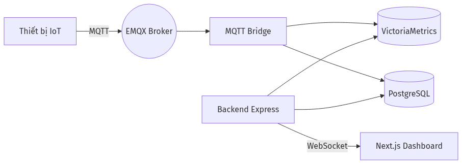

*Hình 4.15: Kiến trúc tổng thể hệ thống Cloud và luồng dữ liệu*

> Nguồn ảnh: [DummyImage (fallback placeholder)](https://dummyimage.com/1280x720/eeeeee/333333.png&text=Ki%20n%20tr%20c%20t%20ng%20th%20h%20th%20ng%20Cloud%20v%20lu%20ng%20d%20li%20u)

---

#### 4.1.3.1. Cấu hình Docker và hạ tầng (Docker Infrastructure Setup)

##### a) Mô hình triển khai per-service (IVM26 Pattern)

Hệ thống áp dụng mô hình triển khai per-service Docker Compose theo quy ước IVM26, trong đó mỗi dịch vụ (service) có một file `docker-compose.yml` riêng biệt thay vì sử dụng một file monolithic duy nhất cho toàn bộ hệ thống. Cách tiếp cận này mang lại nhiều ưu điểm:

- **Độc lập triển khai (Independent Deployment)**: Mỗi dịch vụ có thể được khởi động, dừng lại, hoặc cập nhật riêng rẽ mà không ảnh hưởng đến các dịch vụ khác. Điều này đặc biệt hữu ích trong quá trình phát triển và giai đoạn debug.
- **Quản lý tài nguyên riêng biệt**: Mỗi dịch vụ được cấu hình giới hạn tài nguyên (CPU, memory) phù hợp với nhu cầu thực tế, tránh tình trạng một dịch vụ chiếm dụng tài nguyên của dịch vụ khác.
- **Dễ dàng mở rộng (Scalability)**: Có thể nhân bản (scale) từng dịch vụ độc lập dựa trên nhu cầu tải thực tế.
- **Đơn giản hóa quy trình CI/CD**: Mỗi dịch vụ có thể có pipeline build và deploy riêng.

Cấu trúc thư mục tổng thể của hệ thống theo quy ước IVM26 được tổ chức như sau:

```
iot-vehicle-tracking-system/                  # Thư mục gốc của tất cả dịch vụ
|
|-- Tracking_Backend/                         # Express + TypeScript API Server
|   |-- src/
|   |-- Dockerfile
|   |-- docker-compose.yml
|   |-- docker-compose.uat.yml
|   |-- package.json
|   +-- .env
|
|-- Tracking_Frontend/                        # Next.js 15 Web Dashboard
|   |-- src/
|   |-- Dockerfile
|   |-- docker-compose.yml
|   +-- package.json
|
|-- Tracking_MqttBridge/                      # MQTT Bridge (dịch vụ độc lập)
|   |-- src/
|   |-- Dockerfile
|   |-- docker-compose.yml
|   +-- package.json
|
|-- Tracking_PostgreSQL/                      # PostgreSQL 16
|   |-- init/                                 # SQL scripts khởi tạo
|   +-- docker-compose.yml
|
|-- Tracking_EMQX/                            # EMQX MQTT Broker
|   |-- etc/                                  # File cấu hình EMQX
|   +-- docker-compose.yml
|
|-- Tracking_VictoriaMetrics/                 # Cơ sở dữ liệu chuỗi thời gian
|   +-- docker-compose.yml
|
|-- Tracking_VictoriaLogs/                    # Cơ sở dữ liệu nhật ký
|   +-- docker-compose.yml
|
|-- Tracking_Grafana/                         # Dashboard giám sát
|   +-- docker-compose.yml
|
|-- Tracking_NPM/                             # Nginx Proxy Manager
|   +-- docker-compose.yml
|
+-- Tracking_Data/                            # Dữ liệu runtime (gitignored)
    |-- postgres-data/
    |-- emqx-data/
    |-- victoria-metrics-data/
    |-- victoria-logs-data/
    +-- grafana-data/
```

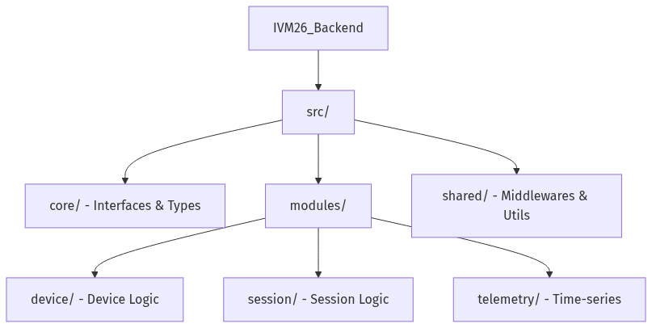

*Hình 4.16: Cấu trúc thư mục hệ thống theo quy ước IVM26*

> Nguồn ảnh: [DummyImage (fallback placeholder)](https://dummyimage.com/1280x720/eeeeee/333333.png&text=C%20u%20tr%20c%20th%20m%20c%20h%20th%20ng%20theo%20quy%20c%20IVM26)

##### b) Mạng chia sẻ (Shared Network)

Tất cả các dịch vụ trong hệ thống giao tiếp với nhau thông qua một Docker network dùng chung có tên `tracking-network`. Mạng này được tạo một lần duy nhất và khai báo là `external` trong từng file `docker-compose.yml`, đảm bảo các container thuộc các file compose khác nhau vẫn có thể truy cập lẫn nhau thông qua tên container.

```bash
# Tạo mạng chia sẻ (chỉ chạy một lần đầu tiên)
docker network create tracking-network
```

##### c) Cấu hình Docker Compose cho các dịch vụ hạ tầng

Mỗi dịch vụ hạ tầng (infrastructure service) được cấu hình trong một file `docker-compose.yml` riêng. Dưới đây là ví dụ cấu hình cho dịch vụ PostgreSQL và EMQX:

**PostgreSQL (Tracking_PostgreSQL/docker-compose.yml):**

```yaml
version: "3.8"
services:
  postgres:
    image: postgres:16-alpine
    container_name: tracking-postgres
    ports:
      - "5432:5432"
    environment:
      POSTGRES_DB: vehicle_tracking
      POSTGRES_USER: postgres
      POSTGRES_PASSWORD: ${POSTGRESQL_PASSWORD}
    volumes:
      - ../Tracking_Data/postgres-data:/var/lib/postgresql/data
      - ./init:/docker-entrypoint-initdb.d
    restart: unless-stopped
    networks:
      - tracking-network
    deploy:
      resources:
        limits:
          memory: 512M
          cpus: '1.0'

networks:
  tracking-network:
    external: true
```

**EMQX MQTT Broker (Tracking_EMQX/docker-compose.yml):**

```yaml
version: "3.8"
services:
  emqx:
    image: emqx/emqx:5.8
    container_name: tracking-emqx
    ports:
      - "1883:1883"       # MQTT
      - "8083:8083"       # MQTT WebSocket
      - "18083:18083"     # EMQX Dashboard
    volumes:
      - ../Tracking_Data/emqx-data:/opt/emqx/data
      - ./etc:/opt/emqx/etc
    environment:
      EMQX_DASHBOARD__DEFAULT_PASSWORD: ${EMQX_DASHBOARD_PASSWORD}
    restart: unless-stopped
    networks:
      - tracking-network
    deploy:
      resources:
        limits:
          memory: 512M
          cpus: '1.0'

networks:
  tracking-network:
    external: true
```

Cấu hình tương tự được áp dụng cho VictoriaMetrics (port 8428), VictoriaLogs (port 9428), và Grafana (port 3001). Mỗi dịch vụ đều chia sẻ `tracking-network` và lưu trữ dữ liệu vào thư mục `Tracking_Data/` để đảm bảo tính bền vững (persistence) của dữ liệu.

##### d) Thư mục dữ liệu và quản lý volume

Thư mục `Tracking_Data/` được sử dụng làm nơi lưu trữ dữ liệu runtime cho tất cả các dịch vụ. Thư mục này được thêm vào `.gitignore` để tránh việc commit dữ liệu runtime vào repository. Cấu trúc này đảm bảo:

- Dữ liệu không bị mất khi container bị xóa và tạo lại
- Dễ dàng sao lưu (backup) toàn bộ dữ liệu hệ thống bằng cách sao chép thư mục `Tracking_Data/`
- Tách biệt giữa mã nguồn (source code) và dữ liệu vận hành (runtime data)

##### e) Quy trình khởi động hệ thống

Hệ thống được khởi động theo thứ tự phụ thuộc: dịch vụ hạ tầng trước, sau đó đến các dịch vụ ứng dụng:

```bash
# Bước 1: Khởi động dịch vụ hạ tầng
cd Tracking_PostgreSQL && docker-compose up -d
cd Tracking_EMQX && docker-compose up -d
cd Tracking_VictoriaMetrics && docker-compose up -d
cd Tracking_VictoriaLogs && docker-compose up -d
cd Tracking_Grafana && docker-compose up -d

# Bước 2: Khởi động dịch vụ ứng dụng
cd Tracking_MqttBridge && docker-compose up -d --build
cd Tracking_Backend && docker-compose up -d --build
cd Tracking_Frontend && docker-compose up -d --build
```

[Bảng 4.5: Danh sách các dịch vụ Docker và cổng truy cập]

| Dịch vụ         | Container Name            | Port        | Mô tả                            |
| --------------- | ------------------------- | ----------- | -------------------------------- |
| PostgreSQL      | tracking-postgres         | 5432        | Cơ sở dữ liệu quan hệ            |
| EMQX            | tracking-emqx             | 1883, 18083 | MQTT Broker và Dashboard         |
| VictoriaMetrics | tracking-victoria-metrics | 8428        | Dữ liệu chuỗi thời gian          |
| VictoriaLogs    | tracking-victoria-logs    | 9428        | Nhật ký tập trung                |
| Grafana         | tracking-grafana          | 3001        | Dashboard giám sát               |
| MQTT Bridge     | tracking-mqtt-bridge      | --          | Cầu nối MQTT (không expose port) |
| Backend API     | tracking-backend          | 3000        | REST API và WebSocket            |
| Frontend        | tracking-frontend         | 3002        | Giao diện web                    |
| NPM             | tracking-npm              | 80, 443     | Reverse proxy                    |

---

#### 4.1.3.2. Triển khai MQTT Bridge (MQTT Bridge Implementation)

##### a) Vai trò và kiến trúc

MQTT Bridge (`Tracking_MqttBridge/`) là một dịch vụ Node.js/TypeScript hoàn toàn độc lập, đóng vai trò làm cầu nối (bridge) giữa EMQX MQTT Broker và các hệ thống lưu trữ phía sau (PostgreSQL, VictoriaMetrics, VictoriaLogs). Dịch vụ này được tách riêng khỏi Backend API để đảm bảo nguyên tắc single responsibility và cho phép scale độc lập.

Luồng dữ liệu xử lý của MQTT Bridge được mô tả như sau:

```
Thiết bị IoT (ESP32)
    -> Gửi MQTT message: v1/{device_id}/rawdata
    -> EMQX Broker (port 1883)
    -> MQTT Bridge (subscribe)
        |-- Kiểm tra và xác thực payload (Zod validation)
        |-- Ghi vào VictoriaMetrics (dữ liệu chuỗi thời gian: GPS, OBD2)
        |-- Ghi vào VictoriaLogs (sự kiện: kết nối, ngắt kết nối, lỗi)
        |-- Cập nhật PostgreSQL (trạng thái thiết bị, phiên hoạt động)
        +-- Phát sự kiện tới Socket.IO (cập nhật thời gian thực)
    -> Dashboard cập nhật real-time
```

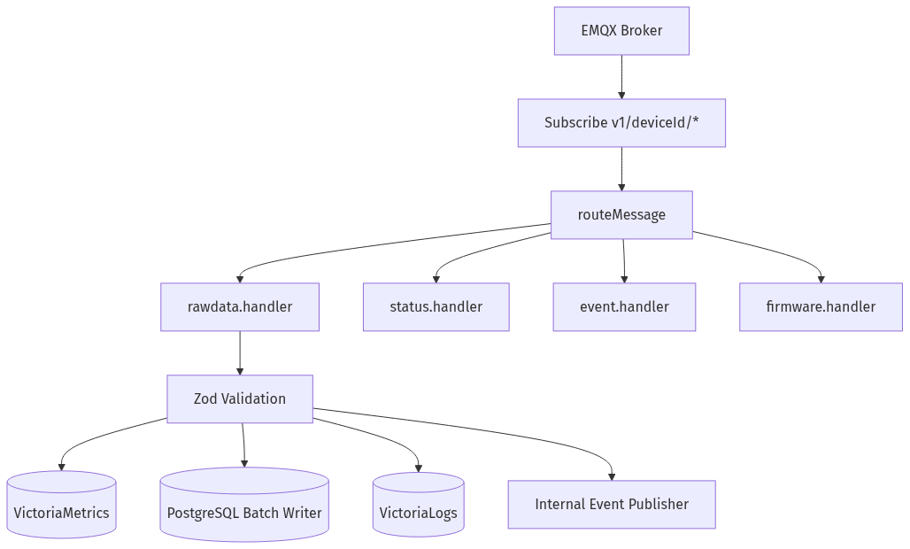

*Hình 4.17: Luồng xử lý dữ liệu của MQTT Bridge*

> Nguồn ảnh: [Wikipedia - NodeMCU](https://en.wikipedia.org/wiki/NodeMCU)

##### b) Cấu trúc mã nguồn

```
Tracking_MqttBridge/
|-- src/
|   |-- index.ts                    # Điểm khởi động (entry point)
|   |-- mqtt.client.ts              # Kết nối EMQX và subscribe topics
|   |-- handlers/
|   |   |-- telemetry.handler.ts    # Xử lý dữ liệu telemetry (GPS, OBD2)
|   |   |-- status.handler.ts       # Xử lý thay đổi trạng thái thiết bị
|   |   +-- event.handler.ts        # Xử lý các sự kiện hệ thống
|   |-- writers/
|   |   |-- victoria-metrics.writer.ts  # Ghi dữ liệu vào VictoriaMetrics
|   |   |-- victoria-logs.writer.ts     # Ghi nhật ký vào VictoriaLogs
|   |   +-- postgres.writer.ts          # Cập nhật dữ liệu PostgreSQL
|   |-- validators/
|   |   +-- payload.validator.ts    # Zod schemas xác thực dữ liệu đầu vào
|   |-- config/
|   |   +-- index.ts                # Cấu hình ứng dụng (biến môi trường)
|   +-- logger/
|       +-- index.ts                # Logger riêng của dịch vụ
|-- package.json
|-- tsconfig.json
|-- Dockerfile
+-- docker-compose.yml
```

##### c) Kết nối MQTT và xử lý message

MQTT Bridge kết nối tới EMQX Broker và subscribe vào các topic tương ứng với dữ liệu từ thiết bị IoT. Mỗi topic được định tuyến (route) tới handler phù hợp:

```typescript
// mqtt.client.ts - Kết nối và subscribe các topic
import mqtt from 'mqtt';
import { config } from './config';
import { handleTelemetry } from './handlers/telemetry.handler';
import { handleStatus } from './handlers/status.handler';

const client = mqtt.connect(config.MQTT_BROKER_URL, {
  clientId: 'tracking-mqtt-bridge',
  clean: true,
  reconnectPeriod: 5000,
});

client.on('connect', () => {
  // Subscribe vào các topic chính
  client.subscribe('v1/+/rawdata', { qos: 1 });
  client.subscribe('devices/+/status', { qos: 1 });
  client.subscribe('devices/+/telemetry', { qos: 1 });
});

client.on('message', async (topic, payload) => {
  const segments = topic.split('/');

  if (topic.match(/^v1\/.*\/rawdata$/)) {
    await handleTelemetry(segments[1], JSON.parse(payload.toString()));
  } else if (topic.match(/^devices\/.*\/status$/)) {
    await handleStatus(segments[1], JSON.parse(payload.toString()));
  }
});
```

##### d) Xác thực dữ liệu đầu vào (Payload Validation)

Mỗi message MQTT nhận được đều được xác thực bằng Zod schema trước khi xử lý, đảm bảo tính toàn vẹn của dữ liệu:

```typescript
// validators/payload.validator.ts
import { z } from 'zod';

export const TelemetryPayloadSchema = z.object({
  device_id: z.string().min(1),
  timestamp: z.number(),
  gps: z.object({
    lat: z.number().min(-90).max(90),
    lng: z.number().min(-180).max(180),
    speed: z.number().min(0),
    heading: z.number().min(0).max(360),
    satellites: z.number().int().min(0),
  }).optional(),
  obd2: z.object({
    rpm: z.number().min(0).optional(),
    speed: z.number().min(0).optional(),
    coolant_temp: z.number().optional(),
    fuel_level: z.number().min(0).max(100).optional(),
  }).optional(),
  battery: z.object({
    voltage: z.number(),
    level: z.number().min(0).max(100),
  }).optional(),
});
```

##### e) Ghi dữ liệu kép (Dual-Write Pattern)

MQTT Bridge thực hiện cơ chế ghi dữ liệu kép (dual-write): dữ liệu telemetry được ghi đồng thời vào VictoriaMetrics (cơ sở dữ liệu chuỗi thời gian) và VictoriaLogs (nhật ký sự kiện), trong khi thông tin trạng thái thiết bị được cập nhật vào PostgreSQL:

- **VictoriaMetrics**: Lưu trữ các metric theo thời gian như tọa độ GPS, tốc độ, vòng tua máy, nhiệt độ động cơ, mức nhiên liệu. Dữ liệu này phục vụ cho việc truy vấn lịch sử và hiển thị biểu đồ.
- **VictoriaLogs**: Lưu trữ các sự kiện hệ thống như kết nối/ngắt kết nối thiết bị, cảnh báo, lỗi xác thực payload. Dữ liệu này phục vụ cho việc phân tích và debug.
- **PostgreSQL**: Cập nhật trạng thái hiện tại của thiết bị (`last_seen_at`, `current_status`), tạo bản ghi phiên hoạt động (session), và tạo cảnh báo khi phát hiện bất thường.

##### f) Cấu hình Docker cho MQTT Bridge

```yaml
# Tracking_MqttBridge/docker-compose.yml
version: "3.8"
services:
  mqtt-bridge:
    build:
      context: .
      dockerfile: Dockerfile
    container_name: tracking-mqtt-bridge
    env_file: .env
    restart: unless-stopped
    networks:
      - tracking-network
    deploy:
      resources:
        limits:
          memory: 256M
          cpus: '0.5'

networks:
  tracking-network:
    external: true
```

Dịch vụ MQTT Bridge không cần expose port ra bên ngoài vì nó chỉ giao tiếp nội bộ với các dịch vụ khác thông qua `tracking-network`. Giới hạn tài nguyên được đặt ở mức 256 MB RAM và 0.5 CPU, phù hợp với vai trò xử lý message nhẹ.

---

#### 4.1.3.3. Triển khai Backend API (Backend API Implementation)

##### a) Lựa chọn công nghệ

Backend API được xây dựng trên nền tảng Node.js với Express.js và TypeScript. Việc lựa chọn này dựa trên các yếu tố sau:

[Bảng 4.6: So sánh framework backend cho hệ thống IoT]

| Tiêu chí         | Express + TypeScript       | NestJS                                | Go + Gin   |
| ---------------- | -------------------------- | ------------------------------------- | ---------- |
| Độ phức tạp học  | Thấp                       | Trung bình                            | Cao        |
| Linh hoạt        | Rất cao                    | Trung bình (ràng buộc bởi convention) | Cao        |
| Hiệu năng        | Tốt                        | Tốt                                   | Rất tốt    |
| Boilerplate code | Ít                         | Nhiều (decorators, modules)           | Trung bình |
| Hệ sinh thái IoT | Rất tốt                    | Tốt                                   | Tốt        |
| Hỗ trợ real-time | Rất tốt (Socket.IO native) | Rất tốt                               | Tốt        |

**Lý do lựa chọn Express + TypeScript:**

- **Linh hoạt cao**: Không bị ràng buộc bởi các quy ước framework như NestJS (decorators, dependency injection), cho phép tổ chức code theo domain-driven design một cách tự nhiên.
- **Nhẹ và nhanh**: Ít overhead hơn NestJS, phù hợp với hệ thống IoT cần xử lý dữ liệu tần suất cao từ nhiều thiết bị đồng thời.
- **Zod Validation**: Sử dụng Zod thay vì class-validator, cung cấp cả runtime validation và compile-time type inference trong một thư viện duy nhất.
- **Kiểm soát middleware chain**: Toàn quyền kiểm soát thứ tự và cách thức xử lý của middleware, quan trọng cho việc tối ưu hiệu năng.

**Tech stack chi tiết:**

```
Backend Tech Stack:
|-- Runtime: Node.js 20+ (LTS)
|-- Framework: Express 4.x
|-- Language: TypeScript 5.x
|-- Validation: Zod (runtime + type inference)
|-- Database:
|   |-- PostgreSQL 16 (dữ liệu quan hệ)
|   |   +-- Driver: pg (raw queries, không dùng ORM)
|   +-- VictoriaMetrics (dữ liệu chuỗi thời gian)
|       +-- Query: PromQL/MetricsQL
|-- Real-time:
|   |-- Socket.IO 4.8 (WebSocket)
|   +-- MQTT.js (tích hợp EMQX)
|-- Authentication: Session-based (database-backed tokens, SHA-256)
|-- Security: Helmet, CORS, Rate Limiting
+-- API Docs: swagger-ui-express + OpenAPI
```

##### b) Kiến trúc Domain-Driven Design (DDD)

Backend được tổ chức theo kiến trúc Domain-Driven Design với các lớp (layer) rõ ràng: Controllers nhận request từ client, gọi tới Services để xử lý nghiệp vụ, và Services sử dụng Repositories để truy xuất dữ liệu. Mỗi domain được tổ chức thành một thư mục riêng với ba thành phần chính: `services/`, `repositories/`, và `types/`.

```
Tracking_Backend/src/
|-- index.ts                          # Điểm khởi động
|-- api/                              # API Layer
|   |-- routes/                       # Định nghĩa route (flat, theo domain)
|   +-- openapi/                      # Swagger/OpenAPI specs
|
|-- domain/                           # Business Logic (theo feature)
|   |-- auth/
|   |   |-- services/
|   |   |   |-- auth-session.service.ts
|   |   |   +-- user-management.service.ts
|   |   |-- repositories/
|   |   |   +-- user.repository.ts
|   |   +-- types/
|   |       +-- auth.types.ts
|   |
|   |-- device/
|   |   |-- services/
|   |   |   |-- device-crud.service.ts
|   |   |   |-- device-list.service.ts
|   |   |   |-- device-command.service.ts
|   |   |   |-- device-runtime.service.ts
|   |   |   |-- device-sessions.service.ts
|   |   |   +-- device-telemetry.service.ts
|   |   |-- repositories/
|   |   +-- types/
|   |
|   |-- vehicle/                      # Quản lý xe
|   |-- customer/                     # Quản lý khách hàng
|   |-- driver/                       # Quản lý tài xế
|   |-- trip/                         # Quản lý chuyến đi
|   |-- alert/                        # Quản lý cảnh báo
|   |-- geofence/                     # Quản lý vùng địa lý
|   |-- maintenance/                  # Quản lý bảo trì
|   |-- firmware/                     # OTA firmware update
|   |-- export/                       # Xuất báo cáo
|   |-- dashboard/                    # Thống kê tổng quan
|   |-- telemetry/                    # Lịch sử telemetry
|   |-- notification/                 # Thông báo đẩy
|   |-- simulator/                    # Mô phỏng thiết bị
|   +-- system/                       # Trạng thái hệ thống
|
|-- infrastructure/                   # Dịch vụ bên ngoài
|   |-- database/
|   |   |-- pool.ts                   # PostgreSQL connection pool
|   |   +-- queries.ts                # Query helpers
|   |-- logger/
|   |   |-- index.ts
|   |   |-- winston.ts
|   |   +-- victorialogs-transport.ts
|   |-- metrics/
|   |   |-- registry.ts              # Prometheus registry
|   |   +-- app-metrics.ts           # Custom metrics
|   +-- realtime/
|       |-- socket-server.util.ts
|       |-- socket-auth.middleware.ts
|       |-- event-bus.util.ts
|       +-- mqtt-event-listener.ts
|
|-- middleware/                       # Express Middleware
|   |-- auth.middleware.ts            # Xác thực session-based
|   |-- error-handler.middleware.ts
|   |-- rate-limit.middleware.ts
|   |-- request-id.middleware.ts      # Request-ID correlation
|   |-- metrics.middleware.ts         # Prometheus HTTP metrics
|   +-- sentry.middleware.ts          # Sentry error tracking
|
+-- shared/                          # Tiện ích dùng chung
    |-- types/
    +-- utils/
        |-- async-handler.util.ts
        |-- crypto.util.ts
        |-- errors.util.ts
        +-- response.util.ts
```

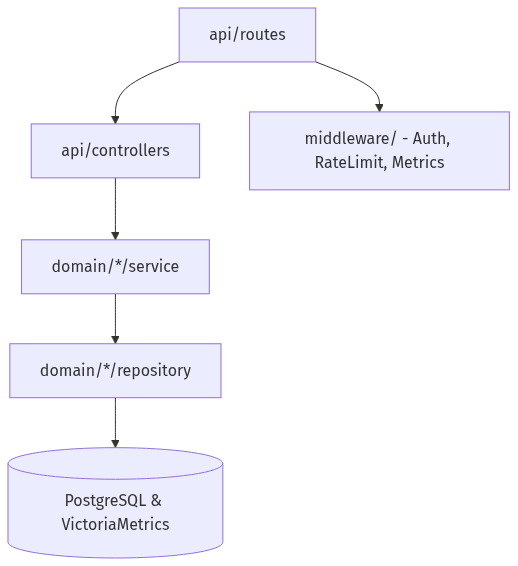

*Hình 4.18: Cấu trúc thư mục Backend theo kiến trúc DDD*

> Nguồn ảnh: [Wikipedia - Web API](https://en.wikipedia.org/wiki/Web_API)

Hệ thống bao gồm hơn 20 domain modules, mỗi module chịu trách nhiệm một lĩnh vực nghiệp vụ cụ thể. Điều này giúp code dễ bảo trì, dễ test, và dễ mở rộng khi cần thêm tính năng mới.

[Bảng 4.7: Danh sách các domain modules chính]

| Domain       | Số lượng Services | Mô tả                                                               |
| ------------ | ----------------- | ------------------------------------------------------------------- |
| auth         | 2                 | Đăng nhập/đăng xuất session-based, quản lý người dùng               |
| device       | 8                 | CRUD thiết bị, phiên hoạt động, runtime, telemetry, lệnh điều khiển |
| vehicle      | 3                 | CRUD xe, danh sách, gán thiết bị                                    |
| customer     | 2                 | CRUD khách hàng, danh sách                                          |
| driver       | 2                 | CRUD tài xế, danh sách                                              |
| trip         | 2                 | CRUD chuyến đi, danh sách                                           |
| geofence     | 2                 | CRUD vùng địa lý, danh sách                                         |
| maintenance  | 2                 | CRUD bảo trì, danh sách                                             |
| firmware     | 5                 | OTA: upload, danh sách, kích hoạt, triển khai, xóa                  |
| export       | 3                 | Quản lý tác vụ xuất, tạo file, xử lý                                |
| dashboard    | 1                 | Thống kê tổng quan                                                  |
| telemetry    | 1                 | Truy vấn lịch sử telemetry                                          |
| notification | 1                 | Thông báo đẩy (push notification)                                   |
| simulator    | 1                 | Mô phỏng thiết bị để kiểm thử                                       |

##### c) Xác thực và phân quyền (Authentication & Authorization)

Hệ thống sử dụng cơ chế xác thực dựa trên phiên (session-based authentication) với các token được lưu trữ trong cơ sở dữ liệu PostgreSQL. Đây là sự khác biệt so với nhiều hệ thống hiện đại sử dụng JWT (JSON Web Token):

- **Token được hash SHA-256** trước khi lưu vào bảng `user_sessions` trong PostgreSQL. Ngay cả khi cơ sở dữ liệu bị xâm nhập, kẻ tấn công không thể sử dụng trực tiếp các token đã hash.
- **Mật khẩu được hash bcryptjs** với salt factor 12, đảm bảo tính bảo mật ngay cả khi cơ sở dữ liệu bị lộ.
- **Thu hồi phiên (Session Revocation)**: Quản trị viên có thể thu hồi bất kỳ phiên nào bằng cách xóa bản ghi trong cơ sở dữ liệu, có hiệu lực ngay lập tức. Đây là ưu điểm lớn so với JWT, vốn không thể thu hồi cho đến khi hết hạn.

##### d) Middleware Chain

Các middleware được sắp xếp theo thứ tự xử lý cụ thể, đảm bảo bảo mật và hiệu năng:

```typescript
// index.ts - Thứ tự middleware
app.use(sentryRequestHandler);      // 1. Sentry error tracking
app.use(helmetMiddleware);          // 2. Security headers (XSS, CSP)
app.use(compressionMiddleware);     // 3. Nén Gzip/Brotli
app.use(corsMiddleware);            // 4. Cross-Origin Resource Sharing
app.use(requestIdMiddleware);       // 5. Request-ID correlation (X-Request-ID)
app.use(httpMetricsMiddleware);     // 6. Prometheus HTTP metrics
app.use(express.json());            // 7. Body parser (JSON)
app.use(requestLogger);             // 8. Ghi nhật ký request
app.use(rateLimitMiddleware);       // 9. Giới hạn tần suất request

// Routes (định tuyến API)
app.use('/api/v1/auth', authRoutes);
app.use('/api/v1/device', deviceRoutes);
app.use('/api/v1/iot', iotRoutes);      // Không yêu cầu xác thực
app.use('/api/v1/vehicle', vehicleRoutes);
app.use('/api/v1/customer', customerRoutes);
// ... các route khác

// Xử lý lỗi (cuối cùng)
app.use(errorHandler);
app.use(sentryErrorHandler);
```

Middleware `requestIdMiddleware` tạo một Request-ID duy nhất (UUID v4) cho mỗi request và gán vào header `X-Request-ID`. Request-ID này được truyền xuyên suốt qua tất cả các lớp xử lý (service, repository, logger), cho phép truy vết (trace) một request từ đầu đến cuối trong hệ thống phân tán.

##### e) API Endpoints

Hệ thống cung cấp các nhóm API endpoint sau:

[Bảng 4.8: Tổng hợp các nhóm API endpoint chính]

| Nhóm           | Base Path           | Xác thực           | Mô tả                                    |
| -------------- | ------------------- | ------------------ | ---------------------------------------- |
| Authentication | `/api/v1/auth`      | Không (login) / Có | Đăng nhập, đăng xuất, quản lý người dùng |
| Devices        | `/api/v1/device`    | Có                 | CRUD thiết bị, sessions, runtime, lệnh   |
| IoT Data       | `/api/v1/iot`       | Không (public)     | Nhận dữ liệu từ thiết bị IoT             |
| Dashboard      | `/api/v1/dashboard` | Có                 | Thống kê, hoạt động gần đây, cảnh báo    |
| Vehicles       | `/api/v1/vehicle`   | Có                 | CRUD xe, gán thiết bị                    |
| Customers      | `/api/v1/customer`  | Có                 | CRUD khách hàng                          |
| Trips          | `/api/v1/trip`      | Có                 | CRUD chuyến đi, lịch sử                  |
| Alerts         | `/api/v1/alert`     | Có                 | Quản lý cảnh báo                         |
| Geofences      | `/api/v1/geofence`  | Có                 | CRUD vùng địa lý                         |
| Firmware       | `/api/v1/firmware`  | Có (admin)         | OTA firmware management                  |

Đặc biệt, nhóm IoT Data (`/api/v1/iot`) không yêu cầu xác thực vì các thiết bị IoT gửi dữ liệu trực tiếp thông qua MQTT hoặc HTTP fallback, và được bảo mật ở tầng EMQX ACL (Access Control List) thay vì ở tầng API.

##### f) WebSocket (Socket.IO)

Hệ thống sử dụng Socket.IO 4.8 để cung cấp khả năng cập nhật thời gian thực cho frontend. Socket.IO được tổ chức thành 7 namespace, mỗi namespace phục vụ một nhóm tính năng cụ thể:

```typescript
// 7 Namespaces với xác thực
/dashboard      // Cập nhật thống kê dashboard (yêu cầu xác thực)
/devices        // Thay đổi trạng thái thiết bị (yêu cầu xác thực)
/firmware       // Tiến trình OTA firmware (yêu cầu xác thực)
/exports        // Tiến trình xuất báo cáo (yêu cầu xác thực)
/notifications  // Thông báo đẩy (yêu cầu xác thực)
/mobile         // Sự kiện ứng dụng di động (yêu cầu xác thực)
/iot            // Dữ liệu thiết bị IoT (không yêu cầu xác thực)
```

Các sự kiện chính được phát từ server đến client bao gồm: `device.status.changed` (thay đổi trạng thái online/offline), `device.sessions.updated` (bắt đầu/kết thúc phiên), `dashboard.stats.updated` (cập nhật thống kê), và `notification.received` (thông báo mới).

##### g) Cấu hình Docker cho Backend

```yaml
# Tracking_Backend/docker-compose.yml
version: "3.8"
services:
  backend:
    build:
      context: .
      dockerfile: Dockerfile
    container_name: tracking-backend
    ports:
      - "3000:3000"
    env_file: .env
    restart: unless-stopped
    networks:
      - tracking-network
    deploy:
      resources:
        limits:
          memory: 512M
          cpus: '1.0'

networks:
  tracking-network:
    external: true
```

##### h) Cấu trúc response API thống nhất

Tất cả các API endpoint đều trả về response theo cấu trúc thống nhất, giúp frontend xử lý dữ liệu dễ dàng và nhất quán. Trong trường hợp lỗi, response có cấu trúc:

```json
{
  "error": {
    "code": "ERROR_CODE",
    "message": "Mô tả lỗi chi tiết",
    "status": 400,
    "path": "/api/v1/endpoint",
    "details": null,
    "traceId": "uuid-request-id"
  },
  "timestamp": "2025-01-01T00:00:00.000Z"
}
```

Trường `traceId` chính là Request-ID được tạo bởi middleware, cho phép đối chiếu lỗi giữa frontend và backend log.

---

### 4.1.4. Triển khai Frontend Dashboard (Frontend Dashboard Implementation)

##### a) Lựa chọn công nghệ

Frontend Dashboard được xây dựng trên nền tảng Next.js 15 với React 19, sử dụng App Router và các tính năng mới nhất của React như Server Components. Đây là bộ công nghệ hiện đại, cung cấp hiệu năng render tốt và trải nghiệm lập trình hiệu quả.

**Tech stack frontend:**

| Công nghệ            | Phiên bản | Vai trò                                      |
| -------------------- | --------- | -------------------------------------------- |
| Next.js              | 15        | Framework React với App Router               |
| React                | 19        | Thư viện UI                                  |
| TypeScript           | 5.x       | Ngôn ngữ lập trình                           |
| Tailwind CSS         | 4         | CSS utility-first                            |
| Zustand              | -         | Quản lý trạng thái toàn cục                  |
| TanStack Query       | -         | Quản lý trạng thái server (caching, refetch) |
| Socket.IO Client     | -         | Kết nối WebSocket thời gian thực             |
| Leaflet              | -         | Bản đồ tương tác                             |
| ECharts              | -         | Biểu đồ và trực quan hóa dữ liệu             |
| Radix UI + shadcn/ui | -         | Component library (accessible, composable)   |

##### b) Kiến trúc Feature-Sliced

Frontend được tổ chức theo kiến trúc Feature-Sliced, trong đó mỗi tính năng (feature) được gom nhóm vào một thư mục riêng bao gồm các thành phần UI, hooks, types, và utilities liên quan. Cách tiếp cận này giúp:

- **Colocation**: Code liên quan đến một tính năng nằm gần nhau, dễ tìm và bảo trì
- **Độc lập**: Mỗi feature module có thể phát triển và test độc lập
- **Tái sử dụng**: Các component dùng chung nằm trong `components/`, chỉ component chuyên biệt mới nằm trong `features/`

```
Tracking_Frontend/src/
|-- app/                              # Next.js App Router
|   |-- layout.tsx                    # Root layout
|   |-- page.tsx                      # Trang đăng nhập
|   |-- globals.css                   # Global styles + Tailwind
|   +-- dashboard/                    # Các trang bảo vệ (protected routes)
|       |-- layout.tsx                # Layout dashboard (sidebar + header)
|       |-- page.tsx                  # Tổng quan dashboard
|       |-- vehicles/                 # Quản lý xe
|       |-- customers/                # Quản lý khách hàng
|       |-- trips/                    # Quản lý chuyến đi
|       |-- alerts/                   # Quản lý cảnh báo
|       |-- devices/                  # Quản lý thiết bị
|       |-- geofences/                # Quản lý vùng địa lý
|       |-- maintenance/              # Quản lý bảo trì
|       |-- map/                      # Bản đồ thời gian thực
|       |-- notifications/            # Cài đặt thông báo
|       +-- settings/                 # Cài đặt hệ thống
|
|-- components/                       # Component tái sử dụng
|   |-- ui/                           # shadcn/ui components
|   |-- layout/                       # Layout components
|   |-- forms/                        # Form components
|   |-- dashboard/                    # Dashboard-specific components
|   |-- map/                          # Map components (Leaflet)
|   |-- charts/                       # Chart components (ECharts)
|   |-- providers/                    # Context providers
|   +-- common/                       # Tiện ích chung
|
|-- features/                         # Feature modules
|   |-- vehicles/
|   |   |-- components/               # Vehicle-specific components
|   |   |-- hooks/                    # useVehicles, useVehicle
|   |   +-- types.ts
|   |-- customers/
|   |-- trips/
|   |-- alerts/
|   +-- map/
|
+-- lib/                              # Tiện ích và cấu hình
    |-- api/                          # API clients (HTTP wrapper)
    |-- realtime/                     # Socket.IO client
    |-- store/                        # Zustand stores
    |-- constants/                    # Hằng số
    |-- utils/                        # Hàm tiện ích
    +-- hooks/                        # Shared hooks
```

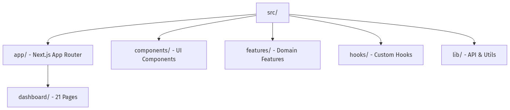

*Hình 4.19: Cấu trúc thư mục Frontend theo kiến trúc Feature-Sliced*

> Nguồn ảnh: [Wikipedia - Dashboard Confessional](https://en.wikipedia.org/wiki/Dashboard_Confessional)

##### c) Các trang chính và tính năng

Frontend Dashboard cung cấp các trang quản lý chính sau:

**Trang tổng quan Dashboard (`/dashboard`):**
Hiển thị các thẻ thống kê (stats cards) bao gồm tổng số xe, số chuyến đi trong ngày, số cảnh báo chưa xử lý, và số vi phạm. Ngoài ra còn hiển thị bảng cảnh báo gần đây, bản đồ mini với các xe đang hoạt động, danh sách chuyến đi gần đây, và biểu đồ thống kê (số chuyến đi theo ngày, cảnh báo theo loại).

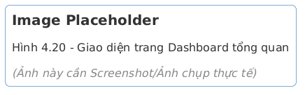

*Hình 4.20: Giao diện trang Dashboard tổng quan*

> Nguồn ảnh: [Wikipedia - Dashboard Confessional](https://en.wikipedia.org/wiki/Dashboard_Confessional)

**Trang quản lý xe (`/dashboard/vehicles`):**
Giao diện dạng bảng dữ liệu (data table) với các cột: biển số xe, hãng xe/model, trạng thái, thiết bị gắn kèm, lần cuối thấy, và các hành động. Hỗ trợ lọc theo trạng thái, loại xe, và tìm kiếm. Trang chi tiết xe hiển thị thông tin xe, vị trí hiện tại trên bản đồ, trạng thái thiết bị, cảnh báo đang hoạt động, chuyến đi gần đây, và lịch sử bảo trì.

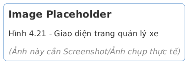

*Hình 4.21: Giao diện trang quản lý xe*

> Nguồn ảnh: [Wikipedia - Dashboard Confessional](https://en.wikipedia.org/wiki/Dashboard_Confessional)

**Trang bản đồ thời gian thực (`/dashboard/map`):**
Hiển thị tất cả các xe trên bản đồ Leaflet với vị trí cập nhật thời gian thực thông qua WebSocket. Hỗ trợ: hiển thị marker cho từng xe với popup trạng thái, lọc theo xe hoặc trạng thái, hiển thị vùng địa lý (geofence), và phát lại hành trình (route replay).

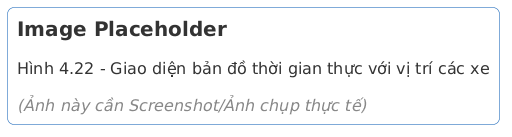

*Hình 4.22: Giao diện bản đồ thời gian thực với vị trí các xe*

> Nguồn ảnh: [Wikipedia - Global Positioning System](https://en.wikipedia.org/wiki/Global_Positioning_System)

**Trang quản lý cảnh báo (`/dashboard/alerts`):**
Bảng dữ liệu với badge mức độ nghiêm trọng (severity), hỗ trợ lọc theo loại, mức độ, xe, và khoảng thời gian. Các hành động hàng loạt: xác nhận (acknowledge) và giải quyết (resolve). Trang chi tiết cảnh báo hiển thị thông tin cảnh báo, vị trí trên bản đồ, xe và khách hàng liên quan.

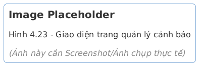

*Hình 4.23: Giao diện trang quản lý cảnh báo*

> Nguồn ảnh: [Wikipedia - Dashboard Confessional](https://en.wikipedia.org/wiki/Dashboard_Confessional)

**Trang quản lý vùng địa lý (`/dashboard/geofences`):**
Cho phép tạo và quản lý các vùng địa lý (geofence) trên bản đồ. Khi xe ra khỏi hoặc vào vùng địa lý đã định nghĩa, hệ thống sẽ tự động tạo cảnh báo.

**Trang cài đặt thông báo (`/dashboard/notifications`):**
Cho phép cấu hình kết nối Telegram bot, cài đặt email, lựa chọn loại cảnh báo muốn nhận, lọc theo mức độ nghiêm trọng và xe cụ thể. Có nút gửi thông báo thử nghiệm để kiểm tra cấu hình.

##### d) Quản lý trạng thái và dữ liệu

Frontend sử dụng chiến lược quản lý trạng thái kết hợp:

- **Zustand**: Quản lý trạng thái toàn cục (global state) như thông tin xác thực, trạng thái giao diện (sidebar, theme). Token xác thực chỉ lưu trong bộ nhớ (memory), KHÔNG lưu vào localStorage để tránh tấn công XSS.
- **TanStack Query**: Quản lý trạng thái server (server state) bao gồm caching, refetching, và invalidation. Khi kết nối WebSocket hoạt động, chế độ polling tự động bị vô hiệu hóa để tránh trùng lặp dữ liệu.
- **Socket.IO Client**: Kết nối WebSocket để nhận cập nhật thời gian thực từ backend. Frontend không kết nối trực tiếp tới MQTT broker; mọi dữ liệu real-time đều đi qua Backend API (Socket.IO).

##### e) Các giai đoạn triển khai

Frontend được triển khai theo 3 giai đoạn chính (Phase 4 là giai đoạn mở rộng trong tương lai):

[Bảng 4.9: Các giai đoạn triển khai Frontend]

| Giai đoạn                    | Nội dung                                                                                                    | Trạng thái      |
| ---------------------------- | ----------------------------------------------------------------------------------------------------------- | --------------- |
| Phase 1: Core Setup          | Project setup, Tailwind + shadcn/ui, theme, layout, auth, API client, React Query                           | Hoàn thành      |
| Phase 2: Core Features       | Dashboard, vehicle CRUD, customer CRUD, trip management, alert management, device management, real-time map | Hoàn thành      |
| Phase 3: Advanced Features   | Geofence management, maintenance, notification settings (Telegram + Email), user management, settings       | Hoàn thành      |
| Phase 4: Booking (tương lai) | Booking, contract, payment, damage reports, reviews                                                         | Chưa triển khai |

##### f) Cấu hình Docker cho Frontend

Frontend sử dụng Dockerfile nhiều giai đoạn (multi-stage build) để tối ưu kích thước image:

```dockerfile
# Tracking_Frontend/Dockerfile
ARG NODE_VERSION=20-alpine

# Giai đoạn 1: Cài đặt dependencies
FROM node:${NODE_VERSION} AS deps
WORKDIR /app
COPY package.json package-lock.json ./
RUN npm ci --no-audit --no-fund --legacy-peer-deps

# Giai đoạn 2: Build ứng dụng
FROM node:${NODE_VERSION} AS builder
WORKDIR /app
ARG NEXT_PUBLIC_API_BASE_URL=http://localhost:3000/api
ARG NEXT_PUBLIC_WS_URL=http://localhost:3000
ENV NEXT_PUBLIC_API_BASE_URL=${NEXT_PUBLIC_API_BASE_URL}
ENV NEXT_PUBLIC_WS_URL=${NEXT_PUBLIC_WS_URL}
COPY --from=deps /app/node_modules ./node_modules
COPY . .
RUN npm run build

# Giai đoạn 3: Chạy ứng dụng (production)
FROM node:${NODE_VERSION} AS runner
WORKDIR /app
ENV NODE_ENV=production
ENV PORT=3002
RUN apk add --no-cache tzdata && \
    cp /usr/share/zoneinfo/Asia/Ho_Chi_Minh /etc/localtime
RUN addgroup --system --gid 1001 nodejs && \
    adduser --system --uid 1001 nextjs
COPY --from=builder /app/public ./public
COPY --from=builder --chown=nextjs:nodejs /app/.next/standalone ./
COPY --from=builder --chown=nextjs:nodejs /app/.next/static ./.next/static
USER nextjs
EXPOSE 3002
CMD ["node", "server.js"]
```

Dockerfile sử dụng 3 giai đoạn: `deps` (cài đặt dependencies), `builder` (build ứng dụng), và `runner` (chạy production). Giai đoạn `runner` chỉ sao chép các file cần thiết từ giai đoạn `builder`, giúp giảm đáng kể kích thước image cuối cùng. Ứng dụng chạy với user `nextjs` (không phải root) để tăng tính bảo mật.

---

### 4.1.5. Cấu hình giám sát hệ thống (Monitoring & Observability)

##### a) Tổng quan chiến lược giám sát

Hệ thống giám sát được thiết kế theo mô hình "three pillars of observability" (ba trụ cột của quan sát được), bao gồm: metrics (chỉ số), logs (nhật ký), và traces (truy vết). Mỗi trụ cột sử dụng công cụ chuyên biệt phù hợp với đặc thù của hệ thống IoT.

[Bảng 4.10: Ba trụ cột giám sát hệ thống]

| Trụ cột | Công cụ                      | Mục đích                                | Dữ liệu lưu trữ                                        |
| ------- | ---------------------------- | --------------------------------------- | ------------------------------------------------------ |
| Metrics | VictoriaMetrics + Prometheus | Chỉ số hiệu năng, tài nguyên, nghiệp vụ | CPU, memory, request rate, latency, số thiết bị online |
| Logs    | VictoriaLogs                 | Nhật ký tập trung từ tất cả dịch vụ     | Request logs, error logs, MQTT events, device events   |
| Traces  | Request-ID Correlation       | Truy vết request xuyên suốt hệ thống    | Request-ID (UUID v4) trên mỗi request                  |
| Errors  | Sentry                       | Theo dõi lỗi và exception               | Stack traces, user context, breadcrumbs                |

##### b) VictoriaMetrics - Giám sát chỉ số (Metrics)

VictoriaMetrics đóng hai vai trò trong hệ thống:

1. **Lưu trữ dữ liệu telemetry IoT**: Tọa độ GPS, tốc độ xe, vòng tua máy, nhiệt độ động cơ, mức nhiên liệu -- dữ liệu này đến từ MQTT Bridge.
2. **Lưu trữ chỉ số hiệu năng hệ thống**: Số lượng request HTTP, thời gian xử lý (latency), số lượng kết nối WebSocket, số lượng message MQTT -- dữ liệu này đến từ các service thông qua thư viện `prom-client` (Prometheus client).

Backend sử dụng middleware `httpMetricsMiddleware` để tự động thu thập các chỉ số HTTP. VictoriaMetrics expose endpoint `/metrics` tương thích Prometheus để Grafana có thể truy vấn và hiển thị.

##### c) VictoriaLogs - Nhật ký tập trung (Centralized Logging)

VictoriaLogs là hệ thống nhật ký tập trung, thu thập log từ tất cả các dịch vụ trong hệ thống. Backend sử dụng `victorialogs-transport` của Winston để gửi log trực tiếp tới VictoriaLogs. Mỗi bản ghi log bao gồm:

- **Timestamp**: Thời điểm xảy ra sự kiện
- **Level**: Mức độ nghiêm trọng (info, warn, error)
- **Service**: Tên dịch vụ phát sinh log (backend, mqtt-bridge, frontend)
- **Request-ID**: Định danh request để truy vết
- **Message**: Nội dung nhật ký
- **Metadata**: Dữ liệu bổ sung (device_id, user_id, error stack)

MQTT Bridge cũng có logger riêng, gửi log về VictoriaLogs với trường `service: mqtt-bridge`, cho phép lọc và phân tích log theo từng dịch vụ.

##### d) Grafana - Dashboard giám sát trực quan

Grafana được sử dụng làm lớp trực quan hóa (visualization layer), kết nối tới cả VictoriaMetrics và VictoriaLogs để hiển thị các dashboard giám sát. Các dashboard chính bao gồm:

- **System Overview**: Tổng quan trạng thái hệ thống -- số thiết bị online, số request/giây, phần trăm lỗi, mức sử dụng CPU và memory của các container.
- **IoT Telemetry**: Dữ liệu từ các thiết bị IoT -- bản đồ nhiệt (heatmap) vị trí xe, biểu đồ tốc độ, biểu đồ mức nhiên liệu theo thời gian.
- **MQTT Metrics**: Thống kê MQTT -- số lượng message/giây, số kết nối đang hoạt động, latency trung bình, tỷ lệ message thất bại.
- **Application Performance**: Hiệu năng ứng dụng -- phân phối thời gian xử lý request (histogram), top endpoints chậm nhất, tỷ lệ lỗi theo endpoint.

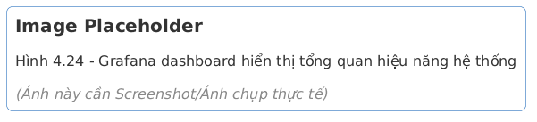

*Hình 4.24: Grafana dashboard hiển thị tổng quan hiệu năng hệ thống*

> Nguồn ảnh: [DummyImage (fallback placeholder)](https://dummyimage.com/1280x720/eeeeee/333333.png&text=Grafana%20dashboard%20hi%20n%20th%20t%20ng%20quan%20hi%20u%20n%20ng%20h%20th%20ng)

##### e) EMQX Dashboard - Giám sát MQTT Broker

EMQX cung cấp dashboard tích hợp (port 18083) cho phép giám sát trực tiếp trạng thái của MQTT broker:

- **Connections**: Số lượng kết nối hiện tại, lịch sử kết nối/ngắt kết nối
- **Subscriptions**: Danh sách topic và subscriber
- **Messages**: Thống kê message (published, delivered, dropped)
- **Rules Engine**: Trạng thái các rule xử lý dữ liệu
- **ACL**: Cấu hình quyền truy cập cho từng thiết bị

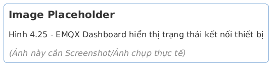

*Hình 4.25: EMQX Dashboard hiển thị trạng thái kết nối thiết bị*

> Nguồn ảnh: [Wikipedia - Message broker](https://en.wikipedia.org/wiki/Message_broker)

##### f) Sentry - Theo dõi lỗi (Error Tracking)

Backend tích hợp Sentry thông qua hai middleware: `sentryRequestHandler` (đặt đầu tiên trong middleware chain) và `sentryErrorHandler` (đặt cuối cùng). Sentry tự động thu thập:

- **Exception details**: Stack trace đầy đủ, biến môi trường, thông tin request
- **Breadcrumbs**: Các sự kiện xảy ra trước khi lỗi xuất hiện (database queries, HTTP calls, MQTT events)
- **Performance**: Thời gian xử lý của mỗi transaction (request)
- **Release tracking**: Theo dõi lỗi theo phiên bản triển khai

Sentry đặc biệt hữu ích trong môi trường production khi không thể truy cập trực tiếp vào log của server.

##### g) Request-ID Correlation

Mỗi request HTTP đến Backend đều được gán một Request-ID duy nhất (UUID v4) bởi middleware `requestIdMiddleware`. Request-ID này được:

- Trả về trong header `X-Request-ID` của response
- Đính kèm vào mỗi bản ghi log liên quan đến request đó
- Truyền xuyên suốt qua các lớp xử lý (controller -> service -> repository)
- Sử dụng làm `traceId` trong response lỗi

Cơ chế này cho phép đối chiếu (correlate) một request cụ thể từ frontend, qua backend, đến cơ sở dữ liệu và MQTT Bridge, giúp việc debug và phân tích sự cố trong hệ thống phân tán trở nên hiệu quả hơn.

---

### 4.1.6. Checklist hardening trước khi vận hành production

Để chuyển hệ thống từ môi trường thử nghiệm sang môi trường vận hành thực tế, nhóm triển khai áp dụng checklist hardening theo các mức ưu tiên sau (tham chiếu từ bộ tài liệu cải tiến hệ thống):

[Bảng 4.11: Checklist hardening production theo mức ưu tiên]

| Nhóm                 | Hạng mục bắt buộc                                                          | Mức ưu tiên | Tiêu chí nghiệm thu                                             |
| -------------------- | -------------------------------------------------------------------------- | ----------- | --------------------------------------------------------------- |
| Bảo mật truyền thông | Bật TLS cho HTTPS và MQTT (`8883`), bắt buộc chứng chỉ hợp lệ              | Cao         | 100% kết nối ngoài đi qua TLS, không còn endpoint plaintext     |
| Xác thực thiết bị    | Device credential riêng cho từng thiết bị (certificate hoặc device secret) | Cao         | Thiết bị giả mạo không publish được vào topic hợp lệ            |
| Bảo vệ API           | Rate limiting, CORS whitelist, kiểm tra input bằng schema (Zod)            | Cao         | Tất cả endpoint public có giới hạn tần suất và validate đầu vào |
| Độ tin cậy dịch vụ   | Health check endpoint + restart policy + watchdog cho firmware             | Cao         | Tự phục hồi khi service treo, có trạng thái sống/chết rõ ràng   |
| Dữ liệu và sao lưu   | Backup tự động PostgreSQL + chính sách retention cho telemetry/log         | Cao         | Phục hồi được dữ liệu theo RPO/RTO đã định                      |
| Hiệu năng hệ thống   | Connection pooling, tối ưu truy vấn, cache nóng (Redis khi cần)            | Trung bình  | P95 latency API giữ ổn định khi tăng tải                        |
| Khả năng mở rộng     | Load balancing và nhiều instance backend khi tăng số thiết bị              | Trung bình  | Scale-out không làm gián đoạn kết nối WebSocket/MQTT            |
| Quan sát và cảnh báo | Security event logging, alert theo ngưỡng lỗi/latency                      | Trung bình  | Cảnh báo được gửi tới Telegram/Email khi vượt ngưỡng            |

Lộ trình thực hiện được chia làm 2 đợt: **Phase 1.5** (ưu tiên cao, hoàn thành trước khi go-live) và **Phase 2** (mở rộng năng lực scale/observability theo tải thực tế). Cách chia này giúp giảm rủi ro sản xuất mà không làm chậm tiến độ đưa hệ thống vào khai thác.

---

### Tóm tắt

Hệ thống Cloud được triển khai thành công với kiến trúc microservices, trong đó mỗi dịch vụ được đóng gói trong container Docker độc lập và giao tiếp thông qua mạng chia sẻ `tracking-network`. Dịch vụ MQTT Bridge đóng vai trò cầu nối giữa thiết bị IoT và các hệ thống lưu trữ, Backend API cung cấp giao diện lập trình cho frontend và ứng dụng di động, và Frontend Dashboard cung cấp giao diện giám sát trực quan cho người quản lý đội xe.

Việc áp dụng mô hình per-service Docker Compose (IVM26 Pattern) giúp hệ thống dễ dàng bảo trì, mở rộng, và triển khai độc lập từng thành phần. Hệ thống giám sát toàn diện với VictoriaMetrics, VictoriaLogs, Grafana, và Sentry đảm bảo khả năng quan sát và phân tích sự cố trong môi trường vận hành thực tế.

[Bảng 4.12: Tổng hợp công nghệ sử dụng trong hệ thống Cloud]

| Thành phần           | Công nghệ               | Phiên bản | Vai trò                           |
| -------------------- | ----------------------- | --------- | --------------------------------- |
| MQTT Broker          | EMQX                    | 5.8       | Tiếp nhận dữ liệu từ thiết bị IoT |
| MQTT Bridge          | Node.js + TypeScript    | 20 LTS    | Xử lý và phân phối dữ liệu MQTT   |
| Backend API          | Express + TypeScript    | 4.x       | REST API, WebSocket, nghiệp vụ    |
| Frontend             | Next.js + React         | 15 / 19   | Giao diện web dashboard           |
| CSDL quan hệ         | PostgreSQL              | 16        | Dữ liệu người dùng, xe, cảnh báo  |
| CSDL chuỗi thời gian | VictoriaMetrics         | -         | Dữ liệu telemetry (GPS, OBD2)     |
| Nhật ký tập trung    | VictoriaLogs            | -         | Nhật ký các dịch vụ               |
| Dashboard giám sát   | Grafana                 | -         | Trực quan hóa chỉ số và nhật ký   |
| Container            | Docker + Docker Compose | -         | Đóng gói và triển khai dịch vụ    |
| Reverse Proxy        | Nginx Proxy Manager     | -         | Quản lý domain, SSL, routing      |
