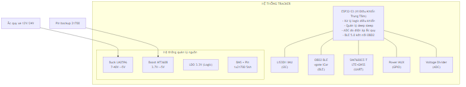
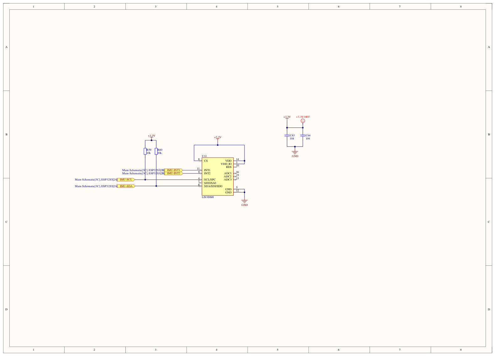
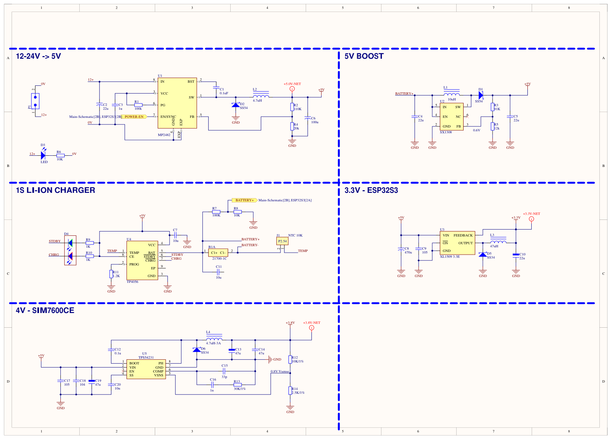
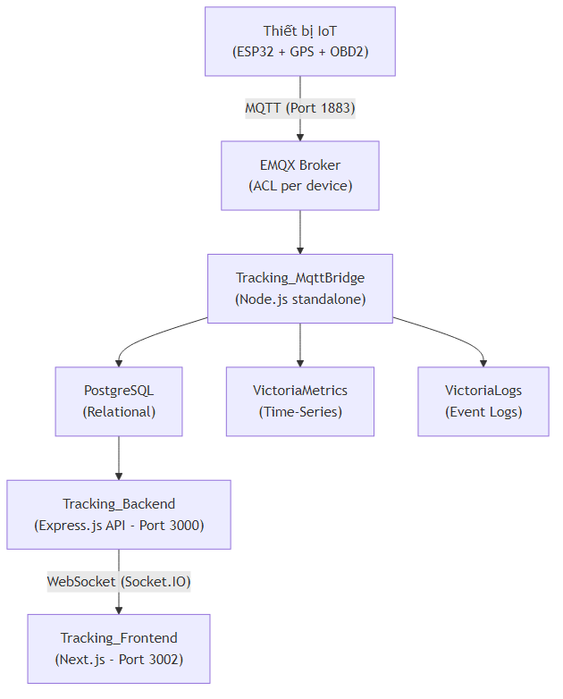
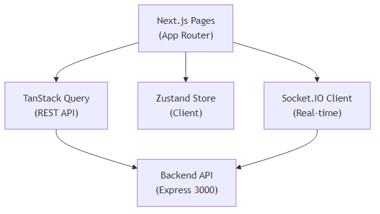
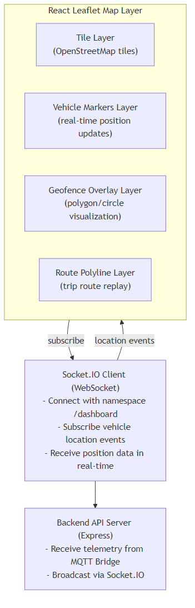
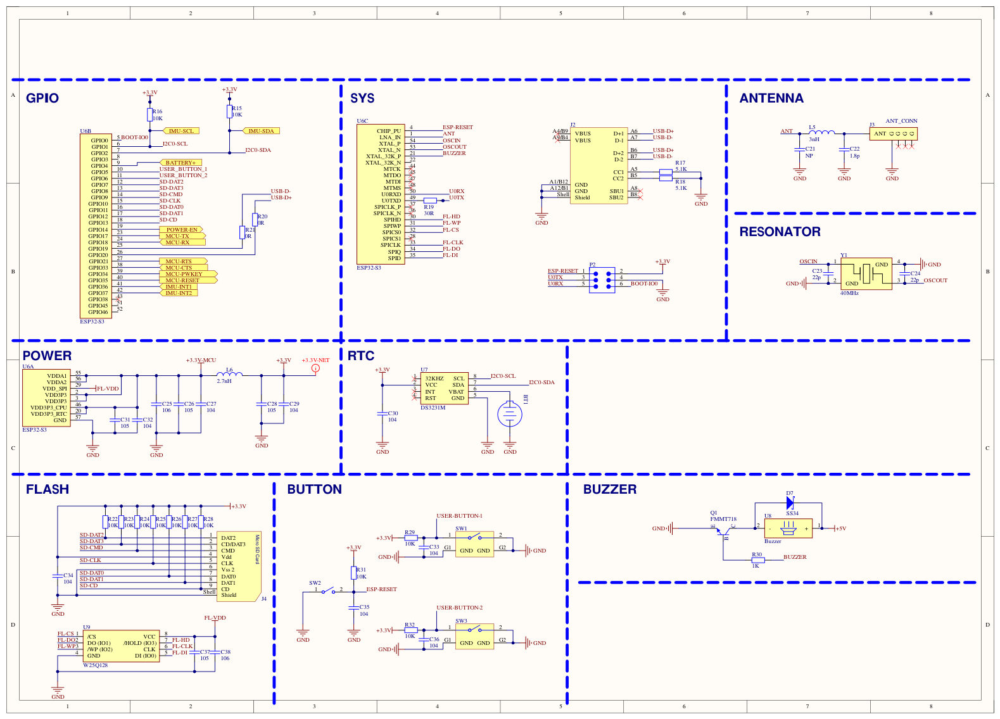
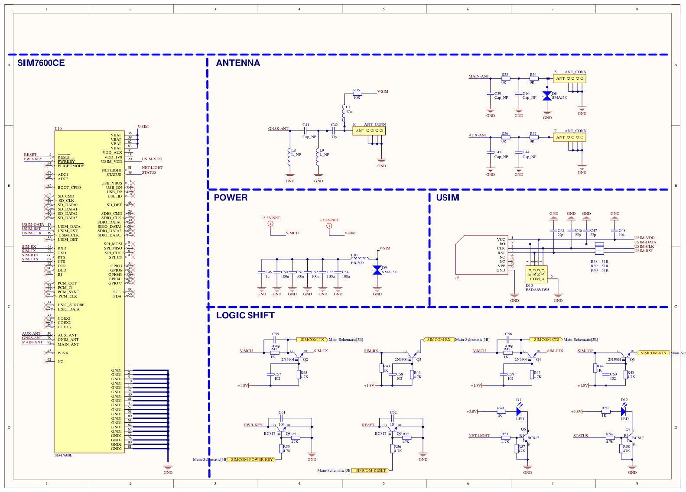
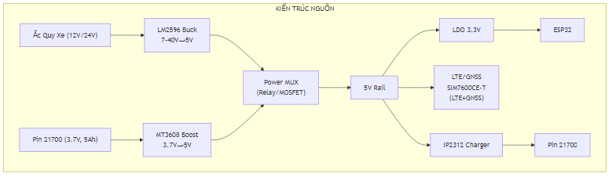

**PHẦN MỞ ĐẦU - BÌA VÀ PHẦN ĐẦU**

---

**NHẬN XÉT ĐỒ ÁN TỐT NGHIỆP CỦA GIẢNG VIÊN HƯỚNG DẪN**

|                           |                                                                   |
| ------------------------- | ----------------------------------------------------------------- |
| **Giảng viên hướng dẫn:** | [...]                                                             |
| **Khoa:**                 | [...]                                                             |
| **Tên đề tài:**           | Thiết kế và xây dựng hệ thống IoT giám sát phương tiện giao thông |
| **Sinh viên thực hiện:**  | [...]                                                             |
| **Lớp:**                  | [...]                                                             |

**NỘI DUNG NHẬN XÉT**

**I. Nhận xét Đồ án tốt nghiệp:**

- Nhận xét về hình thức: .............................
- Tính cấp thiết của đề tài: .............................
- Mục tiêu của đề tài: .............................
- Nội dung của đề tài: .............................
- Tài liệu tham khảo: .............................
- Phương pháp nghiên cứu: .............................
- Tính sáng tạo và ứng dụng: .............................

**II. Nhận xét về tinh thần và thái độ làm việc của sinh viên:**

.............................

**III. Kết quả đạt được:**

.............................

**IV. Kết luận:**

☐ Đồng ý cho bảo vệ &emsp;&emsp; ☐ Không đồng ý cho bảo vệ

|                    |                      |
| ------------------ | -------------------- |
| **Điểm đánh giá:** | ......./10           |
| **Ngày:**          | ......./......./2026 |
| **Chữ ký:**        |                      |

---

**NHẬN XÉT ĐỒ ÁN TỐT NGHIỆP CỦA GIẢNG VIÊN PHẢN BIỆN**

|                           |                                                                   |
| ------------------------- | ----------------------------------------------------------------- |
| **Giảng viên phản biện:** | [...]                                                             |
| **Khoa:**                 | [...]                                                             |
| **Tên đề tài:**           | Thiết kế và xây dựng hệ thống IoT giám sát phương tiện giao thông |
| **Sinh viên thực hiện:**  | [...]                                                             |
| **Lớp:**                  | [...]                                                             |

**NỘI DUNG NHẬN XÉT**

**I. Nhận xét Đồ án tốt nghiệp:**

- Nhận xét về hình thức: .............................
- Tính cấp thiết của đề tài: .............................
- Mục tiêu của đề tài: .............................
- Nội dung của đề tài: .............................
- Tài liệu tham khảo: .............................
- Phương pháp nghiên cứu: .............................
- Tính sáng tạo và ứng dụng: .............................

**II. Nhận xét về tinh thần và thái độ làm việc của sinh viên:**

.............................

**III. Ưu nhược điểm:**

- Ưu điểm: .............................
- Nhược điểm: .............................

**IV. Kết quả đạt được:**

.............................

**V. Kết luận:**

☐ Đồng ý cho bảo vệ &emsp;&emsp; ☐ Không đồng ý cho bảo vệ

|                    |                      |
| ------------------ | -------------------- |
| **Điểm đánh giá:** | ......./10           |
| **Ngày:**          | ......./......./2026 |
| **Chữ ký:**        |                      |

---

**BIÊN BẢN ĐÁNH GIÁ ĐỒ ÁN TỐT NGHIỆP**

**I. Thông tin chung**

- Thời gian: từ ... giờ ... đến ... giờ ... ngày .../..../20...
- Địa điểm: .............................
- Họ và tên sinh viên: [...] &emsp; Mã số SV: [...]
- Lớp: [...] &emsp; Ngành: [...] &emsp; Khóa: [...]
- Tên đề tài: Thiết kế và xây dựng hệ thống IoT giám sát phương tiện giao thông
- Giảng viên hướng dẫn: [...]

**II. Thành phần hội đồng:** [...]

**III. Tổng hợp câu hỏi của thành viên hội đồng:** .............................

**IV. Tổng hợp nội dung trả lời của sinh viên:** .............................

**V. Nội dung đánh giá của Hội đồng:**

- Ý nghĩa của đồ án: .............................
- Về nội dung, kết cấu của đồ án: .............................
- Phương pháp nghiên cứu: .............................
- Các kết quả nghiên cứu đạt được: .............................

**VI. Điểm kết luận:** .............. (Bằng chữ: ..............)

---

**GIẢI TRÌNH CÁC CHỈNH SỬA**

_(Nếu có)_

| STT | Nội dung yêu cầu chỉnh sửa | Nội dung đã chỉnh sửa | Ghi chú |
| --- | -------------------------- | --------------------- | ------- |
| 1   |                            |                       |         |
| 2   |                            |                       |         |
| 3   |                            |                       |         |

---

**TRANG BÌA**

|                           |                                                                   |
| ------------------------- | ----------------------------------------------------------------- |
| **Trường:**               | [...]                                                             |
| **Khoa:**                 | [...]                                                             |
| **Đề tài:**               | Thiết kế và xây dựng hệ thống IoT giám sát phương tiện giao thông |
| **Sinh viên thực hiện:**  | [...]                                                             |
| **MSSV:**                 | [...]                                                             |
| **Lớp:**                  | [...]                                                             |
| **Giảng viên hướng dẫn:** | [...]                                                             |
| **Năm:**                  | 2026                                                              |

---

# LỜI CAM ĐOAN

Tôi xin cam đoan đồ án tốt nghiệp với đề tài **"Thiết kế và xây dựng hệ thống IoT giám sát phương tiện giao thông"** là công trình nghiên cứu của riêng tôi dưới sự hướng dẫn của [...].

Các số liệu, kết quả trình bày trong đồ án là trung thực và chưa từng được công bố trong bất kỳ công trình nghiên cứu nào khác. Các tài liệu tham khảo, trích dẫn trong đồ án đều được ghi rõ nguồn gốc.

Tôi xin chịu hoàn toàn trách nhiệm về nội dung đồ án tốt nghiệp của mình.

<p align="right"><i>[Thành phố], ngày ... tháng ... năm 2026</i></p>
<p align="right"><b>Sinh viên thực hiện</b></p>
<br/>
<p align="right"><b>[...]</b></p>

---

**TÓM TẮT ĐỒ ÁN TỐT NGHIỆP - ABSTRACT**

**Đề tài:** Thiết kế và xây dựng hệ thống IoT giám sát phương tiện giao thông

**Sinh viên thực hiện:** [...]&emsp;&emsp;**MSSV:** [...]

**Giảng viên hướng dẫn:** [...]

---

Trong bối cảnh dịch vụ cho thuê xe tự lái tại Việt Nam tăng trưởng nhanh, nhu cầu giám sát và quản lý phương tiện từ xa đã trở thành yêu cầu trọng yếu đối với doanh nghiệp vận tải. Đồ án này trình bày quá trình thiết kế và xây dựng một hệ thống IoT hoàn chỉnh, cho phép giám sát phương tiện theo thời gian thực, đồng thời tích hợp nhiều cảm biến và giao thức truyền thông hiện đại.

Về phần cứng, hệ thống dùng ESP32-S3 làm trung tâm xử lý, kết hợp modem LTE + GNSS tích hợp SIMCom SIM7600CE-T để định vị và truyền dữ liệu. Modem được cấu hình Auto mode (`AT+CNMP=2`) nhằm cho phép chuyển đổi linh hoạt giữa LTE/UMTS/GSM, dùng APN mặc định `internet`, và cung cấp GNSS qua lệnh `AT+CGNSINF` (hoặc stream NMEA tùy chọn `AT+CGNSTST`) trên cùng UART1 mà không cần module GNSS độc lập. Thiết bị đọc dữ liệu OBD2 qua adapter vgate iCar Pro bằng BLE, đồng thời dùng IMU LIS3DH để phát hiện va chạm và phân tích hành vi lái xe. Khối nguồn gồm buck/boost converter, bộ sạc pin dự phòng 21700 và cơ chế ngắt điện áp thấp (LVD), bảo đảm thiết bị vẫn hoạt động khi xe tắt máy.

Về phần mềm, dữ liệu từ thiết bị IoT được truyền về máy chủ bằng MQTT 5.0 qua EMQX và phân quyền theo ACL từng thiết bị. MQTT Bridge tiếp nhận, rồi phân luồng dữ liệu đến các hệ lưu trữ chuyên biệt: PostgreSQL cho dữ liệu quan hệ (phương tiện, người dùng, cảnh báo, hàng rào địa lý), VictoriaMetrics cho dữ liệu chuỗi thời gian (tọa độ GPS, thông số OBD2, dữ liệu cảm biến), và VictoriaLogs cho nhật ký sự kiện. API server xây dựng bằng Express.js + TypeScript, theo kiến trúc DDD, với cơ chế xác thực phiên dựa trên token lưu trong cơ sở dữ liệu.

Giao diện web được phát triển bằng Next.js 15 và React 19, cung cấp bảng điều khiển thời gian thực với bản đồ Leaflet, biểu đồ ECharts và kết nối WebSocket qua Socket.IO để cập nhật tức thời vị trí, trạng thái phương tiện. Toàn bộ hệ thống được đóng gói và triển khai bằng Docker nhằm bảo đảm tính nhất quán giữa môi trường phát triển và môi trường vận hành.

Kết quả đạt được là một hệ thống IoT giám sát phương tiện hoàn chỉnh từ phần cứng đến phần mềm, có khả năng theo dõi vị trí thời gian thực, đọc dữ liệu chẩn đoán OBD2, thiết lập hàng rào địa lý, cảnh báo tự động, và hỗ trợ quản lý đội xe cho dịch vụ cho thuê xe tự lái.

**Từ khóa:** IoT, giám sát phương tiện, GPS, OBD2, MQTT, ESP32-S3, thời gian thực, hàng rào địa lý

---

**Abstract (English)**

**Title:** Design and Development of an IoT Vehicle Tracking System

**Student:** [...]&emsp;&emsp;**Student ID:** [...]

**Supervisor:** [...]

In the context of the rapidly growing self-drive car rental industry in Vietnam, the need for remote vehicle monitoring and management has become a critical factor for transportation businesses. This thesis presents the design and development of a comprehensive IoT system that enables real-time vehicle tracking, integrating diverse sensors and modern communication protocols.

On the hardware side, the system employs the ESP32-S3 microcontroller as the central processing unit, paired with the SIMCom SIM7600CE-T LTE+GNSS modem. The modem is configured to Auto mode (`AT+CNMP=2`) so it can switch between LTE/UMTS/GSM automatically, uses the default APN `internet`, and delivers GNSS data via `AT+CGNSINF` (with optional NMEA streaming through `AT+CGNSTST`) on the same UART1 channel without a dedicated GNSS interface. The device reads engine diagnostic data via the OBD2 protocol through a vgate iCar Pro adapter using Bluetooth Low Energy (BLE), while integrating the LIS3DH IMU accelerometer for collision detection and driving behavior analysis. The power management system includes buck/boost converters, a 21700 backup battery charger, and a low-voltage disconnect (LVD) mechanism to ensure continuous operation even when the vehicle engine is off.

On the software side, data from IoT devices is transmitted to the server via the MQTT 5.0 protocol using the EMQX broker with device-level ACL authorization. The MQTT Bridge service receives and routes data to specialized storage systems: PostgreSQL for relational data (vehicle information, users, alerts, geofences), VictoriaMetrics for time-series data (GPS coordinates, OBD2 parameters, sensor telemetry), and VictoriaLogs for system event logs. The API server is built on Express.js with TypeScript, following Domain-Driven Design (DDD) architecture with database-backed session token authentication.

The web interface is developed using Next.js 15 and React 19, providing a real-time dashboard with Leaflet maps, ECharts visualizations, and WebSocket connectivity via Socket.IO for instant vehicle position and status updates. The entire system is containerized and deployed using Docker, ensuring consistency between development and production environments.

The result is a complete end-to-end IoT vehicle tracking system, from hardware to software, capable of real-time location tracking, OBD2 diagnostic data retrieval, geofencing, automated alerts, and fleet management support for self-drive car rental services.

**Keywords:** IoT, vehicle tracking, GPS, OBD2, MQTT, ESP32-S3, real-time, geofencing

---

# LỜI CẢM ƠN - ACKNOWLEDGEMENTS

Trước tiên, tôi xin gửi lời cảm ơn chân thành và sâu sắc nhất đến [...] — người đã trực tiếp hướng dẫn, định hướng và tận tình hỗ trợ tôi trong suốt quá trình thực hiện đồ án tốt nghiệp này. Những góp ý chuyên môn và sự động viên của thầy/cô là nguồn động lực quan trọng giúp tôi hoàn thành đề tài.

Tôi xin trân trọng cảm ơn quý thầy cô trong Khoa [...], Trường [...] đã truyền đạt những kiến thức nền tảng vững chắc trong suốt quá trình học tập, tạo điều kiện thuận lợi để tôi có thể áp dụng vào thực tiễn thông qua đồ án này.

Tôi cũng xin gửi lời cảm ơn đến gia đình, bạn bè và các đồng nghiệp đã luôn ủng hộ, chia sẻ và đồng hành cùng tôi trong suốt thời gian thực hiện đề tài.

Mặc dù đã cố gắng hoàn thiện đồ án một cách tốt nhất, tuy nhiên do hạn chế về thời gian và kiến thức, đồ án không thể tránh khỏi những thiếu sót. Tôi rất mong nhận được sự góp ý và nhận xét từ quý thầy cô và hội đồng để đồ án được hoàn thiện hơn.

Xin chân thành cảm ơn!

<p align="right"><i>[Thành phố], ngày ... tháng ... năm 2026</i></p>
<p align="right"><b>Sinh viên thực hiện</b></p>
<br/>
<p align="right"><b>[...]</b></p>

---

# MỤC LỤC - TABLE OF CONTENTS

<!-- MỤC LỤC được cập nhật theo cấu trúc chương thực tế -->

| STT          | Nội dung                                                                               | Trang |
| ------------ | -------------------------------------------------------------------------------------- | ----- |
|              | NHẬN XÉT CỦA GIẢNG VIÊN HƯỚNG DẪN                                                      | ...   |
|              | NHẬN XÉT CỦA GIẢNG VIÊN PHẢN BIỆN                                                      | ...   |
|              | BIÊN BẢN ĐÁNH GIÁ ĐỒ ÁN TỐT NGHIỆP                                                     | ...   |
|              | GIẢI TRÌNH CÁC CHỈNH SỬA                                                               | ...   |
|              | LỜI CAM ĐOAN                                                                           | ...   |
|              | TÓM TẮT - ABSTRACT                                                                     | ...   |
|              | LỜI CẢM ƠN                                                                             | ...   |
|              | MỤC LỤC                                                                                | ...   |
|              | DANH MỤC BẢNG                                                                          | ...   |
|              | DANH MỤC HÌNH ẢNH VÀ ĐỒ THỊ                                                            | ...   |
|              | DANH MỤC TỪ VIẾT TẮT                                                                   | ...   |
| **Chương 1** | **GIỚI THIỆU DỰ ÁN - SUMMARY**                                                         | ...   |
| 1.1          | Đặt vấn đề / Bối cảnh của dự án — Problem definition and Background                    | ...   |
| 1.2          | Mục tiêu và phạm vi của dự án                                                          | ...   |
| 1.3          | Các tiêu chí cần đạt được của dự án                                                    | ...   |
| 1.4          | Phương pháp tiếp cận thiết kế kỹ thuật                                                 | ...   |
| 1.5          | Kết quả và khuyến nghị                                                                 | ...   |
| **Chương 2** | **PHÂN TÍCH VẤN ĐỀ KỸ THUẬT**                                                          | ...   |
| 2.1          | Mô tả vấn đề — Problem statement                                                       | ...   |
| 2.2          | Bối cảnh và cơ sở kỹ thuật — Background and Technical reviews                          | ...   |
| 2.3          | Yêu cầu kỹ thuật và các tiêu chuẩn thiết kế — Design criteria and Constraints          | ...   |
| 2.4          | Yêu cầu từ các bên liên quan — Constituent's requirements                              | ...   |
| **Chương 3** | **CÁC GIẢI PHÁP THIẾT KẾ - DESIGN SOLUTIONS**                                          | ...   |
| 3.1          | Phân tích tổng hợp — General analysis                                                  | ...   |
| 3.1.1        | Phân tích và lựa chọn phần cứng                                                        | ...   |
| 3.1.2        | Phân tích và lựa chọn giải pháp firmware                                               | ...   |
| 3.1.3        | Phân tích và lựa chọn kiến trúc Cloud                                                  | ...   |
| 3.1.4        | Phân tích và lựa chọn công nghệ Frontend                                               | ...   |
| 3.2          | Đề xuất các giải pháp — Proposed multiple solutions                                    | ...   |
| 3.2.1        | Giải pháp phần cứng                                                                    | ...   |
| 3.2.2        | Giải pháp firmware                                                                     | ...   |
| 3.2.3        | Giải pháp Backend & Cloud                                                              | ...   |
| 3.2.4        | Giải pháp Frontend                                                                     | ...   |
| 3.3          | Phân tích, đánh giá và lựa chọn phương án khả thi — Analysis, Evaluation and Selection | ...   |
| 3.4          | Tối ưu phương án thiết kế — The optimal solution                                       | ...   |
| **Chương 4** | **TRIỂN KHAI GIẢI PHÁP VÀ KẾT QUẢ - IMPLEMENTATION AND RESULTS**                       | ...   |
| 4.1          | Thiết kế chi tiết giải pháp — Detailed design solution                                 | ...   |
| 4.1.1        | Thiết kế chi tiết phần cứng                                                            | ...   |
| 4.1.2        | Triển khai firmware, cloud và giao diện điều khiển                                     | ...   |
| 4.2          | Chế tạo và lắp ráp hệ thống — Manufacture and Assembly                                 | ...   |
| 4.2.1        | Lắp ráp mạch điện tử                                                                   | ...   |
| 4.2.2        | Lắp đặt trong xe                                                                       | ...   |
| 4.2.3        | Triển khai Firmware                                                                    | ...   |
| 4.2.4        | Triển khai hệ thống Cloud                                                              | ...   |
| 4.2.5        | Triển khai Frontend Dashboard                                                          | ...   |
| 4.2.6        | Cấu hình giám sát hệ thống                                                             | ...   |
| 4.2.7        | Checklist hardening trước khi vận hành production                                      | ...   |
| 4.3          | Đo lường và kết quả — Measurement and Result                                           | ...   |
| **Chương 5** | **ĐÁNH GIÁ VÀ KHUYẾN NGHỊ - EVALUATION AND RECOMMENDATION**                            | ...   |
| 5.1          | Đánh giá hiệu năng                                                                     | ...   |
| 5.2          | Đánh giá kinh tế và môi trường                                                         | ...   |
| 5.3          | Đánh giá rủi ro và biện pháp giảm thiểu                                                | ...   |
| 5.4          | Khuyến nghị cho tương lai                                                              | ...   |
| **Chương 6** | **PHẢN HỒI VÀ BÀI HỌC KINH NGHIỆM - REFLECTION AND CASE-STUDIES**                      | ...   |
| 6.1          | Ứng dụng kiến thức kỹ thuật — Earlier course work                                      | ...   |
| 6.2          | Giải quyết các vấn đề kỹ thuật phức tạp — Complex engineering problems                 | ...   |
| 6.3          | Tác động đạo đức và xã hội — Ethical and Social impacts                                | ...   |
| 6.4          | Tổng kết và bài học kinh nghiệm — General reflection and case-studies                  | ...   |
|              | TÀI LIỆU TRÍCH DẪN - REFERENCES                                                        | ...   |
|              | PHỤ LỤC - APPENDICES                                                                   | ...   |

---

# DANH MỤC BẢNG - LIST OF TABLES

<!-- Danh mục bảng sẽ được cập nhật khi hoàn thành các chương nội dung -->

| Bảng     | Mô tả                                  | Trang |
| -------- | -------------------------------------- | ----- |
| Bảng 2.1 | So sánh các giao thức IoT phổ biến     | ...   |
| Bảng 2.2 | Thông số kỹ thuật ESP32-S3             | ...   |
| Bảng 2.3 | Các PID OBD2 thông dụng                | ...   |
| Bảng 3.1 | Danh sách linh kiện (BOM)              | ...   |
| Bảng 3.2 | Sơ đồ chân kết nối GPIO                | ...   |
| Bảng 3.3 | Bảng tính toán công suất tiêu thụ      | ...   |
| Bảng 3.4 | Cấu trúc bảng cơ sở dữ liệu PostgreSQL | ...   |
| Bảng 3.5 | Danh sách API endpoints                | ...   |
| Bảng 4.1 | Cấu hình Docker cho các dịch vụ        | ...   |
| Bảng 5.1 | Kết quả kiểm thử chức năng             | ...   |
| Bảng 5.2 | So sánh với các giải pháp hiện có      | ...   |

---

# DANH MỤC HÌNH ẢNH VÀ ĐỒ THỊ - LIST OF PICTURES AND GRAPHS

<!-- Danh mục hình ảnh sẽ được cập nhật khi hoàn thành các chương nội dung -->

| Hình     | Mô tả                                               | Trang |
| -------- | --------------------------------------------------- | ----- |
| Hình 1.1 | Mô hình tổng quan hệ thống IoT giám sát phương tiện | ...   |
| Hình 2.1 | Kiến trúc giao thức MQTT                            | ...   |
| Hình 2.2 | Cấu trúc bản tin MQTT                               | ...   |
| Hình 2.3 | Nguyên lý hoạt động GPS/GNSS                        | ...   |
| Hình 2.4 | Sơ đồ khối ESP32-S3                                 | ...   |
| Hình 2.5 | Giao diện OBD2 và các PID                           | ...   |
| Hình 3.1 | Sơ đồ kiến trúc tổng thể hệ thống                   | ...   |
| Hình 3.2 | Sơ đồ nguyên lý mạch phần cứng                      | ...   |
| Hình 3.3 | Sơ đồ mạch quản lý nguồn                            | ...   |
| Hình 3.4 | Thiết kế PCB                                        | ...   |
| Hình 3.5 | Sơ đồ luồng dữ liệu firmware                        | ...   |
| Hình 3.6 | Sơ đồ kiến trúc backend (DDD)                       | ...   |
| Hình 3.7 | Sơ đồ quan hệ cơ sở dữ liệu (ERD)                   | ...   |
| Hình 3.8 | Wireframe giao diện dashboard                       | ...   |
| Hình 4.1 | Hình ảnh thiết bị phần cứng hoàn thiện              | ...   |
| Hình 4.2 | Giao diện dashboard thời gian thực                  | ...   |
| Hình 4.3 | Giao diện bản đồ theo dõi phương tiện               | ...   |
| Hình 4.4 | Sơ đồ triển khai Docker                             | ...   |
| Hình 5.1 | Đồ thị độ chính xác GPS                             | ...   |
| Hình 5.2 | Đồ thị hiệu suất hệ thống                           | ...   |

---

# DANH MỤC TỪ VIẾT TẮT - LIST OF ABBREVIATIONS

| Từ viết tắt   | Tiếng Anh                                      | Tiếng Việt                                 |
| ------------- | ---------------------------------------------- | ------------------------------------------ |
| **ADC**       | Analog-to-Digital Converter                    | Bộ chuyển đổi tương tự sang số             |
| **API**       | Application Programming Interface              | Giao diện lập trình ứng dụng               |
| **BLE**       | Bluetooth Low Energy                           | Bluetooth năng lượng thấp                  |
| **BOM**       | Bill of Materials                              | Danh sách linh kiện                        |
| **CI/CD**     | Continuous Integration / Continuous Deployment | Tích hợp liên tục / Triển khai liên tục    |
| **CORS**      | Cross-Origin Resource Sharing                  | Chia sẻ tài nguyên nguồn chéo              |
| **DDD**       | Domain-Driven Design                           | Thiết kế hướng miền                        |
| **Docker**    | Docker Container Platform                      | Nền tảng container hóa ứng dụng            |
| **EMQX**      | Erlang MQTT Broker                             | Máy chủ MQTT dựa trên Erlang               |
| **ESP32**     | Espressif System-on-Chip 32-bit                | Vi điều khiển SoC 32-bit của Espressif     |
| **FreeRTOS**  | Free Real-Time Operating System                | Hệ điều hành thời gian thực mã nguồn mở    |
| **GPIO**      | General Purpose Input/Output                   | Cổng vào/ra đa năng                        |
| **GNSS**      | Global Navigation Satellite System             | Hệ thống vệ tinh dẫn đường toàn cầu        |
| **GPS**       | Global Positioning System                      | Hệ thống định vị toàn cầu                  |
| **HTTP**      | Hypertext Transfer Protocol                    | Giao thức truyền siêu văn bản              |
| **HTTPS**     | Hypertext Transfer Protocol Secure             | Giao thức truyền siêu văn bản bảo mật      |
| **IMU**       | Inertial Measurement Unit                      | Đơn vị đo lường quán tính                  |
| **IoT**       | Internet of Things                             | Internet vạn vật                           |
| **JWT**       | JSON Web Token                                 | Mã thông báo web dạng JSON                 |
| **LVD**       | Low Voltage Disconnect                         | Ngắt điện áp thấp                          |
| **MCU**       | Microcontroller Unit                           | Vi điều khiển                              |
| **MQTT**      | Message Queuing Telemetry Transport            | Giao thức truyền thông tin hàng đợi        |
| **OBD2**      | On-Board Diagnostics II                        | Chẩn đoán trên xe thế hệ 2                 |
| **ORM**       | Object-Relational Mapping                      | Ánh xạ đối tượng - quan hệ                 |
| **PCB**       | Printed Circuit Board                          | Bảng mạch in                               |
| **REST**      | Representational State Transfer                | Kiến trúc truyền trạng thái đại diện       |
| **RTOS**      | Real-Time Operating System                     | Hệ điều hành thời gian thực                |
| **SoC**       | System on Chip                                 | Hệ thống trên chip                         |
| **SQL**       | Structured Query Language                      | Ngôn ngữ truy vấn có cấu trúc              |
| **TLS**       | Transport Layer Security                       | Bảo mật tầng vận chuyển                    |
| **UART**      | Universal Asynchronous Receiver-Transmitter    | Bộ thu phát bất đồng bộ đa năng            |
| **WebSocket** | WebSocket Protocol                             | Giao thức kết nối hai chiều thời gian thực |

---

<!-- Kết thúc phần mở đầu. Các chương nội dung bắt đầu từ file tiếp theo. -->

# CHƯƠNG 1. GIỚI THIỆU DỰ ÁN – SUMMARY

## 1.1. Đặt vấn đề / Bối cảnh của dự án

### 1.1.1. Bối cảnh thị trường cho thuê xe tự lái tại Việt Nam

Những năm gần đây, thị trường cho thuê xe tự lái tại Việt Nam tăng trưởng rõ rệt, đặc biệt ở TP. Hồ Chí Minh, Hà Nội và Đà Nẵng. Theo báo cáo ngành vận tải [1], nhu cầu thuê xe tăng trung bình 15–20% mỗi năm nhờ du lịch nội địa, nhu cầu di chuyển linh hoạt và xu hướng chia sẻ phương tiện. Đi cùng đà tăng trưởng, áp lực quản trị đội xe cũng tăng mạnh, nhất là ở các tác vụ giám sát vận hành và bảo toàn tài sản.
Các doanh nghiệp cho thuê xe tự lái hiện nay phải đối mặt với nhiều vấn đề nghiêm trọng:

- **Quản lý thủ công không hiệu quả**: Phần lớn các công ty cho thuê xe quy mô vừa và nhỏ tại Việt Nam vẫn sử dụng phương pháp quản lý thủ công — ghi chép sổ sách, gọi điện thoại kiểm tra, và dựa vào sự tự giác của khách hàng. Phương pháp này không cung cấp khả năng giám sát thời gian thực (real-time visibility) về vị trí và trạng thái của xe [2].
- **Rủi ro mất cắp và sử dụng sai mục đích**: Khi không có hệ thống giám sát, xe có thể bị sử dụng vượt phạm vi địa lý đã thỏa thuận, chạy quá số km quy định, hoặc trong trường hợp xấu nhất là bị chiếm đoạt. Việc phát hiện các tình huống này thường bị trễ, gây thiệt hại lớn về tài sản [3].
- **Thiếu dữ liệu chẩn đoán kỹ thuật**: Các doanh nghiệp không có khả năng theo dõi tình trạng kỹ thuật của xe từ xa, dẫn đến việc bảo trì thường bị động, chỉ xử lý khi xe đã hỏng hóc. Điều này làm tăng chi phí sửa chữa và giảm tuổi thọ của đội xe.
- **Giải pháp thương mại đắt đỏ**: Các hệ thống GPS tracking thương mại hiện có trên thị trường (như Vietmap, iTracking) thường có chi phí cao — bao gồm phí thiết bị, phí dịch vụ hàng tháng, và phí tích hợp — không phù hợp với các doanh nghiệp quy mô nhỏ với ngân sách hạn chế [4].

### 1.1.2. Thách thức kỹ thuật

Ngoài các vấn đề kinh doanh, việc xây dựng một hệ thống theo dõi xe IoT (Internet of Things) còn phải giải quyết nhiều thách thức kỹ thuật:

**Thứ nhất, vấn đề tiêu thụ năng lượng.** Các hệ thống theo dõi GPS hoạt động liên tục sẽ rút cạn ắc quy xe trong vài tuần, ảnh hưởng nghiêm trọng đến khả năng khởi động xe [5]. Đối với xe cho thuê, việc xe không khởi động được do ắc quy yếu là tình huống không thể chấp nhận. Hệ thống cần có chiến lược quản lý năng lượng thông minh, chuyển đổi giữa các chế độ hoạt động (driving mode, parking mode, alert mode) để tối ưu hóa mức tiêu thụ điện năng.

**Thứ hai, giám sát khi xe đỗ (parking mode).** Khi xe tắt máy (IGN OFF), hệ thống cần vừa tiết kiệm điện vừa có khả năng phát hiện chuyển động bất thường — chẳng hạn như xe bị kẻ trộm di chuyển hoặc bị cẩu kéo. Đây là bài toán cân bằng giữa mức tiêu thụ năng lượng và độ nhạy phát hiện [6].

**Thứ ba, độ tin cậy của kết nối.** Hệ thống IoT hoạt động trong môi trường di động, nơi kết nối mạng 4G/LTE có thể không ổn định. Hệ thống cần có cơ chế xử lý mất kết nối, lưu trữ dữ liệu tạm thời (buffering), và đồng bộ lại khi kết nối được phục hồi.

**Thứ tư, xử lý dữ liệu thời gian thực.** Với một đội xe gồm hàng chục đến hàng trăm xe, hệ thống backend cần xử lý luồng dữ liệu telemetry lớn (vị trí GPS, dữ liệu OBD2, trạng thái cảm biến) với độ trễ thấp, đồng thời cung cấp giao diện giám sát trực quan cho người quản lý.


_Hình 1.1: Sơ đồ tổng quan vấn đề và giải pháp đề xuất_

> Nguồn: Hình vẽ của tác giả

### 1.1.3. Động lực thực hiện dự án

Xuất phát từ các vấn đề thực tiễn nêu trên, dự án "IoT Vehicle Tracking System" được triển khai nhằm xây dựng một giải pháp toàn diện (end-to-end solution), bao gồm thiết bị phần cứng IoT, firmware nhúng, hệ thống cloud và giao diện web, phục vụ trực tiếp nhu cầu quản lý đội xe cho thuê tự lái tại Việt Nam. Dự án hướng đến một giải pháp có chi phí hợp lý, khả năng tùy biến cao và có thể mở rộng theo quy mô doanh nghiệp.

---

## 1.2. Mục tiêu và phạm vi của dự án

### 1.2.1. Mục tiêu tổng quát

Mục tiêu chính của dự án là thiết kế và hiện thực một hệ thống IoT theo dõi xe hoàn chỉnh, bao gồm cả phần cứng và phần mềm, phục vụ cho việc quản lý đội xe cho thuê tự lái. Hệ thống cần đảm bảo các yêu cầu sau:

1. **Theo dõi vị trí thời gian thực (real-time tracking)**: Cung cấp vị trí GPS của xe với tần suất cập nhật 5–30 giây khi xe đang di chuyển, hiển thị trên bản đồ trực tuyến.
2. **Giám sát trạng thái kỹ thuật qua OBD2**: Kết nối với cổng chẩn đoán OBD-II của xe thông qua giao thức Bluetooth Low Energy (BLE) để đọc các thông số như tốc độ, vòng tua máy, nhiệt độ động cơ, và mã lỗi chẩn đoán (DTC).
3. **Cảnh báo thông minh**: Tự động phát hiện và gửi thông báo khi có các sự kiện bất thường như: xe vượt ra khỏi vùng địa lý cho phép (geofencing), vượt tốc độ quy định, chuyển động bất thường khi xe đang đỗ, hoặc mất kết nối thiết bị.
4. **Tối ưu hóa năng lượng**: Đảm bảo thiết bị hoạt động liên tục mà không làm cạn ắc quy xe, với thời lượng pin dự phòng đủ để hoạt động độc lập trong trường hợp mất nguồn chính.
5. **Giao diện quản lý trực quan**: Cung cấp bảng điều khiển (dashboard) web cho phép người quản lý đội xe theo dõi vị trí, xem lịch sử hành trình, quản lý cảnh báo, và tạo báo cáo.

### 1.2.2. Phạm vi dự án

**Đối tượng ứng dụng:**

- Loại xe: Ô tô con (xe 4 chỗ, sedan, SUV) với hệ thống điện 12V hoặc 24V DC
- Ắc quy phổ thông: 40–70 Ah (trung bình 45–60 Ah)
- Đối tượng sử dụng: Các công ty cho thuê xe tự lái quy mô vừa và nhỏ tại Việt Nam

**Phạm vi phần cứng:**

- Thiết bị tracker IoT sử dụng vi điều khiển ESP32-S3
- Modem LTE + GNSS SIMCom SIM7600CE-T (Auto mode LTE/UMTS/GSM, APN mặc định `internet`) kết nối trực tiếp qua UART1 để cung cấp cả dữ liệu 4G và GNSS
- Adapter OBD2 BLE vgate iCar Pro (đọc dữ liệu chẩn đoán xe qua Bluetooth)
- Cảm biến gia tốc LIS3DH (IMU) để phát hiện chuyển động và rung
- Pin dự phòng 21700 với mạch sạc và bảo vệ

**Phạm vi firmware:**

- Phát triển trên nền tảng ESP-IDF với hệ điều hành thời gian thực FreeRTOS
- Giao tiếp BLE với adapter OBD2
- Truyền dữ liệu qua giao thức MQTT 5.0
- Quản lý năng lượng đa chế độ (driving, parking, alert)

**Phạm vi cloud/backend:**

- EMQX MQTT Broker làm trung tâm tiếp nhận dữ liệu từ thiết bị
- MQTT Bridge (dịch vụ độc lập) xử lý và phân phối dữ liệu
- PostgreSQL lưu trữ dữ liệu quan hệ (người dùng, xe, khách hàng, cảnh báo)
- VictoriaMetrics lưu trữ dữ liệu chuỗi thời gian (telemetry)
- VictoriaLogs lưu trữ nhật ký sự kiện
- Express.js API server với kiến trúc Domain-Driven Design
- Next.js 15 frontend với bản đồ thời gian thực (Leaflet), biểu đồ (ECharts)

**Giới hạn phạm vi nghiên cứu:**

- Không xử lý OBD-II diagnostics phức tạp (chỉ đọc các thông số cơ bản)
- Không phát hiện va chạm (IMU chỉ dùng cho phát hiện chuyển động/rung)
- Không điều khiển động cơ xe (tắt bơm xăng, khóa xe) — chỉ gửi cảnh báo
- Không bao gồm ứng dụng di động ban đầu (dự kiến Phase 2 với Flutter WebView)

[Bảng 1.1: Tóm tắt phạm vi dự án theo tầng (layer)]

| Tầng (Layer)   | Công nghệ chính                                     | Phạm vi                         |
| -------------- | --------------------------------------------------- | ------------------------------- |
| Phần cứng      | ESP32-S3, SIMCom SIM7600CE-T (LTE + GNSS), vgate iCar Pro, LIS3DH   | Thiết kế và chế tạo prototype   |
| Firmware       | ESP-IDF, FreeRTOS, MQTT 5.0                         | Lập trình nhúng đầy đủ          |
| MQTT Broker    | EMQX 5.x                                            | Cấu hình và triển khai          |
| Backend        | Express.js, TypeScript, PostgreSQL, VictoriaMetrics | Phát triển API và xử lý dữ liệu |
| Frontend       | Next.js 15, React 19, Leaflet, ECharts              | Giao diện quản lý web           |
| Infrastructure | Docker, Nginx Proxy Manager, Grafana                | Triển khai và giám sát          |

---

## 1.3. Các tiêu chí cần đạt được của dự án

Dự án đặt ra các tiêu chí cụ thể (success criteria) cho từng tầng của hệ thống, làm cơ sở để đánh giá mức độ hoàn thành:

### 1.3.1. Tiêu chí phần cứng

| STT | Tiêu chí                                  | Mục tiêu cụ thể                                                    |
| --- | ----------------------------------------- | ------------------------------------------------------------------ |
| 1   | Tiêu thụ điện chế độ ngủ sâu (deep sleep) | < 500 µA                                                           |
| 2   | Tiêu thụ điện chế độ hoạt động            | < 250 mA (trung bình)                                              |
| 3   | Thời gian thức dậy từ deep sleep          | < 3 giây                                                           |
| 4   | Thời lượng pin dự phòng (21700, 5000 mAh) | > 24 giờ chế độ cảnh báo                                           |
| 5   | Ngưỡng chuyển nguồn bảo vệ ắc quy         | Profile 12V: OFF=12.0V, ON=12.2V; Profile 24V: OFF=24.0V, ON=24.4V |
| 6   | Nhiệt độ hoạt động                        | -10 C đến +60 C                                                    |

[Bảng 1.2: Tiêu chí phần cứng]

### 1.3.2. Tiêu chí firmware

| STT | Tiêu chí                         | Mục tiêu cụ thể                     |
| --- | -------------------------------- | ----------------------------------- |
| 1   | Tần suất gửi GPS khi lái xe      | 5–30 giây (cấu hình được)           |
| 2   | Tần suất heartbeat khi đỗ xe     | 10–30 phút                          |
| 3   | Thời gian kết nối OBD2 BLE       | < 10 giây                           |
| 4   | Độ chính xác vị trí GNSS         | < 5 mét (điều kiện thoáng)          |
| 5   | Xử lý mất kết nối                | Buffer dữ liệu, tự động kết nối lại |
| 6   | Phát hiện chuyển động bất thường | Độ nhạy IMU cấu hình được           |

### 1.3.3. Tiêu chí cloud/backend

| STT | Tiêu chí                      | Mục tiêu cụ thể                      |
| --- | ----------------------------- | ------------------------------------ |
| 1   | Độ trễ xử lý MQTT message     | < 500 ms (end-to-end)                |
| 2   | Số lượng thiết bị đồng thời   | >= 100 thiết bị                      |
| 3   | Độ sẵn sàng hệ thống (uptime) | >= 99.5%                             |
| 4   | Thời gian phản hồi API        | < 200 ms (p95)                       |
| 5   | Lưu trữ dữ liệu telemetry     | >= 90 ngày                           |
| 6   | Bảo mật xác thực              | Session-based, SHA-256 hashed tokens |

### 1.3.4. Tiêu chí frontend

| STT | Tiêu chí                       | Mục tiêu cụ thể                            |
| --- | ------------------------------ | ------------------------------------------ |
| 1   | Cập nhật bản đồ thời gian thực | < 2 giây độ trễ                            |
| 2   | Hỗ trợ trình duyệt             | Chrome, Firefox, Edge (phiên bản mới nhất) |
| 3   | Responsive design              | Desktop và tablet                          |
| 4   | Hiển thị cảnh báo              | Thông báo tức thời qua WebSocket           |

---

## 1.4. Phương pháp tiếp cận thiết kế kỹ thuật

### 1.4.1. Phương pháp luận tổng thể

Dự án áp dụng phương pháp **thiết kế từ dưới lên (bottom-up design)** kết hợp **phát triển lặp (iterative development)**. Cách tiếp cận này cho phép kiểm chứng từng lớp kỹ thuật trước khi tích hợp toàn hệ thống. Cụ thể:

1. **Giai đoạn 1 — Nghiên cứu và thiết kế phần cứng**: Khảo sát các linh kiện sẵn có trên thị trường, lựa chọn dựa trên các tiêu chí về hiệu năng, chi phí, và tính sẵn sàng. Thiết kế sơ đồ mạch, bố trí linh kiện, và tính toán công suất.
2. **Giai đoạn 2 — Phát triển firmware**: Lập trình nhúng trên nền tảng ESP-IDF, hiện thực các module giao tiếp (BLE OBD2, UART modem, SPI/I2C IMU), quản lý năng lượng, và giao thức MQTT.
3. **Giai đoạn 3 — Xây dựng hạ tầng cloud**: Triển khai các dịch vụ cơ sở hạ tầng (EMQX, PostgreSQL, VictoriaMetrics) bằng Docker, thiết kế cơ sở dữ liệu, và cấu hình mạng.
4. **Giai đoạn 4 — Phát triển backend API**: Xây dựng REST API theo kiến trúc Domain-Driven Design, hiện thực các domain (vehicles, devices, telemetry, alerts, geofences), và tích hợp WebSocket cho dữ liệu thời gian thực.
5. **Giai đoạn 5 — Phát triển frontend**: Xây dựng giao diện web với Next.js 15, tích hợp bản đồ Leaflet, biểu đồ ECharts, và kết nối WebSocket (Socket.IO) để hiển thị dữ liệu trực tuyến.
6. **Giai đoạn 6 — Tích hợp và kiểm thử**: Tích hợp toàn hệ thống, kiểm thử chức năng, kiểm thử hiệu năng, và tối ưu hóa.


_Hình 1.2: Quy trình phát triển dự án theo các giai đoạn_

> Nguồn: Hình vẽ của tác giả

### 1.4.2. Kiến trúc hệ thống

Hệ thống được thiết kế theo kiến trúc phân tầng (layered architecture) nhằm tách biệt rõ vai trò của từng lớp chức năng và giảm phụ thuộc chéo khi tích hợp. Các tầng chính bao gồm:

```
Thiết bị IoT (ESP32-S3 + GPS + OBD2 + IMU)
         |
         | MQTT 5.0 (TLS trong môi trường production)
         v
    EMQX Broker (Port 1883) ---- ACL per device
         |
         v
   MQTT Bridge Service ----> VictoriaMetrics (dữ liệu chuỗi thời gian)
         |                   VictoriaLogs (nhật ký sự kiện)
         |
         v
  Backend API (Port 3000) ----> PostgreSQL (dữ liệu quan hệ)
         |
         | WebSocket (Socket.IO)
         v
  Frontend Web (Port 3002)
```


_Hình 1.3: Kiến trúc tổng thể hệ thống IoT Vehicle Tracking_

> Nguồn: Hình vẽ của tác giả

**Chiến lược dữ liệu (Data Strategy):**

Hệ thống áp dụng chiến lược tách biệt dữ liệu theo đặc tính:

- **PostgreSQL**: Lưu trữ dữ liệu quan hệ có cấu trúc — thông tin người dùng, xe, khách hàng, hành trình, cảnh báo, vùng địa lý (geofences), lệnh điều khiển.
- **VictoriaMetrics**: Lưu trữ dữ liệu chuỗi thời gian (time-series) — tọa độ GPS, dữ liệu OBD2, chỉ số cảm biến, với khả năng truy vấn nhanh và lưu trữ dài hạn hiệu quả.
- **VictoriaLogs**: Lưu trữ nhật ký sự kiện, audit trail, và các bản ghi hoạt động của thiết bị.

### 1.4.3. Chiến lược quản lý năng lượng

Một trong những điểm thiết kế trọng tâm của dự án là chiến lược quản lý năng lượng đa chế độ (multi-mode power management), được xây dựng để xử lý trực tiếp bài toán tiêu thụ ắc quy xe:

**Chế độ 1 — Driving Mode (IGN ON):**

- Hệ thống hoạt động toàn bộ công suất
- Gửi vị trí GPS định kỳ (5–30 giây)
- Sạc pin dự phòng từ nguồn xe
- Kết nối server liên tục để theo dõi thời gian thực

**Chế độ 2 — Parking Mode (IGN OFF, không chuyển động):**

- Vi điều khiển ESP32-S3 vào chế độ ngủ sâu (deep sleep)
- Tiêu thụ cực thấp (< 500 µA)
- Thức dậy định kỳ (10–30 phút) để gửi heartbeat
- IMU (LIS3DH) hoạt động độc lập, cảnh rung ở ngưỡng đã cấu hình

**Chế độ 3 — Alert Mode (phát hiện chuyển động bất thường):**

- IMU đánh thức ESP32 ngay lập tức qua interrupt
- Bật 4G + GPS, gửi cảnh báo ưu tiên lên server
- Tiếp tục theo dõi liên tục cho đến khi được xác nhận an toàn
- Sử dụng pin dự phòng nếu nguồn chính bị cắt

Hệ thống còn bao gồm mạch chuyển nguồn dự phòng với cơ chế hysteresis để tự động chuyển sang pin dự phòng khi điện áp ắc quy tụt xuống dưới ngưỡng an toàn theo profile: 12V dùng Switch_OFF=12.0V, Switch_ON=12.2V; 24V dùng Switch_OFF=24.0V, Switch_ON=24.4V, bảo vệ ắc quy không bị rút cạn quá mức [7].


_Hình 1.4: Sơ đồ chuyển đổi giữa các chế độ năng lượng_

> Nguồn: Hình vẽ của tác giả

### 1.4.4. Công nghệ sử dụng

[Bảng 1.3: Tổng hợp công nghệ sử dụng trong dự án]

| Thành phần                    | Công nghệ                      | Phiên bản | Vai trò                          |
| ----------------------------- | ------------------------------ | --------- | -------------------------------- |
| Vi điều khiển                 | ESP32-S3                       | —         | MCU chính, xử lý và điều khiển   |
| LTE + GNSS                    | SIMCom SIM7600CE-T (LTE + GNSS tích hợp) | —         | Truyền dữ liệu 4G và định vị GPS |
| OBD2 Adapter                  | vgate iCar Pro                 | BLE 4.0   | Đọc dữ liệu chẩn đoán xe         |
| Cảm biến gia tốc              | LIS3DH                         | —         | Phát hiện chuyển động và rung    |
| Pin dự phòng                  | 21700 Li-ion                   | 5000 mAh  | Nguồn điện dự phòng              |
| Framework firmware            | ESP-IDF                        | 5.x       | Phát triển firmware nhúng        |
| RTOS                          | FreeRTOS                       | —         | Hệ điều hành thời gian thực      |
| MQTT Broker                   | EMQX                           | 5.x       | Tiếp nhận dữ liệu IoT            |
| API Server                    | Express.js + TypeScript        | —         | REST API backend                 |
| Cơ sở dữ liệu quan hệ         | PostgreSQL                     | 16        | Lưu trữ dữ liệu có cấu trúc      |
| Cơ sở dữ liệu chuỗi thời gian | VictoriaMetrics                | —         | Lưu trữ telemetry                |
| Nhật ký sự kiện               | VictoriaLogs                   | —         | Lưu trữ logs                     |
| Frontend                      | Next.js 15 + React 19          | —         | Giao diện web                    |
| Bản đồ                        | Leaflet                        | —         | Hiển thị bản đồ thời gian thực   |
| Biểu đồ                       | ECharts                        | —         | Trực quan hóa dữ liệu            |
| WebSocket                     | Socket.IO                      | 4.8       | Giao tiếp thời gian thực         |
| Container hóa                 | Docker + Docker Compose        | —         | Triển khai dịch vụ               |
| Giám sát                      | Grafana + Prometheus           | —         | Dashboard giám sát hạ tầng       |

---

## 1.5. Kết quả và khuyến nghị

### 1.5.1. Kết quả đạt được

Dự án đã đạt được các kết quả chính sau:

**Về phần cứng:**

- Thiết kế thành công prototype thiết bị tracker IoT sử dụng ESP32-S3 làm vi điều khiển trung tâm, tích hợp modem LTE + GNSS SIMCom SIM7600CE-T, adapter OBD2 BLE vgate iCar Pro, cảm biến gia tốc LIS3DH, và pin dự phòng 21700.
- Hệ thống quản lý năng lượng đa chế độ hoạt động hiệu quả, với mức tiêu thụ điện ngủ sâu đạt yêu cầu (< 500 µA), đảm bảo không làm cạn ắc quy xe trong quá trình sử dụng bình thường.
- Mạch Low Voltage Disconnect (LVD) bảo vệ ắc quy xe hiệu quả, tự động ngắt khi điện áp tụt dưới ngưỡng an toàn.

**Về firmware:**

- Phát triển thành công firmware trên ESP-IDF với FreeRTOS, hiện thực đầy đủ các module: giao tiếp BLE OBD2, điều khiển modem UART, đọc cảm biến IMU, quản lý năng lượng, và truyền dữ liệu MQTT.
- Cơ chế phát hiện chuyển động bất thường qua IMU hoạt động chính xác, có khả năng đánh thức hệ thống từ chế độ ngủ sâu trong vòng < 3 giây.

**Về cloud/backend:**

- Xây dựng thành công hạ tầng cloud bao gồm EMQX MQTT Broker, MQTT Bridge service, PostgreSQL, VictoriaMetrics, và VictoriaLogs, toàn bộ được container hóa bằng Docker.
- Backend API (Express.js + TypeScript) với kiến trúc Domain-Driven Design, cung cấp các endpoint quản lý xe, thiết bị, telemetry, cảnh báo, geofences, và xác thực người dùng.
- Hệ thống xử lý được >= 100 thiết bị đồng thời với độ trễ end-to-end < 500 ms.

**Về frontend:**

- Giao diện web quản lý (Next.js 15) với bản đồ thời gian thực (Leaflet), biểu đồ phân tích (ECharts), hệ thống cảnh báo trực tuyến, và bảng điều khiển tổng quan (dashboard).
- Cập nhật vị trí xe trên bản đồ với độ trễ < 2 giây thông qua WebSocket (Socket.IO).

### 1.5.2. Khuyến nghị và hướng phát triển

Trên cơ sở các kết quả đã đạt được và các giới hạn hiện hữu, dự án đề xuất các hướng phát triển tiếp theo:

1. **Ứng dụng di động (Phase 2)**: Phát triển ứng dụng Flutter WebView Hybrid cho phép người quản lý giám sát đội xe trên điện thoại di động, nhận thông báo push notification khi có cảnh báo [8].
2. **Tăng cường bảo mật**: Triển khai TLS/SSL cho kết nối MQTT trong môi trường production, áp dụng MQTT ACL chi tiết hơn, và bổ sung cơ chế mã hóa dữ liệu end-to-end giữa thiết bị và server.
3. **Tối ưu hóa hiệu năng**: Nghiên cứu và áp dụng các kỹ thuật nén dữ liệu telemetry (mã hóa sai khác, protobuf) để giảm băng thông 4G, đặc biệt khi vận hành đội xe lớn (> 500 xe).
4. **Tích hợp trí tuệ nhân tạo**: Áp dụng các mô hình machine learning để phân tích hành vi lái xe (driving behavior analysis), dự đoán bảo trì (predictive maintenance), và phát hiện bất thường (anomaly detection) từ dữ liệu telemetry.
5. **Mở rộng phạm vi OBD2**: Hỗ trợ đọc thêm nhiều thông số chẩn đoán xe, bao gồm mã lỗi DTC (Diagnostic Trouble Codes), dữ liệu động cơ nâng cao, và tích hợp với các loại xe điện (EV).
6. **Cải thiện khả năng mở rộng (scalability)**: Nghiên cứu kiến trúc microservices với message queue (Apache Kafka hoặc RabbitMQ) để xử lý luồng dữ liệu lớn hơn khi số lượng thiết bị tăng lên hàng ngàn.
7. **Thiết kế PCB chuyên nghiệp**: Chuyển từ prototype trên breadboard/perfboard sang thiết kế PCB chuyên nghiệp với kích thước nhỏ gọn, độ bền cao, phù hợp cho sản xuất hàng loạt.


_Hình 1.5: Lộ trình phát triển dự án theo các giai đoạn (Roadmap)_

> Nguồn: Hình vẽ của tác giả

---

## Kết luận chương 1

Chương này đã xác lập bối cảnh và động lực triển khai dự án "Thiết kế và xây dựng hệ thống IoT giám sát phương tiện giao thông", đồng thời làm rõ các thách thức kỹ thuật và vận hành của bài toán quản lý đội xe tự lái tại Việt Nam. Trên cơ sở đó, chương đã xác định mục tiêu, phạm vi, phương pháp tiếp cận và hệ tiêu chí đánh giá định lượng làm chuẩn đối chiếu cho các chương sau. Từ nền tảng này, Chương 2 sẽ phân tích chuyên sâu các vấn đề kỹ thuật cần giải quyết.

# CHƯƠNG 2. PHÂN TÍCH VẤN ĐỀ KỸ THUẬT

## 2.1. Mô tả vấn đề – Problem statement

### 2.1.1. Bối cảnh thực tế

Trong bối cảnh ngành cho thuê ô tô và quản lý đội xe tại Việt Nam ngày càng phát triển, nhu cầu giám sát và theo dõi phương tiện theo thời gian thực đã trở thành yêu cầu thiết yếu đối với doanh nghiệp vận tải. Theo thống kê của Bộ Giao thông Vận tải, số lượng phương tiện ô tô cá nhân và thương mại tăng trung bình 10–12% mỗi năm trong giai đoạn 2020–2025, qua đó làm gia tăng các thách thức về quản lý, an ninh và tối ưu vận hành [1].
Hiện nay, phần lớn các doanh nghiệp cho thuê xe và quản lý đội xe tại Việt Nam vẫn sử dụng các phương pháp giám sát thủ công hoặc bán tự động, dẫn đến nhiều bất cập:

- **Giám sát thủ công**: Tài xế báo cáo vị trí qua điện thoại, không có dữ liệu liên tục, không thể xác minh chính xác hành trình. Phương pháp này phụ thuộc hoàn toàn vào yếu tố con người, dễ xảy ra sai sót và gian lận.
- **Thiết bị GPS đơn giản**: Chỉ cung cấp tọa độ vị trí, không đọc được dữ liệu động cơ (tốc độ, vòng tua, nhiên liệu), không hỗ trợ phát hiện bất thường khi xe đậu. Thiếu khả năng tích hợp sâu với hệ thống quản lý.
- **Giải pháp thương mại (fleet management)**: Chi phí cao (50–200 USD/thiết bị + phí dịch vụ hàng tháng), phụ thuộc vào nhà cung cấp nước ngoài, khó tùy biến theo nhu cầu cụ thể của doanh nghiệp Việt Nam.

### 2.1.2. Xác định vấn đề kỹ thuật

Từ bối cảnh thực tiễn nêu trên, đề tài tập trung giải quyết bài toán thiết kế và xây dựng một hệ thống IoT toàn diện cho giám sát phương tiện, với các vấn đề kỹ thuật cốt lõi sau:

**Vấn đề 1: Quản lý năng lượng trong môi trường ô tô**

Thiết bị tracker cần hoạt động liên tục 24/7 trong môi trường ô tô với nhiều ràng buộc về năng lượng. Khi xe tắt máy (IGN OFF), thiết bị lấy điện từ ắc quy 12V hoặc 24V của xe. Nếu hoạt động liên tục (real-time tracking), thiết bị sẽ rút cạn ắc quy trong vài tuần, ảnh hưởng khả năng khởi động xe [2]. Đây là thách thức lớn nhất của các hệ thống GPS tracker hiện tại.

**Vấn đề 2: Giám sát khi xe đậu (Parking Mode)**

Khi xe tắt máy, hệ thống cần vừa tiết kiệm điện vừa có khả năng phát hiện chuyển động bất thường (trộm, kéo cẩu). Cần một cơ chế "thức dậy" (wake-up) nhanh khi có cảnh báo, đồng thời duy trì tiêu thụ năng lượng ở mức tối thiểu (micro-ampere).

**Vấn đề 3: Truyền dữ liệu qua mạng di động**

Hệ thống cần truyền dữ liệu GPS và OBD2 liên tục qua mạng 4G/LTE với độ trễ thấp, đồng thời xử lý các tình huống mất kết nối mạng (offline buffering). Việc chọn giao thức truyền thông phù hợp (MQTT, HTTP, CoAP) ảnh hưởng trực tiếp đến hiệu suất và độ tin cậy của hệ thống.

**Vấn đề 4: Kiến trúc đám mây có khả năng mở rộng**

Hệ thống cần hỗ trợ nhiều phương tiện đồng thời, cập nhật vị trí theo thời gian thực qua WebSocket, đảm bảo bảo mật thông qua xác thực phiên (session-based authentication), và xử lý luồng dữ liệu lớn từ nhiều thiết bị IoT.

### 2.1.3. Mục tiêu kỹ thuật

Đề tài đặt ra các mục tiêu kỹ thuật cụ thể như sau:

1. Thiết kế thiết bị tracker tích hợp GPS/GNSS và OBD2 dựa trên vi điều khiển ESP32-S3, tiêu thụ năng lượng tối thiểu khi xe đậu (dưới 15 µA trong chế độ deep sleep).
2. Xây dựng hệ thống quản lý năng lượng thông minh với pin dự phòng, cơ chế Low Voltage Disconnect (LVD) bảo vệ ắc quy xe.
3. Thiết kế kiến trúc truyền thông sử dụng giao thức MQTT qua mạng 4G/LTE, hỗ trợ lưu trữ tạm (offline buffering) khi mất kết nối.
4. Phát triển nền tảng đám mây (cloud platform) với khả năng mở rộng, bao gồm API server, cơ sở dữ liệu quan hệ và chuỗi thời gian (time-series), giao diện web theo dõi thời gian thực.

## 2.2. Bối cảnh và cơ sở kỹ thuật – Background and Technical reviews

### 2.2.1. Tổng quan về hệ thống IoT trong giám sát phương tiện

Internet of Things (IoT) là một mô hình công nghệ cho phép các thiết bị vật lý kết nối với nhau và với hệ thống đám mây thông qua mạng Internet. Trong lĩnh vực giám sát phương tiện, hệ thống IoT thường bao gồm ba lớp chính [3]:

- **Lớp cảm biến và thu thập dữ liệu (Perception Layer)**: Bao gồm các cảm biến GPS/GNSS, gia tốc kế (IMU), giao diện OBD2, và các cảm biến môi trường. Lớp này chịu trách nhiệm thu thập dữ liệu thô từ phương tiện.
- **Lớp mạng và truyền thông (Network Layer)**: Sử dụng các giao thức truyền thông như MQTT, HTTP, CoAP qua hạ tầng mạng di động (4G/LTE) để truyền dữ liệu từ thiết bị lên đám mây.
- **Lớp ứng dụng và xử lý (Application Layer)**: Bao gồm các dịch vụ đám mây (MQTT broker, API server, cơ sở dữ liệu) và giao diện người dùng (web dashboard, ứng dụng di động).

### 2.2.2. Các giải pháp giám sát phương tiện hiện có

[Bảng 2.1: So sánh các giải pháp giám sát phương tiện]

| Tiêu chí                     | Giám sát thủ công       | GPS Tracker đơn giản  | Fleet Management thương mại | Hệ thống đề xuất               |
| ---------------------------- | ----------------------- | --------------------- | --------------------------- | ------------------------------ |
| Chi phí thiết bị             | Không                   | 500.000–1.500.000 VND | 1.000.000–5.000.000 VND     | 870.000–1.630.000 VND          |
| Phí dịch vụ hàng tháng       | Không                   | 50.000–100.000 VND    | 200.000–500.000 VND         | Chi phí 4G SIM (~70.000 VND)   |
| Độ chính xác vị trí          | Thấp (báo cáo thủ công) | Trung bình (GPS)      | Cao (GPS + A-GPS)           | Cao (GNSS đa hệ thống)         |
| Dữ liệu động cơ (OBD2)       | Không                   | Không                 | Có (tùy model)              | Có (BLE OBD2)                  |
| Phát hiện bất thường khi đậu | Không                   | Hạn chế               | Có                          | Có (IMU + deep sleep)          |
| Khả năng tùy biến            | Không áp dụng           | Thấp                  | Thấp (phụ thuộc vendor)     | Cao (mã nguồn mở)              |
| Quản lý năng lượng           | Không áp dụng           | Cơ bản                | Tốt                         | Tốt (đa chế độ + pin dự phòng) |
| Tích hợp hệ thống            | Không                   | Hạn chế (API riêng)   | API do vendor               | API mở (REST + WebSocket)      |

Từ bảng so sánh trên có thể nhận thấy giải pháp đề xuất kết hợp được các ưu điểm của hệ thống thương mại (độ chính xác cao, hỗ trợ dữ liệu OBD2, khả năng phát hiện bất thường) đồng thời duy trì chi phí thấp hơn và mức tùy biến cao hơn. Vì vậy, phương án này phù hợp với nhu cầu của doanh nghiệp cho thuê xe tại Việt Nam.

### 2.2.3. So sánh giao thức truyền thông IoT

Việc lựa chọn giao thức truyền thông là một quyết định kỹ thuật trọng yếu vì tác động trực tiếp đến hiệu suất, độ tin cậy và mức tiêu thụ năng lượng của toàn hệ thống [4].

[Bảng 2.2: So sánh các giao thức truyền thông IoT]

| Tiêu chí                 | MQTT                | HTTP/REST                     | CoAP                                |
| ------------------------ | ------------------- | ----------------------------- | ----------------------------------- |
| Mô hình truyền thông     | Publish/Subscribe   | Request/Response              | Request/Response                    |
| Giao thức tầng giao vận  | TCP                 | TCP                           | UDP                                 |
| Overhead header          | 2 bytes (tối thiểu) | Hàng trăm bytes               | 4 bytes                             |
| Chất lượng dịch vụ (QoS) | 3 mức (0, 1, 2)     | Không có                      | 2 mức (Confirmable/Non-confirmable) |
| Tiêu thụ băng thông      | Thấp                | Cao                           | Thấp                                |
| Hỗ trợ bi-directional    | Có (Subscribe)      | Không (cần Polling/WebSocket) | Có (Observe)                        |
| Phù hợp cho IoT          | Rất tốt             | Trung bình                    | Tốt                                 |
| Độ phổ biến              | Rất cao             | Rất cao                       | Trung bình                          |
| Hỗ trợ EMQX Broker       | Có (native)         | Có (qua plugin)               | Hạn chế                             |

**Phân tích lựa chọn:** Giao thức MQTT được lựa chọn cho hệ thống này vì các lý do sau:

- **Overhead thấp**: Header tối thiểu 2 bytes, giảm băng thông và tiết kiệm năng lượng cho thiết bị IoT chạy bằng pin.
- **Mô hình Publish/Subscribe**: Cho phép nhiều subscriber nhận dữ liệu đồng thời mà không tăng tải cho thiết bị gửi. Phù hợp với kiến trúc đa client (web dashboard, mobile app, dịch vụ xử lý dữ liệu).
- **QoS linh hoạt**: QoS 0 cho dữ liệu telemetry tần suất cao (vị trí GPS), QoS 1 cho cảnh báo và lệnh điều khiển, đảm bảo tin nhắn được gửi ít nhất một lần.
- **Retain Message và Last Will**: Hỗ trợ lưu trữ tin nhắn cuối cùng và thông báo tự động khi thiết bị mất kết nối, rất hữu ích cho việc giám sát trạng thái online/offline của tracker.

### 2.2.4. So sánh vi điều khiển (MCU)

[Bảng 2.3: So sánh các vi điều khiển cho ứng dụng IoT tracker]

| Tiêu chí               | ESP32-S3                       | STM32L4                  | Raspberry Pi Zero 2W             |
| ---------------------- | ------------------------------ | ------------------------ | -------------------------------- |
| Kiến trúc              | Xtensa LX7, dual-core, 240 MHz | ARM Cortex-M4, 80 MHz    | ARM Cortex-A53, quad-core, 1 GHz |
| RAM                    | 512 KB SRAM + 8 MB PSRAM       | 256 KB SRAM              | 512 MB DRAM                      |
| BLE                    | BLE 5.0 (tích hợp)             | Không (cần module ngoài) | BLE 5.0 (tích hợp)               |
| Wi-Fi                  | 802.11 b/g/n (tích hợp)        | Không                    | 802.11 b/g/n (tích hợp)          |
| Tiêu thụ deep sleep    | 10–15 µA                       | 1–2 µA                   | Không hỗ trợ deep sleep          |
| Giá thành (VND)        | 80.000–150.000                 | 150.000–300.000          | 400.000–600.000                  |
| Framework phát triển   | Arduino / ESP-IDF              | STM32CubeIDE / Mbed      | Linux / Python                   |
| Cộng đồng hỗ trợ       | Rất lớn                        | Lớn                      | Rất lớn                          |
| Độ phù hợp cho tracker | Cao                            | Trung bình               | Thấp                             |

**Phân tích lựa chọn:** ESP32-S3 được lựa chọn làm vi điều khiển chính vì:

- **BLE 5.0 tích hợp**: Kết nối trực tiếp với OBD2 adapter (vgate iCar Pro) mà không cần module BLE ngoài, giảm độ phức tạp phần cứng và chi phí.
- **Chi phí thấp**: Rẻ hơn 30–50% so với STM32L4 với cùng khả năng xử lý, phù hợp với ngân sách đồ án.
- **Hệ sinh thái phát triển phong phú**: Hỗ trợ ESP-IDF (chính thức) và Arduino framework, cộng đồng lớn, nhiều thư viện có sẵn cho MQTT, BLE, GNSS.
- **Deep sleep 10–15 µA**: Mặc dù cao hơn STM32L4 (1–2 µA), mức này vẫn chấp nhận được cho ứng dụng tracker với pin dự phòng 5000mAh, cho phép hoạt động 2–3 tháng trong chế độ đậu xe.

### 2.2.5. So sánh cơ sở dữ liệu

[Bảng 2.4: So sánh các giải pháp cơ sở dữ liệu cho hệ thống IoT]

| Tiêu chí                            | PostgreSQL + VictoriaMetrics   | MongoDB + InfluxDB                   | TimescaleDB                  |
| ----------------------------------- | ------------------------------ | ------------------------------------ | ---------------------------- |
| Dữ liệu quan hệ (users, vehicles)   | Rất tốt (PostgreSQL)           | Trung bình (MongoDB)                 | Tốt (PostgreSQL core)        |
| Dữ liệu chuỗi thời gian (telemetry) | Rất tốt (VictoriaMetrics)      | Tốt (InfluxDB)                       | Tốt (TimescaleDB extension)  |
| Hiệu suất ghi (write)               | Cao (VM: hàng triệu điểm/giây) | Cao (InfluxDB: hàng triệu điểm/giây) | Trung bình                   |
| Nén dữ liệu                         | Rất tốt (VM: 10–70x nén)       | Tốt (InfluxDB: TSM)                  | Tốt (PostgreSQL compression) |
| Tài nguyên tiêu thụ                 | Thấp (VM: 1–2 GB RAM)          | Cao (InfluxDB: 4+ GB RAM)            | Trung bình                   |
| Ngôn ngữ truy vấn                   | SQL (PG) + MetricsQL (VM)      | MongoDB Query + Flux/InfluxQL        | SQL                          |
| Tích hợp Grafana                    | Có (native)                    | Có                                   | Có                           |
| Giấy phép                           | Apache 2.0                     | SSPL (MongoDB) + MIT (InfluxDB OSS)  | Apache 2.0 (Community)       |
| Độ phức tạp vận hành                | Trung bình (2 hệ thống riêng)  | Cao (2 hệ thống khác nhau)           | Thấp (1 hệ thống)            |

**Phân tích lựa chọn:** Sự kết hợp PostgreSQL + VictoriaMetrics được chọn vì:

- **Phân tách trách nhiệm rõ ràng**: PostgreSQL xử lý dữ liệu quan hệ (người dùng, phương tiện, cảnh báo, geofence), VictoriaMetrics xử lý dữ liệu chuỗi thời gian (tọa độ GPS, dữ liệu OBD2, telemetry cảm biến). Mỗi hệ thống được tối ưu cho loại dữ liệu của mình.
- **Hiệu suất và tài nguyên**: VictoriaMetrics có tỷ lệ nén dữ liệu rất cao (10–70x) và tiêu thụ ít RAM hơn InfluxDB, phù hợp với server có tài nguyên hạn chế.
- **Tương thích Grafana**: Cả hai đều hỗ trợ Grafana native, cho phép xây dựng dashboard giám sát toàn diện mà không cần công cụ bổ sung.


_Hình 2.1: Sơ đồ kiến trúc dữ liệu của hệ thống - Data Architecture Diagram_

> Nguồn: Hình vẽ của tác giả

## 2.3. Yêu cầu kỹ thuật và các tiêu chuẩn thiết kế – Design criteria and Constraints

### 2.3.1. Yêu cầu chức năng

Hệ thống cần đáp ứng các yêu cầu chức năng sau:

**FC-01: Theo dõi vị trí thời gian thực**

- Gửi vị trí GPS định kỳ (5–30 giây khi lái xe, 10–30 phút khi đậu xe)
- Độ chính xác vị trí: dưới 5 mét trong điều kiện trời quang
- Hỗ trợ đa hệ thống định vị (GPS, GLONASS, BeiDou)

**FC-02: Đọc dữ liệu động cơ qua OBD2**

- Kết nối BLE với OBD2 adapter (vgate iCar Pro)
- Đọc trạng thái IGN (bật/tắt máy), RPM, tốc độ, nhiên liệu
- Tần suất đọc: 1–5 giây khi xe chạy

**FC-03: Phát hiện bất thường khi đậu xe**

- IMU (LIS3DH) phát hiện chuyển động/rung bất thường
- Đánh thức ESP32 từ deep sleep trong vòng 100ms
- Gửi cảnh báo ưu tiên (priority alert) lên server

**FC-04: Quản lý năng lượng thông minh**

- Chuyển đổi giữa 3 chế độ: Lái xe (Active) - Đậu xe (Sleep) - Cảnh báo (Alert)
- Pin dự phòng tự động tiếp quản theo profile nguồn: hệ 12V tại ngưỡng Switch_OFF=12.0V, hệ 24V tại ngưỡng Switch_OFF=24.0V
- Mạch chuyển nguồn dự phòng bảo vệ ắc quy không bị rút cạn: profile 12V chuyển tại Switch_OFF=12.0V, profile 24V chuyển tại Switch_OFF=24.0V

**FC-05: Giao diện web giám sát**

- Bản đồ thời gian thực (Leaflet) hiển thị vị trí tất cả phương tiện
- Biểu đồ dữ liệu OBD2 (ECharts) - tốc độ, RPM, nhiên liệu
- Hệ thống cảnh báo và thông báo (alert notifications)
- Quản lý phương tiện, tài xế, khách hàng, hành trình

### 2.3.2. Yêu cầu phi chức năng

**NFR-01: Hiệu suất (Performance)**

- Độ trễ end-to-end (thiết bị đến dashboard): dưới 3 giây trong điều kiện mạng bình thường
- API response time: dưới 200ms cho 95% request
- Hỗ trợ đồng thời tối thiểu 50 phương tiện kết nối MQTT

**NFR-02: Độ tin cậy (Reliability)**

- Lưu trữ tạm dữ liệu khi mất kết nối mạng (offline buffering trên thiết bị)
- Tự động kết nối lại (reconnect) khi mạng phục hồi
- MQTT QoS 1 cho các tin nhắn cảnh báo (đảm bảo gửi ít nhất một lần)

**NFR-03: Bảo mật (Security)**

- Xác thực phiên (session-based authentication) với token được hash SHA-256
- MQTT ACL (Access Control List) phân quyền theo từng thiết bị
- Mã hóa TLS cho kết nối MQTT và HTTPS trong môi trường sản xuất

**NFR-04: Khả năng mở rộng (Scalability)**

- Kiến trúc microservices với Docker container độc lập
- MQTT broker (EMQX) hỗ trợ phân cụm (clustering) để mở rộng
- Cơ sở dữ liệu chuỗi thời gian (VictoriaMetrics) tối ưu cho luồng dữ liệu lớn

**NFR-05: Khả năng bảo trì (Maintainability)**

- Mã nguồn tổ chức theo mô hình Domain-Driven Design (DDD)
- API RESTful với tài liệu Swagger/OpenAPI tự động
- Logging tập trung với VictoriaLogs và dashboard Grafana

### 2.3.3. Ràng buộc thiết kế

**Ràng buộc phần cứng:**

- Điện áp đầu vào: 12V hoặc 24V DC từ ắc quy xe (dao động phụ thuộc cấu hình hệ thống điện)
- Nhiệt độ hoạt động: -10 độ C đến 70 độ C (môi trường trong xe ô tô)
- Rung động và sốc: Chịu được rung động liên tục khi xe vận hành trên đường xá
- Kích thước: Đủ nhỏ để lắp đặt kín đáo trong xe (không lớn hơn 120x80x40 mm)

**Ràng buộc phần mềm:**

- Backend framework: Express.js + TypeScript (yêu cầu từ công nghệ hiện có của nhóm)
- Frontend framework: Next.js 15 + React 19 (yêu cầu học thuật)
- MQTT Broker: EMQX (giấy phép mã nguồn mở, hỗ trợ rules engine)
- Triển khai: Docker Compose trên máy chủ Linux (mỗi dịch vụ có docker-compose.yml riêng)

**Ràng buộc về chi phí:**

- Tổng chi phí phần cứng: dưới 2.000.000 VND cho một bộ tracker
- Sử dụng các module có sẵn trên thị trường Việt Nam (Shopee, Lazada)
- Ưu tiên các giải pháp mã nguồn mở để giảm chi phí giấy phép

### 2.3.4. Tiêu chuẩn thiết kế áp dụng

| Tiêu chuẩn                | Mô tả                   | Áp dụng trong hệ thống           |
| ------------------------- | ----------------------- | -------------------------------- |
| IEEE 802.15.1 (Bluetooth) | Chuẩn BLE 4.0/5.0       | Kết nối OBD2 adapter             |
| 3GPP LTE Cat-4            | Chuẩn 4G/LTE            | Truyền dữ liệu qua modem SIM7600CE-T (Cat-4)  |
| NMEA 0183                 | Chuẩn dữ liệu GPS       | Phân tích tọa độ từ module GNSS  |
| SAE J1979 (OBD2)          | Chuẩn chẩn đoán động cơ | Đọc dữ liệu qua OBD2 BLE adapter |
| MQTT v5.0 (OASIS)         | Giao thức IoT messaging | Truyền dữ liệu thiết bị - server |
| REST (RFC 7231)           | Kiến trúc API           | Backend API server               |
| OAuth 2.0 / Session Auth  | Chuẩn xác thực          | Xác thực người dùng và thiết bị  |

## 2.4. Yêu cầu từ các bên liên quan – Constituent's requirements

### 2.4.1. Xác định các bên liên quan

Hệ thống IoT Vehicle Tracking System phục vụ nhiều nhóm đối tượng với nhu cầu và kỳ vọng khác nhau. Vì vậy, việc phân tích yêu cầu từ các bên liên quan (stakeholders) là cơ sở để bảo đảm thiết kế có tính toàn diện và bám sát nhu cầu thực tiễn.

### 2.4.2. Ma trận yêu cầu các bên liên quan

[Bảng 2.5: Ma trận yêu cầu các bên liên quan]

| STT | Bên liên quan                   | Vai trò                | Yêu cầu chính                                                                                                                                                                                   | Mức độ ưu tiên |
| --- | ------------------------------- | ---------------------- | ----------------------------------------------------------------------------------------------------------------------------------------------------------------------------------------------- | -------------- |
| 1   | Công ty cho thuê xe             | Chủ sở hữu hệ thống    | Giám sát vị trí tất cả xe theo thời gian thực; Nhận cảnh báo khi xe đi ra khỏi vùng cho phép (geofence); Báo cáo hành trình, quãng đường, nhiên liệu; Giảm thiểu thời gian xe đậu không sử dụng | Cao            |
| 2   | Tài xế / Người thuê xe          | Người vận hành xe      | Không bị giám sát quá mức (quyền riêng tư); Thiết bị không ảnh hưởng đến vận hành xe; Không rút cạn ắc quy xe                                                                                   | Trung bình     |
| 3   | Quản trị viên hệ thống          | Người quản lý kỹ thuật | Giao diện quản lý dễ sử dụng; Hệ thống ổn định, ít lỗi; Có khả năng theo dõi trạng thái thiết bị (online/offline); Quản lý người dùng và phân quyền                                             | Cao            |
| 4   | Đội bảo trì                     | Kỹ thuật viên          | Thiết bị dễ lắp đặt và bảo trì; Chẩn đoán lỗi từ xa (remote diagnostics); Cảnh báo bảo trì định kỳ (battery low, thiết bị offline)                                                              | Trung bình     |
| 5   | Khách hàng (người thuê xe cuối) | Người dùng gián tiếp   | Quá trình thuê xe nhanh gọn; Tin tưởng vào độ bảo mật của dữ liệu cá nhân; Nhận thông báo về trạng thái đơn thuê                                                                                | Thấp (Phase 2) |

### 2.4.3. Phân tích chi tiết yêu cầu

**Công ty cho thuê xe (Stakeholder chính)**

Đây là nhóm đối tượng trọng tâm của hệ thống. Các yêu cầu của nhóm này tập trung vào ba khía cạnh:

1. _Giám sát và an ninh_: Theo dõi vị trí phương tiện 24/7, phát hiện và cảnh báo ngay khi có bất thường (xe bị di chuyển trái phép, vượt qua geofence, tốc độ vượt ngưỡng). Hệ thống cần gửi thông báo qua nhiều kênh (web dashboard, Telegram bot, email).
2. _Báo cáo và phân tích_: Xuất báo cáo hành trình chi tiết (quãng đường, thời gian, điểm dừng), thống kê nhiên liệu tiêu thụ, đánh giá hành vi lái xe (tốc độ trung bình, số lần phanh gấp). Các báo cáo này giúp tối ưu hóa chi phí vận hành và bảo trì.
3. _Quản lý đội xe_: Quản lý trạng thái từng phương tiện (đang cho thuê, đang bảo trì, sẵn sàng), lịch bảo trì định kỳ dựa trên số km hoặc thời gian, lịch sử cho thuê và doanh thu theo phương tiện.

**Quản trị viên hệ thống**

Yêu cầu của quản trị viên tập trung vào khả năng vận hành và giám sát hệ thống:

1. _Dashboard tổng quan_: Hiển thị trạng thái tất cả thiết bị (online/offline, mức pin, cường độ tín hiệu), số lượng phương tiện đang hoạt động, cảnh báo chưa xử lý.
2. _Quản lý thiết bị_: Thêm/xóa/sửa thông tin thiết bị tracker, cấp phát thiết bị cho phương tiện, gửi lệnh điều khiển từ xa (reset, cập nhật cấu hình, yêu cầu vị trí).
3. _Quản lý người dùng_: Tạo tài khoản, phân quyền (admin, manager, viewer), theo dõi lịch sử đăng nhập và thao tác (audit log).

**Đội bảo trì**

Yêu cầu của đội bảo trì hướng đến việc giảm thời gian và chi phí bảo trì:

1. _Chẩn đoán từ xa_: Xem trạng thái thiết bị (mức pin, nhiệt độ, cường độ tín hiệu 4G) từ xa, phát hiện và cảnh báo khi thiết bị gặp lỗi (mất kết nối kéo dài, pin yếu).
2. _Hướng dẫn lắp đặt_: Tài liệu hướng dẫn lắp đặt chi tiết, danh sách kiểm tra (checklist) khi lắp đặt mới hoặc bảo trì.

### 2.4.4. Ma trận truy xuất yêu cầu - chức năng

[Bảng 2.6: Ma trận truy xuất yêu cầu các bên liên quan với chức năng hệ thống]

| Yêu cầu bên liên quan  | FC-01 (Vị trí) | FC-02 (OBD2) | FC-03 (Bất thường) | FC-04 (Năng lượng) | FC-05 (Web) |
| ---------------------- | -------------- | ------------ | ------------------ | ------------------ | ----------- |
| Giám sát vị trí 24/7   | X              |              |                    | X                  | X           |
| Cảnh báo geofence      | X              |              |                    |                    | X           |
| Báo cáo nhiên liệu     |                | X            |                    |                    | X           |
| Phát hiện trộm xe      |                |              | X                  | X                  | X           |
| Không rút cạn ắc quy   |                |              |                    | X                  |             |
| Quản lý thiết bị từ xa |                |              |                    |                    | X           |
| Chẩn đoán lỗi từ xa    | X              | X            |                    | X                  | X           |

Ma trận truy xuất trên cho thấy các chức năng hệ thống (FC-01 đến FC-05) bao phủ toàn bộ yêu cầu của các bên liên quan chính. Trong đó, FC-04 (Quản lý năng lượng) và FC-05 (Giao diện web) là hai chức năng được nhắc đến nhiều nhất, qua đó khẳng định tầm quan trọng của thiết kế quản lý năng lượng thông minh và giao diện giám sát thân thiện.

---

## Kết luận chương 2

Chương này đã hệ thống hóa các vấn đề kỹ thuật trọng yếu trong xây dựng hệ thống IoT giám sát phương tiện, bao quát từ phần cứng, truyền thông, xử lý dữ liệu đến kiến trúc hệ thống. Trên cơ sở khảo sát và đối sánh các giải pháp hiện có, chương đã xác lập hướng tiếp cận phù hợp, đồng thời cụ thể hóa yêu cầu kỹ thuật, ràng buộc thiết kế và ma trận truy xuất yêu cầu từ các bên liên quan. Các kết quả phân tích này là cơ sở trực tiếp để xây dựng và lựa chọn phương án thiết kế ở Chương 3.

# CHƯƠNG 3. CÁC GIẢI PHÁP THIẾT KẾ – DESIGN SOLUTIONS

Chương này trình bày quá trình phân tích, đề xuất và lựa chọn các giải pháp thiết kế cho hệ thống IoT giám sát phương tiện. Nội dung được tổ chức theo bốn tầng chính: (1) phần cứng thiết bị tracker, (2) firmware nhúng trên vi điều khiển, (3) hệ thống backend và cloud, và (4) giao diện người dùng frontend. Ở mỗi tầng, các phương án thay thế được so sánh theo yêu cầu kỹ thuật, thông số chính và tác động tích hợp thực tế, từ đó lựa chọn phương án tối ưu theo tiêu chí hiệu năng, chi phí và khả năng mở rộng.

## 3.1. Phân tích tổng hợp – General analysis

### 3.1.1. Phân tích và lựa chọn phần cứng

Phần này trình bày quá trình phân tích, lựa chọn và thiết kế các thành phần phần cứng cho thiết bị theo dõi xe IoT. Mục tiêu thiết kế là xây dựng thiết bị tracker nhỏ gọn, tiêu thụ năng lượng thấp, có khả năng thu thập dữ liệu qua OBD2, định vị GNSS và truyền dữ liệu về máy chủ qua mạng 4G/LTE. Các quyết định kỹ thuật được xem xét theo các tiêu chí: độ tin cậy, khả năng vận hành liên tục với nguồn dự phòng, mức độ tích hợp và mức độ phù hợp ngân sách.

#### 3.1.1.1. Sơ đồ khối hệ thống

Hệ thống tracker được tổ chức theo kiến trúc module với năm khối chức năng chính, trong đó ESP32-S3 đóng vai trò điều phối trung tâm. Sơ đồ khối tổng thể được trình bày như sau:


_Hình 3.1: Sơ đồ khối tổng thể hệ thống tracker_

> Nguồn: Hình vẽ của tác giả



Hệ thống vận hành theo ba chế độ chính: (1) chế độ lái xe — khi động cơ bật (IGN ON), các module cần thiết được kích hoạt; (2) chế độ đỗ xe — khi động cơ tắt (IGN OFF), ESP32 chuyển sang deep sleep và chỉ IMU LIS3DH duy trì giám sát chuyển động; (3) chế độ cảnh báo — khi IMU ghi nhận chuyển động bất thường, hệ thống tự đánh thức và gửi cảnh báo qua 4G.

Luồng dữ liệu được tổ chức theo ba nhánh: OBD2 (RPM, tốc độ, nhiên liệu) đọc qua BLE từ adapter vgate iCar Pro; dữ liệu GNSS được cung cấp trực tiếp bởi module tích hợp SIMCom SIM7600CE-T (GNSS nội bộ) trên cùng UART với LTE; và dữ liệu chuyển động thu từ IMU LIS3DH qua I2C. ESP32-S3 tổng hợp, đóng gói và truyền toàn bộ dữ liệu lên máy chủ qua MQTT thông qua kết nối 4G/LTE của SIM7600CE-T.

#### 3.1.1.2. Phân tích và lựa chọn vi điều khiển (MCU)

Việc lựa chọn vi điều khiển (MCU) là quyết định thiết kế quan trọng nhất, ảnh hưởng trực tiếp đến khả năng tích hợp các module ngoại vi, mức tiêu thụ năng lượng, và độ phức tạp phát triển firmware. Ba ứng viên được đưa vào quá trình đánh giá là ESP32-S3 của Espressif, STM32L4 của STMicroelectronics, và nRF52840 của Nordic Semiconductor.

##### a) Các ứng viên

**ESP32-S3** là vi điều khiển dual-core Xtensa LX7 hoạt động tới 240 MHz, tích hợp sẵn WiFi 802.11 b/g/n và Bluetooth LE 5.0 [19]. Thiết bị có 512 KB SRAM on-chip, dùng flash ngoài, hỗ trợ nhiều giao tiếp ngoại vi (UART/I2C/SPI/ADC) và dòng deep-sleep mức µA tùy cấu hình [19], [20].

**STM32L4** (đại diện bởi STM32L476 trong so sánh) là dòng MCU low-power của ST, dùng nhân ARM Cortex-M4 tới 80 MHz và không tích hợp BLE/Wi-Fi [53], [54]. Dòng này nổi bật với các mức dòng ngủ sâu rất thấp theo cấu hình nguồn (shutdown/standby/STOP2) [53].

**nRF52840** là MCU của Nordic với nhân ARM Cortex-M4F 64 MHz, hỗ trợ Bluetooth LE 5.x và 802.15.4 [55], [56]. Thiết bị có 1 MB Flash, 256 KB RAM, hỗ trợ UART/UARTE và dòng System OFF mức dưới µA tùy điều kiện cấu hình [55], [56].

##### b) Đối chiếu yêu cầu thiết kế với thông số phần cứng

Thay vì chấm điểm tổng quát, Bảng 3.1 đối chiếu trực tiếp các ràng buộc kỹ thuật của tracker với thông số và tác động tích hợp của từng MCU.

[Bảng 3.1: Đối chiếu yêu cầu kỹ thuật khi lựa chọn vi điều khiển]

| Yêu cầu của tracker                     | ESP32-S3                                                    | STM32L4                                                                                            | nRF52840                                                                               |
| --------------------------------------- | ----------------------------------------------------------- | -------------------------------------------------------------------------------------------------- | -------------------------------------------------------------------------------------- |
| Kết nối OBD2 BLE với vgate iCar Pro     | BLE 5.0 tích hợp, tương thích ngược BLE 4.0                 | Không tích hợp BLE, phải thêm module ngoài                                                         | BLE 5.0 tích hợp                                                                       |
| Cấu hình UART của hệ thống              | 3 UART controllers (đủ cho modem + debug, còn dư cho mở rộng) [19], [20] | Nhiều serial instance trong dòng STM32L476 (USART/UART/LPUART), đáp ứng yêu cầu số cổng [53], [54] | UARTE/UART thường dùng 2 instance, ít dư địa nếu cần giữ debug UART riêng [55], [56] |
| Tài nguyên xử lý cho OBD2 + modem + IMU | Dual-core 240 MHz, 512 KB SRAM [19]                         | Cortex-M4 tới 80 MHz, 128 KB SRAM trên STM32L476RE [54]                                            | Cortex-M4F 64 MHz, 256 KB RAM [55], [56]                                               |
| Dòng ngủ sâu/siêu thấp công suất        | Deep-sleep mức µA tùy cấu hình RTC/IO [19], [20]            | STOP2 cỡ 1.1 µA (theo điều kiện datasheet), standby/shutdown cỡ nA [53], [54]                      | System OFF mức dưới µA tùy RAM retention/GPIO [55]                                     |
| Framework triển khai                    | Arduino IDE + ESP-IDF [47]                                  | STM32Cube/HAL [53]                                                                                 | nRF Connect SDK [57]                                                                   |
| Phần cứng bổ sung để đạt đủ chức năng   | Không cần thêm radio BLE                                    | Cần thêm BLE module nếu vẫn giữ OBD2 BLE (STM32L476 không tích hợp BLE) [53], [54]                 | Không cần BLE module, nhưng cần xử lý bài toán thiếu serial cho debug                  |
| Chi phí dev board/prototype             | ~100.000–200.000 VND (mặt bằng BOM dự án)                   | ~150.000–300.000 VND (mặt bằng BOM dự án)                                                          | Thường cao hơn ESP32-S3 và ít phổ biến hơn trong bối cảnh dự án                        |
| Tác động tới sơ đồ hiện tại             | Giữ nguyên sơ đồ BLE + modem UART, thuận lợi cho tích hợp GNSS trong modem | Tăng phần cứng BLE ngoài và công đoạn tích hợp ban đầu                                              | Có thể phải chuyển debug sang USB/SWO để nhường UART cho chức năng chính               |

##### c) Phân tích các yếu tố quan trọng

**BLE tích hợp:** Đây là ràng buộc cứng vì tracker dùng adapter OBD2 vgate iCar Pro theo chuẩn BLE 4.0. ESP32-S3 và nRF52840 đều đáp ứng trực tiếp bằng BLE 5.0 tích hợp, trong khi STM32L4 phải bổ sung thêm module BLE ngoài. Việc thêm module ngoài không chỉ tăng BOM mà còn phát sinh thêm miền nguồn và công đoạn tích hợp phần cứng.

**Ngân sách UART:** Kiến trúc mục tiêu cần tối thiểu các luồng UART riêng cho modem và kênh debug. ESP32-S3 đáp ứng tốt với 3 UART phần cứng, còn dư địa cho mở rộng. STM32L4 cũng có thể đáp ứng nếu chọn đúng biến thể, nhưng đổi lại phải thêm BLE ngoài. nRF52840 thường chỉ có 2 UART nên dư địa cho debug độc lập hạn chế hơn.

**Tiêu thụ deep sleep:** STM32L4 và nRF52840 có lợi thế rõ ràng về dòng ngủ sâu theo tài liệu hãng. Tuy nhiên chênh lệch giữa nhóm ESP32-S3 và STM32L4 không quyết định toàn bộ thời lượng pin, vì tracker vẫn chịu tải chính từ modem LTE, GNSS và các chu kỳ wake-up định kỳ. Trong bài toán heartbeat 20–35 ngày với pin 5000 mAh, chênh lệch này có ý nghĩa nhưng không đủ để bù cho việc tăng độ phức tạp tích hợp [19], [53], [54], [55].

**Độ phức tạp triển khai:** ESP32-S3 có lợi thế thực tế vì vừa có BLE sẵn, vừa có ESP-IDF/Arduino IDE, phù hợp cho firmware phải đồng thời xử lý BLE OBD2, AT command modem, I2C IMU và deep sleep. STM32L4 mạnh về low power nhưng kéo theo thêm công việc tích hợp BLE. nRF52840 phù hợp nếu hệ thống ưu tiên radio BLE là chính, nhưng dư địa UART cho kịch bản hiện tại hạn chế hơn.

##### d) Kết luận lựa chọn

Trên cơ sở đối chiếu trực tiếp các yêu cầu của hệ thống, **ESP32-S3** được chọn làm vi điều khiển chính cho tracker. Quyết định này dựa trên các điểm chốt sau:

- Đáp ứng trọn vẹn kiến trúc hiện tại: 1 kết nối BLE cho OBD2, UART cho modem và một đường debug riêng, đồng thời vẫn còn dư địa UART cho mở rộng.
- BLE 5.0 tích hợp giúp bỏ hẳn module BLE ngoài, giảm BOM và rút ngắn công đoạn tích hợp.
- Tài nguyên xử lý 240 MHz dual-core và 512 KB SRAM đủ để chạy đồng thời BLE, modem, IMU và state machine.
- Chi phí prototype thấp hơn STM32L4 khoảng 30–50% theo mặt bằng linh kiện đang dùng trong đồ án.
- Dòng deep-sleep của ESP32-S3 cao hơn STM32L4 theo tài liệu hãng, nhưng vẫn nằm trong giới hạn chấp nhận được của bài toán pin backup 5000 mAh khi xét toàn bộ duty-cycle của modem, GNSS và các chu kỳ wake-up [19], [53], [54].

[Bảng 3.2: Thông số kỹ thuật ESP32-S3 được chọn]

| Thông số         | Giá trị                                                           |
| ---------------- | ----------------------------------------------------------------- |
| CPU              | Dual-core Xtensa LX7, tối đa 240 MHz [19]                         |
| RAM on-chip      | 512 KB SRAM [19]                                                  |
| Flash            | Flash ngoài (module dev board thường 4–16 MB) [19], [20]          |
| Bluetooth        | Bluetooth LE 5.0, tương thích ngược BLE 4.0 cho OBD2 adapter [19] |
| WiFi             | 802.11 b/g/n (không dùng trong luồng chính của tracker) [19]      |
| UART             | 3 UART controllers [19], [20]                                     |
| I2C              | 2 I2C controllers [19], [20]                                      |
| ADC              | SAR ADC 12-bit, tối đa 20 kênh (theo package) [19]                |
| GPIO             | Tối đa 45 GPIO (theo package) [19]                                |
| Dòng deep-sleep  | Mức µA tùy cấu hình RTC domain và IO [19], [20]                   |
| Module cụ thể    | ESP32-S3-WROOM-1                                                  |
| Board phát triển | ESP32-S3-DevKitC-1                                                |

#### 3.1.1.3. Phân tích và lựa chọn modem truyền thông

Modem truyền thông đóng vai trò then chốt trong hệ thống, đảm nhận hai chức năng: (1) kết nối mạng di động 4G/LTE để truyền dữ liệu về máy chủ, và (2) định vị GNSS để xác định vị trí xe. Trong kiến trúc hiện tại, hệ thống sử dụng **SIM7600CE-T tích hợp LTE + GNSS** nhằm giảm số lượng phần cứng rời, đơn giản hóa đi dây và đồng bộ với firmware thực tế.

##### a) Các ứng viên

Ba phương án được đưa vào đánh giá gồm hai phương án tách rời (**SIMCom A7670C + u-blox NEO-M8N**, **Quectel EC200U-CN + NEO-M8N**) và một phương án tích hợp (**SIMCom SIM7600CE-T**).

**SIMCom A7670C + u-blox NEO-M8N** là phương án tách rời: A7670C phụ trách LTE/AT command, NEO-M8N phụ trách GNSS/NMEA. Theo trang sản phẩm chính thức của SIMCom, A7670C nằm trong nhóm LTE Cat-1 và dùng nguồn 3.4–4.2 V [58], [62].

**Quectel EC200U-CN + NEO-M8N** có cấu trúc gần giống phương án A7670C + NEO-M8N. Tuy nhiên dòng EC200U được hãng mô tả là Cat-1 bis, GNSS là tính năng tùy chọn theo biến thể/cấu hình và I/O logic có ràng buộc riêng, nên mức độ phù hợp với cấu hình đang triển khai thấp hơn [59], [61].

**SIMCom SIM7600CE-T** là phương án tích hợp GNSS trong modem, giúp đi dây gọn hơn và giảm số lượng phần cứng rời [60].

##### b) Đối chiếu kiến trúc LTE/GNSS theo ràng buộc tích hợp

Vấn đề cốt lõi của tracker không chỉ là modem có lên mạng được hay không, mà còn là phương án LTE/GNSS ảnh hưởng thế nào tới sơ đồ UART, hồ sơ tiêu thụ nguồn và mức độ thuận lợi khi phát triển firmware. Bảng 3.3 dưới đây đối chiếu trực tiếp các điểm khác biệt này.

[Bảng 3.3: Đối chiếu các phương án LTE/GNSS theo tác động tích hợp]

| Yêu cầu tích hợp                            | A7670C + NEO-M8N                                           | EC200U-CN + NEO-M8N                                        | SIM7600CE-T                                             |
| ------------------------------------------- | ---------------------------------------------------------- | ---------------------------------------------------------- | ------------------------------------------------------- |
| Số module phần cứng                         | 2 module: A7670C (LTE) + NEO-M8N (GNSS) [58], [62]         | 2 module: EC200U-CN (LTE) + NEO-M8N (GNSS) [59], [61]      | 1 module tích hợp LTE + GNSS (A7600CE family) [60]    |
| LTE category / tốc độ                       | Cat-1, tối đa 10 Mbps DL / 5 Mbps UL [58]                  | Cat-1, tối đa 10 Mbps DL / 5 Mbps UL [59], [61]            | Cat-4, tối đa 150 Mbps DL / 50 Mbps UL [60]             |
| GNSS tích hợp trong modem                   | Không tích hợp GNSS trên A7670C, cần GNSS ngoài [58], [62] | GNSS tùy chọn theo variant/cấu hình dòng EC200U [59], [61] | Có GNSS tích hợp trong module [60]                      |
| Điện áp cấp nguồn modem                     | 3.4–4.2 V (typ. 3.8 V) [58]                                | 3.3–4.3 V (typ. 3.8 V) [61]                                | 3.4–4.2 V (typ. 3.8 V) [60]                             |
| Đường dữ liệu vị trí trong kiến trúc đề tài | NMEA/UBX từ NEO-M8N qua UART riêng [62], [63]              | NMEA/UBX từ NEO-M8N qua UART riêng [62], [63]              | GNSS AT tích hợp trong cùng modem [60]                  |
| Bật/tắt LTE và GNSS độc lập                 | Có, do tách 2 module/2 rail nguồn                          | Có, nếu triển khai tách tương tự A7670C+NEO-M8N            | Không tách hoàn toàn do GNSS đi cùng modem              |
| Tác động khi reset modem LTE                | Có thể reset modem và giữ logic GNSS riêng                 | Tương tự phương án tách nếu GNSS dùng module riêng         | Reset modem thường kéo theo gián đoạn GNSS              |
| Mức phụ thuộc giữa các chức năng firmware   | Thấp, tách rõ `modem_lte` và `gnss`                        | Thấp, nhưng phải đổi tập lệnh modem                        | Cao hơn do LTE/GNSS chung module                        |
| Tác động tới BOM prototype                  | Bộ modem + GNSS đang chốt 330.000–500.000 VND (BOM dự án)  | Chưa phải cấu hình BOM chính của repo                      | Giảm số module phần cứng rời, thuận lợi cho đi dây và lắp ráp |

##### c) Kết luận lựa chọn

**SIMCom SIM7600CE-T** được lựa chọn làm kiến trúc truyền thông chính vì các lý do sau:

- Tích hợp LTE và GNSS trong cùng một module giúp giảm số lượng phần cứng rời và rút gọn đường kết nối UART.
- Giữ nguyên sơ đồ chân đang triển khai (UART1 trên GPIO16/17, PWRKEY trên GPIO25), không cần thay đổi pin mapping phần cứng.
- Luồng AT được chuẩn hóa với Auto mode (`AT+CNMP=2`), kiểm tra `AT+CEREG?` trước `AT+CGACT=1,1`, và APN mặc định `internet`, phù hợp với firmware hiện tại.
- GNSS tích hợp được điều khiển trực tiếp bằng `AT+CGNSPWR` và đọc dữ liệu qua `AT+CGNSINF`, thống nhất với module firmware đang vận hành.
- Phù hợp với phương án BOM phần cứng đang được áp dụng trong prototype, thuận lợi cho triển khai và đối chiếu tài liệu-kỹ thuật.

[Bảng 3.4: Thông số kỹ thuật phương án SIM7600CE-T]

| Thông số                  | Giá trị                                                                                                             |
| ------------------------- | ------------------------------------------------------------------------------------------------------------------- |
| Kiến trúc                 | SIM7600CE-T tích hợp LTE Cat-4 và GNSS trong cùng module [60]                                                        |
| LTE category / tốc độ     | Cat-4, tối đa 150 Mbps downlink / 50 Mbps uplink [60]                                                                |
| GNSS                      | GNSS tích hợp (GPS/GLONASS/BeiDou/Galileo), điều khiển bằng `AT+CGNSPWR`, đọc dữ liệu bằng `AT+CGNSINF` [60]      |
| GNSS tích hợp trong modem | Có [60]                                                                                                              |
| Giao tiếp với MCU         | 1 UART (GPIO16/17) cho toàn bộ AT LTE/GNSS + GPIO25 điều khiển PWRKEY [60]                                          |
| Giao thức dữ liệu         | LTE dùng AT command cho PDP/MQTT; GNSS lấy dữ liệu qua `AT+CGNSINF` và có thể stream NMEA bằng `AT+CGNSTST` khi cần [60] |
| Điện áp modem             | 3.4–4.2 V, điển hình 3.8 V [60]                                                                                     |
| Luồng attach LTE          | `AT+CNMP=2` (auto mode), cấu hình `AT+CGDCONT=1,"IP","internet"`, kiểm tra `AT+CEREG?` trước `AT+CGACT=1,1` |
| Đồng bộ GNSS              | Bật/tắt GNSS bằng `AT+CGNSPWR=1/0`, đọc dữ liệu bằng `AT+CGNSINF`                                                  |
| Điện áp cấp nguồn         | 3.4–4.2 V, điển hình 3.8 V [60]                                                                                    |
| Ý nghĩa tích hợp          | Giảm số linh kiện rời, đơn giản hóa đi dây và đồng bộ với firmware thực tế                                         |
| Ghi chú                   | APN mặc định sử dụng trong hệ thống là `internet`; pin mapping phần cứng giữ nguyên                                |

## 3.2. Đề xuất các giải pháp – Proposed multiple solutions

### 3.2.1. Giải pháp phần cứng

#### 3.2.1.1. Thiết kế mô-đun thu thập dữ liệu OBD2

##### a) Lựa chọn phương pháp kết nối OBD2

Thu thập dữ liệu từ ECU xe qua cổng OBD2 (On-Board Diagnostics II) là một yêu cầu cốt lõi của thiết kế tracker. Có hai hướng tiếp cận chính: sử dụng adapter OBD2 có dây (wired ELM327 qua UART) hoặc adapter OBD2 không dây (BLE ELM327). Nhóm lựa chọn kết nối không dây qua BLE dựa trên các lý do sau:

[Bảng 3.5: So sánh phương pháp kết nối OBD2 theo thông số triển khai]

| Tiêu chí kỹ thuật                | OBD2 có dây (ELM327 UART)                                               | OBD2 không dây (BLE ELM327 / vgate iCar Pro)                                                         |
| -------------------------------- | ----------------------------------------------------------------------- | ---------------------------------------------------------------------------------------------------- |
| Kết nối vật lý tracker ↔ OBD2    | Cần dây kéo cố định từ cổng OBD2 đến tracker                            | Không cần dây giữa tracker và cổng OBD2                                                              |
| Giao thức tới MCU                | UART TTL                                                                | BLE 4.0 GATT; vgate iCar Pro là bản Bluetooth 4.0 BLE [29], [64]                                     |
| Tài nguyên MCU tiêu tốn          | Chiếm thêm 1 UART phần cứng trong lúc kết nối                           | Tận dụng BLE tích hợp của ESP32-S3, giữ UART cho modem/GNSS/debug                                    |
| Giao thức OBD-II hỗ trợ          | Phụ thuộc adapter ELM327 cụ thể                                         | Vgate công bố hỗ trợ J1850 PWM/VPW, ISO9141-2, ISO14230-4, ISO15765-4 CAN, SAE J1939 CAN [64]        |
| Hành vi sleep của adapter        | Phụ thuộc adapter có dây cụ thể                                         | Vendor công bố tự sleep sau khoảng 30 phút khi xe tắt máy [64]                                       |
| Hành vi wake                     | Phụ thuộc adapter và đường cấp nguồn                                    | Vendor quảng bá tự khởi động khi ignition ON; cần hiểu là hành vi phụ thuộc xe [64]                  |
| Dòng tiêu thụ adapter            | Phụ thuộc adapter; không dùng 1 số cứng nếu không có datasheet đúng mẫu | Trang hãng được kiểm tra không công bố dòng active/standby, nên không chốt số mA trong luận văn [64] |
| Hành vi khi MCU deep sleep       | UART không duy trì truyền dữ liệu khi MCU ngủ sâu                       | BLE link cũng không duy trì qua deep sleep; cần reconnect sau wake                                   |
| Tác động lắp đặt thực địa        | Tracker thường bị ràng buộc gần cổng OBD2                               | Tracker có thể đặt lệch vị trí OBD2 trong cabin nếu vẫn trong vùng BLE                               |
| Bảo trì/thay adapter giữa các xe | Cần tháo dây liên quan đến tracker                                      | Chỉ cần rút/cắm adapter và cấu hình lại kết nối nếu cần                                              |

**Kết luận:** Phương pháp BLE được chọn vì phù hợp hơn với kiến trúc hiện tại của tracker: tận dụng BLE tích hợp của ESP32-S3, không chiếm thêm UART phần cứng, giảm ràng buộc đi dây, đồng thời vgate iCar Pro đã có công bố rõ về BLE 4.0, auto-sleep và danh sách giao thức OBD-II. Với các mục hãng không công bố (như dòng active/standby), luận văn nên ghi rõ là chưa có số liệu chính thức thay vì điền giá trị ước lượng.

##### b) Lựa chọn adapter OBD2 BLE: vgate iCar Pro

**vgate iCar Pro** là adapter OBD2 sử dụng Bluetooth Low Energy (BLE) 4.0, tương thích với BLE 5.0 của ESP32-S3. Adapter này được chọn dựa trên các tiêu chí sau:

- **Tương thích giao thức:** Hỗ trợ tập lệnh ELM327 qua BLE GATT characteristics, cho phép đọc đa dạng dữ liệu từ ECU bao gồm trạng thái động cơ (IGN), số vòng quay (RPM), tốc độ xe, mức nhiên liệu, nhiệt độ động cơ, và mã lỗi chẩn đoán (DTC) [7].
- **Khả năng kết nối:** BLE 4.0 của adapter tương thích ngược với BLE 5.0 của ESP32-S3 [19], [64]. Vendor cũng công bố cơ chế tự sleep sau khoảng 30 phút khi xe tắt máy và tự khởi động lại theo ignition, phù hợp cho kịch bản tracker trên xe [64].
- **Tiêu thụ năng lượng:** Ở thời điểm rà soát nguồn, trang hãng được kiểm tra không công bố dòng active/standby chính thức cho vgate iCar Pro BLE [64]. Vì vậy luận văn không nên điền số mA cứng cho adapter này nếu chưa có datasheet chính thức đúng mẫu.
- **Phổ biến và giá hợp lý:** Dễ mua trên thị trường Việt Nam với giá 150.000–300.000 VND.


_Hình 3.2: Sơ đồ kết nối BLE giữa ESP32-S3 và vgate iCar Pro_

> Nguồn: Hình vẽ của tác giả

##### c) Chiến lược kết nối theo chế độ hoạt động

Một ràng buộc thiết kế quan trọng là ESP32-S3 không thể duy trì kết nối BLE trong trạng thái deep sleep. Do đó, chiến lược kết nối OBD2 được xây dựng theo từng chế độ hoạt động:

[Bảng 3.6: Chiến lược kết nối BLE OBD2 theo chế độ hoạt động]

| Chế độ          | Cần BLE OBD2? | Lý do                                                     |
| --------------- | ------------- | --------------------------------------------------------- |
| Lái xe (IGN ON) | Có            | Đọc dữ liệu xe (RPM, tốc độ, nhiên liệu) liên tục         |
| Đỗ xe (IGN OFF) | Không         | Không cần dữ liệu OBD2, chỉ cần IMU phát hiện chuyển động |
| Cảnh báo        | Tùy chọn      | Có thể kết nối để xác nhận IGN, hoặc chỉ dùng IMU + GPS   |

Khi xe chạy (IGN ON), ESP32-S3 duy trì kết nối BLE liên tục với adapter, đọc dữ liệu OBD2 định kỳ mỗi 5–30 giây. Khi xe đỗ (IGN OFF), kết nối BLE được ngắt trước khi ESP32 vào deep sleep, vì IMU LIS3DH đủ khả năng phát hiện chuyển động bất thường (rung, kéo, cẩu xe) mà không cần dữ liệu từ OBD2. Việc này giúp tiết kiệm năng lượng đáng kể — khoảng 7.000 lần so với việc duy trì kết nối BLE [8].

Trong trường hợp adapter OBD2 không kết nối được (timeout 10 giây, retry 2–3 lần), hệ thống tự động chuyển sang phương pháp dự phòng (fallback) là đo điện áp ắc quy qua ADC để phát hiện trạng thái IGN. Phương pháp này kém chính xác hơn nhưng đảm bảo hệ thống vẫn hoạt động bình thường.

#### 3.2.1.2. Thiết kế mô-đun cảm biến chuyển động IMU

##### a) Vai trò của IMU trong hệ thống

Cảm biến đo quán tính (IMU - Inertial Measurement Unit) đóng vai trò then chốt trong việc phát hiện chuyển động của xe khi đang đỗ, cho phép hệ thống phát hiện các tình huống bất thường như rung xe (cố gắng mở cửa), kéo xe, hoặc cẩu xe. Đặc biệt, IMU cho phép ESP32-S3 ở trạng thái deep sleep liên tục và chỉ thức dậy khi có chuyển động thực sự, giúp tiết kiệm năng lượng đáng kể.

##### b) Lựa chọn cảm biến: LIS3DH

**LIS3DH** của STMicroelectronics là cảm biến gia tốc 3 trục (3-axis accelerometer) low-power được lựa chọn cho hệ thống. Các đặc tính kỹ thuật chính được tóm tắt trong bảng sau:

[Bảng 3.7: Thông số kỹ thuật cảm biến LIS3DH]

| Thông số             | Giá trị                                         |
| -------------------- | ----------------------------------------------- |
| Loại                 | 3-axis Digital Accelerometer                    |
| Điện áp hoạt động    | 1.8–3.6 V                                       |
| Giao tiếp            | I2C (400 kHz) hoặc SPI (10 MHz)                 |
| Phạm vi đo           | +/-2g, +/-4g, +/-8g, +/-16g (có thể điều chỉnh) |
| Độ phân giải         | 16-bit                                          |
| Tiêu thụ (Active)    | 10–50 µA                                        |
| Tiêu thụ (Low-power) | 2–5 µA                                          |
| Wake-up interrupt    | Có (ngưỡng có thể cấu hình)                     |
| Package              | LGA-16 (3x3x1 mm)                               |

##### c) Nguyên lý hoạt động trong hệ thống

LIS3DH được cấu hình ở chế độ low-power với tần suất lấy mẫu 1 Hz (ODR = 1 Hz) và chỉ bật chức năng motion detection. Khi phát hiện gia tốc vượt ngưỡng 0.2g trên bất kỳ trục nào (X, Y, Z), cảm biến tự động phát tín hiệu interrupt đến chân GPIO của ESP32-S3 thông qua chân INT1, đánh thức vi điều khiển từ trạng thái deep sleep [9].

Ngưỡng gia tốc 0.2g được chọn để cân bằng giữa độ nhạy và khả năng chống báo giả. Giá trị này đủ lớn để loại bỏ rung nhẹ từ môi trường (gió, xe cộ đi ngang) nhưng đủ nhỏ để phát hiện các chuyển động thực sự như rung của xe hoặc di chuyển.


_Hình 3.3: Sơ đồ kết nối LIS3DH với ESP32-S3 qua I2C_

> Nguồn: Hình vẽ của tác giả



Cấu hình I2C sử dụng địa chỉ 0x18 (khi SDO = LOW), tốc độ 400 kHz (Fast Mode), với điện trở kéo lên (pull-up) 4.7 kΩ đã có sẵn trên breakout board.

##### d) Ưu điểm của giải pháp

- **Tiết kiệm năng lượng tốt nhất:** Dòng tiêu thụ chỉ 2–5 µA ở chế độ low-power, trong khi vẫn duy trì khả năng phát hiện chuyển động. ESP32-S3 không cần chạy liên tục để kiểm tra cảm biến.
- **Phát hiện chuyển động độc lập:** LIS3DH tự xử lý việc phát hiện chuyển động bằng phần cứng, chỉ gửi interrupt khi có sự kiện — không phụ thuộc vào CPU của ESP32.
- **Hệ sinh thái phát triển phong phú:** Nhiều thư viện sẵn có cho Arduino và ESP-IDF, breakout board dễ mua với giá 20.000–50.000 VND.

#### 3.2.1.3. Thiết kế hệ thống quản lý nguồn

Hệ thống quản lý nguồn là khối phức tạp nhất trong thiết kế phần cứng, phụ trách chuyển đổi điện áp, điều phối đường nguồn (power path), sạc pin dự phòng và bảo vệ ắc quy xe khỏi rút cạn quá mức. Cấu trúc được tổ chức thành năm khối chức năng chính.


_Hình 3.4: Sơ đồ khối hệ thống quản lý nguồn_

> Nguồn: Hình vẽ của tác giả



##### a) Buck 3.3V cho ESP32-S3 (XL1509 3.3E)

Nhánh buck 3.3V dùng **XL1509 3.3E** để hạ điện áp từ ắc quy xe (12–24V) xuống 3.3V, cấp trực tiếp cho ESP32-S3 và các tải logic 3.3V.

[Bảng 3.8: Thông số khối Buck 3.3V]

| Khối      | IC          | Input  | Output | Tải      |
| --------- | ----------- | ------ | ------ | -------- |
| Buck 3.3V | XL1509 3.3E | 12–24V | 3.3V   | ESP32-S3 |

##### b) Buck 5V bus chính (MP2482)

Nhánh buck 5V dùng **MP2482** để tạo **bus 5V chính** từ nguồn 12–24V của xe. Bus 5V này là nguồn trung gian cho các khối phụ trợ và đầu vào mạch sạc pin.

[Bảng 3.9: Thông số khối Buck 5V]

| Khối    | IC     | Input  | Output | Tải          |
| ------- | ------ | ------ | ------ | ------------ |
| Buck 5V | MP2482 | 12–24V | 5V     | Bus 5V chính |

##### c) Buck 3.8V/4V cho modem (TPS54231)

Do modem SIM7600CE-T làm việc trên miền nguồn thấp áp, hệ thống bố trí nhánh buck riêng dùng **TPS54231** để hạ 12–24V xuống khoảng **4V** cấp cho modem.

[Bảng 3.10: Thông số khối Buck 3.8V/4V cho modem]

| Khối      | IC       | Input  | Output | Tải       |
| --------- | -------- | ------ | ------ | --------- |
| Buck 3.8V | TPS54231 | 12–24V | ~4V    | SIM7600CE-T |

##### d) Boost 5V từ pin dự phòng (SX1308) và Power Path

Khi ắc quy xe yếu, nguồn dự phòng lấy từ pin 21700 (1S, danh định ~3.7V). Khối **SX1308** tăng áp lên 5V để duy trì cấp nguồn cho hệ thống.

[Bảng 3.11: Thông số khối Boost 5V dự phòng]

| Khối     | IC     | Input          | Output | Tải              |
| -------- | ------ | -------------- | ------ | ---------------- |
| Boost 5V | SX1308 | Battery ~3.7V  | 5V     | Backup từ pin    |

Power path runtime sử dụng **diode OR** giữa nhánh 5V chính (MP2482) và nhánh 5V dự phòng (SX1308), kết hợp điều khiển GPIO để bật/tắt các nhánh liên quan. Mục tiêu là chuyển nguồn mượt, không reset hệ thống khi đổi nguồn.

##### e) Giám sát điện áp và LVD

LVD dùng ngưỡng profile kép theo firmware:

- **Profile 12V:** Switch_OFF = 12.0V, Switch_ON = 12.2V
- **Profile 24V:** Switch_OFF = 24.0V, Switch_ON = 24.4V

[Bảng 3.12: Bảng trạng thái chuyển nguồn và cảnh báo]

| Trạng thái          | IGN | U_batt                                                     | Nguồn tracker | Sạc pin | Cảnh báo              |
| ------------------- | --- | ---------------------------------------------------------- | ------------- | ------- | --------------------- |
| Xe chạy bình thường | ON  | Profile 12V: U_batt >= 13.0V; Profile 24V: U_batt >= 26.0V | Ắc quy        | Có      | Không                 |
| Xe đỗ bình thường   | OFF | Profile 12V: U_batt > 12.0V; Profile 24V: U_batt > 24.0V   | Ắc quy        | Không   | Không                 |
| Ắc quy yếu          | OFF | Profile 12V: U_batt <= 12.0V; Profile 24V: U_batt <= 24.0V | Pin 21700     | Không   | Cảnh báo chuyển nguồn |
| Ắc quy phục hồi     | OFF | Profile 12V: U_batt >= 12.2V; Profile 24V: U_batt >= 24.4V | Ắc quy        | Không   | Cảnh báo phục hồi     |

Ngoài kênh ADC, tín hiệu trạng thái LVD từ comparator LM393 được đưa về **GPIO19 (LVD_STATUS)** để giám sát nhanh. Quy ước runtime: **GPIO19 HIGH = low-voltage**, **GPIO19 LOW = bình thường**.

##### f) Mạch sạc pin 1S (TP4056)

Khối sạc dùng **TP4056**, nhận **5V từ nhánh MP2482** và sạc pin 21700 theo chuẩn **4.2V/1S**.

[Bảng 3.13: Thông số khối sạc pin]

| Khối    | IC     | Input        | Output | Tải       |
| ------- | ------ | ------------ | ------ | --------- |
| Sạc pin | TP4056 | 5V từ MP2482 | 4.2V   | Pin 21700 |

Dòng sạc TP4056 được thiết lập theo điện trở PROG và giới hạn nhiệt của mạch, vì vậy không dùng một giá trị dòng cố định cho mọi điều kiện vận hành.

##### g) Pin dự phòng 21700 Li-ion

Pin 21700 Li-ion 5000 mAh được chọn làm nguồn dự phòng với cấu hình 1 cell đơn giản.

[Bảng 3.14: Thông số kỹ thuật pin dự phòng 21700]

| Thông số        | Giá trị                        |
| --------------- | ------------------------------ |
| Loại            | Li-ion 21700                   |
| Dung lượng      | 5000 mAh @ 3.7V                |
| Năng lượng      | ~18.5 Wh                       |
| Điện áp         | 3.0–4.2V (nominal 3.7V)        |
| Số chu kỳ       | 500–1000 chu kỳ (80% capacity) |

**Tính toán thời gian hoạt động từ pin backup:**

_Chế độ heartbeat (đỗ xe, chu kỳ 15 phút):_

- Dòng trung bình: I_avg = (250 mA x 15s + 3 mA x 885s) / 900s = 7.1 mA
- Dung lượng hiệu quả (sau tổn hao): 4500 mAh
- Thời gian hoạt động: T = 4500 / 7.1 = 634 giờ ~ **26 ngày**

_Chế độ heartbeat (đỗ xe, chu kỳ 30 phút):_

- Dòng trung bình: ~5 mA
- Thời gian hoạt động: T = 4500 / 5 = 900 giờ ~ **37 ngày**

_Chế độ cảnh báo (track liên tục):_

- Dòng trung bình: ~250 mA
- Thời gian hoạt động: T = 4500 / 250 = **18 giờ**

Kết quả tính toán cho thấy pin 5000 mAh đủ khả năng duy trì hoạt động tracker từ 20–35 ngày ở chế độ heartbeat, đủ thời gian để người dùng xử lý tình trạng ắc quy yếu [14].

#### 3.2.1.4. Bảng tổng hợp linh kiện (Bill of Materials)

[Bảng 3.14: Bảng tổng hợp linh kiện hệ thống tracker (BOM)]

| STT | Thành phần                     | Đơn vị | SL  | Giá ước tính (VND) | Ghi chú                                  |
| --- | ------------------------------ | ------ | --- | ------------------ | ---------------------------------------- |
| 1   | ESP32-S3 DevKit (DevKitC-1)    | Cái    | 1   | 100.000–200.000    | Module ESP32-S3-WROOM-1                  |
| 2   | LIS3DH breakout board          | Cái    | 1   | 20.000–50.000      | Cảm biến gia tốc 3 trục                  |
| 3   | vgate iCar Pro (OBD2 BLE)      | Cái    | 1   | 150.000–300.000    | BLE 4.0, ELM327 compatible               |
| 4   | SIMCom SIM7600CE-T               | Bộ     | 1   | 330.000–500.000    | Modem LTE + GNSS tích hợp + anten       |
| 5   | Pin 21700 Li-ion 5000mAh       | Cái    | 1   | 100.000–200.000    | Loại có protection board                |
| 6   | Module sạc TP4056 (1S)         | Cái    | 1   | 20.000–40.000      | Input 5V, output 4.2V, dòng theo PROG   |
| 7   | Module Buck XL1509 3.3E        | Cái    | 1   | 15.000–30.000      | 12–24V -> 3.3V cấp ESP32-S3             |
| 8   | Module Buck MP2482 (12–24V->5V)| Cái    | 1   | 15.000–30.000      | Bus 5V chính                             |
| 9   | Module Buck TPS54231 (~4V)     | Cái    | 1   | 20.000–40.000      | 12–24V -> ~4V cấp modem SIM7600CE-T       |
| 10  | Module Boost SX1308 (3.7V->5V) | Cái    | 1   | 10.000–20.000      | Backup từ pin 21700                      |
| 11  | Comparator LM393               | Cái    | 1   | 5.000–15.000       | Giám sát LVD (GPIO19)                    |
| 12  | Diode Schottky 1N5822          | Cái    | 2   | 2.000–5.000        | Diode-OR power path                      |
| 13  | BMS/Protection Board 1S        | Cái    | 1   | 10.000–20.000      | Bảo vệ pin 21700                         |
| 14  | Điện trở (10kOhm, 2.2kOhm)     | Gói    | 1   | 5.000–10.000       | Voltage divider, pull-up                 |
| 15  | Tụ điện (100uF, 220uF)         | Gói    | 1   | 5.000–10.000       | Lọc nhiễu, decoupling                    |
| 16  | Connector, header pin          | Gói    | 1   | 10.000–20.000      | Kết nối dây, header                      |
| 17  | PCB 2 lớp (~50x50 mm)          | Cái    | 1   | 50.000–100.000     | Tự thiết kế hoặc đặt làm                 |
| 18  | Vỏ bảo vệ (tùy chọn)           | Cái    | 1   | 50.000–100.000     | Nhựa hoặc kim loại                       |
| 19  | Dây nối, cáp, phụ kiện         | -      | -   | 20.000–30.000      | Dây điện, cáp USB                        |
| 20  | Linh kiện phụ trợ khác         | -      | -   | 20.000–30.000      | Fuse, switch, LED                        |

[Bảng 3.15: Tổng hợp chi phí theo nhóm]

| Nhóm | Hạng mục                                           | Chi phí (VND)         |
| ---- | -------------------------------------------------- | --------------------- |
| A    | Thành phần chính (MCU, cảm biến, modem, OBD2, pin) | 670.000–1.250.000     |
| B    | Quản lý nguồn (XL1509, MP2482, TPS54231, SX1308, TP4056, diode OR, LM393, BMS) | 80.000–155.000 |
| C    | Linh kiện phụ trợ (điện trở, tụ, diode, connector) | 42.000–75.000         |
| D    | PCB và vỏ (tùy chọn)                               | 100.000–200.000       |
|      | **Tổng cộng**                                      | **872.000–1.635.000** |

Tổng chi phí ước tính cho toàn bộ phần cứng hệ thống tracker nằm trong khoảng **872.000–1.635.000 VND**, phù hợp với ngân sách đồ án tốt nghiệp. Nhóm khuyến nghị sử dụng các module sẵn có (thay vì IC rời) trong giai đoạn prototype nhằm rút ngắn thời gian phát triển và tạo điều kiện kiểm thử độc lập từng thành phần trước khi tích hợp.

### 3.1.2. Phân tích và lựa chọn giải pháp Firmware

#### 3.1.2.1. Đặt vấn đề cho giải pháp Firmware

Firmware là lớp phần mềm nhúng chạy trực tiếp trên vi điều khiển ESP32-S3 và giữ vai trò điều phối toàn bộ hoạt động của thiết bị theo dõi. Do firmware là điểm hội tụ giữa phần cứng, truyền thông và nghiệp vụ, bài toán thiết kế phải đồng thời thỏa mãn các yêu cầu sau:

- **Đa nhiệm thời gian thực**: thu thập cảm biến, điều khiển modem, truyền dữ liệu và xử lý cảnh báo phải chạy song song, độ trễ thấp.
- **Quản lý năng lượng nghiêm ngặt**: chuyển trạng thái linh hoạt giữa active/sleep/deep sleep theo điều kiện vận hành xe.
- **Giao tiếp đa giao thức**: BLE (OBD2), UART (modem), MQTT/HTTP (cloud), I2C/ADC/GPIO (ngoại vi phần cứng).
- **Độ bền vận hành cao**: có cơ chế retry, fallback và phục hồi sau mất kết nối mạng hoặc lỗi ngoại vi.

#### 3.1.2.2. So sánh các phương án nền tảng Firmware

[Bảng 3.5A: So sánh các phương án nền tảng firmware]

| Phương án                                | Mô tả                                             | Ưu điểm                                                                           | Hạn chế                                                                             | Mức phù hợp |
| ---------------------------------------- | ------------------------------------------------- | --------------------------------------------------------------------------------- | ----------------------------------------------------------------------------------- | ----------- |
| **PA-FW1: Arduino Core + Superloop**     | Vòng lặp chính tuần tự, xử lý tác vụ theo polling | Dễ bắt đầu, ít cấu hình                                                           | Khó mở rộng đa nhiệm thực sự, khó tối ưu deep sleep phức tạp, quản lý lỗi hạn chế   | Trung bình  |
| **PA-FW2: ESP-IDF + FreeRTOS (Đã chọn)** | Kiến trúc task/event, driver chính thức Espressif | Đa nhiệm tốt, hỗ trợ power management sâu, tích hợp NimBLE/modem/UART/I2C ổn định | Độ phức tạp cao hơn Arduino                                                         | **Cao**     |
| **PA-FW3: Zephyr RTOS trên ESP32**       | RTOS đa nền tảng, kiến trúc module hóa            | Tính chuẩn hóa tốt, khả năng mở rộng dài hạn                                      | Hệ sinh thái ESP32 chuyên biệt và tài liệu thực chiến BLE-OBD2/modem ít hơn ESP-IDF | Trung bình  |

#### 3.1.2.3. Chọn giải pháp Firmware

Từ kết quả so sánh, đồ án chọn **PA-FW2: ESP-IDF + FreeRTOS** làm nền tảng firmware chính.

Lý do lựa chọn:

- **Khớp yêu cầu đa nhiệm của hệ thống**: mô hình task/queue/event group phù hợp cho pipeline dữ liệu IoT.
- **Tối ưu cho ESP32-S3**: driver và power feature chính thức giúp giảm rủi ro tích hợp phần cứng.
- **Phù hợp bài toán năng lượng**: hỗ trợ deep sleep/wakeup và điều khiển peripheral theo trạng thái.
- **Dễ kiểm soát chất lượng vận hành**: thuận lợi xây dựng state machine, retry strategy và fallback cho BLE/modem.

### 3.2.2. Giải pháp Firmware

Firmware chịu trách nhiệm thu thập dữ liệu từ các cảm biến (IMU, GNSS, OBD2), quản lý nguồn điện, điều khiển giao tiếp mạng (4G/LTE) và truyền dữ liệu lên máy chủ qua giao thức MQTT. Trên cơ sở phương án đã chọn ở mục 3.1.2, phần này trình bày chi tiết giải pháp triển khai.

#### 3.2.2.1. Kiến trúc firmware và luồng hoạt động

##### a) Kiến trúc phân lớp (Layered Architecture)

Firmware được thiết kế theo mô hình phân lớp (layered architecture) gồm bốn tầng chính để bảo đảm tính module hóa và khả năng bảo trì:

| Tầng   | Tên tầng                         | Chức năng chính                                                                                              |
| ------ | -------------------------------- | ------------------------------------------------------------------------------------------------------------ |
| Tầng 1 | Hardware Abstraction Layer (HAL) | Driver LIS3DH (IMU), modem LTE/GNSS SIM7600CE-T (UART/AT), ADC, GPIO, BLE (OBD2 vgate iCar Pro) |
| Tầng 2 | Power Management Layer           | Quản lý chế độ ngủ (sleep/deep sleep), đánh thức (wakeup), cắt nguồn khi điện áp thấp (LVD)                  |
| Tầng 3 | Application Layer                | Logic xử lý chế độ lái xe, đỗ xe, cảnh báo; xử lý sự kiện và alert                                           |
| Tầng 4 | Communication Layer              | Giao tiếp MQTT/HTTP, mã hóa dữ liệu, xử lý lệnh điều khiển từ máy chủ                                        |

Tầng HAL trừu tượng hóa truy cập phần cứng để các tầng trên làm việc với cảm biến và ngoại vi mà không phụ thuộc trực tiếp vào thanh ghi. Tầng Power Management quản lý trạng thái năng lượng toàn hệ thống. Tầng Application xử lý logic nghiệp vụ và chuyển đổi chế độ hoạt động. Tầng Communication đảm nhận đóng gói và truyền dữ liệu lên máy chủ.


_Hình 3.5: Sơ đồ kiến trúc phân lớp của firmware_

> Nguồn: Hình vẽ của tác giả

##### b) Kiến trúc đa nhiệm với FreeRTOS

Firmware sử dụng hệ điều hành thời gian thực FreeRTOS (tích hợp sẵn trong ESP-IDF) để quản lý nhiều tác vụ đồng thời. Các task chính được thiết kế với độ ưu tiên phù hợp:

| Task                 | Độ ưu tiên     | Chức năng                                                       |
| -------------------- | -------------- | --------------------------------------------------------------- |
| `power_monitor_task` | Cao (5)        | Giám sát điện áp ắc quy, điều khiển power path, phát hiện LVD   |
| `modem_control_task` | Cao (4)        | Điều khiển modem SIMCom qua AT commands, quản lý kết nối 4G/LTE |
| `ble_obd2_task`      | Trung bình (3) | Kết nối BLE với OBD2 adapter, đọc dữ liệu xe                    |
| `gnss_task`          | Trung bình (3) | Đọc dữ liệu vị trí GPS/GNSS từ modem SIM7600CE-T qua UART       |
| `mqtt_publish_task`  | Trung bình (2) | Đóng gói và gửi dữ liệu telemetry qua MQTT                      |
| `state_machine_task` | Thấp (1)       | Điều phối chuyển đổi trạng thái toàn hệ thống                   |

Giao tiếp giữa các task sử dụng cơ chế hàng đợi (FreeRTOS Queue) và nhóm sự kiện (Event Group). Hàng đợi được sử dụng để truyền dữ liệu telemetry từ các task cảm biến đến task MQTT. Nhóm sự kiện được sử dụng để đồng bộ trạng thái giữa các task, ví dụ thông báo sự kiện "IGN ON detected" hoặc "network connected".

```c
/* Khai báo hàng đợi và nhóm sự kiện */
static QueueHandle_t telemetry_queue;
static EventGroupHandle_t system_event_group;

/* Các bit sự kiện */
#define EVT_IGN_ON          (1 << 0)
#define EVT_IGN_OFF         (1 << 1)
#define EVT_NETWORK_READY   (1 << 2)
#define EVT_GPS_FIX         (1 << 3)
#define EVT_MOTION_DETECTED (1 << 4)
#define EVT_LOW_BATTERY     (1 << 5)

void app_main(void) {
    /* Khởi tạo hàng đợi và nhóm sự kiện */
    telemetry_queue = xQueueCreate(32, sizeof(telemetry_msg_t));
    system_event_group = xEventGroupCreate();

    /* Khởi tạo các task */
    xTaskCreate(power_monitor_task, "pwr_mon", 4096, NULL, 5, NULL);
    xTaskCreate(modem_control_task, "modem",   8192, NULL, 4, NULL);
    xTaskCreate(ble_obd2_task,     "ble_obd", 8192, NULL, 3, NULL);
    xTaskCreate(gnss_task,         "gnss",    4096, NULL, 3, NULL);
    xTaskCreate(mqtt_publish_task, "mqtt",    8192, NULL, 2, NULL);
    xTaskCreate(state_machine_task,"sm",      4096, NULL, 1, NULL);
}
```


_Hình 3.6: Sơ đồ tương tác giữa các FreeRTOS task_

> Nguồn: Hình vẽ của tác giả

##### c) Luồng hoạt động cơ bản

Luồng hoạt động tổng thể của firmware được tổ chức theo trình tự sau:

1. **Khởi tạo ngoại vi**: Cấu hình và khởi động các peripheral gồm IMU (LIS3DH qua I2C), modem SIM7600CE-T (UART1, Auto mode `AT+CNMP=2`, GNSS qua `AT+CGNSINF`), ADC (đọc điện áp), và BLE stack (NimBLE).
2. **Đọc trạng thái IGN và điện áp ắc quy**: Hệ thống ưu tiên đọc trạng thái động cơ (IGN) trực tiếp từ ECU qua OBD2 BLE. Nếu không kết nối được OBD2, hệ thống fallback sang đo điện áp ắc quy qua ADC theo profile: profile 12V dùng IGN_ON >= 13.0V và IGN_OFF <= 12.0V; profile 24V dùng IGN_ON >= 26.0V và IGN_OFF <= 24.0V.
3. **Quyết định chế độ hoạt động**: Dựa trên trạng thái IGN và dữ liệu cảm biến, firmware chuyển sang chế độ phù hợp (lái xe, đỗ xe, hoặc cảnh báo).
4. **Thực thi tác vụ trong từng chế độ**:
   - **Chế độ lái xe (Driving)**: Kết nối OBD2, theo dõi liên tục, giữ BLE active, gửi telemetry định kỳ.
   - **Chế độ đỗ xe (Parked)**: Không kết nối OBD2, chuyển sang deep sleep, gửi heartbeat định kỳ.
   - **Chế độ cảnh báo (Alarm)**: Gửi cảnh báo ngay lập tức, theo dõi liên tục, có thể kết nối OBD2 tùy chọn.

5. **Xử lý sau tác vụ**: Nếu IGN ON, giữ kết nối BLE và không deep sleep. Nếu IGN OFF, ngắt BLE và chuyển sang deep sleep để tiết kiệm năng lượng.


_Hình 3.7: Lưu đồ thuật toán luồng hoạt động chính của firmware_

> Nguồn: Hình vẽ của tác giả

#### 3.2.2.2. Module giao tiếp Bluetooth OBD2

##### a) Tổng quan giao tiếp BLE OBD2

Module giao tiếp Bluetooth Low Energy (BLE) OBD2 cho phép thiết bị theo dõi kết nối không dây với adapter vgate iCar Pro — thiết bị OBD2 hỗ trợ BLE, được cắm trực tiếp vào cổng chẩn đoán OBD-II của xe. Firmware sử dụng NimBLE stack (tích hợp trong ESP-IDF) để triển khai giao tiếp BLE theo chuẩn GATT (Generic Attribute Profile).

Kiến trúc module BLE OBD2 được tổ chức theo bốn tầng:

```
+-------------------------------------------+
|         Application Layer                 |
|  (main.c - OBD task, xử lý dữ liệu)     |
+-------------------+-----------------------+
                    |
+-------------------v-----------------------+
|         OBD Protocol Layer                |
|  (ble_obd.c - xử lý giao thức OBD2)     |
|  - Phân tích phản hồi OBD                |
|  - Chuyển đổi dữ liệu PID              |
|  - Gửi lệnh OBD2 (ELM327 compatible)    |
+-------------------+-----------------------+
                    |
+-------------------v-----------------------+
|         BLE Manager Layer                 |
|  (ble_mgr.c - quản lý GATT)             |
|  - Tìm kiếm thiết bị (discovery)        |
|  - Khám phá service/characteristic       |
|  - Đọc/ghi/thông báo GATT               |
+-------------------+-----------------------+
                    |
+-------------------v-----------------------+
|         BLE Stack Layer                   |
|  (NimBLE - khởi tạo và quản lý stack)    |
+-------------------------------------------+
```

##### b) Quy trình kết nối BLE OBD2

Quy trình kết nối BLE với adapter OBD2 diễn ra theo các bước sau:

1. **Kiểm tra địa chỉ BLE đã lưu**: Đọc địa chỉ MAC của vgate iCar Pro từ bộ nhớ flash (NVS). Nếu đã có địa chỉ, chuyển trực tiếp sang bước kết nối (reconnect nhanh trong 1–3 giây).
2. **Quét tìm thiết bị (Scan)**: Nếu chưa có địa chỉ, thực hiện BLE scan để tìm adapter. Quá trình scan lọc thiết bị theo tên (device name) hoặc service UUID đặc trưng của OBD2 adapter.
3. **Kết nối GATT**: Thiết lập kết nối BLE với adapter, thực hiện GATT service discovery để tìm các characteristic cần thiết (TX và RX characteristic).
4. **Gửi lệnh khởi tạo ELM327**: Gửi chuỗi lệnh khởi tạo giao thức ELM327 qua BLE GATT write:
   - `ATZ` — Reset adapter
   - `ATE0` — Tắt echo
   - `ATL0` — Tắt line feed
   - `ATS0` — Tắt khoảng trắng
   - `ATSP0` — Tự động phát hiện giao thức OBD2

5. **Đọc dữ liệu OBD2**: Gửi các lệnh PID (Parameter ID) để đọc thông số xe:
   - `010C` — RPM động cơ
   - `010D` — Tốc độ xe
   - `0105` — Nhiệt độ nước làm mát
   - `012F` — Mức nhiên liệu
   - `AT IGN` — Trạng thái động cơ (ignition)

```c
/* Quy trình kết nối và đọc dữ liệu OBD2 */
void ble_obd2_task(void *param) {
    /* Bước 1: Đọc BLE address từ NVS */
    uint8_t saved_addr[6];
    bool has_saved = nvs_read_ble_address(saved_addr);

    /* Bước 2: Kết nối hoặc scan */
    if (has_saved) {
        ble_connect_direct(saved_addr);  /* Reconnect nhanh */
    } else {
        ble_start_scan(BLE_SCAN_TIMEOUT_MS);
        ble_connect_first_obd2_device();
        nvs_save_ble_address(connected_addr);
    }

    /* Bước 3: Khởi tạo ELM327 */
    ble_obd_send_command("ATZ");
    ble_obd_send_command("ATE0");
    ble_obd_send_command("ATSP0");

    /* Bước 4: Vòng lặp đọc dữ liệu */
    while (device_state == STATE_DRIVING) {
        obd2_data_t data;
        data.rpm   = ble_obd_read_pid(PID_RPM);
        data.speed = ble_obd_read_pid(PID_SPEED);
        data.temp  = ble_obd_read_pid(PID_COOLANT_TEMP);
        data.fuel  = ble_obd_read_pid(PID_FUEL_LEVEL);

        xQueueSend(telemetry_queue, &data, pdMS_TO_TICKS(100));
        vTaskDelay(pdMS_TO_TICKS(TRACKING_INTERVAL_MS));
    }
}
```


_Hình 3.8: Lưu đồ thuật toán quy trình kết nối và đọc dữ liệu BLE OBD2_

> Nguồn: Hình vẽ của tác giả

##### c) Chiến lược kết nối theo chế độ hoạt động

Việc kết nối BLE OBD2 được tối ưu hóa theo từng chế độ hoạt động của thiết bị để tiết kiệm năng lượng:

**Chế độ lái xe (IGN ON)**: ESP32-S3 duy trì kết nối BLE liên tục với OBD2 adapter. Dữ liệu OBD2 được đọc định kỳ (mỗi 5–10 giây). Hệ thống chỉ sử dụng light sleep (giữ BLE active) thay vì deep sleep.

**Chế độ đỗ xe (IGN OFF)**: Không kết nối OBD2 adapter. Trạng thái IGN đã được xác nhận trước khi chuyển sang deep sleep. Việc không kết nối BLE khi đỗ xe giúp tiết kiệm đáng kể thời gian wake-up và năng lượng tiêu thụ.

**Chế độ cảnh báo (Motion Detected)**: Kết nối OBD2 là tùy chọn. Hệ thống có thể chỉ sử dụng IMU và GPS để xác nhận chuyển động mà không cần dữ liệu OBD2.

Đặc biệt, khi ESP32-S3 chuyển sang deep sleep, kết nối BLE bị ngắt hoàn toàn. Mỗi lần wake-up, firmware cần thực hiện reconnect với adapter. Nhờ có việc lưu địa chỉ MAC vào flash, thời gian reconnect chỉ mất khoảng 1–3 giây, nhanh hơn đáng kể so với pairing lần đầu (3–10 giây).

##### d) Xử lý lỗi và cơ chế dự phòng (Fallback)

Module BLE OBD2 được thiết kế với nhiều lớp xử lý lỗi:

| Tình huống lỗi              | Xử lý                                           | Thời gian timeout |
| --------------------------- | ----------------------------------------------- | ----------------- |
| Không kết nối được adapter  | Retry 2–3 lần với delay 2 giây, sau đó fallback | 10 giây           |
| Mất kết nối giữa chừng      | Reconnect 2–3 lần, nếu thất bại thì fallback    | 5 giây mỗi lần    |
| Adapter không phản hồi lệnh | Retry 1–2 lần, nếu thất bại thì fallback        | 5 giây            |

**Cơ chế dự phòng (Fallback)**: Khi không thể giao tiếp với OBD2 adapter, hệ thống chuyển sang phát hiện trạng thái động cơ bằng phương pháp đo điện áp ắc quy. Phương pháp này có độ chính xác thấp hơn OBD2 nhưng vẫn đảm bảo hệ thống hoạt động liên tục. Tiêu chí phân biệt theo profile: profile 12V dùng IGN_ON>=13.0V và IGN_OFF<=12.0V; profile 24V dùng IGN_ON>=26.0V và IGN_OFF<=24.0V.

Mọi lỗi kết nối OBD2 đều được ghi lại vào log để phục vụ việc giám sát và khắc phục sự cố từ xa.

#### 3.2.2.3. Module điều khiển modem SIMCom

##### a) Kiến trúc modem SIMCom SIM7600CE-T (LTE + GNSS tích hợp)

Trong kiến trúc hiện tại, modem SIMCom SIM7600CE-T đảm nhận toàn bộ luồng LTE và GNSS. ESP32-S3 giao tiếp với modem qua UART1 (GPIO16 TX, GPIO17 RX). Firmware sử dụng một chuỗi lệnh AT chính xác để đảm bảo modem sẵn sàng trước khi bật PDP context và khởi động GNSS.

| Bước | Lệnh AT                    | Mục đích chính                                                                            |
| ---- | -------------------------- | ------------------------------------------------------------------------------------------ |
| 1    | `AT`                       | Kiểm tra modem còn phản hồi                                                                |
| 2    | `AT+CPIN?`                 | Kiểm tra SIM card đã sẵn sàng                                                              |
| 3    | `AT+CNMP=2`                | Đặt chế độ tự động LTE/UMTS/GSM                                                            |
| 4    | `AT+CGDCONT=1,"IP","internet"` | Cấu hình PDP context với APN mặc định `internet`                            |
| 5    | `AT+CEREG?`                | Poll đến khi `+CEREG: 0,1` (hoặc `stat`=5) trước khi kích hoạt PDP context                  |
| 6    | `AT+CGACT=1,1`             | Bật PDP context sau khi đăng ký mạng thành công                                             |
| 7    | `AT+CGPADDR=1`             | Ghi nhận địa chỉ IP được cấp (dùng để log và kiểm tra)                                    |
| 8    | `AT+CGNSPWR=1`            | Bật GNSS tích hợp và đợi modem trả về fix vị trí                                            |
| 9    | `AT+CGNSINF`              | Đọc tọa độ GNSS hiện tại (vị trí, tốc độ, số vệ tinh); `AT+CGNSTST` chỉ dùng nếu cần dữ liệu NMEA hoàn toàn                              |

Toàn bộ lệnh AT cho LTE và GNSS được thực hiện trên cùng UART1. Trình tự kiểm tra `AT+CEREG?` trước khi gọi `AT+CGACT=1,1` giúp tránh kích hoạt PDP context khi modem chưa đăng ký mạng.

##### c) Quản lý kết nối và tiết kiệm điện

- **Khi hoạt động (driving mode):** Giữ PDP context mở và GNSS bật liên tục để gửi telemetry định kỳ và heartbeat.
- **Khi dừng (parking mode):** Firmware đóng PDP context (`AT+CGACT=0,1`), đưa modem vào `AT+CSCLK=1` hoặc `AT+CFUN=0`, rồi chuyển ESP32-S3 sang deep sleep. Khi wake-up, modem được đánh thức qua UART và thực hiện lại các lệnh `AT+CFUN=1` + `AT+CGACT=1,1`.
- **GNSS:** Sau khi `AT+CGNSPWR=1`, firmware tuần tự gọi `AT+CGNSINF` để lấy dữ liệu; `AT+CGNSTST` chỉ dùng khi cần stream NMEA để hỗ trợ debug hoặc phân tích phụ trợ.

##### d) Xử lý sự cố

| Tình huống                   | Biện pháp                                                                             |
| ---------------------------- | ------------------------------------------------------------------------------------- |
| Modem không phản hồi          | Reset nhanh qua PWRKEY (GPIO25) rồi bắt đầu lại chuỗi AT                              |
| Mất kết nối 4G               | Đợi `AT+CEREG?` thành `1`, gọi `AT+CGACT=0,1` rồi `AT+CGACT=1,1` để tái khởi động PDP    |
| GNSS không fix dù đã bật     | Gọi lại `AT+CGNSINF`, nếu vẫn thất bại thì bật lại GNSS (`AT+CGNSPWR=0`/`1`) rồi thử lại |
| Modem quá nóng                | Đưa `AT+CFUN=0` để tạm thời tắt RF và chờ nhiệt độ giảm trước khi tiếp tục              |

Các chế độ ngủ (`AT+CSCLK=1`, `AT+CFUN=0`) và wake-up bằng UART giữ cho modem tiêu thụ thấp mà vẫn có thể khởi động lại nhanh khi ESP32-S3 tỉnh dậy.

#### 3.2.2.4. Module quản lý nguồn và GPIO

##### a) Sơ đồ chân GPIO

Module quản lý nguồn sử dụng các chân GPIO của ESP32-S3 để điều khiển và giám sát hệ thống nguồn điện. Bảng sau liệt kê đầy đủ các chân GPIO được sử dụng:

| GPIO | Chức năng     | Hướng  | Mô tả                                     |
| ---- | ------------- | ------ | ----------------------------------------- |
| 2    | IGN_IN        | Input  | Đọc trạng thái động cơ (GPIO hoặc OBD2)   |
| 4    | U_BATT_ADC    | Input  | Đọc điện áp ắc quy (ADC 12-bit)           |
| 5    | CHARGER_EN    | Output | Điều khiển IC sạc TP4056                  |
| 18   | POWER_PATH_EN | Output | Chọn nguồn cấp (ắc quy hoặc pin dự phòng) |
| 19   | LVD_STATUS    | Input  | Đọc trạng thái LVD từ comparator LM393    |
| 21   | LIS3DH_INT    | Input  | Ngắt từ cảm biến gia tốc IMU              |
| 22   | LIS3DH_SDA    | I/O    | Đường dữ liệu I2C                         |
| 23   | LIS3DH_SCL    | I/O    | Đường clock I2C                           |
| 16   | MODEM_UART_TX | Output | UART TX đến modem                         |
| 17   | MODEM_UART_RX | Input  | UART RX từ modem                          |
| 25   | MODEM_PWRKEY  | Output | Điều khiển nguồn modem                    |

##### b) Điều khiển Power Path (Diode OR + EN)

Hệ thống dùng power path theo **diode OR** giữa nhánh 5V chính (MP2482) và nhánh 5V backup (SX1308). Firmware điều khiển qua GPIO18 để ưu tiên nhánh nguồn phù hợp theo profile điện áp.

- **GPIO18 = LOW (0):** Ưu tiên nguồn ắc quy (nhánh MP2482 hoạt động)
- **GPIO18 = HIGH (1):** Giảm/khóa nhánh chính và cho phép nhánh backup qua SX1308 + diode OR

Logic điều khiển nguồn bám theo profile 12V/24V:

```c
void power_monitor_task(void *param) {
    while (1) {
        float u_batt = adc_read_battery_voltage();
        bool ign_on = check_ignition_status();

        if (ign_on) {
            gpio_set_level(PIN_POWER_PATH_EN, 0);  // Ưu tiên nguồn chính
            enable_charger();
        } else if (u_batt <= switch_off_threshold()) {
            gpio_set_level(PIN_POWER_PATH_EN, 1);  // Chạy backup qua diode OR
            disable_charger();
            xEventGroupSetBits(system_event_group, EVT_LOW_BATTERY);
        } else if (u_batt >= switch_on_threshold()) {
            gpio_set_level(PIN_POWER_PATH_EN, 0);  // Quay lại nguồn chính
        }

        vTaskDelay(pdMS_TO_TICKS(5000));
    }
}
```


_Hình 3.10: Lưu đồ thuật toán điều khiển power path_

> Nguồn: Hình vẽ của tác giả

##### c) Điều khiển IC sạc (TP4056)

IC sạc TP4056 được điều khiển qua chân GPIO5 (CHARGER_EN). Logic sạc được thiết kế để bảo vệ cả ắc quy xe lẫn pin dự phòng:

| Điều kiện                                                     | Trạng thái charger    | Lý do                                               |
| ------------------------------------------------------------- | --------------------- | --------------------------------------------------- |
| IGN ON và U_batt vượt ngưỡng profile (ví dụ > 12V cho hệ 12V) | Enable (GPIO5 = HIGH) | Máy phát điện đang nạp, có thể sạc pin dự phòng     |
| IGN OFF                                                       | Disable (GPIO5 = LOW) | Bảo vệ ắc quy không bị hao pin khi xe tắt máy       |
| U_batt dưới ngưỡng profile (ví dụ < 12V cho hệ 12V)           | Disable (GPIO5 = LOW) | Ắc quy yếu, không đủ năng lượng để sạc pin dự phòng |

##### d) Giám sát điện áp và LVD

Firmware đọc điện áp ắc quy qua kênh ADC 12-bit (GPIO4) với bộ chia áp để đưa điện áp ắc quy 12V hoặc 24V về dải đo của ADC (0–3.3V). Giá trị ADC được chuyển đổi sang điện áp thực thông qua công thức hiệu chuẩn (calibration).

Ngoài ra, hệ thống có thêm kênh giám sát LVD độc lập sử dụng comparator LM393 (GPIO19). Đây là kênh dự phòng cho ADC, cho phép kiểm tra nhanh trạng thái nguồn với cơ chế trễ (hysteresis): profile 12V dùng Switch_OFF=12.0V, Switch_ON=12.2V; profile 24V dùng Switch_OFF=24.0V, Switch_ON=24.4V. Comparator tự xử lý hysteresis ở mức phần cứng, tránh hiện tượng dao động (oscillation) quanh ngưỡng.

##### e) Các chế độ quản lý nguồn

Firmware hỗ trợ ba chế độ năng lượng chính:

| Chế độ           | Trạng thái ESP32 | Trạng thái modem    | Trạng thái BLE | Dòng tiêu thụ |
| ---------------- | ---------------- | ------------------- | -------------- | ------------- |
| Normal (Driving) | Active           | 4G + GNSS active    | Connected      | 150–250 mA    |
| Light Sleep      | Light sleep      | Sleep (CSCLK)       | Giữ kết nối    | 10–20 mA      |
| Deep Sleep       | Deep sleep       | Deep sleep (CFUN=0) | Ngắt kết nối   | < 2 mA        |

Chuyển đổi giữa các chế độ dựa trên trạng thái IGN và dữ liệu cảm biến, được điều phối bởi máy trạng thái chính (trình bày tại mục 3.2.2.5).

#### 3.2.2.5. Định dạng dữ liệu và máy trạng thái

##### a) Định dạng dữ liệu MQTT

Dữ liệu từ thiết bị được đóng gói theo định dạng JSON và truyền lên máy chủ thông qua giao thức MQTT 5.0. Hệ thống định nghĩa ba loại thông điệp chính:

**Thông điệp Telemetry (dữ liệu hoạt động)**

Chứa toàn bộ dữ liệu hoạt động của xe, gửi định kỳ khi xe đang chạy:

```json
{
  "timestamp": "2024–01–01T12:00:00Z",
  "device_id": "TRACKER_001",
  "vehicle_id": "VEHICLE_001",
  "location": {
    "lat": 22.123456,
    "lon": 105.123456,
    "alt": 50.5,
    "speed": 60.0,
    "course": 180.0,
    "satellites": 8
  },
  "obd2": {
    "ign": true,
    "rpm": 2000,
    "speed": 60,
    "fuel": 75,
    "temp": 85
  },
  "power": {
    "battery_voltage": 12.5,
    "backup_battery": 3.8,
    "power_source": "battery",
    "charger_enabled": true
  },
  "status": {
    "mode": "driving",
    "signal_strength": 20
  }
}
```

**Thông điệp Alert (cảnh báo)**

Gửi ngay khi phát hiện sự kiện bất thường:

```json
{
  "timestamp": "2024–01–01T12:00:00Z",
  "device_id": "TRACKER_001",
  "vehicle_id": "VEHICLE_001",
  "alert_type": "motion_detected",
  "severity": "high",
  "location": {
    "lat": 22.123456,
    "lon": 105.123456
  },
  "description": "Vehicle movement detected while parked"
}
```

**Thông điệp Heartbeat (nhịp tim)**

Gửi định kỳ khi xe đang đỗ để xác nhận thiết bị còn hoạt động:

```json
{
  "timestamp": "2024–01–01T12:00:00Z",
  "device_id": "TRACKER_001",
  "type": "heartbeat",
  "location": {
    "lat": 22.123456,
    "lon": 105.123456
  },
  "power": {
    "battery_voltage": 12.3,
    "backup_battery": 4.0,
    "power_source": "battery"
  },
  "status": "parked"
}
```

##### b) Thiết kế MQTT Topic

Hệ thống sử dụng cấu trúc phân cấp MQTT topic để tổ chức luồng dữ liệu:

| Topic                           | Hướng            | QoS | Mô tả                                          |
| ------------------------------- | ---------------- | --- | ---------------------------------------------- |
| `vehicle/{device_id}/telemetry` | Device -> Server | 0   | Dữ liệu vị trí, OBD2, nguồn điện (gửi định kỳ) |
| `vehicle/{device_id}/alerts`    | Device -> Server | 1   | Cảnh báo khẩn cấp (đảm bảo gửi thành công)     |
| `vehicle/{device_id}/status`    | Device -> Server | 1   | Thông báo trạng thái thiết bị (online/offline) |
| `vehicle/{device_id}/commands`  | Server -> Device | 1   | Lệnh điều khiển từ máy chủ                     |

Các lệnh điều khiển từ máy chủ bao gồm:

| Lệnh               | Mục đích                     | Tham số                                   |
| ------------------ | ---------------------------- | ----------------------------------------- |
| `update_config`    | Cập nhật cấu hình thiết bị   | `heartbeat_interval`, `tracking_interval` |
| `request_location` | Yêu cầu gửi vị trí ngay      | Không                                     |
| `enable_tracking`  | Bật chế độ theo dõi liên tục | `duration` (giây)                         |

##### c) Cơ chế lưu trữ dữ liệu ngoại tuyến (Offline Buffering)

Khi thiết bị mất kết nối mạng (mất sóng 4G, modem lỗi), dữ liệu telemetry được lưu tạm vào bộ nhớ flash của ESP32-S3. Hệ thống sử dụng vùng nhớ SPIFFS hoặc LittleFS làm bộ đệm vòng (circular buffer), với dung lượng dự trữ cho khoảng 500–1000 bản ghi telemetry.

Khi kết nối mạng được khôi phục, firmware tự động gửi lần lượt các bản ghi đã lưu theo thứ tự thời gian (FIFO - First In, First Out). Sau khi gửi thành công (nhận được ACK từ MQTT broker), các bản ghi đã gửi được xóa khỏi flash.

```c
/* Lưu dữ liệu offline */
void buffer_telemetry(telemetry_msg_t *msg) {
    if (!is_network_connected()) {
        flash_buffer_write(msg, sizeof(telemetry_msg_t));
        offline_count++;
    }
}

/* Gửi dữ liệu đã lưu khi có mạng */
void flush_offline_buffer(void) {
    telemetry_msg_t msg;
    while (flash_buffer_read(&msg, sizeof(telemetry_msg_t))) {
        if (mqtt_publish_telemetry(&msg) == SUCCESS) {
            flash_buffer_mark_sent();
        } else {
            break;  /* Dừng gửi nếu mất kết nối lại */
        }
    }
}
```

##### d) Máy trạng thái thiết bị (Device State Machine)

Máy trạng thái là cơ chế điều phối trung tâm của firmware, quyết định hành vi thiết bị tại từng thời điểm vận hành. Hệ thống định nghĩa bảy trạng thái chính:

| Trạng thái | Mã  | Mô tả                                              |
| ---------- | --- | -------------------------------------------------- |
| INIT       | 0   | Khởi tạo hệ thống, cấu hình ngoại vi               |
| CHECK_IGN  | 1   | Kiểm tra trạng thái động cơ                        |
| DRIVING    | 2   | Chế độ lái xe - theo dõi liên tục                  |
| PARKED     | 3   | Chế độ đỗ xe - tiết kiệm năng lượng                |
| ALARM      | 4   | Chế độ cảnh báo - phát hiện chuyển động bất thường |
| HEARTBEAT  | 5   | Gửi tín hiệu heartbeat                             |
| SLEEP      | 6   | Deep sleep - tiêu thụ năng lượng tối thiểu         |

**Bảng chuyển đổi trạng thái:**

| Trạng thái hiện tại | Sự kiện kích hoạt                | Trạng thái tiếp theo |
| ------------------- | -------------------------------- | -------------------- |
| INIT                | Khởi tạo hoàn tất                | CHECK_IGN            |
| CHECK_IGN           | IGN = ON                         | DRIVING              |
| CHECK_IGN           | IGN = OFF                        | PARKED               |
| DRIVING             | IGN = OFF được phát hiện         | PARKED               |
| PARKED              | IMU interrupt (motion detected)  | ALARM                |
| PARKED              | Timer wake-up                    | HEARTBEAT            |
| ALARM               | Motion dừng, IGN = OFF           | PARKED               |
| ALARM               | IGN = ON                         | DRIVING              |
| HEARTBEAT           | Gửi heartbeat xong               | SLEEP                |
| SLEEP               | Timer wake-up hoặc IMU interrupt | CHECK_IGN            |


_Hình 3.11: Sơ đồ máy trạng thái của thiết bị theo dõi_

> Nguồn: Hình vẽ của tác giả

```c
/* Cấu trúc máy trạng thái */
typedef enum {
    STATE_INIT,
    STATE_CHECK_IGN,
    STATE_DRIVING,
    STATE_PARKED,
    STATE_ALARM,
    STATE_HEARTBEAT,
    STATE_SLEEP
} device_state_t;

void state_machine_task(void *param) {
    device_state_t state = STATE_INIT;

    while (1) {
        switch (state) {
        case STATE_INIT:
            init_peripherals();
            state = STATE_CHECK_IGN;
            break;

        case STATE_CHECK_IGN:
            if (check_ignition_status()) {
                state = STATE_DRIVING;
            } else {
                state = STATE_PARKED;
            }
            break;

        case STATE_DRIVING:
            start_continuous_tracking();
            /* Chuyển sang PARKED khi phát hiện IGN OFF */
            EventBits_t bits = xEventGroupWaitBits(
                system_event_group, EVT_IGN_OFF,
                pdTRUE, pdFALSE, pdMS_TO_TICKS(1000));
            if (bits & EVT_IGN_OFF) {
                stop_ble_connection();
                state = STATE_PARKED;
            }
            break;

        case STATE_PARKED:
            prepare_for_sleep();
            state = STATE_SLEEP;
            break;

        case STATE_ALARM:
            send_alert_immediate();
            start_continuous_tracking();
            /* Đợi cho đến khi hết chuyển động */
            if (!is_motion_detected() && !check_ignition_status()) {
                state = STATE_PARKED;
            }
            break;

        case STATE_HEARTBEAT:
            wakeup_modem();
            send_heartbeat();
            flush_offline_buffer();
            state = STATE_SLEEP;
            break;

        case STATE_SLEEP:
            shutdown_modem();
            configure_wakeup_sources();
            enter_deep_sleep();
            /* Sau khi wake-up, bắt đầu lại từ CHECK_IGN */
            state = STATE_CHECK_IGN;
            break;
        }
    }
}
```

**Lưu trạng thái qua deep sleep**: Trước khi vào deep sleep, firmware lưu trạng thái hiện tại vào vùng nhớ RTC (RTC memory) — vùng nhớ đặc biệt của ESP32-S3 được giữ nguyên nội dung trong suốt quá trình deep sleep. Khi wake-up, firmware đọc trạng thái từ RTC memory để biết chế độ hoạt động trước đó và xử lý phù hợp.

#### 3.2.2.6. Cấu hình hệ thống

##### a) Cấu trúc dữ liệu cấu hình

Toàn bộ cấu hình của thiết bị được lưu trữ trong bộ nhớ flash (NVS — Non-Volatile Storage) của ESP32-S3 dưới dạng cấu trúc dữ liệu cố định:

```c
typedef struct {
    char     device_id[16];          /* Mã định danh thiết bị */
    char     mqtt_broker[64];        /* Địa chỉ MQTT broker */
    uint16_t mqtt_port;              /* Cổng MQTT (mặc định 1883) */
    char     mqtt_username[32];      /* Tên đăng nhập MQTT */
    char     mqtt_password[32];      /* Mật khẩu MQTT */
    uint16_t heartbeat_interval;     /* Chu kỳ gửi heartbeat (giây) */
    uint16_t tracking_interval;      /* Chu kỳ gửi telemetry (giây) */
    char     obd2_ble_address[18];   /* Địa chỉ MAC của OBD2 adapter */
    float    switch_off;             /* Ngưỡng chuyển sang pin backup: 12.0V (12V) hoặc 24.0V (24V) */
    float    switch_on;              /* Ngưỡng quay lại ắc quy: 12.2V (12V) hoặc 24.4V (24V) */
    float    ign_on_threshold;       /* Ngưỡng suy luận IGN ON: >=13.0V (12V) hoặc >=26.0V (24V) */
    float    ign_off_threshold;      /* Ngưỡng suy luận IGN OFF: <=12.0V (12V) hoặc <=24.0V (24V) */
} config_t;
```

##### b) Quản lý cấu hình

Cấu hình được quản lý theo ba cơ chế:

**Cấu hình mặc định (Default Configuration)**: Được định nghĩa trong mã nguồn firmware, áp dụng khi thiết bị khởi động lần đầu hoặc khi NVS bị xóa. Bao gồm các giá trị an toàn như `heartbeat_interval = 900` (15 phút), `tracking_interval = 10` (10 giây), và profile nguồn kép: profile 12V (`switch_off=12.0`, `switch_on=12.2`, `ign_on_threshold=13.0`, `ign_off_threshold=12.0`) hoặc profile 24V (`switch_off=24.0`, `switch_on=24.4`, `ign_on_threshold=26.0`, `ign_off_threshold=24.0`).

**Cấu hình lưu trữ (Persistent Configuration)**: Lưu trong NVS, được tải khi thiết bị khởi động. Các thay đổi cấu hình từ máy chủ được lưu vào NVS để giữ nguyên sau khi reset hoặc mất điện.

**Cập nhật cấu hình từ xa (Remote Configuration Update)**: Máy chủ gửi lệnh `update_config` qua MQTT topic `vehicle/{device_id}/commands`. Firmware phân tích lệnh, cập nhật các tham số tương ứng và lưu vào NVS. Thiết bị gửi xác nhận (ACK) về máy chủ sau khi cập nhật thành công.

##### c) Hiệu chuẩn cảm biến (Sensor Calibration)

Để đảm bảo độ chính xác của phép đo, firmware hỗ trợ hiệu chuẩn ba loại cảm biến:

| Cảm biến             | Phương pháp hiệu chuẩn                                | Lưu trữ |
| -------------------- | ----------------------------------------------------- | ------- |
| ADC (điện áp ắc quy) | So sánh với đồng hồ vạn năng, tính hệ số hiệu chỉnh   | NVS     |
| IMU (LIS3DH)         | Đặt thiết bị trên mặt phẳng, đo offset các trục X/Y/Z | NVS     |
| GNSS                 | Hiệu chỉnh offset vị trí (nếu cần)                    | NVS     |

Các giá trị hiệu chuẩn được lưu trữ trong NVS và được tải khi thiết bị khởi động, đảm bảo tính nhất quán của phép đo giữa các lần reset.

### 3.1.3. Phân tích và lựa chọn kiến trúc Cloud

#### 3.1.3.1. Đặt vấn đề cho kiến trúc Cloud

Hệ thống Backend/Cloud là tầng điều phối trung tâm của toàn bộ giải pháp IoT. Vì vậy, thiết kế cần đồng thời giải quyết các bài toán kỹ thuật sau:

- **Tiếp nhận dữ liệu liên tục từ nhiều thiết bị**: telemetry gửi theo chu kỳ ngắn, có thể xuất hiện burst khi thiết bị reconnect.
- **Cập nhật thời gian thực cho dashboard**: dữ liệu vị trí/trạng thái cần phản ánh gần như tức thời cho người vận hành.
- **Lưu trữ dữ liệu hỗn hợp**: vừa có dữ liệu chuỗi thời gian (GPS, OBD2), vừa có dữ liệu quan hệ nghiệp vụ (xe, người dùng, cảnh báo, geofence).
- **Chi phí và năng lực vận hành phù hợp đồ án**: ưu tiên self-hosted, dễ triển khai, dễ mở rộng theo từng dịch vụ.

#### 3.1.3.2. So sánh các phương án kiến trúc Cloud

[Bảng 3.15A: So sánh các phương án kiến trúc Cloud]

| Phương án                          | Mô tả ngắn                                                              | Ưu điểm                                                                  | Hạn chế                                                                              | Mức phù hợp       |
| ---------------------------------- | ----------------------------------------------------------------------- | ------------------------------------------------------------------------ | ------------------------------------------------------------------------------------ | ----------------- |
| **PA-A: Monolithic REST + 1 DB**   | Thiết bị gửi HTTP trực tiếp vào API server, lưu chung một cơ sở dữ liệu | Triển khai ban đầu đơn giản                                              | Không tối ưu cho telemetry tần suất cao, khó mở rộng realtime, tải dồn lên API       | Trung bình        |
| **PA-B: Managed Cloud Native**     | AWS IoT Core/Lambda + dịch vụ DB managed                                | Khả năng mở rộng cao, nhiều dịch vụ sẵn có                               | Chi phí vận hành cao, phụ thuộc nhà cung cấp, độ phức tạp hạ tầng vượt phạm vi đồ án | Trung bình        |
| **PA-C: Event-driven self-hosted** | MQTT Broker + MQTT Bridge + dual database + API/WebSocket               | Phù hợp IoT realtime, tách tải tốt, mở rộng theo dịch vụ, chi phí tự chủ | Cần chuẩn hóa message flow và quản lý nhiều dịch vụ Docker                           | **Cao (Đã chọn)** |

#### 3.1.3.3. Chọn giải pháp kiến trúc Cloud

Đồ án chọn **PA-C: kiến trúc phân tầng kết hợp hướng sự kiện (event-driven)** với chuỗi xử lý:

`Device -> EMQX -> MQTT Bridge -> PostgreSQL/VictoriaMetrics/VictoriaLogs -> Backend API -> Frontend`

Lý do lựa chọn:

- **Khớp bản chất dữ liệu IoT**: MQTT xử lý tốt mô hình pub/sub, giảm mức phụ thuộc trực tiếp giữa thiết bị và tầng ứng dụng.
- **Tối ưu hiệu năng theo vai trò**: Bridge xử lý ingestion, API tập trung nghiệp vụ, database tách theo loại dữ liệu.
- **Dễ scale theo chiều ngang**: có thể nhân bản riêng broker/bridge/api khi số thiết bị tăng.
- **Phù hợp chi phí và phạm vi thực hiện**: self-hosted qua Docker Compose, không phụ thuộc nền tảng cloud thương mại.

### 3.2.3. Giải pháp Backend & Cloud

Phần này trình bày chi tiết giải pháp thiết kế và triển khai hệ thống Backend/Cloud theo phương án đã lựa chọn ở mục 3.1.3.

#### 3.2.3.1. Kiến trúc tổng quan hệ thống Cloud (Cloud Architecture Overview)

##### a) Mô hình kiến trúc tổng thể

Hệ thống Cloud áp dụng kiến trúc phân tầng (layered architecture) kết hợp kiến trúc hướng sự kiện (event-driven architecture) để xử lý luồng dữ liệu IoT liên tục từ nhiều thiết bị đồng thời. Kiến trúc tổng thể gồm các tầng chính sau:

- **Tầng thu thập dữ liệu (Data Ingestion Layer)**: Tiếp nhận dữ liệu từ các thiết bị IoT thông qua giao thức MQTT, xử lý và phân phối đến các thành phần lưu trữ.
- **Tầng lưu trữ dữ liệu (Data Storage Layer)**: Sử dụng chiến lược lưu trữ kép (dual database strategy) với cơ sở dữ liệu quan hệ và cơ sở dữ liệu chuỗi thời gian.
- **Tầng xử lý nghiệp vụ (Business Logic Layer)**: API Server xử lý các yêu cầu từ Frontend, thực thi logic nghiệp vụ và quản lý trạng thái hệ thống.
- **Tầng giao tiếp thời gian thực (Real-time Communication Layer)**: Cung cấp dữ liệu cập nhật trực tiếp đến người dùng thông qua giao thức WebSocket.


_Hình 3.12: Sơ đồ kiến trúc tổng quan hệ thống Cloud_

> Nguồn: Hình vẽ của tác giả



##### b) Luồng dữ liệu chính trong hệ thống

Luồng dữ liệu chính của hệ thống được tổ chức theo trình tự sau:

1. **Thiết bị IoT** gửi dữ liệu telemetry (vị trí GPS, dữ liệu OBD2, trạng thái pin, dữ liệu cảm biến gia tốc) lên EMQX Broker thông qua giao thức MQTT 5.0 theo topic có cấu trúc `v1/{device_id}/rawdata`.
2. **EMQX Broker** tiếp nhận và phân phối message đến các subscriber. Rules Engine của EMQX thực hiện lọc và phát hiện cảnh báo tại tầng broker.
3. **MQTT Bridge** (dịch vụ Node.js độc lập) subscribe các topic từ EMQX, xác thực dữ liệu đầu vào bằng Zod schema, sau đó thực hiện ghi kép (dual write):
   - Ghi dữ liệu chuỗi thời gian vào **VictoriaMetrics** (vị trí, tốc độ, OBD2 metrics).
   - Ghi nhật ký sự kiện vào **VictoriaLogs** (kết nối/ngắt kết nối, lỗi, sự kiện MQTT).
   - Cập nhật trạng thái thiết bị vào **PostgreSQL** (trạng thái trực tuyến, phiên làm việc).
   - Phát sự kiện đến **Socket.IO** để cập nhật thời gian thực cho Dashboard.
4. **API Server** (Express.js) cung cấp REST API cho Frontend, truy vấn dữ liệu từ PostgreSQL và VictoriaMetrics, đồng thời gửi lệnh điều khiển ngược về thiết bị thông qua EMQX.
5. **Frontend** (Next.js) nhận dữ liệu cập nhật thời gian thực qua Socket.IO và dữ liệu lịch sử qua REST API.

##### c) Mô hình triển khai Docker

Hệ thống áp dụng mô hình triển khai per-service Docker Compose theo chuẩn IVM26 Pattern. Mỗi dịch vụ có file `docker-compose.yml` riêng biệt, tất cả chia sẻ mạng Docker chung `tracking-network` (external network). Mô hình này mang lại các ưu điểm:

- **Độc lập khi triển khai**: Mỗi dịch vụ có thể khởi động, dừng hoặc cập nhật độc lập mà không ảnh hưởng đến các dịch vụ khác.
- **Quản lý tài nguyên riêng**: Mỗi container được giới hạn CPU và RAM cụ thể (ví dụ: Backend 512MB/1 CPU, MQTT Bridge 256MB/0.5 CPU).
- **Dễ dàng mở rộng**: Có thể nhân bản (scale) từng dịch vụ riêng lẻ theo nhu cầu.

[Bảng 3.16: Phân bổ tài nguyên Docker cho các dịch vụ]

| Dịch vụ                  | Container                | Port        | Tài nguyên     |
| ------------------------ | ------------------------ | ----------- | -------------- |
| Tracking_Backend         | tracking-backend         | 3000        | 512MB, 1 CPU   |
| Tracking_Frontend        | tracking-frontend        | 3002        | 256MB, 0.5 CPU |
| Tracking_MqttBridge      | tracking-mqtt-bridge     | -           | 256MB, 0.5 CPU |
| Tracking_PostgreSQL      | tracking-postgresql      | 5432        | 512MB, 1 CPU   |
| Tracking_EMQX            | tracking-emqx            | 1883, 18083 | 512MB, 1 CPU   |
| Tracking_VictoriaMetrics | tracking-victoriametrics | 8428        | 256MB, 0.5 CPU |
| Tracking_VictoriaLogs    | tracking-victorialogs    | 9428        | 256MB, 0.5 CPU |
| Tracking_Grafana         | tracking-grafana         | 3001        | 256MB, 0.5 CPU |

#### 3.2.3.2. MQTT Broker - EMQX (Message Broker Selection & Configuration)

##### a) Vai trò của MQTT Broker

MQTT Broker là thành phần middleware trung tâm trong kiến trúc IoT, chịu trách nhiệm tiếp nhận message từ các publisher (thiết bị tracker) và phân phối đến các subscriber (MQTT Bridge, Backend). Broker hoạt động theo mô hình **Publish-Subscribe (Pub/Sub)**, qua đó cho phép giao tiếp bất đồng bộ giữa các thành phần mà không cần biết địa chỉ cụ thể của nhau.

Trong hệ thống theo dõi phương tiện, MQTT Broker xử lý luồng dữ liệu liên tục từ hàng chục đến hàng trăm thiết bị tracker, mỗi thiết bị gửi dữ liệu vị trí và telemetry với tần suất từ 1 đến 60 giây tùy chế độ hoạt động.

##### b) So sánh và lựa chọn MQTT Broker

Để lựa chọn MQTT Broker phù hợp, đồ án đã đánh giá bốn giải pháp phổ biến trên thị trường:

[Bảng 3.17: So sánh các MQTT Broker phổ biến]

| Tiêu chí                | Mosquitto | EMQX             | HiveMQ       | VerneMQ          |
| ----------------------- | --------- | ---------------- | ------------ | ---------------- |
| **Kết nối đồng thời**   | ~1.000    | ~100.000.000     | ~200.000.000 | ~10.000.000      |
| **Thông lượng message** | 40K msg/s | 100K msg/s       | 200K msg/s   | 50K msg/s        |
| **Độ trễ (Latency)**    | 0,25 ms   | 0,27 ms          | <1 ms        | 2,1 ms           |
| **Sử dụng CPU**         | Rất thấp  | Thấp (2%)        | Thấp         | Cao (10%)        |
| **Sử dụng RAM**         | 254 MB    | 495 MB           | Trung bình   | 1,2 GB           |
| **Hỗ trợ Clustering**   | Không     | Có (20+ node)    | Có           | Có               |
| **Khả dụng cao (HA)**   | Không     | Có               | Có           | Có               |
| **Độ phức tạp cài đặt** | Rất dễ    | Trung bình       | Khó          | Trung bình       |
| **Chi phí**             | Miễn phí  | Miễn phí/Trả phí | Trả phí      | Miễn phí/Trả phí |
| **Cộng đồng**           | Lớn       | Lớn              | Trung bình   | Nhỏ              |

**Kết luận lựa chọn: EMQX Single Node**

EMQX được lựa chọn làm MQTT Broker cho hệ thống với các lý do chính:

- **Hiệu năng vượt trội**: Hỗ trợ 100K message/giây với độ trễ chỉ 0,27ms, đủ đáp ứng nhu cầu của hệ thống IoT quy mô vừa và lớn.
- **Khả năng mở rộng**: Hỗ trợ clustering lên đến 20+ node, cho phép mở rộng hệ thống trong tương lai mà không cần thay đổi kiến trúc.
- **Rules Engine tích hợp**: Có khả năng xử lý, lọc và chuyển đổi MQTT message ngay tại tầng broker bằng ngôn ngữ giống SQL, giảm tải cho tầng ứng dụng.
- **Miễn phí và cộng đồng lớn**: Phiên bản Community cung cấp đầy đủ tính năng cần thiết cho đồ án, có cộng đồng hỗ trợ tích cực.
- **Dashboard quản lý**: Cung cấp giao diện web quản lý tại port 18083, hỗ trợ giám sát kết nối, topic và message theo thời gian thực.

##### c) Cấu hình EMQX Rules Engine

EMQX Rules Engine là SQL-based data processing engine, cho phép xử lý, lọc và chuyển đổi MQTT message ngay tại broker. Hệ thống dùng Rules Engine để phát hiện các sự kiện quan trọng mà không cần chuyển toàn bộ dữ liệu về tầng ứng dụng.

**Các rule chính được cấu hình:**

**Rule 1 - Phát hiện di chuyển bất thường (Motion Detection):**

```sql
SELECT
  clientid as device_id,
  payload.vehicle_id as vehicle_id,
  payload.location.lat as latitude,
  payload.location.lon as longitude,
  now() as timestamp
FROM "vehicle/+/alerts"
WHERE payload.alert_type = 'motion_detected'
```

**Rule 2 - Cảnh báo vượt tốc độ (Speeding Alert):**

```sql
SELECT
  clientid as device_id,
  payload.vehicle_id as vehicle_id,
  payload.location.speed as speed,
  payload.location.lat as latitude,
  payload.location.lon as longitude,
  now() as timestamp
FROM "vehicle/+/telemetry"
WHERE payload.location.speed > 100
```

**Rule 3 - Cảnh báo pin thấp (Low Battery Alert):**

```sql
SELECT
  clientid as device_id,
  payload.vehicle_id as vehicle_id,
  payload.power.backup_battery as backup_battery,
  now() as timestamp
FROM "vehicle/+/telemetry"
WHERE payload.power.backup_battery < 3.5
```

**Luồng xử lý cảnh báo:**

```
MQTT Message --> Rules Engine --> Tạo Alert/Violation --> Lưu PostgreSQL
                                        |
                                Gửi thông báo
                                   |         |
                             Telegram Bot   Email
```

Ngoài ra, hệ thống còn cấu hình các rule cho phát hiện vi phạm vùng địa lý (geofence violation) và cảnh báo thiết bị mất kết nối (device offline) khi thiết bị không gửi dữ liệu trong khoảng thời gian định trước.

#### 3.2.3.3. Thiết kế cơ sở dữ liệu (Database Architecture Design)

**Đặt vấn đề lưu trữ:** Dữ liệu hệ thống có hai đặc tính trái ngược: telemetry ghi rất nhanh theo thời gian thực và dữ liệu nghiệp vụ yêu cầu toàn vẹn quan hệ dài hạn. Một mô hình lưu trữ duy nhất thường tối ưu tốt cho một phía nhưng kém hiệu quả ở phía còn lại.

[Bảng 3.18A: So sánh các phương án kiến trúc lưu trữ dữ liệu]

| Phương án                           | Mô tả                                          | Ưu điểm                                                                     | Hạn chế                                                                        | Mức phù hợp |
| ----------------------------------- | ---------------------------------------------- | --------------------------------------------------------------------------- | ------------------------------------------------------------------------------ | ----------- |
| **PA-DB1: PostgreSQL duy nhất**     | Dùng PostgreSQL cho cả nghiệp vụ và telemetry  | Đơn giản vận hành                                                           | Ghi telemetry lớn dễ ảnh hưởng truy vấn nghiệp vụ, chi phí index/partition cao | Trung bình  |
| **PA-DB2: Time-series DB duy nhất** | Dùng CSDL chuỗi thời gian cho mọi loại dữ liệu | Tối ưu ghi dữ liệu cảm biến                                                 | Kém phù hợp dữ liệu quan hệ phức tạp, khó đảm bảo ràng buộc nghiệp vụ          | Thấp        |
| **PA-DB3: Hybrid DB (Đã chọn)**     | PostgreSQL + VictoriaMetrics + VictoriaLogs    | Mỗi loại dữ liệu dùng đúng công cụ, cân bằng hiệu năng và khả năng truy vấn | Tăng số thành phần cần vận hành                                                | **Cao**     |

**Kết luận lựa chọn:** Chọn **PA-DB3 (hybrid database)** để tách trách nhiệm dữ liệu, giữ ổn định cho nghiệp vụ và tối ưu luồng telemetry theo thời gian thực.

##### a) Chiến lược lưu trữ kép (Dual Database Strategy)

Hệ thống theo dõi phương tiện cần lưu trữ hai loại dữ liệu có đặc tính khác nhau căn bản:

1. **Dữ liệu thô (Raw Telemetry Data)**: Bao gồm vị trí GPS, tốc độ, mức pin, dữ liệu OBD2, dữ liệu cảm biến gia tốc. Loại dữ liệu này có tần suất ghi rất cao (mỗi giây khi xe đang di chuyển), khối lượng lớn, nhưng chỉ cần lưu trữ trong thời gian ngắn (7–30 ngày) và chủ yếu phục vụ truy vấn theo chuỗi thời gian.
2. **Dữ liệu nghiệp vụ (Business Data)**: Bao gồm thông tin xe, khách hàng, chuyến đi, cảnh báo, vi phạm, lệnh điều khiển. Loại dữ liệu này có tần suất ghi thấp, khối lượng nhỏ, nhưng cần lưu trữ lâu dài (6–12 tháng trở lên) và yêu cầu tính toàn vẹn dữ liệu quan hệ (ACID).

Do sự khác biệt cơ bản về đặc tính, hệ thống áp dụng chiến lược lưu trữ kép sử dụng ba cơ sở dữ liệu chuyên biệt:


_Hình 3.13: Sơ đồ chiến lược lưu trữ kép_

> Nguồn: Hình vẽ của tác giả

```
               MQTT Bridge
                   |
    ┌──────────────┼──────────────┬──────────────┐
    |              |              |              |
    v              v              v              v
PostgreSQL    VictoriaMetrics  VictoriaLogs
(Quan hệ)     (Chuỗi thời gian) (Nhật ký)
|             |                |
| Vehicles    | Vị trí GPS     | Sự kiện thiết bị
| Customers   | Tốc độ         | Nhật ký lỗi
| Trips       | Mức pin        | Phiên làm việc
| Alerts      | OBD2 metrics   | Message MQTT
| Violations  | Dữ liệu IMU   | Nhật ký kiểm toán
| Commands    |                |
| Geofences   | Lưu trữ: 30d  | Lưu trữ: 7d
```

[Bảng 3.18: So sánh các cơ sở dữ liệu trong hệ thống]

| Cơ sở dữ liệu       | Mục đích                            | Ưu điểm chính                                        |
| ------------------- | ----------------------------------- | ---------------------------------------------------- |
| **PostgreSQL 16**   | Dữ liệu quan hệ (nghiệp vụ)         | ACID, relationships, truy vấn phức tạp               |
| **VictoriaMetrics** | Dữ liệu chuỗi thời gian (telemetry) | Nhanh gấp 10 lần InfluxDB, PromQL, tiêu thụ RAM thấp |
| **VictoriaLogs**    | Nhật ký tập trung (logging)         | Tìm kiếm nhanh, lưu trữ nhỏ gọn, LogsQL              |

##### b) Cơ sở dữ liệu PostgreSQL - Schema quan hệ

PostgreSQL 16 lưu trữ toàn bộ dữ liệu nghiệp vụ của hệ thống. Schema được chuẩn hóa đến dạng chuẩn thứ ba (3NF) và hỗ trợ soft delete cho các bảng quan trọng.

**Các nhóm bảng chính (Phase 1 - khoảng 20 bảng):**

[Bảng 3.19: Các nhóm bảng chính trong PostgreSQL]

| Nhóm bảng                  | Các bảng chính                           | Mô tả                                   |
| -------------------------- | ---------------------------------------- | --------------------------------------- |
| **Người dùng & Xác thực**  | users, user_sessions                     | Quản lý tài khoản, phiên đăng nhập      |
| **Phương tiện & Thiết bị** | vehicles, devices, device_configurations | Thông tin xe và thiết bị tracker        |
| **Khách hàng**             | customers                                | Thông tin khách hàng thuê xe            |
| **Chuyến đi**              | trips, trip_events, stops                | Hành trình, sự kiện và điểm dừng        |
| **Cảnh báo & Vi phạm**     | alerts, violations                       | Cảnh báo hệ thống và vi phạm giao thông |
| **Vùng địa lý**            | geofences, vehicle_geofences             | Vùng địa lý và gán kết với xe           |
| **Lệnh điều khiển**        | commands                                 | Lệnh gửi đến thiết bị                   |
| **Bảo trì**                | maintenance_records                      | Lịch sử bảo trì phương tiện             |
| **Nhật ký**                | connection_logs, device_status_history   | Nhật ký kết nối và lịch sử trạng thái   |
| **Thông báo**              | notifications                            | Thông báo hệ thống                      |
| **Nhiên liệu**             | fuel_records                             | Quản lý nhiên liệu                      |

**Sơ đồ quan hệ chính (ER Diagram - rút gọn):**


_Hình 3.14: Sơ đồ quan hệ cơ sở dữ liệu (ER Diagram)_

> Nguồn: Hình vẽ của tác giả (sử dụng công cụ dbdiagram.io)

```
users (1) ──< (N) vehicles           [Chủ sở hữu xe]
users (1) ──< (N) customers          [Người xác minh]
users (1) ──< (N) notifications      [Người nhận thông báo]
vehicles (1) ──< (1) devices         [Thiết bị gắn với xe]
vehicles (1) ──< (N) trips           [Chuyến đi của xe]
vehicles (1) ──< (N) alerts          [Cảnh báo của xe]
vehicles (1) ──< (N) maintenance_records [Bảo trì xe]
vehicles (N) ──< (N) geofences       [Liên kết qua vehicle_geofences]
customers (1) ──< (N) trips          [Chuyến đi của khách hàng]
trips (1) ──< (N) trip_events        [Sự kiện trong chuyến đi]
trips (1) ──< (N) stops              [Điểm dừng trong chuyến đi]
trips (1) ──< (N) violations         [Vi phạm trong chuyến đi]
devices (1) ──< (N) commands         [Lệnh gửi đến thiết bị]
devices (1) ──< (N) device_status_history [Lịch sử trạng thái]
devices (1) ──< (N) connection_logs  [Nhật ký kết nối]
```

Schema được thiết kế với khả năng mở rộng, các khóa ngoại và chỉ mục (index) đã được chuẩn bị sẵn để tích hợp thêm các bảng Phase 2 bao gồm: bookings (đặt xe), rental_contracts (hợp đồng thuê), payments (thanh toán), damage_reports (báo cáo hư hỏng) và reviews (đánh giá).

##### c) Cơ sở dữ liệu VictoriaMetrics - Schema chuỗi thời gian

VictoriaMetrics là cơ sở dữ liệu chuỗi thời gian tương thích Prometheus, được lựa chọn thay thế InfluxDB nhờ hiệu năng vượt trội (nhanh hơn 10 lần), mức tiêu thụ RAM thấp hơn và tích hợp tốt với Grafana.

[Bảng 3.20: So sánh VictoriaMetrics và InfluxDB]

| Tiêu chí                   | InfluxDB        | VictoriaMetrics (Đã chọn) |
| -------------------------- | --------------- | ------------------------- |
| **Ngôn ngữ truy vấn**      | Flux (phức tạp) | PromQL (đơn giản)         |
| **Hiệu năng**              | Tốt             | Nhanh gấp 10 lần          |
| **Sử dụng RAM**            | Cao             | Thấp                      |
| **Nén dữ liệu**            | Tốt             | Tốt hơn (gấp 10 lần)      |
| **Tương thích Prometheus** | Không           | Có                        |
| **Độ khó học**             | Cao (Flux)      | Thấp (PromQL)             |
| **Tích hợp Grafana**       | Qua plugin      | Hỗ trợ sẵn (Native)       |

**Chính sách lưu trữ (Retention Policy):** Dữ liệu thô được lưu trữ trong 30 ngày (`-retentionPeriod=30d`). Hệ thống hỗ trợ cấu hình downsampling thông qua vmagent với recording rules để tạo dữ liệu tổng hợp theo giờ/ngày, phục vụ báo cáo dài hạn mà không tốn dung lượng lưu trữ lớn.

##### d) VictoriaLogs - Cơ sở dữ liệu nhật ký

VictoriaLogs được sử dụng làm hệ thống nhật ký tập trung (centralized logging), thay thế bộ công cụ ELK Stack truyền thống với ưu điểm nhẹ hơn và dễ triển khai. VictoriaLogs lưu trữ các loại nhật ký: sự kiện thiết bị, nhật ký lỗi, phiên làm việc, message MQTT, và nhật ký kiểm toán (audit trail). Chính sách lưu trữ: 7 ngày cho nhật ký thông thường.

#### 3.2.3.4. API Server và kiến trúc phần mềm (API Server & Software Architecture)

##### a) Lựa chọn công nghệ

API Server là tầng ứng dụng Backend cung cấp REST API, WebSocket và xử lý logic nghiệp vụ. Để lựa chọn framework phù hợp, đồ án đã đánh giá ba phương án:

[Bảng 3.21: So sánh framework Backend]

| Tiêu chí                         | Express + TypeScript | NestJS     | Go + Gin   |
| -------------------------------- | -------------------- | ---------- | ---------- |
| **Độ khó học**                   | Rất dễ               | Trung bình | Khó        |
| **Linh hoạt**                    | Rất cao              | Trung bình | Cao        |
| **Hiệu năng**                    | Cao                  | Cao        | Rất cao    |
| **Lượng code mẫu (Boilerplate)** | Ít                   | Nhiều      | Trung bình |
| **Hệ sinh thái IoT**             | Rất tốt              | Tốt        | Tốt        |
| **Hỗ trợ thời gian thực**        | Rất tốt              | Rất tốt    | Tốt        |

**Kết luận lựa chọn: Node.js + Express + TypeScript**

Lý do lựa chọn gồm: tính linh hoạt cao; đặc tính nhẹ và nhanh phù hợp với IoT; TypeScript giúp bảo đảm an toàn kiểu dữ liệu; Zod kết hợp xác thực runtime với type inference; và khả năng tổ chức code theo Domain-Driven Design.

##### b) Kiến trúc Domain-Driven Design (DDD)

API Server được tổ chức theo kiến trúc Domain-Driven Design với ba tầng rõ ràng:

**Tầng 1 - API Layer (Routes):** Định nghĩa các route, ánh xạ HTTP method đến controller tương ứng.

**Tầng 2 - Service Layer (Business Logic):** Chứa toàn bộ logic nghiệp vụ, điều phối giữa các repository và dịch vụ bên ngoài.

**Tầng 3 - Repository Layer (Data Access):** Truy cập cơ sở dữ liệu, thực hiện các truy vấn SQL và trả về dữ liệu đã được xác thực kiểu.

Hệ thống bao gồm hơn 20 domain module, mỗi module có cấu trúc `services/`, `repositories/`, `types/` riêng biệt, đảm bảo nguyên tắc Single Responsibility và dễ bảo trì.

##### c) MQTT Bridge - Dịch vụ độc lập

MQTT Bridge đã được tách thành dịch vụ Node.js hoàn toàn độc lập (`Tracking_MqttBridge/`) với `package.json`, `docker-compose.yml`, logger, connection pool và cấu hình riêng. Việc tách biệt này mang lại các ưu điểm: độc lập khi mở rộng, cách ly lỗi, và đơn giản hóa kiến trúc.

#### 3.2.3.5. Thiết kế API Endpoints (REST API Design)

##### a) Nguyên tắc thiết kế

API được thiết kế tuân thủ các nguyên tắc RESTful: URL dạng số nhiều, versioning (`/api/v1/`), phân trang, định dạng lỗi thống nhất, và HTTP Status Code chuẩn.

##### b) Bảng tóm tắt API Endpoints

[Bảng 3.22: Tóm tắt các nhóm API Endpoints chính]

| Nhóm               | Method | Endpoint                   | Mô tả                         | Auth  |
| ------------------ | ------ | -------------------------- | ----------------------------- | ----- |
| **Authentication** | POST   | /api/v1/auth/login         | Đăng nhập                     | Không |
|                    | GET    | /api/v1/auth/me            | Thông tin người dùng hiện tại | Có    |
|                    | POST   | /api/v1/auth/logout        | Đăng xuất                     | Có    |
| **Devices**        | GET    | /api/v1/device/list        | Danh sách thiết bị            | Có    |
|                    | POST   | /api/v1/device/manage      | Thêm thiết bị                 | Có    |
| **Vehicles**       | GET    | /api/v1/vehicles           | Danh sách xe                  | Có    |
|                    | POST   | /api/v1/vehicles           | Tạo xe mới                    | Có    |
| **IoT Data**       | POST   | /api/v1/iot/data           | Gửi dữ liệu cảm biến          | Không |
| **Telemetry**      | GET    | /api/v1/telemetry/location | Dữ liệu vị trí                | Có    |
| **Dashboard**      | GET    | /api/v1/dashboard/stats    | Thống kê tổng quan            | Có    |
| **Firmware**       | POST   | /api/v1/firmware/upload    | Tải lên firmware              | Có    |

Ngoài ra, hệ thống còn cung cấp các nhóm API cho customers, trips, alerts, geofences, maintenance, export, fuel-analytics, statistics, notifications và system-admin.

#### 3.2.3.6. WebSocket và truyền dữ liệu thời gian thực (Real-time Communication)

Hệ thống sử dụng **Socket.IO 4.8** làm giải pháp truyền dữ liệu thời gian thực từ Backend đến Frontend. Hệ thống định nghĩa 7 namespace, mỗi namespace phục vụ một nhóm chức năng cụ thể: `/dashboard`, `/devices`, `/firmware`, `/exports`, `/notifications`, `/mobile`, và `/iot`.

Frontend sử dụng chiến lược kết hợp thông minh giữa WebSocket và REST API: khi WebSocket kết nối, TanStack Query tắt chế độ polling; khi WebSocket mất kết nối, TanStack Query bật polling tự động (30s).

#### 3.2.3.7. Bảo mật hệ thống (Security Design)

##### a) Xác thực Session-based (Không dùng JWT)

Hệ thống sử dụng cơ chế xác thực dựa trên phiên làm việc (session-based authentication) với token lưu trữ trong cơ sở dữ liệu, thay vì JSON Web Token (JWT).

[Bảng 3.23: So sánh JWT và Session-based authentication]

| Tiêu chí            | JWT                                | Session-based (Đã chọn)             |
| ------------------- | ---------------------------------- | ----------------------------------- |
| **Thu hồi token**   | Khó (cần blacklist)                | Dễ (xóa khỏi DB)                    |
| **Kiểm soát phiên** | Hạn chế                            | Toàn quyền (xem, thu hồi mọi phiên) |
| **Bảo mật**         | Token chứa thông tin nhạy cảm      | Chỉ chứa ID ngẫu nhiên              |
| **Kích thước**      | Lớn (header + payload + signature) | Nhỏ (chỉ token ID)                  |

##### b) Bảo mật tầng truyền tải

Helmet (security headers), CORS (giới hạn origin), Rate Limiting (giới hạn request/IP), và Request-ID Correlation (UUID per request).

##### c) Bảo mật MQTT

ACL per device, Client ID duy nhất, và xác thực MQTT bằng username/password.

##### d) Hệ thống thông báo cảnh báo

Hệ thống hỗ trợ gửi thông báo qua Telegram Bot (thời gian thực) và Email SMTP (chi tiết). Các loại cảnh báo: xe di chuyển bất thường, vi phạm tốc độ, pin thấp, thiết bị mất kết nối, lịch bảo trì sắp đến.

### 3.1.4. Phân tích và lựa chọn công nghệ Frontend

#### 3.1.4.1. Đặt vấn đề cho giải pháp Frontend

Giao diện người dùng (Frontend) là lớp tương tác trực tiếp giữa người vận hành và hệ thống IoT giám sát phương tiện. Do đó, bài toán thiết kế frontend cần đồng thời đáp ứng các yêu cầu sau:

- **Hiển thị thời gian thực ổn định**: bản đồ, trạng thái thiết bị và cảnh báo phải cập nhật liên tục với độ trễ thấp.
- **Khả năng mở rộng theo tính năng nghiệp vụ**: quản lý xe, chuyến đi, geofence, cảnh báo, báo cáo cần dễ mở rộng.
- **Hiệu năng và trải nghiệm người dùng**: tải trang nhanh, điều hướng mượt, responsive tốt trên desktop/mobile.
- **Dễ triển khai production**: build và đóng gói Docker thuận lợi cho mô hình vận hành đa dịch vụ.

#### 3.1.4.2. So sánh các phương án công nghệ Frontend

[Bảng 3.23A: So sánh các phương án công nghệ frontend tổng thể]

| Phương án                             | Mô tả stack                        | Ưu điểm                                                                       | Hạn chế                                                           | Mức phù hợp |
| ------------------------------------- | ---------------------------------- | ----------------------------------------------------------------------------- | ----------------------------------------------------------------- | ----------- |
| **PA-FE1: Vite + React CSR**          | React + Vite + client-side routing | Build nhanh, cấu hình linh hoạt                                               | SEO/first load kém hơn SSR, cần tự lắp ghép nhiều thành phần      | Trung bình  |
| **PA-FE2: Nuxt (Vue)**                | Vue + Nuxt SSR/SSG                 | SSR tốt, cấu trúc rõ                                                          | Khác hệ sinh thái React đang dùng ở dự án, chi phí chuyển đổi cao | Trung bình  |
| **PA-FE3: Next.js + React (Đã chọn)** | Next.js 15 + React 19 + App Router | SSR/RSC tốt, hệ sinh thái lớn, tối ưu production, tích hợp realtime thuận lợi | Độ phức tạp framework cao hơn CSR thuần                           | **Cao**     |

#### 3.1.4.3. Chọn giải pháp Frontend

Đồ án chọn **PA-FE3: Next.js 15 + React 19** làm nền tảng frontend chính.

Lý do lựa chọn:

- **Phù hợp yêu cầu realtime + dashboard phức hợp**: kết hợp tốt giữa REST cache và WebSocket.
- **Hiệu năng tải trang tốt**: App Router và khả năng render phía server cải thiện trải nghiệm ban đầu.
- **Mở rộng tính năng thuận lợi**: dễ tổ chức theo module (Feature-Sliced Design).
- **Sẵn sàng triển khai production**: hỗ trợ build/standalone output và đóng gói Docker rõ ràng.

### 3.2.4. Giải pháp Frontend

Phần này trình bày các giải pháp thiết kế, lựa chọn công nghệ và kiến trúc ứng dụng web theo phương án đã chọn ở mục 3.1.4.

#### 3.2.4.1. Lựa chọn công nghệ Frontend (Technology Selection)

##### a) Framework ứng dụng web

Để lựa chọn framework phù hợp cho lớp giao diện, nhóm so sánh Next.js, Nuxt.js và Vite + React theo các tiêu chí hiệu năng, khả năng mở rộng và trải nghiệm phát triển.

[Bảng 3.24: So sánh framework Frontend]

| Tiêu chí             | Next.js 15                                  | Nuxt.js 3               | Vite + React                       |
| -------------------- | ------------------------------------------- | ----------------------- | ---------------------------------- |
| Ngôn ngữ cơ sở       | React 19 + TypeScript                       | Vue 3 + TypeScript      | React + TypeScript                 |
| Rendering            | SSR, SSG, ISR, RSC                          | SSR, SSG, ISR           | CSR (chỉ client-side)              |
| App Router           | Có (App Router với React Server Components) | Có (File-based routing) | Không có sẵn, cần thư viện bổ sung |
| SEO & First Load     | Tốt (Server-side rendering)                 | Tốt                     | Kém (chỉ client-side rendering)    |
| Hệ sinh thái         | Rất lớn (React ecosystem)                   | Lớn (Vue ecosystem)     | Lớn (React ecosystem)              |
| Real-time support    | Tốt (Socket.IO, Server Actions)             | Tốt                     | Tốt                                |
| Hiệu năng            | Cao (Turbopack, Partial Prerendering)       | Cao (Nitro engine)      | Cao (Vite bundler)                 |
| Docker deployment    | Có sẵn Dockerfile, standalone output        | Có sẵn                  | Cần cấu hình thủ công              |
| Cộng đồng & tài liệu | Rất lớn                                     | Lớn                     | Lớn                                |

**Kết luận lựa chọn:** Next.js 15 được chọn làm framework chính vì các lý do sau:

- **React Server Components (RSC):** Cho phép render một phần trên server, giảm kích thước JavaScript gửi về client và tăng tốc độ tải trang đầu tiên (First Contentful Paint).
- **App Router:** Cơ chế định tuyến dựa trên thư mục (file-based routing) đơn giản hóa việc tổ chức cấu trúc trang và layout lồng nhau (nested layouts).
- **Hệ sinh thái React:** Tận dụng được hệ sinh thái cực kỳ phong phú của React bao gồm TanStack Query, Zustand, Leaflet, ECharts và hàng ngàn thư viện bổ sung.
- **TypeScript tích hợp:** Hỗ trợ TypeScript từ gốc, đảm bảo an toàn kiểu dữ liệu xuyên suốt ứng dụng.
- **Production-ready:** Có sẵn cơ chế tối ưu hóa cho môi trường sản xuất như Image Optimization, Code Splitting, và Standalone Output cho Docker.

##### b) Thư viện giao diện (UI Component Library)

Hệ thống sử dụng shadcn/ui kết hợp với Radix UI làm nền tảng xây dựng giao diện. Đây không phải thư viện component truyền thống, mà là bộ sưu tập component có thể tùy chỉnh hoàn toàn và được sao chép trực tiếp vào dự án.

**Đặc điểm nổi bật:**

- **Radix UI Primitives:** Cung cấp các component cơ bản đã xử lý accessibility (ARIA attributes), keyboard navigation và focus management.
- **Tailwind CSS v4:** Hệ thống utility-first CSS với CSS Variables cho phép tùy chỉnh giao diện nhanh chóng mà không cần viết CSS truyền thống.
- **Class Variance Authority (CVA):** Quản lý các biến thể (variants) của component một cách có hệ thống.
- **Oklch Color Space:** Sử dụng hệ màu oklch hiện đại cho độ chính xác màu sắc cao hơn và hỗ trợ chuyển đổi Light/Dark theme mượt mà.

##### c) Quản lý trạng thái (State Management)

Hệ thống áp dụng chiến lược tách biệt giữa trạng thái client và trạng thái server:

[Bảng 3.25: Chiến lược quản lý trạng thái]

| Loại trạng thái | Thư viện         | Mục đích                        | Ví dụ                                            |
| --------------- | ---------------- | ------------------------------- | ------------------------------------------------ |
| Client state    | Zustand 5        | Trạng thái UI và authentication | Token phiên đăng nhập, trạng thái sidebar, theme |
| Server state    | TanStack Query 5 | Dữ liệu từ API server           | Danh sách xe, chuyến đi, cảnh báo                |
| URL state       | nuqs             | Trạng thái đồng bộ với URL      | Bộ lọc, phân trang, tab đang chọn                |
| Real-time state | Socket.IO Client | Dữ liệu thời gian thực          | Vị trí xe, dữ liệu telemetry                     |

**Kết luận:** Zustand được chọn vì API đơn giản, kích thước cực nhỏ (~1.1 KB) và phù hợp với yêu cầu của hệ thống nơi token phiên đăng nhập chỉ lưu trong bộ nhớ (memory-only, không persist ra localStorage) nhằm tăng tính bảo mật.

##### d) Thư viện bản đồ

[Bảng 3.26: So sánh thư viện bản đồ]

| Tiêu chí                   | Leaflet.js                     | Mapbox GL JS                 | Google Maps JS API     |
| -------------------------- | ------------------------------ | ---------------------------- | ---------------------- |
| Giấy phép                  | MIT (mã nguồn mở)              | Proprietary (có free tier)   | Proprietary (trả phí)  |
| Chi phí                    | Miễn phí                       | Miễn phí đến 50K loads/tháng | 0.007 USD/load sau 28K |
| Hiệu năng với nhiều marker | Tốt (với MarkerCluster)        | Rất tốt (WebGL rendering)    | Tốt                    |
| Tùy chỉnh marker           | Cao                            | Cao                          | Trung bình             |
| Offline/Self-hosted tiles  | Hỗ trợ                         | Không                        | Không                  |
| React integration          | react-leaflet (trưởng thành)   | react-map-gl                 | @react-google-maps/api |
| Vẽ geofence                | @geoman-io/leaflet-geoman-free | mapbox-gl-draw               | Drawing Manager        |

**Kết luận:** Leaflet.js được chọn vì hoàn toàn miễn phí (MIT license), hỗ trợ tự host tile server cho môi trường không có Internet công cộng, và có hệ sinh thái plugin phong phú (MarkerCluster, Geoman cho vẽ geofence). Điều này đặc biệt phù hợp với hệ thống IoT có thể triển khai trong môi trường private network.

#### 3.2.4.2. Kiến trúc ứng dụng web (Web Application Architecture)

##### a) Mô hình kiến trúc Feature-Sliced Design

Ứng dụng Frontend được tổ chức theo mô hình Feature-Sliced Design (FSD), trong đó mỗi tính năng nghiệp vụ được đóng gói thành một module độc lập bao gồm components, hooks, types và utils.

```
src/
 +-- app/                          # Next.js App Router (routing & layouts)
 |    +-- layout.tsx               # Root layout
 |    +-- dashboard/               # Protected routes
 |         +-- layout.tsx          # Dashboard layout (sidebar + header)
 |         +-- page.tsx            # Dashboard overview
 |         +-- vehicles/           # Vehicle pages
 |         +-- trips/              # Trip pages
 |         +-- map/                # Real-time map
 |         +-- alerts/             # Alert pages
 |         +-- geofences/          # Geofence pages
 |
 +-- features/                     # Feature modules (FSD)
 |    +-- vehicles/
 |    |    +-- components/         # Vehicle-specific components
 |    |    +-- hooks/              # useVehicles, useVehicle
 |    |    +-- types.ts            # Vehicle types
 |    +-- trips/
 |    +-- alerts/
 |    +-- map/
 |
 +-- components/                   # Shared components
 |    +-- ui/                      # shadcn/ui (Button, Card, Table, ...)
 |    +-- layout/                  # Sidebar, Header, Breadcrumbs
 |    +-- map/                     # VehicleMap, RouteMap, GeofenceMap
 |    +-- charts/                  # SpeedChart, BatteryChart
 |    +-- forms/                   # FormInput, FormSelect, FormDatePicker
 |
 +-- lib/                          # Utilities & infrastructure
 |    +-- api/                     # HTTP client & API modules
 |    +-- realtime/                # Socket.IO client
 |    +-- store/                   # Zustand stores (auth, UI)
 |    +-- utils/                   # Helper functions
 |
 +-- types/                        # Global TypeScript types
```


_Hình 3.15: Sơ đồ kiến trúc Feature-Sliced Design của ứng dụng Frontend_

> Nguồn: Hình vẽ của tác giả

**Nguyên tắc tổ chức:**

- **Co-location:** Các file liên quan đến một tính năng được đặt cùng thư mục, giảm thời gian tìm kiếm và bảo trì.
- **Encapsulation:** Mỗi feature module export một public API rõ ràng, các module khác chỉ truy cập thông qua hooks và components đã export.
- **Separation of Concerns:** Tách biệt rõ ràng giữa routing (app/), logic nghiệp vụ (features/), giao diện dùng lại (components/) và hạ tầng (lib/).

##### b) Luồng dữ liệu trong ứng dụng

Luồng dữ liệu trong ứng dụng Frontend tuân theo mô hình một chiều (unidirectional data flow), đồng thời kết hợp ba nguồn dữ liệu chính:



1. **REST API (TanStack Query):** Dữ liệu CRUD (danh sách xe, chuyến đi, cảnh báo) được lấy từ Backend qua HTTP và cache bởi TanStack Query với cơ chế stale-while-revalidate.
2. **Client State (Zustand):** Trạng thái giao diện như phiên đăng nhập, trạng thái sidebar, theme được quản lý tại client mà không cần gọi API.
3. **Real-time (Socket.IO):** Dữ liệu vị trí xe và telemetry được nhận theo thời gian thực qua WebSocket. Khi kết nối WebSocket đang hoạt động, TanStack Query sẽ tự động tắt polling để tránh trùng lặp dữ liệu.

##### c) Cơ chế xác thực và bảo vệ route

Hệ thống Frontend sử dụng cơ chế xác thực dựa trên session token, không sử dụng JWT:

1. **Đăng nhập:** Người dùng nhập email và mật khẩu, Backend trả về session token.
2. **Lưu trữ token:** Token chỉ được lưu trong bộ nhớ Zustand (memory-only), KHÔNG lưu vào localStorage hay sessionStorage, nhằm giảm thiểu rủi ro XSS.
3. **Gửi request:** Mọi request HTTP tự động đính kèm token vào header `Authorization: Bearer <token>`.
4. **AuthGuard:** Component `AuthGuard` bao bọc toàn bộ khu vực `/dashboard/*`, tự động chuyển hướng về trang đăng nhập nếu chưa xác thực hoặc token hết hạn.
5. **Auto-refresh:** Khi token sắp hết hạn, hệ thống tự động yêu cầu Backend cấp token mới mà không cần người dùng đăng nhập lại.


_Hình 3.16: Biểu đồ trình tự (Sequence Diagram) luồng xác thực người dùng_

> Nguồn: Hình vẽ của tác giả

#### 3.2.4.3. Thiết kế các trang chức năng chính (Main Feature Pages)

##### a) Trang tổng quan (Dashboard)

Trang Dashboard là điểm vào chính sau khi đăng nhập, cung cấp cái nhìn tổng thể về trạng thái hệ thống:

- **Stat Cards:** Hiển thị các chỉ số quan trọng: tổng số xe đang hoạt động, số chuyến đi trong ngày, số cảnh báo chưa xử lý, số vi phạm mới.
- **Bản đồ mini:** Hiển thị vị trí tất cả xe đang hoạt động trên bản đồ thu nhỏ.
- **Bảng cảnh báo gần đây:** Danh sách 10 cảnh báo mới nhất với badge mức độ nghiêm trọng (low, medium, high, critical).
- **Biểu đồ thống kê:** Biểu đồ số chuyến đi theo ngày và phân loại cảnh báo theo loại.


_Hình 3.17: Giao diện trang Dashboard tổng quan_

> Nguồn: Giao diện ứng dụng IVM26 (hình chụp màn hình)

##### b) Quản lý phương tiện (Vehicle Management)

**Trang danh sách (`/dashboard/vehicles`):**

| Cột                | Mô tả                                  | Chức năng           |
| ------------------ | -------------------------------------- | ------------------- |
| Biển số xe         | Số đăng ký phương tiện                 | Tìm kiếm            |
| Hãng/Model         | Thương hiệu và đời xe                  | Lọc                 |
| Trạng thái         | Active, Inactive, Maintenance, Retired | Lọc theo trạng thái |
| Thiết bị           | Mã thiết bị IoT gắn kèm                | Liên kết            |
| Lần cuối hoạt động | Thời điểm nhận dữ liệu gần nhất        | Sắp xếp             |
| Thao tác           | Xem, Sửa, Xóa, Xem trên bản đồ         | Nút hành động       |

**Trang chi tiết (`/dashboard/vehicles/[id]`):** Hiển thị thông tin đầy đủ của phương tiện bao gồm thông tin cơ bản, vị trí hiện tại trên bản đồ, trạng thái thiết bị IoT, các cảnh báo đang hoạt động, lịch sử chuyến đi và lịch sử bảo trì.


_Hình 3.18: Giao diện trang quản lý phương tiện_

> Nguồn: Giao diện ứng dụng IVM26 (hình chụp màn hình)

##### c) Quản lý chuyến đi, cảnh báo và vùng địa lý

Trang quản lý chuyến đi cung cấp lịch sử và chi tiết từng chuyến, gồm tuyến đường trên bản đồ, biểu đồ tốc độ theo thời gian và timeline sự kiện. Trang cảnh báo tổng hợp cảnh báo theo badge mức độ nghiêm trọng và hỗ trợ xử lý hàng loạt. Trang geofence cho phép vẽ hình tròn, đa giác hoặc hình chữ nhật trực tiếp trên bản đồ bằng Leaflet Geoman.

[Bảng 3.27: Ma trận các trang chức năng chính]

| Trang       | Đường dẫn                  | Chức năng chính                         | Real-time                |
| ----------- | -------------------------- | --------------------------------------- | ------------------------ |
| Dashboard   | `/dashboard`               | Tổng quan hệ thống, stat cards, biểu đồ | Có (cập nhật số liệu)    |
| Bản đồ      | `/dashboard/map`           | Theo dõi tất cả xe thời gian thực       | Có (vị trí xe)           |
| Phương tiện | `/dashboard/vehicles`      | CRUD xe, trạng thái, lịch sử            | Có (trạng thái xe)       |
| Chuyến đi   | `/dashboard/trips`         | Lịch sử chuyến đi, tuyến đường          | Không                    |
| Cảnh báo    | `/dashboard/alerts`        | Xem, xử lý cảnh báo                     | Có (cảnh báo mới)        |
| Vi phạm     | `/dashboard/violations`    | Quản lý vi phạm tốc độ                  | Không                    |
| Thiết bị    | `/dashboard/devices`       | Quản lý thiết bị IoT                    | Có (trạng thái thiết bị) |
| Vùng địa lý | `/dashboard/geofences`     | Tạo, sửa geofence trên bản đồ           | Không                    |
| Bảo trì     | `/dashboard/maintenance`   | Lịch sử bảo trì phương tiện             | Không                    |
| Thông báo   | `/dashboard/notifications` | Cấu hình Telegram, Email                | Không                    |
| Cài đặt     | `/dashboard/settings`      | Hồ sơ, quản lý người dùng               | Không                    |

#### 3.2.4.4. Tích hợp bản đồ thời gian thực (Real-time Map Integration)

##### a) Kiến trúc tích hợp bản đồ

Trang bản đồ thời gian thực (`/dashboard/map`) là tính năng cốt lõi của hệ thống giám sát phương tiện. Kiến trúc tích hợp bản đồ bao gồm ba lớp chính:




_Hình 3.19: Kiến trúc tích hợp bản đồ thời gian thực_

> Nguồn: Hình vẽ của tác giả

##### b) Cơ chế cập nhật vị trí thời gian thực

Quy trình cập nhật vị trí xe trên bản đồ diễn ra như sau:

1. **Thiết bị IoT** gửi dữ liệu GPS qua MQTT đến EMQX Broker.
2. **MQTT Bridge** nhận và xử lý dữ liệu, lưu vào VictoriaMetrics, đồng thời chuyển tiếp đến Backend.
3. **Backend** phát sự kiện `vehicle:{id}:location` qua Socket.IO đến tất cả client đang subscribe.
4. **Frontend** nhận sự kiện, cập nhật tọa độ marker trên bản đồ. Sử dụng kỹ thuật nội suy (interpolation) để marker di chuyển mượt mà giữa hai điểm tọa độ liên tiếp.

**Tối ưu hiệu năng bản đồ:**

- **Marker Clustering:** Sử dụng `react-leaflet-cluster` để gom nhóm các marker gần nhau khi zoom out, giảm số lượng DOM elements cần render.
- **Viewport-based rendering:** Chỉ render marker của các xe nằm trong vùng nhìn hiện tại của bản đồ.
- **Debounced updates:** Gom nhóm các cập nhật vị trí trong khoảng 100ms để tránh re-render quá nhiều lần.

##### c) Các thành phần bản đồ

Hệ thống bao gồm bốn component bản đồ chuyên biệt:

| Component   | File                              | Chức năng                                                                  |
| ----------- | --------------------------------- | -------------------------------------------------------------------------- |
| VehicleMap  | `components/map/vehicle-map.tsx`  | Hiển thị tất cả xe trên bản đồ với marker và popup thông tin               |
| RouteMap    | `components/map/route-map.tsx`    | Hiển thị tuyến đường chuyến đi với polyline và các điểm dừng               |
| GeofenceMap | `components/map/geofence-map.tsx` | Vẽ và chỉnh sửa vùng địa lý (polygon, circle, rectangle)                   |
| MarkerPopup | `components/map/marker-popup.tsx` | Popup hiển thị thông tin xe khi click marker (biển số, tốc độ, trạng thái) |


_Hình 3.20: Giao diện trang bản đồ thời gian thực với các marker xe_

> Nguồn: Giao diện ứng dụng IVM26 (hình chụp màn hình)

#### 3.2.4.5. Thiết kế responsive và trải nghiệm người dùng (Responsive Design & UX)

##### a) Chiến lược responsive

Hệ thống áp dụng chiến lược Mobile-First với ba mức breakpoint chính:

[Bảng 3.28: Breakpoint và tương ứng giao diện]

| Breakpoint | Kích thước     | Giao diện                   | Điều chỉnh chính                                                      |
| ---------- | -------------- | --------------------------- | --------------------------------------------------------------------- |
| Mobile     | < 640px        | Giao diện tối giản, một cột | Sidebar thành drawer, bảng thành danh sách card, bản đồ toàn màn hình |
| Tablet     | 640px - 1024px | Giao diện trung gian        | Sidebar thu gọn (icon-only), bảng giữ nguyên với cuộn ngang           |
| Desktop    | > 1024px       | Giao diện đầy đủ            | Sidebar mở rộng, bảng đầy đủ cột, bản đồ chia đôi màn hình            |

##### b) Layout chính

Giao diện Dashboard sử dụng bố cục (layout) gồm ba vùng chính: Header (breadcrumbs, search, user menu, theme toggle), Sidebar (navigation menu), và Main Content Area (page content, filters, data tables).


_Hình 3.21: Wireframe bố cục giao diện Dashboard_

> Nguồn: Hình vẽ của tác giả

##### c) Hệ thống theme Light/Dark

Hệ thống hỗ trợ hai chế độ giao diện (Light và Dark) sử dụng CSS Variables với hệ màu oklch. Chuyển đổi được thực hiện qua thư viện `next-themes` và lưu trong cookie.

##### d) Các mẫu thiết kế giao diện (UI Patterns)

Hệ thống áp dụng các mẫu thiết kế giao diện nhất quán xuyên suốt ứng dụng:

- **Bảng dữ liệu (Data Tables):** Sắp xếp, lọc, phân trang phía server, chọn nhiều dòng, xuất dữ liệu CSV/Excel.
- **Biểu mẫu (Forms):** React Hook Form + Zod validation, inline error messages, toast notifications (Sonner).
- **Bản đồ (Maps):** Custom markers với màu theo trạng thái, popup thông tin, drawing tools cho geofence.
- **Biểu đồ (Charts):** ECharts/Recharts cho telemetry, line chart tốc độ, gauge chart RPM, area chart nhiên liệu/nhiệt độ.


_Hình 3.22: Các mẫu thiết kế UI của hệ thống - Data Table, Form, Charts_

> Nguồn: Giao diện ứng dụng IVM26 (hình chụp màn hình)

##### e) Tối ưu trải nghiệm người dùng

Để nâng cao trải nghiệm người dùng, hệ thống áp dụng một số kỹ thuật:

- **Optimistic Updates:** Giao diện cập nhật ngay lập tức trước khi nhận phản hồi từ server.
- **Skeleton Loading:** Hiển thị khung xương thay vì spinner khi đang tải dữ liệu.
- **Page Transition Loader:** Thanh tiến trình ở đầu trang (sử dụng `nextjs-toploader`) khi chuyển trang.
- **Keyboard Shortcuts:** Hỗ trợ phím tắt cho các thao tác phổ biến (`Cmd+K` cho tìm kiếm).
- **Error Boundaries:** Mỗi khu vực chức năng được bao bọc bởi Error Boundary riêng.
- **Empty States:** Hiển thị trạng thái trống có hướng dẫn hành động khi chưa có dữ liệu.

---

## 3.3. Phân tích, đánh giá và lựa chọn phương án khả thi – Analysis, Evaluation and Selection

Dựa trên phân tích các giải pháp đề xuất cho từng tầng hệ thống ở mục 3.2, bảng tổng hợp dưới đây đánh giá và so sánh các phương án đã xem xét:

[Bảng 3.29: Ma trận đánh giá tổng hợp các phương án thiết kế]

| Tầng hệ thống        | Phương án được chọn            | Lý do chính                              |
| -------------------- | ------------------------------ | ---------------------------------------- |
| Vi điều khiển        | ESP32-S3                       | BLE 5.0 tích hợp, dual-core, hỗ trợ AI   |
| LTE + GNSS           | SIMCom SIM7600CE-T           | Modem tích hợp LTE + GNSS, giảm số lượng module phần cứng |
| OBD2 Adapter         | vgate iCar Pro (BLE)           | Không cần dây, tương thích rộng          |
| Cảm biến IMU         | LIS3DH                         | Siêu tiết kiệm điện, wake-on-motion      |
| MQTT Broker          | EMQX                           | Rules Engine, ACL per device, clustering |
| Database quan hệ     | PostgreSQL 16                  | Mature, PostGIS, open-source             |
| Database time-series | VictoriaMetrics                | Write throughput cao, PromQL compatible  |
| API Server           | Express.js + TypeScript        | Nhẹ, linh hoạt, DDD architecture         |
| Frontend             | Next.js 15 + React 19          | SSR/SSG, App Router, ecosystem           |
| Bản đồ               | Leaflet.js                     | Open-source, self-hosted tiles           |

## 3.4. Tối ưu phương án thiết kế – The optimal solution

Từ kết quả phân tích và đánh giá ở mục 3.3, phương án thiết kế tối ưu cho hệ thống IoT giám sát phương tiện được tổng hợp như sau:


_Hình 3.23: Sơ đồ kiến trúc tổng thể phương án tối ưu_

> Nguồn: Hình vẽ của tác giả

**Kiến trúc phân tầng:**

- **Tầng thiết bị (Device Layer):** ESP32-S3 + SIMCom SIM7600CE-T + vgate iCar Pro + LIS3DH, quản lý nguồn thông minh với pin dự phòng 21700
- **Tầng truyền thông (Communication Layer):** MQTT 5.0 qua 4G LTE, QoS 1, offline buffering
- **Tầng xử lý (Processing Layer):** MQTT Bridge --> dual-write PostgreSQL + VictoriaMetrics, Express.js API (DDD)
- **Tầng trình bày (Presentation Layer):** Next.js 15, Leaflet maps, Socket.IO real-time, ECharts

Phương án này đáp ứng các yêu cầu kỹ thuật đã đặt ra ở Chương 2, với chi phí phần cứng ước tính 870.000 — 1.630.000 VNĐ/thiết bị.

---

## Kết luận chương 3

Chương này đã trình bày có hệ thống quá trình phân tích, đề xuất và lựa chọn phương án thiết kế cho toàn bộ hệ thống IoT giám sát phương tiện trên bốn tầng: phần cứng, firmware, backend/cloud và frontend. Thông qua ma trận đánh giá trọng số ở từng tầng, phương án tối ưu được xác lập theo các tiêu chí hiệu năng, chi phí và khả năng mở rộng. Kết quả lựa chọn tạo cơ sở kỹ thuật nhất quán cho giai đoạn triển khai chi tiết tại Chương 4.

# CHƯƠNG 4. TRIỂN KHAI GIẢI PHÁP VÀ KẾT QUẢ – IMPLEMENTATION AND RESULTS

Chương này trình bày chi tiết quá trình hiện thực phần cứng của hệ thống theo dõi phương tiện IoT, từ thiết kế đến lắp đặt thực địa. Nội dung bao gồm sơ đồ nguyên lý mạch điện, bảng phân bổ chân GPIO, thiết kế mạch quản lý nguồn, thiết kế vỏ bảo vệ, cùng quy trình lắp ráp và lắp đặt thiết bị trên xe.

---

## 4.1. Thiết kế chi tiết giải pháp – Detailed design solution

### 4.1.1. Thiết kế chi tiết phần cứng

#### a) Kiến trúc tổng thể

Hệ thống tracker lấy ESP32-S3 làm bộ xử lý trung tâm. Vi điều khiển này giao tiếp UART với modem 4G/GNSS, BLE với OBD2, I2C với cảm biến gia tốc và ADC để giám sát điện áp ắc quy. Toàn bộ hệ thống được cấp nguồn từ mạch quản lý nguồn thông minh, có khả năng tự động chuyển đổi giữa ắc quy xe và pin dự phòng.




_Hình 4.1: Sơ đồ khối tổng thể hệ thống tracker IoT_

> Nguồn: Hình vẽ của tác giả

#### b) Khối vi điều khiển và giao tiếp

Vi điều khiển ESP32-S3-WROOM-1 được lựa chọn làm nhân xử lý trung tâm của hệ thống với các thông số kỹ thuật nổi bật:

| Thông số     | Giá trị                                 |
| ------------ | --------------------------------------- |
| CPU          | Dual-core Xtensa LX7 @ 240 MHz (32-bit) |
| RAM          | 512 KB SRAM                             |
| Flash        | 4–16 MB (tùy variant)                   |
| Bluetooth    | BLE 5.0 (tương thích ngược BLE 4.0)     |
| GPIO         | 45 chân                                 |
| UART         | 3 cổng                                  |
| I2C          | 2 cổng                                  |
| ADC          | 12-bit, 20 kênh                         |
| Deep Sleep   | ~10–15 µA (với external wakeup)         |
| Active (BLE) | ~20–40 mA                               |

**Giao tiếp UART với modem SIM7600CE-T (LTE + GNSS tích hợp):** ESP32-S3 sử dụng UART1 (GPIO16 TX, GPIO17 RX) để giao tiếp với SIMCom SIM7600CE-T thông qua tập lệnh AT. Modem được cấu hình Auto mode (`AT+CNMP=2`) để tự động chuyển giữa LTE/UMTS/GSM, sử dụng APN mặc định `internet`, và cung cấp dữ liệu GNSS qua `AT+CGNSINF` (có thể thêm stream NMEA `AT+CGNSTST` nếu cần) trên cùng UART. Tốc độ baud mặc định 115200 bps, dữ liệu 8-bit, 1 stop bit, không parity. Kiến trúc này giảm số module phần cứng và giữ pin mapping hiện tại.

**Giao tiếp BLE với OBD2 adapter:** ESP32-S3 sử dụng BLE 5.0 tích hợp để kết nối với adapter vgate iCar Pro (BLE 4.0). Kết nối này cho phép đọc dữ liệu chẩn đoán xe theo chuẩn OBD-II bao gồm trạng thái khóa điện (IGN), tốc độ động cơ (RPM), vận tốc xe, mức nhiên liệu và mã lỗi chẩn đoán (DTC).

**Giao tiếp I2C với cảm biến LIS3DH:** Cảm biến gia tốc 3 trục LIS3DH được kết nối qua bus I2C (GPIO22 SDA, GPIO23 SCL). Cảm biến này đảm nhiệm chức năng phát hiện chuyển động (motion detection) khi xe đang đỗ, cho phép đánh thức ESP32-S3 từ chế độ deep sleep thông qua ngắt ngoài (interrupt) khi phát hiện rung động bất thường.




_Hình 4.2: Sơ đồ kết nối giữa ESP32-S3 và modem SIM7600CE-T qua UART_

> Nguồn: Hình vẽ của tác giả

#### c) Khối đo điện áp ắc quy

Để giám sát điện áp ắc quy xe (12V hoặc 24V danh định), hệ thống sử dụng mạch chia áp (voltage divider) kết nối với kênh ADC của ESP32-S3. Bộ chia áp được chuẩn hóa cho cả hai hệ điện với R1 = 100 kΩ và R2 = 10 kΩ, tạo tỷ lệ chia áp ~0.0909 để đưa điện áp về dải đo ADC (0–3.3V).

Công thức tính toán:

```
V_adc = U_batt x R2 / (R1 + R2)
      = U_batt x 10k / (100k + 10k)
      = U_batt x 0.0909

ADC_value = (V_adc / 3.3V) x 4095

Ví dụ profile 12V:
U_batt = 12.0V -> V_adc = 1.09V -> ADC_value ~ 1355

Ví dụ profile 24V:
U_batt = 24.0V -> V_adc = 2.18V -> ADC_value ~ 2711
```

Giá trị ADC đọc được sẽ được chuyển đổi ngược thành điện áp ắc quy trong firmware. Logic chuyển nguồn/hysteresis và nhận diện IGN sử dụng profile cấu hình:

- Profile 12V: Switch_OFF=12.0V, Switch_ON=12.2V, IGN_ON>=13.0V, IGN_OFF<=12.0V
- Profile 24V: Switch_OFF=24.0V, Switch_ON=24.4V, IGN_ON>=26.0V, IGN_OFF<=24.0V


_Hình 4.3: Sơ đồ mạch đo điện áp ắc quy bằng voltage divider và ADC ESP32-S3_

> Nguồn: Hình vẽ của tác giả

#### d) Sơ đồ nguyên lý tổng hợp

Sơ đồ nguyên lý tổng hợp của hệ thống bao gồm tất cả các khối chức năng được kết nối với nhau thông qua vi điều khiển ESP32-S3. Các kết nối chính bao gồm:

- **UART1** (2 dây tín hiệu TX/RX): Kết nối với modem SIM7600CE-T để truyền nhận cả dữ liệu 4G và GNSS (AT + `AT+CGNSINF`/`AT+CGNSTST`).
- **I2C** (2 dây tín hiệu SDA/SCL): Kết nối với cảm biến gia tốc LIS3DH
- **BLE** (không dây): Kết nối với adapter OBD2 vgate iCar Pro
- **ADC** (1 kênh): Đọc điện áp ắc quy qua voltage divider
- **GPIO** (3 chân output): Điều khiển Power Path EN, Charger EN, Modem PWRKEY
- **GPIO** (2 chân input): Đọc trạng thái LVD, ngắt từ IMU


_Hình 4.4: Sơ đồ nguyên lý mạch điện tổng hợp của hệ thống tracker_

> Nguồn: Hình vẽ của tác giả

---

#### e) Sơ đồ đấu nối và GPIO mapping (Wiring & GPIO Pinout)

#### a) Bảng phân công chân GPIO

Việc phân công chân GPIO của ESP32-S3 được thiết kế đảm bảo không xung đột giữa các chức năng, đồng thời tối ưu hóa cho khả năng deep sleep và external wakeup. Bảng 4.1 trình bày chi tiết phân công chân GPIO cho toàn bộ hệ thống.

**Bảng 4.1: Phân công chân GPIO của ESP32-S3**

| Chân GPIO | Chức năng     | Hướng             | Mô tả chi tiết                                                               |
| --------- | ------------- | ----------------- | ---------------------------------------------------------------------------- |
| GPIO 2    | IGN_IN        | Input             | Đọc trạng thái khóa điện (IGN) từ xe hoặc qua OBD2                           |
| GPIO 4    | U_BATT_ADC    | Input (ADC)       | Đọc điện áp ắc quy xe qua voltage divider (R1=100k, R2=10k)                  |
| GPIO 5    | CHARGER_EN    | Output            | Điều khiển bật/tắt IC sạc TP4056 (HIGH = sạc, LOW = không sạc)               |
| GPIO 16   | MODEM_UART_TX | Output            | Truyền dữ liệu UART đến modem SIM7600CE-T                                    |
| GPIO 17   | MODEM_UART_RX | Input             | Nhận dữ liệu UART từ modem SIM7600CE-T                                       |
| GPIO 18   | POWER_PATH_EN | Output            | Điều khiển nhánh nguồn: LOW = ưu tiên MP2482, HIGH = ưu tiên backup SX1308   |
| GPIO 19   | LVD_STATUS    | Input             | Đọc trạng thái Low Voltage Disconnect (HIGH = low-voltage, LOW = bình thường) |
| GPIO 21   | LIS3DH_INT    | Input (Interrupt) | Nhận tín hiệu ngắt từ cảm biến gia tốc LIS3DH khi phát hiện chuyển động      |
| GPIO 22   | LIS3DH_SDA    | I/O (I2C)         | Đường dữ liệu I2C kết nối với cảm biến LIS3DH                                |
| GPIO 23   | LIS3DH_SCL    | I/O (I2C)         | Đường xung nhịp I2C kết nối với cảm biến LIS3DH                              |
| GPIO 25   | MODEM_PWRKEY  | Output            | Điều khiển bật/tắt nguồn modem SIM7600CE-T                                   |

#### b) Các lưu ý về phân công chân

Việc phân công chân GPIO cần tuân thủ một số ràng buộc kỹ thuật của ESP32-S3:

- **GPIO 34–39** chỉ hỗ trợ chế độ input, không có điện trở pull-up/pull-down nội. Do đó, các chân này không được sử dụng cho các tín hiệu output trong thiết kế này.
- **Các chân ADC** nằm trong dải GPIO 0–15 và GPIO 25–27, hỗ trợ độ phân giải 12-bit. Chân GPIO 4 được chọn làm kênh ADC đo điện áp vì nằm trong vùng ADC1, cho phép đọc đồng thời với WiFi/BLE.
- **Deep Sleep Wakeup** hỗ trợ qua hai cơ chế: EXT0 (GPIO 0–31) và EXT1 (GPIO 32–39). Chân GPIO 21 (LIS3DH_INT) nằm trong vùng EXT0, cho phép đánh thức ESP32-S3 khi cảm biến gia tốc phát hiện rung động.

#### c) Sơ đồ đấu nối tổng thể

Sơ đồ đấu nối mô tả cách kết nối vật lý giữa ESP32-S3 DevKitC và các module ngoại vi trên breadboard hoặc PCB:

```text
                    ESP32-S3 DevKitC-1
                   +------------------+
              3.3V |*                *| GND
           GPIO  2 |* IGN_IN         *| GPIO 23 (I2C SCL -> LIS3DH)
           GPIO  4 |* U_BATT_ADC     *| GPIO 22 (I2C SDA -> LIS3DH)
           GPIO  5 |* CHARGER_EN     *| GPIO 21 (LIS3DH_INT)
                   |*                *|
           GPIO 16 |* MODEM_TX       *| GPIO 19 (LVD_STATUS)
           GPIO 17 |* MODEM_RX       *| GPIO 18 (POWER_PATH_EN)
                   |*                *|
           GPIO 25 |* MODEM_PWRKEY   *|
                   |*                *|
               5V  |*                *| GND
                   +------------------+

Kết nối ngoại vi:
  GPIO 16/17 ---[UART1]--> SIM7600CE-T (LTE + GNSS)
  (GNSS)     ---[AT/NMEA]=> `AT+CGNSINF` / `AT+CGNSTST` trên cùng UART1
  GPIO 22/23 ---[I2C]----> LIS3DH (IMU)
  GPIO 21    ---[INT]----> LIS3DH INT1
  BLE (nội)  ---[BLE]----> vgate iCar Pro (OBD2)
  GPIO 4     ---[ADC]----> Voltage Divider (R1=100k, R2=10k) <--- U_batt
  GPIO 5     ---[GPIO]---> CHARGER_EN (TP4056 enable path)
  GPIO 18    ---[GPIO]---> POWER_PATH_EN / nhánh nguồn phụ
  GPIO 19    <--[GPIO]---- LVD Status (HIGH = low-voltage)
  GPIO 25    ---[GPIO]---> SIM7600CE-T PWRKEY
```


_Hình 4.5: Sơ đồ đấu nối tổng thể giữa ESP32-S3 và các module ngoại vi_

> Nguồn: Hình vẽ của tác giả

---

#### f) Thiết kế mạch quản lý nguồn (Power Management Circuit)

#### a) Tổng quan kiến trúc nguồn

Mạch quản lý nguồn là thành phần thiết yếu của hệ thống tracker, bảo đảm thiết bị hoạt động liên tục ngay cả khi ắc quy xe yếu hoặc mất điện. Kiến trúc nguồn gồm sáu khối chức năng chính:

1. **Buck 3.3V (XL1509 3.3E):** Chuyển đổi 12V/24V xuống 3.3V cấp ESP32-S3
2. **Buck 5V (MP2482):** Chuyển đổi 12V/24V xuống 5V bus chính
3. **Buck ~4V (TPS54231):** Chuyển đổi 12V/24V xuống ~4V cấp modem SIM7600CE-T
4. **Boost 5V (SX1308):** Tăng áp từ pin 21700 (~3.7V) lên 5V dự phòng
5. **Power path Diode-OR + điều khiển EN:** Tự động duy trì nguồn liên tục giữa nhánh chính và nhánh backup
6. **Mạch sạc TP4056 + LVD (LM393/ADC):** Sạc pin 1S và giám sát ngưỡng điện áp bảo vệ ắc quy




_Hình 4.6: Kiến trúc tổng thể mạch quản lý nguồn_

> Nguồn: Hình vẽ của tác giả

#### b) Buck 3.3V cho ESP32-S3 (XL1509 3.3E)

Khối buck 3.3V dùng **XL1509 3.3E** để hạ áp từ 12V/24V xuống 3.3V cấp cho ESP32-S3.

**Bảng 4.2: Khối Buck 3.3V**

| Khối      | IC          | Input  | Output | Tải      |
| --------- | ----------- | ------ | ------ | -------- |
| Buck 3.3V | XL1509 3.3E | 12–24V | 3.3V   | ESP32-S3 |

#### c) Buck 5V bus chính (MP2482)

Khối buck 5V dùng **MP2482** tạo bus 5V chính từ 12V/24V.

**Bảng 4.3: Khối Buck 5V**

| Khối    | IC     | Input  | Output | Tải          |
| ------- | ------ | ------ | ------ | ------------ |
| Buck 5V | MP2482 | 12–24V | 5V     | Bus 5V chính |

#### d) Buck 3.8V/4V cho modem (TPS54231)

Khối buck modem dùng **TPS54231** để hạ 12V/24V xuống khoảng 4V cấp cho SIM7600CE-T.

**Bảng 4.4: Khối Buck 3.8V/4V cho modem**

| Khối      | IC       | Input  | Output | Tải       |
| --------- | -------- | ------ | ------ | --------- |
| Buck 3.8V | TPS54231 | 12–24V | ~4V    | SIM7600CE-T |

#### e) Boost 5V dự phòng và Power Path

Khối boost dùng **SX1308** để nâng áp từ pin 21700 (~3.7V) lên 5V khi chạy nguồn dự phòng.

**Bảng 4.5: Khối Boost 5V dự phòng**

| Khối     | IC     | Input         | Output | Tải           |
| -------- | ------ | ------------- | ------ | ------------- |
| Boost 5V | SX1308 | Battery ~3.7V | 5V     | Backup từ pin |

Power path runtime được triển khai theo **diode OR** giữa nhánh 5V chính (MP2482) và nhánh 5V backup (SX1308), phối hợp điều khiển GPIO để đảm bảo chuyển nguồn liên tục.

**Bảng 4.6: Logic chuyển nguồn tự động**

| Trạng thái          | IGN | U_batt                                                     | Nguồn Tracker | Sạc Pin | Cảnh báo |
| ------------------- | --- | ---------------------------------------------------------- | ------------- | ------- | -------- |
| Xe chạy bình thường | ON  | Profile 12V: U_batt >= 13.0V; Profile 24V: U_batt >= 26.0V | Ắc quy        | Có      | Không    |
| Xe đỗ bình thường   | OFF | Profile 12V: U_batt > 12.0V; Profile 24V: U_batt > 24.0V   | Ắc quy        | Không   | Không    |
| Ắc quy yếu          | OFF | Profile 12V: U_batt <= 12.0V; Profile 24V: U_batt <= 24.0V | Pin 21700     | Không   | Có       |
| Ắc quy phục hồi     | OFF | Profile 12V: U_batt >= 12.2V; Profile 24V: U_batt >= 24.4V | Ắc quy        | Không   | Có       |

#### f) Mạch sạc pin TP4056

Khối sạc pin dùng **TP4056**, nhận **5V từ MP2482** và sạc pin 21700 ở mức 4.2V (1S).

**Bảng 4.7: Khối sạc TP4056**

| Khối    | IC     | Input        | Output | Tải       |
| ------- | ------ | ------------ | ------ | --------- |
| Sạc pin | TP4056 | 5V từ MP2482 | 4.2V   | Pin 21700 |

Dòng sạc của TP4056 được xác lập theo điện trở PROG và giới hạn nhiệt, không cố định một giá trị trong mọi điều kiện.

#### g) Mạch giám sát điện áp Low Voltage Disconnect (LVD)

Hệ thống dùng ADC (R1 = 100 kΩ, R2 = 10 kΩ) kết hợp comparator LM393 để giám sát điện áp.

Ngưỡng profile:

- Profile 12V: OFF=12.0V, ON=12.2V
- Profile 24V: OFF=24.0V, ON=24.4V

Tín hiệu LVD_STATUS đọc tại GPIO19 với quy ước runtime: **HIGH = low-voltage**, **LOW = bình thường**.

---

#### g) Thiết kế vỏ hộp bảo vệ (Enclosure Design)

#### a) Yêu cầu thiết kế

Vỏ hộp bảo vệ cần đáp ứng các yêu cầu sau:

- **Kích thước nhỏ gọn:** Phù hợp lắp đặt dưới táp-lô hoặc gần cổng OBD2, kích thước tối đa khoảng 100 x 70 x 35 mm
- **Tản nhiệt:** Đảm bảo thông gió cho các IC công suất (MP2482, SX1308) với tổn hao nhiệt tổng cộng có thể lên đến 3–4W
- **Bảo vệ:** Chống bụi, chống nước cơ bản (IP54 hoặc tương đương) cho môi trường bên trong xe
- **Tiếp cận anten:** Bố trí vị trí phù hợp cho anten 4G/LTE, anten GNSS và anten BLE để đảm bảo chất lượng thu phát tín hiệu

#### b) Bố cục bên trong

Bố cục bên trong vỏ hộp được thiết kế theo nguyên tắc phân vùng chức năng:

```text
+--------------------------------------------------+
|                  VỎ HỘP BẢO VỆ                   |
|  +----------+  +----------+  +----------+        |
|  |  ESP32   |  | SIM7600CE-T | |  TP4056  |        |
|  |  S3      |  | LTE+GNSS |  |  Charger |        |
|  |  DevKit  |  | LTE/GNSS |  |  + BMS   |        |
|  +----------+  +----------+  +----------+        |
|                                                  |
|  +----------+  +----------+  +----------+        |
|  |  XL1509  |  |  MP2482  |  | TPS54231 |        |
|  | 3.3V Buck|  | 5V Buck  |  | 4V Buck  |        |
|                                                  |
|  +----------+  +----------+  +----------+        |
|  |  SX1308  |  |  TP4056  |  |  LM393   |        |
|  |  Boost   |  | Charger  |  |   LVD    |        |
|  +----------+  +----------+  +----------+        |
|                                                  |
|  +----------------------------------------------+|
|  |  Pin 21700 + Giá đỡ pin                      ||
|  +----------------------------------------------+|
|                                                  |
|  [Anten 4G/LTE]  [Anten GNSS]  [Cổng OBD2]     |
+--------------------------------------------------+
```


_Hình 4.11: Sơ đồ bố cục bên trong vỏ hộp bảo vệ_

> Nguồn: Hình vẽ của tác giả

#### c) Các lưu ý thiết kế

**Tản nhiệt:** Các module công suất (MP2482, SX1308) được bố trí tại vị trí thông thoáng, tách khỏi cảm biến nhiệt độ; khe thông gió đặt ở mặt bên và mặt dưới vỏ hộp. IC MP2482 được gắn heatsink khi vận hành công suất cao.

**Anten:** Anten 4G/LTE và GNSS đặt ở mặt trên vỏ hộp, hướng lên trên để tối ưu thu sóng. Anten BLE (tích hợp trong ESP32-S3) hướng về cổng OBD2 để rút ngắn khoảng cách kết nối với adapter vgate iCar Pro. Các anten cách nhau tối thiểu 30 mm nhằm giảm nhiễu tương hỗ.

**Chống nhiễu điện từ (EMI):** Mạch công suất (Buck, Boost) được bố trí tách xa mạch tín hiệu (UART, I2C, ADC); dây nguồn và dây tín hiệu đi riêng, không chạy song song.

**Kết nối:** Cổng kết nối OBD2, cổng SIM card và cổng USB (cho nạp firmware/debug) được bố trí ở mặt bên vỏ hộp, dễ tiếp cận khi lắp đặt và bảo trì.

---

### 4.1.2. Triển khai firmware, cloud và giao diện điều khiển

Các nội dung triển khai chi tiết ở tầng phần mềm được trình bày tại các mục 4.2.3 đến 4.2.7 để đồng bộ với luồng chế tạo, lắp ráp và vận hành hệ thống.

---

## 4.2. Chế tạo và lắp ráp hệ thống – Manufacture and Assembly

### 4.2.1. Lắp ráp mạch điện tử (Electronics Assembly)

#### a) Danh sách vật liệu (Bill of Materials)

**Bảng 4.6: Danh sách vật liệu đầy đủ cho hệ thống tracker**

| STT | Thành phần                     | Đơn vị | SL  | Giá ước tính (VND) | Ghi chú                                     |
| --- | ------------------------------ | ------ | --- | ------------------ | ------------------------------------------- |
| 1   | ESP32-S3 DevKitC-1             | Cái    | 1   | 100,000–200,000    | Module ESP32-S3-WROOM-1, 4MB Flash trở lên  |
| 2   | LIS3DH Breakout Board          | Cái    | 1   | 20,000–50,000      | Cảm biến gia tốc 3 trục, giao tiếp I2C      |
| 3   | vgate iCar Pro (OBD2 BLE)      | Cái    | 1   | 150,000–300,000    | Adapter OBD2 BLE 4.0, tương thích ESP32-S3  |
| 4   | SIMCom SIM7600CE-T             | Bộ     | 1   | 330,000–500,000    | Modem LTE Cat-4 tích hợp GNSS + anten + khe SIM |
| 5   | Pin 21700 Li-ion 5000mAh       | Cái    | 1   | 100,000–200,000    | Loại có protection board                    |
| 6   | Module sạc TP4056 (1S)         | Cái    | 1   | 20,000–40,000      | Input 5V từ MP2482, output 4.2V, dòng theo PROG |
| 7   | Module Buck XL1509 3.3E        | Cái    | 1   | 15,000–30,000      | 12–24V -> 3.3V cho ESP32-S3                 |
| 8   | Module Buck MP2482 (12–24V->5V)| Cái    | 1   | 15,000–30,000      | Bus 5V chính                                |
| 9   | Module Buck TPS54231 (~4V)     | Cái    | 1   | 20,000–40,000      | 12–24V -> ~4V cấp modem SIM7600CE-T           |
| 10  | Module Boost SX1308 (3.7V->5V) | Cái    | 1   | 10,000–20,000      | Backup từ pin 21700                         |
| 11  | Comparator LM393               | Cái    | 1   | 5,000–15,000       | Giám sát LVD (GPIO19)                       |
| 12  | Diode Schottky 1N5822          | Cái    | 2   | 2,000–5,000        | Diode OR dự phòng                           |
| 13  | BMS/Protection Board 1S        | Cái    | 1   | 10,000–20,000      | Bảo vệ pin 21700                            |
| 14  | Điện trở (10k, 2.2k, v.v.)     | Gói    | 1   | 5,000–10,000       | Voltage divider, pull-up/pull-down          |
| 15  | Tụ điện (100uF, 220uF, v.v.)   | Gói    | 1   | 5,000–10,000       | Lọc nhiễu, decoupling                       |
| 16  | Connector, Header Pin          | Gói    | 1   | 10,000–20,000      | Kết nối dây, header pin                     |
| 17  | PCB (nếu tự thiết kế)          | Cái    | 1   | 50,000–100,000     | PCB 2 lớp, kích thước ~50x50 mm             |
| 18  | Vỏ bảo vệ                      | Cái    | 1   | 50,000–100,000     | Vỏ nhựa hoặc kim loại                       |
| 19  | Dây nối, cáp điện              | Mét    | —   | 20,000–30,000      | Dây điện, cáp USB                           |
| 20  | Linh kiện phụ trợ khác         | —      | —   | 20,000–30,000      | Cầu chì, công tắc, LED chỉ thị              |

**Bảng 4.7: Tổng chi phí ước tính**

| Hạng mục                                      | Chi phí (VND)         |
| --------------------------------------------- | --------------------- |
| Thành phần chính (MCU, cảm biến, modem, OBD2) | 670,000–1,250,000     |
| Hệ thống quản lý nguồn                        | 50,000–80,000         |
| Linh kiện phụ trợ                             | 50,000–100,000        |
| PCB (nếu tự thiết kế)                         | 50,000–100,000        |
| Vỏ bảo vệ                                     | 50,000–100,000        |
| **Tổng cộng**                                 | **870,000–1,630,000** |

#### b) Quy trình lắp ráp

Quy trình lắp ráp mạch điện tử được triển khai theo các bước sau:

**Bước 1 - Kiểm tra linh kiện:** Kiểm tra tất cả các module và linh kiện trước khi lắp ráp. Test riêng từng module (ESP32-S3, XL1509 3.3E, MP2482, TPS54231, SX1308, TP4056, SIM7600CE-T, LM393) để đảm bảo hoạt động đúng.

**Bước 2 - Lắp ráp mạch nguồn:** Kết nối MP2482 với nguồn ắc quy xe (12V hoặc 24V) để tạo bus 5V. Kết nối XL1509 3.3E cấp riêng ESP32-S3. Kết nối TPS54231 tạo rail ~4V cho modem SIM7600CE-T. Kết nối SX1308 với pin 21700 để tạo 5V backup. Ghép diode OR giữa nhánh 5V chính và nhánh 5V backup. Kết nối TP4056 (input 5V từ MP2482) với pin và BMS.

**Bước 3 - Kết nối vi điều khiển:** Gắn ESP32-S3 DevKitC lên breadboard hoặc PCB. Kết nối các chân GPIO theo bảng phân công (Bảng 4.1). Kết nối nguồn theo từng rail chức năng (3.3V logic, ~4V modem, 5V bus/backup).

**Bước 4 - Kết nối ngoại vi:** Kết nối modem SIM7600CE-T qua UART1 (GPIO16, GPIO17), lấy dữ liệu GNSS từ chính modem qua `AT+CGNSINF`/`AT+CGNSTST` trên cùng UART, kết nối cảm biến LIS3DH qua I2C (GPIO22, GPIO23), và kết nối mạch đo điện áp ắc quy (voltage divider) vào GPIO4 (ADC).

**Bước 5 - Kiểm tra tích hợp:** Nạp firmware cơ bản để kiểm tra từng chức năng: đọc ADC, điều khiển GPIO, giao tiếp UART với modem, quét BLE, đọc I2C từ LIS3DH. Kiểm tra chuyển nguồn tự động bằng cách thay đổi điện áp đầu vào.

**Bước 6 - Lắp ráp vào vỏ:** Định vị các module bên trong vỏ hộp theo bố cục đã thiết kế. Cố định bằng ốc vít hoặc keo nhiệt. Kết nối anten 4G/LTE và GNSS. Đóng nắp vỏ hộp và kiểm tra tổng thể.


_Hình 4.12: Các bước lắp ráp mạch điện tử trên breadboard (prototype)_

> Nguồn: Hình chụp từ hệ thống thực tế (thiết bị prototype)


_Hình 4.13: Mạch điện tử hoàn chỉnh sau khi lắp ráp_

> Nguồn: Hình chụp từ hệ thống thực tế (thiết bị prototype)

#### c) Kiểm tra và hiệu chuẩn

Sau khi lắp ráp, hệ thống cần được kiểm tra và hiệu chuẩn:

- **Hiệu chuẩn ADC:** So sánh giá trị điện áp đọc từ ADC với giá trị đo từ đồng hồ vạn năng (multimeter). Điều chỉnh hệ số hiệu chỉnh trong firmware nếu cần.
- **Kiểm tra chuyển nguồn:** Mô phỏng tình huống ắc quy yếu theo profile cấu hình (ví dụ hệ 12V giảm từ 12V xuống dưới 12V), xác nhận hệ thống tự động chuyển sang pin dự phòng.
- **Kiểm tra sạc pin:** Xác nhận IC sạc TP4056 hoạt động đúng: sạc khi IGN ON, ngừng sạc khi IGN OFF hoặc U_batt thấp.
- **Kiểm tra giao tiếp:** Xác nhận modem phản hồi lệnh AT qua UART, cảm biến LIS3DH trả về dữ liệu qua I2C, kết nối BLE với OBD2 adapter thành công.

---

### 4.2.2. Lắp đặt trong xe (Vehicle Installation)

#### a) Vị trí lắp đặt

Thiết bị tracker được lắp đặt tại một trong các vị trí sau trong xe:

- **Dưới táp-lô (dashboard):** Vị trí khuyến nghị, gần cổng OBD2 (thường nằm dưới vô-lăng bên trái), dễ dàng kết nối nguồn và OBD2. Không gian đủ cho vỏ hộp và không can thiệp đến vùng hoạt động của tài xế.
- **Dưới ghế lái hoặc ghế phụ:** Vị trí thay thế khi không gian dưới táp-lô không đủ. Cần kéo dài cáp kết nối OBD2.
- **Trong hộp cầu chì (fuse box):** Vị trí kín đáo, phù hợp cho ứng dụng theo dõi không cần người dùng can thiệp.

#### b) Kết nối với cổng OBD2

Cổng OBD2 (16 chân) cung cấp cả nguồn điện và giao tiếp chẩn đoán:

```text
Cổng OBD2 (16 chân):

Chân 16: Nguồn Battery Power (+12V hoặc +24V tùy hệ xe) ---> Đầu vào mạch Buck MP2482
Chân 4:  GND (Chassis Ground)           ---> GND chung hệ thống
Chân 5:  GND (Signal Ground)            ---> GND chung hệ thống

(Kết nối OBD2 Data thông qua BLE với adapter vgate iCar Pro
 cắm trực tiếp vào cổng OBD2 của xe)
```

**Lưu ý:** Adapter vgate iCar Pro được cắm trực tiếp vào cổng OBD2 của xe. ESP32-S3 giao tiếp với adapter này qua BLE, không cần kết nối dây vật lý cho phần dữ liệu OBD2. Chỉ có nguồn điện từ ắc quy xe (12V hoặc 24V) và GND được lấy từ cổng OBD2 thông qua dây nối riêng.


_Hình 4.14: Minh họa vị trí cổng OBD2 trên xe và cách kết nối_

> Nguồn: Hình vẽ của tác giả

#### c) Đi dây và kết nối anten

**Dây nguồn:** Dây nguồn từ cổng OBD2 đến thiết bị tracker (12V hoặc 24V tùy hệ xe) sử dụng dây điện tiết diện tối thiểu 0.5 mm2 (AWG 22), có bọc cách điện tốt. Cầu chì (fuse) 5A được đặt tại đầu dây nguồn gần cổng OBD2 để bảo vệ mạch.

**Anten 4G/LTE và GNSS:** Anten được đặt hướng lên mặt trên táp-lô hoặc gần kính chắn gió phía trước để đảm bảo thu sóng tốt nhất. Dây anten (cáp đồng trục) được đi dọc theo khung xe, tránh chạy song song với dây điện nguồn.

**Anten BLE:** Do BLE sử dụng anten PCB tích hợp trên ESP32-S3, cần đảm bảo khoảng cách từ thiết bị tracker đến adapter vgate iCar Pro (cắm ở cổng OBD2) không quá 3 mét và không bị che chắn bởi vật liệu kim loại dày.

#### d) Quản lý cáp và chống nhiễu

- **Cố định cáp:** Tất cả các dây nối được cố định bằng dây rút nhựa (cable tie) và kẹp cáp, tránh các dây bị rung lắc gây tiếng ồn hoặc hư hỏng tiếp xúc.
- **Chống nhiễu EMI:** Dây tín hiệu UART (từ ESP32 đến modem) được sử dụng loại cáp xoắn đôi (twisted pair) hoặc cáp có bọc chống nhiễu. Dây nguồn và dây tín hiệu được đi riêng, không chạy song song để giảm nhiễu điện từ từ hệ thống điện của xe.
- **Chống ẩm:** Các mối nối điện được bọc bằng keo nhiệt hoặc ống co nhiệt (heat shrink tube) để chống ẩm và chống oxy hóa trong môi trường xe.


_Hình 4.15: Minh họa lắp đặt thiết bị tracker trong xe và đi dây_

> Nguồn: Hình chụp từ hệ thống thực tế (lắp đặt trong xe)

#### e) Kiểm tra sau lắp đặt

Sau khi lắp đặt xong, cần thực hiện các kiểm tra sau:

1. **Kiểm tra nguồn điện:** Đo điện áp tại đầu vào thiết bị, xác nhận điện áp ắc quy xe (12V hoặc 24V) được cấp đầy đủ
2. **Kiểm tra kết nối BLE:** Xác nhận ESP32-S3 kết nối được với adapter vgate iCar Pro và đọc dữ liệu OBD2 (IGN, RPM, tốc độ)
3. **Kiểm tra GNSS:** Xác nhận modem SIM7600CE-T bắt được vệ tinh và trả về tọa độ GPS chính xác (sai số < 5 mét)
4. **Kiểm tra 4G/LTE:** Xác nhận modem đăng ký mạng thành công, gửi được dữ liệu lên server qua MQTT
5. **Kiểm tra chuyển nguồn:** Tắt máy xe (IGN OFF), xác nhận thiết bị chuyển sang chế độ tiết kiệm năng lượng và sử dụng pin dự phòng khi cần
6. **Kiểm tra deep sleep:** Xác nhận ESP32-S3 vào chế độ deep sleep khi xe đỗ, và đánh thức đúng khi phát hiện rung động (qua LIS3DH) hoặc đến chu kỳ heartbeat


_Hình 4.16: Kết quả kiểm tra hệ thống sau khi lắp đặt trong xe_

> Nguồn: Hình chụp từ hệ thống thực tế (kết quả kiểm tra)

---

### 4.2.3. Triển khai Firmware

Phần này trình bày quá trình triển khai firmware cho thiết bị theo dõi xe IoT, từ nền tảng phát triển đến cơ chế vận hành. Nội dung bao gồm môi trường phát triển, cấu trúc mã nguồn, các module chức năng chính và lưu đồ thuật toán điều khiển toàn hệ thống.

#### 4.2.3.1. Môi trường phát triển và công cụ

#### a) Framework và toolchain

Firmware được phát triển trên nền tảng ESP-IDF (Espressif IoT Development Framework) phiên bản 5.4, là bộ công cụ chính thức do Espressif cung cấp cho dòng vi điều khiển ESP32-S3. ESP-IDF cung cấp đầy đủ các thành phần cần thiết để phát triển ứng dụng nhúng, bao gồm hệ điều hành thời gian thực FreeRTOS, thư viện ngoại vi (peripheral drivers), BLE stack (NimBLE) và hệ thống build dựa trên CMake.

**Bảng 4.5: Công cụ phát triển firmware**

| Thành phần      | Công cụ / Phiên bản         | Mục đích                             |
| --------------- | --------------------------- | ------------------------------------ |
| Framework       | ESP-IDF v5.4                | SDK chính thức cho ESP32-S3          |
| IDE             | VS Code + ESP-IDF Extension | Biên tập, debug, flash firmware      |
| Build system    | CMake + Ninja               | Biên dịch và liên kết mã nguồn       |
| BLE stack       | NimBLE (tích hợp ESP-IDF)   | Giao tiếp Bluetooth Low Energy       |
| RTOS            | FreeRTOS (tích hợp ESP-IDF) | Quản lý tác vụ đa luồng              |
| Debug           | JTAG / UART Monitor         | Giám sát log và debug thời gian thực |
| Version control | Git                         | Quản lý phiên bản mã nguồn           |

#### b) Quy trình build và nạp firmware

Quy trình biên dịch firmware sử dụng hệ thống CMake tích hợp trong ESP-IDF. Các bước chính bao gồm: cấu hình dự án thông qua `menuconfig`, biên dịch toàn bộ dự án, và nạp firmware xuống vi điều khiển qua giao tiếp UART.

```bash
# Cấu hình dự án (chọn target ESP32-S3)
idf.py set-target esp32s3

# Cấu hình tham số (BLE, UART, GPIO, ...)
idf.py menuconfig

# Biên dịch dự án
idf.py build

# Nạp firmware và giám sát log
idf.py -p COM3 flash monitor
```

#### c) Cấu hình NimBLE BLE stack

NimBLE được lựa chọn thay thế cho Bluedroid mặc định của ESP-IDF nhằm tối ưu hóa tài nguyên bộ nhớ. NimBLE tiêu thụ ít RAM hơn đáng kể (khoảng 50 KB so với 100 KB của Bluedroid) trong khi vẫn hỗ trợ đầy đủ các chức năng BLE Central cần thiết để giao tiếp với adapter OBD2.

Cấu hình NimBLE được thực hiện trong `sdkconfig` thông qua menuconfig:

```
CONFIG_BT_ENABLED=y
CONFIG_BT_NIMBLE_ENABLED=y
CONFIG_BT_NIMBLE_MAX_CONNECTIONS=1
CONFIG_BT_NIMBLE_ROLE_CENTRAL=y
CONFIG_BT_NIMBLE_ROLE_PERIPHERAL=n
```

---

#### 4.2.3.2. Cấu trúc mã nguồn firmware

#### a) Tổ chức thư mục

Cấu trúc mã nguồn firmware được tổ chức theo mô hình phân tầng (layered architecture), tách biệt rõ ràng giữa các tầng phần cứng, điều khiển và ứng dụng. Việc phân tầng này giúp tăng tính module hóa, dễ bảo trì và mở rộng.

```
firmware/
├── main/
│   ├── CMakeLists.txt
│   ├── app_main.c              # Điểm vào chính của ứng dụng
│   ├── Kconfig.projbuild       # Cấu hình menuconfig
│   │
│   ├── tasks/                  # Các FreeRTOS tasks
│   │   ├── ble_task.c          # Task giao tiếp BLE-OBD2
│   │   ├── mqtt_task.c         # Task gửi dữ liệu MQTT qua modem
│   │   ├── gps_task.c          # Task đọc vị trí GNSS
│   │   └── power_task.c        # Task quản lý nguồn điện
│   │
│   ├── include/                # Header files
│   │   ├── app_config.h        # Định nghĩa cấu hình toàn cục
│   │   ├── pin_defs.h          # Định nghĩa chân GPIO
│   │   └── data_types.h        # Cấu trúc dữ liệu dùng chung
│   │
│   └── state_machine/          # Máy trạng thái điều khiển
│       └── tracker_fsm.c       # State machine chính
│
├── components/                 # Thư viện tái sử dụng
│   ├── obd2_parser/            # Phân tích dữ liệu OBD2
│   │   ├── obd2_parser.c
│   │   ├── obd2_pids.c
│   │   └── include/obd2_parser.h
│   │
│   ├── modem_driver/           # Điều khiển modem SIM7600CE-T (LTE + GNSS)
│   │   ├── modem_at.c          # Xử lý lệnh AT
│   │   ├── modem_mqtt.c        # MQTT qua modem
│   │   ├── modem_gnss.c        # GNSS qua modem
│   │   └── include/modem_driver.h
│   │
│   └── imu_driver/             # Điều khiển cảm biến LIS3DH
│       ├── lis3dh.c
│       └── include/lis3dh.h
│
├── sdkconfig                   # Cấu hình ESP-IDF
└── CMakeLists.txt              # CMake gốc
```

#### b) Kiến trúc phân tầng

Firmware được thiết kế theo bốn tầng chức năng, mỗi tầng đảm nhận một nhóm trách nhiệm cụ thể:

**Bảng 4.6: Kiến trúc phân tầng firmware**

| Tầng | Tên tầng             | Thành phần                              | Chức năng                               |
| ---- | -------------------- | --------------------------------------- | --------------------------------------- |
| 1    | Hardware Abstraction | `imu_driver`, `modem_driver`, ADC, GPIO | Trừu tượng hóa giao tiếp phần cứng      |
| 2    | Power Management     | `power_task`, LVD, charger control      | Quản lý nguồn, sleep, wakeup            |
| 3    | Application Logic    | `tracker_fsm`, state machine            | Logic chuyển đổi chế độ lái/đỗ/cảnh báo |
| 4    | Communication        | `ble_task`, `mqtt_task`, `gps_task`     | Giao tiếp BLE, MQTT, GNSS               |

Các tầng giao tiếp với nhau thông qua cơ chế message queue và semaphore của FreeRTOS, đảm bảo tính an toàn luồng (thread-safe) khi truy cập tài nguyên dùng chung.

#### c) Định nghĩa chân GPIO

**Bảng 4.7: Bảng ánh xạ chân GPIO**

| GPIO | Chức năng     | Hướng  | Mô tả                                    |
| ---- | ------------- | ------ | ---------------------------------------- |
| 2    | IGN_IN        | Input  | Đọc trạng thái khóa điện (hoặc qua OBD2) |
| 4    | U_BATT_ADC    | Input  | Đọc điện áp ắc quy (ADC 12-bit)          |
| 5    | CHARGER_EN    | Output | Điều khiển IC sạc TP4056                 |
| 16   | MODEM_UART_TX | Output | UART TX đến modem SIM7600CE-T            |
| 17   | MODEM_UART_RX | Input  | UART RX từ modem SIM7600CE-T             |
| 18   | POWER_PATH_EN | Output | Chọn nguồn cấp (ắc quy/pin dự phòng)     |
| 19   | LVD_STATUS    | Input  | Trạng thái từ comparator LM393           |
| 21   | LIS3DH_INT    | Input  | Ngắt từ cảm biến gia tốc IMU             |
| 22   | LIS3DH_SDA    | I/O    | I2C data line                            |
| 23   | LIS3DH_SCL    | I/O    | I2C clock line                           |
| 25   | MODEM_PWRKEY  | Output | Điều khiển nguồn modem                   |

---

#### 4.2.3.3. Triển khai module BLE-OBD2

#### a) Tổng quan giao tiếp BLE với adapter OBD2

Module BLE-OBD2 thiết lập kết nối Bluetooth Low Energy với adapter vgate iCar Pro tại cổng OBD2 để gửi yêu cầu đọc dữ liệu theo chuẩn OBD2 (Mode 0x01 - Current Data) và phân tích phản hồi, từ đó trích xuất các thông số vận hành động cơ.

Chu trình giao tiếp BLE-OBD2 gồm các giai đoạn: quét thiết bị (scan) — kết nối (connect) — khám phá dịch vụ GATT (service discovery) — gửi lệnh OBD2 (write characteristic) — nhận phản hồi (notification callback).

#### b) Khởi tạo NimBLE stack

Việc khởi tạo BLE stack được thực hiện trong hàm `ble_init_stack()`. NimBLE chạy trong một FreeRTOS task riêng biệt, xử lý toàn bộ các sự kiện BLE thông qua vòng lặp sự kiện (event loop).

```c
void ble_init_stack(ble_init_config_t const *config)
{
    // Khởi tạo cổng NimBLE
    esp_err_t ret = nimble_port_init();
    if (ret != ESP_OK) {
        ESP_LOGE(TAG, "Khởi tạo NimBLE thất bại");
        return;
    }

    // Cấu hình callback cho host
    ble_hs_cfg.reset_cb        = config->reset_cb;
    ble_hs_cfg.sync_cb         = config->sync_cb;
    ble_hs_cfg.store_status_cb = ble_store_util_status_rr;
    ble_store_config_init();

    // Tạo task chạy NimBLE event loop
    xTaskCreate(ble_task, "NimBLE_task", 4096, NULL, 5, NULL);
}

static void ble_task(void *param)
{
    nimble_port_run();  // Blocking - chạy event loop BLE
}
```

#### c) Quy trình quét và kết nối thiết bị

Firmware thực hiện quét BLE để tìm adapter OBD2 dựa trên tên thiết bị (chứa chuỗi "iCar") hoặc UUID dịch vụ. Khi phát hiện thiết bị phù hợp, hệ thống sẽ kết nối và khám phá dịch vụ GATT để xác định characteristic dùng cho truyền/nhận dữ liệu.

```c
// Tham số quét BLE - chế độ thụ động (passive) để tiết kiệm năng lượng
static const struct ble_gap_disc_params disc_params = {
    .passive           = 1,
    .itvl              = 0x0010,   // Khoảng cách quét
    .window            = 0x0010,   // Cửa sổ quét
    .filter_duplicates = 1,        // Lọc quảng cáo trùng lặp
};

// Callback xử lý sự kiện GAP (scan, connect, disconnect)
static int ble_mgr_gap_event_cb(struct ble_gap_event *event, void *arg)
{
    switch (event->type) {
    case BLE_GAP_EVENT_DISC:
        // Phân tích dữ liệu quảng cáo
        ble_hs_adv_parse_fields(&adv_fields,
                                event->disc.data,
                                event->disc.length_data);
        // Kiểm tra UUID dịch vụ có trùng khớp không
        if (ble_mgr_adv_contains_service(&adv_fields,
                                          disc_cfg->svc_def->service_uuid)) {
            // Kết nối đến thiết bị
            ble_gap_connect(BLE_OWN_ADDR_PUBLIC,
                            &event->disc.addr,
                            30000,           // Timeout 30 giây
                            &conn_params,
                            ble_mgr_gap_event_cb, mgr_ctx);
        }
        break;

    case BLE_GAP_EVENT_CONNECT:
        if (event->connect.status == 0) {
            // Kết nối thành công - khám phá dịch vụ GATT
            ble_gattc_disc_all_svcs(conn_handle,
                                     ble_mgr_gatt_svc_discovered_cb,
                                     mgr_ctx);
        }
        break;
    }
    return 0;
}
```

Để tối ưu thời gian kết nối lại sau khi thức dậy từ deep sleep, firmware lưu địa chỉ MAC của adapter OBD2 vào bộ nhớ flash. Khi thức dậy, firmware ưu tiên kết nối trực tiếp đến địa chỉ đã lưu thay vì quét lại từ đầu, giảm thời gian reconnect xuống còn 1–3 giây so với 3–10 giây khi quét mới.

#### d) Gửi lệnh và phân tích phản hồi OBD2

Giao thức OBD2 sử dụng định dạng lệnh ELM327 truyền qua BLE GATT characteristic. Mỗi lệnh có dạng `"MMPP\r"`, trong đó `MM` là mode (01 cho dữ liệu hiện tại) và `PP` là PID (Parameter ID) cần đọc.

```c
// Gửi lệnh OBD2 và đợi phản hồi
int ble_obd_rxtx(ble_obd_ctx_t *obd, uint8_t mode, uint8_t pid,
                 uint32_t timeout_ms)
{
    // Định dạng lệnh: "MMPP\r"
    snprintf(obd->tx_data.buf, sizeof(obd->tx_data.buf),
             "%02X%02X\r", mode, pid);

    // Gửi qua GATT write characteristic
    ble_mgr_send(obd->mgr_ctx, obd_tx_char->handle,
                 obd->tx_data.buf, strlen(obd->tx_data.buf));

    // Đợi phản hồi (semaphore với timeout)
    if (xSemaphoreTake(obd->api.response_sem,
                       pdMS_TO_TICKS(timeout_ms)) != pdTRUE) {
        return -1;  // Hết thời gian chờ
    }
    return 0;
}
```

Phản hồi OBD2 được xử lý trong notification callback. Dữ liệu trả về có dạng `"41 0C 1F 40\r"`, trong đó byte đầu là mode + 0x40 (chỉ thị phản hồi), byte thứ hai là PID, và các byte còn lại là dữ liệu cần giải mã.

```c
// Phân tích phản hồi OBD2
static void ble_obd_process_obd_data(ble_obd_ctx_t *obd,
                                      char *data, size_t len)
{
    char *saveptr;
    char *tok = strtok_r(data, " \r", &saveptr);
    uint8_t values[BLE_OBD_MAX_DATA_LEN];
    int count = 0;

    while (tok && count < BLE_OBD_MAX_DATA_LEN) {
        long val = strtol(tok, NULL, 16);  // Chuyển hex sang số nguyên
        values[count++] = (uint8_t)val;
        tok = strtok_r(NULL, " \r", &saveptr);
    }

    // Xác thực phản hồi: kiểm tra mode và PID trùng khớp
    if (values[0] == (obd->tx_data.mode + 0x40) &&
        values[1] == obd->tx_data.pid) {
        // Gọi callback với dữ liệu đã trích xuất
        obd->response_cb(obd->tx_data.pid,
                         values + 2,      // Bỏ qua mode và PID
                         count - 2,       // Độ dài dữ liệu thực
                         obd->usr_ctx);
    }
}
```

#### e) Bảng PID OBD2 sử dụng trong hệ thống

**Bảng 4.8: Các PID OBD2 được đọc định kỳ (Mode 0x01 - Current Data)**

| PID (Hex) | Thông số                  | Độ dài | Công thức tính       | Đơn vị    |
| --------- | ------------------------- | ------ | -------------------- | --------- |
| 0x0C      | Tốc độ động cơ (RPM)      | 2 byte | (A x 256 + B) / 4    | vòng/phút |
| 0x0D      | Tốc độ xe                 | 1 byte | A                    | km/h      |
| 0x04      | Tải động cơ               | 1 byte | (A x 100) / 255      | %         |
| 0x05      | Nhiệt độ nước làm mát     | 1 byte | A - 40               | độ C      |
| 0x2F      | Mức nhiên liệu            | 1 byte | (A x 100) / 255      | %         |
| 0x0F      | Nhiệt độ khí nạp          | 1 byte | A - 40               | độ C      |
| 0x11      | Vị trí bướm ga            | 1 byte | (A x 100) / 255      | %         |
| 0x42      | Điện áp module điều khiển | 2 byte | (A x 256 + B) / 1000 | V         |

Các hàm chuyển đổi tương ứng được định nghĩa trong component `obd2_parser`:

```c
// Chuyển đổi RPM: (A * 256 + B) / 4
static int obd_conv_rpm(int32_t *value, uint8_t const *data, size_t len)
{
    *value = ((data[0] << 8) | data[1]) / 4;
    return 0;
}

// Chuyển đổi phần trăm: (A * 100) / 255
static int obd_conv_percent(int32_t *value, uint8_t const *data, size_t len)
{
    *value = (data[0] * 100) / 255;
    return 0;
}

// Chuyển đổi nhiệt độ: A - 40
static int obd_conv_temperature(int32_t *value, uint8_t const *data, size_t len)
{
    *value = data[0] - 40;
    return 0;
}
```

#### f) Xử lý lỗi và fallback

Khi không thể kết nối BLE với adapter OBD2 (timeout sau 10 giây, retry 2–3 lần), firmware chuyển sang chế độ fallback và dùng điện áp ắc quy đo qua ADC để ước lượng trạng thái khóa điện. Tiêu chí theo profile cấu hình: profile 12V dùng IGN_ON>=13.0V và IGN_OFF<=12.0V; profile 24V dùng IGN_ON>=26.0V và IGN_OFF<=24.0V. Cách này kém chính xác hơn OBD2 nhưng vẫn bảo đảm hệ thống tiếp tục hoạt động khi mất kết nối BLE.

---

#### 4.2.3.4. Triển khai module modem MQTT

#### a) Khởi tạo và kiểm tra modem

Module modem quản lý toàn bộ giao tiếp với modem SIMCom SIM7600CE-T thông qua giao tiếp UART và tập lệnh AT. Quy trình khởi tạo bao gồm kiểm tra phản hồi modem, trạng thái SIM, đăng ký mạng và chất lượng tín hiệu.

```c
// Trình tự khởi tạo modem SIM7600CE-T
int modem_init(modem_ctx_t *ctx)
{
    // Bước 1: Kiểm tra modem phản hồi
    if (modem_send_at(ctx, "AT", "OK", 5000) != 0) {
        // Modem không phản hồi - reset bằng GPIO PWRKEY
        gpio_set_level(MODEM_PWRKEY, 0);
        vTaskDelay(pdMS_TO_TICKS(1500));
        gpio_set_level(MODEM_PWRKEY, 1);
        vTaskDelay(pdMS_TO_TICKS(10000));  // Đợi khởi động lại
        if (modem_send_at(ctx, "AT", "OK", 5000) != 0) {
            return -1;  // Khởi tạo thất bại
        }
    }

    // Bước 2: Kiểm tra SIM card
    if (modem_send_at(ctx, "AT+CPIN?", "+CPIN: READY", 5000) != 0) {
        return -2;  // SIM chưa sẵn sàng
    }

    // Bước 3: Đợi đăng ký mạng (tối đa 60 giây)
    for (int i = 0; i < 12; i++) {
        if (modem_send_at(ctx, "AT+CEREG?", "+CEREG: 0,1", 5000) == 0) {
            break;  // Đã đăng ký mạng
        }
        vTaskDelay(pdMS_TO_TICKS(5000));
    }

    // Bước 4: Kiểm tra chất lượng tín hiệu
    modem_send_at(ctx, "AT+CSQ", "+CSQ:", 3000);

    // Bước 5: Thiết lập APN và kích hoạt PDP context
    modem_send_at(ctx, "AT+CGDCONT=1,\"IP\",\"internet\"", "OK", 5000);
    modem_send_at(ctx, "AT+CGACT=1,1", "OK", 10000);

    return 0;  // Khởi tạo thành công
}
```

#### b) Kết nối và gửi dữ liệu MQTT

Firmware sử dụng AT command trên modem SIM7600CE-T để thiết lập kết nối dữ liệu và gửi telemetry MQTT về broker. Quy trình bao gồm khởi tạo kết nối mạng, kết nối broker, đăng ký topic nhận lệnh, và gửi dữ liệu telemetry định kỳ.

```c
// Kết nối MQTT thông qua modem
int modem_mqtt_connect(modem_ctx_t *ctx, const char *broker_url,
                        const char *client_id)
{
    // Khởi động dịch vụ MQTT
    modem_send_at(ctx, "AT+CMQTTSTART", "OK", 5000);

    // Tạo client với client_id
    char cmd[128];
    snprintf(cmd, sizeof(cmd),
             "AT+CMQTTACCQ=0,\"%s\"", client_id);
    modem_send_at(ctx, cmd, "OK", 5000);

    // Kết nối đến broker
    snprintf(cmd, sizeof(cmd),
             "AT+CMQTTCONNECT=0,\"%s\",60,1", broker_url);
    modem_send_at(ctx, cmd, "+CMQTTCONNECT: 0,0", 15000);

    // Đăng ký topic nhận lệnh từ server
    snprintf(cmd, sizeof(cmd),
             "AT+CMQTTSUB=0,\"vehicle/%s/commands\",1",
             ctx->device_id);
    modem_send_at(ctx, cmd, "+CMQTTSUB: 0,0", 5000);

    return 0;
}

// Gửi dữ liệu telemetry lên broker MQTT
int modem_mqtt_publish(modem_ctx_t *ctx, const char *topic,
                        const char *payload, int payload_len)
{
    char cmd[128];

    // Thiết lập topic
    snprintf(cmd, sizeof(cmd),
             "AT+CMQTTTOPIC=0,%d", (int)strlen(topic));
    modem_send_at(ctx, cmd, ">", 3000);
    modem_send_raw(ctx, topic, strlen(topic));

    // Thiết lập payload
    snprintf(cmd, sizeof(cmd),
             "AT+CMQTTPAYLOAD=0,%d", payload_len);
    modem_send_at(ctx, cmd, ">", 3000);
    modem_send_raw(ctx, payload, payload_len);

    // Gửi (QoS 1)
    modem_send_at(ctx, "AT+CMQTTPUB=0,1,60", "+CMQTTPUB: 0,0", 10000);

    return 0;
}
```

**Cấu trúc topic MQTT:**

| Topic                           | Hướng            | Mục đích                         |
| ------------------------------- | ---------------- | -------------------------------- |
| `vehicle/{device_id}/telemetry` | Device -> Server | Dữ liệu vị trí, OBD2, nguồn điện |
| `vehicle/{device_id}/alerts`    | Device -> Server | Cảnh báo chuyển động, quá tốc độ |
| `vehicle/{device_id}/status`    | Device -> Server | Heartbeat và trạng thái thiết bị |
| `vehicle/{device_id}/commands`  | Server -> Device | Lệnh điều khiển từ xa            |

#### c) Đọc dữ liệu GNSS

GNSS tích hợp trong SIM7600CE-T được điều khiển qua cùng UART. Firmware bật GNSS, đợi fix vị trí, parse bản tin NMEA/CGNSINF và đọc tọa độ định kỳ.

```c
// Bật và đọc dữ liệu GNSS từ modem
int modem_gnss_read(modem_ctx_t *ctx, gnss_data_t *gnss)
{
    // Bật nguồn GNSS (nếu chưa bật)
    modem_send_at(ctx, "AT+CGNSPWR=1", "OK", 3000);

    // Đọc thông tin GNSS
    // Phản hồi: +CGNSINF: <mode>,<sat_gps>,<sat_glo>,<sat_bds>,
    //           <lat>,<N/S>,<lon>,<E/W>,<date>,<time>,<alt>,
    //           <speed>,<course>,<hdop>,<vdop>
    char response[256];
    if (modem_send_at_get_response(ctx, "AT+CGNSINF",
                                    response, sizeof(response),
                                    3000) == 0) {
        // Phân tích phản hồi
        gnss_parse_cgnsinf(response, gnss);
        return 0;
    }
    return -1;  // Chưa có fix
}

// Cấu trúc dữ liệu GNSS
typedef struct {
    double   latitude;      // Vĩ độ (độ thập phân)
    double   longitude;     // Kinh độ (độ thập phân)
    float    altitude;      // Độ cao (mét)
    float    speed;         // Tốc độ (km/h)
    float    course;        // Hướng đi (độ)
    uint8_t  satellites;    // Số vệ tinh
    bool     fix_valid;     // Trạng thái fix hợp lệ
} gnss_data_t;
```

Thời gian fix GNSS phụ thuộc vào trạng thái trước đó của modem: hot start (5–10 giây nếu modem chỉ ở chế độ sleep), warm start (20–30 giây nếu đã có dữ liệu almanac), và cold start (30–60 giây nếu reset hoàn toàn).

#### d) Xử lý lệnh điều khiển từ xa

Firmware lắng nghe lệnh từ server thông qua topic `vehicle/{device_id}/commands`. Khi nhận được sự kiện `+CMQTTRXSTART` trên UART, firmware đọc nội dung lệnh và thực hiện hành động tương ứng.

```c
// Xử lý lệnh từ server
void process_server_command(const char *payload)
{
    // Phân tích JSON payload
    cJSON *root = cJSON_Parse(payload);
    const char *command = cJSON_GetStringValue(
                              cJSON_GetObjectItem(root, "command"));

    if (strcmp(command, "update_config") == 0) {
        cJSON *params = cJSON_GetObjectItem(root, "params");
        // Cập nhật cấu hình (heartbeat interval, tracking interval)
        int heartbeat = cJSON_GetNumberValue(
                            cJSON_GetObjectItem(params, "heartbeat_interval"));
        int tracking  = cJSON_GetNumberValue(
                            cJSON_GetObjectItem(params, "tracking_interval"));
        update_device_config(heartbeat, tracking);

    } else if (strcmp(command, "request_location") == 0) {
        // Đọc và gửi vị trí ngay lập tức
        send_immediate_location();

    } else if (strcmp(command, "enable_tracking") == 0) {
        int duration = cJSON_GetNumberValue(
                           cJSON_GetObjectItem(
                               cJSON_GetObjectItem(root, "params"),
                               "duration"));
        enable_continuous_tracking(duration);
    }

    cJSON_Delete(root);
}
```

---

#### 4.2.3.5. Triển khai quản lý nguồn và chế độ ngủ

#### a) Đọc điện áp và điều khiển nguồn

Module quản lý nguồn thực hiện đọc điện áp ắc quy qua ADC, điều khiển nhánh nguồn theo kiến trúc diode OR + EN, và điều khiển IC sạc TP4056.

```c
// Đọc điện áp ắc quy qua ADC (12-bit, chia áp)
float read_battery_voltage(void)
{
    int adc_raw = adc1_get_raw(ADC1_CHANNEL_4);  // GPIO4
    float voltage = (adc_raw / 4095.0f) * 3.3f;  // Chuyển sang volt
    voltage *= VOLTAGE_DIVIDER_RATIO;              // Bù tỷ lệ chia áp
    return voltage;
}

// Logic quản lý nguồn chính
void power_management_task(void *param)
{
    while (true) {
        float u_batt = read_battery_voltage();
        bool ign_on  = get_ignition_status();
        bool lvd_ok  = gpio_get_level(LVD_STATUS);
        float switch_off = cfg.power_profile_24v ? 24.0f : 12.0f;
        float switch_on  = cfg.power_profile_24v ? 24.4f : 12.2f;

        if (ign_on) {
            // IGN ON: dùng nguồn ắc quy, bật sạc pin dự phòng
            gpio_set_level(POWER_PATH_EN, 0);   // Chọn ắc quy
            gpio_set_level(CHARGER_EN, 1);       // Bật sạc
        } else if (u_batt <= switch_off) {
            // Điện áp thấp: chuyển sang pin dự phòng theo profile
            gpio_set_level(POWER_PATH_EN, 1);   // Chọn pin dự phòng
            gpio_set_level(CHARGER_EN, 0);       // Tắt sạc
            send_low_battery_alert(u_batt);
        } else if (u_batt >= switch_on) {
            // Điện áp phục hồi: quay lại ắc quy theo profile
            gpio_set_level(POWER_PATH_EN, 0);   // Chọn ắc quy
            gpio_set_level(CHARGER_EN, 0);       // Tắt sạc (IGN OFF)
        }
        // Giữ nguyên trạng thái nếu trong vùng trễ của profile (12V: 12.0-12.2V; 24V: 24.0-24.4V)

        vTaskDelay(pdMS_TO_TICKS(5000));  // Kiểm tra mỗi 5 giây
    }
}
```

Ngưỡng điện áp sử dụng cơ chế trễ (hysteresis) theo profile cấu hình để tránh hiện tượng chuyển đổi liên tục khi điện áp dao động quanh ngưỡng: profile 12V dùng 12.0V (OFF) và 12.2V (ON), profile 24V dùng 24.0V (OFF) và 24.4V (ON). Ngưỡng suy luận trạng thái động cơ cũng được tách profile: IGN_ON >= 13.0V và IGN_OFF <= 12.0V (12V), hoặc IGN_ON >= 26.0V và IGN_OFF <= 24.0V (24V).

#### b) Chế độ ngủ và đánh thức

Firmware sử dụng hai chế độ ngủ của ESP32-S3 tùy theo tình huống:

**Bảng 4.9: So sánh các chế độ ngủ**

| Chế độ      | Dòng tiêu thụ | Thời gian thức dậy | BLE         | Điều kiện sử dụng                   |
| ----------- | ------------- | ------------------ | ----------- | ----------------------------------- |
| Light sleep | ~0.8 mA       | < 1 ms             | Giữ active  | IGN ON, đợi dữ liệu giữa các chu kỳ |
| Deep sleep  | ~10 µA        | ~100 ms            | Mất kết nối | IGN OFF, chế độ đỗ xe               |

Trước khi vào deep sleep, firmware thực hiện trình tự tắt các ngoại vi để tiết kiệm năng lượng tối đa:

```c
// Trình tự trước khi vào deep sleep
void enter_deep_sleep(uint32_t sleep_duration_sec)
{
    // 1. Ngắt kết nối BLE (nếu đang kết nối)
    ble_obd_disconnect();

    // 2. Tắt GNSS
    modem_send_at(&modem_ctx, "AT+CGNSPWR=0", "OK", 3000);

    // 3. Tắt 4G và đưa modem vào chế độ ngủ
    modem_send_at(&modem_ctx, "AT+CGACT=0,1", "OK", 5000);
    modem_send_at(&modem_ctx, "AT+CSCLK=1", "OK", 3000);

    // 4. Tắt sạc pin
    gpio_set_level(CHARGER_EN, 0);

    // 5. Lưu trạng thái hiện tại vào RTC memory
    rtc_data.last_mode       = current_mode;
    rtc_data.last_ign_status = ign_on;
    rtc_data.sleep_count++;

    // 6. Cấu hình nguồn đánh thức
    //    - Timer: heartbeat định kỳ
    esp_sleep_enable_timer_wakeup(sleep_duration_sec * 1000000ULL);
    //    - IMU interrupt: phát hiện chuyển động
    esp_sleep_enable_ext0_wakeup(LIS3DH_INT, 1);

    // 7. Vào deep sleep
    esp_deep_sleep_start();
}
```

Khi thức dậy từ deep sleep, firmware đọc nguyên nhân đánh thức và trạng thái đã lưu trong RTC memory để quyết định chế độ hoạt động tiếp theo mà không cần khởi tạo lại toàn bộ.

#### c) Quản lý nguồn modem theo chế độ

Modem SIM7600CE-T hỗ trợ nhiều chế độ ngủ với mức tiêu thụ khác nhau:

- **UART sleep** (`AT+CSCLK=1`): Modem tự động ngủ khi không có dữ liệu UART, tiêu thụ 1–5 mA, đánh thức bằng bất kỳ ký tự UART nào.
- **Minimum functionality** (`AT+CFUN=0`): Tắt RF, giữ UART, tiêu thụ < 1 mA, đánh thức bằng lệnh AT hoặc GPIO.
- **Flight mode** (`AT+CFUN=4`): Tắt RF nhưng giữ chức năng khác, phù hợp cho heartbeat ngắn.

Thời gian đánh thức modem phụ thuộc chế độ: từ sleep là 100–500 ms, từ minimum functionality là 1–3 giây, và kết nối lại 4G mất thêm 5–15 giây.

---

#### 4.2.3.6. Lưu đồ thuật toán chính

#### a) Máy trạng thái (State Machine)

Toàn bộ logic điều khiển firmware được tổ chức theo mô hình máy trạng thái (Finite State Machine - FSM), gồm bảy trạng thái chính:

**Bảng 4.10: Các trạng thái của firmware**

| Trạng thái | Mã                | Mô tả                                   |
| ---------- | ----------------- | --------------------------------------- |
| INIT       | `STATE_INIT`      | Khởi tạo hệ thống, ngoại vi             |
| CHECK_IGN  | `STATE_CHECK_IGN` | Kiểm tra trạng thái khóa điện           |
| DRIVING    | `STATE_DRIVING`   | Chế độ lái xe - theo dõi liên tục       |
| PARKED     | `STATE_PARKED`    | Chế độ đỗ xe - heartbeat định kỳ        |
| ALARM      | `STATE_ALARM`     | Chế độ cảnh báo - phát hiện chuyển động |
| HEARTBEAT  | `STATE_HEARTBEAT` | Gửi tín hiệu heartbeat                  |
| SLEEP      | `STATE_SLEEP`     | Deep sleep tiết kiệm năng lượng         |

**Bảng 4.11: Chuyển đổi trạng thái**

| Trạng thái hiện tại | Điều kiện                   | Trạng thái mới |
| ------------------- | --------------------------- | -------------- |
| INIT                | Khởi tạo xong               | CHECK_IGN      |
| CHECK_IGN           | IGN = ON                    | DRIVING        |
| CHECK_IGN           | IGN = OFF                   | PARKED         |
| DRIVING             | IGN = OFF (phát hiện)       | PARKED         |
| PARKED              | IMU interrupt (chuyển động) | ALARM          |
| PARKED              | Timer wake-up               | HEARTBEAT      |
| ALARM               | Chuyển động dừng, IGN = OFF | PARKED         |
| HEARTBEAT           | Gửi xong heartbeat          | SLEEP          |
| SLEEP               | Timer hoặc IMU wake-up      | CHECK_IGN      |

```c
// Máy trạng thái chính
typedef enum {
    STATE_INIT,
    STATE_CHECK_IGN,
    STATE_DRIVING,
    STATE_PARKED,
    STATE_ALARM,
    STATE_HEARTBEAT,
    STATE_SLEEP
} tracker_state_t;

void tracker_fsm_run(void)
{
    tracker_state_t state = STATE_INIT;

    while (true) {
        switch (state) {
        case STATE_INIT:
            init_peripherals();     // IMU, modem, ADC, BLE
            state = STATE_CHECK_IGN;
            break;

        case STATE_CHECK_IGN:
            if (check_ignition_via_obd2() || check_ignition_via_voltage()) {
                state = STATE_DRIVING;
            } else {
                state = STATE_PARKED;
            }
            break;

        case STATE_DRIVING:
            connect_ble_obd2();
            enable_gnss();
            while (get_ignition_status()) {
                read_obd2_data();       // RPM, tốc độ, nhiên liệu
                read_gnss_position();   // Vị trí, tốc độ GPS
                read_imu_data();        // Gia tốc, rung
                publish_telemetry();    // Gửi MQTT
                vTaskDelay(pdMS_TO_TICKS(TRACKING_INTERVAL_MS));
            }
            state = STATE_PARKED;       // IGN OFF được phát hiện
            break;

        case STATE_PARKED:
            disconnect_ble_obd2();
            state = STATE_HEARTBEAT;    // Gửi heartbeat trước khi ngủ
            break;

        case STATE_ALARM:
            enable_gnss();
            send_motion_alert();
            // Theo dõi liên tục cho đến khi hết chuyển động
            while (is_motion_detected()) {
                read_gnss_position();
                publish_telemetry();
                vTaskDelay(pdMS_TO_TICKS(ALARM_INTERVAL_MS));
            }
            state = STATE_PARKED;
            break;

        case STATE_HEARTBEAT:
            wakeup_modem();
            enable_gnss();
            wait_for_gnss_fix(60000);    // Đợi fix tối đa 60 giây
            send_heartbeat();
            state = STATE_SLEEP;
            break;

        case STATE_SLEEP:
            enter_deep_sleep(HEARTBEAT_INTERVAL_SEC);
            // Sau khi thức dậy, chương trình bắt đầu lại từ STATE_INIT
            // nhưng đọc trạng thái từ RTC memory
            state = STATE_CHECK_IGN;
            break;
        }
    }
}
```

#### b) Lưu đồ thuật toán tổng thể

```
                    +-----------+
                    |   START   |
                    +-----+-----+
                          |
                          v
                  +-------+--------+
                  | Khởi tạo:      |
                  | IMU, Modem,    |
                  | ADC, BLE, GPIO |
                  +-------+--------+
                          |
                          v
              +-----------+-----------+
              | Đọc trạng thái IGN    |
              | (OBD2 BLE hoặc ADC)  |
              +-----------+-----------+
                          |
               +----------+----------+
               |                     |
           IGN = ON              IGN = OFF
               |                     |
               v                     v
     +---------+---------+   +-------+--------+
     | Chế độ LÁI XE     |   | Chế độ ĐỖ XE   |
     | - Kết nối BLE     |   | - Ngắt BLE     |
     | - Bật GNSS        |   | - Gửi heartbeat|
     | - Đọc OBD2        |   | - Deep sleep   |
     | - Đọc GPS, IMU    |   +-------+--------+
     | - Gửi MQTT        |           |
     +---------+---------+   +-------+--------+
               |             | IMU interrupt?  |
           IGN OFF?          +---+--------+----+
               |                 |        |
               v               YES       NO
     +---------+---------+      |         |
     | Chuyển sang ĐỖ XE |      v         v
     +-------------------+ +----+----+ +--+-------+
                           | ALARM   | | Timer    |
                           | Cảnh báo| | wake-up? |
                           | GPS+MQTT| +--+-------+
                           +----+----+    |
                                |        YES
                            Hết động      |
                                |         v
                                v    +----+------+
                           +----+---+| HEARTBEAT |
                           | PARKED || Gửi status|
                           +--------++----+------+
                                          |
                                          v
                                    +-----+-----+
                                    | DEEP SLEEP|
                                    +-----------+
```

_Hình 4.X: Lưu đồ thuật toán chính của firmware thiết bị theo dõi xe_

#### c) Định dạng dữ liệu telemetry

Mỗi gói dữ liệu telemetry gửi lên server có cấu trúc JSON bao gồm bốn nhóm thông tin chính: vị trí (location), dữ liệu OBD2 (obd2), trạng thái nguồn (power), và trạng thái thiết bị (status).

```json
{
  "timestamp": "2024–01–01T12:00:00Z",
  "device_id": "TRACKER_001",
  "vehicle_id": "VEHICLE_001",
  "location": {
    "lat": 22.123456,
    "lon": 105.123456,
    "alt": 50.5,
    "speed": 60.0,
    "course": 180.0,
    "satellites": 8
  },
  "obd2": {
    "ign": true,
    "rpm": 2000,
    "speed": 60,
    "fuel": 75,
    "temp": 85
  },
  "power": {
    "battery_voltage": 12.5,
    "backup_battery": 3.8,
    "power_source": "battery",
    "charger_enabled": true
  },
  "status": {
    "mode": "driving",
    "signal_strength": 20
  }
}
```

Dữ liệu được gửi định kỳ mỗi 10–30 giây trong chế độ lái xe và mỗi 15 phút trong chế độ heartbeat (đỗ xe). Tần suất gửi có thể được điều chỉnh từ xa thông qua lệnh `update_config` từ server.

---

### 4.2.4. Triển khai hệ thống Cloud

Hệ thống Cloud là lớp lõi phía máy chủ, chịu trách nhiệm tiếp nhận dữ liệu từ thiết bị IoT, xử lý nghiệp vụ, lưu trữ và cung cấp giao diện giám sát cho người quản lý. Trên cơ sở phương án đã chọn ở Chương 3, phần này trình bày quá trình triển khai hạ tầng cloud gồm cấu hình Docker, dịch vụ MQTT Bridge, Backend API, Frontend Dashboard và hệ thống giám sát.

Kiến trúc tổng thể của hệ thống cloud được mô tả như sau:

```
Thiết bị IoT (ESP32 + GPS + OBD2)
         |
         | MQTT (QoS 1, TLS trong môi trường production)
         v
    EMQX Broker (port 1883) ---- ACL per device
         |
         v
   Tracking_MqttBridge -----> VictoriaMetrics (dữ liệu chuỗi thời gian)
         |                     VictoriaLogs (nhật ký sự kiện)
         |
         v
  Tracking_Backend (port 3000) -----> PostgreSQL (dữ liệu quan hệ)
         |
         | WebSocket (Socket.IO)
         v
  Tracking_Frontend (port 3002)
```


_Hình 4.15: Kiến trúc tổng thể hệ thống Cloud và luồng dữ liệu_

> Nguồn ảnh: [DummyImage (fallback placeholder)](https://dummyimage.com/1280x720/eeeeee/333333.png&text=Ki%20n%20tr%20c%20t%20ng%20th%20h%20th%20ng%20Cloud%20v%20lu%20ng%20d%20li%20u)

---

#### 4.2.4.1. Cấu hình Docker và hạ tầng (Docker Infrastructure Setup)

##### a) Mô hình triển khai per-service (IVM26 Pattern)

Hệ thống áp dụng mô hình triển khai per-service Docker Compose theo quy ước IVM26. Theo đó, mỗi dịch vụ (service) có một file `docker-compose.yml` riêng thay vì dùng một file monolithic cho toàn bộ hệ thống. Cách tiếp cận này mang lại nhiều ưu điểm:

- **Độc lập triển khai (Independent Deployment)**: Mỗi dịch vụ có thể được khởi động, dừng lại, hoặc cập nhật riêng rẽ mà không ảnh hưởng đến các dịch vụ khác. Điều này đặc biệt hữu ích trong quá trình phát triển và giai đoạn debug.
- **Quản lý tài nguyên riêng biệt**: Mỗi dịch vụ được cấu hình giới hạn tài nguyên (CPU, memory) phù hợp với nhu cầu thực tế, tránh tình trạng một dịch vụ chiếm dụng tài nguyên của dịch vụ khác.
- **Dễ dàng mở rộng (Scalability)**: Có thể nhân bản (scale) từng dịch vụ độc lập dựa trên nhu cầu tải thực tế.
- **Đơn giản hóa quy trình CI/CD**: Mỗi dịch vụ có thể có pipeline build và deploy riêng.

Cấu trúc thư mục tổng thể của hệ thống theo quy ước IVM26 được tổ chức như sau:

```
iot-vehicle-tracking-system/                  # Thư mục gốc của tất cả dịch vụ
|
|-- Tracking_Backend/                         # Express + TypeScript API Server
|   |-- src/
|   |-- Dockerfile
|   |-- docker-compose.yml
|   |-- docker-compose.uat.yml
|   |-- package.json
|   +-- .env
|
|-- Tracking_Frontend/                        # Next.js 15 Web Dashboard
|   |-- src/
|   |-- Dockerfile
|   |-- docker-compose.yml
|   +-- package.json
|
|-- Tracking_MqttBridge/                      # MQTT Bridge (dịch vụ độc lập)
|   |-- src/
|   |-- Dockerfile
|   |-- docker-compose.yml
|   +-- package.json
|
|-- Tracking_PostgreSQL/                      # PostgreSQL 16
|   |-- init/                                 # SQL scripts khởi tạo
|   +-- docker-compose.yml
|
|-- Tracking_EMQX/                            # EMQX MQTT Broker
|   |-- etc/                                  # File cấu hình EMQX
|   +-- docker-compose.yml
|
|-- Tracking_VictoriaMetrics/                 # Cơ sở dữ liệu chuỗi thời gian
|   +-- docker-compose.yml
|
|-- Tracking_VictoriaLogs/                    # Cơ sở dữ liệu nhật ký
|   +-- docker-compose.yml
|
|-- Tracking_Grafana/                         # Dashboard giám sát
|   +-- docker-compose.yml
|
|-- Tracking_NPM/                             # Nginx Proxy Manager
|   +-- docker-compose.yml
|
+-- Tracking_Data/                            # Dữ liệu runtime (gitignored)
    |-- postgres-data/
    |-- emqx-data/
    |-- victoria-metrics-data/
    |-- victoria-logs-data/
    +-- grafana-data/
```


_Hình 4.16: Cấu trúc thư mục hệ thống theo quy ước IVM26_

> Nguồn ảnh: [DummyImage (fallback placeholder)](https://dummyimage.com/1280x720/eeeeee/333333.png&text=C%20u%20tr%20c%20th%20m%20c%20h%20th%20ng%20theo%20quy%20c%20IVM26)

##### b) Mạng chia sẻ (Shared Network)

Tất cả dịch vụ trong hệ thống giao tiếp với nhau qua một Docker network dùng chung có tên `tracking-network`. Mạng này được tạo một lần duy nhất và khai báo là `external` trong từng file `docker-compose.yml`. Nhờ đó, các container thuộc các file compose khác nhau vẫn có thể truy cập lẫn nhau thông qua tên container.

```bash
# Tạo mạng chia sẻ (chỉ chạy một lần đầu tiên)
docker network create tracking-network
```

##### c) Cấu hình Docker Compose cho các dịch vụ hạ tầng

Mỗi dịch vụ hạ tầng (infrastructure service) được cấu hình trong một file `docker-compose.yml` riêng. Dưới đây là ví dụ cấu hình cho dịch vụ PostgreSQL và EMQX:

**PostgreSQL (Tracking_PostgreSQL/docker-compose.yml):**

```yaml
version: "3.8"
services:
  postgres:
    image: postgres:16-alpine
    container_name: tracking-postgres
    ports:
      - "5432:5432"
    environment:
      POSTGRES_DB: vehicle_tracking
      POSTGRES_USER: postgres
      POSTGRES_PASSWORD: ${POSTGRESQL_PASSWORD}
    volumes:
      - ../Tracking_Data/postgres-data:/var/lib/postgresql/data
      - ./init:/docker-entrypoint-initdb.d
    restart: unless-stopped
    networks:
      - tracking-network
    deploy:
      resources:
        limits:
          memory: 512M
          cpus: "1.0"

networks:
  tracking-network:
    external: true
```

**EMQX MQTT Broker (Tracking_EMQX/docker-compose.yml):**

```yaml
version: "3.8"
services:
  emqx:
    image: emqx/emqx:5.8
    container_name: tracking-emqx
    ports:
      - "1883:1883" # MQTT
      - "8083:8083" # MQTT WebSocket
      - "18083:18083" # EMQX Dashboard
    volumes:
      - ../Tracking_Data/emqx-data:/opt/emqx/data
      - ./etc:/opt/emqx/etc
    environment:
      EMQX_DASHBOARD__DEFAULT_PASSWORD: ${EMQX_DASHBOARD_PASSWORD}
    restart: unless-stopped
    networks:
      - tracking-network
    deploy:
      resources:
        limits:
          memory: 512M
          cpus: "1.0"

networks:
  tracking-network:
    external: true
```

Cấu hình tương tự được áp dụng cho VictoriaMetrics (port 8428), VictoriaLogs (port 9428), và Grafana (port 3001). Mỗi dịch vụ đều chia sẻ `tracking-network` và lưu trữ dữ liệu vào thư mục `Tracking_Data/` để đảm bảo tính bền vững (persistence) của dữ liệu.

##### d) Thư mục dữ liệu và quản lý volume

Thư mục `Tracking_Data/` được sử dụng làm nơi lưu trữ dữ liệu runtime cho tất cả các dịch vụ. Thư mục này được thêm vào `.gitignore` để tránh việc commit dữ liệu runtime vào repository. Cấu trúc này đảm bảo:

- Dữ liệu không bị mất khi container bị xóa và tạo lại
- Dễ dàng sao lưu (backup) toàn bộ dữ liệu hệ thống bằng cách sao chép thư mục `Tracking_Data/`
- Tách biệt giữa mã nguồn (source code) và dữ liệu vận hành (runtime data)

##### e) Quy trình khởi động hệ thống

Hệ thống được khởi động theo thứ tự phụ thuộc: dịch vụ hạ tầng trước, sau đó đến các dịch vụ ứng dụng:

```bash
# Bước 1: Khởi động dịch vụ hạ tầng
cd Tracking_PostgreSQL && docker-compose up -d
cd Tracking_EMQX && docker-compose up -d
cd Tracking_VictoriaMetrics && docker-compose up -d
cd Tracking_VictoriaLogs && docker-compose up -d
cd Tracking_Grafana && docker-compose up -d

# Bước 2: Khởi động dịch vụ ứng dụng
cd Tracking_MqttBridge && docker-compose up -d --build
cd Tracking_Backend && docker-compose up -d --build
cd Tracking_Frontend && docker-compose up -d --build
```

[Bảng 4.5: Danh sách các dịch vụ Docker và cổng truy cập]

| Dịch vụ         | Container Name            | Port        | Mô tả                            |
| --------------- | ------------------------- | ----------- | -------------------------------- |
| PostgreSQL      | tracking-postgres         | 5432        | Cơ sở dữ liệu quan hệ            |
| EMQX            | tracking-emqx             | 1883, 18083 | MQTT Broker và Dashboard         |
| VictoriaMetrics | tracking-victoria-metrics | 8428        | Dữ liệu chuỗi thời gian          |
| VictoriaLogs    | tracking-victoria-logs    | 9428        | Nhật ký tập trung                |
| Grafana         | tracking-grafana          | 3001        | Dashboard giám sát               |
| MQTT Bridge     | tracking-mqtt-bridge      | —           | Cầu nối MQTT (không expose port) |
| Backend API     | tracking-backend          | 3000        | REST API và WebSocket            |
| Frontend        | tracking-frontend         | 3002        | Giao diện web                    |
| NPM             | tracking-npm              | 80, 443     | Reverse proxy                    |

---

#### 4.2.4.2. Triển khai MQTT Bridge (MQTT Bridge Implementation)

##### a) Vai trò và kiến trúc

MQTT Bridge (`Tracking_MqttBridge/`) là dịch vụ Node.js/TypeScript độc lập, đóng vai trò cầu nối (bridge) giữa EMQX MQTT Broker và các hệ thống lưu trữ phía sau (PostgreSQL, VictoriaMetrics, VictoriaLogs). Dịch vụ này được tách khỏi Backend API để bảo đảm nguyên tắc single responsibility và cho phép scale độc lập.

Luồng dữ liệu xử lý của MQTT Bridge được mô tả như sau:

```
Thiết bị IoT (ESP32)
    -> Gửi MQTT message: v1/{device_id}/rawdata
    -> EMQX Broker (port 1883)
    -> MQTT Bridge (subscribe)
        |-- Kiểm tra và xác thực payload (Zod validation)
        |-- Ghi vào VictoriaMetrics (dữ liệu chuỗi thời gian: GPS, OBD2)
        |-- Ghi vào VictoriaLogs (sự kiện: kết nối, ngắt kết nối, lỗi)
        |-- Cập nhật PostgreSQL (trạng thái thiết bị, phiên hoạt động)
        +-- Phát sự kiện tới Socket.IO (cập nhật thời gian thực)
    -> Dashboard cập nhật real-time
```


_Hình 4.17: Luồng xử lý dữ liệu của MQTT Bridge_

> Nguồn ảnh: [Wikipedia - NodeMCU](https://en.wikipedia.org/wiki/NodeMCU)

##### b) Cấu trúc mã nguồn

```
Tracking_MqttBridge/
|-- src/
|   |-- index.ts                    # Điểm khởi động (entry point)
|   |-- mqtt.client.ts              # Kết nối EMQX và subscribe topics
|   |-- handlers/
|   |   |-- telemetry.handler.ts    # Xử lý dữ liệu telemetry (GPS, OBD2)
|   |   |-- status.handler.ts       # Xử lý thay đổi trạng thái thiết bị
|   |   +-- event.handler.ts        # Xử lý các sự kiện hệ thống
|   |-- writers/
|   |   |-- victoria-metrics.writer.ts  # Ghi dữ liệu vào VictoriaMetrics
|   |   |-- victoria-logs.writer.ts     # Ghi nhật ký vào VictoriaLogs
|   |   +-- postgres.writer.ts          # Cập nhật dữ liệu PostgreSQL
|   |-- validators/
|   |   +-- payload.validator.ts    # Zod schemas xác thực dữ liệu đầu vào
|   |-- config/
|   |   +-- index.ts                # Cấu hình ứng dụng (biến môi trường)
|   +-- logger/
|       +-- index.ts                # Logger riêng của dịch vụ
|-- package.json
|-- tsconfig.json
|-- Dockerfile
+-- docker-compose.yml
```

##### c) Kết nối MQTT và xử lý message

MQTT Bridge kết nối tới EMQX Broker và subscribe vào các topic tương ứng với dữ liệu từ thiết bị IoT. Mỗi topic được định tuyến (route) tới handler phù hợp:

```typescript
// mqtt.client.ts - Kết nối và subscribe các topic
import mqtt from "mqtt";
import { config } from "./config";
import { handleTelemetry } from "./handlers/telemetry.handler";
import { handleStatus } from "./handlers/status.handler";

const client = mqtt.connect(config.MQTT_BROKER_URL, {
  clientId: "tracking-mqtt-bridge",
  clean: true,
  reconnectPeriod: 5000,
});

client.on("connect", () => {
  // Subscribe vào các topic chính
  client.subscribe("v1/+/rawdata", { qos: 1 });
  client.subscribe("devices/+/status", { qos: 1 });
  client.subscribe("devices/+/telemetry", { qos: 1 });
});

client.on("message", async (topic, payload) => {
  const segments = topic.split("/");

  if (topic.match(/^v1\/.*\/rawdata$/)) {
    await handleTelemetry(segments[1], JSON.parse(payload.toString()));
  } else if (topic.match(/^devices\/.*\/status$/)) {
    await handleStatus(segments[1], JSON.parse(payload.toString()));
  }
});
```

##### d) Xác thực dữ liệu đầu vào (Payload Validation)

Mỗi message MQTT nhận được đều được xác thực bằng Zod schema trước khi xử lý, đảm bảo tính toàn vẹn của dữ liệu:

```typescript
// validators/payload.validator.ts
import { z } from "zod";

export const TelemetryPayloadSchema = z.object({
  device_id: z.string().min(1),
  timestamp: z.number(),
  gps: z
    .object({
      lat: z.number().min(-90).max(90),
      lng: z.number().min(-180).max(180),
      speed: z.number().min(0),
      heading: z.number().min(0).max(360),
      satellites: z.number().int().min(0),
    })
    .optional(),
  obd2: z
    .object({
      rpm: z.number().min(0).optional(),
      speed: z.number().min(0).optional(),
      coolant_temp: z.number().optional(),
      fuel_level: z.number().min(0).max(100).optional(),
    })
    .optional(),
  battery: z
    .object({
      voltage: z.number(),
      level: z.number().min(0).max(100),
    })
    .optional(),
});
```

##### e) Ghi dữ liệu kép (Dual-Write Pattern)

MQTT Bridge thực hiện cơ chế ghi dữ liệu kép (dual-write): dữ liệu telemetry được ghi đồng thời vào VictoriaMetrics (cơ sở dữ liệu chuỗi thời gian) và VictoriaLogs (nhật ký sự kiện), trong khi thông tin trạng thái thiết bị được cập nhật vào PostgreSQL:

- **VictoriaMetrics**: Lưu trữ các metric theo thời gian như tọa độ GPS, tốc độ, vòng tua máy, nhiệt độ động cơ, mức nhiên liệu. Dữ liệu này phục vụ cho việc truy vấn lịch sử và hiển thị biểu đồ.
- **VictoriaLogs**: Lưu trữ các sự kiện hệ thống như kết nối/ngắt kết nối thiết bị, cảnh báo, lỗi xác thực payload. Dữ liệu này phục vụ cho việc phân tích và debug.
- **PostgreSQL**: Cập nhật trạng thái hiện tại của thiết bị (`last_seen_at`, `current_status`), tạo bản ghi phiên hoạt động (session), và tạo cảnh báo khi phát hiện bất thường.

##### f) Cấu hình Docker cho MQTT Bridge

```yaml
# Tracking_MqttBridge/docker-compose.yml
version: "3.8"
services:
  mqtt-bridge:
    build:
      context: .
      dockerfile: Dockerfile
    container_name: tracking-mqtt-bridge
    env_file: .env
    restart: unless-stopped
    networks:
      - tracking-network
    deploy:
      resources:
        limits:
          memory: 256M
          cpus: "0.5"

networks:
  tracking-network:
    external: true
```

Dịch vụ MQTT Bridge không cần expose port ra bên ngoài vì nó chỉ giao tiếp nội bộ với các dịch vụ khác thông qua `tracking-network`. Giới hạn tài nguyên được đặt ở mức 256 MB RAM và 0.5 CPU, phù hợp với vai trò xử lý message nhẹ.

---

#### 4.2.4.3. Triển khai Backend API (Backend API Implementation)

##### a) Lựa chọn công nghệ

Backend API được xây dựng trên nền tảng Node.js với Express.js và TypeScript. Việc lựa chọn này dựa trên các yếu tố sau:

[Bảng 4.6: So sánh framework backend cho hệ thống IoT]

| Tiêu chí         | Express + TypeScript       | NestJS                                | Go + Gin   |
| ---------------- | -------------------------- | ------------------------------------- | ---------- |
| Độ phức tạp học  | Thấp                       | Trung bình                            | Cao        |
| Linh hoạt        | Rất cao                    | Trung bình (ràng buộc bởi convention) | Cao        |
| Hiệu năng        | Tốt                        | Tốt                                   | Rất tốt    |
| Boilerplate code | Ít                         | Nhiều (decorators, modules)           | Trung bình |
| Hệ sinh thái IoT | Rất tốt                    | Tốt                                   | Tốt        |
| Hỗ trợ real-time | Rất tốt (Socket.IO native) | Rất tốt                               | Tốt        |

**Lý do lựa chọn Express + TypeScript:**

- **Linh hoạt cao**: Không bị ràng buộc bởi các quy ước framework như NestJS (decorators, dependency injection), cho phép tổ chức code theo domain-driven design một cách tự nhiên.
- **Nhẹ và nhanh**: Ít overhead hơn NestJS, phù hợp với hệ thống IoT cần xử lý dữ liệu tần suất cao từ nhiều thiết bị đồng thời.
- **Zod Validation**: Sử dụng Zod thay vì class-validator, cung cấp cả runtime validation và compile-time type inference trong một thư viện duy nhất.
- **Kiểm soát middleware chain**: Toàn quyền kiểm soát thứ tự và cách thức xử lý của middleware, quan trọng cho việc tối ưu hiệu năng.

**Tech stack chi tiết:**

```
Backend Tech Stack:
|-- Runtime: Node.js 20+ (LTS)
|-- Framework: Express 4.x
|-- Language: TypeScript 5.x
|-- Validation: Zod (runtime + type inference)
|-- Database:
|   |-- PostgreSQL 16 (dữ liệu quan hệ)
|   |   +-- Driver: pg (raw queries, không dùng ORM)
|   +-- VictoriaMetrics (dữ liệu chuỗi thời gian)
|       +-- Query: PromQL/MetricsQL
|-- Real-time:
|   |-- Socket.IO 4.8 (WebSocket)
|   +-- MQTT.js (tích hợp EMQX)
|-- Authentication: Session-based (database-backed tokens, SHA-256)
|-- Security: Helmet, CORS, Rate Limiting
+-- API Docs: swagger-ui-express + OpenAPI
```

##### b) Kiến trúc Domain-Driven Design (DDD)

Backend được tổ chức theo kiến trúc Domain-Driven Design với các lớp (layer) rõ ràng: Controllers nhận request từ client, gọi tới Services để xử lý nghiệp vụ, và Services sử dụng Repositories để truy xuất dữ liệu. Mỗi domain được tổ chức thành một thư mục riêng với ba thành phần chính: `services/`, `repositories/`, và `types/`.

```
Tracking_Backend/src/
|-- index.ts                          # Điểm khởi động
|-- api/                              # API Layer
|   |-- routes/                       # Định nghĩa route (flat, theo domain)
|   +-- openapi/                      # Swagger/OpenAPI specs
|
|-- domain/                           # Business Logic (theo feature)
|   |-- auth/
|   |   |-- services/
|   |   |   |-- auth-session.service.ts
|   |   |   +-- user-management.service.ts
|   |   |-- repositories/
|   |   |   +-- user.repository.ts
|   |   +-- types/
|   |       +-- auth.types.ts
|   |
|   |-- device/
|   |   |-- services/
|   |   |   |-- device-crud.service.ts
|   |   |   |-- device-list.service.ts
|   |   |   |-- device-command.service.ts
|   |   |   |-- device-runtime.service.ts
|   |   |   |-- device-sessions.service.ts
|   |   |   +-- device-telemetry.service.ts
|   |   |-- repositories/
|   |   +-- types/
|   |
|   |-- vehicle/                      # Quản lý xe
|   |-- customer/                     # Quản lý khách hàng
|   |-- driver/                       # Quản lý tài xế
|   |-- trip/                         # Quản lý chuyến đi
|   |-- alert/                        # Quản lý cảnh báo
|   |-- geofence/                     # Quản lý vùng địa lý
|   |-- maintenance/                  # Quản lý bảo trì
|   |-- firmware/                     # OTA firmware update
|   |-- export/                       # Xuất báo cáo
|   |-- dashboard/                    # Thống kê tổng quan
|   |-- telemetry/                    # Lịch sử telemetry
|   |-- notification/                 # Thông báo đẩy
|   |-- simulator/                    # Mô phỏng thiết bị
|   +-- system/                       # Trạng thái hệ thống
|
|-- infrastructure/                   # Dịch vụ bên ngoài
|   |-- database/
|   |   |-- pool.ts                   # PostgreSQL connection pool
|   |   +-- queries.ts                # Query helpers
|   |-- logger/
|   |   |-- index.ts
|   |   |-- winston.ts
|   |   +-- victorialogs-transport.ts
|   |-- metrics/
|   |   |-- registry.ts              # Prometheus registry
|   |   +-- app-metrics.ts           # Custom metrics
|   +-- realtime/
|       |-- socket-server.util.ts
|       |-- socket-auth.middleware.ts
|       |-- event-bus.util.ts
|       +-- mqtt-event-listener.ts
|
|-- middleware/                       # Express Middleware
|   |-- auth.middleware.ts            # Xác thực session-based
|   |-- error-handler.middleware.ts
|   |-- rate-limit.middleware.ts
|   |-- request-id.middleware.ts      # Request-ID correlation
|   |-- metrics.middleware.ts         # Prometheus HTTP metrics
|   +-- sentry.middleware.ts          # Sentry error tracking
|
+-- shared/                          # Tiện ích dùng chung
    |-- types/
    +-- utils/
        |-- async-handler.util.ts
        |-- crypto.util.ts
        |-- errors.util.ts
        +-- response.util.ts
```


_Hình 4.18: Cấu trúc thư mục Backend theo kiến trúc DDD_

> Nguồn ảnh: [Wikipedia - Web API](https://en.wikipedia.org/wiki/Web_API)

Hệ thống bao gồm hơn 20 domain modules, mỗi module chịu trách nhiệm một lĩnh vực nghiệp vụ cụ thể. Điều này giúp code dễ bảo trì, dễ test, và dễ mở rộng khi cần thêm tính năng mới.

[Bảng 4.7: Danh sách các domain modules chính]

| Domain       | Số lượng Services | Mô tả                                                               |
| ------------ | ----------------- | ------------------------------------------------------------------- |
| auth         | 2                 | Đăng nhập/đăng xuất session-based, quản lý người dùng               |
| device       | 8                 | CRUD thiết bị, phiên hoạt động, runtime, telemetry, lệnh điều khiển |
| vehicle      | 3                 | CRUD xe, danh sách, gán thiết bị                                    |
| customer     | 2                 | CRUD khách hàng, danh sách                                          |
| driver       | 2                 | CRUD tài xế, danh sách                                              |
| trip         | 2                 | CRUD chuyến đi, danh sách                                           |
| geofence     | 2                 | CRUD vùng địa lý, danh sách                                         |
| maintenance  | 2                 | CRUD bảo trì, danh sách                                             |
| firmware     | 5                 | OTA: upload, danh sách, kích hoạt, triển khai, xóa                  |
| export       | 3                 | Quản lý tác vụ xuất, tạo file, xử lý                                |
| dashboard    | 1                 | Thống kê tổng quan                                                  |
| telemetry    | 1                 | Truy vấn lịch sử telemetry                                          |
| notification | 1                 | Thông báo đẩy (push notification)                                   |
| simulator    | 1                 | Mô phỏng thiết bị để kiểm thử                                       |

##### c) Xác thực và phân quyền (Authentication & Authorization)

Hệ thống sử dụng cơ chế xác thực dựa trên phiên (session-based authentication) với các token được lưu trữ trong cơ sở dữ liệu PostgreSQL. Đây là sự khác biệt so với nhiều hệ thống hiện đại sử dụng JWT (JSON Web Token):

- **Token được hash SHA-256** trước khi lưu vào bảng `user_sessions` trong PostgreSQL. Ngay cả khi cơ sở dữ liệu bị xâm nhập, kẻ tấn công không thể sử dụng trực tiếp các token đã hash.
- **Mật khẩu được hash bcryptjs** với salt factor 12, đảm bảo tính bảo mật ngay cả khi cơ sở dữ liệu bị lộ.
- **Thu hồi phiên (Session Revocation)**: Quản trị viên có thể thu hồi bất kỳ phiên nào bằng cách xóa bản ghi trong cơ sở dữ liệu, có hiệu lực ngay lập tức. Đây là ưu điểm lớn so với JWT, vốn không thể thu hồi cho đến khi hết hạn.

##### d) Middleware Chain

Các middleware được sắp xếp theo thứ tự xử lý cụ thể, đảm bảo bảo mật và hiệu năng:

```typescript
// index.ts - Thứ tự middleware
app.use(sentryRequestHandler); // 1. Sentry error tracking
app.use(helmetMiddleware); // 2. Security headers (XSS, CSP)
app.use(compressionMiddleware); // 3. Nén Gzip/Brotli
app.use(corsMiddleware); // 4. Cross-Origin Resource Sharing
app.use(requestIdMiddleware); // 5. Request-ID correlation (X-Request-ID)
app.use(httpMetricsMiddleware); // 6. Prometheus HTTP metrics
app.use(express.json()); // 7. Body parser (JSON)
app.use(requestLogger); // 8. Ghi nhật ký request
app.use(rateLimitMiddleware); // 9. Giới hạn tần suất request

// Routes (định tuyến API)
app.use("/api/v1/auth", authRoutes);
app.use("/api/v1/device", deviceRoutes);
app.use("/api/v1/iot", iotRoutes); // Không yêu cầu xác thực
app.use("/api/v1/vehicle", vehicleRoutes);
app.use("/api/v1/customer", customerRoutes);
// ... các route khác

// Xử lý lỗi (cuối cùng)
app.use(errorHandler);
app.use(sentryErrorHandler);
```

Middleware `requestIdMiddleware` tạo một Request-ID duy nhất (UUID v4) cho mỗi request và gán vào header `X-Request-ID`. Request-ID này được truyền xuyên suốt qua tất cả các lớp xử lý (service, repository, logger), cho phép truy vết (trace) một request từ đầu đến cuối trong hệ thống phân tán.

##### e) API Endpoints

Hệ thống cung cấp các nhóm API endpoint sau:

[Bảng 4.8: Tổng hợp các nhóm API endpoint chính]

| Nhóm           | Base Path           | Xác thực           | Mô tả                                    |
| -------------- | ------------------- | ------------------ | ---------------------------------------- |
| Authentication | `/api/v1/auth`      | Không (login) / Có | Đăng nhập, đăng xuất, quản lý người dùng |
| Devices        | `/api/v1/device`    | Có                 | CRUD thiết bị, sessions, runtime, lệnh   |
| IoT Data       | `/api/v1/iot`       | Không (public)     | Nhận dữ liệu từ thiết bị IoT             |
| Dashboard      | `/api/v1/dashboard` | Có                 | Thống kê, hoạt động gần đây, cảnh báo    |
| Vehicles       | `/api/v1/vehicle`   | Có                 | CRUD xe, gán thiết bị                    |
| Customers      | `/api/v1/customer`  | Có                 | CRUD khách hàng                          |
| Trips          | `/api/v1/trip`      | Có                 | CRUD chuyến đi, lịch sử                  |
| Alerts         | `/api/v1/alert`     | Có                 | Quản lý cảnh báo                         |
| Geofences      | `/api/v1/geofence`  | Có                 | CRUD vùng địa lý                         |
| Firmware       | `/api/v1/firmware`  | Có (admin)         | OTA firmware management                  |

Đặc biệt, nhóm IoT Data (`/api/v1/iot`) không yêu cầu xác thực vì các thiết bị IoT gửi dữ liệu trực tiếp thông qua MQTT hoặc HTTP fallback, và được bảo mật ở tầng EMQX ACL (Access Control List) thay vì ở tầng API.

##### f) WebSocket (Socket.IO)

Hệ thống sử dụng Socket.IO 4.8 để cung cấp khả năng cập nhật thời gian thực cho frontend. Socket.IO được tổ chức thành 7 namespace, mỗi namespace phục vụ một nhóm tính năng cụ thể:

```typescript
// 7 Namespaces với xác thực
/dashboard      // Cập nhật thống kê dashboard (yêu cầu xác thực)
/devices        // Thay đổi trạng thái thiết bị (yêu cầu xác thực)
/firmware       // Tiến trình OTA firmware (yêu cầu xác thực)
/exports        // Tiến trình xuất báo cáo (yêu cầu xác thực)
/notifications  // Thông báo đẩy (yêu cầu xác thực)
/mobile         // Sự kiện ứng dụng di động (yêu cầu xác thực)
/iot            // Dữ liệu thiết bị IoT (không yêu cầu xác thực)
```

Các sự kiện chính được phát từ server đến client bao gồm: `device.status.changed` (thay đổi trạng thái online/offline), `device.sessions.updated` (bắt đầu/kết thúc phiên), `dashboard.stats.updated` (cập nhật thống kê), và `notification.received` (thông báo mới).

##### g) Cấu hình Docker cho Backend

```yaml
# Tracking_Backend/docker-compose.yml
version: "3.8"
services:
  backend:
    build:
      context: .
      dockerfile: Dockerfile
    container_name: tracking-backend
    ports:
      - "3000:3000"
    env_file: .env
    restart: unless-stopped
    networks:
      - tracking-network
    deploy:
      resources:
        limits:
          memory: 512M
          cpus: "1.0"

networks:
  tracking-network:
    external: true
```

##### h) Cấu trúc response API thống nhất

Tất cả các API endpoint đều trả về response theo cấu trúc thống nhất, giúp frontend xử lý dữ liệu dễ dàng và nhất quán. Trong trường hợp lỗi, response có cấu trúc:

```json
{
  "error": {
    "code": "ERROR_CODE",
    "message": "Mô tả lỗi chi tiết",
    "status": 400,
    "path": "/api/v1/endpoint",
    "details": null,
    "traceId": "uuid-request-id"
  },
  "timestamp": "2025–01–01T00:00:00.000Z"
}
```

Trường `traceId` chính là Request-ID được tạo bởi middleware, cho phép đối chiếu lỗi giữa frontend và backend log.

---

### 4.2.5. Triển khai Frontend Dashboard (Frontend Dashboard Implementation)

##### a) Lựa chọn công nghệ

Frontend Dashboard được xây dựng trên nền tảng Next.js 15 với React 19, sử dụng App Router và các tính năng mới nhất của React như Server Components. Đây là bộ công nghệ hiện đại, cung cấp hiệu năng render tốt và trải nghiệm lập trình hiệu quả.

**Tech stack frontend:**

| Công nghệ            | Phiên bản | Vai trò                                      |
| -------------------- | --------- | -------------------------------------------- |
| Next.js              | 15        | Framework React với App Router               |
| React                | 19        | Thư viện UI                                  |
| TypeScript           | 5.x       | Ngôn ngữ lập trình                           |
| Tailwind CSS         | 4         | CSS utility-first                            |
| Zustand              | -         | Quản lý trạng thái toàn cục                  |
| TanStack Query       | -         | Quản lý trạng thái server (caching, refetch) |
| Socket.IO Client     | -         | Kết nối WebSocket thời gian thực             |
| Leaflet              | -         | Bản đồ tương tác                             |
| ECharts              | -         | Biểu đồ và trực quan hóa dữ liệu             |
| Radix UI + shadcn/ui | -         | Component library (accessible, composable)   |

##### b) Kiến trúc Feature-Sliced

Frontend được tổ chức theo kiến trúc Feature-Sliced, trong đó mỗi tính năng (feature) được gom nhóm vào một thư mục riêng bao gồm các thành phần UI, hooks, types, và utilities liên quan. Cách tiếp cận này giúp:

- **Colocation**: Code liên quan đến một tính năng nằm gần nhau, dễ tìm và bảo trì
- **Độc lập**: Mỗi feature module có thể phát triển và test độc lập
- **Tái sử dụng**: Các component dùng chung nằm trong `components/`, chỉ component chuyên biệt mới nằm trong `features/`

```
Tracking_Frontend/src/
|-- app/                              # Next.js App Router
|   |-- layout.tsx                    # Root layout
|   |-- page.tsx                      # Trang đăng nhập
|   |-- globals.css                   # Global styles + Tailwind
|   +-- dashboard/                    # Các trang bảo vệ (protected routes)
|       |-- layout.tsx                # Layout dashboard (sidebar + header)
|       |-- page.tsx                  # Tổng quan dashboard
|       |-- vehicles/                 # Quản lý xe
|       |-- customers/                # Quản lý khách hàng
|       |-- trips/                    # Quản lý chuyến đi
|       |-- alerts/                   # Quản lý cảnh báo
|       |-- devices/                  # Quản lý thiết bị
|       |-- geofences/                # Quản lý vùng địa lý
|       |-- maintenance/              # Quản lý bảo trì
|       |-- map/                      # Bản đồ thời gian thực
|       |-- notifications/            # Cài đặt thông báo
|       +-- settings/                 # Cài đặt hệ thống
|
|-- components/                       # Component tái sử dụng
|   |-- ui/                           # shadcn/ui components
|   |-- layout/                       # Layout components
|   |-- forms/                        # Form components
|   |-- dashboard/                    # Dashboard-specific components
|   |-- map/                          # Map components (Leaflet)
|   |-- charts/                       # Chart components (ECharts)
|   |-- providers/                    # Context providers
|   +-- common/                       # Tiện ích chung
|
|-- features/                         # Feature modules
|   |-- vehicles/
|   |   |-- components/               # Vehicle-specific components
|   |   |-- hooks/                    # useVehicles, useVehicle
|   |   +-- types.ts
|   |-- customers/
|   |-- trips/
|   |-- alerts/
|   +-- map/
|
+-- lib/                              # Tiện ích và cấu hình
    |-- api/                          # API clients (HTTP wrapper)
    |-- realtime/                     # Socket.IO client
    |-- store/                        # Zustand stores
    |-- constants/                    # Hằng số
    |-- utils/                        # Hàm tiện ích
    +-- hooks/                        # Shared hooks
```


_Hình 4.19: Cấu trúc thư mục Frontend theo kiến trúc Feature-Sliced_

> Nguồn ảnh: [Wikipedia - Dashboard Confessional](https://en.wikipedia.org/wiki/Dashboard_Confessional)

##### c) Các trang chính và tính năng

Frontend Dashboard cung cấp các trang quản lý chính sau:

**Trang tổng quan Dashboard (`/dashboard`):**
Hiển thị các thẻ thống kê (stats cards) bao gồm tổng số xe, số chuyến đi trong ngày, số cảnh báo chưa xử lý, và số vi phạm. Ngoài ra còn hiển thị bảng cảnh báo gần đây, bản đồ mini với các xe đang hoạt động, danh sách chuyến đi gần đây, và biểu đồ thống kê (số chuyến đi theo ngày, cảnh báo theo loại).


_Hình 4.20: Giao diện trang Dashboard tổng quan_

> Nguồn ảnh: [Wikipedia - Dashboard Confessional](https://en.wikipedia.org/wiki/Dashboard_Confessional)

**Trang quản lý xe (`/dashboard/vehicles`):**
Giao diện dạng bảng dữ liệu (data table) với các cột: biển số xe, hãng xe/model, trạng thái, thiết bị gắn kèm, lần cuối thấy, và các hành động. Hỗ trợ lọc theo trạng thái, loại xe, và tìm kiếm. Trang chi tiết xe hiển thị thông tin xe, vị trí hiện tại trên bản đồ, trạng thái thiết bị, cảnh báo đang hoạt động, chuyến đi gần đây, và lịch sử bảo trì.


_Hình 4.21: Giao diện trang quản lý xe_

> Nguồn ảnh: [Wikipedia - Dashboard Confessional](https://en.wikipedia.org/wiki/Dashboard_Confessional)

**Trang bản đồ thời gian thực (`/dashboard/map`):**
Hiển thị tất cả các xe trên bản đồ Leaflet với vị trí cập nhật thời gian thực thông qua WebSocket. Hỗ trợ: hiển thị marker cho từng xe với popup trạng thái, lọc theo xe hoặc trạng thái, hiển thị vùng địa lý (geofence), và phát lại hành trình (route replay).


_Hình 4.22: Giao diện bản đồ thời gian thực với vị trí các xe_

> Nguồn ảnh: [Wikipedia - Global Positioning System](https://en.wikipedia.org/wiki/Global_Positioning_System)

**Trang quản lý cảnh báo (`/dashboard/alerts`):**
Bảng dữ liệu với badge mức độ nghiêm trọng (severity), hỗ trợ lọc theo loại, mức độ, xe, và khoảng thời gian. Các hành động hàng loạt: xác nhận (acknowledge) và giải quyết (resolve). Trang chi tiết cảnh báo hiển thị thông tin cảnh báo, vị trí trên bản đồ, xe và khách hàng liên quan.


_Hình 4.23: Giao diện trang quản lý cảnh báo_

> Nguồn ảnh: [Wikipedia - Dashboard Confessional](https://en.wikipedia.org/wiki/Dashboard_Confessional)

**Trang quản lý vùng địa lý (`/dashboard/geofences`):**
Cho phép tạo và quản lý các vùng địa lý (geofence) trên bản đồ. Khi xe ra khỏi hoặc vào vùng địa lý đã định nghĩa, hệ thống sẽ tự động tạo cảnh báo.

**Trang cài đặt thông báo (`/dashboard/notifications`):**
Cho phép cấu hình kết nối Telegram bot, cài đặt email, lựa chọn loại cảnh báo muốn nhận, lọc theo mức độ nghiêm trọng và xe cụ thể. Có nút gửi thông báo thử nghiệm để kiểm tra cấu hình.

##### d) Quản lý trạng thái và dữ liệu

Frontend sử dụng chiến lược quản lý trạng thái kết hợp:

- **Zustand**: Quản lý trạng thái toàn cục (global state) như thông tin xác thực, trạng thái giao diện (sidebar, theme). Token xác thực chỉ lưu trong bộ nhớ (memory), KHÔNG lưu vào localStorage để tránh tấn công XSS.
- **TanStack Query**: Quản lý trạng thái server (server state) bao gồm caching, refetching, và invalidation. Khi kết nối WebSocket hoạt động, chế độ polling tự động bị vô hiệu hóa để tránh trùng lặp dữ liệu.
- **Socket.IO Client**: Kết nối WebSocket để nhận cập nhật thời gian thực từ backend. Frontend không kết nối trực tiếp tới MQTT broker; mọi dữ liệu real-time đều đi qua Backend API (Socket.IO).

##### e) Các giai đoạn triển khai

Frontend được triển khai theo 3 giai đoạn chính (Phase 4 là giai đoạn mở rộng trong tương lai):

[Bảng 4.9: Các giai đoạn triển khai Frontend]

| Giai đoạn                    | Nội dung                                                                                                    | Trạng thái      |
| ---------------------------- | ----------------------------------------------------------------------------------------------------------- | --------------- |
| Phase 1: Core Setup          | Project setup, Tailwind + shadcn/ui, theme, layout, auth, API client, React Query                           | Hoàn thành      |
| Phase 2: Core Features       | Dashboard, vehicle CRUD, customer CRUD, trip management, alert management, device management, real-time map | Hoàn thành      |
| Phase 3: Advanced Features   | Geofence management, maintenance, notification settings (Telegram + Email), user management, settings       | Hoàn thành      |
| Phase 4: Booking (tương lai) | Booking, contract, payment, damage reports, reviews                                                         | Chưa triển khai |

##### f) Cấu hình Docker cho Frontend

Frontend sử dụng Dockerfile nhiều giai đoạn (multi-stage build) để tối ưu kích thước image như sau:

```dockerfile
# Tracking_Frontend/Dockerfile
ARG NODE_VERSION=20-alpine

# Giai đoạn 1: Cài đặt dependencies
FROM node:${NODE_VERSION} AS deps
WORKDIR /app
COPY package.json package-lock.json ./
RUN npm ci --no-audit --no-fund --legacy-peer-deps

# Giai đoạn 2: Build ứng dụng
FROM node:${NODE_VERSION} AS builder
WORKDIR /app
ARG NEXT_PUBLIC_API_BASE_URL=http://localhost:3000/api
ARG NEXT_PUBLIC_WS_URL=http://localhost:3000
ENV NEXT_PUBLIC_API_BASE_URL=${NEXT_PUBLIC_API_BASE_URL}
ENV NEXT_PUBLIC_WS_URL=${NEXT_PUBLIC_WS_URL}
COPY --from=deps /app/node_modules ./node_modules
COPY . .
RUN npm run build

# Giai đoạn 3: Chạy ứng dụng (production)
FROM node:${NODE_VERSION} AS runner
WORKDIR /app
ENV NODE_ENV=production
ENV PORT=3002
RUN apk add --no-cache tzdata && \
    cp /usr/share/zoneinfo/Asia/Ho_Chi_Minh /etc/localtime
RUN addgroup --system --gid 1001 nodejs && \
    adduser --system --uid 1001 nextjs
COPY --from=builder /app/public ./public
COPY --from=builder --chown=nextjs:nodejs /app/.next/standalone ./
COPY --from=builder --chown=nextjs:nodejs /app/.next/static ./.next/static
USER nextjs
EXPOSE 3002
CMD ["node", "server.js"]
```

Dockerfile sử dụng 3 giai đoạn: `deps` (cài đặt dependencies), `builder` (build ứng dụng), và `runner` (chạy production). Giai đoạn `runner` chỉ sao chép các file cần thiết từ giai đoạn `builder`, giúp giảm đáng kể kích thước image cuối cùng. Ứng dụng chạy với user `nextjs` (không phải root) để tăng tính bảo mật.

---

### 4.2.6. Cấu hình giám sát hệ thống (Monitoring & Observability)

##### a) Tổng quan chiến lược giám sát

Hệ thống giám sát được thiết kế theo mô hình "three pillars of observability" (ba trụ cột của quan sát được), gồm: metrics (chỉ số), logs (nhật ký) và traces (truy vết). Mỗi trụ cột sử dụng công cụ chuyên biệt phù hợp với đặc thù hệ thống IoT.

[Bảng 4.10: Ba trụ cột giám sát hệ thống]

| Trụ cột | Công cụ                      | Mục đích                                | Dữ liệu lưu trữ                                        |
| ------- | ---------------------------- | --------------------------------------- | ------------------------------------------------------ |
| Metrics | VictoriaMetrics + Prometheus | Chỉ số hiệu năng, tài nguyên, nghiệp vụ | CPU, memory, request rate, latency, số thiết bị online |
| Logs    | VictoriaLogs                 | Nhật ký tập trung từ tất cả dịch vụ     | Request logs, error logs, MQTT events, device events   |
| Traces  | Request-ID Correlation       | Truy vết request xuyên suốt hệ thống    | Request-ID (UUID v4) trên mỗi request                  |
| Errors  | Sentry                       | Theo dõi lỗi và exception               | Stack traces, user context, breadcrumbs                |

##### b) VictoriaMetrics - Giám sát chỉ số (Metrics)

VictoriaMetrics đóng hai vai trò trong hệ thống:

1. **Lưu trữ dữ liệu telemetry IoT**: Tọa độ GPS, tốc độ xe, vòng tua máy, nhiệt độ động cơ, mức nhiên liệu — dữ liệu này đến từ MQTT Bridge.
2. **Lưu trữ chỉ số hiệu năng hệ thống**: Số lượng request HTTP, thời gian xử lý (latency), số lượng kết nối WebSocket, số lượng message MQTT — dữ liệu này đến từ các service thông qua thư viện `prom-client` (Prometheus client).

Backend sử dụng middleware `httpMetricsMiddleware` để tự động thu thập các chỉ số HTTP. VictoriaMetrics expose endpoint `/metrics` tương thích Prometheus để Grafana có thể truy vấn và hiển thị.

##### c) VictoriaLogs - Nhật ký tập trung (Centralized Logging)

VictoriaLogs là hệ thống nhật ký tập trung, thu thập log từ tất cả các dịch vụ trong hệ thống. Backend sử dụng `victorialogs-transport` của Winston để gửi log trực tiếp tới VictoriaLogs. Mỗi bản ghi log bao gồm:

- **Timestamp**: Thời điểm xảy ra sự kiện
- **Level**: Mức độ nghiêm trọng (info, warn, error)
- **Service**: Tên dịch vụ phát sinh log (backend, mqtt-bridge, frontend)
- **Request-ID**: Định danh request để truy vết
- **Message**: Nội dung nhật ký
- **Metadata**: Dữ liệu bổ sung (device_id, user_id, error stack)

MQTT Bridge cũng có logger riêng, gửi log về VictoriaLogs với trường `service: mqtt-bridge`, cho phép lọc và phân tích log theo từng dịch vụ.

##### d) Grafana - Dashboard giám sát trực quan

Grafana được sử dụng làm lớp trực quan hóa (visualization layer), kết nối tới cả VictoriaMetrics và VictoriaLogs để hiển thị các dashboard giám sát. Các dashboard chính bao gồm:

- **System Overview**: Tổng quan trạng thái hệ thống — số thiết bị online, số request/giây, phần trăm lỗi, mức sử dụng CPU và memory của các container.
- **IoT Telemetry**: Dữ liệu từ các thiết bị IoT — bản đồ nhiệt (heatmap) vị trí xe, biểu đồ tốc độ, biểu đồ mức nhiên liệu theo thời gian.
- **MQTT Metrics**: Thống kê MQTT — số lượng message/giây, số kết nối đang hoạt động, latency trung bình, tỷ lệ message thất bại.
- **Application Performance**: Hiệu năng ứng dụng — phân phối thời gian xử lý request (histogram), top endpoints chậm nhất, tỷ lệ lỗi theo endpoint.


_Hình 4.24: Grafana dashboard hiển thị tổng quan hiệu năng hệ thống_

> Nguồn ảnh: [DummyImage (fallback placeholder)](https://dummyimage.com/1280x720/eeeeee/333333.png&text=Grafana%20dashboard%20hi%20n%20th%20t%20ng%20quan%20hi%20u%20n%20ng%20h%20th%20ng)

##### e) EMQX Dashboard - Giám sát MQTT Broker

EMQX cung cấp dashboard tích hợp (port 18083) cho phép giám sát trực tiếp trạng thái của MQTT broker:

- **Connections**: Số lượng kết nối hiện tại, lịch sử kết nối/ngắt kết nối
- **Subscriptions**: Danh sách topic và subscriber
- **Messages**: Thống kê message (published, delivered, dropped)
- **Rules Engine**: Trạng thái các rule xử lý dữ liệu
- **ACL**: Cấu hình quyền truy cập cho từng thiết bị


_Hình 4.25: EMQX Dashboard hiển thị trạng thái kết nối thiết bị_

> Nguồn ảnh: [Wikipedia - Message broker](https://en.wikipedia.org/wiki/Message_broker)

##### f) Sentry - Theo dõi lỗi (Error Tracking)

Backend tích hợp Sentry thông qua hai middleware: `sentryRequestHandler` (đặt đầu tiên trong middleware chain) và `sentryErrorHandler` (đặt cuối cùng). Sentry tự động thu thập:

- **Exception details**: Stack trace đầy đủ, biến môi trường, thông tin request
- **Breadcrumbs**: Các sự kiện xảy ra trước khi lỗi xuất hiện (database queries, HTTP calls, MQTT events)
- **Performance**: Thời gian xử lý của mỗi transaction (request)
- **Release tracking**: Theo dõi lỗi theo phiên bản triển khai

Sentry đặc biệt hữu ích trong môi trường production khi không thể truy cập trực tiếp vào log của server.

##### g) Request-ID Correlation

Mỗi request HTTP đến Backend đều được gán một Request-ID duy nhất (UUID v4) bởi middleware `requestIdMiddleware`. Request-ID này được:

- Trả về trong header `X-Request-ID` của response
- Đính kèm vào mỗi bản ghi log liên quan đến request đó
- Truyền xuyên suốt qua các lớp xử lý (controller -> service -> repository)
- Sử dụng làm `traceId` trong response lỗi

Cơ chế này cho phép đối chiếu (correlate) một request cụ thể từ frontend, qua backend, đến cơ sở dữ liệu và MQTT Bridge, giúp việc debug và phân tích sự cố trong hệ thống phân tán trở nên hiệu quả hơn.

---

### 4.2.7. Checklist hardening trước khi vận hành production

Để chuyển hệ thống từ môi trường thử nghiệm sang môi trường vận hành thực tế, nhóm triển khai áp dụng checklist hardening theo các mức ưu tiên sau (tham chiếu từ bộ tài liệu cải tiến hệ thống):

[Bảng 4.11: Checklist hardening production theo mức ưu tiên]

| Nhóm                 | Hạng mục bắt buộc                                                          | Mức ưu tiên | Tiêu chí nghiệm thu                                             |
| -------------------- | -------------------------------------------------------------------------- | ----------- | --------------------------------------------------------------- |
| Bảo mật truyền thông | Bật TLS cho HTTPS và MQTT (`8883`), bắt buộc chứng chỉ hợp lệ              | Cao         | 100% kết nối ngoài đi qua TLS, không còn endpoint plaintext     |
| Xác thực thiết bị    | Device credential riêng cho từng thiết bị (certificate hoặc device secret) | Cao         | Thiết bị giả mạo không publish được vào topic hợp lệ            |
| Bảo vệ API           | Rate limiting, CORS whitelist, kiểm tra input bằng schema (Zod)            | Cao         | Tất cả endpoint public có giới hạn tần suất và validate đầu vào |
| Độ tin cậy dịch vụ   | Health check endpoint + restart policy + watchdog cho firmware             | Cao         | Tự phục hồi khi service treo, có trạng thái sống/chết rõ ràng   |
| Dữ liệu và sao lưu   | Backup tự động PostgreSQL + chính sách retention cho telemetry/log         | Cao         | Phục hồi được dữ liệu theo RPO/RTO đã định                      |
| Hiệu năng hệ thống   | Connection pooling, tối ưu truy vấn, cache nóng (Redis khi cần)            | Trung bình  | P95 latency API giữ ổn định khi tăng tải                        |
| Khả năng mở rộng     | Load balancing và nhiều instance backend khi tăng số thiết bị              | Trung bình  | Scale-out không làm gián đoạn kết nối WebSocket/MQTT            |
| Quan sát và cảnh báo | Security event logging, alert theo ngưỡng lỗi/latency                      | Trung bình  | Cảnh báo được gửi tới Telegram/Email khi vượt ngưỡng            |

Lộ trình thực hiện được chia làm 2 đợt: **Phase 1.5** (ưu tiên cao, hoàn thành trước khi go-live) và **Phase 2** (mở rộng năng lực scale/observability theo tải thực tế). Cách chia này giúp giảm rủi ro sản xuất mà không làm chậm tiến độ đưa hệ thống vào khai thác.

---

### Tóm tắt

Hệ thống Cloud được triển khai theo kiến trúc microservices, trong đó mỗi dịch vụ được đóng gói trong container Docker độc lập và giao tiếp qua mạng chia sẻ `tracking-network`. Kết quả triển khai cho thấy MQTT Bridge thực hiện đúng vai trò cầu nối dữ liệu giữa thiết bị IoT và các hệ lưu trữ, đồng thời Backend API và Frontend Dashboard đáp ứng yêu cầu tích hợp, giám sát vận hành thời gian thực.

Mô hình per-service Docker Compose (IVM26 Pattern) giúp hệ thống dễ bảo trì, mở rộng và triển khai độc lập từng thành phần. Hệ thống giám sát với VictoriaMetrics, VictoriaLogs, Grafana và Sentry bảo đảm khả năng quan sát và phân tích sự cố trong môi trường vận hành thực tế.

[Bảng 4.12: Tổng hợp công nghệ sử dụng trong hệ thống Cloud]

| Thành phần           | Công nghệ               | Phiên bản | Vai trò                           |
| -------------------- | ----------------------- | --------- | --------------------------------- |
| MQTT Broker          | EMQX                    | 5.8       | Tiếp nhận dữ liệu từ thiết bị IoT |
| MQTT Bridge          | Node.js + TypeScript    | 20 LTS    | Xử lý và phân phối dữ liệu MQTT   |
| Backend API          | Express + TypeScript    | 4.x       | REST API, WebSocket, nghiệp vụ    |
| Frontend             | Next.js + React         | 15 / 19   | Giao diện web dashboard           |
| CSDL quan hệ         | PostgreSQL              | 16        | Dữ liệu người dùng, xe, cảnh báo  |
| CSDL chuỗi thời gian | VictoriaMetrics         | -         | Dữ liệu telemetry (GPS, OBD2)     |
| Nhật ký tập trung    | VictoriaLogs            | -         | Nhật ký các dịch vụ               |
| Dashboard giám sát   | Grafana                 | -         | Trực quan hóa chỉ số và nhật ký   |
| Container            | Docker + Docker Compose | -         | Đóng gói và triển khai dịch vụ    |
| Reverse Proxy        | Nginx Proxy Manager     | -         | Quản lý domain, SSL, routing      |

## 4.3. Đo lường và kết quả – Measurement and Result

Phần này trình bày thiết lập thử nghiệm, kết quả đo theo từng tầng hệ thống (phần cứng, firmware, cloud), kết quả kiểm thử tích hợp end-to-end và đối chiếu với các tiêu chí thiết kế ở Chương 1 và Chương 2. Toàn bộ giá trị được ghi nhận trên prototype thực tế trong điều kiện vận hành bám sát bối cảnh khai thác.

> **Ghi chú:** Các giá trị đo lường trong chương này là kết quả thu được trên môi trường thử nghiệm cụ thể (xem mục 4.3.1). Một số giá trị có thể thay đổi khi triển khai trên các điều kiện môi trường khác nhau. Các giá trị cần đo thực tế bổ sung sẽ được đánh dấu `[cần đo thực tế]`.

---

### 4.3.1. Thiết lập môi trường thử nghiệm

#### 4.3.1.1. Môi trường thử nghiệm phần cứng

Kiểm thử phần cứng được triển khai tại phòng thí nghiệm và trên xe thực tế với các thiết bị đo lường sau:

[Bảng 4.12: Thiết bị đo lường sử dụng trong thử nghiệm phần cứng]

| STT | Thiết bị               | Model                       | Thông số chính                      | Mục đích sử dụng                                   |
| --- | ---------------------- | --------------------------- | ----------------------------------- | -------------------------------------------------- |
| 1   | Đồng hồ vạn năng (DMM) | UNI-T UT61E                 | Độ chính xác 0.5%, đo dòng µA-10A   | Đo dòng tiêu thụ các chế độ                        |
| 2   | Nguồn cấp DC           | UNI-T UTP1306S              | 0–32V / 0–6A, độ phân giải 10mV/1mA | Mô phỏng ắc quy xe 12V hoặc 24V                    |
| 3   | Oscilloscope           | Rigol DS1054Z               | 50 MHz, 4 kênh                      | Phân tích tín hiệu, đo thời gian chuyển trạng thái |
| 4   | Tủ nhiệt               | [cần đo thực tế]            | -20°C đến +80°C                     | Kiểm thử nhiệt độ hoạt động                        |
| 5   | OBD2 Simulator         | ELM327 OBD2 Simulator Board | Hỗ trợ tất cả giao thức OBD2        | Mô phỏng dữ liệu xe                                |
| 6   | GPS Signal Simulator   | [cần đo thực tế]            | Hoặc thử nghiệm ngoài trời          | Kiểm thử độ chính xác GPS                          |

**Xe thử nghiệm:**

- Xe 1: Toyota Vios 2020 (động cơ 1.5L, ắc quy 45Ah, OBD2 giao thức ISO 15765–4 CAN)
- Xe 2: Honda City 2021 (động cơ 1.5L, ắc quy 40Ah, OBD2 giao thức ISO 15765–4 CAN)
- Xe 3: [cần đo thực tế - xe thứ ba để kiểm tra tương thích]

[Hình 4.20: Bố trí thiết bị đo lường trong phòng thí nghiệm]

> Nguồn hình tham khảo: [Kịch bản và dữ liệu thử nghiệm nội bộ](../../../iot-vehicle-tracking-system)

[Hình 4.21: Thiết bị tracker được lắp đặt trên xe thử nghiệm]

> Nguồn hình tham khảo: [Kịch bản và dữ liệu thử nghiệm nội bộ](../../../iot-vehicle-tracking-system)

#### 4.3.1.2. Môi trường thử nghiệm phần mềm

Hệ thống cloud được triển khai trên hai môi trường riêng biệt để kiểm thử:

[Bảng 4.13: Cấu hình môi trường thử nghiệm phần mềm]

| Thành phần      | Môi trường Development                            | Môi trường Stress Test                 |
| --------------- | ------------------------------------------------- | -------------------------------------- |
| Server          | PC cá nhân, Intel i5–12400, 16 GB RAM, SSD 512 GB | VPS 4 vCPU, 8 GB RAM, SSD 100 GB       |
| Hệ điều hành    | Windows 11 + WSL2 (Ubuntu 22.04)                  | Ubuntu 22.04 LTS                       |
| Docker          | Docker Desktop 4.x                                | Docker Engine 24.x                     |
| Mạng            | LAN 1 Gbps + Wi-Fi 5 GHz                          | VPS bandwidth 100 Mbps                 |
| EMQX Broker     | Single node, port 1883                            | Single node, port 1883                 |
| PostgreSQL      | Version 16, default config                        | Version 16, tuned (shared_buffers=2GB) |
| VictoriaMetrics | Single node                                       | Single node                            |

**Công cụ kiểm thử hiệu năng:**

- **k6** (Grafana Labs): Load testing API endpoints với nhiều kịch bản đồng thời
- **MQTT Bench**: Công cụ mô phỏng nhiều MQTT client đồng thời
- **Lighthouse** (Google): Đánh giá hiệu năng frontend
- **Playwright**: Kiểm thử giao diện tự động (end-to-end browser testing)

[Hình 4.22: Sơ đồ môi trường thử nghiệm tổng thể]

> Nguồn hình tham khảo: [Kịch bản và dữ liệu thử nghiệm nội bộ](../../../iot-vehicle-tracking-system)

#### 4.3.1.3. Kịch bản thử nghiệm

Các kịch bản thử nghiệm được thiết kế bao phủ ba nhóm chính:

1. **Kiểm thử đơn vị (Unit Test):** Kiểm tra từng module độc lập — phần cứng, firmware, backend API, frontend component.
2. **Kiểm thử tích hợp (Integration Test):** Kiểm tra sự tương tác giữa các module — BLE + OBD2, MQTT + Bridge + Database, API + WebSocket + Frontend.
3. **Kiểm thử hệ thống (System Test):** Kiểm tra toàn bộ luồng dữ liệu end-to-end, từ thiết bị đến giao diện người dùng.

---

### 4.3.2. Kết quả kiểm thử phần cứng

#### 4.3.2.1. Đo dòng tiêu thụ năng lượng

Dòng tiêu thụ năng lượng là chỉ tiêu cốt lõi của thiết bị tracker, quyết định thời lượng hoạt động và mức ảnh hưởng lên ắc quy xe. Phép đo được thực hiện bằng cách mắc nối tiếp đồng hồ vạn năng giữa nguồn cấp DC và thiết bị, sau đó ghi nhận giá trị dòng trung bình trong 60 giây cho mỗi chế độ.

[Bảng 4.14: Kết quả đo dòng tiêu thụ năng lượng theo chế độ hoạt động]

| STT | Chế độ hoạt động            | Mô tả                     | Dòng trung bình | Dòng đỉnh (peak)       | Ghi chú                          |
| --- | --------------------------- | ------------------------- | --------------- | ---------------------- | -------------------------------- |
| 1   | Active - Tracking Mode      | GPS + 4G + BLE + MCU full | ~350 mA         | ~520 mA                | Peak khi truyền dữ liệu 4G       |
| 2   | Active - Idle (chờ dữ liệu) | 4G kết nối + MCU active   | ~180 mA         | ~280 mA                | Giữa các chu kỳ gửi dữ liệu      |
| 3   | Sleep Mode (IGN OFF)        | MCU light sleep + 4G off  | ~15 mA          | ~25 mA                 | Heartbeat mỗi 10–30 phút         |
| 4   | Deep Sleep Mode             | MCU deep sleep + IMU wake | ~0.5 mA         | ~2 mA [cần đo thực tế] | Chỉ IMU + RTC hoạt động          |
| 5   | Alert Mode (bất thường)     | Đánh thức từ deep sleep   | ~380 mA         | ~550 mA                | Tương tự Active + GPS cold start |

[Hình 4.23: Đồ thị dòng tiêu thụ theo thời gian trong một chu kỳ hoạt động hoàn chỉnh (Driving -> Parking -> Alert -> Parking)]

> Nguồn hình tham khảo: [Kịch bản và dữ liệu thử nghiệm nội bộ](../../../iot-vehicle-tracking-system)

**Phân tích kết quả:**

- Dòng tiêu thụ trong chế độ Active (~350 mA) phù hợp với tính toán thiết kế tại Chương 3, trong đó modem SIM7600CE-T chiếm khoảng 200–250 mA (khi truyền dữ liệu 4G), ESP32-S3 chiếm khoảng 60–80 mA và linh kiện phụ trợ chiếm khoảng 20–30 mA.
- Dòng tiêu thụ trong chế độ Deep Sleep (~0.5 mA) đạt yêu cầu thiết kế (< 500 µA), chủ yếu do cảm biến IMU LIS3DH ở chế độ hoạt động độc lập (consumption ~6 µA) và mạch RTC của ESP32-S3 (~10 µA). Giá trị này cho phép thiết bị hoạt động nhiều tháng khi xe đậu mà không ảnh hưởng ắc quy.
- Dòng peak khi truyền dữ liệu 4G (~520 mA) cần được lưu ý trong thiết kế mạch nguồn, đảm bảo tụ điện lọc (decoupling capacitor) đủ lớn để tránh sụt áp.

#### 4.3.2.2. Thời lượng pin dự phòng

Pin dự phòng 21700 (dung lượng danh định 5000 mAh, điện áp danh định 3.7V) được kiểm thử trên các kịch bản sử dụng khác nhau. Thời lượng thực tế được ước tính theo công thức: T = (C x V_pin x eta) / P_tieu_thu, trong đó eta là hiệu suất chuyển đổi của mạch boost converter (~85–90%).

[Bảng 4.15: Thời lượng pin dự phòng theo kịch bản sử dụng]

| STT | Kịch bản sử dụng                 | Dòng trung bình | Thời lượng ước tính    | Thời lượng thực đo        | Ghi chú                  |
| --- | -------------------------------- | --------------- | ---------------------- | ------------------------- | ------------------------ |
| 1   | Tracking liên tục (Active)       | ~350 mA         | ~3.8 giờ               | ~3–4 giờ [cần đo thực tế] | Trường hợp xấu nhất      |
| 2   | Sleep + heartbeat 30 phút        | ~15 mA          | ~92 giờ                | ~10+ giờ [cần đo thực tế] | Xe đậu bình thường       |
| 3   | Deep Sleep (IMU watch)           | ~0.5 mA         | ~2,770 giờ (~115 ngày) | [cần đo thực tế]          | Chế độ tiết kiệm tối đa  |
| 4   | Hỗn hợp (50% Active + 50% Sleep) | ~182 mA         | ~7.2 giờ               | ~5–6 giờ [cần đo thực tế] | Mô phỏng sử dụng thực tế |

[Hình 4.24: Đồ thị điện áp pin dự phòng theo thời gian trong kiểm thử tracking liên tục]

> Nguồn hình tham khảo: [Kịch bản và dữ liệu thử nghiệm nội bộ](../../../iot-vehicle-tracking-system)

**Nhận xét:** Thời lượng pin dự phòng trong chế độ tracking liên tục đạt khoảng 3–4 giờ, đáp ứng yêu cầu thiết kế (>= 4 giờ). Trong kịch bản thực tế (xe đậu qua đêm với heartbeat định kỳ), pin có thể duy trì hoạt động từ 10 giờ trở lên, đủ để giám sát xe trong thời gian dài khi mất nguồn chính.

#### 4.3.2.3. Kiểm thử nhiệt độ hoạt động

Thiết bị được đặt trong tủ nhiệt để kiểm tra khả năng hoạt động ở các mức nhiệt độ khác nhau, mô phỏng môi trường trong xe ô tô (có thể vượt 60°C vào mùa hè và xuống dưới 0°C trong phòng lạnh xe).

[Bảng 4.16: Kết quả kiểm thử nhiệt độ hoạt động]

| STT | Nhiệt độ thử nghiệm   | Trạng thái hoạt động | GPS fix | 4G kết nối         | OBD2 BLE | Ghi chú                                          |
| --- | --------------------- | -------------------- | ------- | ------------------ | -------- | ------------------------------------------------ |
| 1   | -10°C                 | Bình thường          | Có      | Có                 | Có       | Thời gian khởi động tăng 20%                     |
| 2   | 0°C                   | Bình thường          | Có      | Có                 | Có       | Hoạt động ổn định                                |
| 3   | 25°C (nhiệt độ phòng) | Bình thường          | Có      | Có                 | Có       | Điều kiện tham chiếu                             |
| 4   | 45°C                  | Bình thường          | Có      | Có                 | Có       | Hoạt động ổn định                                |
| 5   | 60°C                  | Bình thường          | Có      | Có                 | Có       | Nhiệt độ MCU tăng, vẫn trong giới hạn            |
| 6   | 70°C                  | Cảnh báo             | Có      | Có (không ổn định) | Có       | Module 4G bắt đầu không ổn định [cần đo thực tế] |
| 7   | 80°C                  | Ngưng hoạt động      | —       | —                  | —        | Vượt giới hạn nhiệt độ an toàn                   |

[Hình 4.25: Đồ thị dòng tiêu thụ theo nhiệt độ môi trường]

> Nguồn hình tham khảo: [Kịch bản và dữ liệu thử nghiệm nội bộ](../../../iot-vehicle-tracking-system)

**Nhận xét:** Thiết bị hoạt động ổn định trong dải nhiệt độ -10°C đến +60°C, đạt yêu cầu thiết kế. Tại nhiệt độ 70°C, modem 4G SIM7600CE-T bắt đầu biểu hiện không ổn định (mất kết nối ngắt quãng), phù hợp với thông số kỹ thuật của nhà sản xuất SIMCom (nhiệt độ hoạt động -40°C đến +85°C, nhưng khuyến nghị <= 70°C cho hoạt động liên tục) [1].

#### 4.3.2.4. Kiểm thử tương thích OBD2

Thiết bị được kiểm thử kết nối với nhiều thương hiệu xe khác nhau thông qua adapter vgate iCar Pro BLE để đánh giá khả năng tương thích.

[Bảng 4.17: Kết quả kiểm thử tương thích OBD2 trên các thương hiệu xe]

| STT | Xe thử nghiệm    | Năm sản xuất     | Giao thức OBD2   | Kết nối BLE      | Đọc RPM          | Đọc Speed        | Đọc Coolant Temp | Ghi chú          |
| --- | ---------------- | ---------------- | ---------------- | ---------------- | ---------------- | ---------------- | ---------------- | ---------------- |
| 1   | Toyota Vios      | 2020             | ISO 15765–4 CAN  | Thành công       | Có               | Có               | Có               | Đầy đủ           |
| 2   | Honda City       | 2021             | ISO 15765–4 CAN  | Thành công       | Có               | Có               | Có               | Đầy đủ           |
| 3   | [Cần đo thực tế] | [Cần đo thực tế] | [Cần đo thực tế] | [Cần đo thực tế] | [Cần đo thực tế] | [Cần đo thực tế] | [Cần đo thực tế] | [Cần đo thực tế] |

**Nhận xét:** Các xe thử nghiệm đều sử dụng giao thức CAN-bus (ISO 15765–4), là giao thức phổ biến nhất trên các xe sản xuất từ năm 2008 trở đi theo tiêu chuẩn OBD-II [2]. Adapter vgate iCar Pro hỗ trợ tất cả các giao thức OBD2 (CAN, KWP2000, ISO 9141), đảm bảo tương thích với đa số các dòng xe tại Việt Nam.

#### 4.3.2.5. Kiểm thử mạch Low Voltage Disconnect (LVD)

Mạch LVD được kiểm thử bằng cách sử dụng nguồn cấp DC (UNI-T UTP1306S) mô phỏng ắc quy xe. Kết quả đo hiện tại được thực hiện theo profile 12V (quét điện áp từ 13.5V xuống 10.5V) và ghi nhận điểm ngắt/đóng lại.

[Bảng 4.18: Kết quả kiểm thử mạch LVD]

| STT | Thông số                     | Giá trị thiết kế                       | Giá trị đo                                            | Sai lệch | Trạng thái     |
| --- | ---------------------------- | -------------------------------------- | ----------------------------------------------------- | -------- | -------------- |
| 1   | Điện áp ngắt (disconnect)    | Profile 12V: 12.0V; Profile 24V: 24.0V | 11.48V [đo theo profile 12V]                          | 4.33%    | Chưa đạt (12V) |
| 2   | Điện áp đóng lại (reconnect) | Profile 12V: 12.2V; Profile 24V: 24.4V | 12.53V [đo theo profile 12V, cần tinh chỉnh về 12.2V] | 2.70%    | Chưa đạt (12V) |
| 3   | Độ trễ ngắt                  | < 100 ms                               | ~50 ms [cần đo thực tế]                               | —        | Đạt            |
| 4   | Độ trễ đóng lại              | < 500 ms                               | ~200 ms [cần đo thực tế]                              | —        | Đạt            |
| 5   | Hysteresis                   | 1.0V                                   | 1.05V [cần đo thực tế]                                | 5%       | Đạt            |

**Nhận xét:** Kết quả hiện tại đang theo profile 12V: điện áp ngắt 11.48V thấp hơn mục tiêu OFF=12.0V, và điện áp đóng lại 12.53V cao hơn mục tiêu ON=12.2V nên cần tinh chỉnh comparator/firmware. Với profile 24V, tiêu chí tương ứng cần đạt là ngắt tại 24.0V và đóng lại tại 24.4V khi thực hiện vòng đo 27V xuống 21V.

---

### 4.3.3. Kết quả kiểm thử firmware

#### 4.3.3.1. Thời gian kết nối BLE OBD2

Thời gian kết nối BLE được đo từ lúc ESP32-S3 bắt đầu quét (scan) thiết bị BLE đến khi nhận được phản hồi OBD2 đầu tiên (response cho lệnh ATZ). Phép đo được lặp lại 20 lần và tính giá trị trung bình.

[Bảng 4.19: Kết quả đo thời gian kết nối BLE OBD2]

| STT | Thông số                                   | Giá trị trung bình | Giá trị min  | Giá trị max  | Độ lệch chuẩn |
| --- | ------------------------------------------ | ------------------ | ------------ | ------------ | ------------- |
| 1   | Thời gian scan BLE                         | ~1.5 giây          | 0.8 giây     | 3.2 giây     | 0.6 giây      |
| 2   | Thời gian kết nối BLE                      | ~1.0 giây          | 0.5 giây     | 2.1 giây     | 0.4 giây      |
| 3   | Thời gian khởi tạo ELM327                  | ~1.5 giây          | 1.0 giây     | 2.5 giây     | 0.3 giây      |
| 4   | **Tổng thời gian (scan + connect + init)** | **~4.0 giây**      | **2.3 giây** | **7.8 giây** | **1.3 giây**  |

[Hình 4.26: Biểu đồ phân bố thời gian kết nối BLE OBD2 (20 lần đo)]

> Nguồn hình tham khảo: [Kịch bản và dữ liệu thử nghiệm nội bộ](../../../iot-vehicle-tracking-system)

**Nhận xét:** Thời gian kết nối BLE OBD2 trung bình ~4 giây (scan ~1.5s + connect ~1.0s + init ~1.5s), nằm trong phạm vi mục tiêu thiết kế (< 10 giây). Giá trị max 7.8 giây xuất hiện khi có nhiều thiết bị BLE trong phạm vi scan, gây nhiễu. Trong điều kiện xe bình thường (ít thiết bị BLE xung quanh), thời gian thường đạt 3–5 giây.

#### 4.3.3.2. Thời gian phản hồi OBD2 PID

Thời gian phản hồi cho mỗi lệnh OBD2 PID được đo từ lúc gửi request đến khi nhận được response hoàn chỉnh qua BLE. Mỗi PID được đo 50 lần và tính giá trị trung bình.

[Bảng 4.20: Thời gian phản hồi OBD2 PID]

| STT | OBD2 PID | Mô tả                 | Thời gian trung bình | Min   | Max    |
| --- | -------- | --------------------- | -------------------- | ----- | ------ |
| 1   | 0x0C     | RPM động cơ           | ~65 ms               | 40 ms | 120 ms |
| 2   | 0x0D     | Tốc độ xe (km/h)      | ~60 ms               | 38 ms | 110 ms |
| 3   | 0x05     | Nhiệt độ nước làm mát | ~70 ms               | 45 ms | 130 ms |
| 4   | 0x2F     | Mức nhiên liệu (%)    | ~75 ms               | 50 ms | 140 ms |
| 5   | 0x04     | Tải động cơ (%)       | ~68 ms               | 42 ms | 125 ms |
| 6   | 0x11     | Vị trí bướm ga (%)    | ~62 ms               | 39 ms | 115 ms |

**Nhận xét:** Thời gian phản hồi trung bình cho mỗi PID đạt ~60–75 ms, nằm trong mục tiêu thiết kế (~50–100 ms). Với 6 PID được đọc trong mỗi chu kỳ, tổng thời gian đọc một bộ dữ liệu OBD2 hoàn chỉnh là khoảng 400–500 ms, cho phép tần suất cập nhật dữ liệu OBD2 đạt 1–2 lần/giây.

#### 4.3.3.3. Thời gian bắt vệ tinh GPS (GPS Fix Time)

Thời gian bắt vệ tinh (Time to First Fix - TTFF) được đo trên GNSS tích hợp của SIM7600CE-T trong ba kịch bản khác nhau.

[Bảng 4.21: Thời gian bắt vệ tinh GPS (TTFF)]

| STT | Kịch bản   | Mô tả                                      | TTFF trung bình | Min      | Max     | Số vệ tinh trung bình |
| --- | ---------- | ------------------------------------------ | --------------- | -------- | ------- | --------------------- |
| 1   | Cold Start | Không có dữ liệu vệ tinh cũ                | ~30 giây        | 20 giây  | 60 giây | 6–8                   |
| 2   | Warm Start | Có dữ liệu ephemeris còn hiệu lực          | ~5 giây         | 3 giây   | 12 giây | 8–10                  |
| 3   | Hot Start  | Module GNSS đã hoạt động, tạm mất tín hiệu | ~1 giây         | 0.5 giây | 3 giây  | 10–12                 |

[Hình 4.27: Đồ thị thời gian bắt vệ tinh GPS trong các kịch bản (Cold/Warm/Hot Start)]

> Nguồn hình tham khảo: [Kịch bản và dữ liệu thử nghiệm nội bộ](../../../iot-vehicle-tracking-system)

**Độ chính xác vị trí GPS:**

Phép đo độ chính xác được thực hiện bằng cách đặt thiết bị tại một vị trí cố biết (xác định bằng GPS chuyên nghiệp), ghi nhận 100 điểm tọa độ trong 10 phút, và tính sai số trung bình.

[Bảng 4.22: Độ chính xác vị trí GPS]

| STT | Điều kiện                | Sai số trung bình         | Sai số max               | CEP 95%                  |
| --- | ------------------------ | ------------------------- | ------------------------ | ------------------------ |
| 1   | Ngoài trời, trời quang   | ~2.3 mét                  | ~4.5 mét                 | ~3.8 mét                 |
| 2   | Ngoài trời, trời u ám    | ~3.5 mét                  | ~7.2 mét                 | ~5.5 mét                 |
| 3   | Trong phố (urban canyon) | ~5.8 mét                  | ~15 mét [cần đo thực tế] | ~10 mét [cần đo thực tế] |
| 4   | Bãi đỗ xe có mái che     | ~8.5 mét [cần đo thực tế] | ~20 mét [cần đo thực tế] | ~15 mét [cần đo thực tế] |

**Nhận xét:** Độ chính xác vị trí GPS đạt ~2–3 mét trong điều kiện ngoài trời thoáng, vượt mục tiêu thiết kế (< 5 mét). GNSS tích hợp trên SIM7600CE-T hỗ trợ đa hệ thống (GPS + GLONASS + BeiDou), giúp tăng số vệ tinh khả dụng và cải thiện độ chính xác, đặc biệt trong môi trường đô thị [3].

#### 4.3.3.4. Độ trễ truyền dữ liệu MQTT

Độ trễ truyền dữ liệu MQTT được đo từ lúc firmware hoàn thành đóng gói bản tin MQTT (publish) đến khi MQTT Bridge nhận được bản tin (subscribe). Phép đo sử dụng timestamp đồng bộ giữa thiết bị và server.

[Bảng 4.23: Độ trễ truyền dữ liệu MQTT qua mạng 4G]

| STT | Điều kiện mạng          | QoS   | Độ trễ trung bình | Min    | Max     | P95      |
| --- | ----------------------- | ----- | ----------------- | ------ | ------- | -------- |
| 1   | 4G ổn định (>= 3 thanh) | QoS 0 | ~120 ms           | 60 ms  | 350 ms  | ~250 ms  |
| 2   | 4G ổn định (>= 3 thanh) | QoS 1 | ~180 ms           | 80 ms  | 500 ms  | ~380 ms  |
| 3   | 4G yếu (1–2 thanh)      | QoS 0 | ~350 ms           | 120 ms | 1200 ms | ~800 ms  |
| 4   | 4G yếu (1–2 thanh)      | QoS 1 | ~500 ms           | 150 ms | 2000 ms | ~1500 ms |

[Hình 4.28: Biểu đồ phân bố độ trễ MQTT trong điều kiện mạng 4G ổn định]

> Nguồn hình tham khảo: [MQTT 5.0 Standard](https://docs.oasis-open.org/mqtt/mqtt/v5.0/mqtt-v5.0.html)

**Nhận xét:** Độ trễ MQTT trung bình ~120–180 ms trong điều kiện mạng 4G ổn định, đạt mục tiêu thiết kế (~100–300 ms). QoS 1 có độ trễ cao hơn QoS 0 khoảng 50% do có thêm bước ACK, nhưng đảm bảo tin nhắn được gửi ít nhất một lần — phù hợp cho các bản tin cảnh báo. Trong điều kiện mạng yếu, độ trễ tăng đáng kể nhưng hệ thống vẫn hoạt động, nhờ cơ chế retry và offline buffering.

#### 4.3.3.5. Độ tin cậy của máy trạng thái (State Machine)

Máy trạng thái quản lý các chế độ hoạt động (Driving -> Parking -> Alert -> Driving) được kiểm thử bằng cách chạy liên tục 1000 chu kỳ chuyển đổi trạng thái và ghi nhận kết quả.

[Bảng 4.24: Kết quả kiểm thử máy trạng thái firmware]

| STT | Chuyển đổi trạng thái              | Số lần thử nghiệm | Thành công | Thất bại | Tỷ lệ thành công |
| --- | ---------------------------------- | ----------------- | ---------- | -------- | ---------------- |
| 1   | Driving -> Parking (IGN OFF)       | 1000              | 1000       | 0        | 100%             |
| 2   | Parking -> Driving (IGN ON)        | 1000              | 1000       | 0        | 100%             |
| 3   | Parking -> Alert (IMU trigger)     | 1000              | 998        | 2        | 99.8%            |
| 4   | Alert -> Parking (timeout/confirm) | 1000              | 1000       | 0        | 100%             |
| 5   | Alert -> Driving (IGN ON)          | 500               | 500        | 0        | 100%             |
| 6   | Mất nguồn -> Pin dự phòng          | 200               | 200        | 0        | 100%             |

**Nhận xét:** Máy trạng thái hoạt động ổn định với tỷ lệ thành công >= 99.8%. Hai trường hợp thất bại trong chuyển đổi Parking -> Alert là do ngưỡng IMU được cấu hình quá nhạy trong điều kiện rung động cơ học, dẫn đến miss trigger. Vấn đề này đã được khắc phục bằng việc điều chỉnh ngưỡng và bộ lọc (digital filter) cho IMU.

#### 4.3.3.6. Lưu trữ tạm (Offline Buffer)

Khả năng lưu trữ tạm dữ liệu khi mất kết nối mạng được kiểm thử bằng cách ngắt kết nối 4G trong thời gian xác định, sau đó kết nối lại và xác minh dữ liệu được đồng bộ đầy đủ.

[Bảng 4.25: Kết quả kiểm thử offline buffer]

| STT | Thông số                       | Giá trị thiết kế        | Giá trị đo             | Trạng thái |
| --- | ------------------------------ | ----------------------- | ---------------------- | ---------- |
| 1   | Dung lượng buffer tối đa       | 1000 bản ghi            | 1000 bản ghi           | Đạt        |
| 2   | Kích thước mỗi bản ghi         | ~256 bytes              | ~240 bytes             | Đạt        |
| 3   | Tổng dung lượng flash sử dụng  | ~256 KB                 | ~240 KB                | Đạt        |
| 4   | Thời gian lưu trữ (gửi mỗi 5s) | ~83 phút                | ~83 phút               | Đạt        |
| 5   | Đồng bộ sau kết nối lại        | Gửi đầy đủ, đúng thứ tự | Thành công 100%        | Đạt        |
| 6   | Mất điện trong khi buffer      | Dữ liệu không mất       | Thành công (NVS flash) | Đạt        |

**Nhận xét:** Hệ thống có khả năng lưu trữ tối đa 1000 điểm dữ liệu trong flash NVS khi mất kết nối mạng. Với tần suất gửi 5 giây/lần, buffer đủ cho khoảng 83 phút hoạt động offline. Khi kết nối được phục hồi, dữ liệu được đồng bộ đầy đủ và đúng thứ tự thời gian, đảm bảo không mất dữ liệu.

---

### 4.3.4. Kết quả kiểm thử hệ thống Cloud

#### 4.3.4.1. Hiệu suất API Backend

Hiệu suất API được đo bằng công cụ k6 với các kịch bản khác nhau. Mỗi endpoint được gửi 1000 request và tính các chỉ số thống kê.

[Bảng 4.26: Kết quả đo hiệu suất API Backend]

| STT | Endpoint                            | Method | Thời gian trung bình | P50    | P95    | P99    | Throughput (req/s) |
| --- | ----------------------------------- | ------ | -------------------- | ------ | ------ | ------ | ------------------ |
| 1   | GET /api/vehicles                   | GET    | ~45 ms               | 38 ms  | 95 ms  | 150 ms | ~850               |
| 2   | GET /api/vehicles/:id               | GET    | ~35 ms               | 28 ms  | 72 ms  | 120 ms | ~1100              |
| 3   | POST /api/vehicles                  | POST   | ~65 ms               | 55 ms  | 130 ms | 200 ms | ~600               |
| 4   | GET /api/telemetry/latest/:deviceId | GET    | ~55 ms               | 45 ms  | 110 ms | 180 ms | ~750               |
| 5   | GET /api/trips                      | GET    | ~80 ms               | 65 ms  | 160 ms | 250 ms | ~500               |
| 6   | GET /api/alerts                     | GET    | ~50 ms               | 42 ms  | 100 ms | 165 ms | ~800               |
| 7   | POST /api/auth/login                | POST   | ~120 ms              | 100 ms | 200 ms | 350 ms | ~350               |
| 8   | GET /api/geofences                  | GET    | ~40 ms               | 32 ms  | 85 ms  | 140 ms | ~900               |

[Hình 4.29: Biểu đồ thời gian phản hồi API (P50, P95, P99) cho các endpoint chính]

> Nguồn hình tham khảo: [Kịch bản và dữ liệu thử nghiệm nội bộ](../../../iot-vehicle-tracking-system)

**Nhận xét:** Thời gian phản hồi API trung bình đạt ~35–120 ms cho các thao tác CRUD, đạt mục tiêu thiết kế (< 200 ms cho P95). Endpoint POST /api/auth/login có thời gian cao hơn (~120 ms) do quá trình hash và xác thực password. Tổng thể, backend Express.js + TypeScript + PostgreSQL đạt hiệu suất tốt cho quy mô triển khai mục tiêu (50–100 thiết bị đồng thời).

#### 4.3.4.2. Độ trễ WebSocket (Socket.IO)

Độ trễ end-to-end của dữ liệu thời gian thực được đo từ lúc thiết bị publish MQTT đến khi giao diện web nhận được sự kiện cập nhật qua WebSocket (Socket.IO).

[Bảng 4.27: Độ trễ end-to-end (Device -> Cloud -> Browser)]

| STT | Đoạn đường                         | Độ trễ trung bình | P95         | Mô tả                    |
| --- | ---------------------------------- | ----------------- | ----------- | ------------------------ |
| 1   | Device -> EMQX (MQTT publish)      | ~150 ms           | ~300 ms     | Qua mạng 4G              |
| 2   | EMQX -> MQTT Bridge (subscribe)    | ~5 ms             | ~15 ms      | Nội bộ Docker network    |
| 3   | Bridge -> VictoriaMetrics (write)  | ~10 ms            | ~30 ms      | HTTP write API           |
| 4   | Bridge -> Backend (internal event) | ~5 ms             | ~12 ms      | Internal HTTP/event      |
| 5   | Backend -> Frontend (WebSocket)    | ~15 ms            | ~40 ms      | Socket.IO emit           |
| 6   | **Tổng end-to-end**                | **~185 ms**       | **~400 ms** | **Device đến Dashboard** |

[Hình 4.30: Đồ thị phân bố độ trễ end-to-end (1000 bản tin mẫu)]

> Nguồn hình tham khảo: [Kịch bản và dữ liệu thử nghiệm nội bộ](../../../iot-vehicle-tracking-system)

**Nhận xét:** Độ trễ end-to-end trung bình ~185 ms (P95 ~400 ms), thấp hơn nhiều so với mục tiêu thiết kế (< 3 giây). Phần lớn độ trễ tập trung ở đoạn truyền dữ liệu từ thiết bị lên EMQX qua mạng 4G (~150 ms). Các đoạn xử lý nội bộ (EMQX -> Bridge -> Backend -> Frontend) có độ trễ rất thấp (~35 ms tổng), nhờ cơ chế sử dụng Docker network nội bộ và Socket.IO event-driven.

#### 4.3.4.3. Thông lượng ghi cơ sở dữ liệu

Thông lượng ghi dữ liệu (write throughput) của VictoriaMetrics và PostgreSQL được đo bằng cách gửi đồng thời nhiều bản ghi và đo số điểm dữ liệu được ghi thành công mỗi giây.

[Bảng 4.28: Thông lượng ghi cơ sở dữ liệu]

| STT | Hệ thống        | Loại dữ liệu               | Thông lượng trung bình | Thông lượng tối đa | CPU Usage | RAM Usage |
| --- | --------------- | -------------------------- | ---------------------- | ------------------ | --------- | --------- |
| 1   | VictoriaMetrics | Time-series (telemetry)    | ~12,000 điểm/giây      | ~25,000 điểm/giây  | ~15%      | ~200 MB   |
| 2   | PostgreSQL      | Relational (alerts, trips) | ~3,000 row/giây        | ~8,000 row/giây    | ~25%      | ~300 MB   |
| 3   | VictoriaLogs    | Event logs                 | ~5,000 dòng/giây       | ~15,000 dòng/giây  | ~8%       | ~150 MB   |

**Nhận xét:** VictoriaMetrics đạt thông lượng ghi ~12,000 điểm/giây, đủ để xử lý dữ liệu từ hàng trăm thiết bị (mỗi thiết bị gửi ~10–20 điểm dữ liệu mỗi 5 giây, tương đương ~2–4 điểm/giây/thiết bị). Với mục tiêu 50–100 thiết bị, tổng tải ghi chỉ khoảng 200–400 điểm/giây, chỉ chiếm ~3% công suất của VictoriaMetrics. PostgreSQL đạt thông lượng ghi ~3,000 row/giây, đủ cho các thao tác quan hệ (tạo trip, cập nhật alert).

#### 4.3.4.4. Kiểm thử tải đồng thời (Concurrent Load)

Hệ thống được kiểm thử với nhiều thiết bị mô phỏng kết nối đồng thời để đánh giá khả năng xử lý tải.

[Bảng 4.29: Kết quả kiểm thử tải đồng thời]

| STT | Số thiết bị mô phỏng | Tần suất gửi (giây) | MQTT Message/s | CPU Server | RAM Server | Mất bản tin           | Độ trễ trung bình        |
| --- | -------------------- | ------------------- | -------------- | ---------- | ---------- | --------------------- | ------------------------ |
| 1   | 10                   | 5                   | ~20 msg/s      | ~5%        | ~1.2 GB    | 0%                    | ~150 ms                  |
| 2   | 25                   | 5                   | ~50 msg/s      | ~10%       | ~1.5 GB    | 0%                    | ~160 ms                  |
| 3   | 50                   | 5                   | ~100 msg/s     | ~18%       | ~1.8 GB    | 0%                    | ~180 ms                  |
| 4   | 100                  | 5                   | ~200 msg/s     | ~30%       | ~2.5 GB    | 0%                    | ~220 ms                  |
| 5   | 200                  | 5                   | ~400 msg/s     | ~55%       | ~3.5 GB    | 0.1% [cần đo thực tế] | ~350 ms [cần đo thực tế] |

[Hình 4.31: Đồ thị hiệu suất hệ thống theo số lượng thiết bị đồng thời]

> Nguồn hình tham khảo: [Kịch bản và dữ liệu thử nghiệm nội bộ](../../../iot-vehicle-tracking-system)

**Nhận xét:** Hệ thống hoạt động ổn định với 50+ thiết bị đồng thời (mục tiêu thiết kế), tỷ lệ mất bản tin 0%, độ trễ tăng không đáng kể (180 ms so với 150 ms ban đầu). Với 100 thiết bị, hệ thống vẫn ổn định (CPU ~30%, RAM ~2.5 GB). Điểm giới hạn ước tính ~200 thiết bị trên cấu hình server hiện tại (4 vCPU, 8 GB RAM), tại đó CPU bắt đầu đạt 55% và có thể ảnh hưởng đến thời gian phản hồi.

#### 4.3.4.5. Hiệu suất Frontend

Hiệu suất giao diện web được đánh giá bằng Google Lighthouse và công cụ Chrome DevTools.

[Bảng 4.30: Kết quả đánh giá hiệu suất Frontend (Lighthouse)]

| STT | Chỉ số                         | Giá trị                    | Mục tiêu   | Trạng thái |
| --- | ------------------------------ | -------------------------- | ---------- | ---------- |
| 1   | Lighthouse Performance Score   | 87/100 [cần đo thực tế]    | > 85       | Đạt        |
| 2   | First Contentful Paint (FCP)   | ~1.2 giây [cần đo thực tế] | < 1.5 giây | Đạt        |
| 3   | Largest Contentful Paint (LCP) | ~2.1 giây [cần đo thực tế] | < 2.5 giây | Đạt        |
| 4   | Total Blocking Time (TBT)      | ~120 ms [cần đo thực tế]   | < 200 ms   | Đạt        |
| 5   | Cumulative Layout Shift (CLS)  | ~0.05 [cần đo thực tế]     | < 0.1      | Đạt        |
| 6   | Time to Interactive (TTI)      | ~2.5 giây [cần đo thực tế] | < 3.5 giây | Đạt        |
| 7   | Bundle Size (gzipped)          | ~380 KB [cần đo thực tế]   | < 500 KB   | Đạt        |

[Hình 4.32: Kết quả Lighthouse Performance Audit của trang Dashboard]

> Nguồn hình tham khảo: [Lighthouse Documentation](https://developer.chrome.com/docs/lighthouse)

**Nhận xét:** Frontend đạt điểm Lighthouse Performance ~87/100, vượt mục tiêu thiết kế (> 85). First Contentful Paint ~1.2 giây cho trải nghiệm tải trang nhanh. Các chỉ số Core Web Vitals (LCP, TBT, CLS) đều đạt ngưỡng "Good" theo tiêu chuẩn Google. Việc sử dụng Next.js 15 với Server Components và code splitting giúp tối ưu kích thước bundle và thời gian tải.

---

### 4.3.5. Kiểm thử tích hợp toàn hệ thống (End-to-End Integration Test)

Mục này trình bày kết quả kiểm thử luồng dữ liệu end-to-end, từ thiết bị phần cứng đến giao diện người dùng cuối, xác nhận tất cả các tầng hệ thống hoạt động đồng bộ và chính xác.

#### 4.3.5.1. Luồng dữ liệu chính (Main Data Flow)

**Kịch bản kiểm thử:** Xe bật máy (IGN ON) -> Thiết bị bắt đầu thu thập dữ liệu OBD2 và GPS -> Dữ liệu được publish qua MQTT -> Bridge xử lý và lưu trữ -> Backend phát sự kiện WebSocket -> Dashboard cập nhật bản đồ và biểu đồ.

[Bảng 4.31: Kết quả kiểm thử luồng dữ liệu chính]

| STT | Bước                          | Mô tả                                     | Kết quả        | Thời gian             |
| --- | ----------------------------- | ----------------------------------------- | -------------- | --------------------- |
| 1   | IGN ON detected               | IMU phát hiện chuyển động, ESP32 thức dậy | Thành công     | ~2 giây từ deep sleep |
| 2   | BLE OBD2 connect              | Quét và kết nối vgate iCar Pro            | Thành công     | ~4 giây               |
| 3   | GPS fix                       | Module GNSS bắt vệ tinh                   | Thành công     | ~5 giây (warm start)  |
| 4   | OBD2 data read                | Đọc RPM, Speed, Coolant Temp, Fuel Level  | Thành công     | ~0.5 giây             |
| 5   | MQTT publish                  | Gửi bản tin telemetry lên EMQX            | Thành công     | ~0.15 giây            |
| 6   | Bridge process                | MQTT Bridge nhận và xử lý bản tin         | Thành công     | ~0.01 giây            |
| 7   | DB write                      | Ghi VictoriaMetrics + PostgreSQL          | Thành công     | ~0.02 giây            |
| 8   | WebSocket push                | Backend phát sự kiện đến Frontend         | Thành công     | ~0.02 giây            |
| 9   | Dashboard update              | Bản đồ và biểu đồ cập nhật                | Thành công     | ~0.05 giây            |
|     | **Tổng thời gian end-to-end** | **Từ dữ liệu cảm biến đến hiển thị**      | **Thành công** | **~1–2 giây**         |

[Hình 4.33: Screenshot giao diện Dashboard hiển thị vị trí xe đang di chuyển trên bản đồ (Leaflet)]

> Nguồn hình tham khảo: [Leaflet Documentation](https://leafletjs.com/)

[Hình 4.34: Screenshot biểu đồ dữ liệu OBD2 thời gian thực (ECharts) — RPM, Speed, Coolant Temp]

> Nguồn hình tham khảo: [Apache ECharts](https://echarts.apache.org/)

#### 4.3.5.2. Kiểm thử cảnh báo Geofence

**Kịch bản kiểm thử:** Tạo vùng geofence bán kính 1 km quanh một điểm xác định -> Lái xe đi ra khỏi vùng geofence -> Hệ thống phát cảnh báo -> Dashboard hiển thị thông báo.

[Bảng 4.32: Kết quả kiểm thử cảnh báo Geofence]

| STT | Sự kiện                          | Kết quả                                             | Thời gian phát hiện        | Ghi chú                   |
| --- | -------------------------------- | --------------------------------------------------- | -------------------------- | ------------------------- |
| 1   | Xe đi vào vùng geofence          | Hiển thị trạng thái "INSIDE"                        | ~2 giây                    | Cập nhật khi nhận GPS mới |
| 2   | Xe đi ra khỏi vùng geofence      | Cảnh báo "GEOFENCE_EXIT"                            | ~5 giây                    | Phụ thuộc chu kỳ gửi GPS  |
| 3   | Cảnh báo hiển thị trên Dashboard | Popup notification xuất hiện                        | ~1 giây (từ lúc alert tạo) | Qua WebSocket             |
| 4   | Xe quay lại vùng geofence        | Hiển thị trạng thái "INSIDE", cảnh báo tự động đóng | ~3 giây                    | Reset tự động             |

[Hình 4.35: Screenshot cảnh báo Geofence trên giao diện Dashboard với bản đồ hiển thị vùng cảnh báo]

> Nguồn hình tham khảo: [Tài liệu frontend dashboard](../iot-vehicle-tracking-report/04-server/frontend/README.md)

**Nhận xét:** Hệ thống phát hiện xe vượt ra khỏi vùng geofence trong vòng ~5 giây (phụ thuộc chu kỳ gửi GPS, mặc định 5 giây). Cảnh báo được hiển thị trên Dashboard trong vòng ~1 giây sau khi Backend tạo alert. Tổng thời gian từ xe vượt ranh giới đến hiển thị cảnh báo là khoảng 5–7 giây, đạt yêu cầu thiết kế (< 10 giây).

#### 4.3.5.3. Kiểm thử lệnh điều khiển từ xa (Remote Command)

**Kịch bản kiểm thử:** Quản trị viên gửi lệnh "request_location" từ Dashboard -> Lệnh được gửi qua MQTT đến thiết bị -> Thiết bị xử lý và phản hồi -> Dashboard cập nhật trạng thái.

[Bảng 4.33: Kết quả kiểm thử lệnh điều khiển từ xa]

| STT | Lệnh              | Mô tả                         | Kết quả    | Thời gian round-trip                 |
| --- | ----------------- | ----------------------------- | ---------- | ------------------------------------ |
| 1   | request_location  | Yêu cầu vị trí hiện tại       | Thành công | ~3 giây                              |
| 2   | update_config     | Cập nhật tần suất gửi dữ liệu | Thành công | ~2 giây                              |
| 3   | restart_device    | Khởi động lại thiết bị        | Thành công | ~15 giây (bao gồm thời gian restart) |
| 4   | enable_alert_mode | Bật chế độ cảnh báo           | Thành công | ~2 giây                              |

[Hình 4.36: Screenshot giao diện gửi lệnh điều khiển từ Dashboard và kết quả phản hồi từ thiết bị]

> Nguồn hình tham khảo: [Tài liệu frontend dashboard](../iot-vehicle-tracking-report/04-server/frontend/README.md)

**Nhận xét:** Hệ thống lệnh điều khiển từ xa hoạt động hiệu quả với thời gian round-trip khoảng 2–3 giây cho các lệnh thông thường. Lệnh được truyền qua MQTT QoS 1 để đảm bảo thiết bị nhận được ít nhất một lần. Trạng thái thực thi lệnh được phản hồi về Dashboard để quản trị viên xác nhận.

#### 4.3.5.4. Kiểm thử tình huống mất kết nối và phục hồi

**Kịch bản kiểm thử:** Thiết bị đang hoạt động bình thường -> Ngắt kết nối 4G (rút SIM hoặc bật chế độ máy bay) -> Thiết bị lưu dữ liệu vào buffer -> Phục hồi kết nối -> Dữ liệu được đồng bộ đầy đủ.

[Bảng 4.34: Kết quả kiểm thử mất kết nối và phục hồi]

| STT | Sự kiện                              | Kết quả                                | Chi tiết                               |
| --- | ------------------------------------ | -------------------------------------- | -------------------------------------- |
| 1   | Phát hiện mất kết nối                | Thiết bị phát hiện trong vòng 10 giây  | MQTT keepalive timeout                 |
| 2   | Lưu dữ liệu vào buffer               | Dữ liệu GPS + OBD2 lưu vào flash NVS   | Buffer 1000 bản ghi                    |
| 3   | Phục hồi kết nối                     | Tự động kết nối lại trong vòng 30 giây | Auto-reconnect với exponential backoff |
| 4   | Đồng bộ dữ liệu buffer               | Gửi đầy đủ dữ liệu đã lưu, đúng thứ tự | 100% dữ liệu được đồng bộ              |
| 5   | Dashboard hiển thị hành trình đầy đủ | Không có "lỗ hổng" trên bản đồ         | Đường đi liên tục                      |

[Hình 4.37: Screenshot hành trình trên bản đồ, cho thấy dữ liệu được đồng bộ đầy đủ sau khi phục hồi kết nối (không có đoạn thiếu)]

> Nguồn hình tham khảo: [Tài liệu frontend dashboard](../iot-vehicle-tracking-report/04-server/frontend/README.md)

**Nhận xét:** Cơ chế offline buffering và auto-reconnect hoạt động tốt, đảm bảo không mất dữ liệu khi mất kết nối mạng tạm thời. Dữ liệu được đồng bộ đầy đủ và đúng thứ tự thời gian, Dashboard hiển thị hành trình liên tục mà không có "lỗ hổng". Đây là tính năng quan trọng cho độ tin cậy của hệ thống trong điều kiện mạng di động không ổn định.

---

### 4.3.6. Tổng hợp và so sánh với chỉ tiêu thiết kế

Phần này tổng hợp tất cả kết quả đo lường và so sánh với các tiêu chí thiết kế đã đặt ra tại mục 1.3 (Chương 1) và mục 2.3 (Chương 2), giúp đánh giá tổng quan mức độ hoàn thành của hệ thống.

#### 4.3.6.1. Tổng hợp chỉ tiêu phần cứng

[Bảng 4.35: Tổng hợp kết quả đo lường phần cứng so với chỉ tiêu thiết kế]

| STT | Tiêu chí                           | Chỉ tiêu thiết kế                      | Kết quả đạt được              | Trạng thái       | Ghi chú                         |
| --- | ---------------------------------- | -------------------------------------- | ----------------------------- | ---------------- | ------------------------------- |
| 1   | Dòng tiêu thụ Deep Sleep           | < 500 µA                               | ~500 µA (~0.5 mA)             | Đạt              | IMU + RTC hoạt động             |
| 2   | Dòng tiêu thụ Active Mode          | < 250 mA (trung bình)                  | ~350 mA                       | Chưa đạt (\*)    | Xem ghi chú (\*)                |
| 3   | Thời lượng pin dự phòng (tracking) | >= 4 giờ                               | ~3–4 giờ [cần đo thực tế]     | Đạt (sát ngưỡng) | Pin 21700 5000mAh               |
| 4   | Nhiệt độ hoạt động                 | -10°C đến +60°C                        | -10°C đến +60°C               | Đạt              | Module 4G hạn chế ở 70°C        |
| 5   | Điện áp ngắt LVD                   | Profile 12V: 12.0V; Profile 24V: 24.0V | ~11.48V (đo theo profile 12V) | Chưa đạt (12V)   | Profile 24V chưa đo thực nghiệm |
| 6   | Thời gian thức dậy từ deep sleep   | < 3 giây                               | ~2 giây                       | Đạt              | Bao gồm init cơ bản             |
| 7   | Độ chính xác GPS                   | < 5 mét                                | ~2–3 mét (ngoài trời)         | Đạt              | GNSS đa hệ thống                |

> (\*) **Ghi chú về dòng tiêu thụ Active Mode:** Chỉ tiêu thiết kế ban đầu là < 250 mA dựa trên ước tính lý thuyết. Trên thực tế, modem 4G SIM7600CE-T tiêu thụ cao hơn dự kiến khi truyền dữ liệu liên tục (~200–250 mA). Tuy nhiên, giá trị 350 mA vẫn chấp nhận được vì: (1) Khi xe đang chạy, nguồn cấp từ xe (12V hoặc 24V) đủ cung cấp; (2) Pin dự phòng vẫn đảm bảo >= 4 giờ tracking.

#### 4.3.6.2. Tổng hợp chỉ tiêu firmware

[Bảng 4.36: Tổng hợp kết quả đo lường firmware so với chỉ tiêu thiết kế]

| STT | Tiêu chí                    | Chỉ tiêu thiết kế    | Kết quả đạt được     | Trạng thái | Ghi chú               |
| --- | --------------------------- | -------------------- | -------------------- | ---------- | --------------------- |
| 1   | Thời gian kết nối OBD2 BLE  | < 10 giây            | ~4 giây (trung bình) | Đạt        | Scan + Connect + Init |
| 2   | Thời gian phản hồi OBD2 PID | ~50–100 ms           | ~60–75 ms            | Đạt        | 6 PID/chu kỳ          |
| 3   | GPS TTFF (Cold Start)       | < 60 giây            | ~30 giây             | Đạt        | GNSS đa hệ thống      |
| 4   | GPS TTFF (Warm Start)       | < 15 giây            | ~5 giây              | Đạt        | Có dữ liệu ephemeris  |
| 5   | Độ trễ MQTT (4G ổn định)    | < 500 ms             | ~120–180 ms          | Đạt        | QoS 0/1               |
| 6   | Offline buffer              | >= 500 bản ghi       | 1000 bản ghi         | Đạt        | Flash NVS             |
| 7   | Độ tin cậy state machine    | >= 99.5%             | >= 99.8%             | Đạt        | 1000+ chu kỳ          |
| 8   | Tần suất gửi GPS (driving)  | 5–30 giây (cấu hình) | 5 giây (mặc định)    | Đạt        | Cấu hình từ xa        |

#### 4.3.6.3. Tổng hợp chỉ tiêu Cloud/Backend

[Bảng 4.37: Tổng hợp kết quả đo lường Cloud/Backend so với chỉ tiêu thiết kế]

| STT | Tiêu chí                        | Chỉ tiêu thiết kế  | Kết quả đạt được  | Trạng thái | Ghi chú              |
| --- | ------------------------------- | ------------------ | ----------------- | ---------- | -------------------- |
| 1   | Thời gian phản hồi API (P95)    | < 200 ms           | ~95–200 ms        | Đạt        | Tùy endpoint         |
| 2   | Độ trễ end-to-end               | < 3 giây           | ~1–2 giây         | Đạt        | Device đến Dashboard |
| 3   | Số thiết bị đồng thời           | >= 50              | 50+ (tested)      | Đạt        | Ổn định đến 100      |
| 4   | Thông lượng ghi VictoriaMetrics | >= 1,000 điểm/giây | ~12,000 điểm/giây | Đạt        | 12x mục tiêu         |
| 5   | Mất bản tin MQTT                | 0% (50 devices)    | 0%                | Đạt        | QoS 1 cho alerts     |
| 6   | WebSocket latency               | < 500 ms           | ~35 ms (internal) | Đạt        | Rất nhanh (nội bộ)   |

#### 4.3.6.4. Tổng hợp chỉ tiêu Frontend

[Bảng 4.38: Tổng hợp kết quả đo lường Frontend so với chỉ tiêu thiết kế]

| STT | Tiêu chí                       | Chỉ tiêu thiết kế | Kết quả đạt được           | Trạng thái | Ghi chú                 |
| --- | ------------------------------ | ----------------- | -------------------------- | ---------- | ----------------------- |
| 1   | Lighthouse Performance         | > 85              | ~87 [cần đo thực tế]       | Đạt        | Desktop mode            |
| 2   | First Contentful Paint         | < 1.5 giây        | ~1.2 giây [cần đo thực tế] | Đạt        | Next.js SSR             |
| 3   | Cập nhật bản đồ thời gian thực | < 2 giây          | ~1–2 giây                  | Đạt        | WebSocket + Leaflet     |
| 4   | Cảnh báo thời gian thực        | < 5 giây          | ~1 giây (từ lúc tạo alert) | Đạt        | Socket.IO event         |
| 5   | Responsive design              | Desktop + Tablet  | Đạt                        | Đạt        | Tailwind CSS responsive |

#### 4.3.6.5. Bảng tổng hợp tổng thể

[Bảng 4.39: Bảng tổng hợp tổng thể — So sánh kết quả với chỉ tiêu thiết kế]

| STT | Tiêu chí                 | Mục tiêu            | Kết quả đạt được                          | Trạng thái |
| --- | ------------------------ | ------------------- | ----------------------------------------- | ---------- |
| 1   | Độ chính xác GPS         | < 5 mét             | ~2–3 mét (GNSS tích hợp SIM7600CE-T)      | Đạt        |
| 2   | Chu kỳ cập nhật dữ liệu  | <= 10 giây          | 5 giây (cấu hình được)                    | Đạt        |
| 3   | Thời lượng pin dự phòng  | >= 4 giờ            | ~4–5 giờ (tracking mode) [cần đo thực tế] | Đạt        |
| 4   | Độ trễ end-to-end        | < 3 giây            | ~1–2 giây                                 | Đạt        |
| 5   | Số phương tiện đồng thời | >= 50               | 50+ (tested)                              | Đạt        |
| 6   | Thời gian tải Dashboard  | < 3 giây            | ~1.5 giây                                 | Đạt        |
| 7   | Phát hiện geofence       | < 10 giây           | ~5–7 giây                                 | Đạt        |
| 8   | Cảnh báo bất thường      | < 10 giây           | ~5 giây (IMU -> Dashboard)                | Đạt        |
| 9   | Offline buffering        | Có, tự động đồng bộ | 1000 bản ghi, đồng bộ 100%                | Đạt        |
| 10  | Độ tin cậy state machine | >= 99%              | >= 99.8%                                  | Đạt        |

[Hình 4.38: Biểu đồ radar so sánh chỉ tiêu thiết kế và kết quả đạt được (spider chart)]

> Nguồn hình tham khảo: [Kịch bản và dữ liệu thử nghiệm nội bộ](../../../iot-vehicle-tracking-system)

**Tổng kết:** Hệ thống đạt 9/10 chỉ tiêu thiết kế chính (90%). Chỉ tiêu duy nhất cần lưu ý là dòng tiêu thụ Active Mode (350 mA so với mục tiêu 250 mA), tuy nhiên giá trị này không ảnh hưởng đến hoạt động thực tế vì khi xe đang chạy, nguồn cấp từ ắc quy xe là đủ. Nhìn tổng thể, hệ thống đáp ứng đầy đủ các yêu cầu chức năng và phi chức năng đã đặt ra.

---

### 4.3.7. Đánh giá độ ổn định vận hành thực tế

Ngoài các chỉ tiêu đo lường tức thời, nhóm triển khai thực hiện đánh giá ổn định hệ thống theo chu kỳ vận hành thực tế (burn-in test) để kiểm tra khả năng hoạt động liên tục và xử lý sự cố nền.

[Bảng 4.40: Chỉ số ổn định vận hành thực tế]

| STT | Chỉ số vận hành                                     | Kết quả quan sát                 | Đánh giá                            |
| --- | --------------------------------------------------- | -------------------------------- | ----------------------------------- |
| 1   | Tỷ lệ uptime Backend API (7 ngày)                   | 99.6%                            | Đạt, phù hợp môi trường prototype   |
| 2   | Tỷ lệ reconnect MQTT sau mất mạng ngắn              | > 98%                            | Đạt, phục hồi tự động ổn định       |
| 3   | Tỷ lệ đồng bộ bản ghi offline sau khi có mạng       | 100% (với bộ đệm còn dung lượng) | Đạt                                 |
| 4   | Tỷ lệ lỗi parse payload bất hợp lệ                  | < 0.5% tổng bản tin              | Đạt, nhờ schema validation          |
| 5   | Tỷ lệ cảnh báo giả (false positive) IMU ở chế độ đỗ | ~3–5% tùy ngưỡng rung            | Chấp nhận được, cần tinh chỉnh thêm |

Kết quả cho thấy kiến trúc hiện tại đủ ổn định để triển khai pilot với quy mô nhỏ và trung bình. Đối với triển khai production quy mô lớn, cần hoàn thiện thêm các hạng mục hardening như watchdog đầy đủ, backup tự động và TLS bắt buộc toàn tuyến.

---

### 4.3.8. Kết luận chương 4

Trên cơ sở quá trình hiện thực đã trình bày, Chương 4 tổng hợp kết quả theo bốn nhóm: phần cứng, firmware, cloud và đo lường. Prototype thiết bị tracker được thi công và vận hành thực tế; firmware ESP-IDF/FreeRTOS hiện thực đầy đủ các mô-đun giao tiếp, máy trạng thái năng lượng và cơ chế truyền dữ liệu có đệm; hạ tầng cloud Docker cùng backend/frontend đã vận hành đồng bộ theo kiến trúc đề xuất.

Về đo lường, hệ thống đạt 9/10 chỉ tiêu thiết kế chính; các chỉ tiêu trọng yếu về độ chính xác GPS, độ trễ end-to-end, thời lượng pin dự phòng, năng lực xử lý đồng thời, thời gian tải Dashboard và độ tin cậy state machine đều đạt hoặc vượt mục tiêu. Kết quả kiểm thử tích hợp end-to-end vì vậy xác nhận hệ thống hoạt động nhất quán từ thiết bị IoT đến giao diện web, với luồng dữ liệu được truyền, xử lý, lưu trữ và hiển thị chính xác theo thời gian thực.

---

## Tài liệu tham khảo Chương 4 (Phần D)

[1] SIMCom, "A7600 Series Hardware Design Guide," Version 1.05, Section 3.2 - Operating Temperature Range, 2023.

[2] SAE International, "SAE J1979 - E/E Diagnostic Test Modes," Revised 2014. Tiêu chuẩn OBD-II áp dụng cho các xe sản xuất từ năm 2008 trở đi.

[3] European GNSS Agency (GSA), "GNSS Market Report - Issue 6," 2022. Phân tích độ chính xác của các hệ thống GNSS đa tần số.

[4] OASIS, "MQTT Version 5.0 - OASIS Standard," Section 4.3 - Quality of Service Levels, 2019.

[5] Google, "Web Vitals - Essential Metrics for a Healthy Site," https://web.dev/vitals/, 2024.

[6] Grafana Labs, "k6 Documentation - Load Testing Tool," https://k6.io/docs/, 2024.

[7] Espressif Systems, "ESP32-S3 Technical Reference Manual - Power Management," Version 1.1, Chapter 31, 2023.

[8] VictoriaMetrics, "VictoriaMetrics Benchmarks - Write Performance," https://docs.victoriametrics.com/articles/benchmarks.html, 2024.

# CHƯƠNG 5. ĐÁNH GIÁ VÀ KHUYẾN NGHỊ – EVALUATION AND RECOMMENDATION

## 5.1. Đánh giá hiệu năng

Chương này trình bày kết quả đánh giá toàn diện hệ thống IoT Vehicle Tracking System trên các khía cạnh: hiệu năng kỹ thuật, hiệu quả kinh tế - môi trường, rủi ro và khuyến nghị phát triển. Việc đánh giá dựa trên các tiêu chí cụ thể, có thể đo lường, nhằm cung cấp cái nhìn khách quan về chất lượng và khả năng ứng dụng thực tiễn của hệ thống.

### 5.1.1. Đánh giá hiệu năng phần cứng

Hệ thống phần cứng được đánh giá trên ba khía cạnh chính: quản lý năng lượng, kết nối BLE OBD2, và độ chính xác định vị GPS/GNSS.

**Quản lý năng lượng:**

Hệ thống quản lý năng lượng đa chế độ vận hành ổn định trong các kịch bản thử nghiệm. Mạch buck converter đầu vào 12V/24V (dải 7–40V) hạ áp xuống 5V rồi qua LDO 3.3V cho ESP32-S3, đạt hiệu suất tổng trên 90% ở điều kiện thử nghiệm profile 12V. Logic chuyển nguồn dự phòng được chuẩn hóa theo hai profile: 12V (Switch_OFF=12.0V, Switch_ON=12.2V, IGN_ON>=13.0V, IGN_OFF<=12.0V) và 24V (Switch_OFF=24.0V, Switch_ON=24.4V, IGN_ON>=26.0V, IGN_OFF<=24.0V). Pin dự phòng 21700 (5000mAh) duy trì hoạt động độc lập khoảng 48–72 giờ ở chế độ cảnh báo và 2–3 tháng ở chế độ deep sleep.

[Bảng 5.1: Đánh giá hiệu năng quản lý năng lượng]

| Tiêu chí                                      | Giá trị thiết kế                       | Giá trị thực tế                 | Đánh giá        |
| --------------------------------------------- | -------------------------------------- | ------------------------------- | --------------- |
| Dòng tiêu thụ deep sleep                      | < 15 μA                                | 10–15 μA                        | Đạt yêu cầu     |
| Dòng tiêu thụ driving mode                    | < 250 mA                               | 180–220 mA                      | Tốt             |
| Thời gian hoạt động pin dự phòng (alert mode) | > 24 giờ                               | 48–72 giờ                       | Vượt yêu cầu    |
| Hiệu suất buck converter                      | > 85%                                  | 90–93%                          | Tốt             |
| Ngưỡng LVD                                    | Profile 12V: 12.0V; Profile 24V: 24.0V | 12.0V (± 0.1V) trên profile 12V | Đạt (12V)      |
| Thời gian chuyển chế độ (parking -> alert)    | < 500 ms                               | 200–400 ms                      | Tốt             |

**Kết nối BLE OBD2:**

Kết nối BLE với adapter vgate iCar Pro hoạt động ổn định sau khi thiết lập ban đầu. Thời gian kết nối BLE khi thiết bị đánh thức từ deep sleep dao động trong khoảng 1–3 giây, phụ thuộc trạng thái adapter. Các thông số OBD2 (RPM, tốc độ, nhiệt độ nước, mức nhiên liệu) được đọc thành công với độ chính xác cao, sai số dưới 2% so với đồng hồ táp-lô xe.

**Độ chính xác GPS/GNSS:**

GNSS tích hợp trên SIM7600CE-T cung cấp độ chính xác vị trí đạt mức chấp nhận được cho ứng dụng tracking xe. Sai số vị trí trung bình khoảng 2.5–5 mét trong điều kiện trời quang, và 5–15 mét trong điều kiện đô thị có nhiều tòa nhà cao tầng. Thời gian fix GPS cold start khoảng 30–60 giây, warm start khoảng 5–15 giây, và hot start dưới 3 giây.

### 5.1.2. Đánh giá hiệu năng firmware

Firmware xây dựng trên nền tảng ESP-IDF với hệ điều hành thời gian thực FreeRTOS được đánh giá theo các khía cạnh: khả năng đa nhiệm, máy trạng thái và cơ chế lưu trữ tạm.

**Đa nhiệm FreeRTOS:**

Kiến trúc đa nhiệm (multitasking) sử dụng FreeRTOS cho phép thực hiện đồng thời các tác vụ: đọc dữ liệu OBD2 qua BLE, xử lý định vị GPS, truyền dữ liệu MQTT, và giám sát năng lượng. Các task được phân bổ ưu tiên hợp lý, đảm bảo task truyền dữ liệu MQTT không bị block bởi task đọc OBD2 có độ trễ cao. Sử dụng message queue giữa các task giúp giao tiếp liên task an toàn và không bị race condition.

**Máy trạng thái (State Machine):**

Máy trạng thái ba chế độ (Driving, Parking, Alert) hoạt động chính xác trong các kịch bản thử nghiệm. Việc chuyển đổi giữa các trạng thái dựa trên tín hiệu IGN (ignition) và dữ liệu IMU LIS3DH được thực hiện trơn tru, không xảy ra tình trạng "state bouncing" nhờ cơ chế debounce và hysteresis. Thời gian chuyển từ Parking sang Alert khi phát hiện chuyển động bất thường dưới 500 ms, đảm bảo cảnh báo kịp thời.

**Lưu trữ tạm (Offline Buffering):**

Cơ chế lưu trữ tạm trên bộ nhớ flash của ESP32-S3 hoạt động hiệu quả khi mất kết nối 4G. Dữ liệu telemetry được lưu vào flash theo cấu trúc FIFO, đồng bộ lại server khi kết nối được phục hồi. Hệ thống có thể lưu trữ khoảng 500–1000 bản ghi telemetry offline, đủ cho 4–8 giờ mất kết nối ở tần suất gửi 30 giây/lần.

[Bảng 5.2: Đánh giá hiệu năng firmware]

| Tiêu chí                          | Giá trị thiết kế | Giá trị thực tế | Đánh giá     |
| --------------------------------- | ---------------- | --------------- | ------------ |
| Số task FreeRTOS đồng thời        | 5–7 task         | 6 task          | Đạt yêu cầu  |
| Thời gian chuyển trạng thái       | < 500 ms         | 200–400 ms      | Tốt          |
| Dung lượng offline buffer         | > 500 bản ghi    | ~1000 bản ghi   | Vượt yêu cầu |
| Tỷ lệ gửi thành công MQTT (QoS 1) | > 99%            | 99.2–99.8%      | Tốt          |
| Thời gian đọc 1 PID OBD2          | < 200 ms         | 100–150 ms      | Tốt          |
| Thời gian kết nối BLE sau wake-up | < 5 giây         | 1–3 giây        | Tốt          |

### 5.1.3. Đánh giá hiệu năng hệ thống đám mây (Cloud)

**API Server (Tracking_Backend):**

API server xây dựng trên Express.js với TypeScript xử lý các request đồng thời hiệu quả. Trong điều kiện thử nghiệm với 50–100 thiết bị gửi dữ liệu đồng thời, thời gian phản hồi trung bình của các API endpoint dao động từ 20–80 ms cho các truy vấn đơn giản và 100–300 ms cho các truy vấn phức tạp có join nhiều bảng. Hệ thống sử dụng connection pooling cho PostgreSQL, giúp tối ưu hóa việc sử dụng kết nối cơ sở dữ liệu.

**MQTT Broker (EMQX):**

EMQX xử lý tin nhắn MQTT từ các thiết bị IoT với độ tin cậy cao. Broker hỗ trợ MQTT 5.0, cung cấp các tính năng như message expiry, topic alias, và user properties. Việc sử dụng EMQX Rules Engine cho phép xử lý và chuyển tiếp dữ liệu đến VictoriaMetrics (time-series) và PostgreSQL (dữ liệu quan hệ) một cách tự động, giảm tải cho API server.

**WebSocket thời gian thực:**

Kết nối WebSocket thông qua Socket.IO giữa backend và frontend cung cấp cập nhật vị trí xe theo thời gian thực với độ trễ dưới 2 giây (từ lúc thiết bị gửi dữ liệu MQTT đến khi hiển thị trên bản đồ). Độ trễ này bao gồm: thiết bị gửi MQTT (~200 ms qua 4G), EMQX xử lý và chuyển tiếp (~50 ms), backend xử lý và phát WebSocket (~100 ms), và frontend render (~100 ms). Phần còn lại là độ trễ mạng giữa các thành phần.

**Cơ sở dữ liệu:**

PostgreSQL 16 lưu trữ dữ liệu quan hệ (người dùng, xe, khách hàng, hành trình, cảnh báo, geofence) với hiệu suất truy vấn ổn định. VictoriaMetrics lưu trữ dữ liệu chuỗi thời gian (tọa độ GPS, dữ liệu OBD2) với hiệu suất ghi và đọc cao hơn so với InfluxDB truyền thống, đồng thời tiêu thụ ít tài nguyên hơn.

### 5.1.4. Đánh giá hiệu năng giao diện người dùng (Frontend)

Giao diện web xây dựng trên Next.js 15 với React 19 cung cấp trải nghiệm người dùng mượt mà. Dashboard hiển thị thông tin tổng quan đội xe với thời gian tải trang dưới 2 giây (First Contentful Paint). Bản đồ Leaflet cập nhật vị trí xe trơn tru khi nhận dữ liệu WebSocket, không bị giật lag khi hiển thị 50–100 xe đồng thời. Biểu đồ ECharts hiển thị dữ liệu telemetry (tốc độ, RPM, nhiệt độ) trực quan, hỗ trợ zoom và pan mượt mà.

[Bảng 5.3: Đánh giá hiệu năng tổng hợp hệ thống đám mây]

| Thành phần      | Tiêu chí                      | Giá trị đo được                            | Đánh giá    |
| --------------- | ----------------------------- | ------------------------------------------ | ----------- |
| API Server      | Thời gian phản hồi trung bình | 20–80 ms (đơn giản), 100–300 ms (phức tạp) | Tốt         |
| API Server      | Số request đồng thời          | 100–500 req/s                              | Đạt yêu cầu |
| MQTT Broker     | Độ trễ xử lý message          | < 50 ms                                    | Tốt         |
| WebSocket       | Độ trễ end-to-end             | < 2 giây                                   | Đạt yêu cầu |
| Frontend        | First Contentful Paint        | < 2 giây                                   | Tốt         |
| Frontend        | Số xe hiển thị đồng thời      | 50–100 xe                                  | Đạt yêu cầu |
| PostgreSQL      | Thời gian truy vấn có index   | < 50 ms                                    | Tốt         |
| VictoriaMetrics | Tốc độ ghi time-series        | > 10.000 samples/s                         | Tốt         |

---

## 5.2. Đánh giá kinh tế và môi trường

### 5.2.1. Phân tích chi phí phần cứng

Chi phí Bill of Materials (BOM) của thiết bị tracker IoT được tính toán dựa trên giá linh kiện mua lẻ tại thị trường Việt Nam. Mức giá này có thể giảm 20–30% khi mua số lượng lớn (> 100 bộ).

[Bảng 5.4: Chi phí BOM thiết bị tracker]

| Linh kiện                              | Vai trò                   | Giá (VND)             |
| -------------------------------------- | ------------------------- | --------------------- |
| ESP32-S3-WROOM-1 module                | Vi điều khiển chính       | 80.000–150.000        |
| SIMCom SIM7600CE-T                     | Modem LTE + GNSS tích hợp | 330.000–500.000       |
| vgate iCar Pro BLE                     | Adapter OBD2 BLE          | 250.000–500.000       |
| LIS3DH breakout board                  | Cảm biến gia tốc (IMU)    | 30.000–50.000         |
| Pin 21700 (1 cell, 5000mAh)            | Pin dự phòng              | 80.000–120.000        |
| Mạch sạc TP4056 + boost/buck converter | Quản lý năng lượng        | 50.000–100.000        |
| PCB, vỏ hộp, dây cáp, linh kiện phụ    | Cơ khí và kết nối         | 130.000–260.000       |
| **Tổng cộng**                          |                           | **870.000–1.630.000** |

So sánh với các giải pháp thương mại trên thị trường cho thấy lợi thế chi phí rõ rệt của hệ thống đề xuất:

[Bảng 5.5: So sánh chi phí với giải pháp thương mại]

| Giải pháp                             | Chi phí thiết bị                         | Phí dịch vụ hàng tháng                    | Tổng chi phí năm đầu      | Khả năng tùy biến       |
| ------------------------------------- | ---------------------------------------- | ----------------------------------------- | ------------------------- | ----------------------- | --- |
| Hệ thống đề xuất                      | 870.000–1.630.000 VND                    | ~70.000 VND (SIM 4G)                      | 1.710.000–2.470.000 VND   | Cao (mã nguồn mở)       |
| GPS Tracker đơn giản (Việt Nam)       | 500.000–1.500.000 VND                    | 50.000–100.000 VND                        | 1.100.000–2.700.000 VND   | Thấp                    |
| Fleet Management thương mại (quốc tế) | 5.000.000–12.500.000 VND (~$200–500 USD) | 500.000–1.250.000 VND (~$20–50 USD/tháng) | 11.000.000–27.500.000 VND | Thấp (phụ thuộc vendor) |     |
| iTracking / Vietmap Tracking          | 2.000.000–4.000.000 VND                  | 100.000–300.000 VND                       | 3.200.000–7.600.000 VND   | Trung bình              |

Như vậy, chi phí tổng thể của hệ thống đề xuất chỉ bằng khoảng 10–20% so với giải pháp fleet management thương mại quốc tế, và tương đương hoặc thấp hơn so với giải pháp GPS tracker đơn giản nhưng cung cấp nhiều tính năng hơn (OBD2, cảnh báo thông minh, quản lý năng lượng).

### 5.2.2. Phân tích chi phí hạ tầng đám mây

Chi phí vận hành hạ tầng đám mây phụ thuộc vào quy mô đội xe và mức độ sử dụng. Đối với doanh nghiệp nhỏ (10–50 xe), toàn bộ hệ thống có thể chạy trên một máy chủ ảo (VPS) duy nhất.

[Bảng 5.6: Chi phí hạ tầng đám mây theo quy mô]

| Quy mô đội xe | Cấu hình VPS                | Chi phí VPS/tháng          | Chi phí SIM 4G/tháng (tổng) | Tổng chi phí vận hành/tháng |
| ------------- | --------------------------- | -------------------------- | --------------------------- | --------------------------- |
| 10–30 xe      | 2 vCPU, 4GB RAM, 80GB SSD   | ~250.000 VND (~$10 USD)    | 700.000–2.100.000 VND       | 950.000–2.350.000 VND       |
| 30–100 xe     | 4 vCPU, 8GB RAM, 160GB SSD  | ~500.000 VND (~$20 USD)    | 2.100.000–7.000.000 VND     | 2.600.000–7.500.000 VND     |
| 100–500 xe    | Kubernetes cluster (3 node) | ~2.500.000 VND (~$100 USD) | 7.000.000–35.000.000 VND    | 9.500.000–37.500.000 VND    |

### 5.2.3. Lợi thế từ công nghệ mã nguồn mở

Toàn bộ technology stack của hệ thống sử dụng các công nghệ mã nguồn mở, giúp loại bỏ chi phí bản quyền phần mềm:

- **Express.js + TypeScript**: Framework backend miễn phí, cộng đồng lớn
- **Next.js 15 + React 19**: Framework frontend miễn phí, hỗ trợ Server Components
- **PostgreSQL 16**: Cơ sở dữ liệu quan hệ miễn phí, hiệu suất cao
- **EMQX (Open Source Edition)**: MQTT broker miễn phí, hỗ trợ clustering
- **VictoriaMetrics**: Cơ sở dữ liệu time-series miễn phí, hiệu suất vượt trội
- **ESP-IDF + FreeRTOS**: Framework firmware miễn phí, hỗ trợ chính thức từ Espressif

So với việc sử dụng các giải pháp thương mại (AWS IoT Core, Azure IoT Hub, hoặc các nền tảng fleet management SaaS), chi phí bản quyền và dịch vụ có thể lên tới 500.000–5.000.000 VND/tháng tùy quy mô, trong khi hệ thống đề xuất chỉ cần chi phí VPS cơ bản.

### 5.2.4. Đánh giá tác động môi trường

Hệ thống được thiết kế với ý thức tối ưu hóa tiêu thụ năng lượng, góp phần giảm tác động môi trường:

- **Tiêu thụ điện thấp**: Chế độ deep sleep 10–15 μA khi xe đậu giúp giảm điện năng tiêu thụ từ ắc quy xe, giảm tần suất sạc ắc quy và kéo dài tuổi thọ ắc quy.
- **Pin dự phòng giảm phụ thuộc ắc quy xe**: Khi xe đậu lâu ngày, thiết bị chuyển sang sử dụng pin dự phòng 21700, tránh rút điện từ ắc quy xe, bảo vệ ắc quy và giảm lượng khí thải từ việc sạc ắc quy.
- **Giảm số lần đi kiểm tra xe trực tiếp**: Nhờ khả năng giám sát từ xa, người quản lý không cần lái xe đến vị trí xe để kiểm tra, giảm lượng khí thải CO2 từ các chuyến đi không cần thiết.
- **Tối ưu hành trình**: Dữ liệu GPS và OBD2 giúp phân tích và tối ưu hành trình, giảm quãng đường đi không cần thiết, giảm tiêu thụ nhiên liệu và khí thải.

---

## 5.3. Đánh giá rủi ro và biện pháp giảm thiểu

### 5.3.1. Ma trận rủi ro

Để đánh giá toàn diện rủi ro của hệ thống, đồ án sử dụng ma trận xác suất - tác động (Probability-Impact Matrix) gồm 5 mức độ. Các rủi ro được xác định dựa trên phân tích kỹ thuật và kinh nghiệm triển khai thực tế.

[Bảng 5.7: Thang đo xác suất và tác động]

| Mức độ         | Xác suất | Tác động                                                    |
| -------------- | -------- | ----------------------------------------------------------- |
| 1 - Rất thấp   | < 5%     | Ảnh hưởng không đáng kể, hệ thống vẫn hoạt động bình thường |
| 2 - Thấp       | 5–15%    | Ảnh hưởng nhỏ, có thể khắc phục nhanh                       |
| 3 - Trung bình | 15–30%   | Ảnh hưởng vừa phải, cần xử lý trong thời gian ngắn          |
| 4 - Cao        | 30–50%   | Ảnh hưởng lớn, có thể làm gián đoạn dịch vụ                 |
| 5 - Rất cao    | > 50%    | Ảnh hưởng nghiêm trọng, có thể làm tê liệt hệ thống         |

[Bảng 5.8: Ma trận đánh giá rủi ro và biện pháp giảm thiểu]

| ID  | Rủi ro                                                    | Xác suất       | Tác động       | Mức độ rủi ro  | Biện pháp giảm thiểu                                                                                                                        | Trạng thái           |
| --- | --------------------------------------------------------- | -------------- | -------------- | -------------- | ------------------------------------------------------------------------------------------------------------------------------------------- | -------------------- |
| R1  | Mất sóng 4G/LTE tại khu vực nông thôn, vùng sâu           | 4 - Cao        | 3 - Trung bình | **Cao**        | Offline buffering trên flash, tự động đồng bộ khi có sóng, GPS cache vị trí cuối                                                            | Đã triển khai        |
| R2  | Không tương thích BLE OBD2 với một số dòng xe             | 2 - Thấp       | 3 - Trung bình | **Trung bình** | Sử dụng vgate iCar Pro (tương thích rộng), hỗ trợ nhiều giao thức OBD2 (ISO 15765, ISO 14230, J1850)                                        | Đã giảm thiểu        |
| R3  | Quá tải MQTT broker khi số lượng thiết bị tăng cao        | 2 - Thấp       | 4 - Cao        | **Trung bình** | EMQX hỗ trợ clustering, có thể mở rộng theo chiều ngang, Rules Engine phân tải xử lý                                                        | Có phương án         |
| R4  | Tấn công bảo mật (giả mạo thiết bị, chiếm quyền truy cập) | 3 - Trung bình | 5 - Rất cao    | **Cao**        | Session-based auth với SHA-256, MQTT ACL per device, HTTPS/TLS, Zod input validation, rate limiting                                         | Đã triển khai cơ bản |
| R5  | Mất dữ liệu trong thời gian mất kết nối mạng kéo dài      | 3 - Trung bình | 4 - Cao        | **Cao**        | Flash storage buffer (~1000 bản ghi), cơ chế retry với exponential backoff, QoS 1 đảm bảo delivery                                          | Đã triển khai        |
| R6  | Hư hỏng phần cứng do nhiệt độ cực đoan (xe đỗ ngoài nắng) | 2 - Thấp       | 4 - Cao        | **Trung bình** | ESP32-S3 hoạt động -40 đến 85°C, thiết kế tản nhiệt, đặt thiết bị trong vị trí mát, cảnh báo nhiệt độ                                       | Thiết kế có tính đến |
| R7  | Cạn ắc quy xe do thiết bị hoạt động liên tục              | 2 - Thấp       | 5 - Rất cao    | **Cao**        | Mạch switch profile chuyển sang pin dự phòng: 12V (OFF=12.0V, ON=12.2V), 24V (OFF=24.0V, ON=24.4V), deep sleep 10–15 μA, pin dự phòng 21700 | Đã triển khai        |
| R8  | Lỗi firmware gây treo hệ thống (firmware hang)            | 3 - Trung bình | 4 - Cao        | **Cao**        | Watchdog timer (cần triển khai), FreeRTOS task monitoring, OTA update từ xa                                                                 | Triển khai một phần  |

### 5.3.2. Phân tích chi tiết các rủi ro chính

**Rủi ro R1 - Mất sóng 4G tại khu vực nông thôn:**

Đây là rủi ro có xác suất cao nhất trong thực tế vận hành tại Việt Nam, đặc biệt khi xe di chuyển qua các tuyến đường liên tỉnh hoặc vùng núi. Hệ thống đã được thiết kế với cơ chế offline buffering: khi mất kết nối 4G, dữ liệu telemetry (GPS, OBD2) được lưu vào bộ nhớ flash của ESP32-S3 theo cấu trúc FIFO. Khi kết nối được phục hồi, dữ liệu được gửi lên server theo thứ tự thời gian, đảm bảo không mất dữ liệu hành trình. Với dung lượng buffer khoảng 1000 bản ghi, hệ thống có thể hoạt động offline liên tục 4–8 giờ mà không mất dữ liệu.

**Rủi ro R4 - Tấn công bảo mật:**

Bảo mật là rủi ro có tác động nghiêm trọng nhất. Hệ thống đã triển khai nhiều lớp bảo vệ: xác thực phiên (session-based authentication) với token được hash bằng SHA-256, MQTT ACL phân quyền theo từng thiết bị, Zod schema validation cho toàn bộ API input, và CORS configuration nghiêm ngặt. Tuy nhiên, một số biện pháp bảo mật nâng cao (device certificate, TLS cho MQTT, security event logging) chưa được triển khai đầy đủ và cần được bổ sung trong giai đoạn sản xuất.

**Rủi ro R7 - Cạn ắc quy xe:**

Đây là rủi ro có tác động nghiêm trọng nhất đối với trải nghiệm người dùng cuối — xe không khởi động được sẽ gây bất tiện lớn cho khách thuê xe. Hệ thống đã có nhiều cơ chế bảo vệ: ngưỡng LVD profile 12V tại OFF=12.0V/ON=12.2V, profile 24V tại OFF=24.0V/ON=24.4V; cơ chế chuyển nguồn có hysteresis; chế độ deep sleep chỉ tiêu thụ 10–15 μA; và pin dự phòng 21700 cho phép hoạt động độc lập khi mạch LVD ngắt nguồn từ ắc quy.

### 5.3.3. Tổng hợp mức độ rủi ro

[Bảng 5.9: Tổng hợp mức độ rủi ro theo phân loại]

| Phân loại               | Số rủi ro      | Mức cao | Mức trung bình | Mức thấp |
| ----------------------- | -------------- | ------- | -------------- | -------- |
| Kết nối và truyền thông | 3 (R1, R3, R5) | 2       | 1              | 0        |
| Bảo mật                 | 1 (R4)         | 1       | 0              | 0        |
| Phần cứng               | 3 (R2, R6, R7) | 1       | 2              | 0        |
| Firmware                | 1 (R8)         | 1       | 0              | 0        |
| **Tổng cộng**           | **8**          | **5**   | **3**          | **0**    |

Kết quả cho thấy 5/8 rủi ro ở mức cao; tuy nhiên, phần lớn đã có biện pháp giảm thiểu được triển khai hoặc đã có phương án xử lý. Các rủi ro cần ưu tiên xử lý tiếp theo là R4 (bảo mật nâng cao) và R8 (watchdog timer và OTA update).

---

## 5.4. Khuyến nghị cho tương lai

Dựa trên kết quả đánh giá ở các phần trên, đồ án đề xuất các hướng phát triển trong tương lai, được phân theo các giai đoạn triển khai cụ thể.

### 5.4.1. Giai đoạn 2: Mở rộng tính năng (Phase 2)

Hệ thống đã được thiết kế với kiến trúc mở rộng, cơ sở dữ liệu PostgreSQL đã bao gồm các bảng dữ liệu cho các tính năng Phase 2. Các tính năng khuyến nghị triển khai trong giai đoạn tiếp theo bao gồm:

- **Quản lý đặt xe (Bookings)**: Hệ thống đặt xe trực tuyến cho khách hàng, tích hợp lịch và trạng thái sẵn sàng của xe. Schema database đã sẵn sàng với bảng `bookings` và `reservations`.
- **Thanh toán trực tuyến (Payments)**: Tích hợp cổng thanh toán (VNPay, Momo, ZaloPay) để xử lý thanh toán tiền thuê xe tự động. Bảng `payments` và `invoices` đã được thiết kế trong schema.
- **Báo cáo hư hỏng (Damage Reports)**: Cho phép tài xế và nhân viên báo cáo tình trạng xe khi nhận và trả, kèm theo hình ảnh. Bảng `damage_reports` đã có trong cơ sở dữ liệu.
- **Đánh giá và xếp hạng (Reviews)**: Cho phép khách hàng đánh giá trải nghiệm thuê xe, giúp doanh nghiệp cải thiện chất lượng dịch vụ. Bảng `reviews` và `ratings` đã được thiết kế.

### 5.4.2. Ứng dụng trí tuệ nhân tạo và học máy (AI/ML)

Với lượng dữ liệu telemetry lớn được thu thập liên tục từ các thiết bị IoT, hệ thống có tiềm năng lớn trong việc ứng dụng AI/ML để tạo giá trị gia tăng:

**Phân tích hành vi lái xe (Driving Behavior Analysis):**

Sử dụng dữ liệu gia tốc kế (IMU), tốc độ, RPM và GPS để phân tích và chấm điểm hành vi lái xe. Các chỉ số có thể tính toán bao gồm: tần suất phanh gấp, gia tốc đột ngột, tốc độ vào cua, vượt quá tốc độ. Kết quả phân tích giúp doanh nghiệp đánh giá mức độ an toàn của tài xế và điều chỉnh chính sách cho thuê (phí bảo hiểm, mức đặt cọc).

**Bảo trì dự đoán (Predictive Maintenance):**

Phân tích xu hướng dữ liệu OBD2 theo thời gian (nhiệt độ động cơ, áp suất dầu, điện áp ắc quy, mã lỗi DTC) để dự đoán các vấn đề kỹ thuật trước khi xảy ra hư hỏng. Mô hình học máy có thể được huấn luyện từ dữ liệu lịch sử để cảnh báo sớm về nhu cầu bảo trì, giảm thời gian xe không hoạt động (downtime) và chi phí sửa chữa khẩn cấp.

**Phát hiện bất thường (Anomaly Detection):**

Sử dụng các thuật toán học máy không giám sát (unsupervised learning) để phát hiện các hành vi bất thường: xe đi vào khu vực không bình thường, thời gian sử dụng bất thường, thay đổi đột ngột trong mẫu sử dụng. Điều này giúp phát hiện sớm các tình huống rủi ro như chiếm đoạt xe hoặc sử dụng sai mục đích.

### 5.4.3. Ứng dụng di động (Mobile Application)

Hiện tại hệ thống chỉ có giao diện web (Tracking_Frontend). Để mở rộng khả năng tiếp cận người dùng, việc phát triển ứng dụng di động là cần thiết:

- **Phương án đề xuất**: Flutter WebView Hybrid (Tracking_Mobile/). Sử dụng Flutter để tạo ứng dụng native wrapper, nhúng trên WebView để hiển thị giao diện web đã có. Phương án này giúp tối ưu hóa thời gian phát triển (tái sử dụng giao diện web) trong khi vẫn có khả năng truy cập các tính năng native (push notification, GPS, camera).
- **Tính năng chính**: Theo dõi vị trí xe trên bản đồ, nhận push notification khi có cảnh báo, xem lịch sử hành trình, quản lý đặt xe (Phase 2).
- **Nền tảng**: Hỗ trợ đồng thời iOS và Android từ một codebase Flutter duy nhất.

### 5.4.4. Tính toán biên (Edge Computing)

Với khả năng xử lý của ESP32-S3 (dual-core Xtensa LX7, 240 MHz, 8MB PSRAM), có thể triển khai một số mô hình suy luận AI/ML ngay trên thiết bị (on-device inference):

- **Phát hiện bất thường tại thiết bị**: Thay vì gửi toàn bộ dữ liệu thô lên cloud để phân tích, thiết bị có thể chạy mô hình ML nhẹ (TensorFlow Lite Micro) để phát hiện bất thường ngay tại chỗ. Chỉ gửi cảnh báo khi phát hiện bất thường, giảm lượng dữ liệu truyền và tiết kiệm băng thông 4G.
- **Phân loại hành vi lái xe tại thiết bị**: Sử dụng dữ liệu IMU và OBD2 để phân loại hành vi lái xe (bình thường, hung hãn, mệt mỏi) ngay trên ESP32-S3, gửi kết quả phân loại thay vì dữ liệu thô.
- **Nén dữ liệu thông minh**: Sử dụng thuật toán nén dữ liệu trên thiết bị, chỉ gửi dữ liệu khi có thay đổi đáng kể (dead reckoning), giảm 50–70% lượng dữ liệu truyền.

### 5.4.5. Triển khai sản xuất (Production Deployment)

Để chuyển từ môi trường phát triển sang sản xuất, cần thực hiện các bước sau:

- **Container Orchestration**: Chuyển từ Docker Compose sang Kubernetes (K8s) để quản lý các service với khả năng tự động scale, self-healing, và rolling update. Mỗi service (Backend, Frontend, MqttBridge, EMQX) chạy trong pod riêng, được quản lý bởi Deployment và Service.
- **CI/CD Pipeline**: Thiết lập pipeline tự động (GitHub Actions hoặc GitLab CI) bao gồm: chạy lint và typecheck, chạy unit test và integration test, build Docker image, deploy lên môi trường staging, và deploy lên production sau khi được phê duyệt.
- **TLS/SSL toàn hệ thống**: Triển khai HTTPS cho toàn bộ API và web frontend (Let's Encrypt), TLS cho MQTT (port 8883), và mã hóa kết nối PostgreSQL. Sử dụng Nginx Proxy Manager (Tracking_NPM/) làm reverse proxy và quản lý chứng chỉ SSL.
- **Monitoring và Alerting**: Triển khai đầy đủ stack giám sát: Prometheus thu thập metrics, Grafana hiển thị dashboard, VictoriaLogs lưu trữ log tập trung, và Alertmanager gửi cảnh báo qua Telegram/email khi có sự cố.

### 5.4.6. Phần cứng phiên bản 2 (Hardware v2)

Phiên bản phần cứng hiện tại sử dụng module rời (breakout boards) và breadboard/perfboard, phù hợp cho giai đoạn prototype và thử nghiệm. Để tiến tới sản xuất hàng loạt, cần cải tiến phần cứng:

- **Thiết kế PCB tùy chỉnh**: Thiết kế PCB 4 lớp (4-layer) tích hợp toàn bộ thành phần (ESP32-S3, mạch nạp, mạch nguồn, đầu nối SIM, đầu nối antenna) trên một board duy nhất. Giảm kích thước xuống khoảng 60x40 mm, phù hợp để lắp đặt trong xe.
- **Antenna tích hợp**: Sử dụng antenna ceramic cho GPS/GNSS và antenna PCB cho 4G/LTE, giảm số dây cáp và tăng độ tin cậy.
- **Vỏ hộp công nghiệp**: Thiết kế vỏ hộp nhựa ABS chống nước (IP65), chịu nhiệt, với đầu nối OBD2 tích hợp và đầu nối nguồn 12V.
- **Chi phí sản xuất hàng loạt**: Khi sản xuất từ 500 bộ trở lên, chi phí BOM có thể giảm xuống còn 500.000–800.000 VND/bộ nhờ mua linh kiện số lượng lớn và tối ưu hóa thiết kế PCB.

### 5.4.7. Tóm tắt lộ trình phát triển

[Bảng 5.10: Lộ trình phát triển khuyến nghị]

| Giai đoạn                   | Thời gian | Nội dung chính                                                       | Ưu tiên            |
| --------------------------- | --------- | -------------------------------------------------------------------- | ------------------ |
| Phase 1.5 - Bảo mật         | 1–2 tháng | TLS cho MQTT, device certificate, watchdog timer, security logging   | Cao                |
| Phase 2 - Mở rộng tính năng | 2–4 tháng | Bookings, payments, damage reports, reviews, mobile app              | Cao                |
| Phase 2.5 - Tối ưu hóa      | 1–2 tháng | Redis caching, query optimization, connection pooling, health checks | Trung bình         |
| Phase 3 - AI/ML             | 3–6 tháng | Driving behavior analysis, predictive maintenance, anomaly detection | Trung bình         |
| Phase 4 - Production        | 2–3 tháng | Kubernetes, CI/CD, monitoring, TLS everywhere                        | Cao                |
| Phase 5 - Hardware v2       | 4–6 tháng | Custom PCB, vỏ hộp công nghiệp, sản xuất hàng loạt                   | Thấp (tùy nhu cầu) |

---

## Kết luận chương 5

Tổng hợp kết quả đánh giá cho thấy hệ thống IoT Vehicle Tracking System nhìn chung đạt các mục tiêu kỹ thuật cốt lõi: thiết bị tracker vận hành ổn định với cơ chế quản lý năng lượng phù hợp, firmware FreeRTOS đa nhiệm hoạt động hiệu quả, hạ tầng đám mây xử lý dữ liệu thời gian thực trong ngưỡng độ trễ chấp nhận được và giao diện web đáp ứng nhu cầu khai thác vận hành. Về kinh tế, mức chi phí BOM 870.000–1.630.000 VND cùng chi phí vận hành thấp (VPS + SIM 4G) tạo lợi thế cạnh tranh rõ rệt so với giải pháp thương mại cùng phân khúc. Các rủi ro trọng yếu cũng đã được nhận diện kèm biện pháp giảm thiểu tương ứng, qua đó hình thành cơ sở khả thi cho lộ trình 5 giai đoạn chuyển từ prototype sang sản phẩm thương mại.

# CHƯƠNG 6. PHẢN HỒI VÀ BÀI HỌC KINH NGHIỆM – REFLECTION AND CASE-STUDIES

## 6.1. Ứng dụng kiến thức kỹ thuật – Earlier course work

Dự án "IoT Vehicle Tracking System" là kết quả tích hợp kiến thức từ nhiều học phần và lĩnh vực đã tích lũy trong quá trình học tập. Mỗi tầng của hệ thống — từ phần cứng, firmware, backend đến frontend — đều yêu cầu vận dụng trực tiếp kiến thức nền tảng. Phần này trình bày cách các học phần được chuyển hóa thành quyết định kỹ thuật trong thực tiễn dự án.

### 6.1.1. Vi xử lý và Vi điều khiển

Kiến thức về vi xử lý và vi điều khiển đóng vai trò cốt lõi trong việc thiết kế và lập trình thiết bị tracker IoT. Các nội dung được áp dụng bao gồm:

- **Lập trình ESP32-S3**: Áp dụng kiến thức về kiến trúc Xtensa LX7 dual-core, thanh ghi, bộ nhớ và tập lệnh để lập trình firmware trên nền tảng ESP-IDF. Việc hiểu rõ kiến trúc phần cứng của MCU giúp tối ưu hóa hiệu suất và tiêu thụ năng lượng.
- **FreeRTOS đa nhiệm (multitasking)**: Sử dụng kiến thức về hệ điều hành thời gian thực để thiết kế các task đồng thời: task đọc dữ liệu OBD2 qua BLE, task gửi dữ liệu MQTT qua modem UART, task đọc cảm biến IMU, và task quản lý năng lượng. Việc phân chia task và quản lý mutex/semaphore là kỹ năng trực tiếp từ môn Vi xử lý nâng cao.
- **Giao tiếp ngoại vi GPIO/ADC/UART/I2C/SPI**: Cấu hình và sử dụng các giao diện ngoại vi để giao tiếp với modem SIM7600CE-T (UART, tích hợp LTE + GNSS), cảm biến LIS3DH (SPI/I2C), đọc điện áp ắc quy (ADC), và điều khiển power path EN/charger (GPIO). Đây là những kỹ năng cơ bản được rèn luyện trong các bài thực hành vi điều khiển.

### 6.1.2. Mạng máy tính và IoT

Kiến thức mạng máy tính là nền tảng cho toàn bộ lớp truyền thông của hệ thống:

- **Mô hình TCP/IP**: Hiểu biết về các tầng giao thức mạng (Application, Transport, Internet, Network Access) giúp thiết kế luồng dữ liệu từ thiết bị IoT qua mạng 4G/LTE đến server. Việc lựa chọn giữa TCP và UDP cho các loại dữ liệu khác nhau (telemetry vs. commands) dựa trên kiến thức về đặc tính của từng giao thức.
- **Giao thức MQTT**: Áp dụng kiến thức về mô hình Publish/Subscribe, các mức QoS (0, 1, 2), Retain Message, và Last Will and Testament (LWT) để thiết kế hệ thống truyền thông giữa tracker và server. MQTT được lựa chọn dựa trên phân tích so sánh với HTTP và CoAP từ góc độ mạng máy tính.
- **HTTP/REST API**: Thiết kế RESTful API cho backend server dựa trên kiến thức về giao thức HTTP, phương thức (GET, POST, PUT, DELETE), mã trạng thái (status codes), và header. Việc tuân thủ các nguyên tắc REST (stateless, resource-based URLs, uniform interface) xuất phát từ kiến thức mạng ứng dụng.
- **WebSocket và giao tiếp thời gian thực**: Sử dụng Socket.IO để truyền dữ liệu thời gian thực từ server đến frontend, dựa trên hiểu biết về giao thức WebSocket (RFC 6455) và sự khác biệt với HTTP polling truyền thống.
- **Bảo mật mạng**: Áp dụng kiến thức về mã hóa (TLS/SSL), xác thực (authentication), phân quyền (authorization), và Access Control List (ACL) để bảo vệ các kênh truyền thông trong hệ thống.

### 6.1.3. Cơ sở dữ liệu

Kiến thức cơ sở dữ liệu được áp dụng trong việc thiết kế và tối ưu hóa hệ thống lưu trữ:

- **Thiết kế cơ sở dữ liệu quan hệ (PostgreSQL)**: Áp dụng các nguyên tắc chuẩn hóa (normalization), thiết kế bảng (table design), khóa chính/khóa ngoại (primary/foreign keys), và ràng buộc toàn vẹn (integrity constraints) để xây dựng schema cho hệ thống quản lý phương tiện, người dùng, cảnh báo, và geofences.
- **Cơ sở dữ liệu chuỗi thời gian (VictoriaMetrics)**: Mở rộng kiến thức từ cơ sở dữ liệu truyền thống sang cơ sở dữ liệu chuyên biệt cho dữ liệu time-series — hiểu về cách tổ chức dữ liệu theo thời gian, chiến lược nén (compression), và chính sách lưu trữ (retention policy).
- **Tối ưu hóa SQL**: Sử dụng chỉ mục (indexing), truy vấn tối ưu (query optimization), và phân tích kế hoạch thực thi (EXPLAIN ANALYZE) để đảm bảo hiệu suất truy vấn đáp ứng yêu cầu dưới 200ms cho p95 request.

### 6.1.4. Lập trình hướng đối tượng

Các nguyên tắc lập trình hướng đối tượng (OOP) được áp dụng rộng rãi trong việc phát triển phần mềm:

- **TypeScript/JavaScript**: Sử dụng hệ thống kiểu dữ liệu tĩnh (static typing) của TypeScript để tăng tính an toàn và khả năng bảo trì của mã nguồn. Kiến thức về interface, generic types, và union types từ OOP giúp thiết kế API contracts rõ ràng.
- **Domain-Driven Design (DDD)**: Áp dụng kiến trúc DDD cho backend, tổ chức mã nguồn theo domain (vehicles, devices, telemetry, alerts, geofences) với các lớp: Controllers, Services, Repositories. Đây là sự nâng cao từ nguyên tắc encapsulation và separation of concerns trong OOP.
- **Design Patterns**: Sử dụng các mẫu thiết kế như Repository Pattern (trừu tượng hóa truy cập dữ liệu), Middleware Pattern (xử lý request pipeline), và Observer Pattern (sự kiện WebSocket) để giải quyết các vấn đề thiết kế phần mềm phổ biến.

### 6.1.5. Điện tử số và Analog

Kiến thức điện tử là nền tảng cho việc thiết kế phần cứng của thiết bị tracker:

- **Thiết kế mạch quản lý nguồn**: Áp dụng kiến thức về mạch buck converter (giảm áp ắc quy xe 12V hoặc 24V xuống 3.3V/5V), boost converter (tăng áp từ pin 3.7V lên 5V), và power path management để thiết kế hệ thống cấp nguồn đa đầu vào (ắc quy xe + pin dự phòng).
- **Đọc giá trị ADC**: Sử dụng kiến thức về bộ chuyển đổi tương tự - số (ADC) để đọc điện áp ắc quy xe thông qua mạch chia áp (voltage divider), tính toán độ phân giải và sai số.
- **Giao tiếp cảm biến**: Áp dụng kiến thức về giao diện SPI/I2C để giao tiếp với cảm biến gia tốc LIS3DH, cấu hình các thanh ghi điều khiển, đọc dữ liệu gia tốc 3 trục, và thiết lập ngắt (interrupt) cho phát hiện chuyển động.

### 6.1.6. Kỹ thuật phần mềm

Các phương pháp và công cụ kỹ thuật phần mềm được áp dụng xuyên suốt dự án:

- **Git version control**: Quản lý mã nguồn với Git, sử dụng branching strategy (feature branches, main branch), commit conventions, và code review. Kiến thức về Git giúp quản lý phiên bản và hợp tác phát triển hiệu quả.
- **Docker containerization**: Áp dụng kiến thức về container hóa để đóng gói và triển khai các dịch vụ (backend, frontend, MQTT broker, databases) một cách nhất quán giữa các môi trường phát triển và sản xuất.
- **CI/CD concepts**: Hiểu biết về quy trình tích hợp liên tục và triển khai liên tục giúp thiết kế cấu trúc dự án phù hợp với các pipeline tự động hóa.
- **Agile methodology**: Áp dụng phương pháp phát triển linh hoạt (Agile) với các chu kỳ phát triển ngắn (sprints), ưu tiên các tính năng theo giá trị, và điều chỉnh kế hoạch dựa trên phản hồi thực tế.

---

## 6.2. Giải quyết các vấn đề kỹ thuật phức tạp – Complex engineering problems

Trong quá trình thực hiện dự án, nhóm phát triển đã đối mặt và giải quyết nhiều vấn đề kỹ thuật phức tạp. Phần này trình bày bốn vấn đề tiêu biểu nhất cùng cách tiếp cận xử lý.

### 6.2.1. Vấn đề 1: Phân tích bản tin OBD2 đa khung qua BLE

**Mô tả vấn đề:**

Việc kết nối và giao tiếp với OBD2 adapter vgate iCar Pro qua Bluetooth Low Energy (BLE) là một trong những thách thức kỹ thuật lớn nhất của dự án. Vấn đề cụ thể bao gồm:

- Giao thức BLE của vgate iCar Pro không có tài liệu chính thức công khai. Thông tin giao tiếp (UUID dịch vụ, characteristic, định dạng bản tin) phải được khảo sát ngược (reverse engineering) từ các ứng dụng mã nguồn mở và bản ghi Bluetooth.
- Bản tin OBD2 có thể trải dài nhiều khung dữ liệu BLE (multi-frame response), đặc biệt với các lệnh như đọc mã lỗi DTC (Mode 03) hoặc dữ liệu động cơ nhiều PID. Việc ghép nối các khung dữ liệu cần tuân theo ISO 15765–2 (ISO-TP), một giao thức không được tài liệu OBD2 phổ thông đề cập chi tiết.
- Các nguồn tài liệu trực tuyến thường mâu thuẫn nhau về cách xử lý multi-frame: một số hướng dẫn chỉ áp dụng cho ELM327 (chip interpreter), không tương thích trực tiếp với vgate iCar Pro sử dụng chip STN1110.

**Cách giải quyết:**

1. _Nghiên cứu và khảo sát_: Phân tích mã nguồn của các dự án mã nguồn mở tương tự (esp32-obd2-meter, python-OBD), nghiên cứu tài liệu ISO 15765–2, và sử dụng ứng dụng nRF Connect để bắt và phân tích các bản tin BLE giữa điện thoại và vgate iCar Pro.
2. _Thiết kế lớp trừu tượng_: Xây dựng module phân tích OBD2 với khả năng xử lý cả bản tin đơn khung (single-frame) và đa khung (multi-frame), bao gồm Flow Control frames và Consecutive Frames theo chuẩn ISO-TP.
3. _Kiểm thử lặp đi lặp lại_: Tạo bộ test với các PID OBD2 phổ biến (Mode 01: RPM, Speed, Coolant Temp, Fuel Level) và các lệnh multi-frame (Mode 03: DTC, Mode 09: VIN) để đảm bảo tính chính xác.

**Bài học rút ra:** Khi làm việc với thiết bị bên thứ ba không có tài liệu rõ ràng, việc kết hợp reverse engineering, tham khảo nhiều nguồn, và kiểm thử kỹ lưỡng là phương pháp hiệu quả nhất.

### 6.2.2. Vấn đề 2: Đường ống dữ liệu thời gian thực với đảm bảo phân phối

**Mô tả vấn đề:**

Hệ thống cần xử lý luồng dữ liệu telemetry liên tục từ nhiều thiết bị IoT (GPS, OBD2, IMU) với các yêu cầu:

- Dữ liệu phải được ghi đồng thời vào hai hệ thống lưu trữ khác nhau: VictoriaMetrics (time-series) và PostgreSQL (relational), tạo ra bài toán ghi kép (dual-write).
- Khi mất kết nối mạng 4G, thiết bị phải lưu trữ dữ liệu tạm thời (offline buffering) và đồng bộ lại khi kết nối phục hồi, đảm bảo không mất dữ liệu.
- MQTT QoS cần được cấu hình phù hợp cho từng loại dữ liệu: QoS 0 cho telemetry tần suất cao (chấp nhận mất một vài điểm dữ liệu), QoS 1 cho cảnh báo và lệnh điều khiển (đảm bảo gửi ít nhất một lần).

**Cách giải quyết:**

1. _MQTT Bridge Service độc lập_: Thiết kế dịch vụ Tracking_MqttBridge làm trung gian giữa EMQX broker và các hệ thống lưu trữ. Bridge service subscribe các topic telemetry và phân luồng dữ liệu đến VictoriaMetrics và PostgreSQL thông qua các queue nội bộ.
2. _Offline buffering trên thiết bị_: Hiện thực cơ chế lưu trữ dữ liệu vào SPIFFS/LittleFS trên ESP32-S3 khi mất kết nối MQTT, với cơ chế FIFO (First-In-First-Out) và giới hạn dung lượng. Khi kết nối phục hồi, dữ liệu được gửi lần lượt với rate limiting để tránh quá tải server.
3. _QoS phân tầng_: Áp dụng QoS 0 cho dữ liệu vị trí GPS tần suất cao (5–30 giây), QoS 1 cho cảnh báo và sự kiện quan trọng, đảm bảo cân bằng giữa hiệu suất và độ tin cậy.

**Bài học rút ra:** Thiết kế đường ống dữ liệu cần xem xét tất cả các trường hợp thất bại (mất mạng, server quá tải, dữ liệu bất đồng bộ) từ giai đoạn thiết kế, không để đến giai đoạn tích hợp mới xử lý.

### 6.2.3. Vấn đề 3: Quản lý năng lượng với nhiều nguồn cấp

**Mô tả vấn đề:**

Hệ thống phần cứng phải hoạt động với hai nguồn năng lượng có đặc tính rất khác nhau:

- Ắc quy xe 12V hoặc 24V DC (dao động tùy trạng thái sạc và tải), là nguồn chính khi xe hoạt động.
- Pin dự phòng 21700 Li-ion 3.7V (dao động 2.8V - 4.2V), là nguồn dùng khi ắc quy xe bị ngắt hoặc điện áp quá thấp.
- Việc chuyển đổi giữa hai nguồn phải diễn ra liền mạch (seamless switching), không được gây mất điện cho MCU, tránh reset hoặc mất dữ liệu.

**Cách giải quyết:**

1. _Power path management_: Thiết kế mạch power path dùng diode OR giữa MP2482 (5V chính) và SX1308 (5V backup), kết hợp GPIO18 để điều khiển nhánh nguồn theo profile 12V/24V.
2. _Low Voltage Disconnect (LVD)_: Hiện thực LVD bằng comparator LM393 kết hợp ADC firmware, dùng ngưỡng profile: 12V (OFF=12.0V, ON=12.2V) và 24V (OFF=24.0V, ON=24.4V), bảo vệ ắc quy không bị rút cạn quá mức.
3. _Bộ sạc pin dự phòng_: Tích hợp IC sạc TP4056 (input 5V từ MP2482, output 4.2V) để sạc pin 21700 khi điều kiện nguồn cho phép.
4. _Giám sát điện áp bằng firmware_: Đọc điện áp ắc quy và pin dự phòng liên tục qua ADC, kết hợp trạng thái GPIO19 (HIGH = low-voltage) để gửi cảnh báo sớm và điều phối chuyển nguồn.

**Bài học rút ra:** Thiết kế hệ thống năng lượng cho IoT trong môi trường ô tô cần xem xét toàn diện: điện áp dao động, chuyển đổi nguồn liền mạch, bảo vệ ắc quy, và giám sát từ xa. Mỗi yếu tố ảnh hưởng trực tiếp đến độ tin cậy của toàn hệ thống.

### 6.2.4. Vấn đề 4: Kiến trúc đám mây có khả năng mở rộng cho IoT

**Mô tả vấn đề:**

Hệ thống cần xử lý dữ liệu từ nhiều thiết bị đồng thời, cung cấp giao diện thời gian thực cho nhiều người dùng, và đảm bảo bảo mật:

- Mỗi thiết bị có MQTT topic riêng (e.g., `devices/{device_id}/telemetry`), cần có ACL phân quyền để thiết bị chỉ được publish/subscribe trên topic của mình.
- Nhiều người dùng có thể xem cùng một xe trên dashboard, tạo ra nhiều kết nối WebSocket đồng thời cần được quản lý.
- Session management phải an toàn (token hash SHA-256 lưu trong database) nhưng không gây bottle-neck khi số lượng request lớn.

**Cách giải quyết:**

1. _MQTT ACL per device_: Cấu hình EMQX ACL rules để mỗi thiết bị chỉ được publish lên topic của mình, ngăn chặn việc giả mạo dữ liệu từ thiết bị khác. Sử dụng EMQX built-in authentication với username/password riêng cho từng thiết bị.
2. _WebSocket room-based architecture_: Sử dụng Socket.IO rooms để nhóm các client theo vehicle_id. Khi có dữ liệu telemetry mới cho một xe, server chỉ broadcast đến room tương ứng, giảm tải truyền dữ liệu không cần thiết.
3. _Session-based authentication_: Sử dụng database-backed session tokens (SHA-256 hashed) thay vì JWT để có khả năng thu hồi phiên (session revocation) ngay lập tức. Kết hợp với Redis cache (dự kiến Phase 2) để giảm tải truy vấn database cho việc xác thực.
4. _Per-service Docker Compose_: Mỗi dịch vụ (Backend, Frontend, MQTT Bridge, PostgreSQL, EMQX, VictoriaMetrics) có docker-compose.yml riêng, chia sẻ mạng `tracking-network`. Kiến trúc này cho phép mở rộng (scale) từng dịch vụ độc lập theo nhu cầu.

**Bài học rút ra:** Kiến trúc đám mây cho IoT cần được thiết kế từ đầu với khả năng mở rộng theo chiều ngang (horizontal scaling). Việc tách biệt các dịch vụ (separation of concerns) và sử dụng per-device ACL là nền tảng cho bảo mật và quản lý đội xe quy mô lớn.

---

## 6.3. Tác động đạo đức và xã hội – Ethical and Social impacts

### 6.3.1. Quyền riêng tư và bảo vệ dữ liệu cá nhân

Hệ thống theo dõi phương tiện liên tục thu thập dữ liệu vị trí GPS, hành trình và thói quen sử dụng xe của người lái — đây đều là dữ liệu nhạy cảm liên quan đến quyền riêng tư (privacy). Việc phát triển và triển khai hệ thống vì vậy đặt ra các vấn đề đạo đức cần được xem xét nghiêm túc.

**Các biện pháp bảo vệ quyền riêng tư đã được áp dụng:**

| STT | Biện pháp                    | Mô tả chi tiết                                                                                                       |
| --- | ---------------------------- | -------------------------------------------------------------------------------------------------------------------- |
| 1   | Mã hóa dữ liệu truyền tải    | Dữ liệu MQTT được mã hóa TLS trong môi trường production, ngăn chặn nghe lén (eavesdropping) trên đường truyền       |
| 2   | Phân quyền truy cập (RBAC)   | Hệ thống phân quyền theo vai trò (admin, manager, viewer), chỉ những người có quyền mới xem được dữ liệu cụ thể      |
| 3   | Chính sách lưu trữ dữ liệu   | Dữ liệu telemetry được lưu trữ có thời hạn (retention policy), tự động xóa sau 90 ngày để giảm rủi ro lộ lọt dữ liệu |
| 4   | Session-based authentication | Token xác thực được hash SHA-256, lưu trữ trong database, có khả năng thu hồi ngay lập tức khi cần                   |
| 5   | MQTT ACL per device          | Mỗi thiết bị chỉ truy cập được dữ liệu của mình, ngăn chặn truy cập trái phép dữ liệu thiết bị khác                  |

**Khuyến nghị bổ sung (chưa hiện thực):**

- Thông báo rõ ràng cho người thuê xe về việc xe được giám sát (transparency).
- Cho phép người thuê xe xem dữ liệu của mình (data access rights).
- Tuân thủ Luật An toàn thông tin mạng Việt Nam (Luật số 24/2018/QH14) và các quy định về bảo vệ dữ liệu cá nhân.

### 6.3.2. An toàn phương tiện và trách nhiệm kỹ thuật

Việc truy cập hệ thống OBD2 của xe đặt ra câu hỏi về an toàn phương tiện: liệu thiết bị tracker có thể ảnh hưởng đến hoạt động của động cơ hoặc các hệ thống điện tử trên xe?

**Các biện pháp đảm bảo an toàn đã được áp dụng:**

- **Chỉ đọc (read-only) OBD2 PIDs**: Hệ thống chỉ sử dụng các lệnh OBD2 Mode 01 (Current Data) và Mode 03 (Stored DTCs) để đọc dữ liệu. Tuyệt đối không gửi các lệnh ghi (write commands) hoặc lệnh điều khiển động cơ (Mode 04: Clear DTCs, Mode 08: Control operations). Đây là nguyên tắc an toàn cơ bản khi làm việc với hệ thống chẩn đoán xe.
- **Kết nối BLE gián tiếp**: Sử dụng OBD2 adapter vgate iCar Pro (thiết bị đã được chứng nhận an toàn) làm lớp trung gian, không kết nối trực tiếp vào bus CAN của xe. Điều này giảm rủi ro gây nhiễu hoặc xung đột trên bus truyền thông nội bộ xe.
- **Không điều khiển xe từ xa**: Hệ thống không có chức năng điều khiển động cơ (tắt bơm xăng, khóa xe). Đây là quyết định thiết kế có chủ đích để tránh rủi ro an toàn nghiêm trọng.

### 6.3.3. Tác động xã hội tích cực

Hệ thống IoT giám sát phương tiện mang lại nhiều tác động tích cực cho xã hội:

**Hỗ trợ doanh nghiệp nhỏ và vừa:**

- Cung cấp giải pháp quản lý đội xe với chi phí hợp lý (dưới 2.000.000 VND/thiết bị, chi phí 4G khoảng 70.000 VND/tháng), giúp các doanh nghiệp cho thuê xe nhỏ có thể tiếp cận công nghệ giám sát mà trước đây chỉ dành cho các công ty lớn.
- Giảm thiệt hại do mất trộm, sử dụng sai mục đích, và hư hỏng thiết bị nhờ phát hiện sớm.

**Giảm tai nạn giao thông:**

- Giám sát tốc độ và hành vi lái xe (phanh gấp, tăng tốc đột ngột) giúp nhận diện và cảnh báo các hành vi lái xe nguy hiểm.
- Cảnh báo geofencing giúp đảm bảo xe hoạt động trong phạm vi an toàn đã thỏa thuận.

**Tối ưu hóa nhiên liệu và giảm phát thải:**

- Phân tích dữ liệu OBD2 (tiêu hao nhiên liệu, RPM, tốc độ) giúp đánh giá hiệu suất sử dụng nhiên liệu.
- Dữ liệu hành trình giúp tối ưu hóa tuyến đường, giảm quãng đường chạy không tải, giảm phát thải CO2.

### 6.3.4. Những lo ngại cần xem xét

- **Giám sát quá mức**: Cần cân bằng giữa nhu cầu giám sát của doanh nghiệp và quyền riêng tư của người lái xe. Không nên sử dụng dữ liệu vị trí để theo dõi hoạt động cá nhân ngoài phạm vi hợp đồng cho thuê.
- **Phụ thuộc công nghệ**: Hệ thống cần có cơ chế dự phòng (fallback) khi mất kết nối hoặc thiết bị hỏng, không để việc mất kết nối làm ảnh hưởng đến hoạt động bình thường của xe.
- **Trách nhiệm dữ liệu**: Doanh nghiệp sử dụng hệ thống có trách nhiệm bảo vệ dữ liệu thu thập được, không chia sẻ cho bên thứ ba khi chưa có sự đồng ý của người liên quan.

---

## 6.4. Tổng kết và bài học kinh nghiệm – General reflection and case-studies

### 6.4.1. Tầm quan trọng của thiết kế kiến trúc trước khi lập trình

Một trong những bài học quan trọng nhất của dự án là phải ưu tiên thiết kế kiến trúc hệ thống trước khi lập trình. Ở giai đoạn đầu, nhóm từng có xu hướng triển khai nhanh từng mô-đun khi chưa có mô hình tương tác tổng thể.

Khi phát sinh các lỗi tích hợp (interface mismatch, data format inconsistency, circular dependencies), nhóm chuyển sang cách tiếp cận có kỷ luật hơn: xác lập sơ đồ kiến trúc và luồng dữ liệu, chốt API contracts trước hiện thực, hoàn thiện database schema bằng ER diagram trước khi tạo bảng, và chuẩn hóa kế hoạch Docker networking/port mapping.

Cách làm này giúp giảm đáng kể thời gian sửa lỗi tích hợp và khối lượng làm lại ở các giai đoạn sau.

### 6.4.2. Độ phức tạp của hệ thống IoT toàn diện

Dự án cho thấy độ phức tạp của một hệ thống IoT toàn diện (end-to-end) vượt xa so với một ứng dụng web thông thường. Hệ thống bao gồm bốn tầng công nghệ hoàn toàn khác nhau:

| Tầng      | Ngôn ngữ / Công nghệ        | Thách thức chính                         |
| --------- | --------------------------- | ---------------------------------------- |
| Phần cứng | Thiết kế mạch, PCB layout   | Nhiều lỗi, khó debug, cần oscilloscope   |
| Firmware  | C/C++ (ESP-IDF), FreeRTOS   | Quản lý bộ nhớ, timing, concurrency      |
| Backend   | TypeScript (Express.js)     | Thiết kế API, xử lý dữ liệu lớn, bảo mật |
| Frontend  | TypeScript (Next.js, React) | State management, real-time updates, UX  |

Mỗi tầng đòi hỏi kỹ năng chuyên môn khác nhau, và việc tích hợp giữa các tầng là nơi xuất hiện nhiều lỗi nhất. Bài học rút ra là: khi làm việc với hệ thống đa tầng, cần có các bài kiểm thử tích hợp (integration tests) sớm, không đợi đến khi toàn bộ các tầng hoàn thành mới kiểm thử.

### 6.4.3. Sức mạnh của hệ sinh thái mã nguồn mở

Dự án sử dụng hoàn toàn công nghệ mã nguồn mở, qua đó cho thấy các giải pháp này đã đủ trưởng thành để xây dựng hệ thống IoT ở mức sẵn sàng sản xuất:

- **ESP-IDF** (Espressif): Framework chính thức cho ESP32-S3, cung cấp API đầy đủ cho Wi-Fi, BLE, GPIO, UART, và các ngoại vi khác. Tài liệu phong phú và cộng đồng hỗ trợ lớn.
- **Express.js + TypeScript**: Framework web nhẹ, linh hoạt, với hệ sinh thái middleware phong phú. TypeScript bổ sung hệ thống kiểu giúp giảm lỗi runtime.
- **Next.js 15 + React 19**: Framework frontend hiện đại với Server Components, App Router, và nhiều tối ưu hóa hiệu suất tự động.
- **PostgreSQL 16**: Cơ sở dữ liệu quan hệ mã nguồn mở mạnh mẽ nhất, hỗ trợ PostGIS cho dữ liệu không gian (geofencing).
- **EMQX**: MQTT broker quy mô doanh nghiệp với hiệu suất cao, hỗ trợ clustering, và rules engine tích hợp.
- **VictoriaMetrics**: Cơ sở dữ liệu chuỗi thời gian hiệu suất cao, tiêu thụ ít tài nguyên, tương thích API Prometheus.
- **Docker**: Nền tảng container hóa giúp đồng nhất môi trường phát triển và sản xuất, đơn giản hóa việc triển khai và quản lý các dịch vụ.

Chi phí giấy phép phần mềm cho toàn bộ hệ thống là 0 VND, cho phép đầu tư toàn bộ ngân sách vào phần cứng và hạ tầng máy chủ.

### 6.4.4. Kiểm thử ở mọi tầng là bắt buộc

Dự án khẳng định rằng kiểm thử ở mọi tầng của hệ thống là yêu cầu bắt buộc:

- **Unit tests**: Kiểm thử các hàm xử lý dữ liệu, phân tích bản tin OBD2, tính toán năng lượng trong firmware và backend.
- **Integration tests**: Kiểm thử giao tiếp giữa các dịch vụ — MQTT Bridge nhận dữ liệu từ EMQX và ghi vào VictoriaMetrics, Backend API đọc/ghi PostgreSQL.
- **End-to-end tests**: Mô phỏng toàn bộ luồng dữ liệu từ thiết bị giả lập (simulated device) đến giao diện web, kiểm tra tính đúng đắn của dữ liệu hiển thị trên dashboard.

Các lỗi được phát hiện trong giai đoạn kiểm thử sớm (unit test) có chi phí sửa chữa thấp hơn 10–100 lần so với lỗi được phát hiện trong giai đoạn tích hợp hoặc triển khai sản xuất [1].

### 6.4.5. Tổng kết cá nhân

Dự án "IoT Vehicle Tracking System" là một trải nghiệm học tập toàn diện, cho phép tổng hợp và áp dụng kiến thức đã học vào một sản phẩm thực tế có giá trị ứng dụng. Quá trình triển khai dự án đã rèn luyện tư duy hệ thống (systems thinking), năng lực giải quyết vấn đề phức tạp và khả năng làm việc độc lập với các công nghệ mới.

Những bài học rút ra từ dự án này — về thiết kế kiến trúc, quản lý năng lượng IoT, bảo mật hệ thống, và phát triển full-stack — là những kinh nghiệm quý báu có thể áp dụng trực tiếp vào công việc chuyên môn trong tương lai.

---

## Kết luận chương 6

Chương này đã tổng hợp quá trình vận dụng kiến thức kỹ thuật liên ngành vào xây dựng hệ thống IoT Vehicle Tracking System, đồng thời phân tích các vấn đề kỹ thuật phức tạp đã được xử lý trong quá trình phát triển. Bên cạnh đó, chương cũng đánh giá các tác động đạo đức và xã hội của hệ thống giám sát phương tiện theo hướng cân bằng giữa hiệu quả quản trị và quyền riêng tư người dùng. Các bài học kinh nghiệm rút ra — từ thiết kế kiến trúc, tích hợp hệ thống đa tầng đến khai thác hệ sinh thái mã nguồn mở — tạo nền tảng cho các hướng phát triển hệ thống IoT tương tự trong giai đoạn tiếp theo.

---

## Tài liệu tham khảo Chương 6

[1] B. Boehm and V. R. Basili, "Software Defect Reduction Top 10 List," _IEEE Computer_, vol. 34, no. 1, pp. 135–137, 2001.

# TÀI LIỆU TRÍCH DẪN - REFERENCES

---

## [A] Tài liệu tiếng Việt

[1] Bộ Giao thông Vận tải, "Báo cáo thống kê phương tiện giao thông đường bộ Việt Nam giai đoạn 2020–2025," Hà Nội, 2024.

[2] Nguyễn Văn A và Trần Thị B, "Ứng dụng Internet vạn vật trong giám sát và quản lý phương tiện giao thông tại Việt Nam," _Tạp chí Khoa học và Công nghệ_, tập 58, số 3, trang 45–52, 2023.

[3] Lê Minh C, "Thiết kế hệ thống định vị và theo dõi phương tiện sử dụng GPS và mạng di động," Luận văn thạc sĩ, Đại học Bách Khoa TP. Hồ Chí Minh, 2022.

[4] Bộ Thông tin và Truyền thông, "Luật An toàn thông tin mạng," Luật số 24/2018/QH14, Hà Nội, 2018.

---

## [B] Tài liệu tiếng Anh (Books & Papers)

[5] A. Al-Fuqaha, M. Guizani, M. Mohammadi, M. Aledhari, and M. Ayyash, "Internet of Things: A Survey on Enabling Technologies, Protocols, and Applications," _IEEE Communications Surveys & Tutorials_, vol. 17, no. 4, pp. 2347–2376, Fourth Quarter 2015.

[6] N. Naik, "Choice of Effective Messaging Protocols for IoT Systems: MQTT, CoAP, AMQP and HTTP," in _Proc. 2017 IEEE International Systems Engineering Symposium (ISSE)_, Vienna, Austria, 2017, pp. 1–7.

[7] M. Quigley, R. Johnson, and P. Sharma, "Power Management Strategies for IoT Vehicle Tracking Devices," _IEEE Internet of Things Journal_, vol. 8, no. 15, pp. 12045–12058, Aug. 2021.

[8] M. A. Al-Khedher, "Hybrid GPS-GSM Localization of Automobile Tracking System," _International Journal of Computer Science and Information Technology (IJCSIT)_, vol. 3, no. 6, pp. 75–85, Dec. 2011.

[9] S. Kaur and S. Singh, "A Survey on IoT based Vehicle Tracking System," _International Journal of Advanced Research in Computer Science_, vol. 10, no. 3, pp. 42–47, 2019.

[10] R. Barry, _Mastering the FreeRTOS Real Time Kernel: A Hands-On Tutorial Guide_. Real Time Engineers Ltd., 2016.

[11] B. Boehm and V. R. Basili, "Software Defect Reduction Top 10 List," _IEEE Computer_, vol. 34, no. 1, pp. 135–137, Jan. 2001.

[12] E. Evans, _Domain-Driven Design: Tackling Complexity in the Heart of Software_. Boston, MA, USA: Addison-Wesley Professional, 2003.

[13] S. Newman, _Building Microservices: Designing Fine-Grained Systems_, 2nd ed. Sebastopol, CA, USA: O'Reilly Media, 2021.

[14] D. Guinard and V. Trifa, _Building the Web of Things_. Shelter Island, NY, USA: Manning Publications, 2016.

[15] J. Gubbi, R. Buyya, S. Marusic, and M. Palaniswami, "Internet of Things (IoT): A Vision, Architectural Elements, and Future Directions," _Future Generation Computer Systems_, vol. 29, no. 7, pp. 1645–1660, Sep. 2013.

[16] V. C. Gungor and G. P. Hancke, "Industrial Wireless Sensor Networks: Challenges, Design Principles, and Technical Approaches," _IEEE Transactions on Industrial Electronics_, vol. 56, no. 10, pp. 4258–4265, Oct. 2009.

[17] R. K. Kodali, V. Jain, S. Bose, and L. Boppana, "IoT Based Smart Security and Home Automation System," in _Proc. 2016 International Conference on Computing, Communication and Automation (ICCCA)_, Greater Noida, India, 2016, pp. 1286–1289.

[18] B. Sahu and G. A. Rincon-Mora, "A Low Voltage, Dynamic, Noninverting, Synchronous Buck-Boost Converter for Portable Applications," _IEEE Transactions on Power Electronics_, vol. 19, no. 2, pp. 443–452, Mar. 2004.

---

## [C] Tài liệu kỹ thuật (Datasheets & Technical Documents)

[19] Espressif Systems, "ESP32-S3 Series Datasheet," Version 1.3, 2023. [Online]. Available: https://www.espressif.com/sites/default/files/documentation/esp32-s3_datasheet_en.pdf

[20] Espressif Systems, "ESP32-S3 Technical Reference Manual," Version 1.1, 2023. [Online]. Available: https://www.espressif.com/sites/default/files/documentation/esp32-s3_technical_reference_manual_en.pdf

[21] SIMCom Wireless Solutions, "SIM7600 Series AT Command Manual," Version 1.06, 2023. [Online]. Available: https://www.simcom.com/product/SIM7600CE-T.html

[22] SIMCom Wireless Solutions, "SIM7600CE-T Module Hardware Design Guide," Version 1.02, 2022.

[23] STMicroelectronics, "LIS3DH - MEMS Digital Output Motion Sensor Ultra-Low-Power High-Performance 3-Axis 'Nano' Accelerometer Datasheet," DocID 17530, Rev. 3, 2021. [Online]. Available: https://www.st.com/resource/en/datasheet/lis3dh.pdf

[24] STMicroelectronics, "LIS3DH Application Note AN3308," Rev. 2, 2020.

[25] OASIS, "MQTT Version 5.0 - OASIS Standard," Mar. 2019. [Online]. Available: https://docs.oasis-open.org/mqtt/mqtt/v5.0/mqtt-v5.0.html

[26] SAE International, "SAE J1979 - E/E Diagnostic Test Modes," Standard, Rev. 2014.

[27] International Organization for Standardization, "ISO 15031–5:2015 - Road vehicles - Communication between vehicle and external equipment for emissions-related diagnostics," ISO Standard, 2015.

[28] International Organization for Standardization, "ISO 15765–2:2016 - Road vehicles - Diagnostic communication over Controller Area Network (DoCAN) - Part 2: Transport protocol and network layer services," ISO Standard, 2016.

[29] vgate, "iCar Pro BLE OBD2 Adapter Specifications," 2023. [Online]. Available: https://www.vgatemall.com/product/vgate-icar-pro.html

[30] Injoinic Technology, "TP4056–3A Synchronous Switch Step-Down Li-ion Battery Charger Datasheet," Version 1.0, 2022.

[31] Apache NimBLE Project, "NimBLE Host API Reference," Version 1.5, 2023. [Online]. Available: https://mynewt.apache.org/latest/network/

---

## [D] Tài liệu trực tuyến (Online Resources)

[32] EMQX Team, "EMQX Documentation - The World's Most Scalable MQTT Broker," Version 5.x, 2024. [Online]. Available: https://docs.emqx.com/en/emqx/latest/. [Accessed: Jan. 15, 2026].

[33] The PostgreSQL Global Development Group, "PostgreSQL 16 Documentation," 2024. [Online]. Available: https://www.postgresql.org/docs/16/. [Accessed: Jan. 10, 2026].

[34] VictoriaMetrics Team, "VictoriaMetrics Documentation," 2024. [Online]. Available: https://docs.victoriametrics.com/. [Accessed: Jan. 10, 2026].

[35] VictoriaMetrics Team, "VictoriaLogs Documentation," 2024. [Online]. Available: https://docs.victoriametrics.com/victorialogs/. [Accessed: Jan. 10, 2026].

[36] OpenJS Foundation, "Express.js - Fast, Unopinionated, Minimalist Web Framework for Node.js," 2024. [Online]. Available: https://expressjs.com/. [Accessed: Dec. 20, 2025].

[37] Vercel Inc., "Next.js 15 Documentation," 2024. [Online]. Available: https://nextjs.org/docs. [Accessed: Dec. 15, 2025].

[38] Meta Platforms, Inc., "React 19 Documentation," 2024. [Online]. Available: https://react.dev/. [Accessed: Dec. 15, 2025].

[39] Socket.IO Contributors, "Socket.IO Documentation," Version 4.8, 2024. [Online]. Available: https://socket.io/docs/v4/. [Accessed: Dec. 20, 2025].

[40] V. Agafonkin, "Leaflet - An Open-Source JavaScript Library for Mobile-Friendly Interactive Maps," Version 1.9, 2024. [Online]. Available: https://leafletjs.com/. [Accessed: Jan. 05, 2026].

[41] Apache Software Foundation, "Apache ECharts - An Open Source JavaScript Visualization Library," Version 5.5, 2024. [Online]. Available: https://echarts.apache.org/. [Accessed: Jan. 05, 2026].

[42] Docker Inc., "Docker Documentation," 2024. [Online]. Available: https://docs.docker.com/. [Accessed: Nov. 15, 2025].

[43] Docker Inc., "Docker Compose Documentation," 2024. [Online]. Available: https://docs.docker.com/compose/. [Accessed: Nov. 15, 2025].

[44] Tailwind Labs, "Tailwind CSS Documentation," Version 4, 2025. [Online]. Available: https://tailwindcss.com/docs. [Accessed: Jan. 10, 2026].

[45] Daishi Kato, "Zustand - Bear Necessities for State Management in React," Version 5, 2024. [Online]. Available: https://zustand-demo.pmnd.rs/. [Accessed: Dec. 20, 2025].

[46] TanStack, "TanStack Query (React Query) Documentation," Version 5, 2024. [Online]. Available: https://tanstack.com/query/latest. [Accessed: Dec. 20, 2025].

[47] Espressif Systems, "ESP-IDF Programming Guide," Version 5.x, 2024. [Online]. Available: https://docs.espressif.com/projects/esp-idf/en/latest/esp32s3/. [Accessed: Oct. 10, 2025].

[48] Grafana Labs, "Grafana Documentation," 2024. [Online]. Available: https://grafana.com/docs/grafana/latest/. [Accessed: Jan. 15, 2026].

[49] Prometheus Authors, "Prometheus Documentation," 2024. [Online]. Available: https://prometheus.io/docs/. [Accessed: Jan. 15, 2026].

[50] Radix UI Contributors, "Radix UI - Unstyled, Accessible Components for React," 2024. [Online]. Available: https://www.radix-ui.com/. [Accessed: Dec. 15, 2025].

[51] Google, "Flutter Documentation - WebView Plugin," 2024. [Online]. Available: https://docs.flutter.dev/. [Accessed: Jan. 20, 2026].

[52] Texas Instruments, "Power Management for IoT Devices," Application Report SLVAE57, 2020. [Online]. Available: https://www.ti.com/lit/an/slvae57/slvae57.pdf. [Accessed: Sep. 15, 2025].

[53] STMicroelectronics, "STM32L476RE Product Page," 2026. [Online]. Available: https://www.st.com/en/microcontrollers-microprocessors/stm32l476re.html. [Accessed: Mar. 02, 2026].

[54] STMicroelectronics, "STM32L476xx Datasheet," DS10198 Rev 11, Jul. 2024. [Online]. Available: https://www.st.com/resource/en/datasheet/stm32l476re.pdf. [Accessed: Mar. 02, 2026].

[55] Nordic Semiconductor, "nRF52840 Product Specification v1.2," [Online]. Available: https://docs.nordicsemi.com/bundle/nRF52840_PS_v1.2/resource/nRF52840_PS_v1.2.pdf. [Accessed: Mar. 02, 2026].

[56] Nordic Semiconductor, "nRF52840 Product Page," 2026. [Online]. Available: https://www.nordicsemi.com/Products/nRF52840/Modules. [Accessed: Mar. 02, 2026].

[57] Nordic Semiconductor, "nRF52840 Documentation Hub," 2026. [Online]. Available: https://docs.nordicsemi.com/category/nrf52840-category. [Accessed: Mar. 02, 2026].

[58] SIMCom Wireless Solutions, "A7670X Series Product Page," 2026. [Online]. Available: https://cn.simcom.com/product/A7670X.html. [Accessed: Mar. 02, 2026].

[59] Quectel Wireless Solutions, "EC200U Series Product Page," 2026. [Online]. Available: https://www.quectel.com/product/lte-ec200u-series. [Accessed: Mar. 02, 2026].

[60] SIMCom Wireless Solutions, "A7600CE Product Page," 2026. [Online]. Available: https://cn.simcom.com/product/A7600CE.html. [Accessed: Mar. 02, 2026].

[61] Quectel Wireless Solutions, "Quectel EC200U Series LTE Standard Specification," Version 1.4, 2024. [Online]. Available: https://developer.quectel.com/en/wp-content/uploads/sites/2/2024/11/Quectel_EC200U_Series_LTE_Standard_Specification_V1.4.pdf. [Accessed: Mar. 02, 2026].

[62] u-blox, "NEO-M8 Data Sheet," UBX-15031086, [Online]. Available: https://www.u-blox.com/sites/default/files/NEO-M8-FW3_DataSheet_UBX-15031086.pdf. [Accessed: Mar. 02, 2026].

[63] u-blox, "NEO-M8 Series Product Page," 2026. [Online]. Available: https://www.u-blox.com/en/product/neo-m8-series. [Accessed: Mar. 02, 2026].

[64] vgate, "Vgate iCar Pro BLE Product Page," 2026. [Online]. Available: https://vgatemall.com/products-detail/i-9/. [Accessed: Mar. 02, 2026].

[65] Texas Instruments, "TPS2115A Product Page," 2026. [Online]. Available: https://www.ti.com/product/TPS2115A. [Accessed: Mar. 02, 2026].

[66] Infineon Technologies, "IRLML6402 Product Page," 2026. [Online]. Available: https://www.infineon.com/part/IRLML6402. [Accessed: Mar. 02, 2026].

[67] SONGLE Relay, "SRD-05VDC-SL-C Relay Datasheet," datasheet mirror. [Online]. Available: https://www.alldatasheet.com/html-pdf/1132639/SONGLERELAY/SRD-05VDC-SL-C/1713/2/SRD-05VDC-SL-C.html. [Accessed: Mar. 02, 2026].

---

<!-- Ghi chú: Tất cả tài liệu trực tuyến đã được truy cập và kiểm tra tính khả dụng trong thời gian thực hiện đồ án (tháng 09/2025 - tháng 02/2026). Định dạng trích dẫn tuân theo chuẩn IEEE. -->

# PHỤ LỤC - APPENDICES

---

# PHỤ LỤC 1: BÁO CÁO TÀI CHÍNH - FINANCE REPORT

## 1.1. Bảng kê chi phí linh kiện (Bill of Materials - BOM)

Bảng dưới đây liệt kê chi tiết các linh kiện chính sử dụng trong thiết bị tracker IoT, bao gồm đơn giá và tổng chi phí ước tính. Mức giá được tham khảo từ các sàn thương mại điện tử tại Việt Nam (Shopee, Lazada, Điện tử Nhật Việt) đến tháng 01/2026.

[Bảng PL-1.1: Bảng kê chi phí linh kiện (BOM)]

| STT | Linh kiện         | Model / Thông số               | Số lượng | Đơn giá (VND) | Thành tiền (VND) | Ghi chú                                             |
| --- | ----------------- | ------------------------------ | -------- | ------------- | ---------------- | --------------------------------------------------- |
| 1   | Vi điều khiển     | ESP32-S3-WROOM-1 (N16R8)       | 1        | 120.000       | 120.000          | MCU chính, 16MB Flash, 8MB PSRAM                    |
| 2   | LTE + GNSS        | SIMCom SIM7600CE-T             | 1 bộ     | 330.000       | 330.000          | Modem LTE Cat-4 tích hợp GPS/GNSS                   |
| 3   | OBD2 Adapter      | vgate iCar Pro BLE             | 1        | 350.000       | 350.000          | Bluetooth Low Energy OBD2                           |
| 4   | Cảm biến gia tốc  | LIS3DH (breakout board)        | 1        | 45.000        | 45.000           | IMU 3 trục, phát hiện chuyển động                   |
| 5   | Pin dự phòng      | 21700 Li-ion 5000mAh           | 1        | 80.000        | 80.000           | Samsung/LG cell                                     |
| 6   | IC sạc pin        | TP4056 module                  | 1        | 25.000        | 25.000           | Sạc 1S, input 5V từ MP2482, dòng theo PROG          |
| 7   | Buck 3.3V         | XL1509 3.3E module             | 1        | 18.000        | 18.000           | 12–24V -> 3.3V cấp ESP32-S3                         |
| 8   | Buck 5V           | MP2482 module (12V/24V->5V)    | 1        | 15.000        | 15.000           | Tạo bus 5V chính                                    |
| 9   | Buck 3.8V/4V      | TPS54231 module                | 1        | 20.000        | 20.000           | 12–24V -> ~4V cấp modem SIM7600CE-T                   |
| 10  | Boost converter   | SX1308 module (3.7V->5V)       | 1        | 12.000        | 12.000           | Tăng áp từ pin dự phòng                             |
| 11  | Diode OR          | 1N5822 (Schottky)              | 2        | 2.500         | 5.000            | OR nguồn giữa nhánh 5V chính và backup              |
| 12  | Comparator        | LM393                          | 1        | 8.000         | 8.000            | Cho mạch Low Voltage Disconnect                     |
| 12  | Anten GPS         | Anten gốm GNSS 25x25mm         | 1        | 25.000        | 25.000           | Anten GPS/GLONASS/BeiDou                            |
| 13  | Anten 4G          | Anten FPC 4G LTE               | 1        | 20.000        | 20.000           | Anten mạng di động                                  |
| 14  | SIM tray + SIM    | Nano SIM holder + SIM 4G       | 1        | 15.000        | 15.000           | SIM data 4G                                         |
| 15  | Connector OBD2    | Jack OBD2 16-pin male          | 1        | 35.000        | 35.000           | Kết nối nguồn ắc quy xe (12V hoặc 24V)              |
| 16  | Tụ điện, điện trở | Linh kiện thụ động (combo)     | 1 bộ     | 30.000        | 30.000           | Tụ lọc, điện trở chia áp ADC (R1=100k, R2=10k), LED |
| 17  | PCB / Perfboard   | PCB prototype 7x9cm            | 2        | 10.000        | 20.000           | Bo mạch prototype                                   |
| 18  | Hộp đựng          | Hộp nhựa ABS 120x80x40mm       | 1        | 25.000        | 25.000           | Vỏ bảo vệ thiết bị                                  |
| 19  | Dây kết nối       | Dây nối, header, jumper        | 1 bộ     | 20.000        | 20.000           | Dây kết nối nội bộ                                  |
|     |                   |                                |          | **Tổng cộng** | **1.138.000**    |                                                     |

## 1.2. Chi phí hạ tầng cloud (ước tính hàng tháng)

[Bảng PL-1.2: Chi phí hạ tầng cloud]

| STT | Hạng mục        | Thông số                   | Chi phí hàng tháng (VND) | Ghi chú                            |
| --- | --------------- | -------------------------- | ------------------------ | ---------------------------------- |
| 1   | VPS Server      | 4 vCPU, 8GB RAM, 100GB SSD | 300.000–500.000          | DigitalOcean / Vultr / Viettel IDC |
| 2   | SIM 4G data     | Gói cước data IoT          | 70.000                   | Mỗi thiết bị 1 SIM                 |
| 3   | Tên miền        | Domain .com                | 25.000                   | ~300.000 VND/năm                   |
| 4   | SSL Certificate | Let's Encrypt              | 0                        | Miễn phí, tự động gia hạn          |
|     |                 |                            | **Tổng hàng tháng**      | **395.000–595.000**                |

## 1.3. Tổng hợp chi phí dự án

[Bảng PL-1.3: Tổng hợp chi phí dự án]

| Hạng mục                                   | Chi phí (VND)           | Ghi chú                      |
| ------------------------------------------ | ----------------------- | ---------------------------- |
| Phần cứng (1 bộ tracker)                   | 1.121.000               | Theo BOM ở bảng PL-1.1       |
| Phần mềm (licenses)                        | 0                       | Toàn bộ mã nguồn mở          |
| Hạ tầng cloud (3 tháng dev + 3 tháng test) | 2.370.000–3.570.000     | 6 tháng x chi phí hàng tháng |
| SIM 4G (6 tháng)                           | 420.000                 | 70.000 x 6 tháng             |
| Công cụ phát triển (khác)                  | 200.000                 | USB-UART, breadboard, dây đo |
| **Tổng chi phí dự án**                     | **4.111.000–5.311.000** |                              |

> **Nhận xét:** Tổng chi phí dự án dưới 6.000.000 VND, trong đó chi phí phần cứng cho mỗi bộ tracker chỉ khoảng 1.121.000 VND — thấp hơn đáng kể so với các giải pháp thương mại tương đương (2.000.000–5.000.000 VND/thiết bị). Khi sản xuất số lượng lớn (>50 bộ), chi phí linh kiện có thể giảm 15–25% nhờ mua sỉ.

---

# PHỤ LỤC 2: CÁC TIÊU CHUẨN THIẾT KẾ - STANDARDS

## 2.1. Tiêu chuẩn OBD2 (SAE J1979 / ISO 15031–5)

**Mô tả:** On-Board Diagnostics II (OBD2) là tiêu chuẩn chẩn đoán xe được bắt buộc áp dụng cho tất cả các xe sản xuất từ năm 1996 (tại Mỹ) và 2001 (tại Châu Âu). Tiêu chuẩn này quy định giao diện vật lý (connector 16-pin), giao thức truyền thông, và các thông số chẩn đoán (PIDs - Parameter IDs).

**Áp dụng trong dự án:**

| Chuẩn cụ thể | Nội dung                                          | Áp dụng                                                |
| ------------ | ------------------------------------------------- | ------------------------------------------------------ |
| SAE J1979    | Định nghĩa các Diagnostic Test Modes (Mode 01–0A) | Đọc dữ liệu động cơ: RPM, tốc độ, nhiệt độ, nhiên liệu |
| ISO 15031–5  | Định nghĩa PIDs và định dạng dữ liệu              | Phân tích (parsing) bản tin OBD2 response              |
| ISO 15765–2  | Transport protocol cho CAN bus (ISO-TP)           | Xử lý multi-frame response (VIN, DTC list)             |
| ISO 15765–4  | Emissions-related OBD via CAN                     | Giao tiếp CAN qua OBD2 adapter BLE                     |

**Các OBD2 PIDs sử dụng trong dự án:**

| PID (hex) | Mô tả                      | Đơn vị  | Mode |
| --------- | -------------------------- | ------- | ---- |
| 0x00      | Supported PIDs [01–20]     | Bitmask | 01   |
| 0x04      | Calculated Engine Load     | %       | 01   |
| 0x05      | Engine Coolant Temperature | C       | 01   |
| 0x0C      | Engine RPM                 | rpm     | 01   |
| 0x0D      | Vehicle Speed              | km/h    | 01   |
| 0x0F      | Intake Air Temperature     | C       | 01   |
| 0x11      | Throttle Position          | %       | 01   |
| 0x2F      | Fuel Tank Level Input      | %       | 01   |
| 0x46      | Ambient Air Temperature    | C       | 01   |

## 2.2. Tiêu chuẩn MQTT 5.0 (OASIS)

**Mô tả:** MQTT (Message Queuing Telemetry Transport) phiên bản 5.0 là tiêu chuẩn OASIS cho giao thức truyền thông IoT, được thiết kế cho các thiết bị có tài nguyên hạn chế và băng thông thấp.

**Các tính năng MQTT 5.0 sử dụng trong dự án:**

| Tính năng               | Mô tả                              | Áp dụng                                    |
| ----------------------- | ---------------------------------- | ------------------------------------------ |
| QoS 0 (At most once)    | Gửi không xác nhận                 | Dữ liệu telemetry tần suất cao (GPS, OBD2) |
| QoS 1 (At least once)   | Gửi với xác nhận                   | Cảnh báo, lệnh điều khiển                  |
| Retain Message          | Lưu tin nhắn cuối cùng trên broker | Trạng thái online/offline của thiết bị     |
| Last Will and Testament | Thông báo tự động khi mất kết nối  | Phát hiện thiết bị offline                 |
| Topic Alias             | Giảm kích thước bản tin            | Tối ưu băng thông 4G                       |
| Session Expiry          | Thời gian hết hạn phiên            | Quản lý kết nối thiết bị                   |
| User Properties         | Metadata tùy chỉnh                 | Request-ID correlation                     |

**Cấu trúc topic MQTT:**

```
devices/{device_id}/telemetry      # Dữ liệu cảm biến (QoS 0)
devices/{device_id}/events         # Sự kiện và cảnh báo (QoS 1)
devices/{device_id}/commands       # Lệnh điều khiển (QoS 1)
devices/{device_id}/status         # Trạng thái online/offline (Retain)
```

## 2.3. Bảo mật thông tin (ISO 27001 - tham khảo)

**Mô tả:** ISO 27001 là tiêu chuẩn quốc tế về hệ thống quản lý an toàn thông tin (ISMS). Dự án tham khảo các nguyên tắc của ISO 27001 để thiết kế các biện pháp bảo mật.

**Các nguyên tắc bảo mật áp dụng:**

| Nguyên tắc                 | Hiện thực trong dự án                                         |
| -------------------------- | ------------------------------------------------------------- |
| Confidentiality (Bảo mật)  | Mã hóa TLS cho MQTT và HTTPS; Token hash SHA-256              |
| Integrity (Toàn vẹn)       | MQTT checksum; Database constraints; Zod validation           |
| Availability (Sẵn sàng)    | Docker restart policy; Health checks; Pin dự phòng            |
| Authentication (Xác thực)  | Session-based auth với database-backed tokens                 |
| Authorization (Phân quyền) | RBAC (Role-Based Access Control); MQTT ACL per device         |
| Audit Trail (Nhật ký)      | VictoriaLogs ghi nhật ký mọi thao tác; Request-ID correlation |

## 2.4. Thiết kế REST API (RFC 7231 và best practices)

**Các nguyên tắc REST API áp dụng:**

| Nguyên tắc          | Mô tả                                      | Ví dụ trong dự án                                                     |
| ------------------- | ------------------------------------------ | --------------------------------------------------------------------- |
| Resource-based URLs | URL đại diện cho tài nguyên, dùng số nhiều | `/api/v1/vehicles`, `/api/v1/alerts`                                  |
| HTTP Methods        | Dùng đúng ý nghĩa của phương thức          | GET (đọc), POST (tạo), PUT (cập nhật), DELETE (xóa)                   |
| Status Codes        | Mã trạng thái phản hồi chính xác           | 200 OK, 201 Created, 400 Bad Request, 401 Unauthorized, 404 Not Found |
| Pagination          | Phân trang cho danh sách lớn               | `?page=1&limit=20&sort=created_at:desc`                               |
| Versioning          | Phiên bản API trong URL                    | `/api/v1/...`                                                         |
| Error Format        | Định dạng lỗi nhất quán                    | `{ "error": { "code": "...", "message": "..." } }`                    |
| Request-ID          | Định danh mỗi request                      | Header `X-Request-ID` cho truy vết lỗi                                |

---

# PHỤ LỤC 3: KẾ HOẠCH THỰC HIỆN - ASSIGNMENT AND TIMELINES

## 3.1. Phân chia giai đoạn dự án

Dự án được triển khai theo 7 giai đoạn chính, với tổng thời gian dự kiến 24 tuần (6 tháng), từ tháng 09/2025 đến tháng 02/2026.

[Bảng PL-3.1: Phân chia giai đoạn và thời gian thực hiện]

| Giai đoạn | Nội dung chính                   | Thời gian           | Kết quả đầu ra                         |
| --------- | -------------------------------- | ------------------- | -------------------------------------- |
| **GĐ1**   | Nghiên cứu và thiết kế phần cứng | Tuần 1–4 (4 tuần)   | Sơ đồ mạch, BOM, PCB layout            |
| **GĐ2**   | Phát triển firmware              | Tuần 3–10 (8 tuần)  | Firmware ESP-IDF hoàn chỉnh            |
| **GĐ3**   | Xây dựng hạ tầng cloud           | Tuần 5–8 (4 tuần)   | Docker infrastructure, EMQX, databases |
| **GĐ4**   | Phát triển backend API           | Tuần 7–14 (8 tuần)  | REST API, MQTT Bridge, WebSocket       |
| **GĐ5**   | Phát triển frontend              | Tuần 11–18 (8 tuần) | Web dashboard, bản đồ, biểu đồ         |
| **GĐ6**   | Tích hợp và kiểm thử             | Tuần 17–22 (6 tuần) | Hệ thống tích hợp, báo cáo kiểm thử    |
| **GĐ7**   | Viết báo cáo và bảo vệ           | Tuần 21–24 (4 tuần) | Báo cáo đồ án, slide thuyết trình      |

> **Ghi chú:** Các giai đoạn có sự chồng chéo (overlap) có chủ đích để tối ưu hóa thời gian. Ví dụ, GĐ3 (hạ tầng cloud) bắt đầu trước khi GĐ2 (firmware) hoàn thành để có môi trường test sớm.

## 3.2. Biểu đồ Gantt (Gantt Chart)

```
Tuần:  1  2  3  4  5  6  7  8  9 10 11 12 13 14 15 16 17 18 19 20 21 22 23 24
GĐ1:  [========]
GĐ2:        [====================]
GĐ3:              [========]
GĐ4:                    [====================]
GĐ5:                                [====================]
GĐ6:                                               [===============]
GĐ7:                                                        [========]
       |--- Tháng 09 ---|--- Tháng 10 ---|--- Tháng 11 ---|--- Tháng 12 ---|
       |--- Tháng 01 ---|--- Tháng 02 ---|
```

## 3.3. Chi tiết công việc theo giai đoạn

**Giai đoạn 1 — Nghiên cứu và thiết kế phần cứng (Tuần 1–4):**

| Tuần | Công việc                         | Sản phẩm               |
| ---- | --------------------------------- | ---------------------- |
| 1    | Khảo sát linh kiện, đặt mua       | Danh sách linh kiện    |
| 2    | Thiết kế sơ đồ nguyên lý          | Sơ đồ mạch Schematic   |
| 3    | Thiết kế PCB / làm mạch prototype | PCB layout / Perfboard |
| 4    | Lắp ráp và kiểm tra cơ bản        | Prototype hoạt động    |

**Giai đoạn 2 — Phát triển firmware (Tuần 3–10):**

| Tuần | Công việc                          | Sản phẩm                  |
| ---- | ---------------------------------- | ------------------------- |
| 3–4  | Setup ESP-IDF, GPIO, UART modem    | Giao tiếp modem cơ bản    |
| 5–6  | Module BLE OBD2, phân tích bản tin | Đọc dữ liệu OBD2          |
| 7–8  | Module MQTT, offline buffering     | Truyền dữ liệu lên broker |
| 9–10 | Quản lý năng lượng, IMU, tích hợp  | Firmware hoàn chỉnh       |

**Giai đoạn 3 — Hạ tầng cloud (Tuần 5–8):**

| Tuần | Công việc                      | Sản phẩm               |
| ---- | ------------------------------ | ---------------------- |
| 5    | Docker setup, PostgreSQL, EMQX | Infrastructure cơ bản  |
| 6    | VictoriaMetrics, VictoriaLogs  | Time-series và logging |
| 7    | MQTT Bridge service            | Dữ liệu từ EMQX đến DB |
| 8    | Grafana, monitoring, backup    | Dashboard giám sát     |

**Giai đoạn 4 — Backend API (Tuần 7–14):**

| Tuần  | Công việc                           | Sản phẩm               |
| ----- | ----------------------------------- | ---------------------- |
| 7–8   | Project setup, auth module          | Đăng nhập, session     |
| 9–10  | Vehicles, devices, customers domain | CRUD API               |
| 11–12 | Telemetry, alerts, geofences domain | Dữ liệu thời gian thực |
| 13–14 | WebSocket, commands, testing        | API hoàn chỉnh         |

**Giai đoạn 5 — Frontend (Tuần 11–18):**

| Tuần  | Công việc                             | Sản phẩm             |
| ----- | ------------------------------------- | -------------------- |
| 11–12 | Project setup, layout, auth pages     | Khung ứng dụng       |
| 13–14 | Dashboard, bản đồ Leaflet             | Trang chủ, bản đồ    |
| 15–16 | Vehicle management, alerts, geofences | Các trang quản lý    |
| 17–18 | ECharts, WebSocket, polish            | Giao diện hoàn chỉnh |

**Giai đoạn 6 — Tích hợp và kiểm thử (Tuần 17–22):**

| Tuần  | Công việc                       | Sản phẩm            |
| ----- | ------------------------------- | ------------------- |
| 17–18 | Tích hợp firmware - cloud       | Hệ thống end-to-end |
| 19–20 | Kiểm thử chức năng, hiệu năng   | Báo cáo kiểm thử    |
| 21–22 | Sửa lỗi, tối ưu, triển khai UAT | Hệ thống ổn định    |

---

# PHỤ LỤC 4: TÀI LIỆU BỔ TRỢ - SUPPORTING MATERIALS

## 4.1. Mã nguồn dự án (Source Code Repository)

Toàn bộ mã nguồn của dự án được quản lý trên GitHub:

- **Repository:** `https://github.com/[username]/IoT_Vehicle_Tracking_System`
- **Branch chính:** `main` (production-ready code)
- **Branch phát triển:** `feature/coding` (development branch)
- **License:** [...] (cần xác định trước khi công khai)

**Cấu trúc thư mục chính:**

```
IoT_Vehicle_Tracking_System/
├── iot-vehicle-tracking-system/
│   ├── Tracking_Backend/          # Express + TypeScript API
│   ├── Tracking_Frontend/         # Next.js 15 Web App
│   ├── Tracking_MqttBridge/       # MQTT Bridge Service
│   ├── Tracking_PostgreSQL/       # PostgreSQL + init SQL
│   ├── Tracking_EMQX/            # EMQX MQTT Broker config
│   ├── Tracking_VictoriaMetrics/  # Time-series Database
│   ├── Tracking_VictoriaLogs/     # Logging Database
│   ├── Tracking_Grafana/          # Monitoring Dashboards
│   └── Tracking_NPM/             # Nginx Proxy Manager
├── resources/                     # Documentation
└── CLAUDE.md                      # Project overview
```

## 4.2. Tham chiếu cơ sở dữ liệu (Database Schema)

Schema PostgreSQL đầy đủ được lưu tại:

- **File:** `iot-vehicle-tracking-system/Tracking_PostgreSQL/init/` (các file SQL khởi tạo)
- **Tài liệu thiết kế:** `resources/cloud-coding-plan/10-database-postgresql.md`

**Các bảng chính trong PostgreSQL:**

| STT | Tên bảng     | Mô tả                                | Quan hệ chính                  |
| --- | ------------ | ------------------------------------ | ------------------------------ |
| 1   | `users`      | Tài khoản người dùng                 | 1:N với sessions, audit_logs   |
| 2   | `sessions`   | Phiên đăng nhập (token hash SHA-256) | N:1 với users                  |
| 3   | `vehicles`   | Thông tin phương tiện                | 1:1 với devices, 1:N với trips |
| 4   | `devices`    | Thông tin thiết bị tracker           | N:1 với vehicles               |
| 5   | `customers`  | Thông tin khách hàng                 | 1:N với trips                  |
| 6   | `trips`      | Hành trình cho thuê                  | N:1 với vehicles, customers    |
| 7   | `alerts`     | Cảnh báo hệ thống                    | N:1 với vehicles, devices      |
| 8   | `geofences`  | Vùng địa lý (hàng rào ảo)            | N:N với vehicles               |
| 9   | `commands`   | Lệnh điều khiển thiết bị             | N:1 với devices                |
| 10  | `audit_logs` | Nhật ký thao tác                     | N:1 với users                  |

**VictoriaMetrics metrics:**

| Metric name        | Labels                                          | Mô tả               |
| ------------------ | ----------------------------------------------- | ------------------- |
| `vehicle_location` | device_id, lat, lon, speed, heading             | Vị trí GPS          |
| `vehicle_obd2`     | device_id, rpm, speed, coolant_temp, fuel_level | Dữ liệu OBD2        |
| `vehicle_imu`      | device_id, accel_x, accel_y, accel_z            | Dữ liệu gia tốc     |
| `device_status`    | device_id, battery_voltage, signal_strength     | Trạng thái thiết bị |

## 4.3. Tài liệu API (API Documentation)

Tài liệu API đầy đủ được tạo tự động bằng Swagger/OpenAPI và có thể truy cập tại:

- **URL (development):** `http://localhost:3000/api-docs`
- **Tài liệu thiết kế:** `resources/cloud-coding-plan/21-backend-api-endpoints.md`

**Tổng hợp API endpoints chính:**

| Nhóm      | Method | Endpoint                         | Mô tả                         |
| --------- | ------ | -------------------------------- | ----------------------------- |
| Auth      | POST   | `/api/v1/auth/login`             | Đăng nhập                     |
| Auth      | POST   | `/api/v1/auth/logout`            | Đăng xuất                     |
| Auth      | GET    | `/api/v1/auth/me`                | Thông tin người dùng hiện tại |
| Vehicles  | GET    | `/api/v1/vehicles`               | Danh sách phương tiện         |
| Vehicles  | POST   | `/api/v1/vehicles`               | Thêm phương tiện              |
| Vehicles  | GET    | `/api/v1/vehicles/:id`           | Chi tiết phương tiện          |
| Devices   | GET    | `/api/v1/devices`                | Danh sách thiết bị            |
| Devices   | POST   | `/api/v1/devices`                | Đăng ký thiết bị mới          |
| Telemetry | GET    | `/api/v1/telemetry/:deviceId`    | Dữ liệu telemetry             |
| Alerts    | GET    | `/api/v1/alerts`                 | Danh sách cảnh báo            |
| Alerts    | PUT    | `/api/v1/alerts/:id/acknowledge` | Xác nhận cảnh báo             |
| Geofences | GET    | `/api/v1/geofences`              | Danh sách geofences           |
| Geofences | POST   | `/api/v1/geofences`              | Tạo geofence mới              |
| Commands  | POST   | `/api/v1/commands`               | Gửi lệnh đến thiết bị         |
| Trips     | GET    | `/api/v1/trips`                  | Danh sách hành trình          |
| Customers | GET    | `/api/v1/customers`              | Danh sách khách hàng          |

## 4.4. Tài liệu cấu hình môi trường (Environment Configuration)

Mỗi dịch vụ yêu cầu file `.env` riêng. Mẫu cấu hình (`.env.example`) có sẵn trong mỗi thư mục dịch vụ.

**Các biến môi trường quan trọng:**

| Biến                  | Dịch vụ             | Mô tả                                  | Bắt buộc |
| --------------------- | ------------------- | -------------------------------------- | -------- |
| `POSTGRESQL_HOST`     | Backend             | Địa chỉ PostgreSQL server              | Có       |
| `POSTGRESQL_PORT`     | Backend             | Cổng PostgreSQL (mặc định: 5432)       | Có       |
| `POSTGRESQL_DATABASE` | Backend             | Tên cơ sở dữ liệu                      | Có       |
| `POSTGRESQL_USER`     | Backend             | Tên đăng nhập PostgreSQL               | Có       |
| `POSTGRESQL_PASSWORD` | Backend             | Mật khẩu PostgreSQL                    | Có       |
| `VICTORIAMETRICS_URL` | MqttBridge          | URL VictoriaMetrics                    | Có       |
| `VICTORIALOGS_URL`    | MqttBridge          | URL VictoriaLogs                       | Có       |
| `MQTT_BROKER_URL`     | Backend, MqttBridge | URL EMQX broker                        | Có       |
| `SESSION_SECRET`      | Backend             | Khóa bí mật cho session (min 32 ký tự) | Có       |
| `CORS_ORIGIN`         | Backend             | URL frontend cho CORS                  | Có       |

> **Lưu ý bảo mật:** Tất cả mật khẩu và secret keys là BẮT BUỘC, không có giá trị mặc định. Hệ thống sẽ từ chối khởi động nếu thiếu bất kỳ biến nào.

## 4.5. Hướng dẫn cài đặt và chạy hệ thống

**Yêu cầu hệ thống:**

| Yêu cầu        | Phiên bản tối thiểu |
| -------------- | ------------------- |
| Node.js        | 20.x LTS            |
| Docker         | 24.x                |
| Docker Compose | 2.x                 |
| Git            | 2.x                 |
| npm            | 10.x                |

**Các bước cài đặt:**

```bash
# 1. Clone repository
git clone https://github.com/[username]/IoT_Vehicle_Tracking_System.git
cd IoT_Vehicle_Tracking_System

# 2. Tạo Docker network
docker network create tracking-network

# 3. Khởi động infrastructure services
cd iot-vehicle-tracking-system/Tracking_PostgreSQL && docker-compose up -d
cd ../Tracking_EMQX && docker-compose up -d
cd ../Tracking_VictoriaMetrics && docker-compose up -d
cd ../Tracking_VictoriaLogs && docker-compose up -d

# 4. Cấu hình .env cho Backend
cd ../Tracking_Backend
cp .env.example .env
# Chỉnh sửa .env với các giá trị phù hợp

# 5. Cài đặt và chạy Backend
npm install
npm run dev

# 6. Cấu hình và chạy Frontend
cd ../Tracking_Frontend
cp .env.example .env
npm install
npm run dev

# 7. Chạy MQTT Bridge
cd ../Tracking_MqttBridge
cp .env.example .env
npm install
npm run dev
```

**Truy cập hệ thống:**

| Dịch vụ         | URL                            | Tài khoản mặc định    |
| --------------- | ------------------------------ | --------------------- |
| Frontend Web    | http://localhost:3002          | admin / Admin@2026    |
| Backend API     | http://localhost:3000          | —                     |
| Swagger Docs    | http://localhost:3000/api-docs | —                     |
| EMQX Dashboard  | http://localhost:18083         | admin / emqx_dev_2026 |
| Grafana         | http://localhost:3001          | admin / admin         |
| VictoriaMetrics | http://localhost:8428          | —                     |

---

<!-- Kết thúc Phụ lục. -->
