# HƯỚNG DẪN TẠO SLIDE BẢO VỆ ĐỒ ÁN TỐT NGHIỆP

**Đề tài:** Thiết kế hệ thống IoT cho ứng dụng quản lý phương tiện giao thông trong lĩnh vực cho thuê xe tự lái  
**Sinh viên:** Lê Trọng An – 21010389 – K15  
**GVHD:** TS. Nguyễn Đức Nam  
**Thời lượng:** ~15 phút | **Tổng:** 36 slide chính + 3 slide dự phòng

**Thư mục ảnh/sơ đồ đã trích từ báo cáo PDF:** `../../thesis-chapters/assets/slide-bao-ve-do-an/`  
**Nguồn:** `resources/reports/thesis/final/DATN-LE_TRONG_AN-21010389 (2).pdf`

> **Cách dùng tài liệu:** Mỗi slide bên dưới là một khối độc lập – đọc khối đó là đủ để dựng slide tương ứng. Khối **📌 Nội dung điền vào template PowerPoint** ở cuối mỗi slide chứa text sẵn sàng copy-paste. Các bảng tham chiếu chung (phân bổ thời gian, danh sách hình ảnh, slide dự phòng) đặt ở cuối file.

---
---

## SLIDE 1 – TRANG BÌA

**Bố cục:** Căn giữa, nền trắng hoặc xanh nhạt Phenikaa

**Nội dung:**
- Dòng 1 (nhỏ, trên cùng): `BỘ GIÁO DỤC VÀ ĐÀO TẠO – ĐẠI HỌC PHENIKAA`
- Logo trường (góc trái trên hoặc căn giữa)
- Dòng 2 (nhỏ): `ĐỒ ÁN TỐT NGHIỆP`
- Dòng 3 (lớn, đậm, tiêu đề chính):
  ```
  THIẾT KẾ HỆ THỐNG IoT CHO ỨNG DỤNG
  QUẢN LÝ PHƯƠNG TIỆN GIAO THÔNG
  TRONG LĨNH VỰC CHO THUÊ XE TỰ LÁI
  ```
- Dòng 4 (nghiêng, nhỏ hơn): `Design of an IoT System for Vehicle Management in Car Rental Service`
- Khối thông tin (căn trái hoặc giữa, phần dưới):
  ```
  Sinh viên:  Lê Trọng An – MSV: 21010389
  Ngành:      Kỹ thuật Cơ điện tử – Khóa K15
  GVHD:       TS. Nguyễn Đức Nam
  ```
- Dòng cuối: `Hà Nội – 05/2026`

---
---

## SLIDE 2 – NỘI DUNG TRÌNH BÀY

**Bố cục:** Tiêu đề trên, danh sách đánh số ở giữa

**Tiêu đề:** `NỘI DUNG TRÌNH BÀY`

**Nội dung (danh sách đánh số, font vừa):**
1. Tổng quan
2. Phân tích vấn đề kỹ thuật
3. Các giải pháp thiết kế
4. Triển khai giải pháp và kết quả
5. Đánh giá và khuyến nghị
6. Kết luận

---
---

## SLIDE 3 – BỐI CẢNH & ĐẶT VẤN ĐỀ

**Bố cục:** Tiêu đề trên, nội dung chia 2 cột (trái: text, phải: hình minh họa hoặc sơ đồ)

**Tiêu đề:** `BỐI CẢNH & ĐẶT VẤN ĐỀ`

**Cột trái – Nội dung chữ (bullet points):**
- Dịch vụ cho thuê xe tự lái phát triển nhanh cùng nhu cầu số hóa vận hành đội xe
- Thiết bị định vị GPS giải quyết được lớp vị trí, nhưng bài toán khai thác đội xe còn cần:
  - Trạng thái vận hành
  - Cảnh báo bất thường
  - Dữ liệu đối chiếu sau chuyến đi
- Nếu chỉ lưu vết hành trình → người quản lý vẫn thiếu cơ sở để xử lý sự cố và tổng kết khai thác

**Cột phải – Hình minh họa:**
- Sơ đồ đơn giản thể hiện: GPS (chỉ vị trí) vs. Nhu cầu thực tế (vị trí + vận hành + cảnh báo + đối chiếu)

**Ảnh minh họa đã tạo:**
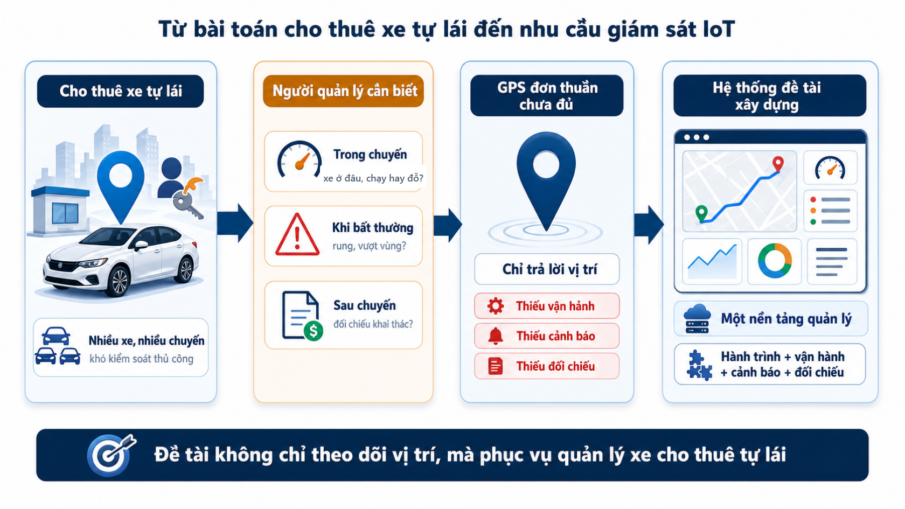

**File nguồn chỉnh sửa được:** `../../thesis-chapters/assets/slide-bao-ve-do-an/generated-slide-03-car-rental-context-ai-v5-corrected.svg`

**Dòng kết luận (đậm, dưới cùng):**
> **Đề tài tập trung:** Liên kết dữ liệu hành trình, dữ liệu vận hành và thông tin cảnh báo trong cùng một hệ thống

**📌 Nội dung điền vào template PowerPoint**

> Template PowerPoint có 2 vùng tiêu đề: **đầu mục lớn** ở trên cùng (placeholder `toc_section_title`) và **tiêu đề slide** ngay dưới (placeholder `slide_main_content_label`). Body slide (bullet, bảng, hình) thêm thủ công vào vùng trống bên dưới.

```text
[Đầu mục lớn — toc_section_title]
1. TỔNG QUAN

[Tiêu đề slide — slide_main_content_label]
BỐI CẢNH & ĐẶT VẤN ĐỀ
```

---
---

## SLIDE 4 – DIVIDER PHẦN 2: PHÂN TÍCH VẤN ĐỀ KỸ THUẬT

**Bố cục:** Slide chuyển phần – nền màu Phenikaa đậm, tiêu đề lớn căn giữa, danh sách nội dung bên dưới

**Tiêu đề lớn:** `PHẦN 2. PHÂN TÍCH VẤN ĐỀ KỸ THUẬT`

**Nội dung preview:**
- Các vấn đề kỹ thuật cần giải quyết
- Khảo sát thiết bị trên thị trường
- So sánh các hướng triển khai
- Yêu cầu từ các bên liên quan
- Chỉ tiêu và ràng buộc thiết kế

**Lưu ý:** Slide này chỉ chuyển phần, không có matrix hay bảng số liệu. Trình bày ~5 giây.

**📌 Nội dung điền vào template PowerPoint**

> Template PowerPoint có 2 vùng tiêu đề: **đầu mục lớn** ở trên cùng (placeholder `toc_section_title`) và **tiêu đề slide** ngay dưới (placeholder `slide_main_content_label`). Body slide (bullet, bảng, hình) thêm thủ công vào vùng trống bên dưới.

```text
[Đầu mục lớn — toc_section_title]
2. PHÂN TÍCH VẤN ĐỀ KỸ THUẬT

[Tiêu đề slide — slide_main_content_label]
PHẦN 2. PHÂN TÍCH VẤN ĐỀ KỸ THUẬT
```

---
---

## SLIDE 5 – CÁC VẤN ĐỀ KỸ THUẬT CẦN GIẢI QUYẾT

**Bố cục:** Tiêu đề trên, 5 hàng dạng card ngang (mỗi card 1 vấn đề: số thứ tự + tên nhóm + thách thức ngắn)

**Tiêu đề:** `CÁC VẤN ĐỀ KỸ THUẬT CẦN GIẢI QUYẾT`

**Nội dung – 5 card ngang xếp dọc (theo Bảng 2.1):**

**Card 1 – Theo dõi hành trình và trạng thái xe**
- *Thách thức:* Duy trì dữ liệu vị trí và trạng thái xe liên tục trong quá trình di chuyển
- *Mô tả ngắn:* Cập nhật hành trình đủ ổn định, không đứt quãng khi điều kiện vận hành thay đổi

**Card 2 – Thu dữ liệu vận hành cơ bản**
- *Thách thức:* Lấy được dữ liệu cần thiết nhưng không làm ảnh hưởng đến xe
- *Mô tả ngắn:* Mức can thiệp thấp, không tác động ECU, phù hợp cho lắp đặt trên nhiều dòng xe

**Card 3 – Phát hiện bất thường và cảnh báo khai thác**
- *Thách thức:* Nhận biết sự kiện cần chú ý lúc xe chạy hoặc khi xe đỗ
- *Mô tả ngắn:* Đủ nhạy phát hiện rung, dịch chuyển bất thường; hạn chế cảnh báo giả

**Card 4 – Quản lý năng lượng trên xe**
- *Thách thức:* Hoạt động bền trên nguồn ắc quy nhưng không gây hao điện quá mức
- *Mô tả ngắn:* Duy trì giám sát mà không ảnh hưởng đến khả năng khởi động khi xe đỗ lâu

**Card 5 – Tổng hợp và khai thác dữ liệu**
- *Thách thức:* Đưa toàn bộ thông tin về cùng một nền tảng để theo dõi và đối chiếu
- *Mô tả ngắn:* Hành trình + vận hành + cảnh báo gom về cùng tuyến xử lý, dễ theo dõi và tra cứu

**Cách thể hiện mỗi card:**
- Số thứ tự lớn (1–5) bên trái, tên nhóm vấn đề in đậm bên cạnh
- Thách thức và mô tả viết ngắn, font nhỏ hơn
- Card có viền nhẹ hoặc nền xám rất nhạt
- 5 card xếp dọc, đều cao

**Lưu ý dẫn dắt:**
- Đây là 5 vấn đề mà phần "Giải pháp thiết kế" sẽ lần lượt giải quyết
- Có thể đánh số 1–5 đồng nhất với 5 nhóm này xuyên suốt slide tiếp theo

**📌 Nội dung điền vào template PowerPoint**

> Template PowerPoint có 2 vùng tiêu đề: **đầu mục lớn** ở trên cùng (placeholder `toc_section_title`) và **tiêu đề slide** ngay dưới (placeholder `slide_main_content_label`). Body slide (bullet, bảng, hình) thêm thủ công vào vùng trống bên dưới.

```text
[Đầu mục lớn — toc_section_title]
2. PHÂN TÍCH VẤN ĐỀ KỸ THUẬT

[Tiêu đề slide — slide_main_content_label]
CÁC VẤN ĐỀ KỸ THUẬT CẦN GIẢI QUYẾT
```

---
---

## SLIDE 6 – KHẢO SÁT THIẾT BỊ TRÊN THỊ TRƯỜNG

**Bố cục:** Tiêu đề trên, 3 card xếp ngang chiếm toàn slide (mỗi card 1 thiết bị, có ảnh + tag + 1 dòng nhận xét)

**Tiêu đề:** `KHẢO SÁT THIẾT BỊ TRÊN THỊ TRƯỜNG`

**3 Card (xếp ngang):**

**Card 1 – Teltonika FMC920 (Lithuania)**
- Ảnh thiết bị (lớn, chiếm ~50% chiều cao card)
- Tag/badge: `4G LTE Cat 1` `Định vị`
- Đặc điểm: Thiết bị định vị thương mại, nhỏ gọn
- Nhận xét (đậm, nền vàng nhạt): *Chưa khai thác OBD-II*

**Card 2 – OBD Vcar (Viettel, Việt Nam)**
- Ảnh thiết bị
- Tag/badge: `OBD-II` `Wi-Fi` `~2tr VND`
- Đặc điểm: Cắm trực tiếp cổng OBD-II, kèm gói dịch vụ hằng tháng
- Nhận xét (đậm, nền vàng nhạt): *Phụ thuộc nền tảng nhà cung cấp*

**Card 3 – Queclink GV305CEU (Trung Quốc)**
- Ảnh thiết bị
- Tag/badge: `LTE` `GNSS` `BLE 5.2` `Nhiều I/O`
- Đặc điểm: Gateway telematics đầy đủ tính năng
- Nhận xét (đậm, nền vàng nhạt): *Chi phí cao, vượt nhu cầu nguyên mẫu*

**Dòng kết luận (dưới cùng, đậm, full width):**
> Mỗi phương án tối ưu cho 1 mục tiêu riêng → chưa có thiết bị nào vừa khai thác OBD-II, vừa tự chủ quản lý, vừa phù hợp đội xe nhỏ và vừa

**Lưu ý thiết kế:**
- Không dùng bảng nhiều cột nhiều dòng → khó đọc trên slide
- Mỗi card dùng layout dọc: ảnh → tên → tag → 1 câu mô tả → 1 câu nhận xét
- Tag/badge dùng màu nhẹ (xanh nhạt cho tính năng, đỏ/cam nhạt cho hạn chế)
- Ảnh thiết bị: lấy ảnh thật từ datasheet/website chính hãng (uy tín hơn ảnh AI)

**📌 Nội dung điền vào template PowerPoint**

> Template PowerPoint có 2 vùng tiêu đề: **đầu mục lớn** ở trên cùng (placeholder `toc_section_title`) và **tiêu đề slide** ngay dưới (placeholder `slide_main_content_label`). Body slide (bullet, bảng, hình) thêm thủ công vào vùng trống bên dưới.

```text
[Đầu mục lớn — toc_section_title]
2. PHÂN TÍCH VẤN ĐỀ KỸ THUẬT

[Tiêu đề slide — slide_main_content_label]
KHẢO SÁT THIẾT BỊ TRÊN THỊ TRƯỜNG
```

---
---

## SLIDE 7 – SO SÁNH CÁC HƯỚNG TRIỂN KHAI

**Bố cục:** Tiêu đề trên, biểu đồ định vị 2 trục (quadrant chart) chiếm gần toàn slide, dòng kết luận dưới cùng

**Tiêu đề:** `SO SÁNH CÁC HƯỚNG TRIỂN KHAI`

**Phần chính – Quadrant chart 2 trục:**
- **Trục X (ngang):** Mức độ tự chủ & khả năng tùy biến (Thấp → Cao)
- **Trục Y (dọc):** Phạm vi dữ liệu khai thác (Hẹp → Rộng)

**Vị trí 4 phương án trên biểu đồ:**

```
  Phạm vi
   dữ liệu
   khai thác
     ▲
     │
 Rộng│   ┌─────────────────┐         ┌────────────────────┐
     │   │ Nền tảng        │         │ ★ HỆ THỐNG GIÁM    │
     │   │ thương mại      │         │   SÁT XE CHO THUÊ  │
     │   │                 │         │   TỰ LÁI           │
     │   └─────────────────┘         └────────────────────┘
     │
     │   ┌─────────────────┐         ┌────────────────────┐
     │   │ Định vị cơ bản  │         │ Định vị + OBD-II   │
     │   │                 │         │                    │
 Hẹp │   └─────────────────┘         └────────────────────┘
     │
     └────────────────────────────────────────────────────►
       Thấp                                            Cao
              Tự chủ & khả năng tùy biến
```

**Cách thể hiện:**
- 4 phương án là 4 bubble nằm ở 4 góc phần tư, chỉ ghi tên (không thêm mô tả)
- Phương án được chọn (Hệ thống giám sát xe cho thuê tự lái) ở góc trên-phải, dùng màu nổi (xanh đậm Phenikaa), có ngôi sao ★ và viền dày
- 3 phương án còn lại dùng màu xám/nhạt

**Dòng kết luận (dưới cùng, full width, đậm):**
> Đề xuất xây dựng **hệ thống giám sát chuyên cho xe cho thuê tự lái** – đáp ứng cả phạm vi dữ liệu, mức tự chủ và bài toán chi phí cho đội xe nhỏ–vừa

---

**Speaker notes (không xuất hiện trên slide, chỉ để nói):**

*"Em đánh giá theo 4 tiêu chí kỹ thuật: dữ liệu, lắp đặt, hoàn chỉnh hệ thống và chi phí, rút gọn vào 2 trục chính trên biểu đồ.*

*Định vị cơ bản nằm ở góc dưới – không đọc được OBD-II nên không phát hiện được trạng thái khi xe tắt máy, đó là khoảng trống quan trọng với xe cho thuê.*

*Định vị + OBD-II khá hơn nhưng dữ liệu chưa đủ sâu, khó tập trung quản lý nhiều xe và khó tùy biến giao diện theo nhu cầu khai thác.*

*Nền tảng thương mại có dữ liệu đầy đủ nhưng chi phí thuê bao cao, khó điều chỉnh cho nhu cầu đối chiếu nội bộ – mà đây là nhu cầu rất riêng của ngành cho thuê tự lái.*

*Vì vậy với đội xe quy mô nhỏ và vừa, đồ án đề xuất xây dựng một hệ thống giám sát chuyên cho xe cho thuê tự lái – cho phép kiểm soát toàn tuyến từ thiết bị đến giao diện, chọn đúng phạm vi dữ liệu, đúng cách bố trí giao diện và đúng mức chi phí."*

---

**Lưu ý thiết kế:**
- Slide chỉ có biểu đồ + 1 dòng kết luận → hội đồng tập trung nhìn biểu đồ, nghe người trình bày diễn giải
- Lý do chi tiết để nói, không in lên slide
- Quadrant chart giúp hội đồng thấy ngay phương án nào "thắng" trên cả 2 tiêu chí

**Prompt AI tạo ảnh quadrant chart:**

```
A clean, minimalist 2x2 quadrant chart for an engineering thesis presentation slide, 16:9 aspect ratio, white background.

Horizontal axis labeled "Mức độ tự chủ & tùy biến" from "Thấp" on the left to "Cao" on the right.
Vertical axis labeled "Phạm vi dữ liệu khai thác" from "Hẹp" at the bottom to "Rộng" at the top.

Four labeled bubbles in four quadrants:
- Bottom-left: "Định vị cơ bản" – small gray bubble with GPS pin icon
- Bottom-right: "Định vị + OBD-II" – small gray bubble with car diagnostic icon
- Top-left: "Nền tảng thương mại" – medium gray bubble with cloud icon
- Top-right: "HỆ THỐNG GIÁM SÁT XE CHO THUÊ TỰ LÁI" – large highlighted bubble with star icon, vibrant blue (#1a5276), bold white text, glowing outline

Modern flat design, professional engineering style, subtle grid lines, soft shadows, suitable for academic thesis defense slide.
```

**Ảnh đã tạo từ prompt:**
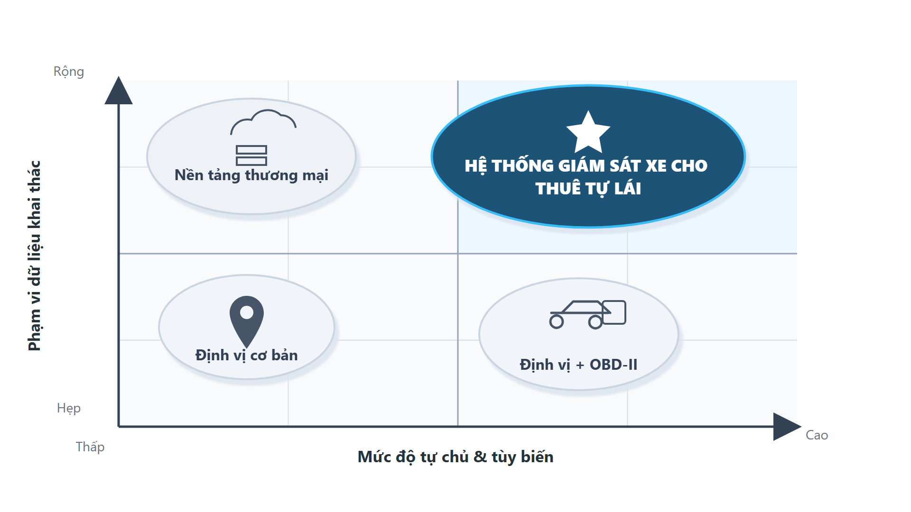

**File nguồn chỉnh sửa được:** `../../thesis-chapters/assets/slide-bao-ve-do-an/generated-slide-06-quadrant-chart.svg`

**Phương án không cần AI:**
- Vẽ trực tiếp trong PowerPoint: 4 hình chữ nhật bo góc + 2 đường thẳng làm trục → kiểm soát text 100%, chắc chắn đúng tiếng Việt (5–10 phút)
- Hoặc dùng template "Matrix 2×2" có sẵn trong SlidesGo / Canva

**📌 Nội dung điền vào template PowerPoint**

> Template PowerPoint có 2 vùng tiêu đề: **đầu mục lớn** ở trên cùng (placeholder `toc_section_title`) và **tiêu đề slide** ngay dưới (placeholder `slide_main_content_label`). Body slide (bullet, bảng, hình) thêm thủ công vào vùng trống bên dưới.

```text
[Đầu mục lớn — toc_section_title]
2. PHÂN TÍCH VẤN ĐỀ KỸ THUẬT

[Tiêu đề slide — slide_main_content_label]
SO SÁNH CÁC HƯỚNG TRIỂN KHAI
```

---
---

## SLIDE 8 – YÊU CẦU TỪ CÁC BÊN LIÊN QUAN

**Bố cục:** Tiêu đề trên, 4 card xếp 2×2 (mỗi card 1 bên liên quan với icon)

**Tiêu đề:** `YÊU CẦU TỪ CÁC BÊN LIÊN QUAN`

**Nội dung – 4 card (theo Bảng 2.6):**

**Card 1 (trái trên) – Đơn vị quản lý đội xe** *(icon: tòa nhà/quản lý)*
- *Nhu cầu:* Theo dõi vị trí, hành trình, cảnh báo và dữ liệu vận hành xe trên cùng một hệ thống
- *Ảnh hưởng tới thiết kế:* Giao diện ưu tiên bản đồ quản lý, trạng thái, cảnh báo và lịch sử chuyến đi

**Card 2 (phải trên) – Người phụ trách kỹ thuật** *(icon: cờ-lê/kỹ thuật)*
- *Nhu cầu:* Biết thiết bị nào online/offline, lỗi nguồn, lỗi mạng hoặc thiếu dữ liệu
- *Ảnh hưởng tới thiết kế:* Phải có lớp giám sát kỹ thuật tách khỏi lớp vận hành thường ngày

**Card 3 (trái dưới) – Đội lắp đặt/bảo trì** *(icon: tua-vít)*
- *Nhu cầu:* Lắp nhanh, ít xâm lấn, dễ thay xe và dễ khoanh vùng lỗi
- *Ảnh hưởng tới thiết kế:* Kết cấu phải gọn, kết nối rõ ràng, thao tác tháo lắp lặp lại được

**Card 4 (phải dưới) – Người lái hoặc người thuê xe** *(icon: vô-lăng/người dùng)*
- *Nhu cầu:* Thiết bị không ảnh hưởng tới vận hành xe và không thu thập vượt nhu cầu quản lý
- *Ảnh hưởng tới thiết kế:* Chức năng giám sát phải tách khỏi mọi hành vi điều khiển phương tiện

**Lưu ý dẫn dắt:**
- Slide này gom lại các nhu cầu thực tế của từng bên liên quan
- Mỗi yêu cầu kéo theo một định hướng thiết kế cụ thể → tạo cơ sở rõ ràng để chốt chỉ tiêu thiết kế ở slide tiếp theo

**📌 Nội dung điền vào template PowerPoint**

> Template PowerPoint có 2 vùng tiêu đề: **đầu mục lớn** ở trên cùng (placeholder `toc_section_title`) và **tiêu đề slide** ngay dưới (placeholder `slide_main_content_label`). Body slide (bullet, bảng, hình) thêm thủ công vào vùng trống bên dưới.

```text
[Đầu mục lớn — toc_section_title]
2. PHÂN TÍCH VẤN ĐỀ KỸ THUẬT

[Tiêu đề slide — slide_main_content_label]
YÊU CẦU TỪ CÁC BÊN LIÊN QUAN
```

---
---

## SLIDE 9 – CHỈ TIÊU & RÀNG BUỘC THIẾT KẾ

**Bố cục:** Tiêu đề trên, chia 2 cột: trái là Chỉ tiêu thiết kế (Bảng 2.4), phải là Ràng buộc thiết kế (Bảng 2.5)

**Tiêu đề:** `CHỈ TIÊU & RÀNG BUỘC THIẾT KẾ`

**Câu dẫn (in nhỏ, dưới tiêu đề):** *Tổng hợp từ các vấn đề kỹ thuật, hướng triển khai đã chọn và yêu cầu các bên liên quan*

**Cột trái – Chỉ tiêu thiết kế (Bảng 2.4):**

| Yếu tố | Yêu cầu / giá trị |
|---|---|
| Nguồn cấp | 12–24 VDC |
| MCU điều khiển | Vi điều khiển họ ESP |
| Giao tiếp với xe | Chuẩn OBD-II |
| Tham số quản lý | Tọa độ GPS, tốc độ hoạt động |
| Tính năng chính | Quãng đường, thời gian sử dụng, ước tính chi phí; cảnh báo hệ thống |

**Cột phải – Ràng buộc thiết kế (Bảng 2.5):**

| Loại ràng buộc | Thông tin |
|---|---|
| Tài chính | Tổng chi phí ≤ 20.000.000 VND (gồm máy chủ, tên miền) |
| Điều kiện kiểm chứng | Phòng thí nghiệm và xe thử nghiệm |
| Khả năng gia công | Mạch PCB, vỏ in 3D |
| Tiêu chuẩn áp dụng | IPC-2221, IEC 60664-1 |

**Lưu ý:**
- Slide này khép Chương 2, đóng vai trò "chốt lại" trước khi sang Chương 3
- Cột trái = "phải làm gì", cột phải = "trong giới hạn nào"
- Có thể nói: *"Từ các chỉ tiêu và ràng buộc trên, hệ thống được thiết kế theo nguyên lý hoạt động sau..."* trước khi sang slide 9

**📌 Nội dung điền vào template PowerPoint**

> Template PowerPoint có 2 vùng tiêu đề: **đầu mục lớn** ở trên cùng (placeholder `toc_section_title`) và **tiêu đề slide** ngay dưới (placeholder `slide_main_content_label`). Body slide (bullet, bảng, hình) thêm thủ công vào vùng trống bên dưới.

```text
[Đầu mục lớn — toc_section_title]
2. PHÂN TÍCH VẤN ĐỀ KỸ THUẬT

[Tiêu đề slide — slide_main_content_label]
CHỈ TIÊU & RÀNG BUỘC THIẾT KẾ
```

---
---

## SLIDE 10 – DIVIDER PHẦN 3: CÁC GIẢI PHÁP THIẾT KẾ

**Bố cục:** Slide chuyển phần – nền màu Phenikaa đậm, tiêu đề lớn căn giữa, danh sách nội dung bên dưới

**Tiêu đề lớn:** `PHẦN 3. CÁC GIẢI PHÁP THIẾT KẾ`

**Nội dung preview:**
- Nguyên lý hoạt động của hệ thống
- Ràng buộc kỹ thuật chi phối phương án
- 7 lựa chọn thiết kế (OBD-II, giám sát đỗ, truyền dữ liệu, MCU, firmware, MQTT, máy chủ)
- Kiến trúc tổng thể được chọn

**Lưu ý:** Slide này chỉ chuyển phần, không có matrix hay bảng số liệu. Trình bày ~5 giây.

**📌 Nội dung điền vào template PowerPoint**

> Template PowerPoint có 2 vùng tiêu đề: **đầu mục lớn** ở trên cùng (placeholder `toc_section_title`) và **tiêu đề slide** ngay dưới (placeholder `slide_main_content_label`). Body slide (bullet, bảng, hình) thêm thủ công vào vùng trống bên dưới.

```text
[Đầu mục lớn — toc_section_title]
3. CÁC GIẢI PHÁP THIẾT KẾ

[Tiêu đề slide — slide_main_content_label]
PHẦN 3. CÁC GIẢI PHÁP THIẾT KẾ
```

---
---

## SLIDE 11 – NGUYÊN LÝ HOẠT ĐỘNG

**Bố cục:** Tiêu đề trên, sơ đồ 5 bước nằm ngang chiếm toàn slide (dạng flow/pipeline)

**Tiêu đề:** `NGUYÊN LÝ HOẠT ĐỘNG`

**Nội dung – Sơ đồ 5 bước (vẽ dạng mũi tên nối tiếp, mỗi bước 1 ô):**

```
[1. Ghi nhận       [2. Thu nhận &      [3. Gửi bản tin    [4. Xử lý tại     [5. Biểu diễn
 trạng thái xe]  →  xử lý tại         →  về máy chủ]    →  máy chủ]       →  thông tin
                     thiết bị]                                                 quản lý]
```

**Mô tả ngắn dưới mỗi ô:**
1. Vị trí + vận hành + chuyển động
2. GNSS + OBD-II + IMU → ghép bản tin
3. 4G/LTE, MQTT TLS, theo chu kỳ hoặc sự kiện
4. Chuẩn hóa, lưu trữ, phát hiện cảnh báo
5. Bản đồ, trạng thái, lịch sử, cảnh báo

*(Dùng Hình 3.1 trong báo cáo hoặc vẽ lại dạng infographic)*

**Ảnh đã trích từ báo cáo:**
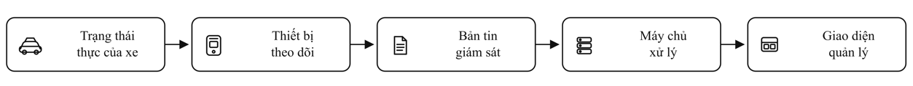

**Prompt AI tạo ảnh sơ đồ pipeline 5 bước:**

```
A clean, minimalist horizontal pipeline flow diagram for an engineering thesis presentation slide, 16:9 aspect ratio, white background.

Five sequential rounded-rectangle boxes connected by right-pointing arrows, evenly distributed from left to right:

Box 1: Car icon at top, label "1. Ghi nhận trạng thái xe", caption "Vị trí + vận hành + chuyển động" (light gray fill)

Box 2: Microcontroller chip icon at top, label "2. Thu nhận & xử lý tại thiết bị", caption "GNSS + OBD-II + IMU → ghép bản tin" (light blue fill)

Box 3: Cellular signal/antenna icon at top, label "3. Gửi bản tin về máy chủ", caption "4G/LTE, MQTT TLS, theo chu kỳ hoặc sự kiện" (light blue fill)

Box 4: Server/cloud icon at top, label "4. Xử lý tại máy chủ", caption "Chuẩn hóa, lưu trữ, phát hiện cảnh báo" (light blue fill)

Box 5: Map/dashboard screen icon at top, label "5. Biểu diễn thông tin quản lý", caption "Bản đồ, trạng thái, lịch sử, cảnh báo" (Phenikaa blue #1a5276 fill, white text, glowing outline as final output)

Modern flat design, professional engineering style, soft shadows, subtle gradient on arrows, clear typography with Vietnamese diacritics rendered correctly, suitable for academic thesis defense slide.
```

**Ảnh đã tạo từ prompt:**
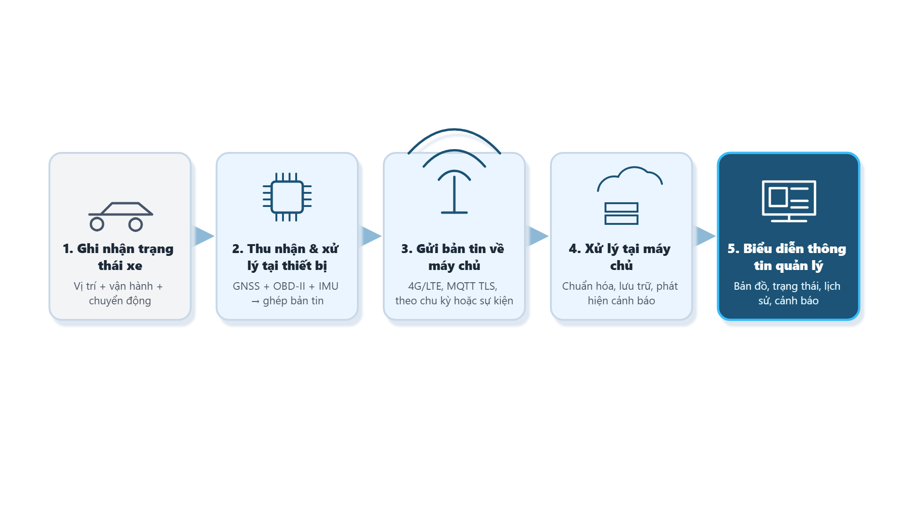

**File nguồn chỉnh sửa được:** `../../thesis-chapters/assets/slide-bao-ve-do-an/generated-slide-09-pipeline-flow.svg`

**Phương án không cần AI:**
- Vẽ trực tiếp trong PowerPoint dùng SmartArt "Process" → 5 bước, sửa text + icon
- Hoặc dùng Hình 3.1 đã trích sẵn từ báo cáo (có thể đẹp hơn về tính đồng bộ với báo cáo)

**📌 Nội dung điền vào template PowerPoint**

> Template PowerPoint có 2 vùng tiêu đề: **đầu mục lớn** ở trên cùng (placeholder `toc_section_title`) và **tiêu đề slide** ngay dưới (placeholder `slide_main_content_label`). Body slide (bullet, bảng, hình) thêm thủ công vào vùng trống bên dưới.

```text
[Đầu mục lớn — toc_section_title]
3. CÁC GIẢI PHÁP THIẾT KẾ

[Tiêu đề slide — slide_main_content_label]
NGUYÊN LÝ HOẠT ĐỘNG
```

---
---

## SLIDE 12 – RÀNG BUỘC KỸ THUẬT CHI PHỐI

**Bố cục:** Tiêu đề trên, 4 ô/card xếp 2×2 (mỗi ô 1 ràng buộc)

**Tiêu đề:** `RÀNG BUỘC KỸ THUẬT CHI PHỐI PHƯƠNG ÁN`

**Nội dung – 4 card:**

**Card 1 (trái trên) – icon thiết bị:**
- **Lớp thiết bị**
- Gọn, ít dây, dễ tháo lắp
- Không can thiệp ECU xe

**Card 2 (phải trên) – icon pin/năng lượng:**
- **Năng lượng**
- Không hao điện quá mức khi xe đỗ
- Vẫn phát hiện được rung/dịch chuyển

**Card 3 (trái dưới) – icon sóng/mạng:**
- **Tuyến truyền**
- Chấp nhận mất sóng cục bộ
- Có bộ nhớ đệm, phục hồi được

**Card 4 (phải dưới) – icon màn hình:**
- **Lớp khai thác**
- Giao diện gọn
- Chỉ hiển thị tín hiệu cần cho quyết định quản lý

**Ảnh tham khảo từ báo cáo nếu muốn thay 4 card bằng sơ đồ quan hệ:**
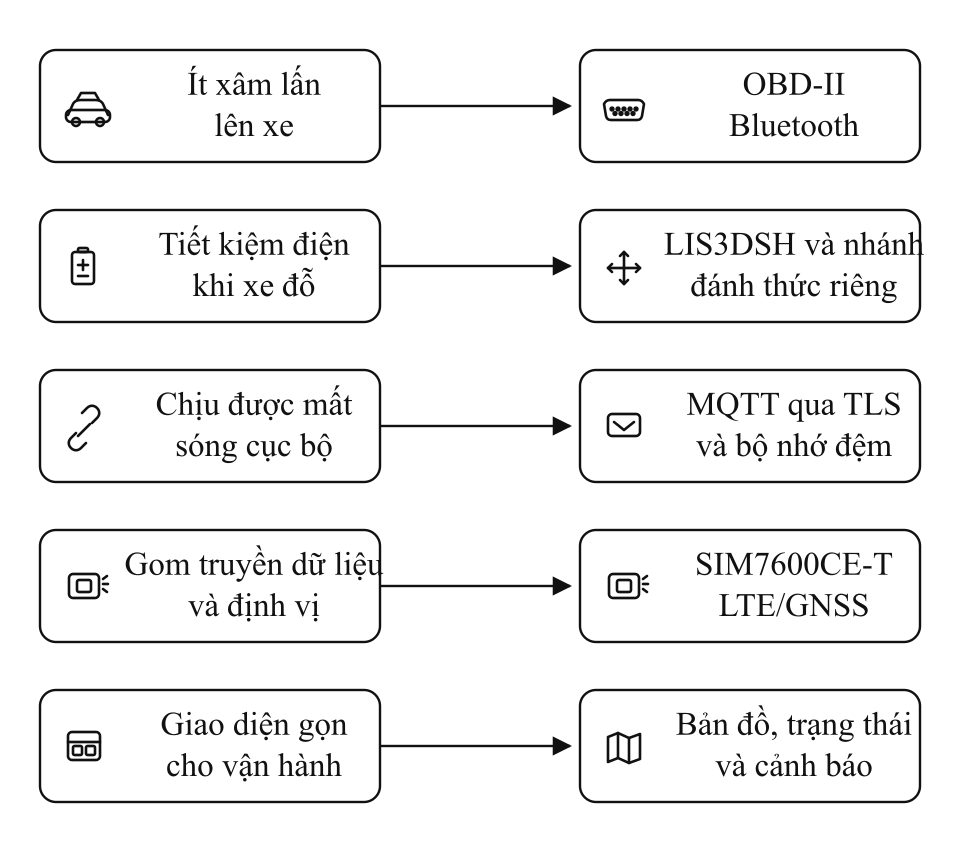

**📌 Nội dung điền vào template PowerPoint**

> Template PowerPoint có 2 vùng tiêu đề: **đầu mục lớn** ở trên cùng (placeholder `toc_section_title`) và **tiêu đề slide** ngay dưới (placeholder `slide_main_content_label`). Body slide (bullet, bảng, hình) thêm thủ công vào vùng trống bên dưới.

```text
[Đầu mục lớn — toc_section_title]
3. CÁC GIẢI PHÁP THIẾT KẾ

[Tiêu đề slide — slide_main_content_label]
RÀNG BUỘC KỸ THUẬT CHI PHỐI PHƯƠNG ÁN
```

---
---

## SLIDE 13 – LỰA CHỌN 1: THU DỮ LIỆU OBD-II

**Bố cục:** Tiêu đề trên, bảng ma trận đánh giá chiếm 60% slide, dưới là khối "Lý do chọn", góc phải có hình minh họa nhỏ

**Tiêu đề:** `LỰA CHỌN 1/7: THU DỮ LIỆU OBD-II`

**Phụ đề (nhỏ):** *Thu nhóm dữ liệu cơ bản phục vụ quản lý, không can thiệp sâu vào xe*

**Phần chính – Bảng ma trận đánh giá có trọng số:**

| Tiêu chí (trọng số) | ELM327 có dây | ★ vgate iCar Pro (BLE) |
|---|---|---|
| Hạn chế can thiệp hệ điện (35%) | 3 | **5** |
| Tương thích nhiều dòng xe (30%) | 3 | **5** |
| Thuận tiện tháo lắp (20%) | 2 | **5** |
| Đáp ứng tham số quản lý (15%) | 4 | 4 |
| **Tổng điểm quy đổi** | **3,00** | **4,85** ✓ |

*(Cột "vgate iCar Pro" highlight nền xanh đậm Phenikaa, có ngôi sao ★)*

**Lý do chọn vgate iCar Pro:**
- 🔌 **Ít xâm lấn hệ điện xe** – không cần đấu dây trực tiếp vào ECU
- 🚗 **Tương thích nhiều dòng xe** – chuẩn BLE phổ biến
- 🔧 **Dễ tháo lắp** – chuyển giữa nhiều xe trong đội thuận tiện

**Hình minh họa (góc phải hoặc dưới):**
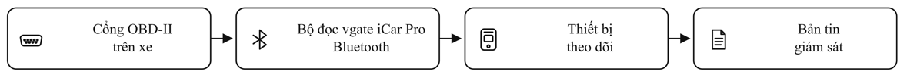

**📌 Nội dung điền vào template PowerPoint**

> Template PowerPoint có 2 vùng tiêu đề: **đầu mục lớn** ở trên cùng (placeholder `toc_section_title`) và **tiêu đề slide** ngay dưới (placeholder `slide_main_content_label`). Body slide (bullet, bảng, hình) thêm thủ công vào vùng trống bên dưới.

```text
[Đầu mục lớn — toc_section_title]
3. CÁC GIẢI PHÁP THIẾT KẾ

[Tiêu đề slide — slide_main_content_label]
LỰA CHỌN 1/7: THU DỮ LIỆU OBD-II
```

---
---

## SLIDE 14 – LỰA CHỌN 2: GIÁM SÁT KHI XE ĐỖ

**Bố cục:** Tiêu đề trên, bảng ma trận đánh giá chiếm 60% slide, dưới là khối "Lý do chọn", góc phải có hình

**Tiêu đề:** `LỰA CHỌN 2/7: GIÁM SÁT KHI XE ĐỖ`

**Phụ đề (nhỏ):** *Giữ khả năng phát hiện rung/dịch chuyển nhưng không hao điện ắc quy*

**Phần chính – Bảng ma trận đánh giá có trọng số:**

| Tiêu chí (trọng số) | SW-420 + cấp chung | MPU6050 + khóa điện | ★ LIS3DSH + nhánh đánh thức riêng |
|---|---|---|---|
| Tiêu thụ khi giữ giám sát lúc xe đỗ (35%) | 2 | 2 | **5** |
| Đánh thức khi MCU/modem ngủ sâu (25%) | 2 | 4 | **4** |
| Tách modem/GNSS/OBD-II khỏi nhánh luôn cấp (25%) | 1 | 2 | **5** |
| An toàn ắc quy + ổn định khi modem phát xung (15%) | 2 | 3 | **5** |
| **Tổng điểm quy đổi** | **1,75** | **2,65** | **4,75** ✓ |

*(Cột "LIS3DSH + nhánh đánh thức riêng" highlight nền xanh đậm, có ngôi sao ★)*

**Lý do chọn LIS3DSH + nhánh riêng:**
- ⚡ **Dòng tiêu thụ rất thấp** khi chỉ giữ chức năng giám sát
- 🔔 **Đánh thức được MCU** từ trạng thái ngủ sâu
- 🛡️ **Cô lập modem** khỏi nhánh luôn cấp – tránh xung dòng lớn ảnh hưởng nhánh giám sát

**Hình minh họa:**
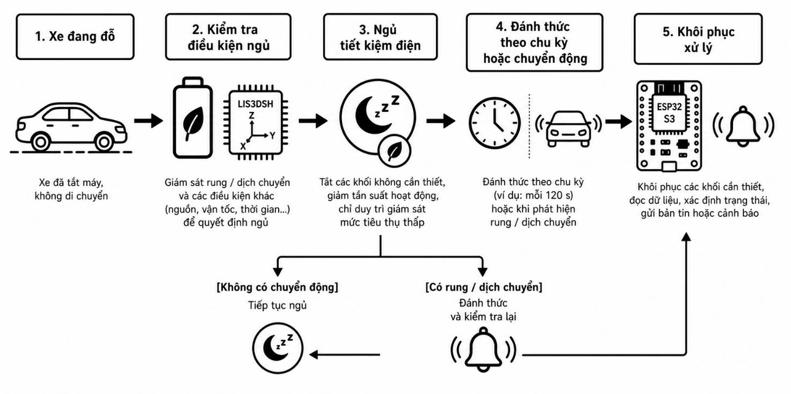

**📌 Nội dung điền vào template PowerPoint**

> Template PowerPoint có 2 vùng tiêu đề: **đầu mục lớn** ở trên cùng (placeholder `toc_section_title`) và **tiêu đề slide** ngay dưới (placeholder `slide_main_content_label`). Body slide (bullet, bảng, hình) thêm thủ công vào vùng trống bên dưới.

```text
[Đầu mục lớn — toc_section_title]
3. CÁC GIẢI PHÁP THIẾT KẾ

[Tiêu đề slide — slide_main_content_label]
LỰA CHỌN 2/7: GIÁM SÁT KHI XE ĐỖ
```

---
---

## SLIDE 15 – LỰA CHỌN 3: TRUYỀN DỮ LIỆU + ĐỊNH VỊ

**Bố cục:** Tiêu đề trên, bảng ma trận đánh giá chiếm 60% slide, dưới là khối "Lý do chọn", góc phải có hình

**Tiêu đề:** `LỰA CHỌN 3/7: TRUYỀN DỮ LIỆU + ĐỊNH VỊ`

**Phụ đề (nhỏ):** *Đưa bản tin từ xe về máy chủ qua mạng di động + lấy vị trí GNSS*

**Phần chính – Bảng ma trận đánh giá có trọng số:**

| Tiêu chí (trọng số) | EC200U + L76K | A7670C + ATGM336H | ★ SIM7600CE-T |
|---|---|---|---|
| Số khối phải khởi tạo và giám sát (30%) | 2 | 2 | **5** |
| Phức tạp nguồn, mạch RF, ăng ten (30%) | 3 | 3 | **5** |
| Giữ và khôi phục đường truyền/vị trí (25%) | 4 | 4 | **4** |
| Phù hợp không gian lắp + vỏ thiết bị (15%) | 3 | 3 | **5** |
| **Tổng điểm quy đổi** | **2,95** | **3,00** | **4,75** ✓ |

*(Cột "SIM7600CE-T" highlight nền xanh đậm, có ngôi sao ★)*

**Lý do chọn SIM7600CE-T:**
- 📦 **Gom 1 khối** – truyền dữ liệu và định vị về cùng một đường điều khiển
- 🔋 **Đơn giản nguồn và ăng ten** – ít linh kiện, ít vùng phát nhiễu
- 🎛️ **Giảm số khối phải khởi tạo** – đơn giản trình tự thiết bị

**Hình minh họa:**
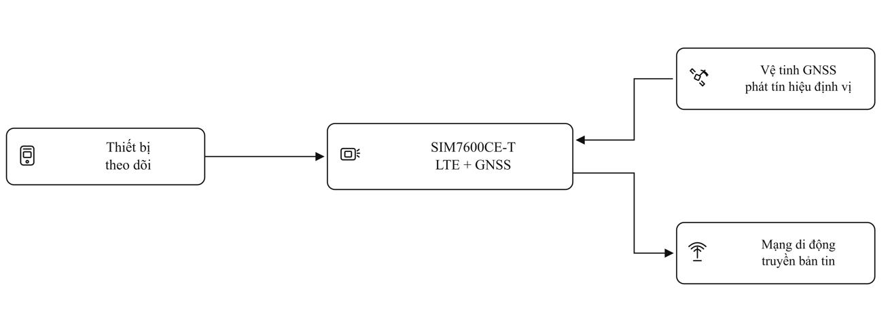

**📌 Nội dung điền vào template PowerPoint**

> Template PowerPoint có 2 vùng tiêu đề: **đầu mục lớn** ở trên cùng (placeholder `toc_section_title`) và **tiêu đề slide** ngay dưới (placeholder `slide_main_content_label`). Body slide (bullet, bảng, hình) thêm thủ công vào vùng trống bên dưới.

```text
[Đầu mục lớn — toc_section_title]
3. CÁC GIẢI PHÁP THIẾT KẾ

[Tiêu đề slide — slide_main_content_label]
LỰA CHỌN 3/7: TRUYỀN DỮ LIỆU + ĐỊNH VỊ
```

---
---

## SLIDE 16 – LỰA CHỌN 4: MCU TRUNG TÂM

**Bố cục:** Tiêu đề trên, bảng ma trận đánh giá chiếm 60% slide, dưới là khối "Lý do chọn", góc phải có hình

**Tiêu đề:** `LỰA CHỌN 4/7: MCU TRUNG TÂM`

**Phụ đề (nhỏ):** *Điều phối modem LTE/GNSS, BLE OBD-II, IMU, lưu đệm và cổng bảo trì*

**Phần chính – Bảng ma trận đánh giá có trọng số:**

| Tiêu chí (trọng số) | ★ ESP32-S3 | STM32L4 + Bluetooth rời | nRF52840 |
|---|---|---|---|
| Giữ đồng thời modem + BLE OBD-II + IMU + cổng bảo trì (35%) | **5** | 4 | 3 |
| Bộ nhớ và tài nguyên cho lưu đệm + nhật ký + OTA (25%) | **4** | 3 | 2 |
| Khả năng vào ngủ sâu và đánh thức ngoài (20%) | **4** | 5 | 4 |
| Mức phải ghép thêm chip vô tuyến + mạch phụ (20%) | **5** | 2 | 3 |
| **Tổng điểm quy đổi** | **4,55** ✓ | **3,55** | **2,95** |

*(Cột "ESP32-S3" highlight nền xanh đậm, có ngôi sao ★)*

**Lý do chọn ESP32-S3:**
- 🔗 **Đủ giao tiếp đồng thời** – modem, BLE, IMU, cổng bảo trì
- 💾 **Bộ nhớ và tài nguyên dư** cho lưu đệm bản tin, nhật ký lỗi và cập nhật firmware
- 📡 **BLE tích hợp** – không cần chip phụ trợ

**Hình minh họa:**
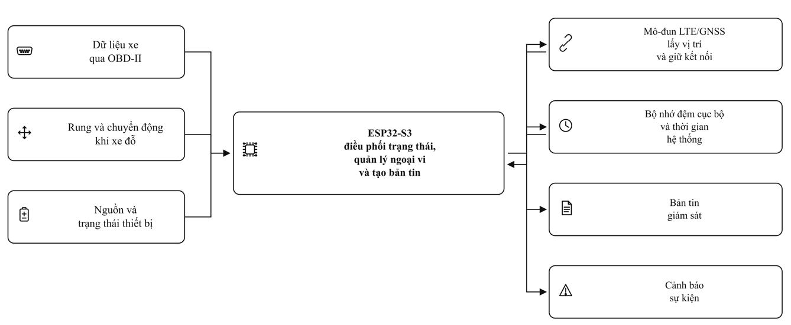

**📌 Nội dung điền vào template PowerPoint**

> Template PowerPoint có 2 vùng tiêu đề: **đầu mục lớn** ở trên cùng (placeholder `toc_section_title`) và **tiêu đề slide** ngay dưới (placeholder `slide_main_content_label`). Body slide (bullet, bảng, hình) thêm thủ công vào vùng trống bên dưới.

```text
[Đầu mục lớn — toc_section_title]
3. CÁC GIẢI PHÁP THIẾT KẾ

[Tiêu đề slide — slide_main_content_label]
LỰA CHỌN 4/7: MCU TRUNG TÂM
```

---
---

## SLIDE 17 – LỰA CHỌN 5: PHẦN MỀM NHÚNG

**Bố cục:** Tiêu đề trên, bảng ma trận đánh giá chiếm 60% slide, dưới là khối "Lý do chọn"

**Tiêu đề:** `LỰA CHỌN 5/7: PHẦN MỀM NHÚNG`

**Phụ đề (nhỏ):** *Tổ chức firmware đa tác vụ trên ESP32-S3 cho thiết bị nhiều nhánh chức năng*

**Phần chính – Bảng ma trận đánh giá có trọng số:**

| Tiêu chí (trọng số) | Arduino core trên ESP32 | ESP-IDF (vòng lặp chính) | ★ ESP-IDF + FreeRTOS |
|---|---|---|---|
| Tích hợp đồng thời modem + BLE OBD-II + lưu đệm + bảo trì (35%) | 3 | 4 | **5** |
| Kiểm soát tài nguyên, tác vụ nền và nhịp xử lý (25%) | 2 | 3 | **5** |
| Thuận lợi cho bảo trì, mở rộng firmware (25%) | 3 | 4 | **5** |
| Bám sát nền tảng chính thức Espressif (15%) | 2 | 5 | **5** |
| **Tổng điểm quy đổi** | **2,70** | **4,00** | **5,00** ✓ |

*(Cột "ESP-IDF + FreeRTOS" highlight nền xanh đậm, có ngôi sao ★)*

**Lý do chọn ESP-IDF + FreeRTOS:**
- 🧵 **Tổ chức tác vụ song song** – modem, BLE, lưu đệm và bảo trì có nhịp riêng
- ⚙️ **Kiểm soát tài nguyên** – CPU, RAM, ngủ/thức theo từng pha vận hành
- 📚 **Bám sát nền tảng chính thức Espressif** – ổn định khi mở rộng dài hạn

**📌 Nội dung điền vào template PowerPoint**

> Template PowerPoint có 2 vùng tiêu đề: **đầu mục lớn** ở trên cùng (placeholder `toc_section_title`) và **tiêu đề slide** ngay dưới (placeholder `slide_main_content_label`). Body slide (bullet, bảng, hình) thêm thủ công vào vùng trống bên dưới.

```text
[Đầu mục lớn — toc_section_title]
3. CÁC GIẢI PHÁP THIẾT KẾ

[Tiêu đề slide — slide_main_content_label]
LỰA CHỌN 5/7: PHẦN MỀM NHÚNG
```

---
---

## SLIDE 18 – LỰA CHỌN 6: GIAO THỨC TRUYỀN BẢN TIN

**Bố cục:** Tiêu đề trên, bảng ma trận đánh giá chiếm 60% slide, dưới là khối "Lý do chọn"

**Tiêu đề:** `LỰA CHỌN 6/7: GIAO THỨC TRUYỀN BẢN TIN`

**Phụ đề (nhỏ):** *Đưa bản tin nhỏ, gửi định kỳ hoặc theo sự kiện, qua mạng di động có thể gián đoạn*

**Phần chính – Bảng ma trận đánh giá có trọng số:**

| Tiêu chí (trọng số) | HTTPS/REST | WebSocket/TCP | ★ MQTT qua TLS |
|---|---|---|---|
| Phù hợp bản tin nhỏ, gửi định kỳ/sự kiện (30%) | 3 | 4 | **5** |
| Mức nhẹ cho thiết bị + modem (25%) | 3 | 3 | **5** |
| Phân tách dữ liệu vị trí/trạng thái/cảnh báo theo chủ đề (25%) | 2 | 3 | **5** |
| Thuận lợi gửi lại, gửi bù sau gián đoạn (20%) | 3 | 2 | **4** |
| **Tổng điểm quy đổi** | **2,75** | **3,10** | **4,80** ✓ |

*(Cột "MQTT qua TLS" highlight nền xanh đậm, có ngôi sao ★)*

**Lý do chọn MQTT qua TLS:**
- 📨 **Phù hợp bản tin nhỏ** – gửi định kỳ và theo sự kiện
- 🌐 **Nhẹ cho thiết bị và mạng di động** – tiêu thụ băng thông thấp
- 🗂️ **Phân tách theo chủ đề** – vị trí / trạng thái / cảnh báo riêng; gửi bù được sau gián đoạn

**📌 Nội dung điền vào template PowerPoint**

> Template PowerPoint có 2 vùng tiêu đề: **đầu mục lớn** ở trên cùng (placeholder `toc_section_title`) và **tiêu đề slide** ngay dưới (placeholder `slide_main_content_label`). Body slide (bullet, bảng, hình) thêm thủ công vào vùng trống bên dưới.

```text
[Đầu mục lớn — toc_section_title]
3. CÁC GIẢI PHÁP THIẾT KẾ

[Tiêu đề slide — slide_main_content_label]
LỰA CHỌN 6/7: GIAO THỨC TRUYỀN BẢN TIN
```

---
---

## SLIDE 19 – LỰA CHỌN 7: TỔ CHỨC MÁY CHỦ

**Bố cục:** Tiêu đề trên, bảng ma trận đánh giá chiếm 60% slide, dưới là khối "Lý do chọn"

**Tiêu đề:** `LỰA CHỌN 7/7: TỔ CHỨC MÁY CHỦ`

**Phụ đề (nhỏ):** *Cách phân chia trách nhiệm tiếp nhận, xử lý và lưu trữ dữ liệu phía máy chủ*

**Phần chính – Bảng ma trận đánh giá có trọng số:**

| Tiêu chí (trọng số) | Backend nhận và xử lý trực tiếp | Broker + Backend xử lý tập trung | ★ Broker + Lớp trung gian + Lưu trữ tách vai trò |
|---|---|---|---|
| Tách tuyến nhận bản tin khỏi nghiệp vụ và giao diện (30%) | 1 | 3 | **5** |
| Hấp thụ bản tin gửi dồn khi có lại kết nối (25%) | 2 | 3 | **5** |
| Tách dữ liệu nghiệp vụ / time-series / log (25%) | 2 | 3 | **5** |
| Phục vụ đồng thời real-time + tra cứu lịch sử (20%) | 3 | 4 | **4** |
| **Tổng điểm quy đổi** | **1,90** | **3,20** | **4,80** ✓ |

*(Cột "Broker + Lớp trung gian + Lưu trữ tách vai trò" highlight nền xanh đậm, có ngôi sao ★)*

**Lý do chọn Broker + Lớp trung gian + Lưu trữ tách vai trò:**
- 🔀 **Tách tuyến nhận bản tin khỏi nghiệp vụ** – không bị quá tải khi nhiều xe gửi cùng lúc
- 🌊 **Hấp thụ được bản tin gửi dồn** sau khi thiết bị có lại kết nối
- 🗄️ **Tách dữ liệu theo vai trò** – nghiệp vụ / time-series / log riêng, dễ mở rộng và khoanh vùng lỗi

**📌 Nội dung điền vào template PowerPoint**

> Template PowerPoint có 2 vùng tiêu đề: **đầu mục lớn** ở trên cùng (placeholder `toc_section_title`) và **tiêu đề slide** ngay dưới (placeholder `slide_main_content_label`). Body slide (bullet, bảng, hình) thêm thủ công vào vùng trống bên dưới.

```text
[Đầu mục lớn — toc_section_title]
3. CÁC GIẢI PHÁP THIẾT KẾ

[Tiêu đề slide — slide_main_content_label]
LỰA CHỌN 7/7: TỔ CHỨC MÁY CHỦ
```

---
---

## SLIDE 20 – KIẾN TRÚC TỔNG THỂ ĐƯỢC CHỌN

**Bố cục:** Tiêu đề trên, sơ đồ kiến trúc chiếm toàn slide (dạng block diagram 3 tầng)

**Tiêu đề:** `KIẾN TRÚC TỔNG THỂ HỆ THỐNG`

**Nội dung – Sơ đồ 3 tầng (vẽ lại từ Hình 3.6):**

```
┌─────────────────────────────────────────────────────────────────┐
│  THIẾT BỊ TRÊN XE                                               │
│  ESP32-S3 ↔ SIM7600CE-T (LTE+GNSS)                             │
│           ↔ vgate iCar Pro (OBD-II BLE)                         │
│           ↔ LIS3DSH (đánh thức) + DS3231M + MicroSD             │
│           ↔ Pin 18650 (dự phòng)                                │
└──────────────────────────┬──────────────────────────────────────┘
                           │ 4G/LTE – MQTT TLS
                           ▼
┌─────────────────────────────────────────────────────────────────┐
│  MÁY CHỦ                                                        │
│  EMQX Broker → MQTT Bridge → Backend API                        │
│                              → PostgreSQL | InfluxDB | Loki      │
└──────────────────────────┬──────────────────────────────────────┘
                           │ REST + WebSocket
                           ▼
┌─────────────────────────────────────────────────────────────────┐
│  GIAO DIỆN WEB – thingdock.dev                                   │
│  Bản đồ | Danh sách | Chi tiết | Cảnh báo                       │
└─────────────────────────────────────────────────────────────────┘
```

*(Sử dụng Hình 3.6 hoặc vẽ lại đẹp hơn)*

**Ảnh đã trích từ báo cáo:**
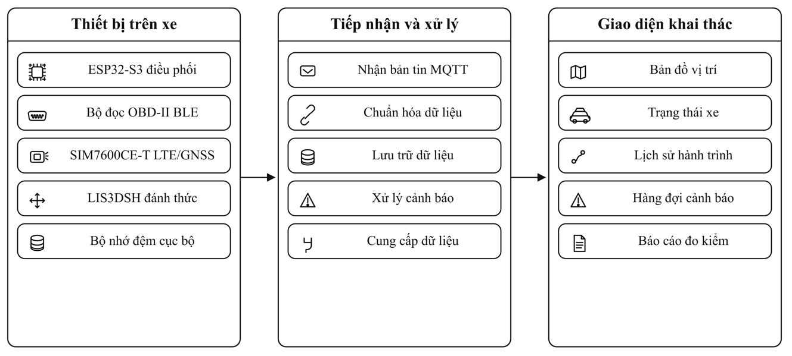

**📌 Nội dung điền vào template PowerPoint**

> Template PowerPoint có 2 vùng tiêu đề: **đầu mục lớn** ở trên cùng (placeholder `toc_section_title`) và **tiêu đề slide** ngay dưới (placeholder `slide_main_content_label`). Body slide (bullet, bảng, hình) thêm thủ công vào vùng trống bên dưới.

```text
[Đầu mục lớn — toc_section_title]
3. CÁC GIẢI PHÁP THIẾT KẾ

[Tiêu đề slide — slide_main_content_label]
KIẾN TRÚC TỔNG THỂ HỆ THỐNG
```

---
---

## SLIDE 21 – DIVIDER PHẦN 4: TRIỂN KHAI GIẢI PHÁP VÀ KẾT QUẢ

**Bố cục:** Slide chuyển phần – nền màu Phenikaa đậm, tiêu đề lớn căn giữa, danh sách nội dung bên dưới

**Tiêu đề lớn:** `PHẦN 4. TRIỂN KHAI GIẢI PHÁP VÀ KẾT QUẢ`

**Nội dung preview:**
- Triển khai phần cứng – sơ đồ khối, nguồn, PCB, nguyên mẫu
- Triển khai firmware – tổ chức tác vụ trên ESP-IDF + FreeRTOS
- Triển khai máy chủ – kiến trúc phân lớp với MQTT broker
- Triển khai giao diện quản lý
- Kết quả kiểm thử – năng lượng, firmware, hệ thống
- Đối chiếu với mục tiêu đồ án

**Lưu ý:** Slide này chỉ chuyển phần, không có matrix hay bảng số liệu. Trình bày ~5 giây.

**📌 Nội dung điền vào template PowerPoint**

> Template PowerPoint có 2 vùng tiêu đề: **đầu mục lớn** ở trên cùng (placeholder `toc_section_title`) và **tiêu đề slide** ngay dưới (placeholder `slide_main_content_label`). Body slide (bullet, bảng, hình) thêm thủ công vào vùng trống bên dưới.

```text
[Đầu mục lớn — toc_section_title]
4. TRIỂN KHAI GIẢI PHÁP VÀ KẾT QUẢ

[Tiêu đề slide — slide_main_content_label]
PHẦN 4. TRIỂN KHAI GIẢI PHÁP VÀ KẾT QUẢ
```

---
---

## SLIDE 22 – TRIỂN KHAI PHẦN CỨNG: SƠ ĐỒ KHỐI & NGUỒN

**Bố cục:** Tiêu đề trên, chia 2 phần: trái là sơ đồ khối thiết bị, phải là sơ đồ nguồn

**Tiêu đề:** `TRIỂN KHAI PHẦN CỨNG – SƠ ĐỒ KHỐI & NGUỒN`

**Phần trái – Sơ đồ khối (từ Hình 4.1):**
- ESP32-S3 ở trung tâm
- Các nhánh kết nối:
  - UART → SIM7600CE-T (4G + GNSS)
  - BLE → vgate iCar Pro (OBD-II)
  - SPI → LIS3DSH (chuyển động)
  - I2C → DS3231M (RTC)
  - SPI → MicroSD (lưu đệm)
  - GPIO → điều khiển nguồn các nhánh

**Phần phải – Sơ đồ nguồn chia nhánh (từ Hình 4.4):**
```
Xe 12–24V → MP2482 → Bus 5V
                        ├→ AP2112 → 3.3V (logic + cảm biến)
                        ├→ TPS54231 → ~4V (SIM7600CE-T riêng)
                        ├→ TP5100 → sạc pin 18650
                        └→ SX1308 ← pin 18650 → 5V dự phòng
```
- Khi xe đỗ: chỉ giữ 3.3V cho ESP32 + LIS3DSH → **0,5 mA**
- Mất nguồn xe: pin 18650 tự động tiếp quản

**Ảnh đã trích từ báo cáo:**

| Vị trí | Ảnh |
|---|---|
| Trái - sơ đồ khối | 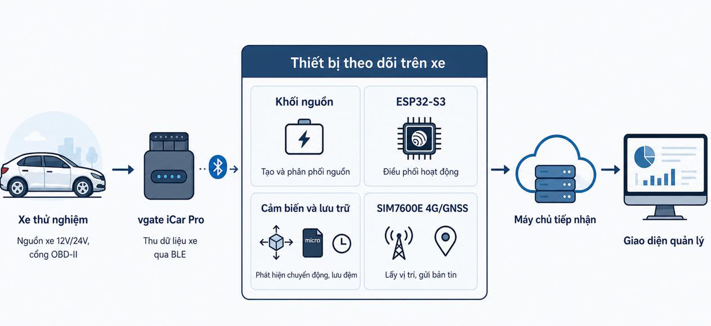 |
| Phải - sơ đồ nguồn | 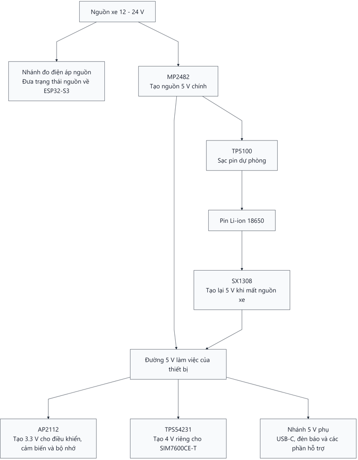 |

**📌 Nội dung điền vào template PowerPoint**

> Template PowerPoint có 2 vùng tiêu đề: **đầu mục lớn** ở trên cùng (placeholder `toc_section_title`) và **tiêu đề slide** ngay dưới (placeholder `slide_main_content_label`). Body slide (bullet, bảng, hình) thêm thủ công vào vùng trống bên dưới.

```text
[Đầu mục lớn — toc_section_title]
4. TRIỂN KHAI GIẢI PHÁP VÀ KẾT QUẢ

[Tiêu đề slide — slide_main_content_label]
TRIỂN KHAI PHẦN CỨNG – SƠ ĐỒ KHỐI & NGUỒN
```

---
---

## SLIDE 23 – TRIỂN KHAI PHẦN CỨNG: PCB & NGUYÊN MẪU

**Bố cục:** Tiêu đề trên, grid 2×2 hình ảnh chiếm toàn slide

**Tiêu đề:** `TRIỂN KHAI PHẦN CỨNG – PCB & NGUYÊN MẪU`

**Nội dung – 4 hình ảnh (mỗi hình có caption ngắn):**

| Vị trí | Hình | Caption |
|--------|------|---------|
| Trái trên | Hình 4.5 | Layout PCB mặt trước – Altium Designer |
| Phải trên | Hình 4.6 | Bo mạch sau hàn lắp linh kiện |
| Trái dưới | Hình 4.7 | Lắp trong vỏ ABS 100×100×45 mm |
| Phải dưới | Hình 4.8 | Thiết bị hoàn chỉnh đóng vỏ |

**Ảnh đã trích từ báo cáo:**

| Vị trí | Ảnh |
|---|---|
| Trái trên | 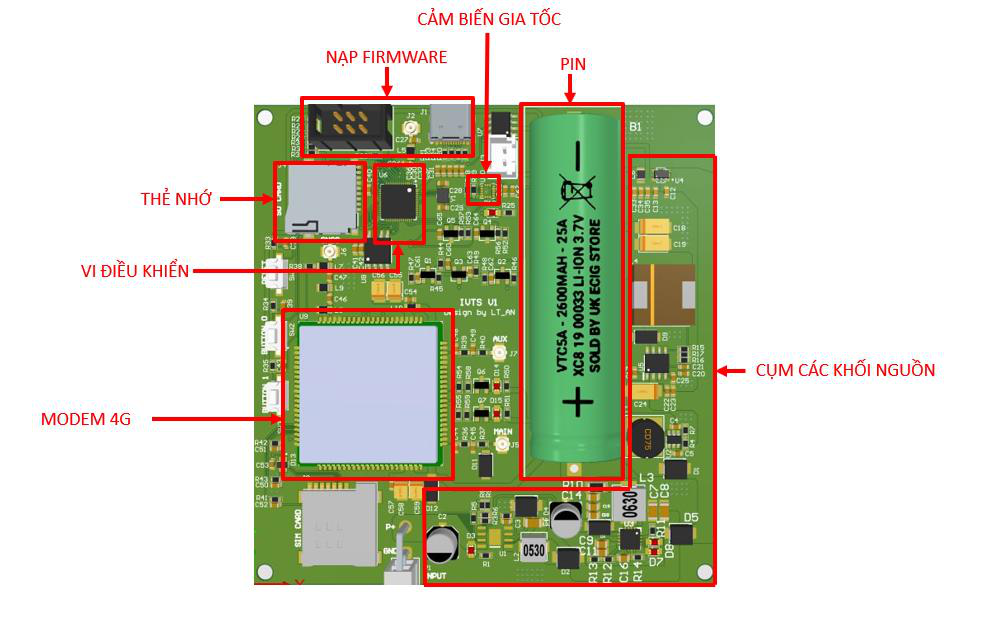 |
| Phải trên | 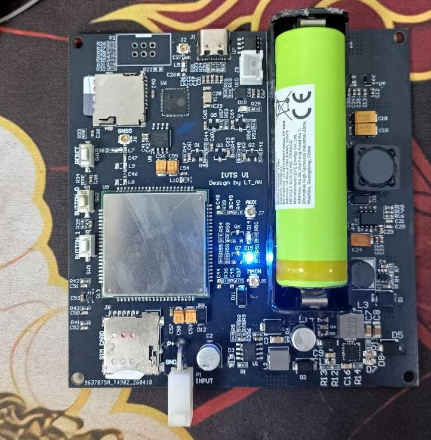 |
| Trái dưới | 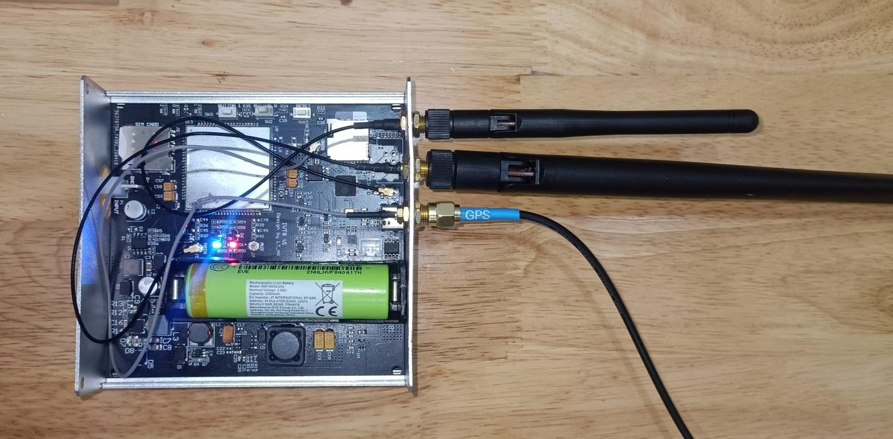 |
| Phải dưới | 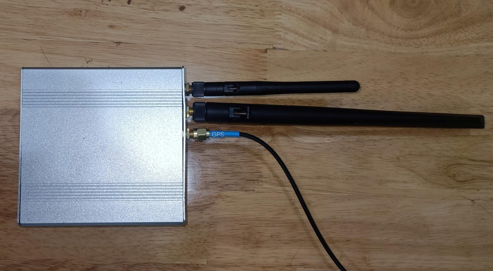 |

**Dòng ghi chú (nhỏ, dưới cùng):**
- PCB 2 lớp, tuân thủ IPC-2221 + IEC 60664-1
- Lắp trên xe: vgate cắm OBD-II, thiết bị đặt dưới táp-lô

**📌 Nội dung điền vào template PowerPoint**

> Template PowerPoint có 2 vùng tiêu đề: **đầu mục lớn** ở trên cùng (placeholder `toc_section_title`) và **tiêu đề slide** ngay dưới (placeholder `slide_main_content_label`). Body slide (bullet, bảng, hình) thêm thủ công vào vùng trống bên dưới.

```text
[Đầu mục lớn — toc_section_title]
4. TRIỂN KHAI GIẢI PHÁP VÀ KẾT QUẢ

[Tiêu đề slide — slide_main_content_label]
TRIỂN KHAI PHẦN CỨNG – PCB & NGUYÊN MẪU
```

---
---

## SLIDE 24 – TRIỂN KHAI FIRMWARE

**Bố cục:** Tiêu đề trên, trái là flowchart đơn giản, phải là bảng chức năng

**Tiêu đề:** `TRIỂN KHAI FIRMWARE – ESP-IDF + FreeRTOS`

**Phần trái – Flowchart tổ chức pha (đơn giản hóa từ Hình 4.9–4.11):**
```
        ┌──────────┐
        │ KHỞI ĐỘNG │
        └─────┬────┘
              ▼
      ┌── Xe chạy? ──┐
      │ CÓ           │ KHÔNG
      ▼               ▼
┌──────────┐    ┌──────────┐
│ THEO DÕI │    │ NGỦ SÂU  │
│ CHẠY     │    │ 120s     │
│ Gửi 1s   │    │ Thức 10s │
└──────────┘    └──────────┘
      │               │
      └───── Mất kết nối? ─→ Lưu SD, gửi bù sau
```

**Phần phải – Bảng chức năng:**

| Chức năng | Chi tiết |
|---|---|
| Thu dữ liệu | OBD-II + GNSS + IMU + nguồn → 1 bản tin |
| Gửi bản tin | MQTT TLS, đến 1s/lần khi chạy |
| Lưu đệm | SD ~2 triệu bản tin (~24 ngày) |
| Ngủ/thức | Thức 10s / ngủ 120s → TB 0,082 W |
| OTA | Dual partition, quay lui khi lỗi |

**Ảnh đã trích từ báo cáo:**

| Vai trò | Ảnh |
|---|---|
| Khởi động | 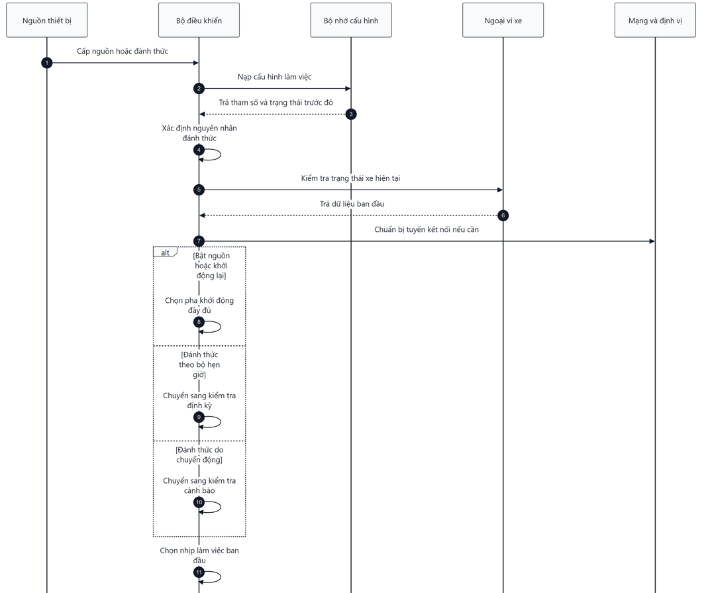 |
| Thu dữ liệu/gửi bản tin | 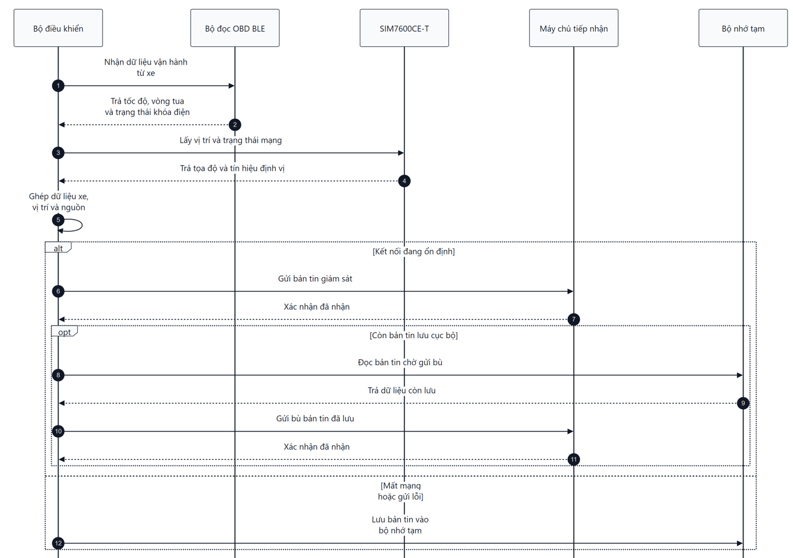 |
| Ngủ/thức khi xe đỗ | 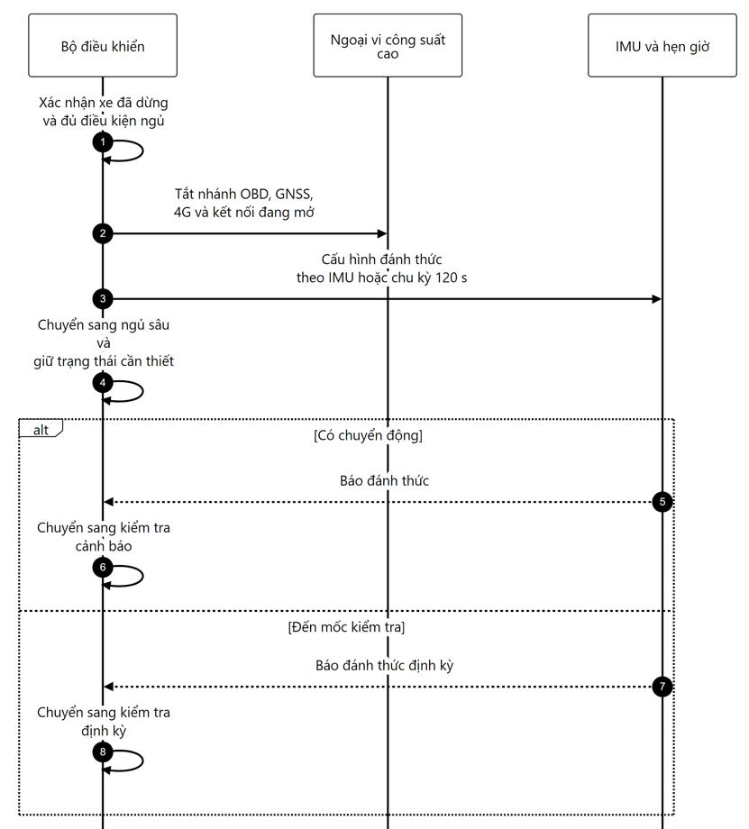 |

**📌 Nội dung điền vào template PowerPoint**

> Template PowerPoint có 2 vùng tiêu đề: **đầu mục lớn** ở trên cùng (placeholder `toc_section_title`) và **tiêu đề slide** ngay dưới (placeholder `slide_main_content_label`). Body slide (bullet, bảng, hình) thêm thủ công vào vùng trống bên dưới.

```text
[Đầu mục lớn — toc_section_title]
4. TRIỂN KHAI GIẢI PHÁP VÀ KẾT QUẢ

[Tiêu đề slide — slide_main_content_label]
TRIỂN KHAI FIRMWARE – ESP-IDF + FreeRTOS
```

---
---

## SLIDE 25 – TRIỂN KHAI MÁY CHỦ

**Bố cục:** Tiêu đề trên, sơ đồ kiến trúc dọc chiếm 2/3 slide, bên phải là ghi chú

**Tiêu đề:** `TRIỂN KHAI MÁY CHỦ – KIẾN TRÚC PHÂN LỚP`

**Phần chính – Sơ đồ (từ Hình 4.12):**
```
Thiết bị ──MQTT TLS──→ EMQX Broker (tiếp nhận)
                              │
                              ▼
                        MQTT Bridge (kiểm tra, phân luồng)
                              │
                    ┌─────────┼─────────┐
                    ▼         ▼         ▼
              PostgreSQL  InfluxDB    Loki
              (nghiệp vụ) (time-series) (log)
                    │
                    ▼
              Backend API
                    │
                    ▼
              Frontend Web
```

**Phần ghi chú bên phải (bullet nhỏ):**
- Docker + Docker Compose (đóng gói từng dịch vụ)
- CI/CD: GitHub Actions → Docker Hub → VPS
- Domain: thingdock.dev / api.thingdock.dev / mqtt.thingdock.dev
- Tách lớp → hấp thụ bản tin gửi dồn, dễ mở rộng

**Ảnh đã trích từ báo cáo:**

| Vai trò | Ảnh |
|---|---|
| Sơ đồ chính | 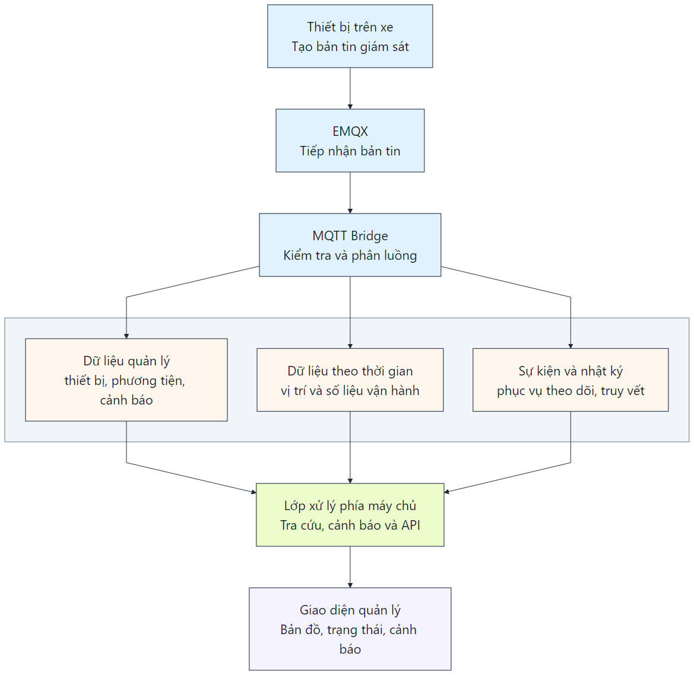 |
| Ảnh phụ/nhóm dịch vụ | 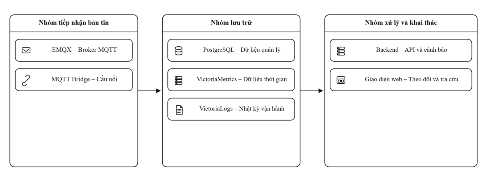 |

**📌 Nội dung điền vào template PowerPoint**

> Template PowerPoint có 2 vùng tiêu đề: **đầu mục lớn** ở trên cùng (placeholder `toc_section_title`) và **tiêu đề slide** ngay dưới (placeholder `slide_main_content_label`). Body slide (bullet, bảng, hình) thêm thủ công vào vùng trống bên dưới.

```text
[Đầu mục lớn — toc_section_title]
4. TRIỂN KHAI GIẢI PHÁP VÀ KẾT QUẢ

[Tiêu đề slide — slide_main_content_label]
TRIỂN KHAI MÁY CHỦ – KIẾN TRÚC PHÂN LỚP
```

---
---

## SLIDE 26 – TRIỂN KHAI GIAO DIỆN QUẢN LÝ

**Bố cục:** Tiêu đề trên, grid 2×2 screenshot giao diện

**Tiêu đề:** `TRIỂN KHAI GIAO DIỆN QUẢN LÝ – thingdock.dev`

**Nội dung – 4 screenshot (mỗi ảnh có caption):**

| Vị trí | Hình | Caption |
|--------|------|---------|
| Trái trên | Hình 4.15 | **Bản đồ theo dõi** – vị trí xe real-time, panel trạng thái |
| Phải trên | Hình 4.14 | **Danh sách thiết bị** – tổng quan đội xe, online/offline |
| Trái dưới | Hình 4.16 | **Chi tiết thiết bị** – telemetry, OBD data, kết nối |
| Phải dưới | Hình 4.17 | **Hàng đợi cảnh báo** – lọc, xác nhận, xử lý |

**Ảnh đã trích từ báo cáo:**

| Vị trí | Ảnh |
|---|---|
| Trái trên | 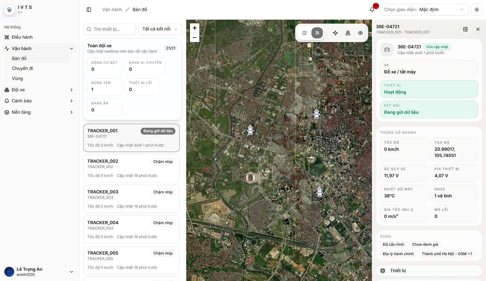 |
| Phải trên | 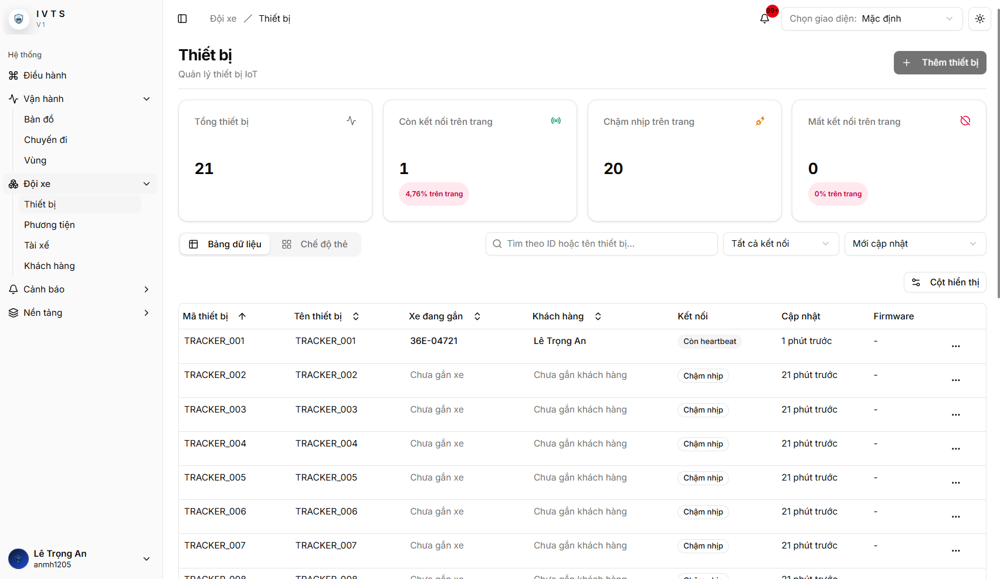 |
| Trái dưới | 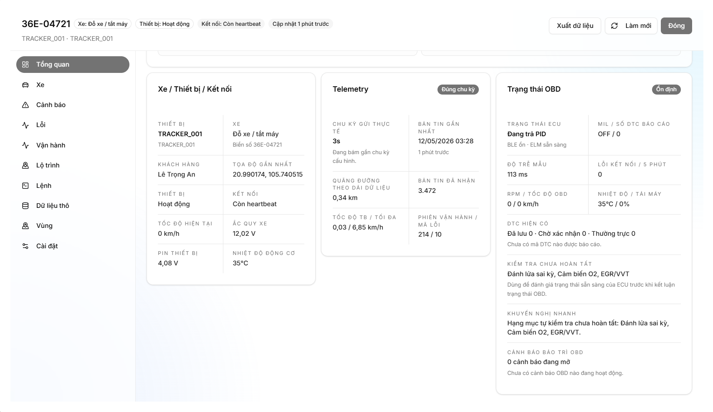 |
| Phải dưới | 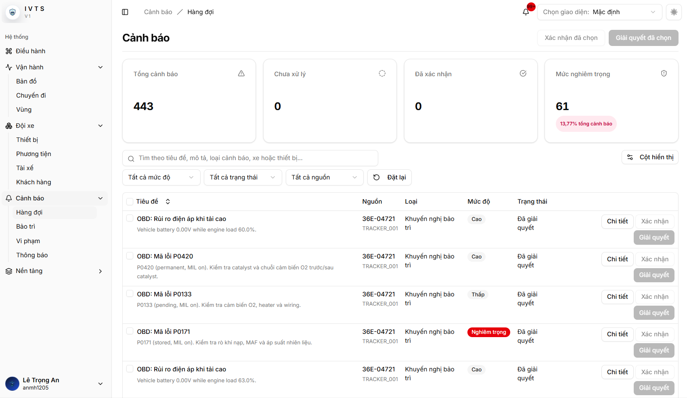 |

**Ghi chú nhỏ dưới cùng:**
- Giao diện trên nền web, ưu tiên bản đồ + trạng thái + cảnh báo
- Tách riêng theo dõi vận hành và xử lý sự cố

**📌 Nội dung điền vào template PowerPoint**

> Template PowerPoint có 2 vùng tiêu đề: **đầu mục lớn** ở trên cùng (placeholder `toc_section_title`) và **tiêu đề slide** ngay dưới (placeholder `slide_main_content_label`). Body slide (bullet, bảng, hình) thêm thủ công vào vùng trống bên dưới.

```text
[Đầu mục lớn — toc_section_title]
4. TRIỂN KHAI GIẢI PHÁP VÀ KẾT QUẢ

[Tiêu đề slide — slide_main_content_label]
TRIỂN KHAI GIAO DIỆN QUẢN LÝ – thingdock.dev
```

---
---

## SLIDE 27 – KẾT QUẢ: KIỂM THỬ NĂNG LƯỢNG

**Bố cục:** Tiêu đề trên, trái là bảng số đo, phải là bảng thời gian duy trì + hình đồ thị dòng

**Tiêu đề:** `KẾT QUẢ KIỂM THỬ – NĂNG LƯỢNG`

**Phần trái – Bảng số đo:**

| Chế độ | Kết quả |
|---|---|
| Hoạt động đầy đủ | ~1 W |
| Ngủ sâu | **0,5 mA** @ 12V (0,006 W) |
| vgate iCar Pro | ~1,2 W (tự tắt sau 30 phút) |
| Công suất TB khi đỗ (thức 10s/ngủ 120s) | 0,082 W |

**Phần phải – Bảng thời gian duy trì:**

| Nguồn | Thời gian giám sát khi xe đỗ |
|---|---|
| Chỉ pin 18650 (11 Wh) | **5,6 ngày** |
| Pin + 20% ắc quy 45Ah | **52 ngày** |
| Pin + toàn bộ ắc quy | **237,5 ngày** |

**Hình nhỏ (nếu vừa):** Hình 4.18 – đồ thị dòng tiêu thụ các chế độ

**Ảnh đã trích từ báo cáo:**
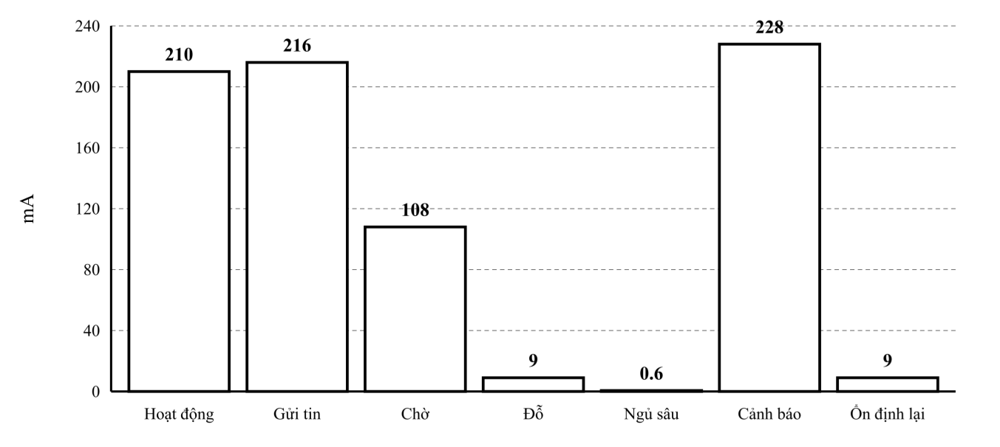

**Kết luận (đậm, dưới cùng):**
> → Không gây hao điện đáng kể cho ắc quy xe

**📌 Nội dung điền vào template PowerPoint**

> Template PowerPoint có 2 vùng tiêu đề: **đầu mục lớn** ở trên cùng (placeholder `toc_section_title`) và **tiêu đề slide** ngay dưới (placeholder `slide_main_content_label`). Body slide (bullet, bảng, hình) thêm thủ công vào vùng trống bên dưới.

```text
[Đầu mục lớn — toc_section_title]
4. TRIỂN KHAI GIẢI PHÁP VÀ KẾT QUẢ

[Tiêu đề slide — slide_main_content_label]
KẾT QUẢ KIỂM THỬ – NĂNG LƯỢNG
```

---
---

## SLIDE 28 – KẾT QUẢ: KIỂM THỬ FIRMWARE

**Bố cục:** Tiêu đề trên, 2 bảng xếp dọc

**Tiêu đề:** `KẾT QUẢ KIỂM THỬ – FIRMWARE THIẾT BỊ`

**Bảng 1 – Mốc thời gian vận hành:**

| Kịch bản | Thời gian |
|---|---|
| Khởi động lần đầu → sẵn sàng truyền dữ liệu | 12–18 s |
| Khởi động → bản tin định vị đầu tiên | 20–25 s |
| Đánh thức định kỳ khi xe vẫn đỗ → sẵn sàng | 2–4 s |
| Chuyển từ đỗ sang chạy lại → có định vị | 6–10 s |

**Bảng 2 – Khả năng bổ sung:**

| Chức năng | Kết quả |
|---|---|
| Cập nhật OTA từ xa | Nạp 817 KB trong 18–20s, quay lui khi lỗi ✓ |
| Lưu đệm offline (SD 1GB) | ~2 triệu bản tin ≈ 24,3 ngày liên tục |

**📌 Nội dung điền vào template PowerPoint**

> Template PowerPoint có 2 vùng tiêu đề: **đầu mục lớn** ở trên cùng (placeholder `toc_section_title`) và **tiêu đề slide** ngay dưới (placeholder `slide_main_content_label`). Body slide (bullet, bảng, hình) thêm thủ công vào vùng trống bên dưới.

```text
[Đầu mục lớn — toc_section_title]
4. TRIỂN KHAI GIẢI PHÁP VÀ KẾT QUẢ

[Tiêu đề slide — slide_main_content_label]
KẾT QUẢ KIỂM THỬ – FIRMWARE THIẾT BỊ
```

---
---

## SLIDE 29 – KẾT QUẢ: KIỂM THỬ HỆ THỐNG

**Bố cục:** Tiêu đề trên, bảng kết quả chiếm 2/3, dưới là dòng kết luận

**Tiêu đề:** `KẾT QUẢ KIỂM THỬ – HỆ THỐNG`

**Phụ đề (nhỏ):** T_toàn tuyến = T_thiết bị + T_mạng + T_máy chủ + T_giao diện

**Bảng:**

| Hạng mục | Kết quả | Ghi chú |
|---|---|---|
| Độ trễ mạng di động | **120–180 ms** | Thành phần chi phối |
| Phản hồi máy chủ | 95–200 ms | Đáp ứng tra cứu & cập nhật |
| Cập nhật bản đồ gần real-time | 1–2 s | Phù hợp theo dõi hành trình |
| Cảnh báo vượt vùng | **2–3 s** | Đủ sớm cho giám sát sự kiện |
| Tải đồng thời đã kiểm tra | **50 thiết bị** | Tải hệ thống ~20–25%, còn dư lớn |

**Kết luận (đậm):**
> → Độ trễ phù hợp cho theo dõi hành trình và cảnh báo gần thời gian thực

**📌 Nội dung điền vào template PowerPoint**

> Template PowerPoint có 2 vùng tiêu đề: **đầu mục lớn** ở trên cùng (placeholder `toc_section_title`) và **tiêu đề slide** ngay dưới (placeholder `slide_main_content_label`). Body slide (bullet, bảng, hình) thêm thủ công vào vùng trống bên dưới.

```text
[Đầu mục lớn — toc_section_title]
4. TRIỂN KHAI GIẢI PHÁP VÀ KẾT QUẢ

[Tiêu đề slide — slide_main_content_label]
KẾT QUẢ KIỂM THỬ – HỆ THỐNG
```

---
---

## SLIDE 30 – ĐỐI CHIẾU TOÀN BỘ MỤC TIÊU

**Bố cục:** Tiêu đề trên, bảng lớn chiếm toàn slide, cột cuối dùng icon ✅

**Tiêu đề:** `ĐỐI CHIẾU VỚI MỤC TIÊU ĐỒ ÁN`

**Bảng:**

| Nhóm chỉ tiêu | Mục tiêu đặt ra | Kết quả nguyên mẫu | |
|---|---|---|---|
| Nguồn & lắp đặt | 12–24 VDC, gọn, lắp trên xe | Ổn định, có dự phòng, PCB+vỏ hoàn chỉnh | ✅ |
| Thu dữ liệu | OBD-II, GPS, tốc độ | Đọc qua BLE, nối lại ~4s | ✅ |
| Năng lượng | Giám sát mà không hao điện quá mức | Ngủ sâu 0,5 mA, duy trì 5,6 ngày bằng pin | ✅ |
| Truyền dữ liệu | Đủ sớm, còn giá trị sử dụng | Trễ 120–180 ms | ✅ |
| Cảnh báo | Cảnh báo sự kiện cơ bản | Cảnh báo vượt vùng 2–3s | ✅ |
| Khai thác | Quãng đường, thời gian, ước tính chi phí | Đã tổng hợp đầy đủ trên giao diện | ✅ |
| Ổn định | Toàn tuyến thống nhất | 50 thiết bị, tải <25% | ✅ |
| Chi phí | < 20.000.000 VND | **2.882.000 VND** | ✅ |

**📌 Nội dung điền vào template PowerPoint**

> Template PowerPoint có 2 vùng tiêu đề: **đầu mục lớn** ở trên cùng (placeholder `toc_section_title`) và **tiêu đề slide** ngay dưới (placeholder `slide_main_content_label`). Body slide (bullet, bảng, hình) thêm thủ công vào vùng trống bên dưới.

```text
[Đầu mục lớn — toc_section_title]
4. TRIỂN KHAI GIẢI PHÁP VÀ KẾT QUẢ

[Tiêu đề slide — slide_main_content_label]
ĐỐI CHIẾU VỚI MỤC TIÊU ĐỒ ÁN
```

---
---

## SLIDE 31 – DIVIDER PHẦN 5: ĐÁNH GIÁ VÀ KHUYẾN NGHỊ

**Bố cục:** Slide chuyển phần – nền màu Phenikaa đậm, tiêu đề lớn căn giữa, danh sách nội dung bên dưới

**Tiêu đề lớn:** `PHẦN 5. ĐÁNH GIÁ VÀ KHUYẾN NGHỊ`

**Nội dung preview:**
- Đánh giá kinh tế
- Rủi ro kỹ thuật và biện pháp đã áp dụng
- Đề xuất hướng phát triển

**Lưu ý:** Slide này chỉ chuyển phần, không có matrix hay bảng số liệu. Trình bày ~5 giây.

**📌 Nội dung điền vào template PowerPoint**

> Template PowerPoint có 2 vùng tiêu đề: **đầu mục lớn** ở trên cùng (placeholder `toc_section_title`) và **tiêu đề slide** ngay dưới (placeholder `slide_main_content_label`). Body slide (bullet, bảng, hình) thêm thủ công vào vùng trống bên dưới.

```text
[Đầu mục lớn — toc_section_title]
5. ĐÁNH GIÁ VÀ KHUYẾN NGHỊ

[Tiêu đề slide — slide_main_content_label]
PHẦN 5. ĐÁNH GIÁ VÀ KHUYẾN NGHỊ
```

---
---

## SLIDE 32 – ĐÁNH GIÁ KINH TẾ

**Bố cục:** Tiêu đề trên, trái là bảng chi phí, phải là biểu đồ tròn hoặc bar chart đơn giản

**Tiêu đề:** `ĐÁNH GIÁ KINH TẾ`

**Phần trái – Bảng chi phí:**

| Nhóm | Chi phí (VND) |
|---|---|
| Điện tử & truyền thông | 1.760.000 |
| Nguồn & bảo vệ | 204.000 |
| PCB, vỏ & phụ kiện | 150.000 |
| **Chế tạo thiết bị** | **2.114.000** |
| VPS 6 tháng | 720.000 |
| SIM dữ liệu 6 tháng | 48.000 |
| **TỔNG CỘNG** | **2.882.000** |

**Phần phải – Biểu đồ so sánh:**
- Thanh 1: Mục tiêu = 20.000.000 VND (xám)
- Thanh 2: Thực tế = 2.882.000 VND (xanh, highlight)
- Tỷ lệ: chỉ chiếm ~14% mục tiêu

**Ghi chú dưới:**
- Mở rộng: chủ yếu thiết bị + SIM; VPS dùng chung nhiều xe
- Phù hợp đội xe nhỏ và vừa

**📌 Nội dung điền vào template PowerPoint**

> Template PowerPoint có 2 vùng tiêu đề: **đầu mục lớn** ở trên cùng (placeholder `toc_section_title`) và **tiêu đề slide** ngay dưới (placeholder `slide_main_content_label`). Body slide (bullet, bảng, hình) thêm thủ công vào vùng trống bên dưới.

```text
[Đầu mục lớn — toc_section_title]
5. ĐÁNH GIÁ VÀ KHUYẾN NGHỊ

[Tiêu đề slide — slide_main_content_label]
ĐÁNH GIÁ KINH TẾ
```

---
---

## SLIDE 33 – RỦI RO & BIỆN PHÁP

**Bố cục:** Tiêu đề trên, bảng 2 cột chiếm toàn slide

**Tiêu đề:** `RỦI RO KỸ THUẬT & BIỆN PHÁP ĐÃ ÁP DỤNG`

**Bảng:**

| Rủi ro | Biện pháp giảm thiểu |
|---|---|
| Biến động mạng di động (mất sóng, trễ) | MQTT + lưu đệm SD cục bộ + gửi bù tự động khi phục hồi |
| Hao ắc quy khi xe đỗ lâu ngày | Ngủ sâu 0,5 mA + chia nhánh nguồn + chu kỳ thức ngắn 10s/120s |
| Bỏ sót hoặc báo chưa ổn định khi xe dừng | Kết hợp trạng thái đỗ + tín hiệu IMU + mốc thời gian; ngưỡng và điều kiện kích hoạt vẫn cần hiệu chỉnh thêm |
| Khác biệt dữ liệu OBD-II giữa các dòng xe | Với nhóm tham số cơ bản hiện tại không gặp vấn đề; mở rộng tham số sâu hơn cần kiểm tra theo từng nhóm phương tiện |

**📌 Nội dung điền vào template PowerPoint**

> Template PowerPoint có 2 vùng tiêu đề: **đầu mục lớn** ở trên cùng (placeholder `toc_section_title`) và **tiêu đề slide** ngay dưới (placeholder `slide_main_content_label`). Body slide (bullet, bảng, hình) thêm thủ công vào vùng trống bên dưới.

```text
[Đầu mục lớn — toc_section_title]
5. ĐÁNH GIÁ VÀ KHUYẾN NGHỊ

[Tiêu đề slide — slide_main_content_label]
RỦI RO KỸ THUẬT & BIỆN PHÁP ĐÃ ÁP DỤNG
```

---
---

## SLIDE 34 – ĐỀ XUẤT HƯỚNG PHÁT TRIỂN

**Bố cục:** Tiêu đề trên, 4 khối xếp dọc (mỗi khối có icon + tiêu đề + mô tả ngắn)

**Tiêu đề:** `ĐỀ XUẤT HƯỚNG PHÁT TRIỂN`

**Khối 1 – icon đồng hồ/thời gian:**
- **Kiểm chứng dài hạn trên xe thật**
- Xác nhận độ ổn định nguồn, OBD-II, GNSS, cảnh báo trong vận hành liên tục nhiều tháng

**Khối 2 – icon báo cáo/biểu đồ:**
- **Hoàn thiện lớp đối soát & báo cáo khai thác**
- Báo cáo theo chuyến, theo ngày, theo xe; hỗ trợ đối chiếu sử dụng

**Khối 3 – icon nhiều xe:**
- **Mở rộng phạm vi tương thích**
- Kiểm tra trên nhiều dòng xe, đánh giá tập dữ liệu OBD-II khả dụng

**Khối 4 – icon khóa/bảo mật:**
- **Tăng mức hoàn thiện triển khai**
- Bảo mật đường truyền, quản lý cấu hình từ xa, tối ưu năng lượng thêm

**📌 Nội dung điền vào template PowerPoint**

> Template PowerPoint có 2 vùng tiêu đề: **đầu mục lớn** ở trên cùng (placeholder `toc_section_title`) và **tiêu đề slide** ngay dưới (placeholder `slide_main_content_label`). Body slide (bullet, bảng, hình) thêm thủ công vào vùng trống bên dưới.

```text
[Đầu mục lớn — toc_section_title]
5. ĐÁNH GIÁ VÀ KHUYẾN NGHỊ

[Tiêu đề slide — slide_main_content_label]
ĐỀ XUẤT HƯỚNG PHÁT TRIỂN
```

---
---

## SLIDE 35 – DIVIDER PHẦN 6: KẾT LUẬN

**Bố cục:** Slide chuyển phần – nền màu Phenikaa đậm, tiêu đề lớn căn giữa, danh sách nội dung bên dưới

**Tiêu đề lớn:** `PHẦN 6. KẾT LUẬN`

**Nội dung preview:**
- Tổng kết những gì đã đạt được
- Giới hạn của nguyên mẫu hiện tại
- Lời cảm ơn

**Lưu ý:** Slide này chỉ chuyển phần, không có matrix hay bảng số liệu. Trình bày ~5 giây.

**📌 Nội dung điền vào template PowerPoint**

> Template PowerPoint có 2 vùng tiêu đề: **đầu mục lớn** ở trên cùng (placeholder `toc_section_title`) và **tiêu đề slide** ngay dưới (placeholder `slide_main_content_label`). Body slide (bullet, bảng, hình) thêm thủ công vào vùng trống bên dưới.

```text
[Đầu mục lớn — toc_section_title]
6. KẾT LUẬN

[Tiêu đề slide — slide_main_content_label]
PHẦN 6. KẾT LUẬN
```

---
---

## SLIDE 36 – KẾT LUẬN & CẢM ƠN

**Bố cục:** Chia 2 phần: trên là kết luận (bullet), dưới là lời cảm ơn + thông tin liên hệ

**Phần trên – Kết luận (bullet có icon ✅):**
- ✅ Nguyên mẫu hoàn chỉnh 3 phần: thiết bị + máy chủ + giao diện
- ✅ Lắp thử trên xe thật, đo kiểm phòng thí nghiệm + thực địa
- ✅ Tất cả chỉ tiêu thiết kế đều đạt
- ✅ Chi phí 2.882.000 VND – thấp hơn nhiều so với mục tiêu 20 triệu
- ✅ Kiểm tra 50 thiết bị đồng thời, hệ thống còn dư khả năng mở rộng

**Phần dưới – Cảm ơn (căn giữa, font lớn):**

> **CẢM ƠN QUÝ THẦY CÔ VÀ HỘI ĐỒNG ĐÃ LẮNG NGHE!**

- Sinh viên: Lê Trọng An
- GVHD: TS. Nguyễn Đức Nam
- Source code: github.com/anmh1205/IoT_Vehicle_Tracking_System
- Demo: thingdock.dev (admin / Admin@2026)

**📌 Nội dung điền vào template PowerPoint**

> Template PowerPoint có 2 vùng tiêu đề: **đầu mục lớn** ở trên cùng (placeholder `toc_section_title`) và **tiêu đề slide** ngay dưới (placeholder `slide_main_content_label`). Body slide (bullet, bảng, hình) thêm thủ công vào vùng trống bên dưới.

```text
[Đầu mục lớn — toc_section_title]
6. KẾT LUẬN

[Tiêu đề slide — slide_main_content_label]
KẾT LUẬN & CẢM ƠN
```

---
---

## SLIDE DỰ PHÒNG (không trình bày, chỉ dùng khi hội đồng hỏi)

### Slide B1 – Chi tiết ma trận đánh giá đầy đủ

**Tiêu đề:** `PHỤ LỤC – MA TRẬN ĐÁNH GIÁ CHI TIẾT`

**Bảng 1 – Truyền dữ liệu & Định vị:**

| Tiêu chí (trọng số) | EC200U + L76K | A7670C + ATGM336H | SIM7600CE-T |
|---|---|---|---|
| Số khối phải khởi tạo (30%) | 2 | 2 | **5** |
| Phức tạp nguồn/ăng ten (30%) | 3 | 3 | **5** |
| Giữ/khôi phục đường truyền (25%) | 4 | 4 | 4 |
| Phù hợp không gian lắp (15%) | 3 | 3 | **5** |
| **Tổng** | 2,95 | 3,00 | **4,75** |

**Bảng 2 – Tổ chức máy chủ:**

| Tiêu chí (trọng số) | Backend trực tiếp | Broker + Backend | Broker + Trung gian + Tách lưu trữ |
|---|---|---|---|
| Tách tuyến nhận (30%) | 1 | 3 | **5** |
| Hấp thụ gửi dồn (25%) | 2 | 3 | **5** |
| Tách dữ liệu theo vai trò (25%) | 2 | 3 | **5** |
| Real-time + lịch sử (20%) | 3 | 4 | 4 |
| **Tổng** | 1,90 | 3,20 | **4,80** |

---

### Slide B2 – Chi tiết MQTT & Cảnh báo vượt vùng

**Tiêu đề:** `PHỤ LỤC – MQTT TOPIC & GEOFENCE`

**Phần 1 – Topic structure:**
```
thingdock/{device_id}/telemetry   → vị trí, tốc độ, nguồn
thingdock/{device_id}/obd         → dữ liệu OBD-II
thingdock/{device_id}/event       → cảnh báo, sự kiện
thingdock/{device_id}/status      → trạng thái thiết bị
thingdock/{device_id}/command     → lệnh từ server xuống
```
- QoS 1, Retain cho status, Last Will cho phát hiện mất kết nối

**Phần 2 – Luồng cảnh báo vượt vùng:**
1. Thiết bị gửi tọa độ mới (1s/lần khi chạy)
2. Backend nhận → kiểm tra point-in-polygon
3. Ngoài vùng → tạo alert → push WebSocket → giao diện
4. Tổng thời gian: **2–3 giây**

---

### Slide B3 – Chi tiết OTA & Mã lỗi OBD-II

**Tiêu đề:** `PHỤ LỤC – OTA & MÃ LỖI OBD-II`

**Phần 1 – OTA dual partition:**
- factory (1536 KB) – bản gốc ổn định, điểm khôi phục
- ota_0 (1536 KB) – nhận cập nhật lượt 1
- ota_1 (1536 KB) – nhận cập nhật lượt kế tiếp (luân phiên)
- Bản dựng hiện tại: 817.904 byte (~52% phân vùng)
- Nạp 18–20s @ 460800 bps
- Lỗi → tự quay về phân vùng trước

**Phần 2 – Mã lỗi OBD-II đã hỗ trợ:**

| Mã DTC | Nhóm lỗi |
|---|---|
| P0300–P0308 | Đánh lửa / misfire |
| P0100–P0104 | Cảm biến khí nạp |
| P0171, P0172, P0174 | Hỗn hợp nhiên liệu sai |
| P0128 | Hệ thống làm mát |
| P0420, P0430 | Bộ xúc tác khí thải |
| P0440–P0456 | Hệ thống EVAP |
| P0562, P0563 | Nguồn/ắc quy |
| P0500–P0503 | Cảm biến tốc độ |
| P0700–P0740 | Hộp số |

---
---

## TỔNG HỢP

### Phân bổ thời gian gợi ý

| Phần | Slide | Thời gian | Ghi chú |
|---|---|---|---|
| Mở đầu (bìa, mục lục) | 1–2 | ~30s | Giới thiệu nhanh |
| Phần 1: Tổng quan | 3 | ~1,5 phút | Bối cảnh & Đặt vấn đề |
| Phần 2: Phân tích vấn đề | 4–9 | ~2 phút | Divider + 5 vấn đề + thị trường + so sánh + yêu cầu + chỉ tiêu |
| Phần 3: Giải pháp thiết kế | 10–20 | ~4 phút | Divider + nguyên lý + ràng buộc + 7 lựa chọn + kiến trúc |
| Phần 4: Triển khai & Kết quả | 21–30 | ~5 phút | Divider + sản phẩm + đo kiểm + đối chiếu mục tiêu |
| Phần 5: Đánh giá & Khuyến nghị | 31–34 | ~1,5 phút | Divider + kinh tế + rủi ro + đề xuất |
| Phần 6: Kết luận | 35–36 | ~30s | Divider + cảm ơn |
| **Tổng** | **36** | **~15 phút** | |

### Danh sách hình ảnh cần chuẩn bị

| Slide | Nguồn | Nội dung |
|---|---|---|
| 3 | Ảnh đã tạo | Bối cảnh cho thuê xe tự lái → nhu cầu quản lý → giới hạn GPS → hệ thống đề tài |
| 6 | Prompt AI hoặc ảnh thật | 3 ảnh thiết bị thị trường; ưu tiên ảnh thật nếu cần chính xác sản phẩm |
| 7 | Ảnh đã tạo từ prompt | Quadrant chart 4 góc phần tư |
| 11 | Ảnh đã tạo từ prompt + Hình 3.1 | Pipeline 5 bước; Hình 3.1 dùng làm ảnh tham khảo từ báo cáo |
| 12 | Hình 3.7 | Sơ đồ quan hệ ràng buộc kỹ thuật (tùy chọn) |
| 13 | Hình 3.2 | OBD-II qua vgate BLE |
| 14 | Hình 3.3 | Nhánh LIS3DSH khi xe đỗ |
| 15 | Hình 3.4 | SIM7600CE-T LTE + GNSS |
| 16 | Hình 3.5 | ESP32-S3 điều phối trung tâm |
| 20 | Hình 3.6 | Kiến trúc tổng thể (vẽ lại đẹp cho slide) |
| 22 | Hình 4.1, 4.4 | Sơ đồ khối + sơ đồ nguồn |
| 23 | Hình 4.5, 4.6, 4.7, 4.8 | PCB layout + ảnh nguyên mẫu |
| 24 | Hình 4.9, 4.10, 4.11 | Flowchart firmware (đơn giản hóa) |
| 25 | Hình 4.12, 4.13 | Kiến trúc máy chủ + nhóm dịch vụ |
| 26 | Hình 4.14, 4.15, 4.16, 4.17 | Screenshot giao diện |
| 27 | Hình 4.18 | Đồ thị dòng tiêu thụ |

### Đường dẫn ảnh đã tạo từ prompt

| Slide | PNG dùng trong slide | SVG nguồn chỉnh sửa được |
|---|---|---|
| 3 | `../../thesis-chapters/assets/slide-bao-ve-do-an/generated-slide-03-car-rental-context-ai-v5-corrected.png` | `../../thesis-chapters/assets/slide-bao-ve-do-an/generated-slide-03-car-rental-context-ai-v5-corrected.svg` |
| 7 | `../../thesis-chapters/assets/slide-bao-ve-do-an/generated-slide-06-quadrant-chart.png` | `../../thesis-chapters/assets/slide-bao-ve-do-an/generated-slide-06-quadrant-chart.svg` |
| 11 | `../../thesis-chapters/assets/slide-bao-ve-do-an/generated-slide-09-pipeline-flow.png` | `../../thesis-chapters/assets/slide-bao-ve-do-an/generated-slide-09-pipeline-flow.svg` |

### Đường dẫn ảnh đã trích từ PDF

| Hình | File |
|---|---|
| Hình 3.1 | `../../thesis-chapters/assets/slide-bao-ve-do-an/figure-3-1-data-to-management-flow.png` |
| Hình 3.2 | `../../thesis-chapters/assets/slide-bao-ve-do-an/figure-3-2-obd-ble-vgate-flow.png` |
| Hình 3.3 | `../../thesis-chapters/assets/slide-bao-ve-do-an/figure-3-3-lis3dsh-wake-flow.png` |
| Hình 3.4 | `../../thesis-chapters/assets/slide-bao-ve-do-an/figure-3-4-sim7600-lte-gnss-flow.png` |
| Hình 3.5 | `../../thesis-chapters/assets/slide-bao-ve-do-an/figure-3-5-esp32-s3-central-control.png` |
| Hình 3.6 | `../../thesis-chapters/assets/slide-bao-ve-do-an/figure-3-6-selected-system-architecture.png` |
| Hình 3.7 | `../../thesis-chapters/assets/slide-bao-ve-do-an/figure-3-7-technical-constraints-map.png` |
| Hình 4.1 | `../../thesis-chapters/assets/slide-bao-ve-do-an/figure-4-1-device-block-diagram.png` |
| Hình 4.2 | `../../thesis-chapters/assets/slide-bao-ve-do-an/figure-4-2-esp32-control-branches.png` |
| Hình 4.3 | `../../thesis-chapters/assets/slide-bao-ve-do-an/figure-4-3-board-module-groups.png` |
| Hình 4.4 | `../../thesis-chapters/assets/slide-bao-ve-do-an/figure-4-4-power-block-diagram.png` |
| Hình 4.5 | `../../thesis-chapters/assets/slide-bao-ve-do-an/figure-4-5-pcb-front-layout.png` |
| Hình 4.6 | `../../thesis-chapters/assets/slide-bao-ve-do-an/figure-4-6-assembled-prototype-pcb.png` |
| Hình 4.7 | `../../thesis-chapters/assets/slide-bao-ve-do-an/figure-4-7-prototype-in-case.png` |
| Hình 4.8 | `../../thesis-chapters/assets/slide-bao-ve-do-an/figure-4-8-closed-enclosure-device.png` |
| Hình 4.9 | `../../thesis-chapters/assets/slide-bao-ve-do-an/figure-4-9-firmware-startup-flow.png` |
| Hình 4.10 | `../../thesis-chapters/assets/slide-bao-ve-do-an/figure-4-10-firmware-data-send-flow.png` |
| Hình 4.11 | `../../thesis-chapters/assets/slide-bao-ve-do-an/figure-4-11-firmware-sleep-wake-flow.png` |
| Hình 4.12 | `../../thesis-chapters/assets/slide-bao-ve-do-an/figure-4-12-server-data-pipeline.png` |
| Hình 4.13 | `../../thesis-chapters/assets/slide-bao-ve-do-an/figure-4-13-server-function-groups.png` |
| Hình 4.14 | `../../thesis-chapters/assets/slide-bao-ve-do-an/figure-4-14-device-list-screen.png` |
| Hình 4.15 | `../../thesis-chapters/assets/slide-bao-ve-do-an/figure-4-15-map-tracking-screen.png` |
| Hình 4.16 | `../../thesis-chapters/assets/slide-bao-ve-do-an/figure-4-16-device-detail-screen.png` |
| Hình 4.17 | `../../thesis-chapters/assets/slide-bao-ve-do-an/figure-4-17-alert-queue-screen.png` |
| Hình 4.18 | `../../thesis-chapters/assets/slide-bao-ve-do-an/figure-4-18-power-consumption-chart.png` |

### Gợi ý thiết kế slide

- **Font:** Roboto hoặc Montserrat (tiêu đề), Open Sans (nội dung)
- **Màu chủ đạo:** Xanh dương Phenikaa (#1a5276 hoặc tương tự) + trắng + xám nhạt
- **Nguyên tắc:** Mỗi slide tối đa 1 ý chính, không nhồi quá nhiều chữ
- **Bảng:** Dùng viền nhẹ, header tô nền xanh nhạt, hàng highlight tô nền vàng nhạt
- **Hình ảnh:** Ưu tiên hình thật (PCB, thiết bị, screenshot) hơn clip art
- **Animation:** Tối thiểu, chỉ dùng fade-in cho bullet points nếu cần
