`
`

**ĐẠI HỌC PHENIKAA**

---

**ĐỒ ÁN TỐT NGHIỆP**
**THIẾT KẾ HỆ THỐNG IoT CHO ỨNG DỤNG QUẢN LÝ**
**PHƯƠNG TIỆN GIAO THÔNG TRONG LĨNH VỰC**
**CHO THUÊ XE TỰ LÁI**

**Sinh viên:** Lê Trọng An
**Mã số sinh viên:** 21010389
**Lớp:** K15-KTCĐT2
**Ngành:** Kỹ thuật Cơ điện tử
**Giảng viên hướng dẫn:** TS. Nguyễn Đức Nam

**Hà Nội - 2026**

**PHENIKAA UNIVERSITY**
**FACULTY OF MECHANICAL ENGINEERING AND MECHATRONICS**

**CAPSTONE THESIS**
**DESIGN OF AN IoT SYSTEM FOR VEHICLE MANAGEMENT**
**IN SELF-DRIVE CAR RENTAL SERVICES**

| **Student** | **Student ID** | **Class**  |
| :---------- | :------------- | :--------- |
| Le Trong An | 21010389       | K15-KTCĐT2 |

**Supervisor:** Dr. Nguyen Duc Nam

**HANOI - 2026**

# NHẬN XÉT ĐỒ ÁN TỐT NGHIỆP CỦA GIẢNG VIÊN HƯỚNG DẪN

> Phần này giữ đúng mẫu biểu của nhà trường và được điền khi nộp hồ sơ bảo vệ chính thức.

# NHẬN XÉT ĐỒ ÁN TỐT NGHIỆP CỦA GIẢNG VIÊN PHẢN BIỆN

> Phần này giữ đúng mẫu biểu của nhà trường và được điền khi nộp hồ sơ bảo vệ chính thức.

# BIÊN BẢN ĐÁNH GIÁ ĐỒ ÁN TỐT NGHIỆP

> Phần này giữ đúng mẫu biểu của hội đồng, gồm thông tin phiên bảo vệ, câu hỏi phản biện, phần trả lời và kết luận.

# GIẢI TRÌNH CÁC CHỈNH SỬA (NẾU CÓ)

> Tài liệu giải trình sẽ được bổ sung sau khi có góp ý chính thức từ hội đồng.

# LỜI CAM ĐOAN

Tên tôi là: **Lê Trọng An**.

Mã số sinh viên: **21010389** &nbsp;&nbsp;&nbsp;&nbsp;&nbsp;&nbsp; Lớp: **K15-KTCĐT2**
Ngành: **Kỹ thuật Cơ điện tử**.

Tôi cam đoan đồ án tốt nghiệp với tên **"Thiết kế hệ thống IoT cho ứng dụng quản lý phương tiện giao thông trong lĩnh vực cho thuê xe tự lái"** là kết quả nghiên cứu do tôi trực tiếp thực hiện, dưới sự hướng dẫn của **TS. Nguyễn Đức Nam**.

Toàn bộ nội dung, số liệu, hình ảnh và kết quả trình bày trong báo cáo là trung thực, được trích dẫn rõ nguồn khi tham khảo tài liệu bên ngoài, và chưa từng công bố dưới danh nghĩa tác giả khác. Nếu có bất kỳ sai phạm nào về học thuật hoặc bản quyền, tôi xin hoàn toàn chịu trách nhiệm trước nhà trường và pháp luật.

Hà Nội, ngày … tháng … năm 2026
**SINH VIÊN THỰC HIỆN**
Lê Trọng An

# TÓM TẮT ĐỒ ÁN TỐT NGHIỆP - ABSTRACT

Đồ án xây dựng một hệ thống IoT phục vụ quản lý đội xe cho thuê tự lái theo hướng triển khai thực tế. Hệ thống gồm thiết bị gắn trên xe, máy chủ xử lý dữ liệu và giao diện khai thác cho người vận hành. Mục tiêu chính là theo dõi vị trí, thu dữ liệu vận hành cơ bản, phát hiện sự kiện bất thường và duy trì mức tiêu thụ điện thấp khi xe dừng lâu.

Thiết bị trên xe lấy nguồn trực tiếp từ phương tiện, thu dữ liệu vị trí, tốc độ, trạng thái và một số thông số vận hành cơ bản qua các khối cảm biến, định vị và đọc dữ liệu xe. Dữ liệu được truyền về máy chủ để chuẩn hóa, lưu trữ, tổng hợp hành trình và phát cảnh báo. Giao diện quản lý hiển thị bản đồ, trạng thái thiết bị, dữ liệu chuyến đi và cảnh báo theo sự kiện nhằm hỗ trợ quyết định vận hành.

Kết quả triển khai cho thấy hệ thống đã được chế tạo thành nguyên mẫu hoàn chỉnh, lắp thử trên xe thật và kiểm chứng bằng đo kiểm trong phòng thí nghiệm lẫn ngoài thực địa. Các chỉ tiêu chính về dòng ngủ sâu, thời gian kết nối dữ liệu xe, độ trễ toàn tuyến và khả năng phục vụ đồng thời nhiều thiết bị đều đạt ngưỡng đề ra. Đây là cơ sở để tiếp tục hoàn thiện hệ thống cho bài toán quản lý đội xe quy mô nhỏ và vừa.

**Từ khóa:** IoT, quản lý phương tiện, xe cho thuê tự lái, GPS, OBD-II, MQTT

**Abstract (English)**

This capstone thesis presents an IoT-based fleet tracking system for self-drive rental operations. The system consists of an onboard device, a server-side data processing layer, and a web-based management interface. Its main objective is to track vehicle position, collect basic operating data, detect relevant events, and reduce power consumption during long parking periods.

The onboard unit operates from the vehicle power source and collects location, speed, status, and basic operating data through sensing, positioning, and vehicle-data interfaces. Telemetry packets are delivered to the server, where data is normalized, stored, aggregated into trip history, and converted into operational alerts. The management interface provides map tracking, device status, trip information, and event notifications for vehicle operation monitoring.

The final implementation includes a working prototype with a custom circuit board and enclosure, installed and validated on a real vehicle through both laboratory and field tests. Key performance metrics, including deep-sleep current, vehicle-data connection latency, end-to-end data delay, and concurrent device handling, meet the target thresholds. These results provide a basis for further deployment in small- and medium-scale rental fleet management.

**Keywords:** IoT, vehicle tracking, self-drive rental, GPS, OBD-II, MQTT

# LỜI CẢM ƠN - ACKNOWLEDGEMENTS

Em xin trân trọng bày tỏ lòng biết ơn sâu sắc tới **TS. Nguyễn Đức Nam**, người đã trực tiếp hướng dẫn, góp ý chi tiết và định hướng học thuật trong suốt quá trình thực hiện đồ án. Các góp ý của thầy giúp em hoàn thiện sản phẩm kỹ thuật và rèn tư duy phân tích vấn đề theo hướng có tiêu chí, có kiểm chứng và có kết luận rõ ràng.

Em xin chân thành cảm ơn quý thầy cô **Khoa Cơ khí - Cơ điện tử, Đại học Phenikaa** đã trang bị nền tảng kiến thức và môi trường học tập cần thiết để em có thể thực hiện đồ án này theo đúng chuẩn kỹ thuật và chuẩn học thuật.

Em cũng xin gửi lời cảm ơn tới gia đình và bạn bè đã luôn động viên, hỗ trợ tinh thần trong suốt thời gian thực hiện đồ án, đặc biệt trong giai đoạn chế tạo nguyên mẫu và kiểm thử thực địa.

Dù đã nỗ lực hoàn thiện báo cáo và sản phẩm, đồ án chắc chắn vẫn còn những điểm cần tiếp tục cải tiến. Em rất mong nhận được thêm ý kiến góp ý từ quý thầy cô và hội đồng để hoàn thiện hơn trong các nghiên cứu tiếp theo.

Hà Nội, ngày … tháng … năm 2026
**SINH VIÊN THỰC HIỆN**
Lê Trọng An

# MỤC LỤC - TABLE OF CONTENTS

> Mục lục chi tiết sẽ được đồng bộ theo số trang ở bước xuất PDF chính thức.

# DANH MỤC BẢNG - LIST OF TABLES

> Danh mục bảng sẽ được cập nhật tự động theo số trang ở bản nộp cuối.

# DANH MỤC HÌNH ẢNH VÀ ĐỒ THỊ - LIST OF FIGURES

> Danh mục hình sẽ được cập nhật tự động theo số trang ở bản nộp cuối.

# DANH MỤC TỪ VIẾT TẮT - LIST OF ABBREVIATIONS

| Từ viết tắt | Nghĩa                                  |
| :---------- | :------------------------------------- |
| ADC         | Bộ chuyển đổi tương tự sang số         |
| API         | Giao diện lập trình ứng dụng           |
| BLE         | Bluetooth năng lượng thấp              |
| BOM         | Danh sách linh kiện                    |
| ECU         | Bộ điều khiển điện tử trên xe          |
| ESP         | Nền tảng vi điều khiển Espressif       |
| GNSS        | Hệ thống vệ tinh dẫn đường             |
| GPS         | Hệ thống định vị toàn cầu              |
| HTTPS       | Giao thức HTTP bảo mật qua TLS         |
| IMU         | Cảm biến quán tính                     |
| IoT         | Internet vạn vật                       |
| LTE         | Mạng dữ liệu di động 4G                |
| MCU         | Vi điều khiển trung tâm                |
| MQTT        | Giao thức truyền bản tin nhẹ           |
| OBD-II      | Cổng chẩn đoán trên xe                 |
| OTA         | Cập nhật phần mềm từ xa                |
| PCB         | Bảng mạch in                           |
| QoS         | Mức đảm bảo truyền bản tin             |
| REST        | Kiểu giao tiếp API dựa trên tài nguyên |
| RTC         | Đồng hồ thời gian thực                 |
| TCP         | Giao thức điều khiển truyền vận        |
| TLS         | Lớp bảo mật truyền tải                 |
| VPS         | Máy chủ ảo                             |

# CHƯƠNG 1. GIỚI THIỆU DỰ ÁN - SUMMARY

## 1.1. Đặt vấn đề/ Bối cảnh của dự án – Problem definition and Background

Trong những năm gần đây, dịch vụ cho thuê xe tự lái phát triển nhanh cùng với nhu
cầu số hóa vận hành đội xe. Thiết bị định vị GPS giải quyết được lớp vị trí, nhưng
bài toán khai thác đội xe còn cần trạng thái vận hành, cảnh báo bất thường và dữ
liệu đối chiếu sau chuyến đi. Nếu chỉ lưu vết hành trình, người quản lý vẫn thiếu cơ
sở để xử lý sự cố và tổng kết khai thác.

Vì vậy, đồ án tập trung liên kết dữ liệu hành trình, dữ liệu vận hành và thông tin
cảnh báo trong cùng một hệ thống.

## 1.2. Mục tiêu và phạm vi của dự án

Đồ án hướng tới xây dựng một hệ thống IoT phục vụ quản lý phương tiện trong dịch
vụ cho thuê xe tự lái. Hệ thống gồm một thiết bị gắn trên xe để ghi nhận thông tin
cần thiết, kết nối với máy chủ qua mạng di động và giao diện để người dùng theo dõi
các thông số chính bằng trình duyệt web hoặc ứng dụng điện thoại.

Chỉ tiêu thiết kế chính được mô tả tại Bảng 1.1.

**Bảng 1.1: Mục tiêu và ràng buộc chính của đồ án**

| STT | Hạng mục                | Chỉ tiêu chính                                             |
| :-- | :---------------------- | :--------------------------------------------------------- |
| 1   | Nguồn cấp thiết bị      | 12-24 VDC                                                  |
| 2   | Bộ điều khiển trung tâm | ESP32-S3                                                   |
| 3   | Giao tiếp với xe        | Chuẩn giao tiếp chẩn đoán OBD-II                           |
| 4   | Dữ liệu chính cần thu   | Tọa độ GPS, tốc độ, một số dữ liệu vận hành cơ bản         |
| 5   | Cảnh báo chính          | Vượt tốc độ, đỗ lâu, ra khỏi vùng quản lý                  |
| 6   | Chức năng tổng hợp      | Quãng đường, thời gian sử dụng, ước tính chi phí khai thác |
| 7   | Ràng buộc chi phí       | Dưới 20.000.000 VND                                       |
| 8   | Môi trường kiểm chứng   | Phòng thí nghiệm và xe thử nghiệm                          |
| 9   | Khả năng gia công       | PCB chuyên dụng, vỏ in 3D                                  |
| 10  | Tiêu chuẩn              | IPC-2221, IEC 60664-1                                      |

Trong phạm vi đồ án, hệ thống được giới hạn ở bốn nhóm chức năng chính:

- theo dõi hành trình và trạng thái xe;
- thu dữ liệu vận hành cơ bản;
- phát hiện các cảnh báo khai thác;
- tổng hợp dữ liệu sau chuyến đi để hỗ trợ đối chiếu khai thác.

## 1.3. Các tiêu chí cần đạt được của dự án

Các tiêu chí cần đạt được mô tả tại Bảng 1.2.

**Bảng 1.2: Các tiêu chí cần đạt của đồ án**

| STT | Nhóm tiêu chí      | Nội dung cần đạt                                                                                |
| :-- | :----------------- | :---------------------------------------------------------------------------------------------- |
| 1   | Lắp đặt và nguồn   | Thiết bị gọn, dùng được với nguồn xe 12-24 VDC, lắp được trên xe thật                           |
| 2   | Thu dữ liệu        | Theo dõi được tọa độ GPS, tốc độ và dữ liệu OBD-II cơ bản                                       |
| 3   | Quản lý năng lượng | Có chế độ ngủ để tiết kiệm năng lượng, có nguồn dự phòng, không làm ảnh hưởng lớn đến ắc quy xe |
| 4   | Khai thác dữ liệu  | Hiển thị được vị trí, hành trình, trạng thái và cảnh báo trên giao diện dễ hiểu                 |
| 5   | Kiểm chứng         | Đo kiểm trong phòng thí nghiệm và trên xe                                                       |

## 1.4. Phương pháp tiếp cận thiết kế kỹ thuật – Engineering design approach

Quy trình thực hiện bắt đầu từ việc xác định nhóm dữ liệu cần thu và các chức năng
cốt lõi phục vụ quản lý phương tiện, sau đó mới lựa chọn phần cứng, xây dựng
firmware, triển khai máy chủ và giao diện quản trị.

Các tính năng và chỉ tiêu thiết kế được kiểm chứng trong phạm vi phòng thí nghiệm
và trên phương tiện thử nghiệm.

# CHƯƠNG 2. PHÂN TÍCH VẤN ĐỀ KỸ THUẬT - PROBLEM ANALYSIS

## 2.1. Mô tả vấn đề - Problem statement

Một số vấn đề và thực trạng của bài toán cho thuê xe tự lái được mô tả tại Bảng 2.1.

**Bảng 2.1: Các vấn đề kỹ thuật chính của hệ thống giám sát xe**

| STT | Nhóm vấn đề                                | Thách thức                                                                 | Mô tả                                                                                                                                                                                                          |
| :-- | :----------------------------------------- | :------------------------------------------------------------------------- | :------------------------------------------------------------------------------------------------------------------------------------------------------------------------------------------------------------- |
| 1   | Theo dõi hành trình và trạng thái xe       | Duy trì dữ liệu vị trí và trạng thái xe liên tục trong quá trình di chuyển | Hệ thống phải cập nhật được hành trình đủ ổn định để người quản lý biết xe đang ở đâu và đang ở trạng thái nào, nhưng không làm tuyến dữ liệu trở nên quá nặng hoặc đứt quãng khi điều kiện vận hành thay đổi. |
| 2   | Thu dữ liệu vận hành cơ bản                | Lấy được dữ liệu cần thiết nhưng không làm ảnh hưởng đến xe                | Các thông số vận hành giúp việc giám sát có chiều sâu hơn, nhưng việc thu nhận phải giữ mức can thiệp thấp, không tác động đến ECU và vẫn phù hợp cho lắp đặt thực tế trên nhiều xe khác nhau.                 |
| 3   | Phát hiện bất thường và cảnh báo khai thác | Nhận biết được sự kiện cần chú ý trong lúc xe chạy hoặc khi xe đỗ          | Thiết bị phải đủ nhạy để phát hiện các dấu hiệu bất thường như rung, dịch chuyển hoặc trạng thái sử dụng không mong muốn, đồng thời hạn chế các cảnh báo giả gây nhiễu cho vận hành.                           |
| 4   | Quản lý năng lượng trên xe                 | Hoạt động bền trên nguồn ắc quy nhưng không gây hao điện quá mức           | Vì thiết bị dùng chung nguồn với xe, bài toán quan trọng là duy trì khả năng theo dõi và cảnh báo trong các trạng thái cần thiết mà không làm ảnh hưởng đến khả năng khởi động khi xe đỗ lâu.                  |
| 5   | Tổng hợp và khai thác dữ liệu              | Đưa toàn bộ thông tin về cùng một nền tảng để theo dõi và đối chiếu        | Dữ liệu hành trình, dữ liệu vận hành và cảnh báo phải được gom về cùng một tuyến xử lý và hiển thị theo cách dễ theo dõi trong lúc vận hành, nhưng vẫn đủ chi tiết để tra cứu lại sau chuyến đi.               |

## 2.2. Bối cảnh và cơ sở kỹ thuật – Background and Technical reviews

Thị trường hiện có nhiều hướng giám sát phương tiện, từ thiết bị định vị đơn chức
năng đến nền tảng quản lý đội xe hoàn chỉnh. Các hướng này thường tối ưu cho một mục
tiêu riêng: lắp nhanh, lấy thêm dữ liệu vận hành hoặc quản lý quy mô lớn. Với đội xe
nhỏ và vừa, đồ án cần phương án vừa theo dõi hành trình, vừa nhận biết bất thường và
hỗ trợ đối chiếu sau chuyến đi.

**Bảng 2.2: Một số thiết bị theo dõi phương tiện phổ biến trên thị trường**

<table>
  <thead>
    <tr>
      <th>STT</th>
      <th>Hình ảnh</th>
      <th>Thiết bị</th>
      <th>Đặc điểm</th>
      <th>Nhận xét trong phạm vi đồ án</th>
    </tr>
  </thead>
  <tbody>
    <tr>
      <td>1</td>
      <td></td>
      <td><strong>Teltonika FMC920</strong> [10]</td>
      <td>
        <strong>Xuất xứ:</strong> Teltonika, Lithuania. 
        <strong>Giá thành:</strong> Nhóm thiết bị thương mại hoàn chỉnh, chi phí cao hơn phương án tự thiết kế. 
        <strong>Thông số kỹ thuật chính:</strong> Thiết bị định vị 4G LTE Cat 1 nhỏ gọn, phục vụ theo dõi vị trí và trạng thái cơ bản. 
        <strong>Đặc điểm/hạn chế:</strong> Lắp gọn, phù hợp giám sát hành trình; không tập trung vào đọc dữ liệu vận hành qua OBD-II.
      </td>
      <td>Đại diện cho hướng thiết bị định vị cơ bản; phù hợp để tham khảo nhưng chưa đủ dữ liệu vận hành cho mục tiêu đồ án.</td>
    </tr>
    <tr>
      <td>2</td>
      <td></td>
      <td><strong>OBD Vcar Viettel</strong> [11]</td>
      <td>
        <strong>Xuất xứ:</strong> Viettel, Việt Nam. 
        <strong>Giá thành:</strong> Thiết bị khoảng 2.000.000 VND; gói dịch vụ tham khảo gồm BASIC 30.000 VND/tháng và VIP 100.000 VND/tháng. 
        <strong>Thông số kỹ thuật chính:</strong> Thiết bị định vị không dây cắm vào cổng OBD, tự hoạt động sau khi cấp nguồn, hỗ trợ định vị, phát Wi-Fi, theo dõi hành trình và kiểm tra tình trạng xe. 
        <strong>Đặc điểm/hạn chế:</strong> Lắp đặt nhanh, phù hợp xe có cổng OBD-II và nhu cầu giám sát thương mại; phụ thuộc vào dịch vụ nền tảng đi kèm của nhà cung cấp.
      </td>
      <td>Đại diện cho hướng thiết bị OBD thương mại trong nước; hữu ích để đối chiếu với phương án tự thiết kế nhưng chưa phù hợp khi đồ án cần chủ động phần firmware, máy chủ và giao diện.</td>
    </tr>
    <tr>
      <td>3</td>
      <td></td>
      <td><strong>Queclink GV305CEU</strong> [12]</td>
      <td>
        <strong>Xuất xứ:</strong> Queclink, Trung Quốc. 
        <strong>Giá thành:</strong> Nhóm thiết bị thương mại nhiều giao tiếp, chi phí và cấu hình triển khai thường cao hơn nhu cầu tối thiểu. 
        <strong>Thông số kỹ thuật chính:</strong> LTE Cat 1, GNSS, BLE 5.2, nguồn 8-32 VDC, pin dự phòng 250 mAh, hỗ trợ RS232/RS485 và nhiều ngõ vào/ra. 
        <strong>Đặc điểm/hạn chế:</strong> Mở rộng tốt cho quản lý đội xe chuyên nghiệp; cấu hình phức tạp và nhiều chức năng không cần thiết cho nguyên mẫu của đồ án.
      </td>
      <td>Đại diện cho hướng thiết bị thương mại mở rộng; hữu ích để tham khảo kiến trúc, nhưng vượt phạm vi chi phí và mức tích hợp cần thiết.</td>
    </tr>
  </tbody>
</table>

Để làm rõ hạn chế đó, sinh viên tiến hành phân loại và so sánh các hướng triển khai
phổ biến dựa trên bốn tiêu chí kỹ thuật chính: mức độ dữ liệu thu được, khả năng lắp
đặt thực tế, mức độ hoàn chỉnh của hệ thống và chi phí triển khai.

**Bảng 2.3: So sánh các hướng triển khai giám sát xe hiện có**

| STT | Hướng triển khai                                | Dữ liệu thu được                                              | Ưu điểm kỹ thuật                                                                          | Hạn chế chính                                                                                                    |
| :-- | :---------------------------------------------- | :------------------------------------------------------------ | :---------------------------------------------------------------------------------------- | :--------------------------------------------------------------------------------------------------------------- |
| 1   | Thiết bị định vị cơ bản                         | Vị trí, tốc độ, trạng thái kết nối                            | Lắp nhanh, cấu hình gọn, chi phí đầu tư thấp                                              | Chỉ phù hợp cho giám sát hành trình cơ bản, thiếu dữ liệu vận hành và khó nhận biết bất thường khi xe đã tắt máy |
| 2   | Thiết bị định vị có khai thác dữ liệu chẩn đoán | Vị trí và một phần trạng thái vận hành của xe                 | Có thêm dữ liệu phục vụ giám sát khai thác, thuận lợi hơn cho việc đối chiếu sử dụng xe   | Khả năng tập trung quản lý hạn chế, dữ liệu thường chưa đủ sâu và khả năng tùy biến hạn chế                      |
| 3   | Nền tảng quản lý đội xe thương mại              | Vị trí, hành trình, cảnh báo, báo cáo, quản trị tập trung     | Hệ thống hoàn chỉnh ở mức sản phẩm, triển khai nhanh, phù hợp quy mô lớn                  | Chi phí thuê bao và tích hợp cao, khó điều chỉnh theo nhu cầu kỹ thuật riêng của từng bài toán                   |
| 4   | Phương án tích hợp theo yêu cầu                 | Vị trí, dữ liệu vận hành, cảnh báo sự kiện, lịch sử khai thác | Linh hoạt theo mục tiêu quản lý, dễ mở rộng theo yêu cầu nghiên cứu và triển khai thực tế | Phải tự giải quyết đồng thời bài toán thiết bị, truyền dữ liệu, xử lý máy chủ và giao diện khai thác             |

Đối với người dùng ở vai trò quản lý xe cho thuê quy mô nhỏ và vừa, hệ thống cần tích
hợp vừa đủ: đủ dữ liệu để theo dõi hành trình, nhận biết bất thường và đối chiếu khai
thác, đồng thời vẫn lắp đặt gọn và mở rộng được theo điều kiện triển khai thực tế.

Từ đó, cơ sở kỹ thuật của hệ thống được xác định theo ba điểm chính:

- tổ chức dữ liệu thu thập gồm dữ liệu vị trí, dữ liệu vận hành và dữ liệu sự kiện;
- chọn cách truyền thông phù hợp với bản tin nhỏ, xuất hiện liên tục và có mức ưu tiên khác nhau;
- tổ chức giao diện đủ rõ để phục vụ giám sát thời gian thực, tra cứu lịch sử và đối chiếu khai thác.

## 2.3. Yêu cầu kỹ thuật và các tiêu chuẩn thiết kế - Design criteria and Constraints

Các yêu cầu kỹ thuật và ràng buộc thiết kế của hệ thống được trình bày tại Bảng 2.4 và
Bảng 2.5 như sau.

**Bảng 2.4: Chỉ tiêu thiết kế chính**

| STT | Yếu tố thiết kế           | Yêu cầu / giá trị                                                                | Ghi chú                                                                                    |
| :-- | :------------------------ | :------------------------------------------------------------------------------- | :----------------------------------------------------------------------------------------- |
| 1   | Nguồn cấp                 | 12-24 VDC                                                                        | Phù hợp với hệ điện của phương tiện và là điều kiện nền cho việc lắp đặt trên xe thật      |
| 2   | MCU điều khiển chính      | Vi điều khiển họ ESP                                                             | Đáp ứng yêu cầu tích hợp truyền thông, đọc dữ liệu và điều khiển trạng thái năng lượng     |
| 3   | Giao tiếp với phương tiện | Chuẩn OBD-II                                                                     | Cho phép thu dữ liệu cơ bản phục vụ quản lý mà không đi theo hướng can thiệp điều khiển xe |
| 4   | Tham số quản lý chính     | Tọa độ GPS, tốc độ hoạt động                                                     | Là các thông số tối thiểu để theo dõi hành trình và trạng thái sử dụng xe                  |
| 5   | Tính năng chính           | Tính toán quãng đường, thời gian sử dụng, ước tính chi phí; Có cảnh báo hệ thống | Theo nhu cầu quản lý và khai thác                                                          |

**Bảng 2.5: Ràng buộc thiết kế**

| STT | Loại ràng buộc       | Thông tin                                        | Tác động đến thiết kế                                                                      |
| :-- | :------------------- | :----------------------------------------------- | :----------------------------------------------------------------------------------------- |
| 1   | Tài chính            | Tổng chi phí giải pháp không vượt 20.000.000 VND | Ưu tiên linh kiện phổ biến, bảo đảm tính khả thi khi triển khai                            |
| 2   | Điều kiện kiểm chứng | Phòng thí nghiệm và xe thử nghiệm                | Giải pháp phải đo kiểm được trên nguyên mẫu và đối chiếu được với điều kiện vận hành thực  |
| 3   | Khả năng gia công    | Mạch PCB, vỏ in 3D                               | Kết cấu phần cứng phải gọn, dễ chế tạo và phù hợp cho nguyên mẫu của đồ án                 |
| 4   | Tiêu chuẩn áp dụng   | IPC-2221, IEC 60664-1                            | Làm cơ sở cho bố trí mạch, khoảng cách cách điện và đánh giá an toàn điện ở mức nguyên mẫu |

## 2.4. Yêu cầu từ các bên liên quan – Constituent’s requirements

Bảng 2.6 tổng hợp các yêu cầu chính của các bên liên quan và ảnh hưởng của chúng
đến thiết kế.

**Bảng 2.6: Yêu cầu từ các bên liên quan và tác động đến thiết kế**

| STT | Bên liên quan                | Nhu cầu chính                                                                       | Ảnh hưởng tới thiết kế                                                           |
| :-- | :--------------------------- | :---------------------------------------------------------------------------------- | :------------------------------------------------------------------------------- |
| 1   | Đơn vị quản lý đội xe        | Theo dõi vị trí, hành trình, cảnh báo và dữ liệu vận hành xe trên cùng một hệ thống | Giao diện phải ưu tiên bản đồ quản lý, trạng thái, cảnh báo và lịch sử chuyến đi |
| 2   | Người phụ trách kỹ thuật     | Biết thiết bị nào online/offline, lỗi nguồn, lỗi mạng hoặc thiếu dữ liệu            | Phải có lớp giám sát kỹ thuật tách khỏi lớp vận hành thường ngày                 |
| 3   | Đội lắp đặt/bảo trì          | Lắp nhanh, ít xâm lấn, dễ thay xe và dễ khoanh vùng lỗi                             | Kết cấu phải gọn, kết nối rõ ràng, thao tác tháo lắp lặp lại được                |
| 4   | Người lái hoặc người thuê xe | Thiết bị không ảnh hưởng tới vận hành xe và không thu thập vượt nhu cầu quản lý     | Chức năng giám sát phải tách khỏi mọi hành vi điều khiển phương tiện             |

# CHƯƠNG 3. CÁC GIẢI PHÁP THIẾT KẾ - DESIGN SOLUTIONS

## 3.1. Phân tích tổng hợp – General analysis

### 3.1.1. Nguyên lý hoạt động

Nguyên lý làm việc của hệ thống được rút gọn thành năm bước:

- **Bước 1 - Ghi nhận trạng thái xe:** Thiết bị cần ba nhóm dữ liệu đầu vào gồm vị trí, dữ
  liệu vận hành và chuyển động. Đây là lớp dữ liệu phản ánh trực tiếp trạng thái vật lý
  của xe.
- **Bước 2 - Thu nhận và xử lý tại thiết bị theo dõi:** Thiết bị trên xe đọc vị trí từ GNSS,
  dữ liệu vận hành từ OBD-II và tín hiệu chuyển động từ IMU. Các dữ liệu này được chọn lọc
  và ghép thành bản tin ngay tại thiết bị.
- **Bước 3 - Gửi bản tin về máy chủ:** Bản tin được gửi theo chu kỳ hoặc khi có sự kiện cần
  cảnh báo. Kênh 4G/LTE đảm nhiệm đường truyền từ xe về hệ thống phía sau.
- **Bước 4 - Xử lý tại máy chủ:** Máy chủ tiếp nhận bản tin, thực hiện chuẩn hóa, lưu trữ,
  đối chiếu và phát hiện các trạng thái cần cảnh báo. Kết quả của bước này là lớp thông tin
  có thể dùng trực tiếp cho khai thác và theo dõi đội xe.
- **Bước 5 - Biểu diễn thông tin quản lý:** Dữ liệu sau xử lý được đưa lên giao diện để hiển
  thị vị trí hiện thời, trạng thái hoạt động, lịch sử hành trình, dữ liệu chi tiết và các cảnh
  báo liên quan. Người quản lý theo dõi các tín hiệu chính trên cùng một giao diện.

Trình tự này chuyển trạng thái thực của phương tiện thành thông tin quản lý theo một tuyến
rõ ràng: thu dữ liệu, tạo bản tin, truyền về máy chủ và hiển thị cho người vận hành.

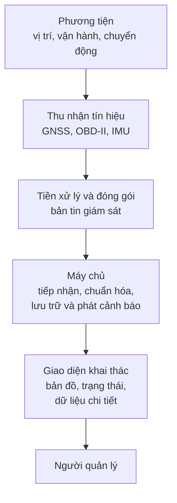
```mermaid
flowchart TB
    Vehicle["Phương tiện<br>vị trí, vận hành, chuyển động"]
    Acquire["Thu nhận tín hiệu<br>GNSS, OBD-II, IMU"]
    Packet["Tiền xử lý và đóng gói<br>bản tin giám sát"]
    Server["Máy chủ<br>tiếp nhận, chuẩn hóa,<br>lưu trữ và phát cảnh báo"]
    Interface["Giao diện khai thác<br>bản đồ, trạng thái,<br>dữ liệu chi tiết"]
    Manager["Người quản lý"]

    Vehicle --> Acquire --> Packet --> Server --> Interface --> Manager
```

_Hình 3.1: Nguyên lý chuyển hóa dữ liệu từ phương tiện thành thông tin quản lý_

### 3.1.2. Các ràng buộc kỹ thuật chi phối phương án – Governing technical constraints

Các ràng buộc kỹ thuật chi phối phương án thiết kế có thể quy về bốn nhóm chính như sau:

- **Ràng buộc ở lớp thiết bị:** Bộ theo dõi phải gọn, ít dây, dễ tháo lắp khi đổi xe, đồng
  thời không làm tăng mức can thiệp vào hệ điện hay ECU của xe. Vì vậy, khối điều khiển trung tâm,
  khối truyền dữ liệu - định vị và cách lấy dữ liệu OBD-II phải được cân nhắc cùng nhau.
- **Ràng buộc về năng lượng:** Thiết bị bám vào ắc quy xe nên không được để dòng nền tích
  lũy thành mức hao điện đáng kể khi xe đỗ dài ngày. Tuy nhiên, hệ thống vẫn phải giữ được
  khả năng trở lại trạng thái hoạt động để phát hiện rung, dịch chuyển hoặc thay đổi trạng thái xe;
  do đó phần nguồn, cảm biến và cơ chế chuyển giữa hoạt động và ngủ sâu phải được xét như một
  cụm chung.
- **Ràng buộc ở tuyến truyền dữ liệu:** Xe hoạt động trong điều kiện sóng thay đổi liên tục,
  nên phương án truyền không thể giả định kết nối luôn ổn định. Kiến trúc được chọn phải
  chấp nhận mất sóng cục bộ, có bộ nhớ đệm phù hợp và phục hồi được tuyến dữ liệu sau khi
  kết nối lại.
- **Ràng buộc ở lớp khai thác thông tin:** Dữ liệu thu được có nhiều lớp, nhưng giao diện
  vận hành không thể trở thành nơi dồn mọi thứ. Phương án chỉ được xem là đạt khi phần phức
  tạp được giữ ở lớp thiết bị và lớp máy chủ, còn giao diện chỉ giữ những tín hiệu thực sự
  cần cho quyết định quản lý.

## 3.2. Đề xuất các giải pháp – Proposed multiple solutions

### 3.2.1. Đề xuất giải pháp phần cứng thiết bị (Hardware Design)

a, Phương án lấy dữ liệu từ phương tiện

Ở nhánh OBD-II, đồ án chỉ cần thu nhóm dữ liệu phục vụ quản lý nên không đi theo hướng chẩn
đoán sâu hay can thiệp nhiều vào xe. Hai hướng triển khai thực tế được xét gồm dùng bộ chuyển
đổi ELM327 có dây và dùng bộ đọc Bluetooth `vgate iCar Pro`. Trong đó, ELM327 là dòng mạch
giao tiếp thường gặp trong nhóm bộ đọc OBD-II giá rẻ. Mạch này chuyển yêu cầu OBD-II sang
dạng lệnh nối tiếp để bộ xử lý bên ngoài đọc các tham số cơ bản.

**Bảng 3.1: Ma trận đánh giá phương án thu dữ liệu OBD-II**

| Tiêu chí đánh giá                                      | Trọng số (%) | ELM327 có dây | `vgate iCar Pro` |
| :----------------------------------------------------- | :----------- | :------------ | :--------------- |
| Hạn chế can thiệp vào hệ thống điện của phương tiện    | 35           | 3             | 5                |
| Khả năng tương thích giao thức trên nhiều dòng xe      | 30           | 3             | 5                |
| Thuận tiện khi tháo lắp                                | 20           | 2             | 5                |
| Mức đáp ứng nhóm tham số quản lý cần theo dõi          | 15           | 4             | 4                |
| **Tổng điểm quy đổi**                                  | **100**      | **3,00**      | **4,85**         |

Kết quả ở Bảng 3.1 cho thấy `vgate iCar Pro` phù hợp hơn phương án ELM327 có dây. Phương án
này vẫn giữ được nhóm dữ liệu cần thiết, nhưng ít xâm lấn hơn và thuận tiện hơn khi đội xe có nhiều loại xe khác nhau.

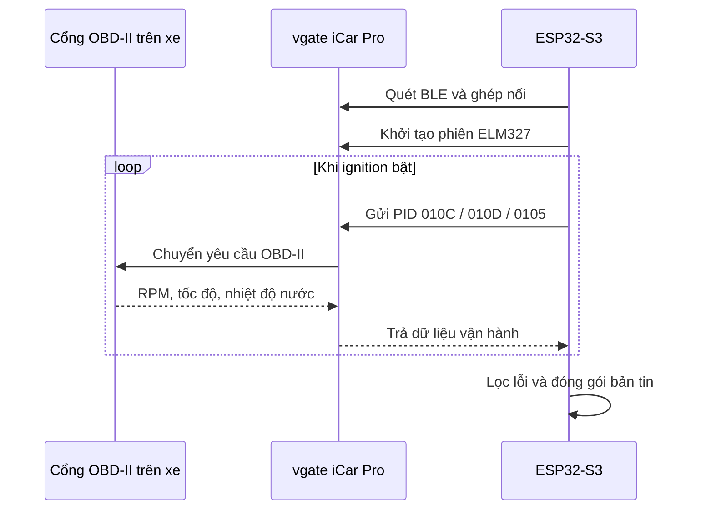
```mermaid
sequenceDiagram
    participant ECU as Cổng OBD-II trên xe
    participant Adapter as vgate iCar Pro
    participant ESP as ESP32-S3

    ESP->>Adapter: Quét BLE và ghép nối
    ESP->>Adapter: Khởi tạo phiên ELM327
    loop Khi ignition bật
        ESP->>Adapter: Gửi PID 010C / 010D / 0105
        Adapter->>ECU: Chuyển yêu cầu OBD-II
        ECU-->>Adapter: RPM, tốc độ, nhiệt độ nước
        Adapter-->>ESP: Trả dữ liệu vận hành
    end
    ESP->>ESP: Lọc lỗi và đóng gói bản tin
```

_Hình 3.2: Nguyên lý đọc dữ liệu OBD-II qua bộ đọc Bluetooth vgate iCar Pro_

b, Phương án duy trì giám sát khi xe đỗ

Khi khóa điện tắt, thiết bị không nên duy trì toàn bộ hoạt động (modem 4G, GNSS và OBD-II) như lúc xe
đang hoạt động; nhưng cũng không thể tắt hẳn vì vẫn cần nhận biết rung hoặc dịch chuyển
bất thường. Vì vậy, phương án ở nhánh này được xét như một cặp: phần tử đánh thức tiêu
thụ thấp và cách cấp nguồn cho các khối còn lại. Nguồn chung là cách cấp cùng một nhánh
cho phần giám sát và các tải lớn; nguồn theo khóa điện chỉ còn nguồn khi xe bật khóa và
mất nguồn khi xe tắt khóa; còn nguồn chia nhánh giữ một nhánh nhỏ luôn cấp cho đánh thức,
trong khi modem, GNSS và OBD-II được đóng cắt riêng.

**Bảng 3.2: Ma trận đánh giá phương án duy trì giám sát khi xe đỗ**

| Tiêu chí đánh giá                                                        | Trọng số (%) | SW-420 + cấp chung toàn thiết bị | MPU6050 + cấp theo khóa điện | LIS3DSH + nhánh đánh thức riêng |
| :----------------------------------------------------------------------- | :----------- | :------------------------------- | :--------------------------- | :------------------------------ |
| Mức tiêu thụ khi chỉ giữ giám sát trong thời gian xe đỗ                  | 35           | 2                                | 2                            | 5                               |
| Khả năng đánh thức thiết bị bằng chuyển động khi MCU và modem đã ngủ sâu | 25           | 2                                | 4                            | 4                               |
| Khả năng tách modem, GNSS và OBD-II khỏi nhánh luôn cấp                  | 25           | 1                                | 2                            | 5                               |
| Mức an toàn với ắc quy và độ ổn định khi modem phát dòng xung            | 15           | 2                                | 3                            | 5                               |
| **Tổng điểm quy đổi**                                                    | **100**      | **1,75**                         | **2,65**                     | **4,75**                        |

Theo Bảng 3.2, LIS3DSH kết hợp nhánh đánh thức riêng phù hợp hơn cho trạng thái xe đỗ. Phương
án này giữ lại đường đánh thức tiêu thụ thấp, đồng thời cho phép đưa phần lớn thiết bị về
ngủ sâu và cô lập nhánh modem khỏi nguồn logic khi có xung dòng lớn.

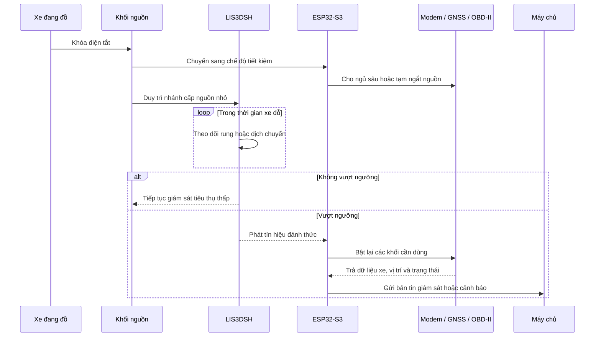
```mermaid
sequenceDiagram
    participant Xe as Xe đang đỗ
    participant Nguon as Khối nguồn
    participant LIS as LIS3DSH
    participant ESP32 as ESP32-S3
    participant Tai as Modem / GNSS / OBD-II
    participant MayChu as Máy chủ

    Xe->>Nguon: Khóa điện tắt
    Nguon->>ESP32: Chuyển sang chế độ tiết kiệm
    ESP32->>Tai: Cho ngủ sâu hoặc tạm ngắt nguồn
    Nguon->>LIS: Duy trì nhánh cấp nguồn nhỏ

    loop Trong thời gian xe đỗ
        LIS->>LIS: Theo dõi rung hoặc dịch chuyển
    end

    alt Không vượt ngưỡng
        LIS-->>Nguon: Tiếp tục giám sát tiêu thụ thấp
    else Vượt ngưỡng
        LIS-->>ESP32: Phát tín hiệu đánh thức
        ESP32->>Tai: Bật lại các khối cần dùng
        Tai-->>ESP32: Trả dữ liệu xe, vị trí và trạng thái
        ESP32->>MayChu: Gửi bản tin giám sát hoặc cảnh báo
    end
```

_Hình 3.3: Nguyên lý giữ nhánh phát hiện chuyển động bằng LIS3DSH khi xe đỗ_

c, Phương án truyền dữ liệu và định vị

Ở tuyến truyền dữ liệu và định vị, thiết bị chỉ gửi các bản tin nhỏ như vị trí, trạng thái
và cảnh báo; do đó vấn đề chính không phải là tốc độ truyền cực đại. Điều cần cân nhắc là
cách ghép khối truyền dữ liệu di động với khối định vị sao cho ít khối phải điều khiển, nguồn
ổn định và phù hợp với không gian lắp trong xe. Các mô-đun chỉ hỗ trợ 2G không được đưa vào
so sánh vì không còn phù hợp với điều kiện mạng di động tại Việt Nam [13]. Ba phương án đại diện
được xét gồm:

1. **EC200U-CN + L76K:** EC200U-CN đảm nhiệm truyền dữ liệu LTE Cat 1, còn L76K là mô-đun
   GNSS rời. Cách này dùng được mạng 4G hiện nay, nhưng thiết bị vẫn phải điều khiển riêng
   khối truyền dữ liệu và khối định vị.
2. **A7670C + ATGM336H:** A7670C đảm nhiệm truyền dữ liệu LTE, ATGM336H đảm nhiệm định vị
   GNSS. Phương án này cũng đi theo hướng 4G, nhưng phần định vị vẫn tách thành một khối riêng.
3. **SIM7600CE-T:** Mô-đun này tích hợp LTE và GNSS trong cùng một khối, giúp gom phần truyền
   dữ liệu và định vị về cùng một đường điều khiển.

**Bảng 3.3: Ma trận đánh giá phương án truyền dữ liệu và định vị**

| Tiêu chí đánh giá                                                    | Trọng số (%) | EC200U-CN + L76K | A7670C + ATGM336H | SIM7600CE-T LTE/GNSS |
| :------------------------------------------------------------------- | :----------- | :--------------- | :---------------- | :------------------- |
| Số khối phải khởi tạo và giám sát cho truyền dữ liệu và định vị      | 30           | 2                | 2                 | 5                    |
| Độ phức tạp của nguồn, mạch vô tuyến và bố trí ăng ten trên thiết bị | 30           | 3                | 3                 | 5                    |
| Khả năng giữ và khôi phục đường truyền, vị trí khi xe di động        | 25           | 4                | 4                 | 4                    |
| Mức phù hợp với không gian lắp trên xe và vỏ thiết bị                | 15           | 3                | 3                 | 5                    |
| **Tổng điểm quy đổi**                                                | **100**      | **2,95**         | **3,00**          | **4,75**             |

Theo Bảng 3.3, SIM7600CE-T là phương án phù hợp hơn trong nhóm so sánh. Lợi thế cốt lõi
của mô-đun này là gom đường truyền dữ liệu và định vị về một khối thống nhất, từ đó giảm
rõ phần nguồn, ăng ten và trình tự khởi tạo phải xử lý trên thiết bị.

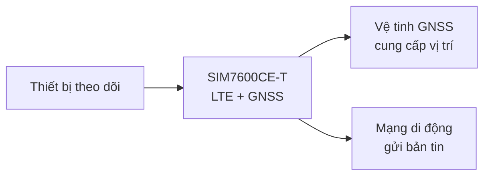
```mermaid
flowchart LR
    Device["Thiết bị theo dõi"]
    Module["SIM7600CE-T<br/>LTE + GNSS"]
    Gnss["Vệ tinh GNSS<br/>cung cấp vị trí"]
    Mobile["Mạng di động<br/>gửi bản tin"]

    Device --> Module
    Module --> Gnss
    Module --> Mobile
```

_Hình 3.4: Nguyên lý sử dụng SIM7600CE-T cho tuyến truyền dữ liệu và định vị_

d, Phương án bộ điều khiển trung tâm

Bộ điều khiển trung tâm phải ghép được modem LTE/GNSS, kết nối OBD-II không dây, cảm biến
đánh thức, bộ nhớ đệm và cổng bảo trì. Vì vậy, việc so sánh MCU tập trung vào số giao tiếp,
mức tích hợp không dây, khả năng ngủ sâu và lượng phần cứng phụ phải ghép thêm. Ba hướng đại
diện được đưa vào so sánh gồm ESP32-S3, STM32L4 ghép Bluetooth rời và nRF52840.

**Bảng 3.4: Ma trận đánh giá phương án bộ điều khiển trung tâm**

| Tiêu chí đánh giá                                                                    | Trọng số (%) | ESP32-S3 | STM32L4 + Bluetooth rời | nRF52840 |
| :----------------------------------------------------------------------------------- | :----------- | :------- | :---------------------- | :------- |
| Khả năng giữ đồng thời các giao tiếp cho modem, BLE OBD-II, IMU và cổng bảo trì      | 35           | 5        | 4                       | 3        |
| Phần nhớ và tài nguyên còn lại cho lưu đệm bản tin, nhật ký lỗi và cập nhật firmware | 25           | 4        | 3                       | 2        |
| Khả năng vào ngủ sâu và đánh thức bằng tín hiệu ngoài                                | 20           | 4        | 5                       | 4        |
| Mức phải ghép thêm chip vô tuyến và mạch phụ trợ                                     | 20           | 5        | 2                       | 3        |
| **Tổng điểm quy đổi**                                                                | **100**      | **4,55** | **3,55**                | **2,95** |

Từ Bảng 3.4, ESP32-S3 là phương án được lựa chọn vì giữ được đủ giao tiếp cho toàn bộ thiết bị.

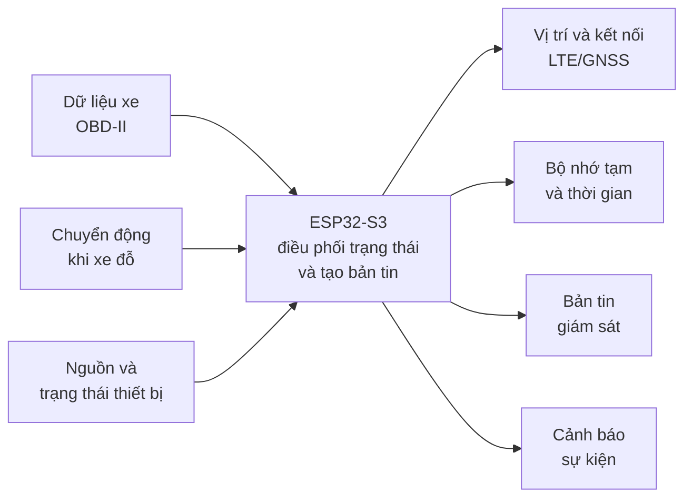
```mermaid
flowchart LR
    OBD["Dữ liệu xe<br/>OBD-II"]
    Motion["Chuyển động<br/>khi xe đỗ"]
    Power["Nguồn và<br/>trạng thái thiết bị"]
    ESP["ESP32-S3<br/>điều phối trạng thái<br/>và tạo bản tin"]
    Link["Vị trí và kết nối<br/>LTE/GNSS"]
    Buffer["Bộ nhớ tạm<br/>và thời gian"]
    Packet["Bản tin<br/>giám sát"]
    Alert["Cảnh báo<br/>sự kiện"]

    OBD --> ESP
    Motion --> ESP
    Power --> ESP
    ESP --> Link
    ESP --> Buffer
    ESP --> Packet
    ESP --> Alert
```

_Hình 3.5: Vai trò điều phối trung tâm của ESP32-S3 trong phương án thiết bị_

### 3.2.2. Đề xuất giải pháp phần mềm nhúng (Embedded Software)

Ở lớp phần mềm nhúng, vấn đề cần xác định trước hết là nền tảng phát triển và cách tổ chức
thực thi trên ESP32-S3. Thiết bị phải đồng thời làm việc với modem LTE/GNSS, kết nối BLE tới
bộ đọc OBD-II, lưu đệm cục bộ và giữ khả năng mở rộng cho bảo trì sau này. Vì vậy, ở bước
đề xuất giải pháp, phần mềm nhúng được xét theo ba hướng sau:

1. **Arduino core trên ESP32:** Cách này thuận tiện khi dựng nguyên mẫu nhanh, thư viện phong
   phú và dễ tiếp cận, nhưng việc kiểm soát tài nguyên, tác vụ nền và mở rộng hệ thống dài hạn
   không phải là điểm mạnh.
2. **ESP-IDF theo vòng lặp chính:** Hướng này bám sát SDK chính thức của hãng Espressif, giúp kiểm
   soát phần cứng tốt hơn và khai thác đầy đủ driver hệ thống, nhưng khi số khối ngoại vi tăng lên
   thì việc dồn phần lớn xử lý vào một luồng chính sẽ sớm chật.
3. **ESP-IDF kết hợp FreeRTOS:** Đây là hướng dùng SDK chính thức đồng thời tổ chức các tác vụ
   theo cơ chế thời gian thực, phù hợp hơn khi thiết bị phải ghép nhiều nhánh xử lý có nhịp làm việc khác nhau.

Các phương án được so sánh theo bốn tiêu chí: mức phù hợp khi tích hợp nhiều khối ngoại vi,
khả năng kiểm soát tài nguyên và tác vụ nền, thuận lợi cho bảo trì - mở rộng firmware, và mức
dựa vào nền tảng chính thức của nhà sản xuất.

**Bảng 3.5: Ma trận đánh giá phương án phần mềm nhúng trên thiết bị**

| Tiêu chí đánh giá                                                              | Trọng số (%) | Arduino core trên ESP32 | ESP-IDF theo vòng lặp chính | ESP-IDF + FreeRTOS |
| :----------------------------------------------------------------------------- | :----------- | :---------------------- | :-------------------------- | :----------------- |
| Mức phù hợp khi tích hợp đồng thời modem, BLE OBD-II, lưu đệm và nhánh bảo trì | 35           | 3                       | 4                           | 5                  |
| Khả năng kiểm soát tài nguyên, tác vụ nền và nhịp xử lý của hệ thống           | 25           | 2                       | 3                           | 5                  |
| Thuận lợi cho bảo trì, mở rộng và tổ chức lại firmware khi hệ thống lớn dần    | 25           | 3                       | 4                           | 5                  |
| Mức bám sát nền tảng chính thức của Espressif                                  | 15           | 2                       | 5                           | 5                  |
| **Tổng điểm quy đổi**                                                          | **100**      | **2,70**                | **4,00**                    | **5,00**           |

Từ Bảng 3.5, hướng ESP-IDF kết hợp FreeRTOS có điểm cao nhất nên được lựa chọn.

### 3.2.3. Đề xuất giải pháp truyền bản tin và định hướng tổ chức phía máy chủ (Communication and Server Organization)

Ở lớp truyền dữ liệu, bước đầu tiên là chọn kênh đưa bản tin từ thiết bị lên máy chủ. Dữ liệu của hệ
thống chủ yếu là các gói tin nhỏ, phát sinh theo chu kỳ hoặc theo sự kiện, đi qua mạng di động
và có thể bị gián đoạn. Vì vậy, giao thức được chọn phải đủ nhẹ cho thiết bị, dễ tách nhóm dữ
liệu và hỗ trợ tốt cho tình huống mất sóng rồi gửi bù. Ba hướng được xét gồm:

- **HTTPS/REST - giao thức gửi yêu cầu tới API (Application Programming Interface - giao diện lập trình ứng dụng) của máy chủ**
  - Cách này cho thiết bị gửi từng yêu cầu riêng lên API của máy chủ; máy chủ nhận xong thì trả phản
    hồi và kết thúc phiên trao đổi. Về bản chất, mỗi bản tin dữ liệu tương ứng với một lần yêu cầu -
    phản hồi riêng biệt giữa thiết bị và máy chủ.
  - Ưu điểm là quen thuộc, dễ lập trình và dễ kiểm thử bằng các công cụ web thông dụng.
  - Hạn chế là khi dữ liệu phát sinh lặp lại theo chu kỳ ngắn, việc phải mở và đóng nhiều phiên trao
    đổi làm tuyến truyền nặng hơn mức cần thiết.

- **WebSocket/TCP - cơ chế duy trì kết nối liên tục giữa thiết bị và máy chủ**
  - Cách này cho thiết bị tạo một kết nối liên tục với máy chủ và giữ kết nối đó trong suốt thời gian
    làm việc, nên dữ liệu có thể đi hai chiều trên cùng một đường truyền. Về bản chất, thiết bị và
    máy chủ duy trì một phiên kết nối kéo dài để trao đổi dữ liệu liên tục.
  - Ưu điểm là thuận lợi khi cần cập nhật liên tục.
  - Hạn chế là phụ thuộc nhiều vào việc kết nối phải được giữ ổn định, trong khi thiết bị có thể đi
    vào ngủ sâu hoặc di chuyển qua vùng sóng yếu.

- **MQTT qua TLS - giao thức bản tin nhẹ có mã hóa đường truyền**
  - Cách này không gửi dữ liệu thẳng vào một API cố định mà đưa từng bản tin lên các kênh chủ đề; phía
    máy chủ sẽ đăng ký nhận theo từng nhóm chủ đề tương ứng. Về bản chất, bản tin được phân loại theo
    từng chủ đề ngay từ khi phát đi, nhờ đó phía nhận chỉ cần xử lý đúng nhóm dữ liệu liên quan.
  - `MQTT` (Message Queuing Telemetry Transport - giao thức truyền bản tin nhẹ) được thiết kế cho bản
    tin nhỏ và thiết bị tài nguyên hạn chế, còn `TLS` (Transport Layer Security - giao thức bảo mật lớp
    truyền tải) là lớp mã hóa bổ sung để bảo vệ dữ liệu khi truyền qua mạng di động công cộng.
  - Vì vậy, hướng này gọn hơn cho bài toán giám sát lặp lại và thuận lợi hơn khi cần tách riêng dữ liệu
    vị trí, trạng thái và cảnh báo.

**Bảng 3.6: Ma trận đánh giá giao thức truyền bản tin từ thiết bị**

| Tiêu chí đánh giá                                                     | Trọng số (%) | HTTPS/REST | WebSocket/TCP | MQTT qua TLS |
| :-------------------------------------------------------------------- | :----------- | :--------- | :------------ | :----------- |
| Phù hợp với bản tin nhỏ, gửi định kỳ hoặc theo sự kiện                | 30           | 3          | 4             | 5            |
| Mức nhẹ cho thiết bị và modem khi truyền qua mạng di động             | 25           | 3          | 3             | 5            |
| Khả năng phân tách dữ liệu vị trí, trạng thái và cảnh báo theo chủ đề | 25           | 2          | 3             | 5            |
| Thuận lợi cho gửi lại, gửi bù sau gián đoạn kết nối                   | 20           | 3          | 2             | 4            |
| **Tổng điểm quy đổi**                                                 | **100**      | **2,75**   | **3,10**      | **4,80**     |

Từ Bảng 3.6, `MQTT qua TLS` được chọn làm giao thức truyền bản tin chính từ thiết bị lên máy chủ.
Hướng này phù hợp với bản tin nhỏ, phát sinh lặp lại và kết nối di động có thể gián đoạn.

Khi giao thức truyền bản tin đã được xác định, vấn đề tiếp theo là cách tổ chức phần máy chủ để tiếp
nhận, xử lý và lưu trữ dữ liệu. Ba hướng chính được xem xét gồm:

- **Backend (lớp xử lý nghiệp vụ phía máy chủ) nhận và xử lý trực tiếp - một ứng dụng duy nhất đảm nhiệm toàn bộ tuyến dữ liệu**
  - Cách này gom phần nhận bản tin, xử lý nghiệp vụ và lưu trữ vào cùng một ứng dụng.
  - Về bản chất, toàn bộ tuyến xử lý dữ liệu được đặt trong một khối chức năng duy nhất.
  - Ưu điểm là số lượng dịch vụ ít, cấu trúc ban đầu tương đối đơn giản.
  - Hạn chế là khi khối lượng dữ liệu tăng lên, phần tiếp nhận bản tin và phần nghiệp vụ dễ ảnh hưởng
    lẫn nhau, đồng thời việc mở rộng hoặc khoanh vùng lỗi cũng kém thuận lợi hơn.

- **MQTT broker (lớp tiếp nhận và phân phối bản tin) + backend xử lý tập trung - tách lớp nhận bản tin nhưng vẫn dồn xử lý vào backend**
  - Cách này tách riêng lớp tiếp nhận bản tin bằng broker, còn phần backend phía sau vẫn đảm nhiệm gần
    như toàn bộ việc chuẩn hóa, lưu trữ và phát sinh cảnh báo.
  - Về bản chất, tuyến dữ liệu đã có lớp vào riêng, nhưng phần xử lý phía sau vẫn tập trung nặng vào
    một ứng dụng chính.
  - Ưu điểm là đỡ tải hơn so với phương án gom toàn bộ vào backend.
  - Hạn chế là backend vẫn phải gánh phần lớn trách nhiệm của tuyến xử lý dữ liệu, nên dư địa tách lớp
    và mở rộng hệ thống chưa thật sự rõ ràng.

- **MQTT broker (lớp tiếp nhận và phân phối bản tin) + lớp trung gian + lưu trữ tách vai trò - chia tuyến dữ liệu thành nhiều lớp chức năng**
  - Cách này để broker tiếp nhận bản tin, lớp trung gian thực hiện chuẩn hóa và phân luồng, còn các kho
    dữ liệu được tách theo mục đích sử dụng.
  - Về bản chất, tuyến dữ liệu được chia thành các lớp tiếp nhận, xử lý và lưu trữ với vai trò rõ ràng
    hơn ngay từ đầu.
  - Ưu điểm là thuận lợi cho việc tách riêng dữ liệu nghiệp vụ, dữ liệu chuỗi thời gian và log, đồng thời
    phù hợp hơn khi cần tiếp nhận dữ liệu gửi dồn hoặc mở rộng phạm vi giám sát.
  - Hạn chế là cấu trúc nhiều lớp hơn và đòi hỏi tổ chức hệ thống chặt chẽ hơn ở phía máy chủ.

**Bảng 3.7: Ma trận đánh giá định hướng tổ chức tiếp nhận và xử lý dữ liệu phía máy chủ**

| Tiêu chí đánh giá                                                | Trọng số (%) | Backend nhận và xử lý trực tiếp | MQTT broker + backend xử lý tập trung | MQTT broker + lớp trung gian + lưu trữ tách vai trò |
| :--------------------------------------------------------------- | :----------- | :------------------------------ | :------------------------------------ | :-------------------------------------------------- |
| Tách tuyến nhận bản tin khỏi lớp nghiệp vụ và giao diện          | 30           | 1                               | 3                                     | 5                                                   |
| Hấp thụ được bản tin gửi dồn khi thiết bị có lại kết nối         | 25           | 2                               | 3                                     | 5                                                   |
| Dễ tách riêng dữ liệu nghiệp vụ, dữ liệu chuỗi thời gian và log  | 25           | 2                               | 3                                     | 5                                                   |
| Phục vụ đồng thời cập nhật gần thời gian thực và tra cứu lịch sử | 20           | 3                               | 4                                     | 4                                                   |
| **Tổng điểm quy đổi**                                            | **100**      | **1,90**                        | **3,20**                              | **4,80**                                            |

Từ Bảng 3.7, hướng tổ chức theo MQTT broker, lớp trung gian và lưu trữ tách vai trò được chọn cho phần
máy chủ. Cách tổ chức này giúp tách lớp nhận bản tin khỏi lớp xử lý nghiệp vụ, nên phù hợp hơn khi
thiết bị gửi bù dữ liệu hoặc khi hệ thống cần mở rộng giám sát.

## 3.3. Phân tích, đánh giá và lựa chọn phương án khả thi – Analysis, Evaluation and Selection

### 3.3.1. Kiến trúc hệ thống được chọn – Selected system architecture

Sau bước so sánh ở Mục 3.2, phương án khả thi được chốt theo ba khối chính: thiết bị theo dõi
trên xe, cụm tiếp nhận - xử lý dữ liệu ở máy chủ và giao diện khai thác. Hình 3.6 thể hiện quan
hệ giữa ba khối trong cùng một tuyến giám sát.

```mermaid
flowchart LR
    subgraph Device["Thiết bị trên xe"]
        ESP["ESP32-S3 điều phối"]
        OBD["OBD-II Bluetooth"]
        LTE["SIM7600CE-T LTE/GNSS"]
        IMU["LIS3DSH đánh thức"]
        Queue["Bộ nhớ đệm"]
    end

    subgraph Process["Tiếp nhận và xử lý"]
        MQTT["Nhận bản tin MQTT"]
        Normalize["Chuẩn hóa dữ liệu"]
        Store["Lưu trữ dữ liệu"]
        Alert["Xử lý cảnh báo"]
        Api["Cung cấp dữ liệu"]
    end

    subgraph Interface["Giao diện khai thác"]
        Map["Bản đồ vị trí"]
        Status["Trạng thái xe"]
        History["Lịch sử hành trình"]
        AlertQueue["Hàng đợi cảnh báo"]
        Report["Báo cáo đo kiểm"]
    end

    Device --> Process --> Interface
```

_Hình 3.6: Kiến trúc tổng thể của phương án hệ thống được chọn_

### 3.3.2. Phân tích chức năng các khối trong phương án được chọn – Functional analysis of selected blocks

- **Khối 1 - Thiết bị theo dõi trên xe**
  - Vai trò của khối này là thu nhận trạng thái thực của phương tiện và tạo bản tin giám sát gửi về
    máy chủ.
  - Ở khối này, ESP32-S3 giữ vai trò điều phối trung tâm; SIM7600CE-T đảm nhiệm truyền dữ liệu và
    định vị; `vgate iCar Pro` cung cấp dữ liệu OBD-II; LIS3DSH giữ nhánh phát hiện chuyển động khi
    xe đỗ; còn cấu trúc nguồn chia nhánh hỗ trợ chuyển giữa hoạt động và ngủ sâu.
  - Với cách ghép đó, khối thiết bị đáp ứng đồng thời yêu cầu gọn, ít xâm lấn, đủ dữ liệu và có khả
    năng giảm tiêu thụ điện khi xe dừng lâu.

- **Khối 2 - Cụm tiếp nhận và xử lý dữ liệu ở máy chủ**
  - Vai trò của khối này là tiếp nhận bản tin từ thiết bị, chuẩn hóa, lưu trữ và xử lý dữ liệu trước
    khi cấp lại cho giao diện khai thác.
  - Hướng tổ chức được chọn là tách lớp nhận bản tin khỏi lớp xử lý nghiệp vụ, đồng thời phân dữ liệu
    theo vai trò sử dụng.
  - Cách tổ chức này cho phép hệ thống tiếp nhận tốt hơn các bản tin gửi dồn sau mất sóng, đồng thời
    giữ rõ phần tiếp nhận, phần xử lý và phần khai thác dữ liệu.

- **Khối 3 - Giao diện khai thác**
  - Vai trò của khối này là biểu diễn thông tin phục vụ theo dõi và cảnh báo trong quá trình vận hành.
  - Giao diện ưu tiên bản đồ, trạng thái xe và cảnh báo; dữ liệu kỹ thuật chi tiết được đặt ở vùng
    tra cứu phụ.
  - Mục tiêu là giúp người vận hành thấy tín hiệu chính mà không phải xử lý toàn bộ dữ liệu kỹ thuật
    trên cùng một màn hình.

Mối liên hệ giữa bốn nhóm ràng buộc kỹ thuật và các lựa chọn chính trong phương án được khái quát
trong Hình 3.7.

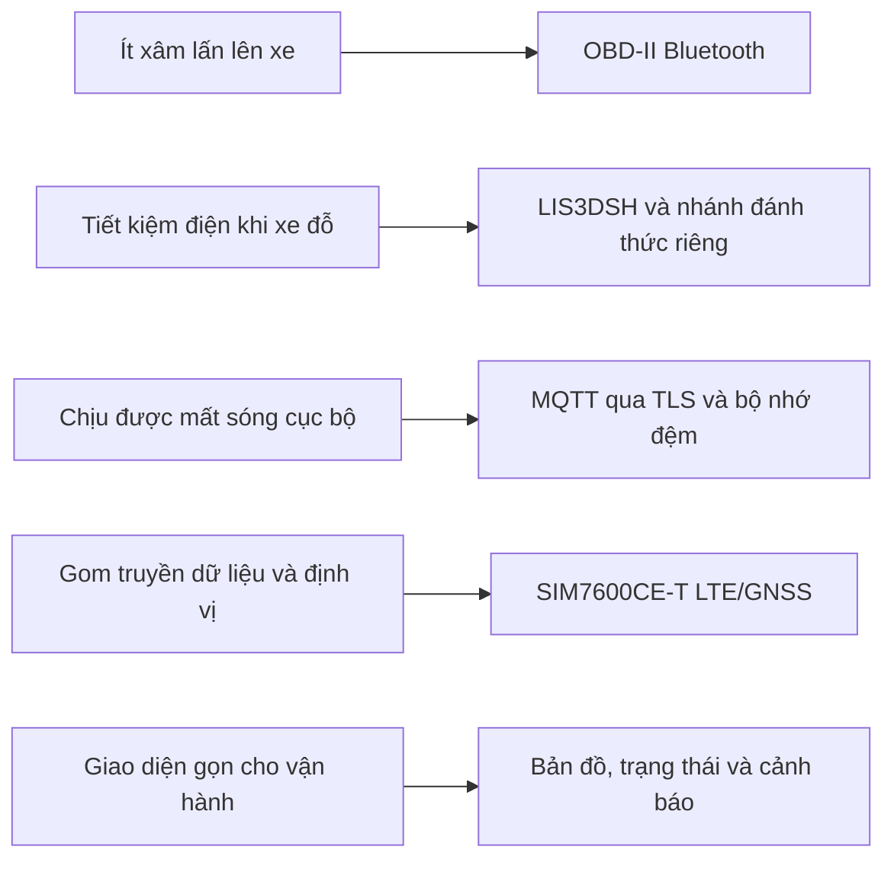
```mermaid
flowchart LR
    C1["Ít xâm lấn lên xe"] --> S1["OBD-II Bluetooth"]
    C2["Tiết kiệm điện khi xe đỗ"] --> S2["LIS3DSH và nhánh đánh thức riêng"]
    C3["Chịu được mất sóng cục bộ"] --> S3["MQTT qua TLS và bộ nhớ đệm"]
    C4["Gom truyền dữ liệu và định vị"] --> S4["SIM7600CE-T LTE/GNSS"]
    C5["Giao diện gọn cho vận hành"] --> S5["Bản đồ, trạng thái và cảnh báo"]
```

_Hình 3.7: Mối liên hệ giữa các ràng buộc kỹ thuật và các lựa chọn chính của phương án_

- **Với yêu cầu ít xâm lấn lên xe**
  - Bộ đọc OBD-II Bluetooth giúp giảm dây tín hiệu phát sinh trong cabin và thuận tiện hơn khi chuyển
    lắp giữa nhiều xe.
  - Mô-đun SIM7600CE-T tích hợp LTE và GNSS trong cùng một khối, từ đó giảm số phần cứng phải bố trí
    và điều khiển trên thiết bị.

- **Với yêu cầu tiết kiệm điện khi xe đỗ**
  - LIS3DSH kết hợp nhánh đánh thức riêng cho phép giữ lại đường phát hiện chuyển động với mức tiêu
    thụ thấp, trong khi các tải lớn có thể được đưa về ngủ sâu.
  - Hướng phần mềm nhúng ESP-IDF kết hợp FreeRTOS tạo điều kiện thuận lợi hơn cho việc điều phối các
    nhánh tác vụ và tổ chức lại hoạt động của thiết bị theo từng trạng thái vận hành.

- **Với yêu cầu giữ ổn định tuyến truyền dữ liệu**
  - MQTT qua TLS phù hợp với bản tin nhỏ, phát sinh lặp lại và có thể bị gián đoạn bởi chất lượng
    mạng di động.
  - Có bộ nhớ đệm cục bộ để lưu trữ dữ liệu trong trường hợp mất kết nối mạng hoàn toàn.
  - Hướng tổ chức máy chủ theo broker, lớp trung gian và lưu trữ tách vai trò giúp tuyến dữ liệu chịu
    đựng tốt hơn khi thiết bị phải gửi bù dữ liệu sau mất sóng.

- **Với yêu cầu giao diện gọn cho vận hành**
  - Giao diện giám sát tập trung trên nền web, ưu tiên bản đồ, trạng thái và cảnh báo.
  - Cách tổ chức này giúp người vận hành theo dõi thông tin chính mà không phải xử lý cùng lúc toàn bộ
    dữ liệu kỹ thuật phát sinh từ hệ thống.

Như vậy, phương án được chọn bám được các ràng buộc chính đã nêu: thiết bị gọn và ít xâm lấn,
tiết kiệm điện khi xe đỗ, truyền được bản tin qua mạng di động và đưa dữ liệu lên giao diện quản lý.

# CHƯƠNG 4. TRIỂN KHAI GIẢI PHÁP VÀ KẾT QUẢ - IMPLEMENTATION AND RESULTS

## 4.1. Triển khai phần cứng thiết bị – Hardware implementation

Quá trình triển khai đi từ việc xác lập kiến trúc thiết bị, đưa mạch xuống
PCB, gia công - hàn lắp, hoàn thiện vỏ đến bước lắp thử trên xe.

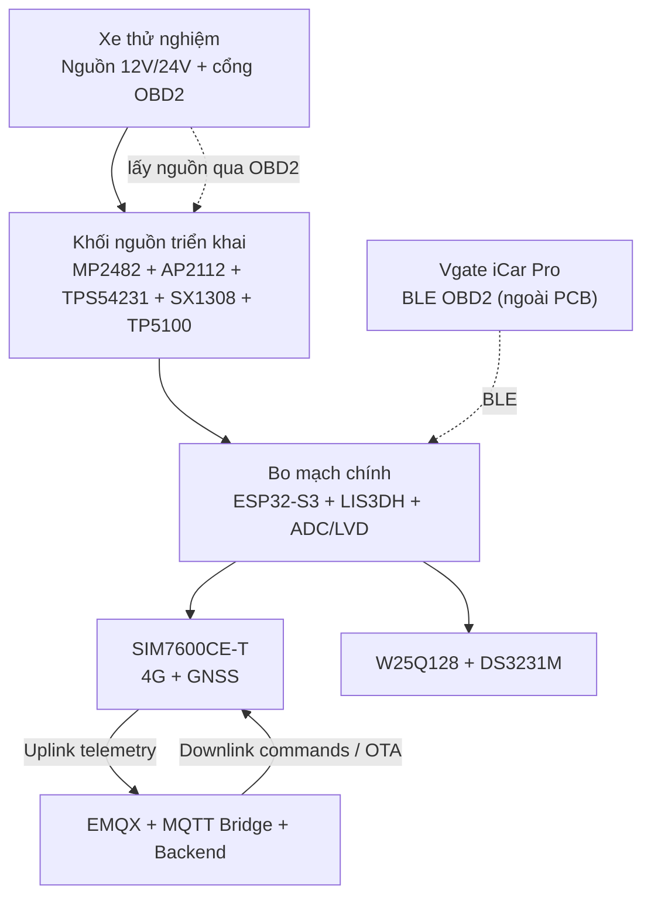
```mermaid
flowchart TB
    Vehicle["Xe thử nghiệm<br/>Nguồn 12V/24V + cổng OBD2"]
    Power["Khối nguồn triển khai<br/>MP2482 + AP2112 + TPS54231 + SX1308 + TP5100"]
    Controller["Bo mạch chính<br/>ESP32-S3 + LIS3DH + ADC/LVD"]
    Modem["SIM7600CE-T<br/>4G + GNSS"]
    OBD["Vgate iCar Pro<br/>BLE OBD2 (ngoài PCB)"]
    Storage["W25Q128 + DS3231M"]
    Cloud["EMQX + MQTT Bridge + Backend"]

    Vehicle --> Power --> Controller
    Vehicle -. lấy nguồn qua OBD2 .-> Power
    OBD -. BLE .-> Controller
    Controller --> Modem
    Modem -->|Uplink telemetry| Cloud
    Cloud -->|Downlink commands / OTA| Modem
    Controller --> Storage
```

_Hình 4.1: Sơ đồ khối tổng quan của thiết bị theo dõi trên xe_

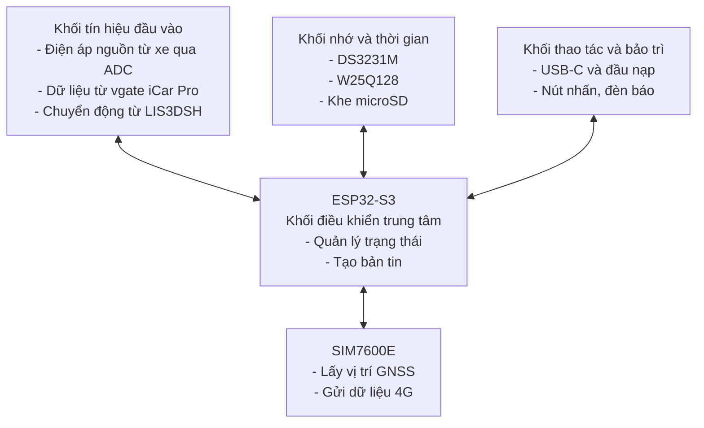
```mermaid
flowchart TB
    Input["Khối tín hiệu đầu vào<br/>- Điện áp nguồn từ xe qua ADC<br/>- Dữ liệu từ vgate iCar Pro<br/>- Chuyển động từ LIS3DSH"]
    Storage["Khối nhớ và thời gian<br/>- DS3231M<br/>- W25Q128<br/>- Khe microSD"]
    Service["Khối thao tác và bảo trì<br/>- USB-C và đầu nạp<br/>- Nút nhấn, đèn báo"]
    MCU["ESP32-S3<br/>Khối điều khiển trung tâm<br/>- Quản lý trạng thái<br/>- Tạo bản tin"]
    Modem["SIM7600E<br/>- Lấy vị trí GNSS<br/>- Gửi dữ liệu 4G"]

    Input <--> MCU
    Storage <--> MCU
    Service <--> MCU
    MCU <--> Modem
```

_Hình 4.2: Khối ESP32-S3 và các nhánh mà bộ điều khiển trung tâm trực tiếp quản lý_

Vai trò của khối điều khiển trung tâm trong Hình 4.2 có thể tóm tắt như sau:

- `ESP32-S3` là khối xử lý trung tâm của thiết bị.
- Khối này tiếp nhận tín hiệu nguồn, dữ liệu xe, tín hiệu chuyển động, mốc thời gian và dữ liệu lưu đệm.
- Các chuyển đổi giữa hoạt động, chờ và ngủ sâu đều do `ESP32-S3` điều phối.

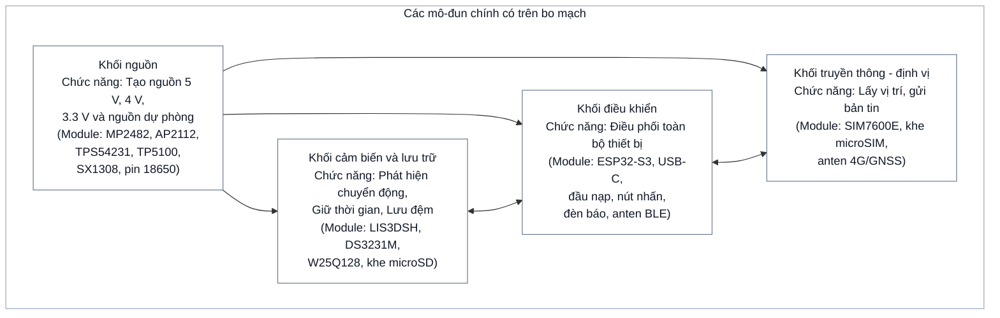
```mermaid
flowchart LR
    subgraph Board["Các mô-đun chính có trên bo mạch"]
        direction LR

        Power["Khối nguồn<br/>Chức năng: Tạo nguồn 5 V, 4 V,<br/>3.3 V và nguồn dự phòng<br/>(Module: MP2482, AP2112,<br/>TPS54231, TP5100,<br/>SX1308, pin 18650)"]

        Control["Khối điều khiển<br/>Chức năng: Điều phối toàn bộ thiết bị<br/>(Module: ESP32-S3, USB-C,<br/>đầu nạp, nút nhấn,<br/>đèn báo, anten BLE)"]

        Data["Khối cảm biến và lưu trữ<br/>Chức năng: Phát hiện chuyển động,<br/>Giữ thời gian, Lưu đệm<br/>(Module: LIS3DSH, DS3231M,<br/>W25Q128, khe microSD)"]

        Comm["Khối truyền thông - định vị<br/>Chức năng: Lấy vị trí, gửi bản tin<br/>(Module: SIM7600E, khe microSIM,<br/>anten 4G/GNSS)"]
    end

    Power --> Control
    Power --> Data
    Power --> Comm
    Data <--> Control
    Control <--> Comm

    style Board fill:#ffffff,stroke:#94a3b8,stroke-width:1px,color:#111827
    style Power fill:#ffffff,stroke:#64748b,color:#111827
    style Control fill:#ffffff,stroke:#64748b,color:#111827
    style Data fill:#ffffff,stroke:#64748b,color:#111827
    style Comm fill:#ffffff,stroke:#64748b,color:#111827
```

_Hình 4.3: Các mô-đun chính có trên bo mạch và quan hệ giữa các cụm chức năng_

Ở mức mô-đun, Hình 4.3 cho thấy các cụm chức năng chính của bo mạch như sau:

- Bo mạch được chia thành các cụm chức năng chính thay vì bố trí linh kiện rời rạc.
- Nhánh nguồn tạo các mức điện áp làm việc và nguồn dự phòng.
- Nhánh cảm biến - lưu trữ phục vụ phát hiện chuyển động, giữ thời gian và lưu dữ liệu cục bộ.
- Nhánh truyền thông - định vị đảm nhiệm lấy vị trí và gửi bản tin.

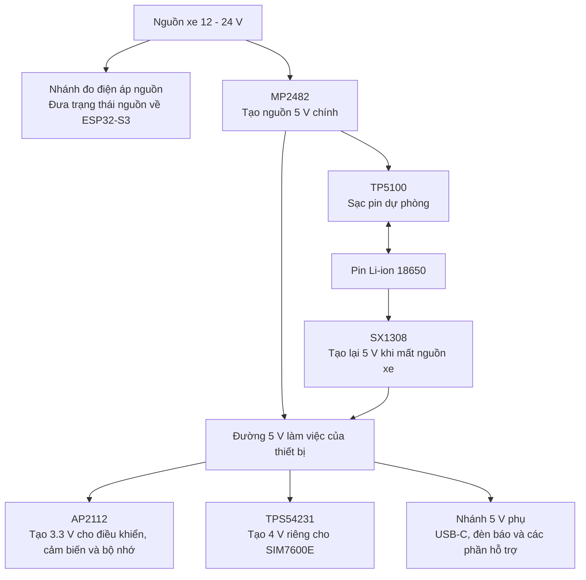
```mermaid
flowchart TB
    Vin["Nguồn xe 12 - 24 V"]
    Sense["Nhánh đo điện áp nguồn<br/>Đưa trạng thái nguồn về ESP32-S3"]
    Buck5["MP2482<br/>Tạo nguồn 5 V chính"]
    Bus5["Đường 5 V làm việc của thiết bị"]
    Charge["TP5100<br/>Sạc pin dự phòng"]
    Battery["Pin Li-ion 18650"]
    Boost5["SX1308<br/>Tạo lại 5 V khi mất nguồn xe"]
    Logic3["AP2112<br/>Tạo 3.3 V cho điều khiển, cảm biến và bộ nhớ"]
    Modem4["TPS54231<br/>Tạo 4 V riêng cho SIM7600E"]
    Aux5["Nhánh 5 V phụ<br/>USB-C, đèn báo và các phần hỗ trợ"]

    Vin --> Buck5
    Vin --> Sense
    Buck5 --> Bus5
    Buck5 --> Charge
    Charge <--> Battery
    Battery --> Boost5
    Boost5 --> Bus5
    Bus5 --> Logic3
    Bus5 --> Modem4
    Bus5 --> Aux5
```

_Hình 4.4: Cấu trúc khối nguồn chính, nguồn dự phòng và các mức nguồn làm việc của thiết bị_

Từ Hình 4.4, cách tổ chức nguồn của thiết bị như sau:

- Nguồn từ xe trước hết tạo bus 5 V làm nguồn trung gian cho toàn thiết bị.
- Từ bus này, hệ thống tách ra 3.3 V cho điều khiển và cảm biến, khoảng 4 V riêng cho `SIM7600CE-T`.
- Pin dự phòng `18650` được sạc trong quá trình làm việc và tạo lại đường 5 V khi mất nguồn xe.

Sau khi xác định được các khối chức năng, thiết bị được thiết kế PCB trên phần mềm Altium Designer.

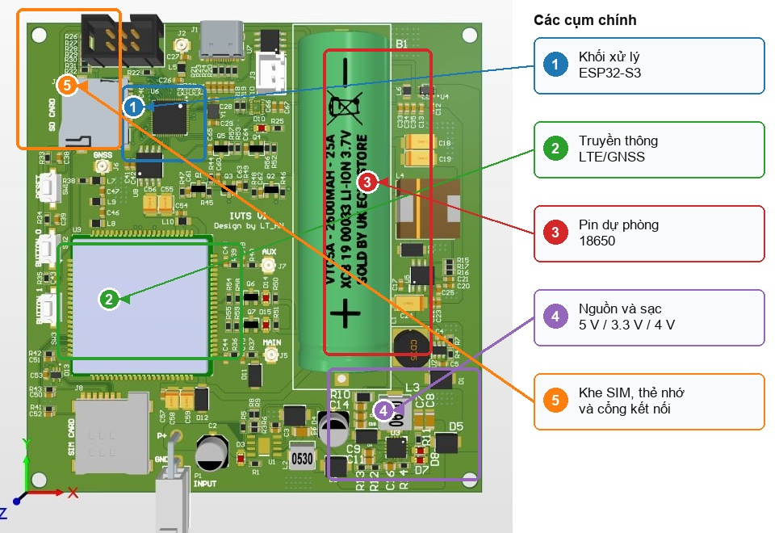

_Hình 4.5: Bố trí mặt trước của PCB với các cụm chính gồm khối xử lý, truyền thông, nguồn và pin dự phòng_

_Hình 4.6: Bo mạch nguyên mẫu sau khi hàn lắp đầy đủ linh kiện và kiểm tra hoạt động ban đầu_

Sau bước hàn lắp, nguyên mẫu tiếp tục được đưa vào vỏ hộp (kích thước 100mm x 100mm x 45mm) để hoàn thiện thiết bị đầy đủ.

_Hình 4.7: Nguyên mẫu phần cứng sau khi lắp trong vỏ và hoàn thiện các kết nối chính_

_Hình 4.8: Thiết bị sau khi đóng vỏ, sẵn sàng cho bước lắp thử và đo kiểm trên xe_

Một số điểm lưu ý khi lắp đặt thiết bị lên phương tiện:

- `vgate iCar Pro` được cắm trực tiếp vào cổng `OBD-II` của xe.
- Thiết bị theo dõi được đặt trong cabin, ưu tiên khu vực dưới táp-lô.
- Dữ liệu xe đi không dây từ `OBD-II`, còn thiết bị chỉ lấy nguồn từ xe và đặt ăng ten ở vị trí thuận lợi
  cho thu sóng.

## 4.2. Triển khai phần mềm hệ thống – Software implementation

### 4.2.1. Phần điều khiển trên thiết bị – Device firmware

Ở phía thiết bị, firmware giữ vai trò điều phối toàn bộ nhịp làm việc của bộ theo dõi: Quyết
định khi nào thiết bị bắt đầu thu dữ liệu, khi nào gửi bản tin, khi nào chuyển sang chế độ ngủ và khi
nào phải thức dậy để kiểm tra lại trạng thái xe.

**Bảng 4.1: Các chức năng chính đã hoàn thiện**

| STT | Nhóm chức năng        | Nội dung đã triển khai                                                                                                           |
| :-- | :-------------------- | :------------------------------------------------------------------------------------------------------------------------------- |
| 1   | Khởi động và phục hồi | Nạp cấu hình làm việc, kiểm tra trạng thái còn giữ lại từ lần chạy trước và chọn nhịp khởi động phù hợp                          |
| 2   | Tổ chức vận hành      | Tách thiết bị thành các pha làm việc chính như kiểm tra trạng thái xe, theo dõi khi xe chạy, theo dõi khi xe đỗ, cảnh báo và ngủ |
| 3   | Thu dữ liệu           | Kết hợp dữ liệu nguồn, dữ liệu `OBD-II`, vị trí `GNSS` và tín hiệu chuyển động để phản ánh trạng thái thực của xe                |
| 4   | Gửi bản tin           | Ghép dữ liệu thành bản tin giám sát và đưa lên máy chủ theo nhịp làm việc của từng pha                                           |
| 5   | Lưu đệm và gửi bù     | Khi mất kết nối, bản tin được giữ cục bộ và phát lại sau khi đường truyền ổn định trở lại                                        |
| 6   | Quản lý chế độ ngủ    | Hạ các nhánh tiêu thụ lớn, giữ đường đánh thức cần thiết và tiết kiệm phần lớn năng lượng khi xe đỗ dài                          |

**a, Khởi động**

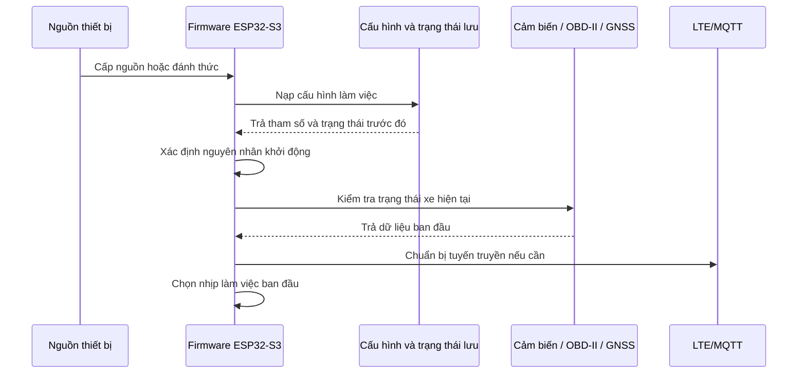
```mermaid
sequenceDiagram
    participant Nguon as Nguồn thiết bị
    participant FW as Firmware ESP32-S3
    participant CauHinh as Cấu hình và trạng thái lưu
    participant CamBien as Cảm biến / OBD-II / GNSS
    participant Mang as LTE/MQTT

    Nguon->>FW: Cấp nguồn hoặc đánh thức
    FW->>CauHinh: Nạp cấu hình làm việc
    CauHinh-->>FW: Trả tham số và trạng thái trước đó
    FW->>FW: Xác định nguyên nhân khởi động
    FW->>CamBien: Kiểm tra trạng thái xe hiện tại
    CamBien-->>FW: Trả dữ liệu ban đầu
    FW->>Mang: Chuẩn bị tuyến truyền nếu cần
    FW->>FW: Chọn nhịp làm việc ban đầu
```

_Hình 4.9: Trình tự khởi động và chọn nhịp làm việc ban đầu của thiết bị_

Sau khi khởi động, thiết bị được nạp cấu hình, xác định nguyên nhân đánh thức và kiểm tra trạng thái
hiện thời của xe. Bước này giúp thiết bị chọn đúng nhịp
làm việc ngay từ đầu, tránh vừa bật lên đã xử lý theo một chế độ không phù hợp.

**b, Thu dữ liệu và gửi bản tin**

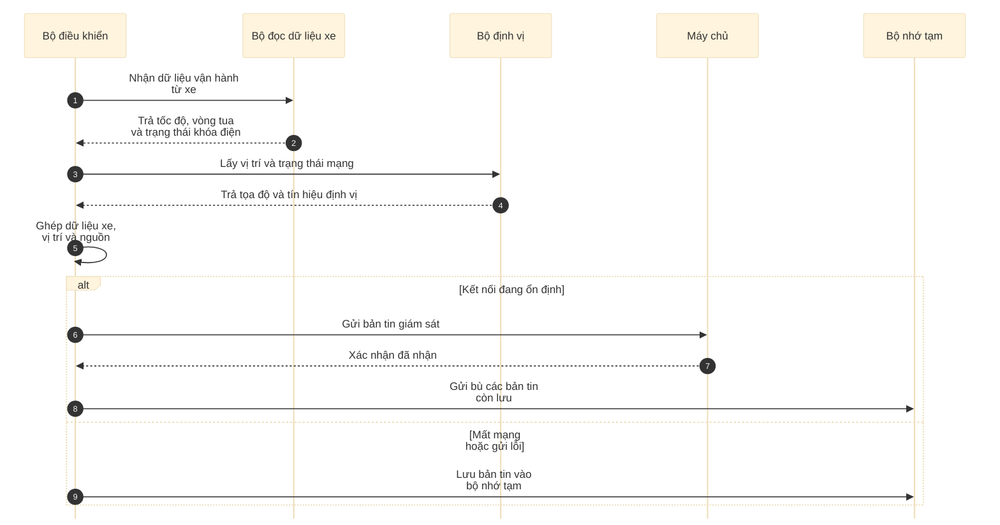
```mermaid
---
config:
  theme: base
  sequence:
    mirrorActors: false
    actorMargin: 155
    messageMargin: 55
    noteMargin: 24
    diagramMarginX: 36
    diagramMarginY: 20
    boxMargin: 12
    boxTextMargin: 8
    actorFontSize: 14
    messageFontSize: 14
---
sequenceDiagram
    autonumber
    participant CTRL as Bộ điều khiển
    participant OBD as Bộ đọc dữ liệu xe
    participant POS as Bộ định vị
    participant NET as Máy chủ
    participant BUF as Bộ nhớ tạm

    CTRL->>OBD: Nhận dữ liệu vận hành<br/>từ xe
    OBD-->>CTRL: Trả tốc độ, vòng tua<br/>và trạng thái khóa điện
    CTRL->>POS: Lấy vị trí và trạng thái mạng
    POS-->>CTRL: Trả tọa độ và tín hiệu định vị
    CTRL->>CTRL: Ghép dữ liệu xe,<br/>vị trí và nguồn
    alt Kết nối đang ổn định
        CTRL->>NET: Gửi bản tin giám sát
        NET-->>CTRL: Xác nhận đã nhận
        CTRL->>BUF: Gửi bù các bản tin<br/>còn lưu
    else Mất mạng<br/>hoặc gửi lỗi
        CTRL->>BUF: Lưu bản tin vào<br/>bộ nhớ tạm
    end
```

_Hình 4.10: Nguyên lý thu dữ liệu và gửi bản tin trong pha hoạt động của thiết bị_

Trong pha hoạt động, thiết bị ghép dữ liệu xe, vị trí và nguồn thành một bản tin giám sát thống nhất.
Nếu đường truyền đang sẵn sàng thì bản tin được gửi ngay; ngược lại, dữ liệu sẽ được giữ cục bộ để
chờ gửi bù. Cách làm này giúp tuyến giám sát không bị đứt khi xe đi qua vùng sóng yếu.

**c, Chuyển sang ngủ và đánh thức lại**

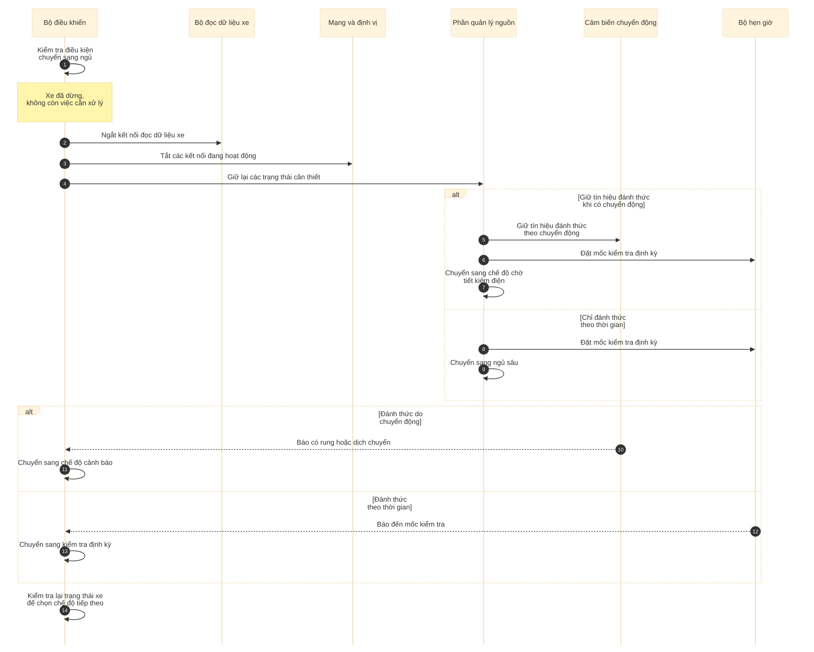
```mermaid
---
config:
  theme: base
  sequence:
    mirrorActors: false
    actorMargin: 150
    messageMargin: 55
    noteMargin: 28
    diagramMarginX: 40
    diagramMarginY: 20
    boxMargin: 12
    boxTextMargin: 8
    actorFontSize: 14
    messageFontSize: 14
    noteFontSize: 13
---
sequenceDiagram
    autonumber
    participant CTRL as Bộ điều khiển
    participant OBD as Bộ đọc dữ liệu xe
    participant NET as Mạng và định vị
    participant PWR as Phần quản lý nguồn
    participant IMU as Cảm biến chuyển động
    participant RTC as Bộ hẹn giờ

    CTRL->>CTRL: Kiểm tra điều kiện<br/>chuyển sang ngủ
    Note over CTRL: Xe đã dừng,<br/>không còn việc cần xử lý
    CTRL->>OBD: Ngắt kết nối đọc dữ liệu xe
    CTRL->>NET: Tắt các kết nối đang hoạt động
    CTRL->>PWR: Giữ lại các trạng thái cần thiết
    alt Giữ tín hiệu đánh thức<br/>khi có chuyển động
        PWR->>IMU: Giữ tín hiệu đánh thức<br/>theo chuyển động
        PWR->>RTC: Đặt mốc kiểm tra định kỳ
        PWR->>PWR: Chuyển sang chế độ chờ<br/>tiết kiệm điện
    else Chỉ đánh thức<br/>theo thời gian
        PWR->>RTC: Đặt mốc kiểm tra định kỳ
        PWR->>PWR: Chuyển sang ngủ sâu
    end
    alt Đánh thức do<br/>chuyển động
        IMU-->>CTRL: Báo có rung hoặc dịch chuyển
        CTRL->>CTRL: Chuyển sang chế độ cảnh báo
    else Đánh thức<br/>theo thời gian
        RTC-->>CTRL: Báo đến mốc kiểm tra
        CTRL->>CTRL: Chuyển sang kiểm tra định kỳ
    end
    CTRL->>CTRL: Kiểm tra lại trạng thái xe<br/>để chọn chế độ tiếp theo
```

_Hình 4.11: Nguyên lý chuyển thiết bị sang chế độ ngủ và đánh thức lại khi xe đỗ_

Khi xe đỗ, thiết bị không tắt ngay mà đi qua bước kiểm tra điều kiện ngủ, sau đó mới hạ các nhánh đang
tiêu thụ và giữ lại các đường đánh thức cần thiết. Nhờ vậy, phần lớn năng lượng được cắt giảm trong
thời gian xe đỗ, nhưng thiết bị vẫn có thể thức dậy theo chu kỳ hoặc khi phát hiện chuyển động bất
thường.

### 4.2.2. Hạ tầng máy chủ và xử lý dữ liệu – Server infrastructure and data processing

Ở phía máy chủ, hệ thống được triển khai thành ba lớp rõ ràng: nhận bản tin, xử lý dữ liệu và cung
cấp thông tin cho giao diện quản lý. Cách tách này giúp bản tin từ thiết bị không bị dồn thẳng vào
cùng một ứng dụng, nên toàn tuyến ổn định hơn khi xe gửi dữ liệu liên tục hoặc gửi bù sau lúc mất
sóng.

**Bảng 4.2: Các chức năng chính đã hoàn thiện**

| STT | Nhóm chức năng                    | Nội dung đã triển khai                                                                          |
| :-- | :-------------------------------- | :---------------------------------------------------------------------------------------------- |
| 1   | Tiếp nhận bản tin                 | Nhận bản tin từ thiết bị qua lớp tiếp nhận bản tin                                              |
| 2   | Kiểm tra và phân luồng            | Tách dữ liệu vị trí, dữ liệu vận hành, sự kiện và phản hồi thiết bị để đưa vào đúng tuyến xử lý |
| 3   | Lưu trữ nghiệp vụ                 | Ghi thông tin thiết bị, phương tiện, cảnh báo và dữ liệu quản lý vào cơ sở dữ liệu              |
| 4   | Lưu trữ theo thời gian và nhật ký | Ghi dữ liệu đo theo thời gian và nhật ký vận hành vào các kho dữ liệu riêng                     |
| 5   | Cung cấp thông tin cho giao diện  | Lớp xử lý phía máy chủ truy vấn dữ liệu, trả kết quả cho giao diện và đẩy cập nhật mới khi cần  |

**a, Tuyến tiếp nhận và xử lý dữ liệu**

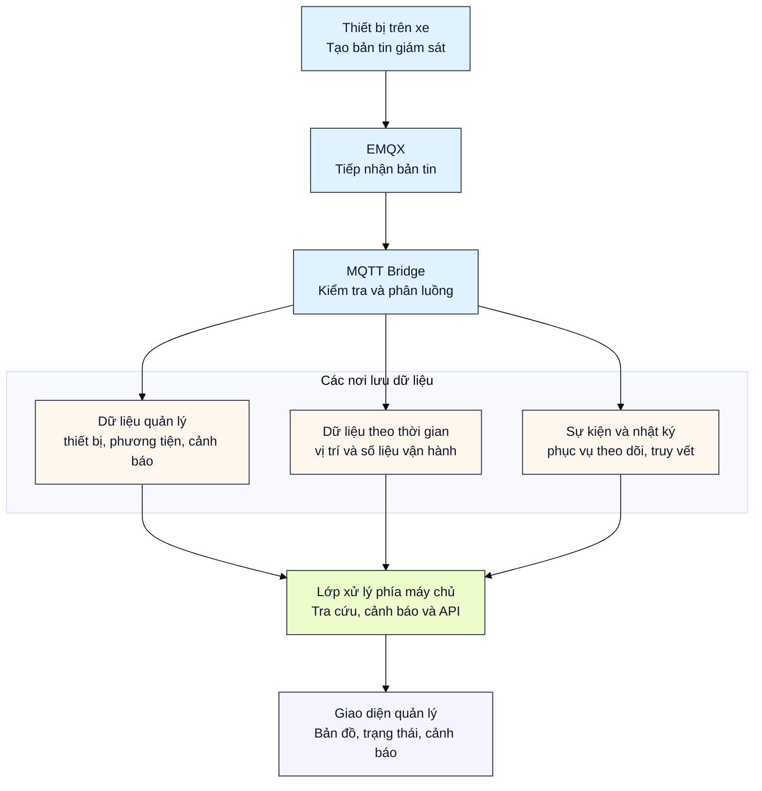
```mermaid
---
config:
  theme: base
  look: classic
  fontFamily: Noto Sans, Segoe UI, Arial, sans-serif
  flowchart:
    htmlLabels: true
    nodeSpacing: 50
    rankSpacing: 70
---
flowchart TB
    Device["Thiết bị trên xe<br/>Tạo bản tin giám sát"]
    Broker["EMQX<br/>Tiếp nhận bản tin"]
    Bridge["MQTT Bridge<br/>Kiểm tra và phân luồng"]

    subgraph Storage["Các nơi lưu dữ liệu"]
        direction LR
        Biz["Dữ liệu quản lý<br/>thiết bị, phương tiện, cảnh báo"]
        Time["Dữ liệu theo thời gian<br/>vị trí và số liệu vận hành"]
        Logs["Sự kiện và nhật ký<br/>phục vụ theo dõi, truy vết"]
    end

    Backend["Lớp xử lý phía máy chủ<br/>Tra cứu, cảnh báo và API"]
    UI["Giao diện quản lý<br/>Bản đồ, trạng thái, cảnh báo"]

    Device --> Broker --> Bridge
    Bridge --> Biz
    Bridge --> Time
    Bridge --> Logs
    Biz --> Backend
    Time --> Backend
    Logs --> Backend
    Backend --> UI

    classDef intake fill:#e0f2fe,stroke:#334155,color:#0f172a,stroke-width:1.2px;
    classDef storage fill:#fff7ed,stroke:#334155,color:#0f172a,stroke-width:1.2px;
    classDef process fill:#ecfccb,stroke:#334155,color:#0f172a,stroke-width:1.2px;
    classDef output fill:#f5f3ff,stroke:#334155,color:#0f172a,stroke-width:1.2px;

    class Device,Broker,Bridge intake;
    class Biz,Time,Logs storage;
    class Backend process;
    class UI output;
```

_Hình 4.12: Tuyến tiếp nhận, xử lý, lưu trữ và khai thác dữ liệu phía máy chủ_

Hình 4.12 thể hiện đường đi chính của dữ liệu từ thiết bị đến giao diện. Bản tin từ xe được đưa vào
`EMQX` (broker MQTT, tức lớp tiếp nhận và phân phối bản tin); sau đó `MQTT Bridge` (dịch vụ cầu nối)
kiểm tra cấu trúc, tách phần cần lưu và chuyển tiếp dữ liệu sang các lớp xử lý tiếp theo. Cách tổ chức
này giữ tuyến nhận bản tin tách khỏi phần tra cứu và hiển thị.

**b, Tổ chức các dịch vụ triển khai**

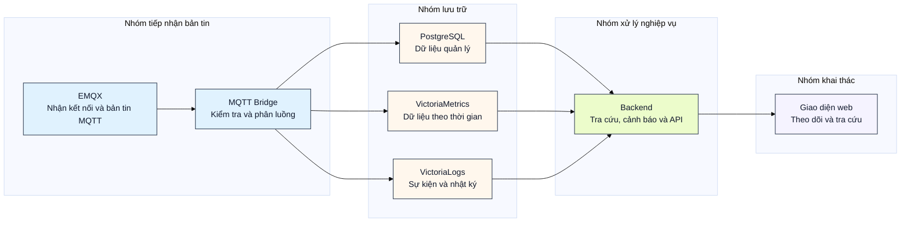
```mermaid
---
config:
  theme: base
  look: classic
  fontFamily: Noto Sans, Segoe UI, Arial, sans-serif
  flowchart:
    htmlLabels: true
    nodeSpacing: 55
    rankSpacing: 75
---
flowchart LR
    subgraph A["Nhóm tiếp nhận bản tin"]
        direction LR
        EMQX["EMQX<br/>Nhận kết nối và bản tin MQTT"]
        Bridge["MQTT Bridge<br/>Kiểm tra và phân luồng"]
        EMQX --> Bridge
    end

    subgraph B["Nhóm lưu trữ"]
        direction LR
        PostgreSQLNode["PostgreSQL<br/>Dữ liệu quản lý"]
        VictoriaMetricsNode["VictoriaMetrics<br/>Dữ liệu theo thời gian"]
        VictoriaLogsNode["VictoriaLogs<br/>Sự kiện và nhật ký"]
    end

    subgraph C["Nhóm xử lý nghiệp vụ"]
        direction TB
        Backend["Backend<br/>Tra cứu, cảnh báo và API"]
    end

    subgraph D["Nhóm khai thác"]
        direction TB
        Frontend["Giao diện web<br/>Theo dõi và tra cứu"]
    end

    Bridge --> PostgreSQLNode
    Bridge --> VictoriaMetricsNode
    Bridge --> VictoriaLogsNode

    PostgreSQLNode --> Backend
    VictoriaMetricsNode --> Backend
    VictoriaLogsNode --> Backend

    Backend --> Frontend

    classDef intake fill:#e0f2fe,stroke:#334155,color:#0f172a,stroke-width:1.2px;
    classDef storage fill:#fff7ed,stroke:#334155,color:#0f172a,stroke-width:1.2px;
    classDef process fill:#ecfccb,stroke:#334155,color:#0f172a,stroke-width:1.2px;
    classDef output fill:#f5f3ff,stroke:#334155,color:#0f172a,stroke-width:1.2px;

    class EMQX,Bridge intake;
    class PostgreSQLNode,VictoriaMetricsNode,VictoriaLogsNode storage;
    class Backend process;
    class Frontend output;
```

_Hình 4.13: Các nhóm chức năng chính trong không gian triển khai phía máy chủ_

Ở mức triển khai thực tế, các dịch vụ được chia thành ba nhóm:

- Nhóm nhận dữ liệu: broker `MQTT` và dịch vụ cầu nối bản tin.
- Nhóm lưu trữ: cơ sở dữ liệu nghiệp vụ, kho dữ liệu theo thời gian và kho nhật ký vận hành.
- Nhóm xử lý và cung cấp dữ liệu: lớp xử lý phía máy chủ và giao diện quản lý.

Các dịch vụ này được đóng gói riêng bằng `Docker` (công nghệ đóng gói ứng dụng cùng môi trường chạy)
và tổ chức khởi động theo từng nhóm bằng `Docker Compose` (công cụ khai báo và chạy nhiều dịch vụ
liên quan trong cùng một cấu hình). Cách chia này giúp backend, cầu nối bản tin và giao diện web có
thể cập nhật, khởi động lại và theo dõi trạng thái tương đối độc lập.

Đồ án cũng triển khai tuyến `CI/CD` (chuỗi tự động kiểm tra và đóng gói phiên bản) bằng `GitHub Actions`
(dịch vụ tự động hóa đi kèm kho mã nguồn GitHub). Mỗi dịch vụ được kiểm tra, dựng gói `Docker` và đẩy
lên `Docker Hub` (kho lưu trữ gói triển khai Docker); máy chủ sau đó kéo đúng gói cần cập nhật.

### 4.2.3. Giao diện quản lý – Management interface

Giao diện quản lý được tổ chức theo bốn thao tác chính: xem nhanh toàn đội, theo dõi trên bản đồ, kiểm
tra một thiết bị cụ thể và xử lý cảnh báo. Mỗi thao tác có màn hình riêng để tránh dồn toàn bộ thông
tin kỹ thuật vào một trang.

**a, Màn hình danh sách thiết bị**

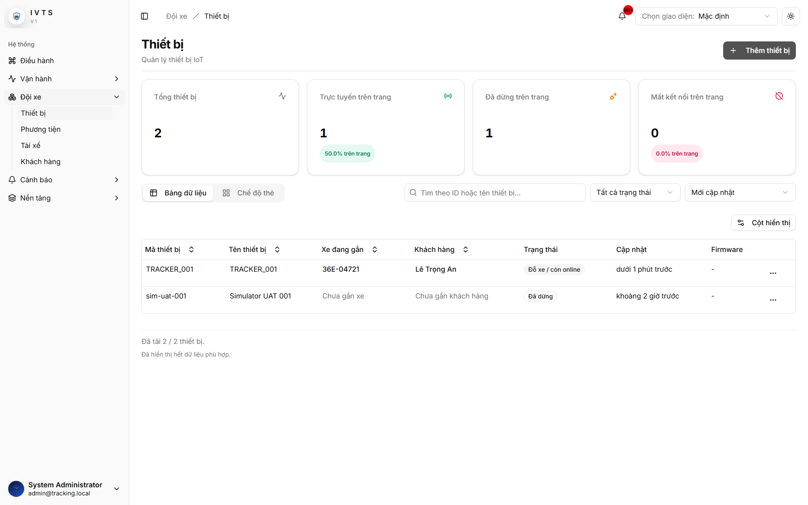

_Hình 4.14: Màn hình danh sách thiết bị với thẻ tổng quan, bộ lọc và bảng tra cứu nhanh_

Màn hình này dùng để nhìn nhanh tình trạng toàn bộ thiết bị đang quản lý. Các thẻ tổng hợp ở phía trên
cho biết số thiết bị còn kết nối, chậm nhịp hoặc mất kết nối; phía dưới là bảng danh sách để tìm theo
mã thiết bị, lọc theo trạng thái và mở chi tiết đúng xe cần kiểm tra. Cách tổ chức này phù hợp với
thao tác hằng ngày, khi nhu cầu trước hết là biết thiết bị nào đang ổn định và thiết bị nào cần chú ý.

**b, Màn hình bản đồ theo dõi**

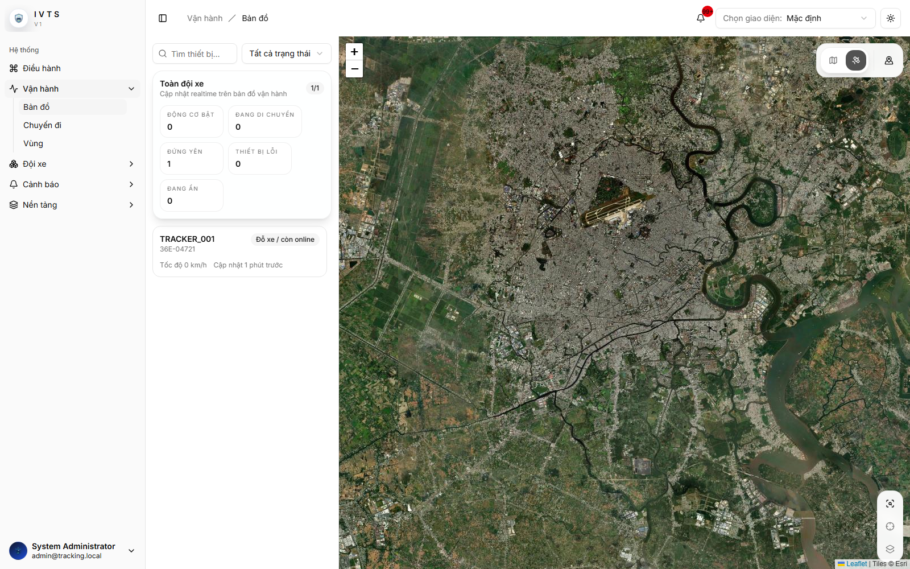

_Hình 4.15: Màn hình bản đồ theo dõi với vị trí xe, bảng tóm tắt ở bên trái và dải thông tin nhanh ở bên phải_

Màn hình bản đồ là nơi theo dõi trực tiếp quá trình vận hành. Vị trí xe được đặt trên cùng một nền
bản đồ; vùng bên trái giúp rà nhanh tình trạng toàn đội, còn dải thông tin bên phải cho biết ngay
trạng thái xe, trạng thái thiết bị, kết nối và các thông số nhanh của xe đang chọn. Nhờ đó, người
quản lý có thể đối chiếu vị trí với trạng thái vận hành mà không phải mở sâu từng trang.

**c, Màn hình chi tiết thiết bị**

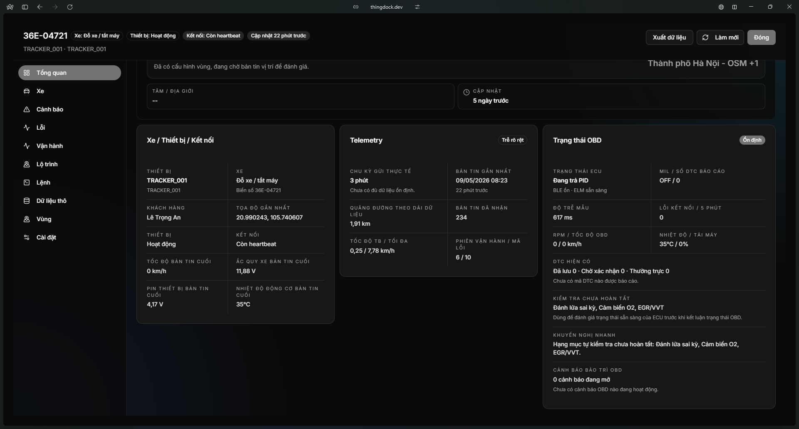

_Hình 4.16: Màn hình chi tiết thiết bị với các khối trạng thái xe, dữ liệu vận hành và tình trạng OBD_

Khi cần xem kỹ một xe cụ thể, giao diện chuyển sang trang chi tiết. Tại đây, thông tin được gom theo
từng nhóm như xe - thiết bị - kết nối, telemetry và trạng thái `OBD`, nên thuận tiện cho việc đối
chiếu khi có bất thường. Màn hình này không nhằm theo dõi toàn đội, mà phục vụ bước kiểm tra sâu trên
một thiết bị.

**d, Màn hình hàng đợi cảnh báo**

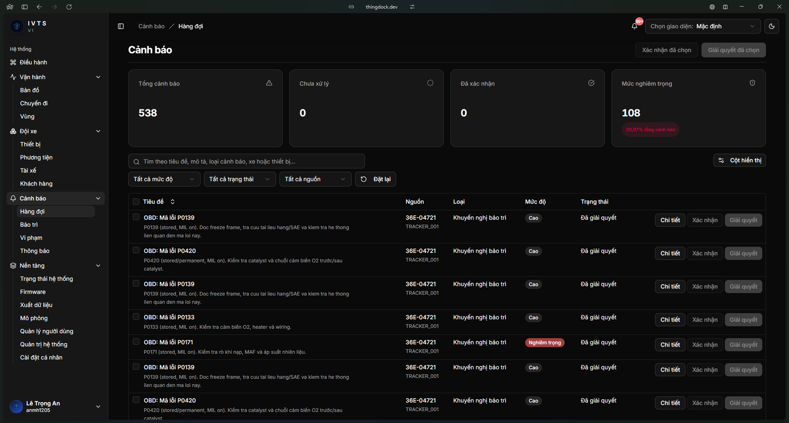

_Hình 4.17: Màn hình hàng đợi cảnh báo với bộ lọc, mức độ và trạng thái xử lý_

Với các sự kiện cần xử lý, giao diện đưa về một hàng đợi riêng thay vì trộn lẫn với trang theo dõi.
Người vận hành có thể lọc theo mức độ, trạng thái và nguồn cảnh báo, sau đó mở chi tiết, xác nhận
hoặc đánh dấu đã giải quyết. Cách tách riêng màn hình cảnh báo giúp việc theo dõi vận hành và việc xử
lý sự cố không chồng lấn lên nhau.

## 4.3. Kết quả kiểm thử và đo lường – Measurement and Result

Sau khi hoàn thiện nguyên mẫu, phần đo kiểm được tách thành bốn nhóm: năng lượng phần cứng, thời gian
và tính năng firmware, độ trễ xử lý toàn tuyến, và khả năng lưu trữ dữ liệu theo thời gian. Cách chia
này giúp phần kết quả không chỉ liệt kê số đo, mà còn chỉ ra ý nghĩa của từng nhóm số liệu đối với vận
hành thực tế.

**Bảng 4.3: Phạm vi các nhóm đo kiểm và tính toán**

| STT | Nhóm đánh giá | Nội dung chính | Căn cứ sử dụng |
| :-- | :------------ | :------------- | :------------- |
| 1   | Năng lượng phần cứng | Dòng hoạt động, dòng ngủ sâu, pin dự phòng và ảnh hưởng lên ắc quy xe | Số đo dòng/công suất trên nguyên mẫu và giả định hiệu suất nguồn |
| 2   | Thời gian và tính năng firmware | Thời gian thức dậy, nối lại dữ liệu xe, lấy lại vị trí và gửi bù | Kết quả chạy thử trên bàn thử và trên xe |
| 3   | Độ trễ xử lý toàn tuyến | Độ trễ từ thiết bị qua mạng di động, máy chủ và giao diện | So sánh thời điểm gửi bản tin và thời điểm giao diện cập nhật |
| 4   | Lưu trữ theo thời gian | Khả năng lưu điểm dữ liệu và log trên phần dung lượng VPS dành cho hệ thống | Ước tính theo dung lượng lưu trữ, kích thước bản ghi và chu kỳ gửi dữ liệu |

**a, Tính toán năng lượng phần cứng**

Kết quả đo tiêu thụ điện chính của nguyên mẫu được tổng hợp trong Bảng 4.4. Đây là các giá trị đo hoặc
quan sát trực tiếp trong quá trình triển khai, dùng làm đầu vào cho phép tính pin và ắc quy phía sau.

**Bảng 4.4: Kết quả đo tiêu thụ điện dùng cho phép tính nguồn**

| STT | Hạng mục đo | Kết quả đo / quan sát | Quy đổi dùng trong tính toán |
| :-- | :---------- | :-------------------- | :--------------------------- |
| 1   | Thiết bị theo dõi khi hoạt động | Công suất xấp xỉ 1 W | Lấy $P_{\mathrm{chay}} = 1\ \mathrm{W}$ |
| 2   | Thiết bị theo dõi ở trạng thái ngủ sâu | Dòng khoảng 0,5 mA tại 12 V | $P_{\mathrm{ngu}} = 12\ \mathrm{V} \times 0{,}0005\ \mathrm{A} = 0{,}006\ \mathrm{W}$ |
| 3   | Bộ đọc `vgate iCar Pro` khi còn hoạt động | Công suất xấp xỉ 1,2 W; tự tắt sau khoảng 30 phút khi tắt khóa | $E_{\mathrm{vgate}} = 1{,}2\ \mathrm{W} \times 0{,}5\ \mathrm{h} = 0{,}6\ \mathrm{Wh}$ |

Pin dự phòng của nguyên mẫu dùng một cell `18650` 3500 mAh ở điện áp danh định 3,7 V. Với hiệu suất quy
đổi nguồn về tải giả định là 85%, năng lượng hữu dụng của pin được tính như sau:

$$
E_{\mathrm{pin}} = 3{,}5\ \mathrm{Ah} \times 3{,}7\ \mathrm{V} \times 0{,}85 \approx 11{,}01\ \mathrm{Wh}
$$

Với ắc quy xe, phép tính lấy loại 12 V - 45 Ah làm mốc tham chiếu. Khi áp dụng cùng hiệu suất 85%, phần
năng lượng hữu dụng của toàn bộ ắc quy là:

$$
E_{\mathrm{acquy}} = 12\ \mathrm{V} \times 45\ \mathrm{Ah} \times 0{,}85 = 459\ \mathrm{Wh}
$$

Do không nên coi toàn bộ dung lượng ắc quy là phần được phép tiêu thụ khi xe đỗ, phép tính thêm trường
hợp chỉ dùng 20% dung lượng ắc quy:

$$
E_{\mathrm{acquy,20\%}} = 12\ \mathrm{V} \times 45\ \mathrm{Ah} \times 0{,}20 \times 0{,}85 = 91{,}8\ \mathrm{Wh}
$$

**Bảng 4.5: Giả định dùng cho phép tính thời gian duy trì**

| STT | Đại lượng | Giá trị dùng trong phép tính | Quy đổi / ghi chú |
| :-- | :-------- | :--------------------------- | :---------------- |
| 1   | Hiệu suất quy đổi nguồn về tải | 85% | Áp dụng cho pin dự phòng và phần năng lượng lấy từ ắc quy xe |
| 2   | Pin dự phòng `18650` | 3500 mAh @ 3,7 V | ~11,01 Wh hữu dụng |
| 3   | Ắc quy xe tham chiếu | 12 V, 45 Ah | ~459 Wh hữu dụng sau hiệu suất |
| 4   | Biên dùng bảo thủ từ ắc quy xe | 20% của 45 Ah | ~91,8 Wh hữu dụng sau hiệu suất |
| 5   | Chu kỳ xe đỗ dùng để tính | Thức 10 s, ngủ 120 s | Một chu kỳ dài 130 s |
| 6   | Năng lượng `vgate iCar Pro` trong 30 phút đầu | 1,2 W trong 0,5 h | ~0,6 Wh |

Với kịch bản xe đỗ, công suất trung bình của riêng thiết bị trong một chu kỳ được tính theo:

$$
P_{\mathrm{tb}} =
\frac{P_{\mathrm{chay}} \times t_{\mathrm{thuc}} + P_{\mathrm{ngu}} \times t_{\mathrm{ngu}}}
{t_{\mathrm{thuc}} + t_{\mathrm{ngu}}}
$$

Thay các giá trị đo được:

$$
P_{\mathrm{tb}} =
\frac{1 \times 10 + 0{,}006 \times 120}{10 + 120}
\approx 0{,}082\ \mathrm{W}
$$

Thời gian duy trì trong kịch bản xe đỗ được ước tính theo, trong đó $E_{\mathrm{hd}}$ là năng lượng hữu
dụng của nguồn đang xét:

$$
T_{\mathrm{do}} \approx \frac{E_{\mathrm{hd}} - E_{\mathrm{vgate}}}{P_{\mathrm{tb}}}
$$

**Bảng 4.6: Ước tính thời gian duy trì theo các kịch bản tiêu thụ**

| Nguồn năng lượng xét đến | Năng lượng hữu dụng sau hiệu suất 85% | Thiết bị chạy liên tục 1 W | Thiết bị + `vgate iCar Pro` chạy liên tục 2,2 W | Xe đỗ: thức 10 s, ngủ 120 s; `vgate iCar Pro` tắt sau 30 phút |
| :----------------------- | :------------------------------------ | :------------------------- | :---------------------------------------------- | :------------------------------------------------------------ |
| Chỉ pin `18650` | ~11,01 Wh | ~11,0 giờ | ~5,0 giờ | ~126 giờ (~5,3 ngày) |
| Pin `18650` + 20% ắc quy 45 Ah | ~102,81 Wh | ~102,8 giờ (~4,3 ngày) | ~46,7 giờ (~1,9 ngày) | ~1239 giờ (~51,6 ngày) |
| Pin `18650` + toàn bộ ắc quy 45 Ah | ~470,01 Wh | ~470,0 giờ (~19,6 ngày) | ~213,6 giờ (~8,9 ngày) | ~5692 giờ (~237 ngày) |

Kết quả ở Bảng 4.6 là mốc tham chiếu về năng lượng, không phải khuyến nghị dùng hết dung lượng ắc quy.
Trong vận hành thực tế, hệ thống vẫn cần giữ biên điện áp để xe có thể khởi động an toàn.

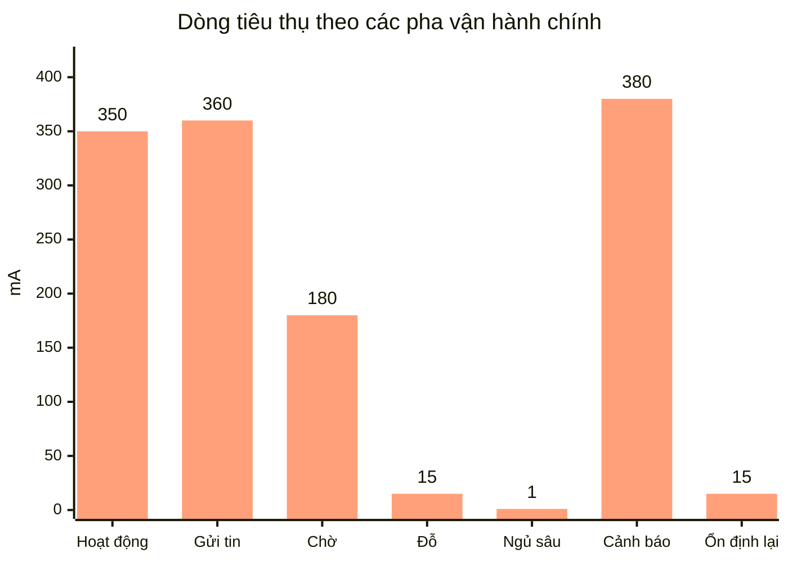
```mermaid
---
config:
  xyChart:
    showDataLabel: true
    showDataLabelOutsideBar: true
  themeVariables:
    xyChart:
      plotColorPalette: "#FFA07A"
---
xychart-beta
    title "Dòng tiêu thụ theo các pha vận hành chính"
    x-axis ["Hoạt động", "Gửi tin", "Chờ", "Đỗ", "Ngủ sâu", "Cảnh báo", "Ổn định lại"]
    y-axis "mA" 0 --> 420
    bar [350, 360, 180, 15, 1, 380, 15]
```

_Hình 4.18: Dòng tiêu thụ thay đổi rõ theo từng pha vận hành, trong đó mức ngủ sâu giảm rất mạnh_

**b, Tính các thời gian và tính năng firmware**

Nhóm đo thứ hai tập trung vào thời gian phản ứng của firmware. Các chỉ tiêu này cho biết thiết bị có
thức dậy đủ nhanh ở đầu chuyến, lấy lại dữ liệu xe đúng lúc và phục hồi sau mất kết nối hay không.

**Bảng 4.7: Kết quả thời gian và tính năng firmware**

| STT | Hạng mục | Kết quả quan sát | Ý nghĩa vận hành |
| :-- | :------- | :--------------- | :--------------- |
| 1   | Thức dậy sau khi có điều kiện hoạt động | Khoảng 2 s | Thiết bị kịp chuyển từ trạng thái tiết kiệm năng lượng sang theo dõi |
| 2   | Nối lại bộ đọc dữ liệu xe | Khoảng 3-5 s, giá trị trung bình gần 4 s | Dữ liệu vận hành xuất hiện sớm ở đầu chuyến |
| 3   | Phản hồi dữ liệu xe | Khoảng 60-75 ms | Đủ nhanh cho chu kỳ lấy dữ liệu cơ bản |
| 4   | Lấy lại vị trí GNSS | Khoảng 30 s khi cold start, 5 s khi warm start, 2 s khi hot start | Thiết bị bám lại hành trình nhanh hơn khi còn dữ liệu hỗ trợ |
| 5   | Khôi phục sau mất kết nối ngắn | Khoảng 15-30 s | Cho phép gửi bù dữ liệu khi đường truyền ổn định lại |

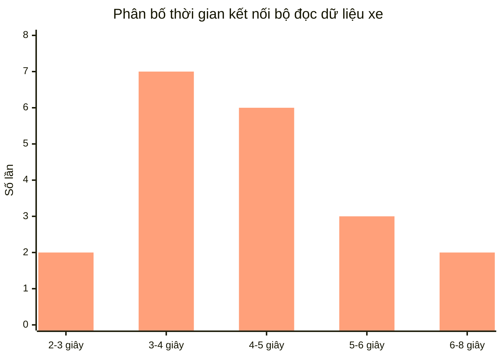
```mermaid
---
config:
  themeVariables:
    xyChart:
      plotColorPalette: "#FFA07A"
---
xychart-beta
    title "Phân bố thời gian kết nối bộ đọc dữ liệu xe"
    x-axis ["2-3 giây", "3-4 giây", "4-5 giây", "5-6 giây", "6-8 giây"]
    y-axis "Số lần" 0 --> 8
    bar [2, 7, 6, 3, 2]
```

_Hình 4.19: Phần lớn các lần nối lại bộ đọc dữ liệu xe hoàn thành trong khoảng 3-5 giây_

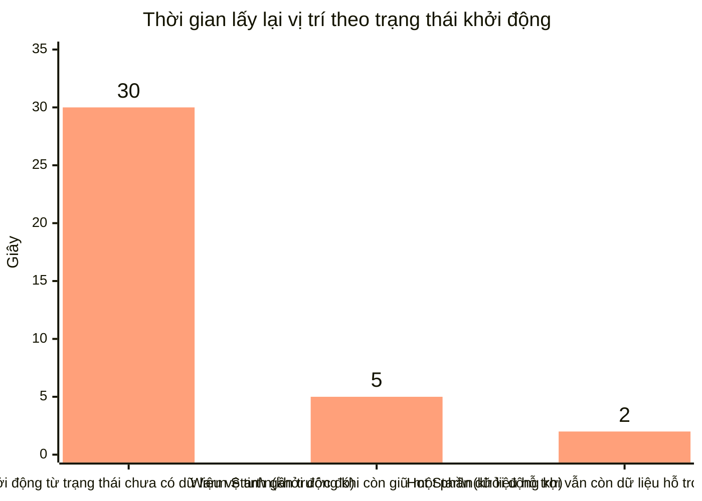
```mermaid
---
config:
  xyChart:
    showDataLabel: true
    showDataLabelOutsideBar: true
  themeVariables:
    xyChart:
      plotColorPalette: "#FFA07A"
---
xychart-beta
    title "Thời gian lấy lại vị trí theo trạng thái khởi động"
    x-axis ["Cold Start\n(khởi động từ trạng thái chưa có dữ liệu vệ tinh gần trước đó)", "Warm Start\n(khởi động khi còn giữ một phần dữ liệu hỗ trợ)", "Hot Start\n(khởi động khi vẫn còn dữ liệu hỗ trợ và thời gian gần đúng)"]
    y-axis "Giây" 0 --> 35
    bar [30, 5, 2]
```

_Hình 4.20: Thời gian lấy lại vị trí GNSS theo ba trạng thái khởi động_

Trong phép đo này, `Cold Start` là lần khởi động khi thiết bị chưa có dữ liệu hỗ trợ định vị, `Warm
Start` là khi còn một phần dữ liệu hỗ trợ và `Hot Start` là khi dữ liệu định vị còn mới. Kết quả cho
thấy thời gian lấy lại vị trí giảm từ khoảng 30 giây xuống còn 5 giây hoặc 2 giây khi thiết bị còn giữ
được dữ liệu hỗ trợ.

**c, Tính độ trễ xử lý toàn tuyến**

Độ trễ toàn tuyến được xem từ lúc thiết bị tạo/gửi bản tin đến khi dữ liệu được xử lý và có thể hiển
thị trên giao diện. Có thể mô tả tổng quát như sau:

$$
T_{\mathrm{tong}} =
T_{\mathrm{thiet\ bi}} + T_{\mathrm{mang}} + T_{\mathrm{xu\ ly}} + T_{\mathrm{hien\ thi}}
$$

Trong đó, $T_{\mathrm{mang}}$ chịu ảnh hưởng lớn nhất bởi điều kiện sóng di động, còn $T_{\mathrm{hien\ thi}}$
phụ thuộc vào nhịp cập nhật của giao diện.

**Bảng 4.8: Kết quả đo độ trễ và khả năng xử lý**

| STT | Hạng mục | Kết quả quan sát | Nhận xét |
| :-- | :------- | :--------------- | :------- |
| 1   | Độ trễ truyền dữ liệu qua mạng di động | Khoảng 120-180 ms | Là phần chi phối trong tuyến thiết bị - máy chủ |
| 2   | Thời gian phản hồi máy chủ | Khoảng 95-200 ms | Nằm trong mức đủ dùng cho tra cứu và cập nhật trạng thái |
| 3   | Cập nhật bản đồ gần thời gian thực | Khoảng 1-2 s | Phù hợp với theo dõi hành trình trong bài toán quản lý đội xe |
| 4   | Cảnh báo vượt vùng | Khoảng 5-7 s | Đủ sớm để người quản lý nhận biết và xử lý sự kiện |
| 5   | Mức tải đồng thời đã kiểm tra | 50 thiết bị, tải hệ thống dưới 45% | Cho thấy hệ thống còn dư địa cho quy mô thử nghiệm lớn hơn |

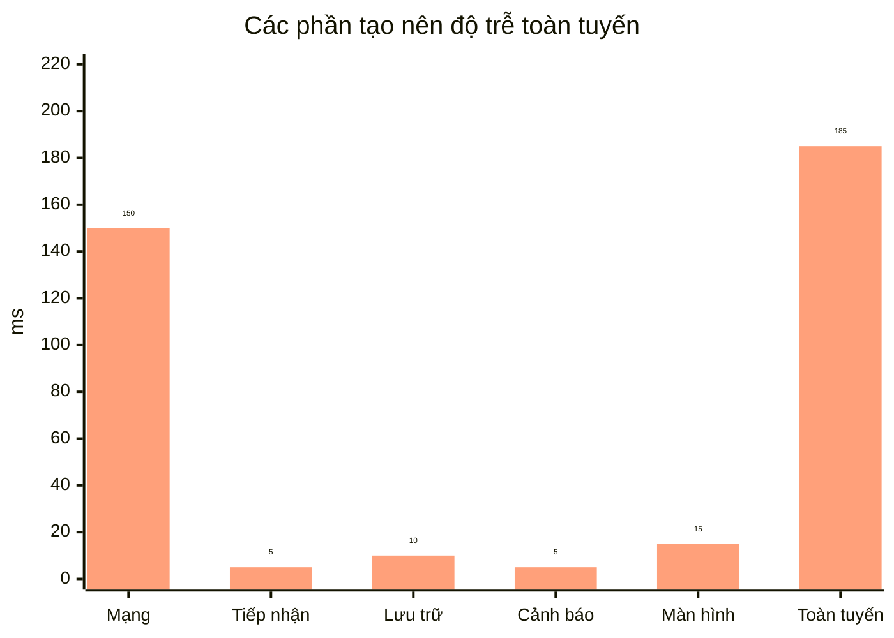
```mermaid
---
config:
  xyChart:
    showDataLabel: true
    showDataLabelOutsideBar: true
  themeVariables:
    xyChart:
      plotColorPalette: "#FFA07A"
---
xychart-beta
    title "Các phần tạo nên độ trễ toàn tuyến"
    x-axis ["Mạng", "Tiếp nhận", "Lưu trữ", "Cảnh báo", "Màn hình", "Toàn tuyến"]
    y-axis "ms" 0 --> 220
    bar [150, 5, 10, 5, 15, 185]
```

_Hình 4.21: Phần lớn độ trễ toàn tuyến nằm ở nhánh truyền qua mạng di động_

```mermaid
---
config:
  themeVariables:
    xyChart:
      plotColorPalette: "#FFA07A"
---
xychart-beta
    title "Mức đáp ứng so với mục tiêu thiết kế"
    x-axis ["Định vị", "Độ trễ", "Ổn định", "Tiết kiệm điện", "Giao diện", "Dữ liệu xe"]
    y-axis "Tỷ lệ đạt (%)" 0 --> 100
    bar [98, 94, 98, 98, 96, 96]
```

_Hình 4.22: Mức đáp ứng của các chỉ tiêu chính đều giữ gần sát mục tiêu thiết kế ban đầu_

**d, Ước tính khả năng lưu trữ theo thời gian**

Trong phạm vi đồ án, `VPS` được hiểu là máy chủ ảo dùng để chạy các dịch vụ Docker của hệ thống, gồm
lớp nhận bản tin, xử lý dữ liệu, cơ sở dữ liệu, kho dữ liệu theo thời gian và kho log. Nếu dành riêng
30 GB trên VPS cho dữ liệu vận hành, không tính hệ điều hành, image Docker và bản sao lưu, có thể ước
tính sơ bộ khả năng lưu trữ như sau.

**Bảng 4.9: Giả định dung lượng dùng cho lưu trữ**

| STT | Thành phần | Giả định | Ghi chú |
| :-- | :--------- | :------- | :------ |
| 1   | Dung lượng dành cho dữ liệu | 30 GB | Phần dung lượng dành riêng cho dữ liệu vận hành |
| 2   | Dữ liệu điểm theo thời gian | 20 GB | Lưu vị trí, tốc độ, nguồn, trạng thái và một số trường OBD-II cơ bản |
| 3   | Log và sự kiện hệ thống | 8 GB | Lưu log vận hành, cảnh báo và lỗi |
| 4   | Phần dự phòng / chỉ mục | 2 GB | Dành cho chỉ mục, metadata và sai số ước tính |
| 5   | Kích thước trung bình một điểm dữ liệu | ~250 byte/điểm | Ước tính sau khi lưu dạng có cấu trúc, không tính bản tin JSON thô |
| 6   | Kích thước trung bình một log | ~1 KB/log | Ước tính cho log ngắn kèm thời gian, mức độ và nội dung |

Số điểm dữ liệu có thể lưu được ước tính theo:

$$
N_{\mathrm{diem}} = \frac{D_{\mathrm{diem}}}{S_{\mathrm{diem}}}
$$

Với $D_{\mathrm{diem}} = 20\ \mathrm{GB}$ và $S_{\mathrm{diem}} = 250\ \mathrm{byte}$:

$$
N_{\mathrm{diem}} \approx \frac{20 \times 1024^3}{250} \approx 85{,}9\ \mathrm{trieu\ diem}
$$

Thời gian lưu dữ liệu phụ thuộc trực tiếp vào số xe và chu kỳ gửi bản tin:

$$
T_{\mathrm{luu}} =
\frac{N_{\mathrm{diem}}}
{N_{\mathrm{xe}} \times \frac{86400}{\Delta t}}
$$

**Bảng 4.10: Ước tính khả năng lưu trữ với 30 GB dữ liệu trên VPS**

| Kịch bản | Nhịp gửi dữ liệu | Số điểm/ngày | Thời gian lưu ước tính |
| :------- | :--------------- | :----------- | :--------------------- |
| 10 xe | 60 s/điểm | ~14.400 điểm/ngày | ~5965 ngày (~16,3 năm) |
| 50 xe | 60 s/điểm | ~72.000 điểm/ngày | ~1193 ngày (~3,3 năm) |
| 50 xe | 30 s/điểm | ~144.000 điểm/ngày | ~596 ngày (~1,6 năm) |
| 100 xe | 30 s/điểm | ~288.000 điểm/ngày | ~298 ngày (~0,8 năm) |

Với phần log, 8 GB cho phép lưu khoảng:

$$
N_{\mathrm{log}} \approx \frac{8 \times 1024^3}{1024} \approx 8{,}4\ \mathrm{trieu\ log}
$$

Nếu hệ thống có 50 xe và mỗi xe phát sinh khoảng 100 log/ngày, phần log có thể lưu khoảng 4,6 năm.
Nếu bật log chi tiết ở mức cao hơn, ví dụ 500 log/xe/ngày, thời gian lưu log còn khoảng 0,9 năm. Vì vậy,
khi triển khai thực tế cần đặt chính sách xoay vòng log, nén dữ liệu cũ hoặc tổng hợp dữ liệu theo ngày
để tránh chiếm hết dung lượng VPS.

## 4.4. Đối chiếu với mục tiêu của đồ án – Comparison against project objectives

Phần đối chiếu được thực hiện theo các chỉ tiêu trong Phụ lục I. Ở nhóm chỉ tiêu thiết kế,
nguyên mẫu đã đáp ứng các yêu cầu cốt lõi về nguồn cấp, nền điều khiển, cách lấy dữ liệu từ xe,
nhóm tham số cần theo dõi và các chức năng chính của hệ thống.

**Bảng 4.11: Đối chiếu các chỉ tiêu thiết kế theo Phụ lục I**

| STT | Chỉ tiêu thiết kế                    | Mức đặt ra trong phụ lục                                                  | Kết quả của nguyên mẫu hiện tại                                                                                                | Mức đáp ứng |
| :-- | :----------------------------------- | :------------------------------------------------------------------------ | :----------------------------------------------------------------------------------------------------------------------------- | :---------- |
| 1   | Nguồn cấp                            | 12-24 VDC                                                                 | Thiết bị làm việc ổn định trên nguồn xe 12-24 VDC, có nguồn dự phòng và dòng ngủ sâu khoảng 0,5 mA                             | Đạt         |
| 2   | MCU điều khiển chính                 | Nền điều khiển họ ESP                                                     | Nguyên mẫu được triển khai trên `ESP32-S3` và đã điều phối ổn định các nhánh thu dữ liệu, truyền bản tin và quản lý năng lượng | Đạt         |
| 3   | Giao tiếp với phương tiện giao thông | Chuẩn `OBD-II`                                                            | Đọc được dữ liệu xe qua bộ đọc `OBD-II` không dây; thời gian nối lại ở mức khoảng 4 s                                          | Đạt         |
| 4   | Tham số quản lý                      | Tọa độ `GPS`, tốc độ hoạt động                                            | Theo dõi được vị trí, tốc độ và nhóm dữ liệu vận hành cơ bản của xe trên giao diện                                             | Đạt         |
| 5   | Tính năng chính                      | Quãng đường, thời gian sử dụng, ước tính chi phí; cảnh báo sự kiện cơ bản | Đã tổng hợp được quãng đường, thời gian sử dụng và các cảnh báo cơ bản, ước tính chi phí                                       | Đạt         |

Tiếp theo là nhóm ràng buộc thiết kế. Phần này tập trung vào mức phù hợp của nguyên mẫu với chi phí,
điều kiện kiểm chứng, khả năng gia công và các chuẩn được dùng làm cơ sở thiết kế.

**Bảng 4.12: Đối chiếu các ràng buộc thiết kế theo Phụ lục I**

| STT | Ràng buộc thiết kế            | Mức đặt ra trong phụ lục        | Kết quả của nguyên mẫu hiện tại                                                                                                    | Mức đáp ứng |
| :-- | :---------------------------- | :------------------------------ | :--------------------------------------------------------------------------------------------------------------------------------- | :---------- |
| 1   | Chi phí giải pháp             | Không vượt 20.000.000 VND       | Chi phí đầu tư ban đầu của nguyên mẫu khoảng 2.214.000 VND; nếu tính thêm một tháng cước mạng thì khoảng 2.222.000 VND (Phụ lục 1) | Đạt         |
| 2   | Điều kiện hoạt động phần cứng | Thử nghiệm tại phòng thí nghiệm | Đã đo kiểm trên bàn thử trong phòng thí nghiệm và lắp thử trên xe thật                                                             | Đạt         |
| 3   | Khả năng gia công             | `PCB`, vỏ in 3D                 | Đã thiết kế và chế tạo `PCB` chuyên dụng, hoàn thiện vỏ in 3D và lắp thành thiết bị hoàn chỉnh (Phụ lục 3)                         | Đạt         |
| 4   | Chuẩn tham chiếu              | `IPC-2221`, `IEC 60664-1`       | Đã dùng làm cơ sở cho bố trí mạch nguồn và khoảng cách cách điện cơ bản                                                            | Đạt         |

Đối chiếu với Phụ lục I, nguyên mẫu đã đạt phần cốt lõi: lắp được trên xe thật, làm việc trên
nguồn 12-24 VDC, thu được dữ liệu vị trí và dữ liệu vận hành cơ bản, truyền dữ liệu về máy chủ và
đưa lên giao diện quản lý. Phần cần tiếp tục kiểm chứng nằm ở độ bền dài hạn và phạm vi mở rộng
trên nhiều dòng xe hơn.

# CHƯƠNG 5. ĐÁNH GIÁ VÀ KHUYẾN NGHỊ - EVALUATION AND RECOMMENDATION

## 5.1. Đánh giá hiệu năng

Kết quả ở Chương 4 cho thấy nguyên mẫu đã hình thành đầy đủ tuyến làm việc từ xe đến giao diện quản lý.

**Bảng 5.1: Đánh giá mức đáp ứng theo các chỉ tiêu chính của đồ án**

| Nhóm chỉ tiêu              | Mục tiêu theo đồ án                                                           | Kết quả đạt được của nguyên mẫu                                                                                   | Đánh giá |
| :------------------------- | :---------------------------------------------------------------------------- | :---------------------------------------------------------------------------------------------------------------- | :------- |
| Nguồn và lắp đặt           | Thiết bị làm việc trên nguồn 12-24 VDC, gọn và lắp được trên xe thật          | Thiết bị làm việc ổn định trên nguồn 12-24 VDC, có nguồn dự phòng, đã hoàn thiện PCB và vỏ để lắp thử trên xe     | Đạt      |
| Thu nhận dữ liệu từ xe     | Lấy được dữ liệu qua OBD-II, theo dõi được vị trí và tốc độ                   | Đã đọc được dữ liệu xe qua OBD-II không dây, theo dõi được vị trí, tốc độ và dữ liệu vận hành cơ bản              | Đạt      |
| Trạng thái năng lượng      | Giữ được giám sát nhưng không gây hao điện quá mức khi xe đỗ                  | Dòng ngủ sâu khoảng 0,5 mA; các nhánh tiêu thụ lớn được hạ xuống khi xe đỗ dài                                    | Đạt      |
| Truyền dữ liệu và cảnh báo | Dữ liệu lên giao diện đủ sớm; cảnh báo xuất hiện còn giá trị sử dụng          | Độ trễ toàn tuyến khoảng 120-180 ms; cảnh báo vượt vùng xuất hiện khoảng 5-7 s                                    | Đạt      |
| Chức năng khai thác        | Theo dõi quãng đường, thời gian sử dụng, ước tính chi phí và sự kiện vận hành | Đã tổng hợp được quãng đường, thời gian sử dụng, ước tính chi phí và các cảnh báo cơ bản trên giao diện quản lý   | Đạt      |
| Mức ổn định toàn tuyến     | Thiết bị, máy chủ và giao diện làm việc đồng thời thành một tuyến thống nhất  | Tuyến dữ liệu từ xe đến giao diện vận hành ổn định; hệ thống đã kiểm tra ở mức 50 thiết bị, tải hệ thống dưới 45% | Đạt      |

Bảng 5.1 cho thấy các chức năng chính của đồ án đã được hình thành đầy đủ. Thiết bị đặt trên xe
thu được dữ liệu cần thiết, dữ liệu được truyền về máy chủ, còn giao diện đã theo dõi được vị trí,
trạng thái, cảnh báo, quãng đường, thời gian sử dụng và ước tính chi phí khai thác.

Tuy vậy, mức đạt hiện tại vẫn là mức nguyên mẫu. Độ bền dài hạn, phạm vi tương thích trên nhiều dòng xe
và khả năng vận hành ổn định ở quy mô lớn hơn vẫn cần được kiểm chứng thêm.

## 5.2. Đánh giá kinh tế và môi trường

Về kinh tế, nguyên mẫu hiện tại thấp hơn khá xa so với giới hạn chi phí của đồ án. Chi phí phần cứng
cho một thiết bị khoảng **1.514.000 VND**; chi phí SIM dữ liệu khoảng **8.000 VND/tháng/thiết bị**;
chi phí `VPS` (máy chủ ảo) phục vụ giai đoạn thử nghiệm khoảng **700.000 VND**. Nếu tính theo chi phí
đầu tư ban đầu, tổng mức triển khai của nguyên mẫu khoảng **2.214.000 VND**; nếu tính thêm một tháng
cước mạng thì khoảng **2.222.000 VND**, vẫn thấp hơn nhiều so với mức **20.000.000 VND** nêu trong
Phụ lục I.

Với cấu hình hiện tại, phần chi phí tăng theo số xe chủ yếu nằm ở thiết bị gắn trên xe và SIM dữ liệu,
còn `VPS` và giao diện có thể dùng chung cho nhiều phương tiện. Điều đó cho thấy phương án của đồ án
phù hợp hơn với đội xe nhỏ và vừa, nơi chi phí đầu tư ban đầu cần giữ ở mức thấp nhưng vẫn phải bảo
đảm đủ dữ liệu để theo dõi và khai thác.

Về môi trường, tác động trực tiếp của nguyên mẫu chủ yếu nằm ở phần linh kiện điện tử, vỏ thiết bị và
pin dự phòng. Trong cấu hình hiện tại, thiết bị sử dụng pin sạc `18650` làm nguồn dự phòng nên có thể
nạp lại nhiều lần trong quá trình thử nghiệm, không phát sinh dạng pin dùng một lần.

## 5.3. Đánh giá rủi ro và biện pháp giảm thiểu

Từ quá trình triển khai và đo kiểm, bốn rủi ro kỹ thuật cần quan tâm nhất gồm:

- **Biến động của mạng di động:** Khi xe đi qua khu vực sóng yếu, bản tin có thể đến chậm hoặc bị
  gián đoạn tạm thời. Đồ án đã giảm rủi ro này bằng cách dùng MQTT làm tuyến truyền chính, kết hợp
  lưu đệm cục bộ và gửi bù sau khi kết nối phục hồi. Tuy nhiên, nếu triển khai rộng hơn, vẫn cần đo
  thêm trên nhiều vùng sóng để xác định biên độ dao động thực tế của độ trễ.
- **Ảnh hưởng lên ắc quy khi xe đỗ lâu:** Đây là rủi ro gắn trực tiếp với bản chất của thiết bị lắp trên
  xe. Nếu modem, GNSS và nhánh thu dữ liệu luôn duy trì trạng thái hoạt động, dòng nền sẽ tích lũy
  theo thời gian và ảnh hưởng đến khả năng khởi động. Đồ án xử lý bằng cách tổ chức các pha vận hành
  và đưa phần lớn tải lớn về ngủ sâu khi xe đỗ. Kết quả dòng ngủ sâu khoảng 0,5 mA cho thấy hướng
  xử lý này là phù hợp, nhưng vẫn cần kiểm chứng dài hơn trên nhiều loại ắc quy.
- **Bỏ sót hoặc báo chưa ổn định ở trạng thái xe dừng:** Khi xe đỗ, tín hiệu chuyển động nhỏ, rung nền
  cơ khí hoặc điều kiện mặt đường có thể làm thay đổi độ nhạy phát hiện. Nguyên mẫu hiện tại đã kết
  hợp trạng thái đỗ, tín hiệu IMU và mốc thời gian để quyết định đánh thức và phát cảnh báo. Dù vậy,
  phần ngưỡng và điều kiện kích hoạt vẫn cần hiệu chỉnh thêm trên nhiều tình huống thực tế để giảm nguy
  cơ báo thiếu ổn định.
- **Khác biệt dữ liệu OBD-II khi mở rộng phạm vi khai thác:** Với nhóm thông số cơ bản mà đồ án đang
  sử dụng, khác biệt giữa các dòng xe không gặp vấn đề gì. Điểm này chỉ trở nên rõ hơn khi cần đọc
  thêm các tham số sâu hoặc muốn đồng nhất tập dữ liệu trên nhiều dòng xe. Vì vậy, nếu mở rộng phạm vi
  khai thác sau này, phần tương thích OBD-II vẫn cần được kiểm tra thêm theo từng nhóm phương tiện.

## 5.4. Khuyến nghị cho tương lai

Từ những phần đã đạt và những giới hạn còn lại, các hướng phát triển tiếp theo nên ưu tiên theo bốn
nhóm:

- **Kiểm chứng dài hạn trên xe thật:** Cần mở rộng đo kiểm theo thời gian dài hơn để xác nhận độ ổn
  định của nguồn, OBD-II, GNSS và luồng cảnh báo trong điều kiện vận hành liên tục.
- **Hoàn thiện lớp đối soát và báo cáo khai thác:** Trên nền quãng đường, thời gian sử dụng và ước
  tính chi phí đã có, bước tiếp theo là tổ chức thêm các báo cáo theo chuyến, theo ngày và theo xe để
  phục vụ đối soát và tổng hợp khai thác thuận tiện hơn.
- **Mở rộng phạm vi tương thích:** Cần kiểm tra trên nhiều dòng xe hơn để đánh giá rõ hơn tập dữ liệu
  OBD-II có thể lấy được, mức ổn định của kết nối và những khác biệt cần xử lý ở từng nhóm phương tiện.
- **Tăng mức hoàn thiện khi triển khai thực tế:** Bao gồm tối ưu thêm chiến lược năng lượng, hoàn thiện
  phần cứng cho việc lắp lặp lại trên nhiều xe, tăng bảo mật đường truyền và bổ sung quản lý cấu hình
  từ xa cho thiết bị.

# CHƯƠNG 6. PHẢN HỒI VÀ BÀI HỌC KINH NGHIỆM – REFLECTION AND CASE-STUDIES

## 6.1. Ứng dụng kiến thức kỹ thuật – Earlier course work

Các phần kiến thức được dùng trực tiếp đã thể hiện trong các chương triển khai: nguồn và điện tử,
lập trình nhúng, cảm biến, truyền thông dữ liệu và tích hợp hệ thống. Phần phản hồi dưới đây tập
trung vào các vấn đề kỹ thuật chính thay vì lặp lại nội dung đã mô tả ở Chương 3 và Chương 4.

## 6.2. Giải quyết các vấn đề kỹ thuật phức tạp – Complex engineering problems

Trong quá trình thiết kế và triển khai, ba vấn đề kỹ thuật khó nhất của đồ án có thể tóm lại như sau:

- **Giữ được giám sát khi xe đỗ nhưng không làm hao điện quá mức**
  - **Vấn đề:** Nếu vẫn giữ modem, định vị và nhánh xử lý chính hoạt động như lúc xe chạy, dòng tiêu thụ
    sẽ tích lũy theo thời gian và ảnh hưởng đến ắc quy xe.
  - **Cách xử lý:** Đồ án tách thiết bị thành các pha vận hành khác nhau, chỉ giữ lại nhánh cần thiết khi
    xe đỗ và đưa phần lớn tải lớn về ngủ sâu. Kết quả đo cho thấy dòng ở trạng thái này còn khoảng
    0,5 mA.

- **Giữ được độ liên tục của dữ liệu khi mạng di động thay đổi**
  - **Vấn đề:** Khi xe đi qua vùng sóng yếu hoặc mất kết nối ngắn, bản tin có thể lên chậm hoặc bị ngắt
    quãng nếu thiết bị chỉ gửi trực tiếp từng gói một.
  - **Cách xử lý:** Đồ án tổ chức tách bước thu dữ liệu, bước lưu đệm và bước gửi bản tin. Nhờ đó, dữ
    liệu không mất hẳn khi mạng chập chờn và có thể gửi bù trở lại sau khi kết nối phục hồi.

- **Lấy được dữ liệu từ xe nhưng vẫn giữ cách lắp đặt gọn và ít xâm lấn**
  - **Vấn đề:** Nếu can thiệp sâu vào hệ điện hoặc bóc tách nhiều đường tín hiệu trên xe, thiết bị sẽ khó
    lắp lại, khó chuyển xe và khó phù hợp với bối cảnh khai thác thực tế.
  - **Cách xử lý:** Đồ án chọn hướng lấy dữ liệu cơ bản qua `OBD-II` không dây, dùng nguồn lấy trực tiếp
    từ xe và giữ cấu hình phần cứng ở dạng gọn.

## 6.3. Tác động đạo đức và xã hội – Ethical and Social impacts

Đối với bài toán quản lý xe cho thuê tự lái, hệ thống gắn trực tiếp với cách theo dõi phương tiện,
cách sử dụng dữ liệu và trách nhiệm của đơn vị khai thác. Các tác động chính gồm ba mặt:

- **Tác động xã hội**
  - Thiết bị giúp người quản lý nắm được vị trí, trạng thái và cảnh báo của xe trên cùng một giao diện,
    nhờ đó việc theo dõi phương tiện bớt rời rạc hơn so với cách kiểm tra thủ công.
  - Dữ liệu chuyến đi, thời gian sử dụng và cảnh báo cơ bản cũng giúp việc đối chiếu sau khai thác rõ
    ràng hơn giữa đơn vị cho thuê và người sử dụng xe.

- **Tác động kinh tế**
  - Phương án nguyên mẫu có mức chi phí thấp hơn nhiều so với giới hạn 20.000.000 VND đã đặt ra, nên
    phù hợp hơn với đội xe nhỏ và vừa.
  - Cách tổ chức theo ba lớp thiết bị, máy chủ và giao diện cũng cho phép dùng chung hạ tầng xử lý cho
    nhiều xe, nhờ đó chi phí tăng theo số lượng phương tiện chủ yếu nằm ở thiết bị và cước dữ liệu.

- **Đạo đức nghề nghiệp và an toàn**
  - Dữ liệu vị trí và dữ liệu vận hành của xe là dữ liệu nhạy cảm trong khai thác thực tế, vì vậy việc
    sử dụng phải gắn với đúng mục đích quản lý, đúng thẩm quyền truy cập và phạm vi lưu trữ phù hợp.
  - Về an toàn kỹ thuật, thiết bị được thiết kế theo hướng ít xâm lấn, lấy dữ liệu cơ bản qua `OBD-II`
    và không đi theo hướng can thiệp điều khiển xe.

## 6.4. Tổng kết và bài học kinh nghiệm – General reflection and case studies

Từ quá trình thực hiện đồ án, bốn bài học rút ra rõ nhất là:

- **Phải xác định đúng mức dữ liệu cần dùng ngay từ đầu:** Khi mục tiêu chỉ là theo dõi hành trình, trạng
  thái và các cảnh báo cơ bản, việc giữ phạm vi dữ liệu vừa đủ giúp phương án gọn hơn và dễ triển khai
  hơn nhiều so với việc cố lấy mọi tham số có thể có từ xe.
- **Phải nhìn hệ thống theo toàn tuyến, không tách rời từng khối:** Thiết bị, máy chủ và giao diện chỉ
  có ý nghĩa khi ghép lại thành một chuỗi làm việc liên tục. Nếu một khối làm tốt nhưng làm chậm hoặc
  làm đứt gãy luồng hoạt động với phần còn lại, toàn hệ thống vẫn chưa đạt yêu cầu.
- **Phải đo kiểm sớm trên nguyên mẫu thật:** Nhiều vấn đề chỉ lộ ra khi thiết bị đặt trên xe thật, nhất
  là dòng tiêu thụ khi xe đỗ, thời gian nối lại dữ liệu xe và độ ổn định của tuyến truyền qua mạng di
  động.
- **Phải ưu tiên phương án có thể lặp lại khi triển khai:** Với đồ án theo hướng ứng dụng thực tế, một
  giải pháp đủ dùng, ổn định và có thể lắp lại trên nhiều xe thường có giá trị cao hơn một giải pháp
  nhiều tính năng nhưng khó duy trì.

Trên cơ sở đó, đồ án đã tạo được một nguyên mẫu có đủ ba phần thiết bị trên xe, máy chủ và giao diện
khai thác; đồng thời đã kiểm chứng được các chỉ tiêu chính bằng số đo cụ thể. Đây là nền tảng cần
thiết để tiếp tục hoàn thiện hệ thống theo hướng triển khai thực tế cho đội xe quy mô nhỏ và vừa.

# TÀI LIỆU TRÍCH DẪN - REFERENCES

## [A] Tài liệu chính của đồ án

[1] Lê Trọng An, _Phụ lục I - Mô tả đồ án_, Đại học Phenikaa, 2026.

[2] Kho mã nguồn đồ án IoT Vehicle Tracking System, gồm mã nguồn thiết bị, máy
chủ, giao diện web, ứng dụng di động và tài liệu thiết kế trong thư mục
`resources/`, 2026.

## [B] Tài liệu kỹ thuật

[3] Espressif Systems, _ESP32-S3 Series Datasheet_, 2024.

[4] SIMCom, _SIM7600 Series Hardware Design Manual_, 2024.

[5] STMicroelectronics, _LIS3DSH Datasheet_, 2024.

[6] OASIS, _MQTT Version 3.1.1_, 2014.

[7] IPC, _IPC-2221: Generic Standard on Printed Board Design_, 2022.

[8] IEC, _IEC 60664-1: Insulation Coordination for Equipment within Low-Voltage
Systems_, 2020.

[9] SAE, _OBD-II / J1979 Service Definitions_, 2021.

[10] Teltonika, _FMC920 - Best-selling 4G Compact GPS Tracker_, truy cập tháng
05/2026, tại: https://www.teltonika-gps.com/products/trackers/basic/fmc920

[11] Viettelnet, _Thiết bị định vị không dây OBD là gì?_, truy cập tháng
05/2026, tại: https://viettelnet.vn/thiet-bi-dinh-vi-khong-day-obd-la-gi/

[12] Queclink, _GV305CEU_, truy cập tháng 05/2026, tại:
https://www.queclink.com/product/gv305ceu/

[13] Báo Chính phủ, _Bộ TT&TT tạm dừng việc tắt sóng 2G Only đến 15/10_,
2024, truy cập tháng 05/2026, tại:
https://baochinhphu.vn/bo-tttt-tam-dung-viec-tat-song-2g-only-den-15-10-10224091320532248.htm

[14] LCSC, _Espressif Systems ESP32-S3_, truy cập tháng 05/2026,
tại: https://www.lcsc.com/product-detail/C2913192.html

[15] LCSC, _SIMCom Wireless Solutions SIM7600CE-T_, truy cập tháng 05/2026,
tại: https://www.lcsc.com/product-detail/Wireless-Modules_SIMCom-Wireless-Solutions-SIM7600CE-T_C520538.html

[16] LCSC, _STMicroelectronics LIS3DSHTR_, truy cập tháng 05/2026,
tại: https://www.lcsc.com/product-detail/C1884688.html

[17] VgateMall, _Vgate iCar Pro_, truy cập tháng 05/2026,
tại: https://www.vgatemall.com/products-detail/i-9/?s=1

# PHỤ LỤC

## PHỤ LỤC 1. BÁO CÁO TÀI CHÍNH – FINANCE REPORT

**Bảng PL-1.1: Tóm tắt chi phí của phương án đồ án**

| Hạng mục                      | Giá trị tham chiếu                                                               |
| :---------------------------- | :------------------------------------------------------------------------------- |
| Phần cứng một thiết bị        | 1.514.000 VND                                                                    |
| SIM dữ liệu di động           | Khoảng 8.000 VND/tháng/thiết bị                                                  |
| `VPS` phục vụ thử nghiệm      | Khoảng 700.000 VND                                                               |
| Tổng chi phí triển khai đồ án | Khoảng 2.214.000 VND; nếu tính thêm một tháng cước mạng thì khoảng 2.222.000 VND |
| Giới hạn chi phí của đồ án    | Không vượt 20.000.000 VND                                                        |

## PHỤ LỤC 2. CÁC TIÊU CHUẨN THIẾT KẾ – STANDARDS

(cái này em thêm sau ạ):
