 `
`

**ĐẠI HỌC PHENIKAA**

---

**ĐỒ ÁN TỐT NGHIỆP**
**THIẾT KẾ HỆ THỐNG IoT CHO ỨNG DỤNG QUẢN LÝ**
**PHƯƠNG TIỆN GIAO THÔNG TRONG LĨNH VỰC**
**CHO THUÊ XE TỰ LÁI**

**Sinh viên:** Lê Trọng An
**Mã số sinh viên:** 21010389
**Lớp:** K15-KTCĐT2
**Ngành:** Kỹ thuật Cơ điện tử
**Giảng viên hướng dẫn:** TS. Nguyễn Đức Nam

**Hà Nội - 2026**

**PHENIKAA UNIVERSITY**
**FACULTY OF MECHANICAL ENGINEERING AND MECHATRONICS**

**CAPSTONE THESIS**
**DESIGN OF AN IoT SYSTEM FOR VEHICLE MANAGEMENT**
**IN SELF-DRIVE CAR RENTAL SERVICES**

| **Student** | **Student ID** | **Class** |
| :---------------- | :------------------- | :-------------- |
| Le Trong An       | 21010389             | K15-KTCĐT2     |

**Supervisor:** Dr. Nguyen Duc Nam

**HANOI - 2026**

# NHẬN XÉT ĐỒ ÁN TỐT NGHIỆP CỦA GIẢNG VIÊN HƯỚNG DẪN

> Phần này giữ đúng mẫu biểu của nhà trường và được điền khi nộp hồ sơ bảo vệ chính thức.

# NHẬN XÉT ĐỒ ÁN TỐT NGHIỆP CỦA GIẢNG VIÊN PHẢN BIỆN

> Phần này giữ đúng mẫu biểu của nhà trường và được điền khi nộp hồ sơ bảo vệ chính thức.

# BIÊN BẢN ĐÁNH GIÁ ĐỒ ÁN TỐT NGHIỆP

> Phần này giữ đúng mẫu biểu của hội đồng, gồm thông tin phiên bảo vệ, câu hỏi phản biện, phần trả lời và kết luận.

# GIẢI TRÌNH CÁC CHỈNH SỬA (NẾU CÓ)

> Tài liệu giải trình sẽ được bổ sung sau khi có góp ý chính thức từ hội đồng.

# LỜI CAM ĐOAN

Tên tôi là: **Lê Trọng An**.

Mã số sinh viên: **21010389** &nbsp;&nbsp;&nbsp;&nbsp;&nbsp;&nbsp; Lớp: **K15-KTCĐT2**
Ngành: **Kỹ thuật Cơ điện tử**.

Tôi cam đoan đồ án tốt nghiệp với đề tài **"Thiết kế hệ thống IoT cho ứng dụng quản lý phương tiện giao thông trong lĩnh vực cho thuê xe tự lái"** là kết quả nghiên cứu do tôi trực tiếp thực hiện, dưới sự hướng dẫn của **TS. Nguyễn Đức Nam**.

Toàn bộ nội dung, số liệu, hình ảnh và kết quả trình bày trong báo cáo là trung thực, được trích dẫn rõ nguồn khi tham khảo tài liệu bên ngoài, và chưa từng công bố dưới danh nghĩa tác giả khác. Nếu có bất kỳ sai phạm nào về học thuật hoặc bản quyền, tôi xin hoàn toàn chịu trách nhiệm trước nhà trường và pháp luật.

Hà Nội, ngày … tháng … năm 2026
**SINH VIÊN THỰC HIỆN**
Lê Trọng An

# TÓM TẮT ĐỒ ÁN TỐT NGHIỆP - ABSTRACT

Đồ án xây dựng một hệ thống IoT phục vụ quản lý đội xe cho thuê tự lái theo hướng triển khai thực tế, với mục tiêu kết nối liền mạch ba lớp: **thiết bị gắn trên xe**, **máy chủ xử lý dữ liệu**, và **giao diện khai thác cho người vận hành**. Bài toán kỹ thuật trung tâm của hệ thống không chỉ là theo dõi vị trí, mà là đồng thời đáp ứng bốn yêu cầu vận hành: bám xe theo thời gian thực, lấy dữ liệu vận hành cơ bản từ OBD-II, phát hiện sự kiện bất thường đủ sớm để can thiệp, và duy trì mức tiêu thụ điện an toàn khi xe dừng lâu.

Thiết bị trên xe sử dụng nguồn 12-24 VDC, nền tảng ESP32-S3, modem LTE/GNSS và kết nối OBD-II không dây để thu dữ liệu vị trí, tốc độ, trạng thái và một số thông số vận hành cơ bản. Dữ liệu được truyền qua MQTT về máy chủ để chuẩn hóa, lưu trữ, tổng hợp hành trình và phát cảnh báo. Giao diện web hiển thị bản đồ, trạng thái thiết bị, dữ liệu chuyến đi và cảnh báo theo sự kiện nhằm hỗ trợ quyết định vận hành trong thời gian thực.

Kết quả triển khai cho thấy hệ thống đã được chế tạo thành nguyên mẫu hoàn chỉnh (PCB + vỏ in 3D), lắp thử trên xe thật và kiểm chứng bằng đo kiểm trong phòng thí nghiệm lẫn ngoài thực địa. Các chỉ tiêu chính về dòng ngủ sâu, thời gian kết nối OBD-II, độ trễ toàn tuyến dữ liệu và khả năng phục vụ đồng thời nhiều thiết bị đều đạt ngưỡng đề ra. Kết quả này xác nhận phương án của đồ án vừa đúng về mặt thiết kế kỹ thuật, vừa khả thi ở mức triển khai thực tế cho bài toán quản lý đội xe quy mô nhỏ và vừa.

**Từ khóa:** IoT, quản lý phương tiện, xe cho thuê tự lái, GPS, OBD-II, MQTT

**Abstract (English)**

This capstone thesis presents an IoT-based fleet tracking system for self-drive rental operations, designed for practical deployment with three tightly integrated layers: an onboard device, a cloud-side processing backend, and an operator-facing dashboard. The core engineering objective is not only location tracking, but also balancing four operational constraints at once: near real-time tracking, basic OBD-II telemetry acquisition, timely event alerting, and low-power behavior during long parking periods.

The onboard unit operates from a 12-24 VDC vehicle source and is built around ESP32-S3, LTE/GNSS connectivity, and wireless OBD-II integration. Telemetry packets are delivered through MQTT to the server, where data is normalized, stored, aggregated into trip history, and converted into operational alerts. The web interface provides map tracking, device status, trip-level insights, and event notifications to support immediate operational decisions.

The final implementation includes a full prototype (custom PCB and 3D-printed enclosure), installed and validated on a real vehicle through both laboratory and field tests. Key performance metrics—deep-sleep current, OBD-II connection latency, end-to-end data delay, and concurrent device handling—meet the target thresholds. These results confirm that the proposed architecture is not only technically sound but also deployable for small- and medium-scale rental fleet management.

**Keywords:** IoT, vehicle tracking, self-drive rental, GPS, OBD-II, MQTT

# LỜI CẢM ƠN - ACKNOWLEDGEMENTS

Em xin trân trọng bày tỏ lòng biết ơn sâu sắc tới **TS. Nguyễn Đức Nam**, người đã trực tiếp hướng dẫn, góp ý chi tiết và định hướng học thuật trong suốt quá trình thực hiện đồ án. Các góp ý của thầy không chỉ giúp em hoàn thiện sản phẩm kỹ thuật, mà còn giúp em rèn tư duy phân tích vấn đề theo hướng có tiêu chí, có kiểm chứng và có kết luận rõ ràng.

Em xin chân thành cảm ơn quý thầy cô **Khoa Cơ khí - Cơ điện tử, Đại học Phenikaa** đã trang bị nền tảng kiến thức và môi trường học tập cần thiết để em có thể thực hiện đề tài này theo đúng chuẩn kỹ thuật và chuẩn học thuật.

Em cũng xin gửi lời cảm ơn tới gia đình và bạn bè đã luôn động viên, hỗ trợ tinh thần trong suốt thời gian thực hiện đồ án, đặc biệt trong giai đoạn chế tạo nguyên mẫu và kiểm thử thực địa.

Dù đã nỗ lực hoàn thiện báo cáo và sản phẩm, đồ án chắc chắn vẫn còn những điểm cần tiếp tục cải tiến. Em rất mong nhận được thêm ý kiến góp ý từ quý thầy cô và hội đồng để hoàn thiện hơn trong các nghiên cứu tiếp theo.

Hà Nội, ngày … tháng … năm 2026
**SINH VIÊN THỰC HIỆN**
Lê Trọng An

# MỤC LỤC - TABLE OF CONTENTS

> Mục lục chi tiết sẽ được đồng bộ theo số trang ở bước xuất PDF chính thức.

# DANH MỤC BẢNG - LIST OF TABLES

> Danh mục bảng sẽ được cập nhật tự động theo số trang ở bản nộp cuối.

# DANH MỤC HÌNH ẢNH VÀ ĐỒ THỊ - LIST OF FIGURES

> Danh mục hình sẽ được cập nhật tự động theo số trang ở bản nộp cuối.

# DANH MỤC TỪ VIẾT TẮT - LIST OF ABBREVIATIONS

| Từ viết tắt | Nghĩa                                       |
| :------------- | :------------------------------------------- |
| ADC            | Bộ chuyển đổi tương tự sang số       |
| API            | Giao diện lập trình ứng dụng            |
| BLE            | Bluetooth năng lượng thấp                |
| BOM            | Danh sách linh kiện                        |
| ECU            | Bộ điều khiển điện tử trên xe        |
| ESP            | Nền tảng vi điều khiển Espressif        |
| GNSS           | Hệ thống vệ tinh dẫn đường            |
| GPS            | Hệ thống định vị toàn cầu             |
| HTTPS          | Giao thức HTTP bảo mật qua TLS            |
| IMU            | Cảm biến quán tính                       |
| IoT            | Internet vạn vật                           |
| LTE            | Mạng dữ liệu di động 4G                 |
| MCU            | Vi điều khiển trung tâm                  |
| MQTT           | Giao thức truyền bản tin nhẹ             |
| OBD-II         | Cổng chẩn đoán trên xe                  |
| OTA            | Cập nhật phần mềm từ xa                 |
| PCB            | Bảng mạch in                               |
| QoS            | Mức đảm bảo truyền bản tin             |
| REST           | Kiểu giao tiếp API dựa trên tài nguyên |
| RTC            | Đồng hồ thời gian thực                  |
| TCP            | Giao thức điều khiển truyền vận        |
| TLS            | Lớp bảo mật truyền tải                  |
| VPS            | Máy chủ ảo                                |

# CHƯƠNG 1. GIỚI THIỆU ĐỒ ÁN - SUMMARY

## 1.1. Đặt vấn đề và bối cảnh sử dụng

Trong những năm gần đây, dịch vụ cho thuê xe tự lái phát triển nhanh cùng với nhu
cầu số hóa vận hành đội xe. Vì vậy, thiết bị định vị GPS đã trở thành lựa chọn phổ biến để giải quyết bài toán
giám sát vị trí cơ bản. Tuy nhiên trong thực tế, nhu cầu quản lý không dừng ở việc biết xe đang ở đâu, mà còn cần
thêm những thông tin phản ánh trạng thái vận hành của xe và các dấu hiệu sử dụng bất
thường. Nếu thiếu nó, hệ thống quản lý chỉ dừng ở mức lưu vết hành trình, chưa hỗ trợ tốt cho bài toán
giám sát và khai thác đội xe.

Khoảng trống đó cho thấy bài toán quản lý xe cần một cách tiếp cận thích hợp hơn để liên kết dữ liệu
hành trình, dữ liệu vận hành và thông tin cảnh báo trong cùng một hệ thống.

## 1.2. Mục tiêu và phạm vi của đồ án

Đồ án hướng tới xây dựng một hệ thống IoT phục vụ quản lý phương tiện trong dịch
vụ cho thuê xe tự lái. Trong hệ thống này, thiết bị gắn trên xe, máy chủ xử lý dữ
liệu và giao diện quản trị được liên kết thành một chuỗi thống nhất, nhằm hỗ trợ
theo dõi vị trí, ghi nhận dữ liệu vận hành cơ bản, nhận biết các bất thường và đối
chiếu khai thác sau mỗi chuyến đi.

Để bảo đảm hệ thống phù hợp với bối cảnh triển khai thực tế, phương án thiết kế
phải đáp ứng các ràng buộc và chỉ tiêu chính sau:

**Bảng 1.2: Mục tiêu và ràng buộc chính của đồ án**

| Hạng mục                   | Chỉ tiêu chính                                                      |
| :--------------------------- | :--------------------------------------------------------------------- |
| Nguồn cấp thiết bị       | 12-24 VDC                                                              |
| Bộ điều khiển trung tâm | ESP32-S3                                                               |
| Giao tiếp với xe           | OBD-II                                                                 |
| Dữ liệu chính cần thu    | Tọa độ GPS, tốc độ, một số dữ liệu vận hành cơ bản       |
| Cảnh báo chính            | Vượt tốc độ, đỗ lâu, ra khỏi vùng quản lý                  |
| Chức năng tổng hợp       | Quãng đường, thời gian sử dụng, ước tính chi phí khai thác |
| Ràng buộc chi phí         | Không vượt 20.000.000 VND cho phương án của đồ án            |
| Môi trường kiểm chứng   | Phòng thí nghiệm và xe thử nghiệm                                |
| Khả năng chế tạo         | PCB chuyên dụng, vỏ in 3D                                           |
| Chuẩn tham chiếu           | IPC-2221, IEC 60664-1                                                  |

Trong phạm vi đồ án, hệ thống được giới hạn ở bốn nhóm chức năng chính:

- theo dõi hành trình và trạng thái xe;
- thu dữ liệu vận hành cơ bản;
- phát hiện các cảnh báo khai thác;
- tổng hợp dữ liệu sau chuyến đi để hỗ trợ đối chiếu khai thác.

## 1.3. Các tiêu chí cần đạt của đồ án

Từ mục tiêu và ràng buộc ở Bảng 1.2, hệ thống đồ án xây dựng cần đặt ra tiêu chí theo năm nhóm như bảng sau:

**Bảng 1.3: Các tiêu chí cần đạt của đồ án**

| Nhóm tiêu chí        | Nội dung cần đạt                                                                                                     |
| :---------------------- | :----------------------------------------------------------------------------------------------------------------------- |
| Lắp đặt và nguồn   | Thiết bị gọn, dùng được với nguồn xe 12-24 VDC, lắp được trên xe thật                                     |
| Thu dữ liệu           | Theo dõi được tọa độ GPS, tốc độ và dữ liệu OBD-II cơ bản                                                 |
| Quản lý năng lượng | Có chế độ ngủ để tiết kiệm năng lượng, có nguồn dự phòng, không làm ảnh hưởng lớn đến ắc quy xe |
| Khai thác dữ liệu    | Hiển thị được vị trí, hành trình, trạng thái và cảnh báo trên giao diện dễ hiểu                        |
| Kiểm chứng            | Có nguyên mẫu PCB, vỏ in 3D, đo kiểm trong phòng thí nghiệm và trên xe                                        |

## 1.4. Phương pháp tiếp cận thiết kế kỹ thuật

Để giải quyết bài toán quản lý phương tiện trong dịch vụ cho thuê xe tự lái, đồ án áp
dụng cách tiếp cận thiết kế kỹ thuật theo hướng đi từ yêu cầu khai thác thực tế đến
giải pháp tích hợp. Toàn bộ quá trình được tổ chức bám theo các tiêu chí đã xác lập ở
Bảng 1.3 để bảo đảm phương án đề xuất phù hợp với mục tiêu và phạm vi của đề tài.

- Quy trình thực hiện: Đồ án bắt đầu từ việc xác định nhóm dữ liệu cần thu và các
  chức năng cốt lõi phục vụ quản lý phương tiện, sau đó mới lựa chọn phần cứng, xây
  dựng firmware, triển khai máy chủ và giao diện quản trị. Trình tự này giúp từng
  quyết định kỹ thuật bám sát nhu cầu khai thác, đồng thời hạn chế việc triển khai dàn
  trải khi yêu cầu chưa được xác định rõ.
- Tổ chức giải pháp kỹ thuật: Hệ thống được hình thành theo ba khối chính gồm thiết
  bị gắn trên xe, máy chủ xử lý dữ liệu và giao diện quản trị tập trung. Trong ba khối
  này, thiết bị trên xe được xem là điểm xuất phát của toàn bộ phương án vì đây là nơi
  chịu tác động trực tiếp của nguồn cấp, kết nối dữ liệu, khả năng lắp đặt và yêu cầu
  tiêu thụ năng lượng.
- Kiểm chứng: Sau khi hoàn thiện từng khối chức năng, đồ án tiến hành tích hợp
  nguyên mẫu và đo kiểm trong phạm vi đã đặt ra nhằm đối chiếu với các tiêu chí về
  thu dữ liệu, theo dõi phương tiện, khai thác thông tin và mức độ phù hợp của hệ
  thống với bối cảnh thử nghiệm thực tế.

## 1.5. Đầu ra hướng tới và định hướng sử dụng

Trên cơ sở mục tiêu, phạm vi và các tiêu chí đã xác lập, đồ án hướng tới hình thành
được một nguyên mẫu hệ thống IoT phục vụ quản lý phương tiện trong dịch vụ cho
thuê xe tự lái. Trong phạm vi đó, các đầu ra chính của đồ án được xác định như sau:

+ Xây dựng thiết bị gắn trên xe có khả năng thu thập và truyền các dữ liệu cần thiết
  phục vụ giám sát phương tiện.
+ Xây dựng máy chủ xử lý dữ liệu thực hiện tiếp nhận, lưu trữ, tổ chức và cung cấp
  thông tin từ xe.
+ Xây dựng giao diện quản trị tập trung hỗ trợ theo dõi trạng thái xe và tra cứu dữ
  liệu phục vụ khai thác.
+ Tổ chức toàn bộ hệ thống theo hướng đáp ứng bài toán theo dõi hành trình, ghi nhận
  dữ liệu vận hành cơ bản, phát hiện dấu hiệu bất thường và hỗ trợ đối chiếu khai thác
  sau mỗi chuyến đi.

Với các đầu ra nêu trên, hệ thống được định hướng sử dụng cho các đơn vị cho thuê xe
tự lái quy mô nhỏ và vừa, nơi nhu cầu chính là giám sát hành trình phương tiện, nắm
được dữ liệu vận hành cơ bản và hỗ trợ quản lý khai thác theo hướng tập trung, có cơ
sở tra cứu và đối chiếu sau quá trình sử dụng xe.

# CHƯƠNG 2. PHÂN TÍCH VẤN ĐỀ KỸ THUẬT - PROBLEM ANALYSIS

## 2.1. Mô tả vấn đề

Hệ thống của đồ án không chỉ theo dõi vị trí xe, mà còn phải thu dữ liệu vận hành, phát
hiện bất thường và hỗ trợ đối chiếu khai thác sau mỗi chuyến đi. Khi quy các yêu cầu đã
đặt ra ở Chương 1 về góc nhìn kỹ thuật, bài toán được tách thành các nhóm vấn đề chính
như Bảng 2.1.

**Bảng 2.1: Các vấn đề kỹ thuật chính của hệ thống giám sát xe**

| Nhóm vấn đề                                     | Thách thức                                                                            | Mô tả                                                                                                                                                                                                                                                             |
| :-------------------------------------------------- | :-------------------------------------------------------------------------------------- | :------------------------------------------------------------------------------------------------------------------------------------------------------------------------------------------------------------------------------------------------------------------ |
| Theo dõi hành trình và trạng thái xe          | Duy trì dữ liệu vị trí và trạng thái xe liên tục trong quá trình di chuyển | Hệ thống phải cập nhật được hành trình đủ ổn định để người quản lý biết xe đang ở đâu và đang ở trạng thái nào, nhưng không làm tuyến dữ liệu trở nên quá nặng hoặc đứt quãng khi điều kiện vận hành thay đổi. |
| Thu dữ liệu vận hành cơ bản                   | Lấy được dữ liệu cần thiết nhưng không làm ảnh hưởng đến xe             | Các thông số vận hành giúp việc giám sát có chiều sâu hơn, nhưng việc thu nhận phải giữ mức can thiệp thấp, không tác động đến ECU và vẫn phù hợp cho lắp đặt thực tế trên nhiều xe khác nhau.                               |
| Phát hiện bất thường và cảnh báo khai thác | Nhận biết được sự kiện cần chú ý trong lúc xe chạy hoặc khi xe đỗ        | Thiết bị phải đủ nhạy để phát hiện các dấu hiệu bất thường như rung, dịch chuyển hoặc trạng thái sử dụng không mong muốn, đồng thời hạn chế các cảnh báo giả gây nhiễu cho vận hành.                                         |
| Quản lý năng lượng trên xe                    | Hoạt động bền trên nguồn ắc quy nhưng không gây hao điện quá mức          | Vì thiết bị dùng chung nguồn với xe, bài toán quan trọng là duy trì khả năng theo dõi và cảnh báo trong các trạng thái cần thiết mà không làm ảnh hưởng đến khả năng khởi động khi xe đỗ lâu.                                 |
| Tổng hợp và khai thác dữ liệu                 | Đưa toàn bộ thông tin về cùng một nền tảng để theo dõi và đối chiếu    | Dữ liệu hành trình, dữ liệu vận hành và cảnh báo phải được gom về cùng một tuyến xử lý và hiển thị theo cách dễ theo dõi trong lúc vận hành, nhưng vẫn đủ chi tiết để tra cứu lại sau chuyến đi.                           |

Năm vấn đề trên là cơ sở để chuyển sang phần khảo sát kỹ thuật, xác lập tiêu chí thiết
kế và lựa chọn phương án ở các mục tiếp theo.

## 2.2. Bối cảnh và cơ sở kỹ thuật

Trên thị trường hiện nay, các hệ thống giám sát phương tiện đã được phát triển theo
nhiều hướng khác nhau, từ các thiết bị định vị đơn chức năng đến các nền tảng quản lý
đội xe tương đối hoàn chỉnh. Tuy nhiên, mỗi nhóm giải pháp thường chỉ tối ưu mạnh cho
một mục tiêu riêng: hoặc ưu tiên lắp đặt nhanh và chi phí thấp, hoặc ưu tiên lấy thêm
dữ liệu vận hành, hoặc ưu tiên sự đa năng ở quy mô lớn. Vì vậy, chưa có nhiều
giải pháp thật sự phù hợp với nhu cầu của đội xe nhỏ và vừa, nơi cần đồng thời theo dõi
hành trình, nhận biết bất thường và hỗ trợ đối chiếu khai thác sau chuyến đi.

Để cụ thể hóa bối cảnh đó, Bảng 2.2 trình bày một số thiết bị tiêu biểu đại diện cho ba
nhóm giải pháp đang có trên thị trường.

**Bảng 2.2: Một số thiết bị theo dõi phương tiện phổ biến trên thị trường**

<table>
  <thead>
    <tr>
      <th>Hình ảnh</th>
      <th>Thiết bị</th>
      <th>Đặc điểm và hạn chế</th>
    </tr>
  </thead>
  <tbody>
    <tr>
      <td></td>
      <td><strong>Teltonika FMC920</strong> [10] Nhóm thiết bị nhỏ gọn</td>
      <td>Phù hợp cho giám sát hành trình cơ bản, nhưng không theo dõi được thông số vận hành của xe</td>
    </tr>
    <tr>
      <td></td>
      <td><strong>Teltonika FMM003</strong> [11] Nhóm theo dõi được thông số vận hành</td>
      <td>Cắm trực tiếp cổng OBD-II, phù hợp khi ưu tiên lắp đặt nhanh và lấy dữ liệu OBD-II cơ bản</td>
    </tr>
    <tr>
      <td></td>
      <td><strong>Queclink GV305CEU</strong> [12] Nhóm thiết bị có nhiều giao tiếp mở rộng</td>
      <td>Hỗ trợ nhiều giao tiếp mở rộng; phù hợp cho theo dõi dữ liệu mở rộng, nhưng thường vượt nhu cầu tối thiểu của đồ án</td>
    </tr>
  </tbody>
</table>

Để làm rõ hạn chế đó, sinh viên tiến hành phân loại và so sánh các hướng triển khai
phổ biến dựa trên bốn tiêu chí kỹ thuật chính: mức độ dữ liệu thu được, khả năng lắp
đặt thực tế, mức độ hoàn chỉnh của hệ thống và chi phí triển khai.

**Bảng 2.3: So sánh các hướng triển khai giám sát xe hiện có**

| Hướng triển khai                                         | Dữ liệu thu được                                                      | Ưu điểm kỹ thuật                                                                                     | Hạn chế chính                                                                                                                          |
| :---------------------------------------------------------- | :------------------------------------------------------------------------- | :-------------------------------------------------------------------------------------------------------- | :---------------------------------------------------------------------------------------------------------------------------------------- |
| Thiết bị định vị cơ bản                              | Vị trí, tốc độ, trạng thái kết nối                                | Lắp nhanh, cấu hình gọn, chi phí đầu tư thấp                                                     | Chỉ phù hợp cho giám sát hành trình cơ bản, thiếu dữ liệu vận hành và khó nhận biết bất thường khi xe đã tắt máy |
| Thiết bị định vị có khai thác dữ liệu chẩn đoán | Vị trí và một phần trạng thái vận hành của xe                    | Có thêm dữ liệu phục vụ giám sát khai thác, thuận lợi hơn cho việc đối chiếu sử dụng xe | Khả năng tập trung quản lý hạn chế, dữ liệu thường chưa đủ sâu và khả năng tùy biến hạn chế                         |
| Nền tảng quản lý đội xe thương mại                 | Vị trí, hành trình, cảnh báo, báo cáo, quản trị tập trung       | Hệ thống hoàn chỉnh ở mức sản phẩm, triển khai nhanh, phù hợp quy mô lớn                     | Chi phí thuê bao và tích hợp cao, khó điều chỉnh theo nhu cầu kỹ thuật riêng của từng bài toán                           |
| Phương án tích hợp theo yêu cầu                      | Vị trí, dữ liệu vận hành, cảnh báo sự kiện, lịch sử khai thác | Linh hoạt theo mục tiêu quản lý, dễ mở rộng theo yêu cầu nghiên cứu và triển khai thực tế | Phải tự giải quyết đồng thời bài toán thiết bị, truyền dữ liệu, xử lý máy chủ và giao diện khai thác                 |

Bảng 2.3 cho thấy khoảng trống kỹ thuật nằm ở nhóm giải pháp cần nhiều hơn một thiết
bị định vị đơn thuần, nhưng chưa cần tới một nền tảng thương mại có chi phí đầu tư và
vận hành cao. Đối với bài toán quản lý xe cho thuê quy mô nhỏ và vừa, hướng tiếp cận
phù hợp hơn là một hệ thống tích hợp vừa đủ: đủ dữ liệu để theo dõi hành trình, nhận
biết bất thường và đối chiếu khai thác, nhưng vẫn giữ được khả năng lắp đặt gọn và mở
rộng theo điều kiện triển khai thực tế.

Từ đó, cơ sở kỹ thuật của hệ thống được xác định theo ba điểm chính:

- dữ liệu vị trí, dữ liệu vận hành và dữ liệu sự kiện phải được xem là ba nguồn bổ sung cho nhau, không thể thay thế hoàn toàn cho nhau;
- tuyến truyền dữ liệu phải phù hợp với đặc tính bản tin nhỏ, xuất hiện liên tục và có các mức ưu tiên khác nhau giữa dữ liệu nền và dữ liệu cảnh báo;
- lớp xử lý và khai thác dữ liệu phải đủ rõ ràng để vừa phục vụ giám sát thời gian thực, vừa hỗ trợ tra cứu lịch sử và đối chiếu khai thác sau mỗi chuyến đi.

Các nhận định này là cơ sở để chuyển sang phần xác lập tiêu chí thiết kế ở Mục 2.3.

## 2.3. Yêu cầu kỹ thuật và tiêu chuẩn thiết kế

Các yêu cầu kỹ thuật và ràng buộc thiết kế của hệ thống được trình bày tại Bảng 2.4 và
Bảng 2.5 như sau.

**Bảng 2.4: Chỉ tiêu thiết kế chính**

| Yếu tố thiết kế            | Yêu cầu / giá trị                                                                              | Ghi chú                                                                                                     |
| :----------------------------- | :------------------------------------------------------------------------------------------------- | :----------------------------------------------------------------------------------------------------------- |
| Nguồn cấp                    | 12-24 VDC                                                                                          | Phù hợp với hệ điện của phương tiện và là điều kiện nền cho việc lắp đặt trên xe thật  |
| MCU điều khiển chính       | Vi điều khiển họ ESP                                                                           | Đáp ứng yêu cầu tích hợp truyền thông, đọc dữ liệu và điều khiển trạng thái năng lượng |
| Giao tiếp với phương tiện | Chuẩn OBD-II                                                                                      | Cho phép thu dữ liệu cơ bản phục vụ quản lý mà không đi theo hướng can thiệp điều khiển xe |
| Tham số quản lý chính      | Tọa độ GPS, tốc độ hoạt động                                                              | Là các thông số tối thiểu để theo dõi hành trình và trạng thái sử dụng xe                    |
| Tính năng chính             | Tính toán quãng đường, thời gian sử dụng, ước tính chi phí; Có cảnh báo hệ thống | Theo nhu cầu quản lý và khai thác                                                                       |

**Bảng 2.5: Ràng buộc thiết kế**

| Loại ràng buộc         | Thông tin                                              | Tác động đến thiết kế                                                                                       |
| :------------------------ | :------------------------------------------------------ | :----------------------------------------------------------------------------------------------------------------- |
| Tài chính               | Tổng chi phí giải pháp không vượt 20.000.000 VND | Ưu tiên linh kiện phổ biến, bảo đảm tính khả thi khi triển khai                                        |
| Điều kiện kiểm chứng | Phòng thí nghiệm và xe thử nghiệm                 | Giải pháp phải đo kiểm được trên nguyên mẫu và đối chiếu được với điều kiện vận hành thực |
| Khả năng gia công      | Mạch PCB, vỏ in 3D                                    | Kết cấu phần cứng phải gọn, dễ chế tạo và phù hợp cho nguyên mẫu của đồ án                       |
| Tiêu chuẩn áp dụng    | IPC-2221, IEC 60664-1                                   | Làm cơ sở cho bố trí mạch, khoảng cách cách điện và đánh giá an toàn điện ở mức nguyên mẫu   |

## 2.4. Yêu cầu từ các bên liên quan

Bên cạnh tiêu chí kỹ thuật, bài toán còn chịu chi phối bởi cách các nhóm sử dụng và
vận hành hệ thống trên thực tế. Bảng 2.6 tổng hợp các yêu cầu chính và ảnh hưởng của
chúng đến thiết kế.

**Bảng 2.6: Yêu cầu từ các bên liên quan và tác động đến thiết kế**

| Bên liên quan                     | Nhu cầu chính                                                                                       | Ảnh hưởng tới thiết kế                                                                        |
| :---------------------------------- | :---------------------------------------------------------------------------------------------------- | :-------------------------------------------------------------------------------------------------- |
| Đơn vị quản lý đội xe        | Theo dõi vị trí, hành trình, cảnh báo và dữ liệu vận hành xe trên cùng một hệ thống | Giao diện phải ưu tiên bản đồ quản lý, trạng thái, cảnh báo và lịch sử chuyến đi |
| Người phụ trách kỹ thuật      | Biết thiết bị nào online/offline, lỗi nguồn, lỗi mạng hoặc thiếu dữ liệu                  | Phải có lớp giám sát kỹ thuật tách khỏi lớp vận hành thường ngày                     |
| Đội lắp đặt/bảo trì          | Lắp nhanh, ít xâm lấn, dễ thay xe và dễ khoanh vùng lỗi                                      | Kết cấu phải gọn, kết nối rõ ràng, thao tác tháo lắp lặp lại được                   |
| Người lái hoặc người thuê xe | Thiết bị không ảnh hưởng tới vận hành xe và không thu thập vượt nhu cầu quản lý      | Chức năng giám sát phải tách khỏi mọi hành vi điều khiển phương tiện                 |

Điểm chung của các nhóm trên là đều cần thông tin rõ ràng, đủ để theo dõi và ra quyết
định, nhưng không làm tăng gánh nặng thao tác trong quá trình sử dụng. Vì vậy, các xử
lý kỹ thuật phức tạp nên được thực hiện ở lớp thiết bị và máy chủ; còn giao diện vận
hành chỉ nên tập trung vào các thông tin chính như vị trí, trạng thái và cảnh báo.

# CHƯƠNG 3. CÁC GIẢI PHÁP THIẾT KẾ - DESIGN SOLUTIONS

## 3.1. Phân tích tổng hợp

### 3.1.1. Nguyên lý làm việc

Để đáp ứng yêu cầu giám sát phương tiện trong khai thác cho thuê xe tự lái, nguyên lý làm
việc của hệ thống có thể trình bày theo năm bước liên tiếp như sau:

- **Bước 1 - Ghi nhận trạng thái thực của xe:** Trên phương tiện tồn tại ba nhóm thông tin
  đầu vào chính gồm vị trí, dữ liệu vận hành và chuyển động. Đây là lớp thông tin phản ánh
  trực tiếp trạng thái vật lý của xe trong quá trình khai thác.
- **Bước 2 - Thu nhận và xử lý tại thiết bị theo dõi:** Thiết bị trên xe tiếp nhận tín hiệu định vị
  từ GNSS, cổng chẩn đoán OBD-II và cảm biến gia tốc IMU, sau đó thực hiện tiền xử lý, chọn lọc và đóng gói dữ liệu. Nói
  cách khác, bản tin giám sát được hình thành ngay tại thiết bị chứ không phải ở mạng truyền dẫn.
- **Bước 3 - Tạo và truyền bản tin giám sát:** Sau khi được đóng gói, dữ liệu được tổ chức
  thành bản tin giám sát định kỳ hoặc theo sự kiện và truyền về máy chủ qua mạng di động.
  Vai trò của kênh 4G/LTE trong giai đoạn này chỉ là mang bản tin đã tạo đi khỏi phương tiện.
- **Bước 4 - Xử lý tại máy chủ:** Máy chủ tiếp nhận bản tin, thực hiện chuẩn hóa, lưu trữ,
  đối chiếu và phát hiện các trạng thái cần cảnh báo. Kết quả của bước này là lớp thông tin
  có thể dùng trực tiếp cho khai thác và theo dõi đội xe.
- **Bước 5 - Biểu diễn thông tin quản lý:** Dữ liệu sau xử lý được đưa lên giao diện để hiển
  thị vị trí hiện thời, trạng thái hoạt động, lịch sử hành trình, dữ liệu chi tiết và các cảnh
  báo liên quan. Nhờ đó, người quản lý có thể theo dõi tập trung tình trạng phương tiện trên
  cùng một giao diện quản lý.

Theo cách tổ chức trên, hệ thống không chỉ dừng ở chức năng thu thập dữ liệu mà còn bảo đảm
quá trình chuyển hóa từ trạng thái thực của phương tiện thành thông tin có ý nghĩa quản lý.

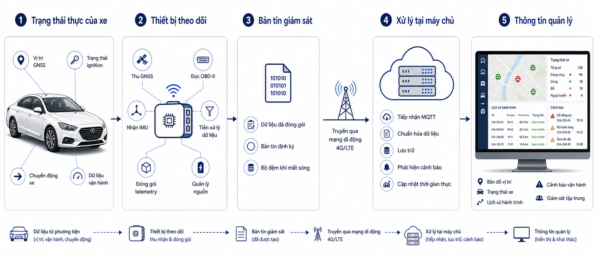

_Hình 3.1: Nguyên lý chuyển hóa dữ liệu từ phương tiện thành thông tin quản lý_

### 3.1.2. Các ràng buộc kỹ thuật chi phối phương án

Các ràng buộc kỹ thuật chi phối phương án thiết kế có thể quy về bốn nhóm chính như sau:

- **Ràng buộc ở lớp thiết bị:** Bộ theo dõi phải gọn, ít dây, dễ tháo lắp khi đổi xe, đồng
  thời không làm tăng mức can thiệp vào hệ điện hay ECU của xe. Vì vậy, khối điều khiển trung tâm,
  khối truyền dữ liệu - định vị và cách lấy dữ liệu OBD-II phải được cân nhắc cùng nhau.
- **Ràng buộc về năng lượng:** Thiết bị bám vào ắc quy xe nên không được để dòng nền tích
  lũy thành mức hao điện đáng kể khi xe đỗ dài ngày. Tuy nhiên, hệ thống vẫn phải giữ được
  khả năng trở lại trạng thái hoạt động để phát hiện rung, dịch chuyển hoặc thay đổi trạng thái xe;
  do đó phần nguồn, cảm biến và cơ chế chuyển giữa hoạt động và ngủ sâu phải được xét như một
  cụm chung.
- **Ràng buộc ở tuyến truyền dữ liệu:** Xe hoạt động trong điều kiện sóng thay đổi liên tục,
  nên phương án truyền không thể giả định kết nối luôn ổn định. Kiến trúc được chọn phải
  chấp nhận mất sóng cục bộ, có bộ nhớ đệm phù hợp và phục hồi được tuyến dữ liệu sau khi
  kết nối lại.
- **Ràng buộc ở lớp khai thác thông tin:** Dữ liệu thu được có nhiều lớp, nhưng giao diện
  vận hành không thể trở thành nơi dồn mọi thứ. Phương án chỉ được xem là đạt khi phần phức
  tạp được giữ ở lớp thiết bị và lớp máy chủ, còn giao diện chỉ giữ những tín hiệu thực sự
  cần cho quyết định quản lý.

## 3.2. Đề xuất các giải pháp

### 3.2.1. Đề xuất giải pháp phần cứng thiết bị

a, Phương án lấy dữ liệu từ cổng chẩn đoán OBD-II

Ở nhánh OBD-II, đồ án chỉ cần thu nhóm dữ liệu phục vụ quản lý nên không đi theo hướng chẩn
đoán sâu hay can thiệp nhiều vào xe. Từ yêu cầu đó, ba hướng khai thác được xét gồm ghép trực
tiếp vào tuyến OBD-II, dùng bộ chuyển đổi ELM327 có dây và dùng bộ chuyển đổi Bluetooth
`vgate iCar Pro`.

**Bảng 3.1: Ma trận đánh giá phương án thu dữ liệu OBD-II**

| Tiêu chí đánh giá                                                   | Trọng số (%) | Ghép trực tiếp vào tuyến OBD-II | ELM327 có dây | `vgate iCar Pro` |
| :----------------------------------------------------------------------- | :------------- | :----------------------------------- | :-------------- | :----------------- |
| Mức xâm lấn lên hệ điện và khả năng trả xe về nguyên trạng | 35             | 1                                    | 3               | 5                  |
| Khả năng tương thích giao thức trên nhiều dòng xe               | 30             | 1                                    | 3               | 5                  |
| Thuận tiện khi tháo lắp, chuyển xe và khoanh vùng lỗi            | 20             | 1                                    | 2               | 5                  |
| Mức đáp ứng nhóm tham số quản lý cần theo dõi                  | 15             | 5                                    | 4               | 4                  |
| **Tổng điểm quy đổi**                                         | **100**  | **1,60**                       | **3,00**  | **4,85**     |

Kết quả ở Bảng 3.1 cho thấy `vgate iCar Pro` phù hợp hơn hai phương án còn lại. Phương án
này vẫn giữ được nhóm dữ liệu cần thiết, nhưng ít xâm lấn hơn và thuận tiện hơn khi đội xe có nhiều loại xe khác nhau.

_Hình 3.2: Bộ đọc OBD-II Bluetooth vgate iCar Pro được chọn cho nhánh thu dữ liệu vận hành_

b, Phương án duy trì giám sát khi xe đỗ

Khi khóa điện tắt, thiết bị không nên duy trì toàn bộ hoạt động (modem 4G, GNSS và OBD-II) như lúc xe
đang hoạt động; nhưng cũng không thể tắt hẳn vì vẫn cần nhận biết rung hoặc dịch chuyển
bất thường. Vì vậy, phương án ở nhánh này được xét như một cặp: phần tử đánh thức tiêu
thụ thấp và cách cấp nguồn cho các khối còn lại. Nguồn chung là cách cấp cùng một nhánh
cho phần giám sát và các tải lớn; nguồn theo khóa điện chỉ còn nguồn khi xe bật khóa và
mất nguồn khi xe tắt khóa; còn nguồn chia nhánh giữ một nhánh nhỏ luôn cấp cho đánh thức,
trong khi modem, GNSS và OBD-II được đóng cắt riêng.

**Bảng 3.2: Ma trận đánh giá phương án duy trì giám sát khi xe đỗ**

| Tiêu chí đánh giá                                                                   | Trọng số (%) | SW-420 + cấp chung toàn thiết bị | MPU6050 + cấp theo khóa điện | LIS3DSH + nhánh đánh thức riêng |
| :--------------------------------------------------------------------------------------- | :------------- | :----------------------------------- | :------------------------------- | :----------------------------------- |
| Mức tiêu thụ khi chỉ giữ giám sát trong thời gian xe đỗ                        | 35             | 2                                    | 2                                | 5                                    |
| Khả năng đánh thức thiết bị bằng chuyển động khi MCU và modem đã ngủ sâu | 25             | 2                                    | 4                                | 4                                    |
| Khả năng tách modem, GNSS và OBD-II khỏi nhánh luôn cấp                          | 25             | 1                                    | 2                                | 5                                    |
| Mức an toàn với ắc quy và độ ổn định khi modem phát dòng xung                | 15             | 2                                    | 3                                | 5                                    |
| **Tổng điểm quy đổi**                                                         | **100**  | **1,75**                       | **2,65**                   | **4,75**                       |

Theo Bảng 3.2, LIS3DSH kết hợp nhánh đánh thức riêng phù hợp hơn cho trạng thái xe đỗ. Phương
án này giữ lại đường đánh thức tiêu thụ thấp, đồng thời cho phép đưa phần lớn thiết bị về
ngủ sâu và cô lập nhánh modem khỏi nguồn logic khi có xung dòng lớn.

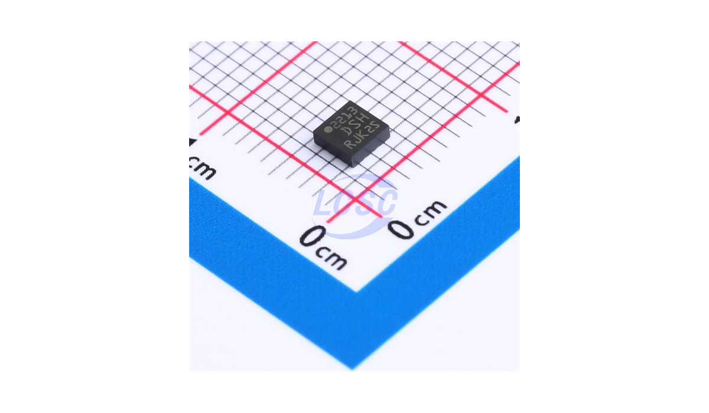

_Hình 3.3: Cảm biến gia tốc LIS3DSH được chọn cho nhánh phát hiện chuyển động khi xe đỗ_

c, Phương án truyền dữ liệu và định vị

Ở tuyến truyền dữ liệu và định vị, thiết bị chỉ gửi các bản tin nhỏ như vị trí, trạng thái
và cảnh báo; do đó vấn đề chính không phải là tốc độ truyền cực đại. Điều cần cân nhắc là
cách ghép khối truyền dữ liệu di động với khối định vị sao cho ít khối phải điều khiển, nguồn
ổn định và phù hợp với không gian lắp trong xe. Các mô-đun chỉ hỗ trợ 2G không được đưa vào
so sánh vì không còn phù hợp với điều kiện mạng di động tại Việt Nam [13]. Ba phương án đại diện
được xét gồm:

1. **EC200U-CN + L76K:** EC200U-CN đảm nhiệm truyền dữ liệu LTE Cat 1, còn L76K là mô-đun
   GNSS rời. Cách này dùng được mạng 4G hiện nay, nhưng thiết bị vẫn phải điều khiển riêng
   khối truyền dữ liệu và khối định vị.
2. **A7670C + ATGM336H:** A7670C đảm nhiệm truyền dữ liệu LTE, ATGM336H đảm nhiệm định vị
   GNSS. Phương án này cũng đi theo hướng 4G, nhưng phần định vị vẫn tách thành một khối riêng.
3. **SIM7600CE-T:** Mô-đun này tích hợp LTE và GNSS trong cùng một khối, giúp gom phần truyền
   dữ liệu và định vị về cùng một đường điều khiển.

**Bảng 3.3: Ma trận đánh giá phương án truyền dữ liệu và định vị**

| Tiêu chí đánh giá                                                               | Trọng số (%) | EC200U-CN + L76K | A7670C + ATGM336H | SIM7600CE-T LTE/GNSS |
| :----------------------------------------------------------------------------------- | :------------- | :--------------- | :---------------- | :------------------- |
| Số khối phải khởi tạo và giám sát cho truyền dữ liệu và định vị       | 30             | 2                | 2                 | 5                    |
| Độ phức tạp của nguồn, mạch vô tuyến và bố trí ăng ten trên thiết bị | 30             | 3                | 3                 | 5                    |
| Khả năng giữ và khôi phục đường truyền, vị trí khi xe di động          | 25             | 4                | 4                 | 4                    |
| Mức phù hợp với không gian lắp trên xe và vỏ thiết bị                     | 15             | 3                | 3                 | 5                    |
| **Tổng điểm quy đổi**                                                     | **100**  | **2,95**   | **3,00**    | **4,75**       |

Theo Bảng 3.3, SIM7600CE-T là phương án phù hợp hơn trong nhóm so sánh. Lợi thế cốt lõi
của mô-đun này là gom đường truyền dữ liệu và định vị về một khối thống nhất, từ đó giảm
rõ phần nguồn, ăng ten và trình tự khởi tạo phải xử lý trên thiết bị.

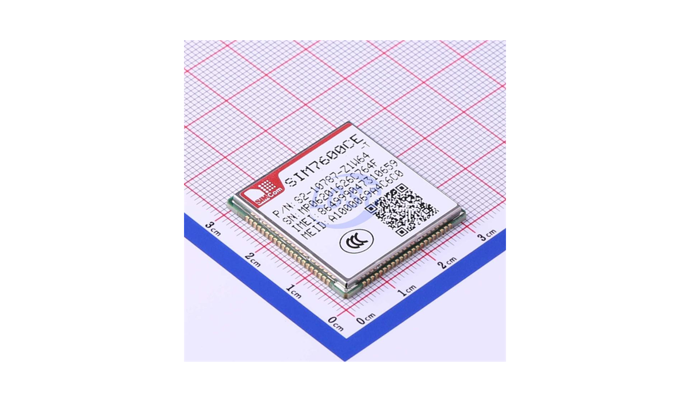

_Hình 3.4: Mô-đun SIM7600CE-T tích hợp LTE và GNSS được chọn cho tuyến truyền dữ liệu - định vị_

d, Phương án bộ điều khiển trung tâm

Bộ điều khiển trung tâm là khối điều phối các phần đã chọn ở trên: modem LTE/GNSS, kết nối
OBD-II không dây, cảm biến đánh thức, bộ nhớ đệm và cổng bảo trì. Vì vậy, phương án MCU không
chỉ được xét theo năng lực xử lý, mà chủ yếu theo số giao tiếp còn đủ, mức tích hợp không dây,
khả năng ngủ sâu và lượng phần cứng phụ phải ghép thêm. Ba hướng đại diện được đưa vào so sánh
gồm ESP32-S3, STM32L4 ghép Bluetooth rời và nRF52840.

**Bảng 3.4: Ma trận đánh giá phương án bộ điều khiển trung tâm**

| Tiêu chí đánh giá                                                                                | Trọng số (%) | ESP32-S3       | STM32L4 + Bluetooth rời | nRF52840       |
| :---------------------------------------------------------------------------------------------------- | :------------- | :------------- | :----------------------- | :------------- |
| Khả năng giữ đồng thời các giao tiếp cho modem, BLE OBD-II, IMU và cổng bảo trì           | 35             | 5              | 4                        | 3              |
| Phần nhớ và tài nguyên còn lại cho lưu đệm bản tin, nhật ký lỗi và cập nhật firmware | 25             | 4              | 3                        | 2              |
| Khả năng vào ngủ sâu và đánh thức bằng tín hiệu ngoài                                    | 20             | 4              | 5                        | 4              |
| Mức phải ghép thêm chip vô tuyến và mạch phụ trợ                                            | 20             | 5              | 2                        | 3              |
| **Tổng điểm quy đổi**                                                                      | **100**  | **4,55** | **3,55**           | **2,95** |

Từ Bảng 3.4, ESP32-S3 là phương án phù hợp hơn trong nhóm so sánh. Điểm quyết định của
lựa chọn này là giữ được đủ giao tiếp cho toàn bộ thiết bị mà không phải hy sinh tài nguyên
cho một khối Bluetooth rời.

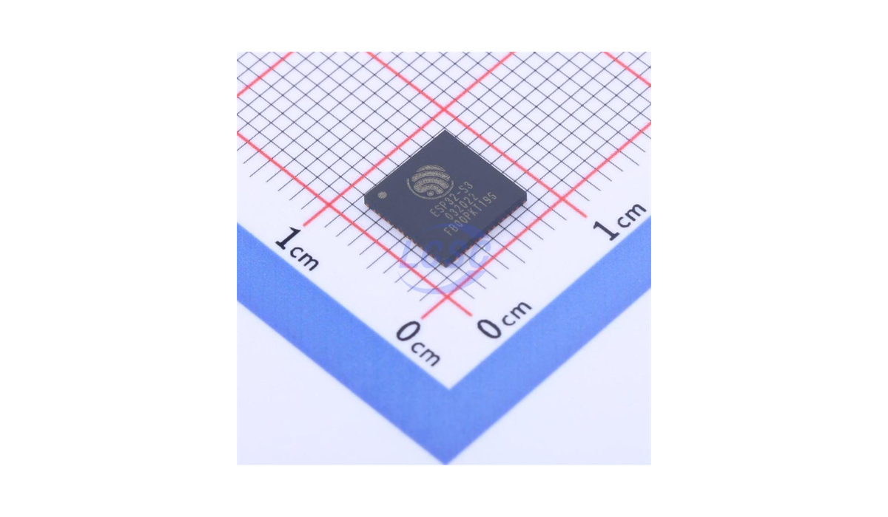

_Hình 3.5: Chip ESP32-S3 được chọn làm bộ điều khiển trung tâm của thiết bị_

### 3.2.2. Đề xuất giải pháp phần mềm nhúng

Ở lớp phần mềm nhúng, vấn đề cần xác định trước hết là nền tảng phát triển và cách tổ chức
thực thi trên ESP32-S3. Thiết bị phải đồng thời làm việc với modem LTE/GNSS, kết nối BLE tới
bộ đọc OBD-II, lưu đệm cục bộ và giữ khả năng mở rộng cho bảo trì sau này. Vì vậy, ở bước
đề xuất giải pháp, phần mềm nhúng được xét theo ba hướng sau:

1. **Arduino core trên ESP32:** Cách này thuận tiện khi dựng nguyên mẫu nhanh, thư viện phong
   phú và dễ tiếp cận, nhưng việc kiểm soát tài nguyên, tác vụ nền và mở rộng hệ thống dài hạn
   không phải là điểm mạnh.
2. **ESP-IDF theo vòng lặp chính:** Hướng này bám sát SDK chính thức của hãng Espressif, giúp kiểm
   soát phần cứng tốt hơn và khai thác đầy đủ driver hệ thống, nhưng khi số khối ngoại vi tăng lên
   thì việc dồn phần lớn xử lý vào một luồng chính sẽ sớm chật.
3. **ESP-IDF kết hợp FreeRTOS:** Đây là hướng dùng SDK chính thức đồng thời tổ chức các tác vụ
   theo cơ chế thời gian thực, phù hợp hơn khi thiết bị phải ghép nhiều nhánh xử lý có nhịp làm việc khác nhau.

Các phương án được so sánh theo bốn tiêu chí: mức phù hợp khi tích hợp nhiều khối ngoại vi,
khả năng kiểm soát tài nguyên và tác vụ nền, thuận lợi cho bảo trì - mở rộng firmware, và mức
dựa vào nền tảng chính thức của nhà sản xuất.

**Bảng 3.5: Ma trận đánh giá phương án phần mềm nhúng trên thiết bị**

| Tiêu chí đánh giá                                                                        | Trọng số (%) | Arduino core trên ESP32 | ESP-IDF theo vòng lặp chính | ESP-IDF + FreeRTOS |
| :-------------------------------------------------------------------------------------------- | :------------- | :----------------------- | :----------------------------- | :----------------- |
| Mức phù hợp khi tích hợp đồng thời modem, BLE OBD-II, lưu đệm và nhánh bảo trì | 35             | 3                        | 4                              | 5                  |
| Khả năng kiểm soát tài nguyên, tác vụ nền và nhịp xử lý của hệ thống          | 25             | 2                        | 3                              | 5                  |
| Thuận lợi cho bảo trì, mở rộng và tổ chức lại firmware khi hệ thống lớn dần     | 25             | 3                        | 4                              | 5                  |
| Mức bám sát nền tảng chính thức của Espressif                                         | 15             | 2                        | 5                              | 5                  |
| **Tổng điểm quy đổi**                                                              | **100**  | **2,70**           | **4,00**                 | **5,00**     |

Từ Bảng 3.5, hướng ESP-IDF kết hợp FreeRTOS có điểm cao nhất nên được giữ lại. Điểm mạnh
của phương án này là vừa bám SDK chính thức của Espressif, vừa thuận lợi hơn khi thiết bị
phải điều phối nhiều khối ngoại vi trong cùng một phần mềm nhúng (firmware).

### 3.2.3. Đề xuất giải pháp truyền bản tin và định hướng tổ chức phía máy chủ

Ở lớp truyền dữ liệu, bước đầu tiên là chọn kênh đưa bản tin từ thiết bị lên máy chủ. Dữ liệu của hệ
thống chủ yếu là các gói tin nhỏ, phát sinh theo chu kỳ hoặc theo sự kiện, đi qua mạng di động
và có thể bị gián đoạn. Vì vậy, giao thức được chọn phải đủ nhẹ cho thiết bị, dễ tách nhóm dữ
liệu và hỗ trợ tốt cho tình huống mất sóng rồi gửi bù. Ba hướng được xét gồm:

- **HTTPS/REST - giao thức gửi yêu cầu tới API (Application Programming Interface - giao diện lập trình ứng dụng) của máy chủ**

  + Cách này cho thiết bị gửi từng yêu cầu riêng lên API của máy chủ; máy chủ nhận xong thì trả phản
    hồi và kết thúc phiên trao đổi. Về bản chất, mỗi bản tin dữ liệu tương ứng với một lần yêu cầu -
    phản hồi riêng biệt giữa thiết bị và máy chủ.
  + Ưu điểm là quen thuộc, dễ lập trình và dễ kiểm thử bằng các công cụ web thông dụng.
  + Hạn chế là khi dữ liệu phát sinh lặp lại theo chu kỳ ngắn, việc phải mở và đóng nhiều phiên trao
    đổi làm tuyến truyền nặng hơn mức cần thiết.
- **WebSocket/TCP - cơ chế duy trì kết nối liên tục giữa thiết bị và máy chủ**

  + Cách này cho thiết bị tạo một kết nối liên tục với máy chủ và giữ kết nối đó trong suốt thời gian
    làm việc, nên dữ liệu có thể đi hai chiều trên cùng một đường truyền. Về bản chất, thiết bị và
    máy chủ duy trì một phiên kết nối kéo dài để trao đổi dữ liệu liên tục.
  + Ưu điểm là thuận lợi khi cần cập nhật liên tục.
  + Hạn chế là phụ thuộc nhiều vào việc kết nối phải được giữ ổn định, trong khi thiết bị có thể đi
    vào ngủ sâu hoặc di chuyển qua vùng sóng yếu.
- **MQTT qua TLS - giao thức bản tin nhẹ có mã hóa đường truyền**

  + Cách này không gửi dữ liệu thẳng vào một API cố định mà đưa từng bản tin lên các kênh chủ đề; phía
    máy chủ sẽ đăng ký nhận theo từng nhóm chủ đề tương ứng. Về bản chất, bản tin được phân loại theo
    từng chủ đề ngay từ khi phát đi, nhờ đó phía nhận chỉ cần xử lý đúng nhóm dữ liệu liên quan.
  + `MQTT` (Message Queuing Telemetry Transport - giao thức truyền bản tin nhẹ) được thiết kế cho bản
    tin nhỏ và thiết bị tài nguyên hạn chế, còn `TLS` (Transport Layer Security - giao thức bảo mật lớp
    truyền tải) là lớp mã hóa bổ sung để bảo vệ dữ liệu khi truyền qua mạng di động công cộng.
  + Vì vậy, hướng này gọn hơn cho bài toán giám sát lặp lại và thuận lợi hơn khi cần tách riêng dữ liệu
    vị trí, trạng thái và cảnh báo.

**Bảng 3.6: Ma trận đánh giá giao thức truyền bản tin từ thiết bị**

| Tiêu chí đánh giá                                                                | Trọng số (%) | HTTPS/REST     | WebSocket/TCP  | MQTT qua TLS   |
| :------------------------------------------------------------------------------------ | :------------- | :------------- | :------------- | :------------- |
| Phù hợp với bản tin nhỏ, gửi định kỳ hoặc theo sự kiện                    | 30             | 3              | 4              | 5              |
| Mức nhẹ cho thiết bị và modem khi truyền qua mạng di động                    | 25             | 3              | 3              | 5              |
| Khả năng phân tách dữ liệu vị trí, trạng thái và cảnh báo theo chủ đề | 25             | 2              | 3              | 5              |
| Thuận lợi cho gửi lại, gửi bù sau gián đoạn kết nối                        | 20             | 3              | 2              | 4              |
| **Tổng điểm quy đổi**                                                      | **100**  | **2,75** | **3,10** | **4,80** |

Từ Bảng 3.6, `MQTT qua TLS` được chọn làm giao thức truyền bản tin chính từ thiết bị lên máy chủ,
vì phù hợp hơn với đặc điểm dữ liệu nhỏ, phát sinh lặp lại và có thể bị gián đoạn theo chất lượng
mạng di động. Trong khi đó, `HTTPS/REST` vẫn phù hợp cho các API cấu hình, quản trị hoặc trao đổi
giữa giao diện và `backend` (lớp xử lý nghiệp vụ phía máy chủ), nhưng không phải kênh chính cho luồng
dữ liệu giám sát phát sinh liên tục từ thiết bị.

Khi giao thức truyền bản tin đã được xác định, vấn đề tiếp theo là cách tổ chức phần máy chủ để tiếp
nhận, xử lý và lưu trữ dữ liệu. Ba hướng chính được xem xét gồm:

- **Backend (lớp xử lý nghiệp vụ phía máy chủ) nhận và xử lý trực tiếp - một ứng dụng duy nhất đảm nhiệm toàn bộ tuyến dữ liệu**

  + Cách này gom phần nhận bản tin, xử lý nghiệp vụ và lưu trữ vào cùng một ứng dụng.
  + Về bản chất, toàn bộ tuyến xử lý dữ liệu được đặt trong một khối chức năng duy nhất.
  + Ưu điểm là số lượng dịch vụ ít, cấu trúc ban đầu tương đối đơn giản.
  + Hạn chế là khi khối lượng dữ liệu tăng lên, phần tiếp nhận bản tin và phần nghiệp vụ dễ ảnh hưởng
    lẫn nhau, đồng thời việc mở rộng hoặc khoanh vùng lỗi cũng kém thuận lợi hơn.
- **MQTT broker (lớp tiếp nhận và phân phối bản tin) + backend xử lý tập trung - tách lớp nhận bản tin nhưng vẫn dồn xử lý vào backend**

  + Cách này tách riêng lớp tiếp nhận bản tin bằng broker, còn phần backend phía sau vẫn đảm nhiệm gần
    như toàn bộ việc chuẩn hóa, lưu trữ và phát sinh cảnh báo.
  + Về bản chất, tuyến dữ liệu đã có lớp vào riêng, nhưng phần xử lý phía sau vẫn tập trung nặng vào
    một ứng dụng chính.
  + Ưu điểm là đỡ tải hơn so với phương án gom toàn bộ vào backend.
  + Hạn chế là backend vẫn phải gánh phần lớn trách nhiệm của tuyến xử lý dữ liệu, nên dư địa tách lớp
    và mở rộng hệ thống chưa thật sự rõ ràng.
- **MQTT broker (lớp tiếp nhận và phân phối bản tin) + lớp trung gian + lưu trữ tách vai trò - chia tuyến dữ liệu thành nhiều lớp chức năng**

  + Cách này để broker tiếp nhận bản tin, lớp trung gian thực hiện chuẩn hóa và phân luồng, còn các kho
    dữ liệu được tách theo mục đích sử dụng.
  + Về bản chất, tuyến dữ liệu được chia thành các lớp tiếp nhận, xử lý và lưu trữ với vai trò rõ ràng
    hơn ngay từ đầu.
  + Ưu điểm là thuận lợi cho việc tách riêng dữ liệu nghiệp vụ, dữ liệu chuỗi thời gian và log, đồng thời
    phù hợp hơn khi cần tiếp nhận dữ liệu gửi dồn hoặc mở rộng phạm vi giám sát.
  + Hạn chế là cấu trúc nhiều lớp hơn và đòi hỏi tổ chức hệ thống chặt chẽ hơn ở phía máy chủ.

**Bảng 3.7: Ma trận đánh giá định hướng tổ chức tiếp nhận và xử lý dữ liệu phía máy chủ**

| Tiêu chí đánh giá                                                         | Trọng số (%) | Backend nhận và xử lý trực tiếp | MQTT broker + backend xử lý tập trung | MQTT broker + lớp trung gian + lưu trữ tách vai trò |
| :----------------------------------------------------------------------------- | :------------- | :------------------------------------ | :--------------------------------------- | :------------------------------------------------------- |
| Tách tuyến nhận bản tin khỏi lớp nghiệp vụ và giao diện              | 30             | 1                                     | 3                                        | 5                                                        |
| Hấp thụ được bản tin gửi dồn khi thiết bị có lại kết nối         | 25             | 2                                     | 3                                        | 5                                                        |
| Dễ tách riêng dữ liệu nghiệp vụ, dữ liệu chuỗi thời gian và log    | 25             | 2                                     | 3                                        | 5                                                        |
| Phục vụ đồng thời cập nhật gần thời gian thực và tra cứu lịch sử | 20             | 3                                     | 4                                        | 4                                                        |
| **Tổng điểm quy đổi**                                               | **100**  | **1,90**                        | **3,20**                           | **4,80**                                           |

Từ Bảng 3.7, hướng tổ chức theo MQTT broker, lớp trung gian và lưu trữ tách vai trò được chọn cho phần
máy chủ. Cách tổ chức này giúp tách lớp nhận bản tin khỏi lớp xử lý nghiệp vụ, nên phù hợp hơn khi
thiết bị gửi bù dữ liệu hoặc khi hệ thống cần mở rộng giám sát.

## 3.3. Phân tích, đánh giá và lựa chọn phương án khả thi

### 3.3.1. Kiến trúc hệ thống được chọn

Từ các lựa chọn ở Mục 3.2, hệ thống được tổ chức theo kiến trúc gồm ba khối chính:
thiết bị theo dõi trên xe, cụm tiếp nhận - xử lý dữ liệu ở máy chủ và giao diện khai thác. Hình 3.6
trình bày mối liên hệ giữa ba khối này trên cùng một tuyến giám sát.

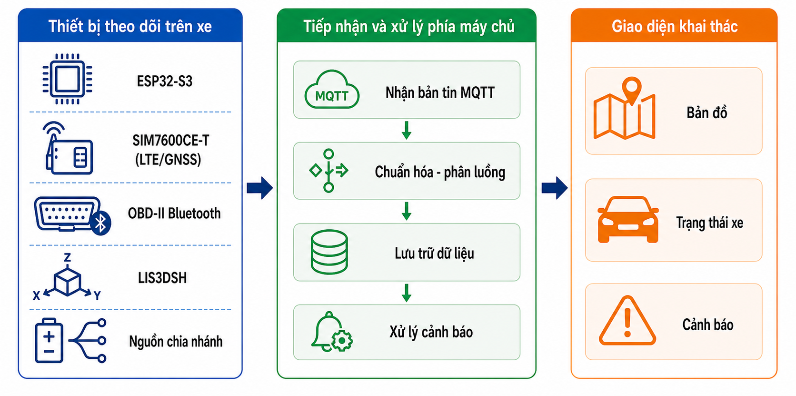

_Hình 3.6: Kiến trúc tổng thể của phương án hệ thống được chọn_

Kiến trúc này làm rõ vai trò của từng khối trong toàn tuyến: thiết bị trên xe tạo bản tin giám sát,
máy chủ tiếp nhận và xử lý dữ liệu, còn giao diện giữ vai trò biểu diễn thông tin phục vụ khai thác.

### 3.3.2. Phân tích chức năng các khối trong phương án được chọn

- **Khối 1 - Thiết bị theo dõi trên xe**

  + Vai trò của khối này là thu nhận trạng thái thực của phương tiện và tạo bản tin giám sát gửi về
    máy chủ.
  + Ở khối này, ESP32-S3 giữ vai trò điều phối trung tâm; SIM7600CE-T đảm nhiệm truyền dữ liệu và
    định vị; `vgate iCar Pro` cung cấp dữ liệu OBD-II; LIS3DSH giữ nhánh phát hiện chuyển động khi
    xe đỗ; còn cấu trúc nguồn chia nhánh hỗ trợ chuyển giữa hoạt động và ngủ sâu.
  + Với cách ghép đó, khối thiết bị đáp ứng đồng thời yêu cầu gọn, ít xâm lấn, đủ dữ liệu và có khả
    năng giảm tiêu thụ điện khi xe dừng lâu.
- **Khối 2 - Cụm tiếp nhận và xử lý dữ liệu ở máy chủ**

  + Vai trò của khối này là tiếp nhận bản tin từ thiết bị, chuẩn hóa, lưu trữ và xử lý dữ liệu trước
    khi cấp lại cho giao diện khai thác.
  + Hướng tổ chức được chọn là tách lớp nhận bản tin khỏi lớp xử lý nghiệp vụ, đồng thời phân dữ liệu
    theo vai trò sử dụng.
  + Cách tổ chức này cho phép hệ thống tiếp nhận tốt hơn các bản tin gửi dồn sau mất sóng, đồng thời
    giữ rõ phần tiếp nhận, phần xử lý và phần khai thác dữ liệu.
- **Khối 3 - Giao diện khai thác**

  + Vai trò của khối này là biểu diễn thông tin phục vụ theo dõi và cảnh báo trong quá trình vận hành.
  + Giao diện được giữ theo hướng giao diện giám sát tập trung trên nền web, ưu tiên bản đồ, trạng thái xe và cảnh báo, còn
    dữ liệu kỹ thuật sâu hơn được đưa về các vùng tra cứu phụ.
  + Nhờ đó, người sử dụng có thể theo dõi được các tín hiệu chính mà không bị dồn quá nhiều chi tiết
    kỹ thuật lên cùng một màn hình.

Mối liên hệ giữa bốn nhóm ràng buộc kỹ thuật và các lựa chọn chính trong phương án được khái quát
trong Hình 3.7.

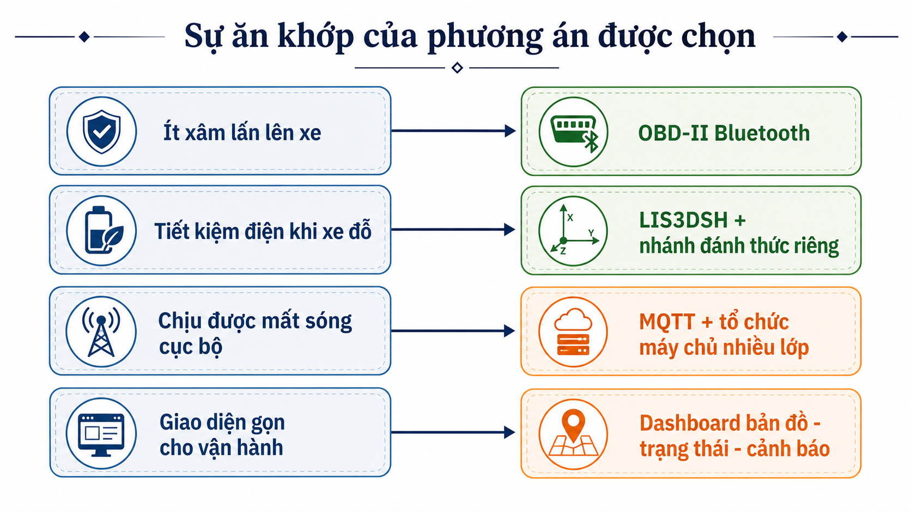

_Hình 3.7: Mối liên hệ giữa các ràng buộc kỹ thuật và các lựa chọn chính của phương án_

- **Với yêu cầu ít xâm lấn lên xe**

  + Bộ đọc OBD-II Bluetooth giúp giảm dây tín hiệu phát sinh trong cabin và thuận tiện hơn khi chuyển
    lắp giữa nhiều xe.
  + Mô-đun SIM7600CE-T tích hợp LTE và GNSS trong cùng một khối, từ đó giảm số phần cứng phải bố trí
    và điều khiển trên thiết bị.
- **Với yêu cầu tiết kiệm điện khi xe đỗ**

  + LIS3DSH kết hợp nhánh đánh thức riêng cho phép giữ lại đường phát hiện chuyển động với mức tiêu
    thụ thấp, trong khi các tải lớn có thể được đưa về ngủ sâu.
  + Hướng phần mềm nhúng ESP-IDF kết hợp FreeRTOS tạo điều kiện thuận lợi hơn cho việc điều phối các
    nhánh tác vụ và tổ chức lại hoạt động của thiết bị theo từng trạng thái vận hành.
- **Với yêu cầu giữ ổn định tuyến truyền dữ liệu**

  + MQTT qua TLS phù hợp với bản tin nhỏ, phát sinh lặp lại và có thể bị gián đoạn bởi chất lượng
    mạng di động.
  + Có bộ nhớ đệm cục bộ để lưu trữ dữ liệu trong trường hợp mất kết nối mạng hoàn toàn.
  + Hướng tổ chức máy chủ theo broker, lớp trung gian và lưu trữ tách vai trò giúp tuyến dữ liệu chịu
    đựng tốt hơn khi thiết bị phải gửi bù dữ liệu sau mất sóng.
- **Với yêu cầu giao diện gọn cho vận hành**

  + Giao diện được giữ theo hướng giao diện giám sát tập trung trên nền web, ưu tiên bản đồ, trạng thái và cảnh báo.
  + Cách tổ chức này giúp người vận hành theo dõi được thông tin chính mà không phải xử lý cùng lúc
    toàn bộ dữ liệu kỹ thuật phát sinh từ hệ thống.

Nhìn chung, ba khối trong kiến trúc đã chọn giữ được cùng một mạch từ thiết bị, máy chủ đến giao
diện khai thác, nên có thể xem là phương án khả thi cho bài toán của đồ án.

## 3.4. Tối ưu phương án thiết kế

Từ phần phân tích ở Mục 3.1, phần đề xuất và so sánh ở Mục 3.2, cùng phương án khả thi ở Mục 3.3,
cấu hình thiết kế tổng thể của hệ thống theo dõi xe được tổng hợp trong Bảng 3.8.

**Bảng 3.8: Bảng tổng hợp cấu hình hệ thống theo dõi xe**

| Phân hệ              | Hạng mục                        | Phương án / thông số đã chọn                            | Ghi chú kỹ thuật                                                                             |
| :--------------------- | :-------------------------------- | :-------------------------------------------------------------- | :---------------------------------------------------------------------------------------------- |
| 1. Thiết bị trên xe | Bộ điều khiển trung tâm      | ESP32-S3                                                        | Điều phối modem LTE/GNSS, BLE OBD-II, IMU và các nhánh nguồn                             |
| 1. Thiết bị trên xe | Truyền dữ liệu và định vị  | SIM7600CE-T                                                     | Tích hợp LTE và GNSS trong cùng một mô-đun                                               |
| 1. Thiết bị trên xe | Thu dữ liệu vận hành          | `vgate iCar Pro` qua Bluetooth                                | Lấy nhóm dữ liệu quản lý qua OBD-II, giảm dây nối trong cabin                          |
| 1. Thiết bị trên xe | Giám sát khi xe đỗ            | LIS3DSH + nhánh đánh thức riêng                            | Giữ phát hiện chuyển động khi phần tải lớn đã đưa về ngủ sâu                    |
| 1. Thiết bị trên xe | Nguồn cấp                       | Nguồn chia nhánh + pin dự phòng + bảo vệ điện áp thấp | Tách nhánh luôn cấp và nhánh tải lớn, hạn chế ảnh hưởng lên ắc quy xe            |
| 1. Thiết bị trên xe | Nền tảng firmware               | ESP-IDF + FreeRTOS                                              | Phù hợp khi thiết bị phải điều phối nhiều ngoại vi và nhiều trạng thái            |
| 2. Máy chủ           | Giao thức truyền bản tin       | MQTT qua TLS                                                    | Phù hợp với bản tin nhỏ, lặp lại và có thể gián đoạn theo mạng di động          |
| 2. Máy chủ           | Tiếp nhận và xử lý dữ liệu | Broker + lớp trung gian + lưu trữ tách vai trò             | Tách lớp nhận bản tin, xử lý và lưu trữ để thuận lợi hơn khi mở rộng            |
| 3. Khai thác          | Giao diện quản lý              | Giao diện giám sát tập trung trên nền web                 | Ưu tiên thông tin phục vụ vận hành; dữ liệu sâu hơn được đưa về vùng tra cứu |

# CHƯƠNG 4. TRIỂN KHAI GIẢI PHÁP VÀ KẾT QUẢ - IMPLEMENTATION AND RESULTS

## 4.1. Triển khai phần cứng thiết bị

Quá trình triển khai đi từ việc xác lập kiến trúc thiết bị, đưa mạch xuống
PCB, gia công - hàn lắp, hoàn thiện vỏ đến bước lắp thử trên xe.

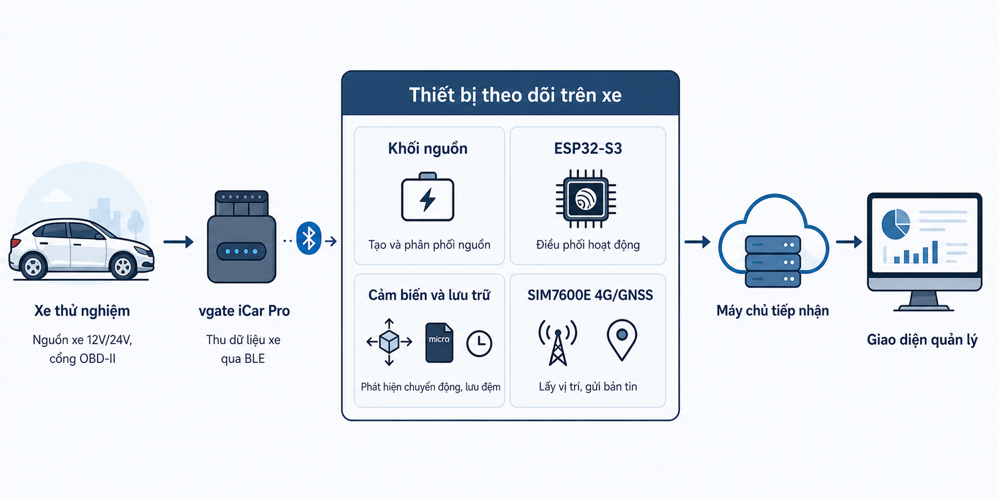

_Hình 4.1: Sơ đồ khối tổng quan của thiết bị theo dõi trên xe_

Từ Hình 4.1, có thể rút ra các ý chính sau:

- Thiết bị thu bốn nhóm thông tin chính: dữ liệu vận hành, vị trí, chuyển động và trạng thái nguồn.
- `ESP32-S3` giữ vai trò điều phối trung tâm, ghép các thông tin này thành bản tin giám sát.
- Bản tin sau đó được truyền về máy chủ để phục vụ theo dõi và khai thác.

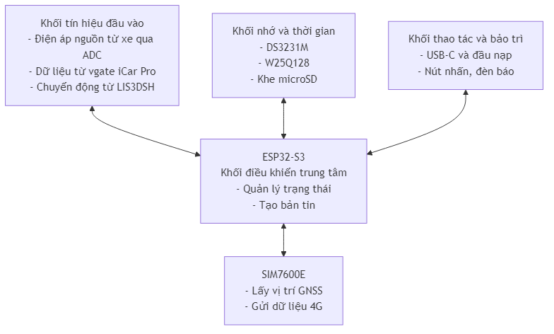

_Hình 4.2: Khối ESP32-S3 và các nhánh mà bộ điều khiển trung tâm trực tiếp quản lý_

Vai trò của khối điều khiển trung tâm trong Hình 4.2 có thể tóm tắt như sau:

- `ESP32-S3` là khối xử lý trung tâm của thiết bị.
- Khối này tiếp nhận tín hiệu nguồn, dữ liệu xe, tín hiệu chuyển động, mốc thời gian và dữ liệu lưu đệm.
- Các chuyển đổi giữa hoạt động, chờ và ngủ sâu đều do `ESP32-S3` điều phối.

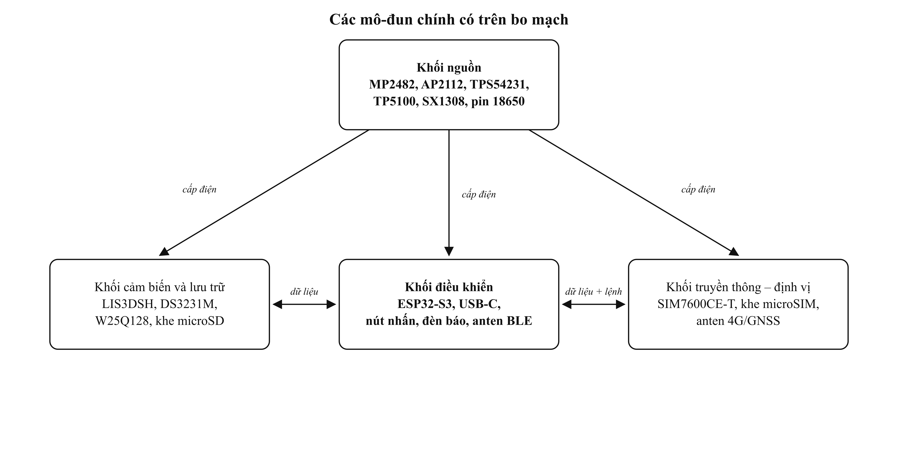

_Hình 4.2a: Các mô-đun chính có trên bo mạch và quan hệ giữa các cụm chức năng_

Ở mức mô-đun, Hình 4.2a cho thấy các cụm chức năng chính của bo mạch như sau:

- Bo mạch được chia thành các cụm chức năng chính thay vì bố trí linh kiện rời rạc.
- Nhánh nguồn tạo các mức điện áp làm việc và nguồn dự phòng.
- Nhánh cảm biến - lưu trữ phục vụ phát hiện chuyển động, giữ thời gian và lưu dữ liệu cục bộ.
- Nhánh truyền thông - định vị đảm nhiệm lấy vị trí và gửi bản tin.

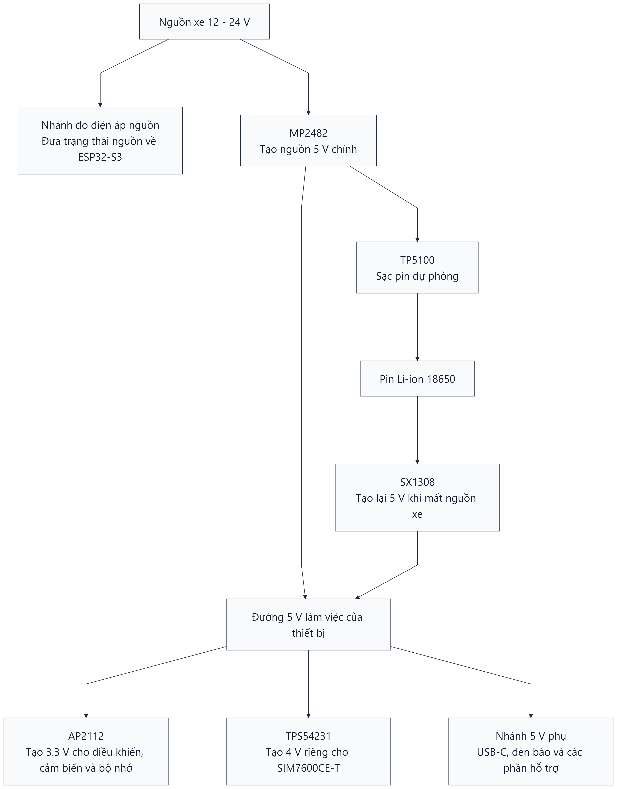

_Hình 4.2b: Cấu trúc khối nguồn chính, nguồn dự phòng và các mức nguồn làm việc của thiết bị_

Từ Hình 4.2b, có thể thấy cách tổ chức nguồn của thiết bị qua các điểm sau:

- Nguồn từ xe trước hết tạo bus 5 V làm nguồn trung gian cho toàn thiết bị.
- Từ bus này, hệ thống tách ra 3.3 V cho điều khiển và cảm biến, khoảng 4 V riêng cho `SIM7600E`.
- Pin dự phòng `18650` được sạc trong quá trình làm việc và tạo lại đường 5 V khi mất nguồn xe.
- Cách tổ chức này giúp nhánh modem không kéo sụt nhánh điều khiển.

Sau khi chốt các khối chức năng, thiết bị được đưa xuống thiết kế PCB trên Altium Designer.

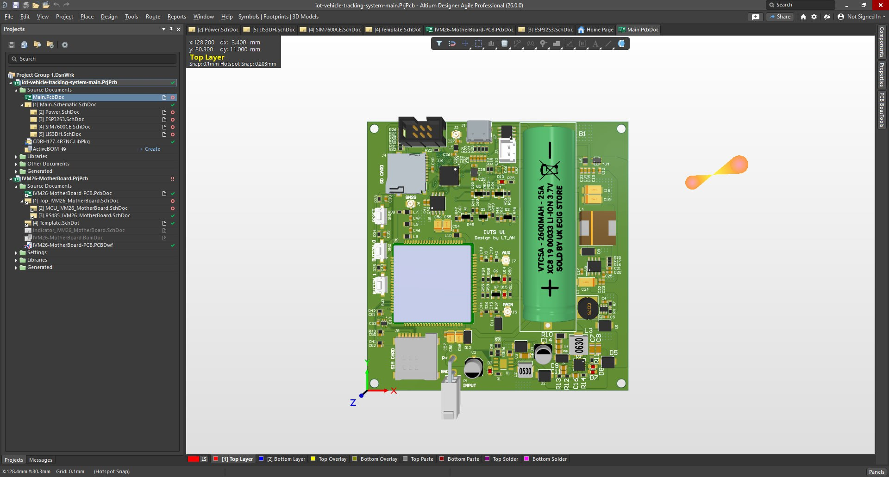

_Hình 4.2c: Bố trí mặt trước của PCB sau khi hoàn thiện thiết kế trên phần mềm_

Ở mức layout, Hình 4.2c thể hiện ba điểm chính:

- Các khối chức năng đã được bố trí trên cùng một bo mạch tích hợp.
- Khe SIM, khe nhớ, đầu anten, cổng nguồn và pin dự phòng đều được đưa lên cùng một layout.
- Cách bố trí này giúp giảm mạch rời, rút gọn dây nối và thuận tiện hơn khi đặt thiết bị trong cabin.

Từ layout này, nguyên mẫu phần cứng được hiện thực qua các bước sau:

- Từ bản thiết kế này, PCB được gia công và hàn lắp để tạo thành nguyên mẫu phần cứng.
- Các cụm `microSIM`, `microSD`, bộ điều khiển, pin dự phòng, đầu nối anten và cổng nguồn đã cùng nằm
  trên một bo duy nhất.
- Đây là bước chuyển từ bản thiết kế sang sản phẩm thử nghiệm thực tế.

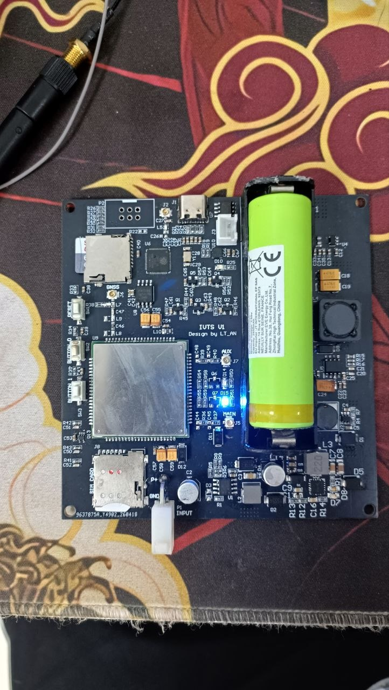

_Hình 4.3: Bo mạch nguyên mẫu sau khi hàn lắp đầy đủ linh kiện và kiểm tra hoạt động ban đầu_

Sau khi hoàn thiện lắp ráp, nguyên mẫu phần cứng có các đặc điểm chính sau:

- Nguyên mẫu được đưa vào vỏ để cố định bo mạch.
- Các đường anten và kết nối chính được sắp xếp lại theo cấu hình lắp đặt thực tế.

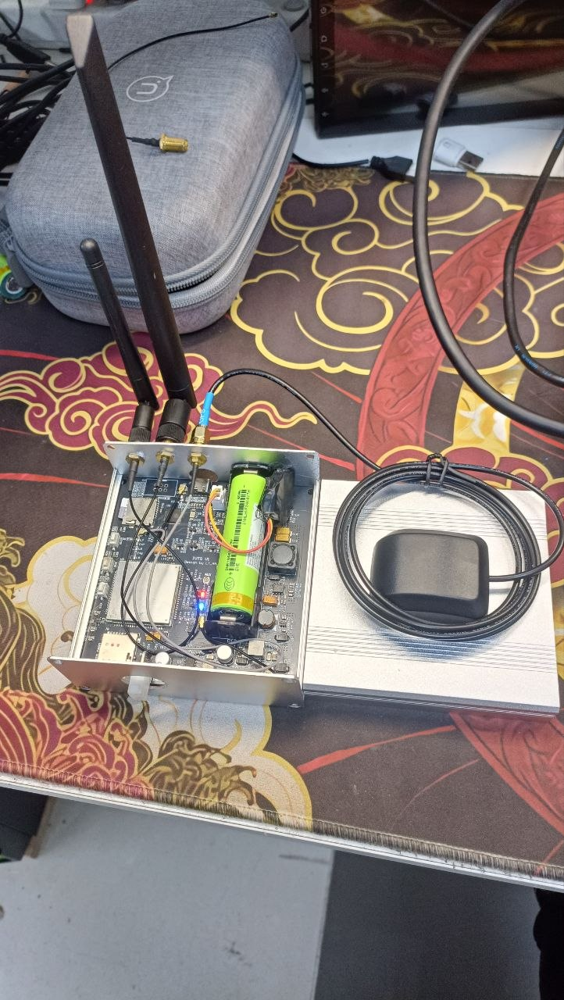

_Hình 4.3a: Nguyên mẫu phần cứng sau khi lắp trong vỏ và hoàn thiện các kết nối chính_

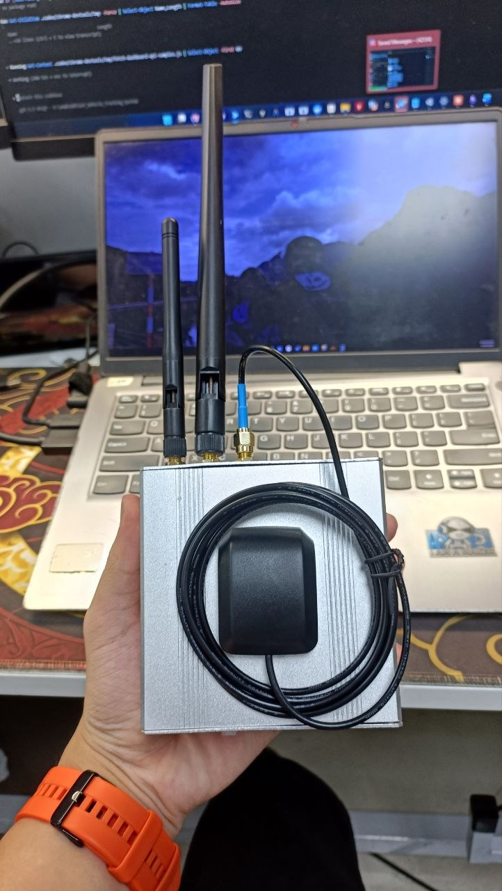

_Hình 4.3b: Thiết bị sau khi đóng vỏ, sẵn sàng cho bước lắp thử và đo kiểm trên xe_

Khi đưa thiết bị lên xe thử nghiệm, cách bố trí được chốt theo các điểm sau:

- `vgate iCar Pro` được cắm trực tiếp vào cổng `OBD-II` của xe.
- Thiết bị theo dõi được đặt trong cabin, ưu tiên khu vực dưới táp-lô.
- Dữ liệu xe đi không dây từ `OBD-II`, còn thiết bị chỉ lấy nguồn từ xe và đặt anten ở vị trí thuận lợi
  cho thu sóng.
- Cách bố trí này giữ đúng định hướng ít xâm lấn và cho phép chuyển sang bước đo kiểm trên xe thật.

**Bảng 4.1: Tóm tắt các bước triển khai phần cứng**

| Bước triển khai                                       | Kết quả đạt được                                                                                                                    |
| :------------------------------------------------------- | :----------------------------------------------------------------------------------------------------------------------------------------- |
| Chốt kiến trúc tổng thể                             | Xác định rõ các cụm nguồn, điều khiển, cảm biến - lưu trữ và truyền thông - định vị trong cùng một tuyến giám sát |
| Thiết kế PCB                                           | Gom các khối chính, khe SIM, khe nhớ, đầu anten, cổng nguồn và pin dự phòng lên một bo mạch chung                            |
| Hoàn thiện khối điều khiển và phân cụm mô-đun | Xác lập vai trò của `ESP32-S3` và quan hệ phối hợp giữa các nhánh trên bo mạch                                              |
| Hoàn thiện nhánh nguồn                               | Tạo các mức 5 V, 4 V, 3.3 V, bổ sung pin dự phòng và giữ điều kiện cho chế độ ngủ sâu                                      |
| Gia công và hàn lắp nguyên mẫu                     | PCB được chế tạo, lắp đầy đủ linh kiện và kiểm tra hoạt động ban đầu                                                     |
| Hoàn thiện cơ khí và lắp thử trên xe             | Đưa bo vào vỏ, bố trí anten, kết nối với `OBD-II` và kiểm tra khả năng làm việc trong xe thật                            |

Đến đây, phần cứng của đồ án đã hình thành một nguyên mẫu hoàn chỉnh, trong đó các tuyến nguồn, thu
dữ liệu, định vị, truyền bản tin và lưu đệm đã được ghép trên cùng một thiết bị. Đây là cơ sở để chuyển
sang bước đo kiểm ở Mục 4.3.

## 4.2. Triển khai phần mềm hệ thống

Phần mềm là lớp làm cho thiết bị trên xe, máy chủ và giao diện vận hành như một hệ thống thống nhất.
Ở phía thiết bị, firmware quyết định khi nào thu dữ liệu, khi nào gửi bản tin và khi nào chuyển về ngủ
sâu. Ở phía máy chủ và giao diện, dữ liệu được tiếp nhận, xử lý, lưu trữ và đưa lên màn hình quản lý
theo đúng ngữ cảnh khai thác.

### 4.2.1. Phần điều khiển trên thiết bị

Ở phía thiết bị, firmware quyết định thiết bị thức dậy khi nào, lấy dữ liệu theo nhịp nào, gửi bản tin
ra sao và chuyển về ngủ sâu trong điều kiện nào. Bản triển khai hiện tại chạy trên `ESP32-S3`, phát
triển bằng `ESP-IDF 5.4`; `FreeRTOS` dùng để điều phối các nhánh việc chính, `NimBLE` dùng cho
kết nối với `vgate iCar Pro`, còn `UART` dùng để trao đổi với `SIM7600E`.

**Bảng 4.2: Các thành phần và chức năng chính đã triển khai ở firmware**

| Nhóm triển khai                 | Nội dung đã hiện thực                                                                                                                    |
| :-------------------------------- | :-------------------------------------------------------------------------------------------------------------------------------------------- |
| Nền tảng chạy                  | `ESP-IDF 5.4`, `FreeRTOS` và cấu hình vận hành trên `ESP32-S3`                                                                    |
| Thu dữ liệu xe                  | `NimBLE` kết nối với `vgate iCar Pro`, đọc được nhóm dữ liệu OBD-II cơ bản như trạng thái khóa điện, tốc độ và RPM |
| Định vị và gửi bản tin      | `SIM7600E` đảm nhiệm lấy vị trí `GNSS`, đăng ký mạng `4G` và gửi bản tin `MQTT`                                          |
| Theo dõi nguồn                  | Firmware đọc điện áp nguồn xe, điều khiển các nhánh cấp nguồn và phối hợp với nguồn dự phòng khi cần                     |
| Lưu đệm và gửi bù           | Dữ liệu được giữ cục bộ khi mất kết nối và gửi bù khi có mạng trở lại                                                       |
| Tổ chức trạng thái vận hành | Logic làm việc được chia theo các pha khởi tạo, kiểm tra trạng thái xe, hoạt động, đỗ xe, cảnh báo và ngủ sâu            |

Điểm cốt lõi của firmware nằm ở cách các nhánh phần cứng được ghép lại theo trạng thái vận hành của
xe. Khi xe hoạt động, thiết bị duy trì nhịp lấy vị trí, đọc dữ liệu `OBD-II` và gửi bản tin đều lên máy
chủ. Khi xe dừng, các tải lớn được hạ xuống; thiết bị chuyển sang chờ hoặc ngủ sâu, chỉ giữ đường
đánh thức từ `LIS3DSH` và các mốc kiểm tra định kỳ. Nhờ vậy, phần lớn năng lượng được cắt giảm
trong quãng xe đỗ nhưng đường giám sát vẫn không bị bỏ trống.

### 4.2.2. Hạ tầng máy chủ và xử lý dữ liệu

Phía máy chủ được triển khai theo hướng tách riêng lớp nhận bản tin, lớp xử lý nghiệp vụ và các kho
lưu trữ. Cách tổ chức này giúp hệ thống giữ ổn định khi thiết bị gửi dữ liệu liên tục hoặc gửi bù sau
mất sóng.

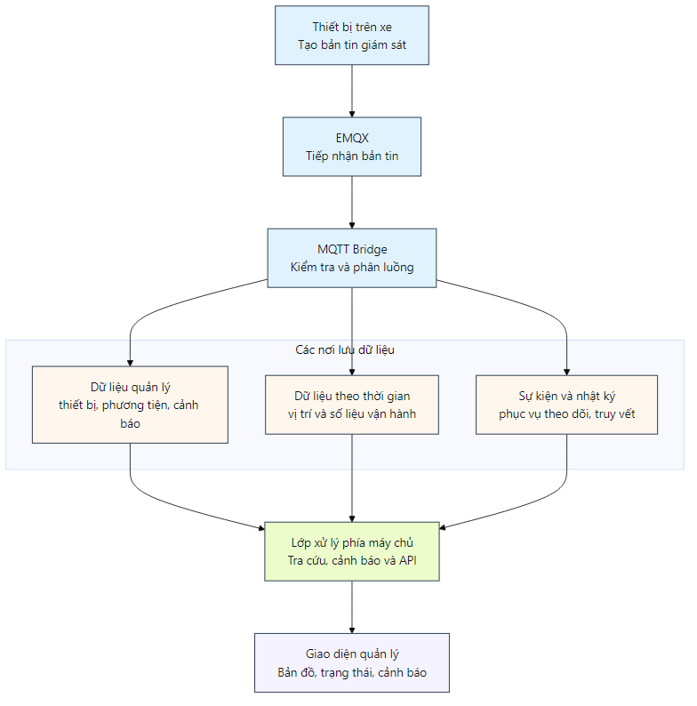

_Hình 4.4: Tuyến tiếp nhận, xử lý, lưu trữ và khai thác dữ liệu phía máy chủ_

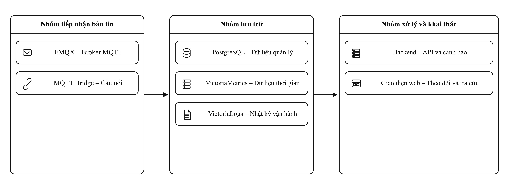

_Hình 4.4a: Các nhóm chức năng chính trong không gian triển khai phía máy chủ_

Trong cấu hình hiện tại, `EMQX` là điểm tiếp nhận bản tin `MQTT` từ thiết bị. Từ đó, `MQTT Bridge`
kiểm tra cấu trúc, phân luồng và ghi dữ liệu vào đúng nơi; `PostgreSQL` giữ dữ liệu nghiệp vụ;
`VictoriaMetrics` giữ dữ liệu chuỗi thời gian; `VictoriaLogs` giữ nhật ký vận hành; còn lớp xử lý phía
máy chủ viết bằng `Express + TypeScript` cung cấp `API` và đẩy cập nhật mới ra giao diện. Các dịch
vụ này được đóng gói riêng bằng `Docker Compose`, nên việc khởi động, cập nhật hay dò lỗi từng lớp
đều rõ ràng hơn.

**Bảng 4.3: Các thành phần chính ở máy chủ**

| Thành phần                                            | Vai trò triển khai                                                                            |
| :------------------------------------------------------ | :---------------------------------------------------------------------------------------------- |
| `EMQX`                                                | Nhận kết nối MQTT từ thiết bị và giữ lớp trung chuyển bản tin                        |
| `MQTT Bridge`                                         | Kiểm tra cấu trúc bản tin, phân luồng và ghi dữ liệu vào các kho lưu trữ           |
| `PostgreSQL`                                          | Lưu dữ liệu nghiệp vụ như thiết bị, phương tiện, cảnh báo và lịch sử khai thác |
| `VictoriaMetrics` và `VictoriaLogs`                | Lưu dữ liệu chuỗi thời gian và nhật ký vận hành để truy vết, giám sát            |
| Lớp xử lý phía máy chủ (`Express + TypeScript`) | Cung cấp API, xử lý nghiệp vụ và đẩy cập nhật mới ra giao diện                      |

Điểm mạnh của cấu trúc này là tuyến nhận bản tin được tách khỏi phần phục vụ giao diện. Vì vậy, khi
thiết bị gửi bù dữ liệu sau mất sóng hoặc khi số bản tin tăng lên, hệ thống vẫn giữ được nhịp xử lý và
không làm phần khai thác bị nghẽn theo.

### 4.2.3. Giao diện khai thác

Ở lớp khai thác, dữ liệu sau xử lý được đưa lên giao diện quản lý trên nền web; trong bản triển khai
hiện tại, giao diện được xây dựng bằng `Next.js` và `React`, bản đồ dùng `Leaflet`, còn cập nhật gần
thời gian thực đi qua `Socket.IO`. Cách bố trí màn hình không dồn mọi thông số kỹ thuật lên một nơi,
mà ưu tiên đúng các thao tác người quản lý thường dùng.

_Hình 4.5: Màn hình chi tiết thiết bị với trạng thái, thời gian chạy và vị trí gần nhất_

_Hình 4.6: Màn hình bản đồ theo dõi vị trí và trạng thái xe_

_Hình 4.7: Màn hình kiểm tra dữ liệu xe và bản tin thiết bị gửi về_

Ba màn hình này tương ứng với ba việc xuất hiện thường xuyên nhất trong vận hành: xem nhanh tình
trạng một xe, theo dõi đội xe trên bản đồ và đối chiếu dữ liệu khi cần kiểm tra sâu hơn. Nhờ cách tách
này, màn hình chính vẫn dễ quan sát, còn dữ liệu kỹ thuật chỉ mở ra ở phần chi tiết.

## 4.3. Kết quả kiểm thử và đo lường

Đo kiểm được thực hiện sau khi toàn tuyến từ thiết bị đến giao diện đã vận hành ổn định. Mục tiêu của
phần này không phải đo cho đủ danh mục, mà là trả lời những câu hỏi rất thực dụng: khi xe đỗ thiết bị
có thật sự tiết kiệm điện không, dữ liệu xe có lấy được đủ nhanh không, vị trí có theo kịp hành trình
không, cảnh báo có lên kịp cho người quản lý không và hệ thống có chịu được một nhóm xe nhỏ trong
vận hành đồng thời hay không.

Việc đo kiểm được thực hiện trên hai bối cảnh:

- Trên bàn thử: kiểm tra dòng ngủ, dòng hoạt động, chuyển nguồn, phản hồi dữ liệu xe và
  độ trễ truyền dữ liệu.
- Trên xe: kiểm tra vị trí, hành trình, cảnh báo và khả năng khai thác trên giao diện.

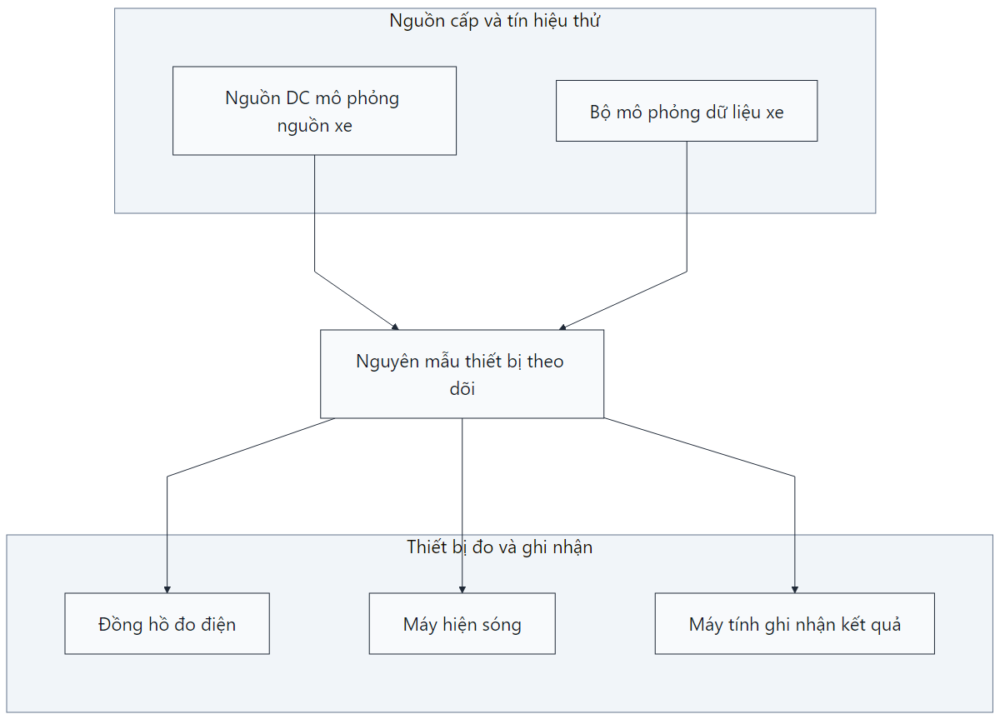

_Hình 4.7a: Bố trí nguồn cấp, tín hiệu thử và thiết bị ghi nhận trên bàn thử_

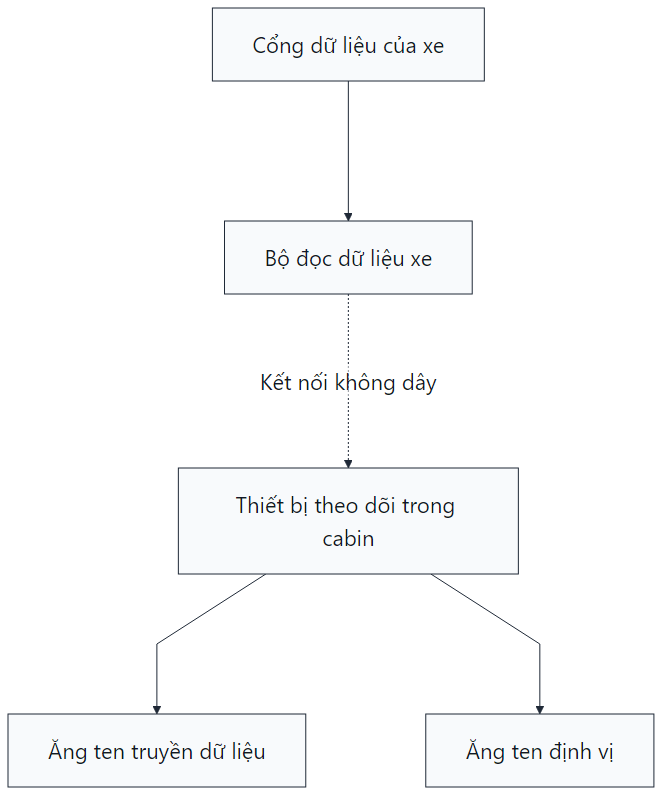

_Hình 4.7b: Bố trí bộ đọc dữ liệu xe và thiết bị theo dõi trên xe thử nghiệm_

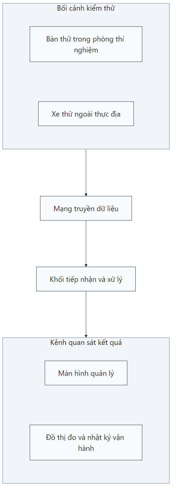

_Hình 4.7c: Chuỗi kiểm thử từ nguồn dữ liệu đến màn hình quan sát kết quả_

**Bảng 4.4a: Cơ sở các phép đo chính**

| Nhóm đo                        | Điều kiện đo                                                                        | Căn cứ đánh giá                                                          |
| :------------------------------- | :-------------------------------------------------------------------------------------- | :---------------------------------------------------------------------------- |
| Nguồn và tiêu thụ điện     | Cấp nguồn DC mô phỏng nguồn xe, theo dõi dòng và chuyển nguồn                 | Đánh giá ảnh hưởng lên ắc quy và hiệu quả của chế độ ngủ sâu |
| Lấy dữ liệu xe                | Ghép `vgate iCar Pro`, đọc lặp các tham số xe cơ bản                          | Đánh giá thời gian kết nối và độ ổn định của dữ liệu OBD-II    |
| Định vị và hành trình      | Lắp trên xe, chạy ngoài trời và quan sát bản đồ                               | Đánh giá thời gian lên vị trí và độ chính xác ngoài thực địa  |
| Truyền dữ liệu và giao diện | So sánh thời điểm thiết bị gửi dữ liệu với thời điểm giao diện cập nhật | Đánh giá độ trễ toàn tuyến ở mức gần thời gian thực              |
| Cảnh báo và xử lý sự kiện | Tạo vùng thử, kịch bản đỗ lâu, rung hoặc mất mạng                            | Đánh giá khả năng phục vụ trực tiếp cho quản lý xe                 |

**Bảng 4.4: Kết quả kiểm thử theo mục tiêu vận hành**

| Mục tiêu kiểm tra                                       | Cách quan sát                                                                        | Kết quả                                                                             |
| :--------------------------------------------------------- | :------------------------------------------------------------------------------------- | :------------------------------------------------------------------------------------ |
| Xe vừa hoạt động thì thiết bị có thức dậy không | Quan sát trạng thái thiết bị sau khi cấp nguồn hoạt động                     | Thiết bị thức dậy sau khoảng 2 s                                                 |
| Dữ liệu xe có đọc được không                      | Kết nối bộ đọc dữ liệu xe không dây và đọc dữ liệu cơ bản              | Kết nối sau khoảng 4 s, phản hồi dữ liệu khoảng 60-75 ms                      |
| Vị trí xe có lên nhanh không                          | Quan sát vị trí xe trên bản đồ                                                  | Sau khoảng 5 s thiết bị lấy lại vị trí, bản đồ cập nhật sau khoảng 1-2 s |
| Dữ liệu có lên máy chủ ổn định không             | So sánh thời điểm thiết bị gửi dữ liệu và thời điểm giao diện cập nhật | Độ trễ truyền dữ liệu khoảng 120-180 ms                                        |
| Khi mất mạng có bị mất hẳn dữ liệu không          | Ngắt mạng rồi cho kết nối lại                                                    | Thiết bị lưu đệm và gửi bù khi có mạng                                      |
| Khi xe ra khỏi vùng cho phép có báo không            | Tạo vùng thử và chạy xe qua ranh giới                                            | Cảnh báo xuất hiện sau khoảng 5-7 s                                              |
| Hệ thống có đủ sức phục vụ nhóm xe nhỏ không    | Tăng số thiết bị mô phỏng đồng thời                                           | Ổn định với từ 50 thiết bị trở lên                                           |

Nhìn vào nhóm phép thử cốt lõi, có thể thấy nguyên mẫu đã đáp ứng đúng các yêu cầu vận hành quan
trọng: thiết bị thức dậy đủ nhanh, dữ liệu xe xuất hiện từ đầu chuyến, vị trí bám được hành trình thực
tế, dữ liệu lên giao diện gần thời gian thực và cảnh báo xuất hiện trong khoảng có thể sử dụng được.

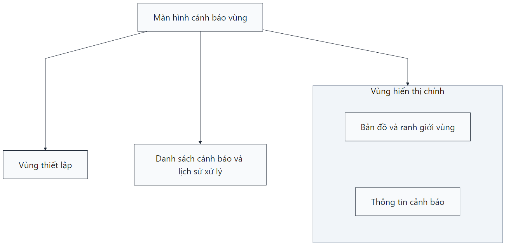

_Hình 4.8: Các khu vực chính trên màn hình cảnh báo vượt vùng_

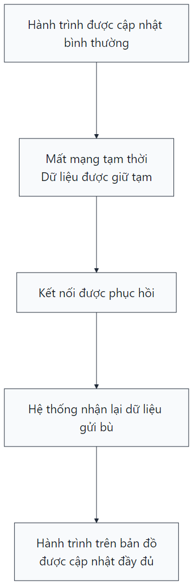

_Hình 4.9: Trình tự cập nhật lại hành trình sau khi kết nối được phục hồi_

**Bảng 4.5: Các số liệu đo kiểm chính**

| Hạng mục                                      | Kết quả đạt được |
| :---------------------------------------------- | :---------------------- |
| Dòng ngủ sâu                                 | ~500 µA (~0,5 mA)      |
| Dòng hoạt động trung bình                  | ~180-220 mA             |
| Thời lượng pin dự phòng                    | ~2,6-3,0 giờ           |
| Độ chính xác vị trí ngoài trời          | ~2-3 m                  |
| Kết nối bộ đọc dữ liệu xe không dây    | ~4 s                    |
| Phản hồi dữ liệu xe                         | ~60-75 ms               |
| Độ trễ truyền dữ liệu qua mạng di động | ~120-180 ms             |
| Thời gian khôi phục kết nối                | ~15-30 s                |
| Cập nhật bản đồ thời gian thực           | ~1-2 s                  |
| Cảnh báo vượt vùng                         | ~5-7 s                  |
| Thời gian phản hồi máy chủ                 | ~95-200 ms              |
| Số thiết bị đồng thời                     | 50+ thiết bị          |

Các số liệu tổng hợp cho thấy những ràng buộc chính đặt ra ở đầu bài vẫn được giữ: dòng ngủ sâu ở
mức thấp, độ trễ toàn tuyến không lớn, còn lớp dữ liệu định vị và dữ liệu xe đủ cho theo dõi và cảnh
báo cơ bản. Ở phía máy chủ, hệ thống vẫn giữ được ổn định khi tăng lên mức 50+ thiết bị đồng thời.

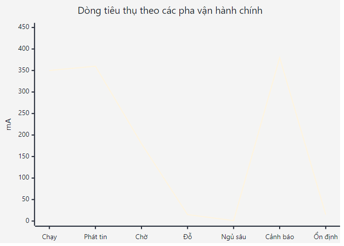

_Hình 4.10: Dòng tiêu thụ thay đổi theo từng pha vận hành chính của thiết bị_

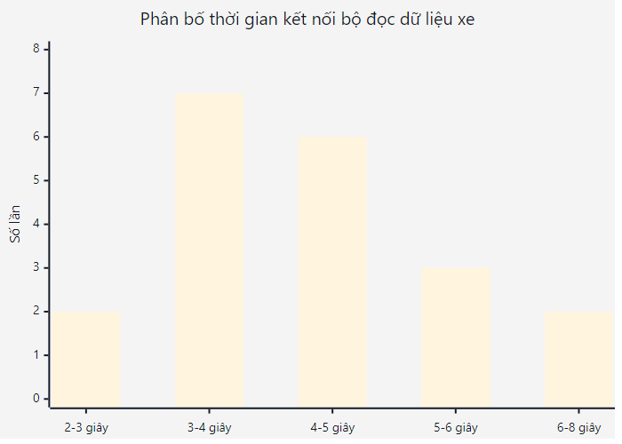

_Hình 4.11: Phần lớn các lần kết nối bộ đọc dữ liệu xe hoàn thành trong khoảng 3-5 giây_

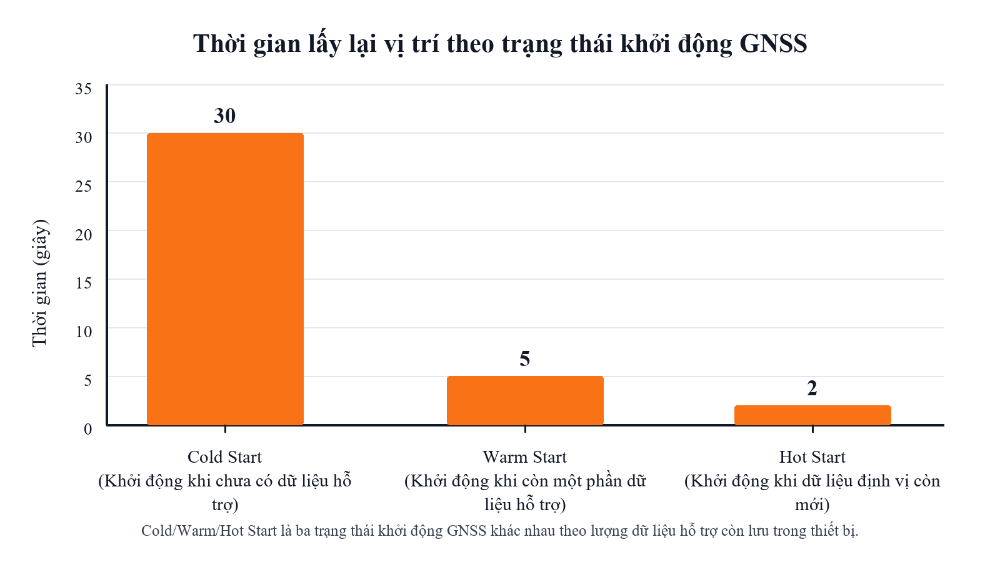

_Hình 4.12: Thời gian lấy lại vị trí thay đổi theo trạng thái khởi động của khối định vị_

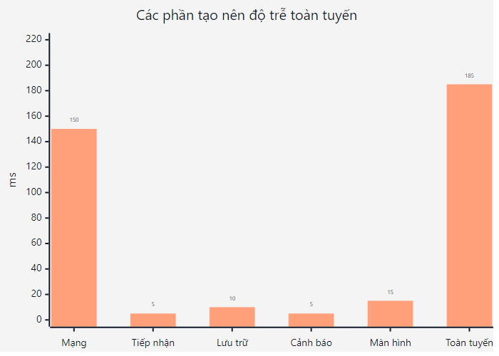

_Hình 4.13: Phần lớn độ trễ toàn tuyến nằm ở nhánh truyền qua mạng di động_

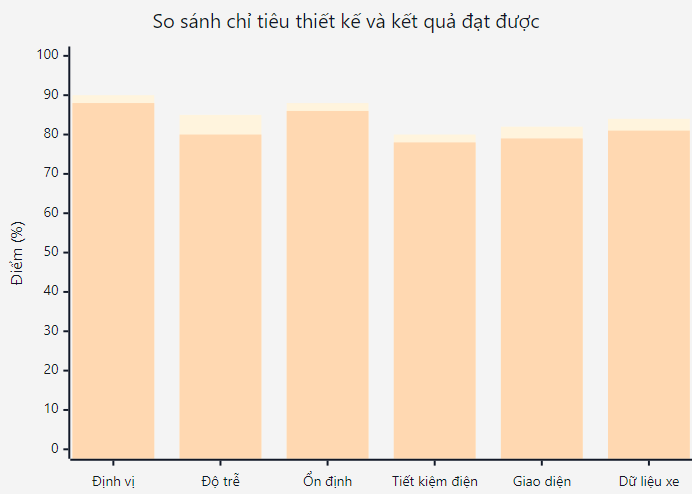

_Hình 4.14: Mức đáp ứng của một số chỉ tiêu chính so với mục tiêu thiết kế_

Chuỗi đồ thị từ Hình 4.10 đến Hình 4.14 giúp nhìn rõ hơn bản chất vận hành của hệ thống. Khi thiết bị
vào ngủ sâu, dòng tiêu thụ giảm mạnh; khi quay lại hoạt động, thời gian nối lại `OBD-II` và lấy lại vị
trí vẫn đủ nhanh cho đầu chuyến; còn phần lớn độ trễ toàn tuyến nằm ở nhánh truyền qua mạng di
động, không phải ở nhánh xử lý phía máy chủ.

## 4.4. Đối chiếu với mục tiêu của đồ án

Từ các kết quả đo kiểm ở phần trên, nguyên mẫu được đối chiếu lại theo hai nhóm: mục tiêu chức năng
của hệ thống và các ràng buộc triển khai thực tế.

**Bảng 4.6: Đối chiếu các mục tiêu chức năng**

| Mục tiêu theo đồ án     | Kết quả đối chiếu                                                                                                            |
| :--------------------------- | :-------------------------------------------------------------------------------------------------------------------------------- |
| Nguồn cấp thiết bị       | Thiết bị làm việc ổn định trên nguồn xe 12-24 VDC                                                                        |
| Bộ điều khiển trung tâm | Hệ thống được triển khai trên ESP32-S3                                                                                     |
| Giao tiếp với xe           | Đọc được dữ liệu OBD-II qua kết nối Bluetooth                                                                            |
| Dữ liệu chính cần thu    | Theo dõi được tọa độ GPS, tốc độ và nhóm dữ liệu OBD-II cơ bản phục vụ quản lý                                |
| Cảnh báo chính            | Đã triển khai cảnh báo vượt tốc độ, đỗ lâu và ra khỏi vùng quản lý                                              |
| Chức năng tổng hợp       | Tổng hợp được quãng đường, thời gian sử dụng; dữ liệu vận hành là đầu vào cho ước tính chi phí khai thác |
| Khả năng chế tạo         | Đã hoàn thành nguyên mẫu PCB, vỏ in 3D và lắp thử trên xe                                                              |

**Bảng 4.7: Đối chiếu các ràng buộc triển khai**

| Ràng buộc thiết kế         | Kết quả đối chiếu                                                                                      |
| :----------------------------- | :---------------------------------------------------------------------------------------------------------- |
| Ràng buộc chi phí           | Tổng chi phí triển khai ở mức 4.504.000-5.704.000 VND                                                  |
| Môi trường kiểm chứng     | Đã đo trong phòng thí nghiệm và trên xe thử nghiệm                                                |
| Khả năng chế tạo thực tế | Đã chế tạo PCB chuyên dụng, vỏ in 3D và lắp thử trên xe                                          |
| Chuẩn tham chiếu             | Bố trí mạch nguồn và khoảng cách an toàn cơ bản được tham chiếu theo IPC-2221 và IEC 60664-1 |

Nhìn từ hai nhóm đối chiếu trên, nguyên mẫu đã đạt phần cốt lõi của đồ án: lắp được trên xe thật, thu
được dữ liệu vị trí và dữ liệu vận hành cơ bản, truyền dữ liệu về máy chủ và hiển thị được trên giao
diện quản lý. Những phần còn lại chủ yếu là kiểm chứng dài hạn và mở rộng quy mô, không phải thiếu
hụt ở chức năng vận hành cơ bản.

# CHƯƠNG 5. ĐÁNH GIÁ VÀ KHUYẾN NGHỊ - EVALUATION AND RECOMMENDATIONS

## 5.1. Đánh giá hiệu năng

Các kết quả ở Chương 4 cho thấy nguyên mẫu đã đáp ứng được các yêu cầu kỹ thuật cốt
lõi của đồ án. Điểm quan trọng là thiết bị, máy chủ và giao diện đã chạy được như một
tuyến hoàn chỉnh, không chỉ là các khối rời.

**Bảng 5.1: Đánh giá hiệu năng theo các nhóm chính**

| Nhóm đánh giá               | Mức đáp ứng hiện tại                                                                                                         | Giới hạn còn lại                                                       |
| :------------------------------ | :--------------------------------------------------------------------------------------------------------------------------------- | :------------------------------------------------------------------------- |
| Phần cứng và lắp đặt      | Đã chế tạo được nguyên mẫu PCB và vỏ in 3D, lắp thử trên xe thật                                                    | Cần kiểm chứng thêm độ bền dài ngày và tính ổn định cơ khí |
| Nguồn và năng lượng        | Nguồn 12-24 VDC hoạt động ổn định, dòng ngủ sâu khoảng 0,5 mA, có nguồn dự phòng                                    | Cần đo thêm trên nhiều loại ắc quy và nhiều chu kỳ đỗ dài     |
| Thu nhận và truyền dữ liệu | GPS, OBD-II và tuyến truyền dữ liệu đáp ứng yêu cầu theo dõi gần thời gian thực                                      | Cần kiểm thử thêm ở vùng sóng yếu và trên nhiều dòng xe        |
| Máy chủ và giao diện        | Dữ liệu được tiếp nhận, lưu trữ, hiển thị và cảnh báo ổn định; hệ thống đạt mức 50+ thiết bị đồng thời | Cần đánh giá sâu hơn khi mở rộng quy mô                           |

Ở mức nguyên mẫu, thực nghiệm cho thấy dữ liệu từ xe đã lên được giao diện ở dạng có
thể khai thác; thiết bị giữ được mức tiêu thụ điện phù hợp cho bối cảnh lắp trên xe; và
các lớp thu nhận, lưu trữ, khai thác dữ liệu đã phối hợp ổn định trong cùng một tuyến
vận hành.

Tuy vậy, kết quả hiện tại mới phản ánh mức hoàn thiện của một nguyên mẫu tích hợp.
Độ bền dài ngày, độ ổn định trên nhiều dòng xe, phạm vi tương thích OBD-II rộng hơn
và khả năng mở rộng ở quy mô lớn vẫn cần kiểm chứng thêm trước khi có thể xem như
một phương án triển khai diện rộng.

## 5.2. Đánh giá kinh tế và môi trường

Về kinh tế, chi phí phần cứng cho một thiết bị khoảng **1.514.000 VND**; chi phí SIM
dữ liệu khoảng **70.000 VND/tháng/thiết bị**; chi phí máy chủ cho giai đoạn phát triển
và thử nghiệm 6 tháng khoảng **2.370.000-3.570.000 VND**. Tổng chi phí triển khai
của nguyên mẫu vì vậy nằm trong khoảng **4.504.000-5.704.000 VND**, thấp hơn đáng
kể so với giới hạn **20.000.000 VND** của đồ án. Cấu trúc chi phí này phù hợp với bối
cảnh đội xe nhỏ và vừa vì chi phí tăng theo số xe chủ yếu nằm ở thiết bị và SIM, còn
máy chủ và giao diện có thể dùng chung.

Về môi trường triển khai, thiết bị lấy nguồn 12-24 VDC và đọc dữ liệu qua OBD-II nên
không cần can thiệp sâu vào hệ điện nguyên bản của xe. Dòng ngủ sâu khoảng 0,5 mA
cũng giúp giảm ảnh hưởng năng lượng khi xe dừng lâu. Tuy nhiên, khi chuyển sang
triển khai dài hạn, vẫn cần tính đến việc thay thế, thu hồi và xử lý PCB, pin dự phòng
và các linh kiện điện tử hỏng để hạn chế chất thải điện tử.

## 5.3. Đánh giá rủi ro và biện pháp giảm thiểu

Trong phạm vi nguyên mẫu, bốn rủi ro kỹ thuật cần quan tâm nhất gồm:

- **Biến động mạng di động:** Khi xe đi qua khu vực sóng yếu, độ trễ tăng và bản tin có
  thể bị gián đoạn. Hướng giảm thiểu đã áp dụng là dùng MQTT làm tuyến truyền chính,
  đồng thời bổ sung cơ chế lưu đệm và gửi bù sau khi kết nối phục hồi.
- **Ảnh hưởng lên ắc quy khi xe đỗ lâu:** Nếu toàn bộ khối đo và truyền thông luôn giữ
  trạng thái hoạt động, dòng nền sẽ tích lũy theo thời gian. Đồ án xử lý vấn đề này bằng
  cách tổ chức các trạng thái vận hành và chỉ giữ lại những khối thật sự cần thiết ở từng
  thời điểm.
- **Báo giả hoặc bỏ sót khi giám sát xe dừng:** Ngưỡng phát hiện chuyển động không phù
  hợp có thể làm cảnh báo thiếu ổn định. Vì vậy, nguyên mẫu kết hợp trạng thái đỗ, tín
  hiệu IMU và thời gian không hoạt động; tuy nhiên phần hiệu chỉnh ngưỡng vẫn cần tiếp
  tục kiểm chứng trên nhiều điều kiện xe khác nhau.
- **Khác biệt dữ liệu OBD-II giữa các dòng xe:** Tập tham số hỗ trợ và tốc độ phản hồi
  có thể thay đổi giữa các xe, làm dữ liệu thu được không đồng đều. Do đó, lớp thu
  nhận được tổ chức theo hướng mô-đun để hệ thống vẫn giữ được theo dõi vị trí, trạng
  thái và cảnh báo ngay cả khi dữ liệu OBD-II không đầy đủ.

## 5.4. Khuyến nghị cho tương lai

Từ những giới hạn còn lại của nguyên mẫu, các hướng phát triển tiếp theo nên ưu tiên:

- Kiểm thử dài hạn trên nhiều dòng xe và nhiều điều kiện sóng để xác nhận thêm độ ổn
  định của nguồn, OBD-II, GPS và luồng cảnh báo trong điều kiện thực tế.
- Hoàn thiện phần cứng và quy trình lắp đặt theo hướng gọn hơn, ổn định hơn và lặp lại
  dễ hơn khi triển khai trên nhiều xe.
- Tăng mức an toàn và quản trị dữ liệu, gồm bảo mật đường truyền, quản lý cấu hình từ
  xa, nhật ký sự kiện và quyền truy cập.
- Mở rộng dữ liệu OBD-II, tối ưu thêm chiến lược năng lượng và hoàn thiện lớp khai
  thác trên thiết bị di động.

# CHƯƠNG 6. PHẢN HỒI VÀ BÀI HỌC KINH NGHIỆM - REFLECTION AND LESSONS LEARNED

## 6.1. Ứng dụng kiến thức kỹ thuật

Đồ án là quá trình tích hợp liên ngành từ nguồn điện, nhúng, truyền thông dữ liệu, cơ khí-vật liệu đến triển khai phần mềm máy chủ và giao diện. Bài học lớn nhất là: giá trị kỹ thuật không đến từ việc từng khối “đúng theo lý thuyết” một cách riêng rẽ, mà đến từ việc các khối giữ được ổn định khi chạy đồng thời trong điều kiện thực địa.

Trong chuỗi đó, mỗi quyết định kỹ thuật đều có tác động dây chuyền: nguồn quyết định độ bền phiên vận hành; mô hình trạng thái quyết định tiêu thụ điện và mức bỏ sót sự kiện; tổ chức dữ liệu ở máy chủ quyết định tốc độ phản hồi của giao diện. Vì vậy, cách làm hiệu quả nhất là khóa tiêu chí đo ngay từ đầu và kiểm chứng theo tuyến thay vì kiểm từng thành phần độc lập.

## 6.2. Bài học khi xử lý các điểm khó

Ba điểm khó nhất của bài toán là: cân bằng năng lượng khi xe đỗ dài giờ, giữ độ liên tục dữ liệu khi mạng di động biến động, và duy trì mức lắp đặt ít xâm lấn trên nhiều xe khác nhau.

Những điểm khó này được xử lý bằng ba nguyên tắc triển khai:

- **Tách rõ miền chức năng:** thiết bị ưu tiên thu-gửi ổn định, máy chủ ưu tiên xử lý-lưu trữ-cảnh báo, giao diện ưu tiên quan sát-hành động.
- **Thiết kế theo trạng thái vận hành:** chạy/đỗ/cảnh báo/ngủ sâu để điều khiển tiêu thụ điện theo ngữ cảnh thực.
- **Ưu tiên giải pháp lắp đặt thực dụng:** OBD-II không dây + cấu hình phần cứng gọn để giảm can thiệp hệ điện xe.

Bài học rút ra là: trong bài toán IoT gắn xe, quyết định “đủ dùng, ổn định, lặp lại được” có giá trị cao hơn quyết định “nhiều tính năng nhưng khó vận hành”.

## 6.3. Tác động triển khai thực tế

Khi đưa vào vận hành, hệ thống tạo ra thay đổi trực tiếp ở năng lực quản lý đội xe: người vận hành có thể theo dõi vị trí-trạng thái-cảnh báo trên một màn hình thống nhất, đồng thời truy hồi dữ liệu chuyến đi để đối chiếu nhanh khi phát sinh sự cố hoặc tranh chấp.

Tuy nhiên, việc khai thác dữ liệu vị trí và dữ liệu vận hành phải đi kèm nguyên tắc quản trị dữ liệu rõ ràng: đúng mục đích, đúng thẩm quyền truy cập, đúng thời gian lưu, và đúng cách chia sẻ. Đây là điều kiện bắt buộc để hệ thống không chỉ hiệu quả về kỹ thuật mà còn phù hợp về vận hành và trách nhiệm dữ liệu.

## 6.4. Tổng kết

Đồ án đã hoàn thành mục tiêu cốt lõi: xây dựng một hệ thống IoT quản lý xe cho thuê tự lái có thể triển khai thực tế, gồm thiết bị trên xe, máy chủ xử lý dữ liệu và giao diện khai thác tập trung.

Ở lớp kỹ thuật, hệ thống đã đáp ứng các ràng buộc chính về nguồn 12-24 VDC, nền tảng ESP32-S3, kết nối OBD-II, thu nhận vị trí GPS và vận hành trạng thái tiết kiệm năng lượng. Ở lớp khai thác, hệ thống cung cấp được dữ liệu thời gian thực, cảnh báo sự kiện và tổng hợp chuyến đi phục vụ điều hành.

Quan trọng nhất, toàn bộ chuỗi **thu dữ liệu → truyền dữ liệu → xử lý → hiển thị** đã được kiểm chứng bằng đo kiểm trong phòng thí nghiệm và thử nghiệm trên xe thật, với các chỉ số nằm trong ngưỡng mục tiêu của đề tài. Kết quả này xác nhận phương án đề xuất không dừng ở mức mô hình trình diễn, mà đạt mức khả thi cho triển khai vận hành trong bối cảnh đội xe nhỏ và vừa.

# TÀI LIỆU TRÍCH DẪN - REFERENCES

## [A] Tài liệu chính của đồ án

[1] Lê Trọng An, _Phụ lục I - Mô tả đồ án_, Đại học Phenikaa, 2026.

[2] Kho mã nguồn đồ án IoT Vehicle Tracking System, gồm mã nguồn thiết bị, máy
chủ, giao diện web, ứng dụng di động và tài liệu thiết kế trong thư mục
`resources/`, 2026.

## [B] Tài liệu kỹ thuật

[3] Espressif Systems, _ESP32-S3 Series Datasheet_, 2024.

[4] SIMCom, _SIM7600 Series Hardware Design Manual_, 2024.

[5] STMicroelectronics, _LIS3DSH Datasheet_, 2024.

[6] OASIS, _MQTT Version 3.1.1_, 2014.

[7] IPC, _IPC-2221: Generic Standard on Printed Board Design_, 2022.

[8] IEC, _IEC 60664-1: Insulation Coordination for Equipment within Low-Voltage
Systems_, 2020.

[9] SAE, _OBD-II / J1979 Service Definitions_, 2021.

[10] Teltonika, _FMC920 - Best-selling 4G Compact GPS Tracker_, truy cập tháng
05/2026, tại: https://www.teltonika-gps.com/products/trackers/basic/fmc920

[11] Teltonika, _FMM003 - 4G LTE Cat M1 Tracker With OBD OEM Data Reading_,
truy cập tháng 05/2026, tại:
https://www.teltonika-gps.com/products/trackers/obd-data/fmm003

[12] Queclink, _GV305CEU_, truy cập tháng 05/2026, tại:
https://www.queclink.com/product/gv305ceu/

[13] Báo Chính phủ, _Bộ TT&TT tạm dừng việc tắt sóng 2G Only đến 15/10_,
2024, truy cập tháng 05/2026, tại:
https://baochinhphu.vn/bo-tttt-tam-dung-viec-tat-song-2g-only-den-15-10-10224091320532248.htm

[14] LCSC, _Espressif Systems ESP32-S3_, truy cập tháng 05/2026,
tại: https://www.lcsc.com/product-detail/C2913192.html

[15] LCSC, _SIMCom Wireless Solutions SIM7600CE-T_, truy cập tháng 05/2026,
tại: https://www.lcsc.com/product-detail/Wireless-Modules_SIMCom-Wireless-Solutions-SIM7600CE-T_C520538.html

[16] LCSC, _STMicroelectronics LIS3DSHTR_, truy cập tháng 05/2026,
tại: https://www.lcsc.com/product-detail/C1884688.html

[17] VgateMall, _Vgate iCar Pro_, truy cập tháng 05/2026,
tại: https://www.vgatemall.com/products-detail/i-9/?s=1

# PHỤ LỤC

## PHỤ LỤC 1. TÓM TẮT CHI PHÍ

**Bảng PL-1.1: Tóm tắt chi phí của phương án đồ án**

| Hạng mục                          | Giá trị tham chiếu                                                   |
| :---------------------------------- | :---------------------------------------------------------------------- |
| Phần cứng một thiết bị         | 1.514.000 VND                                                           |
| SIM dữ liệu di động             | Khoảng 70.000 VND/tháng/thiết bị                                    |
| Hạ tầng máy chủ                 | Khoảng 300.000-500.000 VND/tháng, tên miền khoảng 300.000 VND/năm |
| Tổng chi phí triển khai đồ án | 4.504.000-5.704.000 VND                                                 |
| Giới hạn chi phí của đồ án   | Không vượt 20.000.000 VND                                            |

## PHỤ LỤC 2. HỒ SƠ BÀN GIAO

Các thành phần bàn giao của đồ án gồm:

- mã nguồn thiết bị;
- mã nguồn máy chủ;
- mã nguồn giao diện web;
- mã nguồn ứng dụng di động;
- tài liệu thiết kế phần cứng;
- báo cáo đồ án;
- bộ hình minh họa, sơ đồ và snapshot kiểm thử.
