a  `
`

**ĐẠI HỌC PHENIKAA**

---

**ĐỒ ÁN TỐT NGHIỆP**
**THIẾT KẾ HỆ THỐNG IoT CHO ỨNG DỤNG QUẢN LÝ**
**PHƯƠNG TIỆN GIAO THÔNG TRONG LĨNH VỰC**
**CHO THUÊ XE TỰ LÁI**

**Sinh viên:** Lê Trọng An
**Mã số sinh viên:** 21010389
**Lớp:** K15-KTCĐT2
**Ngành:** Kỹ thuật Cơ điện tử
**Giảng viên hướng dẫn:** TS. Nguyễn Đức Nam

**Hà Nội - 2026**

**PHENIKAA UNIVERSITY**
**FACULTY OF MECHANICAL ENGINEERING AND MECHATRONICS**

**CAPSTONE THESIS**
**DESIGN OF AN IoT SYSTEM FOR VEHICLE MANAGEMENT**
**IN SELF-DRIVE CAR RENTAL SERVICES**

| **Student** | **Student ID** | **Class** |
| :---------------- | :------------------- | :-------------- |
| Le Trong An       | 21010389             | K15-KTCĐT2     |

**Supervisor:** Dr. Nguyen Duc Nam

**HANOI - 2026**

# NHẬN XÉT ĐỒ ÁN TỐT NGHIỆP CỦA GIẢNG VIÊN HƯỚNG DẪN

> Phần này giữ đúng mẫu biểu của nhà trường và được điền khi nộp hồ sơ bảo vệ chính thức.

# NHẬN XÉT ĐỒ ÁN TỐT NGHIỆP CỦA GIẢNG VIÊN PHẢN BIỆN

> Phần này giữ đúng mẫu biểu của nhà trường và được điền khi nộp hồ sơ bảo vệ chính thức.

# BIÊN BẢN ĐÁNH GIÁ ĐỒ ÁN TỐT NGHIỆP

> Phần này giữ đúng mẫu biểu của hội đồng, gồm thông tin phiên bảo vệ, câu hỏi phản biện, phần trả lời và kết luận.

# GIẢI TRÌNH CÁC CHỈNH SỬA (NẾU CÓ)

> Tài liệu giải trình sẽ được bổ sung sau khi có góp ý chính thức từ hội đồng.

# LỜI CAM ĐOAN

Tên tôi là: **Lê Trọng An**.

Mã số sinh viên: **21010389** &nbsp;&nbsp;&nbsp;&nbsp;&nbsp;&nbsp; Lớp: **K15-KTCĐT2**
Ngành: **Kỹ thuật Cơ điện tử**.

Tôi cam đoan đồ án tốt nghiệp với đề tài **"Thiết kế hệ thống IoT cho ứng dụng quản lý phương tiện giao thông trong lĩnh vực cho thuê xe tự lái"** là kết quả nghiên cứu do tôi trực tiếp thực hiện, dưới sự hướng dẫn của **TS. Nguyễn Đức Nam**.

Toàn bộ nội dung, số liệu, hình ảnh và kết quả trình bày trong báo cáo là trung thực, được trích dẫn rõ nguồn khi tham khảo tài liệu bên ngoài, và chưa từng công bố dưới danh nghĩa tác giả khác. Nếu có bất kỳ sai phạm nào về học thuật hoặc bản quyền, tôi xin hoàn toàn chịu trách nhiệm trước nhà trường và pháp luật.

Hà Nội, ngày … tháng … năm 2026
**SINH VIÊN THỰC HIỆN**
Lê Trọng An

# TÓM TẮT ĐỒ ÁN TỐT NGHIỆP - ABSTRACT

Đồ án xây dựng một hệ thống IoT phục vụ quản lý đội xe cho thuê tự lái theo hướng triển khai thực tế, với mục tiêu kết nối liền mạch ba lớp: **thiết bị gắn trên xe**, **máy chủ xử lý dữ liệu**, và **giao diện khai thác cho người vận hành**. Bài toán kỹ thuật trung tâm của hệ thống không chỉ là theo dõi vị trí, mà là đồng thời đáp ứng bốn yêu cầu vận hành: bám xe theo thời gian thực, lấy dữ liệu vận hành cơ bản từ OBD-II, phát hiện sự kiện bất thường đủ sớm để can thiệp, và duy trì mức tiêu thụ điện an toàn khi xe dừng lâu.

Thiết bị trên xe sử dụng nguồn 12-24 VDC, nền tảng ESP32-S3, modem LTE/GNSS và kết nối OBD-II không dây để thu dữ liệu vị trí, tốc độ, trạng thái và một số thông số vận hành cơ bản. Dữ liệu được truyền qua MQTT về máy chủ để chuẩn hóa, lưu trữ, tổng hợp hành trình và phát cảnh báo. Giao diện web hiển thị bản đồ, trạng thái thiết bị, dữ liệu chuyến đi và cảnh báo theo sự kiện nhằm hỗ trợ quyết định vận hành trong thời gian thực.

Kết quả triển khai cho thấy hệ thống đã được chế tạo thành nguyên mẫu hoàn chỉnh (PCB + vỏ in 3D), lắp thử trên xe thật và kiểm chứng bằng đo kiểm trong phòng thí nghiệm lẫn ngoài thực địa. Các chỉ tiêu chính về dòng ngủ sâu, thời gian kết nối OBD-II, độ trễ toàn tuyến dữ liệu và khả năng phục vụ đồng thời nhiều thiết bị đều đạt ngưỡng đề ra. Kết quả này xác nhận phương án của đồ án vừa đúng về mặt thiết kế kỹ thuật, vừa khả thi ở mức triển khai thực tế cho bài toán quản lý đội xe quy mô nhỏ và vừa.

**Từ khóa:** IoT, quản lý phương tiện, xe cho thuê tự lái, GPS, OBD-II, MQTT

**Abstract (English)**

This capstone thesis presents an IoT-based fleet tracking system for self-drive rental operations, designed for practical deployment with three tightly integrated layers: an onboard device, a cloud-side processing backend, and an operator-facing dashboard. The core engineering objective is not only location tracking, but also balancing four operational constraints at once: near real-time tracking, basic OBD-II telemetry acquisition, timely event alerting, and low-power behavior during long parking periods.

The onboard unit operates from a 12-24 VDC vehicle source and is built around ESP32-S3, LTE/GNSS connectivity, and wireless OBD-II integration. Telemetry packets are delivered through MQTT to the server, where data is normalized, stored, aggregated into trip history, and converted into operational alerts. The web interface provides map tracking, device status, trip-level insights, and event notifications to support immediate operational decisions.

The final implementation includes a full prototype (custom PCB and 3D-printed enclosure), installed and validated on a real vehicle through both laboratory and field tests. Key performance metrics—deep-sleep current, OBD-II connection latency, end-to-end data delay, and concurrent device handling—meet the target thresholds. These results confirm that the proposed architecture is not only technically sound but also deployable for small- and medium-scale rental fleet management.

**Keywords:** IoT, vehicle tracking, self-drive rental, GPS, OBD-II, MQTT

# LỜI CẢM ƠN - ACKNOWLEDGEMENTS

Em xin trân trọng bày tỏ lòng biết ơn sâu sắc tới **TS. Nguyễn Đức Nam**, người đã trực tiếp hướng dẫn, góp ý chi tiết và định hướng học thuật trong suốt quá trình thực hiện đồ án. Các góp ý của thầy không chỉ giúp em hoàn thiện sản phẩm kỹ thuật, mà còn giúp em rèn tư duy phân tích vấn đề theo hướng có tiêu chí, có kiểm chứng và có kết luận rõ ràng.

Em xin chân thành cảm ơn quý thầy cô **Khoa Cơ khí - Cơ điện tử, Đại học Phenikaa** đã trang bị nền tảng kiến thức và môi trường học tập cần thiết để em có thể thực hiện đề tài này theo đúng chuẩn kỹ thuật và chuẩn học thuật.

Em cũng xin gửi lời cảm ơn tới gia đình và bạn bè đã luôn động viên, hỗ trợ tinh thần trong suốt thời gian thực hiện đồ án, đặc biệt trong giai đoạn chế tạo nguyên mẫu và kiểm thử thực địa.

Dù đã nỗ lực hoàn thiện báo cáo và sản phẩm, đồ án chắc chắn vẫn còn những điểm cần tiếp tục cải tiến. Em rất mong nhận được thêm ý kiến góp ý từ quý thầy cô và hội đồng để hoàn thiện hơn trong các nghiên cứu tiếp theo.

Hà Nội, ngày … tháng … năm 2026
**SINH VIÊN THỰC HIỆN**
Lê Trọng An

# MỤC LỤC - TABLE OF CONTENTS

> Mục lục chi tiết sẽ được đồng bộ theo số trang ở bước xuất PDF chính thức.

# DANH MỤC BẢNG - LIST OF TABLES

> Danh mục bảng sẽ được cập nhật tự động theo số trang ở bản nộp cuối.

# DANH MỤC HÌNH ẢNH VÀ ĐỒ THỊ - LIST OF FIGURES

> Danh mục hình sẽ được cập nhật tự động theo số trang ở bản nộp cuối.

# DANH MỤC TỪ VIẾT TẮT - LIST OF ABBREVIATIONS

| Từ viết tắt | Nghĩa                                 |
| :------------- | :------------------------------------- |
| ADC            | Bộ chuyển đổi tương tự sang số |
| API            | Giao diện lập trình ứng dụng      |
| BLE            | Bluetooth năng lượng thấp          |
| BOM            | Danh sách linh kiện                  |
| ECU            | Bộ điều khiển điện tử trên xe  |
| ESP            | Nền tảng vi điều khiển Espressif  |
| GNSS           | Hệ thống vệ tinh dẫn đường      |
| GPS            | Hệ thống định vị toàn cầu       |
| IMU            | Cảm biến quán tính                 |
| IoT            | Internet vạn vật                     |
| LTE            | Mạng dữ liệu di động 4G           |
| MCU            | Vi điều khiển trung tâm            |
| MQTT           | Giao thức truyền bản tin nhẹ       |
| OBD-II         | Cổng chẩn đoán trên xe            |
| OTA            | Cập nhật phần mềm từ xa           |
| PCB            | Bảng mạch in                         |
| QoS            | Mức đảm bảo truyền bản tin       |
| RTC            | Đồng hồ thời gian thực            |
| VPS            | Máy chủ ảo                          |

# CHƯƠNG 1. GIỚI THIỆU ĐỒ ÁN - SUMMARY

## 1.1. Đặt vấn đề và bối cảnh sử dụng

Trong những năm gần đây, dịch vụ cho thuê xe tự lái phát triển nhanh cùng với nhu
cầu số hóa vận hành đội xe. Vì vậy, thiết bị định vị GPS đã trở thành lựa chọn phổ biến để giải quyết bài toán
giám sát vị trí cơ bản. Tuy nhiên trong thực tế, nhu cầu quản lý không dừng ở việc biết xe đang ở đâu, mà còn cần
thêm những thông tin phản ánh trạng thái vận hành của xe và các dấu hiệu sử dụng bất
thường. Nếu thiếu nó, hệ thống quản lý chỉ dừng ở mức lưu vết hành trình, chưa hỗ trợ tốt cho bài toán
giám sát và khai thác đội xe.

Khoảng trống đó cho thấy bài toán quản lý xe cần một cách tiếp cận thích hợp hơn để liên kết dữ liệu
hành trình, dữ liệu vận hành và thông tin cảnh báo trong cùng một hệ thống.

## 1.2. Mục tiêu và phạm vi của đồ án

Đồ án hướng tới xây dựng một hệ thống IoT phục vụ quản lý phương tiện trong dịch
vụ cho thuê xe tự lái. Trong hệ thống này, thiết bị gắn trên xe, máy chủ xử lý dữ
liệu và giao diện quản trị được liên kết thành một chuỗi thống nhất, nhằm hỗ trợ
theo dõi vị trí, ghi nhận dữ liệu vận hành cơ bản, nhận biết các bất thường và đối
chiếu khai thác sau mỗi chuyến đi.

Để bảo đảm hệ thống phù hợp với bối cảnh triển khai thực tế, phương án thiết kế
phải đáp ứng các ràng buộc và chỉ tiêu chính sau:

**Bảng 1.2: Mục tiêu và ràng buộc chính của đồ án**

| Hạng mục                   | Chỉ tiêu chính                                                      |
| :--------------------------- | :--------------------------------------------------------------------- |
| Nguồn cấp thiết bị       | 12-24 VDC                                                              |
| Bộ điều khiển trung tâm | ESP32-S3                                                               |
| Giao tiếp với xe           | OBD-II                                                                 |
| Dữ liệu chính cần thu    | Tọa độ GPS, tốc độ, một số dữ liệu vận hành cơ bản       |
| Cảnh báo chính            | Vượt tốc độ, đỗ lâu, ra khỏi vùng quản lý                  |
| Chức năng tổng hợp       | Quãng đường, thời gian sử dụng, ước tính chi phí khai thác |
| Ràng buộc chi phí         | Không vượt 20.000.000 VND cho phương án của đồ án            |
| Môi trường kiểm chứng   | Phòng thí nghiệm và xe thử nghiệm                                |
| Khả năng chế tạo         | PCB chuyên dụng, vỏ in 3D                                           |
| Chuẩn tham chiếu           | IPC-2221, IEC 60664-1                                                  |

Trong phạm vi đồ án, hệ thống được giới hạn ở bốn nhóm chức năng chính:

- theo dõi hành trình và trạng thái xe;
- thu dữ liệu vận hành cơ bản;
- phát hiện các cảnh báo khai thác;
- tổng hợp dữ liệu sau chuyến đi để hỗ trợ đối chiếu khai thác.

## 1.3. Các tiêu chí cần đạt của đồ án

Từ mục tiêu và ràng buộc ở Bảng 1.2, hệ thống đồ án xây dựng cần đặt ra tiêu chí theo năm nhóm như bảng sau:

**Bảng 1.3: Các tiêu chí cần đạt của đồ án**

| Nhóm tiêu chí        | Nội dung cần đạt                                                                                                     |
| :---------------------- | :----------------------------------------------------------------------------------------------------------------------- |
| Lắp đặt và nguồn   | Thiết bị gọn, dùng được với nguồn xe 12-24 VDC, lắp được trên xe thật                                     |
| Thu dữ liệu           | Theo dõi được tọa độ GPS, tốc độ và dữ liệu OBD-II cơ bản                                                 |
| Quản lý năng lượng | Có chế độ ngủ để tiết kiệm năng lượng, có nguồn dự phòng, không làm ảnh hưởng lớn đến ắc quy xe |
| Khai thác dữ liệu    | Hiển thị được vị trí, hành trình, trạng thái và cảnh báo trên giao diện dễ hiểu                        |
| Kiểm chứng            | Có nguyên mẫu PCB, vỏ in 3D, đo kiểm trong phòng thí nghiệm và trên xe                                        |

## 1.4. Phương pháp tiếp cận thiết kế kỹ thuật

Để giải quyết bài toán quản lý phương tiện trong dịch vụ cho thuê xe tự lái, đồ án áp
dụng cách tiếp cận thiết kế kỹ thuật theo hướng đi từ yêu cầu khai thác thực tế đến
giải pháp tích hợp. Toàn bộ quá trình được tổ chức bám theo các tiêu chí đã xác lập ở
Bảng 1.3 để bảo đảm phương án đề xuất phù hợp với mục tiêu và phạm vi của đề tài.

- Quy trình thực hiện: Đồ án bắt đầu từ việc xác định nhóm dữ liệu cần thu và các
  chức năng cốt lõi phục vụ quản lý phương tiện, sau đó mới lựa chọn phần cứng, xây
  dựng firmware, triển khai máy chủ và giao diện quản trị. Trình tự này giúp từng
  quyết định kỹ thuật bám sát nhu cầu khai thác, đồng thời hạn chế việc triển khai dàn
  trải khi yêu cầu chưa được xác định rõ.
- Tổ chức giải pháp kỹ thuật: Hệ thống được hình thành theo ba khối chính gồm thiết
  bị gắn trên xe, máy chủ xử lý dữ liệu và giao diện quản trị tập trung. Trong ba khối
  này, thiết bị trên xe được xem là điểm xuất phát của toàn bộ phương án vì đây là nơi
  chịu tác động trực tiếp của nguồn cấp, kết nối dữ liệu, khả năng lắp đặt và yêu cầu
  tiêu thụ năng lượng.
- Kiểm chứng: Sau khi hoàn thiện từng khối chức năng, đồ án tiến hành tích hợp
  nguyên mẫu và đo kiểm trong phạm vi đã đặt ra nhằm đối chiếu với các tiêu chí về
  thu dữ liệu, theo dõi phương tiện, khai thác thông tin và mức độ phù hợp của hệ
  thống với bối cảnh thử nghiệm thực tế.

## 1.5. Đầu ra hướng tới và định hướng sử dụng

Trên cơ sở mục tiêu, phạm vi và các tiêu chí đã xác lập, đồ án hướng tới hình thành
được một nguyên mẫu hệ thống IoT phục vụ quản lý phương tiện trong dịch vụ cho
thuê xe tự lái. Trong phạm vi đó, các đầu ra chính của đồ án được xác định như sau:

+ Xây dựng thiết bị gắn trên xe có khả năng thu thập và truyền các dữ liệu cần thiết
  phục vụ giám sát phương tiện.
+ Xây dựng máy chủ xử lý dữ liệu thực hiện tiếp nhận, lưu trữ, tổ chức và cung cấp
  thông tin từ xe.
+ Xây dựng giao diện quản trị tập trung hỗ trợ theo dõi trạng thái xe và tra cứu dữ
  liệu phục vụ khai thác.
+ Tổ chức toàn bộ hệ thống theo hướng đáp ứng bài toán theo dõi hành trình, ghi nhận
  dữ liệu vận hành cơ bản, phát hiện dấu hiệu bất thường và hỗ trợ đối chiếu khai thác
  sau mỗi chuyến đi.

Với các đầu ra nêu trên, hệ thống được định hướng sử dụng cho các đơn vị cho thuê xe
tự lái quy mô nhỏ và vừa, nơi nhu cầu chính là giám sát hành trình phương tiện, nắm
được dữ liệu vận hành cơ bản và hỗ trợ quản lý khai thác theo hướng tập trung, có cơ
sở tra cứu và đối chiếu sau quá trình sử dụng xe.

# CHƯƠNG 2. PHÂN TÍCH VẤN ĐỀ KỸ THUẬT - PROBLEM ANALYSIS

## 2.1. Mô tả vấn đề

Hệ thống của đồ án không chỉ theo dõi vị trí xe, mà còn phải thu dữ liệu vận hành, phát
hiện bất thường và hỗ trợ đối chiếu khai thác sau mỗi chuyến đi. Khi quy các yêu cầu đã
đặt ra ở Chương 1 về góc nhìn kỹ thuật, bài toán được tách thành các nhóm vấn đề chính
như Bảng 2.1.

**Bảng 2.1: Các vấn đề kỹ thuật chính của hệ thống giám sát xe**

| Nhóm vấn đề                                     | Thách thức                                                                            | Mô tả                                                                                                                                                                                                                                                             |
| :-------------------------------------------------- | :-------------------------------------------------------------------------------------- | :------------------------------------------------------------------------------------------------------------------------------------------------------------------------------------------------------------------------------------------------------------------ |
| Theo dõi hành trình và trạng thái xe          | Duy trì dữ liệu vị trí và trạng thái xe liên tục trong quá trình di chuyển | Hệ thống phải cập nhật được hành trình đủ ổn định để người quản lý biết xe đang ở đâu và đang ở trạng thái nào, nhưng không làm tuyến dữ liệu trở nên quá nặng hoặc đứt quãng khi điều kiện vận hành thay đổi. |
| Thu dữ liệu vận hành cơ bản                   | Lấy được dữ liệu cần thiết nhưng không làm ảnh hưởng đến xe             | Các thông số vận hành giúp việc giám sát có chiều sâu hơn, nhưng việc thu nhận phải giữ mức can thiệp thấp, không tác động đến ECU và vẫn phù hợp cho lắp đặt thực tế trên nhiều xe khác nhau.                               |
| Phát hiện bất thường và cảnh báo khai thác | Nhận biết được sự kiện cần chú ý trong lúc xe chạy hoặc khi xe đỗ        | Thiết bị phải đủ nhạy để phát hiện các dấu hiệu bất thường như rung, dịch chuyển hoặc trạng thái sử dụng không mong muốn, đồng thời hạn chế các cảnh báo giả gây nhiễu cho vận hành.                                         |
| Quản lý năng lượng trên xe                    | Hoạt động bền trên nguồn ắc quy nhưng không gây hao điện quá mức          | Vì thiết bị dùng chung nguồn với xe, bài toán quan trọng là duy trì khả năng theo dõi và cảnh báo trong các trạng thái cần thiết mà không làm ảnh hưởng đến khả năng khởi động khi xe đỗ lâu.                                 |
| Tổng hợp và khai thác dữ liệu                 | Đưa toàn bộ thông tin về cùng một nền tảng để theo dõi và đối chiếu    | Dữ liệu hành trình, dữ liệu vận hành và cảnh báo phải được gom về cùng một tuyến xử lý và hiển thị theo cách dễ theo dõi trong lúc vận hành, nhưng vẫn đủ chi tiết để tra cứu lại sau chuyến đi.                           |

Năm vấn đề trên là cơ sở để chuyển sang phần khảo sát kỹ thuật, xác lập tiêu chí thiết
kế và lựa chọn phương án ở các mục tiếp theo.

## 2.2. Bối cảnh và cơ sở kỹ thuật

Trên thị trường hiện nay, các hệ thống giám sát phương tiện đã được phát triển theo
nhiều hướng khác nhau, từ các thiết bị định vị đơn chức năng đến các nền tảng quản lý
đội xe tương đối hoàn chỉnh. Tuy nhiên, mỗi nhóm giải pháp thường chỉ tối ưu mạnh cho
một mục tiêu riêng: hoặc ưu tiên lắp đặt nhanh và chi phí thấp, hoặc ưu tiên lấy thêm
dữ liệu vận hành, hoặc ưu tiên sự đa năng ở quy mô lớn. Vì vậy, chưa có nhiều
giải pháp thật sự phù hợp với nhu cầu của đội xe nhỏ và vừa, nơi cần đồng thời theo dõi
hành trình, nhận biết bất thường và hỗ trợ đối chiếu khai thác sau chuyến đi.

Để cụ thể hóa bối cảnh đó, Bảng 2.2 trình bày một số thiết bị tiêu biểu đại diện cho ba
nhóm giải pháp đang có trên thị trường.

**Bảng 2.2: Một số thiết bị theo dõi phương tiện phổ biến trên thị trường**

<table>
  <thead>
    <tr>
      <th>Hình ảnh</th>
      <th>Thiết bị</th>
      <th>Đặc điểm và hạn chế</th>
    </tr>
  </thead>
  <tbody>
    <tr>
      <td>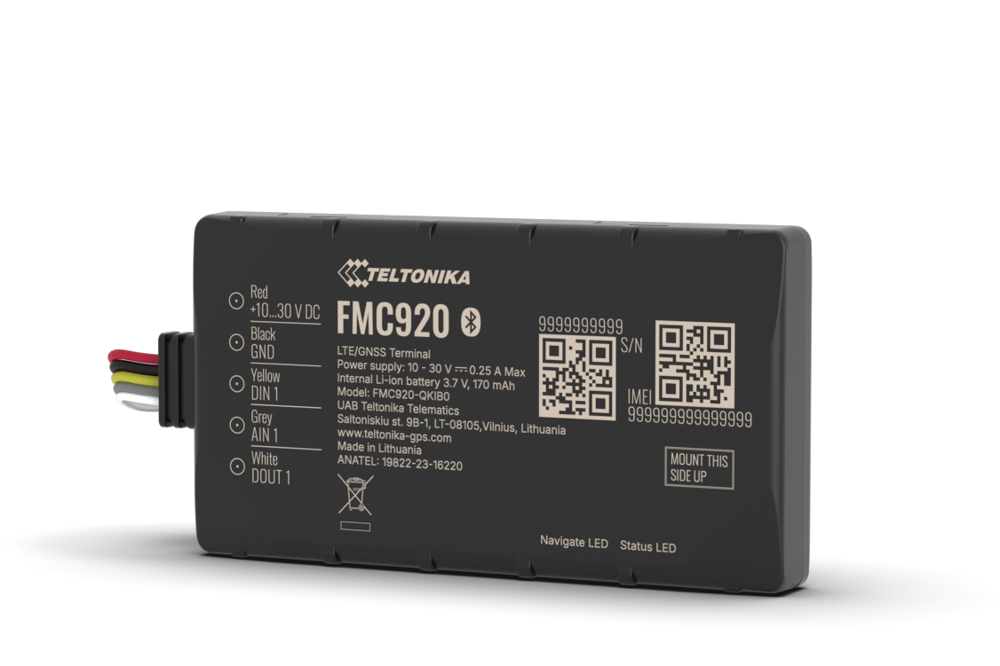</td>
      <td><strong>Teltonika FMC920</strong> [10] Nhóm thiết bị nhỏ gọn</td>
      <td>Phù hợp cho giám sát hành trình cơ bản, nhưng không theo dõi được thông số vận hành của xe</td>
    </tr>
    <tr>
      <td></td>
      <td><strong>Teltonika FMM003</strong> [11] Nhóm theo dõi được thông số vận hành</td>
      <td>Cắm trực tiếp cổng OBD-II, phù hợp khi ưu tiên lắp đặt nhanh và lấy dữ liệu OBD-II cơ bản</td>
    </tr>
    <tr>
      <td></td>
      <td><strong>Queclink GV305CEU</strong> [12] Nhóm thiết bị có nhiều giao tiếp mở rộng</td>
      <td>Hỗ trợ nhiều giao tiếp mở rộng; phù hợp cho theo dõi dữ liệu mở rộng, nhưng thường vượt nhu cầu tối thiểu của đồ án</td>
    </tr>
  </tbody>
</table>

Để làm rõ hạn chế đó, sinh viên tiến hành phân loại và so sánh các hướng triển khai
phổ biến dựa trên bốn tiêu chí kỹ thuật chính: mức độ dữ liệu thu được, khả năng lắp
đặt thực tế, mức độ hoàn chỉnh của hệ thống và chi phí triển khai.

**Bảng 2.3: So sánh các hướng triển khai giám sát xe hiện có**

| Hướng triển khai                                         | Dữ liệu thu được                                                      | Ưu điểm kỹ thuật                                                                                     | Hạn chế chính                                                                                                                          |
| :---------------------------------------------------------- | :------------------------------------------------------------------------- | :-------------------------------------------------------------------------------------------------------- | :---------------------------------------------------------------------------------------------------------------------------------------- |
| Thiết bị định vị cơ bản                              | Vị trí, tốc độ, trạng thái kết nối                                | Lắp nhanh, cấu hình gọn, chi phí đầu tư thấp                                                     | Chỉ phù hợp cho giám sát hành trình cơ bản, thiếu dữ liệu vận hành và khó nhận biết bất thường khi xe đã tắt máy |
| Thiết bị định vị có khai thác dữ liệu chẩn đoán | Vị trí và một phần trạng thái vận hành của xe                    | Có thêm dữ liệu phục vụ giám sát khai thác, thuận lợi hơn cho việc đối chiếu sử dụng xe | Khả năng tập trung quản lý hạn chế, dữ liệu thường chưa đủ sâu và khả năng tùy biến hạn chế                         |
| Nền tảng quản lý đội xe thương mại                 | Vị trí, hành trình, cảnh báo, báo cáo, quản trị tập trung       | Hệ thống hoàn chỉnh ở mức sản phẩm, triển khai nhanh, phù hợp quy mô lớn                     | Chi phí thuê bao và tích hợp cao, khó điều chỉnh theo nhu cầu kỹ thuật riêng của từng bài toán                           |
| Phương án tích hợp theo yêu cầu                      | Vị trí, dữ liệu vận hành, cảnh báo sự kiện, lịch sử khai thác | Linh hoạt theo mục tiêu quản lý, dễ mở rộng theo yêu cầu nghiên cứu và triển khai thực tế | Phải tự giải quyết đồng thời bài toán thiết bị, truyền dữ liệu, xử lý máy chủ và giao diện khai thác                 |

Bảng 2.3 cho thấy khoảng trống kỹ thuật nằm ở nhóm giải pháp cần nhiều hơn một thiết
bị định vị đơn thuần, nhưng chưa cần tới một nền tảng thương mại có chi phí đầu tư và
vận hành cao. Đối với bài toán quản lý xe cho thuê quy mô nhỏ và vừa, hướng tiếp cận
phù hợp hơn là một hệ thống tích hợp vừa đủ: đủ dữ liệu để theo dõi hành trình, nhận
biết bất thường và đối chiếu khai thác, nhưng vẫn giữ được khả năng lắp đặt gọn và mở
rộng theo điều kiện triển khai thực tế.

Từ đó, cơ sở kỹ thuật của hệ thống được xác định theo ba điểm chính:

- dữ liệu vị trí, dữ liệu vận hành và dữ liệu sự kiện phải được xem là ba nguồn bổ sung cho nhau, không thể thay thế hoàn toàn cho nhau;
- tuyến truyền dữ liệu phải phù hợp với đặc tính bản tin nhỏ, xuất hiện liên tục và có các mức ưu tiên khác nhau giữa dữ liệu nền và dữ liệu cảnh báo;
- lớp xử lý và khai thác dữ liệu phải đủ rõ ràng để vừa phục vụ giám sát thời gian thực, vừa hỗ trợ tra cứu lịch sử và đối chiếu khai thác sau mỗi chuyến đi.

Các nhận định này là cơ sở để chuyển sang phần xác lập tiêu chí thiết kế ở Mục 2.3.

## 2.3. Yêu cầu kỹ thuật và tiêu chuẩn thiết kế

Các yêu cầu kỹ thuật và ràng buộc thiết kế của hệ thống được trình bày tại Bảng 2.4 và
Bảng 2.5 như sau.

**Bảng 2.4: Chỉ tiêu thiết kế chính**

| Yếu tố thiết kế            | Yêu cầu / giá trị                                                                              | Ghi chú                                                                                                     |
| :----------------------------- | :------------------------------------------------------------------------------------------------- | :----------------------------------------------------------------------------------------------------------- |
| Nguồn cấp                    | 12-24 VDC                                                                                          | Phù hợp với hệ điện của phương tiện và là điều kiện nền cho việc lắp đặt trên xe thật  |
| MCU điều khiển chính       | Vi điều khiển họ ESP                                                                           | Đáp ứng yêu cầu tích hợp truyền thông, đọc dữ liệu và điều khiển trạng thái năng lượng |
| Giao tiếp với phương tiện | Chuẩn OBD-II                                                                                      | Cho phép thu dữ liệu cơ bản phục vụ quản lý mà không đi theo hướng can thiệp điều khiển xe |
| Tham số quản lý chính      | Tọa độ GPS, tốc độ hoạt động                                                              | Là các thông số tối thiểu để theo dõi hành trình và trạng thái sử dụng xe                    |
| Tính năng chính             | Tính toán quãng đường, thời gian sử dụng, ước tính chi phí; Có cảnh báo hệ thống | Theo nhu cầu quản lý và khai thác                                                                       |

**Bảng 2.5: Ràng buộc thiết kế**

| Loại ràng buộc         | Thông tin                                              | Tác động đến thiết kế                                                                                       |
| :------------------------ | :------------------------------------------------------ | :----------------------------------------------------------------------------------------------------------------- |
| Tài chính               | Tổng chi phí giải pháp không vượt 20.000.000 VND | Ưu tiên linh kiện phổ biến, bảo đảm tính khả thi khi triển khai                                        |
| Điều kiện kiểm chứng | Phòng thí nghiệm và xe thử nghiệm                 | Giải pháp phải đo kiểm được trên nguyên mẫu và đối chiếu được với điều kiện vận hành thực |
| Khả năng gia công      | Mạch PCB, vỏ in 3D                                    | Kết cấu phần cứng phải gọn, dễ chế tạo và phù hợp cho nguyên mẫu của đồ án                       |
| Tiêu chuẩn áp dụng    | IPC-2221, IEC 60664-1                                   | Làm cơ sở cho bố trí mạch, khoảng cách cách điện và đánh giá an toàn điện ở mức nguyên mẫu   |

## 2.4. Yêu cầu từ các bên liên quan

Bên cạnh tiêu chí kỹ thuật, bài toán còn chịu chi phối bởi cách các nhóm sử dụng và
vận hành hệ thống trên thực tế. Bảng 2.6 tổng hợp các yêu cầu chính và ảnh hưởng của
chúng đến thiết kế.

**Bảng 2.6: Yêu cầu từ các bên liên quan và tác động đến thiết kế**

| Bên liên quan                     | Nhu cầu chính                                                                                       | Ảnh hưởng tới thiết kế                                                                        |
| :---------------------------------- | :---------------------------------------------------------------------------------------------------- | :-------------------------------------------------------------------------------------------------- |
| Đơn vị quản lý đội xe        | Theo dõi vị trí, hành trình, cảnh báo và dữ liệu vận hành xe trên cùng một hệ thống | Giao diện phải ưu tiên bản đồ quản lý, trạng thái, cảnh báo và lịch sử chuyến đi |
| Người phụ trách kỹ thuật      | Biết thiết bị nào online/offline, lỗi nguồn, lỗi mạng hoặc thiếu dữ liệu                  | Phải có lớp giám sát kỹ thuật tách khỏi lớp vận hành thường ngày                     |
| Đội lắp đặt/bảo trì          | Lắp nhanh, ít xâm lấn, dễ thay xe và dễ khoanh vùng lỗi                                      | Kết cấu phải gọn, kết nối rõ ràng, thao tác tháo lắp lặp lại được                   |
| Người lái hoặc người thuê xe | Thiết bị không ảnh hưởng tới vận hành xe và không thu thập vượt nhu cầu quản lý      | Chức năng giám sát phải tách khỏi mọi hành vi điều khiển phương tiện                 |

Điểm chung của các nhóm trên là đều cần thông tin rõ ràng, đủ để theo dõi và ra quyết
định, nhưng không làm tăng gánh nặng thao tác trong quá trình sử dụng. Vì vậy, các xử
lý kỹ thuật phức tạp nên được thực hiện ở lớp thiết bị và máy chủ; còn giao diện vận
hành chỉ nên tập trung vào các thông tin chính như vị trí, trạng thái và cảnh báo.

# CHƯƠNG 3. CÁC GIẢI PHÁP THIẾT KẾ - DESIGN SOLUTIONS

Chương này chuyển các vấn đề kỹ thuật đã nêu ở Chương 2 thành các phương án thiết kế
cụ thể cho thiết bị, firmware, tuyến truyền dữ liệu và bề mặt khai thác. Trình tự
trình bày đi từ phân tích nguyên lý và ràng buộc, sang đề xuất các khả năng triển khai,
tiếp theo là đánh giá để chọn phương án khả thi, và cuối cùng là chốt cấu hình tối ưu
cho toàn hệ thống.

## 3.1. Phân tích tổng hợp

### 3.1.1. Nguyên lý làm việc

Về nguyên lý, hệ thống được tổ chức theo một tuyến dữ liệu liên tục từ xe đến người
quản lý. Ở đầu xe, thiết bị thu vị trí từ mô-đun LTE/GNSS, đọc dữ liệu vận hành qua
OBD-II (chuẩn cổng chẩn đoán dùng chung trên ô tô), ghi nhận chuyển động bằng IMU và
đóng gói bản tin để truyền về máy chủ. Ở phía cloud, bản tin được tiếp nhận, chuẩn hóa,
lưu trữ và phát lại cho giao diện. Ở lớp khai thác, người quản lý cần nhìn được bản đồ,
trạng thái xe, dữ liệu chi tiết và cảnh báo trên cùng một bề mặt làm việc.

_Hình 3.1: Nguyên lý chuyển hóa dữ liệu từ phương tiện thành thông tin quản lý_

### 3.1.2. Các ràng buộc kỹ thuật chi phối phương án

Ràng buộc thứ nhất nằm ở lớp thiết bị. Bộ theo dõi phải gọn, ít dây, dễ chuyển giữa
nhiều xe và không làm tăng mức can thiệp lên hệ điện hay ECU. Điều này khiến việc chọn
MCU, mô-đun LTE/GNSS và cách lấy OBD-II không thể tách rời nhau.

Ràng buộc thứ hai là năng lượng. Thiết bị bám vào ắc quy xe nên không được để dòng nền
tích lũy thành mức hao điện đáng kể khi xe đỗ dài ngày. Tuy nhiên, hệ thống vẫn phải
giữ được khả năng thức dậy để phát hiện rung, dịch chuyển hoặc thay đổi trạng thái xe.
Vì vậy, phần nguồn, cảm biến và logic sleep/wake phải được xét như một cụm chung.

Ràng buộc thứ ba là môi trường truyền dữ liệu. Xe hoạt động trong điều kiện sóng thay
đổi liên tục; do đó phương án truyền không thể giả định kết nối luôn ổn định. Kiến trúc
được chọn phải chấp nhận mất sóng cục bộ, có hàng đệm phù hợp và phục hồi được tuyến
dữ liệu sau reconnect.

Ràng buộc thứ tư là cách khai thác thông tin. Dữ liệu thu được có nhiều lớp, nhưng bề
mặt vận hành không thể trở thành một nơi dồn mọi thứ. Phương án tốt chỉ được xem là đạt
khi phần phức tạp được giữ ở lớp thiết bị và lớp máy chủ, còn giao diện chỉ giữ những
tín hiệu thực sự cần cho quyết định quản lý.

## 3.2. Đề xuất các giải pháp

### 3.2.1. Đề xuất giải pháp phần cứng thiết bị

Ở lớp phần cứng, có bốn nhóm quyết định chính. Thứ nhất là khối điều khiển trung tâm,
với các hướng thường gặp gồm MCU tích hợp BLE sẵn, MCU low-power phải ghép BLE rời, hoặc
MCU mạnh về radio nhưng hạn chế hơn ở số cổng giao tiếp đồng thời. Thứ hai là khối
truyền dữ liệu và định vị, có thể đi theo hướng dùng một mô-đun tích hợp LTE/GNSS hoặc
tách riêng mô-đun LTE và mô-đun GPS. Thứ ba là cách lấy dữ liệu OBD-II, có thể đấu trực
tiếp, dùng bộ chuyển đổi có dây hoặc dùng bộ chuyển đổi Bluetooth. Thứ tư là cơ chế phát
hiện chuyển động và sơ đồ nguồn đi kèm, bao gồm lựa chọn cảm biến wake-up, pin dự phòng
và nhánh bảo vệ điện áp thấp.

Nếu ưu tiên mức độ tích hợp cao và giảm dây trong cabin, hướng dùng MCU có BLE tích hợp
kết hợp mô-đun LTE/GNSS tích hợp là một khả năng hợp lý. Nếu ưu tiên cực đại hóa low
power ở lõi xử lý, hướng MCU tiết kiệm điện ghép BLE rời là một phương án khác, nhưng
đổi lại phần cứng dài hơn và phức tạp hơn ở khâu tích hợp. Tương tự, nếu ưu tiên dữ liệu
OBD sâu, giải pháp có dây hoặc đấu trực tiếp có lợi thế hơn; nhưng nếu ưu tiên lắp đặt
nhanh và ít xâm lấn, giải pháp Bluetooth lại phù hợp hơn.

### 3.2.2. Đề xuất giải pháp firmware và quản lý năng lượng

Ở lớp firmware, có ba hướng tổ chức chính. Hướng thứ nhất là giữ toàn bộ thiết bị ở chế
độ làm việc liên tục. Cách này đơn giản, nhưng khó chấp nhận khi thiết bị dùng chung nguồn
với xe. Hướng thứ hai là chia thành hai trạng thái lớn chạy/ngủ theo ignition. Cách này
đỡ tốn điện hơn, nhưng khó xử lý các tình huống biên như xe vừa tắt máy, xe bật máy nhưng
đang đứng yên, hoặc cần thức định kỳ để kiểm tra lại trạng thái khi xe đỗ. Hướng thứ ba
là tổ chức thành máy trạng thái nhiều pha, trong đó trạng thái vận hành của xe và trạng
thái nguồn của thiết bị được tách riêng rồi đồng bộ lại qua cùng một logic điều khiển.

Trong bài toán này, cần phân biệt rõ "đỗ" với "ngủ". Đỗ là trạng thái của xe khi ignition
đã tắt và hệ thống đang ở pha chờ để xác nhận điều kiện trước khi hạ công suất; ngủ mới là
trạng thái công suất thấp của thiết bị. Ngoài ra, xe bật máy nhưng đứng yên cũng không nên
bị gộp chung với xe đỗ, vì hai trạng thái này dẫn đến hai cách lấy dữ liệu và hai hành vi
nguồn khác nhau. Vì vậy, ngay ở bước đề xuất giải pháp firmware, hướng máy trạng thái nhiều
pha đã cho thấy ưu thế rõ về mặt mô tả đúng bản chất vận hành.

### 3.2.3. Đề xuất giải pháp truyền dữ liệu, xử lý và khai thác

Ở lớp truyền thông và xử lý, có thể xét ba hướng chính. Hướng thứ nhất là để thiết bị gửi
trực tiếp vào API ứng dụng theo kiểu yêu cầu - đáp ứng. Hướng thứ hai là dùng MQTT nhưng
gom toàn bộ phần nhận bản tin, lưu trữ và nghiệp vụ vào một dịch vụ phía máy chủ. Hướng
thứ ba là tách thành broker MQTT, dịch vụ trung gian để kiểm tra và phân luồng bản tin,
các kho lưu trữ theo từng loại dữ liệu, rồi mới đến lớp API và giao diện.

Tương tự, khi xét xử lý mất sóng, có thể đi theo ba mức: bỏ bản tin nếu gửi lỗi, giữ đệm
ngắn trong RAM, hoặc ghi xuống bộ nhớ cục bộ rồi phát lại sau khi kết nối phục hồi. Ở lớp
khai thác, có thể đi theo hướng giao diện thiên về báo cáo hậu kiểm hoặc giao diện thiên về
điều hành gần thời gian thực. Với bài toán quản lý phương tiện, hai phần này phải được xét
cùng nhau, vì cách tổ chức dữ liệu ở phía máy chủ sẽ quyết định trực tiếp bề mặt thao tác ở
phía người dùng.

## 3.3. Phân tích, đánh giá và lựa chọn phương án khả thi

Từ các hướng đề xuất ở trên, các phương án được đối chiếu theo cùng một nhóm tiêu chí:
mức đáp ứng chức năng, mức can thiệp lên xe, khả năng duy trì năng lượng khi xe đỗ, độ
đơn giản khi tích hợp và dư địa mở rộng về sau.

**Lựa chọn vi điều khiển trung tâm**

**Bảng 3.1: Ma trận đánh giá phương án vi điều khiển**

| Tiêu chí                           | Trọng số | ESP32-S3     | STM32L4 + Bluetooth rời | nRF52840 |
| :----------------------------------- | :--------- | :----------- | :----------------------- | :------- |
| Đủ cổng giao tiếp cho hệ thống | 3          | 5            | 4                        | 3        |
| Có sẵn Bluetooth để đọc OBD-II | 3          | 5            | 2                        | 5        |
| Hỗ trợ ngủ sâu                   | 2          | 4            | 4                        | 4        |
| Dễ tích hợp trên một bo mạch   | 3          | 5            | 3                        | 3        |
| Điểm tổng                         |            | **46** | 32                       | 37       |

ESP32-S3 đạt điểm cao nhất vì giải được đúng cụm yêu cầu của đồ án: có BLE tích hợp,
đủ UART để đồng thời giữ modem, debug và phần mở rộng, đồng thời vẫn thuận lợi cho việc
gom toàn bộ hệ thống lên một PCB. STM32L4 có lợi thế về low-power ở lõi MCU, nhưng phải
trả giá bằng phần BLE rời. nRF52840 mạnh ở radio, song dư địa giao tiếp đồng thời cho cấu
hình hiện tại hẹp hơn.

**Lựa chọn mô-đun truyền dữ liệu và định vị**

**Bảng 3.2: Ma trận đánh giá phương án LTE/GNSS**

| Tiêu chí                              | Trọng số | A7670C + GPS rời | EC200U + GPS rời | SIM7600CE-T  |
| :-------------------------------------- | :--------- | :---------------- | :---------------- | :----------- |
| Số lượng mô-đun cần lắp          | 3          | 2                 | 2                 | 5            |
| Độ gọn của phần cứng              | 3          | 3                 | 3                 | 5            |
| Mức độ đơn giản khi điều khiển | 2          | 3                 | 3                 | 5            |
| Phù hợp lắp trên xe thử nghiệm    | 3          | 3                 | 3                 | 5            |
| Điểm tổng                            |            | 28                | 28                | **50** |

Ở bài toán này, lợi thế quyết định không nằm ở thông số lẻ của từng chip, mà ở việc giảm
số lượng mô-đun, dây nối và điểm hỏng tiềm ẩn trong cabin. Vì vậy, SIM7600CE-T được chọn
thay cho các phương án LTE + GPS rời. Cách chọn này làm phần cứng gọn hơn và cũng làm
đường firmware đơn giản hơn, vì toàn bộ kênh dữ liệu di động và vị trí đi qua cùng một
khối modem.

**Lựa chọn cách lấy dữ liệu OBD-II**

**Bảng 3.3: Ma trận đánh giá phương án thu dữ liệu OBD-II**

| Tiêu chí                   | Trọng số | Đấu trực tiếp | Bộ chuyển đổi có dây | Bộ chuyển đổi Bluetooth |
| :--------------------------- | :--------- | :---------------- | :------------------------- | :-------------------------- |
| Ít can thiệp vào xe       | 3          | 1                 | 3                          | 5                           |
| Dễ lắp và tháo           | 3          | 1                 | 3                          | 5                           |
| Dễ thay thế khi đổi xe   | 2          | 1                 | 3                          | 5                           |
| Đủ dữ liệu cho quản lý | 3          | 5                 | 4                          | 4                           |
| Điểm tổng                 |            | 23                | 36                         | **52**                |

Phương án bộ chuyển đổi Bluetooth cho điểm cao nhất vì giữ được đúng mức cân bằng mà đồ
án cần: đủ dữ liệu vận hành cơ bản cho quản lý, nhưng vẫn ít xâm lấn, dễ lắp và dễ đổi
xe. Trên cơ sở đó, bộ chuyển đổi `vgate iCar Pro` được chọn làm giải pháp khai thác OBD-II
cho nguyên mẫu.

_Hình 3.2: Thiết bị nhận dữ liệu xe qua bộ đọc OBD-II không dây_

**Lựa chọn cảm biến chuyển động và hướng thiết kế nguồn**

**Bảng 3.4: Ma trận đánh giá phương án cảm biến chuyển động**

| Tiêu chí                           | Trọng số | Công tắc rung | IMU 6 trục | LIS3DSH      |
| :----------------------------------- | :--------- | :-------------- | :---------- | :----------- |
| Tiêu thụ điện thấp              | 3          | 4               | 2           | 5            |
| Độ ổn định khi phát hiện rung | 3          | 2               | 4           | 4            |
| Dễ dùng với MCU                   | 2          | 3               | 3           | 5            |
| Phù hợp mục tiêu của đồ án   | 3          | 2               | 3           | 5            |
| Điểm tổng                         |            | 28              | 31          | **50** |

LIS3DSH được chọn vì đáp ứng đúng vai trò cần có trong hệ thống: tiêu thụ thấp, có chân
ngắt, đủ độ ổn định để làm nguồn wake-up khi xe đỗ. Cùng với lựa chọn này, sơ đồ nguồn đi
theo hướng tách rõ nhánh 3,3 V cho logic, nhánh khoảng 4 V cho modem, nhánh sạc/pin dự
phòng và nhánh bảo vệ điện áp thấp để không kéo tụt ắc quy xe.

_Hình 3.3: Các nhánh nguồn chính của thiết bị theo dõi_

**Lựa chọn cách tổ chức firmware và quản lý năng lượng**

**Bảng 3.5: Ma trận đánh giá phương án firmware và sleep/wake**

| Tiêu chí                                  | Trọng số | Vòng lặp luôn bật | Hai trạng thái chạy/ngủ | Máy trạng thái nhiều pha |
| :------------------------------------------ | :--------- | :-------------------- | :-------------------------- | :--------------------------- |
| Bám đúng trạng thái vận hành của xe | 3          | 2                     | 3                           | 5                            |
| Giảm tiêu thụ điện khi xe đỗ         | 3          | 1                     | 4                           | 5                            |
| Giữ được giám sát khi xe tắt máy    | 3          | 2                     | 3                           | 5                            |
| Kiểm soát reconnect, OTA và replay       | 2          | 2                     | 3                           | 5                            |
| Điểm tổng                                |            | 19                    | 36                          | **55**                 |

Kết quả trên dẫn đến lựa chọn firmware theo máy trạng thái nhiều pha. Ở tầng runtime,
thiết bị đi qua các pha `CHECK_IGN`, `DRIVING`, `PARKED`, `HEARTBEAT`, `ALARM` và `SLEEP`.
Cách tổ chức này cho phép tách rõ việc xe đang bật máy nhưng đứng yên với việc xe đã tắt
máy và chuẩn bị đi vào chế độ ngủ. Đồng thời, nó cũng tạo chỗ đứng tự nhiên cho các nhánh
timer wake, IMU wake, OTA, reconnect và phát lại dữ liệu đã lưu.

_Hình 3.4: Firmware chuyển trạng thái theo ignition, chuyển động và điều kiện sleep/wake_

**Lựa chọn kiến trúc truyền dữ liệu và xử lý phía máy chủ**

**Bảng 3.6: Ma trận đánh giá phương án truyền dữ liệu và xử lý**

| Tiêu chí                                              | Trọng số | HTTP trực tiếp vào API | MQTT vào backend đơn khối | Broker + Bridge + lưu trữ tách lớp |
| :------------------------------------------------------ | :--------- | :------------------------ | :---------------------------- | :------------------------------------- |
| Phù hợp bản tin nhỏ gửi lặp lại                  | 3          | 2                         | 4                             | 5                                      |
| Chịu được mạng di động chập chờn               | 3          | 2                         | 3                             | 5                                      |
| Tách được lớp lưu trữ và nghiệp vụ            | 2          | 2                         | 3                             | 5                                      |
| Hỗ trợ gần thời gian thực và mở rộng giám sát | 3          | 2                         | 4                             | 5                                      |
| Điểm tổng                                            |            | 22                        | 39                            | **55**                           |

Phương án có broker và bridge trung gian được chọn vì phù hợp hơn với tính chất dữ liệu
của hệ thống. EMQX làm điểm tiếp nhận MQTT; MQTT Bridge chịu trách nhiệm kiểm tra payload,
phân luồng và phát sự kiện nội bộ; lớp dịch vụ phía sau tiếp tục ghi xuống PostgreSQL/
PostGIS, VictoriaMetrics và VictoriaLogs tùy loại dữ liệu. Song song với kiến trúc đó,
thiết bị giữ một hàng đệm cục bộ trên microSD để không làm đứt tuyến dữ liệu khi mạng
di động mất ổn định trong thời gian ngắn.

_Hình 3.5: Dữ liệu từ xe được tiếp nhận, phân luồng và lưu trữ tại máy chủ_

_Hình 3.6: Tuyến dữ liệu từ thiết bị đến màn hình theo dõi và cảnh báo_

## 3.4. Tối ưu phương án thiết kế

Sau bước đánh giá, phương án tối ưu của đồ án được chốt theo nguyên tắc: giảm mức can
thiệp lên xe, giữ thiết bị gọn, tiết kiệm năng lượng khi xe đỗ, nhưng vẫn bảo đảm được
tuyến dữ liệu đủ ổn định cho quản lý vận hành.

**Bảng 3.7: Phương án thiết kế tối ưu của hệ thống**

| Lớp hệ thống                  | Phương án chốt                                                                  | Vai trò chính                                                        |
| :------------------------------- | :---------------------------------------------------------------------------------- | :--------------------------------------------------------------------- |
| Điều khiển trung tâm         | ESP32-S3                                                                            | Điều phối modem, BLE OBD-II, IMU, nguồn và publish dữ liệu      |
| Truyền dữ liệu và định vị | SIM7600CE-T                                                                         | Cung cấp LTE uplink và GNSS trên cùng một mô-đun                |
| Thu dữ liệu vận hành         | `vgate iCar Pro` qua Bluetooth                                                    | Đọc nhóm dữ liệu OBD-II cơ bản với mức can thiệp thấp       |
| Giám sát khi xe đỗ           | LIS3DSH + timer wake                                                                | Phát hiện chuyển động và duy trì heartbeat định kỳ           |
| Nguồn và dự phòng            | Nhánh logic 3,3 V, nhánh modem khoảng 4 V, sạc 1S và bảo vệ điện áp thấp | Giữ ổn định nguồn và bảo vệ ắc quy xe                         |
| Firmware thiết bị              | Máy trạng thái nhiều pha + RTC context + replay cục bộ                        | Quản lý sleep/wake, reconnect, OTA và khôi phục dữ liệu         |
| Tiếp nhận bản tin             | EMQX + MQTT Bridge                                                                  | Nhận, kiểm tra và phân luồng dữ liệu từ thiết bị             |
| Lưu trữ và giám sát         | PostgreSQL/PostGIS + VictoriaMetrics + VictoriaLogs + Grafana                       | Lưu dữ liệu nghiệp vụ, time-series, logs và quan sát vận hành |
| Lớp dịch vụ                   | Backend API + Socket.IO/WebSocket                                                   | Xử lý nghiệp vụ và đẩy cập nhật gần thời gian thực         |
| Giao diện khai thác            | Dashboard web tập trung bản đồ - trạng thái - cảnh báo                      | Bề mặt thao tác chính cho người quản lý                        |

Ở cấu hình này, lớp OBD-II được giữ theo hướng không dây để giảm xâm lấn khi lắp đặt.
Lớp nguồn được chia nhánh để tách phần logic, modem và pin dự phòng. Ở tầng firmware,
thiết bị không quyết định ngủ chỉ bằng một tín hiệu ignition, mà đi qua chuỗi kiểm tra
trạng thái để tránh lẫn xe đỗ với xe nổ máy nhưng đang đứng yên. Ở tầng cloud, phần tiếp
nhận, lưu trữ và khai thác được tách lớp để tránh dồn toàn bộ tải lên một điểm xử lý.


_Hình 3.7: Giao diện khai thác tập trung vào bản đồ, trạng thái và cảnh báo_

## Kết luận chương 3

Qua bước phân tích và đánh giá, đồ án không chọn lời giải tối ưu cục bộ cho từng linh
kiện, mà chọn một cấu hình giữ được sự nhất quán cho toàn tuyến từ xe đến giao diện.
Kết quả là một phương án tích hợp vừa đủ: ít xâm lấn ở phía xe, tiết kiệm điện ở trạng
thái đỗ, chịu được biến động của mạng di động và vẫn giữ được dữ liệu cần cho khai thác.

Đó là cơ sở để Chương 4 chuyển sang phần triển khai: hiện thực phần cứng, tổ chức
firmware, dựng hạ tầng cloud và kiểm chứng toàn tuyến bằng các số đo thực nghiệm.

# CHƯƠNG 4. TRIỂN KHAI GIẢI PHÁP VÀ KẾT QUẢ - IMPLEMENTATION AND RESULTS

## 4.1. Phần cứng thiết bị

Phần cứng của hệ thống được triển khai thành một bộ thiết bị hoàn chỉnh gồm bo mạch
trung tâm, mô-đun LTE/GNSS, nguồn dự phòng, vỏ in 3D và bộ đọc OBD-II không dây.
Toàn bộ cụm thiết bị được tổ chức theo hướng lắp được trên xe thật, đồng thời vẫn cho
phép tháo lắp lại khi cần đổi xe hoặc bảo trì.

Về bố trí phần cứng, vùng nguồn, vùng xử lý-truyền thông và vùng kết nối được tách rõ
để giảm ảnh hưởng chéo và thuận tiện cho kiểm tra sau lắp ráp. Cách tổ chức này trực
tiếp phục vụ mục tiêu vận hành ổn định dài giờ trên nguồn xe.


_Hình 4.1: Sơ đồ đấu nối tổng thể giữa ESP32-S3 và các phần cứng tích hợp_

Nhánh nguồn 12-24 VDC được phân tách cho logic 3,3 V, modem LTE/GNSS, mạch sạc
và nguồn dự phòng. Nhờ đó, thiết bị vẫn giữ được vùng làm việc ổn định trong các
trạng thái như xe nổ máy, modem phát công suất cao hoặc nguồn chính bị gián đoạn.

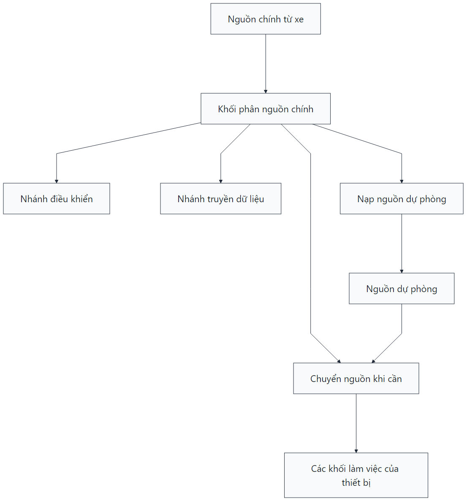

_Hình 4.2: Nguồn xe 12-24 VDC được phân nhánh cho logic, modem và nguồn dự phòng_

Về cách bố trí trên xe, bộ đọc OBD-II được đặt trực tiếp tại cổng chẩn đoán dưới táp
lô, còn thiết bị theo dõi được đặt tách rời trong cabin và kết nối với bộ đọc qua
Bluetooth. Phương án này giúp hạn chế việc kéo thêm dây trong khoang lái, đồng thời
giữ tính linh hoạt khi lắp trên nhiều mẫu xe khác nhau.

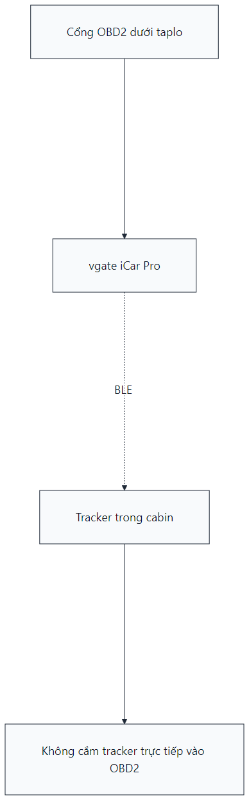

_Hình 4.2a: Bộ đọc OBD-II đặt ở cổng xe, còn thiết bị theo dõi đặt tách rời trong cabin_

**Bảng 4.1: Các phần cứng đã hoàn thành**

| Thành phần                     | Kết quả                                                         |
| :------------------------------- | :---------------------------------------------------------------- |
| PCB thiết bị                   | Thiết kế, gia công và lắp ráp hoàn chỉnh                  |
| Nguồn 12-24 VDC                 | Hoạt động ổn định trên dải điện áp mục tiêu          |
| MCU trung tâm                   | ESP32-S3 vận hành ổn định                                    |
| Truyền dữ liệu và định vị | SIM7600CE-T gửi dữ liệu và định vị tốt                    |
| OBD-II                           | Kết nối Bluetooth với vgate iCar Pro, đọc dữ liệu cơ bản |
| Cảm biến chuyển động        | LIS3DSH đánh thức thiết bị và tạo cảnh báo               |
| Nguồn dự phòng                | Giữ thiết bị hoạt động khi mất nguồn chính               |
| Cơ khí                         | PCB và vỏ in 3D, lắp được trên xe thử nghiệm             |

Bảng 4.1 tổng hợp các phần cứng chính đã được triển khai trong nguyên mẫu. Kết quả
ở giai đoạn này cho thấy phần cứng đã hoàn thành các bước chính của đồ án gồm thiết
kế PCB, lắp ráp, đóng vỏ và lắp thử trên xe. Hình 4.3a trình bày trình tự lắp nguyên
mẫu theo từng bước để bảo đảm việc triển khai có thể lặp lại.

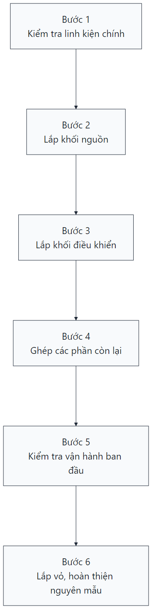

_Hình 4.3a: Trình tự lắp nguyên mẫu từ kiểm tra linh kiện đến đóng vỏ_

## 4.2. Hoạt động của thiết bị và máy chủ

Trong vận hành thực, thiết bị làm việc theo một chuỗi trạng thái tương đối cố định:
khởi động, kiểm tra nguồn, lấy vị trí, ghép OBD-II, gửi dữ liệu; sau đó chuyển sang
trạng thái tiêu thụ thấp khi xe dừng và tự đánh thức khi có rung hoặc đến chu kỳ gửi
tin. Chuỗi này cho phép thiết bị bám sát trạng thái xe nhưng vẫn giữ tiêu thụ điện
trong vùng an toàn cho ắc quy.

Ở lớp thiết bị, khi xe bắt đầu hoạt động, bộ theo dõi chuyển sang trạng thái làm việc,
bật modem, đồng bộ GPS và ghép OBD-II. Trong pha xe chạy, dữ liệu vị trí, tốc độ và
trạng thái được gửi đều về máy chủ; khi xe dừng, thiết bị hạ tiêu thụ nhưng vẫn duy
trì cơ chế giám sát rung hoặc dịch chuyển để không bỏ lỡ sự kiện vận hành.

**Bảng 4.2: Các chức năng chính trên thiết bị đã chạy ổn định**

| Nhóm chức năng        | Kết quả                                                                             |
| :----------------------- | :------------------------------------------------------------------------------------ |
| Quản lý trạng thái   | Thiết bị chuyển đúng giữa chạy, đỗ, cảnh báo và ngủ                      |
| Đọc vị trí GPS       | Thu được vị trí, số vệ tinh, tốc độ                                         |
| Đọc OBD-II             | Thu được RPM, tốc độ xe, nhiệt độ nước, mức nhiên liệu, tải động cơ |
| Quản lý nguồn         | Theo dõi điện áp, bảo vệ ắc quy, dùng pin dự phòng                          |
| Gửi dữ liệu           | Gửi đều dữ liệu vị trí, trạng thái và sự kiện lên máy chủ              |
| Cảnh báo               | Phát hiện vượt tốc độ, rung khi xe đỗ, ra khỏi vùng cho phép              |
| Lưu tạm khi mất mạng | Giữ dữ liệu và gửi bù khi có lại kết nối                                    |


_Hình 4.4: Luồng dữ liệu từ thiết bị lên máy chủ và ra giao diện khai thác_

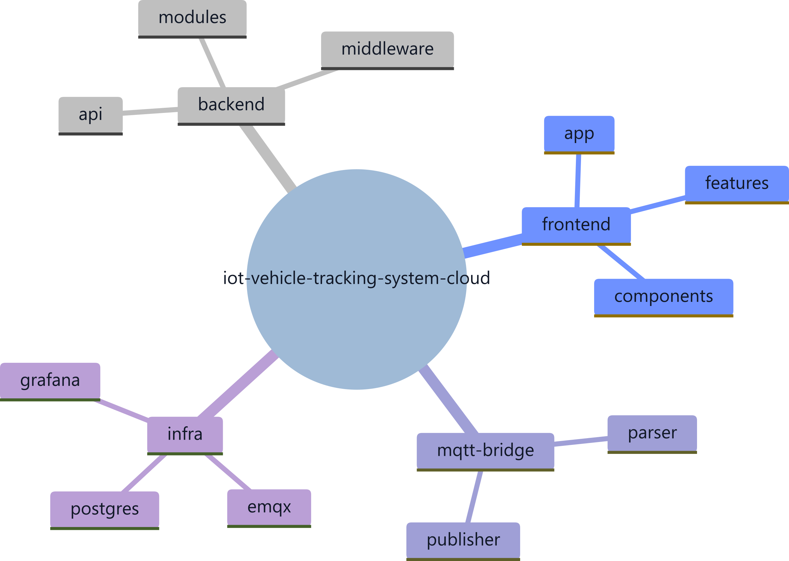

_Hình 4.4a: Các dịch vụ nhận dữ liệu, lưu trữ và khai thác của máy chủ_

Ở tầng máy chủ, luồng dữ liệu được tổ chức thành ba lớp: tiếp nhận bản tin, xử lý-lưu
trữ và cung cấp kết quả ra giao diện khai thác. Việc tách vai trò theo lớp giúp phần
trên xe giữ mức đơn giản cần thiết, trong khi các logic tổng hợp, cảnh báo và quản lý
dữ liệu được tập trung về phía máy chủ để dễ kiểm soát khi tăng số lượng thiết bị
đồng thời.

**Bảng 4.3: Các phần chính trên máy chủ**

| Thành phần          | Kết quả triển khai                                                   |
| :-------------------- | :---------------------------------------------------------------------- |
| Kênh nhận dữ liệu | Nhận ổn định dữ liệu gửi từ thiết bị                          |
| Xử lý trung gian    | Chuẩn hóa dữ liệu, tách vị trí, trạng thái và cảnh báo      |
| Lưu trữ             | Lưu hành trình, dữ liệu vận hành, thiết bị và cảnh báo      |
| Ứng dụng            | Cung cấp giao diện web và ứng dụng di động cho người quản lý |

## 4.3. Giao diện khai thác

Giao diện khai thác là lớp cuối cùng của toàn bộ chuỗi xử lý nên được ưu tiên theo
hướng dễ quan sát và dễ thao tác. Bố cục giao diện tập trung vào ba tác vụ chính: theo
dõi vị trí, nhận biết cảnh báo và tra cứu dữ liệu chuyến đi. Vì vậy, các thành phần bản
đồ, trạng thái và cảnh báo được đặt ở lớp hiển thị chính, còn các thông tin thiên về
kỹ thuật được đưa vào các màn hình chi tiết.

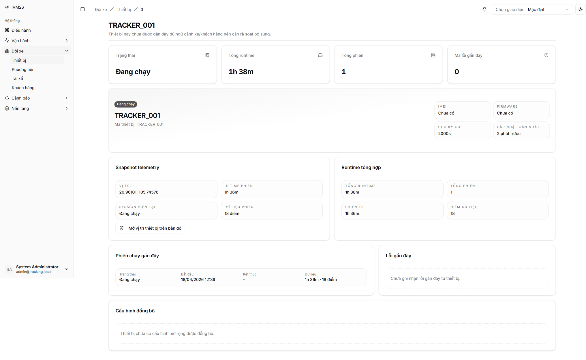

_Hình 4.5: Màn hình chi tiết thiết bị với trạng thái, thời gian chạy và vị trí gần nhất_

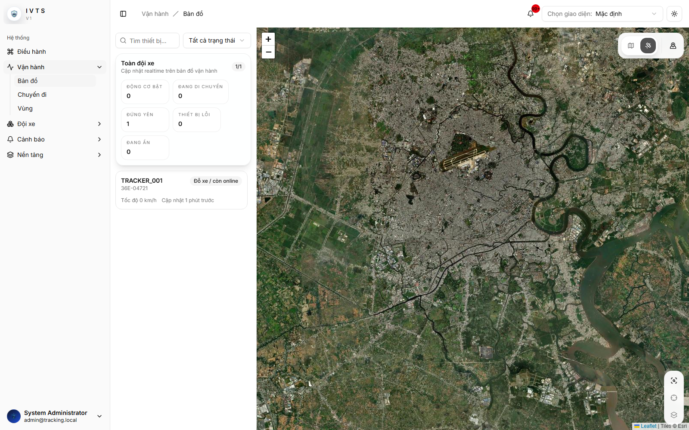

_Hình 4.6: Màn hình bản đồ theo dõi vị trí và trạng thái xe_

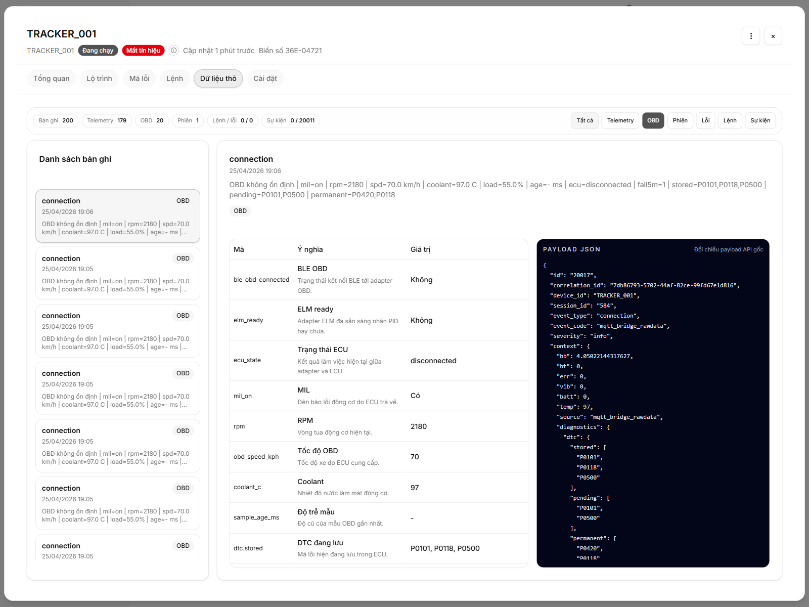

_Hình 4.7: Màn hình kiểm tra dữ liệu OBD-II và bản tin thiết bị gửi về_

Hình 4.5 trình bày màn hình chi tiết thiết bị với trạng thái kết nối, thời gian hoạt
động và vị trí gần nhất. Hình 4.6 là màn hình bản đồ, dùng để theo dõi hành trình và
vùng quản lý theo thời gian thực. Hình 4.7 là lớp dữ liệu kỹ thuật, phục vụ kiểm tra
bản tin thiết bị và các thông số OBD-II cơ bản trong quá trình khai thác.

Bên cạnh giao diện web, hệ thống còn có giao diện theo dõi trên điện thoại để nhận cảnh báo
đẩy và kiểm tra nhanh khi người quản lý không ngồi trước máy tính. Nhờ đó, cùng một
sự kiện có thể được quan sát liên tục trên cả màn hình trung tâm và thiết bị di động.

## 4.4. Kết quả kiểm thử theo mục tiêu

Để đánh giá mức độ đáp ứng của hệ thống so với các mục tiêu đã nêu ở Chương 1, đồ án
tiến hành kiểm thử trên cả bàn thử và xe thử nghiệm. Câu hỏi cần trả lời ở giai đoạn
này không chỉ là hệ thống có vận hành hay không, mà là hệ thống có đạt được các
ngưỡng làm việc cần thiết khi triển khai trên xe thật hay không. Các phép đo được chia
thành hai nhóm chính:

- Trên bàn thử: kiểm tra dòng ngủ, dòng hoạt động, chuyển nguồn, phản hồi OBD-II
  và độ trễ truyền dữ liệu.
- Trên xe: kiểm tra GPS, hành trình, cảnh báo và khả năng khai thác trên giao
  diện.

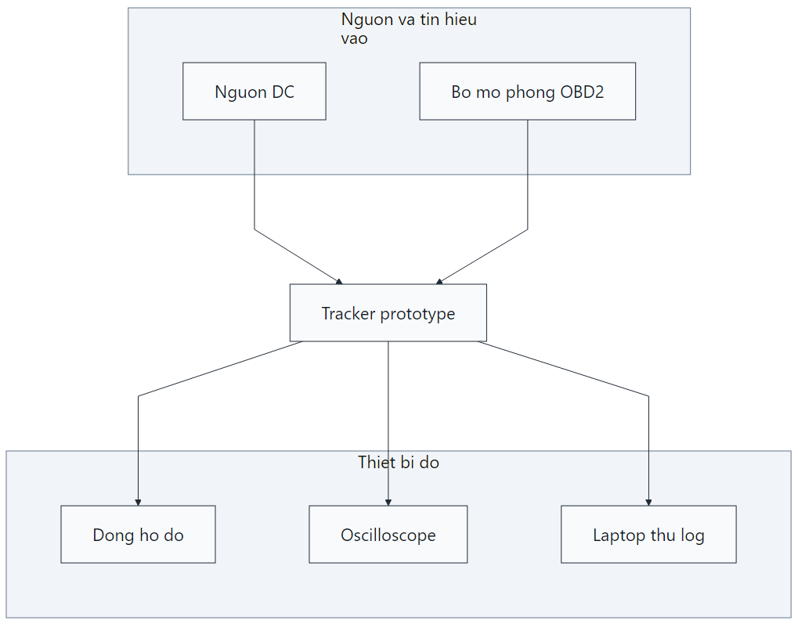

_Hình 4.7a: Bố trí đo kiểm trong phòng thí nghiệm_


_Hình 4.7b: Phương án thử trên xe với thiết bị theo dõi và bộ đọc OBD-II_


_Hình 4.7c: Chuỗi kiểm thử từ thiết bị đến giao diện quan sát_

**Bảng 4.4a: Cơ sở của các phép đo chính**

| Nhóm đo                        | Điều kiện đo                                                                        | Căn cứ đánh giá                                                         |
| :------------------------------- | :-------------------------------------------------------------------------------------- | :--------------------------------------------------------------------------- |
| Nguồn và tiêu thụ điện     | Cấp nguồn DC mô phỏng nguồn xe, theo dõi dòng và chuyển nguồn                 | Đánh giá ảnh hưởng lên ắc quy và khả năng duy trì hoạt động   |
| Đọc dữ liệu OBD-II           | Ghép bộ đọc Bluetooth, đọc lặp các PID cơ bản                                 | Đánh giá tốc độ kết nối và độ ổn định của dữ liệu xe        |
| Định vị GPS                   | Lắp trên xe, chạy ngoài trời và quan sát bản đồ                               | Đánh giá thời gian lên vị trí và độ chính xác ngoài thực địa |
| Truyền dữ liệu và giao diện | So sánh thời điểm thiết bị gửi dữ liệu với thời điểm giao diện cập nhật | Đánh giá mức thời gian thực của toàn hệ thống                      |
| Cảnh báo và xử lý sự kiện | Tạo vùng thử, kịch bản đỗ lâu, rung hoặc mất mạng                            | Đánh giá khả năng phục vụ trực tiếp cho quản lý xe                |

**Bảng 4.4: Kết quả kiểm thử theo mục tiêu vận hành**

| Mục tiêu kiểm tra                                       | Cách quan sát                                                                        | Kết quả                                                                             |
| :--------------------------------------------------------- | :------------------------------------------------------------------------------------- | :------------------------------------------------------------------------------------ |
| Xe vừa hoạt động thì thiết bị có thức dậy không | Quan sát trạng thái thiết bị sau khi cấp nguồn hoạt động                     | Thiết bị thức dậy sau khoảng 2 s                                                 |
| Dữ liệu xe có đọc được không                      | Kết nối OBD-II không dây và đọc dữ liệu cơ bản                              | Kết nối sau khoảng 4 s, phản hồi dữ liệu khoảng 60-75 ms                      |
| Vị trí xe có lên nhanh không                          | Quan sát vị trí xe trên bản đồ                                                  | Sau khoảng 5 s thiết bị lấy lại vị trí, bản đồ cập nhật sau khoảng 1-2 s |
| Dữ liệu có lên máy chủ ổn định không             | So sánh thời điểm thiết bị gửi dữ liệu và thời điểm giao diện cập nhật | Độ trễ truyền dữ liệu khoảng 120-180 ms                                        |
| Khi mất mạng có bị mất hẳn dữ liệu không          | Ngắt mạng rồi cho kết nối lại                                                    | Thiết bị lưu đệm và gửi bù khi có mạng                                      |
| Khi xe ra khỏi vùng cho phép có báo không            | Tạo vùng thử và chạy xe qua ranh giới                                            | Cảnh báo xuất hiện sau khoảng 5-7 s                                              |
| Hệ thống có đủ sức phục vụ nhóm xe nhỏ không    | Tăng số thiết bị mô phỏng đồng thời                                           | Ổn định với từ 50 thiết bị trở lên                                           |

Bảng 4.4 cho thấy hệ thống đáp ứng các mục tiêu vận hành cốt lõi: thiết bị chuyển sang
trạng thái hoạt động nhanh sau khi xe khởi hành, OBD-II phản hồi trong vùng chấp nhận, vị trí cập nhật kịp
theo chuyến đi, dữ liệu hiển thị gần thời gian thực và các cảnh báo xuất hiện đủ sớm
để phục vụ can thiệp vận hành.


_Hình 4.8: Giao diện cảnh báo khi xe ra khỏi vùng cho phép_


_Hình 4.9: Bản đồ tiếp tục cập nhật hành trình sau khi kết nối được phục hồi_

**Bảng 4.5: Các số liệu đo kiểm chính**

| Hạng mục                                      | Kết quả đạt được |
| :---------------------------------------------- | :---------------------- |
| Dòng ngủ sâu                                 | ~500 µA (~0,5 mA)      |
| Dòng hoạt động trung bình                  | ~180-220 mA             |
| Thời lượng pin dự phòng                    | ~2,6-3,0 giờ           |
| Độ chính xác GPS ngoài trời               | ~2-3 m                  |
| Kết nối OBD-II không dây                    | ~4 s                    |
| Phản hồi dữ liệu OBD-II                     | ~60-75 ms               |
| Độ trễ truyền dữ liệu qua mạng di động | ~120-180 ms             |
| Thời gian khôi phục kết nối                | ~15-30 s                |
| Cập nhật bản đồ thời gian thực           | ~1-2 s                  |
| Cảnh báo vượt vùng                         | ~5-7 s                  |
| Thời gian phản hồi máy chủ                 | ~95-200 ms              |
| Số thiết bị đồng thời                     | 50+ thiết bị          |

Các số đo chính đều nằm trong khoảng mục tiêu. Dòng ngủ sâu khoảng 0,5 mA giúp hạn
chế ảnh hưởng lên ắc quy khi xe đỗ lâu. GPS, OBD-II và độ trễ cập nhật đáp ứng nhu
cầu theo dõi thời gian thực. Hệ thống cũng giữ ổn định khi tăng tải lên mức 50+
thiết bị. Các đồ thị dưới đây cho thấy rõ hơn những kết quả này.

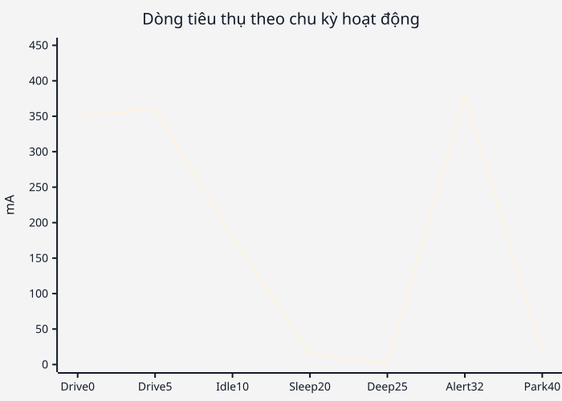

_Hình 4.10: Dòng tiêu thụ thay đổi theo các trạng thái chạy, đỗ, cảnh báo và ngủ sâu của thiết bị_

Đồ thị dòng cho thấy rõ hai trạng thái làm việc. Khi modem phát 4G, dòng tăng theo
các đỉnh ngắn; khi xe đỗ, dòng hạ xuống vùng deep sleep và giữ ở mức rất thấp. Đây
là phần cần quan tâm trực tiếp vì liên quan tới ảnh hưởng của thiết bị lên ắc quy xe.

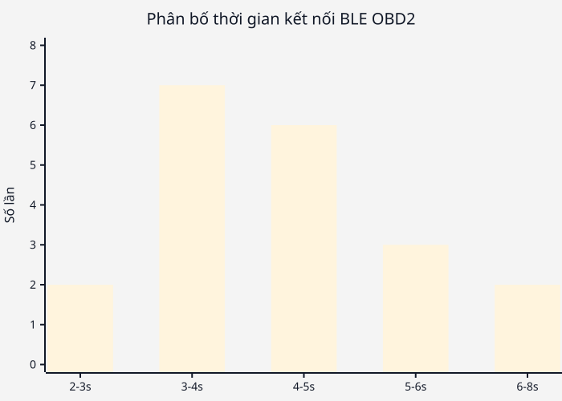

_Hình 4.11: Phần lớn các lần ghép nối OBD-II hoàn thành trong vùng 3-5 s, phù hợp với yêu cầu vận hành thực tế_

Thời gian ghép OBD-II tập trung chủ yếu trong khoảng 3-5 s. Mức này đủ để thiết bị
lấy dữ liệu xe ngay sau khi xe bắt đầu hoạt động.

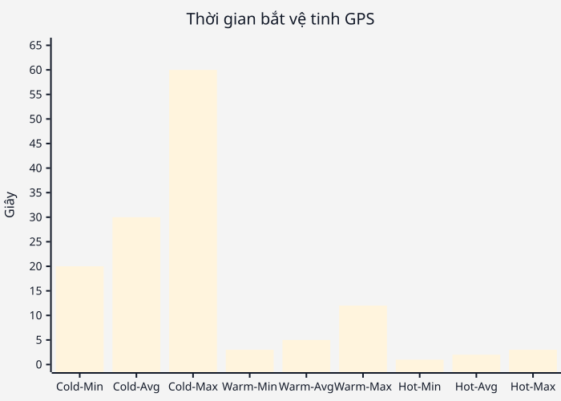

_Hình 4.12: Ở các lần khởi động lại thông thường, thiết bị lấy lại vị trí nhanh nhờ điều kiện warm start và hot start_

Với bài toán này, điều quan trọng là xe vừa di chuyển thì vị trí phải lên kịp. Kết quả
ở Hình 4.12 cho biết thiết bị lấy lại vị trí trong vài giây và theo kịp chuyến đi.

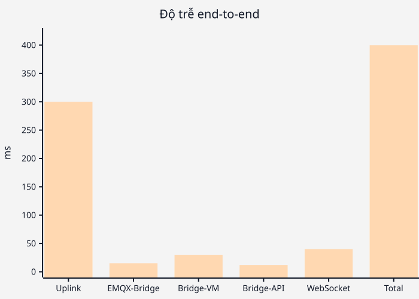

_Hình 4.13: Độ trễ toàn tuyến tập trung chủ yếu ở khâu truyền qua mạng di động, còn phần xử lý trong máy chủ chiếm tỷ trọng nhỏ_

Độ trễ lớn nhất nằm ở đoạn truyền qua mạng 4G. Sau khi bản tin vào máy chủ, phần lưu
trữ và cập nhật giao diện diễn ra nhanh hơn đáng kể.

_Hình 4.14: Các chỉ tiêu chính đều nằm trong vùng mục tiêu đã đặt ra từ đầu_

Hình 4.14 đặt kết quả đo cạnh các chỉ tiêu đã chốt từ đầu. Các chỉ tiêu về nguồn, GPS,
OBD-II, độ trễ và khả năng phục vụ đồng thời đều nằm trong giới hạn đã đặt ra.

## 4.5. Đối chiếu với mục tiêu của đồ án

Bảng 4.6 đối chiếu trực tiếp từng mục tiêu của đồ án với kết quả triển khai trên nguyên
mẫu hoàn chỉnh.

**Bảng 4.6: Kiểm chứng chỉ tiêu thiết kế**

| Mục tiêu theo đồ án               | Kết quả triển khai                                                               |
| :------------------------------------- | :---------------------------------------------------------------------------------- |
| Nguồn 12-24 VDC                       | Thiết bị làm việc ổn định trên nguồn xe 12-24 VDC                          |
| Nền tảng ESP                         | Đã triển khai trên ESP32-S3                                                     |
| Giao tiếp OBD-II                      | Đã đọc dữ liệu OBD-II qua Bluetooth                                           |
| Theo dõi tọa độ GPS, tốc độ     | Đã theo dõi theo thời gian thực trên bản đồ                                |
| Tính quãng đường                  | Đã tổng hợp theo hành trình thực tế của xe                                 |
| Tính thời gian sử dụng             | Đã tổng hợp theo chuyến đi và thời gian xe hoạt động                     |
| Ước tính chi phí khai thác        | Đã tổng hợp theo quãng đường, thời gian sử dụng và dữ liệu vận hành |
| Cảnh báo vượt tốc độ            | Đã triển khai và hiển thị trên giao diện web                                |
| Cảnh báo đỗ lâu                   | Đã triển khai qua trạng thái đỗ và thời gian không hoạt động           |
| Chế tạo PCB và lắp đặt thực tế | Đã hoàn thành PCB, vỏ in 3D và kiểm thử trên xe                            |

Ngoài các mục tiêu chính, hệ thống còn triển khai quản lý vùng và cảnh báo ra khỏi vùng
cho phép để hỗ trợ kiểm soát phạm vi khai thác xe.

**Bảng 4.7: Kiểm chứng các ràng buộc thiết kế**

| Ràng buộc thiết kế                                   | Kết quả                                                                                                 |
| :------------------------------------------------------- | :-------------------------------------------------------------------------------------------------------- |
| Chi phí toàn bộ đồ án không vượt 20.000.000 VND | Tổng chi phí triển khai ở mức 4.504.000-5.704.000 VND                                                |
| Thiết bị chế tạo được bằng PCB và vỏ in 3D     | Đã chế tạo PCB, lắp trong vỏ in 3D và lắp thử trên xe                                           |
| Kiểm chứng trong phòng thí nghiệm                   | Đã đo dòng ngủ, dòng hoạt động, độ trễ truyền dữ liệu và phản hồi OBD-II                |
| Kiểm chứng trên xe thử nghiệm                       | Đã theo dõi vị trí, tốc độ, hành trình, cảnh báo và dữ liệu OBD-II trên xe                |
| Tuân theo IPC-2221 và IEC 60664-1                      | Đã dùng để bố trí mạch nguồn, phân tách các nhánh điện và khoảng cách an toàn cơ bản |

Kết quả ở Bảng 4.6 và Bảng 4.7 cho thấy hệ thống đồng thời đáp ứng hai lớp yêu cầu
của đề tài: mục tiêu chức năng và ràng buộc triển khai. Như vậy, Chương 4 đã làm rõ
quá trình hiện thực hóa phương án đã lựa chọn, đồng thời cung cấp cơ sở thực nghiệm
để chuyển sang Chương 5, nơi đồ án sẽ được đánh giá theo các mặt hiệu năng kỹ thuật,
hiệu quả chi phí và mức độ phù hợp vận hành.

# CHƯƠNG 5. ĐÁNH GIÁ VÀ KHUYẾN NGHỊ - EVALUATION AND RECOMMENDATIONS

## 5.1. Đánh giá hiệu năng

Dựa trên các kết quả đo ở Chương 4, hệ thống đáp ứng được các yêu cầu kỹ thuật chính
của đề tài.

Về nguồn và chế độ nghỉ, dòng ngủ sâu khoảng 0,5 mA và dòng hoạt động trung bình
khoảng 180-220 mA cho thấy thiết bị giữ được hai trạng thái tiêu thụ khác nhau khá rõ.
Kết quả này phù hợp với yêu cầu dùng chung nguồn 12-24 VDC trên xe nhưng vẫn hạn
chế ảnh hưởng lên ắc quy khi phương tiện đỗ lâu.

Về thu nhận dữ liệu vận hành, thời gian kết nối OBD-II không dây khoảng 4 s và thời
gian phản hồi dữ liệu khoảng 60-75 ms. Mức này đủ để hệ thống lấy các thông số cơ
bản của xe ngay từ đầu chuyến đi, đồng thời vẫn giữ cách lắp đặt ít xâm lấn đối với
phương tiện.

Về định vị và truyền dữ liệu, độ chính xác GPS ngoài trời đạt khoảng 2-3 m, độ trễ
truyền qua mạng di động ở mức 120-180 ms, thời gian cập nhật bản đồ khoảng 1-2 s và
thời gian khôi phục kết nối khoảng 15-30 s. Với các giá trị này, hệ thống đáp ứng được
yêu cầu theo dõi gần thời gian thực trong điều kiện mạng thay đổi.

Về khả năng phục vụ, máy chủ phản hồi trong khoảng 95-200 ms và hệ thống giữ ổn
định ở mức 50+ thiết bị đồng thời. Kết quả đối chiếu tại Bảng 4.6 và Bảng 4.7 cũng cho
thấy các chỉ tiêu chính về nguồn, nền tảng ESP, giao tiếp OBD-II, theo dõi GPS, cảnh
báo và chế tạo nguyên mẫu đều đã được đáp ứng.

## 5.2. Đánh giá kinh tế và môi trường

Về mặt kinh tế, chi phí phần cứng cho một thiết bị khoảng **1.514.000 VND**; chi phí
SIM dữ liệu khoảng **70.000 VND/tháng/thiết bị**; chi phí máy chủ cho giai đoạn phát
triển và thử nghiệm 6 tháng khoảng **2.370.000-3.570.000 VND**. Tổng chi phí triển
khai của nguyên mẫu vì vậy nằm trong khoảng **4.504.000-5.704.000 VND**, thấp hơn
đáng kể so với giới hạn **20.000.000 VND** của đề tài.

Cấu trúc chi phí này phù hợp với bài toán đội xe nhỏ và vừa. Phần chi phí tăng theo số
lượng xe chủ yếu nằm ở thiết bị và SIM, trong khi hạ tầng xử lý và giao diện có thể dùng
chung cho nhiều phương tiện.

Về mặt môi trường và mức can thiệp triển khai, thiết bị được lắp qua giao tiếp OBD-II
và nguồn 12-24 VDC, nên không đòi hỏi thay đổi sâu vào kết cấu điện nguyên bản của xe
trong quá trình thử nghiệm. Cùng với dòng nền thấp ở trạng thái ngủ sâu, cách tiếp cận
này giúp giảm ảnh hưởng năng lượng và giữ cho nguyên mẫu phù hợp với giai đoạn kiểm
chứng.

## 5.3. Đánh giá rủi ro và biện pháp giảm thiểu

Trong quá trình thử nghiệm, một số rủi ro kỹ thuật chính của hệ thống có thể nhận thấy
như sau.

Rủi ro thứ nhất là sự biến động của mạng di động. Khi xe đi qua khu vực sóng yếu, độ
trễ tăng và bản tin có thể bị gián đoạn. Biện pháp đã áp dụng là phân mức ưu tiên bản
tin, dùng MQTT làm tuyến truyền chính và bổ sung cơ chế lưu đệm, phát lại sau khi kết
nối được phục hồi.

Rủi ro thứ hai là ảnh hưởng của thiết bị lên nguồn xe khi phương tiện đỗ lâu. Nếu toàn
bộ khối đo và truyền thông luôn duy trì trạng thái hoạt động, dòng nền sẽ tích lũy theo
thời gian. Biện pháp của nguyên mẫu là tổ chức các trạng thái Driving, Parking, Alert và
Deep Sleep để chỉ giữ lại các khối thật sự cần thiết ở từng thời điểm.

Rủi ro thứ ba là độ tin cậy của lớp giám sát khi xe đỗ. Ngưỡng phát hiện chuyển động
đặt không phù hợp có thể gây báo giả hoặc bỏ sót sự kiện. Trong nguyên mẫu, rủi ro
này được giảm bằng cách kết hợp trạng thái đỗ, tín hiệu IMU và thời gian không hoạt
động; tuy nhiên phần hiệu chỉnh ngưỡng vẫn cần tiếp tục kiểm chứng trên nhiều điều
kiện xe và môi trường khác nhau.

Rủi ro thứ tư là tính tương thích của dữ liệu OBD-II giữa các dòng xe. Thiết bị hiện đã
đọc được dữ liệu cơ bản trên cấu hình thử nghiệm, nhưng tập tham số và tốc độ phản
hồi có thể thay đổi theo từng xe. Vì vậy, lớp thu nhận cần được giữ theo hướng mô-đun,
cho phép hệ thống vẫn duy trì theo dõi vị trí và trạng thái ngay cả khi dữ liệu OBD-II
không đầy đủ.

## 5.4. Khuyến nghị cho tương lai

Từ kết quả của nguyên mẫu hiện tại, các hướng phát triển tiếp theo có thể tập trung vào
những nội dung sau:

1. **Kiểm thử dài hạn trên nhiều dòng xe và nhiều điều kiện sóng**, nhằm hiệu chỉnh
   ngưỡng cảnh báo, thời gian khôi phục kết nối và độ ổn định của dữ liệu OBD-II.
2. **Hoàn thiện phần cứng phiên bản tiếp theo**, theo hướng gọn hơn, ổn định hơn và
   thuận tiện hơn cho lắp đặt thực tế trên xe.
3. **Bổ sung lớp an toàn và quản trị thiết bị**, như watchdog, bảo mật MQTT/TLS, quản
   lý cấu hình từ xa và nhật ký sự kiện phục vụ bảo trì.
4. **Phát triển sâu hơn lớp khai thác dữ liệu**, theo hướng báo cáo chuyến đi, thống kê
   sử dụng, ưu tiên cảnh báo và hỗ trợ tốt hơn cho vận hành trên thiết bị di động.

# CHƯƠNG 6. PHẢN HỒI VÀ BÀI HỌC KINH NGHIỆM - REFLECTION AND LESSONS LEARNED

## 6.1. Ứng dụng kiến thức kỹ thuật

Đồ án là quá trình tích hợp liên ngành từ nguồn điện, nhúng, truyền thông dữ liệu, cơ khí-vật liệu đến triển khai phần mềm máy chủ và giao diện. Bài học lớn nhất là: giá trị kỹ thuật không đến từ việc từng khối “đúng theo lý thuyết” một cách riêng rẽ, mà đến từ việc các khối giữ được ổn định khi chạy đồng thời trong điều kiện thực địa.

Trong chuỗi đó, mỗi quyết định kỹ thuật đều có tác động dây chuyền: nguồn quyết định độ bền phiên vận hành; mô hình trạng thái quyết định tiêu thụ điện và mức bỏ sót sự kiện; tổ chức dữ liệu ở máy chủ quyết định tốc độ phản hồi của giao diện. Vì vậy, cách làm hiệu quả nhất là khóa tiêu chí đo ngay từ đầu và kiểm chứng theo tuyến thay vì kiểm từng thành phần độc lập.

## 6.2. Bài học khi xử lý các điểm khó

Ba điểm khó nhất của bài toán là: cân bằng năng lượng khi xe đỗ dài giờ, giữ độ liên tục dữ liệu khi mạng di động biến động, và duy trì mức lắp đặt ít xâm lấn trên nhiều xe khác nhau.

Những điểm khó này được xử lý bằng ba nguyên tắc triển khai:

- **Tách rõ miền chức năng:** thiết bị ưu tiên thu-gửi ổn định, máy chủ ưu tiên xử lý-lưu trữ-cảnh báo, giao diện ưu tiên quan sát-hành động.
- **Thiết kế theo trạng thái vận hành:** chạy/đỗ/cảnh báo/ngủ sâu để điều khiển tiêu thụ điện theo ngữ cảnh thực.
- **Ưu tiên giải pháp lắp đặt thực dụng:** OBD-II không dây + cấu hình phần cứng gọn để giảm can thiệp hệ điện xe.

Bài học rút ra là: trong bài toán IoT gắn xe, quyết định “đủ dùng, ổn định, lặp lại được” có giá trị cao hơn quyết định “nhiều tính năng nhưng khó vận hành”.

## 6.3. Tác động triển khai thực tế

Khi đưa vào vận hành, hệ thống tạo ra thay đổi trực tiếp ở năng lực quản lý đội xe: người vận hành có thể theo dõi vị trí-trạng thái-cảnh báo trên một màn hình thống nhất, đồng thời truy hồi dữ liệu chuyến đi để đối chiếu nhanh khi phát sinh sự cố hoặc tranh chấp.

Tuy nhiên, việc khai thác dữ liệu vị trí và dữ liệu vận hành phải đi kèm nguyên tắc quản trị dữ liệu rõ ràng: đúng mục đích, đúng thẩm quyền truy cập, đúng thời gian lưu, và đúng cách chia sẻ. Đây là điều kiện bắt buộc để hệ thống không chỉ hiệu quả về kỹ thuật mà còn phù hợp về vận hành và trách nhiệm dữ liệu.

## 6.4. Tổng kết

Đồ án đã hoàn thành mục tiêu cốt lõi: xây dựng một hệ thống IoT quản lý xe cho thuê tự lái có thể triển khai thực tế, gồm thiết bị trên xe, máy chủ xử lý dữ liệu và giao diện khai thác tập trung.

Ở lớp kỹ thuật, hệ thống đã đáp ứng các ràng buộc chính về nguồn 12-24 VDC, nền tảng ESP32-S3, kết nối OBD-II, thu nhận vị trí GPS và vận hành trạng thái tiết kiệm năng lượng. Ở lớp khai thác, hệ thống cung cấp được dữ liệu thời gian thực, cảnh báo sự kiện và tổng hợp chuyến đi phục vụ điều hành.

Quan trọng nhất, toàn bộ chuỗi **thu dữ liệu → truyền dữ liệu → xử lý → hiển thị** đã được kiểm chứng bằng đo kiểm trong phòng thí nghiệm và thử nghiệm trên xe thật, với các chỉ số nằm trong ngưỡng mục tiêu của đề tài. Kết quả này xác nhận phương án đề xuất không dừng ở mức mô hình trình diễn, mà đạt mức khả thi cho triển khai vận hành trong bối cảnh đội xe nhỏ và vừa.

# TÀI LIỆU TRÍCH DẪN - REFERENCES

## [A] Tài liệu chính của đồ án

[1] Lê Trọng An, _Phụ lục I - Mô tả đồ án_, Đại học Phenikaa, 2026.

[2] Kho mã nguồn đồ án IoT Vehicle Tracking System, gồm mã nguồn thiết bị, máy
chủ, giao diện web, ứng dụng di động và tài liệu thiết kế trong thư mục
`resources/`, 2026.

## [B] Tài liệu kỹ thuật

[3] Espressif Systems, _ESP32-S3 Series Datasheet_, 2024.

[4] SIMCom, _SIM7600 Series Hardware Design Manual_, 2024.

[5] STMicroelectronics, _LIS3DSH Datasheet_, 2024.

[6] OASIS, _MQTT Version 3.1.1_, 2014.

[7] IPC, _IPC-2221: Generic Standard on Printed Board Design_, 2022.

[8] IEC, _IEC 60664-1: Insulation Coordination for Equipment within Low-Voltage
Systems_, 2020.

[9] SAE, _OBD-II / J1979 Service Definitions_, 2021.

[10] Teltonika, _FMC920 - Best-selling 4G Compact GPS Tracker_, truy cập tháng
05/2026, tại: https://www.teltonika-gps.com/products/trackers/basic/fmc920

[11] Teltonika, _FMM003 - 4G LTE Cat M1 Tracker With OBD OEM Data Reading_,
truy cập tháng 05/2026, tại:
https://www.teltonika-gps.com/products/trackers/obd-data/fmm003

[12] Queclink, _GV305CEU_, truy cập tháng 05/2026, tại:
https://www.queclink.com/product/gv305ceu/

# PHỤ LỤC

## PHỤ LỤC 1. TÓM TẮT CHI PHÍ

**Bảng PL-1.1: Tóm tắt chi phí của phương án đồ án**

| Hạng mục                          | Giá trị tham chiếu                                                   |
| :---------------------------------- | :---------------------------------------------------------------------- |
| Phần cứng một thiết bị         | 1.514.000 VND                                                           |
| SIM dữ liệu di động             | Khoảng 70.000 VND/tháng/thiết bị                                    |
| Hạ tầng máy chủ                 | Khoảng 300.000-500.000 VND/tháng, tên miền khoảng 300.000 VND/năm |
| Tổng chi phí triển khai đồ án | 4.504.000-5.704.000 VND                                                 |
| Giới hạn chi phí của đồ án   | Không vượt 20.000.000 VND                                            |

## PHỤ LỤC 2. HỒ SƠ BÀN GIAO

Các thành phần bàn giao của đồ án gồm:

- mã nguồn thiết bị;
- mã nguồn máy chủ;
- mã nguồn giao diện web;
- mã nguồn ứng dụng di động;
- tài liệu thiết kế phần cứng;
- báo cáo đồ án;
- bộ hình minh họa, sơ đồ và snapshot kiểm thử.
