\

</div>

<div class="minipage">

**BỘ GIÁO DỤC VÀ ĐÀO TẠO**
**ĐẠI HỌC PHENIKAA**\

---

``

**ĐỒ ÁN TỐT NGHIỆP**
**THIẾT KẾ HỆ THỐNG IoT CHO ỨNG DỤNG QUẢN LÝ PHƯƠNG TIỆN**
**GIAO THÔNG TRONG LĨNH VỰC CHO THUÊ XE TỰ LÁI**

<div class="minipage">

**Sinh viên:** Lê Trọng An
**Mã số sinh viên:** 21010389 **Khóa:** K15
**Ngành:** Kỹ thuật Cơ Điện tử **Hệ:** Đại học chính quy
**Giảng viên hướng dẫn:** TS. Nguyễn Đức Nam

</div>

**Hà Nội - 2026**

</div>

<div class="center">

**BỘ GIÁO DỤC VÀ ĐÀO TẠO**
**ĐẠI HỌC PHENIKAA**\

---

``

**ĐỒ ÁN TỐT NGHIỆP**
**THIẾT KẾ HỆ THỐNG IoT CHO ỨNG DỤNG QUẢN LÝ**
**PHƯƠNG TIỆN GIAO THÔNG TRONG LĨNH VỰC**
**CHO THUÊ XE TỰ LÁI**

<div class="minipage">

**Sinh viên:** Lê Trọng An
**Mã số sinh viên:** 21010389 **Khóa:** K15
**Ngành:** Kỹ thuật Cơ Điện tử **Hệ:** Đại học chính quy
**Giảng viên hướng dẫn:** TS. Nguyễn Đức Nam

</div>

**Hà Nội – 2026**

</div>

<div class="center">

**PHENIKAA UNIVERSITY**
**FACULTY OF MECHANICAL ENGINEERING AND MECHATRONICS**
``

**MEM710071 – CAPSTONE DESIGN 2**
**DESIGN OF AN IoT SYSTEM FOR VEHICLE MANAGEMENT**
**IN SELF-DRIVE CAR RENTAL SERVICES**
**Semester: I Academic year: 2025–2026**

<div class="minipage">

**Project Team:**

<div class="center">

| **Student name** | **Student ID** | **Cohort** |
| :--------------------- | :------------------- | :--------------- |
| Le Trong An            | 21010389             | K15              |

</div>

**Course Instructor:** Dr. Nguyen Duc Nam

</div>

<div class="minipage">

This report is submitted to the Faculty of Mechanical Engineering and
Mechatronics,
School of Engineering, Phenikaa University in partial fulfillment of the
requirements
of the Graduation Thesis course MEM710071.

</div>

**HANOI – 2026**

</div>

<div class="center">

**ĐẠI HỌC PHENIKAA**
**KHOA CƠ KHÍ – CƠ ĐIỆN TỬ**
``

**MEM710071**
**ĐỒ ÁN TỐT NGHIỆP**
**THIẾT KẾ HỆ THỐNG IoT CHO ỨNG DỤNG QUẢN LÝ**
**PHƯƠNG TIỆN GIAO THÔNG TRONG LĨNH VỰC CHO THUÊ XE TỰ LÁI**
**Học kỳ I Năm học 2025–2026**

<div class="center">

| **Họ và tên sinh viên** | **Mã số sinh viên** | **Lớp** |
| :-------------------------------- | :--------------------------- | :------------- |
| Lê Trọng An                     | 21010389                     | K15-KTCĐT2    |

</div>

**Giảng viên hướng dẫn:** TS. Nguyễn Đức Nam

**HÀ NỘI, 2026**

</div>

<div class="minipage">

**BỘ GIÁO DỤC VÀ ĐÀO TẠO**
**ĐẠI HỌC PHENIKAA**\

---

</div>

<div class="minipage">

**CỘNG HÒA XÃ HỘI CHỦ NGHĨA VIỆT NAM**
**Độc lập - Tự do - Hạnh phúc**\

---

</div>

<div class="center">

**NHẬN XÉT ĐỒ ÁN TỐT NGHIỆP CỦA GIẢNG VIÊN HƯỚNG DẪN**

</div>

**Giảng viên hướng dẫn:** TS. Nguyễn Đức Nam **Khoa:** Cơ khí – Cơ Điện
tử.
**Tên đề tài:** Thiết kế hệ thống IoT cho ứng dụng quản lý phương tiện
giao thông trong lĩnh vực cho thuê xe tự lái.
**Sinh viên thực hiện:** Lê Trọng An. **Lớp:** K15-KTCĐT2.

<div class="center">

**NỘI DUNG NHẬN XÉT**

</div>

**I. Nhận xét Đồ án tốt nghiệp:**\

- Nhận xét về hình thức:\
- Tính cấp thiết của đề tài:\
- Mục tiêu của đề tài:\
- Nội dung của đề tài:\
- Tài liệu tham khảo:\
- Phương pháp nghiên cứu:\
- Tính sáng tạo và ứng dụng:
  **II. Nhận xét về tinh thần và thái độ làm việc của sinh viên:**
  **III. Kết quả đạt được:**
  **IV. Kết luận:** Đồng ý cho bảo vệ: $\square$ Không đồng ý cho bảo vệ:
  $\square$

<div class="flushright">

Hà Nội, ngày …, tháng … năm 20…
**GIẢNG VIÊN HƯỚNG DẪN**
_(Ký, ghi rõ họ tên)_
TS. Nguyễn Đức Nam

</div>

<div class="minipage">

**BỘ GIÁO DỤC VÀ ĐÀO TẠO**
**ĐẠI HỌC PHENIKAA**\

---

</div>

<div class="minipage">

**CỘNG HÒA XÃ HỘI CHỦ NGHĨA VIỆT NAM**
**Độc lập - Tự do - Hạnh phúc**\

---

</div>

<div class="center">

**NHẬN XÉT ĐỒ ÁN TỐT NGHIỆP CỦA GIẢNG VIÊN PHẢN BIỆN**

</div>

**Giảng viên phản biện:** Theo quyết định phân công phản biện của Khoa
**Tên đề tài:** Thiết kế hệ thống IoT cho ứng dụng quản lý phương tiện
giao thông trong lĩnh vực cho thuê xe tự lái.
**Sinh viên thực hiện:** Lê Trọng An **Lớp:** K15-KTCĐT2
**Giảng viên hướng dẫn:** TS. Nguyễn Đức Nam

<div class="center">

**NỘI DUNG NHẬN XÉT**

</div>

**I. Nhận xét Đồ án tốt nghiệp:**\

- Bố cục, hình thức trình bày:\
- Đảm bảo tính cấp thiết, hiện đại, không trùng lặp:\
- Nội dung:\
- Mức độ thực hiện:
  **II. Kết quả đạt được:**
  **III. Ưu nhược điểm:**
  **IV. Kết luận:** Đồng ý cho bảo vệ: $\square$ Không đồng ý cho bảo vệ:
  $\square$

<div class="flushright">

Hà Nội, ngày …, tháng … năm 20…
**GIẢNG VIÊN PHẢN BIỆN**
_(Ký, ghi rõ họ tên)_
Theo quyết định phân công phản biện của Khoa

</div>

<div class="minipage">

**BỘ GIÁO DỤC VÀ ĐÀO TẠO**
**ĐẠI HỌC PHENIKAA**\

---

</div>

<div class="minipage">

**CỘNG HÒA XÃ HỘI CHỦ NGHĨA VIỆT NAM**
**Độc lập - Tự do - Hạnh phúc**\

---

</div>

<div class="center">

**BIÊN BẢN ĐÁNH GIÁ ĐỒ ÁN TỐT NGHIỆP**

</div>

**I. Thông tin chung**

1. Thời gian: từ …giờ …đến …giờ …ngày …/…/20…
2. Địa điểm:
3. Họ và tên sinh viên: Lê Trọng An Mã số SV: 21010389
4. Lớp: K15-KTCĐT2 Ngành: Kỹ thuật Cơ Điện tử Khóa: K15
5. Tên đề tài: Thiết kế hệ thống IoT cho ứng dụng quản lý phương tiện
   giao thông trong lĩnh vực cho thuê xe tự lái.
6. Giảng viên hướng dẫn: TS. Nguyễn Đức Nam

**II. Thành phần hội đồng**

1. Chủ tịch
2. Thư ký
3. Giảng viên phản biện
4. Ủy viên 1

**III. Tổng hợp câu hỏi của thành viên hội đồng:**

**IV. Tổng hợp nội dung trả lời của sinh viên:**

**V. Nội dung đánh giá của Hội đồng**

1. Ý nghĩa của đồ án:
2. Về nội dung, kết cấu của đồ án:
3. Phương pháp nghiên cứu:
4. Các kết quả nghiên cứu đạt được:

**VI. Điểm kết luận:**  (Bằng chữ: )

<div class="minipage">

**CHỦ TỊCH HỘI ĐỒNG**
_(Ký, ghi rõ họ tên)_\

</div>

<div class="minipage">

**THƯ KÝ**
_(Ký, ghi rõ họ tên)_\

</div>

<div class="center">

**GIẢI TRÌNH CÁC CHỈNH SỬA**
_(Nếu có)_

</div>

<div class="center">

Chưa phát sinh nội dung cần giải trình.

</div>

# LỜI CAM ĐOAN

Tên tôi là: Lê Trọng An.
Mã sinh viên: 21010389 Lớp: K15-KTCĐT2
Ngành: Kỹ thuật Cơ Điện tử.

Tôi đã thực hiện đồ án tốt nghiệp với đề tài: Thiết kế hệ thống IoT cho
ứng dụng quản lý phương tiện giao thông trong lĩnh vực cho thuê xe tự
lái.

Tôi xin cam đoan đây là đề tài nghiên cứu của riêng tôi và được sự hướng
dẫn của TS. Nguyễn Đức Nam.

Các nội dung nghiên cứu, kết quả trong đề tài này là trung thực và chưa
được công bố dưới bất kỳ hình thức nào. Nếu phát hiện có bất kỳ hình
thức gian lận nào, tôi xin hoàn toàn chịu trách nhiệm trước pháp luật.

<div class="flushright">

Hà Nội, ngày …, tháng … năm 20…

</div>

<div class="minipage">

**GIẢNG VIÊN HƯỚNG DẪN**
_(Ký, ghi rõ họ tên)_
TS. Nguyễn Đức Nam

</div>

<div class="minipage">

**SINH VIÊN**
_(Ký, ghi rõ họ tên)_
Lê Trọng An

</div>

# TÓM TẮT ĐỒ ÁN TỐT NGHIỆP - ABSTRACT

Sự phát triển nhanh của dịch vụ cho thuê xe tự lái tại Việt Nam làm gia
tăng nhu cầu giám sát phương tiện từ xa. Nhu cầu này không chỉ dừng ở
việc xác định vị trí xe, mà còn bao gồm theo dõi trạng thái vận hành,
nhận biết sớm các dấu hiệu bất thường và hỗ trợ người quản lý đưa ra
quyết định kịp thời trong quá trình vận hành đội xe. Từ yêu cầu đó, đồ
án tập trung thiết kế và triển khai một hệ thống giám sát phương tiện
hoàn chỉnh theo kiến trúc tích hợp, gồm thiết bị gắn trên xe, khối tiếp
nhận và xử lý dữ liệu trên máy chủ, cùng giao diện theo dõi dành cho
người quản lý.

Ở tầng thiết bị, hệ thống được xây dựng trên bo mạch PCB tự thiết kế.
Thiết bị sử dụng ESP32-S3 làm bộ điều khiển trung tâm, kết hợp modem
SIM7600CE-T để truyền dữ liệu qua mạng di động và lấy vị trí từ vệ tinh,
cảm biến gia tốc LIS3DH để nhận biết chuyển động khi xe đỗ, cùng bộ
chuyển đổi OBD2 qua BLE để thu thập các thông tin chẩn đoán từ xe. Kiến
trúc nguồn được tổ chức theo nhiều nhánh để thiết bị vẫn duy trì hoạt
động khi xe tắt máy, đồng thời giảm nguy cơ ảnh hưởng tới ắc quy chính.

Ở tầng máy chủ, dữ liệu gửi từ thiết bị được tiếp nhận, phân loại và
chuẩn hóa trước khi đưa vào các lớp lưu trữ và xử lý phù hợp. Cách tổ
chức này giúp hệ thống vừa theo dõi được dữ liệu mới theo thời gian thực,
vừa lưu lại lịch sử vận hành, trạng thái thiết bị, cảnh báo và tiến
trình cập nhật phần mềm từ xa để phục vụ quản trị về sau.

Ở tầng ứng dụng, hệ thống cung cấp một bảng điều khiển web để người quản
lý theo dõi vị trí xe, trạng thái thiết bị, lịch sử hành trình và các
cảnh báo trên cùng một giao diện thống nhất. Khi dữ liệu trên máy chủ có
thay đổi, giao diện được cập nhật gần như theo thời gian thực, nhờ đó
người vận hành không phải thao tác tải lại thủ công mà vẫn theo dõi được
diễn biến của đội xe.

Kết quả đạt được là một hệ thống IoT giám sát phương tiện hoàn chỉnh từ
phần cứng đến phần mềm, có khả năng theo dõi vị trí thời gian thực, đọc
dữ liệu chẩn đoán OBD2, thiết lập vùng cho phép, phát sinh cảnh báo tự
động, cập nhật firmware từ xa và hỗ trợ quản lý đội xe. Trong bối cảnh
đó, hệ thống cho thấy một hướng triển khai phù hợp với doanh nghiệp cho
thuê xe tự lái trong nước: chi phí hợp lý, có thể tùy biến và còn có khả năng mở rộng trong các giai đoạn tiếp theo.

**Từ khóa:** IoT, giám sát phương tiện, GPS, OBD2, MQTT, ESP32-S3, thời
gian thực, vùng cho phép

**Abstract (English)**

As the self-drive car rental market in Vietnam grows, the need for
remote vehicle monitoring and real-time fleet management becomes
increasingly practical for operators. This thesis presents the design
and implementation of an integrated vehicle-monitoring system with three
main layers: an onboard device that collects and transmits data, a
server-side processing layer that receives and organizes that data, and
a web-based dashboard that helps operators follow the fleet in daily
operation.

At the device layer, the system is built around a custom PCB rather than
a simple combination of development boards. The onboard unit uses an
ESP32-S3 as the main controller, a SIM7600CE-T module for mobile-data
communication and GNSS positioning, a LIS3DH accelerometer to detect
movement when the vehicle is parked, and an external BLE-based OBD2
adapter to read diagnostic data from the vehicle. Its power architecture
is split into multiple power paths so that the device can continue operating
when the engine is off while reducing the risk of draining the main
battery.

At the server layer, incoming device messages are first received,
classified, and normalized before being sent to the appropriate storage
and processing paths. This organization allows the system to support
both real-time monitoring and longer-term history review, while also
keeping track of device state, alerts, and remote firmware-update
progress.

At the application layer, the system provides a web dashboard for
monitoring vehicle position, device status, trip history, and alerts in
a unified interface. When new data arrives, the dashboard is updated
almost in real time, allowing operators to follow fleet activity without
manual refresh actions.

The result is a complete end-to-end IoT vehicle tracking system, from
hardware to software, capable of real-time location tracking, OBD2
diagnostic data retrieval, allowed-zone monitoring, automated alerts,
remote firmware updates, and fleet-management support for self-drive car
rental services. In this context, the system demonstrates a practical
implementation approach for domestic self-drive rental operators: cost
conscious, adaptable, and open to further expansion in later stages.

**Keywords:** IoT, vehicle tracking, GPS, OBD2, MQTT, ESP32-S3,
real-time, allowed-zone monitoring

# LỜI CẢM ƠN - ACKNOWLEDGEMENTS

Trước tiên, tôi xin gửi lời cảm ơn chân thành và sâu sắc nhất đến TS.
Nguyễn Đức Nam — người đã trực tiếp hướng dẫn, định hướng và tận tình hỗ
trợ tôi trong suốt quá trình thực hiện đồ án tốt nghiệp này. Những góp ý
chuyên môn và sự động viên của thầy là nguồn động lực quan trọng giúp
tôi hoàn thành đề tài.

Tôi xin trân trọng cảm ơn quý thầy cô trong Khoa Cơ khí - Cơ Điện tử,
Trường Kỹ thuật - Đại học Phenikaa đã truyền đạt những kiến thức nền
tảng vững chắc trong suốt quá trình học tập, tạo điều kiện thuận lợi để
tôi có thể áp dụng vào thực tiễn thông qua đồ án này.

Tôi cũng xin gửi lời cảm ơn đến gia đình, bạn bè và các đồng nghiệp đã
luôn ủng hộ, chia sẻ và đồng hành cùng tôi trong suốt thời gian thực
hiện đề tài.

Mặc dù đã nỗ lực hoàn thiện đồ án trong phạm vi thời gian và kiến thức
cho phép, nội dung chắc chắn vẫn còn những thiếu sót. Tôi rất mong nhận
được những ý kiến góp ý từ quý thầy cô và hội đồng để tiếp tục hoàn
thiện đề tài.

Xin chân thành cảm ơn!

<div class="flushright">

Hà Nội, ngày … tháng … năm 20…
**SINH VIÊN THỰC HIỆN**
Lê Trọng An

</div>

# MỤC LỤC - TABLE OF CONTENT

# DANH MỤC BẢNG - LIST OF TABLES

# DANH MỤC HÌNH ẢNH VÀ ĐỒ THỊ - LIST OF PICTURES AND GRAPHS

# DANH MỤC TỪ VIẾT TẮT - LIST OF ABBREVIATION

| **Từ viết tắt** | **Tiếng Anh**                           | **Tiếng Việt**                                            |
| ------------------------ | ---------------------------------------------- | ----------------------------------------------------------------- |
| **ADC**            | Analog-to-Digital Converter                    | Bộ chuyển đổi tương tự sang số                            |
| **API**            | Application Programming Interface              | Giao diện lập trình ứng dụng                                 |
| **BLE**            | Bluetooth Low Energy                           | Bluetooth năng lượng thấp                                     |
| **BOM**            | Bill of Materials                              | Danh sách linh kiện                                             |
| **CI/CD**          | Continuous Integration / Continuous Deployment | Tích hợp liên tục / Triển khai liên tục                    |
| **CORS**           | Cross-Origin Resource Sharing                  | Cơ chế chia sẻ tài nguyên khác nguồn                       |
| **DDD**            | Domain-Driven Design                           | Thiết kế hướng miền                                          |
| **Docker**         | Docker Container Platform                      | Nền tảng đóng gói và chạy ứng dụng bằng container       |
| **EMQX**           | Erlang MQTT Broker                             | Broker MQTT xây dựng trên Erlang/OTP                           |
| **ESP32**          | Espressif System-on-Chip 32-bit                | Hệ thống trên chip 32-bit của Espressif                       |
| **FreeRTOS**       | Free Real-Time Operating System                | Hệ điều hành thời gian thực mã nguồn mở                  |
| **GPIO**           | General Purpose Input/Output                   | Cổng vào/ra đa năng                                           |
| **GNSS**           | Global Navigation Satellite System             | Hệ thống vệ tinh dẫn đường toàn cầu                      |
| **GPS**            | Global Positioning System                      | Hệ thống định vị toàn cầu                                  |
| **HTTP**           | Hypertext Transfer Protocol                    | Giao thức truyền siêu văn bản                                |
| **HTTPS**          | Hypertext Transfer Protocol Secure             | Giao thức truyền siêu văn bản bảo mật                      |
| **IMU**            | Inertial Measurement Unit                      | Đơn vị đo lường quán tính                                 |
| **IoT**            | Internet of Things                             | Internet vạn vật                                                |
| **JWT**            | JSON Web Token                                 | Mã thông báo web định dạng JSON                             |
| **MCU**            | Microcontroller Unit                           | Vi điều khiển                                                  |
| **MQTT**           | Message Queuing Telemetry Transport            | Giao thức truyền bản tin nhẹ theo mô hình publish/subscribe |
| **OBD2**           | On-Board Diagnostics II                        | Chẩn đoán trên xe thế hệ 2                                  |
| **ORM**            | Object-Relational Mapping                      | Ánh xạ đối tượng - quan hệ                                 |
| **PCB**            | Printed Circuit Board                          | Bảng mạch in                                                    |
| **REST**           | Representational State Transfer                | Kiểu kiến trúc REST cho dịch vụ web                          |
| **RTOS**           | Real-Time Operating System                     | Hệ điều hành thời gian thực                                 |
| **SoC**            | System on Chip                                 | Hệ thống trên chip                                             |
| **SQL**            | Structured Query Language                      | Ngôn ngữ truy vấn có cấu trúc                               |
| **TLS**            | Transport Layer Security                       | Bảo mật tầng vận chuyển                                      |
| **UART**           | Universal Asynchronous Receiver-Transmitter    | Bộ thu phát bất đồng bộ đa năng                           |
| **WebSocket**      | WebSocket Protocol                             | Giao thức giao tiếp hai chiều thời gian thực                 |


# CHƯƠNG 1. GIỚI THIỆU DỰ ÁN – PROJECT OVERVIEW

## 1.1. Đặt vấn đề / Bối cảnh của dự án

### 1.1.1. Bối cảnh thị trường cho thuê xe tự lái tại Việt Nam

Những năm gần đây, thị trường cho thuê xe tại Việt Nam tăng
trưởng rõ rệt, đặc biệt tại TP. Hồ Chí Minh, Hà Nội và Đà Nẵng. Theo một
báo cáo thị trường, quy mô thị trường cho thuê xe Việt Nam được ước tính
đạt 376,4 triệu USD năm 2025 và có thể đạt 1.006,7 triệu USD vào năm
2034, tương ứng tốc độ tăng trưởng kép 11,55% trong giai đoạn 2026–2034
\[1\]. Xu hướng này làm tăng nhu cầu đối với các hệ thống giám sát và
quản lý phương tiện từ xa.

Với doanh nghiệp vận hành đội xe, tốc độ tăng trưởng này mang lại cơ hội
kinh doanh nhưng cũng kéo theo một yêu cầu rất thực tế: phải biết xe
đang ở đâu, đang được sử dụng như thế nào, có an toàn hay không, và tình
trạng vận hành của từng xe đang diễn biến ra sao. Trên thực tế, nhiều
đơn vị hiện nay không hoàn toàn quản lý xe theo cách thủ công, mà đã sử
dụng các thiết bị định vị GPS hoặc các giải pháp giám sát thương mại có
sẵn trên thị trường. Tuy nhiên, khi quy mô đội xe mở rộng, những công cụ
này vẫn bộc lộ các giới hạn rõ rệt về mức độ tập trung dữ liệu, khả năng
quan sát trạng thái kỹ thuật và mức độ phù hợp với nhu cầu vận hành đặc
thù của doanh nghiệp cho thuê xe tự lái. Trong thực tế, các doanh
nghiệp cho thuê xe tự lái hiện nay thường gặp bốn nhóm khó khăn sau:

- **Dữ liệu giám sát còn rời rạc và thiếu tập trung**: Nhiều doanh
  nghiệp đã gắn thiết bị GPS hoặc dùng nền tảng giám sát sẵn có, nhưng
  thông tin thu được thường chỉ dừng ở vị trí, tốc độ hoặc lịch sử di
  chuyển cơ bản. Dữ liệu vận hành vì thế nằm rải rác giữa nhiều công cụ
  khác nhau và chưa hình thành được một góc nhìn tập trung để người quản
  lý theo dõi toàn bộ đội xe trên cùng một hệ thống.
- **Khó kiểm soát việc sử dụng xe theo ngữ cảnh vận hành thực tế**: Khi
  hệ thống hiện có chủ yếu phục vụ định vị, doanh nghiệp vẫn khó phát
  hiện sớm các tình huống như xe đi vượt phạm vi cho phép, sử dụng sai
  mục đích, hoạt động bất thường ngoài thời gian dự kiến hoặc có dấu hiệu
  bị chiếm đoạt. Việc nhận biết các tình huống này thường chậm hơn nhu
  cầu can thiệp thực tế, làm tăng rủi ro về tài sản và an toàn vận hành
  \[3\], \[8\], \[9\].
- **Thiếu khả năng theo dõi trạng thái kỹ thuật từ xa**: Phần lớn các
  giải pháp định vị thương mại không đi sâu vào dữ liệu vận hành của xe,
  nên doanh nghiệp khó theo dõi tình trạng kỹ thuật từ xa và thường chỉ
  xử lý bảo trì khi sự cố đã biểu hiện rõ. Điều này làm tăng chi phí sửa
  chữa, giảm tính chủ động trong bảo trì và có thể rút ngắn tuổi thọ
  phương tiện. Để đáp ứng nhu cầu này, hệ thống cần kết nối được với xe
  qua cổng OBD2 (On-Board Diagnostics II) — giao diện chẩn đoán tiêu chuẩn
  trên hầu hết xe ô tô sản xuất từ năm 1996 trở về sau, cho phép đọc
  các thông số vận hành như tốc độ động cơ, mức tiêu thụ nhiên liệu,
  nhiệt độ làm mát, điện áp acquy và mã lỗi chẩn đoán.
- **Khó tùy biến và chi phí tích lũy cao khi mở rộng**: Các hệ thống
  giám sát thương mại hiện có trên thị trường thường đi kèm chi phí thiết
  bị, phí dịch vụ định kỳ và những ràng buộc nhất định về nền tảng. Khi
  doanh nghiệp muốn tích hợp sâu hơn với quy trình quản lý riêng, bổ sung
  cảnh báo theo nghiệp vụ, hoặc mở rộng theo quy mô đội xe, tổng chi phí
  và độ phụ thuộc vào nhà cung cấp có thể tăng lên đáng kể.

Những khó khăn trên cho thấy nhu cầu giám sát là rất rõ, nhưng chưa tự
động dẫn tới một lời giải khả thi. Muốn biến nhu cầu vận hành thành một
hệ thống thật sự dùng được, bài toán phải được chuyển thành các thách
thức kỹ thuật cụ thể.

### 1.1.2. Thách thức kỹ thuật

Để giải quyết những khó khăn trên, hệ thống không thể chỉ dừng ở một
thiết bị định vị gắn thêm lên xe. Khi chuyển từ nhu cầu biết vị trí sang
nhu cầu quản lý vận hành, bài toán lập tức mở rộng thành bài toán hệ
thống nhiều tầng: thiết bị phải bám được nguồn xe trong thời gian dài,
vẫn nhận biết được bất thường khi xe đỗ, chịu được điều kiện kết nối di
động biến động, và bảo đảm dữ liệu khi đi tới máy chủ vẫn đủ nhất quán
để người quản lý sử dụng trong thực tế.

Vì vậy, thách thức kỹ thuật cốt lõi của đề tài không nằm ở một chức năng
đơn lẻ, mà ở việc tổ chức được toàn bộ chuỗi từ thu thập, truyền thông,
xử lý đến khai thác thông tin sao cho phù hợp với môi trường vận hành
thực tế của đội xe. Các nhóm vấn đề này sẽ được phân tích chi tiết ở
Chương 2.


_Hình 1.1: Sơ đồ tổng quan vấn đề và giải pháp đề xuất_

Hình 1.1 tóm tắt hướng chuyển từ hiện trạng quản lý thủ công và theo dõi
chậm sang một chuỗi giải pháp gồm thiết bị, máy chủ và giao diện khai thác.

### 1.1.3. Động lực thực hiện dự án

Động lực thực hiện đề tài xuất phát từ nhu cầu thực tế của doanh nghiệp
cho thuê xe tự lái: không chỉ cần biết vị trí phương tiện, mà còn cần
quan sát được trạng thái vận hành, phát hiện bất thường đủ sớm và có cơ
sở dữ liệu để hỗ trợ quyết định trong quá trình khai thác đội xe. Trong
bối cảnh đó, các công cụ theo dõi hiện có thường mới giải quyết tốt bài
toán định vị, trong khi nhu cầu quản lý lại đòi hỏi một chuỗi xử lý đầy
đủ hơn, từ thu thập dữ liệu trên xe, truyền dữ liệu ổn định, lưu trữ và
xử lý tập trung, đến hiển thị thông tin theo cách dễ theo dõi đối với
người vận hành.

Từ yêu cầu đó, đề tài **Thiết kế hệ thống IoT cho ứng dụng quản lý
phương tiện giao thông trong lĩnh vực cho thuê xe tự lái** được thực
hiện với định hướng xây dựng một hệ thống đồng bộ gồm thiết bị phần cứng
trên xe, phần mềm thiết bị nhúng, hạ tầng máy chủ và giao diện khai thác
thông tin. Cách tiếp cận này phù hợp hơn với đặc thù của bài toán quản
lý đội xe, đồng thời tạo cơ sở để phát triển một giải pháp có khả năng
mở rộng, tùy biến và thích nghi với điều kiện triển khai thực tế tại Việt
Nam.


## 1.2. Mục tiêu và phạm vi của dự án

### 1.2.1. Mục tiêu tổng quát

Mục tiêu chính của dự án là thiết kế và triển khai một hệ thống IoT theo
dõi phương tiện hoàn chỉnh cho bài toán quản lý đội xe cho thuê tự lái.
Mục tiêu này bao gồm cả thiết bị phần cứng trên xe, phần mềm thiết bị
nhúng, hạ tầng tiếp nhận và xử lý dữ liệu, cùng các lớp ứng dụng phục vụ
người vận hành. Từ yêu cầu của thực tế khai thác đội xe, hệ thống cần
vừa thu thập được dữ liệu hữu ích, vừa duy trì được độ ổn định khi lắp
đặt lâu dài trên xe, đồng thời bảo đảm dữ liệu được xử lý và đưa tới
người dùng đủ nhanh để hỗ trợ ra quyết định. Trên cơ sở đó, các mục tiêu
cụ thể của dự án được xác định như sau:

1. **Theo dõi vị trí và hành trình của phương tiện**: Hình thành khả
   năng quan sát đội xe theo thời gian thực và truy xuất lại lịch sử vận
   hành khi cần.
2. **Bổ sung lớp dữ liệu trạng thái vận hành cơ bản của xe**: Mở rộng từ
   bài toán định vị sang bài toán theo dõi trạng thái kỹ thuật ở mức đủ
   dùng cho quản lý đội xe.
3. **Duy trì giám sát ổn định trên xe trong nhiều trạng thái vận hành**:
   Hệ thống phải hoạt động được khi xe chạy, khi xe đỗ và khi điều kiện
   kết nối thay đổi.
4. **Phát hiện và chuyển tải được các tình huống bất thường**: Cảnh báo
   phải được hình thành đủ kịp thời để hỗ trợ can thiệp ở cấp vận hành.
5. **Xây dựng nền tảng xử lý và khai thác dữ liệu tập trung**: Dữ liệu từ
   xe cần được tiếp nhận, lưu trữ, xử lý và hiển thị theo một chuỗi đủ
   nhất quán cho người quản lý sử dụng.

Các mục tiêu trên xác lập đích đến ở cấp đề tài; các yêu cầu kỹ thuật
và ngưỡng đánh giá tương ứng được chuẩn hóa ở Chương 2.

### 1.2.2. Phạm vi dự án

Để bảo đảm phạm vi nghiên cứu tập trung, nội dung triển khai được xác
định theo từng tầng của hệ thống: đối tượng ứng dụng, thiết bị phần
cứng, phần mềm thiết bị nhúng, hạ tầng máy chủ và lớp ứng dụng khai
thác. Cách phân chia này làm rõ ranh giới giữa phần được thiết kế, chế
tạo và kiểm chứng trực tiếp với các nội dung chỉ dừng ở mức chức năng cơ
bản hoặc định hướng phát triển tiếp theo.

**Đối tượng ứng dụng:**

Đề tài tập trung vào nhóm ô tô con sử dụng trong dịch vụ cho thuê xe tự
lái, như sedan hoặc SUV cỡ nhỏ, với hệ thống điện 12V hoặc 24V và dải
ắc quy phổ thông thường gặp trên thị trường. Nhóm người dùng hướng tới
là các doanh nghiệp cho thuê xe tự lái quy mô vừa và nhỏ tại Việt Nam,
nơi nhu cầu theo dõi tập trung, chi phí đầu tư và khả năng tùy biến là
những yếu tố được đặt lên hàng đầu.

**Phạm vi phần cứng thiết bị:**

Ở tầng thiết bị, đồ án tập trung xây dựng một bộ theo dõi gắn trên xe
dưới dạng bo mạch riêng, gồm khối điều khiển trung tâm, khối truyền dữ
liệu qua mạng di động và định vị vệ tinh, khối đọc dữ liệu chẩn đoán từ
xe, khối cảm biến chuyển động và khối nguồn dự phòng. Phạm vi này đủ để
thiết bị thực hiện được chuỗi chức năng cốt lõi: thu thập dữ liệu, nhận
biết trạng thái, truyền thông tin đi và duy trì hoạt động khi nguồn
chính bị gián đoạn trong thời gian ngắn.

**Phạm vi phần mềm thiết bị nhúng:**

Phần mềm thiết bị nhúng là lớp làm cho phần cứng có thể vận hành thực sự
trên xe. Trong phạm vi đồ án, lớp này bao gồm điều phối các khối thu thập
dữ liệu, giao tiếp với thiết bị đọc OBD2, quản lý kết nối truyền dữ liệu,
đóng gói bản tin gửi lên máy chủ và tổ chức các chế độ năng lượng tương
ứng với trạng thái chạy, đỗ hoặc cảnh báo. Thuật ngữ _firmware_ trong đồ
án được hiểu theo nghĩa đó: phần mềm chạy trực tiếp trên thiết bị để điều
khiển hành vi của hệ thống ở tầng xe.

**Phạm vi máy chủ và dịch vụ xử lý dữ liệu:**

Ở phía máy chủ, đồ án tập trung vào chuỗi chức năng cần thiết để dữ liệu
sau khi rời xe có thể tiếp tục được tiếp nhận, phân loại, lưu trữ và xử
lý phục vụ khai thác. Chuỗi này bao gồm lớp tiếp nhận bản tin, lớp xử lý
và phân luồng dữ liệu, lớp lưu trữ cho dữ liệu nghiệp vụ, dữ liệu chuỗi
thời gian và nhật ký vận hành, cùng lớp dịch vụ cung cấp giao diện lập
trình ứng dụng cho web và di động. Phạm vi này được lựa chọn nhằm bảo
đảm hệ thống có thể xử lý dữ liệu với độ trễ thấp, lưu giữ trong thời
gian đủ dài và tránh hình thành các điểm nghẽn ngay từ giai đoạn đầu.

**Phạm vi ứng dụng khai thác:**

Giao diện web là bề mặt khai thác chính của hệ thống trong đồ án, phục vụ
theo dõi vị trí, lịch sử hành trình, cảnh báo và trạng thái thiết bị trên
một bảng điều khiển tập trung. Bên cạnh đó, ứng dụng di động cũng được
đưa vào phạm vi đề tài ở mức chức năng cơ bản, chủ yếu phục vụ theo dõi
nhanh vị trí và trạng thái phương tiện, nhận thông tin cảnh báo và truy
cập các dữ liệu vận hành thiết yếu.

**Giới hạn phạm vi nghiên cứu:**

- Đề tài chưa đi sâu vào các chức năng chẩn đoán OBD2 chuyên sâu; phạm
  vi hiện tại ưu tiên các thông số vận hành cơ bản và một phần mã lỗi
  chẩn đoán.
- Bài toán phát hiện va chạm chưa phải trọng tâm chính; cảm biến chuyển
  động hiện được dùng chủ yếu để nhận biết rung động và trạng thái bất
  thường khi xe đang đỗ.
- Hệ thống chưa triển khai các cơ chế điều khiển tác động trực tiếp tới
  xe như khóa máy hoặc can thiệp động cơ; chức năng hiện tại dừng ở mức
  phát hiện, cảnh báo và hỗ trợ ra quyết định.
- Ứng dụng di động mới được triển khai ở phạm vi cơ bản, chưa bao quát
  toàn bộ nghiệp vụ quản trị như trên giao diện web.

## 1.3. Các tiêu chí cần đạt được của dự án

Sau khi xác định mục tiêu và phạm vi, dự án cần một bộ tiêu chí ở cấp
định hướng để đối chiếu các quyết định thiết kế ở các chương sau. Trong
Chương 1, các tiêu chí này chỉ đóng vai trò khung tham chiếu tổng quát
cho toàn bộ đề tài; các yêu cầu định lượng và ràng buộc kỹ thuật chi tiết
sẽ được chuyển sang Chương 2 để tránh chồng lặp giữa phần giới thiệu và
phần phân tích vấn đề.

### 1.3.1. Tiêu chí phần cứng

Ở tầng phần cứng, thiết bị cần đáp ứng bốn yêu cầu định hướng:

- Làm việc ổn định khi lắp đặt lâu dài trên xe và không gây ảnh hưởng bất
  lợi tới hệ thống điện của phương tiện.
- Chịu được các điều kiện vận hành thường gặp như rung động, dao động
  điện áp và môi trường nhiệt độ thực tế.
- Có cơ chế duy trì hoạt động hoặc chuyển trạng thái phù hợp khi nguồn
  chính suy giảm hoặc bị gián đoạn ngắn.
- Đủ gọn và đủ thực dụng để có thể lắp đặt trên xe thật, thay vì chỉ phù
  hợp trong mô hình thử nghiệm.

### 1.3.2. Tiêu chí phần mềm thiết bị nhúng (firmware)

Ở tầng firmware, tiêu chí cốt lõi là khả năng điều phối thiết bị theo
đúng bối cảnh vận hành:

- Thu thập, chuẩn hóa và đóng gói được dữ liệu cần thiết từ các khối trên
  xe.
- Quản lý được nhiều trạng thái làm việc thay vì vận hành thiết bị theo
  một chế độ cố định.
- Phản ứng được với tín hiệu bất thường ở mức phù hợp với phạm vi đề tài.
- Có khả năng phục hồi sau gián đoạn kết nối và hạn chế làm mất dữ liệu
  quan trọng.

### 1.3.3. Tiêu chí máy chủ và dịch vụ xử lý dữ liệu

Ở phía máy chủ và xử lý dữ liệu, hệ thống cần:

- Tiếp nhận và xử lý dữ liệu liên tục với độ trễ đủ thấp cho giám sát
  vận hành.
- Tổ chức dữ liệu theo bản chất sử dụng để thuận lợi cho lưu trữ, truy
  vấn và theo dõi trạng thái hệ thống.
- Cung cấp lớp dịch vụ đủ ổn định cho web, di động và các chức năng quản
  trị cốt lõi.
- Duy trì cơ chế xác thực, phân quyền và quan sát hệ thống ở mức phù hợp
  với một nguyên mẫu có khả năng triển khai thử nghiệm.

### 1.3.4. Tiêu chí giao diện web

Giao diện web là nơi chuyển kết quả xử lý kỹ thuật thành công cụ quan sát
và ra quyết định. Vì vậy, tiêu chí định hướng ở đây là:

- Hiển thị đủ rõ vị trí, trạng thái thiết bị, hành trình và cảnh báo trên
  cùng một bề mặt khai thác.
- Cập nhật thông tin đủ nhanh để người vận hành không bị lệch khỏi trạng
  thái thực tế của đội xe.
- Ưu tiên tính dễ theo dõi, dễ tra cứu và phù hợp với bối cảnh điều hành
  nhiều phương tiện cùng lúc.

Các tiêu chí trên tạo thành bộ tham chiếu chung cho toàn bộ đồ án. Các
giá trị kỹ thuật cụ thể dùng để so sánh, ràng buộc và đánh giá phương án
sẽ được chuẩn hóa ở Chương 2.


## 1.4. Phương pháp tiếp cận thiết kế kỹ thuật

### 1.4.1. Phương pháp luận tổng thể

Đề tài bao gồm nhiều lớp kỹ thuật gắn chặt với nhau: thiết bị trên xe,
phần mềm thiết bị nhúng, truyền thông dữ liệu, hạ tầng máy chủ và lớp
ứng dụng. Vì vậy, cách tiếp cận của đồ án không phải tối ưu từng phần
riêng lẻ rồi mới ghép lại ở cuối, mà kiểm chứng từng lớp trong mối liên
hệ với toàn hệ thống.

Trên cơ sở đó, dự án được triển khai theo hai nguyên tắc. Thứ nhất là
**thiết kế từ dưới lên (bottom-up design)**: kiểm chứng trước những giả
định rủi ro nhất ở tầng thiết bị rồi mới mở rộng dần lên các tầng phía
trên. Thứ hai là **phát triển lặp (iterative development)**: thực hiện
theo từng vòng nhỏ, có đo đạc và điều chỉnh liên tục để phát hiện sớm
các xung đột về nguồn, kết nối, lưu trữ và hiệu năng. Tiến trình được tổ
chức như sau:

1. **Giai đoạn 1 — Nghiên cứu và thiết kế phần cứng**: Khảo sát linh
   kiện, đối chiếu datasheet, thiết kế sơ đồ nguyên lý và tính toán
   nguồn, nhằm tạo được một nền tảng phần cứng đủ ổn định để lắp trên xe.
2. **Giai đoạn 2 — Phát triển firmware**: Xây dựng phần mềm cho thiết bị
   để thu thập dữ liệu vận hành cần thiết, điều phối các khối ngoại vi,
   quản lý năng lượng và gửi dữ liệu lên máy chủ theo đúng trạng thái làm
   việc của xe.
3. **Giai đoạn 3 — Xây dựng hạ tầng máy chủ**: Tổ chức lớp tiếp nhận bản
   tin, lớp lưu trữ và lớp nhật ký vận hành để dữ liệu sau khi rời xe có
   thể được tiếp nhận và xử lý liên tục.
4. **Giai đoạn 4 — Phát triển dịch vụ máy chủ**: Chuyển dữ liệu kỹ thuật
  thành các chức năng quản trị như đăng nhập, quản lý xe, xem lịch sử,
  xử lý cảnh báo và cung cấp dữ liệu cập nhật cho lớp ứng dụng.
5. **Giai đoạn 5 — Phát triển giao diện web**: Trình bày dữ liệu dưới
   dạng bản đồ, bảng thông tin và biểu đồ để người vận hành quan sát và
   thao tác thuận tiện.
6. **Giai đoạn 6 — Tích hợp và kiểm thử**: Ghép toàn bộ các lớp lại
   thành một chuỗi hoàn chỉnh từ xe đến giao diện web quản lý, sau đó kiểm
   thử, đo đạc và tối ưu các điểm còn nghẽn.

<figure id="fig:ch1-project-development-phases"
data-latex-placement="htbp">
<p> </p>
<figcaption>Quy trình phát triển dự án theo các giai đoạn</figcaption>
</figure>

### 1.4.2. Kiến trúc hệ thống

Kiến trúc hệ thống được tổ chức theo ba lớp chức năng nối tiếp nhau từ
xe đến người quản lý.

- **Lớp trên xe**: thu thập dữ liệu vị trí, trạng thái vận hành và các
  tín hiệu bất thường; thực hiện tiền xử lý cần thiết rồi gửi dữ liệu ra
  ngoài.
- **Lớp máy chủ**: tiếp nhận bản tin, phân loại, lưu trữ và xử lý dữ
  liệu; đồng thời cung cấp các dịch vụ phục vụ tra cứu, cảnh báo và quản
  trị.
- **Lớp ứng dụng**: chuyển dữ liệu đã xử lý thành bản đồ, lịch sử hành
  trình, trạng thái thiết bị và các công cụ theo dõi để người quản lý sử
  dụng.

Việc phân lớp xác định rõ trách nhiệm của từng phần và giữ luồng dữ liệu
theo một chuỗi nhất quán từ thu thập, xử lý đến khai thác thông tin. Trong phạm vi đồ án, ứng dụng di động chỉ được triển
khai ở mức chức năng cơ bản; trọng tâm vẫn là chuỗi chính từ thiết bị đến
giao diện web quản lý.

<figure id="fig:ch1-system-architecture-overview"
data-latex-placement="htbp">
<p> </p>
<figcaption>Kiến trúc tổng thể hệ thống IoT Vehicle
Tracking</figcaption>
</figure>

Ngay từ giai đoạn kiến trúc, dữ liệu cũng được phân biệt theo ba nhóm:
nghiệp vụ, chuỗi thời gian và nhật ký. Việc phân nhóm này nhằm làm rõ
nhu cầu lưu trữ và xử lý cho từng loại dữ liệu; phần phân tích chi tiết
và cơ sở lựa chọn công nghệ sẽ được trình bày ở Chương 2 và Chương 3.

### 1.4.3. Chiến lược quản lý năng lượng

Quản lý năng lượng của thiết bị là bài toán cân bằng giữa khả năng giám
sát và việc bảo vệ ắc quy xe. Nếu ưu tiên theo dõi liên tục, hệ thống dễ
tiêu thụ điện lớn; nếu tiết kiệm quá mức, thiết bị có thể bỏ lỡ sự kiện
quan trọng. Vì vậy, đồ án định hướng tiếp cận theo nhiều trạng thái làm
việc, trong đó mỗi trạng thái chỉ duy trì những khối thật sự cần thiết
cho bối cảnh chạy xe, đỗ xe hoặc phát hiện bất thường.

Song song với đó, hệ thống cần có cơ chế bảo vệ điện áp thấp và nguồn dự
phòng để tránh rút cạn ắc quy xe trong quá trình bám nguồn dài hạn. Cách
tiếp cận này được xác lập ở mức nguyên tắc trong Chương 1; các tham số và
cơ chế triển khai cụ thể sẽ được làm rõ ở các chương sau.

<figure id="fig:ch1-power-mode-transitions" data-latex-placement="htbp">
<p> </p>
<figcaption>Sơ đồ chuyển đổi giữa các chế độ năng lượng</figcaption>
</figure>

### 1.4.4. Công nghệ sử dụng

Ở mức tổng quan, hệ thống sử dụng một tập công nghệ trải từ thiết bị trên
xe, phần mềm thiết bị nhúng, hạ tầng máy chủ, lưu trữ dữ liệu đến giao
diện khai thác. Việc lựa chọn công nghệ được định hướng bởi bốn yêu cầu:
phù hợp với môi trường xe, hỗ trợ truyền thông thời gian thực, tách được
các loại dữ liệu khác nhau và thuận lợi cho triển khai thử nghiệm.

- **Tầng thiết bị**: vi điều khiển trung tâm, khối định vị và truyền dữ
  liệu di động, kết nối đọc dữ liệu xe, cảm biến chuyển động và nguồn dự
  phòng.
- **Tầng firmware**: framework nhúng và cơ chế điều phối tác vụ thời gian
  thực để điều khiển hành vi của thiết bị.
- **Tầng máy chủ và dữ liệu**: kênh tiếp nhận bản tin, dịch vụ phía máy chủ, lưu trữ dữ
  liệu nghiệp vụ, chuỗi thời gian và nhật ký.
- **Tầng ứng dụng và vận hành**: giao diện web quản trị, cơ chế cập nhật
  thời gian thực, công cụ bản đồ và biểu đồ, cùng lớp container hóa và
  giám sát hạ tầng.

Các công nghệ cụ thể được phân tích theo vai trò kỹ thuật ở Chương 2
và được lựa chọn trong Chương 3.


## 1.5. Kết quả và khuyến nghị

### 1.5.1. Kết quả đạt được

Kết quả của đồ án được tóm lược theo bốn lớp triển khai chính: phần
cứng, firmware, máy chủ và giao diện khai thác. Bốn lớp này hình thành
chuỗi vận hành từ thiết bị trên xe đến lớp sử dụng của người quản lý.

**Về phần cứng:**

- Hoàn thiện một thiết bị theo dõi dạng bo mạch riêng, tích hợp khối xử
  lý trung tâm, khối truyền dữ liệu và định vị, cảm biến chuyển động,
  nguồn dự phòng và khả năng kết nối để đọc dữ liệu OBD2.
- Kiến trúc nguồn và cơ chế bảo vệ điện áp thấp cho phép thiết bị duy trì
  hoạt động theo nhiều trạng thái vận hành mà không làm cạn ắc quy xe
  trong điều kiện sử dụng bình thường.
- Thiết bị đạt yêu cầu tiêu thụ thấp ở chế độ ngủ sâu (\< 500 µA) và có
  thể tự chuyển sang nguồn dự phòng khi điện áp nguồn chính xuống dưới
  ngưỡng an toàn.

**Về firmware:**

- Hoàn thiện phần mềm thiết bị có khả năng thu thập dữ liệu vận hành cơ
  bản, quản lý trạng thái năng lượng, phát hiện chuyển động bất thường và
  gửi dữ liệu lên máy chủ.
- Hệ thống có thể được đánh thức từ chế độ ngủ sâu trong thời gian ngắn
  (\< 3 giây) khi xuất hiện sự kiện cần theo dõi.

**Về hạ tầng máy chủ và xử lý dữ liệu:**

- Xây dựng được chuỗi tiếp nhận, phân loại, lưu trữ và xử lý dữ liệu từ
  thiết bị, đồng thời tách dữ liệu nghiệp vụ, dữ liệu thời gian và nhật
  ký vận hành theo đúng mục đích sử dụng.
- Hoàn thiện lớp dịch vụ phục vụ các chức năng quản trị cốt lõi như theo
  dõi phương tiện, quản lý thiết bị, xem dữ liệu vận hành, xử lý cảnh báo
  và quản lý vùng giám sát.
- Hệ thống đã được kiểm thử ở mức hơn 50 thiết bị đồng thời với độ trễ xử
  lý chính dưới 500 ms, cho thấy còn dư địa mở rộng trong giai đoạn tiếp
  theo.

**Về giao diện web:**

- Hoàn thiện giao diện quản lý tập trung với bản đồ thời gian thực, lịch
  sử hành trình, biểu đồ phân tích và hệ thống cảnh báo trực tuyến.
- Dữ liệu vị trí và trạng thái có thể được cập nhật lên giao diện với độ
  trễ dưới 2 giây.

### 1.5.2. Khuyến nghị và hướng phát triển

Từ kết quả hiện tại, các hướng phát triển tiếp theo được sắp theo thứ tự
ưu tiên từ việc củng cố hệ lõi đến mở rộng giá trị sử dụng của hệ thống:

1. **Ứng dụng di động (giai đoạn 2)**: Phát triển ứng dụng di động riêng
   để người quản lý giám sát đội xe trên điện thoại và nhận thông báo đẩy
   khi có cảnh báo \[8\].
2. **Tăng cường bảo mật**: Triển khai TLS/SSL cho kết nối MQTT trong
   môi trường vận hành thật, áp dụng danh sách quyền MQTT chi tiết hơn
   để mỗi thiết bị chỉ đi đúng kênh dữ liệu của mình, và bổ sung cơ chế
   mã hóa dữ liệu từ thiết bị tới máy chủ.
3. **Tối ưu hóa hiệu năng**: Nghiên cứu và áp dụng các kỹ thuật nén dữ
   liệu vận hành gửi liên tục, chẳng hạn chỉ gửi phần sai khác hoặc
   dùng định dạng gói gọn hơn, để giảm băng thông 4G, đặc biệt khi vận
   hành đội xe lớn (\> 500 xe).
4. **Tích hợp trí tuệ nhân tạo**: Áp dụng các mô hình học máy để phân
   tích hành vi lái xe, dự đoán thời điểm cần bảo trì và phát hiện các
   dấu hiệu bất thường từ dữ liệu vận hành đã thu thập.
5. **Mở rộng phạm vi OBD2**: Hỗ trợ đọc thêm nhiều thông số chẩn đoán
   xe, bao gồm mã lỗi DTC (Diagnostic Trouble Codes), dữ liệu động cơ
   nâng cao, và tích hợp với các loại xe điện (EV).
6. **Cải thiện khả năng mở rộng**: Nghiên cứu kiến trúc tách nhiều dịch
   vụ nhỏ và bổ sung cơ chế đệm hoặc hàng đợi bản tin chuyên dụng để xử
   lý luồng dữ liệu lớn hơn khi số lượng thiết bị tăng lên hàng ngàn.
7. **Tối ưu PCB cho sản xuất**: Nâng thiết kế PCB hiện tại theo hướng
   dễ sản xuất hơn và ít nhiễu điện từ hơn, giảm kích thước, tăng độ
   bền cơ khí và chuẩn bị cho sản xuất hàng loạt.

<figure id="fig:ch1-project-roadmap" data-latex-placement="htbp">
<p> </p>
<figcaption>Lộ trình phát triển dự án theo các giai đoạn</figcaption>
</figure>


# CHƯƠNG 2. PHÂN TÍCH VẤN ĐỀ KỸ THUẬT

Nhu cầu quản lý xe cho thuê tự lái cần được chuyển thành các yêu cầu kỹ thuật có thể kiểm tra được. Phần phân tích dưới đây xác định các vấn đề kỹ thuật, ràng buộc, chỉ tiêu nghiệm thu và tiêu chuẩn tham chiếu làm cơ sở cho quá trình thiết kế hệ thống.

## 2.1. Mô tả vấn đề - Problem statement

### 2.1.1. Bối cảnh vận hành

Đối tượng của đề tài là phương tiện cho thuê tự lái. Trong quá trình khai thác, xe có thể ở ba trạng thái chính: đang chạy, đang đỗ hoặc nằm ngoài vùng quản lý dự kiến. Ở mỗi trạng thái, thiết bị giám sát phải thu được dữ liệu phù hợp, truyền được thông tin về máy chủ và không gây ảnh hưởng xấu đến hệ điện nguyên bản của xe.

Bài toán kỹ thuật không dừng ở việc xác định tọa độ phương tiện. Một hệ thống dùng được trong vận hành cần kết hợp được vị trí, trạng thái xe, trạng thái thiết bị, nguồn điện và cảnh báo bất thường thành một chuỗi dữ liệu đủ tin cậy để người quản lý theo dõi.

### 2.1.2. Các vấn đề kỹ thuật chính

Từ bối cảnh trên, đề tài tập trung vào bốn nhóm vấn đề kỹ thuật sau.

**Vấn đề về nguồn điện trên xe.** Thiết bị phải bám nguồn trong thời gian dài nhưng không được làm cạn ắc quy, đặc biệt khi xe đỗ. Ngoài ra, điện áp trên ô tô có thể dao động theo trạng thái đề máy, sạc, tắt máy hoặc tải phụ khác. Vì vậy, thiết kế cần có khả năng ổn áp, chuyển chế độ tiêu thụ thấp và ngắt bảo vệ khi điện áp xuống thấp.

**Vấn đề về thu thập dữ liệu.** Hệ thống cần lấy dữ liệu vị trí, trạng thái kết nối, chuyển động khi xe đỗ và một số thông tin vận hành cơ bản từ xe. Các nguồn dữ liệu này khác nhau về chu kỳ cập nhật, độ tin cậy và cách xử lý, nên cần xác định rõ dữ liệu nào bắt buộc, dữ liệu nào là bổ trợ.

**Vấn đề về truyền dữ liệu.** Xe di chuyển qua nhiều khu vực có chất lượng sóng khác nhau. Thiết bị cần gửi được dữ liệu định kỳ, ưu tiên cảnh báo quan trọng và có khả năng phục hồi sau mất kết nối ngắn hạn.

**Vấn đề về khai thác dữ liệu.** Người quản lý cần nhìn thấy vị trí, lịch sử hành trình, cảnh báo và trạng thái thiết bị trên giao diện tập trung. Do đó, dữ liệu sau khi gửi về máy chủ phải được lưu trữ và trình bày theo cách dễ tra cứu, không chỉ tồn tại dưới dạng bản tin rời rạc.


_Hình 2.1: Sơ đồ kiến trúc dữ liệu của hệ thống_

Hình 2.1 minh họa tuyến dữ liệu ở mức logic: dữ liệu phát sinh từ xe được
truyền về lớp tiếp nhận, phân loại vào các nhóm dữ liệu khác nhau, sau đó được
lớp dịch vụ và giao diện quản lý khai thác để theo dõi, tra cứu và cấu hình.

### 2.1.3. Mục tiêu kỹ thuật của chương

Các vấn đề trên được chuyển thành ba nhóm đầu ra kỹ thuật: yêu cầu chức năng, ràng buộc thiết kế và chỉ tiêu nghiệm thu. Những nội dung này là cơ sở để đánh giá phương án ở Chương 3 và đối chiếu kết quả ở Chương 4.

## 2.2. Bối cảnh và cơ sở kỹ thuật - Background and Technical reviews

### 2.2.1. Các hướng quản lý phương tiện hiện có

Trong thực tế có ba hướng tiếp cận phổ biến: quản lý thủ công, sử dụng thiết bị định vị cơ bản và sử dụng nền tảng thương mại hoàn chỉnh. Bảng 2.1 so sánh các hướng này theo các tiêu chí liên quan trực tiếp đến đề tài.

**Bảng 2.1: So sánh các hướng quản lý phương tiện**

| Tiêu chí                                    | Quản lý thủ công                     | Thiết bị định vị cơ bản      | Nền tảng thương mại                                       |
| --------------------------------------------- | ---------------------------------------- | ----------------------------------- | -------------------------------------------------------------- |
| Theo dõi vị trí                            | Phụ thuộc liên lạc với khách thuê | Có vị trí và lịch sử cơ bản | Có vị trí, lịch sử và cảnh báo                         |
| Theo dõi trạng thái kỹ thuật             | Không có                               | Hạn chế                           | Có ở một số hệ thống                                     |
| Phát hiện bất thường khi xe đỗ         | Rất hạn chế                           | Phụ thuộc loại thiết bị        | Tốt hơn nhưng phụ thuộc gói dịch vụ                    |
| Chi phí ban đầu                            | Thấp                                    | Thấp đến trung bình             | Trung bình đến cao                                          |
| Khả năng tùy biến theo nghiệp vụ riêng | Thấp                                    | Hạn chế                           | Phụ thuộc nhà cung cấp                                     |
| Phù hợp với đồ án                       | Không đủ dữ liệu                    | Có thể tham khảo                 | Có giá trị tham chiếu, nhưng chi phí và phụ thuộc cao |

Từ bảng trên, khoảng trống của đề tài nằm ở một hệ thống đủ dữ liệu hơn thiết bị định vị cơ bản, nhưng vẫn có thể tùy biến và kiểm soát chi phí tốt hơn so với việc phụ thuộc hoàn toàn vào nền tảng thương mại.

### 2.2.2. Đặc điểm kỹ thuật cần xét

Để hệ thống hoạt động ổn định trên xe, các nhóm đặc điểm sau cần được xét trước khi chọn giải pháp.

**Bảng 2.2: Đặc điểm kỹ thuật ảnh hưởng đến thiết kế**

| Nhóm kỹ thuật          | Đặc điểm cần xét                                                                                                              | Ảnh hưởng đến thiết kế                                                      |
| ------------------------- | ----------------------------------------------------------------------------------------------------------------------------------- | ---------------------------------------------------------------------------------- |
| Nguồn trên xe           | Điện áp 12 V hoặc 24 V, có dao động khi đề máy và khi tải thay đổi                                                    | Cần ổn áp, bảo vệ quá dòng, bảo vệ điện áp thấp và nguồn dự phòng |
| Định vị                | Vị trí cần đủ chính xác để theo dõi hành trình, nhưng không nhất thiết đạt độ chính xác đo đạc địa hình | Cần mô-đun định vị phù hợp và chu kỳ cập nhật hợp lý                 |
| Dữ liệu vận hành      | Dữ liệu từ xe chỉ cần ở mức cơ bản trong phạm vi đồ án                                                                 | Ưu tiên phương án đọc ít xâm lấn, dễ lắp và dễ bảo trì             |
| Phát hiện bất thường | Xe đỗ cần tiêu thụ thấp nhưng vẫn nhận biết được rung/chuyển động bất thường                                     | Cần cảm biến tiêu thụ thấp và cơ chế đánh thức thiết bị              |
| Truyền thông            | Chất lượng mạng di động thay đổi theo khu vực                                                                              | Cần cơ chế gửi lại, phục hồi kết nối và ưu tiên bản tin cảnh báo    |
| Giao diện quản lý      | Người dùng không phải là kỹ sư phần mềm                                                                                   | Cần giao diện trực quan, tập trung vào bản đồ, trạng thái và cảnh báo |

### 2.2.3. Yêu cầu rút ra từ cơ sở kỹ thuật

Từ các đặc điểm trên, hệ thống cần được đánh giá theo năm nhóm: độ an toàn nguồn, mức độ ít xâm lấn khi lắp đặt, khả năng thu dữ liệu đủ dùng, độ ổn định truyền dữ liệu và tính dễ sử dụng của giao diện. Năm nhóm đánh giá này được chuyển thành yêu cầu chức năng, yêu cầu phi chức năng và chỉ tiêu nghiệm thu định lượng.

## 2.3. Yêu cầu kỹ thuật và các tiêu chuẩn thiết kế - Design criteria and Constraints

### 2.3.1. Yêu cầu chức năng

**Bảng 2.3: Yêu cầu chức năng của hệ thống**

| Mã yêu cầu | Nội dung yêu cầu                    | Kết quả cần đạt                                                                                                                |
| ------------- | -------------------------------------- | ----------------------------------------------------------------------------------------------------------------------------------- |
| YC-01         | Theo dõi vị trí phương tiện      | Ghi nhận tọa độ, tốc độ và thời điểm cập nhật của xe                                                                  |
| YC-02         | Lưu lịch sử hành trình            | Cho phép xem lại tuyến đường và các mốc thời gian chính                                                                  |
| YC-03         | Đọc trạng thái vận hành cơ bản | Thu thập được một số thông tin chẩn đoán/hoạt động phù hợp với phạm vi OBD2 của xe                                |
| YC-04         | Phát hiện bất thường khi xe đỗ  | Nhận biết rung động hoặc chuyển động bất thường và gửi cảnh báo                                                      |
| YC-05         | Quản lý năng lượng                | Chuyển giữa chế độ hoạt động, chờ và ngủ sâu; có bảo vệ điện áp thấp                                             |
| YC-06         | Truyền dữ liệu về máy chủ        | Gửi bản tin định kỳ và bản tin cảnh báo qua mạng di động                                                                |
| YC-07         | Hiển thị trên giao diện quản lý  | Hiển thị vị trí, trạng thái, lịch sử và cảnh báo theo từng xe                                                           |
| YC-08         | Cập nhật cấu hình thiết bị       | Cho phép thay đổi một số tham số vận hành như chu kỳ gửi dữ liệu, ngưỡng cảnh báo và chế độ tiết kiệm điện |

### 2.3.2. Yêu cầu phi chức năng

Các yêu cầu phi chức năng xác định mức chất lượng tối thiểu để hệ thống có giá trị sử dụng trong môi trường thật.

**Bảng 2.4: Yêu cầu phi chức năng**

| Nhóm yêu cầu        | Chỉ tiêu định hướng                                                                                      | Ý nghĩa                                                              |
| ---------------------- | -------------------------------------------------------------------------------------------------------------- | ---------------------------------------------------------------------- |
| Độ trễ dữ liệu    | Dữ liệu từ thiết bị lên giao diện trong điều kiện mạng bình thường không vượt quá vài giây | Người quản lý theo dõi được trạng thái gần thời gian thực |
| Độ ổn định nguồn | Thiết bị không reset khi mô-đun truyền dữ liệu hoạt động tải cao                                   | Tránh mất dữ liệu và mất kết nối bất thường                 |
| Tiêu thụ khi xe đỗ | Dòng tiêu thụ ở chế độ ngủ sâu phải đủ thấp để không ảnh hưởng đáng kể đến ắc quy     | Phù hợp lắp đặt dài ngày                                        |
| Khả năng bảo trì   | Có thể xác định lỗi theo nhóm: nguồn, thiết bị, kết nối, máy chủ hoặc giao diện                | Thuận lợi khi vận hành thử nghiệm                                |
| Khả năng mở rộng   | Cấu trúc hệ thống cho phép tăng số xe thử nghiệm mà không phải thiết kế lại từ đầu           | Phù hợp triển khai thử nghiệm thí điểm                         |
| An toàn dữ liệu     | Có xác thực người dùng và giới hạn truy cập theo vai trò                                            | Bảo vệ thông tin vị trí và lịch sử xe                          |

### 2.3.3. Ràng buộc thiết kế

**Bảng 2.5: Ràng buộc thiết kế**

| Loại ràng buộc   | Nội dung                                                                      | Tác động đến đồ án                                                                     |
| ------------------- | ------------------------------------------------------------------------------ | ---------------------------------------------------------------------------------------------- |
| Nguồn xe           | Thiết bị làm việc với hệ điện 12 V/24 V                                | Cần dải nguồn vào rộng và mạch bảo vệ                                                 |
| Lắp đặt          | Không can thiệp sâu vào hệ thống điều khiển nguyên bản của xe      | Ưu tiên kết nối ít xâm lấn, dễ tháo lắp                                              |
| Chi phí            | Phù hợp với nguyên mẫu sinh viên và khả năng nhân rộng thử nghiệm | Ưu tiên linh kiện phổ biến, tài liệu rõ, dễ mua                                       |
| Thời gian          | Triển khai trong thời lượng đồ án                                       | Cần chọn phương án có rủi ro tích hợp vừa phải                                      |
| Môi trường       | Thiết bị làm việc trong xe, chịu rung động và nhiệt độ thực tế    | Cần bố trí cơ khí, nguồn và dây nối chắc chắn                                       |
| Dữ liệu cá nhân | Vị trí và hành trình xe là dữ liệu nhạy cảm                          | Cần có nguyên tắc phân quyền và chỉ thu thập dữ liệu phục vụ mục tiêu quản lý |

### 2.3.4. Tiêu chuẩn và tài liệu kỹ thuật áp dụng

Các tiêu chuẩn và tài liệu kỹ thuật dưới đây được dùng để xác định ranh giới thiết kế và kiểm chứng của nguyên mẫu.

**Bảng 2.6: Tiêu chuẩn và tài liệu kỹ thuật tham chiếu**

| Nhóm                 | Tài liệu/chuẩn tham chiếu                                     | Phạm vi áp dụng                                                                                          |
| --------------------- | ----------------------------------------------------------------- | ----------------------------------------------------------------------------------------------------------- |
| Chẩn đoán trên xe | SAE J1979, ISO 15031-5, ISO 15765-2                               | Cơ sở đọc dữ liệu OBD2 ở mức thông số vận hành và mã chẩn đoán liên quan [26], [27], [28] |
| Mạch nguồn và pin  | Datasheet IC nguồn, IC sạc, pin 18650                           | Xác định miền điện áp, dòng tải và giới hạn sạc/xả [30]                                       |
| Truyền dữ liệu IoT | Tài liệu chuẩn của giao thức truyền bản tin nhẹ           | Tham chiếu mô hình gửi dữ liệu theo bản tin, mức tin cậy và kênh truyền [25]                    |
| Bảo vệ thông tin   | Nguyên tắc xác thực, phân quyền và ghi nhật ký truy cập | Bảo vệ dữ liệu vị trí, lịch sử và cảnh báo                                                       |
| Thiết kế PCB        | Quy tắc bố trí nguồn, mass, anten và đường tín hiệu     | Giảm nhiễu, tăng độ ổn định khi modem hoạt động                                                  |

### 2.3.5. Chỉ tiêu nghiệm thu định lượng

**Bảng 2.7: Chỉ tiêu nghiệm thu của nguyên mẫu**

| Nhóm kiểm chứng    | Chỉ tiêu cần đạt                                                                       | Phương pháp kiểm tra                                                           |
| --------------------- | ------------------------------------------------------------------------------------------- | ---------------------------------------------------------------------------------- |
| Nguồn chính         | Thiết bị hoạt động ổn định trong dải nguồn 12 V/24 V                              | Cấp nguồn thử, quan sát điện áp nhánh nguồn và trạng thái reset        |
| Chế độ ngủ sâu   | Dòng tiêu thụ ở mức thấp, mục tiêu dưới 500 µA                                   | Đo dòng bằng đồng hồ/máy đo công suất khi thiết bị vào chế độ ngủ |
| Nguồn dự phòng     | Thiết bị vẫn duy trì hoạt động trong thời gian ngắn khi nguồn chính gián đoạn | Ngắt nguồn chính có kiểm soát và quan sát thời gian duy trì              |
| Định vị            | Thiết bị thu được tọa độ và gửi được lên máy chủ                            | Đối chiếu bản tin thiết bị và vị trí trên giao diện                     |
| Dữ liệu xe          | Đọc được dữ liệu OBD2 cơ bản qua thiết bị trung gian                             | Kiểm tra bản tin có trường dữ liệu xe và trạng thái kết nối            |
| Cảnh báo            | Phát sinh cảnh báo khi có chuyển động bất thường hoặc vượt vùng giám sát    | Tạo tình huống thử và kiểm tra cảnh báo trên giao diện                   |
| Toàn tuyến          | Dữ liệu đi từ thiết bị đến giao diện trong điều kiện mạng bình thường       | Đo thời gian từ khi thiết bị gửi bản tin đến khi giao diện cập nhật    |
| Cập nhật cấu hình | Thiết bị nhận và áp dụng cấu hình mới an toàn                                     | Thay đổi cấu hình thử và kiểm tra giá trị đang dùng trên thiết bị    |

## 2.4. Yêu cầu từ các bên liên quan - Stakeholder requirements

### 2.4.1. Các bên liên quan

**Bảng 2.8: Các bên liên quan và nhu cầu chính**

| Bên liên quan                 | Nhu cầu                                                                   | Ảnh hưởng đến thiết kế                                                                           |
| ------------------------------- | -------------------------------------------------------------------------- | ------------------------------------------------------------------------------------------------------- |
| Chủ doanh nghiệp cho thuê xe | Theo dõi vị trí, lịch sử, trạng thái xe và cảnh báo              | Cần giao diện tập trung, dữ liệu dễ tra cứu và cảnh báo đủ kịp thời                       |
| Nhân viên vận hành          | Lắp đặt nhanh, kiểm tra tình trạng thiết bị và xử lý cảnh báo | Cần thiết bị gọn, báo trạng thái rõ và thao tác vận hành đơn giản                        |
| Khách thuê xe                 | Thiết bị không ảnh hưởng tới quá trình sử dụng xe               | Cần lắp đặt ít xâm lấn, an toàn điện và bảo vệ dữ liệu cá nhân                         |
| Đội kỹ thuật/bảo trì      | Dễ kiểm tra lỗi, thay linh kiện và cập nhật phần mềm              | Cần tách rõ các khối chức năng, có trạng thái chẩn đoán và đầu nối kiểm tra phù hợp |
| Đơn vị quản trị dữ liệu  | Kiểm soát người dùng, quyền truy cập và lịch sử thao tác        | Cần cơ chế xác thực, phân quyền và nhật ký truy cập ở mức phù hợp với nguyên mẫu      |

### 2.4.2. Ma trận liên hệ yêu cầu - bên liên quan

**Bảng 2.9: Ma trận liên hệ yêu cầu với bên liên quan**

| Yêu cầu                               | Chủ doanh nghiệp | Nhân viên vận hành | Khách thuê xe | Đội kỹ thuật/bảo trì | Quản trị dữ liệu |
| --------------------------------------- | ------------------ | ---------------------- | --------------- | -------------------------- | -------------------- |
| YC-01, YC-02: vị trí và hành trình | X                  | X                      |                 |                            | X                    |
| YC-03: trạng thái xe                  | X                  | X                      |                 | X                          |                      |
| YC-04: cảnh báo                       | X                  | X                      |                 | X                          | X                    |
| YC-05: quản lý năng lượng          | X                  | X                      | X               | X                          |                      |
| YC-06: truyền dữ liệu                | X                  | X                      |                 | X                          | X                    |
| YC-07: giao diện                       | X                  | X                      |                 |                            | X                    |
| YC-08: cấu hình thiết bị            |                    | X                      |                 | X                          | X                    |

Các yêu cầu trên là căn cứ để đánh giá phương án thiết kế theo các ràng buộc về nguồn, lắp đặt, dữ liệu và khả năng sử dụng.

# CHƯƠNG 3. CÁC GIẢI PHÁP THIẾT KẾ - DESIGN SOLUTIONS

Chương 3 trình bày quá trình chuyển các yêu cầu kỹ thuật ở Chương 2 thành các quyết định thiết kế cụ thể. Trọng tâm của chương không chỉ là liệt kê linh kiện hoặc công nghệ được dùng, mà là giải thích vì sao từng phương án được chọn trong điều kiện của đồ án: thiết bị phải lắp được trên xe thật, đọc được dữ liệu đủ dùng, truyền dữ liệu ổn định, tiết kiệm năng lượng và có thể kiểm chứng bằng nguyên mẫu.

Các giải pháp được phân tích theo từng khối chức năng: phần cứng trên xe, firmware, truyền thông dữ liệu, máy chủ và giao diện khai thác. Với mỗi khối, báo cáo đối chiếu các phương án khả thi theo yêu cầu vận hành, mức độ can thiệp vào xe, chi phí, độ phức tạp tích hợp và khả năng mở rộng. Cách trình bày này giúp liên kết trực tiếp giữa yêu cầu thiết kế, lựa chọn kỹ thuật và kết quả triển khai ở các chương sau.

## 3.1. Phân tích tổng hợp và nguyên tắc lựa chọn - General analysis

### 3.1.1. Chuỗi chức năng của hệ thống

Trước khi đi vào từng phương án, cần xác định chuỗi chức năng mà hệ thống phải bảo đảm từ xe đến người quản lý. Chuỗi này bắt đầu ở thiết bị gắn trên xe, nơi dữ liệu vị trí, dữ liệu OBD2, chuyển động khi xe đỗ và trạng thái nguồn được thu thập. Dữ liệu sau đó được đóng gói và truyền qua mạng di động về máy chủ để lưu trữ, xử lý cảnh báo và cung cấp cho giao diện web. Người quản lý tiếp nhận kết quả cuối cùng dưới dạng bản đồ, lịch sử hành trình, trạng thái thiết bị và thông tin cảnh báo.


_Hình 3.1: Sơ đồ khối tổng thể của hệ thống theo dõi phương tiện_

Hình 3.1 cho thấy hệ thống được tổ chức theo một tuyến dữ liệu liên tục thay vì các khối rời rạc. Vì vậy, một lựa chọn ở tầng thiết bị có thể tạo ràng buộc cho các tầng sau: kênh đọc dữ liệu xe yêu cầu giao tiếp ổn định; khối truyền dữ liệu và định vị cần được cấp nguồn riêng phù hợp với tải động; dữ liệu vị trí và trạng thái gửi theo chu kỳ đòi hỏi máy chủ có cơ chế lưu trữ phù hợp với dữ liệu thời gian. Các ràng buộc liên tầng này là cơ sở để xây dựng tiêu chí lựa chọn ở các mục tiếp theo.

### 3.1.2. Các mâu thuẫn thiết kế chính

Bài toán của đồ án không chỉ là ghép các linh kiện có sẵn. Khi lắp thiết bị lên xe thật, các yêu cầu thường kéo nhau theo hướng trái ngược. Bốn mâu thuẫn dưới đây chi phối trực tiếp việc chọn vi điều khiển, modem, cảm biến, khối nguồn, giao thức truyền dữ liệu và cách tổ chức máy chủ.

**Bảng 3.1: Mâu thuẫn thiết kế và hệ quả lựa chọn**

| Mâu thuẫn thiết kế                                  | Diễn giải                                                                                                                                                                             | Hệ quả đối với phương án thiết kế                                                              |
| ------------------------------------------------------- | --------------------------------------------------------------------------------------------------------------------------------------------------------------------------------------- | -------------------------------------------------------------------------------------------------------- |
| Dữ liệu đầy đủ và lắp đặt ít xâm lấn       | Muốn đọc nhiều thông tin xe thì dễ phải can thiệp sâu vào hệ thống điện; nhưng xe cho thuê cần thiết bị tháo lắp nhanh và hạn chế thay đổi dây nguyên bản | Ưu tiên đọc OBD2 qua bộ chuyển đổi rời, không đấu trực tiếp vào bus xe trong nguyên mẫu |
| Sẵn sàng cảnh báo và tiết kiệm năng lượng     | Thiết bị cần nhận biết bất thường khi xe đỗ, nhưng không thể để modem và BLE luôn hoạt động                                                                         | Dùng cảm biến gia tốc có ngắt để đánh thức MCU khi cần                                       |
| Mất nguồn chính và duy trì cảnh báo              | Thiết bị có thể bị rút khỏi nguồn xe hoặc mất điện khi ắc quy bị tháo; nếu tắt ngay thì hệ thống không kịp ghi nhận sự kiện bất thường                      | Bổ sung pin dự phòng, mạch chuyển nguồn tự động và giám sát điện áp nguồn chính         |
| Dữ liệu thời gian thực và hệ thống dễ bảo trì | Dữ liệu phải cập nhật nhanh nhưng không nên dồn mọi xử lý vào một chương trình duy nhất                                                                               | Tách kênh nhận bản tin, lớp lưu trữ và lớp giao diện theo trách nhiệm rõ ràng              |

Từ các mâu thuẫn trên, tiêu chí chọn phương án không phải là "linh kiện mạnh nhất" hay "phần mềm nhiều chức năng nhất", mà là cấu hình cân bằng giữa lắp đặt, khả năng duy trì hoạt động khi mất nguồn chính, khả năng lấy dữ liệu và mức độ dễ kiểm chứng trong phạm vi đồ án.

### 3.1.3. Tiêu chí đánh giá theo khối

Các tiêu chí ở Bảng 3.2 được xác định theo vai trò của từng khối trong chuỗi vận hành. Nhờ đó, việc so sánh không chỉ dựa trên thông số riêng lẻ của linh kiện mà còn xét đến khả năng tích hợp, đo kiểm và vận hành trên xe.

**Bảng 3.2: Tiêu chí lựa chọn theo khối thiết kế**

| Khối thiết kế                      | Tiêu chí ưu tiên                                                                                                    | Lý do kỹ thuật                                                                                    |
| ------------------------------------- | ----------------------------------------------------------------------------------------------------------------------- | ---------------------------------------------------------------------------------------------------- |
| Vi điều khiển trung tâm           | Đủ giao tiếp ngoại vi, có BLE, hỗ trợ ngủ sâu, cộng đồng và tài liệu tốt                                | Phải điều phối modem, OBD2 BLE, cảm biến gia tốc, đo nguồn và các trạng thái vận hành |
| Truyền dữ liệu và định vị      | Có mạng di động LTE, định vị vệ tinh GNSS, tài liệu rõ, bố trí phần cứng gọn                         | Thiết bị cần vừa gửi dữ liệu qua mạng di động vừa lấy vị trí                           |
| Đọc dữ liệu OBD2                  | Ít xâm lấn, dễ lắp, tương thích nhiều xe, dễ thay thế                                                        | Phù hợp đặc thù xe cho thuê tự lái                                                           |
| Cảm biến chuyển động             | Tiêu thụ thấp, có ngắt phần cứng, cấu hình được ngưỡng                                                    | Phát hiện rung/chuyển động khi xe đỗ mà không cần bật toàn hệ thống                    |
| Nguồn và bảo vệ                   | Chịu được nguồn xe 12 V/24 V, có dự phòng, theo dõi điện áp bằng ADC và chủ động tắt bằng phần mềm | Tránh reset, bảo vệ ắc quy và duy trì giám sát khi mất nguồn ngắn                         |
| Truyền thông thiết bị - máy chủ | Gửi bản tin nhỏ, có cơ chế tin cậy, hỗ trợ lệnh điều khiển từ máy chủ                                   | Phù hợp bản tin vị trí, cảnh báo và cấu hình từ xa                                        |
| Máy chủ và giao diện              | Dễ triển khai, dễ lưu dữ liệu theo thời gian, dễ theo dõi                                                      | Phù hợp nguyên mẫu và giai đoạn thử nghiệm đội xe nhỏ                                    |

## 3.2. Đề xuất và lựa chọn giải pháp phần cứng trên xe - Hardware solution

Thiết bị trên xe là phần chịu ràng buộc vật lý rõ nhất của đồ án. Thiết bị phải lấy được dữ liệu có ích nhưng không làm thay đổi sâu hệ điện xe; phải đủ nhỏ để lắp kín; phải chịu được nguồn xe dao động; đồng thời phải duy trì được một mức giám sát nhất định khi xe tắt máy. Vì vậy, phần cứng được chọn theo từng khối chức năng nhưng luôn kiểm tra sự ăn khớp giữa các khối.

### 3.2.1. Lựa chọn vi điều khiển trung tâm

Vi điều khiển là phần điều phối toàn bộ thiết bị. Nó cần giao tiếp với modem LTE/GNSS, đọc cảm biến gia tốc, đo điện áp nguồn, kết nối BLE với bộ chuyển đổi OBD2 và quản lý chế độ ngủ. Từ yêu cầu đó, ba hướng được cân nhắc:

- **MCU tích hợp không dây**, đại diện là ESP32-S3: có Wi-Fi/BLE sẵn, tài nguyên xử lý tốt và hệ sinh thái phát triển lớn.
- **MCU tiết kiệm điện kết hợp BLE rời**, đại diện là STM32L4: tiêu thụ thấp ở riêng MCU nhưng phải bổ sung phần vô tuyến ngoài.
- **MCU không dây thiên về BLE**, đại diện là nRF52840: có BLE tích hợp và mức ngủ sâu thấp, nhưng dư địa UART hẹp hơn.

**Bảng 3.3: So sánh phương án vi điều khiển trung tâm**

| Tiêu chí                                                    | ESP32-S3                                                      | STM32L4 + BLE rời                                                                         | nRF52840                                                                             |
| ------------------------------------------------------------- | ------------------------------------------------------------- | ------------------------------------------------------------------------------------------ | ------------------------------------------------------------------------------------ |
| BLE tích hợp để đọc OBD2                                | BLE 5.0 tích hợp, tương thích ngược BLE 4.0 [19], [20] | Không tích hợp BLE, phải thêm mô-đun ngoài                                         | BLE 5.x tích hợp                                                                   |
| UART phần cứng khả dụng cho modem + gỡ lỗi              | 3 UART, đủ cho modem và kênh gỡ lỗi riêng [19], [20]   | Có nhiều USART/UART tùy biến thể, nhưng phải chia thêm tài nguyên cho BLE ngoài | Thường dùng 2 UARTE/UART, dư địa hẹp hơn nếu giữ kênh gỡ lỗi riêng     |
| Tài nguyên xử lý và RAM                                  | Dual-core 240 MHz, 512 KB SRAM [19]                           | Cortex-M4 tới 80 MHz, RAM thấp hơn theo biến thể dùng phổ biến [54]                | Cortex-M4F 64 MHz, 256 KB RAM [55], [56]                                             |
| Dòng ngủ sâu ở mức MCU                                   | Mức microamp tùy cấu hình RTC/IO [19], [20]               | Thấp hơn rõ, là lợi thế chính của dòng low-power [53], [54]                       | Mức dưới microamp ở chế độ System OFF tùy cấu hình [55]                    |
| Phần cứng bổ sung để đạt đúng kiến trúc hiện tại | Không cần radio BLE rời                                    | Cần thêm BLE ngoài và miền nguồn tương ứng                                        | Không cần BLE rời nhưng phải cân nhắc lại bài toán UART                    |
| Tác động đến sơ đồ và firmware hiện tại            | Giữ nguyên sơ đồ modem UART + OBD2 BLE + cảm biến      | Tăng BOM, tăng đi dây và tăng công tích hợp                                       | Giảm linh kiện vô tuyến rời nhưng làm kiến trúc cổng giao tiếp chặt hơn |
| Đánh giá                                                   | Phương án chốt                                            | Không ưu tiên trong nguyên mẫu                                                        | Có giá trị tham khảo nhưng không thuận bằng ESP32-S3                         |

ESP32-S3 được chọn vì cân bằng tốt giữa tài nguyên xử lý, ngoại vi và độ đơn giản tích hợp. STM32L4 có lợi thế tiết kiệm điện ở cấp MCU, nhưng lợi thế này giảm đi khi phải bổ sung BLE rời để đọc OBD2. nRF52840 là phương án kỹ thuật hợp lý hơn một máy tính nhúng nhỏ, song vẫn kém thuận hơn ESP32-S3 do dư địa UART hẹp hơn trong kiến trúc đang dùng. Với cấu hình hiện tại, tải năng lượng lớn nhất nằm ở modem LTE/GNSS, nên việc giảm số linh kiện phụ và giảm rủi ro tích hợp quan trọng hơn việc tối ưu riêng dòng ngủ của MCU.


_Hình 3.2: Phân rã các khối phần cứng chính xoay quanh ESP32-S3_

**Bảng 3.4: Thông số ESP32-S3 được dùng trong thiết kế**

| Thông số / đặc tính      | Giá trị hoặc mô tả                                    | Ý nghĩa trong thiết kế                                                                          |
| ----------------------------- | ---------------------------------------------------------- | --------------------------------------------------------------------------------------------------- |
| Kiến trúc xử lý           | Dual-core Xtensa LX7, tối đa 240 MHz [19]                | Có đủ dư địa xử lý cho modem, BLE, cảm biến và logic trạng thái                        |
| Kết nối không dây         | Wi-Fi và BLE tích hợp [19], [20]                        | BLE dùng để giao tiếp với bộ chuyển đổi OBD2; Wi-Fi hỗ trợ cấu hình hoặc thử nghiệm |
| Giao tiếp ngoại vi          | UART, I2C, SPI, ADC, GPIO [19], [20]                       | UART cho modem, I2C cho LIS3DH, ADC cho giám sát điện áp                                       |
| Chế độ năng lượng thấp | Có chế độ ngủ sâu mức microamp tùy cấu hình [19] | Cho phép giảm tiêu thụ khi xe đỗ dài                                                         |

### 3.2.2. Lựa chọn mô-đun truyền dữ liệu và định vị

Khối truyền dữ liệu phải gửi bản tin qua mạng di động, đồng thời cung cấp vị trí GNSS cho hệ thống. Ba phương án được cân nhắc là tổ hợp A7670C + NEO-M8N, tổ hợp EC200U-CN + NEO-M8N, và mô-đun tích hợp SIM7600CE-T. Hai phương án đầu tách LTE và GNSS thành hai khối rời; phương án cuối tích hợp cả hai trong một mô-đun.

**Bảng 3.5: So sánh phương án LTE/GNSS**

| Tiêu chí                             | A7670C + NEO-M8N                                                         | EC200U-CN + NEO-M8N                                                          | SIM7600CE-T tích hợp                                        |
| -------------------------------------- | ------------------------------------------------------------------------ | ---------------------------------------------------------------------------- | ------------------------------------------------------------- |
| Số mô-đun cần tích hợp           | 2 mô-đun: LTE + GNSS rời                                              | 2 mô-đun: LTE + GNSS rời                                                  | 1 mô-đun tích hợp LTE + GNSS [21], [22]                   |
| LTE category                           | Cat-1, đủ cho bản tin IoT nhưng thấp hơn Cat-4                     | Cat-1 bis, thiên về bài toán dữ liệu vừa                              | Cat-4, dư địa truyền dữ liệu lớn hơn                  |
| GNSS tích hợp trong modem            | Không, cần GNSS ngoài                                                 | Không rõ ràng bằng phương án tích hợp, vẫn phải ghép GNSS ngoài | Có GNSS tích hợp ngay trong mô-đun                       |
| Kênh điều khiển MCU cần quản lý | LTE và GNSS đi trên các kênh riêng, firmware phải ghép dữ liệu | Tương tự A7670C + NEO-M8N                                                 | Điều khiển tập trung qua AT command trên UART [21], [22] |
| Số đường RF/anten cần bố trí    | Nhiều hơn do tách 2 mô-đun                                          | Nhiều hơn do tách 2 mô-đun                                              | Gọn hơn về bố trí phần cứng                            |
| Tác động khi reset modem            | Có thể giữ khối GNSS rời nếu thiết kế tách nguồn               | Tương tự phương án tách rời                                          | Reset modem thường kéo theo khởi tạo lại GNSS           |
| Đánh giá                            | Dùng được nhưng tăng công tích hợp                              | Dùng được nhưng chưa thuận bằng phương án chốt                   | Phương án chốt                                            |

SIM7600CE-T được chọn vì đáp ứng đồng thời hai nhiệm vụ: truyền dữ liệu qua LTE và lấy vị trí GNSS, trong khi vẫn giữ sơ đồ phần cứng gọn nhất. Theo tài liệu phần cứng, mô-đun làm việc trong miền nguồn khoảng 3,4-4,2 V và điều khiển bằng tập lệnh AT [21], [22]. Việc dùng một mô-đun tích hợp giúp giảm số đường điều khiển, giảm số anten cần bố trí và làm firmware dễ kiểm soát hơn trong các bước bật modem, kiểm tra mạng, lấy vị trí, gửi bản tin và reset khi cần.


_Hình 3.3: Kết nối UART giữa ESP32-S3 và mô-đun SIM7600CE-T_

**Bảng 3.6: Thông số SIM7600CE-T được dùng trong thiết kế**

| Thông số / đặc tính | Giá trị hoặc mô tả                            | Ý nghĩa trong thiết kế                                                          |
| ------------------------ | -------------------------------------------------- | ----------------------------------------------------------------------------------- |
| Chức năng chính       | LTE Cat-4 và GNSS tích hợp [21], [22]           | Gộp truyền dữ liệu và định vị vào cùng một khối                         |
| Điều khiển            | Tập lệnh AT qua UART [21]                        | ESP32-S3 có thể điều khiển modem bằng giao tiếp UART                         |
| Nguồn cấp              | Khoảng 3,4-4,2 V theo tài liệu phần cứng [22] | Cần nhánh nguồn riêng cho modem, không cấp chung trực tiếp với logic 3,3 V |
| Chân điều khiển      | Nhóm chân bật/tắt, reset và UART [21], [22]   | Cho phép firmware phục hồi modem khi mạng lỗi hoặc treo kết nối             |

### 3.2.3. Lựa chọn phương án đọc dữ liệu OBD2

Mục tiêu của khối OBD2 là lấy được các thông tin vận hành cơ bản của xe, ví dụ tốc độ, vòng tua, trạng thái lỗi hoặc một số dữ liệu chẩn đoán khả dụng. Trong bối cảnh xe cho thuê tự lái, việc lắp đặt phải nhanh, có thể tháo khi cần và hạn chế can thiệp vào dây điện nguyên bản. Vì vậy, ba phương án được cân nhắc là đấu trực tiếp vào đường chẩn đoán, dùng bộ chuyển đổi có dây, hoặc dùng bộ chuyển đổi OBD2 qua BLE (bluetooth tiết kiệm năng lượng).

**Bảng 3.7: So sánh phương án đọc dữ liệu OBD2**

| Tiêu chí                              | Đấu dây OBD2 trực tiếp                                           | Bộ chuyển đổi OBD2 có dây                            | Bộ chuyển đổi OBD2 BLE vgate iCar Pro                           |
| --------------------------------------- | --------------------------------------------------------------------- | ---------------------------------------------------------- | ------------------------------------------------------------------- |
| Mức can thiệp vào xe                 | Cao, phải đi dây hoặc chạm sâu vào đường chẩn đoán       | Vẫn cần dây từ cổng OBD2 đến tracker                | Thấp, chỉ cắm adapter vào cổng OBD2                            |
| Kết nối giữa tracker và OBD2        | Dây tín hiệu trực tiếp, khó tháo lắp                          | Dây UART/USB từ adapter tới tracker                     | BLE 4.0, tương thích với BLE tích hợp của ESP32-S3           |
| Tài nguyên phần cứng MCU cần dùng | Có thể chiếm UART/CAN riêng và tăng cách ly phần cứng        | Thường chiếm UART hoặc USB bridge                      | Không chiếm UART của MCU, giữ UART cho modem và kênh gỡ lỗi |
| Khả năng chuyển giữa nhiều xe      | Phải tháo và đi dây lại                                         | Chuyển được nhưng vẫn phải mang theo dây nối      | Chỉ cần rút/cắm adapter và ghép nối lại BLE nếu cần       |
| Khả năng giấu thiết bị chính      | Tracker buộc ở gần cổng OBD2, dễ lần theo dây                  | Tracker vẫn bị ràng buộc tương đối gần cổng OBD2 | Tracker có thể đặt tách khỏi cổng OBD2 trong khoang lái     |
| Ảnh hưởng khi thiết bị ngủ sâu   | Không có bài toán kết nối lại BLE nhưng tăng dây cố định | Tương tự phương án có dây                          | Phải xử lý kết nối lại BLE sau khi thức dậy                 |
| Kết luận chọn                        | Không ưu tiên                                                      | Có thể dùng nhưng kém gọn                            | Phương án chốt                                                  |

vgate iCar Pro BLE được chọn vì phù hợp định hướng lắp đặt ít xâm lấn. Thiết bị hỗ trợ BLE, giao tiếp kiểu ELM327 và nhiều giao thức OBD-II thông dụng [29], [64]. Điểm cần lưu ý là bộ chuyển đổi BLE làm firmware phải quản lý trạng thái kết nối lại sau khi thiết bị ngủ sâu. Tuy nhiên, nhược điểm này chấp nhận được vì đổi lại thiết bị gọn hơn, giảm dây trong khoang lái, dễ thay bộ chuyển đổi giữa các xe và giúp vị trí thiết bị chính khó bị phát hiện hơn.


_Hình 3.4: Kết nối BLE giữa ESP32-S3 và bộ chuyển đổi OBD2 vgate iCar Pro_

**Bảng 3.8: Thông số OBD2 BLE được dùng trong thiết kế**

| Thông số / đặc tính     | Giá trị hoặc mô tả                                                 | Ý nghĩa trong thiết kế                                      |
| ---------------------------- | ----------------------------------------------------------------------- | --------------------------------------------------------------- |
| Kiểu kết nối              | BLE [29], [64]                                                          | Không cần kéo dây tín hiệu OBD2 về thiết bị định vị |
| Kiểu giao tiếp             | Dạng tập lệnh ELM327 [29]                                            | Firmware có thể gửi lệnh đọc PID theo cách phổ biến    |
| Tương thích giao thức    | Hỗ trợ nhiều giao thức OBD-II thông dụng [29], [64]               | Tăng khả năng dùng với nhiều dòng xe phổ biến          |
| Giới hạn cần kiểm chứng | Không dùng số liệu standby nếu không có nguồn đúng biến thể | Tránh đưa thông số không chắc chắn vào thiết kế      |

### 3.2.4. Lựa chọn cảm biến phát hiện chuyển động

Khi xe đang đỗ, thiết bị không nên duy trì modem và kết nối OBD2 ở trạng thái hoạt động liên tục vì sẽ làm tăng tiêu thụ điện. Tuy nhiên, hệ thống vẫn cần phát hiện các tình huống như xe bị rung mạnh, bị kéo hoặc có chuyển động bất thường. Cảm biến chuyển động vì vậy phải tiêu thụ thấp, có thể cấu hình ngưỡng và có chân ngắt để đánh thức vi điều khiển.

**Bảng 3.9: So sánh phương án phát hiện chuyển động khi xe đỗ**

| Tiêu chí                                     | Công tắc rung                          | Cảm biến gia tốc LIS3DH                              | IMU 6 trục                                 |
| ---------------------------------------------- | ---------------------------------------- | ------------------------------------------------------- | ------------------------------------------- |
| Số chiều dữ liệu                           | Chỉ cho biết có rung hoặc không     | Gia tốc 3 trục [23], [24]                             | Gia tốc 3 trục + con quay 3 trục         |
| Giao tiếp với MCU                            | Thường chỉ là mức logic đơn giản | I2C hoặc SPI [23]                                      | I2C hoặc SPI                               |
| Chân ngắt đánh thức                       | Có thể có nhưng thông tin nghèo    | Có `INT1/INT2` để đánh thức MCU [23], [24]      | Có ngắt nhưng cấu hình phức tạp hơn |
| Khả năng đặt ngưỡng và thời gian lọc  | Rất hạn chế                           | Có thể đặt ngưỡng, thời gian và chế độ ngắt | Có nhưng vượt nhu cầu của bài toán  |
| Mức tiêu thụ phù hợp khi xe đỗ          | Rất thấp                               | Mức thấp, phù hợp thiết bị chạy pin [23]         | Cao hơn và dư tính năng                |
| Dữ liệu phục vụ phân tích sau cảnh báo | Gần như không có                     | Có thể đối chiếu biên độ gia tốc               | Nhiều dữ liệu hơn mức cần dùng       |
| Phù hợp đồ án                             | Quá đơn giản                         | Phương án chốt                                      | Chưa cần thiết                           |

LIS3DH được chọn vì đủ thông tin cho mục tiêu phát hiện rung/chuyển động bất thường, trong khi vẫn giữ tiêu thụ thấp và mạch đơn giản. So với công tắc rung, LIS3DH cho phép cấu hình ngưỡng bằng phần mềm, giảm khả năng báo giả. So với IMU 6 trục, LIS3DH gọn hơn và không đưa thêm dữ liệu con quay hồi chuyển mà hệ thống chưa dùng đến.


_Hình 3.5: Cảm biến LIS3DH và kết nối I2C/ngắt với ESP32-S3_

**Bảng 3.10: Thông số LIS3DH được dùng trong thiết kế**

| Thông số / đặc tính | Giá trị hoặc mô tả          | Ý nghĩa trong thiết kế                                                 |
| ------------------------ | -------------------------------- | -------------------------------------------------------------------------- |
| Số trục đo            | 3 trục gia tốc [23]            | Nhận biết rung/chuyển động theo nhiều hướng                        |
| Nguồn cấp              | 1,71-3,6 V [23]                  | Phù hợp nhánh nguồn logic 3,3 V                                        |
| Giao tiếp               | I2C hoặc SPI [23]               | Dễ ghép với ESP32-S3 bằng bus I2C                                      |
| Thang đo gia tốc       | ±2 g, ±4 g, ±8 g, ±16 g [23] | Cho phép chọn độ nhạy theo mức rung thực tế                        |
| Chân ngắt phần cứng  | `INT1/INT2` [23], [24]         | Đánh thức vi điều khiển khi xe đỗ có chuyển động bất thường |

### 3.2.5. Lựa chọn kiến trúc nguồn và bảo vệ

Nguồn là khối có ảnh hưởng trực tiếp nhất đến độ tin cậy của thiết bị khi
đưa ra xe thật. Nếu khối này thiết kế không đúng, mọi phần khác của hệ
thống đều mất ý nghĩa: modem có thể làm sụt áp và reset MCU, thiết bị có
thể ngắt đột ngột khi nguồn xe chập chờn, hoặc nghiêm trọng hơn là chính
thiết bị trở thành tải làm ắc quy chính tụt xuống vùng không an toàn.

Điện áp lấy từ xe 12 V hoặc 24 V không ổn định như nguồn trong phòng thí
nghiệm. Nó thay đổi theo trạng thái nổ máy, tắt máy, sạc ắc quy và theo
các tải điện khác trên xe. Trong khi đó, SIM7600CE-T lại là tải khó nhất
để nuôi ổn định, vì khi bám mạng LTE hoặc lấy dữ liệu GNSS, mô-đun này có
thể tạo ra các xung dòng lớn hơn đáng kể so với ESP32-S3 và LIS3DH. Bởi
vậy, bài toán nguồn không thể giải bằng một bộ hạ áp duy nhất cấp chung
cho tất cả khối chức năng.

Khối nguồn của thiết bị phải giải cùng lúc bốn yêu cầu. Thứ nhất, tạo ra
các mức điện áp phù hợp cho từng nhóm tải. Thứ hai, tách nhánh modem khỏi
nhánh logic để xung tải của modem không làm sập vi điều khiển. Thứ ba, duy
trì được thiết bị trong các khoảng mất nguồn khoảng vài giờ để còn ghi trạng thái
cuối hoặc phát cảnh báo. Thứ tư, có một lớp bảo vệ đủ tin cậy để thiết bị
không rút điện ắc quy xe xuống vùng nguy hiểm khi xe đỗ lâu.

**Bảng 3.11: So sánh kiến trúc nguồn**

| Tiêu chí                                                   | Một bộ hạ áp cấp chung                                    | Một nhánh chính kèm pin dự phòng                        | Kiến trúc đa nhánh có dự phòng và bảo vệ       |
| ------------------------------------------------------------ | -------------------------------------------------------------- | ------------------------------------------------------------- | -------------------------------------------------------- |
| Số nhánh nguồn chính                                      | 1 nhánh nguồn dùng chung cho logic và modem                  | 2 nhánh nguồn chính và dự phòng cơ bản                 | Bus 5 V, nhánh 3,3 V logic, nhánh modem, nhánh dự phòng |
| Cách nuôi modem SIM7600CE-T                                | Dùng chung với logic, dễ sụt áp khi phát xung dòng      | Có cải thiện nhưng chưa tách hẳn                       | Có nhánh riêng khoảng 4 V cho modem                   |
| Khả năng duy trì khi mất nguồn xe                       | Không có                                                     | Có, nhưng đường chuyển nguồn còn đơn giản          | Có, nhờ pin 18650 1S + boost + mạch chuyển nguồn    |
| Giám sát và bảo vệ ắc quy xe                           | Phụ thuộc mạch ngoài hoặc logic tối giản                | Có thể thêm nhưng chưa thành lớp rõ ràng             | Có ADC theo dõi và phản ứng bảo vệ bằng firmware |
| Ảnh hưởng của xung dòng modem lên nhánh logic          | Xung dòng đi chung nhánh nguồn, dễ kéo tụt nguồn MCU     | Giảm bớt nhưng vẫn còn chia sẻ một phần đường cấp | Được cô lập nhờ nhánh modem riêng                |
| Khả năng thêm các nhánh 3,3 V, 4 V, sạc và dự phòng | Khó, vì mọi tải bám một nhánh nguồn                      | Thêm được nhưng ranh giới chưa rõ                     | Thuận lợi, mỗi miền nguồn có nhiệm vụ riêng     |
| Kết luận chọn                                             | Không đủ ổn định cho tải modem và yêu cầu dự phòng | Chỉ phù hợp nguyên mẫu tối giản                        | Phương án chốt                                       |

Từ so sánh trên, phương án được chọn là kiến trúc đa nhánh: một bus 5 V
trung gian dùng chung cho các khối phía sau, một nhánh logic 3,3 V riêng,
một nhánh riêng cho modem, một nhánh dự phòng từ pin 18650 1S và một lớp
giám sát kết hợp bảo vệ điện áp bằng firmware. Cách chọn này làm mạch phức
tạp hơn so với phương án tối giản, nhưng đổi lại mỗi vấn đề quan trọng đều
có một giải pháp riêng: tải lớn của modem được tách riêng, nguồn dự phòng
có đường đi rõ ràng, còn ắc quy xe và pin dự phòng được bảo vệ nhờ theo
dõi ADC và chuỗi tắt chủ động bằng firmware.


_Hình 3.6: Sơ đồ khối hệ thống quản lý nguồn của thiết bị_

**Bảng 3.12: Phân vai các nhánh nguồn trong thiết bị**

| Miền nguồn / bảo vệ      | Linh kiện chính                      | Tải hoặc tín hiệu liên quan                | Vai trò trong kiến trúc                                                                               |
| ---------------------------- | -------------------------------------- | ----------------------------------------------- | -------------------------------------------------------------------------------------------------------- |
| Bus 5 V chính từ nguồn xe | MP2482                                 | Toàn bộ các nhánh phía sau                 | Tạo một đường nguồn trung gian ổn định để phân phối tiếp                                   |
| Nhánh logic 3,3 V            | AP2112-3.3                             | ESP32-S3, LIS3DH, RTC và mức logic            | Giữ nguồn sạch cho vi điều khiển và cảm biến                                                    |
| Nhánh riêng cho modem       | TPS54231                               | SIM7600CE-T                                     | Tách tải động lớn của modem khỏi miền logic                                                      |
| Nhánh nguồn dự phòng     | SX1308 + mạch chuyển nguồn diode-OR | Bus 5 V dự phòng                              | Duy trì hoạt động ngắn hạn khi nguồn chính gián đoạn                                          |
| Nhánh sạc pin dự phòng   | TP5100 [30]                            | Pin Li-ion 18650 1S                             | Nạp lại pin 1 cell từ bus 5 V chính                                                                  |
| Giám sát và bảo vệ      | ADC + logic bảo vệ bằng firmware    | Điện áp nguồn xe, điện áp pin dự phòng | Theo dõi trạng thái nguồn và chủ động giảm tải, tắt thiết bị khi điện áp không an toàn |

**a) Nhánh buck 5 V chính từ nguồn xe - MP2482**

Nhánh đầu tiên phải làm nhiệm vụ hạ điện áp nguồn xe xuống một mức trung
gian dễ phân phối hơn. Về nguyên tắc, có thể nghĩ tới hai hướng: hoặc hạ
thẳng từng mức điện áp riêng ngay từ đầu, hoặc tạo trước một đường nguồn
trung gian rồi mới tách tiếp thành các nhánh nhỏ hơn. Đối với đồ án này,
cách thứ hai hợp lý hơn vì nó làm sơ đồ nguồn rõ ràng: 5 V trở thành bus
trung gian, từ đó mới cấp điện cho nguồn hạ áp 3,3 V cho logic, cấp nguồn 3,9 V cho mô-đun SIM7600CE-T và cấp điện cho mạch sạc.

MP2482 được chọn cho vị trí này vì đây là bộ hạ áp chuyển mạch (buck
converter) phù hợp với bài toán đầu vào rộng của xe. Linh kiện này làm việc
trong dải điện áp vào 4,5-30 V, dòng ra liên tục tới 5 A và chuyển mạch ở
420 kHz. So với phương án dùng
bộ ổn áp tuyến tính ở tầng đầu, bộ buck này tránh tổn hao nhiệt quá lớn khi
hạ từ 12 V hoặc 24 V xuống mức thấp hơn. So với cách hạ trực tiếp từng nhánh
ngay từ đầu, bus 5 V do MP2482 tạo ra giúp cấu trúc nguồn dễ đọc, dễ mở rộng
và dễ bố trí hơn trên PCB.

**Bảng 3.12A: Thông số nhánh buck 5 V chính**

| Thông số / đặc tính    | Giá trị hoặc mô tả          | Ý nghĩa trong thiết kế                                         |
| --------------------------- | -------------------------------- | ------------------------------------------------------------------ |
| Loại linh kiện            | Bộ hạ áp chuyển mạch MP2482 | Thực hiện bước hạ áp đầu tiên từ nguồn xe               |
| Dải điện áp vào        | 4,5-30 V                         | Phù hợp cả hệ điện 12 V và 24 V                             |
| Dòng ra liên tục         | Tới 5 A                         | Tạo đủ biên độ cho bus 5 V trung gian                        |
| Tần số chuyển mạch      | 420 kHz cố định               | Cân bằng giữa độ ổn định và kích thước linh kiện phụ |
| Cấu hình trong thiết kế | Đầu ra đặt ở 5 V            | Làm bus nguồn trung gian cho các nhánh sau                     |

Vì vậy, MP2482 được chốt cho tầng nguồn đầu vào. Quyết định này xác lập
“xương sống” 5 V cho toàn hệ thống, thay vì để từng khối phía sau phải tự
xoay xở trực tiếp với nguồn xe.

**b) Nhánh logic 3,3 V cho ESP32-S3 và LIS3DH - AP2112-3.3**

Sau khi đã có bus 5 V trung gian, miền logic vẫn cần một nhánh riêng ở mức
3,3 V để cấp cho ESP32-S3, LIS3DH, RTC và các mức tín hiệu số. Đây là miền
nguồn nhạy với nhiễu nhất của toàn thiết bị. Chỉ cần nhánh này dao động,
hệ quả có thể là reset vi điều khiển, sai số đo ADC hoặc mất trạng thái
giao tiếp I2C/UART đang chạy.

Ở vị trí này, có thể dùng một bộ hạ áp chuyển mạch khác hoặc dùng bộ ổn áp
tuyến tính LDO (Low Dropout Regulator). Với tải logic của đồ án, phương án
LDO hợp lý hơn vì mục tiêu chính không phải đẩy hiệu suất lên tối đa, mà là
giữ nhánh 3,3 V đủ sạch và mạch đủ đơn giản. AP2112-3.3 phù hợp với yêu cầu
đó: dòng tải liên tục tối thiểu 600 mA, điện áp ra 3,3 V với sai số ±1,5%,
độ sụt áp điển hình 250 mV ở 600 mA và dòng tĩnh chỉ khoảng 55 µA. So với
việc dùng thêm một bộ buck cho miền logic, AP2112-3.3 ít nhiễu hơn, ít linh
kiện ngoại vi hơn và dễ ghép vào bus 5 V trung gian.

**Bảng 3.12B: Thông số nhánh logic 3,3 V**

| Thông số / đặc tính | Giá trị hoặc mô tả             | Ý nghĩa trong thiết kế                                  |
| ------------------------ | ----------------------------------- | ----------------------------------------------------------- |
| Loại linh kiện         | Bộ ổn áp tuyến tính AP2112-3.3 | Tạo nhánh 3,3 V riêng cho logic                          |
| Điện áp ra cố định | 3,3 V, sai số ±1,5%               | Phù hợp với ESP32-S3, LIS3DH và mức logic hệ thống   |
| Dòng tải liên tục    | Tối thiểu 600 mA                  | Đủ cho tải logic của bo mạch                           |
| Dropout điển hình     | 250 mV tại 600 mA                  | Giúp ổn áp tốt khi đầu vào dao động quanh mức 5 V |
| Dòng tĩnh điển hình | 55 µA                              | Hạn chế tổn hao nền trên nhánh logic                  |

AP2112-3.3 vì vậy được chốt cho nhánh nguồn 3,3 V. Ở nhánh này, tiêu chí quan
trọng nhất là độ sạch và tính dễ kiểm soát của nguồn, chứ không phải tối
đa hiệu suất bằng mọi giá.

**c) Nhánh nguồn riêng cho modem SIM7600CE-T - TPS54231**

SIM7600CE-T là tải khó nuôi nhất của thiết bị. Theo tài liệu phần cứng của
mô-đun, modem làm việc trong miền khoảng 3,4-4,2 V [22]. Điểm khó không chỉ
nằm ở giá trị điện áp, mà ở việc tải của modem thay đổi rất nhanh theo trạng
thái mạng. Khi đăng ký mạng, phát LTE hoặc khởi động GNSS, dòng tiêu thụ có
thể tăng vọt theo từng xung ngắn. Nếu cho modem dùng chung nhánh nguồn với ESP32-S3
hoặc ghép qua một bộ ổn áp tuyến tính đơn giản, rủi ro sụt áp lan sang MCU
và cảm biến sẽ tăng lên rõ rệt.

Vì lý do đó, đồ án chọn một nhánh buck riêng cho modem. TPS54231 phù hợp với
vai trò này vì đây là bộ hạ áp chuyển mạch làm việc trong dải 3,5-28 V, dòng
ra liên tục tới 2 A, tần số chuyển mạch 570 kHz và có khả năng đặt ngưỡng
UVLO (Undervoltage Lockout), tức ngưỡng khóa khi điện áp vào xuống quá thấp.
So với cách lấy 5 V rồi hạ tiếp bằng LDO, nhánh buck riêng giảm tổn hao nhiệt
và cho phép ưu tiên đúng mức cho tải động lớn nhất của bo mạch.

**Bảng 3.12C: Thông số nhánh nguồn modem**

| Thông số / đặc tính    | Giá trị hoặc mô tả            | Ý nghĩa trong thiết kế                                            |
| --------------------------- | ---------------------------------- | --------------------------------------------------------------------- |
| Loại linh kiện            | Bộ hạ áp chuyển mạch TPS54231 | Tạo nhánh riêng cho modem                                           |
| Dải điện áp vào        | 3,5-28 V                           | Phù hợp với nguồn xe 12 V và 24 V                                |
| Dòng ra liên tục         | Tới 2 A                           | Đáp ứng nhánh tải động lớn của modem khi đi cùng tụ đệm |
| Tần số chuyển mạch      | 570 kHz                            | Giữ kích thước linh kiện phụ ở mức gọn                       |
| Cấu hình trong thiết kế | Đầu ra khoảng 4,0 V             | Bám miền làm việc của SIM7600CE-T [22]                           |

TPS54231 vì thế được chốt cài đặt điện áp đầu ra khoảng 3,9 V cho nhánh nguồn modem. Đây là quyết định then chốt để
modem có thể hoạt động mạnh mà không kéo theo lỗi lan truyền sang nhánh logic.

**d) Nhánh nguồn dự phòng 5 V - SX1308 và mạch chuyển nguồn (power path)**

Nguồn dự phòng của thiết bị theo dõi được thiết kế như một khoảng đệm năng lượng,
không phải để thay thế hoàn toàn ắc quy xe trong thời gian dài. Mục tiêu
thực tế hơn là giúp thiết bị không chết ngay khi nguồn chính bị mất, từ đó
còn đủ thời gian lưu
trạng thái, gửi bản tin cuối hoặc chuyển sang chế độ an toàn hay thậm chí hoạt động tiếp vài giờ. Với mục tiêu
đó, pin 18650 1S là lựa chọn hợp lý vì mạch đơn giản và dễ tích hợp.

Sau khi chọn pin 1S, có hai cách tổ chức tiếp theo. Cách thứ nhất là dùng
trực tiếp điện áp pin cho một số nhánh tải; cách thứ hai là nâng điện áp pin
lên lại 5 V rồi ghép vào bus nguồn hiện có. Đồ án chọn cách thứ hai vì bus
5 V đã là trục phân phối trung tâm của thiết bị. SX1308 là bộ tăng áp
(boost converter) phù hợp cho vai trò đó: dải vào 2-24 V, điện áp ra có thể
đặt tới 28 V, tần số chuyển mạch 1,2 MHz và giới hạn dòng chuyển mạch 4 A.
Trong cấu hình này, SX1308 nâng điện áp pin lên 5 V, sau đó mạch chuyển nguồn
diode-OR sẽ tự động chọn giữa 5 V chính và 5 V dự phòng. Cách làm này giữ
được sơ đồ nguồn gọn hơn so với việc phải thiết kế một cơ chế chuyển mạch
phức tạp hoặc tái kiến trúc toàn bộ các nhánh nguồn phía sau.

**Bảng 3.12D: Thông số nhánh nguồn dự phòng**

| Thông số / đặc tính        | Giá trị hoặc mô tả                                      | Ý nghĩa trong thiết kế                      |
| ------------------------------- | ------------------------------------------------------------ | ----------------------------------------------- |
| Loại linh kiện                | Bộ tăng áp SX1308 kết hợp mạch chuyển nguồn diode-OR | Tạo và chuyển sang nhánh 5 V dự phòng     |
| Dải điện áp vào của boost | 2-24 V                                                       | Phù hợp với pin 18650 1S ở nhiều mức xả  |
| Điện áp ra khả dụng        | Điều chỉnh được, cấu hình ở 5 V                     | Đồng bộ với bus 5 V chính của thiết bị  |
| Tần số chuyển mạch          | 1,2 MHz                                                      | Giảm kích thước linh kiện ngoài           |
| Cơ chế chuyển nguồn         | Diode-OR giữa 5 V chính và 5 V dự phòng                 | Chuyển nguồn tự động, giảm nguy cơ reset |

SX1308 và mạch chuyển nguồn vì vậy không phải phần “gắn thêm cho có pin dự phòng”.
Chúng là cơ chế làm cho thiết bị vẫn còn ý nghĩa vận hành trong các tình huống
mất nguồn trong vài giờ.

**e) Mạch sạc pin 1S - TP5100**

Khi đã chọn pin 18650 1S làm nguồn dự phòng, thiết kế bắt buộc phải có một
khối sạc phù hợp với cấu hình một cell hiện tại. Khối sạc này phải nhận điện
từ bus 5 V chính, nạp pin ở chế độ đúng với pin Li-ion 1S và hạn chế phát
nhiệt quá mức khi dòng sạc tăng lên. Đây là điểm khiến phương án sạc tuyến
tính kiểu cũ kém phù hợp hơn cho cấu hình đang dùng.

TP5100 được chọn vì đây là IC sạc chuyển mạch cho pin lithium, hỗ trợ cấu
hình 4,2 V ở chế độ 1 cell, dòng sạc lập trình được trong khoảng 0,1-2 A,
tần số chuyển mạch 400 kHz và có các pha nạp tiền sạc, dòng không đổi và
áp không đổi [30]. So với phương án sạc tuyến tính của cấu hình cũ, TP5100
phù hợp hơn với nhánh dự phòng của đồ án vì ít tổn hao nhiệt hơn khi sạc ở
dòng cao và ghép tự nhiên vào bus 5 V do MP2482 tạo ra.

**Bảng 3.12E: Thông số nhánh sạc pin dự phòng**

| Thông số / đặc tính         | Giá trị hoặc mô tả                               | Ý nghĩa trong thiết kế                                            |
| -------------------------------- | ----------------------------------------------------- | --------------------------------------------------------------------- |
| Loại linh kiện                 | IC sạc chuyển mạch TP5100                          | Sạc lại pin 18650 1S của thiết bị                                |
| Cấu hình pin hỗ trợ          | 1 cell, điện áp sạc 4,2 V [30]                    | Phù hợp với cấu hình pin dự phòng hiện tại                   |
| Điện áp vào trong thiết kế | 5 V từ bus chính [30]                               | Gắn trực tiếp vào kiến trúc nguồn đã chọn                   |
| Dòng sạc lập trình           | 0,1-2 A [30]                                          | Cho phép đặt mức sạc phù hợp với cell và điều kiện nhiệt |
| Phương thức sạc              | Tiền sạc, dòng không đổi, áp không đổi [30] | Giữ quy trình sạc đúng cho pin Li-ion                            |

TP5100 vì vậy được chốt như nhánh sạc của nguồn dự phòng. Vai trò của nó
không tách rời nhánh dự phòng, mà là điều kiện để nhánh dự phòng luôn sẵn sàng
khi nguồn xe bị gián đoạn.

**f) Giám sát điện áp và bảo vệ ắc quy xe - ADC và điều khiển bằng firmware**

Nếu chỉ tạo ra các nhánh điện áp mà không biết chúng đang ở trạng thái nào,
thiết bị vẫn có thể trở thành rủi ro cho chính chiếc xe đang theo dõi. Vì
vậy, khối nguồn cần một lớp quan sát liên tục để firmware biết khi nào nguồn
đang khỏe, khi nào chỉ đủ duy trì tối thiểu và khi nào phải giảm tải để tránh
rút ắc quy xe xuống quá sâu.

Giải pháp được chọn trong bản thiết kế hiện tại là dùng ADC để đo điện áp,
không dùng một mạch cắt cứng riêng. Hai kênh ADC đọc điện áp nguồn xe và điện áp pin
dự phòng trên chân `GPIO3` và `GPIO4`, cùng dùng tỷ lệ cầu phân áp 11:1 trong
firmware hiện tại. Từ các giá trị đo này, firmware suy luận trạng thái nguồn,
dùng ngưỡng ADC cho nhánh kiểm tra ignition dự phòng, chặn OTA khi pin dự phòng
quá thấp, và khi điện áp đi vào vùng không an toàn thì thực hiện chuỗi tắt
chủ động: ngắt BLE, GNSS, MQTT, LTE, tắt modem rồi đưa thiết bị vào quy trình
ngủ hoặc tắt có kiểm soát. Cách làm này không cắt điện bằng phần cứng, nhưng đạt hiệu
quả bảo vệ tương đương ở cấp hệ thống vì các tải lớn được gỡ bỏ có kiểm soát
trước khi ắc quy xe bị rút xuống quá sâu.

**Bảng 3.12F: Thông số giám sát điện áp và bảo vệ bằng firmware**

| Thông số / đặc tính           | Giá trị hoặc mô tả                                                                                                                                                | Ý nghĩa trong thiết kế                                   |
| ---------------------------------- | ---------------------------------------------------------------------------------------------------------------------------------------------------------------------- | ------------------------------------------------------------ |
| Kênh đo nguồn xe                | ADC trên `GPIO3`                                                                                                                                                    | Theo dõi điện áp nguồn chính của xe                   |
| Kênh đo pin dự phòng           | ADC trên `GPIO4`                                                                                                                                                    | Theo dõi trạng thái pin dự phòng                        |
| Tỷ lệ cầu phân áp             | 11:1 trong firmware hiện tại                                                                                                                                         | Quy đổi điện áp ADC về mức điện áp thực tế       |
| Ngưỡng ADC ignition              | Cấu hình trong khoảng 11.000-15.000 mV, mặc định 13.000 mV                                                                                                       | Dùng như đường suy luận trạng thái máy nổ khi cần |
| Ngưỡng pin tối thiểu cho OTA   | Cấu hình trong khoảng 3.300-4.500 mV, mặc định 3.850 mV                                                                                                          | Tránh cập nhật firmware khi pin dự phòng quá yếu      |
| Phản ứng bảo vệ bằng firmware | Tắt modem và các dịch vụ tiêu thụ lớn, sau đó chuyển thiết bị vào quy trình ngủ hoặc tắt có kiểm soát khi điện áp xuống vùng không an toàn | Giảm tải nguồn và tránh xả sâu ắc quy xe             |

ADC và logic bảo vệ bằng firmware vì vậy là lớp quan sát và bảo vệ bắt buộc
của kiến trúc nguồn, không phải phần phụ. Chính nhờ cách tổ chức này, thiết bị
mới có thể bám xe lâu mà vẫn giữ an toàn cho ắc quy chính.

Tổng hợp lại, kiến trúc nguồn được chốt theo một chuỗi logic rõ ràng: MP2482
tạo bus 5 V trung gian, AP2112-3.3 làm sạch nhánh 3,3 V cho logic, TPS54231
tách riêng nhánh modem khoảng 4 V, SX1308 cùng mạch chuyển nguồn giữ nhánh dự phòng
5 V, TP5100 sạc lại pin 18650 1S, còn ADC quan sát điện áp để firmware chủ
động đưa hệ thống vào chế độ bảo vệ phù hợp. Cấu trúc này nhiều linh kiện
hơn phương án tối giản, nhưng đó là cái giá hợp lý để đổi lấy độ ổn định,
tính liên tục vận hành và sự an toàn khi thiết bị làm việc trên xe thật.

### 3.2.6. Tổng hợp phần cứng được chọn

Sau khi so sánh từng khối, cấu hình phần cứng được chốt như Bảng 3.13. Đây là cấu hình có mức tích hợp vừa đủ: không quá tối giản đến mức thiếu ổn định, nhưng cũng không mở rộng quá mức so với phạm vi đồ án.

**Bảng 3.13: Trích thông số chính của phần cứng được chọn**

| Khối chức năng | Linh kiện / phương án chốt                                                   | Thông số hoặc đặc tính chính                                                   | Ý nghĩa trong thiết kế                                                                                   |
| ----------------- | --------------------------------------------------------------------------------- | ------------------------------------------------------------------------------------- | ------------------------------------------------------------------------------------------------------------ |
| MCU               | ESP32-S3                                                                          | Dual-core 240 MHz, BLE, UART, I2C, ADC, ngủ sâu [19], [20]                          | Điều phối modem, OBD2 BLE, cảm biến và nguồn                                                          |
| LTE/GNSS          | SIM7600CE-T                                                                       | LTE Cat-4, GNSS tích hợp, nguồn khoảng 3,4-4,2 V, AT command [21], [22]           | Giảm số mô-đun và giảm trạng thái lỗi                                                               |
| OBD2              | vgate iCar Pro BLE                                                                | BLE, giao tiếp kiểu ELM327, hỗ trợ nhiều giao thức OBD-II [29], [64]            | Lắp nhanh, ít xâm lấn, dễ thay bộ chuyển đổi                                                        |
| Chuyển động    | LIS3DH                                                                            | 3 trục, 1,71-3,6 V, I2C/SPI, ±2 g đến ±16 g,`INT1/INT2` [23], [24]             | Đánh thức thiết bị khi xe đỗ có rung/chuyển động                                                  |
| Nguồn            | MP2482, AP2112-3.3, TPS54231, TP5100, SX1308, 18650 1S, mạch chuyển nguồn, ADC | Tách nhánh nguồn logic, nhánh modem và nhánh dự phòng; sạc pin bằng TP5100 [30] | Ổn định nhánh nguồn, bảo vệ ắc quy bằng chiến lược phần mềm và duy trì khi mất nguồn ngắn |

## 3.3. Đề xuất và lựa chọn giải pháp firmware - Firmware solution

Sau khi chốt phần cứng ở Mục 3.2, firmware giữ vai trò điều khiển các khối
phần cứng đó theo đúng trạng thái của xe. Khác với một thiết bị đo đơn giản chỉ
đọc cảm biến rồi gửi dữ liệu, thiết bị theo dõi phương tiện phải làm việc trong
nhiều tình huống khác nhau: xe đang chạy, xe đang đỗ, nguồn chính bị ngắt, mạng
4G yếu, hoặc có rung động bất thường khi xe không hoạt động. Vì vậy, firmware
được xem xét theo ba vấn đề chính: nền tảng phát triển, mô hình điều phối trạng
thái và các cơ chế bảo đảm vận hành.

### 3.3.1. Lựa chọn nền tảng phát triển firmware

Nền tảng firmware phải tương thích trực tiếp với ESP32-S3 đã chọn ở phần cứng,
đồng thời phải đủ khả năng điều phối các ngoại vi có thời gian phản hồi khác
nhau như modem SIM7600CE-T, OBD2 BLE, cảm biến LIS3DH và các kênh đo nguồn. Ba
hướng triển khai được cân nhắc là Arduino Core, ESP-IDF kết hợp FreeRTOS và
Zephyr RTOS.

**Bảng 3.14: So sánh các phương án nền tảng firmware**

| Tiêu chí                                                               | Arduino Core                                                                    | ESP-IDF + FreeRTOS                                                                  | Zephyr RTOS                                                      |
| ------------------------------------------------------------------------ | ------------------------------------------------------------------------------- | ----------------------------------------------------------------------------------- | ---------------------------------------------------------------- |
| Mức độ bám sát ESP32-S3                                             | Thư viện quen thuộc, phù hợp mẫu nhỏ                                     | Bộ công cụ chính thức của Espressif [47]                                      | Hỗ trợ được nhưng không phải luồng chính của ESP32-S3 |
| BLE, NVS, OTA và quản lý nguồn                                       | Có thư viện nhưng thường qua lớp bọc                                    | Có sẵn trong hệ sinh thái ESP-IDF [47]                                          | Có nhưng cần tự ghép cấu hình nhiều hơn                 |
| Tổ chức tác vụ cho modem, BLE, LIS3DH và ADC                        | Chủ yếu theo vòng lặp chính tuần tự, khó tách tải khi ngoại vi tăng | Có FreeRTOS, hàng đợi, semaphore và nhóm sự kiện [10]                       | Có RTOS đầy đủ                                              |
| Điều khiển ngủ sâu và nguồn đánh thức                          | Làm được nhưng phải tự giữ nhiều nhánh điều kiện trong ứng dụng  | Hỗ trợ tốt chế độ ngủ sâu, nguồn đánh thức và miền nguồn             | Làm được nhưng công tích hợp cao hơn trên ESP32-S3     |
| Khả năng giữ cấu trúc mã khi ghép đồng thời modem, BLE và LIS3DH | Khởi đầu nhanh nhưng dễ phình logic trong một luồng chính              | Giữ cấu trúc rõ giữa trình điều khiển, tác vụ nền và lõi trạng thái | Cần thêm thời gian chuẩn hóa thư viện và gỡ lỗi        |
| Kết luận chọn                                                         | Không ưu tiên cho thiết bị nhiều ngoại vi                                | Phương án chốt                                                                  | Có giá trị tham khảo nhưng không thuận bằng ESP-IDF      |

ESP-IDF kết hợp FreeRTOS được chọn vì cân bằng tốt giữa khả năng phát triển và
độ ổn định khi vận hành. ESP-IDF cung cấp các trình điều khiển và dịch vụ nền
phù hợp với ESP32-S3 như BLE, NVS, OTA, quản lý nguồn và ghi nhật ký hệ thống
[47]. FreeRTOS cho phép chia các công việc có thời gian phản hồi khác nhau thành
các tác vụ độc lập, nhờ đó việc đọc OBD2, điều khiển modem, chờ phản hồi mạng và
xử lý cảm biến không làm nghẽn toàn bộ chương trình [10].

**Bảng 3.15: Các dịch vụ nền được dùng trong firmware**

| Thành phần        | Vai trò trong thiết bị                                                       | Ý nghĩa kỹ thuật                                                                                 |
| ------------------- | ------------------------------------------------------------------------------- | ---------------------------------------------------------------------------------------------------- |
| ESP-IDF             | Cung cấp trình điều khiển, thư viện hệ thống và công cụ biên dịch | Giảm rủi ro khi tích hợp với ESP32-S3                                                           |
| FreeRTOS            | Điều phối các tác vụ có thời gian phản hồi khác nhau                 | Phù hợp với hệ thống có modem, BLE, cảm biến và quản lý nguồn                            |
| BLE stack           | Kết nối với bộ chuyển đổi OBD2 BLE                                       | Cho phép đọc dữ liệu xe mà không cần đấu trực tiếp vào bus xe                           |
| NVS                 | Lưu cấu hình thiết bị trên flash                                          | Giữ được chu kỳ gửi, ngưỡng cảnh báo và trạng thái ghép nối sau khi khởi động lại |
| OTA                 | Cập nhật firmware từ xa                                                      | Phù hợp với thiết bị đã lắp trên xe, khó tháo ra để nạp thủ công                     |
| Chế độ ngủ sâu | Đưa thiết bị về chế độ tiêu thụ thấp                                 | Gắn trực tiếp với yêu cầu bảo vệ ắc quy khi xe đỗ lâu                                    |

### 3.3.2. Mô hình điều phối trạng thái thiết bị

Thiết bị không nên hoạt động theo một vòng lặp cố định trong mọi hoàn cảnh. Khi
xe đang chạy, hệ thống cần ưu tiên vị trí, OBD2 và truyền dữ liệu đều đặn. Khi
xe đỗ, yêu cầu quan trọng hơn là giảm tiêu thụ điện nhưng vẫn giữ khả năng phát
hiện rung động hoặc mất nguồn. Khi có cảnh báo, thiết bị phải thức dậy nhanh và
ưu tiên gửi sự kiện. Từ đặc điểm đó, mô hình điều phối được lựa chọn là máy
trạng thái trung tâm kết hợp các tác vụ nền của FreeRTOS.

**Bảng 3.16: So sánh các mô hình điều phối firmware**

| Tiêu chí                                                         | Vòng lặp tuần tự                             | Nhiều tác vụ ngang hàng                                | Máy trạng thái trung tâm + tác vụ nền                            |
| ------------------------------------------------------------------ | ------------------------------------------------ | ---------------------------------------------------------- | ----------------------------------------------------------------------- |
| Điểm ra quyết định bật/tắt modem và sleep                  | Nằm lẫn trong một vòng lặp lớn             | Phân tán ở nhiều tác vụ                              | Tập trung ở lõi trạng thái                                         |
| Ứng xử khi modem hoặc BLE chờ lâu                             | Dễ chặn toàn bộ luồng xử lý               | Giảm chặn nhưng dễ phát sinh cạnh tranh tài nguyên | Tác vụ nền xử lý chờ, lõi trạng thái vẫn giữ điều phối    |
| Biểu diễn các trạng thái chạy/đỗ/cảnh báo/nhịp duy trì | Khó tách thành nhánh rõ                     | Làm được nhưng dễ lệch logic giữa các tác vụ    | Rõ ràng, thuận tiện viết bảng chuyển trạng thái                |
| Quyền điều khiển modem, BLE và nguồn                         | Một luồng giữ toàn bộ quyền điều khiển  | Nhiều tác vụ có thể cùng chạm vào modem/BLE        | Chỉ lõi trạng thái quyết định, tác vụ nền chỉ thực thi      |
| Cách quyết định thời điểm ngủ sâu và thức dậy          | Dựa vào điều kiện cục bộ trong vòng lặp | Phải đồng bộ giữa nhiều tác vụ                     | Gắn trực tiếp với trạng thái `PARKED`, `ALARM`, `HEARTBEAT` |
| Kết luận chọn                                                   | Không phù hợp khi số ngoại vi tăng         | Dùng được nhưng khó giữ nhất quán lâu dài       | Phương án chốt                                                      |

Ở phương án được chọn, firmware luôn xác định thiết bị đang ở trạng thái nào
trước khi quyết định hành động tiếp theo. Các tác vụ nền vẫn tồn tại để xử lý
những phần có độ trễ riêng như BLE hoặc modem, nhưng các quyết định chính như
bật/tắt modem, vào ngủ sâu, gửi cảnh báo hoặc cho phép OTA đều đi qua lõi trạng
thái. Cách tổ chức này làm cho hành vi thiết bị nhất quán hơn khi điều kiện xe
thay đổi.


_Hình 3.7: Sơ đồ máy trạng thái vận hành chính của firmware_

**Bảng 3.17: Các trạng thái vận hành chính của firmware**

| Trạng thái                 | Ý nghĩa trong vận hành                                     | Hành vi ưu tiên                                                  |
| ---------------------------- | -------------------------------------------------------------- | ------------------------------------------------------------------- |
| Khởi tạo                   | Nạp cấu hình, kiểm tra ngoại vi và chuẩn bị kết nối  | Bảo đảm các khối cần thiết sẵn sàng trước khi chạy      |
| Kiểm tra nguồn xe          | Xác định xe đang có nguồn vận hành hay đang tắt máy | Chọn nhánh chạy, đỗ hoặc ngủ tiết kiệm điện              |
| Xe đang chạy               | Xe có dấu hiệu đang vận hành                             | Duy trì GNSS, OBD2 và gửi dữ liệu theo chu kỳ                 |
| Xe đang đỗ                | Xe không hoạt động trong thời gian dài                   | Giảm hoạt động của modem/BLE, chỉ giữ giám sát cần thiết |
| Cảnh báo                   | Có rung động, mất nguồn hoặc sự kiện bất thường     | Đánh thức hệ thống và gửi bản tin ưu tiên                 |
| Gửi trạng thái định kỳ | Thiết bị thức dậy ngắn khi xe đỗ lâu                   | Báo tình trạng nguồn, kết nối và vị trí gần nhất         |
| Ngủ sâu                    | Thiết bị giảm tiêu thụ điện                             | Tắt các tải lớn và cấu hình nguồn đánh thức              |

Mô hình trên phù hợp với yêu cầu của thiết bị lắp trên xe vì mỗi trạng thái gắn
với một mục tiêu rõ ràng. Ở trạng thái chạy, thiết bị ưu tiên dữ liệu. Ở trạng
thái đỗ, thiết bị ưu tiên tiết kiệm điện. Ở trạng thái cảnh báo, thiết bị ưu
tiên gửi sự kiện. Nhờ vậy, firmware không chỉ là phần “đọc và gửi dữ liệu” mà
trở thành lớp điều phối hành vi của toàn bộ thiết bị.

### 3.3.3. Các nhóm chức năng chính trong firmware

Dựa trên mô hình trạng thái, firmware được chia thành các nhóm chức năng tương
ứng với các nhiệm vụ thực tế của thiết bị. Việc phân chia này không đi sâu vào
tên tệp hoặc cấu trúc mã nguồn, mà chỉ làm rõ vai trò kỹ thuật của từng nhóm
trong quá trình vận hành.

**Bảng 3.18: Các nhóm chức năng chính của firmware**

| Nhóm chức năng              | Nhiệm vụ chính                                                                                                                       | Lý do cần có                                                                                        |
| ------------------------------ | --------------------------------------------------------------------------------------------------------------------------------------- | ------------------------------------------------------------------------------------------------------ |
| Đọc dữ liệu OBD2 BLE       | Kết nối bộ chuyển đổi OBD2, đọc các thông số vận hành cơ bản như tốc độ, vòng tua, điện áp và một số mã lỗi | Bổ sung dữ liệu trạng thái xe nhưng vẫn giữ lắp đặt ít xâm lấn                           |
| Quản lý LTE/GNSS             | Điều khiển SIM7600CE-T để lấy vị trí và duy trì kết nối dữ liệu di động                                                 | Cung cấp vị trí và đường truyền về máy chủ                                                  |
| Đóng gói và gửi bản tin  | Chuẩn hóa dữ liệu vị trí, OBD2, nguồn và cảnh báo trước khi gửi                                                            | Giữ cấu trúc dữ liệu thống nhất cho máy chủ xử lý                                           |
| Cấu hình thiết bị          | Lưu chu kỳ gửi, ngưỡng cảnh báo và các tham số vận hành                                                                     | Cho phép điều chỉnh theo từng giai đoạn thử nghiệm mà không phải nạp lại chương trình |
| Lưu tạm khi mất mạng       | Giữ bản tin quan trọng khi mạng 4G hoặc MQTT bị gián đoạn                                                                      | Giảm mất dữ liệu trong điều kiện mạng di động không ổn định                              |
| Quản lý nguồn và ngủ sâu | Theo dõi nguồn xe, pin dự phòng, tắt tải lớn và đánh thức bằng thời gian hoặc cảm biến                                  | Bảo vệ ắc quy xe và duy trì giám sát khi xe đỗ                                                |
| Cập nhật firmware từ xa     | Tải, kiểm tra và chuyển sang phiên bản firmware mới khi điều kiện an toàn                                                    | Giảm nhu cầu tháo thiết bị khỏi xe để bảo trì phần mềm                                     |

Riêng nhóm đọc dữ liệu OBD2 BLE được tổ chức thành chuỗi kết nối lại theo
địa chỉ đã lưu, ghép đôi khi cần, đọc PID và trạng thái IGN trong chu kỳ lái
xe, đồng thời dùng ADC làm nguồn dự phòng khi BLE bị timeout nhiều lần.

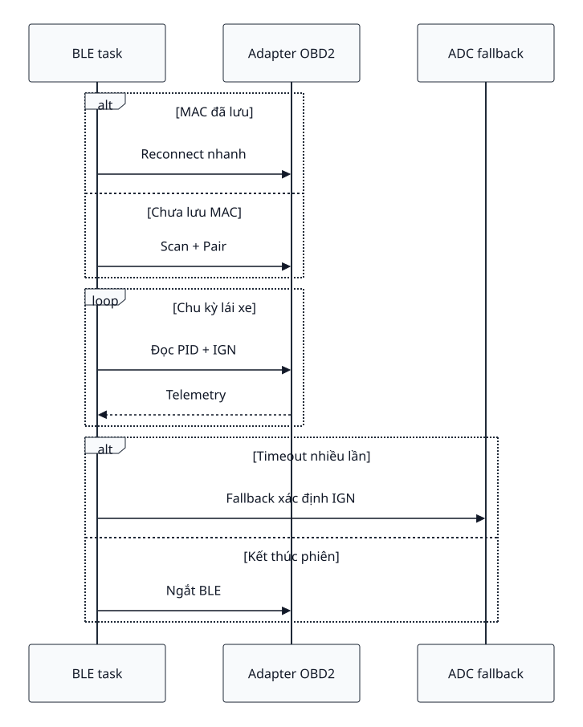

_Hình 3.8: Luồng kết nối và đọc dữ liệu BLE OBD2 trong firmware_

Trong các nhóm trên, quản lý nguồn là chức năng có ảnh hưởng lớn nhất tới độ ổn
định của thiết bị. Firmware theo dõi điện áp nguồn xe và pin dự phòng thông qua
ADC, từ đó quyết định thiết bị có thể tiếp tục truyền dữ liệu, chuyển sang chế
độ ngủ hay ngắt các tải tiêu thụ lớn như modem. Cơ chế này kết hợp với kiến
trúc nguồn đã chọn ở Mục 3.2 để giảm nguy cơ reset khi modem phát dòng xung và
hạn chế việc rút sâu ắc quy xe.

Cơ chế lưu tạm khi mất mạng cũng cần thiết cho môi trường xe thực tế. Trong quá
trình di chuyển, xe có thể đi qua khu vực sóng yếu hoặc modem mất phiên truyền
dữ liệu. Khi đó, các bản tin quan trọng được giữ tạm trong thẻ nhớ microSD và gửi lại sau khi kết nối
khôi phục. Thiết kế này không làm mất hoàn toàn dữ liệu trong các khoảng gián
đoạn ngắn, đồng thời không buộc thiết bị phải giữ modem ở trạng thái công suất
cao liên tục.

### 3.3.4. Kết luận lựa chọn firmware

Giải pháp firmware được chốt gồm ESP-IDF, FreeRTOS, máy trạng thái trung tâm,
các tác vụ nền cho BLE/modem và các cơ chế hỗ trợ gồm lưu cấu hình, OTA, ngủ sâu
và lưu tạm bản tin. Cấu hình này đáp ứng các yêu cầu đã đặt ra ở Chương 2: điều
phối nhiều ngoại vi, quản lý nguồn theo trạng thái xe, phục hồi sau gián đoạn
mạng và có khả năng bảo trì khi thiết bị đã lắp trên xe. Đây cũng là cơ sở để
triển khai các luồng chương trình, sơ đồ đấu nối và bài đo kiểm trong giai đoạn
hiện thực nguyên mẫu.

## 3.4. Đề xuất và lựa chọn giải pháp kết nối giữa thiết bị và máy chủ

Trên cơ sở phương án phần cứng và firmware đã lựa chọn, hệ thống cần một kênh truyền dữ liệu ổn định giữa thiết bị và máy chủ. Dữ liệu của thiết bị theo dõi phương tiện có ba đặc điểm chính: bản tin nhỏ, phát sinh lặp lại theo chu kỳ và có một số sự kiện cần ưu tiên như mất nguồn, rung động bất thường hoặc vượt vùng giám sát. Ngoài chiều gửi dữ liệu lên, thiết bị còn phải nhận cấu hình từ máy chủ như chu kỳ gửi dữ liệu, ngưỡng cảnh báo hoặc lệnh cập nhật firmware.

Do đó, giao thức truyền dữ liệu không thể chỉ chọn theo mức độ phổ biến. Phương án phù hợp phải đáp ứng được kiểu dữ liệu đo từ xa (telemetry), tức các bản tin đo đạc do thiết bị gửi về, làm việc được trên mạng di động và không tạo gánh nặng xử lý quá lớn cho ESP32-S3. Trong phạm vi đồ án, ba hướng được xem xét là HTTP/REST, MQTT và TCP socket tự xây dựng.

### 3.4.1. So sánh giao thức truyền dữ liệu thiết bị - máy chủ

HTTP/REST là mô hình giao tiếp theo kiểu yêu cầu - phản hồi: một phía gửi yêu cầu, phía còn lại trả kết quả. Cách này phù hợp với các thao tác của người dùng như đăng nhập, xem lịch sử hoặc thay đổi cấu hình trên giao diện web. Tuy nhiên, nếu thiết bị dùng HTTP/REST cho từng bản tin định kỳ, mỗi lần gửi đều phải lặp lại phần tiêu đề bản tin và phản hồi, trong khi phần dữ liệu thật chỉ gồm vài trường như tọa độ, tốc độ, điện áp hoặc trạng thái kết nối.

MQTT là giao thức truyền bản tin nhẹ thường dùng cho thiết bị IoT. Thiết bị không gửi dữ liệu trực tiếp tới từng khối xử lý, mà gửi bản tin lên MQTT broker, tức máy chủ trung gian nhận và phân phối bản tin. Các thành phần phía sau chỉ cần đăng ký nhận đúng nhóm bản tin cần xử lý. Cách tổ chức này phù hợp với hệ thống có nhiều xe gửi dữ liệu liên tục, vì thiết bị chỉ phải duy trì một đường kết nối chính tới broker.

TCP socket tự xây dựng là phương án dùng kết nối TCP thuần rồi tự định nghĩa khuôn dạng bản tin. Phương án này linh hoạt nhưng làm tăng khối lượng thiết kế: đồ án phải tự xử lý đóng khung dữ liệu, xác nhận nhận bản tin, gửi lại khi lỗi, bảo mật và khôi phục kết nối. Với phạm vi nguyên mẫu, mức phức tạp đó không đem lại lợi ích tương xứng.

**Bảng 3.19: So sánh giao thức truyền dữ liệu thiết bị - máy chủ**

| Tiêu chí                                        | HTTP/REST                                                                                          | MQTT                                                                                           | TCP socket tự xây dựng                                   |
| ------------------------------------------------- | -------------------------------------------------------------------------------------------------- | ---------------------------------------------------------------------------------------------- | ----------------------------------------------------------- |
| Mô hình truyền                                 | Yêu cầu - phản hồi (request/response), mỗi lần gửi phải mở chu kỳ yêu cầu - phản hồi | Xuất bản - đăng ký nhận (publish/subscribe) qua broker                                   | Kết nối TCP thuần, tự định nghĩa giao thức          |
| Chi phí phụ trợ cho bản tin nhỏ gửi chu kỳ | Cao hơn do lặp phần đầu bản tin HTTP và phản hồi                                          | Thấp hơn, phù hợp bản tin ngắn                                                           | Phụ thuộc hoàn toàn vào khuôn dạng tự thiết kế    |
| Kênh lệnh ngược từ máy chủ về thiết bị  | Cần polling hoặc kênh phụ                                                                      | Có thể subscribe topic lệnh `commands`                                                    | Phải tự xây dựng cơ chế điều khiển                 |
| Mức tin cậy của bản tin                       | Do ứng dụng tự xử lý                                                                          | Có QoS 0/1 theo loại bản tin                                                                | Do ứng dụng tự xử lý                                   |
| Khôi phục khi mạng 4G dao động               | Làm được nhưng không tối ưu cho luồng gửi liên tục                                     | Phù hợp hơn nhờ phiên liên lạc và cơ chế kết nối lại giữa thiết bị với broker | Phải tự viết kết nối lại, gửi lại và chống trùng |
| Cách phân loại dữ liệu                       | Qua điểm cuối API                                                                               | Qua chủ đề bản tin (topic)                                                                 | Tự định nghĩa                                           |
| Vai trò phù hợp trong hệ thống               | Kênh quản trị và truy vấn của người dùng                                                  | Phương án chốt cho thiết bị - máy chủ                                                  | Không ưu tiên trong nguyên mẫu                         |

Từ so sánh trên, MQTT được chọn cho kênh thiết bị - máy chủ. HTTP/REST vẫn được sử dụng ở phần frontend (giao diện web) và backend (khối xử lý nghiệp vụ phía máy chủ) để phục vụ các thao tác của người vận hành. Như vậy, mỗi giao thức đảm nhiệm một phần việc rõ ràng: MQTT phục vụ bản tin từ thiết bị, còn HTTP/REST phục vụ truy vấn và thao tác quản lý.

### 3.4.2. Tổ chức luồng bản tin được chọn

Hệ thống sử dụng MQTT 3.1.1 qua mạng 4G/LTE. Trong mô hình MQTT, broker là thành phần trung gian nhận kết nối từ thiết bị, duy trì phiên liên lạc và phân phối bản tin theo topic. Thiết bị gửi dữ liệu theo các topic, tức các kênh bản tin có tên riêng cho từng nhóm dữ liệu. Nhờ đó, vị trí, trạng thái, cảnh báo và lệnh điều khiển không bị trộn lẫn trong cùng một luồng xử lý.

Sau broker MQTT, một dịch vụ trung gian đọc các topic cần thiết, kiểm tra cấu trúc bản tin, chuẩn hóa trường dữ liệu và đưa dữ liệu vào nơi lưu trữ phù hợp. Dịch vụ này được đặt tên là MQTT Bridge; chữ "bridge" ở đây thể hiện vai trò cầu nối giữa đường bản tin MQTT và phần xử lý dữ liệu phía máy chủ.

**Bảng 3.20: Nhóm topic và QoS được chọn**

| Nhóm topic                 | Hướng truyền         | QoS | Nội dung chính                                                                  | Lý do chọn                                                                         |
| --------------------------- | ----------------------- | --- | --------------------------------------------------------------------------------- | ------------------------------------------------------------------------------------ |
| `v1/{device_id}/rawdata`  | Thiết bị -> máy chủ | 0   | Tọa độ, tốc độ, điện áp, trạng thái khóa điện, mẫu OBD2 tức thời | Tần suất cao, chấp nhận mất lẻ tẻ để giảm tải đường truyền            |
| `v1/{device_id}/status`   | Thiết bị -> máy chủ | 1   | Trạng thái thiết bị, phiên hoạt động, bản tin duy trì kết nối         | Cần hạn chế mất bản tin vì dùng để xác định thiết bị còn hoạt động |
| `v1/{device_id}/events`   | Thiết bị -> máy chủ | 1   | Cảnh báo mất nguồn, rung động bất thường, vượt vùng, lỗi thiết bị  | Sự kiện quan trọng cần được ghi nhận ít nhất một lần                     |
| `v1/{device_id}/firmware` | Thiết bị -> máy chủ | 1   | Trạng thái cập nhật firmware từ xa                                           | Cần truy vết đầy đủ quá trình cập nhật                                     |
| `v1/{device_id}/commands` | Máy chủ -> thiết bị | 1   | Cấu hình chu kỳ gửi, ngưỡng cảnh báo, lệnh cập nhật firmware           | Cần thiết bị nhận được lệnh hoặc có cơ chế gửi lại                     |

Trong MQTT, QoS (Quality of Service) là mức cam kết chuyển bản tin giữa bên gửi và bên nhận. QoS 0 tương ứng với cơ chế gửi tối đa một lần, không yêu cầu broker gửi lại nếu bản tin thất lạc; cách này giảm tải đường truyền và phù hợp với dữ liệu tần suất cao. QoS 1 tương ứng với cơ chế gửi ít nhất một lần, nghĩa là broker sẽ yêu cầu xác nhận và có thể gửi lại khi cần; đổi lại, bên nhận phải chấp nhận khả năng bản tin bị lặp. Vì vậy, QoS 0 được dùng cho dữ liệu gửi dày như vị trí hoặc mẫu OBD2 tức thời, do việc mất một vài bản tin riêng lẻ không làm mất toàn bộ hành trình. QoS 1 được dùng cho trạng thái, cảnh báo và lệnh điều khiển vì các bản tin này cần được ghi nhận ít nhất một lần. Ở phía trình duyệt, dữ liệu mới được đẩy lên giao diện bằng WebSocket/Socket.IO, tức kênh cập nhật hai chiều giúp màn hình thay đổi mà không cần người dùng tải lại trang.

## 3.5. Đề xuất và lựa chọn giải pháp phía máy chủ

Trên cơ sở giao thức MQTT đã chọn ở Mục 3.4, phần phía máy chủ cần được tổ chức
thành một chuỗi xử lý rõ ràng từ lúc bản tin rời thiết bị đến khi thông tin
xuất hiện trên giao diện. Ở tầng này, nếu
gom mọi chức năng vào một khối duy nhất thì nguyên mẫu có thể dựng nhanh nhưng
khó xác định lỗi. Ngược lại, nếu chia quá vụn, báo cáo sẽ lệch sang một kiến
trúc phần mềm quá nặng so với phạm vi của đồ án. Vì vậy, phần này được trình
bày theo cùng cách tiếp cận như phần chọn phần cứng: nêu bài toán của từng lớp,
so sánh các phương án, rồi chốt giải pháp phù hợp nhất.

Trong phạm vi đồ án, phần phía máy chủ được định hướng triển khai trên máy chủ
riêng ảo đám mây (cloud VPS), tức một máy chủ ảo thuê từ nhà cung cấp hạ tầng
đám mây nhưng người thực hiện tự cài đặt, cấu hình và vận hành các dịch vụ bên
trên. Vì vậy, các lựa chọn trong Mục 3.5 được đánh giá theo hướng tự triển khai
gọn trên cloud VPS, không theo hướng phụ thuộc hoàn toàn vào các dịch vụ đám mây
do nhà cung cấp quản lý sẵn.

### 3.5.1. Lựa chọn mô hình tổ chức hạ tầng máy chủ

Máy chủ của hệ thống phải làm bốn việc cùng lúc: nhận bản tin từ thiết bị, phân
luồng dữ liệu tới nơi lưu trữ phù hợp, phục vụ nghiệp vụ quản lý, và cung cấp
thông tin cho giao diện người dùng. Từ yêu cầu đó, ba hướng tổ chức chính được
cân nhắc là: gom toàn bộ vào một ứng dụng duy nhất; sử dụng một nền tảng thương
mại đóng; hoặc chia hệ thống thành các dịch vụ tự quản theo từng vai trò, tức
một kiến trúc vi dịch vụ (microservices) ở mức vừa đủ cho đồ án.

Do hạ tầng được đặt trên cloud VPS với tài nguyên hữu hạn, mô hình tổ chức được
chọn không chỉ cần rõ ranh giới kỹ thuật mà còn phải tránh tạo ra thêm nhiều lớp
quản trị vượt quá nhu cầu của nguyên mẫu.

**Bảng 3.21: So sánh phương án tổ chức hạ tầng máy chủ**

| Tiêu chí                                         | Một ứng dụng duy nhất                                    | Nền tảng thương mại đóng                                            | Các dịch vụ tự quản theo vai trò                           |
| -------------------------------------------------- | ------------------------------------------------------------ | -------------------------------------------------------------------------- | ---------------------------------------------------------------- |
| Đơn vị triển khai chính                       | 1 tiến trình hoặc 1 khối ứng dụng lớn                 | Theo cấu trúc do nhà cung cấp quyết định                            | Mỗi vai trò là một dịch vụ riêng                          |
| Cách tách broker, lưu trữ, API và giao diện  | Chung trong một khối                                       | Phụ thuộc nền tảng                                                     | Tách thành các dịch vụ độc lập                           |
| Phạm vi ảnh hưởng khi một lớp gặp lỗi      | Dễ lan sang toàn bộ ứng dụng                            | Phụ thuộc cách đóng gói của nhà cung cấp                          | Chủ yếu khu trú trong dịch vụ liên quan                    |
| Khả năng mở rộng từng phần                   | Khó tách mở rộng riêng                                  | Có nhưng gắn với gói dịch vụ                                        | Có thể mở rộng theo từng khối                              |
| Mức phù hợp khi tự triển khai trên cloud VPS | Dễ làm lúc đầu nhưng khó giữ ranh giới dịch vụ    | Thấp do phụ thuộc nền tảng của nhà cung cấp                        | Phù hợp vì vừa tách lớp vừa giữ được quyền tự quản |
| Tự chủ dữ liệu và cấu hình                  | Cao                                                          | Thấp hơn do phụ thuộc nền tảng                                       | Cao                                                              |
| Kết luận chọn                                   | Dùng được nhưng khó trình bày ranh giới kiến trúc | Có giá trị tham khảo nhưng không phù hợp mục tiêu tự thiết kế | Phương án chốt                                               |

Từ so sánh trên, phương án chia thành các dịch vụ tự quản theo vai trò được
chọn vì phù hợp hơn với mục tiêu kiểm chứng toàn tuyến. Với cấu trúc này, lỗi
có thể được khoanh vùng theo từng đoạn: thiết bị không gửi, broker không nhận,
tầng tiếp nhận không ghi dữ liệu, backend không trả kết quả hoặc frontend không
cập nhật. Trong phương án này, cloud VPS chỉ đóng vai trò hạ tầng đặt dịch vụ,
còn kiến trúc vi dịch vụ là cách phân chia và phối hợp các khối phần mềm chạy
trên hạ tầng đó.

**Bảng 3.22: Các lớp dịch vụ được dùng trong thiết kế phía máy chủ**

| Lớp dịch vụ                               | Vai trò chính                                                                                              | Ý nghĩa trong kiến trúc                                   |
| -------------------------------------------- | ------------------------------------------------------------------------------------------------------------ | ------------------------------------------------------------- |
| MQTT broker                                  | Nhận kết nối MQTT từ thiết bị và phân phối bản tin theo topic                                      | Tách riêng lớp giao tiếp thời gian thực với thiết bị |
| Tầng tiếp nhận và phân luồng dữ liệu | Kiểm tra nội dung bản tin, chuẩn hóa và chuyển dữ liệu tới các lớp lưu trữ                     | Giữ tầng tiếp nhận dữ liệu tách khỏi lớp nghiệp vụ |
| Lớp lưu trữ dữ liệu                     | Lưu dữ liệu nghiệp vụ, dữ liệu đo từ xa (telemetry) và nhật ký theo đúng mục đích sử dụng | Tránh trộn lẫn các loại dữ liệu khác bản chất       |
| Backend                                      | Xử lý nghiệp vụ, cung cấp API và gửi lệnh điều khiển ngược                                      | Tập trung logic ứng dụng ở một khối riêng              |
| Frontend                                     | Hiển thị bản đồ, trạng thái, cảnh báo và lịch sử cho người vận hành                          | Tách lớp giao diện khỏi xử lý máy chủ                 |
| Quan sát vận hành                         | Theo dõi trạng thái dịch vụ, tải hệ thống và lỗi                                                   | Hỗ trợ đo kiểm và truy vết khi tích hợp               |
| Đóng gói triển khai                      | Đóng gói các dịch vụ thành các đơn vị chạy độc lập                                            | Giữ môi trường triển khai lặp lại ổn định           |

### 3.5.2. Lựa chọn MQTT broker

Khi đã chốt MQTT là giao thức đường thiết bị - máy chủ, hệ thống cần một broker
đủ ổn định để tiếp nhận kết nối từ nhiều thiết bị, hỗ trợ phân quyền theo từng
thiết bị và vẫn nằm trong mức triển khai phù hợp với nguyên mẫu. Ba hướng được
cân nhắc là Mosquitto, EMQX và nhóm broker thiên về triển khai lớn như
HiveMQ/VerneMQ.

**Bảng 3.23: So sánh phương án MQTT broker**

| Tiêu chí                                                                                                        | Mosquitto                                                | EMQX                                                                    | HiveMQ/VerneMQ                              |
| ----------------------------------------------------------------------------------------------------------------- | -------------------------------------------------------- | ----------------------------------------------------------------------- | ------------------------------------------- |
| Giao diện quản trị kết nối và phiên thiết bị                                                             | Thường tối giản hoặc cần công cụ ngoài          | Có bảng điều khiển quản trị sẵn                                 | Có nhưng thiên về triển khai lớn      |
| Xác thực và danh sách điều khiển truy cập (Access Control List - ACL) theo thiết bị, chủ đề bản tin | Có nhưng thường cấu hình thủ công hơn           | Có sẵn cơ chế người dùng, phân quyền và ACL thuận tiện hơn | Có, nhưng vượt nhu cầu nguyên mẫu    |
| Giao thức truy cập cho MQTT, TLS và WebSocket                                                                  | Đủ cho MQTT cơ bản                                   | Đầy đủ cho MQTT/TLS/WS/WSS trong cùng broker                       | Đầy đủ nhưng thiên về hệ lớn       |
| Khả năng mở rộng sang bộ luật xử lý và tích hợp IoT                                                    | Mức cơ bản                                            | Có sẵn và thuận lợi hơn khi tích hợp IoT                        | Mạnh nhưng nặng hơn                     |
| Khả năng tự triển khai một nút để đo kiểm                                                               | Gọn cho hệ rất nhỏ                                   | Cân bằng giữa tính năng và độ gọn                              | Dùng được nhưng thừa cho nguyên mẫu |
| Kết luận chọn                                                                                                  | Dùng được nhưng thiếu lớp quản trị thuận tiện | Phương án chốt                                                      | Quá nặng so với phạm vi đồ án        |

Từ so sánh trên, EMQX được chọn vì giữ được thế cân bằng giữa tính năng và mức triển khai. So với
Mosquitto, EMQX thuận lợi hơn khi cần phân quyền bằng danh sách điều khiển truy cập
(Access Control List - ACL) theo từng thiết bị và chủ đề bản tin, theo dõi kết nối qua bảng điều khiển quản trị
và giữ sẵn các giao diện MQTT, MQTT qua TLS và WebSocket trong cùng một broker. So với HiveMQ
hoặc VerneMQ, EMQX vẫn giữ mức tự triển khai hợp lý hơn cho một nguyên mẫu phục
vụ đo kiểm [32].

**Bảng 3.24: Đặc điểm EMQX được dùng trong thiết kế**

| Mục cấu hình                           | Phương án chốt                                                  | Ý nghĩa trong thiết kế                                                    |
| ----------------------------------------- | ------------------------------------------------------------------- | ----------------------------------------------------------------------------- |
| Mô hình chạy                           | Một nút broker                                                    | Đủ cho quy mô nguyên mẫu và đơn giản khi tích hợp                  |
| Giao diện truy cập chính               | MQTT thường, MQTT bảo mật và cổng quản trị web              | Phục vụ kết nối thiết bị, dự phòng bảo mật và quan sát vận hành |
| Kiểm soát truy cập                     | Tài khoản và ACL theo từng thiết bị                           | Hạn chế thiết bị gửi sai chủ đề bản tin                              |
| Vai trò bộ luật xử lý (Rules Engine) | Chỉ dùng cho lọc hoặc chuyển tiếp đơn giản                 | Không dồn nghiệp vụ chính vào broker                                    |
| Cây chủ đề bản tin chính            | Phân tách theo mã thiết bị và nhóm dữ liệu như Mục 3.4.2 | Giữ quy ước đường bản tin thống nhất với firmware                   |

### 3.5.3. Lựa chọn lớp lưu trữ và quan sát vận hành

Sau khi xác định MQTT broker, bước tiếp theo là lựa chọn đích lưu trữ cho từng
nhóm dữ liệu. Nếu chưa xác định rõ nơi lưu, lớp tiếp nhận dữ liệu cũng chưa thể
kiểm tra nội dung bản tin, tách luồng hay ghi dữ liệu theo đúng mục đích sử
dụng. Dữ liệu của hệ thống gồm ba nhóm chính: dữ liệu nghiệp vụ, dữ liệu đo từ
xa (telemetry) theo thời gian và nhật ký cùng thông tin quan sát vận hành. Vì
vậy, phần này lần lượt lựa chọn giải pháp lưu trữ cho từng nhóm.

**a) Lựa chọn cơ sở dữ liệu nghiệp vụ**

Dữ liệu nghiệp vụ của hệ thống gồm người dùng, xe, thiết bị, cấu hình, vùng
giám sát và cảnh báo. Nhóm dữ liệu này cần quan hệ rõ giữa nhiều bảng, cần giữ
tính nhất quán khi cập nhật và cần hỗ trợ truy vấn không gian để kiểm tra xe có
đi vào hoặc ra khỏi vùng giám sát hay không. Từ yêu cầu đó, ba hướng được cân
nhắc là MySQL/MariaDB, MongoDB và PostgreSQL kết hợp phần mở rộng không gian
PostGIS.

**Bảng 3.25: So sánh phương án cơ sở dữ liệu nghiệp vụ**

| Tiêu chí                                                   | MySQL/MariaDB                  | MongoDB                                                                                                 | PostgreSQL + PostGIS                              |
| ------------------------------------------------------------ | ------------------------------ | ------------------------------------------------------------------------------------------------------- | ------------------------------------------------- |
| Mô hình dữ liệu mặc định                              | Quan hệ                       | Tài liệu                                                                                              | Quan hệ + không gian                            |
| Khóa ngoại và giao dịch nhiều bảng                     | Có sẵn                       | Không phải cơ chế mạnh nhất, thường bù ở tầng ứng dụng                                     | Có sẵn                                          |
| Kiểu dữ liệu vị trí và hàm vùng giám sát           | Có kiểu không gian cơ bản | Có thể lưu GeoJSON nhưng kiểm tra vùng giám sát (geofence) thường phải đẩy lên ứng dụng | Có PostGIS và các hàm không gian trực tiếp |
| Mô hình hóa quan hệ xe - thiết bị - cảnh báo - vùng | Tự nhiên                     | Khi quan hệ tăng dễ phát sinh lặp dữ liệu                                                        | Tự nhiên                                        |
| Kết luận chọn                                             | Dùng được                  | Dùng được nhưng không tối ưu cho kiểm tra vùng giám sát                                     | Phương án chốt                                |

Từ so sánh trên, PostgreSQL kết hợp PostGIS được chọn cho dữ liệu nghiệp vụ.
Điểm quyết định không chỉ nằm ở khả năng lưu dữ liệu quan hệ, mà ở việc hệ
thống cần xử lý cả vị trí và vùng giám sát trong cùng một lớp dữ liệu. PostGIS
là phần mở rộng cho phép PostgreSQL làm việc với dữ liệu không gian, nhờ đó dữ
liệu xe, vùng giám sát và kết quả kiểm tra vị trí có thể được giữ trong cùng
một nền tảng.

**Bảng 3.26: Cấu hình cơ sở dữ liệu nghiệp vụ được chọn**

| Thành phần                     | Phương án chốt                                                | Vai trò trong hệ thống                                          |
| -------------------------------- | ----------------------------------------------------------------- | ------------------------------------------------------------------ |
| Hệ quản trị cơ sở dữ liệu | PostgreSQL                                                        | Lưu dữ liệu quản lý có quan hệ rõ                          |
| Phần mở rộng không gian      | PostGIS                                                           | Hỗ trợ truy vấn vị trí, vùng giám sát và bản đồ        |
| Nhóm dữ liệu chính           | Người dùng, xe, thiết bị, cấu hình, cảnh báo             | Tạo lớp dữ liệu nghiệp vụ thống nhất                       |
| Ý nghĩa trong thiết kế       | Một nền tảng cho cả dữ liệu quan hệ và dữ liệu vị trí | Giảm tách rời giữa quản lý xe và kiểm tra vùng giám sát |

**b) Lựa chọn cơ sở dữ liệu đo từ xa (telemetry) theo thời gian**

Dữ liệu đo từ xa (telemetry) phát sinh liên tục từ thiết bị gồm vị trí, tốc độ, điện áp, trạng
thái nguồn, trạng thái kết nối và một phần dữ liệu OBD2. Nhóm dữ liệu này cần
ghi liên tục với số lượng lớn hơn dữ liệu nghiệp vụ, sau đó phục vụ biểu đồ và
truy vấn lịch sử theo thời gian. Vì vậy, ba hướng được cân nhắc là TimescaleDB,
InfluxDB và VictoriaMetrics.

**Bảng 3.27: So sánh phương án cơ sở dữ liệu đo từ xa (telemetry) theo thời gian**

| Tiêu chí                                                                           | TimescaleDB                                                         | InfluxDB                                                        | VictoriaMetrics                                                                   |
| ------------------------------------------------------------------------------------ | ------------------------------------------------------------------- | --------------------------------------------------------------- | --------------------------------------------------------------------------------- |
| Mô hình nền tảng                                                                 | Phần mở rộng trên PostgreSQL, truy vấn bằng SQL               | Cơ sở dữ liệu chuỗi thời gian riêng, dùng Flux/InfluxQL | Cơ sở dữ liệu chuỗi thời gian riêng, dùng MetricsQL tương thích PromQL |
| Mức tách tải ghi khỏi cơ sở dữ liệu nghiệp vụ                              | Chưa tách hẳn vì vẫn phụ thuộc cụm PostgreSQL               | Tách riêng                                                    | Tách riêng                                                                      |
| Khả năng ghi liên tục các mẫu vị trí, tốc độ, điện áp và trạng thái | Làm được nhưng cần tối ưu partition và index ở PostgreSQL | Thiết kế riêng cho dữ liệu chuỗi thời gian               | Thiết kế riêng cho dữ liệu chuỗi thời gian                                 |
| Thuận lợi khi tổ chức chỉ số theo thiết bị và theo khoảng thời gian       | Làm được                                                        | Làm được                                                    | Thuận lợi, phù hợp cách hiển thị biểu đồ trên Grafana                  |
| Mức gọn khi tự triển khai một nút trên cloud VPS                              | Vẫn phải chia sẻ tài nguyên với PostgreSQL nghiệp vụ        | Trung bình đến cao                                           | Gọn hơn, phù hợp nguyên mẫu                                                 |
| Kết luận chọn                                                                     | Dùng được nhưng chưa tách hẳn tải ghi                      | Dùng được                                                   | Phương án chốt                                                                |

Từ so sánh trên, VictoriaMetrics được chọn cho dữ liệu đo từ xa (telemetry) theo thời gian. So
với TimescaleDB, phương án này giữ ranh giới rõ hơn giữa dữ liệu nghiệp vụ và
dữ liệu đo từ xa (telemetry). So với InfluxDB, VictoriaMetrics phù hợp hơn với mục tiêu tự
triển khai gọn, đồng thời vẫn đáp ứng nhu cầu ghi dữ liệu liên tục và truy vấn
theo chuỗi thời gian để vẽ biểu đồ, xem lịch sử và theo dõi xu hướng.

**Bảng 3.28: Cấu hình cơ sở dữ liệu đo từ xa (telemetry) được chọn**

| Thành phần                     | Phương án chốt                                                                                                   | Vai trò trong hệ thống                             |
| -------------------------------- | -------------------------------------------------------------------------------------------------------------------- | ----------------------------------------------------- |
| Hệ quản trị cơ sở dữ liệu | VictoriaMetrics                                                                                                      | Lưu dữ liệu đo từ xa (telemetry) theo thời gian |
| Nhóm dữ liệu chính           | Vị trí, tốc độ, điện áp, trạng thái nguồn, trạng thái kết nối, dữ liệu OBD2 dạng chuỗi thời gian | Phục vụ biểu đồ và lịch sử                    |
| Kiểu khai thác chính          | Truy vấn theo khoảng thời gian, theo xe và theo chỉ số                                                         | Hỗ trợ giao diện và giám sát vận hành         |
| Ý nghĩa trong thiết kế       | Tách tải ghi dữ liệu đo từ xa (telemetry) khỏi lớp dữ liệu nghiệp vụ                                     | Giữ hiệu năng ổn định khi số bản tin tăng    |

**c) Lựa chọn hệ thống nhật ký và quan sát vận hành**

Ngoài dữ liệu nghiệp vụ và dữ liệu đo từ xa (telemetry), hệ thống còn cần một lớp ghi nhật ký
để truy vết lỗi và một lớp quan sát vận hành để theo dõi trạng thái dịch vụ.
Nếu chỉ nhìn dữ liệu cuối trên giao diện thì khó xác định lỗi đang nằm ở broker,
MQTT Bridge, backend hay frontend. Từ yêu cầu đó, ba hướng được cân nhắc là
giữ nhật ký rời theo từng dịch vụ, dùng một bộ ELK đầy đủ, hoặc dùng VictoriaLogs
kết hợp Grafana.

**Bảng 3.29: So sánh phương án nhật ký và quan sát vận hành**

| Tiêu chí                                                                            | Nhật ký rời theo từng dịch vụ                 | ELK đầy đủ                              | VictoriaLogs + Grafana                  |
| ------------------------------------------------------------------------------------- | --------------------------------------------------- | ------------------------------------------- | --------------------------------------- |
| Thành phần chính khi triển khai                                                   | Tệp nhật ký hoặc nhật ký container riêng lẻ | Elasticsearch + Logstash + Kibana           | VictoriaLogs + Grafana                  |
| Khả năng gom nhật ký từ broker, MQTT Bridge, backend và frontend                | Phải mở từng dịch vụ để đối chiếu         | Gom tập trung qua chuỗi xử lý nhật ký | Gom tập trung vào một nơi lưu      |
| Khả năng lọc theo dịch vụ, thiết bị và mốc thời gian                        | Thủ công, khó đối chiếu                       | Có giao diện tìm kiếm tập trung        | Có giao diện tìm kiếm tập trung    |
| Khả năng đặt nhật ký cạnh các chỉ số vận hành trên cùng bảng theo dõi | Phải dùng công cụ tách rời                    | Làm được                                | Làm được                            |
| Công triển khai trên cloud VPS                                                     | Thấp nhưng thiếu tính tập trung                | Cao do nhiều thành phần hơn             | Gọn hơn ELK và đủ cho nguyên mẫu |
| Kết luận chọn                                                                      | Chỉ đủ cho giai đoạn rất nhỏ                 | Dùng được nhưng nặng                  | Phương án chốt                      |

Từ so sánh trên, VictoriaLogs kết hợp Grafana được chọn cho nhật ký và quan sát
vận hành. Nhật ký rời theo từng dịch vụ không đủ khi cần truy vết lỗi xuyên qua
nhiều lớp. ELK có khả năng mạnh nhưng vượt quá mức cần thiết của nguyên mẫu.
VictoriaLogs giữ được ưu điểm của nhật ký tập trung trong khi nhẹ hơn khi tự
triển khai, còn Grafana cho phép gom việc quan sát chỉ số và nhật ký vào một
nơi.

**Bảng 3.30: Thành phần nhật ký và quan sát vận hành được chọn**

| Thành phần           | Dữ liệu hoặc nhóm theo dõi chính                                                                                                | Vai trò trong hệ thống                                      |
| ---------------------- | ------------------------------------------------------------------------------------------------------------------------------------- | -------------------------------------------------------------- |
| VictoriaLogs           | Nhật ký thiết bị, nhật ký nhận bản tin, lỗi dịch vụ, nhật ký OTA                                                         | Truy vết khi hệ thống hoạt động không đúng mong muốn |
| Grafana                | Chỉ số và bảng theo dõi của EMQX, MQTT Bridge, backend, cơ sở dữ liệu và giao diện web                                    | Tập trung quan sát vận hành khi thử nghiệm               |
| Nhóm theo dõi chính | Số thiết bị kết nối, số bản tin nhận được, lỗi xác thực, lỗi ghi dữ liệu, độ trễ phản hồi, lỗi tải giao diện | Khoanh vùng lỗi theo từng lớp                              |

### 3.5.4. Lựa chọn MQTT Bridge

Khi đích lưu trữ cho từng loại dữ liệu đã được xác định, hệ thống cần một lớp
tiếp nhận để kiểm tra cấu trúc nội dung bản tin, chuẩn hóa dữ liệu và ghi về
đúng nơi đã chọn. Có ba cách tổ chức thường gặp. Cách thứ nhất là để backend
đăng ký nhận trực tiếp các chủ đề bản tin MQTT. Cách thứ hai là dùng bộ luật xử lý (Rules
Engine) tại broker như tuyến xử lý chính. Cách thứ ba là tách riêng một dịch vụ
tiếp nhận dữ liệu độc lập giữa broker và các lớp lưu trữ phía sau; trong đồ án,
dịch vụ đó được gọi là MQTT Bridge.

**Bảng 3.31: So sánh phương án tổ chức tầng tiếp nhận dữ liệu**

| Tiêu chí                                                       | Backend đăng ký nhận trực tiếp                    | Bộ luật xử lý tại broker            | MQTT Bridge độc lập                                 |
| ---------------------------------------------------------------- | ------------------------------------------------------- | ---------------------------------------- | ------------------------------------------------------ |
| Nơi đặt logic kiểm tra nội dung bản tin trước khi ghi    | Nằm trong backend                                      | Nằm trong bộ luật xử lý của broker | Nằm trong dịch vụ tiếp nhận riêng                |
| Số đích lưu trữ có thể ghi trong cùng luồng tiếp nhận | Làm được nhưng kéo logic tiếp nhận vào backend | Hạn chế hơn                           | Thuận lợi: PostgreSQL, VictoriaMetrics, VictoriaLogs |
| Kênh phát sự kiện nội bộ cho backend và giao diện        | Gắn trực tiếp với backend                           | Phụ thuộc cấu hình broker            | Có luồng sự kiện nội bộ riêng                   |
| Mức phụ thuộc giữa tầng tiếp nhận và lớp còn lại      | Gắn chặt với backend                                 | Gắn chặt với broker                   | Tách được cả hai phía                            |
| Điểm khoanh vùng lỗi khi bản tin sai cấu trúc             | Khó tách khỏi lỗi API                               | Phù hợp xử lý lọc đơn giản       | Tách rõ ở tầng MQTT Bridge                         |
| Kết luận chọn                                                 | Dùng được nhưng không tối ưu                    | Chỉ hợp cho xử lý nhẹ               | Phương án chốt                                     |

Từ so sánh trên, MQTT Bridge được chọn vì đây là cách tổ chức giữ đường tiếp
nhận dữ liệu gọn nhất mà vẫn tách được trách nhiệm của từng lớp. Nếu để backend
đăng ký nhận trực tiếp, lớp nghiệp vụ phải gánh thêm tải tiếp nhận dữ liệu đo từ xa (telemetry).
Nếu đẩy phần lớn xử lý vào broker, phần logic sẽ bị gắn quá chặt với cấu hình
của broker. Tách riêng một dịch vụ MQTT Bridge giúp luồng dữ liệu rõ hơn và dễ
kiểm thử hơn.

Khi đã xác định cần một MQTT Bridge độc lập, bước tiếp theo là chọn công nghệ
cài đặt cho dịch vụ này. Dịch vụ cần nhận các nhóm bản tin đã chốt ở Mục
3.4.2, kiểm tra cấu trúc JSON, ghi đồng thời về cơ sở dữ liệu quan hệ, cơ sở
dữ liệu chuỗi thời gian, hệ thống nhật ký tập trung và phát tiếp sự kiện nội bộ cho
backend. Ba hướng được cân nhắc là Node.js + TypeScript, Python bất đồng bộ và
Go.

**Bảng 3.32: So sánh công nghệ triển khai MQTT Bridge**

| Tiêu chí                                                             | Node.js + TypeScript                                                             | Python bất đồng bộ                                         | Go                                                                  |
| ---------------------------------------------------------------------- | -------------------------------------------------------------------------------- | -------------------------------------------------------------- | ------------------------------------------------------------------- |
| Mức dùng chung hệ sinh thái với backend hiện có                 | Cùng Node.js/TypeScript, thuận lợi chia sẻ quy ước dữ liệu               | Khác hệ sinh thái, phải tách mô hình dữ liệu          | Khác hệ sinh thái, phải duy trì mô hình dữ liệu riêng     |
| Kiểm tra lược đồ JSON và chuẩn hóa bản tin                    | Thuận lợi với hệ thư viện MQTT và kiểm tra dữ liệu của hệ TypeScript | Làm được nhưng phải ghép thêm lớp kiểm tra rõ ràng | Làm được nhưng thường phải tổ chức thủ công nhiều hơn |
| Xử lý đồng thời nhiều topic và ghi sang nhiều đích lưu trữ | Thuận lợi với mô hình sự kiện và bất đồng bộ                         | Làm được nhưng phải ghép khung ứng dụng rõ hơn      | Hiệu năng tốt nhưng công tổ chức ban đầu cao hơn          |
| Dựng điểm kiểm tra hoạt động và nhật ký có cấu trúc       | Gọn, phù hợp dịch vụ nhỏ                                                   | Làm được                                                   | Làm được                                                        |
| Kết luận chọn                                                       | Phương án chốt                                                               | Dùng được nhưng lệch hệ sinh thái hiện có            | Dùng được nhưng tăng chi phí tích hợp                      |

Node.js + TypeScript được chọn cho MQTT Bridge. Điểm quyết định không chỉ là
việc dùng chung một ngôn ngữ với backend, mà còn ở chỗ dịch vụ này cần kiểm tra
cấu trúc bản tin, xử lý JSON liên tục và duy trì đường ghi sang nhiều nơi lưu
trữ theo cách gọn. Với lựa chọn này, MQTT Bridge giữ được mô hình triển khai
nhẹ nhưng vẫn đủ rõ để kiểm thử riêng như một dịch vụ độc lập.

**Bảng 3.33: Cấu hình MQTT Bridge được chọn**

| Thành phần                 | Phương án chốt                                                                                        | Vai trò trong hệ thống                                   |
| ---------------------------- | --------------------------------------------------------------------------------------------------------- | ----------------------------------------------------------- |
| Nền tảng triển khai       | Node.js + TypeScript                                                                                      | Dựng dịch vụ tiếp nhận dữ liệu độc lập            |
| Năng lực kỹ thuật chính | Thư viện MQTT, truy cập cơ sở dữ liệu, kiểm tra lược đồ JSON và ghi nhật ký có cấu trúc | Giữ dịch vụ gọn nhưng đủ kiểm soát đầu vào      |
| Nhóm bản tin đầu vào    | Dữ liệu đo từ xa, trạng thái, sự kiện và cập nhật firmware                                     | Tách luồng xử lý theo đúng bản chất dữ liệu       |
| Đầu ra chính              | PostgreSQL, VictoriaMetrics, VictoriaLogs và luồng sự kiện nội bộ                                   | Phân vai dữ liệu và cấp sự kiện cho lớp nghiệp vụ |
| Cách quan sát vận hành   | Điểm kiểm tra hoạt động và nhật ký có cấu trúc                                                | Dễ khoanh vùng lỗi khi đo kiểm                         |

### 3.5.5. Lựa chọn backend

Sau MQTT Bridge, hệ thống cần một khối xử lý nghiệp vụ phía máy chủ, tức backend,
để cung cấp giao diện lập trình ứng dụng (API), tiếp nhận thao tác cấu hình, truy vấn dữ liệu lịch sử và phát
cập nhật thời gian thực cho giao diện. Khối này không thay thế broker hay MQTT
Bridge, mà đứng sau hai lớp đó để biến dữ liệu kỹ thuật thành chức năng quản lý.
Ba hướng được cân nhắc là Node.js + Express.js + TypeScript, NestJS +
TypeScript và Go + Gin.

**Bảng 3.34: So sánh phương án backend**

| Tiêu chí                                                                | Node.js + Express.js + TypeScript                              | NestJS + TypeScript                                   | Go + Gin                                                     |
| ------------------------------------------------------------------------- | -------------------------------------------------------------- | ----------------------------------------------------- | ------------------------------------------------------------ |
| Mức dùng chung ngôn ngữ với MQTT Bridge và frontend                 | Cùng Node.js/TypeScript                                       | Cùng TypeScript nhưng khuôn kiến trúc nặng hơn | Khác ngôn ngữ so với phần còn lại                     |
| Tổ chức tuyến API và tài liệu OpenAPI                               | Gọn, dễ ghép OpenAPI                                        | Rõ khuôn, hỗ trợ tốt                             | Làm được nhưng phải ghép thêm công cụ              |
| Ghép kênh cập nhật thời gian thực với luồng sự kiện nội bộ    | Thuận lợi với hệ sinh thái Node.js [39]                   | Thuận lợi                                           | Làm được nhưng phải tự ghép nhiều thành phần hơn |
| Kiểm tra dữ liệu đầu vào và đồng bộ kiểu dữ liệu xuyên lớp | Thuận lợi với TypeScript và thư viện kiểm tra dữ liệu | Thuận lợi với TypeScript                           | Phải tự tổ chức nhiều hơn                              |
| Mức gọn khi dựng dịch vụ API cỡ vừa của nguyên mẫu              | Gọn, đủ linh hoạt                                          | Nhiều mã khung hơn                                 | Gọn về runtime nhưng tăng chi phí tích hợp            |
| Kết luận chọn                                                          | Phương án chốt                                             | Dùng được nhưng nặng khuôn                     | Dùng được nhưng chi phí tích hợp cao hơn            |

Từ so sánh trên, Node.js + Express.js + TypeScript được chọn cho backend.
Phương án này đủ nhẹ để dựng nguyên mẫu nhưng vẫn cho phép tổ chức API, tài
liệu OpenAPI và kênh cập nhật thời gian thực một cách rõ ràng. TypeScript giúp
giảm rủi ro sai cấu trúc dữ liệu khi dữ liệu đi qua nhiều lớp từ yêu cầu HTTP,
xử lý nghiệp vụ tới phản hồi cho giao diện.

**Bảng 3.35: Cấu hình backend được chọn**

| Thành phần                           | Phương án chốt                                                                                 | Vai trò trong hệ thống                                      |
| -------------------------------------- | -------------------------------------------------------------------------------------------------- | -------------------------------------------------------------- |
| Nền tảng triển khai                 | Node.js + Express.js + TypeScript                                                                  | Tổ chức API và xử lý nghiệp vụ theo cách gọn          |
| Giao tiếp chính                      | HTTP/REST API, tài liệu OpenAPI và kênh cập nhật theo thời gian thực (WebSocket/Socket.IO) | Phục vụ truy vấn và đẩy cập nhật gần thời gian thực |
| Nguồn dữ liệu                       | PostgreSQL, PostGIS, VictoriaMetrics và luồng sự kiện nội bộ từ MQTT Bridge                 | Kết nối nghiệp vụ với lớp lưu trữ và luồng sự kiện |
| Chức năng chính                     | Quản lý xe, thiết bị, cảnh báo, cấu hình và lệnh điều khiển                           | Biến dữ liệu kỹ thuật thành thao tác vận hành         |
| Nhóm cập nhật theo thời gian thực | Tổng quan, theo dõi thiết bị, cảnh báo, xuất dữ liệu và điều khiển cập nhật         | Tách các nhóm cập nhật theo đúng vai trò sử dụng     |

### 3.5.6. Lựa chọn frontend

Phần giao diện phía người dùng, tức frontend, phải phục vụ người quản lý đội xe
quan sát nhiều phương tiện cùng lúc, xem bản đồ lớn, lọc cảnh báo và truy vấn
lịch sử. Vì vậy, trước hết cần chọn hình thức khai thác phù hợp, sau đó mới
chọn công nghệ cài đặt giao diện web.

Ba hướng khai thác được cân nhắc là: dùng giao diện web làm lớp khai thác chính;
chỉ dùng ứng dụng di động; hoặc phát triển ứng dụng desktop chuyên dụng.

**Bảng 3.36: So sánh hình thức giao diện khai thác**

| Tiêu chí                                                                 | Giao diện web                                                     | Ứng dụng di động là chính                         | Ứng dụng desktop chuyên dụng                    |
| -------------------------------------------------------------------------- | ------------------------------------------------------------------ | ------------------------------------------------------- | --------------------------------------------------- |
| Khả năng hiển thị đồng thời bản đồ, danh sách xe và cảnh báo | Màn hình lớn qua trình duyệt, phù hợp màn hình tổng quan | Màn hình nhỏ, thường phải chuyển qua nhiều màn | Màn hình lớn nhưng phải cài ứng dụng riêng |
| Cách phát hành cho nhiều người vận hành                            | Dùng chung qua URL                                                | Phải cài hoặc phát hành ứng dụng                 | Phải cài trên từng máy trạm                   |
| Phụ thuộc hệ điều hành đầu cuối                                   | Chỉ cần trình duyệt                                            | Phụ thuộc Android/iOS                                 | Phụ thuộc Windows/macOS/Linux                     |
| Thuận lợi khi cập nhật giao diện trong quá trình thử nghiệm       | Sửa ở máy chủ là mọi người dùng nhận ngay                | Phải cập nhật bản phát hành ứng dụng            | Phải cài lại hoặc cập nhật trên từng máy   |
| Kết luận chọn                                                           | Phương án chốt                                                 | Phù hợp vai trò phụ trợ, thông báo nhanh         | Không ưu tiên                                    |

Từ so sánh trên, giao diện web được chọn làm lớp khai thác chính. Trong phạm vi
đồ án, ứng dụng di động vẫn có giá trị ở giai đoạn sau, đặc biệt cho thông báo
nhanh, nhưng không phù hợp bằng giao diện web nếu mục tiêu là đánh giá tổng thể
chuỗi dữ liệu và thao tác quản trị.

Khi hình thức khai thác đã được xác định là giao diện web, bước tiếp theo là
chọn công nghệ cài đặt. Frontend cần dựng được màn hình bản đồ, bảng trạng thái,
lịch sử và cảnh báo; gọi REST API; duy trì kênh cập nhật theo thời gian thực và
đóng gói được theo mô hình triển khai bằng container. Ba hướng được cân nhắc là
React dựng phía trình duyệt bằng Vite, Nuxt theo hệ Vue, và Next.js + React +
TypeScript.

**Bảng 3.37: So sánh công nghệ frontend web**

| Tiêu chí                                                                      | Vite + React                                                  | Nuxt (Vue)                                 | Next.js + React + TypeScript                                                            |
| ------------------------------------------------------------------------------- | ------------------------------------------------------------- | ------------------------------------------ | --------------------------------------------------------------------------------------- |
| Tổ chức khung ứng dụng quản trị nhiều màn hình                         | Gọn nhưng phải tự ghép thêm nhiều phần                | Rõ ràng theo hệ Vue                     | Thuận lợi cho ứng dụng quản trị có nhiều mô-đun                               |
| Ghép REST API và kênh cập nhật theo thời gian thực (WebSocket/Socket.IO) | Làm được                                                  | Làm được                               | Thuận lợi, khớp với hệ React và thư viện giao tiếp thời gian thực phổ biến |
| Mức dùng chung TypeScript với backend                                        | Có, nhưng phải tự ghép thêm nhiều quy ước ứng dụng | Khác hệ sinh thái frontend của dự án | Cùng TypeScript, thuận lợi thống nhất kiểu dữ liệu                              |
| Tách mô-đun bản đồ, cảnh báo và lịch sử hành trình                 | Làm được nhưng tự tổ chức nhiều hơn                 | Rõ ràng nhưng đổi hệ sinh thái      | Phù hợp ứng dụng quản trị nhiều màn hình                                       |
| Thuận lợi khi đóng gói triển khai trên cloud VPS                         | Gọn                                                          | Gọn                                       | Thuận lợi cho mô hình triển khai bằng container                                   |
| Kết luận chọn                                                                | Dùng được                                                 | Dùng được nhưng đổi hệ sinh thái  | Phương án chốt                                                                      |

Next.js + React + TypeScript được chọn cho frontend web. Lý do chính là phương
án này giữ được giao diện quản trị rõ cấu trúc, thuận lợi khi ghép với REST API
và kênh cập nhật theo thời gian thực, đồng thời vẫn đồng bộ tốt với hệ TypeScript ở backend. Nhờ đó,
frontend chỉ tập trung vào hiển thị và thao tác vận hành, không phải xử lý bản
tin thô từ thiết bị.

**Bảng 3.38: Cấu hình frontend được chọn**

| Thành phần                 | Phương án chốt                                                                                         | Vai trò trong hệ thống                                                  |
| ---------------------------- | ---------------------------------------------------------------------------------------------------------- | -------------------------------------------------------------------------- |
| Nền tảng triển khai       | Next.js + React + TypeScript                                                                               | Dựng giao diện web quản trị cho người vận hành                     |
| Kênh dữ liệu              | HTTP/REST API và WebSocket/Socket.IO                                                                      | Nhận dữ liệu lịch sử và cập nhật gần thời gian thực             |
| Năng lực hiển thị chính | Thư viện bản đồ web, kênh giao tiếp thời gian thực và lớp quản lý truy vấn dữ liệu         | Hiển thị bản đồ, cập nhật trạng thái và gọi dữ liệu lịch sử |
| Nhóm màn hình chính      | Tổng quan đội xe, bản đồ, chi tiết xe, lịch sử hành trình, cảnh báo và cấu hình thiết bị | Phủ các nhu cầu khai thác chính của nguyên mẫu                     |
| Vai trò trong kiến trúc   | Đứng sau backend                                                                                         | Chuyển dữ liệu đã chuẩn hóa thành thông tin vận hành            |

### 3.5.7. Lựa chọn cách đóng gói và triển khai các dịch vụ

Khi MQTT Bridge, backend và frontend đã được xác định, vấn đề còn lại không chỉ
là bảo đảm từng dịch vụ hoạt động riêng lẻ, mà còn là khả năng dựng lại toàn
hệ thống, cập nhật có kiểm soát và giảm phụ thuộc vào thao tác thủ công. Ở tầng
này có hai quyết định riêng. Quyết định thứ nhất là chọn cách đóng gói dịch vụ.
Quyết định thứ hai là chọn cách triển khai tự động sau khi có phiên bản mới. Vì
vậy, mục này được tách thành hai phần: lựa chọn Docker cho lớp đóng gói, và lựa
chọn GitHub Actions cho lớp triển khai tự động.

Trong bối cảnh này, môi trường đích không phải là một nền tảng đám mây quản lý
toàn phần, mà là một cloud VPS tự quản. Vì vậy, hệ thống cần các công cụ đủ gọn
để đóng gói nhiều dịch vụ, đưa phiên bản mới lên máy chủ và giữ cho quá trình
cập nhật có thể lặp lại mà không đòi hỏi thêm một tầng điều phối lớn.

**a) Lựa chọn Docker cho lớp đóng gói dịch vụ**

Docker là nền tảng đóng gói ứng dụng thành các container, tức các đơn vị chạy cô
lập chứa mã nguồn, môi trường thực thi và các phụ thuộc chính của dịch vụ. So
với máy ảo, container nhẹ hơn vì dùng chung nhân hệ điều hành của máy chủ. Với
hệ thống nhiều dịch vụ cùng đặt trên một cloud VPS, Docker phù hợp vì vừa tách
được các khối xử lý, vừa tận dụng tài nguyên của cùng một máy chủ.

Từ yêu cầu đó, ba hướng được cân nhắc là: cài trực tiếp trên hệ điều hành, dùng
máy ảo cho từng nhóm dịch vụ, hoặc dùng container Docker. Nếu cài trực tiếp,
các phụ thuộc của broker, lớp tiếp nhận dữ liệu, backend, frontend và các lớp
lưu trữ sẽ dễ chồng lấn. Nếu tách mỗi dịch vụ vào một máy ảo riêng thì mức cô
lập tăng lên, nhưng chi phí tài nguyên và công quản trị trên cloud VPS lại tăng
nhanh, không phù hợp với quy mô nguyên mẫu.

**Bảng 3.39: So sánh phương án đóng gói dịch vụ**

| Tiêu chí                                                          | Cài trực tiếp trên hệ điều hành             | Máy ảo cho từng nhóm dịch vụ                             | Container Docker                                                           |
| ------------------------------------------------------------------- | --------------------------------------------------- | -------------------------------------------------------------- | -------------------------------------------------------------------------- |
| Mức nhất quán giữa máy phát triển và máy chủ thử nghiệm | Dễ lệch do phụ thuộc cài trực tiếp           | Tốt hơn nhưng phải duy trì nhiều hệ điều hành khách | Giữ môi trường chạy lặp lại theo ảnh đóng gói dịch vụ (image) |
| Mức tách biệt phụ thuộc giữa các dịch vụ                   | Thấp                                               | Cao                                                            | Đủ rõ cho từng dịch vụ                                               |
| Mức phù hợp khi đặt nhiều dịch vụ trên một cloud VPS      | Dễ phát sinh xung đột phụ thuộc               | Tách biệt tốt nhưng tiêu tốn mạnh tài nguyên VPS      | Phù hợp hơn vì nhẹ hơn máy ảo mà vẫn tách được dịch vụ     |
| Chi phí tài nguyên khi số dịch vụ tăng                       | Thấp lúc đầu nhưng khó kiểm soát về sau    | Cao hơn do mỗi máy ảo có hệ điều hành riêng          | Thấp hơn máy ảo, phù hợp hệ nhiều dịch vụ nhỏ                   |
| Cập nhật hoặc thay thế từng dịch vụ                          | Dễ ảnh hưởng môi trường chung                | Làm được nhưng nặng thao tác                            | Thuận lợi, có thể cập nhật từng container                           |
| Kết luận chọn                                                    | Dùng được nhưng khó giữ ổn định lâu dài | Dùng được nhưng quá nặng cho nguyên mẫu               | Phương án chốt                                                         |

Từ so sánh trên, Docker được chọn cho lớp đóng gói dịch vụ. Điểm quyết định nằm
ở khả năng giữ môi trường chạy lặp lại giữa các lần tích hợp, trong khi vẫn đủ
nhẹ để triển khai đồng thời nhiều dịch vụ trên cùng một cloud VPS thử nghiệm.
Docker không thay thế bài toán tổ chức kiến trúc, nhưng giúp các quyết định kiến
trúc ở các mục trước được chuyển thành các đơn vị chạy độc lập, dễ khởi động và
dễ thay thế hơn.

**Bảng 3.40: Nguyên tắc đóng gói Docker được chọn**

| Nội dung                      | Phương án chốt                                                | Ý nghĩa trong thiết kế                                                     |
| ------------------------------ | ----------------------------------------------------------------- | ------------------------------------------------------------------------------ |
| Đơn vị đóng gói          | Mỗi dịch vụ chính là một container riêng                   | Giữ ranh giới rõ giữa broker, MQTT Bridge, backend, frontend và lưu trữ |
| Điều phối cục bộ          | Dùng Docker Compose để nhóm các container liên quan         | Khởi động, dừng và cập nhật theo từng nhóm dịch vụ                  |
| Kết nối giữa các dịch vụ | Các container cùng tham gia một mạng dùng chung              | Giữ giao tiếp nội bộ ổn định mà không cần gắn chặt vào máy chủ  |
| Dữ liệu bền vững           | Dữ liệu lưu trong volume hoặc thư mục gắn ngoài container | Tránh mất dữ liệu khi thay container                                       |
| Giá trị đạt được        | Môi trường chạy có thể dựng lại lặp lại trên cloud VPS | Phù hợp tích hợp, đo kiểm và bàn giao nguyên mẫu                     |

**b) Lựa chọn triển khai tự động bằng GitHub Actions**

GitHub là nền tảng lưu trữ và quản lý mã nguồn của dự án. GitHub Actions là cơ
chế tự động hóa quy trình tích hợp và triển khai nằm trong hệ sinh thái GitHub,
cho phép chạy các bước kiểm tra, dựng bản phát hành và cập nhật môi trường đích
khi có sự kiện thay đổi mã nguồn hoặc thao tác phát hành. Với nguyên mẫu triển
khai trên cloud VPS tự quản, GitHub Actions phù hợp vì luồng kiểm tra và phát
hành có thể xuất phát trực tiếp từ kho mã nguồn rồi chuyển phiên bản mới lên máy
chủ.

Khi dịch vụ đã được đóng gói, bước tiếp theo là cách đưa phiên bản mới lên môi
trường thử nghiệm trên cloud VPS. Nếu triển khai hoàn toàn thủ công qua
SSH và chép tệp, mỗi lần cập nhật đều phụ thuộc nhiều vào thao tác người vận
hành và khó bảo đảm rằng các bước kiểm tra đã được thực hiện đầy đủ. Một hướng
khác là dùng một máy chủ CI/CD tự quản như Jenkins; hướng này mạnh hơn về khả
năng tùy biến nhưng lại làm tăng thêm một lớp hạ tầng cần quản trị. Hướng còn
lại là dùng GitHub Actions, tức nền tảng tự động hóa quy trình tích hợp và triển
khai gắn trực tiếp với kho mã nguồn trên GitHub.

**Bảng 3.41: So sánh phương án triển khai tự động**

| Tiêu chí                                                      | Triển khai thủ công qua SSH                        | Máy chủ CI/CD tự quản                             | GitHub Actions                                                 |
| --------------------------------------------------------------- | ----------------------------------------------------- | ----------------------------------------------------- | -------------------------------------------------------------- |
| Mức phụ thuộc vào thao tác thủ công                      | Cao                                                   | Thấp                                                 | Thấp                                                          |
| Khả năng gắn kiểm tra chất lượng trước khi triển khai | Phụ thuộc người vận hành tự thực hiện        | Làm được                                          | Làm được                                                   |
| Công vận hành hạ tầng tự động hóa                      | Thấp lúc đầu                                      | Cao do phải duy trì máy chủ CI/CD riêng          | Thấp hơn vì dùng nền tảng có sẵn                       |
| Mức phù hợp với cloud VPS tự quản                         | Phụ thuộc thao tác tay trên từng lần cập nhật | Làm được nhưng phải quản trị thêm máy CI/CD | Phù hợp vì chỉ cần luồng phát hành từ GitHub tới VPS |
| Khả năng tách quy trình theo từng dịch vụ                | Làm được nhưng khó chuẩn hóa                  | Làm được                                          | Thuận lợi                                                    |
| Kết luận chọn                                                | Chỉ phù hợp giai đoạn rất nhỏ                  | Dùng được nhưng vượt nhu cầu nguyên mẫu     | Phương án chốt                                             |

GitHub Actions được chọn vì cân bằng tốt giữa mức tự động hóa và công quản trị.
Phương án này cho phép ghép các bước kiểm tra trước triển khai với bước cập nhật
môi trường đích trong cùng một luồng, đồng thời vẫn đủ linh hoạt để tách quy
trình cho từng dịch vụ.
So với cách triển khai thủ công, GitHub Actions giảm rủi ro bỏ sót bước khi cập
nhật cloud VPS. So với việc tự dựng một máy chủ CI/CD riêng, phương án này phù
hợp hơn với quy mô và mục tiêu của đồ án.

**Bảng 3.42: Nguyên tắc triển khai tự động được chọn**

| Nội dung                  | Phương án chốt                                                              | Ý nghĩa trong thiết kế                                                        |
| -------------------------- | ------------------------------------------------------------------------------- | --------------------------------------------------------------------------------- |
| Sự kiện kích hoạt      | Kích hoạt khi dịch vụ có thay đổi hoặc khi người vận hành yêu cầu | Giảm triển khai thừa và giữ quyền chủ động khi cần                      |
| Bước trước triển khai | Kiểm tra mã nguồn, kiểu dữ liệu, kiểm thử và dựng bản phát hành    | Chặn lỗi sớm trước khi cập nhật môi trường thử nghiệm trên cloud VPS |
| Đơn vị phát hành      | Triển khai theo từng dịch vụ                                                | Giảm phạm vi ảnh hưởng khi cập nhật                                        |
| Bước sau triển khai     | Cập nhật dịch vụ đích trên cloud VPS và kiểm tra hoạt động          | Bảo đảm dịch vụ vận hành được sau khi cập nhật                        |
| Giá trị đạt được    | Quy trình phát hành có thể lặp lại và truy vết được                 | Phù hợp cho nguyên mẫu nhiều dịch vụ cần tích hợp liên tục            |

### 3.5.8. Đánh giá tổng hợp và lựa chọn phương án khả thi

Từ các quyết định ở Mục 3.2, 3.3, 3.4 và các mục con từ 3.5.1 đến 3.5.7, toàn
bộ cấu hình cần được đánh giá lại ở cấp hệ thống. Một linh kiện có thông số tốt
hoặc một công nghệ phần mềm phổ biến không tự động tạo thành phương án phù hợp.
Phương án khả thi phải đồng thời đáp ứng yêu cầu lắp đặt trên xe, thu dữ liệu đủ
dùng, duy trì nguồn, truyền dữ liệu ổn định, lưu trữ đúng loại dữ liệu và hiển
thị được thông tin cho người quản lý.

Ba phương án tổng thể được đối chiếu là: dùng thiết bị định vị cơ bản, dùng hệ
thống IoT tự thiết kế theo các lựa chọn đã phân tích, hoặc dùng nền tảng thương
mại hoàn chỉnh.

**Bảng 3.43: Đánh giá các phương án tổng thể**

| Tiêu chí                                                                      | Thiết bị định vị cơ bản               | Hệ thống IoT tự thiết kế                                            | Nền tảng thương mại hoàn chỉnh        |
| ------------------------------------------------------------------------------- | -------------------------------------------- | ------------------------------------------------------------------------ | -------------------------------------------- |
| Phạm vi dữ liệu thu được                                                  | Chủ yếu vị trí và trạng thái cơ bản | Vị trí, OBD2 cơ bản, nguồn, rung động và trạng thái thiết bị | Rộng hơn nhưng phụ thuộc gói dịch vụ |
| Khả năng phát hiện bất thường khi xe đỗ                                | Hạn chế                                    | Có nhờ cảm biến gia tốc, quản lý nguồn và cảnh báo sự kiện  | Có ở một số hệ thống                   |
| Quyền làm chủ phần cứng, firmware và máy chủ                            | Thấp                                        | Cao                                                                      | Thấp                                        |
| Mức tùy biến quy tắc cảnh báo, vùng giám sát và cấu hình thiết bị | Thấp                                        | Cao                                                                      | Phụ thuộc nhà cung cấp                   |
| Khả năng kiểm chứng riêng từng lớp từ thiết bị tới giao diện        | Hạn chế                                    | Cao                                                                      | Hạn chế do nhiều khối đóng             |
| Giá trị đối với mục tiêu nghiên cứu của đồ án                      | Chỉ tham khảo mức ứng dụng              | Phương án chốt                                                       | Có giá trị tham khảo thị trường       |

Phương án hệ thống IoT tự thiết kế được chọn. Thiết bị định vị cơ bản không đủ
vì chỉ giải quyết phần vị trí. Nền tảng thương mại có thể hiệu quả trong vận
hành thực tế, nhưng không phù hợp với mục tiêu thiết kế và kiểm chứng một hệ
thống từ phần cứng đến giao diện. Phương án tự thiết kế cho phép kiểm soát toàn
bộ chuỗi: thiết bị trên xe, firmware, đường truyền MQTT, EMQX ở vai trò broker,
MQTT Bridge ở vai trò tiếp nhận bản tin, backend xử lý nghiệp vụ, lớp lưu trữ
phân vai và frontend hiển thị thông tin vận hành.

**Bảng 3.44: Đối chiếu yêu cầu Chương 2 với phương án được chọn**

| Yêu cầu / ràng buộc                | Quyết định thiết kế liên quan                                                                           | Cách kiểm chứng ở Chương 4                                                |
| -------------------------------------- | ------------------------------------------------------------------------------------------------------------- | ------------------------------------------------------------------------------- |
| Theo dõi vị trí và hành trình    | SIM7600CE-T, MQTT, EMQX, lưu dữ liệu theo thời gian và bản đồ web                                     | Kiểm tra bản tin vị trí, cập nhật bản đồ và truy xuất lịch sử      |
| Đọc trạng thái vận hành cơ bản | ESP32-S3 kết nối vgate iCar Pro BLE                                                                         | Kiểm tra kết nối OBD2 và dữ liệu đọc được trên xe thử              |
| Phát hiện bất thường khi xe đỗ  | LIS3DH, chân ngắt đánh thức và bản tin cảnh báo                                                      | Tạo rung/chuyển động thử và kiểm tra cảnh báo trên giao diện         |
| Bảo vệ nguồn xe                     | Nguồn đa nhánh, pin dự phòng, ADC đo nguồn và ngủ sâu bằng firmware                                | Đo nhánh nguồn, thử mất nguồn và kiểm tra phản ứng của thiết bị    |
| Truyền dữ liệu qua mạng di động  | MQTT qua 4G/LTE và QoS theo loại bản tin                                                                   | Kiểm tra bản tin định kỳ, bản tin trạng thái và cảnh báo             |
| Khai thác dữ liệu tập trung        | MQTT Bridge, backend, lớp lưu trữ dữ liệu và frontend                                                   | Kiểm tra luồng dữ liệu từ thiết bị đến màn hình quản lý            |
| Khả năng thử nghiệm và mở rộng  | Linh kiện phổ biến, giao thức chuẩn, Docker trên cloud VPS và GitHub Actions cho phát hành lặp lại | Triển khai nguyên mẫu, kiểm tra lại các dịch vụ và ghi nhận kết quả |

### 3.5.9. Phương án thiết kế tối ưu

Phương án thiết kế tối ưu của đồ án là cấu hình tích hợp giữa thiết bị trên xe,
firmware, đường truyền MQTT, MQTT Bridge, backend, lớp lưu trữ và frontend.
Tối ưu ở đây không có nghĩa là chọn thành phần mạnh nhất, mà là chọn tổ hợp cân
bằng nhất với các ràng buộc đã nêu ở Chương 2: lắp đặt ít xâm lấn, nguồn ổn
định, thu dữ liệu đủ dùng, truyền dữ liệu tin cậy, dễ kiểm chứng và có khả năng
mở rộng thử nghiệm.


_Hình 3.9: Kiến trúc tổng thể của phương án thiết kế tối ưu_

**Bảng 3.45: Cấu hình thiết kế tối ưu được chốt**

| Tầng / khối                    | Phương án chốt                                                                                                                    | Vai trò trong hệ thống                                                                        |
| -------------------------------- | ------------------------------------------------------------------------------------------------------------------------------------- | ------------------------------------------------------------------------------------------------ |
| Thiết bị trên xe              | ESP32-S3, SIM7600CE-T, vgate iCar Pro BLE, LIS3DH, nguồn đa nhánh, TP5100, pin 18650 1S và ADC đo nguồn                         | Thu thập vị trí, OBD2 cơ bản, chuyển động, trạng thái nguồn và gửi dữ liệu        |
| Firmware                         | ESP-IDF + FreeRTOS, máy trạng thái trung tâm, quản lý nguồn, lưu cấu hình, ngủ sâu và OTA                                | Điều phối thiết bị theo trạng thái chạy, đỗ, cảnh báo và cập nhật firmware từ xa |
| Kết nối thiết bị - máy chủ | MQTT 3.1.1 qua EMQX, chủ đề bản tin tách theo mã thiết bị và nhóm dữ liệu, QoS 0/1 theo loại bản tin                    | Truyền dữ liệu đo từ xa (telemetry) và lệnh điều khiển hai chiều                      |
| MQTT Bridge                      | Node.js + TypeScript, nhận các nhóm bản tin thiết bị, ghi đa đích và phát sự kiện nội bộ                               | Tiếp nhận, kiểm tra và phân luồng dữ liệu trước lớp nghiệp vụ                       |
| Backend                          | Node.js + Express.js + TypeScript, HTTP/REST API, tài liệu OpenAPI và kênh cập nhật theo thời gian thực                       | Xử lý nghiệp vụ và cung cấp dữ liệu cho giao diện                                       |
| Lưu trữ                        | PostgreSQL + PostGIS, VictoriaMetrics, VictoriaLogs                                                                                   | Tách dữ liệu nghiệp vụ, dữ liệu đo từ xa (telemetry) và nhật ký vận hành           |
| Giao diện web                   | Ứng dụng web quản trị dùng Next.js + React + TypeScript, bản đồ, lịch sử hành trình, cảnh báo và cấu hình thiết bị | Chuyển dữ liệu kỹ thuật thành thông tin vận hành cho người quản lý                  |
| Triển khai thử nghiệm         | Docker, công cụ điều phối container cục bộ trên cloud VPS và GitHub Actions cho phát hành tự động                       | Giữ môi trường chạy thống nhất và cập nhật có kiểm soát khi tích hợp, kiểm thử  |

Phương án trên giải quyết các ràng buộc chính theo một chuỗi thống nhất.
ESP32-S3 có đủ ngoại vi và BLE để kết nối OBD2 mà không cần mô-đun vô tuyến rời.
SIM7600CE-T gộp truyền dữ liệu di động và GNSS trong một mô-đun, giúp giảm số
khối phần cứng. LIS3DH cho phép phát hiện chuyển động khi xe đỗ với mức tiêu thụ
thấp. Kiến trúc nguồn tách riêng nhánh logic, nhánh modem và nhánh dự phòng để
giảm rủi ro reset khi tải thay đổi. Firmware theo trạng thái giúp thiết bị
chuyển hợp lý giữa chạy, đỗ, cảnh báo và ngủ sâu.

Ở phía máy chủ, EMQX và MQTT Bridge phù hợp với bản tin nhỏ phát sinh liên tục
từ thiết bị. Backend phụ trách xử lý nghiệp vụ, frontend phụ trách hiển thị cho
người vận hành. Lớp lưu trữ được phân vai để dữ liệu nghiệp vụ, dữ liệu đo từ
xa (telemetry) và nhật ký vận hành không lẫn vào nhau. Phương án này là cơ sở
trực tiếp cho Chương 4, nơi các lựa chọn thiết kế được hiện thực thành nguyên
mẫu và kiểm chứng theo chỉ tiêu nghiệm thu.

# CHƯƠNG 4. TRIỂN KHAI GIẢI PHÁP VÀ KẾT QUẢ - IMPLEMENTATION AND RESULTS

Chương 4 trình bày kết quả hiện thực các phương án đã lựa chọn ở Chương 3 thành
hệ thống hoàn chỉnh. Khác với Chương 3 tập trung vào cơ sở lựa chọn giải pháp,
chương này tập trung vào các hạng mục đã được triển khai thực tế, mức độ hoàn
thành của từng lớp và kết quả tích hợp toàn tuyến. Trong phạm vi đồ án, các hạng
mục cốt lõi gồm phần cứng thiết bị theo dõi, firmware nhúng, hạ tầng máy chủ đám
mây, dịch vụ backend, giao diện frontend và lớp quan sát vận hành đều đã được
hoàn thành và đưa vào sử dụng.

## 4.1. Triển khai phần cứng thiết bị - Hardware implementation

### 4.1.1. Hoàn thiện hồ sơ thiết kế và bảng mạch in

Phần cứng thiết bị đã được triển khai theo hướng bo mạch chuyên dụng thay cho mô
hình ghép nhiều bo phát triển rời. Hồ sơ thiết kế đã được hoàn thiện cho toàn bộ
các khối chính gồm xử lý trung tâm ESP32-S3, modem 4G/GNSS SIM7600CE-T, cảm biến
gia tốc LIS3DH, đồng hồ thời gian thực DS3231M, thẻ nhớ microSD, mạch đo điện áp,
khối nguồn logic, khối nguồn modem và khối nguồn dự phòng. Việc hoàn thiện đồng
thời sơ đồ nguyên lý, bố trí PCB và ánh xạ chân đã tạo ra một nền tảng nhất quán
giữa thiết kế mạch và firmware.


_Hình 4.1: Sơ đồ đấu nối tổng thể giữa ESP32-S3 và các khối phần cứng tích hợp_

_TODO/BLOCKER: Chưa xuất ảnh kiểm chứng đúng tỷ lệ cho các hình phụ Hình 4.1a-4.1d gồm sơ đồ nguyên lý tổng thể, sơ đồ nguyên lý chi tiết và bố trí PCB mặt trên/mặt dưới. Không đánh số hình và không đưa vào danh mục hình cho đến khi có asset xuất trực tiếp từ hồ sơ thiết kế phần cứng._

**Bảng 4.1: Các hạng mục thiết kế phần cứng đã hoàn thành**

| Hạng mục thiết kế                    | Kết quả triển khai                                                                                 | Ý nghĩa đối với chỉ tiêu phần cứng                                                |
| ---------------------------------------- | ----------------------------------------------------------------------------------------------------- | ------------------------------------------------------------------------------------------ |
| Sơ đồ nguyên lý theo khối          | Đã hoàn thiện sơ đồ cho khối xử lý, modem, nguồn, cảm biến và lưu trữ cục bộ        | Bảo đảm thiết bị có thể tích hợp đầy đủ chức năng trên cùng một bo mạch |
| Bảng mạch in PCB                       | Đã hoàn thiện bố trí PCB chuyên dụng phục vụ gia công nguyên mẫu                         | Đáp ứng yêu cầu nhỏ gọn để lắp đặt trên xe thật                              |
| Ánh xạ chân phần cứng - firmware    | Đã chốt các chân UART, I2C, ADC, SDMMC, ngắt cảm biến và điều khiển nguồn                | Giảm sai lệch giữa thiết kế mạch và mã nguồn nhúng                               |
| Kiến trúc nguồn chính và dự phòng | Đã tích hợp nhánh nguồn logic, nhánh nguồn modem và nguồn dự phòng trên cùng thiết kế | Hỗ trợ mục tiêu vận hành ổn định khi điện áp xe dao động                     |
| Hồ sơ phục vụ chế tạo              | Đã xuất bộ tệp phục vụ gia công, lắp ráp và kiểm tra nguyên mẫu                         | Cho phép chuyển từ giai đoạn thiết kế sang nguyên mẫu thật                       |

_TODO/BLOCKER: Chưa đưa Bảng 4.1A/4.1B vào bản condensed vì BOM chi tiết và bảng tổng hợp chi phí linh kiện cần được đối chiếu lại với hồ sơ thiết kế cuối. Không đánh số bảng và không đưa vào danh mục bảng cho đến khi có dữ liệu BOM đã chốt._

### 4.1.2. Gia công, lắp ráp và tích hợp nguyên mẫu

Sau khi chốt thiết kế, bo mạch PCB đã được gia công và hàn lắp đầy đủ linh kiện
chính. Nguyên mẫu phần cứng vì vậy không còn dừng ở mức hồ sơ thiết kế, mà đã
được hiện thực thành thiết bị thật để nạp firmware, kiểm tra tương tác giữa các
ngoại vi và đánh giá khả năng lắp đặt trên xe. Trên nguyên mẫu này, các kết nối
quan trọng đã được đưa vào vận hành đúng theo cấu hình thiết kế: modem dùng UART
riêng; LIS3DH và DS3231M dùng chung bus I2C; hai kênh ADC theo dõi nguồn xe và
nguồn dự phòng; microSD phục vụ lưu đệm cục bộ; bộ chuyển đổi OBD2 BLE giao tiếp
không dây với thiết bị.

**Bảng 4.2: Kết quả tích hợp phần cứng trên nguyên mẫu thật**

| Hạng mục tích hợp                            | Kết quả đạt được                                                                                         | Mức độ hoàn thành |
| ------------------------------------------------ | --------------------------------------------------------------------------------------------------------------- | ---------------------- |
| Khối nguồn và bảo vệ                        | Các nhánh nguồn chính, nguồn logic và nguồn dự phòng đã được lắp ráp đầy đủ                 | Hoàn thành           |
| Khối modem 4G/GNSS                              | Đã tích hợp modem SIM7600CE-T cho kết nối dữ liệu và định vị                                        | Hoàn thành           |
| Khối cảm biến và đồng hồ thời gian thực | LIS3DH và DS3231M đã được ghép lên bo mạch và chạy cùng firmware                                    | Hoàn thành           |
| Khối đo điện áp                             | Hai kênh ADC đã được hiện thực để giám sát nguồn xe và pin dự phòng                             | Hoàn thành           |
| Khối lưu trữ cục bộ                         | microSD đã được tích hợp để lưu đệm khi mất mạng                                                  | Hoàn thành           |
| Cấu hình lắp đặt trên xe                   | Thiết bị đã được ghép với nguồn trên xe và bộ chuyển đổi OBD2 BLE trong cấu hình thử nghiệm | Hoàn thành           |

_TODO/BLOCKER: Chưa có ảnh thật đã kiểm chứng cho Hình 4.2 - ảnh PCB sau khi gia công và hàn lắp đầy đủ linh kiện. Không đánh số hình và không đưa vào danh mục hình cho đến khi có asset đúng nội dung._

_TODO/BLOCKER: Chưa có ảnh thật đã kiểm chứng cho Hình 4.3 - ảnh thiết bị sau khi lắp đặt trên xe thử nghiệm. Không đánh số hình và không đưa vào danh mục hình cho đến khi có asset đúng nội dung._

## 4.2. Triển khai firmware thiết bị - Firmware implementation

### 4.2.1. Tổ chức mã nguồn firmware

Firmware được phát triển trên nền ESP-IDF và FreeRTOS theo cấu trúc phân lớp đã
đề xuất ở Chương 3. Cách tổ chức này không chỉ phục vụ việc lập trình từng ngoại
vi riêng lẻ, mà hướng tới một firmware có khả năng vận hành lâu dài trên thiết bị
thật, trong đó ranh giới giữa lớp phần cứng, lớp thích nghi ngoại vi, lớp chức
năng nghiệp vụ và lớp điều phối được giữ rõ ràng.

**Bảng 4.3: Các nhóm mô-đun chính đã được hiện thực trong firmware**

| Nhóm mô-đun                       | Thành phần tiêu biểu                                                                                                                                            | Vai trò trong hệ thống                                                                            |
| ------------------------------------ | ------------------------------------------------------------------------------------------------------------------------------------------------------------------- | ---------------------------------------------------------------------------------------------------- |
| Nền tảng phần cứng               | `platform-board-esp32s3`, `platform-hal-esp-idf`                                                                                                                | Khởi tạo bo mạch, GPIO, ADC, UART, I2C, SPI, SDMMC và các dịch vụ nền                        |
| Bộ thích nghi ngoại vi            | `adapter-modem-sim7600-at`, `adapter-mqtt-sim7600-at`, `adapter-ble-obd-nimble`, `adapter-rtc-ds3231m`, `adapter-storage-sdmmc-fatfs`, `adapter-kv-nvs` | Điều khiển modem, MQTT, BLE OBD2, đồng hồ thời gian thực, microSD và bộ nhớ cấu hình    |
| Miền chức năng                    | `domain-connectivity`, `domain-telemetry`, `domain-obd`, `domain-storage`, `domain-ota`                                                                   | Xử lý kết nối, dữ liệu đo từ xa telemetry, dữ liệu OBD, lưu đệm và cập nhật firmware |
| Điều phối ứng dụng              | `app-core`                                                                                                                                                        | Khởi động hệ thống, điều phối máy trạng thái và vòng vận hành chính                  |
| Dữ liệu và tiện ích dùng chung | `contracts-device-cloud`, `shared-kernel`                                                                                                                       | Chuẩn hóa cấu trúc dữ liệu thiết bị - máy chủ và các kiểu dữ liệu dùng chung         |

### 4.2.2. Hiện thực các chức năng cốt lõi trên thiết bị

Trên phần cứng thật, firmware đã được hiện thực đầy đủ cho các nhóm chức năng cốt
lõi của thiết bị theo dõi. Sau khi cấp nguồn hoặc được đánh thức, hệ thống nạp
cấu hình, xác định nguyên nhân đánh thức, đưa toàn bộ ngoại vi vào trạng thái phù
hợp và điều phối vòng vận hành trung tâm. Dữ liệu đo từ xa (telemetry) và dữ liệu
OBD được đóng gói thành các bản tin MQTT thống nhất với phía cloud; các bản ghi
chưa gửi được sẽ được lưu đệm trên microSD; luồng OTA cũng đã được tích hợp để
hỗ trợ cập nhật firmware từ xa.


_Hình 4.4: Lưu đồ thuật toán chính của firmware thiết bị theo dõi_

**Bảng 4.4: Các nhóm chức năng firmware đã được hiện thực**

| Nhóm chức năng cốt lõi                    | Kết quả triển khai                                                                                                                       | Liên hệ với chỉ tiêu firmware                                            |
| ---------------------------------------------- | ------------------------------------------------------------------------------------------------------------------------------------------- | ----------------------------------------------------------------------------- |
| Khởi động và điều phối trạng thái     | Nạp cấu hình, nhận biết nguyên nhân đánh thức, điều phối trạng thái thiết bị, trạng thái di chuyển và trạng thái OBD | Đáp ứng yêu cầu quản lý nhiều trạng thái vận hành                 |
| Kết nối modem, GNSS và MQTT                 | Điều khiển SIM7600CE-T, thiết lập 4G, lấy dữ liệu GNSS và truyền bản tin MQTT theo cây topic đã chuẩn hóa                   | Đáp ứng yêu cầu thu thập, đóng gói và gửi dữ liệu cần thiết    |
| Đọc OBD2 qua BLE                             | Duy trì kết nối với bộ chuyển đổi OBD2 BLE, đọc PID và nhóm DTC chẩn đoán cơ bản                                           | Đáp ứng yêu cầu khai thác dữ liệu vận hành từ xe mà ít xâm lấn |
| Giám sát nguồn và trạng thái đánh lửa | Đo nguồn xe, nguồn dự phòng, suy luận trạng thái đánh lửa và điều chỉnh hành vi thiết bị theo trạng thái xe             | Đáp ứng yêu cầu phản ứng theo bối cảnh vận hành                    |
| Lưu đệm ngoại tuyến                       | Ghi bản tin lên microSD và phát lại theo thứ tự khi kết nối phục hồi                                                             | Đáp ứng yêu cầu hạn chế mất dữ liệu khi mạng gián đoạn          |
| Cập nhật firmware từ xa                     | Hỗ trợ luồng OTA, tiếp nhận lệnh, báo tiến trình và phản hồi kết quả cập nhật                                               | Tăng khả năng bảo trì thiết bị sau khi đã lắp trên xe              |

### 4.2.3. Các PID và nhóm mã lỗi DTC OBD đã hiện thực

Phần OBD trong firmware được tổ chức theo hướng ưu tiên các tham số chẩn đoán cơ
bản, có giá trị trực tiếp cho bài toán giám sát phương tiện và vẫn phù hợp với bộ
chuyển đổi OBD2 BLE. Tại thời điểm hoàn thiện đồ án, firmware đã đọc được các PID
và các nhóm mã lỗi DTC nêu trong các bảng sau.

**Bảng 4.5: Các PID OBD-II đang được firmware thu nhận**

| Chế độ/PID | Thông số                                             | Ý nghĩa sử dụng trong hệ thống                                                                         | Cách biểu diễn trong dữ liệu                   |
| ------------- | ------------------------------------------------------ | ------------------------------------------------------------------------------------------------------------ | --------------------------------------------------- |
| `01 01`     | Trạng thái giám sát, đèn MIL và số lượng DTC | Xác định xe đang có cờ lỗi động cơ hay không, đồng thời lấy ảnh chụp trạng thái readiness | `mil_on`, `reported_dtc_count`, `readiness.*` |
| `01 0C`     | Vòng tua động cơ                                   | Hỗ trợ suy luận trạng thái đánh lửa và trạng thái vận hành thực của xe                        | `diagnostics.signals.rpm`                         |
| `01 0D`     | Tốc độ xe theo ECU                                  | Đối chiếu với tốc độ GNSS và bổ sung dữ liệu vận hành                                           | `diagnostics.signals.obd_speed_kph`               |
| `01 05`     | Nhiệt độ nước làm mát                           | Phản ánh trạng thái nhiệt của động cơ trong khi vận hành                                          | `diagnostics.signals.coolant_c`                   |
| `01 2F`     | Mức nhiên liệu                                      | Cung cấp thông tin phục vụ theo dõi nhiên liệu ở mức cơ bản                                       | `diagnostics.signals.fuel_level_pct`              |
| `01 04`     | Tải động cơ                                        | Bổ sung góc nhìn về mức tải tức thời của động cơ                                                 | `diagnostics.signals.engine_load_pct`             |

**Bảng 4.6: Các nhóm mã lỗi DTC đang được firmware thu nhận**

| Nhóm DTC           | Chế độ đọc | Ý nghĩa                                                                                   | Ví dụ minh họa | Cách trình bày trên hệ thống                                          |
| ------------------- | --------------- | ------------------------------------------------------------------------------------------- | ----------------- | --------------------------------------------------------------------------- |
| DTC đang lưu      | `03`          | Các mã lỗi hiện đang được ECU lưu giữ, phản ánh lỗi đã được xác nhận    | `P0500`         | Mảng `dtc.stored` trong payload MQTT và giao diện chi tiết thiết bị |
| DTC chờ xác nhận | `07`          | Các mã lỗi mới xuất hiện, chưa đủ điều kiện để xác nhận là lỗi ổn định | `P0171`         | Mảng `dtc.pending` để hỗ trợ theo dõi xu hướng phát sinh lỗi    |
| DTC thường trực  | `0A`          | Các mã lỗi vẫn còn bị ECU ghi nhận sau nhiều chu kỳ vận hành                     | `P0171`         | Mảng `dtc.permanent` để phục vụ bảo trì và chẩn đoán sâu hơn |

Các mã DTC được biểu diễn theo định dạng năm ký tự chuẩn như `P0171`, trong đó ký
tự đầu cho biết nhóm hệ thống lỗi. Cách tổ chức này cho phép frontend hiển thị rõ
từng nhóm lỗi, đồng thời vẫn giữ nguyên tính tương thích với dữ liệu gốc do ECU trả
về.

## 4.3. Triển khai hệ thống cloud - Cloud implementation

### 4.3.1. Hạ tầng triển khai trên cloud VPS

Hệ thống phía máy chủ đã được triển khai trên cloud VPS thay cho mô hình chỉ chạy
cục bộ. Kiến trúc triển khai sử dụng Docker Compose theo từng dịch vụ, trong đó
mỗi thành phần có Dockerfile và tệp cấu hình riêng, đồng thời cùng tham gia mạng
chia sẻ `tracking-network`. Mô hình này phù hợp với hướng kiến trúc nhiều dịch vụ
đã lựa chọn ở Chương 3, giúp tách rõ tuyến tiếp nhận dữ liệu thiết bị, lớp lưu
trữ, lớp xử lý nghiệp vụ và lớp giao diện quản trị.


_Hình 4.5: Kiến trúc tổng thể hệ thống máy chủ và luồng dữ liệu_

**Bảng 4.7: Các dịch vụ đã được triển khai trên cloud VPS**

| Dịch vụ           | Vai trò chính                                                              | Kết quả triển khai                                                            | Trạng thái |
| ------------------- | ---------------------------------------------------------------------------- | -------------------------------------------------------------------------------- | ------------ |
| PostgreSQL/PostGIS  | Lưu dữ liệu nghiệp vụ, dữ liệu quan hệ và dữ liệu không gian     | Đã triển khai và khởi tạo đầy đủ lược đồ dữ liệu của hệ thống | Hoàn thành |
| EMQX                | Tiếp nhận kết nối MQTT từ thiết bị và phân phối bản tin           | Đã triển khai làm broker trung tâm của hệ thống                          | Hoàn thành |
| VictoriaMetrics     | Lưu dữ liệu đo từ xa theo chuỗi thời gian                             | Đã triển khai làm kho dữ liệu chỉ số và lịch sử dữ liệu đo từ xa  | Hoàn thành |
| VictoriaLogs        | Thu thập nhật ký tập trung từ các dịch vụ                            | Đã triển khai phục vụ truy vết sự cố và vận hành                      | Hoàn thành |
| MQTT Bridge         | Tiếp nhận bản tin từ EMQX, kiểm tra payload và phân luồng lưu trữ  | Đã triển khai thành dịch vụ độc lập                                     | Hoàn thành |
| Backend             | Xử lý nghiệp vụ và cung cấp REST API, WebSocket                        | Đã triển khai thành dịch vụ ứng dụng độc lập                          | Hoàn thành |
| Frontend            | Cung cấp giao diện quản trị web                                          | Đã triển khai thành dịch vụ công khai qua tên miền riêng               | Hoàn thành |
| Grafana             | Quan sát chỉ số và nhật ký vận hành                                  | Đã triển khai phục vụ lớp quan sát hệ thống                             | Hoàn thành |
| Nginx Proxy Manager | Công bố dịch vụ ra Internet, phân tách tên miền và luồng truy cập | Đã triển khai làm lớp chuyển tiếp ngược của hệ thống                 | Hoàn thành |

### 4.3.2. MQTT broker, bản tin MQTT và các lớp lưu trữ

Ở lớp tiếp nhận dữ liệu, EMQX giữ vai trò broker MQTT trung tâm. Thiết bị gửi dữ
liệu theo cây topic đã chuẩn hóa; MQTT Bridge đăng ký nhận bốn nhóm topic chính
gồm `rawdata`, `status`, `events` và `firmware`; backend phát lệnh điều khiển theo
topic `commands`. Cấu trúc này giúp tách rõ dữ liệu đo từ xa, trạng thái, sự kiện
và tiến trình cập nhật firmware.

**Bảng 4.8: Cây topic MQTT đang được sử dụng trong hệ thống**

| Topic                       | Hướng truyền         | QoS   | Nội dung chính                                                                             | Ghi chú triển khai                                                      |
| --------------------------- | ----------------------- | ----- | -------------------------------------------------------------------------------------------- | ------------------------------------------------------------------------- |
| `v1/{device_id}/rawdata`  | Thiết bị -> máy chủ | `0` | Bản tin dữ liệu đo từ xa chính: GNSS, điện áp, trạng thái và mẫu OBD tức thời | Tần suất cao, ưu tiên giảm tải đường truyền                     |
| `v1/{device_id}/status`   | Thiết bị -> máy chủ | `1` | Heartbeat, trạng thái phiên và trạng thái thiết bị                                   | Hạn chế mất bản tin vì dùng cho theo dõi thiết bị online/offline |
| `v1/{device_id}/events`   | Thiết bị -> máy chủ | `1` | Cảnh báo và sự kiện quan trọng                                                         | Phục vụ truy vết sự cố và cảnh báo vận hành                     |
| `v1/{device_id}/firmware` | Thiết bị -> máy chủ | `1` | Trạng thái OTA, tiến trình cập nhật và kết quả                                      | Phục vụ truy vết luồng cập nhật firmware                            |
| `v1/{device_id}/commands` | Máy chủ -> thiết bị | `1` | Lệnh cấu hình và lệnh điều khiển từ xa                                              | Backend phát trực tiếp về thiết bị                                  |

**Mẫu bản tin `rawdata`**

```json
{
  "device_id": "TRACKER_001",
  "auth_token": "token_demo",
  "timestamp": 1777104000000,
  "timestamp_trusted": true,
  "uptime": 452130,
  "data": {
    "latitude": 10.775843,
    "longitude": 106.700981,
    "speed": 42.5,
    "course": 158.4,
    "satellites": 11,
    "battery_top": 12.48,
    "battery_bot": 4.08,
    "ignition": true,
    "vibration": 1.2,
    "error_code": 0
  },
  "diagnostics": {
    "channel": {
      "ble_obd_connected": true,
      "elm_ready": true,
      "ecu_state": "connected",
      "poll_interval_ms": 1200,
      "connect_fail_count_5m": 0
    },
    "signals": {
      "rpm": 2450,
      "obd_speed_kph": 42,
      "coolant_c": 86,
      "fuel_level_pct": 54,
      "engine_load_pct": 31
    },
    "quality": {
      "sample_age_ms": 850,
      "missing_signals": []
    },
    "events": [],
    "mil_on": false,
    "reported_dtc_count": 0,
    "readiness": {
      "misfire": "complete",
      "fuel_system": "complete",
      "comprehensive_components": "complete",
      "catalyst": "unsupported"
    },
    "dtc": {
      "stored": [],
      "pending": [],
      "permanent": []
    }
  },
  "state": {
    "ignition_state": "ON",
    "motion_state": "MOVING",
    "vehicle_state": "MOVING_ON",
    "device_state": "ACTIVE",
    "sleep_mode": "NONE"
  },
  "device_alerts": [],
  "ecu_alerts": [],
  "metadata": {
    "schema_version": "v1.5.0",
    "message_id": "b5b5c5a0-77b4-4c8e-a902-bcc5410f7c01",
    "sent_at": 1777104000000,
    "seq_no": 1284,
    "boot_id": "boot-20260425-001"
  }
}
```

**Mẫu bản tin `status`**

```json
{
  "device_id": "TRACKER_001",
  "auth_token": "token_demo",
  "status": "heartbeat",
  "session_id": 1024,
  "timestamp": 1777104005000,
  "timestamp_trusted": true,
  "state": {
    "ignition_state": "ON",
    "motion_state": "MOVING",
    "vehicle_state": "MOVING_ON",
    "device_state": "ACTIVE",
    "sleep_mode": "NONE"
  },
  "device_alerts": [],
  "ecu_alerts": [],
  "metadata": {
    "schema_version": "v1.5.0",
    "message_id": "51a69dc4-69d2-4c99-9ac1-fb4b8bff72d8",
    "sent_at": 1777104005000,
    "seq_no": 1285,
    "boot_id": "boot-20260425-001"
  }
}
```

**Mẫu bản tin `events`**

```json
{
  "device_id": "TRACKER_001",
  "auth_token": "token_demo",
  "event_type": "warning",
  "code": 201,
  "message": "Movement detected while ignition is off",
  "timestamp": 1777104009000,
  "timestamp_trusted": true,
  "metadata": {
    "schema_version": "v1.0.0",
    "message_id": "151af4fd-e960-4743-9130-ded2a3c0e37c",
    "sent_at": 1777104009000,
    "seq_no": 1286,
    "boot_id": "boot-20260425-001"
  }
}
```

**Mẫu bản tin `firmware`**

```json
{
  "device_id": "TRACKER_001",
  "auth_token": "token_demo",
  "jobId": "ota_1777104000_ab12cd",
  "status": "installing",
  "progress": 64,
  "targetVersion": "v2.4.0",
  "currentVersion": "v2.3.1",
  "partition": "ota_0",
  "timestamp": 1777104015000,
  "timestamp_trusted": true,
  "metadata": {
    "schema_version": "v1.0.0",
    "message_id": "fc4e6bda-fac7-46df-8d77-5e38e370e613",
    "sent_at": 1777104015000,
    "seq_no": 1287,
    "boot_id": "boot-20260425-001"
  }
}
```

**Mẫu lệnh từ backend gửi về topic `commands`**

Lệnh cập nhật cấu hình runtime:

```json
{
  "command": "update_config",
  "params": {
    "tracking_interval_s": 30,
    "heartbeat_interval_s": 300,
    "alarm_interval_s": 15,
    "sleep_enabled": true,
    "imu_wakeup_enabled": true,
    "ota_min_battery_mv": 3700
  }
}
```

Lệnh cập nhật firmware OTA:

```json
{
  "command": "ota_update",
  "params": {
    "jobId": "ota_1777104000_ab12cd",
    "version": "v2.4.0",
    "url": "https://api.thingdock.dev/api/v1/firmware/12/download",
    "size": 1048576,
    "sha256":
      "0123456789abcdef0123456789abcdef0123456789abcdef0123456789abcdef",
    "force": false,
    "confirmTimeoutSec": 180
  }
}
```

Về lưu trữ, hệ thống tiếp tục áp dụng cơ chế phân vai theo bản chất dữ liệu. Dữ
liệu nghiệp vụ và quan hệ được lưu trong PostgreSQL/PostGIS; dữ liệu đo từ xa telemetry và
chỉ số thời gian được lưu trong VictoriaMetrics; còn VictoriaLogs phục vụ nhật ký
vận hành và truy vết sự cố. Lược đồ PostgreSQL hiện tại bao quát đầy đủ các nhóm
dữ liệu chính của hệ thống quản trị đội xe.


_Hình 4.6: Minh họa các nhóm bảng chính trong PostgreSQL đang triển khai_

**Bảng 4.9: Các nhóm bảng chính trong cơ sở dữ liệu PostgreSQL hiện tại**

| Nhóm dữ liệu                       | Bảng tiêu biểu                                                                                                                                                                                   | Vai trò                                                                   |
| ------------------------------------- | --------------------------------------------------------------------------------------------------------------------------------------------------------------------------------------------------- | -------------------------------------------------------------------------- |
| Người dùng và phiên đăng nhập | `users`, `user_sessions`, `user_device_access`                                                                                                                                                | Quản lý tài khoản, phiên làm việc và quyền truy cập thiết bị   |
| Thiết bị và phiên thiết bị      | `devices`, `device_sessions`, `device_commands`                                                                                                                                               | Lưu hồ sơ thiết bị, trạng thái hoạt động và lệnh điều khiển |
| Khách hàng và đội xe             | `customers`, `vehicles`, `drivers`, `trips`, `maintenance`                                                                                                                                | Quản lý đối tượng khai thác và vận hành đội xe                 |
| Cảnh báo và vi phạm               | `alerts`, `violations`, `event_logs`, `error_code_definitions`, `validation_errors`                                                                                                       | Ghi nhận cảnh báo, lỗi và sự kiện phục vụ quản trị              |
| Vùng giám sát và chính sách     | `geofences`, `geofence_vehicles`, `vehicle_policies`, `admin_boundaries`, `vehicle_policy_state`, `vehicle_allowed_zones`, `policy_audit_logs`                                        | Quản lý dữ liệu không gian và các chính sách theo xe              |
| Firmware và quản trị hệ thống    | `firmware`, `firmware_update_log`, `system_settings`, `system_admin_setting_revisions`, `system_admin_idempotency_keys`                                                                   | Quản lý gói firmware, cấu hình hệ thống và lịch sử thay đổi    |
| Nhật ký và thông báo             | `audit_logs`, `user_audit_logs`, `device_audit_logs`, `firmware_audit_logs`, `notification_preferences`, `notification_states`, `fcm_tokens`, `user_online_status`, `export_jobs` | Phục vụ kiểm toán, thông báo và xuất dữ liệu                     |

### 4.3.3. Triển khai MQTT Bridge

MQTT Bridge (dịch vụ cầu nối MQTT) đã được hiện thực bằng Node.js và TypeScript
như một dịch vụ độc lập trong hệ thống cloud. Dịch vụ này tiếp nhận bản tin từ
EMQX, kiểm tra cấu trúc và xác thực dữ liệu đầu vào, sau đó ghi dữ liệu tới các
lớp lưu trữ tương ứng và phát sự kiện nội bộ cho backend. Việc tách riêng MQTT
Bridge giúp tuyến tiếp nhận dữ liệu thiết bị không bị trộn với logic web.

**Bảng 4.10: Các chức năng đã được hiện thực trong MQTT Bridge**

| Nhóm chức năng                     | Kết quả triển khai                                                                                                     | Liên hệ với chỉ tiêu phía máy chủ                                          |
| ------------------------------------- | ------------------------------------------------------------------------------------------------------------------------- | ---------------------------------------------------------------------------------- |
| Đăng ký topic và QoS              | Đã đăng ký nhận `rawdata`, `status`, `events`, `firmware` với QoS phù hợp cho từng loại bản tin       | Đáp ứng yêu cầu tiếp nhận dữ liệu liên tục với mức tin cậy phù hợp |
| Kiểm tra payload                     | Đã kiểm tra cấu trúc dữ liệu bằng schema và chuẩn hóa metadata trước khi ghi lưu trữ                       | Giảm rủi ro dữ liệu lỗi lan sang các lớp sau                                |
| Ghi dữ liệu theo cơ chế phân vai | Đã ghi dữ liệu nghiệp vụ vào PostgreSQL, dữ liệu đo từ xa vào VictoriaMetrics và nhật ký vào VictoriaLogs | Đáp ứng yêu cầu tổ chức dữ liệu theo bản chất sử dụng                 |
| Cập nhật trạng thái thiết bị    | Đã cập nhật trạng thái phiên, trạng thái thiết bị và các sự kiện quan trọng phục vụ backend             | Hỗ trợ lớp quản trị và cập nhật thời gian thực                           |
| Hỗ trợ OTA                          | Đã tiếp nhận và lưu tiến trình firmware từ topic `firmware`                                                    | Hỗ trợ bảo trì thiết bị từ xa                                               |

### 4.3.4. Triển khai backend

Backend (dịch vụ xử lý nghiệp vụ phía máy chủ) đã được xây dựng bằng Node.js,
Express và TypeScript theo hướng phân chia miền chức năng. Dịch vụ này cung cấp
REST API cho frontend, tiếp nhận sự kiện nội bộ từ MQTT Bridge, tổ chức logic
nghiệp vụ và đẩy cập nhật thời gian thực ra giao diện quản trị khi cần.

**Bảng 4.11: Các nhóm chức năng backend đã được hiện thực**

| Nhóm chức năng                         | Nội dung đã triển khai                                                                                               | Liên hệ với chỉ tiêu máy chủ                                          |
| ----------------------------------------- | ------------------------------------------------------------------------------------------------------------------------ | ---------------------------------------------------------------------------- |
| Xác thực và phiên đăng nhập        | Đăng nhập, duy trì phiên, phân quyền và kiểm toán thao tác                                                    | Đáp ứng yêu cầu xác thực và phân quyền                             |
| Tổng quan dashboard và thời gian thực | Cung cấp số liệu tổng hợp, hoạt động gần đây, trạng thái thiết bị và cập nhật thời gian thực         | Đáp ứng yêu cầu giám sát với độ trễ đủ thấp                    |
| Quản lý thiết bị và OTA              | CRUD thiết bị, điều khiển từ xa, hàng đợi lệnh, quản lý firmware và nhật ký cập nhật                    | Đáp ứng yêu cầu khai thác và bảo trì thiết bị sau triển khai     |
| Quản lý đội xe                        | Quản lý khách hàng, phương tiện, tài xế, chuyến đi, bảo trì, cảnh báo và vi phạm                        | Đáp ứng yêu cầu quản trị tập trung các đối tượng nghiệp vụ    |
| Vùng giám sát và chính sách         | Quản lý geofence, chính sách xe, vùng được phép và trạng thái áp chính sách                               | Đáp ứng yêu cầu mở rộng giám sát theo không gian                   |
| Quan sát và quản trị hệ thống       | Cung cấp các nhóm API cho trạng thái hệ thống, thống kê, thông báo, xuất dữ liệu và tiện ích quản trị | Đáp ứng yêu cầu vận hành hệ thống ở mức nguyên mẫu hoàn chỉnh |

### 4.3.5. Triển khai frontend

Frontend (giao diện web quản trị) đã được phát triển bằng Next.js và React theo
hướng một bảng điều khiển điều hành tập trung cho đội xe. Thay vì chỉ dừng ở trang minh
họa, frontend hiện đã bao quát đầy đủ các màn hình cốt lõi phục vụ đăng nhập, tổng
quan, bản đồ, thiết bị, cảnh báo, khai thác đội xe và quản trị hệ thống.

**Bảng 4.12: Các nhóm chức năng frontend đã được hiện thực**

| Nhóm giao diện                  | Nội dung nổi bật đã hoàn thành                                                                                              | Liên hệ với chỉ tiêu giao diện web                              |
| --------------------------------- | ---------------------------------------------------------------------------------------------------------------------------------- | --------------------------------------------------------------------- |
| Đăng nhập và trang tổng quan | Cung cấp màn hình đăng nhập, thống kê tổng hợp và trạng thái thiết bị                                               | Đáp ứng yêu cầu quan sát nhanh trên một bề mặt thống nhất |
| Giám sát thiết bị chi tiết   | Hiển thị danh sách thiết bị, trạng thái hiện thời, phiên hoạt động, bản tin dữ liệu thô, dữ liệu OBD và DTC    | Đáp ứng yêu cầu theo dõi rõ trạng thái từng thiết bị      |
| Bản đồ và vùng giám sát    | Hiển thị vị trí xe, lịch sử di chuyển, geofence và các lớp dữ liệu bản đồ                                           | Đáp ứng yêu cầu hiển thị vị trí và hành trình             |
| Khai thác đội xe               | Quản lý khách hàng, phương tiện, tài xế, chuyến đi, bảo trì và vi phạm                                              | Đáp ứng yêu cầu điều hành nhiều phương tiện cùng lúc    |
| Cảnh báo và ưu tiên xử lý  | Cung cấp các màn hình cảnh báo, danh sách cần chú ý và hàng đợi xử lý                                              | Đáp ứng yêu cầu hỗ trợ ra quyết định vận hành             |
| Quản trị nền tảng             | Cung cấp các phân hệ firmware, thống kê, thông báo, trạng thái hệ thống, người dùng, xuất dữ liệu và mô phỏng | Đáp ứng yêu cầu vận hành tập trung trên giao diện web       |

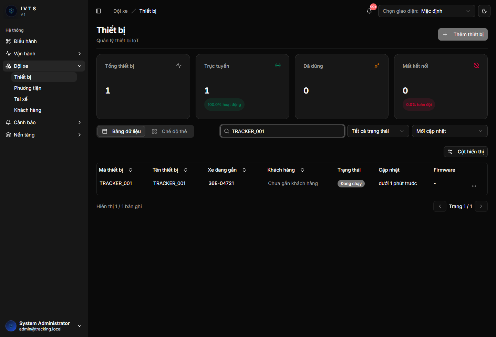

_Hình 4.7: Giao diện quản lý thiết bị và trạng thái đội xe_

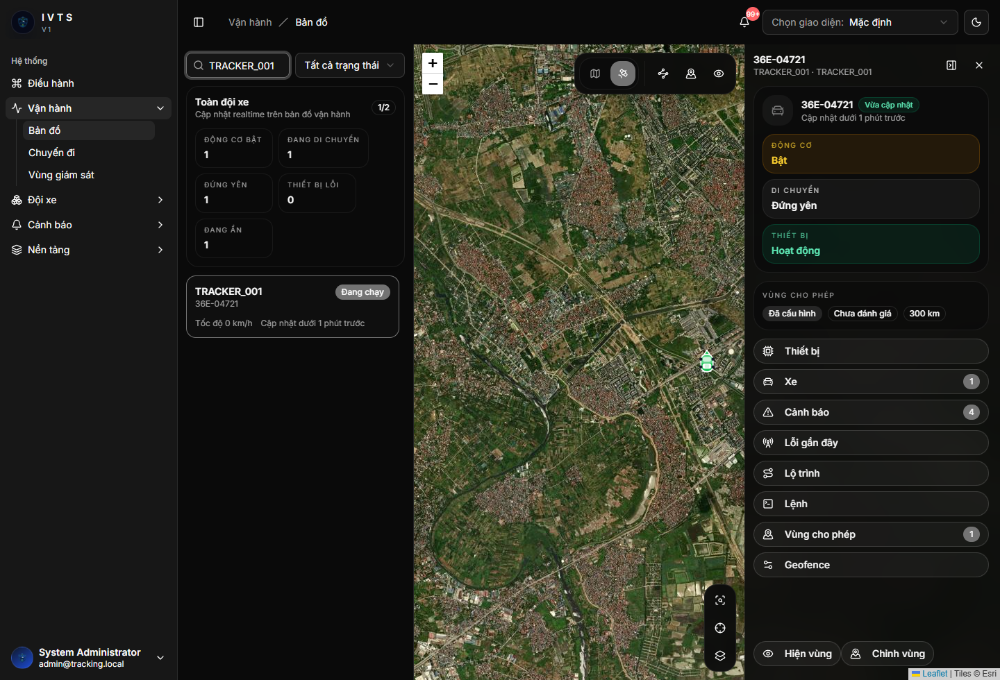

_Hình 4.8: Giao diện bản đồ giám sát và danh sách thiết bị đang theo dõi_

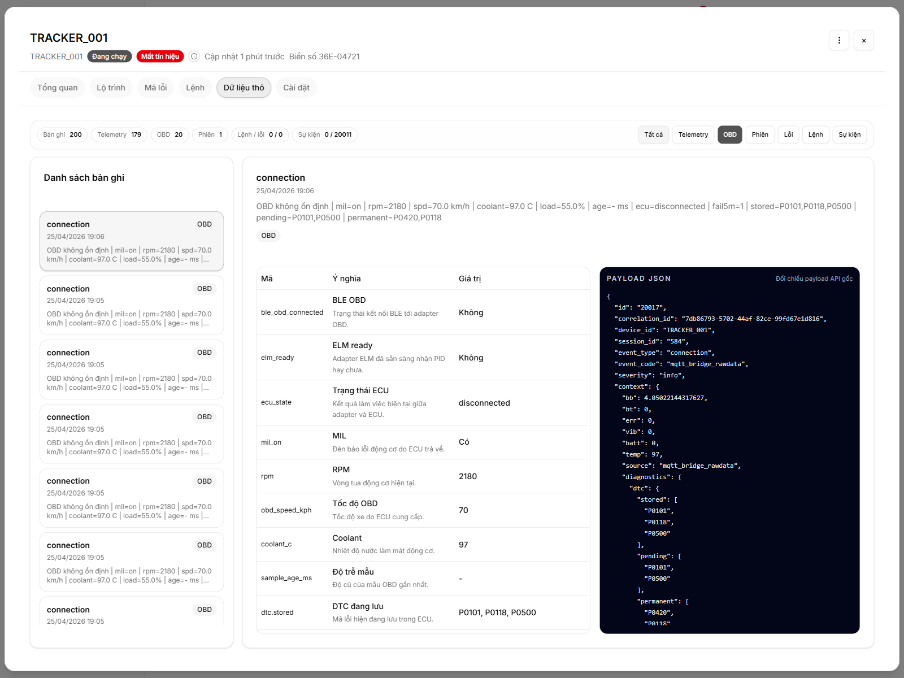

_Hình 4.9: Giao diện chi tiết thiết bị ở tab dữ liệu thô OBD_

### 4.3.6. Triển khai công khai trên cloud VPS và hướng dẫn dùng thử

Kết quả quan trọng của giai đoạn này là hệ thống đã được công bố trên Internet
thông qua các tên miền riêng thay vì chỉ vận hành trong môi trường cục bộ. Mô
hình truy cập được tổ chức theo tuyến Cloudflare DNS, cloud VPS, lớp chuyển tiếp ngược (reverse proxy)
và các container dịch vụ phía sau. Trong cấu hình hiện tại, frontend, backend,
EMQX, Grafana và lớp quản trị proxy đều có địa chỉ truy cập riêng; riêng
VictoriaMetrics được giữ ở chế độ nội bộ để giảm bề mặt công khai không cần thiết.

**Bảng 4.13: Các điểm truy cập công khai của hệ thống trên cloud VPS**

| Địa chỉ truy cập                   | Dịch vụ           | Vai trò sử dụng                                                  |
| -------------------------------------- | ------------------- | ------------------------------------------------------------------- |
| https://thingdock.dev              | Frontend            | Giao diện web quản trị của hệ thống                           |
| https://api.thingdock.dev          | Backend             | Điểm truy cập REST API                                           |
| https://api.thingdock.dev/api-docs | Tài liệu API      | Giao diện tài liệu API phục vụ kiểm tra các điểm truy cập |
| mqtt.thingdock.dev                 | EMQX                | Điểm kết nối MQTT của thiết bị                               |
| https://grafana.thingdock.dev      | Grafana             | Quan sát chỉ số và nhật ký vận hành                         |
| https://emqx.thingdock.dev         | EMQX Dashboard      | Quản trị và theo dõi trạng thái broker                        |
| https://npm.thingdock.dev          | Nginx Proxy Manager | Quản trị lớp chuyển tiếp ngược                               |

Tài khoản mặc định để dùng thử giao diện quản trị được khởi tạo cùng cơ sở dữ
liệu là `admin / Admin@2026`.

Có thể dùng thử hệ thống theo ba bước ngắn sau:

1. Truy cập `https://thingdock.dev`, đăng nhập bằng tài khoản mặc định `admin / Admin@2026`.
2. Kiểm tra các phân hệ cốt lõi gồm Dashboard, Devices, Map, Alerts và Firmware để đánh giá đầy đủ chuỗi giám sát, cảnh báo và quản trị thiết bị.
3. Khi cần kiểm tra lớp API, truy cập `https://api.thingdock.dev/api-docs` để xem danh mục endpoint và mô tả tham số.

## 4.4. Kết quả triển khai và tích hợp toàn hệ thống - Deployment results and integration

### 4.4.1. Mức độ hoàn thành các hạng mục triển khai

Kết quả triển khai ở Chương 4 cho thấy toàn bộ các lớp đã được ghép kín thành một
hệ thống hoàn chỉnh, từ phần cứng thiết bị, firmware, tuyến MQTT, lớp lưu trữ,
backend đến frontend công khai trên cloud VPS. Đây là cơ sở để khẳng định đề tài
đã hoàn thành ở mức triển khai thật, không chỉ dừng ở mức mô phỏng hoặc thiết kế
giải pháp.

**Bảng 4.14: Mức độ hoàn thành các hạng mục triển khai chính**

| Hạng mục                          | Kết quả chính                                                                                          | Mức độ hoàn thành |
| ----------------------------------- | --------------------------------------------------------------------------------------------------------- | ---------------------- |
| Thiết kế mạch và PCB            | Đã hoàn thành sơ đồ nguyên lý, bố trí PCB và hồ sơ phục vụ chế tạo                      | Hoàn thành           |
| Gia công và lắp ráp phần cứng | PCB đã được gia công, linh kiện đã được hàn lắp đầy đủ, hình thành nguyên mẫu thật | Hoàn thành           |
| Firmware thiết bị                 | Đã hiện thực đầy đủ các lớp chức năng và vận hành trên phần cứng thật                  | Hoàn thành           |
| MQTT broker và các lớp lưu trữ | EMQX, PostgreSQL/PostGIS, VictoriaMetrics và VictoriaLogs đã được triển khai                       | Hoàn thành           |
| MQTT Bridge                         | Đã hiện thực thành dịch vụ độc lập cho tuyến tiếp nhận dữ liệu thiết bị                  | Hoàn thành           |
| Backend                             | Đã hoàn thành các nhóm API và dịch vụ nghiệp vụ cốt lõi                                      | Hoàn thành           |
| Frontend                            | Đã hoàn thành giao diện quản trị web với các phân hệ chính                                    | Hoàn thành           |
| Cloud VPS và tên miền công khai | Hệ thống đã công bố qua `thingdock.dev` và các tên miền dịch vụ liên quan                  | Hoàn thành           |
| Quan sát vận hành                | Đã tích hợp Grafana, VictoriaLogs và EMQX Dashboard để hỗ trợ vận hành                         | Hoàn thành           |

### 4.4.2. Đối chiếu với các chỉ tiêu nghiệm thu

Khi đối chiếu với các chỉ tiêu đã xác lập ở Mục 1.3, có thể thấy các yêu cầu cốt
lõi của đề tài đều đã được hiện thực trên hệ thống thật. Kết quả này không chỉ thể
hiện ở từng thành phần riêng lẻ, mà còn ở việc toàn tuyến thiết bị - máy chủ -
giao diện đã vận hành đồng bộ.

**Bảng 4.15: Đối chiếu kết quả triển khai với các chỉ tiêu đặt ra**

| Nhóm chỉ tiêu                | Kết quả đã đạt được                                                                                                                     | Đánh giá |
| ------------------------------- | ------------------------------------------------------------------------------------------------------------------------------------------------ | ----------- |
| Phần cứng                     | Đã hoàn thiện thiết kế mạch, PCB chuyên dụng, nguyên mẫu đã gia công và hàn lắp đầy đủ, có thể lắp đặt trên xe thật  | Đạt       |
| Firmware                        | Đã thu thập dữ liệu GNSS, dữ liệu OBD cơ bản, giám sát nguồn, quản lý trạng thái, lưu đệm ngoại tuyến và hỗ trợ OTA      | Đạt       |
| Máy chủ và xử lý dữ liệu | Đã tiếp nhận dữ liệu liên tục qua MQTT, phân vai lưu trữ theo bản chất dữ liệu và cung cấp lớp dịch vụ quản trị tập trung | Đạt       |
| Giao diện web                  | Đã cung cấp dashboard, bản đồ, giám sát thiết bị, cảnh báo, quản lý đội xe và quản trị nền tảng qua trình duyệt web       | Đạt       |
| Tích hợp toàn tuyến         | Đã hình thành chuỗi thiết bị - EMQX - MQTT Bridge - lưu trữ - backend - frontend vận hành thống nhất                                | Đạt       |

### 4.4.3. Kết luận chương 4

Như vậy, các phương án đã lựa chọn ở Chương 3 đã được hiện thực thành một hệ
thống hoàn chỉnh và vận hành được trên hạ tầng thật. Phần cứng đã đi từ sơ đồ
thiết kế tới PCB đã gia công và lắp ráp; firmware đã được triển khai đầy đủ trên
thiết bị; còn hệ thống cloud đã được đưa lên cloud VPS với các dịch vụ và tên
miền công khai. Kết quả này xác nhận đề tài đã hoàn thành trọn vẹn chuỗi thiết bị đến máy chủ - giao diện trong phạm vi mục tiêu đặt ra.

# CHƯƠNG 5. ĐÁNH GIÁ VÀ KHUYẾN NGHỊ - EVALUATION AND RECOMMENDATIONS

## 5.1. Đánh giá hiệu năng

### 5.1.1. Đánh giá chung

Kết quả ở Chương 4 cho thấy nguyên mẫu đã đạt mục tiêu của một hệ thống IoT
quản lý phương tiện ở mức nguyên mẫu tích hợp. Kết quả sẽ được đánh giá trước hết theo khả năng đáp ứng chức năng, độ ổn
định qua các phiên kiểm chứng và khả năng duy trì kiến trúc phân lớp khi tích
hợp toàn tuyến.

**Bảng 5.1: Đánh giá hiệu năng theo nhóm chức năng**

| Nhóm chức năng                | Mức đáp ứng hiện tại                                                                                                         | Giới hạn còn lại                                                                       |
| -------------------------------- | ---------------------------------------------------------------------------------------------------------------------------------- | ------------------------------------------------------------------------------------------ |
| Phần cứng thiết bị           | Nguyên mẫu phần cứng đã tích hợp đủ khối xử lý, truyền thông, cảm biến, lưu đệm cục bộ và nguồn dự phòng | Cần kiểm chứng thêm về nhiễu, nhiệt và độ bền cơ khí khi lắp dài ngày      |
| Nguồn và năng lượng         | Đã tách nhánh modem, đo điện áp và áp dụng cơ chế ngủ sâu theo trạng thái xe                                      | Cần đo thêm trên nhiều loại ắc quy và nhiều chu kỳ đỗ dài                     |
| Firmware                         | Đã điều phối được trạng thái chạy, đỗ, cảnh báo, truyền dữ liệu và cập nhật từ xa                            | Cần tối ưu thêm trong các tình huống mất mạng kéo dài hoặc BLE OBD2 dao động |
| Thu nhận dữ liệu xe           | Đã đọc được OBD2 cơ bản, trạng thái nguồn, vị trí GNSS và chuyển động bất thường                              | Chưa mở rộng toàn bộ mã lỗi DTC và các thông số chuyên sâu                    |
| Kết nối thiết bị - máy chủ | MQTT đáp ứng tốt bản tin nhỏ, chu kỳ lặp và sự kiện ưu tiên                                                           | Cần kiểm thử thêm ở vùng sóng yếu và khi số thiết bị tăng                     |
| Máy chủ và giao diện         | Đã nhận, lưu và hiển thị được vị trí, trạng thái, cảnh báo và lịch sử                                           | Cần đánh giá sâu hơn về tải đồng thời và độ trễ khi mở rộng quy mô       |

### 5.1.2. Nhận xét theo yêu cầu thiết kế

Xét theo yêu cầu thiết kế ở Chương 2, nguyên mẫu đã đáp ứng rõ ba nhóm mục tiêu
chính. Thứ nhất, hệ thống đã chuyển được dữ liệu từ xe thành thông tin quản trị
trên giao diện web, gồm vị trí, trạng thái thiết bị, lịch sử và cảnh báo. Thứ
hai, thiết bị đã có cơ chế quản lý nguồn phù hợp với bối cảnh lắp trên xe, nhờ
đó giảm rủi ro tiêu thụ điện không kiểm soát khi xe đỗ. Thứ ba, kiến trúc nhiều
lớp đã chứng minh được tính đúng về mặt tổ chức, khi dữ liệu được tiếp nhận,
phân vai lưu trữ và khai thác tập trung.

Những nội dung hiện mới được xác nhận ở mức nguyên mẫu gồm độ bền dài ngày, mức
ổn định trên nhiều mẫu xe, phạm vi tương thích OBD2 mở rộng và khả năng vận
hành khi số lượng thiết bị tăng cao. Do đó, có thể kết luận rằng phương án lựa
chọn là đúng về cấu trúc và đủ cho mục tiêu đồ án, nhưng chưa phải là kết quả
đủ để suy rộng trực tiếp sang triển khai thương mại quy mô lớn.

## 5.2. Đánh giá kinh tế và môi trường

### 5.2.1. Đánh giá kinh tế

Về mặt kinh tế, chi phí của hệ thống được tách thành hai nhóm chính: chi phí chế
tạo thiết bị và chi phí vận hành hằng năm. Trong đó, chi phí chế tạo mỗi thiết bị
được lấy theo BOM ước tính của thiết bị; còn chi phí vận hành gồm chi phí kết nối dữ liệu di động
cho từng thiết bị và chi phí hạ tầng dùng chung ở phía máy chủ.

**Bảng 5.2: Cấu phần chi phí chính của hệ thống**

| Hạng mục chi phí            | Cách tính và thông số chính                                                                                                                       | Mức chi phí                                         | Phạm vi áp dụng           | Nhận xét                                                             |
| ------------------------------ | ------------------------------------------------------------------------------------------------------------------------------------------------------- | ----------------------------------------------------- | ---------------------------- | ---------------------------------------------------------------------- |
| Thiết bị phần cứng         | Theo BOM ước tính của thiết bị                                                                                                                        | Khoảng 1.500.000 VND cho mỗi thiết bị (theo BOM)  | Từng thiết bị             | Là khoản đầu tư ban đầu lớn nhất của hệ thống              |
| Kết nối dữ liệu di động  | Gói Viettel NB-IoT Connect8, cước 8.000 VND/30 ngày, tốc độ danh nghĩa khoảng 50 Kbps chiều lên và 50 Kbps chiều xuống                    | Khoảng 96.000 VND/năm cho mỗi thiết bị           | Từng thiết bị             | Phù hợp với bản tin telemetry dung lượng nhỏ, gửi theo chu kỳ |
| Máy chủ VPS trên đám mây | Một VPS cấu hình cơ bản để chạy broker MQTT, MQTT Bridge, backend, frontend và các dịch vụ quan sát vận hành của mô hình thử nghiệm | Khoảng 500.000-900.000 VND/năm                      | Dùng chung toàn hệ thống | Phù hợp với quy mô đồ án và giai đoạn thử nghiệm           |
| Tên miền                     | Một tên miền chính, dùng thêm các tên miền phụ cho web, API, MQTT và giám sát                                                              | Khoảng 200.000-300.000 VND/năm                      | Dùng chung toàn hệ thống | Không làm tăng theo số lượng thiết bị                          |

Với cách tính trên, chi phí vận hành bình quân hằng năm cho mỗi thiết bị gồm
khoảng 96.000 VND tiền kết nối dữ liệu, cộng với phần chi phí hạ tầng dùng chung
được phân bổ theo số lượng thiết bị triển khai. Nếu gọi $n$ là số thiết bị đang
vận hành, thì phần chi phí dùng chung bình quân trên mỗi thiết bị xấp xỉ
$(700.000-1.200.000)/n$ VND/năm, trong đó máy chủ VPS và tên miền đã được tách
riêng như trong Bảng 5.2. Như vậy, chi phí năm đầu cho mỗi thiết bị sẽ bằng chi
phí chế tạo thiết bị cộng với 96.000 VND và phần hạ tầng phân bổ; từ các
năm tiếp theo, chi phí duy trì chủ yếu còn lại là tiền kết nối dữ liệu và phần
chi phí máy chủ dùng chung.

Xét theo mục tiêu của đồ án, cấu hình chi phí này là hợp lý vì vẫn đủ để triển
khai thực tết cho doanh nghiệp một hệ thống hoàn chỉnh từ thiết bị, truyền dữ liệu, lưu trữ tới giao diện
quản trị trên cloud VPS, nhưng không đòi hỏi mức đầu tư vận hành lớn. Khi số
lượng thiết bị tăng, phần chi phí VPS và tên miền phân bổ trên mỗi thiết bị giảm
dần; do đó hiệu quả kinh tế của mô hình sẽ rõ hơn ở quy mô triển khai nhiều
thiết bị.

### 5.2.2. Đánh giá môi trường

Ở góc độ môi trường, hệ thống có thể tạo ra tác động tích cực thông qua việc hỗ
trợ theo dõi hành trình, kiểm soát sử dụng phương tiện và phát hiện sớm các dấu
hiệu cần bảo trì. Nếu được khai thác đúng mục đích, dữ liệu thu được có thể
giúp giảm sử dụng xe ngoài phạm vi cho phép, giảm hao mòn không được theo dõi
và nâng cao hiệu quả vận hành đội xe.

Ở chiều ngược lại, thiết bị điện tử, pin dự phòng và phụ kiện lắp đặt đều tạo ra
nguy cơ phát sinh chất thải điện tử nếu thay thế không đúng quy trình. Do đó,
hướng phát triển tiếp theo cần ưu tiên các giải pháp cơ khí bền hơn, pin có
nguồn gốc rõ ràng, thiết kế dễ tháo lắp và quy trình thu hồi linh kiện hỏng khi
chuyển từ nguyên mẫu sang triển khai thử nghiệm thực tế.

## 5.3. Đánh giá rủi ro và biện pháp giảm thiểu

Phần đánh giá rủi ro tập trung vào những điểm có thể ảnh hưởng trực tiếp đến độ
tin cậy của hệ thống khi chuyển từ nguyên mẫu trong phòng thí nghiệm sang vận
hành ngoài hiện trường. Đây là các rủi ro có khả năng tác động đồng thời lên
thiết bị, đường truyền và lớp khai thác.

**Bảng 5.3: Rủi ro kỹ thuật và biện pháp giảm thiểu**

| Rủi ro                               | Mức ảnh hưởng | Biện pháp đã áp dụng                                                             | Hướng giảm thiểu tiếp theo                                                          |
| ------------------------------------- | ----------------- | -------------------------------------------------------------------------------------- | ---------------------------------------------------------------------------------------- |
| Sụt áp khi modem truyền dữ liệu  | Cao               | Tách nhánh nguồn modem và logic, theo dõi điện áp bằng ADC                    | Đo dao động nguồn ở nhiều kịch bản tải và hoàn thiện thêm lớp bảo vệ     |
| Hao ắc quy khi xe đỗ lâu          | Cao               | Dùng ngủ sâu, theo dõi điện áp và tắt bớt tải theo trạng thái             | Kiểm thử dài ngày trên nhiều xe và nhiều điều kiện sử dụng                  |
| Thiết bị bị tháo khỏi xe | Cao | Phát hiện mất nguồn chính, chuyển sang pin dự phòng và gửi cảnh báo ngay về máy chủ | Bổ sung thêm cơ chế phát hiện tháo gỡ chuyên dụng để giảm báo động giả |
| Bộ chuyển đổi OBD2 bị rút | Trung bình - cao | Khi thiết bị vẫn còn pin dự phòng, hệ thống vẫn có thể phát cảnh báo mất kết nối OBD2 về máy chủ | Đối chiếu thêm phiên kết nối OBD2 và trạng thái vận hành để tăng độ tin cậy cảnh báo |
| Mất sóng di động hoặc sóng yếu | Trung bình - cao | Phục hồi kết nối, phát lại dữ liệu chờ và phân mức QoS theo loại bản tin | Tăng thời gian thử ở vùng phủ sóng kém và tối ưu chiến lược gửi           |
| Kết nối OBD2 BLE không ổn định  | Trung bình       | Tự kết nối lại bộ chuyển đổi và tách luồng OBD2 khỏi lõi điều phối     | Chuẩn hóa thêm danh sách bộ chuyển đổi tương thích                            |
| Sai lệch vị trí GNSS               | Trung bình       | Ghi nhận vị trí theo phiên vận hành và đối chiếu hành trình                | Bổ sung thêm kiểm chứng ở khu vực đô thị dày đặc và điểm che khuất       |
| Lộ dữ liệu vị trí                | Cao               | Xác thực và phân quyền ở lớp quản trị                                         | Hoàn thiện mã hóa đường truyền, chính sách lưu dữ liệu và quyền truy cập |
| Lỗi cập nhật firmware từ xa       | Cao               | Chỉ cho phép cập nhật khi đủ điều kiện nguồn và kết nối                   | Bổ sung cơ chế quay lại phiên bản trước nếu cập nhật không thành công      |

Như vậy, các rủi ro chính của hệ thống không nằm ở một lớp đơn lẻ, mà trải dài
từ phần cứng, kết nối di động tới dữ liệu và vận hành. Điều này cũng củng cố lựa
chọn kiến trúc phân lớp ở Chương 3, vì mỗi rủi ro cần được khoanh vùng và xử lý
ở đúng lớp chịu trách nhiệm.

## 5.4. Khuyến nghị cho tương lai

Trên cơ sở kết quả hiện tại, các hướng phát triển tiếp theo nên được sắp xếp
theo mức độ ảnh hưởng đến khả năng chuyển từ nguyên mẫu sang thử nghiệm thực tế.

**Bảng 5.4: Hướng khuyến nghị cho giai đoạn tiếp theo**

| Mức ưu tiên | Hướng phát triển                                           | Mục tiêu chính                                                                                  |
| -------------- | -------------------------------------------------------------- | -------------------------------------------------------------------------------------------------- |
| Cao            | Kiểm thử thực địa dài ngày trên nhiều xe              | Xác nhận độ ổn định của nguồn, GNSS, 4G và luồng cảnh báo trong điều kiện thật    |
| Cao            | Hoàn thiện vỏ và quy trình lắp đặt                     | Giảm rủi ro cơ khí, rủi ro đấu nối và tăng tính lặp lại khi triển khai               |
| Cao            | Tăng an toàn dữ liệu và quyền riêng tư                 | Hoàn thiện mã hóa đường truyền, phân quyền và chính sách lưu giữ dữ liệu vị trí |
| Trung bình    | Mở rộng dữ liệu OBD2 và chẩn đoán                      | Bổ sung giá trị cho theo dõi bảo trì và phân tích tình trạng xe                         |
| Trung bình    | Tối ưu năng lượng theo trạng thái xe                    | Kéo dài khả năng giám sát khi xe đỗ lâu và giảm ảnh hưởng đến ắc quy              |
| Trung bình    | Chuẩn hóa vận hành thử nghiệm và bảo trì              | Hình thành checklist lắp đặt, kiểm tra sau lắp và tài liệu hỗ trợ bảo trì            |
| Dài hạn      | Mở rộng kênh khai thác phụ trợ như ứng dụng di động | Bổ sung cảnh báo nhanh và tăng tính linh hoạt khi người quản lý không dùng máy tính |

Các khuyến nghị trên cho thấy hướng phát triển hợp lý của hệ thống không phải là
mở rộng tính năng bằng mọi giá, mà là củng cố dần các lớp có tác động lớn nhất
đến độ tin cậy, an toàn dữ liệu và khả năng vận hành thực tế.

# CHƯƠNG 6. PHẢN HỒI VÀ BÀI HỌC KINH NGHIỆM - REFLECTION AND LESSONS LEARNED

## 6.1. Ứng dụng kiến thức kỹ thuật - Application of prior coursework

Đồ án là sự kết hợp của nhiều mảng kiến thức trong chương trình đào tạo Kỹ thuật
Cơ điện tử. Thay vì chỉ áp dụng một khối kiến thức riêng lẻ, quá trình thực hiện
đòi hỏi sự phối hợp đồng thời giữa thiết kế phần cứng, lập trình hệ thống nhúng,
truyền thông dữ liệu, tổ chức phần mềm máy chủ và kiểm chứng hệ thống.

**Bảng 6.1: Kiến thức đã áp dụng trong đồ án**

| Nhóm kiến thức                                 | Ứng dụng trong đồ án                                                                                   |
| ------------------------------------------------- | ----------------------------------------------------------------------------------------------------------- |
| Mạch điện tử và nguồn                       | Thiết kế nhánh nguồn, chọn linh kiện hạ áp, bảo vệ nguồn và đo điện áp giám sát           |
| Vi điều khiển và hệ nhúng                   | Điều khiển ESP32-S3, tổ chức tác vụ, giao tiếp UART, I2C, BLE và chế độ ngủ sâu               |
| Cảm biến và đo lường                        | Đọc gia tốc, phát hiện chuyển động bất thường và đối chiếu tín hiệu trong quá trình thử |
| Truyền thông và mạng                          | Gửi dữ liệu qua 4G/LTE, MQTT, HTTP/REST và cập nhật gần thời gian thực                             |
| Cơ sở dữ liệu và phần mềm ứng dụng       | Tổ chức dữ liệu nghiệp vụ, dữ liệu chuỗi thời gian, nhật ký và giao diện quản trị           |
| Kiểm thử, vận hành và tích hợp hệ thống | Đối chiếu từng lớp với chỉ tiêu nghiệm thu và xác nhận luồng dữ liệu toàn tuyến            |

Kết quả đạt được cho thấy các học phần nền tảng không tồn tại tách rời nhau trong
một bài toán thực tế. Chỉ khi được ghép lại theo một chuỗi nhất quán, chúng mới
tạo thành một nguyên mẫu có thể vận hành được từ thiết bị đến giao diện quản trị.

## 6.2. Giải quyết các vấn đề kỹ thuật phức tạp - Complex engineering problems

Khó khăn lớn nhất của đề tài nằm ở tính phụ thuộc chéo giữa các lớp. Một sai lệch
ở phần nguồn có thể làm kết quả firmware không còn đáng tin cậy; một điểm nghẽn
ở đường truyền có thể khiến giao diện phản ánh sai trạng thái thiết bị; một cách
tổ chức lưu trữ chưa hợp lý có thể làm dữ liệu khó khai thác dù bản tin vẫn được
nhận đầy đủ. Vì vậy, cách tiếp cận phù hợp không phải là tối ưu từng khối riêng
lẻ, mà là giải bài toán ở cấp hệ thống.

**Bảng 6.2: Vấn đề kỹ thuật và cách xử lý**

| Vấn đề kỹ thuật                                                                                     | Cách xử lý trong đồ án                                                                                                                                             | Bài học rút ra                                                                                                     |
| -------------------------------------------------------------------------------------------------------- | ------------------------------------------------------------------------------------------------------------------------------------------------------------------------ | --------------------------------------------------------------------------------------------------------------------- |
| Mạch PCB phức tạp, yêu cầu nhiều tính năng và phải nhỏ gọn                                   | Phân tách theo các khối nguồn, xử lý, modem, cảm biến và chốt ánh xạ chân ngay từ giai đoạn sơ đồ - PCB                                              | Với thiết bị gắn trên xe, bài toán bố trí và tích hợp mạch quan trọng không kém lựa chọn linh kiện |
| Nhiều trạng thái vận hành từ trạng thái thiết bị, trạng thái di chuyển và trạng thái OBD | Tổ chức máy trạng thái trung tâm, kết hợp trạng thái nguồn, chuyển động và OBD để quyết định chu kỳ lấy mẫu, chế độ ngủ và bản tin gửi đi | Với hệ nhúng trên xe, tối ưu năng lượng phải đi cùng với mô hình trạng thái đủ chặt chẽ          |
| Cần lắp trên nhiều xe với ít xâm lấn                                                             | Dùng bộ chuyển đổi OBD2 BLE thay cho đấu dây trực tiếp                                                                                                         | Tính cơ động khi lắp đặt là một tiêu chí kỹ thuật quan trọng, không chỉ là tiện ích phụ           |
| Mạng di động không ổn định                                                                        | Dùng MQTT, cơ chế kết nối lại và hàng đợi ngoại tuyến                                                                                                        | Hệ thống thực tế phải chấp nhận gián đoạn kết nối như một điều kiện bình thường                   |
| Dữ liệu có bản chất khác nhau                                                                      | Tách dữ liệu nghiệp vụ, dữ liệu đo từ xa và nhật ký vận hành                                                                                               | Tổ chức lưu trữ quyết định trực tiếp khả năng khai thác và khoanh vùng lỗi                             |
| Giao diện phục vụ người vận hành                                                                  | Chuyển dữ liệu kỹ thuật thành bản đồ, trạng thái, cảnh báo và lịch sử                                                                                    | Lớp hiển thị phải phục vụ quyết định vận hành, không chỉ trình bày dữ liệu thô                      |

Như vậy, vấn đề kỹ thuật phức tạp nhất của đồ án không nằm ở một linh kiện hay
một thuật toán riêng lẻ, mà nằm ở việc làm cho nhiều lớp kỹ thuật khác nhau có
thể phối hợp ổn định trong cùng một hệ thống.

## 6.3. Tác động đạo đức và xã hội - Ethical and social impacts

Hệ thống giám sát phương tiện có giá trị rõ ràng đối với doanh nghiệp cho thuê xe,
nhưng cũng liên quan trực tiếp đến dữ liệu vị trí và hành trình của người sử dụng.
Vì vậy, các khía cạnh đạo đức và xã hội cần được xem như một phần của thiết kế,
không phải là nội dung bổ sung sau khi hệ thống đã hoàn thiện kỹ thuật.

**Bảng 6.3: Các khía cạnh đạo đức và xã hội cần chú ý**

| Khía cạnh                          | Giá trị tích cực                                                       | Yêu cầu kiểm soát                                                                       |
| ------------------------------------ | -------------------------------------------------------------------------- | ------------------------------------------------------------------------------------------- |
| Quyền riêng tư dữ liệu vị trí | Giúp quản lý xe, đối chiếu hành trình và hỗ trợ xử lý sự cố | Phải giới hạn mục đích sử dụng, thời gian lưu và phạm vi truy cập              |
| An toàn khi lắp đặt trên xe     | Thiết bị hỗ trợ giám sát mà không can thiệp điều khiển xe      | Cần bảo đảm đấu nối, cầu chì và vị trí lắp không làm phát sinh rủi ro mới |
| Minh bạch với người sử dụng xe | Giảm tranh chấp khi có dữ liệu đối chiếu rõ ràng                 | Cần thông báo rõ việc thu thập dữ liệu và phạm vi sử dụng hợp lệ              |
| Bảo mật hệ thống                 | Hạn chế mất dữ liệu và truy cập trái phép                         | Phải tăng cường xác thực, phân quyền và bảo vệ đường truyền                  |
| Trách nhiệm vận hành             | Hỗ trợ phát hiện sớm bất thường và hỗ trợ bảo trì             | Cần quy định rõ cách xử lý cảnh báo sai hoặc dữ liệu thiếu                     |

Trong phạm vi đồ án, thiết bị chỉ dừng ở mức giám sát, cảnh báo và hỗ trợ ra
quyết định; không can thiệp trực tiếp vào hệ thống điều khiển của xe. Cách tiếp
cận này phù hợp với giai đoạn nguyên mẫu vì giảm rủi ro an toàn khi thử nghiệm,
đồng thời vẫn cho phép đánh giá được giá trị quản lý của hệ thống.

## 6.4. Tổng kết và bài học kinh nghiệm - Reflection and Lessons Learned

Kết quả lớn nhất của đồ án là đã hình thành được một nguyên mẫu hoàn chỉnh theo
chuỗi từ thiết bị trên xe, firmware, đường truyền, máy chủ tới giao diện quản
lý. Giá trị của nguyên mẫu không chỉ nằm ở việc từng khối hoạt động được, mà ở
chỗ toàn bộ hệ thống đã được kiểm chứng như một chỉnh thể có thể vận hành và
đánh giá.

**Bảng 6.4: Bài học kinh nghiệm chính**

| Bài học                                                                      | Ý nghĩa đối với giai đoạn tiếp theo                                                                |
| ------------------------------------------------------------------------------ | ---------------------------------------------------------------------------------------------------------- |
| Thiết kế nguồn là nền tảng của toàn hệ thống                         | Cần tiếp tục ưu tiên kiểm chứng nguồn trước khi mở rộng tính năng phần mềm                 |
| Lựa chọn thành phần phải xét theo khả năng phối hợp toàn hệ thống | Không nên tối ưu cục bộ theo một thông số riêng lẻ                                              |
| Kiểm thử theo từng lớp giúp khoanh vùng lỗi nhanh hơn                  | Cần duy trì cách tổ chức đo kiểm từ phần cứng đến toàn tuyến                                 |
| Mạng di động phải được xem là điều kiện luôn biến động          | Mọi quyết định về giao thức, hàng đợi và cảnh báo cần tính trước tình huống gián đoạn |
| Dữ liệu và giao diện phải được phân vai rõ                           | Cần tiếp tục giữ ranh giới giữa lưu trữ, xử lý nghiệp vụ và hiển thị                        |
| Một nguyên mẫu tốt phải nêu rõ giới hạn hiện tại                    | Giới hạn rõ ràng giúp định hướng đúng cho giai đoạn phát triển tiếp theo                   |

Trong phạm vi đồ án tốt nghiệp, hệ thống đã đạt mục tiêu thiết kế nguyên mẫu.
Những phần còn lại cần được tiếp tục đầu tư không làm giảm giá trị của kết quả
hiện tại, mà cho thấy hướng phát triển kế tiếp của đề tài là rõ ràng và khả thi.


# TÀI LIỆU TRÍCH DẪN - REFERENCES


## \[A\] Tài liệu tiếng Việt

\[1\] IMARC Group, "Vietnam Car Rental Market Size, Share, Trends and Forecast by Booking Type, Rental Duration, Application Type, and Region 2026–2034," 2026. [Online]. Available: [https://www.imarcgroup.com/vietnam-car-rental-market](https://www.imarcgroup.com/vietnam-car-rental-market). [Accessed: Apr. 24, 2026].

\[2\] Texas Instruments, "Power Management for IoT Devices," Application Report SLVAE57, 2020. [Online]. Available: [https://www.ti.com/lit/an/slvae57/slvae57.pdf](https://www.ti.com/lit/an/slvae57/slvae57.pdf).

\[3\] M. A. Al-Khedher, "Hybrid GPS-GSM Localization of Automobile Tracking System," _International Journal of Computer Science and Information Technology_, vol. 3, no. 6, pp. 75–85, Dec. 2011.

\[4\] N. Naik, "Choice of Effective Messaging Protocols for IoT Systems: MQTT, CoAP, AMQP and HTTP," in _Proc. 2017 IEEE International Systems Engineering Symposium (ISSE)_, Vienna, Austria, 2017, pp. 1–7.


## \[B\] Tài liệu tiếng Anh (Books & Papers)

\[5\] A. Al-Fuqaha, M. Guizani, M. Mohammadi, M. Aledhari, and M.
Ayyash, "Internet of Things: A Survey on Enabling Technologies,
Protocols, and Applications," _IEEE Communications Surveys & Tutorials_,
vol. 17, no. 4, pp. 2347–2376, Fourth Quarter 2015.

\[6\] N. Naik, "Choice of Effective Messaging Protocols for IoT Systems:
MQTT, CoAP, AMQP and HTTP," in _Proc. 2017 IEEE International Systems
Engineering Symposium (ISSE)_, Vienna, Austria, 2017, pp. 1–7.

\[7\] M. Quigley, R. Johnson, and P. Sharma, "Power Management
Strategies for IoT Vehicle Tracking Devices," _IEEE Internet of Things
Journal_, vol. 8, no. 15, pp. 12045–12058, Aug. 2021.

\[8\] M. A. Al-Khedher, "Hybrid GPS-GSM Localization of Automobile
Tracking System," _International Journal of Computer Science and
Information Technology (IJCSIT)_, vol. 3, no. 6, pp. 75–85, Dec. 2011.

\[9\] S. Kaur and S. Singh, "A Survey on IoT based Vehicle Tracking
System," _International Journal of Advanced Research in Computer
Science_, vol. 10, no. 3, pp. 42–47, 2019.

\[10\] R. Barry, _Mastering the FreeRTOS Real Time Kernel: A Hands-On
Tutorial Guide_. Real Time Engineers Ltd., 2016.

\[11\] B. Boehm and V. R. Basili, "Software Defect Reduction Top 10
List," _IEEE Computer_, vol. 34, no. 1, pp. 135–137, Jan. 2001.

\[12\] E. Evans, _Domain-Driven Design: Tackling Complexity in the Heart
of Software_. Boston, MA, USA: Addison-Wesley Professional, 2003.

\[13\] S. Newman, _Building Microservices: Designing Fine-Grained
Systems_, 2nd ed. Sebastopol, CA, USA: O'Reilly Media, 2021.

\[14\] D. Guinard and V. Trifa, _Building the Web of Things_. Shelter
Island, NY, USA: Manning Publications, 2016.

\[15\] J. Gubbi, R. Buyya, S. Marusic, and M. Palaniswami, "Internet of
Things (IoT): A Vision, Architectural Elements, and Future Directions,"
_Future Generation Computer Systems_, vol. 29, no. 7, pp. 1645–1660,
Sep. 2013.

\[16\] V. C. Gungor and G. P. Hancke, "Industrial Wireless Sensor
Networks: Challenges, Design Principles, and Technical Approaches,"
_IEEE Transactions on Industrial Electronics_, vol. 56, no. 10, pp.
4258–4265, Oct. 2009.

\[17\] R. K. Kodali, V. Jain, S. Bose, and L. Boppana, "IoT Based Smart
Security and Home Automation System," in _Proc. 2016 International
Conference on Computing, Communication and Automation (ICCCA)_, Greater
Noida, India, 2016, pp. 1286–1289.

\[18\] B. Sahu and G. A. Rincon-Mora, "A Low Voltage, Dynamic,
Noninverting, Synchronous Buck-Boost Converter for Portable
Applications," _IEEE Transactions on Power Electronics_, vol. 19, no. 2,
pp. 443–452, Mar. 2004.


## \[C\] Tài liệu kỹ thuật (Datasheets & Technical Documents)

\[19\] Espressif Systems, "ESP32-S3 Series Datasheet," Version 1.3, 2023. \[Online\]. Available:
[https://www.espressif.com/sites/default/files/documentation/esp32-s3_datasheet_en.pdf](https://www.espressif.com/sites/default/files/documentation/esp32-s3_datasheet_en.pdf)

\[20\] Espressif Systems, "ESP32-S3 Technical Reference Manual," Version
1.1, 2023. \[Online\]. Available:
[https://www.espressif.com/sites/default/files/documentation/esp32-s3_technical_reference_manual_en.pdf](https://www.espressif.com/sites/default/files/documentation/esp32-s3_technical_reference_manual_en.pdf)

\[21\] SIMCom Wireless Solutions, "SIM7600 Series AT Command Manual,"
Version 1.06, 2023. \[Online\]. Available:
[https://www.simcom.com/product/SIM7600CE-T.html](https://www.simcom.com/product/SIM7600CE-T.html)

\[22\] SIMCom Wireless Solutions, "SIM7600CE-T Module Hardware Design
Guide," Version 1.02, 2022.

\[23\] STMicroelectronics, "LIS3DH MEMS digital output motion sensor
ultra-low-power high-performance 3-axis 'nano' accelerometer," Datasheet.
\[Online\]. Available:
[https://www.st.com/resource/en/datasheet/lis3dh.pdf](https://www.st.com/resource/en/datasheet/lis3dh.pdf)

\[24\] STMicroelectronics, "AN3308: LIS3DH MEMS digital output motion
sensor ultra-low-power high-performance 3-axis 'nano' accelerometer,"
Application Note. \[Online\]. Available:
[https://www.st.com/resource/en/application_note/cd00290365.pdf](https://www.st.com/resource/en/application_note/cd00290365.pdf)

\[25\] OASIS, "MQTT Version 5.0 - OASIS Standard," Mar. 2019.
\[Online\]. Available:
[https://docs.oasis-open.org/mqtt/mqtt/v5.0/mqtt-v5.0.html](https://docs.oasis-open.org/mqtt/mqtt/v5.0/mqtt-v5.0.html)

\[26\] SAE International, "SAE J1979 - E/E Diagnostic Test Modes,"
Standard, Rev. 2014.

\[27\] International Organization for Standardization, "ISO
15031–5:2015 - Road vehicles - Communication between vehicle and
external equipment for emissions-related diagnostics," ISO Standard, 2015.

\[28\] International Organization for Standardization, "ISO
15765–2:2016 - Road vehicles - Diagnostic communication over Controller
Area Network (DoCAN) - Part 2: Transport protocol and network layer
services," ISO Standard, 2016.

\[29\] vgate, "iCar Pro BLE OBD2 Adapter Specifications," 2023.
\[Online\]. Available:
[https://www.vgatemall.com/product/vgate-icar-pro.html](https://www.vgatemall.com/product/vgate-icar-pro.html)

\[30\] NanJing Top Power ASIC Corp., "TP5100 2A Switching Buck Charger
IC for 8.4V/4.2V Lithium-Ion Battery," Datasheet, Rev. 2.4. \[Online\].
Available:
[https://www.toppwr.com/uploadfile/file/20230304/6402f53e7e8d9.pdf](https://www.toppwr.com/uploadfile/file/20230304/6402f53e7e8d9.pdf).
\[Accessed: Apr. 18, 2026\].

\[31\] Apache NimBLE Project, "NimBLE Host API Reference," Version 1.5, 2023. \[Online\]. Available: [https://mynewt.apache.org/latest/network/](https://mynewt.apache.org/latest/network/)


## \[D\] Tài liệu trực tuyến (Online Resources)

\[32\] EMQX Team, "EMQX Documentation - The World's Most Scalable MQTT
Broker," Version 5.x, 2024. \[Online\]. Available:
[https://docs.emqx.com/en/emqx/latest/](https://docs.emqx.com/en/emqx/latest/). \[Accessed: Jan. 15, 2026\].

\[33\] The PostgreSQL Global Development Group, "PostgreSQL 16
Documentation," 2024. \[Online\]. Available:
[https://www.postgresql.org/docs/16/](https://www.postgresql.org/docs/16/). \[Accessed: Jan. 10, 2026\].

\[34\] VictoriaMetrics Team, "VictoriaMetrics Documentation," 2024.
\[Online\]. Available: [https://docs.victoriametrics.com/](https://docs.victoriametrics.com/). \[Accessed:
Jan. 10, 2026\].

\[35\] VictoriaMetrics Team, "VictoriaLogs Documentation," 2024.
\[Online\]. Available: [https://docs.victoriametrics.com/victorialogs/](https://docs.victoriametrics.com/victorialogs/).
\[Accessed: Jan. 10, 2026\].

\[36\] OpenJS Foundation, "Express.js - Fast, Unopinionated, Minimalist
Web Framework for Node.js," 2024. \[Online\]. Available:
[https://expressjs.com/](https://expressjs.com/). \[Accessed: Dec. 20, 2025\].

\[37\] Vercel Inc., "Next.js Documentation," 2026. \[Online\]. Available:
[https://nextjs.org/docs](https://nextjs.org/docs). \[Accessed: Apr. 24,
2026\].

\[38\] Meta Platforms, Inc., "React 19 Documentation," 2024. \[Online\].
Available: [https://react.dev/](https://react.dev/). \[Accessed: Dec. 15, 2025\].

\[39\] Socket.IO Contributors, "Socket.IO Documentation," Version 4.8, 2024. \[Online\]. Available: [https://socket.io/docs/v4/](https://socket.io/docs/v4/). \[Accessed:
Dec. 20, 2025\].

\[40\] V. Agafonkin, "Leaflet - An Open-Source JavaScript Library for
Mobile-Friendly Interactive Maps," Version 1.9, 2024. \[Online\].
Available: [https://leafletjs.com/](https://leafletjs.com/). \[Accessed: Jan. 05, 2026\].

\[41\] Recharts Group, "Recharts Documentation," 2026. \[Online\].
Available:
[https://recharts.github.io/en-US/guide/](https://recharts.github.io/en-US/guide/).
\[Accessed: Apr. 24, 2026\].

\[42\] Docker Inc., "Docker Documentation," 2024. \[Online\]. Available:
[https://docs.docker.com/](https://docs.docker.com/). \[Accessed: Nov. 15, 2025\].

\[43\] Docker Inc., "Docker Compose Documentation," 2024. \[Online\].
Available: [https://docs.docker.com/compose/](https://docs.docker.com/compose/). \[Accessed: Nov. 15,
2025\].

\[44\] Tailwind Labs, "Tailwind CSS Documentation," Version 4, 2025.
\[Online\]. Available: [https://tailwindcss.com/docs](https://tailwindcss.com/docs). \[Accessed: Jan.
10, 2026\].

\[45\] Daishi Kato, "Zustand - Bear Necessities for State Management in
React," Version 5, 2024. \[Online\]. Available:
[https://zustand-demo.pmnd.rs/](https://zustand-demo.pmnd.rs/). \[Accessed: Dec. 20, 2025\].

\[46\] TanStack, "TanStack Query Documentation," 2026. \[Online\].
Available:
[https://tanstack.com/query/latest](https://tanstack.com/query/latest).
\[Accessed: Apr. 24, 2026\].

\[47\] Espressif Systems, "ESP-IDF Programming Guide," Version 5.x, 2024. \[Online\]. Available:
[https://docs.espressif.com/projects/esp-idf/en/latest/esp32s3/](https://docs.espressif.com/projects/esp-idf/en/latest/esp32s3/).
\[Accessed: Oct. 10, 2025\].

\[48\] Grafana Labs, "Grafana Documentation," 2024. \[Online\].
Available: [https://grafana.com/docs/grafana/latest/](https://grafana.com/docs/grafana/latest/). \[Accessed: Jan.
15, 2026\].

\[49\] Prometheus Authors, "Prometheus Documentation," 2024. \[Online\].
Available: [https://prometheus.io/docs/](https://prometheus.io/docs/). \[Accessed: Jan. 15, 2026\].

\[50\] Radix UI Contributors, "Radix UI - Unstyled, Accessible
Components for React," 2024. \[Online\]. Available:
[https://www.radix-ui.com/](https://www.radix-ui.com/). \[Accessed: Dec. 15, 2025\].

\[51\] Google, "Flutter Documentation - WebView Plugin," 2024.
\[Online\]. Available: [https://docs.flutter.dev/](https://docs.flutter.dev/). \[Accessed: Jan. 20,
2026\].

\[52\] Texas Instruments, "Power Management for IoT Devices,"
Application Report SLVAE57, 2020. \[Online\]. Available:
[https://www.ti.com/lit/an/slvae57/slvae57.pdf](https://www.ti.com/lit/an/slvae57/slvae57.pdf). \[Accessed: Sep. 15,
2025\].

\[53\] STMicroelectronics, "STM32L476RE Product Page," 2026. \[Online\].
Available:
[https://www.st.com/en/microcontrollers-microprocessors/stm32l476re.html](https://www.st.com/en/microcontrollers-microprocessors/stm32l476re.html).
\[Accessed: Mar. 02, 2026\].

\[54\] STMicroelectronics, "STM32L476xx Datasheet," DS10198 Rev 11, Jul. 2024. \[Online\]. Available:
[https://www.st.com/resource/en/datasheet/stm32l476re.pdf](https://www.st.com/resource/en/datasheet/stm32l476re.pdf). \[Accessed:
Mar. 02, 2026\].

\[55\] Nordic Semiconductor, "nRF52840 Product Specification v1.2,"
\[Online\]. Available:
[https://docs.nordicsemi.com/bundle/nRF52840_PS_v1.2/resource/nRF52840_PS_v1.2.pdf](https://docs.nordicsemi.com/bundle/nRF52840_PS_v1.2/resource/nRF52840_PS_v1.2.pdf).
\[Accessed: Mar. 02, 2026\].

\[56\] Nordic Semiconductor, "nRF52840 Product Page," 2026. \[Online\].
Available: [https://www.nordicsemi.com/Products/nRF52840/Modules](https://www.nordicsemi.com/Products/nRF52840/Modules).
\[Accessed: Mar. 02, 2026\].

\[57\] Nordic Semiconductor, "nRF52840 Documentation Hub," 2026.
\[Online\]. Available:
[https://docs.nordicsemi.com/category/nrf52840-category](https://docs.nordicsemi.com/category/nrf52840-category). \[Accessed:
Mar. 02, 2026\].

\[58\] SIMCom Wireless Solutions, "A7670X Series Product Page," 2026.
\[Online\]. Available: [https://cn.simcom.com/product/A7670X.html](https://cn.simcom.com/product/A7670X.html).
\[Accessed: Mar. 02, 2026\].

\[59\] Quectel Wireless Solutions, "EC200U Series Product Page," 2026.
\[Online\]. Available:
[https://www.quectel.com/product/lte-ec200u-series](https://www.quectel.com/product/lte-ec200u-series). \[Accessed: Mar.
02, 2026\].

\[60\] SIMCom Wireless Solutions, "SIM7600CE Product Page," 2026.
\[Online\]. Available: [https://en.simcom.com/product/SIM7600CE.html](https://en.simcom.com/product/SIM7600CE.html).
\[Accessed: Mar. 13, 2026\].

\[61\] Quectel Wireless Solutions, "Quectel EC200U Series LTE Standard
Specification," Version 1.4, 2024. \[Online\]. Available:
[https://developer.quectel.com/en/wp-content/uploads/sites/2/2024/11/Quectel_EC200U_Series_LTE_Standard_Specification_V1.4.pdf](https://developer.quectel.com/en/wp-content/uploads/sites/2/2024/11/Quectel_EC200U_Series_LTE_Standard_Specification_V1.4.pdf).
\[Accessed: Mar. 02, 2026\].

\[62\] u-blox, "NEO-M8 Data Sheet," UBX-15031086, \[Online\]. Available:
[https://www.u-blox.com/sites/default/files/NEO-M8-FW3_DataSheet_UBX-15031086.pdf](https://www.u-blox.com/sites/default/files/NEO-M8-FW3_DataSheet_UBX-15031086.pdf).
\[Accessed: Mar. 02, 2026\].

\[63\] u-blox, "NEO-M8 Series Product Page," 2026. \[Online\].
Available: [https://www.u-blox.com/en/product/neo-m8-series](https://www.u-blox.com/en/product/neo-m8-series).
\[Accessed: Mar. 02, 2026\].

\[64\] vgate, "Vgate iCar Pro BLE Product Page," 2026. \[Online\].
Available: [https://vgatemall.com/products-detail/i-9/](https://vgatemall.com/products-detail/i-9/). \[Accessed:
Mar. 02, 2026\].

\[65\] Texas Instruments, "TPS2115A Product Page," 2026. \[Online\].
Available: [https://www.ti.com/product/TPS2115A](https://www.ti.com/product/TPS2115A). \[Accessed: Mar. 02,
2026\].

\[66\] Infineon Technologies, "IRLML6402 Product Page," 2026.
\[Online\]. Available: [https://www.infineon.com/part/IRLML6402](https://www.infineon.com/part/IRLML6402).
\[Accessed: Mar. 02, 2026\].

\[67\] SONGLE Relay, "SRD-05VDC-SL-C Relay Datasheet," datasheet mirror.
\[Online\]. Available:
[https://www.alldatasheet.com/html-pdf/1132639/SONGLERELAY/SRD-05VDC-SL-C/1713/2/SRD-05VDC-SL-C.html](https://www.alldatasheet.com/html-pdf/1132639/SONGLERELAY/SRD-05VDC-SL-C/1713/2/SRD-05VDC-SL-C.html).
\[Accessed: Mar. 02, 2026\].


# PHỤ LỤC - APPENDICES


# PHỤ LỤC 1: BÁO CÁO TÀI CHÍNH - FINANCE REPORT

Phụ lục này cập nhật cơ cấu chi phí theo cấu hình đã trình bày trong phần thiết
kế và triển khai của báo cáo rút gọn. Các khoản mục được trình bày theo nhóm
chi phí và mức độ ảnh hưởng, vì giá linh kiện, gói dữ liệu và hạ tầng đám mây có
thể thay đổi theo thời điểm mua, số lượng đặt hàng và nhà cung cấp.

## 1.1. Bảng kê nhóm chi phí linh kiện

| Nhóm chi phí phần cứng | Thành phần đang dùng trong thiết kế | Trạng thái trong nội dung chính | Ghi chú kiểm soát chi phí |
| --- | --- | --- | --- |
| Bộ xử lý trung tâm | ESP32-S3-WROOM-1, các chân UART, I2C, SPI, ADC, GPIO và BLE tích hợp | Đã chốt ở chương giải pháp phần cứng và chương triển khai firmware | Giữ BOM gọn vì không cần mô-đun BLE rời cho OBD2 |
| Truyền thông và định vị | SIM7600CE-T, khay SIM, anten LTE, anten GNSS và các đường điều khiển modem | Đã tích hợp với firmware, MQTT và luồng dữ liệu vị trí | Là nhóm chi phí cao, cần ưu tiên linh kiện chính hãng và nguồn ổn định |
| Thu thập dữ liệu xe | Bộ chuyển đổi OBD2 qua BLE vgate iCar Pro, đầu nối OBD2 và dây lắp đặt | Đã chọn làm phương án đọc PID ít xâm lấn | Bộ chuyển đổi thương mại giúp giảm rủi ro đấu trực tiếp vào bus xe |
| Cảm biến, thời gian và lưu đệm | LIS3DH, DS3231M, microSD/SDMMC, NVS và linh kiện phụ trợ | Đã dùng cho phát hiện chuyển động, đồng bộ thời gian và lưu đệm cục bộ | Cần kiểm chứng đúng mã linh kiện thực tế khi thay thế linh kiện tương đương |
| Nguồn và bảo vệ | MP2482, AP2112-3.3, TPS54231, TP5100, SX1308, pin 18650 1S, diode-OR, cầu chì và mạch đo ADC | Đã chốt theo kiến trúc nguồn đa nhánh | Quyết định độ ổn định của thiết bị khi modem phát xung dòng và khi nguồn xe dao động |
| PCB, vỏ và lắp ráp | PCB nguyên mẫu, vỏ ABS, header, dây nối, phụ kiện cố định, hàn lắp và kiểm tra | Đã dùng cho cấu hình nguyên mẫu | Chi phí phụ thuộc mạnh vào số lượng đặt PCB, vỏ và mức hoàn thiện cơ khí |

## 1.2. Chi phí hạ tầng đám mây và vận hành

Chi phí vận hành được tách khỏi chi phí thiết bị vì nó tăng theo số lượng xe,
tần suất gửi bản tin và thời gian lưu dữ liệu. Với quy mô nguyên mẫu, toàn bộ
hệ thống có thể chạy trên máy chủ VPS tự quản bằng Docker Compose; khi mở rộng,
các khoản tăng nhanh nhất là gói dữ liệu SIM, lưu trữ dữ liệu đo từ xa, nhật ký
và quan sát vận hành.

| Khoản mục vận hành | Thành phần hiện dùng trong hệ thống | Xu hướng biến thiên |
| --- | --- | --- |
| Máy chủ và truy cập công khai | Máy chủ VPS trên đám mây, Docker Compose theo dịch vụ, Nginx Proxy Manager, tên miền và TLS | Tăng khi cần tách nút triển khai, tăng tài nguyên hoặc nâng mức sẵn sàng |
| Kết nối thiết bị | SIM 4G/IoT cho từng thiết bị theo dõi và lưu lượng MQTT qua LTE | Gần tỷ lệ thuận với số thiết bị và chu kỳ gửi dữ liệu |
| Tiếp nhận và cập nhật gần thời gian thực | EMQX, MQTT Bridge, dịch vụ phía máy chủ và Socket.IO/WebSocket | Tăng theo số kết nối đồng thời và số bản tin trong giờ cao điểm |
| Lưu trữ dữ liệu | PostgreSQL/PostGIS, VictoriaMetrics, VictoriaLogs, chính sách lưu giữ và sao lưu | Tăng theo thời gian lưu lịch sử, mật độ dữ liệu đo từ xa và độ chi tiết nhật ký |
| Quan sát vận hành | Grafana, bảng theo dõi hệ thống, cảnh báo, nhật ký truy vết và kiểm tra trạng thái dịch vụ | Tăng khi cần giám sát nhiều đội xe, nhiều nút triển khai hoặc nhiều môi trường triển khai |

## 1.3. Tổng hợp chi phí theo quy mô triển khai

Từ góc độ triển khai, chi phí không tăng tuyến tính ở mọi lớp. Thiết bị tăng
theo số xe, trong khi hạ tầng thường tăng theo các ngưỡng tải và ngưỡng lưu trữ.

| Quy mô sử dụng | Số thiết bị tham chiếu | Đặc điểm chi phí chính | Nhận xét |
| --- | --- | --- | --- |
| Nguyên mẫu kỹ thuật | 1-5 | Chi phí linh kiện, PCB, dụng cụ đo và thời gian tích hợp chiếm ưu thế | Phù hợp kiểm chứng kiến trúc phần cứng, firmware và luồng bản tin MQTT |
| Thử nghiệm nội bộ | 5-20 | Chi phí thiết bị vẫn là chính, hạ tầng còn có thể giữ trên một VPS | Cần chuẩn hóa cấu hình lắp đặt, SIM và quy trình nạp firmware |
| Thí điểm mở rộng | 20-100 | SIM, lưu trữ dữ liệu đo từ xa, nhật ký và giám sát bắt đầu tăng rõ | Cần kiểm soát chính sách lưu giữ, sao lưu và cảnh báo vận hành |
| Triển khai quy mô vừa | 100-300 | Chi phí hỗ trợ kỹ thuật, vận hành hạ tầng và tối ưu dữ liệu tăng nhanh | Cần theo dõi tải EMQX, MQTT Bridge, dịch vụ phía máy chủ và cơ sở dữ liệu |
| Đội xe lớn hoặc đa khu vực | Trên 300 | Hạ tầng, chính sách dữ liệu, phân quyền và quan sát vận hành trở thành chi phí chủ đạo | Cần tính đến mở rộng ngang và quản trị tập trung |


# PHỤ LỤC 2: CÁC TIÊU CHUẨN THIẾT KẾ - STANDARDS

Phụ lục này tổng hợp các tiêu chuẩn, giao thức và nguyên tắc thiết kế đang được
áp dụng trực tiếp trong bản triển khai hiện tại. Nội dung ưu tiên bám theo các
thành phần đã xuất hiện trong chương 3 và chương 4, không liệt kê các chuẩn
không còn liên quan đến cấu hình cuối.

## 2.1. Dữ liệu xe, định vị và firmware thiết bị

Lớp thiết bị bám theo OBD2 để đọc dữ liệu vận hành cơ bản qua bộ chuyển đổi BLE,
đồng thời dùng modem SIM7600CE-T cho LTE/GNSS. Firmware được tổ chức trên
ESP-IDF và FreeRTOS để quản lý tác vụ, ngoại vi, ngủ sâu, lưu đệm và cập nhật
từ xa.

## 2.2. MQTT, cấu trúc bản tin và kênh thời gian thực

Thiết bị dùng MQTT 3.1.1 qua EMQX. Cây chủ đề bản tin đang dùng gồm
v1/{device\_id}/rawdata, v1/{device\_id}/status, v1/{device\_id}/events,
v1/{device\_id}/firmware và v1/{device\_id}/commands. MQTT Bridge tiếp tục phát
sự kiện nội bộ theo internal/events/# để dịch vụ phía máy chủ đẩy cập nhật ra
giao diện qua Socket.IO/WebSocket.

## 2.3. API, lưu trữ và quan sát vận hành

Dịch vụ phía máy chủ cung cấp HTTP/REST API dưới nhóm /api/v1, tài liệu OpenAPI
và kênh cập nhật gần thời gian thực. Dữ liệu nghiệp vụ được lưu ở
PostgreSQL/PostGIS; dữ liệu đo từ xa và chỉ số được lưu ở VictoriaMetrics; nhật ký tập trung dùng
VictoriaLogs và được quan sát qua Grafana.

## 2.4. Bảo mật và vận hành

Các nguyên tắc bảo mật được áp dụng ở mức phù hợp với nguyên mẫu: TLS cho cổng
công khai, xác thực phiên cho người dùng, phân quyền theo vai trò, MQTT ACL theo
thiết bị, biến môi trường cho bí mật và nhật ký kiểm toán cho thao tác quan
trọng.

| Chuẩn/nguyên tắc | Phạm vi áp dụng | Cách hiện thực trong dự án |
| --- | --- | --- |
| SAE J1979 / ISO 15031-5 | Dữ liệu OBD2 | Chọn nhóm PID cốt lõi, chuẩn hóa đơn vị đo và xử lý DTC cơ bản |
| Bộ lệnh ELM327 qua BLE | Bộ chuyển đổi OBD2 qua BLE | Firmware gửi lệnh đọc PID qua bộ chuyển đổi thương mại thay vì đấu trực tiếp vào bus xe |
| MQTT 3.1.1 | Kênh thiết bị - máy chủ | Tách chủ đề bản tin theo nghiệp vụ, dùng QoS 0 cho dữ liệu đo từ xa tần suất cao và QoS 1 cho trạng thái, sự kiện, firmware, lệnh điều khiển |
| HTTP/REST và OpenAPI | API máy chủ | Chuẩn hóa phương thức, mã trạng thái, tài nguyên /api/v1 và tài liệu API |
| Socket.IO và WebSocket | Cập nhật giao diện | Đẩy trạng thái thiết bị, dữ liệu bản đồ và cảnh báo gần thời gian thực |
| PostgreSQL/PostGIS | Dữ liệu nghiệp vụ và không gian | Lưu thiết bị, xe, chuyến đi, vùng giám sát, cảnh báo và quyền truy cập |
| VictoriaMetrics, VictoriaLogs và Grafana | Dữ liệu đo từ xa, nhật ký và quan sát | Tách dữ liệu chuỗi thời gian, nhật ký tập trung và bảng theo dõi vận hành |
| ESP-IDF/FreeRTOS | Firmware ESP32-S3 | Tổ chức tác vụ, ngoại vi, ngủ sâu, NVS, lưu đệm và OTA |
| Docker Compose | Triển khai dịch vụ | Tách EMQX, PostgreSQL, nhóm dịch vụ Victoria, MQTT Bridge, dịch vụ phía máy chủ, giao diện web và Grafana thành dịch vụ độc lập |
| Nguyên tắc đặc quyền tối thiểu | Bảo mật hệ thống | Giới hạn quyền người dùng, quyền MQTT theo thiết bị và quyền truy cập cổng quản trị |

## 2.5. Ma trận kiểm soát tuân thủ theo thành phần

| ID | Chuẩn/nguyên tắc | Thành phần áp dụng | Cách kiểm chứng trong vận hành |
| --- | --- | --- | --- |
| S-01 | SAE J1979 / ISO 15031-5 | Bộ giải mã OBD2 | Đối chiếu PID trả về với đơn vị đo, miền giá trị và mô tả trong tài liệu |
| S-02 | Bộ lệnh ELM327 qua BLE | Bộ chuyển đổi OBD2 qua BLE và firmware | Kiểm tra kết nối BLE, lệnh đọc PID và cơ chế tự kết nối lại |
| S-03 | GNSS qua SIM7600CE-T | Modem và bộ phân tích vị trí | Kiểm tra tọa độ, số vệ tinh, thời điểm ghi nhận và trạng thái định vị hợp lệ trước khi gửi bản tin |
| S-04 | MQTT 3.1.1 | Thiết bị, EMQX và MQTT Bridge | Kiểm tra gửi/nhận bản tin, giữ phiên, tự kết nối lại và xác thực broker |
| S-05 | Quy ước chủ đề bản tin | Firmware, MQTT Bridge và dịch vụ phía máy chủ | Soát các chủ đề rawdata, status, events, firmware, commands đúng cây v1/{device\_id} |
| S-06 | Chính sách QoS | Bản tin MQTT | Đối chiếu QoS 0 cho dữ liệu đo từ xa tần suất cao và QoS 1 cho trạng thái, cảnh báo, firmware, lệnh điều khiển |
| S-07 | Kiểm tra cấu trúc bản tin | MQTT Bridge | Bản tin sai cấu trúc bị chặn, ghi nhật ký và không làm bẩn kho dữ liệu sau |
| S-08 | Phân vai lưu trữ | MQTT Bridge và dịch vụ phía máy chủ | Kiểm tra dữ liệu nghiệp vụ vào PostgreSQL, dữ liệu đo từ xa vào VictoriaMetrics và nhật ký vào VictoriaLogs |
| S-09 | REST API | Dịch vụ phía máy chủ | Đối chiếu phương thức, mã trạng thái, phân trang và định dạng lỗi trên nhóm /api/v1 |
| S-10 | Socket.IO và WebSocket | Dịch vụ phía máy chủ và giao diện web | Kiểm tra dữ liệu mới được đẩy lên bảng tổng quan, bản đồ và cảnh báo không cần tải lại trang |
| S-11 | PostGIS | Vùng giám sát và bản đồ | Kiểm tra truy vấn vị trí, vùng giám sát và dữ liệu không gian trên các kịch bản mẫu |
| S-12 | Chính sách lưu giữ dữ liệu | VictoriaMetrics và VictoriaLogs | Kiểm tra thời gian lưu, dung lượng tăng và khả năng truy vấn lịch sử |
| S-13 | Docker Compose | Hạ tầng triển khai | Kiểm tra thứ tự khởi động, kiểm tra trạng thái dịch vụ, mạng dùng chung và biến môi trường bắt buộc |
| S-14 | TLS và proxy | Cổng công khai | Kiểm tra HTTPS/MQTTS, gia hạn chứng chỉ và chặn truy cập không an toàn |
| S-15 | Xác thực và phiên | Dịch vụ phía máy chủ và giao diện web | Kiểm tra đăng nhập, hết hạn phiên, thu hồi phiên và bảo vệ luồng quản trị |
| S-16 | RBAC và MQTT ACL | Người dùng và thiết bị | Kiểm tra người dùng hoặc thiết bị không truy cập vượt phạm vi được cấp |
| S-17 | Xử lý bí mật | Cấu hình dịch vụ | Kiểm tra khóa và mật khẩu chỉ nằm trong biến môi trường hoặc cấu hình triển khai phù hợp |
| S-18 | Nhật ký kiểm toán | Dịch vụ phía máy chủ, MQTT Bridge và VictoriaLogs | Xác minh thao tác nhạy cảm và lỗi dữ liệu có nhật ký truy vết |
| S-19 | OTA và lệnh điều khiển | Firmware, dịch vụ phía máy chủ và chủ đề commands | Kiểm tra hàng đợi lệnh, trạng thái cập nhật firmware và cơ chế quay lại khi cần |
| S-20 | Minh chứng tài liệu | Báo cáo, hình và phụ lục | Chỉ dùng ảnh/sơ đồ có tài nguyên kiểm chứng; thiếu ảnh thật thì ghi TODO/BLOCKER thay vì tạo hình giả |


# PHỤ LỤC 3: KẾ HOẠCH THỰC HIỆN - ASSIGNMENT AND TIMELINES

Phụ lục này cập nhật kế hoạch thực hiện theo cấu trúc công việc thực tế của đồ
án: phần cứng, firmware, hạ tầng, dịch vụ phía máy chủ, giao diện web, tích hợp,
kiểm thử và hoàn thiện báo cáo. Các mốc có chồng chéo có chủ đích để có môi
trường kiểm thử sớm cho từng lớp.

## 3.1. Phân chia giai đoạn dự án

| Giai đoạn | Nội dung chính | Thời gian tham chiếu | Đầu ra chốt |
| --- | --- | --- | --- |
| GĐ1 | Khảo sát yêu cầu và kiến trúc tổng thể | Tuần 1-3 | Phạm vi, chỉ tiêu nghiệm thu, sơ đồ luồng dữ liệu và lựa chọn công nghệ chính |
| GĐ2 | Thiết kế phần cứng, nguồn và PCB | Tuần 3-7 | Cấu hình ESP32-S3, SIM7600CE-T, OBD2 BLE, LIS3DH, DS3231M, lưu đệm và nguồn đa nhánh |
| GĐ3 | Phát triển firmware thiết bị | Tuần 5-13 | Firmware ESP-IDF/FreeRTOS cho modem, GNSS, OBD2 BLE, trạng thái, lưu đệm, ngủ sâu và OTA |
| GĐ4 | Xây dựng hạ tầng và kênh dữ liệu | Tuần 7-15 | EMQX, MQTT Bridge, PostgreSQL/PostGIS, VictoriaMetrics, VictoriaLogs, Grafana và proxy |
| GĐ5 | Phát triển dịch vụ phía máy chủ, giao diện web và khung ứng dụng di động | Tuần 10-19 | API, kênh cập nhật gần thời gian thực, các màn hình tổng quan, bản đồ, thiết bị, cảnh báo, cập nhật firmware và giao diện quản trị |
| GĐ6 | Tích hợp và kiểm thử liên tầng | Tuần 17-22 | Chuỗi thiết bị - EMQX - MQTT Bridge - lưu trữ - dịch vụ phía máy chủ - giao diện web hoạt động thống nhất |
| GĐ7 | Hoàn thiện đánh giá và báo cáo | Tuần 21-24 | Báo cáo rút gọn, phụ lục, tài nguyên hình/bảng và danh sách kiểm tra bàn giao |


_Hình PL-3.1: Kế hoạch thực hiện dự án theo giai đoạn (24 tuần)_

## 3.2. Điều kiện chuyển giai đoạn

| Luồng công việc | Điều kiện chốt | Minh chứng cần có |
| --- | --- | --- |
| Phần cứng và nguồn | Các đường 5 V, 3,3 V, khoảng 4 V cho modem và nhánh dự phòng được mô tả nhất quán | Sơ đồ kết nối, bảng chọn linh kiện và ghi chú kiểm tra nguồn |
| Firmware thiết bị | Thiết bị điều phối được modem, GNSS, OBD2 qua BLE, cảm biến, lưu đệm và gửi bản tin MQTT | Nhật ký khởi động, nhật ký đọc dữ liệu, nhật ký gửi bản tin và trạng thái OTA |
| Hạ tầng dữ liệu | EMQX nhận bản tin, MQTT Bridge phân luồng và các kho lưu trữ sẵn sàng | Nhật ký EMQX, nhật ký MQTT Bridge, bản ghi PostgreSQL, chỉ số VictoriaMetrics và nhật ký VictoriaLogs |
| Dịch vụ máy chủ và kênh cập nhật thời gian thực | API nghiệp vụ hoạt động và sự kiện nội bộ được đẩy ra Socket.IO/WebSocket | OpenAPI, kiểm tra trạng thái dịch vụ, bảng tổng quan thời gian thực và kiểm thử nhóm điểm truy cập chính |
| Giao diện web quản trị | Các màn hình tổng quan, thiết bị, bản đồ, cảnh báo, cập nhật firmware và trạng thái hệ thống hiển thị dữ liệu đúng | Ảnh chụp giao diện đã kiểm tra và kịch bản thao tác chính |
| Báo cáo và phụ lục | Nội dung, hình, bảng và thuật ngữ khớp với bản triển khai cuối | Biên dịch LaTeX sạch, danh mục hình/bảng đúng và không dùng ảnh giả |

## 3.3. Mốc công việc chính

| Mốc | Đầu ra chính | Tiêu chí nghiệm thu | Rủi ro theo dõi |
| --- | --- | --- | --- |
| M1 | Kiến trúc và yêu cầu | Chốt mục tiêu, luồng dữ liệu, thành phần và chỉ tiêu đo | Phạm vi lan rộng hoặc thiếu chỉ tiêu kiểm chứng |
| M2 | Thiết kế phần cứng | Chốt MCU, modem, OBD2 qua BLE, cảm biến, nguồn và PCB | Sai mã linh kiện, sai ngưỡng nguồn hoặc bố trí anten không phù hợp |
| M3 | Firmware nền | Thiết bị khởi động, quản lý trạng thái, nhật ký và lưu cấu hình | Reset cục bộ, lỗi ngoại vi hoặc thiếu nhật ký chẩn đoán |
| M4 | Kênh MQTT và lưu trữ | Bản tin đi qua EMQX, MQTT Bridge và vào đúng kho dữ liệu | Sai chủ đề bản tin, sai cấu trúc bản tin hoặc dữ liệu vào sai lớp lưu trữ |
| M5 | Dịch vụ phía máy chủ và giao diện web | API, kênh cập nhật gần thời gian thực và các màn hình cốt lõi hoạt động | Lệch quy ước giao tiếp API, giao diện không phản ánh trạng thái thật |
| M6 | Tích hợp toàn tuyến | Chuỗi thiết bị đến giao diện vận hành ổn định trong kịch bản mẫu | Mất mạng, OBD2 qua BLE dao động hoặc nhật ký không đủ truy vết |
| M7 | Kiểm thử và đánh giá | Có bảng đối chiếu mục tiêu, kết quả và giới hạn còn lại | Thiếu dữ liệu thực địa hoặc chưa đủ kịch bản lỗi |
| M8 | Báo cáo cuối | PDF, Markdown, phụ lục và tài nguyên minh họa đồng bộ | Lệch hình/bảng, lỗi font, lỗi biên dịch hoặc phụ lục lỗi thời |

## 3.4. Kế hoạch thực hiện theo tuần (24 tuần)

| Tuần | Mục tiêu chính | Công việc trọng tâm | Đầu ra kiểm chứng |
| --- | --- | --- | --- |
| 1 | Khởi động dự án | Chốt phạm vi, bài toán giám sát phương tiện và chỉ tiêu nghiệm thu | Biên bản phạm vi và danh sách rủi ro ban đầu |
| 2 | Khảo sát công nghệ | So sánh MCU, modem, OBD2, cảm biến, giao thức truyền và hạ tầng | Bảng lựa chọn công nghệ chính |
| 3 | Chốt kiến trúc | Thiết kế luồng thiết bị - MQTT - lưu trữ - dịch vụ phía máy chủ - giao diện web | Sơ đồ kiến trúc và dữ liệu đầu cuối |
| 4 | Thiết kế nguồn | Chọn MP2482, AP2112-3.3, TPS54231, TP5100, SX1308 và ngưỡng ADC | Bảng thông số nguồn và chiến lược bảo vệ |
| 5 | Thiết kế phần cứng | Ghép ESP32-S3, SIM7600CE-T, LIS3DH, DS3231M, microSD và OBD2 BLE | Sơ đồ kết nối và danh sách chân chính |
| 6 | PCB và vật tư | Rà BOM, phụ kiện lắp đặt, anten, SIM, vỏ và yêu cầu lắp ráp | BOM theo nhóm chi phí và danh sách kiểm tra mua vật tư |
| 7 | Firmware nền | Dựng ESP-IDF/FreeRTOS, nhật ký, NVS, máy trạng thái và cấu trúc thành phần | Firmware khởi động ổn định |
| 8 | Modem LTE/GNSS | Điều khiển SIM7600CE-T, lấy vị trí và kiểm tra kết nối dữ liệu | Nhật ký modem, GNSS và bản tin thử |
| 9 | OBD2 qua BLE và cảm biến | Kết nối bộ chuyển đổi BLE, đọc PID cơ bản và cấu hình LIS3DH | Nhật ký OBD2, chuyển động và cảnh báo mẫu |
| 10 | Cấu trúc bản tin và chủ đề MQTT | Chuẩn hóa cấu trúc bản tin, chủ đề MQTT, QoS, lưu đệm và trạng thái thiết bị | Quy ước bản tin rawdata, status, events, firmware |
| 11 | EMQX và MQTT Bridge | Triển khai broker, MQTT Bridge, kiểm tra cấu trúc bản tin và đăng ký nhận chủ đề bản tin | Bản tin đi qua EMQX và MQTT Bridge |
| 12 | Lưu trữ dữ liệu | Dựng PostgreSQL/PostGIS, VictoriaMetrics, VictoriaLogs và chính sách lưu giữ | Dữ liệu mẫu vào đúng kho lưu trữ |
| 13 | API lõi máy chủ | Xây API xác thực, thiết bị, xe, chuyến đi, cảnh báo và kiểm tra trạng thái dịch vụ | OpenAPI và nhóm điểm truy cập lõi hoạt động |
| 14 | Sự kiện và cập nhật thời gian thực | Ghép sự kiện nội bộ, bus sự kiện và Socket.IO/WebSocket | Bảng tổng quan nhận cập nhật mới không cần tải lại |
| 15 | Giao diện tổng quan | Hoàn thiện tổng quan, bản đồ, trạng thái thiết bị và dữ liệu mới nhất | Giao diện có dữ liệu gần thời gian thực |
| 16 | Quản trị thiết bị | Hoàn thiện màn hình thiết bị, cập nhật firmware, lệnh điều khiển, cấu hình và luồng OTA | Luồng quản trị thiết bị có thể kiểm thử |
| 17 | Quan sát vận hành | Bổ sung Grafana, nhật ký tập trung, trạng thái hệ thống và kiểm tra trạng thái dịch vụ | Bảng theo dõi giám sát và nhật ký truy vết |
| 18 | Tích hợp liên tầng | Ghép firmware, MQTT, MQTT Bridge, dịch vụ phía máy chủ và giao diện web theo kịch bản mẫu | Trình diễn đầu cuối đầu tiên |
| 19 | Kiểm thử phòng thí nghiệm | Đo nguồn, mất mạng, tự kết nối lại, bản tin lỗi và trạng thái thiết bị | Báo cáo kiểm thử vòng 1 |
| 20 | Kiểm thử thực địa | Lắp thử trên xe, chạy hành trình mẫu và soát dữ liệu bản đồ/OBD2 | Nhật ký vận hành thực địa |
| 21 | Tối ưu ổn định | Tối ưu kết nối lại, gửi lại, chính sách lưu giữ, nhật ký và phản ứng khi OBD2 qua BLE dao động | Báo cáo tối ưu vòng 2 |
| 22 | Đối chiếu mục tiêu | Tổng hợp kết quả, giới hạn, rủi ro còn lại và hướng phát triển | Bảng đối chiếu mục tiêu và kết quả |
| 23 | Hoàn thiện báo cáo | Đồng bộ Markdown, LaTeX, hình, bảng, phụ lục và tài liệu bổ trợ | Bản thảo gần hoàn chỉnh |
| 24 | Rà soát cuối | Biên dịch PDF, kiểm tra font, danh mục hình/bảng, bố cục và blocker ảnh thật | Bản nộp cuối và nhật ký kiểm tra |


# PHỤ LỤC 4: TÀI LIỆU BỔ TRỢ - SUPPORTING MATERIALS

Phụ lục này liệt kê các nhóm tài liệu và mã nguồn cần dùng khi kiểm tra, bàn
giao hoặc phát triển tiếp hệ thống. Danh mục được cập nhật theo cấu trúc kho mã nguồn và
nội dung đã trình bày trong báo cáo rút gọn.

## 4.1. Hồ sơ thiết kế và mã nguồn

| Nhóm tài liệu | Vị trí/nội dung chính | Mục đích sử dụng |
| --- | --- | --- |
| Báo cáo và tài nguyên minh họa | resources/reports/thesis/final/: bản LaTeX, bản Markdown, hình, sơ đồ và tài nguyên mạch | Biên dịch PDF, kiểm tra hình/bảng và truy xuất nguồn minh họa |
| Phần mềm thiết bị (firmware) | iot-vehicle-tracking-system-firmware/components/: lõi ứng dụng, bộ thích nghi modem, MQTT, OBD2 qua BLE, RTC, lưu trữ, dữ liệu đo từ xa và OTA | Nạp thiết bị, phân tích lỗi, kiểm tra luồng trạng thái và phát triển tiếp |
| Dịch vụ máy chủ và MQTT Bridge | iot-vehicle-tracking-system-cloud/Tracking\_Backend và Tracking\_MqttBridge | Kiểm tra API, kênh cập nhật thời gian thực, cấu trúc bản tin, ghi lưu trữ và xử lý sự kiện |
| Giao diện web và khung ứng dụng di động | iot-vehicle-tracking-system-cloud/Tracking\_Frontend và Tracking\_Mobile | Kiểm tra bảng tổng quan, bản đồ, thiết bị, cảnh báo, luồng cập nhật firmware và luồng người dùng |
| Hạ tầng triển khai | Tracking\_EMQX, Tracking\_PostgreSQL, Tracking\_VictoriaMetrics, Tracking\_VictoriaLogs, Tracking\_Grafana | Dựng môi trường thử nghiệm, kiểm tra trạng thái dịch vụ và quan sát vận hành |
| Tài liệu kiểm chứng | resources/docs, resources/reports/obd-uiux-audit, resources/reports/ui-verification, resources/reports/thesis/final/qa-snapshots | Đối chiếu quyết định thiết kế, ảnh chụp giao diện và kết quả rà soát |

## 4.2. Tóm tắt nhóm API sử dụng trong nguyên mẫu

| Nhóm chức năng API | Chức năng chính | Vai trò trong nguyên mẫu |
| --- | --- | --- |
| Xác thực, phiên và phân quyền | Đăng nhập, kiểm tra phiên, RBAC và kiểm toán truy cập | Bảo vệ các màn hình quản trị và dữ liệu thiết bị |
| Tổng quan và thời gian thực | Tổng hợp trạng thái, hoạt động gần đây, sự kiện nội bộ và Socket.IO/WebSocket | Cho phép người vận hành nhìn trạng thái đội xe gần thời gian thực |
| Thiết bị, lệnh điều khiển và firmware | Quản lý thiết bị, hàng đợi lệnh, cấu hình, OTA và nhật ký cập nhật | Hỗ trợ khai thác và bảo trì thiết bị sau lắp đặt |
| Xe, tài xế và chuyến đi | Quản lý khách hàng, xe, tài xế, hành trình, bảo trì và thống kê chuyến | Cung cấp lớp nghiệp vụ cho hệ thống giám sát đội xe |
| Bản đồ, vùng giám sát và chính sách | Quản lý vùng giám sát, vùng được phép, chính sách theo xe và trạng thái vi phạm | Hỗ trợ cảnh báo theo không gian và theo chính sách vận hành |
| Cảnh báo, nhật ký và xuất dữ liệu | Cảnh báo, vi phạm, nhật ký sự kiện, thông báo, tác vụ xuất dữ liệu và truy vấn lịch sử | Phục vụ truy vết, báo cáo và phân tích sau sự kiện |
| Quản trị hệ thống | Kiểm tra trạng thái dịch vụ, trạng thái hệ thống, cấu hình hệ thống, VictoriaMetrics, VictoriaLogs và Grafana | Theo dõi trạng thái hoạt động của dịch vụ và hỗ trợ vận hành nguyên mẫu |

## 4.3. Danh sách kiểm tra nguyên mẫu

| STT | Hạng mục kiểm tra | Dấu hiệu đạt | Ý nghĩa |
| --- | --- | --- | --- |
| 1 | Nguồn 12 V/24 V và đường nguồn nội bộ | Đường 5 V, 3,3 V và đường cấp modem ổn định; không reset khi modem hoạt động | Xác nhận nền tảng nguồn sẵn sàng |
| 2 | Pin dự phòng và đường chuyển nguồn | Thiết bị duy trì hoạt động ngắn hạn khi nguồn chính gián đoạn | Xác nhận phản ứng khi nguồn xe dao động |
| 3 | Modem LTE/GNSS | SIM7600CE-T khởi động, đăng ký mạng, lấy vị trí và có nhật ký lỗi rõ ràng | Xác nhận lớp định vị và truyền dữ liệu |
| 4 | OBD2 qua BLE | Bộ chuyển đổi kết nối được, đọc PID cơ bản và tự kết nối lại khi mất BLE | Xác nhận lớp thu thập dữ liệu xe |
| 5 | LIS3DH và trạng thái chuyển động | Có ngưỡng rung/chuyển động và cảnh báo đúng kịch bản xe đỗ | Xác nhận cơ chế phát hiện bất thường |
| 6 | DS3231M và lưu đệm | RTC/lưu đệm hoạt động theo cấu hình; dữ liệu không mất khi mất mạng ngắn hạn | Xác nhận dữ liệu có khả năng phục hồi |
| 7 | Chủ đề bản tin MQTT | Thiết bị gửi đúng rawdata, status, events, firmware và nhận commands | Xác nhận quy ước giao tiếp thiết bị - máy chủ |
| 8 | MQTT Bridge và lưu trữ | MQTT Bridge kiểm tra cấu trúc bản tin, ghi đúng PostgreSQL, VictoriaMetrics, VictoriaLogs và phát sự kiện nội bộ | Xác nhận tuyến tiếp nhận dữ liệu |
| 9 | API máy chủ và cập nhật thời gian thực | API /api/v1 hoạt động, Socket.IO/WebSocket đẩy cập nhật mới ra giao diện | Xác nhận lớp nghiệp vụ và cập nhật thời gian thực |
| 10 | Giao diện quản trị | Các màn hình tổng quan, thiết bị, bản đồ, cảnh báo, cập nhật firmware và trạng thái hệ thống hiển thị đúng dữ liệu | Xác nhận lớp khai thác cho người vận hành |
| 11 | Quan sát vận hành | Grafana, VictoriaLogs, bảng quản trị EMQX và kiểm tra trạng thái dịch vụ đủ dữ liệu truy vết | Xác nhận khả năng chẩn đoán lỗi |
| 12 | OTA và điều khiển từ xa | Lệnh cấu hình/OTA được tạo, gửi, ghi trạng thái và có kết quả phản hồi | Xác nhận kênh điều khiển ngược |

## 4.4. Ghi chú vận hành thử nghiệm

| Giai đoạn | Nội dung cần kiểm tra | Mục đích |
| --- | --- | --- |
| Trước khi lắp | Cầu chì, vị trí lấy nguồn, anten, SIM, đầu nối OBD2, vỏ và độ chắc dây | Tránh lỗi cơ khí, lỗi cấp nguồn và lỗi tín hiệu ngay từ đầu |
| Lần khởi động đầu | Nhật ký khởi động, trạng thái modem, GNSS, BLE, RTC, lưu trữ và kết nối MQTT | Khoanh vùng lỗi phần cứng hoặc firmware trước khi chạy thử |
| Chạy thử trong phòng | Bản tin mẫu, kiểm tra cấu trúc bản tin, lưu trữ và bảng tổng quan thời gian thực | Xác nhận luồng dữ liệu toàn tuyến trong môi trường kiểm soát |
| Chạy thử trên xe | Vị trí, tốc độ, OBD2, nguồn, chuyển động và cảnh báo theo hành trình mẫu | Đối chiếu hành vi hệ thống với điều kiện vận hành thực tế |
| Khi phát sinh lỗi | Kiểm tra theo thứ tự nguồn, modem, OBD2 qua BLE, firmware, EMQX, MQTT Bridge, dịch vụ phía máy chủ và giao diện web | Rút ngắn thời gian khoanh vùng theo kiến trúc phân lớp |
| Bàn giao | Lưu lại cấu hình, nhật ký, phiên bản firmware, danh sách dịch vụ và danh sách kiểm thử | Bảo đảm người tiếp nhận có đủ dữ liệu để tái kiểm tra |

Ảnh phần cứng, PCB hoặc xe thật chỉ được đưa vào báo cáo khi có tài nguyên kiểm chứng
đúng nội dung. Nếu chưa có ảnh thật phù hợp, báo cáo giữ TODO/BLOCKER rõ ràng và
không tạo hình đánh số thay thế bằng ảnh giả.
