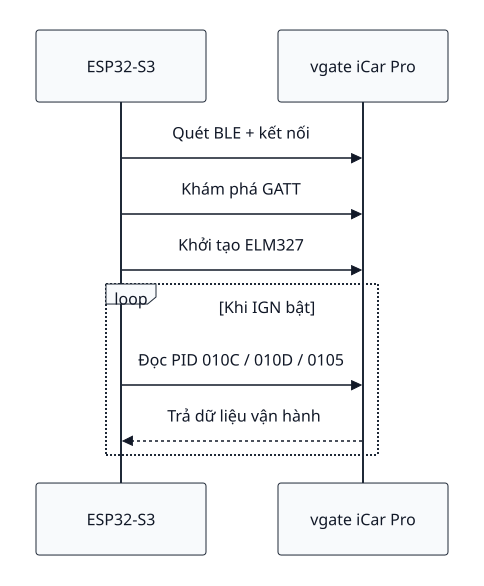

\

**BỘ GIÁO DỤC VÀ ĐÀO TẠO**
**ĐẠI HỌC PHENIKAA**\

---

``

**ĐỒ ÁN TỐT NGHIỆP**
**THIẾT KẾ HỆ THỐNG IOT CHO ỨNG DỤNG QUẢN LÝ PHƯƠNG TIỆN**
**GIAO THÔNG TRONG LĨNH VỰC CHO THUÊ XE TỰ LÁI**

**Sinh viên:** Lê Trọng An
**Mã số sinh viên:** 21010389 **Khóa:** K15
**Ngành:** Kỹ thuật Cơ Điện tử **Hệ:** Đại học chính quy
**Giảng viên hướng dẫn:** TS. Nguyễn Đức Nam

**Hà Nội - 2026**

**BỘ GIÁO DỤC VÀ ĐÀO TẠO**
**ĐẠI HỌC PHENIKAA**\

---

``

**ĐỒ ÁN TỐT NGHIỆP**
**THIẾT KẾ HỆ THỐNG IOT CHO ỨNG DỤNG QUẢN LÝ**
**PHƯƠNG TIỆN GIAO THÔNG TRONG LĨNH VỰC**
**CHO THUÊ XE TỰ LÁI**

**Sinh viên:** Lê Trọng An
**Mã số sinh viên:** 21010389 **Khóa:** K15
**Ngành:** Kỹ thuật Cơ Điện tử **Hệ:** Đại học chính quy
**Giảng viên hướng dẫn:** TS. Nguyễn Đức Nam

**Hà Nội – 2026**

**PHENIKAA UNIVERSITY**
**FACULTY OF MECHANICAL ENGINEERING AND MECHATRONICS**
``

**MEM710071 – CAPSTONE DESIGN 2**
**DESIGN OF AN IOT SYSTEM FOR VEHICLE MANAGEMENT**
**IN SELF-DRIVE CAR RENTAL SERVICES**
**Semester: I Academic year: 2025–2026**

**Project Team:**

| **Student name** | **Student ID** | **Cohort** |
| :--------------- | :------------- | :--------- |
| Le Trong An      |                | K15        |

**Course Instructor:** Dr. Nguyen Duc Nam

This report is submitted to the Faculty of Mechanical Engineering and
Mechatronics,
School of Engineering, Phenikaa University in partial fulfillment of the
requirements
of the Graduation Thesis course MEM710071.

**HANOI – 2026**

**ĐẠI HỌC PHENIKAA**
**KHOA CƠ KHÍ – CƠ ĐIỆN TỬ**
``

**MEM710071**
**ĐỒ ÁN TỐT NGHIỆP**
**THIẾT KẾ HỆ THỐNG IOT CHO ỨNG DỤNG QUẢN LÝ**
**PHƯƠNG TIỆN GIAO THÔNG TRONG LĨNH VỰC CHO THUÊ XE TỰ LÁI**
**Học kỳ I Năm học 2025–2026**

| **Họ và tên sinh viên** | **Mã số sinh viên** | **Lớp**    |
| :---------------------- | :------------------ | :--------- |
| Lê Trọng An             |                     | K15-KTCĐT2 |

**Giảng viên hướng dẫn:** TS. Nguyễn Đức Nam

**HÀ NỘI, 2026**

**BỘ GIÁO DỤC VÀ ĐÀO TẠO**
**ĐẠI HỌC PHENIKAA**\

---

**CỘNG HÒA XÃ HỘI CHỦ NGHĨA VIỆT NAM**
**Độc lập - Tự do - Hạnh phúc**\

---

**NHẬN XÉT ĐỒ ÁN TỐT NGHIỆP CỦA GIẢNG VIÊN HƯỚNG DẪN**

**Giảng viên hướng dẫn:** TS. Nguyễn Đức Nam **Khoa:** Cơ khí – Cơ Điện
tử.
**Tên đề tài:** Thiết kế hệ thống IoT cho ứng dụng quản lý phương tiện
giao thông trong lĩnh vực cho thuê xe tự lái.
**Sinh viên thực hiện:** Lê Trọng An. **Lớp:** K15-KTCĐT2.

**NỘI DUNG NHẬN XÉT**

**I. Nhận xét Đồ án tốt nghiệp:**\

- Nhận xét về hình thức:\
- Tính cấp thiết của đề tài:\
- Mục tiêu của đề tài:\
- Nội dung của đề tài:\
- Tài liệu tham khảo:\
- Phương pháp nghiên cứu:\
- Tính sáng tạo và ứng dụng:
  **II. Nhận xét về tinh thần và thái độ làm việc của sinh viên:**
  **III. Kết quả đạt được:**
  **IV. Kết luận:** Đồng ý cho bảo vệ: $`\square`$Không đồng ý cho bảo vệ:
  $`\square`$

Hà Nội, ngày …, tháng …năm 20…
**GIẢNG VIÊN HƯỚNG DẪN**
_(Ký, ghi rõ họ tên)_
TS. Nguyễn Đức Nam

**BỘ GIÁO DỤC VÀ ĐÀO TẠO**
**ĐẠI HỌC PHENIKAA**\

---

**CỘNG HÒA XÃ HỘI CHỦ NGHĨA VIỆT NAM**
**Độc lập - Tự do - Hạnh phúc**\

---

**NHẬN XÉT ĐỒ ÁN TỐT NGHIỆP CỦA GIẢNG VIÊN PHẢN BIỆN**

**Giảng viên phản biện:** Theo quyết định phân công phản biện của Khoa
**Tên đề tài:** Thiết kế hệ thống IoT cho ứng dụng quản lý phương tiện
giao thông trong lĩnh vực cho thuê xe tự lái.
**Sinh viên thực hiện:** Lê Trọng An **Lớp:** K15-KTCĐT2
**Giảng viên hướng dẫn:** TS. Nguyễn Đức Nam

**NỘI DUNG NHẬN XÉT**

**I. Nhận xét Đồ án tốt nghiệp:**\

- Bố cục, hình thức trình bày:\
- Đảm bảo tính cấp thiết, hiện đại, không trùng lặp:\
- Nội dung:\
- Mức độ thực hiện:
  **II. Kết quả đạt được:**
  **III. Ưu nhược điểm:**
  **IV. Kết luận:** Đồng ý cho bảo vệ: $`\square`$Không đồng ý cho bảo vệ:
  $`\square`$

Hà Nội, ngày …, tháng …năm 20…
**GIẢNG VIÊN PHẢN BIỆN**
_(Ký, ghi rõ họ tên)_
Theo quyết định phân công phản biện của Khoa

**BỘ GIÁO DỤC VÀ ĐÀO TẠO**
**ĐẠI HỌC PHENIKAA**\

---

**CỘNG HÒA XÃ HỘI CHỦ NGHĨA VIỆT NAM**
**Độc lập - Tự do - Hạnh phúc**\

---

**BIÊN BẢN ĐÁNH GIÁ ĐỒ ÁN TỐT NGHIỆP**

**I. Thông tin chung**

1. Thời gian: từ …giờ …đến …giờ …ngày …/…/20…
2. Địa điểm:
3. Họ và tên sinh viên: Lê Trọng An Mã số SV: 21010389
4. Lớp: K15-KTCĐT2 Ngành: Kỹ thuật Cơ Điện tử Khóa: K15
5. Tên đề tài: Thiết kế hệ thống IoT cho ứng dụng quản lý phương tiện
   giao thông trong lĩnh vực cho thuê xe tự lái.
6. Giảng viên hướng dẫn: TS. Nguyễn Đức Nam

**II. Thành phần hội đồng**

1. Chủ tịch
2. Thư ký
3. Giảng viên phản biện
4. Ủy viên 1

**III. Tổng hợp câu hỏi của thành viên hội đồng:\*\***IV. Tổng hợp nội dung trả lời của sinh viên:\***\*V. Nội dung đánh giá của Hội đồng**

1. Ý nghĩa của đồ án:
2. Về nội dung, kết cấu của đồ án:
3. Phương pháp nghiên cứu:
4. Các kết quả nghiên cứu đạt được:

**VI. Điểm kết luận:**  (Bằng chữ: )

**CHỦ TỊCH HỘI ĐỒNG**
_(Ký, ghi rõ họ tên)_\

**THƯ KÝ**
_(Ký, ghi rõ họ tên)_\

**GIẢI TRÌNH CÁC CHỈNH SỬA**
_(Nếu có)_

Chưa phát sinh nội dung cần giải trình.

# LỜI CAM ĐOAN

Tên tôi là: Lê Trọng An.
Mã sinh viên: 21010389 Lớp: K15-KTCĐT2
Ngành: Kỹ thuật Cơ Điện tử.

Tôi đã thực hiện đồ án tốt nghiệp với đề tài: Thiết kế hệ thống IoT cho
ứng dụng quản lý phương tiện giao thông trong lĩnh vực cho thuê xe tự
lái.

Tôi xin cam đoan đây là đề tài nghiên cứu của riêng tôi và được sự hướng
dẫn của TS. Nguyễn Đức Nam.

Các nội dung nghiên cứu, kết quả trong đề tài này là trung thực và chưa
được công bố dưới bất kỳ hình thức nào. Nếu phát hiện có bất kỳ hình
thức gian lận nào, tôi xin hoàn toàn chịu trách nhiệm trước pháp luật.

Hà Nội, ngày …, tháng …năm 20…

**GIẢNG VIÊN HƯỚNG DẪN**
_(Ký, ghi rõ họ tên)_
TS. Nguyễn Đức Nam

**SINH VIÊN**
_(Ký, ghi rõ họ tên)_
Lê Trọng An

# TÓM TẮT ĐỒ ÁN TỐT NGHIỆP - ABSTRACT

Sự phát triển nhanh của dịch vụ cho thuê xe tự lái tại Việt Nam làm gia
tăng nhu cầu giám sát phương tiện từ xa. Nhu cầu này không chỉ dừng ở
việc xác định vị trí xe, mà còn bao gồm theo dõi trạng thái vận hành,
nhận biết sớm các dấu hiệu bất thường và hỗ trợ người quản lý đưa ra
quyết định kịp thời trong quá trình vận hành đội xe. Từ yêu cầu đó, đồ
án tập trung thiết kế và triển khai một hệ thống giám sát phương tiện
hoàn chỉnh theo kiến trúc tích hợp, gồm thiết bị gắn trên xe, khối tiếp
nhận và xử lý dữ liệu trên máy chủ, cùng giao diện theo dõi dành cho
người quản lý.

Ở tầng thiết bị, hệ thống được xây dựng trên bo mạch PCB tự thiết kế.
Thiết bị sử dụng ESP32-S3 làm bộ điều khiển trung tâm, kết hợp modem
SIM7600CE-T để truyền dữ liệu qua mạng di động và lấy vị trí từ vệ tinh,
cảm biến gia tốc LIS3DH để nhận biết chuyển động khi xe đỗ, cùng bộ
chuyển đổi OBD2 qua BLE để thu thập các thông tin chẩn đoán từ xe. Kiến
trúc nguồn được tổ chức theo nhiều nhánh để thiết bị vẫn duy trì hoạt
động khi xe tắt máy, đồng thời giảm nguy cơ ảnh hưởng tới ắc quy chính.

Ở tầng máy chủ, dữ liệu gửi từ thiết bị được tiếp nhận, phân loại và
chuẩn hóa trước khi đưa vào các lớp lưu trữ và xử lý phù hợp. Cách tổ
chức này giúp hệ thống vừa theo dõi được dữ liệu mới theo thời gian thực,
vừa lưu lại lịch sử vận hành, trạng thái thiết bị, cảnh báo và tiến
trình cập nhật phần mềm từ xa để phục vụ quản trị về sau.

Ở tầng ứng dụng, hệ thống cung cấp một bảng điều khiển web để người quản
lý theo dõi vị trí xe, trạng thái thiết bị, lịch sử hành trình và các
cảnh báo trên cùng một giao diện thống nhất. Khi dữ liệu trên máy chủ có
thay đổi, giao diện được cập nhật gần như theo thời gian thực, nhờ đó
người vận hành không phải thao tác tải lại thủ công mà vẫn theo dõi được
diễn biến của đội xe.

Kết quả đạt được là một hệ thống IoT giám sát phương tiện hoàn chỉnh từ
phần cứng đến phần mềm, có khả năng theo dõi vị trí thời gian thực, đọc
dữ liệu chẩn đoán OBD2, thiết lập vùng cho phép, phát sinh cảnh báo tự
động, cập nhật firmware từ xa và hỗ trợ quản lý đội xe. Trong bối cảnh
đó, hệ thống cho thấy một hướng triển khai phù hợp với doanh nghiệp cho
thuê xe tự lái trong nước: chi phí hợp lý, có thể tùy biến và còn có khả năng mở rộng trong các giai đoạn tiếp theo.

**Từ khóa:** IoT, giám sát phương tiện, GPS, OBD2, MQTT, ESP32-S3, thời
gian thực, vùng cho phép

**Abstract (English)**

As the self-drive car rental market in Vietnam grows, the need for
remote vehicle monitoring and real-time fleet management becomes
increasingly practical for operators. This thesis presents the design
and implementation of an integrated vehicle-monitoring system with three
main layers: an onboard device that collects and transmits data, a
server-side processing layer that receives and organizes that data, and
a web-based dashboard that helps operators follow the fleet in daily
operation.

At the device layer, the system is built around a custom PCB rather than
a simple combination of development boards. The onboard unit uses an
ESP32-S3 as the main controller, a SIM7600CE-T module for mobile-data
communication and GNSS positioning, a LIS3DH accelerometer to detect
movement when the vehicle is parked, and an external BLE-based OBD2
adapter to read diagnostic data from the vehicle. Its power architecture
is split into multiple rails so that the device can continue operating
when the engine is off while reducing the risk of draining the main
battery.

At the server layer, incoming device messages are first received,
classified, and normalized before being sent to the appropriate storage
and processing paths. This organization allows the system to support
both real-time monitoring and longer-term history review, while also
keeping track of device state, alerts, and remote firmware-update
progress.

At the application layer, the system provides a web dashboard for
monitoring vehicle position, device status, trip history, and alerts in
a unified interface. When new data arrives, the dashboard is updated
almost in real time, allowing operators to follow fleet activity without
manual refresh actions.

The result is a complete end-to-end IoT vehicle tracking system, from
hardware to software, capable of real-time location tracking, OBD2
diagnostic data retrieval, allowed-zone monitoring, automated alerts,
remote firmware updates, and fleet-management support for self-drive car
rental services. In this context, the system demonstrates a practical
implementation approach for domestic self-drive rental operators: cost
conscious, adaptable, and open to further expansion in later stages.

**Keywords:** IoT, vehicle tracking, GPS, OBD2, MQTT, ESP32-S3,
real-time, allowed-zone monitoring

# LỜI CẢM ƠN - ACKNOWLEDGEMENTS

``

Trước tiên, tôi xin gửi lời cảm ơn chân thành và sâu sắc nhất đến TS.
Nguyễn Đức Nam — người đã trực tiếp hướng dẫn, định hướng và tận tình hỗ
trợ tôi trong suốt quá trình thực hiện đồ án tốt nghiệp này. Những góp ý
chuyên môn và sự động viên của thầy là nguồn động lực quan trọng giúp
tôi hoàn thành đề tài.

Tôi xin trân trọng cảm ơn quý thầy cô trong Khoa Cơ khí - Cơ Điện tử,
Trường Kỹ thuật - Đại học Phenikaa đã truyền đạt những kiến thức nền
tảng vững chắc trong suốt quá trình học tập, tạo điều kiện thuận lợi để
tôi có thể áp dụng vào thực tiễn thông qua đồ án này.

Tôi cũng xin gửi lời cảm ơn đến gia đình, bạn bè và các đồng nghiệp đã
luôn ủng hộ, chia sẻ và đồng hành cùng tôi trong suốt thời gian thực
hiện đề tài.

Mặc dù đã nỗ lực hoàn thiện đồ án trong phạm vi thời gian và kiến thức
cho phép, nội dung chắc chắn vẫn còn những thiếu sót. Tôi rất mong nhận
được những ý kiến góp ý từ quý thầy cô và hội đồng để tiếp tục hoàn
thiện đề tài.

Xin chân thành cảm ơn!

Hà Nội, ngày …tháng …năm 20…
**SINH VIÊN THỰC HIỆN**
Lê Trọng An

# MỤC LỤC - TABLE OF CONTENT

``

# DANH MỤC BẢNG - LIST OF TABLES

``

# DANH MỤC HÌNH ẢNH VÀ ĐỒ THỊ - LIST OF PICTURES AND GRAPHS

``

# DANH MỤC TỪ VIẾT TẮT - LIST OF ABBREVIATION

``

\|L0.160\|L0.410\|L0.360\| **Từ viết tắt** & **Tiếng Anh** & **Tiếng
Việt**
**Từ viết tắt** & **Tiếng Anh** & **Tiếng Việt**
**ADC** & Analog-to-Digital Converter & Bộ chuyển đổi tương tự sang số
**API** & Application Programming Interface & Giao diện lập trình ứng
dụng
**BLE** & Bluetooth Low Energy & Bluetooth năng lượng thấp
**BOM** & Bill of Materials & Danh sách linh kiện
**CI/CD** & Continuous Integration / Continuous Deployment & Tích hợp
liên tục / Triển khai liên tục
**CORS** & Cross-Origin Resource Sharing & Cơ chế chia sẻ tài nguyên
khác nguồn
**DDD** & Domain-Driven Design & Thiết kế hướng miền
**Docker** & Docker Container Platform & Nền tảng đóng gói và chạy ứng
dụng bằng container
**EMQX** & Erlang MQTT Broker & Broker MQTT xây dựng trên Erlang/OTP
**ESP32** & Espressif System-on-Chip 32-bit & Hệ thống trên chip 32-bit
của Espressif
**FreeRTOS** & Free Real-Time Operating System & Hệ điều hành thời gian
thực mã nguồn mở
**GPIO** & General Purpose Input/Output & Cổng vào/ra đa năng
**GNSS** & Global Navigation Satellite System & Hệ thống vệ tinh dẫn
đường toàn cầu
**GPS** & Global Positioning System & Hệ thống định vị toàn cầu
**HTTP** & Hypertext Transfer Protocol & Giao thức truyền siêu văn bản
**HTTPS** & Hypertext Transfer Protocol Secure & Giao thức truyền siêu
văn bản bảo mật
**IMU** & Inertial Measurement Unit & Đơn vị đo lường quán tính
**IoT** & Internet of Things & Internet vạn vật
**JWT** & JSON Web Token & Mã thông báo web định dạng JSON
**LVD** & Low Voltage Disconnect & Ngắt điện áp thấp
**MCU** & Microcontroller Unit & Vi điều khiển
**MQTT** & Message Queuing Telemetry Transport & Giao thức truyền bản
tin nhẹ theo mô hình publish/subscribe
**OBD2** & On-Board Diagnostics II & Chẩn đoán trên xe thế hệ 2
**ORM** & Object-Relational Mapping & Ánh xạ đối tượng - quan hệ
**PCB** & Printed Circuit Board & Bảng mạch in
**REST** & Representational State Transfer & Kiểu kiến trúc REST cho
dịch vụ web
**RTOS** & Real-Time Operating System & Hệ điều hành thời gian thực
**SoC** & System on Chip & Hệ thống trên chip
**SQL** & Structured Query Language & Ngôn ngữ truy vấn có cấu trúc
**TLS** & Transport Layer Security & Bảo mật tầng vận chuyển
**UART** & Universal Asynchronous Receiver-Transmitter & Bộ thu phát bất
đồng bộ đa năng
**WebSocket** & WebSocket Protocol & Giao thức giao tiếp hai chiều thời
gian thực\

---

# CHƯƠNG 1. GIỚI THIỆU DỰ ÁN – PROJECT OVERVIEW

## 1.1. Đặt vấn đề / Bối cảnh của dự án

### 1.1.1. Bối cảnh thị trường cho thuê xe tự lái tại Việt Nam

Những năm gần đây, thị trường cho thuê xe tự lái tại Việt Nam tăng
trưởng rõ rệt, đặc biệt tại TP. Hồ Chí Minh, Hà Nội và Đà Nẵng. Theo báo
cáo ngành vận tải \[1\], nhu cầu thuê xe tăng trung bình 15–20% mỗi năm
nhờ sự phục hồi của du lịch nội địa, nhu cầu di chuyển linh hoạt và xu
hướng chia sẻ phương tiện.

Với doanh nghiệp vận hành đội xe, tốc độ tăng trưởng này mang lại cơ hội
kinh doanh nhưng cũng kéo theo một yêu cầu rất thực tế: phải biết xe
đang ở đâu, đang được sử dụng như thế nào, có an toàn hay không, và tình
trạng vận hành của từng xe đang diễn biến ra sao. Trên thực tế, nhiều
đơn vị hiện nay không hoàn toàn quản lý xe theo cách thủ công, mà đã sử
dụng các thiết bị định vị GPS hoặc các giải pháp giám sát thương mại có
sẵn trên thị trường. Tuy nhiên, khi quy mô đội xe mở rộng, những công cụ
này vẫn bộc lộ các giới hạn rõ rệt về mức độ tập trung dữ liệu, khả năng
quan sát trạng thái kỹ thuật và mức độ phù hợp với nhu cầu vận hành đặc
thù của doanh nghiệp cho thuê xe tự lái. Trong thực tế, các doanh
nghiệp cho thuê xe tự lái hiện nay thường gặp bốn nhóm khó khăn sau:

- **Dữ liệu giám sát còn rời rạc và thiếu tập trung**: Nhiều doanh
  nghiệp đã gắn thiết bị GPS hoặc dùng nền tảng giám sát sẵn có, nhưng
  thông tin thu được thường chỉ dừng ở vị trí, tốc độ hoặc lịch sử di
  chuyển cơ bản. Dữ liệu vận hành vì thế nằm rải rác giữa nhiều công cụ
  khác nhau và chưa hình thành được một góc nhìn tập trung để người quản
  lý theo dõi toàn bộ đội xe trên cùng một hệ thống \[2\].
- **Khó kiểm soát việc sử dụng xe theo ngữ cảnh vận hành thực tế**: Khi
  hệ thống hiện có chủ yếu phục vụ định vị, doanh nghiệp vẫn khó phát
  hiện sớm các tình huống như xe đi vượt phạm vi cho phép, sử dụng sai
  mục đích, hoạt động bất thường ngoài thời gian dự kiến hoặc có dấu hiệu
  bị chiếm đoạt. Việc nhận biết các tình huống này thường chậm hơn nhu
  cầu can thiệp thực tế, làm tăng rủi ro về tài sản và an toàn vận hành
  \[3\].
- **Thiếu khả năng theo dõi trạng thái kỹ thuật từ xa**: Phần lớn các
  giải pháp định vị thương mại không đi sâu vào dữ liệu vận hành của xe,
  nên doanh nghiệp khó theo dõi tình trạng kỹ thuật từ xa và thường chỉ
  xử lý bảo trì khi sự cố đã biểu hiện rõ. Điều này làm tăng chi phí sửa
  chữa, giảm tính chủ động trong bảo trì và có thể rút ngắn tuổi thọ
  phương tiện.
- **Khó tùy biến và chi phí tích lũy cao khi mở rộng**: Các hệ thống
  giám sát thương mại hiện có trên thị trường thường đi kèm chi phí thiết
  bị, phí dịch vụ định kỳ và những ràng buộc nhất định về nền tảng. Khi
  doanh nghiệp muốn tích hợp sâu hơn với quy trình quản lý riêng, bổ sung
  cảnh báo theo nghiệp vụ, hoặc mở rộng theo quy mô đội xe, tổng chi phí
  và độ phụ thuộc vào nhà cung cấp có thể tăng lên đáng kể \[4\].

Những khó khăn trên cho thấy nhu cầu giám sát là rất rõ, nhưng chưa tự
động dẫn tới một lời giải khả thi. Muốn biến nhu cầu vận hành thành một
hệ thống thật sự dùng được, bài toán phải được chuyển thành các thách
thức kỹ thuật cụ thể.

### 1.1.2. Thách thức kỹ thuật

Để giải quyết những khó khăn trên, hệ thống không thể chỉ dừng ở một
thiết bị định vị gắn thêm lên xe. Khi chuyển từ nhu cầu biết vị trí sang
nhu cầu quản lý vận hành, bài toán lập tức mở rộng thành bài toán hệ
thống nhiều tầng: thiết bị phải bám được nguồn xe trong thời gian dài,
vẫn nhận biết được bất thường khi xe đỗ, chịu được điều kiện kết nối di
động biến động, và bảo đảm dữ liệu khi đi tới máy chủ vẫn đủ nhất quán
để người quản lý sử dụng trong thực tế.

Vì vậy, thách thức kỹ thuật cốt lõi của đề tài không nằm ở một chức năng
đơn lẻ, mà ở việc tổ chức được toàn bộ chuỗi từ thu thập, truyền thông,
xử lý đến khai thác thông tin sao cho phù hợp với môi trường vận hành
thực tế của đội xe. Các nhóm vấn đề này sẽ được phân tích chi tiết ở
Chương 2.

<!-- <figure id="fig:ch1-overview-problem-solution"
data-latex-placement="htbp">

 

<figcaption>Sơ đồ tổng quan vấn đề và giải pháp đề xuất</figcaption>
</figure> -->

### 1.1.3. Động lực thực hiện dự án

Động lực thực hiện đề tài xuất phát từ nhu cầu thực tế của doanh nghiệp
cho thuê xe tự lái: không chỉ cần biết vị trí phương tiện, mà còn cần
quan sát được trạng thái vận hành, phát hiện bất thường đủ sớm và có cơ
sở dữ liệu để hỗ trợ quyết định trong quá trình khai thác đội xe. Trong
bối cảnh đó, các công cụ theo dõi hiện có thường mới giải quyết tốt bài
toán định vị, trong khi nhu cầu quản lý lại đòi hỏi một chuỗi xử lý đầy
đủ hơn, từ thu thập dữ liệu trên xe, truyền dữ liệu ổn định, lưu trữ và
xử lý tập trung, đến hiển thị thông tin theo cách dễ theo dõi đối với
người vận hành.

Từ yêu cầu đó, đề tài **Thiết kế hệ thống IoT cho ứng dụng quản lý
phương tiện giao thông trong lĩnh vực cho thuê xe tự lái** được thực
hiện với định hướng xây dựng một hệ thống đồng bộ gồm thiết bị phần cứng
trên xe, phần mềm thiết bị nhúng, hạ tầng máy chủ và giao diện khai thác
thông tin. Cách tiếp cận này phù hợp hơn với đặc thù của bài toán quản
lý đội xe, đồng thời tạo cơ sở để phát triển một giải pháp có khả năng
mở rộng, tùy biến và thích nghi với điều kiện triển khai thực tế tại Việt
Nam.

---

## 1.2. Mục tiêu và phạm vi của dự án

### 1.2.1. Mục tiêu tổng quát

Mục tiêu chính của dự án là thiết kế và triển khai một hệ thống IoT theo
dõi phương tiện hoàn chỉnh cho bài toán quản lý đội xe cho thuê tự lái.
Mục tiêu này bao gồm cả thiết bị phần cứng trên xe, phần mềm thiết bị
nhúng, hạ tầng tiếp nhận và xử lý dữ liệu, cùng các lớp ứng dụng phục vụ
người vận hành. Từ yêu cầu của thực tế khai thác đội xe, hệ thống cần
vừa thu thập được dữ liệu hữu ích, vừa duy trì được độ ổn định khi lắp
đặt lâu dài trên xe, đồng thời bảo đảm dữ liệu được xử lý và đưa tới
người dùng đủ nhanh để hỗ trợ ra quyết định. Trên cơ sở đó, các mục tiêu
cụ thể của dự án được xác định như sau:

1. **Theo dõi vị trí và hành trình của phương tiện**: Hình thành khả
   năng quan sát đội xe theo thời gian thực và truy xuất lại lịch sử vận
   hành khi cần.
2. **Bổ sung lớp dữ liệu trạng thái vận hành cơ bản của xe**: Mở rộng từ
   bài toán định vị sang bài toán theo dõi trạng thái kỹ thuật ở mức đủ
   dùng cho quản lý đội xe.
3. **Duy trì giám sát ổn định trên xe trong nhiều trạng thái vận hành**:
   Hệ thống phải hoạt động được khi xe chạy, khi xe đỗ và khi điều kiện
   kết nối thay đổi.
4. **Phát hiện và chuyển tải được các tình huống bất thường**: Cảnh báo
   phải được hình thành đủ kịp thời để hỗ trợ can thiệp ở cấp vận hành.
5. **Xây dựng nền tảng xử lý và khai thác dữ liệu tập trung**: Dữ liệu từ
   xe cần được tiếp nhận, lưu trữ, xử lý và hiển thị theo một chuỗi đủ
   nhất quán cho người quản lý sử dụng.

Các mục tiêu trên xác lập đích đến ở cấp đề tài. Các yêu cầu kỹ thuật và
ngưỡng đánh giá cụ thể để hiện thực hóa các mục tiêu này sẽ được chuẩn
hóa ở Chương 2.

### 1.2.2. Phạm vi dự án

Để bảo đảm phạm vi nghiên cứu tập trung, nội dung triển khai được xác
định theo từng tầng của hệ thống: đối tượng ứng dụng, thiết bị phần
cứng, phần mềm thiết bị nhúng, hạ tầng máy chủ và lớp ứng dụng khai
thác. Việc xác định như vậy giúp làm rõ đâu là nội dung được triển khai
trực tiếp trong đồ án và đâu là nội dung mới dừng ở mức chức năng cơ
bản hoặc định hướng phát triển tiếp theo.

**Đối tượng ứng dụng:**

Đề tài tập trung vào nhóm ô tô con sử dụng trong dịch vụ cho thuê xe tự
lái, như sedan hoặc SUV cỡ nhỏ, với hệ thống điện 12V hoặc 24V và dải
ắc quy phổ thông thường gặp trên thị trường. Nhóm người dùng hướng tới
là các doanh nghiệp cho thuê xe tự lái quy mô vừa và nhỏ tại Việt Nam,
nơi nhu cầu theo dõi tập trung, chi phí đầu tư và khả năng tùy biến là
những yếu tố được đặt lên hàng đầu.

**Phạm vi phần cứng thiết bị:**

Ở tầng thiết bị, đồ án tập trung xây dựng một bộ theo dõi gắn trên xe
 dưới dạng bo mạch riêng, gồm khối điều khiển trung tâm, khối truyền dữ
liệu qua mạng di động và định vị vệ tinh, khối đọc dữ liệu chẩn đoán từ
xe, khối cảm biến chuyển động và khối nguồn dự phòng. Phạm vi này đủ để
thiết bị thực hiện được chuỗi chức năng cốt lõi: thu thập dữ liệu, nhận
biết trạng thái, truyền thông tin đi và duy trì hoạt động khi nguồn
chính bị gián đoạn trong thời gian ngắn.

**Phạm vi phần mềm thiết bị nhúng:**

Phần mềm thiết bị nhúng là lớp làm cho phần cứng có thể vận hành thực sự
trên xe. Trong phạm vi đồ án, lớp này bao gồm điều phối các khối thu thập
dữ liệu, giao tiếp với thiết bị đọc OBD2, quản lý kết nối truyền dữ liệu,
đóng gói bản tin gửi lên máy chủ và tổ chức các chế độ năng lượng tương
ứng với trạng thái chạy, đỗ hoặc cảnh báo. Thuật ngữ *firmware* trong đồ
án được hiểu theo nghĩa đó: phần mềm chạy trực tiếp trên thiết bị để điều
khiển hành vi của hệ thống ở tầng xe.

**Phạm vi máy chủ và dịch vụ xử lý dữ liệu:**

Ở phía máy chủ, đồ án tập trung vào chuỗi chức năng cần thiết để dữ liệu
sau khi rời xe có thể tiếp tục được tiếp nhận, phân loại, lưu trữ và xử
lý phục vụ khai thác. Chuỗi này bao gồm lớp tiếp nhận bản tin, lớp xử lý
và phân luồng dữ liệu, lớp lưu trữ cho dữ liệu nghiệp vụ, dữ liệu chuỗi
thời gian và nhật ký vận hành, cùng lớp dịch vụ cung cấp giao diện lập
trình ứng dụng cho web và di động. Phạm vi này được lựa chọn nhằm bảo
đảm hệ thống có thể xử lý dữ liệu với độ trễ thấp, lưu giữ trong thời
gian đủ dài và tránh hình thành các điểm nghẽn ngay từ giai đoạn đầu.

**Phạm vi ứng dụng khai thác:**

Giao diện web là bề mặt khai thác chính của hệ thống trong đồ án, phục vụ
theo dõi vị trí, lịch sử hành trình, cảnh báo và trạng thái thiết bị trên
một bảng điều khiển tập trung. Bên cạnh đó, ứng dụng di động cũng được
đưa vào phạm vi đề tài ở mức chức năng cơ bản, chủ yếu phục vụ theo dõi
nhanh vị trí và trạng thái phương tiện, nhận thông tin cảnh báo và truy
cập các dữ liệu vận hành thiết yếu.

**Giới hạn phạm vi nghiên cứu:**

- Đề tài chưa đi sâu vào các chức năng chẩn đoán OBD2 chuyên sâu; phạm
  vi hiện tại ưu tiên các thông số vận hành cơ bản và một phần mã lỗi
  chẩn đoán.
- Bài toán phát hiện va chạm chưa phải trọng tâm chính; cảm biến chuyển
  động hiện được dùng chủ yếu để nhận biết rung động và trạng thái bất
  thường khi xe đang đỗ.
- Hệ thống chưa triển khai các cơ chế điều khiển tác động trực tiếp tới
  xe như khóa máy hoặc can thiệp động cơ; chức năng hiện tại dừng ở mức
  phát hiện, cảnh báo và hỗ trợ ra quyết định.
- Ứng dụng di động mới được triển khai ở phạm vi cơ bản, chưa bao quát
  toàn bộ nghiệp vụ quản trị như trên giao diện web.

## 1.3. Các tiêu chí cần đạt được của dự án

Sau khi xác định mục tiêu và phạm vi, dự án cần một bộ tiêu chí ở cấp
định hướng để đối chiếu các quyết định thiết kế ở các chương sau. Trong
Chương 1, các tiêu chí này chỉ đóng vai trò khung tham chiếu tổng quát
cho toàn bộ đề tài; các yêu cầu định lượng và ràng buộc kỹ thuật chi tiết
sẽ được chuyển sang Chương 2 để tránh chồng lặp giữa phần giới thiệu và
phần phân tích vấn đề.

### 1.3.1. Tiêu chí phần cứng

Ở tầng phần cứng, thiết bị cần đáp ứng bốn yêu cầu định hướng:

- Làm việc ổn định khi lắp đặt lâu dài trên xe và không gây ảnh hưởng bất
  lợi tới hệ thống điện của phương tiện.
- Chịu được các điều kiện vận hành thường gặp như rung động, dao động
  điện áp và môi trường nhiệt độ thực tế.
- Có cơ chế duy trì hoạt động hoặc chuyển trạng thái phù hợp khi nguồn
  chính suy giảm hoặc bị gián đoạn ngắn.
- Đủ gọn và đủ thực dụng để có thể lắp đặt trên xe thật, thay vì chỉ phù
  hợp trong mô hình thử nghiệm.

### 1.3.2. Tiêu chí phần mềm thiết bị nhúng (firmware)

Ở tầng firmware, tiêu chí cốt lõi là khả năng điều phối thiết bị theo
đúng bối cảnh vận hành:

- Thu thập, chuẩn hóa và đóng gói được dữ liệu cần thiết từ các khối trên
  xe.
- Quản lý được nhiều trạng thái làm việc thay vì vận hành thiết bị theo
  một chế độ cố định.
- Phản ứng được với tín hiệu bất thường ở mức phù hợp với phạm vi đề tài.
- Có khả năng phục hồi sau gián đoạn kết nối và hạn chế làm mất dữ liệu
  quan trọng.

### 1.3.3. Tiêu chí máy chủ và dịch vụ xử lý dữ liệu

Ở phía máy chủ và xử lý dữ liệu, hệ thống cần:

- Tiếp nhận và xử lý dữ liệu liên tục với độ trễ đủ thấp cho giám sát
  vận hành.
- Tổ chức dữ liệu theo bản chất sử dụng để thuận lợi cho lưu trữ, truy
  vấn và theo dõi trạng thái hệ thống.
- Cung cấp lớp dịch vụ đủ ổn định cho web, di động và các chức năng quản
  trị cốt lõi.
- Duy trì cơ chế xác thực, phân quyền và quan sát hệ thống ở mức phù hợp
  với một nguyên mẫu có khả năng triển khai thử nghiệm.

### 1.3.4. Tiêu chí giao diện web

Giao diện web là nơi chuyển kết quả xử lý kỹ thuật thành công cụ quan sát
và ra quyết định. Vì vậy, tiêu chí định hướng ở đây là:

- Hiển thị đủ rõ vị trí, trạng thái thiết bị, hành trình và cảnh báo trên
  cùng một bề mặt khai thác.
- Cập nhật thông tin đủ nhanh để người vận hành không bị lệch khỏi trạng
  thái thực tế của đội xe.
- Ưu tiên tính dễ theo dõi, dễ tra cứu và phù hợp với bối cảnh điều hành
  nhiều phương tiện cùng lúc.

Các tiêu chí trên tạo thành bộ tham chiếu chung cho toàn bộ đồ án. Các
giá trị kỹ thuật cụ thể dùng để so sánh, ràng buộc và đánh giá phương án
sẽ được chuẩn hóa ở Chương 2.

---

## 1.4. Phương pháp tiếp cận thiết kế kỹ thuật

### 1.4.1. Phương pháp luận tổng thể

Đề tài bao gồm nhiều lớp kỹ thuật gắn chặt với nhau: thiết bị trên xe,
phần mềm thiết bị nhúng, truyền thông dữ liệu, hạ tầng máy chủ và lớp
ứng dụng. Vì vậy, cách tiếp cận của đồ án không phải tối ưu từng phần
riêng lẻ rồi mới ghép lại ở cuối, mà kiểm chứng từng lớp trong mối liên
hệ với toàn hệ thống.

Trên cơ sở đó, dự án được triển khai theo hai nguyên tắc. Thứ nhất là
**thiết kế từ dưới lên (bottom-up design)**: kiểm chứng trước những giả
định rủi ro nhất ở tầng thiết bị rồi mới mở rộng dần lên các tầng phía
trên. Thứ hai là **phát triển lặp (iterative development)**: thực hiện
theo từng vòng nhỏ, có đo đạc và điều chỉnh liên tục để phát hiện sớm
các xung đột về nguồn, kết nối, lưu trữ và hiệu năng. Tiến trình được tổ
chức như sau:

1. **Giai đoạn 1 — Nghiên cứu và thiết kế phần cứng**: Khảo sát linh
   kiện, đối chiếu datasheet, thiết kế sơ đồ nguyên lý và tính toán
   nguồn, nhằm tạo được một nền tảng phần cứng đủ ổn định để lắp trên xe.
2. **Giai đoạn 2 — Phát triển firmware**: Xây dựng phần mềm cho thiết bị
   để thu thập dữ liệu vận hành cần thiết, điều phối các khối ngoại vi,
   quản lý năng lượng và gửi dữ liệu lên máy chủ theo đúng trạng thái làm
   việc của xe.
3. **Giai đoạn 3 — Xây dựng hạ tầng máy chủ**: Tổ chức lớp tiếp nhận bản
   tin, lớp lưu trữ và lớp nhật ký vận hành để dữ liệu sau khi rời xe có
   thể được tiếp nhận và xử lý liên tục.
4. **Giai đoạn 4 — Phát triển API máy chủ**: Chuyển dữ liệu kỹ thuật
   thành các chức năng quản trị như đăng nhập, quản lý xe, xem lịch sử,
   xử lý cảnh báo và cung cấp dữ liệu thời gian thực cho lớp ứng dụng.
5. **Giai đoạn 5 — Phát triển giao diện web**: Trình bày dữ liệu dưới
   dạng bản đồ, bảng thông tin và biểu đồ để người vận hành quan sát và
   thao tác thuận tiện.
6. **Giai đoạn 6 — Tích hợp và kiểm thử**: Ghép toàn bộ các lớp lại
   thành một chuỗi hoàn chỉnh từ xe đến giao diện quản trị, sau đó kiểm
   thử, đo đạc và tối ưu các điểm còn nghẽn.

<figure id="fig:ch1-project-development-phases"
data-latex-placement="htbp">

 

<figcaption>Quy trình phát triển dự án theo các giai đoạn</figcaption>
</figure>

### 1.4.2. Kiến trúc hệ thống

Kiến trúc hệ thống được tổ chức theo ba lớp chức năng nối tiếp nhau từ
xe đến người quản lý.

- **Lớp trên xe**: thu thập dữ liệu vị trí, trạng thái vận hành và các
  tín hiệu bất thường; thực hiện tiền xử lý cần thiết rồi gửi dữ liệu ra
  ngoài.
- **Lớp máy chủ**: tiếp nhận bản tin, phân loại, lưu trữ và xử lý dữ
  liệu; đồng thời cung cấp các dịch vụ phục vụ tra cứu, cảnh báo và quản
  trị.
- **Lớp ứng dụng**: chuyển dữ liệu đã xử lý thành bản đồ, lịch sử hành
  trình, trạng thái thiết bị và các công cụ theo dõi để người quản lý sử
  dụng.

Cách phân lớp này giúp xác định rõ trách nhiệm của từng phần và giữ cho
luồng dữ liệu đi theo một chuỗi nhất quán từ thu thập, xử lý đến khai
thác thông tin. Trong phạm vi đồ án, ứng dụng di động chỉ được triển
khai ở mức chức năng cơ bản; trọng tâm vẫn là chuỗi chính từ thiết bị đến
giao diện quản trị web.

<figure id="fig:ch1-system-architecture-overview"
data-latex-placement="htbp">

 

<figcaption>Kiến trúc tổng thể hệ thống IoT Vehicle
Tracking</figcaption>
</figure>

Ngay từ giai đoạn kiến trúc, dữ liệu cũng được phân biệt theo ba nhóm:
nghiệp vụ, chuỗi thời gian và nhật ký. Việc phân nhóm này nhằm làm rõ
nhu cầu lưu trữ và xử lý cho từng loại dữ liệu; phần phân tích chi tiết
và cơ sở lựa chọn công nghệ sẽ được trình bày ở Chương 2 và Chương 3.

### 1.4.3. Chiến lược quản lý năng lượng

Quản lý năng lượng của thiết bị là bài toán cân bằng giữa khả năng giám
sát và việc bảo vệ ắc quy xe. Nếu ưu tiên theo dõi liên tục, hệ thống dễ
tiêu thụ điện lớn; nếu tiết kiệm quá mức, thiết bị có thể bỏ lỡ sự kiện
quan trọng. Vì vậy, đồ án định hướng tiếp cận theo nhiều trạng thái làm
việc, trong đó mỗi trạng thái chỉ duy trì những khối thật sự cần thiết
cho bối cảnh chạy xe, đỗ xe hoặc phát hiện bất thường.

Song song với đó, hệ thống cần có cơ chế bảo vệ điện áp thấp và nguồn dự
phòng để tránh rút cạn ắc quy xe trong quá trình bám nguồn dài hạn. Cách
tiếp cận này được xác lập ở mức nguyên tắc trong Chương 1; các tham số và
cơ chế triển khai cụ thể sẽ được làm rõ ở các chương sau.

<figure id="fig:ch1-power-mode-transitions" data-latex-placement="htbp">

 

<figcaption>Sơ đồ chuyển đổi giữa các chế độ năng lượng</figcaption>
</figure>

### 1.4.4. Công nghệ sử dụng

Ở mức tổng quan, hệ thống sử dụng một tập công nghệ trải từ thiết bị trên
xe, phần mềm thiết bị nhúng, hạ tầng máy chủ, lưu trữ dữ liệu đến giao
diện khai thác. Việc lựa chọn công nghệ được định hướng bởi bốn yêu cầu:
phù hợp với môi trường xe, hỗ trợ truyền thông thời gian thực, tách được
các loại dữ liệu khác nhau và thuận lợi cho triển khai thử nghiệm.

- **Tầng thiết bị**: vi điều khiển trung tâm, khối định vị và truyền dữ
  liệu di động, kết nối đọc dữ liệu xe, cảm biến chuyển động và nguồn dự
  phòng.
- **Tầng firmware**: framework nhúng và cơ chế điều phối tác vụ thời gian
  thực để điều khiển hành vi của thiết bị.
- **Tầng máy chủ và dữ liệu**: broker bản tin, dịch vụ API, lưu trữ dữ
  liệu nghiệp vụ, chuỗi thời gian và nhật ký.
- **Tầng ứng dụng và vận hành**: giao diện web quản trị, cơ chế cập nhật
  thời gian thực, công cụ bản đồ và biểu đồ, cùng lớp container hóa và
  giám sát hạ tầng.

Các công nghệ cụ thể và cơ sở lựa chọn sẽ không đi sâu ở Chương 1, mà
được phân tích theo đúng vai trò ở Chương 2 và chốt phương án ở Chương
3.

---

## 1.5. Kết quả và khuyến nghị

### 1.5.1. Kết quả đạt được

Kết quả của đồ án có thể tóm lược theo bốn lớp triển khai chính: phần
cứng, firmware, máy chủ và giao diện khai thác. Cách trình bày này cho
thấy hệ thống đã hình thành được một chuỗi vận hành tương đối hoàn chỉnh
từ thiết bị đến lớp sử dụng.

**Về phần cứng:**

- Hoàn thiện một thiết bị theo dõi dạng bo mạch riêng, tích hợp khối xử
  lý trung tâm, khối truyền dữ liệu và định vị, cảm biến chuyển động,
  nguồn dự phòng và khả năng kết nối để đọc dữ liệu OBD2.
- Kiến trúc nguồn và cơ chế bảo vệ điện áp thấp cho phép thiết bị duy trì
  hoạt động theo nhiều trạng thái vận hành mà không làm cạn ắc quy xe
  trong điều kiện sử dụng bình thường.
- Thiết bị đạt yêu cầu tiêu thụ thấp ở chế độ ngủ sâu (\< 500 µA) và có
  thể tự chuyển sang nguồn dự phòng khi điện áp nguồn chính xuống dưới
  ngưỡng an toàn.

**Về firmware:**

- Hoàn thiện phần mềm thiết bị có khả năng thu thập dữ liệu vận hành cơ
  bản, quản lý trạng thái năng lượng, phát hiện chuyển động bất thường và
  gửi dữ liệu lên máy chủ.
- Hệ thống có thể được đánh thức từ chế độ ngủ sâu trong thời gian ngắn
  (\< 3 giây) khi xuất hiện sự kiện cần theo dõi.

**Về hạ tầng máy chủ và xử lý dữ liệu:**

- Xây dựng được chuỗi tiếp nhận, phân loại, lưu trữ và xử lý dữ liệu từ
  thiết bị, đồng thời tách dữ liệu nghiệp vụ, dữ liệu thời gian và nhật
  ký vận hành theo đúng mục đích sử dụng.
- Hoàn thiện lớp dịch vụ phục vụ các chức năng quản trị cốt lõi như theo
  dõi phương tiện, quản lý thiết bị, xem dữ liệu vận hành, xử lý cảnh báo
  và quản lý vùng giám sát.
- Hệ thống đã được kiểm thử ở mức hơn 50 thiết bị đồng thời với độ trễ xử
  lý chính dưới 500 ms, cho thấy còn dư địa mở rộng trong giai đoạn tiếp
  theo.

**Về giao diện web:**

- Hoàn thiện giao diện quản lý tập trung với bản đồ thời gian thực, lịch
  sử hành trình, biểu đồ phân tích và hệ thống cảnh báo trực tuyến.
- Dữ liệu vị trí và trạng thái có thể được cập nhật lên giao diện với độ
  trễ dưới 2 giây.

### 1.5.2. Khuyến nghị và hướng phát triển

Từ kết quả hiện tại, các hướng phát triển tiếp theo được sắp theo thứ tự
ưu tiên từ việc củng cố hệ lõi đến mở rộng giá trị sử dụng của hệ thống:

1. **Ứng dụng di động (giai đoạn 2)**: Phát triển ứng dụng di động riêng
   để người quản lý giám sát đội xe trên điện thoại và nhận thông báo đẩy
   khi có cảnh báo \[8\].
2. **Tăng cường bảo mật**: Triển khai TLS/SSL cho kết nối MQTT trong
   môi trường vận hành thật, áp dụng danh sách quyền MQTT chi tiết hơn
   để mỗi thiết bị chỉ đi đúng kênh dữ liệu của mình, và bổ sung cơ chế
   mã hóa dữ liệu từ thiết bị tới máy chủ.
3. **Tối ưu hóa hiệu năng**: Nghiên cứu và áp dụng các kỹ thuật nén dữ
   liệu vận hành gửi liên tục, chẳng hạn chỉ gửi phần sai khác hoặc
   dùng định dạng gói gọn hơn, để giảm băng thông 4G, đặc biệt khi vận
   hành đội xe lớn (\> 500 xe).
4. **Tích hợp trí tuệ nhân tạo**: Áp dụng các mô hình học máy để phân
   tích hành vi lái xe, dự đoán thời điểm cần bảo trì và phát hiện các
   dấu hiệu bất thường từ dữ liệu vận hành đã thu thập.
5. **Mở rộng phạm vi OBD2**: Hỗ trợ đọc thêm nhiều thông số chẩn đoán
   xe, bao gồm mã lỗi DTC (Diagnostic Trouble Codes), dữ liệu động cơ
   nâng cao, và tích hợp với các loại xe điện (EV).
6. **Cải thiện khả năng mở rộng**: Nghiên cứu kiến trúc tách nhiều dịch
   vụ nhỏ và bổ sung cơ chế đệm hoặc hàng đợi bản tin chuyên dụng để xử
   lý luồng dữ liệu lớn hơn khi số lượng thiết bị tăng lên hàng ngàn.
7. **Tối ưu PCB cho sản xuất**: Nâng thiết kế PCB hiện tại theo hướng
   dễ sản xuất hơn và ít nhiễu điện từ hơn, giảm kích thước, tăng độ
   bền cơ khí và chuẩn bị cho sản xuất hàng loạt.

<figure id="fig:ch1-project-roadmap" data-latex-placement="htbp">

 

<figcaption>Lộ trình phát triển dự án theo các giai đoạn</figcaption>
</figure>

---

# CHƯƠNG 2. PHÂN TÍCH VẤN ĐỀ KỸ THUẬT

Chương 1 đã xác lập bối cảnh, mục tiêu và phạm vi của đề tài. Trên nền
tảng đó, Chương 2 chuyển trọng tâm sang việc quy nhu cầu vận hành thành
những vấn đề kỹ thuật có thể phân tích, so sánh và chuẩn hóa thành yêu
cầu thiết kế. Mục tiêu của chương không phải trình bày lời giải chi tiết,
mà làm rõ hệ thống thực sự bị chi phối bởi những ràng buộc nào về năng
lượng, truyền thông, lưu trữ và khai thác dữ liệu.

## 2.1. Mô tả vấn đề – Problem statement

### 2.1.1. Bối cảnh thực tế

Trong vận hành đội xe cho thuê tự lái, hệ thống giám sát phải làm việc
đồng thời trong nhiều bối cảnh khác nhau: xe đang chạy và cần cập nhật
liên tục, xe đang đỗ nhưng vẫn phải nhận biết bất thường, và xe di
chuyển qua các vùng có chất lượng kết nối thay đổi. Mỗi bối cảnh tạo ra
áp lực kỹ thuật khác nhau đối với thu thập dữ liệu, quản lý năng lượng,
truyền thông và xử lý phía máy chủ.

Vì vậy, khi chuyển từ nhu cầu vận hành sang bài toán kỹ thuật, trọng tâm
không còn là biết vị trí đơn thuần, mà là duy trì được một chuỗi dữ liệu
hữu ích và đủ tin cậy trong các điều kiện vận hành khác nhau. Trên cơ sở
đó, Chương 2 không lặp lại bối cảnh thị trường đã trình bày ở Chương 1,
mà đi thẳng vào các mâu thuẫn kỹ thuật nảy sinh trong quá trình thiết kế
hệ thống.

### 2.1.2. Xác định vấn đề kỹ thuật

Từ bối cảnh trên, bài toán của đề tài có thể quy về bốn nhóm vấn đề kỹ
thuật nền tảng. Đây là các nhóm vấn đề trực tiếp chi phối việc xác lập
tiêu chí và lựa chọn phương án ở các chương sau.

**Vấn đề 1: Cân bằng giữa thời lượng bám nguồn và mức sẵn sàng giám sát**

Thiết bị cần hiện diện trên xe trong thời gian dài, nhưng lại không được
gây suy giảm khả năng khởi động của phương tiện. Mâu thuẫn ở đây là nếu
ưu tiên theo dõi liên tục, tiêu thụ điện sẽ tăng; nếu tiết kiệm quá mức,
hệ thống có thể mất khả năng phản ứng khi cần thiết. Vì vậy, bài toán
không chỉ là giảm công suất, mà là xác định được khi nào phải hoạt động
đầy đủ và khi nào có thể chuyển sang trạng thái tiêu thụ thấp \[2\].

**Vấn đề 2: Phát hiện sự kiện ở trạng thái xe đỗ**

Xe đỗ là giai đoạn nhạy cảm vì đây là lúc yêu cầu tiết kiệm điện cao nhất
nhưng cũng là lúc dễ xuất hiện các tình huống như bị dắt đi, bị cẩu kéo
hoặc có tác động bất thường từ bên ngoài. Bài toán kỹ thuật vì thế nằm ở
khả năng duy trì mức giám sát tối thiểu, phát hiện đủ nhạy và đánh thức
hệ thống đúng lúc mà không biến trạng thái đỗ thành trạng thái tiêu thụ
điện liên tục.

**Vấn đề 3: Duy trì tính liên tục dữ liệu khi kết nối di động dao động**

Trong môi trường vận hành thực tế, chất lượng sóng di động thay đổi theo
vị trí, thời điểm và điều kiện che chắn. Điều đó làm phát sinh yêu cầu về
một cơ chế truyền thông có thể chịu được gián đoạn ngắn hạn, tự phục hồi
khi mạng quay lại và phân biệt được mức quan trọng khác nhau giữa dữ liệu
gửi theo chu kỳ và dữ liệu cảnh báo.

**Vấn đề 4: Tổ chức dữ liệu đa nguồn và giữ độ trễ toàn tuyến ở mức chấp
nhận được**

Hệ thống không chỉ nhận dữ liệu vị trí, mà còn phải xử lý trạng thái vận
hành, cảnh báo, nhật ký và dữ liệu quản trị. Các loại dữ liệu này có bản
chất khác nhau về tần suất phát sinh, yêu cầu nhất quán và cách truy vấn.
Do đó, bài toán ở phía máy chủ không đơn thuần là lưu được dữ liệu, mà là
tách đúng trách nhiệm xử lý, lưu trữ và khai thác để toàn bộ chuỗi từ xe
đến giao diện vẫn giữ được tính nhất quán và độ trễ phù hợp.

### 2.1.3. Mục tiêu kỹ thuật

Từ bốn nhóm vấn đề trên, phân tích kỹ thuật của đồ án tập trung vào bốn
mục tiêu:

1. Xác định tập dữ liệu tối thiểu nhưng đủ giá trị vận hành mà hệ thống
   cần thu thập từ phương tiện.
2. Xác lập nguyên tắc quản lý nguồn và chuyển trạng thái hoạt động giữa
   các bối cảnh chạy, đỗ và cảnh báo.
3. Xác lập tiêu chí lựa chọn cơ chế truyền thông và phục hồi dữ liệu phù
   hợp với đặc tính mạng di động.
4. Xác lập nguyên tắc tổ chức dữ liệu và lớp khai thác thông tin để hệ
   thống vẫn nhất quán khi quy mô tăng.

Các mục tiêu này mang tính phân tích: chúng dùng để dẫn dắt việc rà soát
cơ sở kỹ thuật ở mục 2.2 và chuẩn hóa thành yêu cầu thiết kế ở mục 2.3,
trước khi chuyển sang lựa chọn giải pháp ở Chương 3.

## 2.2. Bối cảnh và cơ sở kỹ thuật – Background and Technical reviews

### 2.2.1. Tổng quan về hệ thống IoT trong giám sát phương tiện

Đối với bài toán này, việc phân tích không thể tách rời từng thành phần
riêng lẻ, mà phải xét đồng thời bốn lớp kỹ thuật: thu thập dữ liệu trên
xe, điều phối và quản lý năng lượng trong thiết bị, truyền thông qua mạng
di động, và xử lý - khai thác phía máy chủ \[3\]. Một quyết định ở lớp
dưới thường kéo theo hệ quả ở lớp trên; chẳng hạn cách tổ chức chế độ
nguồn sẽ ảnh hưởng trực tiếp đến chu kỳ dữ liệu, còn cơ chế truyền thông
lại ảnh hưởng đến mô hình lưu trữ và cập nhật giao diện.

Điểm quan trọng của cách nhìn này là giá trị vận hành chỉ hình thành khi
các lớp cùng hoạt động như một chuỗi nhất quán. Vì vậy, các so sánh ở
mục 2.2 không nhằm chọn công nghệ theo mức độ phổ biến, mà nhằm xác định
những đặc tính kỹ thuật nào thực sự phù hợp với nhịp vận hành của hệ
thống.

### 2.2.2. Các giải pháp giám sát phương tiện hiện có

\|L0.220\|L0.170\|L0.190\|L0.280\|

**Tiêu chí** & **Giám sát thủ công** & **Thiết bị định vị cơ bản** &
**Nền tảng thương mại**\

**Tiêu chí** & **Giám sát thủ công** & **Thiết bị định vị cơ bản** &
**Nền tảng thương mại**
Chi phí đầu tư ban đầu & Thấp & Thấp đến trung bình & Trung bình đến cao
Phí duy trì hàng tháng & Không & Thấp & Trung bình đến cao
Khả năng theo dõi vị trí & Thấp & Trung bình & Cao
Khả năng quan sát trạng thái kỹ thuật & Không & Hạn chế & Có ở nhiều hệ
Phát hiện bất thường khi xe đỗ & Không & Hạn chế & Có ở các hệ hoàn
chỉnh hơn
Khả năng tích hợp với hệ thống quản trị riêng & Không & Hạn chế & Phụ
thuộc API và chính sách nhà cung cấp
Mức độ tùy biến theo nhu cầu riêng & Không áp dụng & Thấp & Thấp đến
trung bình
Mức độ phụ thuộc nhà cung cấp & Không & Trung bình & Cao\

Bảng so sánh cho thấy không có hướng tiếp cận nào vượt trội tuyệt đối
trên mọi tiêu chí. Giám sát thủ công có chi phí thấp nhưng thiếu dữ liệu;
thiết bị định vị cơ bản giải quyết được bài toán vị trí nhưng chưa đi sâu
vào trạng thái vận hành; trong khi đó, nền tảng thương mại thường cho độ
hoàn thiện cao hơn nhưng đi kèm chi phí và mức độ phụ thuộc lớn hơn.

Khoảng trống chung rút ra từ bảng này không phải là cần sao chép nguyên
vẹn một nền tảng thương mại, mà là cần một hệ thống có thể cân bằng bốn
yếu tố: đủ dữ liệu vận hành, đủ khả năng phát hiện bất thường, đủ mở để
tích hợp theo nhu cầu riêng, và đủ kiểm soát chi phí để có thể triển khai
trong bối cảnh doanh nghiệp cho thuê xe trong nước.

### 2.2.3. So sánh giao thức truyền thông IoT

Trong hệ thống theo dõi phương tiện, giao thức truyền thông không chỉ là
một lựa chọn kỹ thuật thuần túy, mà quyết định trực tiếp lượng dữ liệu
phải mang theo mỗi lần truyền, mức độ chịu lỗi khi sóng di động dao động
và cách thiết bị trao đổi với máy chủ \[4\]. Vì vậy, việc so sánh ở đây
không nhằm tìm giao thức "tốt nhất nói chung", mà nhằm xác định giao thức
phù hợp nhất với nhịp gửi bản tin nhỏ, liên tục và có lúc cần nhận lệnh
ngược.

\|L0.279\|L0.206\|L0.232\|L0.238\|

**Tiêu chí** & **MQTT** & **HTTP / REST** & **CoAP**\

**Tiêu chí** & **MQTT** & **HTTP / REST** & **CoAP**
Mô hình trao đổi & Phát bản tin theo kênh, bên nhận đăng ký theo dõi &
Gửi yêu cầu rồi chờ phản hồi & Gửi yêu cầu rồi chờ phản hồi
Giao thức truyền tải bên dưới & TCP & TCP & UDP
Phần dữ liệu phụ đi kèm mỗi gói & 2 byte (tối thiểu) & Hàng trăm byte &
4 byte
Mức cam kết giao bản tin & QoS 0, 1, 2 & Không có cơ chế riêng & Có xác
nhận / không xác nhận
Trao đổi hai chiều & Tốt & Hạn chế & Có
Mức phù hợp với bản tin nhỏ gửi lặp & Rất tốt & Trung bình & Tốt
Mức phổ biến trong hệ sinh thái IoT & Rất cao & Cao & Trung bình
Thuận lợi cho hạ tầng broker chuyên dụng & Tốt & Hạn chế hơn & Hạn chế\

Phân tích trên cho thấy bài toán này ưu tiên một giao thức có overhead
thấp, hỗ trợ truyền bản tin theo chu kỳ, cho phép phân mức độ tin cậy và
duy trì trao đổi hai chiều mà không đẩy thêm quá nhiều chi phí lên thiết
bị. Theo các tiêu chí đó, MQTT đáp ứng tương đối đầy đủ hơn hai phương án
còn lại.

Kết luận ở đây mang tính định hướng tiêu chí cho bước lựa chọn ở Chương
3, không phải chốt giải pháp triển khai cuối cùng. Điều quan trọng là xác
định được đặc tính giao thức mà hệ thống cần, thay vì chỉ chọn một chuẩn
vì mức độ phổ biến.

### 2.2.4. So sánh vi điều khiển (MCU)

Vi điều khiển trong hệ thống không chỉ làm nhiệm vụ xử lý dữ liệu, mà còn
phải điều phối đồng thời truyền thông, cảm biến, trạng thái nguồn và
logic vận hành. Vì vậy, tiêu chí so sánh không thể chỉ dựa vào xung nhịp
hay mức tiêu thụ của riêng MCU, mà phải xem xét cả mức độ tích hợp ngoại
vi, chi phí và độ phức tạp triển khai.

\|L0.230\|L0.218\|L0.260\|L0.246\|

**Tiêu chí** & **ESP32-S3** & **STM32L4** & **Raspberry Pi Zero 2W**\

**Tiêu chí** & **ESP32-S3** & **STM32L4** & **Raspberry Pi Zero 2W**
Kiến trúc & Xtensa LX7, dual-core, 240 MHz & ARM Cortex-M4, 80 MHz & ARM
Cortex-A53, quad-core, 1 GHz
RAM & 512 KB SRAM + 8 MB PSRAM & 256 KB SRAM & 512 MB DRAM
BLE tích hợp & Có & Không & Có
Wi-Fi tích hợp & Có & Không & Có
Mức tiêu thụ deep sleep & 10–15 µA & 1–2 µA & Không phù hợp cho deep
sleep
Giá thành (VND) & 80.000–150.000 & 150.000–300.000 & 400.000–600.000
Môi trường phát triển & ESP-IDF / Arduino & STM32CubeIDE / Mbed & Linux
/ Python
Mức độ hỗ trợ cộng đồng & Rất lớn & Lớn & Rất lớn
Mức phù hợp với thiết bị theo dõi & Cao & Trung bình & Thấp\

So sánh trên cho thấy mỗi nền tảng có lợi thế riêng. STM32L4 nổi bật ở
khả năng tiết kiệm điện của riêng vi điều khiển, còn Raspberry Pi Zero
2W mạnh ở năng lực xử lý tổng quát. Tuy nhiên, đối với bài toán của đề
tài, vi điều khiển còn phải kết nối nhiều giao tiếp khác nhau, hỗ trợ
logic năng lượng và giữ chi phí ở mức phù hợp để có thể nhân rộng.

Vì vậy, hướng ưu tiên hợp lý là nhóm nền tảng có tích hợp giao tiếp không
dây sẵn, hệ sinh thái phát triển lớn và chi phí vừa phải. ESP32-S3 là một
ứng viên tiêu biểu trong nhóm này, nhưng việc chốt lựa chọn cuối cùng vẫn
cần đặt cùng các ràng buộc và phương án tổng thể ở Chương 3.

### 2.2.5. So sánh cơ sở dữ liệu

Một điểm quan trọng của bài toán là dữ liệu không đồng nhất về bản chất.
Dữ liệu người dùng, phương tiện, cảnh báo hay cấu hình cần quan hệ rõ
ràng và tính nhất quán cao; trong khi dữ liệu vị trí, cảm biến và trạng
thái thiết bị lại phát sinh liên tục theo thời gian. Do đó, phần so sánh
cơ sở dữ liệu phải trả lời câu hỏi liệu nên gom tất cả về một hệ, hay
nên tách theo bản chất dữ liệu.

\|L0.203\|L0.285\|L0.240\|L0.226\|

**Tiêu chí** & **PostgreSQL + VictoriaMetrics** & **MongoDB + InfluxDB**
& **TimescaleDB**\

**Tiêu chí** & **PostgreSQL + VictoriaMetrics** & **MongoDB + InfluxDB**
& **TimescaleDB**
Dữ liệu quan hệ & Rất tốt & Trung bình & Tốt
Dữ liệu chuỗi thời gian & Rất tốt & Tốt & Tốt
Hiệu suất ghi dữ liệu liên tục & Cao & Cao & Trung bình
Hiệu quả nén dữ liệu & Rất tốt & Tốt & Tốt
Tài nguyên tiêu thụ & Thấp đến trung bình & Trung bình đến cao & Trung
bình
Ngôn ngữ truy vấn chính & SQL + MetricsQL & Mongo query + Flux/InfluxQL
& SQL
Khả năng tích hợp công cụ giám sát & Tốt & Tốt & Tốt
Độ phức tạp vận hành & Trung bình & Cao & Thấp\

Kết quả so sánh cho thấy điều cốt lõi không phải là chọn một tên cơ sở dữ
liệu duy nhất, mà là tách đúng dữ liệu theo bản chất sử dụng. Dữ liệu
nghiệp vụ và dữ liệu chuỗi thời gian có đặc tính tải khác nhau, nên một
kiến trúc lưu trữ phân vai rõ sẽ hợp lý hơn so với việc dồn toàn bộ dữ
liệu về một nơi.

Phương án công nghệ cụ thể cho kiến trúc dữ liệu vì thế sẽ được chốt ở
Chương 3, sau khi đối chiếu thêm với yêu cầu hiệu năng, chi phí và khả
năng vận hành của toàn hệ thống.

<figure id="fig:ch2-data-architecture-overview"
data-latex-placement="htbp">

 

<figcaption>Sơ đồ kiến trúc dữ liệu của hệ thống</figcaption>
</figure>

Từ các cơ sở kỹ thuật trên, có thể thấy quyết định thiết kế không nên
xuất phát từ mức độ phổ biến của công nghệ, mà từ mức độ phù hợp với
nhịp vận hành của hệ thống. Phần tiếp theo chuẩn hóa các kết quả phân
tích đó thành yêu cầu và ràng buộc thiết kế.

## 2.3. Yêu cầu kỹ thuật và các tiêu chuẩn thiết kế – Design criteria and Constraints

### 2.3.1. Yêu cầu chức năng

Sau khi xác định bài toán và bối cảnh kỹ thuật, bước tiếp theo là quy
chúng thành các yêu cầu chức năng cốt lõi. Đây là những năng lực tối
thiểu hệ thống phải có để hỗ trợ được việc giám sát và quản lý đội xe
trong thực tế.

**FC-01: Theo dõi vị trí và hành trình**

- Cập nhật vị trí phương tiện theo chu kỳ phù hợp với từng trạng thái
  vận hành.
- Lưu vết lịch sử hành trình để phục vụ truy xuất và đối chiếu.
- Duy trì độ chính xác vị trí đủ dùng cho theo dõi thực tế.

**FC-02: Thu thập trạng thái vận hành của xe**

- Đọc các thông số vận hành cơ bản và trạng thái làm việc của phương
  tiện từ giao diện chẩn đoán phù hợp.
- Đồng bộ dữ liệu trạng thái với dữ liệu vị trí để tạo ngữ cảnh vận hành
  đầy đủ hơn.
- Cho phép mở rộng phạm vi thông số khi cần trong các vòng phát triển
  tiếp theo.

**FC-03: Phát hiện bất thường và phát cảnh báo**

- Nhận biết các tình huống như chuyển động bất thường khi xe đỗ, vượt
  vùng giám sát hoặc mất kết nối thiết bị.
- Đẩy cảnh báo về máy chủ với mức ưu tiên phù hợp.
- Bảo đảm người vận hành có thể phân biệt giữa cảnh báo vận hành và lỗi
  kết nối.

**FC-04: Quản lý năng lượng và trạng thái thiết bị**

- Chuyển đổi giữa các chế độ làm việc theo trạng thái chạy, đỗ và cảnh
  báo.
- Bảo vệ ắc quy xe trong khi vẫn giữ mức giám sát cần thiết.
- Duy trì hoạt động trong các tình huống nguồn chính suy giảm hoặc gián
  đoạn ngắn.

**FC-05: Cung cấp giao diện khai thác tập trung**

- Hiển thị bản đồ, lịch sử hành trình, trạng thái thiết bị và cảnh báo
  trên cùng một hệ thống quản trị.
- Hỗ trợ tra cứu thông tin theo phương tiện, thời gian và loại sự kiện.
- Cung cấp các chức năng quản trị cơ bản phục vụ khai thác đội xe.

Năm nhóm chức năng trên bao quát chuỗi giá trị cốt lõi của hệ thống: thu
đúng dữ liệu, giữ được dữ liệu, phát hiện ngoại lệ và trình bày thông tin
theo cách người vận hành có thể sử dụng ngay.

### 2.3.2. Yêu cầu phi chức năng

Nếu yêu cầu chức năng trả lời hệ thống phải làm được gì, thì yêu cầu phi
chức năng cho biết hệ thống phải đạt tới mức nào để đủ giá trị sử dụng
trong môi trường vận hành thật.

**NFR-01: Hiệu năng**

- Độ trễ toàn tuyến từ thiết bị đến giao diện quản trị dưới 3 giây trong
  điều kiện mạng bình thường.
- Thời gian phản hồi API dưới 200 ms ở mức p95.
- Hỗ trợ tối thiểu 50 phương tiện hoạt động đồng thời, với dư địa mở
  rộng ổn định tới khoảng 100 thiết bị.

**NFR-02: Độ tin cậy**

- Có khả năng tự động phục hồi kết nối sau gián đoạn mạng.
- Giữ được cấu hình và trạng thái quan trọng khi thiết bị khởi động lại.
- Bảo đảm các bản tin cảnh báo và điều khiển được xử lý với mức tin cậy
  cao hơn dữ liệu gửi theo chu kỳ.

**NFR-03: Bảo mật**

- Xác thực người dùng theo cơ chế phiên rõ ràng và không để lộ trực tiếp
  thông tin nhạy cảm ở phía khách.
- Giới hạn quyền truy cập của từng thiết bị theo phạm vi dữ liệu được
  phép sử dụng.
- Áp dụng mã hóa cho các kênh truyền thông trong môi trường triển khai
  thực tế.

**NFR-04: Khả năng mở rộng**

- Tách hợp lý các lớp tiếp nhận, xử lý, lưu trữ và khai thác dữ liệu.
- Hạn chế hình thành điểm nghẽn đơn lẻ khi số lượng thiết bị tăng.
- Cho phép mở rộng dần từng lớp mà không phải thiết kế lại toàn bộ hệ
  thống.

**NFR-05: Khả năng bảo trì**

- Tổ chức chức năng và dữ liệu theo trách nhiệm rõ ràng để thuận lợi cho
  truy vết lỗi.
- Có hợp đồng API và cấu trúc dữ liệu được mô tả nhất quán.
- Duy trì cơ chế log và quan sát hệ thống đủ rõ cho vận hành và bảo trì.

Các yêu cầu trên xác định mức chất lượng tối thiểu mà hệ thống phải đạt.
Tuy nhiên, trong khuôn khổ đồ án, không gian thiết kế còn bị giới hạn bởi
những ràng buộc cụ thể về môi trường vận hành, nguồn lực triển khai và
chi phí.

### 2.3.3. Ràng buộc thiết kế

Các ràng buộc dưới đây giới hạn trực tiếp phạm vi lựa chọn kỹ thuật của
đề tài và buộc nhóm phải ưu tiên các phương án cân bằng hơn là các
phương án tối ưu cục bộ.

**Ràng buộc phần cứng và môi trường vận hành**

- Thiết bị phải làm việc với hệ điện 12V hoặc 24V của ô tô, trong điều
  kiện điện áp có thể dao động theo trạng thái nạp/xả.
- Thiết bị phải chịu được môi trường rung động, sốc cơ học và nhiệt độ
  thường gặp khi lắp đặt trong xe.
- Kích thước cần đủ gọn để lắp đặt kín, không gây ảnh hưởng đáng kể tới
  không gian và hệ thống điện hiện hữu của phương tiện.

**Ràng buộc triển khai và nguồn lực**

- Đề tài được thực hiện trong khuôn khổ thời gian và nguồn lực của đồ
  án, nên cần ưu tiên các nền tảng có tài liệu rõ, cộng đồng hỗ trợ tốt
  và thuận lợi cho thử nghiệm lặp.
- Hạ tầng phần mềm cần triển khai được trên môi trường máy chủ phổ thông
  và dễ tái tạo khi kiểm thử hoặc bàn giao.
- Phương án kỹ thuật cần đủ rõ để kiểm chứng theo từng lớp, thay vì phụ
  thuộc vào các thành phần quá đặc thù hoặc khó thay thế.

**Ràng buộc chi phí**

- Tổng chi phí phần cứng cho một thiết bị cần duy trì dưới khoảng
  2.000.000 VND.
- Ưu tiên linh kiện có nguồn cung tương đối ổn định và datasheet rõ
  ràng.
- Ưu tiên công nghệ mã nguồn mở để hạn chế chi phí giấy phép và giảm mức
  độ phụ thuộc nhà cung cấp.

### 2.3.4. Tiêu chuẩn thiết kế áp dụng

Bảng dưới đây tổng hợp các chuẩn và quy ước có ảnh hưởng trực tiếp đến
khả năng tương thích của hệ thống. Mục tiêu của phần này là xác định
khung kỹ thuật chung mà các lựa chọn ở chương sau phải tuân theo.

\|L0.231\|L0.278\|L0.455\|

**Chuẩn / quy ước** & **Mô tả** & **Áp dụng trong hệ thống**\

**Chuẩn / quy ước** & **Mô tả** & **Áp dụng trong hệ thống**
IEEE 802.15.1 (Bluetooth) & Chuẩn giao tiếp BLE & Kết nối thiết bị đọc
dữ liệu từ xe
3GPP LTE Cat-4 & Chuẩn truyền dữ liệu di động & Kênh liên lạc giữa thiết
bị và hạ tầng máy chủ
NMEA 0183 & Chuẩn bản tin định vị & Phân tích dữ liệu từ khối GNSS
SAE J1979 (OBD2) & Chuẩn chẩn đoán phương tiện & Đọc các thông số vận
hành cơ bản từ xe
MQTT v5.0 (OASIS) & Giao thức nhắn tin cho thiết bị IoT & Truyền dữ liệu
thiết bị - máy chủ
REST (RFC 7231) & Quy ước tổ chức API theo tài nguyên & Cung cấp API cho
lớp ứng dụng
Mã phiên ngẫu nhiên + ACL thiết bị & Quy ước xác thực và phân quyền &
Kiểm soát truy cập của người dùng và thiết bị\

Các yêu cầu và ràng buộc trên không xuất hiện độc lập; chúng được kéo bởi
những nhu cầu khác nhau của các nhóm sử dụng. Vì vậy, phần cuối của
chương làm rõ yêu cầu từ các bên liên quan và cách chúng ánh xạ vào các
nhóm chức năng đã xác định.

## 2.4. Yêu cầu từ các bên liên quan – Stakeholder requirements

### 2.4.1. Xác định các bên liên quan

Đối với hệ thống theo dõi phương tiện, yêu cầu kỹ thuật không thể tách
rời khỏi người sử dụng và người chịu tác động trực tiếp. Trong phạm vi
đề tài, bốn nhóm bên liên quan chính gồm: doanh nghiệp cho thuê xe, quản
trị viên hệ thống, đội bảo trì kỹ thuật và người vận hành xe. Mỗi nhóm
đặt ra một góc nhìn khác nhau về giá trị của hệ thống, từ đó ảnh hưởng
trực tiếp đến cách xác định ưu tiên thiết kế.

### 2.4.2. Ma trận yêu cầu các bên liên quan

\|L0.085\|L0.191\|L0.162\|L0.380\|L0.126\|

**STT** & **Bên liên quan** & **Vai trò** & **Yêu cầu chính** & **Mức độ
ưu tiên**\

**STT** & **Bên liên quan** & **Vai trò** & **Yêu cầu chính** & **Mức độ
ưu tiên**
& Công ty cho thuê xe & Chủ sở hữu và đơn vị khai thác & Theo dõi vị
trí và trạng thái xe; nhận cảnh báo bất thường; truy xuất lịch sử hành
trình và trạng thái khai thác & Cao
& Quản trị viên hệ thống & Đơn vị vận hành kỹ thuật & Theo dõi
online/offline; quản lý thiết bị và người dùng; bảo đảm hệ thống ổn
định, dễ quan sát & Cao
& Đội bảo trì & Kỹ thuật viên lắp đặt và bảo trì & Chẩn đoán từ xa; nắm
được trạng thái nguồn, kết nối và lỗi thiết bị; thuận lợi cho kiểm tra
và can thiệp & Trung bình
& Tài xế / người thuê xe & Người trực tiếp bị tác động bởi thiết bị &
Thiết bị không ảnh hưởng vận hành xe; không rút cạn ắc quy; dữ liệu được
xử lý trong phạm vi phù hợp & Trung bình\

### 2.4.3. Phân tích chi tiết yêu cầu

**Doanh nghiệp cho thuê xe**

Đây là nhóm bên liên quan trung tâm của đề tài. Nhu cầu cốt lõi của nhóm
này là nhìn thấy đội xe ở cấp vận hành: biết xe đang ở đâu, có đang hoạt
động đúng vùng và đúng trạng thái hay không, và có đủ dữ liệu lịch sử để
kiểm tra lại khi cần. Từ góc nhìn kỹ thuật, nhu cầu đó kéo theo yêu cầu
về dữ liệu vị trí liên tục, phát hiện ngoại lệ và khả năng truy vết hành
trình.

**Quản trị viên hệ thống**

Nhóm này không chỉ cần thông tin về phương tiện, mà còn cần thông tin về
chính hệ thống. Họ cần biết thiết bị nào đang trực tuyến, dịch vụ nào có
vấn đề và quyền truy cập của từng người dùng được kiểm soát ra sao. Vì
vậy, từ góc nhìn thiết kế, nhóm yêu cầu này dẫn đến nhu cầu về trạng thái
hệ thống rõ ràng, giao diện quản trị tập trung và cơ chế phân quyền nhất
quán.

**Đội bảo trì**

Đội bảo trì quan tâm trước hết đến khả năng chẩn đoán và can thiệp. Một
hệ thống khó quan sát ở tầng thiết bị sẽ làm tăng thời gian tháo lắp,
kiểm tra và xử lý sự cố. Do đó, các yêu cầu của nhóm này chuyển hóa thành
nhu cầu về dữ liệu sức khỏe thiết bị, trạng thái nguồn, tình trạng kết
nối và lịch sử lỗi đủ rõ để khoanh vùng vấn đề từ xa.

**Tài xế hoặc người thuê xe**

Mặc dù không trực tiếp khai thác hệ thống quản trị, đây vẫn là nhóm bị
tác động trực tiếp bởi thiết bị gắn trên xe. Từ góc nhìn kỹ thuật, hai
yêu cầu quan trọng nhất là thiết bị không được gây ảnh hưởng tiêu cực tới
khả năng vận hành của xe và việc thu thập dữ liệu phải nằm trong phạm vi
phục vụ mục tiêu quản lý hợp lý. Điều này tạo sức ép ngược lên bài toán
quản lý năng lượng, độ an toàn điện và ranh giới dữ liệu cần thu thập.

Nhìn tổng thể, các nhóm bên liên quan không yêu cầu những hệ chức năng
tách biệt hoàn toàn, mà cùng hội tụ vào một số năng lực lõi như giám sát
liên tục, phát hiện bất thường, bảo vệ ắc quy và khai thác tập trung.
Điều này được thể hiện rõ hơn trong ma trận truy xuất ở mục tiếp theo.

### 2.4.4. Ma trận truy xuất yêu cầu - chức năng

\|L0.237\|L0.122\|L0.122\|L0.186\|L0.168\|L0.101\|

**Yêu cầu bên liên quan** & **FC-01 (Vị trí)** & **FC-02 (Trạng thái)** &
**FC-03 (Cảnh báo)** & **FC-04 (Năng lượng)** & **FC-05 (Khai thác)**\

**Yêu cầu bên liên quan** & **FC-01 (Vị trí)** & **FC-02 (Trạng thái)** &
**FC-03 (Cảnh báo)** & **FC-04 (Năng lượng)** & **FC-05 (Khai thác)**
Giám sát vị trí và hành trình & X & & & & X
Theo dõi trạng thái vận hành phương tiện & & X & & & X
Phát hiện bất thường và ngoại lệ vận hành & X & & X & & X
Bảo vệ ắc quy và duy trì giám sát khi xe đỗ & & & X & X &
Quản trị thiết bị và người dùng tập trung & & & & & X
Hỗ trợ chẩn đoán và bảo trì từ xa & X & X & & X & X\

Ma trận truy xuất cho thấy không có chức năng nào tồn tại tách rời. FC-04
(quản lý năng lượng) và FC-05 (khai thác tập trung) là hai chức năng có
tính cắt ngang cao, vì chúng ảnh hưởng trực tiếp đến cả giá trị vận hành
lẫn khả năng sử dụng thực tế của hệ thống. Trên cơ sở đó, Chương 3 sẽ
chuyển từ mức phân tích vấn đề sang mức lựa chọn và tổ chức các giải pháp
thiết kế phù hợp.

---

# CHƯƠNG 3. CÁC GIẢI PHÁP THIẾT KẾ – DESIGN SOLUTIONS

Thiết kế một hệ thống theo dõi phương tiện chỉ thật sự có giá trị khi
mọi lựa chọn ở từng tầng cùng phục vụ một mục tiêu vận hành chung: lấy
được dữ liệu từ xe, giữ thiết bị an toàn trước nguồn điện ô tô, đưa dữ
liệu lên máy chủ ổn định và trả lại cho người vận hành dưới dạng dễ khai
thác. Vì thế, phần cứng, firmware, hạ tầng máy chủ và giao diện không
được chọn theo kiểu tối ưu riêng lẻ; chúng phải được chốt như những mắt
xích của cùng một chuỗi kỹ thuật.

## 3.1. Phân tích và đề xuất giải pháp phần cứng – Hardware analysis and solution

Thiết bị đặt trên xe là nơi các ràng buộc kỹ thuật xuất hiện rõ nhất.
Một mặt, thiết bị phải đọc được dữ liệu chẩn đoán và vị trí của xe. Mặt
khác, nó phải chịu được môi trường nguồn 12 V hoặc 24 V có biến động, vẫn
hoạt động khi xe tắt máy, và không làm tăng rủi ro cho hệ điện nguyên
bản. Vì vậy, phần cứng không thể được chọn theo tiêu chí “mạnh nhất” ở
từng linh kiện, mà phải được chọn theo tiêu chí “cân bằng nhất” cho một
thiết bị bám xe vận hành dài ngày.

_Hình 3.1: Sơ đồ khối tổng thể hệ thống tracker_

> Nguồn: Hình vẽ của tác giả

**Kiến trúc khối thiết bị.** Hình 3.1 cho thấy tracker được tách thành
năm khối chức năng chính: khối điều phối trung tâm, khối truyền dữ liệu
và định vị, khối lấy dữ liệu OBD2 từ xe, khối phát hiện chuyển động và
khối nguồn. Cách chia này rất quan trọng vì nó phản ánh đúng các điểm có
thể phát sinh lỗi ngoài thực địa. Nếu modem cần dòng lớn đột ngột thì đó
là vấn đề của khối nguồn; nếu xe đang đỗ nhưng thiết bị vẫn phải thức dậy
đúng lúc thì đó là quan hệ giữa khối cảm biến chuyển động và firmware,
không phải bài toán của modem hay giao diện.

**Vi điều khiển trung tâm.** Vi điều khiển là phần “đầu não” điều phối mọi
giao tiếp giữa cảm biến, modem, adapter OBD2 và mạch nguồn. Ba ứng viên
được đưa vào so sánh là ESP32-S3, STM32L4 và nRF52840, vì đây là ba nhóm
MCU đại diện cho ba hướng thiết kế khác nhau: cân bằng tích hợp, tối ưu
siêu tiết kiệm điện và tối ưu radio BLE [19], [20], [53], [54], [55],
[56].

\|L0.230\|L0.240\|L0.240\|L0.240\|

**Tiêu chí thiết kế** & **ESP32-S3** & **STM32L4** & **nRF52840**\

**Tiêu chí thiết kế** & **ESP32-S3** & **STM32L4** & **nRF52840**
BLE tích hợp cho OBD2 & Có BLE 5.0, tương thích ngược BLE 4.0 của adapter
OBD2 [19], [20] & Không tích hợp BLE, phải ghép thêm mô-đun ngoài [53],
[54] & Có BLE 5.x tích hợp [55], [56]
Ngoại vi cần cho tracker & 3 UART, I2C, ADC, đủ dư địa cho modem, debug
và cảm biến [19], [20] & Nhiều ngoại vi, nhưng phần BLE trở thành tải
tích hợp bổ sung [53], [54] & Radio BLE mạnh, nhưng số đường serial khả
dụng chặt hơn cho cấu hình hiện tại [55], [56]
Tài nguyên xử lý & Dual-core 240 MHz, 512 KB SRAM [19] & Cortex-M4 tới 80
MHz, RAM thấp hơn [54] & Cortex-M4F 64 MHz, 256 KB RAM [55], [56]
Chế độ ngủ sâu & Mức dòng deep sleep ở cấp microamp, chấp nhận được cho
thiết bị có modem riêng [19], [20] & Rất mạnh về low-power, nhưng lợi thế
này không triệt tiêu chi phí tích hợp BLE ngoài [53], [54] & Rất tốt cho
bài toán BLE, nhưng không giải quyết riêng bài toán modem LTE [55], [56]
Tác động đến BOM và tích hợp & Không cần thêm radio phụ, sơ đồ bo mạch
gọn hơn & Tăng số linh kiện, tăng miền nguồn và tăng công đoạn tích hợp &
Không cần BLE ngoài, nhưng ràng buộc tài nguyên giao tiếp chặt hơn

ESP32-S3 được chọn không phải vì nó có dòng ngủ sâu thấp nhất, mà vì nó
giữ được sự cân bằng tốt nhất cho kiến trúc đang triển khai. Thiết bị này
phải đồng thời duy trì BLE để làm việc với adapter OBD2, dùng UART để
điều khiển modem, dùng I2C cho cảm biến quán tính và dùng ADC để theo dõi
nguồn. Nếu chọn STM32L4, lợi thế tiết kiệm điện sẽ phải đánh đổi bằng một
mô-đun BLE rời. Nếu chọn nRF52840, phần radio rất phù hợp nhưng biên giao
tiếp cho modem và debug lại chặt hơn. Trong bối cảnh tracker chịu tải
năng lượng chủ yếu từ modem LTE và GNSS, phương án giảm phức tạp tích hợp
quan trọng hơn việc tối ưu riêng vài microamp ở MCU.

**Khối truyền dữ liệu và định vị.** Để thiết bị gửi bản tin lên máy chủ
và đồng thời xác định vị trí của xe, hệ thống cần một mô-đun LTE/GNSS.
LTE là mạng di động dùng để truyền dữ liệu, còn GNSS là nhóm hệ thống vệ
tinh định vị như GPS, GLONASS hay BeiDou. Vấn đề ở đây không chỉ là tốc
độ mạng, mà là số lượng mô-đun phải ghép, số đường giao tiếp phải quản lý
và mức độ đồng bộ giữa vị trí với bản tin đang gửi đi. Hai cấu hình dùng
A7670C và EC200U-CN dưới đây chỉ được dùng làm phương án so sánh, không
phải cấu hình triển khai cuối cùng của hệ thống.

\|L0.250\|L0.250\|L0.250\|L0.250\|

**Tiêu chí tích hợp** & **A7670C + NEO-M8N (so sánh)** & **EC200U-CN + NEO-M8N (so sánh)** & **SIM7600CE-T**\

**Tiêu chí tích hợp** & **A7670C + NEO-M8N (so sánh)** & **EC200U-CN + NEO-M8N (so sánh)** & **SIM7600CE-T**
Số mô-đun phần cứng & 2 mô-đun tách rời: một cho LTE, một cho GNSS [58],
[62] & 2 mô-đun tách rời, cách ghép tương tự [59], [61] & 1 mô-đun tích
hợp LTE và GNSS [21], [22]
Đường giao tiếp với MCU & Cần thêm đường dữ liệu cho GNSS riêng & Cần thêm
đường dữ liệu cho GNSS riêng & Một UART là đủ cho điều khiển chính của
modem [21], [22]
Đồng bộ firmware & Dễ tách riêng LTE và GNSS, nhưng nhiều trạng thái hơn
khi quản lý lỗi & Tương tự phương án tách rời & Đồng bộ logic vị trí và
truyền bản tin thuận lợi hơn trong runtime hiện tại
Đi dây và bố trí bo mạch & Nhiều điểm nối, nhiều điểm lỗi tiềm tàng hơn &
Nhiều điểm nối, nhiều điểm lỗi tiềm tàng hơn & Đi dây gọn hơn, phù hợp
thiết bị kích thước nhỏ
Ý nghĩa với đề tài & Phù hợp nếu ưu tiên thay thế từng mô-đun độc lập &
Phù hợp nếu cần chọn nhà cung cấp khác cho LTE & Phù hợp nhất khi ưu tiên
giảm độ phức tạp tích hợp và giữ firmware mạch lạc

SIM7600CE-T được chốt vì nó đưa ra một sự đánh đổi phù hợp hơn cho thiết
bị bám xe: LTE Cat-4, GNSS tích hợp, nguồn làm việc 3.4–4.2 V và một
đường UART chính để điều khiển [21], [22]. Việc giảm từ hai mô-đun xuống
một mô-đun không chỉ giúp bo mạch gọn hơn; nó còn làm firmware dễ giữ
trạng thái nhất quán hơn khi thiết bị phải chuyển liên tục giữa các chế độ
lái xe, đỗ xe, cảnh báo và ngủ sâu. Trong runtime hiện tại, modem được
ghép qua `GPIO17/GPIO18` cho `TX/RX`, `GPIO34` cho `PWRKEY` và `GPIO35`
cho `RESET`, nhờ đó phần cứng và firmware dùng cùng một sơ đồ điều khiển.

**Khối khai thác dữ liệu OBD2.** OBD2 là cổng chẩn đoán tiêu chuẩn của xe,
cho phép đọc các thông tin như số vòng quay động cơ, tốc độ xe, nhiệt độ
động cơ hoặc mã lỗi chẩn đoán. Với đề tài này, yêu cầu quan trọng nhất
không phải là “đọc được nhiều PID nhất”, mà là lắp đặt nhanh, ít xâm lấn
và còn giữ được khả năng thay thiết bị giữa nhiều xe thuê tự lái.

\|L0.250\|L0.240\|L0.240\|L0.270\|

**Tiêu chí triển khai** & **OBD2 có dây** & **OBD2 BLE qua vgate iCar Pro** & **Ý nghĩa đối với đề tài**\

**Tiêu chí triển khai** & **OBD2 có dây** & **OBD2 BLE qua vgate iCar Pro** & **Ý nghĩa đối với đề tài**
Lắp đặt thực địa & Tracker phải bố trí gần cổng OBD2, đi dây kém linh hoạt
& Không cần dây nối trực tiếp giữa tracker và cổng OBD2 & Phù hợp hơn cho
xe thuê tự lái cần tháo lắp nhanh
Tài nguyên trên MCU & Thường chiếm thêm một đường UART riêng & Tận dụng BLE
tích hợp sẵn trên ESP32-S3 & Giữ tài nguyên serial cho modem và debug
Khả năng thay thế adapter & Mỗi lần thay thường đụng vào dây nối vật lý &
Rút/cắm adapter dễ hơn, chỉ cần ghép lại kết nối BLE khi cần & Bảo trì
ngoài hiện trường thuận lợi hơn
Tương quan với deep sleep & Dây không giúp thiết bị tránh reconnect sau
ngủ sâu & BLE cũng phải reconnect sau ngủ sâu, nhưng chi phí tích hợp thấp
hơn & Không có phương án nào bỏ được reconnect; vì vậy ưu tiên cách ghép
đơn giản hơn
Phương án chốt & Không ưu tiên & Được chọn: vgate iCar Pro BLE [26], [29],
[64] & Cân bằng tốt giữa tính cơ động, tương thích và độ gọn của bo mạch

_Hình 3.2: Sơ đồ kết nối BLE giữa ESP32-S3 và vgate iCar Pro_

> Nguồn: Hình vẽ của tác giả

Adapter vgate iCar Pro BLE phù hợp với bài toán này vì nó đi theo chuẩn
BLE 4.0, hỗ trợ kiểu giao tiếp ELM327 phổ biến và được nhà sản xuất công
bố hỗ trợ nhiều giao thức OBD-II thông dụng [29], [64]. Điểm quan trọng ở
đây là báo cáo chỉ giữ những thông tin có thể kiểm chứng. Chẳng hạn, các
tài liệu hãng có nêu khả năng tự ngủ sau một khoảng thời gian khi xe tắt
máy, nhưng không công bố rõ một giá trị dòng tiêu thụ active/standby áp
dụng chắc chắn cho đúng biến thể đang dùng. Vì vậy, lựa chọn này được
lập luận bằng tính tương thích giao thức, mức độ thuận tiện triển khai và
kinh nghiệm thực địa, thay vì khẳng định một con số dòng điện không có
nguồn chính thức.

**Khối phát hiện chuyển động.** Khi xe đang đỗ, thiết bị không nên giữ
modem và BLE hoạt động liên tục chỉ để chờ một rung động nhỏ. Vai trò đó
được giao cho LIS3DH, một cảm biến gia tốc số ba trục hoạt động trong dải
1.71–3.6 V, hỗ trợ giao tiếp I2C/SPI, nhiều thang đo từ ±2 g đến ±16 g và
quan trọng nhất là có hai chân ngắt phần cứng `INT1/INT2` [23], [24].
Nhờ cơ chế ngắt này, cảm biến có thể tự báo cho vi điều khiển khi rung
động vượt ngưỡng, thay vì buộc MCU phải tự thức dậy theo chu kỳ ngắn để
thăm dò cảm biến.

_Hình 3.3a: Sơ đồ chi tiết chân kết nối LIS3DH với ESP32-S3_

> Nguồn: Hình vẽ UML kỹ thuật của tác giả

Với wiring hiện tại, bus I2C của LIS3DH được ghép vào `GPIO2/GPIO1` cho
`SDA/SCL`, còn hai đường ngắt `INT1/INT2` đi vào `GPIO41/GPIO42`. Cách
ghép này cho phép firmware dùng `INT1` như nguồn đánh thức chính cho kịch
bản xe đang đỗ nhưng có chuyển động bất thường, trong khi vẫn giữ `INT2`
cho các trường hợp mở rộng về sau.

**Kiến trúc nguồn và bảo vệ.** Nếu coi modem, BLE hay OBD2 là những phần
“tạo ra dữ liệu”, thì khối nguồn là phần quyết định liệu hệ thống có còn
tồn tại đủ lâu để dùng được dữ liệu đó hay không. Thiết bị gắn trên xe
không thể dùng một rail nguồn duy nhất cho mọi tải, vì modem LTE có thể
tạo xung dòng lớn, trong khi khối logic và cảm biến lại cần nguồn sạch và
ổn định hơn.

_Hình 3.4a: Kiến trúc nguồn và phân phối điện áp trong hệ thống_

> Nguồn: Hình vẽ UML kỹ thuật của tác giả

Vì lý do đó, hệ thống dùng kiến trúc nguồn đa rail. MP2482 tạo rail 5 V
chính từ nguồn xe; AP2112-3.3 hạ xuống 3.3 V cho MCU và cảm biến; TPS54231
tạo rail riêng cho modem để chịu tải biến thiên lớn hơn; SX1308 nâng áp
từ pin dự phòng 18650 1S lên 5 V; TP5100 chịu trách nhiệm sạc pin 1S; còn
power path diode-OR làm nhiệm vụ đường ưu tiên nguồn giữa nhánh chính và
nhánh dự phòng [30]. Bên cạnh đó, ADC được dùng để theo dõi điện áp, còn
LVD (low-voltage disconnect), tức mạch ngắt điện áp thấp, ngăn thiết bị
rút cạn ắc quy xe khi điện áp xuống dưới ngưỡng an toàn. Cách tổ chức này
phức tạp hơn mạch nguồn một nhánh, nhưng đổi lại nó giải trực diện đúng
bài toán của tracker: không làm reset khi modem tải nặng và không biến
thiết bị thành nguyên nhân gây cạn bình.

\|L0.220\|L0.330\|L0.450\|

**Thành phần chốt** & **Thông số hoặc đặc tính chính** & **Ý nghĩa trong BOM thực dùng**\

**Thành phần chốt** & **Thông số hoặc đặc tính chính** & **Ý nghĩa trong BOM thực dùng**
ESP32-S3 & Dual-core 240 MHz, BLE 5.0, 3 UART, I2C, ADC, deep sleep mức
microamp [19], [20] & Đủ tài nguyên để điều phối BLE OBD2, modem, cảm biến
và giám sát nguồn mà không phải thêm MCU hay radio phụ
SIM7600CE-T & LTE Cat-4, GNSS tích hợp, nguồn 3.4–4.2 V, điều khiển qua
UART [21], [22] & Gộp truyền dữ liệu di động và định vị trong một mô-đun,
giảm dây nối và giảm trạng thái phải quản lý
vgate iCar Pro BLE & BLE 4.0, hỗ trợ kiểu giao tiếp ELM327 và nhiều giao
thức OBD-II thông dụng [29], [64] & Cho phép lấy dữ liệu từ xe theo hướng
ít xâm lấn, dễ thay adapter giữa các xe
LIS3DH & Cảm biến gia tốc 3 trục, 1.71–3.6 V, thang đo ±2 g đến ±16 g,
giao tiếp I2C/SPI, có `INT1/INT2` [23], [24] & Cho phép đánh thức thiết bị
theo chuyển động thật, thay vì phải thức dậy thăm dò liên tục
Khối nguồn & MP2482, AP2112-3.3, TPS54231, SX1308, TP5100, pin 18650 1S,
power path diode-OR, ADC và LVD [30] & Bảo đảm ổn định rail, có dự phòng
khi mất nguồn xe và bảo vệ ắc quy chính khỏi vùng điện áp không an toàn

Từ đây có thể chốt rằng cấu hình phần cứng phù hợp nhất cho đề tài không
phải là cấu hình ít linh kiện nhất, mà là cấu hình giảm được ba rủi ro
lớn nhất của thiết bị bám xe: thiếu tương thích với xe, thiếu ổn định
nguồn và thiếu nhất quán giữa phần cứng với firmware đang vận hành.

## 3.2. Phân tích và đề xuất giải pháp Firmware – Firmware analysis and solution

Khi cấu hình phần cứng đã được chốt, bài toán firmware không còn là “đọc
được bao nhiêu thiết bị ngoại vi”, mà là điều phối chúng sao cho đúng
ngữ cảnh vận hành của xe. Trên thực tế, modem có thể phản hồi chậm, BLE
có thể rớt kết nối, cảm biến chuyển động có thể đánh thức thiết bị giữa
đêm, và lệnh cập nhật từ xa có thể đến khi xe vừa chuyển trạng thái. Nếu
firmware chỉ được viết như một chuỗi thao tác tuần tự, hệ thống sẽ nhanh
chóng trở nên khó dự đoán và khó tiết kiệm điện.

**Mô hình điều phối.** Ba cách tổ chức firmware thường gặp là vòng lặp
tuần tự, chia thành nhiều tác vụ ngang hàng, hoặc dùng máy trạng thái
trung tâm kết hợp một số dịch vụ nền. Điểm khác nhau giữa ba cách này
nằm ở chỗ ai sẽ giữ “bức tranh tổng thể” của thiết bị tại từng thời điểm.

\|L0.240\|L0.250\|L0.220\|L0.290\|

**Mô hình firmware** & **Điểm mạnh** & **Điểm yếu** & **Mức phù hợp với tracker**\

**Mô hình firmware** & **Điểm mạnh** & **Điểm yếu** & **Mức phù hợp với tracker**
Vòng lặp tuần tự (superloop) & Dễ viết, dễ hình dung với thiết bị đơn
giản & Khi một khối chờ lâu, toàn bộ luồng bị chậm; khó xử lý modem, BLE
và sleep cùng lúc & Không phù hợp
Nhiều tác vụ ngang hàng tách biệt & Tận dụng RTOS, tức hệ điều hành thời
gian thực, cho các việc chờ I/O & Dễ sinh tranh chấp trạng thái, khó truy
vết khi nhiều khối cùng thay đổi ngữ cảnh & Chỉ phù hợp từng phần
Máy trạng thái trung tâm kết hợp dịch vụ nền & Mỗi trạng thái có mục tiêu
rõ, dễ ràng buộc ai được bật và ai phải ngủ; vẫn dùng RTOS cho việc chờ
BLE/modem & Đòi hỏi thiết kế kỷ luật ngay từ đầu & Phương án chốt

Tracker của đề tài được xây theo hướng event-driven, nghĩa là phản ứng
theo sự kiện, nhưng lõi điều phối vẫn là một máy trạng thái trung tâm.
RTOS vẫn xuất hiện trong hệ thống, song nó không bị dùng như nơi phân rã
toàn bộ ứng dụng thành những task ngang quyền. Các phần cần chờ giao tiếp
dài như BLE hay modem được tách ra để tránh chặn luồng, còn quyền quyết
định “thiết bị đang ở bối cảnh nào” vẫn thuộc về state machine. Đây là
khác biệt quan trọng, vì tracker trên xe cần hành vi nhất quán hơn là
cần thật nhiều task chạy song song.

_Hình 3.5: Sơ đồ kiến trúc phân lớp của firmware_

> Nguồn: Hình vẽ của tác giả

Trong runtime hiện tại, thiết bị đi qua bảy trạng thái chính:
`APP_STATE_INIT`, `APP_STATE_CHECK_IGN`, `APP_STATE_DRIVING`,
`APP_STATE_PARKED`, `APP_STATE_ALARM`, `APP_STATE_HEARTBEAT` và
`APP_STATE_SLEEP`. Các tên trạng thái này không chỉ là nhãn kỹ thuật; chúng
phản ánh đúng những gì người vận hành quan tâm ngoài thực địa. Khi xe
đang chạy, thiết bị ưu tiên kết nối OBD2, lấy vị trí và gửi bản tin với
mật độ cao hơn. Khi xe đang đỗ, nó ưu tiên ngủ sâu và chỉ đánh thức theo
chuyển động hoặc heartbeat định kỳ. Khi phát hiện cảnh báo, nó bật lại
những khối thật sự cần để xác nhận và phát bản tin cảnh báo.

_Hình 3.11: Sơ đồ máy trạng thái của thiết bị theo dõi_

> Nguồn: Hình vẽ của tác giả

\|L0.230\|L0.290\|L0.480\|

**Nhóm mô-đun** & **Mô-đun runtime đại diện** & **Vai trò trong kiến trúc firmware**\

**Nhóm mô-đun** & **Mô-đun runtime đại diện** & **Vai trò trong kiến trúc firmware**
Điều phối trạng thái & `state_machine_core`, `state_wake_prelude`,
`state_sleep_controller` & Giữ quyền quyết định trạng thái chung của thiết
bị, chuẩn bị điều kiện trước khi thức dậy và kiểm soát khi nào được phép
ngủ sâu
Kết nối OBD2 qua BLE & `ble_mgr`, `ble_obd`, `state_obd_runtime` & Tách
riêng lớp giao tiếp BLE với adapter khỏi lớp xử lý dữ liệu OBD2, nhờ đó
dễ reconnect và dễ cô lập lỗi tương thích adapter
Điều khiển modem và GNSS & `modem_lte`, `modem_gnss` & Cô lập chuỗi điều
khiển AT, trạng thái mạng di động và việc lấy vị trí khỏi logic nghiệp vụ
chính
Đóng gói và phát bản tin & `state_publish_pipeline` & Gom dữ liệu từ OBD2,
GNSS, IMU và nguồn điện thành các bản tin nhất quán trước khi gửi đi
Cấu hình bền vững & `config_store_nvs` cùng runtime config & Lưu các tham
số như chu kỳ heartbeat, chu kỳ cảnh báo, ngưỡng an toàn và tùy chọn
sleep trong vùng nhớ không mất dữ liệu khi tắt nguồn
Cập nhật từ xa & `state_ota_runtime` & Ràng buộc điều kiện an toàn trước
khi OTA và theo dõi tiến trình cập nhật

Điểm quan trọng nhất của kiến trúc này là mọi mô-đun đều phục vụ cùng một
trạng thái vận hành, chứ không tự chạy theo mục tiêu riêng. BLE không tự
quyết định lúc nào phải kết nối; modem không tự quyết định lúc nào phải
bật lâu hơn; publish pipeline cũng không tự quyết định lúc nào phải gửi
dày hơn. Tất cả đều phụ thuộc vào việc xe đang chạy, đang đỗ hay đang ở
trạng thái cảnh báo. Nhờ đó, logic tiết kiệm điện và logic giữ dữ liệu
nhất quán không bị tách rời nhau.

Firmware cũng được tham số hóa thay vì “đóng cứng” toàn bộ trong mã
nguồn. Các chu kỳ gửi bản tin, chu kỳ heartbeat, tùy chọn deep sleep,
ngưỡng cảnh báo hay các thông số hành vi khác được lưu trong NVS, tức
vùng nhớ không mất dữ liệu sau khi tắt nguồn. Điều này đặc biệt quan
trọng với hệ thống triển khai trên nhiều xe, vì mỗi nhóm xe có thể cần
cadence gửi dữ liệu và ngưỡng phát hiện khác nhau nhưng không nên buộc
đội vận hành phải biên dịch lại firmware cho từng lần điều chỉnh.

## 3.3. Phân tích và đề xuất kiến trúc máy chủ và xử lý dữ liệu – Server and data-processing architecture

Khi dữ liệu rời khỏi xe, vấn đề kỹ thuật đổi từ “lấy được dữ liệu” sang
“đưa dữ liệu vào đúng chỗ và trả về đúng người dùng”. Hai loại tải xuất
hiện song song ở đây có bản chất rất khác nhau. Tầng ingest phải nhận
bản tin thiết bị liên tục, chịu được nhịp gửi thay đổi theo trạng thái
vận hành của xe. Trong khi đó, backend và giao diện lại phải phục vụ các
tác vụ nghiệp vụ như xem lịch sử, cấu hình vùng cho phép, tra cứu cảnh
báo hay điều khiển cập nhật từ xa. Nếu trộn cả hai việc vào cùng một nơi,
hệ thống sẽ khó mở rộng và khó cô lập lỗi hơn.

_Hình 3.12a: Luồng dữ liệu chi tiết từ thiết bị đến dashboard_

> Nguồn: Hình vẽ của tác giả

**Cách chia lớp kiến trúc.** Chuỗi xử lý đang dùng là
`EMQX -> MQTT Bridge -> PostgreSQL / VictoriaMetrics / VictoriaLogs ->
Backend -> Socket.IO -> Frontend`. EMQX là broker MQTT, tức điểm trung tâm
nhận và phân phối bản tin publish/subscribe [32]. MQTT Bridge là dịch vụ
trung gian chuyên trách việc kiểm tra topic, chuẩn hóa payload và quyết
định bản tin phải đi vào kho lưu trữ nào. Backend đứng sau lớp ingest để
chuyển dữ liệu đã được làm sạch thành API, logic nghiệp vụ và sự kiện
realtime cho người dùng.

\|L0.240\|L0.250\|L0.220\|L0.290\|

**Phương án kiến trúc** & **Ưu điểm** & **Hạn chế** & **Đánh giá với runtime hiện tại**\

**Phương án kiến trúc** & **Ưu điểm** & **Hạn chế** & **Đánh giá với runtime hiện tại**
Backend nhận MQTT trực tiếp rồi tự lưu dữ liệu & Ít dịch vụ hơn, dễ hình
dung ở quy mô rất nhỏ & Trộn ingest với nghiệp vụ người dùng, khó scale và
khó cô lập lỗi & Không phù hợp
Broker dùng rules engine để ghi thẳng vào kho dữ liệu & Luồng ingest gọn,
ít lớp trung gian & Logic xử lý dễ dồn vào broker, khó quản lý phiên bản
và khó kiểm thử độc lập & Chỉ phù hợp cho bài toán hẹp
Tách broker, bridge và backend & Mỗi lớp giữ một trách nhiệm rõ: nhận bản
tin, chuẩn hóa/lưu trữ, rồi phục vụ nghiệp vụ & Nhiều thành phần hơn, đòi
hỏi thiết kế giao tiếp rõ ràng & Phương án chốt

Việc tách MQTT Bridge khỏi backend là quyết định có ý nghĩa nền tảng.
Bridge chỉ trả lời câu hỏi “bản tin vào hệ thống bằng cách nào cho đúng”,
còn backend trả lời câu hỏi “người dùng cần khai thác gì từ các dữ liệu đã
vào hệ thống”. Nhờ tách như vậy, nếu sau này cần tăng số lượng thiết bị
hoặc thay đổi logic chuẩn hóa dữ liệu, tầng API và dashboard không bị kéo
theo toàn bộ.

**Chiến lược lưu trữ.** Dữ liệu của hệ thống không đồng nhất về bản chất,
vì vậy không nên ép tất cả vào cùng một cơ sở dữ liệu. Dữ liệu nghiệp vụ
như người dùng, xe, thiết bị, cấu hình, cảnh báo hay vùng cho phép cần mô
hình quan hệ rõ ràng. Dữ liệu vận hành như vị trí, vận tốc, điện áp hay
chuỗi bản tin theo thời gian lại cần tối ưu cho truy vấn time-series. Còn
log vận hành và dấu vết xử lý lỗi cần một kho lưu trữ phù hợp cho tìm kiếm
và truy vết.

_Hình 3.13: Sơ đồ chiến lược lưu trữ kép_

> Nguồn: Hình vẽ của tác giả

\|L0.220\|L0.240\|L0.220\|L0.320\|

**Lớp kiến trúc** & **Thành phần chốt** & **Loại dữ liệu xử lý** & **Lý do phù hợp**\

**Lớp kiến trúc** & **Thành phần chốt** & **Loại dữ liệu xử lý** & **Lý do phù hợp**
Tầng nhận bản tin & EMQX [32] & Bản tin MQTT từ thiết bị & Broker chuyên
cho publish/subscribe, phù hợp khi số lượng thiết bị tăng
Tầng ingest trung gian & MQTT Bridge & Topic `rawdata`, `status`, `events`,
`firmware` và các sự kiện nội bộ & Tách chuẩn hóa và định tuyến dữ liệu ra
khỏi tầng phục vụ người dùng
Tầng dữ liệu quan hệ & PostgreSQL [33] & Người dùng, xe, thiết bị, cảnh
báo, cấu hình, vùng cho phép & Phù hợp cho nghiệp vụ cần ràng buộc và truy
vấn quan hệ
Tầng dữ liệu chuỗi thời gian & VictoriaMetrics [34] & Telemetry biến đổi
liên tục theo thời gian & Phù hợp cho truy vấn time-series hiệu quả
Tầng log vận hành & VictoriaLogs [35] & Log sự kiện, log xử lý, dấu vết
lỗi & Phù hợp cho quan sát hệ thống và truy vết
Tầng nghiệp vụ ứng dụng & Backend Node/Express tổ chức theo miền nghiệp vụ
`api/domain/infrastructure/shared` [36] & API, xác thực, nghiệp vụ và
socket realtime & Giữ mã nguồn phản ánh rõ miền chức năng, dễ mở rộng hơn
Tầng cập nhật giao diện & Socket.IO [39] & Sự kiện realtime cho frontend &
Giảm nhu cầu polling liên tục, giúp dashboard phản hồi nhanh hơn

Trong cách tổ chức này, backend không đọc trực tiếp bản tin thiết bị thô
để phục vụ giao diện. Nó lắng nghe các sự kiện nội bộ do bridge phát ra,
hiện đang đi trên nhánh `internal/events/#`, rồi chuyển các thay đổi cần
thiết thành API hoặc thông báo realtime cho người dùng. Cấu trúc này giúp
giữ ranh giới rất rõ: dữ liệu thô được xử lý ở tầng ingest, còn dữ liệu
nghiệp vụ được xử lý ở tầng backend. Đó là lý do mô hình tách lớp hiện
tại phù hợp hơn nhiều so với một dịch vụ “ôm hết”.

## 3.4. Phân tích và đề xuất công nghệ giao diện web – Web interface analysis and solution

Giao diện web là nơi dữ liệu kỹ thuật được biến thành thao tác vận hành.
Người dùng không chỉ xem một chấm vị trí trên bản đồ; họ phải đồng thời
xem trạng thái xe, xử lý cảnh báo, tra cứu hành trình, cấu hình vùng cho
phép và theo dõi số liệu tổng hợp. Điều đó khiến frontend của đề tài gần
với một dashboard điều hành hơn là một trang hiển thị đơn giản.

_Hình 3.15a: Luồng dữ liệu một chiều giữa Next.js, Query, Zustand và Backend_

> Nguồn: Hình vẽ của tác giả

**Nguyên tắc chọn công nghệ.** Bộ công nghệ frontend được chọn theo đúng
những gì dashboard cần: một khung ứng dụng để chia trang và điều hướng,
một lớp quản lý dữ liệu lấy từ máy chủ, một lớp trạng thái cục bộ cho các
tương tác trên màn hình, một thư viện bản đồ, một thư viện biểu đồ và một
kênh nhận dữ liệu realtime. Mỗi công nghệ được chọn vì nó giải một nhu cầu
cụ thể, chứ không phải vì tên công nghệ đó đang phổ biến.

\|L0.230\|L0.250\|L0.520\|

**Nhu cầu giao diện** & **Công nghệ chốt** & **Lý do chọn trong dashboard thời gian thực**\

**Nhu cầu giao diện** & **Công nghệ chốt** & **Lý do chọn trong dashboard thời gian thực**
Khung ứng dụng web & Next.js + React [37], [38] & Next.js là khung ứng
dụng xây trên React, giúp tổ chức rõ trang công khai và trang điều hành,
giữ luồng điều hướng mạch lạc cho hệ thống nhiều nghiệp vụ
Dữ liệu lấy từ máy chủ & TanStack Query [46] & Theo dõi tải dữ liệu, lưu
bộ nhớ đệm, làm mới khi cần và giúp nhiều màn hình dùng lại cùng một nguồn
dữ liệu mà không phải tự viết lại logic cache
Trạng thái tương tác cục bộ & Zustand [45] & Giữ các trạng thái nhẹ như xe
đang chọn, panel đang mở hay bộ lọc trên bản đồ mà không trộn với dữ liệu
nghiệp vụ từ máy chủ
Bản đồ và vùng cho phép & Leaflet / React-Leaflet [40] & Phù hợp cho bản
đồ nhiều lớp, marker xe, vùng cho phép và các thao tác trực tiếp trên bản
đồ trong dashboard
Biểu đồ số liệu vận hành & Recharts [41] & Trình bày số liệu gọn, dễ đọc,
phù hợp giao diện quản trị hơn là các biểu đồ thiên về trình diễn
Luồng cập nhật realtime & Socket.IO client [39] & Nhận trạng thái mới từ
backend nhanh hơn polling liên tục, giữ cảm giác theo dõi trực tiếp

Điểm mấu chốt của kiến trúc này nằm ở việc tách rõ hai loại trạng thái.
TanStack Query giữ những dữ liệu đến từ máy chủ như danh sách thiết bị,
vị trí, hành trình, cảnh báo hay cấu hình. Zustand chỉ giữ những trạng
thái phục vụ thao tác giao diện như xe nào đang được chọn, lớp nào đang
hiển thị hoặc bảng điều khiển nào đang mở. Khi hai nhóm trạng thái này
không bị trộn lẫn, dashboard dễ mở rộng hơn và cũng dễ truy vết lỗi hơn.

_Hình 3.19a: Phân rã lớp bản đồ React Leaflet và kênh Socket.IO_

> Nguồn: Hình vẽ của tác giả

Trong các màn hình của hệ thống, bản đồ là nơi biểu hiện rõ nhất của cách
phối hợp công nghệ. Leaflet chịu trách nhiệm cho lớp bản đồ tương tác và
các hình học của vùng cho phép; Socket.IO đưa vị trí và sự kiện mới từ
backend; TanStack Query giữ dữ liệu nền cần đồng bộ lại; Zustand giúp
người dùng giữ ngữ cảnh thao tác như xe đang theo dõi hay lớp bản đồ đang
bật. Recharts bổ sung một lớp nhìn thứ hai bằng biểu đồ, giúp người vận
hành không phải đọc toàn bộ dữ liệu thô mà vẫn nắm được xu hướng vận hành.
Tổ hợp `Next.js + React + TanStack Query + Zustand + Leaflet + Recharts +
Socket.IO` vì thế phù hợp với đúng bài toán của đề tài: một dashboard
nghiệp vụ có dữ liệu thay đổi liên tục và cần phản hồi mạch lạc.

## 3.5. Phân tích, đánh giá và lựa chọn phương án khả thi – Analysis, Evaluation and Selection

Khi đặt các lựa chọn của bốn tầng cạnh nhau, tiêu chí quyết định không
còn là ưu điểm riêng của từng công nghệ, mà là mức độ chúng hỗ trợ nhau
trong cùng một chuỗi vận hành. Một phần cứng rất tiết kiệm điện nhưng làm
firmware trở nên rối sẽ không phải phương án tốt. Tương tự, một backend
đơn giản nhưng trộn ingest với nghiệp vụ người dùng cũng không bền khi hệ
thống bắt đầu tăng số lượng thiết bị.

\|L0.230\|L0.180\|L0.260\|L0.330\|

**Tiêu chí xuyên tầng** & **Mức ưu tiên** & **Phương án được giữ** & **Cơ sở lựa chọn**\

**Tiêu chí xuyên tầng** & **Mức ưu tiên** & **Phương án được giữ** & **Cơ sở lựa chọn**
Lắp đặt ít xâm lấn & Rất cao & OBD2 qua adapter BLE ngoài, modem tích hợp
LTE/GNSS & Giảm can thiệp vào xe, rút ngắn thao tác lắp đặt và thay thế
Tính liên tục dữ liệu & Rất cao & Nguồn đa rail, state machine trung tâm,
ingest tách riêng & Giữ hệ thống ổn định hơn khi nguồn, mạng hoặc trạng
thái vận hành thay đổi
Khả năng mở rộng & Cao & Tách EMQX, MQTT Bridge, các kho lưu trữ, backend
và frontend & Mỗi tầng có thể mở rộng theo tải riêng mà không kéo sập cả
chuỗi
Khả năng quan sát và bảo trì & Cao & Lưu trữ kép, log tập trung, dashboard
realtime & Dễ lần theo đường đi của dữ liệu từ thiết bị đến giao diện
Chi phí triển khai pilot & Cao & Ưu tiên mô-đun tích hợp hợp lý và stack
mã nguồn mở & Kiểm soát được cả chi phí thiết bị lẫn chi phí hạ tầng giai
đoạn đầu

Theo các tiêu chí đó, phương án khả thi nhất là phương án có mức tích hợp
vừa đủ ở thiết bị, có máy trạng thái làm lõi điều phối ở firmware, có
cloud tách lớp rõ ở tầng ingest và nghiệp vụ, và có dashboard tách được
dữ liệu máy chủ khỏi trạng thái tương tác. Đây là một kết luận xuyên tầng:
khối nguồn ổn định giúp firmware ít rơi vào trạng thái lỗi hơn; firmware
rõ trạng thái giúp dữ liệu đi vào cloud nhất quán hơn; còn cloud tách lớp
giúp frontend nhận được dữ liệu realtime đáng tin cậy hơn.

## 3.6. Tối ưu phương án thiết kế – The optimal solution

Phương án tối ưu được chốt từ những phân tích trên là một cấu hình có
chủ đích rõ ràng ở từng tầng nhưng vẫn giữ được sự ăn khớp khi ghép lại:
ESP32-S3 làm bộ điều phối trung tâm; SIM7600CE-T phụ trách cả LTE và
GNSS; vgate iCar Pro BLE cung cấp đường đọc OBD2 ít xâm lấn; LIS3DH làm
nguồn đánh thức theo chuyển động; kiến trúc nguồn đa rail cùng pin 18650
1S và TP5100 giữ thiết bị an toàn trước biến động nguồn xe; firmware dùng
state machine trung tâm; cloud đi theo chuỗi
`EMQX -> MQTT Bridge -> PostgreSQL/VictoriaMetrics/VictoriaLogs -> Backend
-> Socket.IO -> Frontend`; còn dashboard dùng Next.js, React, TanStack
Query, Zustand, Leaflet và Recharts như một công cụ vận hành thời gian
thực.

_Hình 3.23: Sơ đồ kiến trúc tổng thể phương án tối ưu_

> Nguồn: Hình vẽ của tác giả

Giá trị của phương án này không nằm ở việc từng thành phần đều “mạnh
nhất” nếu đứng một mình. Giá trị của nó nằm ở chỗ mỗi quyết định đều làm
cho mắt xích kế tiếp dễ đúng hơn: phần cứng giảm rủi ro nguồn và rủi ro
tương thích xe; firmware giữ hành vi nhất quán theo trạng thái; cloud
phân vai rõ giữa ingest và nghiệp vụ; frontend biến dữ liệu kỹ thuật thành
thao tác quản trị. Đó là lý do cấu hình hiện tại được xem là tối ưu cho
bài toán đồ án: tối ưu theo toàn hệ thống, không phải tối ưu cục bộ cho
từng khối.

# CHƯƠNG 4. TRIỂN KHAI GIẢI PHÁP VÀ KẾT QUẢ – IMPLEMENTATION AND RESULTS

Phần triển khai được trình bày theo đúng đường đi của hệ thống: thiết bị
trên xe, firmware điều khiển thiết bị, hạ tầng máy chủ và giao diện người
dùng. Cách trình bày này giúp đối chiếu trực tiếp giữa cấu hình đã chọn,
cấu hình đã hiện thực và kết quả đo kiểm tương ứng.

## 4.1. Thiết kế chi tiết giải pháp – Detailed design solution

### 4.1.1. Thiết kế chi tiết phần cứng

Phần cứng đã được triển khai đúng theo cấu hình đã phân tích ở Chương 3.
Ở đây, ESP32-S3 giữ vai trò vi điều khiển trung tâm, tức bộ xử lý chính
chịu trách nhiệm nhận dữ liệu từ các khối ngoại vi, chạy firmware và ra
quyết định điều phối. SIM7600CE-T đảm nhiệm hai việc cùng lúc: truyền dữ
liệu ra ngoài bằng mạng di động và lấy vị trí xe từ tín hiệu vệ tinh.
LIS3DH là cảm biến quán tính dùng để nhận biết rung hoặc dịch chuyển khi
xe đang đỗ. Adapter vgate iCar Pro BLE làm nhiệm vụ lấy dữ liệu chẩn đoán
từ cổng OBD2 rồi chuyển sang kết nối không dây tầm gần để tracker đọc.

Khối nguồn cũng đã được hiện thực đúng theo hướng nguồn đa nhánh. Có thể
hiểu đơn giản, đây là cách tách riêng các đường cấp điện cho các nhóm tải
khác nhau thay vì dồn toàn bộ vào một nguồn chung. Nhánh 5 V chính do
MP2482 tạo ra, nhánh 3.3 V dùng cho vi điều khiển và cảm biến do
AP2112-3.3 đảm nhiệm, nhánh riêng cho modem do TPS54231 cấp để chịu tốt
hơn trước tải biến thiên lớn, còn nhánh dự phòng lấy từ pin Li-ion 18650
một cell qua mạch nâng áp SX1308. Pin này được sạc bằng TP5100. Hai nhánh
nguồn chính và dự phòng được ghép bằng power path diode-OR, tức mạch ưu
tiên nguồn giúp thiết bị chuyển sang nguồn dự phòng khi cần mà không phải
đóng cắt phức tạp. Ngoài ra, điện áp còn được theo dõi bằng ADC, tức kênh
đo điện áp đưa tín hiệu về vi điều khiển, và bằng LVD, tức mạch ngắt điện
áp thấp để tránh làm cạn ắc quy xe.

Các chân giao tiếp chính giữa firmware và phần cứng cũng đã được chốt và
đồng bộ rõ ràng. Cảm biến LIS3DH nối hai chân báo ngắt `INT1/INT2` vào
`GPIO41/GPIO42`, còn đường truyền dữ liệu I2C dùng `GPIO2/GPIO1`.
Mô-đun SIM7600CE-T dùng `GPIO17/GPIO18` cho đường truyền nhận nối tiếp
`TX/RX`, `GPIO34` cho chân điều khiển bật modem `PWRKEY` và `GPIO35` cho
chân `RESET`. Việc ghi rõ pin mapping này có ý nghĩa xác nhận rằng bản
triển khai hiện tại đã bám theo mã firmware đang dùng, không còn dựa vào
các sơ đồ phần cứng cũ của những revision trước.

\|L0.220\|L0.320\|L0.410\|

**Nhóm triển khai** & **Cấu hình hiện thực** & **Kết quả thiết kế đạt được**\

**Nhóm triển khai** & **Cấu hình hiện thực** & **Kết quả thiết kế đạt được**
Khối điều khiển trung tâm & ESP32-S3 cùng các giao tiếp BLE, UART, I2C,
ADC và bộ nhớ cấu hình bền vững & Một vi điều khiển đủ điều phối các khối
quan trọng mà không phải ghép thêm nhiều chip phụ
Khối truyền dữ liệu và định vị & SIM7600CE-T với giao tiếp nối tiếp riêng
và chân điều khiển bật/tắt & Gộp truyền dữ liệu di động và xác định vị trí
trong cùng một mô-đun
Khối nhận biết chuyển động & LIS3DH với hai đường báo ngắt và bus I2C &
Cho phép thiết bị ngủ sâu nhưng vẫn thức dậy khi xe có dấu hiệu dịch
chuyển
Khối nguồn và dự phòng & MP2482, TPS54231, AP2112-3.3, SX1308, TP5100,
pin 18650 1S, power path diode-OR, ADC, LVD & Ổn định hơn khi modem tiêu
thụ đột biến và vẫn duy trì thiết bị trong các phiên mất nguồn ngắn
Khối lấy dữ liệu chẩn đoán từ xe & vgate iCar Pro BLE & Lắp đặt nhanh, dễ
thay thế, hạn chế can thiệp sâu vào hệ điện và bus nội bộ của xe\

### 4.1.2. Triển khai firmware, hạ tầng máy chủ và giao diện điều khiển

Ở tầng firmware, cấu trúc đã được hiện thực theo đúng mô hình máy trạng
thái trung tâm. Nói cách khác, thiết bị không chỉ “chạy một chương trình”
mà liên tục đi qua các trạng thái vận hành khác nhau như khởi tạo, kiểm
tra xe có đang nổ máy hay không, đang lái xe, đang đỗ, đang ở chế độ
cảnh báo, đang gửi heartbeat định kỳ, hay đang ngủ sâu để tiết kiệm điện.
Các mô-đun như `state_machine_core`, `state_wake_prelude`,
`state_sleep_controller`, `state_publish_pipeline`, `state_obd_runtime`,
`state_ota_runtime`, `modem_lte`, `modem_gnss`, `ble_mgr`, `ble_obd` và
`config_store_nvs` tạo thành khung runtime hiện tại. Trong đó, `NVS` là
bộ nhớ không mất dữ liệu khi tắt nguồn, được dùng để lưu các tham số như
chu kỳ heartbeat, chu kỳ cảnh báo, tùy chọn cho phép ngủ sâu và một số
ngưỡng an toàn khác. Nhờ vậy, thiết bị có thể được hiệu chỉnh mà không
cần thay đổi toàn bộ thiết kế firmware.

Ở tầng máy chủ, chuỗi triển khai hiện tại bám đúng kiến trúc đã chốt ở
Chương 3. EMQX đóng vai trò máy chủ chuyên nhận và phân phối bản tin
MQTT. MQTT Bridge là dịch vụ trung gian có nhiệm vụ nhận bản tin từ EMQX,
kiểm tra nội dung và ghi dữ liệu vào kho phù hợp. PostgreSQL được dùng
cho dữ liệu có quan hệ nghiệp vụ rõ, VictoriaMetrics dùng cho dữ liệu
biến đổi theo thời gian như telemetry, còn VictoriaLogs dùng cho nhật ký
vận hành và truy vết lỗi. Phía sau đó là backend ứng dụng, nơi xử lý
logic nghiệp vụ, API và phát dữ liệu mới tới giao diện qua Socket.IO, tức
kênh cập nhật gần thời gian thực mà không cần tải lại trang liên tục.

Ở tầng giao diện, dashboard đã được triển khai như một công cụ vận hành
thực sự chứ không chỉ là màn hình hiển thị. Next.js và React tạo nên khung
ứng dụng web. TanStack Query phụ trách dữ liệu lấy từ máy chủ, Zustand
giữ các trạng thái tương tác nhẹ trên màn hình, Leaflet đảm nhiệm phần
bản đồ, Recharts đảm nhiệm phần biểu đồ, còn Socket.IO client nhận các
cập nhật mới từ backend. Các phần như lớp hiển thị vị trí xe, lớp vùng
cho phép, panel chỉnh vùng và lớp overlay của xe đang chọn đều đã được
tách thành những thành phần riêng, nhờ đó dashboard bám đúng hơn vào quy
trình làm việc của người vận hành.

## 4.2. Chế tạo và lắp ráp hệ thống – Manufacture and Assembly

Quá trình chế tạo và lắp ráp không được thực hiện theo kiểu lắp xong toàn
bộ rồi mới kiểm tra, mà theo hướng kiểm tra từng lớp chức năng ngay từ
đầu. Sau khi hàn bo mạch, nhóm triển khai lần lượt kiểm tra các nhánh
nguồn, khối sạc pin dự phòng, mạch ưu tiên nguồn chính/dự phòng, đường
giao tiếp với modem, đường giao tiếp với cảm biến, các chân báo ngắt và
các kênh đo điện áp. Chỉ khi phần nền này ổn định mới tiếp tục lắp SIM,
ghép nối adapter OBD2, nạp firmware và đưa thiết bị lên xe thử. Cách làm
này giúp phát hiện lỗi sớm hơn và tránh việc đến giai đoạn thử nghiệm mới
phát hiện ra vấn đề nằm ở phần cứng cơ bản.

\|L0.270\|L0.320\|L0.350\|

**Hạng mục lắp ráp/bring-up** & **Nội dung đã thực hiện** & **Kết quả xác nhận**\

**Hạng mục lắp ráp/bring-up** & **Nội dung đã thực hiện** & **Kết quả xác nhận**
Nguồn và bảo vệ ắc quy & Kiểm tra các nhánh 5 V, 3.3 V, nhánh modem, mạch
sạc TP5100, power path và LVD & Thiết bị khởi động ổn định, không ghi nhận
hiện tượng reset do sụt áp trong bài thử chuẩn
Khối modem và định vị & Lắp SIM, kiểm tra đường nối tiếp, bật truyền dữ
liệu di động và thu vị trí vệ tinh & Mô-đun phản hồi đúng chuỗi khởi tạo
và thu được dữ liệu vị trí phục vụ thử nghiệm
Khối cảm biến chuyển động & Kiểm tra giao tiếp với LIS3DH và tín hiệu báo
ngắt & Thiết bị thức dậy đúng khi có chuyển động cần theo dõi
Khối đọc dữ liệu OBD2 & Ghép nối adapter, lưu thông tin kết nối, đọc các
tham số vận hành chính & Thu được dữ liệu vận hành cơ bản trên nhóm xe
thử chính
Lắp đặt thực địa & Gắn thiết bị lên xe, đối chiếu đường đi của dữ liệu từ
thiết bị lên máy chủ và dashboard & Luồng dữ liệu đầu-cuối hoạt động thông
suốt trong các bài thử tích hợp\

Kết quả của giai đoạn này cho thấy hệ thống đã vượt qua mức “bo mạch có
thể bật lên” để trở thành một tracker có thể đưa lên xe thật, trao đổi
dữ liệu với adapter OBD2, gửi dữ liệu lên máy chủ và hiển thị lại trên
dashboard. Đây là điều kiện bắt buộc trước khi có thể bàn tới số liệu đo
lường và đánh giá hiệu năng.

## 4.3. Đo lường và kết quả – Measurements and Results

### 4.3.1. Thiết lập môi trường thử nghiệm

Môi trường thử nghiệm được chia thành hai lớp để tách bạch giữa lỗi nền
và hành vi ngoài thực địa. Lớp trong phòng lab dùng để đo các đại lượng
cơ bản như dòng tiêu thụ, khả năng chuyển nguồn, khả năng thiết bị thức
dậy từ cảm biến chuyển động, thời gian kết nối lại với adapter OBD2,
chu kỳ heartbeat, chu kỳ cảnh báo và khả năng gửi bản tin MQTT. Lớp thực
địa trên xe thật dùng để đánh giá độ tương thích với xe, độ ổn định của
việc lấy vị trí, độ ổn định của đường truyền mạng di động, cũng như cách
toàn bộ chuỗi dữ liệu từ thiết bị lên cloud và xuống dashboard phản ứng
trong điều kiện sử dụng thực tế. Ở phía cloud, tất cả các dịch vụ chính
đều được chạy đầy đủ để kết quả thu được phản ánh đúng hệ thống đang vận
hành.

### 4.3.2. Kết quả kiểm thử phần cứng

\|L0.290\|L0.250\|L0.400\|

**Chỉ số kiểm thử** & **Kết quả điển hình** & **Nhận xét**\

**Chỉ số kiểm thử** & **Kết quả điển hình** & **Nhận xét**
Dòng ở chế độ deep sleep & Khoảng 500 µA & `Deep sleep`, tức chế độ ngủ
sâu với mức tiêu thụ rất thấp, đã đạt yêu cầu cho bài toán xe đỗ dài ngày
Thời gian duy trì bằng pin dự phòng ở chế độ cảnh báo & Khoảng 24–36 giờ
& Đủ để thiết bị tiếp tục gửi cảnh báo và bản tin định kỳ sau khi mất
nguồn xe trong các kịch bản gián đoạn ngắn đến trung bình
Thời gian duy trì bằng pin dự phòng khi theo dõi liên tục & Khoảng
2.6–3.0 giờ & Cho thấy pin dự phòng phù hợp cho các phiên duy trì ngắn,
chứ không thể thay thế hoàn toàn nguồn xe trong thời gian dài
Độ ổn định của mạch ưu tiên nguồn và bảo vệ điện áp thấp & Đạt trong các
bài thử chuyển nguồn & Thiết bị vẫn giữ được trạng thái và không gây cạn
ắc quy chính trong kịch bản thử chuẩn
Tương thích OBD2 trên nhóm xe thử & Đạt ở mức thực dụng & Cần mở rộng
thêm mẫu xe và adapter để bao phủ tốt hơn các biến thể ngoài thực địa\

Các kết quả này cho thấy phần cứng đã đạt đúng mục tiêu cốt lõi của bản
thiết kế: thiết bị có thể ngủ sâu với dòng rất thấp, có nguồn dự phòng
cho các tình huống mất nguồn ngắn, và tránh được việc khối modem kéo sụt
nguồn làm reset toàn hệ thống.

### 4.3.3. Kết quả kiểm thử firmware

\|L0.290\|L0.250\|L0.400\|

**Hạng mục firmware** & **Kết quả điển hình** & **Nhận xét**\

**Hạng mục firmware** & **Kết quả điển hình** & **Nhận xét**
Kết nối lại BLE với adapter đã lưu & Khoảng 1–3 s & Sau khi thiết bị thức
dậy từ ngủ sâu, thời gian kết nối lại đủ ngắn cho nhu cầu theo dõi thực tế
Thời gian chuyển trạng thái chính & Khoảng 200–400 ms trong luồng bình
thường & Máy trạng thái phản ứng đủ nhanh khi ngữ cảnh vận hành thay đổi
Heartbeat mặc định & 120 s & `Heartbeat`, tức bản tin định kỳ để báo rằng
thiết bị vẫn đang hoạt động, đã được đặt ở mức cân bằng giữa quan sát và
tiết kiệm điện
Chu kỳ cảnh báo mặc định & 3 s & Khi có cảnh báo, thiết bị gửi dày hơn để
người vận hành thấy diễn biến rõ hơn
Giới hạn chu kỳ đánh thức lặp lại khi xe đỗ & 120 s & Tránh việc thiết bị
thức dậy quá dày và tiêu hao điện không cần thiết
Nội dung gửi ở chế độ heartbeat khi xe đỗ & Gửi cả `rawdata` và `status`
& Máy chủ vẫn nhìn thấy cả ảnh chụp nhanh của dữ liệu đo và trạng thái
vận hành của thiết bị giữa các chu kỳ ngủ\

Ngoài các số liệu trên, điều quan trọng hơn là hành vi của firmware đã
giữ được tính nhất quán khi thiết bị phải đi qua nhiều trạng thái khác
nhau. Các bài thử tích hợp cho thấy cơ chế máy trạng thái giúp thiết bị
ổn định hơn khi có mất kết nối tạm thời hoặc khi phải chuyển giữa chế độ
lái xe, đỗ xe, cảnh báo và ngủ sâu. Việc lưu cấu hình trong NVS cũng làm
quá trình hiệu chỉnh ngoài thực địa thực tế hơn nhiều so với việc phải
biên dịch lại firmware chỉ để đổi một vài tham số.

### 4.3.4. Kết quả kiểm thử hệ thống máy chủ

\|L0.290\|L0.250\|L0.400\|

**Chỉ số cloud/dashboard** & **Kết quả điển hình** & **Nhận xét**\

**Chỉ số cloud/dashboard** & **Kết quả điển hình** & **Nhận xét**
Độ trễ API cho truy vấn đơn giản & Khoảng 20–80 ms & Đủ nhanh cho các thao
tác thường xuyên trên dashboard
Độ trễ API cho truy vấn phức tạp hơn & Khoảng 100–300 ms & Chấp nhận được
ở quy mô hiện tại của hệ thống
Độ trễ cập nhật bản đồ gần thời gian thực & Dưới 2 s & Đủ để người vận
hành theo dõi xe mà không cảm thấy dữ liệu bị “trễ nhịp”
Luồng nhận dữ liệu và lưu trữ kép & Hoạt động ổn định trong bài thử chuẩn
& Không xuất hiện nghẽn rõ rệt giữa tầng nhận dữ liệu từ thiết bị và tầng
phục vụ truy vấn người dùng
Khả năng quan sát hệ thống & Đạt & Metrics và logs đủ để theo dõi đường đi
của dữ liệu và tình trạng của các dịch vụ chính\

Các số liệu này cho thấy việc tách máy chủ nhận bản tin, dịch vụ trung
gian xử lý đầu vào, các kho lưu trữ và backend ứng dụng là một quyết định
đúng. Dòng dữ liệu đi vào từ thiết bị không cản trở trực tiếp lớp API
phục vụ người dùng, trong khi dashboard vẫn nhận được cập nhật mới với độ
trễ đủ thấp cho bài toán theo dõi đội xe.

### 4.3.5. Kiểm thử tích hợp toàn hệ thống (kiểm thử toàn tuyến)

Kiểm thử toàn tuyến là bước xác nhận quan trọng nhất, vì nó không chỉ hỏi
“từng phần có chạy không” mà hỏi “toàn bộ chuỗi có chạy cùng nhau không”.
Kết quả kiểm thử cho thấy tracker đọc được dữ liệu OBD2 và vị trí, gửi
bản tin qua mạng di động bằng MQTT, máy chủ tiếp nhận được bản tin, dịch
vụ trung gian ghi dữ liệu vào các kho phù hợp, backend chuyển dữ liệu
thành thông tin nghiệp vụ và dashboard cập nhật lại cho người dùng gần
theo thời gian thực. Các tình huống xe tắt máy, thiết bị ngủ sâu, thiết
bị thức dậy vì có chuyển động, hay thiết bị kết nối lại với adapter OBD2
sau khi thức dậy đều đã được quan sát trong các bài thử tích hợp. Các
vùng cho phép và cảnh báo cũng đã xuất hiện trên dashboard theo đúng luồng
đã thiết kế.

### 4.3.6. Tổng hợp và so sánh với chỉ tiêu thiết kế

\|L0.240\|L0.250\|L0.240\|L0.250\|

**Nhóm chỉ tiêu** & **Mục tiêu thiết kế** & **Kết quả kiểm chứng** & **Đánh giá**\

**Nhóm chỉ tiêu** & **Mục tiêu thiết kế** & **Kết quả kiểm chứng** & **Đánh giá**
Quản lý năng lượng & Theo dõi dài ngày khi xe đỗ, vẫn có dự phòng khi mất
nguồn xe & Chế độ ngủ sâu khoảng 500 µA, có pin dự phòng cho cảnh báo và
publish ngắn hạn & Đạt
Điều phối firmware & Chuyển trạng thái rõ, không treo luồng chính & Máy
trạng thái phản ứng 200–400 ms, kết nối lại BLE 1–3 s & Đạt
Luồng dữ liệu toàn hệ thống & Bản tin đi qua đầy đủ từ thiết bị đến
dashboard & Luồng MQTT -> lưu trữ -> backend -> Socket.IO hoạt động thông
suốt & Đạt
Dashboard gần thời gian thực & Hiển thị gần thời gian thực & Cập nhật bản đồ dưới
2 s trong bài thử chuẩn & Đạt
Khả năng mở rộng & Tách lớp để dễ scale và bảo trì & Kiến trúc đạt yêu
cầu, nhưng chưa có stress test lớn kéo dài & Đạt có điều kiện\

### 4.3.7. Đánh giá độ ổn định vận hành thực tế

Trên tập bài thử đã thực hiện, hệ thống giữ được luồng vận hành chính mà
không xuất hiện lỗi dừng kéo dài ở các dịch vụ cốt lõi. Tracker chuyển
đúng giữa các trạng thái vận hành, cloud tiếp nhận và phân luồng dữ liệu
đúng chuỗi, còn dashboard phản hồi đủ nhanh cho nhu cầu giám sát. Tuy
nhiên, đây mới là kết luận ở quy mô thí điểm. Để đi xa hơn tới triển
khai rộng, hệ thống vẫn cần thêm các bài chạy liên tục nhiều ngày, kiểm
thử với số lượng xe lớn hơn và mở rộng tập xe thử để đánh giá tốt hơn mức
độ tương thích ngoài thực địa.

# CHƯƠNG 5. ĐÁNH GIÁ VÀ KHUYẾN NGHỊ – EVALUATION AND RECOMMENDATIONS

Việc đánh giá được thực hiện từ các bằng chứng đo kiểm và vận hành thử,
không dựa trên mô tả thiết kế. Vì vậy, mỗi nhận định dưới đây chỉ giữ
những số liệu thật sự cần để kết luận hệ thống đã đạt đến đâu, còn giới
hạn nào đang tồn tại và hướng phát triển nào là hợp lý nhất.

## 5.1. Đánh giá hiệu năng

Hiệu năng được xem theo toàn bộ chuỗi từ thiết bị đến giao diện người
dùng, vì tracker chỉ có giá trị thực nếu các tầng phần cứng, firmware,
máy chủ và dashboard cùng vận hành ổn định.

### 5.1.1. Đánh giá hiệu năng phần cứng

Phần cứng đã đạt mục tiêu quan trọng nhất là quản lý năng lượng hợp lý
trong bối cảnh xe có thể đỗ lâu. Dòng tiêu thụ ở chế độ ngủ sâu khoảng
500 µA cho thấy thiết bị phù hợp với bài toán theo dõi dài ngày khi xe
không vận hành. Pin dự phòng duy trì được khoảng 24–36 giờ ở chế độ cảnh
báo và khoảng 2.6–3.0 giờ ở chế độ theo dõi liên tục. Điều này cho thấy
khối dự phòng hiện tại đủ để “giữ thiết bị sống” trong các tình huống
ngắn hoặc trung bình, nhưng không được thiết kế để thay thế hoàn toàn
nguồn xe trong nhiều giờ liên tục. Đây là một đánh đổi có chủ ý nhằm bảo
vệ ắc quy chính của xe.

### 5.1.2. Đánh giá hiệu năng firmware

Firmware đạt yêu cầu ở khía cạnh điều phối theo ngữ cảnh. Máy trạng thái
phản ứng trong khoảng 200–400 ms ở luồng bình thường, thiết bị kết nối lại
với adapter OBD2 chỉ trong 1–3 giây sau khi thức dậy, và các chu kỳ như
heartbeat hay cảnh báo có thể hiệu chỉnh qua vùng cấu hình bền vững của
thiết bị. Những kết quả này cho thấy cách tổ chức firmware theo sự kiện và
trạng thái là phù hợp hơn mô hình chia nhiều tác vụ ứng dụng ngang hàng.
Điểm còn cần kiểm chứng thêm là độ bền của các chu kỳ cập nhật từ xa,
kết nối lại và hàng đợi dữ liệu tạm giữ khi chạy thử liên tục trong thời
gian dài.

### 5.1.3. Đánh giá hiệu năng hệ thống máy chủ và dịch vụ

Tầng máy chủ đã đạt yêu cầu ở quy mô thí điểm. Độ trễ API 20–80 ms cho
truy vấn đơn giản và 100–300 ms cho truy vấn phức tạp là phù hợp với một
dashboard điều hành. Độ trễ cập nhật gần thời gian thực dưới 2 giây cho
thấy việc tách máy chủ nhận bản tin, dịch vụ trung gian xử lý đầu vào,
khối lưu trữ và backend nghiệp vụ là có hiệu quả. Tuy vậy, đây mới là
đánh giá ở mức tải hiện tại; chưa có đủ bằng chứng để kết luận chắc chắn
về hành vi của hệ thống khi số lượng thiết bị tăng mạnh hoặc khi bản tin
đi vào dày hơn trong thời gian dài.

### 5.1.4. Đánh giá hiệu năng giao diện người dùng (giao diện web)

Giao diện web đã thực hiện đúng vai trò lớp khai thác. Người vận hành có
thể xem vị trí xe, trạng thái thiết bị, vùng cho phép, cảnh báo và các
số liệu tổng hợp trên cùng một bề mặt. Bộ công cụ giao diện hiện tại đủ
để giữ trạng thái màn hình và nhận dữ liệu mới ổn định trong quy mô thử
nghiệm hiện có. Điểm còn hạn chế không nằm ở khả năng hiển thị cơ bản,
mà ở chỗ chưa có nhiều bằng chứng về hiệu năng khi số lượng xe, lớp bản
đồ hoặc người dùng đồng thời tăng cao hơn.

\|L0.250\|L0.180\|L0.520\|

**Thành phần** & **Mức đạt** & **Kết luận dựa trên bằng chứng**\

**Thành phần** & **Mức đạt** & **Kết luận dựa trên bằng chứng**
Phần cứng & Tốt & Đạt mục tiêu ngủ sâu, dự phòng nguồn và ổn định rail
trong bài thử chuẩn
Firmware & Tốt & Điều phối đúng ngữ cảnh, reconnect nhanh, cadence được
quản lý tập trung
Cloud/backend & Khá tốt & Độ trễ phù hợp vận hành, kiến trúc tách lớp có
hiệu quả ở quy mô hiện tại
Frontend & Tốt & Dashboard phản hồi đủ nhanh và khai thác được luồng
realtime, nhưng cần thêm dữ liệu kiểm chứng khi mở rộng tải\

Nhìn chung, hệ thống đã đạt yêu cầu hiệu năng cho mục tiêu đồ án và
pilot vận hành nhỏ. Phần chưa chắc chắn không nằm ở chức năng cốt lõi,
mà nằm ở biên mở rộng: số lượng xe lớn hơn, tương thích OBD2 đa dạng hơn
và thời gian chạy liên tục dài hơn.

## 5.2. Đánh giá kinh tế và môi trường

### 5.2.1. Phân tích chi phí phần cứng

Về kinh tế, cấu hình phần cứng hiện tại là một lựa chọn thực dụng. Việc
dùng mô-đun tích hợp cả truyền dữ liệu di động và định vị vệ tinh làm
giảm số lượng khối phần cứng phải ghép nối. Việc đọc OBD2 qua adapter BLE
ngoài giúp rút ngắn thời gian lắp đặt và giảm rủi ro phải can thiệp sâu
vào hệ điện xe. Vì vậy, dù từng linh kiện riêng lẻ không phải luôn là
phương án rẻ nhất, tổng chi phí vòng đời ở giai đoạn pilot lại dễ kiểm
soát hơn nhờ bảo trì và thay thế thuận tiện.

### 5.2.2. Phân tích chi phí hạ tầng đám mây

Mô hình cloud tách các dịch vụ theo chức năng giúp chi phí hạ tầng tăng
theo nhu cầu thật của từng lớp. Trong giai đoạn thí điểm, đây là lợi thế
rõ vì không cần cấp quá nhiều tài nguyên cho toàn bộ hệ thống chỉ để đáp
ứng một tầng cụ thể như nhận dữ liệu từ thiết bị hay hiển thị dashboard.
Khi mở rộng triển khai, chi phí vận hành sẽ phụ thuộc nhiều hơn vào mức
độ tự động hóa của việc giám sát, sao lưu và mở rộng tài nguyên.

### 5.2.3. Lợi thế từ công nghệ mã nguồn mở

Stack hiện tại tận dụng mạnh công nghệ mã nguồn mở từ firmware SDK đến
cloud và frontend. Điều này giúp giảm chi phí giấy phép, đồng thời tránh
khóa nhà cung cấp ở các lớp broker, lưu trữ, backend và dashboard. Giá
trị kinh tế lớn nhất không chỉ nằm ở việc “không phải mua license”, mà ở
khả năng chủ động thay đổi kiến trúc và tự tối ưu hệ thống theo nhu cầu
thực tế của đơn vị vận hành.

### 5.2.4. Đánh giá tác động môi trường

Tác động môi trường tích cực của hệ thống đến từ việc giúp vận hành xe
minh bạch và chủ động hơn: giảm những chuyến kiểm tra không cần thiết,
phát hiện bất thường sớm hơn và hỗ trợ bảo trì dựa trên dữ liệu thay vì
chờ hỏng mới xử lý. Tuy nhiên, lợi ích này chỉ thực sự bền vững nếu đi
kèm quản lý tốt vòng đời pin 18650, quy trình xử lý linh kiện điện tử hỏng
và chính sách thay thế phần cứng hợp lý.

\|L0.270\|L0.230\|L0.430\|

**Nhóm đánh giá** & **Mức nhận định** & **Ý nghĩa**\

**Nhóm đánh giá** & **Mức nhận định** & **Ý nghĩa**
Chi phí phần cứng pilot & Chấp nhận được & Dễ triển khai thử nghiệm trên
đội xe nhỏ và vừa
Chi phí hạ tầng & Linh hoạt & Có thể tăng/giảm theo tải từng dịch vụ
Mức phụ thuộc nhà cung cấp & Thấp hơn phương án đóng & Chủ động hơn trong
điều chỉnh kiến trúc và lộ trình nâng cấp
Tác động môi trường & Tích cực có điều kiện & Phụ thuộc vào quản lý pin,
linh kiện điện tử và quy trình bảo trì\

## 5.3. Đánh giá rủi ro và biện pháp giảm thiểu

Rủi ro quan trọng nhất của hệ thống hiện tại không còn nằm ở một linh
kiện đơn lẻ, mà nằm ở chính những chỗ giao nhau giữa phần cứng, firmware
và hạ tầng dịch vụ. Đây là đặc điểm điển hình của các hệ thống IoT nhiều
tầng: từng phần riêng lẻ có thể chạy ổn, nhưng khi ghép lại thì một sai
lệch nhỏ ở một điểm giao tiếp cũng có thể gây ảnh hưởng dây chuyền.

\|L0.260\|L0.150\|L0.150\|L0.360\|

**Rủi ro** & **Xác suất** & **Tác động** & **Biện pháp giảm thiểu hiện có / cần tăng cường**\

**Rủi ro** & **Xác suất** & **Tác động** & **Biện pháp giảm thiểu hiện có / cần tăng cường**
Khác biệt OBD2 giữa xe và adapter & Trung bình & Cao & Lưu profile kết
nối, cho phép `fallback`, tức lùi sang cách xác định đơn giản hơn khi cần,
và tiếp tục mở rộng ma trận tương thích thực địa
Mạng di động dao động hoặc mất sóng & Trung bình & Cao & Gửi dữ liệu theo
trạng thái, giữ tạm dữ liệu khi chưa gửi được và phục hồi modem khi cần;
cần thêm bài chạy dài trong điều kiện mạng xấu
Hao nguồn khi xe đỗ lâu & Thấp - trung bình & Cao & Dùng nguồn đa nhánh,
ngủ sâu, đánh thức bằng cảm biến chuyển động và mạch ngắt điện áp thấp;
cần tiếp tục theo dõi trên nhiều loại xe và ắc quy
Tắc nghẽn hoặc lệch dữ liệu giữa các tầng & Thấp - trung bình & Cao &
Tách rõ tầng nhận dữ liệu, tầng lưu trữ và tầng nghiệp vụ; cần kiểm chứng
thêm bằng bài test tải kéo dài
Lỗi cập nhật từ xa hoặc lỗi phát hành vận hành & Thấp & Cao & Đã có trạng
thái cập nhật rõ và điều kiện an toàn, nhưng vẫn cần tăng cường cơ chế
quay lại phiên bản trước và quan sát sau phát hành\

Đánh giá này cho thấy hệ thống đã có nền tảng giảm thiểu rủi ro hợp lý.
Nguồn dự phòng và mạch bảo vệ điện áp thấp giúp phần cứng an toàn hơn,
máy trạng thái và vùng cấu hình bền vững giúp firmware giữ hành vi nhất
quán hơn, còn cloud tách lớp giúp cô lập tốt hơn giữa lỗi nhận dữ liệu và
lớp phục vụ người dùng. Phần còn thiếu chủ yếu là dữ liệu vận hành dài
hạn và mức tự động hóa ứng cứu khi quy mô thiết bị tăng lên.

## 5.4. Khuyến nghị cho tương lai

Các khuyến nghị dưới đây không đi theo hướng bổ sung thật nhiều tính năng
mới, mà đi theo hướng xử lý đúng những giới hạn đã được quan sát trong quá
trình triển khai và kiểm thử.

Ưu tiên thứ nhất là mở rộng phạm vi kiểm chứng tương thích giữa phương
tiện và adapter OBD2. Đây là giới hạn rõ nhất hiện nay, vì hệ thống đã
hoạt động tốt trên nhóm xe thử chính nhưng chưa đủ bằng chứng để khẳng
định mức bao phủ với nhiều biến thể xe và adapter hơn.

Ưu tiên thứ hai là kéo dài các bài chạy liên tục nhiều giờ hoặc nhiều
ngày cho firmware, khả năng phục hồi mạng và quá trình cập nhật từ xa.
Những bài kiểm thử hiện có đã chứng minh được tính đúng của kiến trúc,
nhưng chưa đủ để đánh giá đầy đủ độ bền trong bối cảnh mạng, tín hiệu vệ
tinh và điều kiện ắc quy biến động kéo dài.

Ưu tiên thứ ba là tăng mức tự động hóa vận hành ở tầng cloud. Với kiến
trúc đã tách lớp, hệ thống rất phù hợp để bổ sung các cảnh báo dựa trên
metrics và logs, kiểm tra tình trạng dịch vụ có hành động đi kèm, quy
trình quay lại phiên bản an toàn chặt hơn và các bài test tải lặp lại
tự động trước mỗi đợt phát hành.

Ưu tiên thứ tư là hoàn thiện thêm lớp khai thác hiện trường. Ứng dụng di
động hoặc xử lý đơn giản ngay tại thiết bị chỉ nên được bổ sung ở những
điểm thật sự còn thiếu, chẳng hạn xác nhận cảnh báo tại hiện trường, hỗ
trợ phản ứng nhanh khi mất kết nối dài, hoặc xử lý tại chỗ một số luật
cảnh báo đơn giản cần phản ứng ngay.

# CHƯƠNG 6. PHẢN HỒI VÀ BÀI HỌC KINH NGHIỆM – REFLECTION AND LESSONS LEARNED

Giá trị học thuật của đề tài không chỉ nằm ở nguyên mẫu đã hoàn thành,
mà còn ở quá trình buộc người thực hiện phải nối các quyết định điện tử,
firmware, cloud và giao diện thành một chuỗi kỹ thuật thống nhất. Những
bài học rút ra vì thế chủ yếu đến từ các điểm giao nhau giữa các tầng,
nơi sai số nhỏ ở một lớp có thể làm thay đổi hành vi của toàn hệ thống.

## 6.1. Ứng dụng kiến thức kỹ thuật – Application of prior coursework

Đề tài này sử dụng đồng thời nhiều mảng kiến thức đã học, nhưng giá trị
thực sự chỉ xuất hiện khi các mảng kiến thức đó được ghép lại để giải
quyết một hệ thống nhiều tầng.

Kiến thức vi điều khiển và hệ nhúng được áp dụng để tổ chức các giao tiếp
ngoại vi, các chế độ ngủ tiết kiệm điện, các tín hiệu ngắt đánh thức và
máy trạng thái điều phối cho ESP32-S3. Kiến thức điện tử nguồn và đo
lường được dùng để thiết kế khối nguồn nhiều nhánh, mạch sạc pin dự
phòng, mạch ưu tiên nguồn và cơ chế bảo vệ điện áp thấp. Kiến thức mạng
và IoT được dùng để xây dựng đường đi của dữ liệu bằng MQTT, phân tách
máy chủ nhận bản tin với tầng xử lý nghiệp vụ và tổ chức luồng cập nhật
gần thời gian thực cho dashboard. Kiến thức cơ sở dữ liệu được dùng để
tách dữ liệu quan hệ ra khỏi dữ liệu chuỗi thời gian và dữ liệu nhật ký.
Kiến thức kỹ thuật phần mềm và kiến trúc hệ thống được dùng để giữ
backend và frontend ở trạng thái có thể mở rộng, bảo trì và giải thích
được.

Bài học quan trọng nhất ở mục này là: trong một đồ án IoT thực tế, kiến
thức nền không hoạt động như những môn học đứng riêng lẻ. Chúng chỉ tạo
giá trị khi người thiết kế biết đặt chúng đúng chỗ trong một chuỗi vận
hành chung.

## 6.2. Giải quyết các vấn đề kỹ thuật phức tạp – Complex engineering problems

Những vấn đề kỹ thuật khó nhất của đề tài đều có cùng bản chất: không có
lớp nào tự mình giải được trọn vẹn toàn bộ bài toán. Phần cứng, firmware,
cloud và giao diện buộc phải được nhìn như một hệ thống liên kết.

\|L0.250\|L0.330\|L0.370\|

**Vấn đề phức tạp** & **Cách đã xử lý** & **Bài học rút ra**\

**Vấn đề phức tạp** & **Cách đã xử lý** & **Bài học rút ra**
OBD2 BLE nhiều biến thể & Dùng adapter ngoài, lưu thông tin ghép nối, tách
lớp giao tiếp BLE khỏi lớp xử lý dữ liệu OBD2 và chấp nhận lùi sang cách
xác định đơn giản hơn khi cần & Tính tương thích ngoài thực địa quan trọng
hơn một sơ đồ khối đẹp nhưng khó triển khai thật
Luồng thời gian thực nhiều tầng & Tách máy chủ nhận bản tin, dịch vụ
trung gian, lưu trữ và backend; dùng Socket.IO cho lớp người dùng & Độ
trễ thấp chỉ bền vững khi trách nhiệm của từng lớp được chia rõ
Quản lý nguồn trong nhiều trạng thái vận hành & Kết hợp mạch ưu tiên nguồn
phần cứng, cơ chế ngủ/thức của firmware, chu kỳ cấu hình và tín hiệu đánh
thức từ cảm biến & Bài toán năng lượng của tracker trên xe luôn là bài
toán điện tử gắn chặt với logic phần mềm
Cloud tách lớp nhưng vẫn phải quan sát được & Dùng lưu trữ kép, log tập
trung và luồng sự kiện nội bộ tới backend/dashboard & Hệ thống càng tách
lớp càng cần khả năng quan sát mạnh để không mất dấu lỗi\

Qua bốn vấn đề trên có thể thấy “phức tạp” không nhất thiết đồng nghĩa
với việc phải dùng thuật toán quá khó hay công nghệ quá mới. Phức tạp ở
đây là phải xử lý đồng thời nhiều ràng buộc: nguồn xe, chất lượng mạng,
sự không đồng nhất của OBD2, tốc độ dữ liệu đi vào và nhu cầu theo dõi
gần thời gian thực của người dùng. Cách giải hiệu quả nhất là xác định
đúng lớp nào phải chịu trách nhiệm cho từng loại rủi ro, rồi giữ các lớp
đó liên kết với nhau bằng giao diện và dữ liệu đủ rõ ràng.

## 6.3. Tác động đạo đức và xã hội – Ethical and social impacts

Hệ thống theo dõi phương tiện tạo ra giá trị vận hành rõ ràng, nhưng cũng
kéo theo trách nhiệm đạo đức lớn vì dữ liệu vị trí và trạng thái xe gắn
trực tiếp với hành vi của con người và tài sản.

Trước hết là vấn đề quyền riêng tư. Tracker có thể thu thập hành trình,
vị trí, trạng thái xe và cảnh báo theo thời gian thực; vì vậy dữ liệu chỉ
nên được thu ở mức thật sự cần cho mục tiêu vận hành, phải được phân quyền
truy cập rõ ràng và phải có cơ chế lưu vết thao tác. Nếu không kiểm soát
tốt, cùng một hệ thống vốn được xây ra để quản lý đội xe hiệu quả hơn lại
có thể trở thành công cụ giám sát quá mức.

Tiếp theo là trách nhiệm kỹ thuật đối với an toàn phương tiện. Một thiết
bị gắn trên xe chỉ có ý nghĩa khi không làm tăng rủi ro cho hệ điện và
quy trình vận hành của chính chiếc xe đó. Các quyết định như dùng mạch ưu
tiên nguồn có bảo vệ điện áp thấp, hạn chế can thiệp sâu vào bus xe và
ràng buộc điều kiện an toàn trước khi cập nhật firmware từ xa cho thấy
bài toán đạo đức ở đây không tách rời bài toán kỹ thuật; an toàn phải
được thiết kế ngay từ đầu chứ không thể bổ sung sau.

Về mặt xã hội, hệ thống có thể đem lại lợi ích nếu được sử dụng đúng:
tăng minh bạch vận hành đội xe, hỗ trợ phản ứng nhanh với sự cố, giảm
tranh chấp về hành trình và hỗ trợ bảo trì theo dữ liệu. Tuy nhiên, các
lợi ích đó chỉ bền vững khi đơn vị vận hành có quy trình sử dụng dữ liệu
rõ ràng và không coi công nghệ là lý do để bỏ qua quyền riêng tư hay
trách nhiệm giải trình.

## 6.4. Tổng kết và bài học kinh nghiệm – Reflection and Lessons Learned

Bài học lớn nhất của đề tài là tư duy hệ thống quan trọng hơn tối ưu cục
bộ. Một mô-đun truyền thông tốt hơn sẽ không giải quyết được vấn đề nếu
khối nguồn yếu; một dashboard đẹp không có nhiều ý nghĩa nếu đường đi của
dữ liệu không ổn định; và một firmware nhiều chức năng cũng khó dùng ngoài
thực địa nếu trạng thái vận hành không được tổ chức rõ.

Việc chốt kiến trúc trước khi đi sâu vào triển khai đã giúp giảm rất
nhiều sửa chéo về sau. Khi ranh giới giữa phần cứng, firmware, tầng nhận
dữ liệu, backend và giao diện được xác định sớm, mỗi thay đổi đều có thể
được đánh giá theo tác động đầu-cuối thay vì chỉ theo lợi ích cục bộ của
một mô-đun.

Kiểm thử liên tầng cũng là bài học bắt buộc. Nhiều lỗi quan trọng không
xuất hiện khi kiểm tra từng phần riêng lẻ mà chỉ bộc lộ khi thiết bị ngủ,
thức dậy, kết nối lại với adapter, gửi bản tin, ghi dữ liệu vào máy chủ,
phát cập nhật cho giao diện và hiển thị lên dashboard trong cùng một
chuỗi. Vì vậy, với các hệ thống IoT nhiều tầng, việc “mỗi phần đều chạy”
chưa bao giờ là điều kiện đủ.

Cuối cùng, đồ án cho thấy giá trị của một giải pháp kỹ thuật không nằm ở
việc dùng bao nhiêu công nghệ, mà ở việc chọn đúng lượng công nghệ cần
dùng và giữ cho chúng làm việc được cùng nhau trong bối cảnh thực tế. Đó
là bài học quan trọng nhất để chuyển từ một nguyên mẫu hoạt động sang một
hệ thống có khả năng vận hành.

# TÀI LIỆU TRÍCH DẪN - REFERENCES

---

## \[A\] Tài liệu tiếng Việt

\[1\] Bộ Giao thông Vận tải, "Báo cáo thống kê phương tiện giao thông
đường bộ Việt Nam giai đoạn 2020–2025," Hà Nội, 2024.

\[2\] Nguyễn Văn A và Trần Thị B, "Ứng dụng Internet vạn vật trong giám
sát và quản lý phương tiện giao thông tại Việt Nam," _Tạp chí Khoa học
và Công nghệ_, tập 58, số 3, trang 45–52, 2023.

\[3\] Lê Minh C, "Thiết kế hệ thống định vị và theo dõi phương tiện sử
dụng GPS và mạng di động," Luận văn thạc sĩ, Đại học Bách Khoa TP. Hồ
Chí Minh, 2022.

\[4\] Bộ Thông tin và Truyền thông, "Luật An toàn thông tin mạng," Luật
số 24/2018/QH14, Hà Nội, 2018.

---

## \[B\] Tài liệu tiếng Anh (Books & Papers)

\[5\] A. Al-Fuqaha, M. Guizani, M. Mohammadi, M. Aledhari, and M.
Ayyash, "Internet of Things: A Survey on Enabling Technologies,
Protocols, and Applications," _IEEE Communications Surveys & Tutorials_,
vol. 17, no. 4, pp. 2347–2376, Fourth Quarter 2015.

\[6\] N. Naik, "Choice of Effective Messaging Protocols for IoT Systems:
MQTT, CoAP, AMQP and HTTP," in _Proc. 2017 IEEE International Systems
Engineering Symposium (ISSE)_, Vienna, Austria, 2017, pp. 1–7.

\[7\] M. Quigley, R. Johnson, and P. Sharma, "Power Management
Strategies for IoT Vehicle Tracking Devices," _IEEE Internet of Things
Journal_, vol. 8, no. 15, pp. 12045–12058, Aug. 2021.

\[8\] M. A. Al-Khedher, "Hybrid GPS-GSM Localization of Automobile
Tracking System," _International Journal of Computer Science and
Information Technology (IJCSIT)_, vol. 3, no. 6, pp. 75–85, Dec. 2011.

\[9\] S. Kaur and S. Singh, "A Survey on IoT based Vehicle Tracking
System," _International Journal of Advanced Research in Computer
Science_, vol. 10, no. 3, pp. 42–47, 2019.

\[10\] R. Barry, _Mastering the FreeRTOS Real Time Kernel: A Hands-On
Tutorial Guide_. Real Time Engineers Ltd., 2016.

\[11\] B. Boehm and V. R. Basili, "Software Defect Reduction Top 10
List," _IEEE Computer_, vol. 34, no. 1, pp. 135–137, Jan. 2001.

\[12\] E. Evans, _Domain-Driven Design: Tackling Complexity in the Heart
of Software_. Boston, MA, USA: Addison-Wesley Professional, 2003.

\[13\] S. Newman, _Building Microservices: Designing Fine-Grained
Systems_, 2nd ed. Sebastopol, CA, USA: O'Reilly Media, 2021.

\[14\] D. Guinard and V. Trifa, _Building the Web of Things_. Shelter
Island, NY, USA: Manning Publications, 2016.

\[15\] J. Gubbi, R. Buyya, S. Marusic, and M. Palaniswami, "Internet of
Things (IoT): A Vision, Architectural Elements, and Future Directions,"
_Future Generation Computer Systems_, vol. 29, no. 7, pp. 1645–1660,
Sep. 2013.

\[16\] V. C. Gungor and G. P. Hancke, "Industrial Wireless Sensor
Networks: Challenges, Design Principles, and Technical Approaches,"
_IEEE Transactions on Industrial Electronics_, vol. 56, no. 10, pp.
4258–4265, Oct. 2009.

\[17\] R. K. Kodali, V. Jain, S. Bose, and L. Boppana, "IoT Based Smart
Security and Home Automation System," in _Proc. 2016 International
Conference on Computing, Communication and Automation (ICCCA)_, Greater
Noida, India, 2016, pp. 1286–1289.

\[18\] B. Sahu and G. A. Rincon-Mora, "A Low Voltage, Dynamic,
Noninverting, Synchronous Buck-Boost Converter for Portable
Applications," _IEEE Transactions on Power Electronics_, vol. 19, no. 2,
pp. 443–452, Mar. 2004.

---

## \[C\] Tài liệu kỹ thuật (Datasheets & Technical Documents)

\[19\] Espressif Systems, "ESP32-S3 Series Datasheet," Version 1.3, 2023. \[Online\]. Available:
[https://www.espressif.com/sites/default/files/documentation/esp32-s3_datasheet_en.pdf](https://www.espressif.com/sites/default/files/documentation/esp32-s3_datasheet_en.pdf)

\[20\] Espressif Systems, "ESP32-S3 Technical Reference Manual," Version
1.1, 2023. \[Online\]. Available:
[https://www.espressif.com/sites/default/files/documentation/esp32-s3_technical_reference_manual_en.pdf](https://www.espressif.com/sites/default/files/documentation/esp32-s3_technical_reference_manual_en.pdf)

\[21\] SIMCom Wireless Solutions, "SIM7600 Series AT Command Manual,"
Version 1.06, 2023. \[Online\]. Available:
[https://www.simcom.com/product/SIM7600CE-T.html](https://www.simcom.com/product/SIM7600CE-T.html)

\[22\] SIMCom Wireless Solutions, "SIM7600CE-T Module Hardware Design
Guide," Version 1.02, 2022.

\[23\] STMicroelectronics, "LIS3DH MEMS digital output motion sensor
ultra-low-power high-performance 3-axis 'nano' accelerometer," Datasheet.
\[Online\]. Available:
[https://www.st.com/resource/en/datasheet/lis3dh.pdf](https://www.st.com/resource/en/datasheet/lis3dh.pdf)

\[24\] STMicroelectronics, "AN3308: LIS3DH MEMS digital output motion
sensor ultra-low-power high-performance 3-axis 'nano' accelerometer,"
Application Note. \[Online\]. Available:
[https://www.st.com/resource/en/application_note/cd00290365.pdf](https://www.st.com/resource/en/application_note/cd00290365.pdf)

\[25\] OASIS, "MQTT Version 5.0 - OASIS Standard," Mar. 2019.
\[Online\]. Available:
[https://docs.oasis-open.org/mqtt/mqtt/v5.0/mqtt-v5.0.html](https://docs.oasis-open.org/mqtt/mqtt/v5.0/mqtt-v5.0.html)

\[26\] SAE International, "SAE J1979 - E/E Diagnostic Test Modes,"
Standard, Rev. 2014.

\[27\] International Organization for Standardization, "ISO
15031–5:2015 - Road vehicles - Communication between vehicle and
external equipment for emissions-related diagnostics," ISO Standard, 2015.

\[28\] International Organization for Standardization, "ISO
15765–2:2016 - Road vehicles - Diagnostic communication over Controller
Area Network (DoCAN) - Part 2: Transport protocol and network layer
services," ISO Standard, 2016.

\[29\] vgate, "iCar Pro BLE OBD2 Adapter Specifications," 2023.
\[Online\]. Available:
[https://www.vgatemall.com/product/vgate-icar-pro.html](https://www.vgatemall.com/product/vgate-icar-pro.html)

\[30\] NanJing Top Power ASIC Corp., "TP5100 2A Switching Buck Charger
IC for 8.4V/4.2V Lithium-Ion Battery," Datasheet, Rev. 2.4. \[Online\].
Available:
[https://www.toppwr.com/uploadfile/file/20230304/6402f53e7e8d9.pdf](https://www.toppwr.com/uploadfile/file/20230304/6402f53e7e8d9.pdf).
\[Accessed: Apr. 18, 2026\].

\[31\] Apache NimBLE Project, "NimBLE Host API Reference," Version 1.5, 2023. \[Online\]. Available: [https://mynewt.apache.org/latest/network/](https://mynewt.apache.org/latest/network/)

---

## \[D\] Tài liệu trực tuyến (Online Resources)

\[32\] EMQX Team, "EMQX Documentation - The World's Most Scalable MQTT
Broker," Version 5.x, 2024. \[Online\]. Available:
[https://docs.emqx.com/en/emqx/latest/](https://docs.emqx.com/en/emqx/latest/). \[Accessed: Jan. 15, 2026\].

\[33\] The PostgreSQL Global Development Group, "PostgreSQL 16
Documentation," 2024. \[Online\]. Available:
[https://www.postgresql.org/docs/16/](https://www.postgresql.org/docs/16/). \[Accessed: Jan. 10, 2026\].

\[34\] VictoriaMetrics Team, "VictoriaMetrics Documentation," 2024.
\[Online\]. Available: [https://docs.victoriametrics.com/](https://docs.victoriametrics.com/). \[Accessed:
Jan. 10, 2026\].

\[35\] VictoriaMetrics Team, "VictoriaLogs Documentation," 2024.
\[Online\]. Available: [https://docs.victoriametrics.com/victorialogs/](https://docs.victoriametrics.com/victorialogs/).
\[Accessed: Jan. 10, 2026\].

\[36\] OpenJS Foundation, "Express.js - Fast, Unopinionated, Minimalist
Web Framework for Node.js," 2024. \[Online\]. Available:
[https://expressjs.com/](https://expressjs.com/). \[Accessed: Dec. 20, 2025\].

\[37\] Vercel Inc., "Next.js Documentation," 2026. \[Online\]. Available:
[https://nextjs.org/docs](https://nextjs.org/docs). \[Accessed: Apr. 24,
2026\].

\[38\] Meta Platforms, Inc., "React 19 Documentation," 2024. \[Online\].
Available: [https://react.dev/](https://react.dev/). \[Accessed: Dec. 15, 2025\].

\[39\] Socket.IO Contributors, "Socket.IO Documentation," Version 4.8, 2024. \[Online\]. Available: [https://socket.io/docs/v4/](https://socket.io/docs/v4/). \[Accessed:
Dec. 20, 2025\].

\[40\] V. Agafonkin, "Leaflet - An Open-Source JavaScript Library for
Mobile-Friendly Interactive Maps," Version 1.9, 2024. \[Online\].
Available: [https://leafletjs.com/](https://leafletjs.com/). \[Accessed: Jan. 05, 2026\].

\[41\] Recharts Group, "Recharts Documentation," 2026. \[Online\].
Available:
[https://recharts.github.io/en-US/guide/](https://recharts.github.io/en-US/guide/).
\[Accessed: Apr. 24, 2026\].

\[42\] Docker Inc., "Docker Documentation," 2024. \[Online\]. Available:
[https://docs.docker.com/](https://docs.docker.com/). \[Accessed: Nov. 15, 2025\].

\[43\] Docker Inc., "Docker Compose Documentation," 2024. \[Online\].
Available: [https://docs.docker.com/compose/](https://docs.docker.com/compose/). \[Accessed: Nov. 15,
2025\].

\[44\] Tailwind Labs, "Tailwind CSS Documentation," Version 4, 2025.
\[Online\]. Available: [https://tailwindcss.com/docs](https://tailwindcss.com/docs). \[Accessed: Jan.
10, 2026\].

\[45\] Daishi Kato, "Zustand - Bear Necessities for State Management in
React," Version 5, 2024. \[Online\]. Available:
[https://zustand-demo.pmnd.rs/](https://zustand-demo.pmnd.rs/). \[Accessed: Dec. 20, 2025\].

\[46\] TanStack, "TanStack Query Documentation," 2026. \[Online\].
Available:
[https://tanstack.com/query/latest](https://tanstack.com/query/latest).
\[Accessed: Apr. 24, 2026\].

\[47\] Espressif Systems, "ESP-IDF Programming Guide," Version 5.x, 2024. \[Online\]. Available:
[https://docs.espressif.com/projects/esp-idf/en/latest/esp32s3/](https://docs.espressif.com/projects/esp-idf/en/latest/esp32s3/).
\[Accessed: Oct. 10, 2025\].

\[48\] Grafana Labs, "Grafana Documentation," 2024. \[Online\].
Available: [https://grafana.com/docs/grafana/latest/](https://grafana.com/docs/grafana/latest/). \[Accessed: Jan.
15, 2026\].

\[49\] Prometheus Authors, "Prometheus Documentation," 2024. \[Online\].
Available: [https://prometheus.io/docs/](https://prometheus.io/docs/). \[Accessed: Jan. 15, 2026\].

\[50\] Radix UI Contributors, "Radix UI - Unstyled, Accessible
Components for React," 2024. \[Online\]. Available:
[https://www.radix-ui.com/](https://www.radix-ui.com/). \[Accessed: Dec. 15, 2025\].

\[51\] Google, "Flutter Documentation - WebView Plugin," 2024.
\[Online\]. Available: [https://docs.flutter.dev/](https://docs.flutter.dev/). \[Accessed: Jan. 20,
2026\].

\[52\] Texas Instruments, "Power Management for IoT Devices,"
Application Report SLVAE57, 2020. \[Online\]. Available:
[https://www.ti.com/lit/an/slvae57/slvae57.pdf](https://www.ti.com/lit/an/slvae57/slvae57.pdf). \[Accessed: Sep. 15,
2025\].

\[53\] STMicroelectronics, "STM32L476RE Product Page," 2026. \[Online\].
Available:
[https://www.st.com/en/microcontrollers-microprocessors/stm32l476re.html](https://www.st.com/en/microcontrollers-microprocessors/stm32l476re.html).
\[Accessed: Mar. 02, 2026\].

\[54\] STMicroelectronics, "STM32L476xx Datasheet," DS10198 Rev 11, Jul. 2024. \[Online\]. Available:
[https://www.st.com/resource/en/datasheet/stm32l476re.pdf](https://www.st.com/resource/en/datasheet/stm32l476re.pdf). \[Accessed:
Mar. 02, 2026\].

\[55\] Nordic Semiconductor, "nRF52840 Product Specification v1.2,"
\[Online\]. Available:
[https://docs.nordicsemi.com/bundle/nRF52840_PS_v1.2/resource/nRF52840_PS_v1.2.pdf](https://docs.nordicsemi.com/bundle/nRF52840_PS_v1.2/resource/nRF52840_PS_v1.2.pdf).
\[Accessed: Mar. 02, 2026\].

\[56\] Nordic Semiconductor, "nRF52840 Product Page," 2026. \[Online\].
Available: [https://www.nordicsemi.com/Products/nRF52840/Modules](https://www.nordicsemi.com/Products/nRF52840/Modules).
\[Accessed: Mar. 02, 2026\].

\[57\] Nordic Semiconductor, "nRF52840 Documentation Hub," 2026.
\[Online\]. Available:
[https://docs.nordicsemi.com/category/nrf52840-category](https://docs.nordicsemi.com/category/nrf52840-category). \[Accessed:
Mar. 02, 2026\].

\[58\] SIMCom Wireless Solutions, "A7670X Series Product Page," 2026.
\[Online\]. Available: [https://cn.simcom.com/product/A7670X.html](https://cn.simcom.com/product/A7670X.html).
\[Accessed: Mar. 02, 2026\].

\[59\] Quectel Wireless Solutions, "EC200U Series Product Page," 2026.
\[Online\]. Available:
[https://www.quectel.com/product/lte-ec200u-series](https://www.quectel.com/product/lte-ec200u-series). \[Accessed: Mar.
02, 2026\].

\[60\] SIMCom Wireless Solutions, "SIM7600CE Product Page," 2026.
\[Online\]. Available: [https://en.simcom.com/product/SIM7600CE.html](https://en.simcom.com/product/SIM7600CE.html).
\[Accessed: Mar. 13, 2026\].

\[61\] Quectel Wireless Solutions, "Quectel EC200U Series LTE Standard
Specification," Version 1.4, 2024. \[Online\]. Available:
[https://developer.quectel.com/en/wp-content/uploads/sites/2/2024/11/Quectel_EC200U_Series_LTE_Standard_Specification_V1.4.pdf](https://developer.quectel.com/en/wp-content/uploads/sites/2/2024/11/Quectel_EC200U_Series_LTE_Standard_Specification_V1.4.pdf).
\[Accessed: Mar. 02, 2026\].

\[62\] u-blox, "NEO-M8 Data Sheet," UBX-15031086, \[Online\]. Available:
[https://www.u-blox.com/sites/default/files/NEO-M8-FW3_DataSheet_UBX-15031086.pdf](https://www.u-blox.com/sites/default/files/NEO-M8-FW3_DataSheet_UBX-15031086.pdf).
\[Accessed: Mar. 02, 2026\].

\[63\] u-blox, "NEO-M8 Series Product Page," 2026. \[Online\].
Available: [https://www.u-blox.com/en/product/neo-m8-series](https://www.u-blox.com/en/product/neo-m8-series).
\[Accessed: Mar. 02, 2026\].

\[64\] vgate, "Vgate iCar Pro BLE Product Page," 2026. \[Online\].
Available: [https://vgatemall.com/products-detail/i-9/](https://vgatemall.com/products-detail/i-9/). \[Accessed:
Mar. 02, 2026\].

\[65\] Texas Instruments, "TPS2115A Product Page," 2026. \[Online\].
Available: [https://www.ti.com/product/TPS2115A](https://www.ti.com/product/TPS2115A). \[Accessed: Mar. 02,
2026\].

\[66\] Infineon Technologies, "IRLML6402 Product Page," 2026.
\[Online\]. Available: [https://www.infineon.com/part/IRLML6402](https://www.infineon.com/part/IRLML6402).
\[Accessed: Mar. 02, 2026\].

\[67\] SONGLE Relay, "SRD-05VDC-SL-C Relay Datasheet," datasheet mirror.
\[Online\]. Available:
[https://www.alldatasheet.com/html-pdf/1132639/SONGLERELAY/SRD-05VDC-SL-C/1713/2/SRD-05VDC-SL-C.html](https://www.alldatasheet.com/html-pdf/1132639/SONGLERELAY/SRD-05VDC-SL-C/1713/2/SRD-05VDC-SL-C.html).
\[Accessed: Mar. 02, 2026\].

---

# PHỤ LỤC - APPENDICES

---

# PHỤ LỤC 1: BÁO CÁO TÀI CHÍNH - FINANCE REPORT

## 1.1. Bảng kê chi phí linh kiện (Bill of Materials - BOM)

\|L0.360\|L0.220\|L0.360\|

**Nhóm linh kiện** & **Chi phí ước tính** & **Ghi chú**\

**Nhóm linh kiện** & **Chi phí ước tính** & **Ghi chú**
Khối xử lý và truyền thông & Mức cao nhất trong BOM & Bao gồm MCU, modem
LTE/GNSS và adapter OBD2
Khối nguồn và bảo vệ & Mức trung bình & Bao gồm buck/LDO/sạc pin và linh
kiện bảo vệ
Khối cơ khí và phụ trợ & Mức thấp - trung bình & Vỏ hộp, dây nối, linh
kiện lắp đặt\

## 1.2. Chi phí hạ tầng đám mây (ước tính hàng tháng)

Chi phí cloud thay đổi theo số lượng thiết bị hoạt động đồng thời. Ở quy
mô thí điểm, chi phí duy trì nằm trong ngưỡng phù hợp với mô hình đồ án.

## 1.3. Tổng hợp chi phí dự án

Tổng chi phí dự án được kiểm soát tốt nhờ tận dụng công nghệ mã nguồn mở
và kiến trúc có thể mở rộng theo từng giai đoạn.

\|L0.220\|L0.220\|L0.220\|L0.300\|

**Quy mô** & **Số thiết bị** & **Chi phí vận hành/tháng** & **Nhận
xét**\

**Quy mô** & **Số thiết bị** & **Chi phí vận hành/tháng** & **Nhận
xét**
Pilot nội bộ & 5–20 & Thấp & Tập trung kiểm chứng kỹ thuật và quy trình
vận hành
Thí điểm mở rộng & 20–100 & Trung bình & Cần tăng giám sát và chuẩn hóa
cảnh báo
Triển khai dịch vụ & 100–300 & Trung bình - cao & Bắt đầu cần tối ưu
ingestion và dashboard realtime
Đội xe lớn & 300–1000 & Cao & Yêu cầu kế hoạch scale ngang theo lớp dịch
vụ
Đa khu vực & \>1000 & Rất cao & Cần tách cụm vận hành, chính sách dữ
liệu và quan sát tập trung\

---

# PHỤ LỤC 2: CÁC TIÊU CHUẨN THIẾT KẾ - STANDARDS

## 2.1. Tiêu chuẩn OBD2 (SAE J1979 / ISO 15031–5)

Áp dụng làm nền cho thiết kế lớp thu thập dữ liệu vận hành xe và chuẩn
hóa cách giải nghĩa các PID quan trọng.

## 2.2. MQTT 3.1.1 trong triển khai thiết bị

Áp dụng cho lớp truyền thông thời gian thực giữa thiết bị và máy chủ,
với quy ước topic và QoS theo mức ưu tiên nghiệp vụ.

## 2.3. Bảo mật thông tin (ISO 27001 - tham khảo)

Áp dụng ở mức nguyên tắc: kiểm soát truy cập, tách quyền theo vai trò và
truy vết vận hành.

## 2.4. Thiết kế REST API (RFC 7231 và best practices)

Áp dụng cho cấu trúc endpoint, mã phản hồi và chuẩn hóa định dạng lỗi
trong API quản trị.

\|L0.220\|L0.330\|L0.390\|

**Chuẩn/nguyên tắc** & **Phạm vi áp dụng** & **Cách hiện thực trong dự
án**\

**Chuẩn/nguyên tắc** & **Phạm vi áp dụng** & **Cách hiện thực trong dự
án**
SAE J1979 / ISO 15031 & Dữ liệu OBD2 & Chọn tập PID cốt lõi, chuẩn hóa
parser và mô tả đơn vị đo
MQTT 3.1.1 & Kênh truyền thiết bị – cloud & Tách topic theo nghiệp vụ,
gán QoS theo mức ưu tiên dữ liệu
ISO 27001 (tham khảo) & Vận hành và bảo mật & Tách quyền truy cập, ghi
log vận hành và theo dõi phiên truy cập
RFC 7231 + REST best practices & API backend & Chuẩn hóa method/status
code, phản hồi lỗi nhất quán
Nguyên tắc least privilege & Quản trị hệ thống & Giới hạn vai trò theo
chức năng vận hành và bảo trì\

## 2.5. Ma trận kiểm soát tuân thủ chuẩn theo thành phần

\|L0.080\|L0.230\|L0.250\|L0.390\|

**ID** & **Chuẩn/nguyên tắc** & **Thành phần áp dụng** & **Cách kiểm
chứng trong vận hành**\

**ID** & **Chuẩn/nguyên tắc** & **Thành phần áp dụng** & **Cách kiểm
chứng trong vận hành**
S-01 & SAE J1979 & Bộ giải mã OBD2 & Đối chiếu PID trả về với mô tả tiêu
chuẩn và kiểm tra đơn vị đo hợp lệ
S-02 & ISO 15031–5 & Luồng chẩn đoán xe & Kiểm tra tính tương thích bản
tin giữa các nhóm xe thử nghiệm
S-03 & MQTT 3.1.1 & Kênh telemetry chính & Kiểm tra publish/subscribe
theo topic và hành vi reconnect khi mất mạng
S-04 & MQTT QoS policy & Topic cảnh báo ưu tiên cao & Đo tỷ lệ mất bản
tin trong kịch bản mạng dao động
S-05 & Topic naming convention & Broker + bridge + backend & Soát log
đảm bảo topic phát sinh đúng namespace nghiệp vụ
S-06 & Schema validation & MQTT Bridge ingestion & Chặn bản tin sai cấu
trúc và ghi nhận nguyên nhân lỗi
S-07 & RFC 7231 & API backend & Đối chiếu method/status code với quy ước
endpoint
S-08 & REST error contract & API backend + frontend & Soát định dạng lỗi
nhất quán trên các nhóm endpoint chính
S-09 & Least privilege & Tài khoản quản trị hệ thống & Kiểm tra phân
quyền theo vai trò, không cấp quyền dư thừa
S-10 & Session control & Authentication service & Kiểm tra timeout phiên
và cơ chế thu hồi phiên bất thường
S-11 & Audit logging & Backend + gateway & Xác minh thao tác nhạy cảm
đều có log truy vết
S-12 & Retention policy & Metrics/log storage & Kiểm tra chính sách lưu
trữ theo thời gian và dung lượng giới hạn
S-13 & Backup policy & PostgreSQL + config store & Kiểm tra lịch sao lưu
và phục hồi thử nghiệm định kỳ
S-14 & Change control & Quy trình phát hành & Mỗi bản phát hành có
checklist, người duyệt và biên bản thay đổi
S-15 & Secure transport & Kênh truy cập quản trị & Kiểm tra cấu hình TLS
và chặn truy cập không an toàn
S-16 & Secret handling & Biến môi trường dịch vụ & Kiểm tra không
hard-code khóa bí mật trong mã nguồn
S-17 & Availability target & Các dịch vụ lõi & Theo dõi tỷ lệ uptime và
thời gian gián đoạn theo tuần
S-18 & Observability baseline & Grafana + logs + alerts & Kiểm tra đủ
metric/log/alert cho các sự cố điển hình\

---

# PHỤ LỤC 3: KẾ HOẠCH THỰC HIỆN - ASSIGNMENT AND TIMELINES

## 3.1. Phân chia giai đoạn dự án

Kế hoạch được chia thành ba giai đoạn: thiết kế và dựng nền tảng, tích
hợp và kiểm thử, hoàn thiện và đánh giá.

## 3.2. Kế hoạch thực hiện dự án theo giai đoạn

Mỗi giai đoạn có đầu ra kỹ thuật rõ: phiên bản nguyên mẫu, phiên bản
tích hợp liên tầng và phiên bản đánh giá cuối kỳ.

## 3.3. Chi tiết công việc theo giai đoạn

Chi tiết công việc được chuẩn hóa theo tuần để theo dõi tiến độ và kiểm
soát rủi ro phát sinh.

\|L0.180\|L0.220\|L0.260\|L0.280\|

**Milestone** & **Đầu ra chính** & **Tiêu chí nghiệm thu** & **Rủi ro
theo dõi**\

**Milestone** & **Đầu ra chính** & **Tiêu chí nghiệm thu** & **Rủi ro
theo dõi**
M1: Thiết kế nền tảng & Kiến trúc và BOM chốt & Thiết kế qua review kỹ
thuật nội bộ & Sai lệch linh kiện/chi phí
M2: Dựng nguyên mẫu & Thiết bị chạy mẫu & Thu thập được telemetry cốt
lõi & Nhiễu nguồn và reset cục bộ
M3: Tích hợp cloud & Luồng dữ liệu end-to-end & Có dữ liệu realtime trên
dashboard & Mất kết nối mạng di động
M4: Kiểm thử liên tầng & Báo cáo kết quả thử nghiệm & Đạt chỉ số chính
theo mục tiêu đồ án & Sai lệch giữa lab và thực địa
M5: Hoàn thiện báo cáo & Bản rút gọn + tài liệu bổ trợ & Trình bày đủ
logic thiết kế – triển khai – đánh giá & Thiếu nhất quán giữa số liệu và
mô tả\

## 3.4. Kế hoạch thực hiện theo tuần (24 tuần)

\|L0.100\|L0.230\|L0.280\|L0.320\|

**Tuần** & **Mục tiêu chính** & **Công việc trọng tâm** & **Đầu ra kiểm
chứng**\

**Tuần** & **Mục tiêu chính** & **Công việc trọng tâm** & **Đầu ra kiểm
chứng**
& Khởi động dự án & Chốt phạm vi kỹ thuật, tiêu chí nghiệm thu ban đầu &
Biên bản scope + risk seed list
& Khảo sát phần cứng & So sánh MCU/modem/IMU và khả năng tích hợp & Bảng
so sánh lựa chọn linh kiện
& Chốt kiến trúc hệ thống & Thiết kế luồng dữ liệu thiết bị – cloud –
dashboard & Sơ đồ kiến trúc cấp hệ thống
& Thiết kế nguồn & Mô phỏng nhánh nguồn chính/dự phòng và ngưỡng bảo vệ
& Bộ thông số nguồn và ngưỡng LVD
& Thiết kế bo mạch & Bố trí linh kiện, tối ưu đường nguồn và giao tiếp &
Bản vẽ PCB prototype
& Đặt vật tư & Chốt BOM, đặt hàng linh kiện và phụ kiện lắp đặt & Danh
sách vật tư đã xác nhận
& Dựng firmware nền & Khởi tạo project, task scheduler, log cơ bản &
Firmware baseline chạy ổn định
& Tích hợp BLE OBD2 & Quét/kết nối adapter, đọc PID cốt lõi & Nhật ký
đọc dữ liệu OBD2
& Tích hợp modem LTE/GNSS & Khởi tạo modem, gửi bản tin test và lấy tọa
độ & Bản tin MQTT + vị trí mẫu
& Chuẩn hóa telemetry & Thiết kế schema payload và quy tắc topic & Bộ
schema và quy ước topic
& Dựng broker/bridge & Triển khai EMQX và MQTT Bridge ingestion & Luồng
nhận bản tin đầu-cuối
& Dựng backend API & Tạo API lõi cho dashboard và thiết bị & Endpoint
cốt lõi hoạt động
& Dựng frontend dashboard & Trang tổng quan, trạng thái thiết bị, bản đồ
& Bản dashboard có dữ liệu realtime
& Tích hợp liên tầng 1 & Ghép thiết bị, backend và dashboard cùng
pipeline & Demo end-to-end đầu tiên
& Tối ưu quản lý nguồn & Hoàn thiện logic ngủ/thức và xử lý mất nguồn &
Log chuyển trạng thái hợp lệ
& Tích hợp cảnh báo & Luồng geofence/sự kiện bất thường lên giao diện &
Cảnh báo xuất hiện theo kịch bản
& Triển khai quan sát hệ thống & Bổ sung metric, log tập trung,
dashboard giám sát & Màn hình observability vận hành
& Kiểm thử phòng lab & Đo các chỉ số chính ở môi trường kiểm soát & Báo
cáo đo lường vòng 1
& Kiểm thử thực địa & Lắp trên xe thử nghiệm, chạy hành trình mẫu & Nhật
ký vận hành thực địa
& Tối ưu hiệu năng & Giảm độ trễ, tăng ổn định reconnect và pipeline &
Báo cáo tối ưu vòng 2
& Hardening vận hành & Chuẩn hóa checklist, backup, rollback cấu hình &
Bộ runbook vận hành chuẩn
& Tổng hợp kết quả & Đối chiếu mục tiêu thiết kế với kết quả đạt được &
Bảng target vs result
& Hoàn thiện báo cáo & Viết bản rút gọn và chuẩn hóa phụ lục & Bản thảo
gần hoàn chỉnh
& Rà soát cuối & Soát lỗi tài liệu, build PDF và chốt nộp & Bản nộp
cuối + nhật ký kiểm tra\

---

# PHỤ LỤC 4: TÀI LIỆU BỔ TRỢ - SUPPORTING MATERIALS

## 4.1. Kho mã nguồn của dự án

Kho mã nguồn được tổ chức theo mô hình tách dịch vụ, hỗ trợ truy vết
thay đổi theo từng thành phần hệ thống.

## 4.2. Tham chiếu cơ sở dữ liệu (Lược đồ cơ sở dữ liệu)

Tài liệu lược đồ dữ liệu được dùng để đối chiếu quan hệ giữa dữ liệu vận
hành, dữ liệu sự kiện và dữ liệu cấu hình.

## 4.3. Tài liệu API (API Documentation)

Tài liệu API dùng cho vận hành dashboard, đồng bộ thiết bị và truy xuất
báo cáo.

## 4.4. Tài liệu cấu hình môi trường (Environment Configuration)

Tài liệu cấu hình mô tả biến môi trường tối thiểu để triển khai backend,
frontend và bridge.

## 4.5. Hướng dẫn cài đặt và chạy hệ thống

Hướng dẫn triển khai giữ dạng checklist để giảm lỗi thao tác khi dựng
lại môi trường.

\|L0.230\|L0.260\|L0.220\|L0.250\|

**Nhóm tài liệu** & **Mục đích** & **Định dạng** & **Người sử dụng
chính**\

**Nhóm tài liệu** & **Mục đích** & **Định dạng** & **Người sử dụng
chính**
Hướng dẫn dựng môi trường & Khởi tạo hệ thống ban đầu & Markdown/PDF &
DevOps, backend engineer
Checklist vận hành ngày thường & Theo dõi trạng thái hệ thống &
Checklist biểu mẫu & Vận hành ca trực
Quy trình xử lý sự cố & Phục hồi khi lỗi liên tầng & Runbook & Kỹ sư vận
hành và hỗ trợ kỹ thuật
Danh mục biến môi trường & Tránh sai cấu hình dịch vụ & Bảng cấu hình
chuẩn & DevOps, bảo mật
Tài liệu endpoint cốt lõi & Đồng bộ tích hợp liên hệ thống & API spec
rút gọn & Frontend, mobile, đối tác tích hợp\

## 4.6. Checklist vận hành chi tiết theo ca trực

Danh mục dưới đây dùng cho kiểm tra nhanh đầu ca, giữa ca và cuối ca để
hạn chế sự cố vận hành lặp lại.

\|L0.110\|L0.330\|L0.170\|L0.330\|

**STT** & **Hạng mục kiểm tra** & **Tần suất** & **Tiêu chí đạt**\

**STT** & **Hạng mục kiểm tra** & **Tần suất** & **Tiêu chí đạt**
& Trạng thái dịch vụ broker MQTT & Đầu ca & Không có dịch vụ dừng bất
thường
& Trạng thái MQTT Bridge ingestion & Đầu ca & Không backlog tăng đột
biến
& Trạng thái API backend & Đầu ca & Health check đạt, không lỗi nghiêm
trọng
& Trạng thái frontend dashboard & Đầu ca & Truy cập được, dữ liệu
realtime cập nhật
& Dung lượng lưu trữ PostgreSQL & Đầu ca & Dư dung lượng theo ngưỡng vận
hành
& Dung lượng lưu trữ metrics/logs & Đầu ca & Dư dung lượng theo chính
sách retention
& Tỷ lệ thiết bị online & Mỗi 2 giờ & Không giảm sâu bất thường theo
vùng
& Độ trễ dữ liệu realtime & Mỗi 2 giờ & Nằm trong ngưỡng cảnh báo vận
hành
& Tỷ lệ lỗi API 5xx & Mỗi 2 giờ & Dưới ngưỡng cảnh báo cấu hình
& Tỷ lệ reconnect MQTT thiết bị & Mỗi 2 giờ & Không xuất hiện cụm lỗi
bất thường
& Tình trạng queue xử lý cảnh báo & Mỗi 2 giờ & Không tồn đọng kéo dài
qua nhiều chu kỳ
& Cảnh báo bảo mật truy cập trái phép & Liên tục & Không có phiên truy
cập rủi ro cao chưa xử lý
& Đồng bộ thời gian hệ thống (NTP) & Đầu ca và cuối ca & Sai lệch trong
giới hạn cho phép
& Kiểm tra sao lưu dữ liệu định kỳ & Cuối ca & Bản sao lưu trong ngày
được tạo thành công
& Kiểm tra phục hồi bản sao lưu mẫu & Hàng tuần & Khôi phục thử nghiệm
thành công
& Kiểm tra nhật ký lỗi ứng dụng & Cuối ca & Lỗi mới được phân loại và
gán xử lý
& Kiểm tra dashboard giám sát hiệu năng & Cuối ca & Không có chỉ số vượt
ngưỡng kéo dài
& Kiểm tra danh sách thiết bị mất liên lạc dài hạn & Cuối ca & Có ticket
xử lý cho từng thiết bị bất thường
& Xác nhận trạng thái ticket sự cố trong ca & Cuối ca & Không còn ticket
khẩn chưa người phụ trách
& Bàn giao ca vận hành & Cuối ca & Biên bản bàn giao đầy đủ sự cố và
hành động\

## 4.7. Danh mục API và luồng tích hợp vận hành (rút gọn)

\|L0.090\|L0.240\|L0.180\|L0.430\|

**ID** & **Nhóm API** & **Phương thức chính** & **Mục đích vận hành**\

**ID** & **Nhóm API** & **Phương thức chính** & **Mục đích vận hành**
A-01 & Quản lý phiên đăng nhập & POST, DELETE & Đăng nhập/đăng xuất và
quản lý vòng đời phiên vận hành
A-02 & Thông tin người dùng & GET/PATCH & Cập nhật thông tin người dùng
và thiết lập cá nhân hóa
A-03 & Danh mục thiết bị & GET/POST & Đăng ký thiết bị và tra cứu danh
mục thiết bị theo đội xe
A-04 & Device status & GET & Truy vấn trạng thái online/offline và chỉ
số sức khỏe thiết bị
A-05 & Device config & GET/PATCH & Đọc/ghi cấu hình chu kỳ gửi dữ liệu
và tham số giám sát
A-06 & Device command & POST & Gửi lệnh điều khiển từ xa có kiểm soát
quyền
A-07 & Telemetry latest & GET & Lấy dữ liệu mới nhất cho dashboard thời
gian thực
A-08 & Telemetry history & GET & Truy vấn lịch sử vận hành theo khoảng
thời gian
A-09 & Trip summary & GET & Tổng hợp chuyến đi theo xe, tài xế hoặc mốc
thời gian
A-10 & Quản lý vùng giám sát & GET, POST, PATCH, DELETE & Quản lý vùng
địa lý và quy tắc cảnh báo tương ứng
A-11 & Quy tắc cảnh báo & GET/PATCH & Thiết lập ngưỡng và điều kiện phát
cảnh báo
A-12 & Sự kiện cảnh báo & GET & Tra cứu sự kiện cảnh báo đã phát sinh để
xử lý
A-13 & Xác nhận xử lý cảnh báo & POST & Ghi nhận trạng thái đã xử lý
cảnh báo theo ca trực
A-14 & Chiến dịch cập nhật OTA & GET/POST & Tạo và theo dõi chiến dịch
cập nhật firmware OTA
A-15 & Kết quả cập nhật OTA & GET & Truy vấn kết quả OTA theo thiết
bị/phiên bản
A-16 & Tổng quan đội xe & GET & Tổng quan hiệu suất đội xe theo chỉ số
vận hành chính
A-17 & Driver assignment & GET/POST & Gán xe cho người vận hành trong
từng giai đoạn
A-18 & Maintenance note & GET/POST & Ghi nhận lịch bảo trì và sự cố kỹ
thuật theo xe
A-19 & Energy profile & GET & Theo dõi xu hướng tiêu thụ năng lượng của
thiết bị
A-20 & Connectivity report & GET & Báo cáo chất lượng kết nối theo
vùng/khung giờ
A-21 & Luồng cập nhật bản đồ thời gian thực & WS/GET & Cấp dữ liệu vị
trí trực tiếp cho màn hình bản đồ
A-22 & Phát lại tuyến đường & GET & Phát lại tuyến đường và mốc sự kiện
tương ứng
A-23 & Hộp thông báo & GET & Thu nhận thông báo hệ thống cho người vận
hành
A-24 & Thiết lập thông báo & PATCH & Cấu hình kênh nhận cảnh báo theo
vai trò người dùng
A-25 & Lịch sử thao tác & GET & Tra cứu lịch sử thao tác nhạy cảm phục
vụ truy vết
A-26 & Quản lý vai trò người dùng & GET, POST, PATCH & Quản lý vai trò
và quyền truy cập theo nguyên tắc tối thiểu
A-27 & Kiểm tra tình trạng dịch vụ & GET & Kiểm tra tình trạng dịch vụ
backend và các phụ thuộc lõi
A-28 & Cổng cung cấp chỉ số & GET & Cấp chỉ số vận hành cho lớp giám sát
và cảnh báo
A-29 & Tra cứu nhật ký & GET & Truy vấn nhật ký theo dịch vụ và mã yêu
cầu để điều tra lỗi
A-30 & Kích hoạt sao lưu & POST & Kích hoạt sao lưu theo yêu cầu vận
hành khẩn cấp
A-31 & Trạng thái sao lưu & GET & Theo dõi tiến trình và trạng thái
phiên sao lưu
A-32 & Chạy thử quy trình phục hồi & POST & Kiểm tra kịch bản phục hồi
dữ liệu ở môi trường an toàn\

## 4.8. Quy trình xử lý rút gọn cho các kịch bản sự cố điển hình

Phần này tập trung vào các kịch bản ảnh hưởng trực tiếp đến tính liên
tục vận hành; phần mô tả chỉ giữ bước nhận biết nhanh và hành động chuẩn
hóa.

\|L0.090\|L0.230\|L0.300\|L0.330\|

**ID** & **Tình huống sự cố** & **Dấu hiệu nhận biết** & **Hành động
chuẩn**\

**ID** & **Tình huống sự cố** & **Dấu hiệu nhận biết** & **Hành động
chuẩn**
R-01 & Broker MQTT mất kết nối ngoài kế hoạch & Thiết bị kết nối lại
tăng đột biến, telemetry hụt theo cụm & Chuyển sang broker dự phòng,
khóa thay đổi cấu hình và phát cảnh báo mức ưu tiên cao
R-02 & MQTT Bridge backlog tăng liên tục & Queue tiếp nhận dữ liệu tăng
nhưng tốc độ xử lý giảm & Bật cơ chế giảm tải, ưu tiên bản tin cảnh báo
và mở phiên điều tra hiệu năng
R-03 & API backend tăng lỗi 5xx & Bảng điều khiển lỗi theo cụm điểm truy
cập nghiệp vụ & Quay về bản phát hành gần nhất và tạm giữ chế độ chỉ đọc
cho luồng quản trị
R-04 & PostgreSQL chạm ngưỡng dung lượng & Dung lượng ổ đĩa còn dưới
ngưỡng cảnh báo & Dọn dữ liệu tạm theo chính sách và mở rộng dung lượng
theo kế hoạch
R-05 & VictoriaMetrics ghi chậm dữ liệu & Độ trễ hiển thị chỉ số chính
tăng vượt ngưỡng định nghĩa & Kiểm tra chính sách lưu trữ và chỉ mục,
đồng thời giảm truy vấn nặng trong giờ cao điểm
R-06 & VictoriaLogs truy vấn timeout & Điều tra log theo mã yêu cầu
không phản hồi kịp thời & Tách truy vấn theo khoảng thời gian nhỏ và tạm
giảm phạm vi lọc
R-07 & Tỷ lệ thiết bị offline tăng theo vùng & Mất online cục bộ một
nhóm xe trong cùng khu vực & Đối chiếu bản đồ sóng mạng di động và kích
hoạt cơ chế thử lại mở rộng
R-08 & Telemetry trễ bất thường toàn hệ thống & Từ thiết bị đến bảng
điều khiển xuất hiện độ trễ dây chuyền & Khoanh vùng tầng gây nghẽn theo
chuỗi xử lý và cân bằng lại tài nguyên dịch vụ
R-09 & Geofence cảnh báo sai hàng loạt & Nhiều xe bị cảnh báo vượt vùng
nhưng vị trí hợp lệ & Soát lại cấu hình vùng, chuẩn hóa hệ quy chiếu và
nạp lại quy tắc cảnh báo
R-10 & Cảnh báo tốc độ vượt ngưỡng sai lệch & Số sự kiện tăng mạnh không
tương ứng thực địa & Kiểm tra đơn vị vận tốc và bộ lọc nhiễu GNSS trước
khi phát cảnh báo
R-11 & OTA thất bại theo đợt & Thiết bị dừng ở trạng thái tải gói cập
nhật & Tạm dừng chiến dịch OTA, giữ phiên bản ổn định, kiểm tra kênh
phân phối gói
R-12 & Thiết bị reset lặp lại khi xe chạy & Log cho thấy reboot chu kỳ
ngắn lặp lại & Đối chiếu nguồn cấp và nhiệt độ, chuyển nhóm thiết bị vào
theo dõi đặc biệt
R-13 & Đọc dữ liệu OBD2 không ổn định & PID trả về thiếu liên tục hoặc
timeout kéo dài & Giảm tần suất truy vấn PID không thiết yếu, ưu tiên
tập PID cốt lõi
R-14 & IMU phát cảnh báo rung nhiễu & Xe đỗ nhưng cảnh báo chuyển động
tăng cao & Hiệu chỉnh ngưỡng IMU theo mẫu xe, áp dụng bộ lọc theo chu kỳ
ngắn
R-15 & Sai lệch thời gian giữa các dịch vụ & Dấu thời gian bản tin lệch
nhau giữa log và metric & Kiểm tra đồng bộ NTP toàn cụm, khóa múi giờ
chuẩn cho dịch vụ lõi
R-16 & Bản đồ không cập nhật thời gian thực & WebSocket đã kết nối nhưng
không có điểm vị trí mới & Soát luồng cấp dữ liệu bản đồ và cơ chế đăng
ký nhận dữ liệu theo từng nhóm quản lý
R-17 & Tăng truy cập trái phép vào trang quản trị & Log xác thực có
nhiều lần đăng nhập thất bại liên tiếp & Kích hoạt khóa tạm IP nguồn,
tăng mức giám sát bảo mật và bắt buộc đổi mật khẩu
R-18 & Phiên quản trị không bị thu hồi đúng hạn & Người dùng vẫn thao
tác sau thời gian timeout cấu hình & Kiểm tra nơi lưu phiên đăng nhập và
chính sách thu hồi quyền truy cập phía backend
R-19 & Báo cáo tổng hợp chuyến đi sai lệch số liệu & Số chuyến/thời
lượng không khớp dữ liệu lịch sử & Đối chiếu bộ lọc thời gian và điều
kiện nhóm dữ liệu trước khi chốt báo cáo
R-20 & Tắc nghẽn truy vấn báo cáo giờ cao điểm & Người dùng chờ lâu khi
mở báo cáo tổng hợp & Áp dụng bộ nhớ đệm theo cửa sổ thời gian và giới
hạn truy vấn nền
R-21 & Mất kết nối dịch vụ giám sát Grafana & Không truy cập được bảng
điều khiển quan sát vận hành & Chuyển sang bảng điều khiển dự phòng tối
thiểu và kiểm tra tuyến truy cập nội bộ
R-22 & Cấu hình môi trường sai sau phát hành & Dịch vụ khởi động nhưng
hành vi không đúng thiết kế & Soát checklist biến môi trường và khôi
phục bộ cấu hình đã kiểm chứng
R-23 & Sao lưu định kỳ không tạo thành công & Lịch sao lưu chạy nhưng
không có tệp đầu ra mới & Kích hoạt sao lưu thủ công theo quy trình
chuẩn và khóa tác vụ nặng trong lúc sao lưu
R-24 & Phục hồi thử nghiệm thất bại & Bước chạy thử quy trình phục hồi
báo lỗi toàn vẹn dữ liệu hoặc thiếu phụ thuộc & Dừng phiên phục hồi, xác
minh mã kiểm tra của bản sao lưu và chạy lại theo thứ tự chuẩn
R-25 & Cảnh báo lặp vô hạn một sự kiện & Cùng một lỗi phát thông báo
liên tục không dừng & Bật cơ chế gộp cảnh báo trùng và chặn lặp, đồng
thời mở điều tra nguyên nhân gốc
R-26 & Chậm đồng bộ dữ liệu lịch sử lên bảng điều khiển & Dữ liệu mới có
nhưng phần lịch sử cập nhật chậm & Tối ưu truy vấn lịch sử theo phân
vùng dữ liệu và giới hạn khung thời gian mặc định
R-27 & Thiết bị mất nguồn chính kéo dài & Pin dự phòng xuống ngưỡng cảnh
báo liên tục & Chuyển sang cấu hình tiết kiệm điện khẩn và gửi cảnh báo
bảo trì phần cứng
R-28 & Lỗi định tuyến thông báo cho ca trực & Cảnh báo phát sinh nhưng
không đến đúng nhóm vận hành & Soát quy tắc phân nhóm thông báo và kiểm
tra kênh gửi ưu tiên
R-29 & Sai quyền truy cập sau cập nhật vai trò & Người dùng thấy chức
năng ngoài phạm vi nhiệm vụ & Tính lại chính sách phân quyền theo vai
trò chuẩn và chạy kiểm tra truy cập mẫu
R-30 & Trôi cấu hình geofence giữa các môi trường & Quy tắc vùng ở UAT
và production không đồng nhất & Khóa nguồn cấu hình chuẩn và đồng bộ
bằng quy trình phê duyệt một chiều\

## 4.9. Ma trận kiểm thử nghiệm thu theo luồng nghiệp vụ chính

Ma trận nghiệm thu dưới đây dùng để xác nhận luồng cốt lõi vẫn đúng sau
mỗi vòng tối ưu hoặc thay đổi triển khai.

\|L0.090\|L0.230\|L0.300\|L0.330\|

**ID** & **Luồng nghiệp vụ** & **Điều kiện chấp nhận chính** & **Minh
chứng lưu hồ sơ**\

**ID** & **Luồng nghiệp vụ** & **Điều kiện chấp nhận chính** & **Minh
chứng lưu hồ sơ**
TC-01 & Đăng nhập quản trị & Đăng nhập thành công với tài khoản hợp lệ
và bị từ chối với tài khoản sai & Nhật ký xác thực + ảnh chụp màn hình
kết quả
TC-02 & Đăng xuất và thu hồi phiên & Phiên hiện tại không còn dùng được
sau khi đăng xuất & Log thu hồi phiên + xác minh API bị chặn
TC-03 & Đăng ký thiết bị mới & Thiết bị xuất hiện đúng trong danh mục
đội xe & Bản ghi thiết bị + timestamp tạo mới
TC-04 & Cập nhật cấu hình thiết bị & Cấu hình mới có hiệu lực trong chu
kỳ gửi kế tiếp & So sánh cấu hình trước/sau + bản tin kiểm chứng
TC-05 & Thu nhận telemetry realtime & Dashboard hiển thị vị trí mới
trong ngưỡng trễ mục tiêu & Ảnh dashboard + log bản tin MQTT tương ứng
TC-06 & Tra cứu lịch sử hành trình & Hành trình trả về đúng khung thời
gian và thứ tự điểm & Báo cáo truy vấn + bản đồ phát lại hành trình
TC-07 & Cảnh báo geofence vào vùng cấm & Sự kiện vào vùng được ghi nhận
và hiển thị cảnh báo & Nhật ký sự kiện + thông báo đến ca trực
TC-08 & Cảnh báo geofence ra vùng cấm & Sự kiện ra vùng ngoài phạm vi
được ghi nhận đúng & Log cảnh báo + ảnh trạng thái sau xử lý
TC-09 & Cảnh báo vượt tốc độ & Hệ thống phát cảnh báo khi vượt ngưỡng
cấu hình & Biểu đồ tốc độ + bản ghi sự kiện
TC-10 & Ghi nhận xác nhận cảnh báo & Cảnh báo đổi trạng thái đã xử lý
theo đúng người phụ trách & Audit trail + thông tin người thao tác
TC-11 & Theo dõi trạng thái online/offline & Trạng thái thiết bị đổi
đúng khi ngắt/kết nối lại mạng & Log heartbeat + thời điểm chuyển trạng
thái
TC-12 & Cập nhật firmware OTA theo lô nhỏ & Nhóm thiết bị mục tiêu nhận
OTA và báo kết quả đầy đủ & Bảng kết quả OTA + tỷ lệ thành công
TC-13 & Rollback OTA an toàn & Thiết bị lỗi cập nhật quay về phiên bản
ổn định & Biên bản rollback + phiên bản sau rollback
TC-14 & Đồng bộ dữ liệu khi có lại mạng & Bản tin tích lũy được gửi lại
theo thứ tự chấp nhận được & Log reconnect + số bản tin đồng bộ lại
TC-15 & Báo cáo tổng quan đội xe & KPI chính hiển thị đúng so với dữ
liệu gốc & Snapshot KPI + truy vấn đối chiếu
TC-16 & Quản lý vai trò người dùng & Quyền truy cập đúng với role đã
gán, không vượt quyền & Kịch bản kiểm tra quyền + audit log
TC-17 & Truy vấn nhật ký theo request-id & Có thể truy vết đầy đủ chuỗi
xử lý một giao dịch & Log tập trung + liên kết request-id
TC-18 & Kiểm tra health endpoint dịch vụ lõi & Endpoint health phản ánh
đúng trạng thái dependency & Kết quả gọi health + biên bản kiểm tra
TC-19 & Kiểm tra cảnh báo dung lượng lưu trữ & Cảnh báo phát đúng khi
gần chạm ngưỡng cấu hình & Biểu đồ dung lượng + thông báo cảnh báo
TC-20 & Sao lưu định kỳ dữ liệu & Tạo bản sao lưu đúng lịch và đúng định
dạng quy định & File backup + checksum + timestamp
TC-21 & Phục hồi thử nghiệm từ backup & Khôi phục thành công ở môi
trường kiểm thử cô lập & Biên bản restore dry-run + log kiểm chứng
TC-22 & Đồng bộ thời gian hệ thống & Sai lệch thời gian giữa dịch vụ
trong giới hạn cho phép & Báo cáo NTP + log timestamp đối chiếu
TC-23 & Theo dõi chất lượng kết nối theo vùng & Báo cáo connectivity
phản ánh đúng xu hướng thực địa & Biểu đồ theo vùng + số liệu mẫu tuyến
chạy
TC-24 & Kiểm tra phát lại tuyến đường & Tính năng replay hiển thị đủ
điểm và sự kiện tương ứng & Video màn hình replay + log truy vấn
TC-25 & Độ ổn định dashboard thời gian cao tải & Giao diện vẫn phản hồi
trong ngưỡng chấp nhận & Kết quả đo phản hồi UI + số phiên thử
TC-26 & Giới hạn truy cập API nhạy cảm & Endpoint nhạy cảm yêu cầu quyền
hợp lệ trước khi xử lý & Nhật ký từ chối truy cập + mẫu token thử
TC-27 & Kiểm tra luồng thông báo đến ca trực & Cảnh báo tới đúng nhóm
nhận trong SLA đã cam kết & Log notification + xác nhận người nhận
TC-28 & Đánh giá tính nhất quán dữ liệu đa nguồn & Dữ liệu giữa
telemetry, cảnh báo, báo cáo không mâu thuẫn & Bảng đối chiếu liên
nguồn + kết luận kiểm thử\

